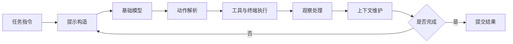
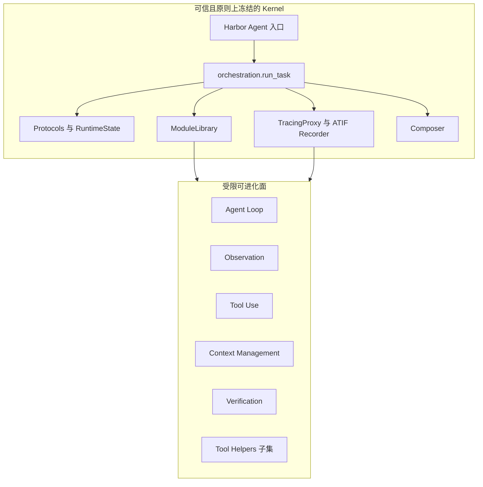
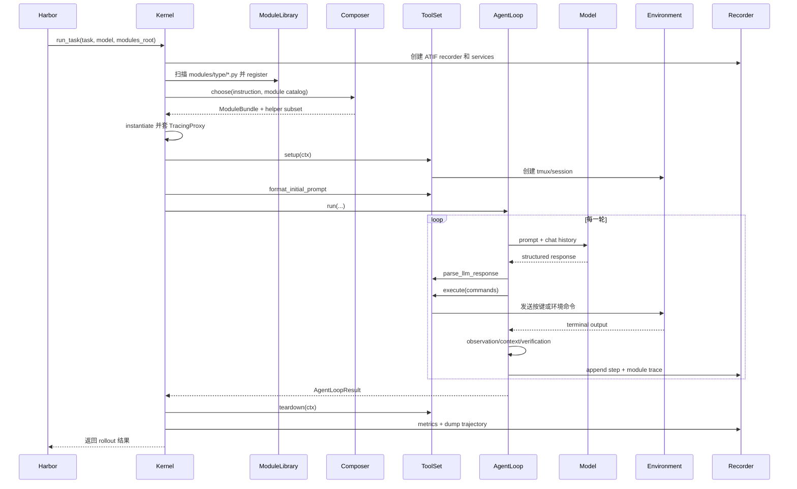
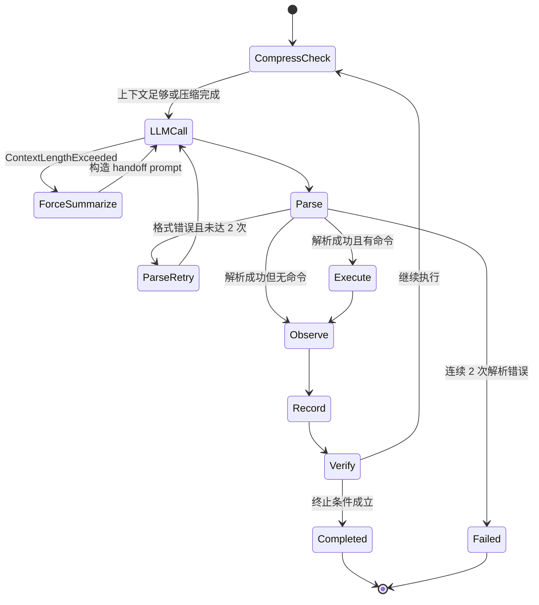
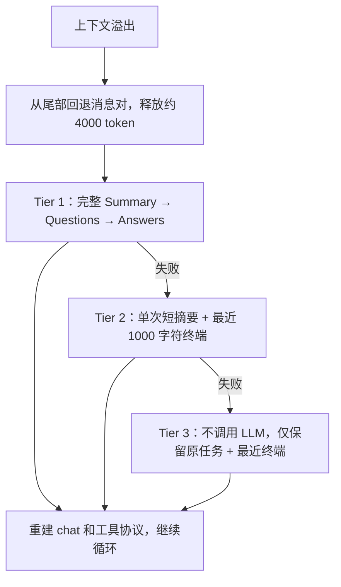
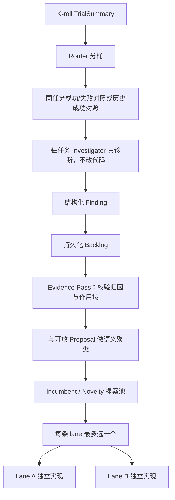
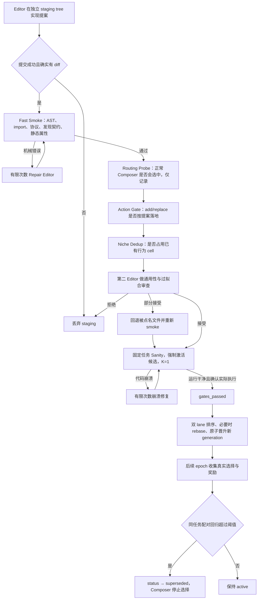
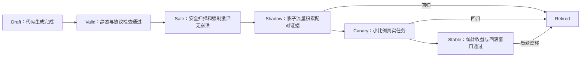

# ModularRSI：模块化智能体运行框架递归自改进的底层机制

> 本文不是对论文的逐段翻译，而是一次“论文方法—公开代码—发布代际”三层对照分析。论文回答为什么要做模块化 Harness RSI，代码回答它实际上怎样运行、怎样修改自己、怎样避免把坏代码加入代际，发布代际则展示系统最终学出了哪些具体机制。三者不完全等价，本文会明确区分论文声明、代码事实与工程推论。

## 0. 阅读结论：ModularRSI 真正改进的不是模型，而是模型外部的控制系统

ModularRSI 的核心研究对象不是大模型参数，而是 **agent harness（智能体运行框架）**：把一个基础模型接到终端、工具、上下文、完成判断和执行循环上的那层软件控制系统。

可以把一次智能体求解近似写成：

$$
\tau = H(M, x, e, \xi), \qquad r = V(\tau)
$$

其中：

- $M$ 是冻结的基础模型；
- $x$ 是任务指令；
- $e$ 是可执行环境；
- $\xi$ 是采样、环境时序等随机性；
- $H$ 是 Harness；
- $\tau$ 是完整交互轨迹；
- $V$ 是任务验证器，输出奖励 $r$。

传统模型训练优化的是 $M$。ModularRSI 固定 $M$，让系统依据执行轨迹修改 $H$：

$$
H_{g+1}
=
\operatorname{Promote}\!\left(H_g,\,\Delta H_g\right)
$$

这里把晋升写成二元操作，而不是普通加法：$\Delta H_g$ 往往是加入模块库的新变体及其元数据，并不等价于把一段代码直接相加到 $H_g$ 上。

但它不会让编辑智能体任意重写整个 Harness，而是将可进化面约束为五个协议稳定的模块，并通过同任务多次运行产生的成功/失败反差，把粗粒度任务奖励转化为局部代码修改：

$$
\left\{\left(\tau_i^k,r_i^k\right)\right\}_{k=1}^{K}
\longrightarrow \text{行为差异}
\longrightarrow \text{模块归因}
\longrightarrow \Delta H_m
\longrightarrow \text{验证与晋升}
$$

因此，这项工作的实质不是“Agent 自动把自己变聪明”这么宽泛，而是：

1. 冻结模型和内核协议，缩小自修改的自由度；
2. 用相同任务、相同模块组合下的多次 rollout 提供近似反事实证据；
3. 将反复出现的行为缺陷归因到一个受限模块；
4. 让代码修改智能体只在该模块内提出新变体；
5. 用静态检查、语义审查、强制激活运行和跨 epoch 配对统计逐步淘汰坏变体；
6. 保存多个行为不同的变体，由任务感知 Composer 在运行时选用。

它更接近一个带有在线程序搜索、行为归档、保守晋升和回滚机制的控制器优化系统，而不是通常意义上的权重级递归自我改进。

---

## 1. 分析范围、版本与证据层级

### 1.1 本文使用的三类材料

| 层级 | 材料 | 用途 |
|---|---|---|
| 论文 | `MODULARRSI - MODULAR AND GENERALIZABLE RECURSIVE HARNESS SELF-IMPROVEMENT.pdf`，26 页 | 方法定义、实验协议、指标与论文结论 |
| 既有讲解 | `ModularRSI——面向技术选型的深度解读.md` | 补充方法脉络、技术选型视角与案例解释 |
| 本地代码 | `/Users/machengqian/code/pythonProject/ModularRSI` | 追踪真实控制流、数据结构、验证门、已发布变体和实现边界 |

代码分析固定在本地提交：

```text
06fdcce711cb588f75630bc8ac847074ac80e13c
commit time: 2026-08-31T14:54:31+08:00
subject: update licence
```

GitHub 公共仓库为 [IQuestLab/ModularRSI](https://github.com/IQuestLab/ModularRSI)。本文涉及的代码行为均以本地上述提交为准，而不是假定未来主分支仍保持一致。

### 1.2 三种结论必须分开

本文采用以下标记逻辑：

- **论文事实**：论文明确描述或报告的数据；
- **代码事实**：在固定提交中可以追踪到的实际控制流和默认参数；
- **工程推论**：基于前两者得出的设计评价、风险判断或生产化建议。

这一区分很重要。例如论文将 Validation Gates 概括为 Program Check、Diff Review、Execution Validation；公开代码实际上还包含 action gate、niche dedup、候选变体强制激活、双 lane rebase 和跨 epoch confirm/rollback。反过来，代码中的 sanity gate 只保证候选没有把运行时弄崩，并不要求任务奖励提升。若把这两件事混写成“执行验证证明修改有效”，就会误读系统。

---

## 2. 为什么 Harness 值得单独进化

### 2.1 基础模型能力不等于智能体系统能力

一个强模型接入不同 Harness 后，任务成功率可以明显不同。原因在于长程可执行任务并不是一次问答，而是持续的闭环控制：



这个回路的任何一层都可能损失模型能力：

- 终端只返回增量片段，模型看不到早先的编译错误；
- 输出解析失败后，重试提示没有展示原始错误响应；
- 长历史压缩时丢掉任务约束或工具语法；
- 模型连续重复同一条命令但循环没有干预；
- 模型口头声称完成，Harness 未检查最近命令是否失败；
- 工具能力存在，但运行时 Composer 没有把相应变体选进来。

所以 Harness 不是“胶水代码”，而是模型外部的状态机、执行策略和信息瓶颈。ModularRSI 的实验也支持这一点：冻结模型后，只改变 Harness，TerminalBench 2.0 的准确率仍从 47.57 提升到 52.43。

### 2.2 Harness RSI 的三个困难

论文将问题归纳为三类，代码正好分别给出了约束机制。

| 困难 | 直观表现 | ModularRSI 的回答 |
|---|---|---|
| 数据泛化 | 直接在评测题上进化会记住题型或捷径 | 构造与下游 benchmark 实例隔离的 evolution pool，冻结后再评测 |
| 轨迹归因 | 一条失败轨迹混合了模型推理、随机性、任务难度和 Harness 缺陷 | 同任务、同 bundle 的 K 次 rollout；优先分析成功/失败对照 |
| 机制归因 | 即使知道“执行失败”，也不知道该改观察、工具还是循环 | 固定五类协议，只允许在一个 locked module 中修改 |

这三项不是相互独立的技巧，而是共同构成可识别性：数据隔离限制“学什么”，同任务对照限制“从什么证据学”，模块锁限制“改到哪里”。

---

## 3. 仓库究竟是什么：Harbor 上的研究型分支，而非独立微型框架

### 3.1 代码体量与核心边界

仓库的 Python 包名仍是 `harbor`，版本为 0.6.6，说明它是在 Harbor 任务运行与评测框架上实现的研究系统。仓库包含大量 Harbor agent adapter、环境和 benchmark 相关代码；ModularRSI 的核心集中在：

```text
src/harbor/agents/terminus_2_modular/
├── agent.py                 # Harbor Agent 兼容入口，尽量保持冻结
├── protocols.py             # 五模块协议和共享数据结构
├── library.py               # 模块发现、注册、实例化
├── kernel/orchestration.py  # 每个任务的装配与运行内核
├── composer/                # static / editor_static / llm_dynamic
├── modules/                 # 基线五模块
├── tracing.py               # 内核侧调用追踪
├── services.py              # 失败、统计、轨迹服务
└── self_evo/                # 在线进化、路由、提案、验证、晋升、回滚

generations/merged_active/
├── archive.json             # 发布变体、niche、代际和状态
├── PROVENANCE.json          # 发布来源与清理后的哈希信息
└── gen_0/modules/           # 已合并的可运行模块库
```

核心目录 `terminus_2_modular` 约有 1.8 万行 Python，其中 `self_evo/online_evo.py` 超过 3,200 行。这意味着论文中的三阶段框图，在实现中已经演化为一个带持久化账本、并发调度、候选组合、双路编辑、多个验证门和回滚逻辑的研究原型。

### 3.2 内核与可进化代码的信任边界

最关键的设计不是“五个文件夹”，而是 **内核拥有协议，模块只能实现协议**。



`RuntimeState` 是冻结 dataclass，向模块暴露任务 ID、代际 ID、指令、模型名、日志路径、`modules_root`、`staging_dir`、`trajectory_root`、`archive_path`、`locked_module_type` 和 `composer_scope`。可变的 tmux session 被放在 `SharedResources`，而聊天、观察状态通过协议参数显式传递。这种结构有三个作用：

1. **限制修改面**：编辑器不能通过修改协议偷偷扩大能力边界；
2. **提高归因性**：一次实验可以锁定只写某类模块；
3. **保住观测权**：`TracingProxy` 在内核侧包装模块，变体本身不能轻易绕过调用记录。

不过这不是严格安全沙箱。Python 模块仍在同一解释器加载，协议和冻结 dataclass 主要是工程约束，不是恶意代码隔离。真正的命令执行隔离依赖 Docker/E2B 等环境层。

---

## 4. 五模块协议：模块边界是怎样落到代码上的

### 4.1 协议总览

`protocols.py` 定义了五个运行时协议：

| 模块 | 核心接口 | 输入/输出 | 责任边界 |
|---|---|---|---|
| Observation | `capture(prev, ctx)` | `ObsState -> ObsResult, ObsState` | 从终端原始状态构造给模型看的观察 |
| ContextMgmt | `maybe_compress` / `force_summarize` | `Chat -> CompressResult` | 估算上下文余量、压缩历史、产生交接提示 |
| ToolSet | setup、提示格式、parse、execute、teardown | 文本响应与 `ToolCall/ToolResult` | 工具语法、终端生命周期与动作执行 |
| VerificationLoop | `should_terminate(state, ctx)` | `AgentLoopState -> bool, reason` | 判断是否结束，而不是执行任务验证器本身 |
| AgentLoop | `run(...)` | 协调其他四模块 | 驱动推理—动作—观察主循环 |

模块组合由 `ModuleBundle` 表示。五类模块每类选择一个 `ModuleSpec`；`tool_helper` 则是例外，它是“可同时选多个”的动作集合，通过 `tools.params.helpers` 注入，而不是 Bundle 的第六个单选槽。

### 4.2 为什么 Agent Loop 是协调器而不是普通同级模块

Agent Loop 的接口同时拿到 observation、context、tools、verification、chat 和 ctx。它控制调用时序，其他模块只处理局部转换。因此五模块并不对称：Agent Loop 相当于控制平面，其余四个更像数据面策略。

这一点解释了实验中 Agent Loop 单模块进化收益较高：它能改变何时询问模型、何时执行、如何处理解析错误、何时打断重复、何时向完成判断传状态。其作用域横跨整个闭环，虽然接口仍受限，但杠杆最大。

### 4.3 Task Completion Detection 在代码里叫 Verification，但不是 benchmark verifier

必须避免概念混淆：

- `VerificationLoop` 判断 agent 是否应该停止交互；
- Harbor 的 task evaluator 在 rollout 结束后判断任务是否真的成功，并产生 reward。

基线 `BaselineVerification` 只读取 `consecutive_complete_signals`，默认要求模型连续两轮声明 `task_complete=True`。它不运行测试，也不检查最终产物。最终正确性仍由任务专用 evaluator 决定。

这也是自进化能获得失败信号的原因：内部完成判断可能放行，但外部 evaluator 仍给 0 分，轨迹分析随后才能把“过早结束”归因给 verification 或 agent loop。

---

## 5. 一次普通求解到底怎样执行

### 5.1 内核装配顺序

`kernel/orchestration.py` 的真实执行顺序可概括为：



Bundle 会被写入 `trajectory.agent.extra.bundle`，每个模块调用摘要会被写入 `module_trace`。这不是单纯为了可观测性；后续跨 epoch confirm 依赖“哪次 rollout 实际用了哪个变体”来做同任务配对比较。如果只记录代际而不记录实际 bundle，动态 Composer 场景下就无法归因。

### 5.2 ModuleLibrary 的发现机制

每个变体文件定义 `register(library)`，注册：

- type；
- name；
- factory；
- description；
- params schema；
- niche 行为描述。

`ModuleLibrary` 有两种加载方式：

1. **package mode**：从已安装包导入基线模块；
2. **path mode**：从某个 `gen_N/modules/` 用唯一 synthetic module name 加载。

路径加载使多个代际能在同一进程中被测试，而不污染已安装包的模块名。单个模块导入或注册失败只会告警并跳过，不会让整个扫描立即崩溃；真正的完整性由后续 smoke test 兜底。

### 5.3 基线 Agent Loop 的状态机

基线循环不是简单的 `while not done`，而是包含主动压缩、溢出恢复、解析失败计数、命令执行、两阶段完成确认和轨迹写入：



循环为子类保留了 `_pre_llm_prompt`、`_shape_observation`、`_should_continue` 等 hook。进化变体因此可以只改变某一个行为点，而不复制整个协调器的全部逻辑。这种“稳定模板 + 小 hook”比让编辑器任意重写大循环更利于保留已有行为，也降低 diff review 难度。

### 5.4 上下文压缩不是摘要一句话，而是三段 QA 交接

基线 `ContextMgmt` 在剩余 token 低于默认 8,000 时触发三段式压缩：

1. Summary 子调用：从完整历史提取综合摘要；
2. Questions 子调用：结合原任务、摘要和终端屏幕提出继续执行必须澄清的问题；
3. Answers 子调用：重新查看历史，逐项回答这些问题。

随后聊天历史被重建，handoff prompt 带着答案和继续执行指令进入下一轮。这样做的思想不是单纯“缩短文本”，而是通过问题生成强迫系统检查摘要是否遗漏继续求解所需的隐状态。

遇到真正的 context overflow 时还有三级降级：



值得注意的是，压缩完成后循环需要重新建立活动工具协议，否则摘要后的模型可能失去 JSON/XML 动作语法约束。这体现了 Harness 中“任务语义记忆”和“通信协议记忆”是两种不同信息。

---

## 6. Task-Aware Composer：如何从不断增长的函数库中选出当前 Harness

### 6.1 不是把所有变体都加载进一个超级 Agent

自进化会持续增加变体。如果每次把所有行为叠加到一个循环中，系统会出现：

- prompt 变长；
- 多个变体重复干预同一个行为；
- 某个特化启发式污染无关任务；
- 无法判断收益来自哪个实现。

所以 `LLMComposer` 每个任务只选择五类模块各一个实现，同时为 tool helpers 选择一个子集。

### 6.2 候选进入 Composer 前经过四层过滤


具体规则包括：

- `editor_file_tools`、`passthrough`、`combined_robust` 被硬编码为不向 solver 提供；
- `archive.json` 中 `superseded` 或 `excluded` 的条目即使文件仍在，也不会进入候选；
- 声明了 niche 的变体按行为 cell 去重，控制 Composer 上下文规模；
- `active_bundle.json` 可将某类型固定为 lineage 的基础；
- locked scope 下只有被锁类型可以在多个变体间选择，其他类型回到默认，以保持单模块实验的可归因性；
- serial lineage 使用 `composer_scope=all`，否则继承来的其他模块变体会存在于文件树却永远不可达。

### 6.3 helper 为什么采用“默认全给，只允许排除”

五类模块是 pick-one，helper 是 pick-many。实现默认把所有活跃 helper 给 agent，再允许 Composer 明确排除无关 helper。失败时不排除任何 helper。

这是一个有方向性的 fail-open 策略：误加一个从未调用的命令通常成本很低，误删一个关键编辑工具会直接损失能力。代码注释还记录了真实故障：某次 Composer 在启用 reasoning 时单次分类超过 900 秒，120 秒超时导致大量任务静默回退基线；关闭 thinking 后约 1.8 秒。由此可见，Composer 本身是 Harness 可达性的单点风险——变体写得再好，选不到就没有实际效果。

### 6.4 Composer 不使用在线 reward 排序

公开实现中的任务选择提示只看到：

- 当前任务前 2,000 字符；
- 变体名称和自然语言 description；
- 默认实现。

它没有直接读取 held-out fitness，也不维护一个监督学习路由器。因此 Composer 的判断质量高度依赖 description 是否准确，routing probe 只记录候选在正常路由下是否会被选中，并不作为晋升硬门。这是当前系统从“发现好函数”到“稳定调用好函数”之间最明显的薄弱环节之一。

---

## 7. 自进化输入：为什么必须是同任务、同 Bundle 的 K 次运行

### 7.1 论文中的三分法

对每个任务 $x_i$ 运行 $K$ 次，得到：

$$
\left\{\left(\tau_i^k,r_i^k\right)\right\}_{k=1}^{K},
\qquad r_i^k\in\{0,1\}
$$

论文按奖励分成：

$$
G_i =
\begin{cases}
\text{Positive}, & \displaystyle\sum_{k=1}^{K} r_i^k=K, \\
\text{Contrastive}, & \displaystyle 0<\sum_{k=1}^{K} r_i^k<K, \\
\text{Negative}, & \displaystyle\sum_{k=1}^{K} r_i^k=0.
\end{cases}
$$

其中 Contrastive 最有价值：任务和 Harness 相同，一个成功一个失败，差异更可能暴露导致结果分叉的执行行为，而不是任务本身的静态难度。

### 7.2 代码把三分法扩展为五类路由

公开代码的 `router.py` 进一步区分：

| Bucket | 条件 | 后续动作 |
|---|---|---|
| `all_pass_efficient` | 有效 rollout 全成功且不浪费 | 作为回归保护 anchor |
| `all_pass_wasteful` | 全成功，但中位步数过高或重复命令比例高 | anchor；在无正确性缺陷时可进入效率分析 |
| `mixed` | 同一窗口同时有成功和真实失败 | 直接构造 same-task 对照 |
| `fixable_fail` | 当前全失败，但历史成功过或尚未耗尽尝试 | 从历史找成功轨迹，否则单边诊断 |
| `stuck_fail` | 多次反思无进展或处于 cooldown | 暂停诊断，节省预算，冷却后重开窗口 |

`reward=None` 被视为基础设施错误，不当作任务失败。这一小点非常关键：如果把 endpoint、Docker 或 E2B 故障算作失败，编辑器会尝试通过修改 Harness 修复一个根本不在 Harness 内的问题。

### 7.3 K 次 rollout 必须复用同一个 bundle

当前实现对每个任务：

1. 第一次用动态 Composer 选择 bundle；
2. 将该 bundle 冻结到私有快照；
3. 其余 K-1 次用 static 方式复用同一 bundle；
4. 不同任务可以并发，同一任务的 K 次默认顺序执行，以避免 K 倍沙箱峰值。

若 K 次各自重新 compose，那么成功/失败差异可能只是使用了不同 observation 或 agent loop，无法作为同一 Harness 的对照证据。这个实现细节比论文中“同任务运行 K 次”更严格，也是因果归因能成立的必要条件。

### 7.4 对照证据仍不是严格因果实验

即便任务与 Bundle 相同，模型采样、工具时序和环境噪声仍会变化。因此 ModularRSI 获得的是 **更强的诊断线索**，不是形式化因果识别。系统通过两种方式进一步抑制偶然性：

- 跨任务聚合同类 finding，优先支持任务数更多、窗口更多的提案；
- 让候选先通过通用性审查，再在后续 epoch 用实际选择记录做配对回滚。

---

## 8. 从轨迹到修改提案：不是“一次反思直接改代码”

公开代码将论文中的分析—修改阶段拆成了更细的证据流水线：



### 8.1 Investigator 与 Implementer 分离

每个任务的调查器读取轨迹、终端输出和模块信息，产出“缺陷—证据—归因—建议”，但在 throwaway staging 中不直接形成正式变更。这样避免单个失败任务立即驱动生产模块修改。

### 8.2 Evidence Pass 做什么

Finding 进入 evidence pass 后，路由器需要回答：

- 它是否真的属于当前 locked module；
- 应修复现有 incumbent，还是新增 novelty；
- 目标变体是什么；
- 建议的 behavioral delta 和 causal hypothesis 是什么；
- 若原变体已经退休，其 successor 是否已经覆盖该缺陷；
- 与已有 open proposal 是否是同一个 intervention。

语义相同的 finding 会链接到同一 proposal，不同 intervention 即使修改同一文件也不会合并。代码还为 novelty 和各 incumbent target 分别加细粒度锁：昂贵的 LLM 路由可以并发，只有“比较并创建提案”这一小段串行，避免并发产生重复提案。

### 8.3 Portfolio 不是简单按票数最大选一个

提案分为两条搜索 lane：

- **incumbent**：修复或替换现有变体；
- **novelty**：引入新的行为机制。

每条 lane 最多选一个，默认最多两项并行。排序键依次考虑：

1. 尝试次数更少；
2. 等待更久；
3. 支持任务更多；
4. 出现在更多窗口；
5. 稳定哈希打破平局。

这是一种带饥饿保护的 FIFO/证据混合策略，而不是只追逐当前最高票。它防止一个频繁出现的 incumbent 问题永久挤压罕见但可能重要的 novelty。

### 8.4 Evolution History 的代码化实现

论文说每个函数保存 Evolution History。代码里对应的不只是文本历史，还包括：

- `archive.json`：name、type、niche、parent、born_gen、status、supersession；
- `editor_memory`：尝试过什么、是否晋升、是否回滚；
- proposal/backlog ledger：finding 与提案的支持关系；
- router ledger：任务是否成功过、被反思次数、无进展次数、cooldown；
- generation tree：每次晋升后的不可变模块快照；
- evolution log 和 progress：恢复中断、保持固定任务顺序。

因此“避免进化振荡”不是只把历史塞进 prompt，而是把选择、晋升、退役和禁忌状态持久化成可查询结构。

---

## 9. 候选修改怎样通过验证、晋升和回滚

### 9.1 验证链的完整实现

论文给出三道门：Program Check、Diff Review、Execution Validation。公开代码的实际链条更长：



### 9.2 Program Check 检查的是结构完整性

`run_fast_smoke` 覆盖的目标包括：

- Python AST/编译是否有效；
- 文件能否隔离导入；
- `register(library)` 是否成功；
- 模块是否能被自动发现；
- factory 是否能实例化；
- 实现是否满足预期方法与协议形状；
- Bundle 配置和默认模块是否自洽；
- 常见的 `self` 属性遗漏等静态问题。

失败后不是立即淘汰，系统会把失败详情和 diff 交给 repair editor，默认最多修两次。这种区分很合理：一个语法 typo 不能说明提案思想无效，但无限修复会让门失去边界，所以修复预算必须有限。

### 9.3 Action Gate 和 Niche Gate 分别防两种漂移

Action Gate 防的是 **实现意图漂移**：路由说新增一个变体，编辑器却去改 incumbent；路由说替换旧变体，结果只是继续堆逻辑且没有正确声明 supersession。

Niche Gate 防的是 **行为模式坍缩**：新变体声明的行为描述与已有 active 变体落在同一个 niche cell，却没有说明替代关系。它不是用性能选精英的完整 MAP-Elites，而是借用 behavior descriptor 的思想控制重复和候选规模。

### 9.4 Diff Review 是 LLM 语义门，不读取 reward

第二个代码修改智能体重新阅读轨迹和 diff，判断：

- 是否硬编码了当前任务的文件名、答案、阈值或偶然输出；
- 修改是否真的实现声称的机制；
- 是否破坏模块职责或把过多策略混在一起；
- 是否应全部拒绝、全部接受，或只撤销部分文件。

它不读取候选在下游评测中的 reward，以降低评测泄漏。但这仍然是模型判断，不是形式化证明；reviewer 与 implementer 若共享相同盲点，仍可能一起接受过拟合逻辑。

### 9.5 Sanity Gate 只证明“能跑且跑到了”，不证明“更好”

这是理解代码的关键点。

Sanity 会在固定少量任务上将候选变体写入一个私有强制激活源，K=1 运行，并从 bundle 与 `module_trace` 核实：

- 候选确实被选中；
- 候选方法确实被调用；
- 没有模块导入、协议或运行时崩溃；
- infra timeout 与任务失败不会被误判为实现崩溃。

但源码明确指出：**task failure 和 reward 不是这道 gate 的拒绝条件**。`parent_mean_reward` 只记日志，不参与晋升。因此：

$$
\text{Sanity Passed}
\nRightarrow
\Delta\!\left(\text{task performance}\right)>0
$$

它只意味着：

$$
\text{Loadable} \land \text{Executable} \land \text{Activated}
$$

这么设计可以避免用极少数 sanity 题做高方差性能决策，也避免反复消耗昂贵的专用奖励 battery；代价是短期 archive 中允许存在性能中性甚至有害的 active 变体。

### 9.6 性能回滚来自后续 epoch 的“免费信号”

每次正常 rollout 已经记录 task、bundle 和 reward。`confirm.py` 对候选变体和 baseline 只比较 **两者都实际运行过的相同任务**：

先定义变体 $v$ 在任务 $t$ 上所有有效 rollout 的平均通过率：

$$
\bar r_{t,v}
=
\frac{1}{n_{t,v}}
\sum_{j=1}^{n_{t,v}}
\mathbf{1}\!\left[r_{t,v}^{(j)}\ge 1\right].
$$

再只取候选变体 $v$ 与基线 $b$ 都实际运行过的共享任务集合 $T_s$，计算：

$$
\Delta_v
=
\frac{1}{\lvert T_s\rvert}
\sum_{t\in T_s}
\left(\bar r_{t,v}-\bar r_{t,b}\right).
$$

其中 $n_{t,v}$ 是变体 $v$ 在任务 $t$ 上的有效 rollout 数量；基础设施错误对应的 `reward=None` 不进入平均。默认至少需要 3 个共享任务，且 $\Delta_v<-0.34$ 才把变体标记为 `superseded`。helper 则比较同任务下“在手”与“不在手”的 pass rate。

这种配对比直接比较全局 pass rate 更公平，因为 Composer 可能主要把新变体分配给难题。但它仍有局限：

- 共享任务可能太少，回滚长期不触发；
- 其他模块和代际状态仍可能变化，不能完全消除混杂；
- 0.34 的宽松阈值只擅长捕捉明显回归，不擅长区分小幅收益；
- helper 的“存在/缺席”并非随机分配，路由选择仍引入偏差。

### 9.7 双 lane 晋升为什么需要 rebase

incumbent 和 novelty 两个候选都从同一父代独立编辑。如果都通过门，不能简单把两个目录覆盖合并。系统先晋升一条，再将第二条 rebase 到新父代，重跑相关 gate，避免：

- 第二条覆盖第一条新增文件；
- 两条同时修改注册或相同 hook 时产生静默冲突；
- niche 检查仍以旧父代为基准，接受重复 cell；
- archive lineage 错记 parent。

代际通过 staging copy 和原子 promotion 保持不可变；这让每条轨迹都能回指实际代码快照，也是可复现实验所需的最低条件。

---

## 10. 公开发布代际里到底进化出了什么

`generations/merged_active/archive.json` 登记 20 个实现：19 个 active，1 个 excluded。按类型为：

| 类型 | 数量 | 主要条目 |
|---|---:|---|
| agent_loop | 3 | baseline、parse_error_recovery、planning_with_guard |
| observation | 2 | baseline、terminal_scrollback |
| context_mgmt | 2 | baseline、passthrough |
| tools | 5 | baseline、tmux_xml、bypass_helpers、combined_robust、editor_file_tools |
| verification | 2 | baseline、margin_gated |
| tool_helper | 6 | read、write、edit、edit_block、grep、glob |

发布 Composer 还会隔离 `passthrough`、`combined_robust` 和 `editor_file_tools`，所以 archive 中 active 不等于 solver 可选。

### 10.1 `planning_with_guard`：把长程执行变成带护栏的局部计划控制

这个 Agent Loop 变体加入：

- 从任务中的编号、项目符号和要求标记抽取 checklist；
- 每轮注入 pending requirement；
- 检测重复命令，先提醒、再阻断；
- 对只读检查、命令失败、后台进程未停止等状态注入提示；
- 空完成防护和文件写入计数；
- pending 清空后，连续完成信号可强制终止。

它解决的是 baseline 只会被动循环、缺乏任务级进度状态的问题。其机制相当于给模型外置了一个粗粒度 task monitor：

$$
S_{t+1}=f\!\left(S_t,a_t,o_t,C_{\mathrm{pending}}\right)
$$

其中 $C_{\mathrm{pending}}$ 是 Harness 自己维护的要求集合，而不是完全相信模型在自然语言 plan 中记住进度。

但它也带来启发式风险：要求抽取可能把说明文字误当硬约束，或漏掉隐式验收条件；重复命令有时是合理轮询；强制终止依赖 checklist 已正确清空。代码中还存在一个 `return False` 后的重复不可达分支，虽不影响主行为，却说明自进化产物仍需要常规代码质量治理。

### 10.2 `parse_error_recovery`：思路正确，但默认阈值与基线停止条件冲突

该变体会保存模型的原始错误响应，在重试提示中展示，并在连续解析错误达到默认 3 次后切换到严格 JSON/XML 模板。

然而基线 Agent Loop 在连续 **2 次** parse error 后已经返回失败。该变体只覆盖 `_build_parse_error_prompt`，没有放宽主循环的停止阈值。因此默认 `max_parse_error_escalation=3` 在当前继承关系下不可达：

```text
第 1 次错误 → 普通增强重试
第 2 次错误 → 构造普通增强重试，但主循环随即终止
第 3 次错误 → 永远到不了
```

这不是对整体方法的否定，而是非常有代表性的跨 hook 契约问题：局部模块描述声称有三次后升级，但真正的生命周期由父类另一个计数器控制。它说明仅靠文件级 diff review 容易漏掉跨方法状态机不变量，生产化测试应加入“变体声明的关键分支必须可达”的行为测试。

### 10.3 `terminal_scrollback`：用更多可见性换取 token 与噪声成本

基线 Observation 只调用 `get_incremental_output()`，默认把单次观察限制在 10KB。发布变体改为：

1. 读取 pane log 的尾部，最大读取 `2 * max_bytes`；
2. 合并尚未 flush 到日志的 incremental delta；
3. pane log 不可用时，在实例中累计历史；
4. 无新输出时只回放 8KB tail 并标记 stale；
5. 根据末行 prompt 正则标记 shell idle/busy；
6. 连续 busy 无输出时提示考虑 Ctrl+C；
7. 默认输出上限增到 200KB。

它针对的是终端 Agent 的“观察失忆”：模型执行 `ls`、`cat`、build 后，下一轮只看到几十字节新输出，已经不知道前面发生了什么。

但“FULL history”是语义标签，不是无限完整历史。实现读取 pane log 尾部并经过 200KB 截断，fallback 内存也限制在 400KB。因此更准确的理解是“大容量最近 scrollback”。其代价包括：

- 大量重复历史进入 prompt；
- 200KB 可能显著增加 token、延迟和上下文压力；
- shell prompt 正则只覆盖常见 `$ # %` 结尾，复杂主题或 REPL 可能误判；
- busy/stale 启发式可能把长计算误报为挂起。

论文表 5 中 Observation 单模块将平均步数从 34.70 降到 22.50，与“减少盲目重复”一致，但表格不能证明收益全部来自该公开变体，也不能说明 token 成本同步下降。

### 10.4 `margin_gated`：一个明显任务特化的完成判断器

它在连续完成信号之外，还检查最近命令、失败字样和可选的成功证据，并从 observation 中抽取 `Speedup: 11.86x`、`11.86x faster` 甚至任意 `11.86x`。若发现的 speedup 低于默认 15x，就拒绝结束。

这个变体适合性能优化题，体现了函数库 + task-aware composition 的价值：特化行为不应写进全局 baseline，而应只在相关任务被选用。

边界也很清楚：

- 若完全没找到 speedup，代码会放行，而不是拒绝；
- 最宽泛正则 `([0-9]+)x` 可能匹配与性能无关的倍数；
- 阈值 15x 并非从任务要求动态解析；
- `str(last_obs)` 对 dataclass 的字符串表示包含字段包装，虽通常能找到文本，但不是最精确的数据访问；
- 这是 benchmark-like specialization，错误路由到普通任务会造成不必要循环。

### 10.5 Tool Helpers：把常用文件操作从脆弱 shell 转为显式动作

发布库增加 `read_file`、`write_file`、`edit_file`、`edit_block`、`grep_search`、`glob_files`。它们由 Tools 模块截获命令 token 后在 sandbox 环境执行，使模型不必每次正确拼接 heredoc、sed 或复杂转义。

这是很典型的 Harness 增益：不提高模型的代码知识，只降低动作编码错误率。但代码也暴露了实现与描述的偏差：`write_file` 和 `edit_file` 的说明声称“atomic”，实际是直接 `open(..., 'w')` 覆写，没有临时文件 + `os.replace`。若执行中断，仍可能留下部分文件。`grep_search` 虽最终截断输出，但 `grep -m 50` 是每文件最多 50 个匹配，大目录仍可能先产生大量 stdout 后再被裁剪。

### 10.6 被隔离的 `combined_robust` 是失败知识，而不是垃圾文件

该工具变体在 held-out 运行中被发现会阻止合法 heredoc，而声称的 helper bypass 因错误分支嵌套不可达。发布版没有删除文件，而是在 Composer 中 quarantine，并在 archive 中保留 lineage。

这样做有两个意义：

- 防止未来编辑器“重新发明”同一种失败方案；
- 保留可审计的进化谱系，而不是只展示幸存者。

真正成熟的自改进系统不应只保存成功基因，还应保存结构化负面知识。

---

## 11. 论文实验结果应该怎样读

### 11.1 数据与评测隔离

论文构造 2,000 个可执行 evolution tasks：1,000 个 terminal 类，1,000 个 SWE 类，并声称通过来源构建、可执行验证、人工检查和语义相似度过滤与下游 benchmark 实例隔离。主实验因成本只从两类各抽 120 个，运行 3 epochs。

下游评测使用：

- TerminalBench 2.0：89 个长程终端任务；
- SWE-Bench Verified：500 个真实仓库软件工程任务。

这比直接在 benchmark 上进化更能支持“机制泛化”主张，但不能完全排除领域级相似性：任务类别本来就参考 terminal/SWE 领域分布，学到的机制也可能是面向这类执行任务的领域通用机制，而非所有 Agent 场景的普适机制。

### 11.2 四个指标含义不同

设每任务独立运行三次：

- **Acc**：所有 rollout 的平均成功率；
- **Pass@3**：三次至少一次成功，衡量上限/可解性；
- **Pass3**：三次全部成功，衡量稳定性；
- **StepNum**：每条 rollout 的平均交互步数。

Pass@3 上升但 Pass3 不升，可能只是偶尔成功；Pass3 上升更能说明 Harness 降低了随机失败。TerminalBench 的 Pass3 从 30.34 提升到 35.96，是比单看 Acc 更有系统意义的结果。

### 11.3 跨域与跨模型结果

论文表 2 报告：

| Evolution set | SWE-Bench Verified Acc | TerminalBench 2.0 Acc |
|---|---:|---:|
| 不进化 | 73.40 | 47.57 |
| TB-related | 75.80（跨域） | 52.43（同域） |
| SWE-related | 76.45（同域） | 49.40（跨域） |

冻结同一个已进化 Harness 后更换推理模型，TerminalBench 2.0 Acc 也提升：

| 模型 | Baseline | ModularRSI |
|---|---:|---:|
| GLM-5.2 | 59.55 | 61.80 |
| MiniMax-2.5 | 41.57 | 44.94 |
| DeepSeek-V4-Flash | 47.57 | 52.43 |

这支持“至少部分改进位于模型外控制机制”的解释。但三种模型的绝对基线差异很大，收益幅度也不同，说明 Harness 并没有消除模型行为差异。

### 11.4 为什么模块化优于 joint/non-modular 是最关键的消融

论文表 4：

| 方法 | Acc | Pass@3 | Pass3 | StepNum |
|---|---:|---:|---:|---:|
| Baseline | 47.57 | 58.43 | 30.34 | 34.70 |
| Non-modular Evolution | 46.44 | 64.04 | 24.72 | 29.03 |
| Joint All-Module Evolution | 44.19 | 61.80 | 24.72 | 44.34 |
| ModularRSI | 52.43 | 65.17 | 35.96 | 35.57 |

Non-modular 的 Pass@3 反而上升、Pass3 明显下降，意味着系统可能变得更“冒险”：偶尔能解更多题，但一致性更差。Joint All-Module 同时降低 Acc 和稳定性，支持大修改空间会引入机制干扰的判断。

模块化的价值因此不只是代码整洁，而是把搜索空间从一个高维联合修改：

$$
\Delta H=(\Delta L,\Delta O,\Delta T,\Delta C,\Delta V)
$$

转化为若干局部搜索，再做集成：

$$
\left(\Delta L^*,\Delta O^*,\Delta T^*,\Delta C^*,\Delta V^*\right)
\xrightarrow{\operatorname{Integrate}}
\Delta H^*
$$

这里 $L,O,T,C,V$ 分别表示 Agent Loop、Observation、Tool Use、Context Management 和 Verification。

局部搜索牺牲了部分跨模块联合最优的可能性，却显著降低归因噪声和灾难性干扰。在有限轨迹预算下，这通常比直接搜索全组合更可行。

### 11.5 五个单模块都提升，但改善方向不同

| 单模块 | Acc | Pass@3 | Pass3 | StepNum |
|---|---:|---:|---:|---:|
| Context Management | 49.44 | 61.80 | 31.40 | 35.10 |
| Tool Use | 50.19 | 62.92 | 30.34 | 41.28 |
| Agent Loop | 50.56 | 64.04 | 34.83 | 40.40 |
| Observation Management | 49.81 | 65.17 | 33.70 | 22.50 |
| Task Completion Detection | 49.44 | 65.17 | 31.40 | 31.06 |
| 五模块集成 | 52.43 | 65.17 | 35.96 | 35.57 |

Tool Use 和 Agent Loop 提高成功率却增加平均步骤，Observation 显著减少步骤。最终集成不是每个指标逐项取最好值，说明模块间仍存在折中和相互作用；“独立进化”并不意味着“组合后完全独立”。

### 11.6 不要混用论文表 2 与表 6 的 baseline

表 2 的 TerminalBench baseline 是 47.57，使用 DeepSeek-V4-Flash-Preview 相关设置；表 6 在统一复现 AHE、Meta-Harness 的比较中使用 DeepSeek-V4-Flash-0731，baseline 是 61.79，ModularRSI 是 67.42。它们不是同一实验条件，不能拼成“47.57 到 67.42”的单一提升链。

### 11.7 论文自己承认没有独立隔离对比分析贡献

论文展示 contrastive pair 比例随 epoch 从 36.67% 降到 34.17%，并给案例说明，但没有一个移除对比分析、保留其他模块的专门消融。因此该趋势只能作为相关证据：也可能是任务分布、Composer 选择或其他进化改变了成功/失败混合比例，不能单独证明 contrastive analysis 导致性能提升。

---

## 12. 论文方法与公开代码：一致处、扩展处和张力

| 主题 | 论文描述 | 固定提交中的代码 | 技术含义 |
|---|---|---|---|
| 模块数 | 五个功能模块 | 五个协议 + 多选 tool_helper | helper 是代码实现对动作空间的额外扩展 |
| 对照采样 | 每任务 K 次，分 Positive/Contrastive/Negative | 固定同 bundle K-roll，扩展为五 bucket + infra_only | 代码的归因控制更严格 |
| 负例处理 | 历史成功配对，否则单边诊断 | fixable/stuck、cooldown、历史 pass lookup | 避免在不可达任务上持续烧预算 |
| 修改选择 | 跨任务 vote，高票优先 | finding→proposal 聚类，双 lane，带等待与证据排序 | 更强调搜索多样性和持久化 |
| Program Check | AST、import、协议等 | fast smoke + 有限 repair | 与论文一致且更工程化 |
| Diff Review | 检查任务特化和过拟合 | 二次 editor，可 partial accept | 代码能力更细 |
| Execution Validation | 从当前 batch 随机抽两题，运行异常则回滚 | 固定 sanity tasks，K=1，强制激活；只因代码崩溃拒绝 | 代码门不以 task reward 为成功标准 |
| 性能确认 | 论文强调只保留验证修改 | 后续 epoch 同任务 paired delta 才会回滚明显回归 | “验证”在代码里分成可执行性与迟到的有效性 |
| Function Merge | LLM 合并相似函数 | niche dedup、supersession、发布时人工/流程合并 | 公开实现不是任意语义代码融合 |
| Task-aware composition | 按任务选相关函数子集 | 五类 pick-one，helpers subset；description 驱动 | 更像模块路由而非自由函数组合 |
| Cross-module integration | 五路独立进化后额外 integration epoch | 仓库提供 merged_active 发布树与 composer_scope/pin 机制 | 论文完整实验流程未浓缩成单个一键 API |
| 全成功效率优化 | Positive 组分析冗余动作 | router 支持 wasteful/efficiency，但 `_maybe_reflect_inner` 在 pending 全成功时提前跳过 | 当前顶层控制流会使“全成功窗口纯效率进化”不可达 |

最后一行值得特别强调：`router.py` 明确支持 `all_pass_wasteful` 和 efficiency lens，但 `_maybe_reflect_inner` 在所有 pending trial 都成功时直接 `return triggered=False`。只有同一窗口还存在失败、且没有归因到正确性 culprit 时，效率 lens 才可能运行。这是论文叙事与当前顶层实现之间的真实张力，也说明复杂自进化流水线很容易出现“局部功能存在、全局路径不可达”。

---

## 13. 从工程角度评价这套设计

### 13.1 最有价值的设计

#### A. 将信用分配问题转化为软件架构问题

ModularRSI 没有试图从 0/1 reward 直接推断任意代码补丁，而是先设计稳定协议和模块边界。好的模块化在这里不是重构美学，而是统计归因工具：修改面越小，轨迹证据越容易指向具体机制。

#### B. 同任务同 bundle 的反差比单轨迹反思强得多

单条失败轨迹很容易诱导“为这道题打补丁”；成功/失败并排时，编辑器可以问：成功路径保留了什么观察、采取了什么恢复、何时停止，而失败路径在哪里分叉。这更接近可复用的行为机制。

#### C. 把多样性作为一等状态

niche、novelty lane、archive lineage 和 Composer 共同避免系统收敛成一个不断膨胀的万能循环。函数库式 Harness 允许互斥启发式共存，例如 margin gate 只服务性能优化题。

#### D. 晋升与回滚分层

廉价静态门先过滤结构错误，昂贵运行门只检查崩溃，长期真实 rollout 再提供回滚证据。这比每个候选都跑完整 benchmark 更节约，但仍保留了负反馈通道。

### 13.2 当前最脆弱的环节

#### A. Description-driven routing

Composer 主要依据自然语言 description 选模块。description 写得夸张、遗漏边界或与代码漂移，会导致错误路由。发布代际中“FULL history”“atomic write”等表述就已经比代码事实更强。

#### B. 局部 hook 与全局状态机不变量

`parse_error_recovery` 的第 3 次升级分支被父循环第 2 次终止挡住，是典型例子。模块协议只约束方法形状，没有自动验证语义可达性。

#### C. 晋升不等于收益

候选通过 gates 后即可 active，性能回滚需要至少三个共享任务且明显劣于 baseline。轻微有害、极少被选或只在特定任务有害的变体可能长期保留。

#### D. 同一个模型承担多重角色

Solver、investigator、router、implementer、reviewer 若使用相同模型族，可能共享偏差。角色分离不等于认知独立。生产系统应考虑 reviewer 异构化或加入确定性规则与专用测试。

#### E. 计算和工程成本高

每任务 K-roll、调查 LLM、证据聚类、双 lane 编辑、二次 review、sanity 和后续多 epoch 共同构成高成本闭环。它适合高复用、高价值 Harness，而不适合每个小 Agent 项目都在线运行。

### 13.3 它不是安全意义上的递归自我修改

可编辑范围虽然受 locked module 和 editor file tools 限制，但系统仍运行自动生成的 Python。Fast smoke 主要检查正确性，不是恶意代码审计。若用于真实生产，应再增加：

- 进化环境与生产凭证完全隔离；
- 禁网或域名 allowlist；
- 文件系统只读基线 + 独立 staging；
- 依赖与系统调用策略；
- 生成代码的 SAST、secret scan、许可扫描；
- 变体签名、审批和可撤销部署；
- runtime CPU、内存、token、命令时长预算；
- 不能由可进化模块修改的审计通道。

---

## 14. 怎样运行、阅读与扩展这个仓库

### 14.1 最小评估路径

仓库脚本提供：

```bash
bash scripts/self_evolve.sh evaluate \
  "$PWD/generations/merged_active/gen_0/modules" \
  fix-git
```

发布说明要求使用 `llm_dynamic` 才能选择已进化变体；`static` 是基线对照，因为发布树没有 `active_bundle.json` pin。默认环境为 Docker，也可配置 E2B。实际运行还需要模型 API、任务数据和相应环境依赖。

### 14.2 单模块进化入口

脚本的 `evolve <module>` 接受：

```text
observation | tools | context_mgmt | agent_loop | verification
```

默认训练 profile 关键参数包括：

- 3 epochs；
- 每 10 个任务触发一次 reflection；
- task concurrency 6；
- K-roll attempts 默认 3；
- max lanes 默认 2；
- solver 最大 200 turns；
- editor 最大 200 turns；
- solver timeout 3000 秒；
- gate repair 默认最多 2 次。

这些值不是理论常数，而是计算预算与失败恢复的工程取舍。

### 14.3 推荐的代码阅读顺序

若希望真正理解而不是只看 README，建议按控制依赖阅读：

1. `protocols.py`：先建立五模块边界和状态数据模型；
2. `kernel/orchestration.py`：理解一次任务如何装配；
3. `modules/agent_loop/baseline.py`：理解主状态机；
4. `library.py` 与 `composer/llm_dynamic.py`：理解变体怎样可达；
5. `self_evo/router.py` 与 `trajectory_analysis.py`：理解轨迹怎样变成证据；
6. `backlog.py`、`evidence_pass.py`、`proposals.py`、`portfolio.py`：理解提案累计；
7. `dual_implement.py`、`online_evo.py`、`two_lane.py`：理解编辑和验证；
8. `confirm.py`、`archive.py`：理解退役与回滚；
9. `generations/merged_active`：最后看系统实际产出了什么。

### 14.4 新增变体的正确方式

新增模块不需要修改 `library.py`，只需在对应目录增加文件并实现 `register(library)`。但一个合格变体至少应同时提供：

- 聚焦单一机制的实现；
- 准确、不过度承诺的 `DESCRIPTION`；
- 能区分行为的 `NICHE`；
- 明确参数 schema 和保守默认值；
- 针对关键分支的单元测试；
- 与父类生命周期一致的可达性测试；
- 失败时不破坏 baseline 的降级路径。

尤其不要只让 import/smoke 通过。对于 parse recovery、completion gate、repetition guard 这类状态机变体，应构造合成轨迹验证每个声明分支真的会触发。

### 14.5 生产化时建议把“晋升”拆成四级

当前研究实现可以进一步硬化为：



研究代码里的 `gates_passed` 更接近 Safe，而不是 Stable。把状态命名得更精确，可以避免团队误以为“进入 archive active 就已经被证明优于 baseline”。

---

## 15. 可复现性检查与本文发现的具体问题

本文对固定提交做了以下非侵入检查：

| 检查 | 结果 |
|---|---|
| Git 工作树 | 分析前无已跟踪改动；本文未修改 ModularRSI 源码 |
| 论文读取 | 使用 `pdfplumber` 提取 26 页全文，并渲染抽查方法图和结果页 |
| 上下文溢出单测 | `tests/unit/test_modular_context_overflow.py`，4 项全部通过 |
| 发布代际 fast smoke | `generations/merged_active/gen_0/modules` 通过 |
| archive 清点 | 20 个登记实现：19 active、1 excluded；Composer 另隔离 3 个非 solver 候选 |

代码审阅发现的高价值边界如下：

1. `parse_error_recovery` 默认第 3 次错误才严格升级，但父循环第 2 次就终止；严格升级默认不可达；
2. `write_file` / `edit_file` 的描述称原子写，代码实际直接覆盖；
3. `terminal_scrollback` 的 FULL history 受 200KB 输出和 400KB fallback 累计上限约束；
4. `margin_gated` 找不到 speedup 时放行，宽泛倍数正则可能误匹配；
5. `planning_with_guard` 存在返回语句后的不可达重复代码；
6. router 支持全成功但低效的分析，顶层 reflection 却在全成功窗口提前返回；
7. sanity gate 不以任务 reward 为晋升条件，性能有效性依赖迟到且宽松的 paired rollback；
8. routing probe 是观测项，不是门；候选可能可运行却在正常 Composer 下长期不可达；
9. `combined_robust` 已知回归但保留于 lineage，并由 Composer 显式隔离；这既说明机制有效，也说明 archive status 与实际可选集必须一起看。

这些问题不意味着实验结果无效；它们说明公开仓库已经是一个复杂、持续演化的研究代码库，不能仅根据模块名称或 docstring 推断实际行为。

---

## 16. 适用场景与不适用场景

### 16.1 适合采用 ModularRSI 思路的系统

- 有大量可执行任务和可靠 evaluator；
- 同一 Harness 会长期服务很多相似但不重复的任务；
- 基础模型冻结或更换成本高，希望优化模型外控制层；
- 可以承担 K-roll 和多阶段编辑成本；
- 失败轨迹中确实存在重复的机制性问题；
- Harness 已能划分稳定协议边界；
- 需要跨模型复用执行策略。

### 16.2 不适合直接照搬的系统

- 没有可执行验证器，reward 只能来自主观 LLM judge；
- 单次任务、没有重复使用价值；
- 环境不可复现，同任务多次运行差异主要来自外部漂移；
- 任务涉及高风险真实操作，无法先在隔离环境验证；
- Harness 很小，主要瓶颈其实是模型知识或推理能力；
- 无法承受多 rollout、编辑和审查 token 成本；
- 组织没有维护 archive、回滚、观测和安全边界的能力。

### 16.3 借鉴时不必全量复制

ModularRSI 最值得拆分复用的三个层次是：

1. **低成本层**：先做五类职责分离、轨迹记录和 bundle 可追踪；
2. **中成本层**：对失败任务做同任务多次运行与对比诊断，人工审批变更；
3. **高成本层**：再加入自动 proposal、双 lane 编辑、验证、动态 Composer 和跨 epoch 回滚。

很多团队直接从第 3 层开始，会先被基础设施复杂度击败。没有稳定 evaluator、协议和观测记录时，自动自改进只会把噪声自动化。

---

## 17. 最终判断

ModularRSI 最重要的贡献，不是证明 Agent 能无限递归地重写自己，而是给出了一套相对克制的 Harness 自改进范式：

> 用稳定内核约束可变模块，用同任务反差增强信用分配，用跨任务证据抵抗题目特化，用不可变代际和多级门控制代码风险，再用任务感知组合器保留多样化行为。

它说明 Agent 能力的提升并不只有训练更大的模型这一条路径。观察是否完整、上下文怎样交接、工具怎样编码、循环怎样恢复、完成怎样确认，这些外部机制都会系统性改变成功率与稳定性。

同时，代码也清楚显示了这一方向的困难：局部变体可能与父状态机冲突，说明可能强于实现，Composer 可能让好变体不可达，sanity 通过并不代表性能提高，LLM reviewer 也无法替代确定性测试。真正可靠的递归 Harness 自改进，核心不是“让模型自由修改更多代码”，而是建立更强的可识别性、可观测性、可回滚性和证据纪律。

从技术选型角度看，ModularRSI 已经是一份很有价值的研究原型和架构样板；从生产系统角度看，它仍需要更严格的行为测试、安全隔离、路由校准、统计晋升和人工治理，才能把“自动产生可运行变体”提升为“持续交付可证明更好的控制系统”。

---

## 附录 A：核心文件定位

| 主题 | 文件 |
|---|---|
| 五模块协议 | `src/harbor/agents/terminus_2_modular/protocols.py` |
| 模块自动发现 | `src/harbor/agents/terminus_2_modular/library.py` |
| 任务运行内核 | `src/harbor/agents/terminus_2_modular/kernel/orchestration.py` |
| 动态模块选择 | `src/harbor/agents/terminus_2_modular/composer/llm_dynamic.py` |
| 基线循环 | `src/harbor/agents/terminus_2_modular/modules/agent_loop/baseline.py` |
| 基线上下文管理 | `src/harbor/agents/terminus_2_modular/modules/context_mgmt/baseline.py` |
| 基线观察 | `src/harbor/agents/terminus_2_modular/modules/observation/baseline.py` |
| 基线完成判断 | `src/harbor/agents/terminus_2_modular/modules/verification/baseline.py` |
| 在线进化总控 | `src/harbor/agents/terminus_2_modular/self_evo/online_evo.py` |
| K-roll 路由 | `src/harbor/agents/terminus_2_modular/self_evo/router.py` |
| 轨迹分析 | `src/harbor/agents/terminus_2_modular/self_evo/trajectory_analysis.py` |
| Finding 证据聚合 | `src/harbor/agents/terminus_2_modular/self_evo/evidence_pass.py` |
| Proposal 组合 | `src/harbor/agents/terminus_2_modular/self_evo/portfolio.py` |
| 双 lane 晋升 | `src/harbor/agents/terminus_2_modular/self_evo/two_lane.py` |
| 静态/协议 smoke | `src/harbor/agents/terminus_2_modular/self_evo/smoke_tests.py` |
| 跨 epoch 回滚 | `src/harbor/agents/terminus_2_modular/self_evo/confirm.py` |
| 发布模块库 | `generations/merged_active/gen_0/modules/` |
| 发布谱系 | `generations/merged_active/archive.json` |

## 附录 B：术语表

| 术语 | 本文含义 |
|---|---|
| Harness | 包围基础模型的执行控制软件，包括循环、工具、观察、上下文与完成判断 |
| RSI | Recursive Self-Improvement；本文特指 Harness 依据自身运行经验修改下一代 Harness |
| Rollout / trajectory | 一次任务从开始到结束的完整模型—工具—环境交互 |
| Bundle | 某任务实际使用的五模块实现组合与 helper 子集 |
| Locked module | 当前实验唯一允许写入的模块类型 |
| Finding | 从一组轨迹中提炼的结构化行为缺陷证据 |
| Proposal | 聚合多个 finding 后形成的候选干预 |
| Niche | 描述变体行为特征的离散 cell，用于多样性和去重 |
| Generation | 一份不可变的模块目录快照 |
| Promotion | 候选通过结构/审查/运行门后成为新代际 |
| Superseded | 变体文件保留，但 Composer 不再选择 |
| Sanity gate | 验证候选能加载、能运行且确实被调用；不是收益证明 |
| Paired rollback | 在相同任务上比较候选与基线的实际 pass rate，明显回归时退役 |

## 附录 C：来源说明

1. 论文：`raw/sources/文章/模块化智能体运行框架自改进论文/MODULARRSI - MODULAR AND GENERALIZABLE RECURSIVE HARNESS SELF-IMPROVEMENT.pdf`。
2. 既有中文解读：`raw/sources/文章/模块化智能体运行框架自改进论文/ModularRSI——面向技术选型的深度解读.md`。
3. 代码仓库：[IQuestLab/ModularRSI](https://github.com/IQuestLab/ModularRSI)，本文固定分析提交 `06fdcce711cb588f75630bc8ac847074ac80e13c`。
4. 论文实验数字均来自论文表 2—6 和相关正文；表 2 与表 6 的模型设置不同，本文未将其混为同一组实验。
5. 所有“实现缺口”和“代码事实”均来自上述固定提交的本地源码审阅；未来版本可能已修复或改变。
