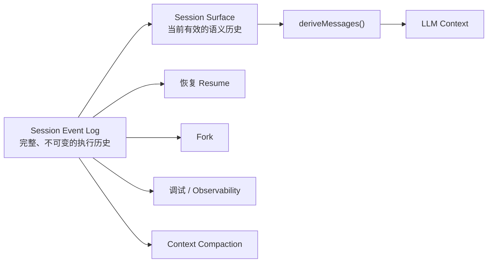
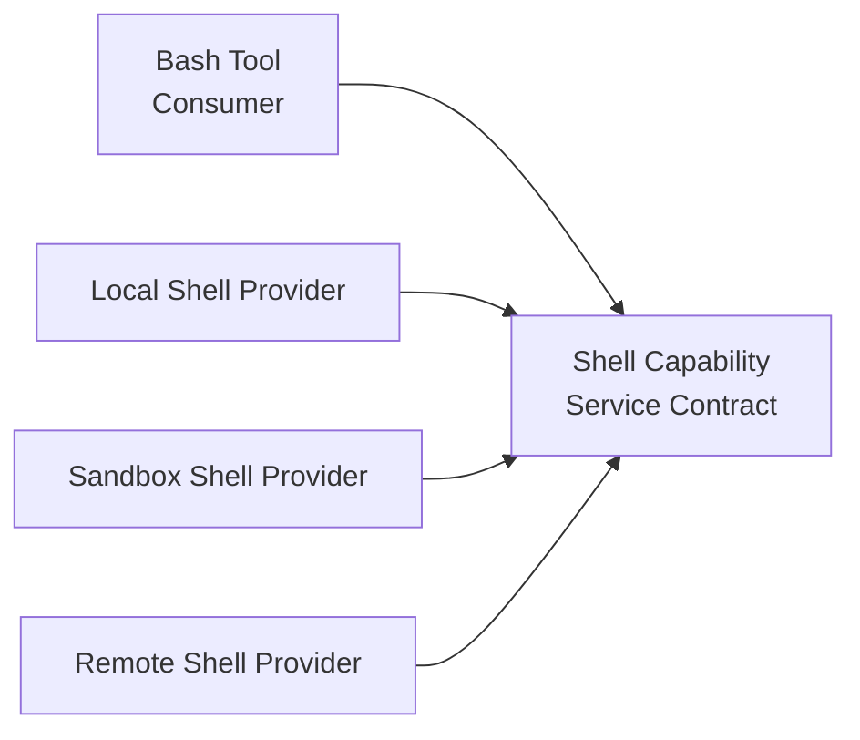
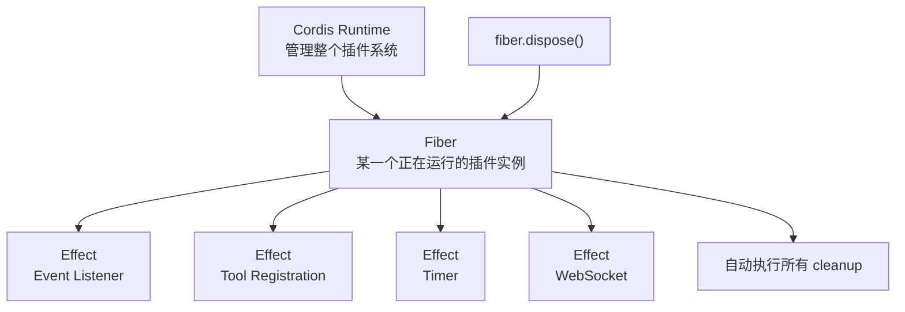
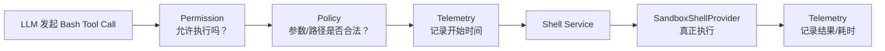

## 一. Session Event Sourcing - 对话事实来源

**第一部分：DeepSeek Harness 的 Session Event Sourcing——为什么它不把聊天记录当作 Agent 的真实状态**

理解 DeepSeek Harness 的 Session，首先要把我们平常对 Agent 会话的理解扔掉一点。很多 Agent 框架最开始都会维护一个 `messages` 数组，里面依次放 system、user、assistant、tool result。每进行一次模型调用，就往这个数组后面追加消息。短任务这么做非常自然，但一旦 Agent 开始执行长任务，会逐渐出现 context compression、memory、checkpoint、tool history、task state、resume 等机制，于是同一个 Agent 的“状态”会被复制到很多地方。messages 里有一份，summary 里有一份，memory 里有一份，任务状态对象里又有一份。如果其中某一份更新失败，或者压缩上下文时漏掉一个重要工具结果，你就会遇到一个非常麻烦的问题：**系统已经无法准确回答“这个 Agent 到底经历过什么”。**

DeepSeek Harness 在这一层采用的是非常接近数据库 Event Sourcing 的设计。它不把当前的 `messages` 当作唯一事实，而是维护一条只追加、不随意修改的 Session Event Log。Agent 运行过程中发生的事情，会被描述成一系列结构化事件，例如一次 turn 开始、一次 step 开始、收到用户消息、模型生成 assistant message、产生 tool call、工具返回结果、step 结束、turn 结束。也就是说，它记录的不是一个简单的“对话文本”，而是 Agent 整个生命周期中发生过的事件。

这两者差别非常大。假设 Agent 收到“帮我检查这个仓库的问题”，模型先读取一个 Java 文件，然后执行测试，再修改文件，再重新测试。在传统 messages 模型里，你看到的主要是“模型说了什么”和“工具返回了什么”。而在 Event Sourcing 模型中，系统还知道这是第几个 turn、第几个 step、什么时候开始请求模型、什么时候产生工具调用、什么时候工具执行结束、这一轮有没有正常结束。换句话说，Session 已经不只是 Conversation History，而更接近 **Agent Execution Log**。它是 Agent 整个执行过程的事实数据库。

这里真正关键的思想是：**不要直接保存“Agent 当前是什么状态”，而要保存“Agent 到目前为止发生过什么”，当前状态再由这些事件计算出来。** 这和数据库领域里的 Event Sourcing 很像。银行账户不一定只保存一个“余额 = 1000”，而可以保存“存入 2000、支付 500、支付 500”，余额只是这些事件投影之后的结果。DeepSeek Harness 的 Session 也是这个思路。模型当前应该看到什么、任务进行到哪里、上下文应该包含哪些内容，都可以从事件历史中构造出来。



这里又出现了 DeepSeek Harness 非常漂亮的一层设计：**Event Log 和模型真正看到的上下文不是一个东西。** Event Log 保存的是完整历史，但是模型没有必要看到所有历史。例如 `turn/start`、`step/end` 这种 Runtime 事件对系统非常重要，对 LLM 本身却没有意义。所以 DeepSeek Harness 在完整 Event Log 上面又维护了一个叫 Surface 的东西。你可以暂时把 Surface 理解成“当前仍然对模型有效的历史”。

这实际上解决了 Agent 系统里一个经常被混淆的问题：**真实发生过什么，和模型现在应该知道什么，是两回事。** 一个工具调用可能在三十分钟前执行过，它作为历史事实绝不能消失，因为以后调试、恢复任务或者分析失败原因时可能需要它；但它不一定值得继续占用模型的 context window。因此 DeepSeek Harness 不会因为压缩上下文就去破坏原始历史，而是改变 Surface。完整历史还在那里，只是当前 LLM 的“视野”发生了变化。

这就是为什么它的 Context Compaction 很有意思。假设前面已经积累了几十条事件，占用了大量 token。传统做法可能是把旧 messages 删除，然后生成一段 summary 替代。这么做以后，原始消息可能真的从当前状态里消失了。DeepSeek Harness 的思路则更像：原始事件全部保留，再生成一个新的 summary event，然后让这个新的 event 在 Surface 中“替代”一段旧事件。于是从模型视角看，原来的十几条消息被一段 summary 替代了；但从 Session Event Log 的角度看，那十几条事件仍然存在。

所以你可以把它理解成数据库里的两层结构。底层 Event Log 类似 WAL 或 append-only transaction log，记录事实；上面的 Surface 更像 materialized view，描述“当前有效状态”。最后 `deriveMessages()` 再根据这个 Surface 生成真正发给模型的 messages。这样一来，**完整历史、有效历史和模型上下文就被彻底解耦了。**

这个解耦对长任务尤其重要。比如 Agent 一开始分析了项目架构，中间进行了两次 context compression，后来执行到第 100 个 step 时发现某个假设有问题。如果系统只有经过多次压缩后的 messages，那么你可能已经无法知道早期模型到底看到了什么、调用过哪些工具。但有 Event Log，就可以重新追踪整个执行链。你甚至可以回答非常具体的问题：某个结论是在哪一步产生的，它基于哪个 tool result，这个 tool result 后来有没有被 summary 覆盖，当前模型还能不能看到这段信息。

这里还有一个很容易被忽略、但我认为非常专业的设计：**发生过的模型输出和正式进入上下文的模型输出也不是一回事。** 比如模型正在 stream 一个回答，输出到一半 API 失败了。这次生成行为确实发生过，所以从 Observability 的角度不能假装它不存在；但你也不能把这半句话当成一个正常的 assistant message 塞进下一轮上下文。DeepSeek Harness 因此会区分正式的 assistant message 和没有成功提交的 assistant attempt。这个区分本质上仍然延续了前面的原则：执行事实和模型语义状态必须分开。

当你理解这一点以后，再看 Crash Recovery 就非常自然了。假设 Agent 已经写入了 `turn/start`、`step/start`、`assistant/message`、`tool/call`，工具刚开始执行时进程突然崩了。传统 Agent 如果只定期保存 messages，恢复时很可能不知道最后这个 tool call 到底有没有执行，也不知道这一轮是不是已经结束。Event Log 则天然能告诉系统：这个 turn 开始了但没有对应的 `turn/end`，某个 step 开始了却没有结束，一个 tool call 没有对应的完整结果。这些都是可以通过事件结构判断出来的。

恢复逻辑因此不是“猜当前状态”，而是检查事件序列中的未闭合结构，然后补出一个明确的 interrupted 状态。例如某个 tool call 因 crash 没能正常完成，那么恢复机制可以把它记录成失败结果，再补上 `step/end` 和 `turn/end(interrupted)`。最重要的是，**恢复行为本身同样成为新的事件，而不是偷偷修改过去。** 过去发生过 crash 这个事实不会被擦掉。这一点和数据库 crash recovery 的哲学非常像：日志不是为了让历史看起来完美，而是为了让历史真实且可以恢复。

Event Log 本身还有一个工程细节值得注意，就是事件一旦进入 Session，就应该尽量具备不可变性。如果你 append 一个 JavaScript 对象进去，后面的代码还能继续修改这个对象，那么所谓“历史事实”就毫无意义。因此这类事件数据需要在进入日志时做 snapshot、序列化合法性检查以及冻结，避免后续代码通过引用修改过去的数据。从系统设计角度，这其实是在维护一个很重要的不变量：**已经提交的历史不能被未来代码偷偷改写。**

最后再看持久化，DeepSeek Harness 也没有把 Session 和“写 JSON 文件”绑定死。内存 Session 管的是事件语义，而 Persistence 是另外一层能力。Session 可以通过抽象的 persistence provider 把 event append 到具体后端，默认可以是 JSONL，但理论上完全可以换成其他存储。这里仍然遵循同一个思想：Session 决定“什么是一个合法事件以及事件之间有什么语义”，Persistence 决定“这些事件怎么可靠保存下来”。两层并不互相污染。

所以如果把整个设计压缩成一句比较底层的话，DeepSeek Harness 在 Session 这里实际上建立了三个不同的世界：

**Event Log 表示“真实发生过什么”，Surface 表示“当前哪些历史仍然语义有效”，Messages 表示“这一次模型具体应该看到什么”。**

这三个东西在很多普通 Agent 实现里往往都是一个 `messages` 数组承担，因此 Context Management、Memory、Resume、Compaction 越做越复杂以后，很容易互相污染。DeepSeek Harness 则从最底层就把它们分开了。

而这正是我认为这个设计很强的地方。它并不是单纯为了“聊天记录更可靠”，而是在为未来的长时间 Agent 建一个稳定的状态基础。之后无论做上下文压缩、任务恢复、Fork、Subagent、长期记忆还是轨迹分析，都可以建立在同一个事实源上，而不需要再创造另一套平行状态。

接下来我们继续第二个方面时，我也会保持这种形式，不再拆成大量短 bullet。第二个我建议讲 **Cordis + Capability Seam**，因为那个部分能解释 DeepSeek Harness 为什么连 Agent Loop、模型、工具、Sandbox、Context 这些核心东西都能真正做到可替换。


## 二. Capability Seam + Cordis

**第二部分：Capability Seam + Cordis——DeepSeek Harness 如何真正做到“Everything is a Plugin”**

DeepSeek Harness 最值得注意的一点，不是“支持插件”，而是它把 Harness 中原本最核心的东西都降格成了可替换能力，包括模型、工具、Session、Shell、Sandbox，甚至 Agent Loop 本身。

很多框架也有插件系统，但本质上仍然有一个不可替换的 `AgentExecutor`：循环怎么跑、什么时候调用模型、怎么执行工具，这些都写死在核心里，插件只能往外围挂能力。DeepSeek Harness 更激进，它把底层运行时交给 Cordis，真正的 Harness 是一棵由插件和 Service 组成的依赖图。因此这里的“Everything is a Plugin”并不是代码拆成很多 package，而是**没有一个业务意义上的固定 Agent Core 必须永远存在**。

这套结构能成立的核心是 Capability Seam。所谓 Seam，可以理解成系统刻意留下的一条“能力接缝”。DeepSeek 不允许上层模块直接依赖具体实现，比如 Bash Tool 不应该直接调用 Node 的 `child_process`，否则这个 Tool 从诞生那天起就绑定了本机环境。它会先定义一个 `shell` 能力接口，真正的本地 Shell、Docker Shell、远程 Sandbox Shell 都只是这个能力的 Provider，而 Bash Tool 只是 Consumer。于是 Bash Tool 调用的始终是 `ctx.shell.execute()`，它根本不知道命令究竟在哪里执行。这种设计的本质其实是依赖倒置，只不过 DeepSeek 把它从单个类的层面提升到了整个 Agent Runtime 的层面。



这时候真正重要的就不是接口本身，而是**谁负责决定当前 `ctx.shell` 到底是哪一个 Provider**，答案就是 Cordis Context。表面看 `ctx.shell`、`ctx.llm`、`ctx.tools` 像普通对象属性，实际上 Context 是带作用域的依赖解析环境。

不同 Context 可以继承父 Context 的能力，也可以隔离其中某个 Service。因此同一个 DeepSeek Harness 里完全可以同时存在 Agent A 使用本机 Shell，Agent B 使用隔离 Sandbox，而 B 创建的某个 Subagent 又使用另一个远程执行环境；上层工具代码完全不需要变化。这个点对 Multi-Agent 很重要，因为如果所有 Service 都是全局单例，那么一旦出现不同 Agent 拥有不同模型、权限、文件系统和 Sandbox，状态就会迅速互相污染。

Cordis 还不是传统意义上的“启动时依赖注入”。插件会声明自己需要哪些 Service，如果依赖不存在，它不会强行启动，而会保持等待状态；Provider 出现之后它才激活。更特别的是，这个依赖关系在系统运行期间仍然持续生效。如果一个 Shell Provider 被卸载，那么所有依赖 Shell 的插件也会跟着失活；新的 Shell Provider 出现以后，依赖方再重新加载。也就是说，Cordis 维护的不是一次性的对象装配，而是一张**活着的依赖图**。这就是为什么 DeepSeek Harness 可以真的在运行时替换能力，而不是只能“重启程序换配置”。

但动态卸载又会带来一个很危险的问题：插件启动时可能注册 Tool、Event Listener、Timer、Socket、子插件，如果只是把插件对象删掉，这些副作用仍然留在系统里，热加载几次之后就会出现重复监听、重复 Tool、资源泄漏。

Cordis 用 Fiber 和 Effect 解决这个问题。每个插件实例都有自己的生命周期作用域，插件注册的 Service、事件监听器、子插件以及显式声明的外部资源，都被记录为这个 Fiber 的 Effect；Fiber 销毁时这些 Effect 按生命周期统一回收。因此 DeepSeek Harness 所谓“可替换”不是简单地把对象引用换掉，而是完成了一套完整的 **加载 → 依赖建立 → 资源注册 → 卸载 → 副作用清理 → 新 Provider 重建依赖** 的生命周期闭环。没有这一层，插件化系统跑久以后一定会变成资源泄漏和状态污染的灾难。

这里还有一个很成熟的设计：DeepSeek 把“提供能力”和“干预行为”区分开。Service 解决的是“谁提供这个能力”，例如 Shell、LLM、Session 都属于 Service；Event Pipeline 解决的是“执行这个能力时谁可以介入”。例如执行 Bash 前需要权限判断、Sandbox 约束、Telemetry 统计，这些东西不应该全部包装成一层层 Shell Provider，否则最后会变成 Decorator 套娃。Cordis 的 waterfall 类事件管线允许插件在调用链中修改请求、继续执行、观察结果，甚至提前终止。因此 Permission、Logging、Policy 这些横切逻辑可以插进执行链，而不需要修改 Bash Tool，也不需要污染真正的 Shell Provider。

从工程角度看，这一点其实解决了 Agent Framework 一个长期存在的问题：**能力和策略往往被写在一起。** 比如一个工具既负责执行命令，又负责权限检查，又负责记录日志，还负责 Sandbox 路由。这样一旦想换执行环境，就必须复制整套逻辑。DeepSeek Harness 把它拆开以后，Tool 只表达给模型暴露什么能力，Service Provider 负责能力如何真正落地，Event Pipeline 负责调用过程中有哪些策略要执行。每一层都只处理自己的变化来源，所以更容易替换，也更容易被独立测试。

最有意思的是 Agent Loop 本身也遵循同样的逻辑。传统 Agent 框架通常允许你替换模型、Tool、Memory，却不允许真正替换最核心的循环；DeepSeek Harness 把 Agent Loop 也作为能力暴露，因此理论上 ReAct、Planner-Executor、Critic、Tree Search、Multi-Agent Orchestration 都可以成为不同 Loop Provider。这个设计和我们前面看的 HarnessDev 非常契合，因为 HarnessDev 所谓进化 Harness，本质就是修改 Execution、Tools、Context、State、Lifecycle、Verification。如果所有逻辑都塞在一个巨大 AgentExecutor 里，自进化意味着让模型直接修改一个高耦合代码库；而当 Harness 被拆成明确的 Capability Seam 后，自进化就有可能变成“发现 Context 有问题就替换 Context 策略，发现 Tool 有问题就替换 Provider，发现执行策略有问题就修改 Agent Loop”，修改空间会清晰很多。

所以这一部分真正值得记住的不是“Cordis 是一个插件框架”，而是这条完整链路：**Capability Seam 先定义稳定的能力边界，Context 决定当前作用域里这个能力由谁提供，Dependency Graph 维护插件间依赖，Fiber 管理插件生命周期，Effect 保证所有副作用可撤销，Event Pipeline 再允许策略横向插入执行过程。** 正是这些机制一起存在，DeepSeek Harness 才真正把一个固定 Agent 程序变成了一个可以动态组合、隔离、替换甚至未来被自动修改的 Agent Runtime。

后面我就保持现在这种密度和段落结构。下一部分可以继续拆 **Tool Pipeline**，那个部分会比较精彩，因为它能看到 DeepSeek Harness 是怎样把“模型一次 tool call”一路变成权限校验、参数转换、执行环境路由、结果回写 Session 的。

### 2.1 Cordis，Fiber，Effect 三个概念

可以把这三个概念理解成一套“插件运行时里的所有权体系”。

Cordis 是最外层的运行时框架，Fiber 是某个插件真正运行起来之后的生命周期实例，Effect 则是这个插件运行期间产生、并且将来必须清理的副作用。三者是套在一起的关系，不是三个孤立概念。DeepSeek Harness 官方文档也是这样定义的：Cordis 是底层插件框架，Fiber 是一个已加载插件实例的运行时句柄，而 Effect 是挂在 Fiber 上、带清理逻辑的生命周期资源。([GitHub](https://github.com/deepseek-ai/deepseek-harness/blob/master/docs/cordis-primer.zh.md?utm_source=chatgpt.com "deepseek-harness/docs/cordis-primer.zh.md at master · deepseek-ai/deepseek-harness · GitHub"))

先说 Cordis。你可以先把它类比成“Spring 容器 + 插件系统 + 事件总线 + 生命周期管理器”，但它比普通 DI 容器更动态。DeepSeek Harness 里很多东西并不是直接 `new` 出来互相引用，而是挂在一个共享的 `Context` 上，例如 `ctx.llm`、`ctx.tools`、`ctx.sessions`。

插件声明自己需要哪些 Service，Cordis 根据这些依赖决定它什么时候可以启动；如果依赖还不存在，这个插件就先不启动。更重要的是，Cordis 不是只在启动时做一次依赖注入，运行期间如果某个 Service 消失，依赖它的插件也会被卸载；Service 恢复后，插件还可以重新加载。DeepSeek Harness 之所以能够把 Model、Tools、Session、Agent Loop 都做成可替换插件，底层靠的就是 Cordis 这套运行时。([GitHub](https://github.com/deepseek-ai/deepseek-harness/blob/master/docs/architecture.md?ref=aiposthub.com&utm_source=chatgpt.com "deepseek-harness/docs/architecture.md at master · deepseek-ai/deepseek-harness · GitHub"))

所以 Cordis 负责的是“整个世界怎么运转”，而 Fiber 解决的是“某一个插件实例当前活成什么样”。假设有一个 `BashPlugin`，代码文件本身只是插件定义，它并不等于正在运行的插件。当 Cordis 真正把它加载进 Context 时，会创建一个 Fiber。官方直接把 Fiber 定义成“one loaded plugin instance”，它记录这个插件当前的生命周期状态、校验后的配置、依赖状态，以及它注册过的 Effects。它会经历类似 `PENDING → LOADING → ACTIVE → UNLOADING → DISPOSED` 的状态，如果初始化失败则进入 `FAILED`。([GitHub](https://github.com/deepseek-ai/deepseek-harness/blob/master/docs/cordis-api/fiber.md?utm_source=chatgpt.com "deepseek-harness/docs/cordis-api/fiber.md at master · deepseek-ai/deepseek-harness · GitHub"))

这里可以类比 Java。一个 `Plugin` 定义有点像 class，而 Fiber 更像这个 class 在运行时对应的 instance，但它不只是普通对象实例，而是一个“生命周期实例”。它知道这个插件什么时候启动、依赖谁、注册过什么、什么时候该销毁。比如同一个插件理论上可以在不同 Context 下被挂载多次，每次都会产生独立的 Fiber。因此 Cordis 管理的不是“插件代码文件”，而是一棵活着的 Fiber 树。

Effect 就更关键了。所谓 Effect，直译是“副作用”，这里指插件运行之后对外部世界造成的、以后需要撤销的改变。比如插件执行了 `setInterval()`，它创建了一个 Timer；注册了 Event Listener；注册了一个 Tool；打开了 WebSocket；创建了文件 Watcher；注册了一个 Service。这些都不是普通的局部变量，因为插件卸载之后，如果这些东西仍然存在，就会发生资源泄漏或者状态污染。

假设没有 Effect 机制，一个插件写成这样：

```text
插件启动
→ 注册 event listener
→ 开一个 timer
→ 注册 tool
→ 建立 websocket
```

后来这个插件被热更新了。旧插件对象没了，但 Event Listener 还挂在 EventBus 上，Timer 还在 tick，WebSocket 还连着，Tool Registry 里还留着旧 Tool。新插件再加载一次，就会再注册一套。热更新十次以后，同一个事件可能被处理十次。这就是很多插件系统最容易出现的问题。

Cordis 的解决方式是：**任何带生命周期的操作，都归属于创建它的 Fiber。** Effect 本质上就是“资源创建逻辑 + 对应的销毁逻辑”。官方 `ctx.effect()` 的语义很简单：执行 effect body，拿到一个 disposer，然后把这个 disposer 注册到当前 Fiber。等 Fiber 被 unload 时，Cordis 自动调用这些 disposer，而且按照逆注册顺序清理。([GitHub](https://github.com/deepseek-ai/deepseek-harness/blob/master/docs/cordis-api/fiber.md?utm_source=chatgpt.com "deepseek-harness/docs/cordis-api/fiber.md at master · deepseek-ai/deepseek-harness · GitHub"))

比如概念上可以理解成：

```text
ctx.effect(() -> {
    timer = createTimer()

    return () -> {
        destroyTimer(timer)
    }
})
```

前半部分是“产生副作用”，返回的函数是“消除副作用”。你不需要自己在插件 unload 的时候记得清 Timer，因为 Fiber 已经知道：“这个 Timer 是我的 Effect。”

所以三者的关系可以画成：



这时候你就能理解为什么 Cordis 文档里经常说“cleanup is structural”。它不是要求插件作者记一个清单：“我启动时创建过 A、B、C，卸载时别忘了删。”而是资源从创建那一刻起，就被挂到了某个 Fiber 上。因此所有权关系天然存在。一个 Fiber 销毁，它拥有的 Effect 就一起销毁。这跟操作系统中“进程退出后释放它拥有的资源”其实非常相似。官方架构说明也明确强调，Fiber 和 Effect 的作用就是让 cleanup 变成结构性行为。([GitHub](https://github.com/deepseek-ai/deepseek-harness/blob/master/.agents/notes/implemented/architecture/2026-07-12-agent-scope-runtime-design.md?utm_source=chatgpt.com "deepseek-harness/.agents/notes/implemented/architecture/2026-07-12-agent-scope-runtime-design.md at master · deepseek-ai/deepseek-harness · GitHub"))

而且 DeepSeek Harness 里大多数时候你甚至不用手动写 `ctx.effect()`。像 `ctx.on(...)` 注册事件监听、`ctx.plugin(...)` 创建子插件、Service 注册，以及 Harness 里的 Tool 注册，本身就已经被 Cordis 包装成 Effect。也就是说：

```text
ctx.on(...)
```

不仅仅意味着“注册 listener”，其实还隐含：

```text
注册 listener
+
把 removeListener() 挂到当前 Fiber
```

同样，注册一个 Tool，本质也是：

```text
ToolRegistry.add(tool)
+
把 ToolRegistry.remove(tool) 挂到当前 Fiber
```

这就是为什么插件卸载以后，之前注册的能力能够自动消失，而不需要每个模块自己实现一遍复杂的 `destroy()`。([GitHub](https://github.com/deepseek-ai/deepseek-harness/blob/master/docs/cordis-tutorial/02-lifecycle-and-effects.md?utm_source=chatgpt.com "deepseek-harness/docs/cordis-tutorial/02-lifecycle-and-effects.md at master · deepseek-ai/deepseek-harness · GitHub"))

再把它放回 DeepSeek Harness，你就会发现这一套机制为什么重要。假设当前 Agent 使用 `LocalShellPlugin`。Cordis 为它建立一个 Fiber，这个 Fiber 注册 `shell` Service，同时可能创建进程管理器、监听器等 Effects。现在你希望切换成 Sandbox Shell。旧 Fiber 被 dispose，于是 `shell` Service 注册、相关监听和资源全部自动回收；依赖这个 Service 的插件暂时进入等待；新的 Sandbox Shell Fiber 加载并重新提供 `shell`，依赖方恢复。这就是真正的动态替换，而不是“把一个 JavaScript 变量从 localShell 改成 sandboxShell”。

所以你可以把它们记成三个层次：**Cordis 是操作系统，Fiber 是进程，Effect 是进程拥有的资源。** 这个类比不是百分之百严格，但非常好用。Cordis 管调度和依赖，Fiber 表示一个具体运行实例和它的生命周期，Effect 则表示这个实例对系统产生的所有可撤销影响。

而最值得注意的其实是最后这一点：DeepSeek Harness 的插件化之所以比较“真”，不是因为它有一个 Plugin API，而是因为它把**能力依赖、实例生命周期、资源所有权和自动清理**都统一起来了。很多框架只有前两个，所以能加载插件，却不敢动态卸载；Cordis 把 Fiber 和 Effect 补上之后，才真正具备长期运行、热替换和复杂 Agent Scope 所需要的底层基础。

### 2.2 Service 和 Event Pipline 分别是什么？ 

你卡住的点其实很关键，因为 **Service 和 Event Pipeline 都“参与一次调用”**，表面上很像，但它们解决的是完全不同的问题。可以先用一句话抓住：

**Service 决定“这件事由谁真正做”；Event Pipeline 决定“这件事在真正做之前、过程中、之后，谁有资格检查、修改、阻止或观察它”。**

拿 Bash 来说。Agent 最终需要一个能力：“执行命令”。这个能力可以抽象成 `ShellService.execute(command)`。至于命令到底是在你的 Mac 上执行、Docker 里执行，还是远程 Sandbox 里执行，这是 **Provider 的问题**。所以可能有 `LocalShellProvider`、`SandboxShellProvider`、`RemoteShellProvider`，它们都实现同一个 Shell Service。上层 Bash Tool 只调用 `ctx.shell.execute()`，并不关心背后是哪种实现。

但现在假设在真正执行 `rm -rf xxx` 之前，你还想做很多事情：检查这个命令是否允许执行、判断是否需要用户审批、记录开始时间、限制工作目录、记录 token/tool telemetry，执行完成后再记录耗时和 exit code。这些东西都不是“执行 Shell”这个能力本身。它们只是希望**围绕 Shell 调用插一脚**。这就是 Event Pipeline 要解决的问题。

可以把调用链想成这样：



这里真正“干活”的只有最后的 `Shell Provider`。Permission 没有能力执行 Shell，Telemetry 也不会执行 Shell，它们只是经过这次调用时进行干预。所以 **Service 是能力主体，Event Pipeline 是横切在能力调用周围的中间件。**

这个东西你作为后端开发其实可以直接类比 Spring。一个 `OrderService.createOrder()` 是 Service，它负责真正创建订单；而 Servlet Filter、Spring MVC Interceptor、AOP 切面做的是鉴权、日志、Trace、统计耗时。你不会为了给订单接口增加日志，就创建一个：

```text
LoggingOrderService
```

然后再为了鉴权搞：

```text
PermissionOrderService
```

再套：

```text
TracingOrderService
```

最后变成：

```text
TracingOrderService(
    PermissionOrderService(
        LoggingOrderService(
            RealOrderService
        )
    )
)
```

这就是我说的 **Decorator 套娃**。

如果把这种思路放到 Shell 上，就可能变成：

```text
PermissionShell
    ↓
TelemetryShell
    ↓
RetryShell
    ↓
SandboxPolicyShell
    ↓
ActualShell
```

每加一个横切能力，都要再包一层，而且每一层都得假装自己是一个完整的 `ShellService`。更麻烦的是顺序问题：Permission 应该在 Telemetry 前还是后？Retry 应该包在权限之外还是里面？有些 Agent 要 Permission，有些不要；有些要 Trace，有些不要。最后组合数量会迅速膨胀。

Event Pipeline 的思路就完全不同。`ShellService` 始终只有一个真正 Provider，而 Permission、Telemetry、Policy 各自在某个事件点注册自己的 handler：

```text
before shell execute
    PermissionPlugin 看一下
    PolicyPlugin 看一下
    TelemetryPlugin 记一下

真正执行
    ctx.shell.execute()

after shell execute
    TelemetryPlugin 记结果
```

所以 Permission Plugin 根本不需要知道当前 Shell 是：

```text
LocalShell
```

还是：

```text
DockerShell
```

还是：

```text
RemoteShell
```

它只知道：“**任何 Shell 请求经过这里时，我都检查一下。**”

反过来，Shell Provider 也不知道系统有没有 Permission、Telemetry、Audit，它只负责把命令执行掉。这就是非常典型的**关注点分离**。

这里我还要修正我前面那句话里一个容易让你误解的地方。我之前把“Sandbox 约束”整体塞进 Event Pipeline，其实应该拆开看。**Sandbox 本身如果代表真正的执行环境，那它应该是 Service Provider。**例如：

```text
Shell Service
        ↓
SandboxShellProvider
```

表示“命令就是在 Sandbox 里执行”。

但如果说的是“执行前检查这个命令是否违反 Sandbox Policy，例如不能访问 `/etc`、不能联网、不能执行某种命令”，那这种检查逻辑才更适合 Event Pipeline。所以应该区分：

**Sandbox execution = Provider；Sandbox policy = Pipeline intervention。**

这是非常重要的边界。

再往底层理解，你会发现 Service 和 Event Pipeline 分别代表两种不同维度的可扩展性。Service 是**纵向替换**：

```text
Shell
  ↓
Local → Docker → Remote → Sandbox
```

它解决“同一种能力有不同实现”。

Event Pipeline 是**横向插入**：

```text
Permission
Telemetry
Tracing
Approval
Policy
Retry
```

它们跨越很多不同能力，并不属于其中任何一个能力本身。

所以整个 DeepSeek Harness 可以形成一种很干净的二维结构：

```text
                横向策略

           Permission
           Telemetry
           Approval
           Policy
              ↓
──────────────────────────

LLM Service       → DeepSeek Provider
Shell Service     → Sandbox Provider
Session Service   → JSONL Provider
Storage Service   → Local Provider

──────────────────────────
              ↑
           纵向能力
```

这也是为什么这种架构比“所有东西都是一个 Tool Plugin”成熟很多。它实际上在区分：

**Capability：系统能够做什么。**

和：

**Policy / Middleware：系统做这件事的时候应该遵守什么规则。**

Service 管 Capability，Event Pipeline 管围绕 Capability 的行为策略。

如果再压缩成你最容易记住的一句话：

**Service 像 Spring Bean，负责业务能力；Event Pipeline 像 Filter / Interceptor / AOP，负责在能力调用前后横向介入。**

这样你再回头看 DeepSeek Harness 的设计，就会明显感觉清楚很多：它不是简单地“插件很多”，而是在刻意避免把**能力实现**和**运行策略**揉成一个东西。