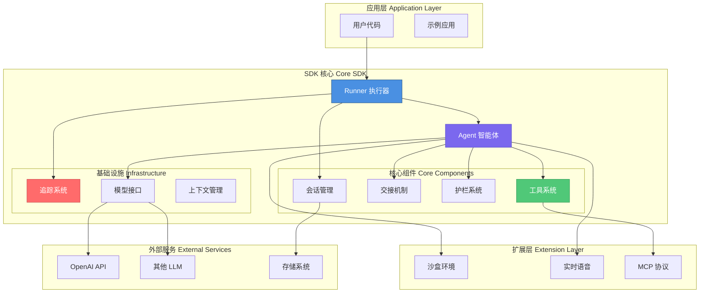
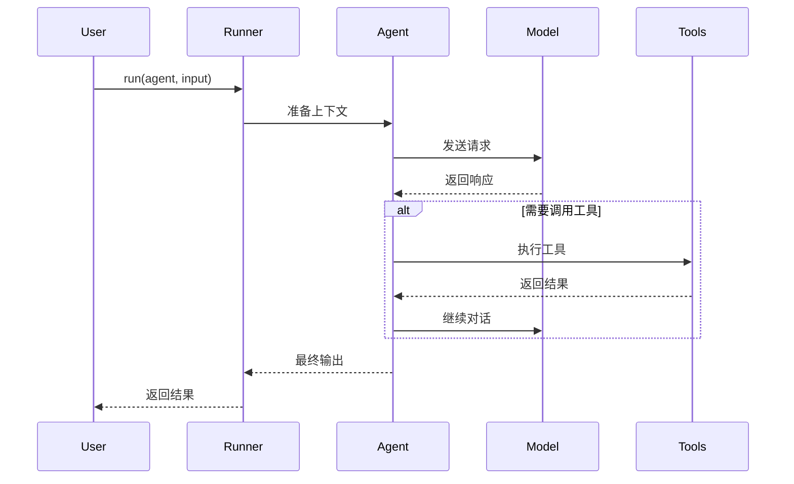
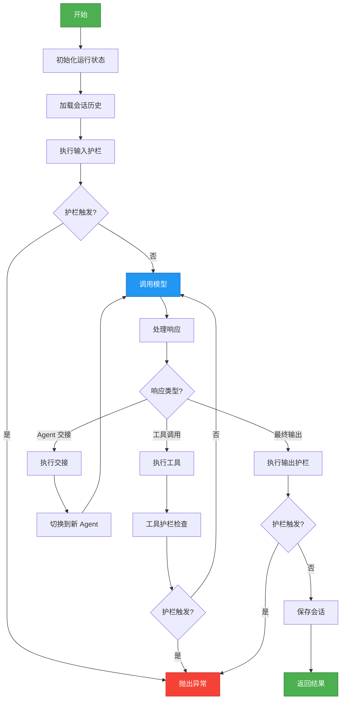
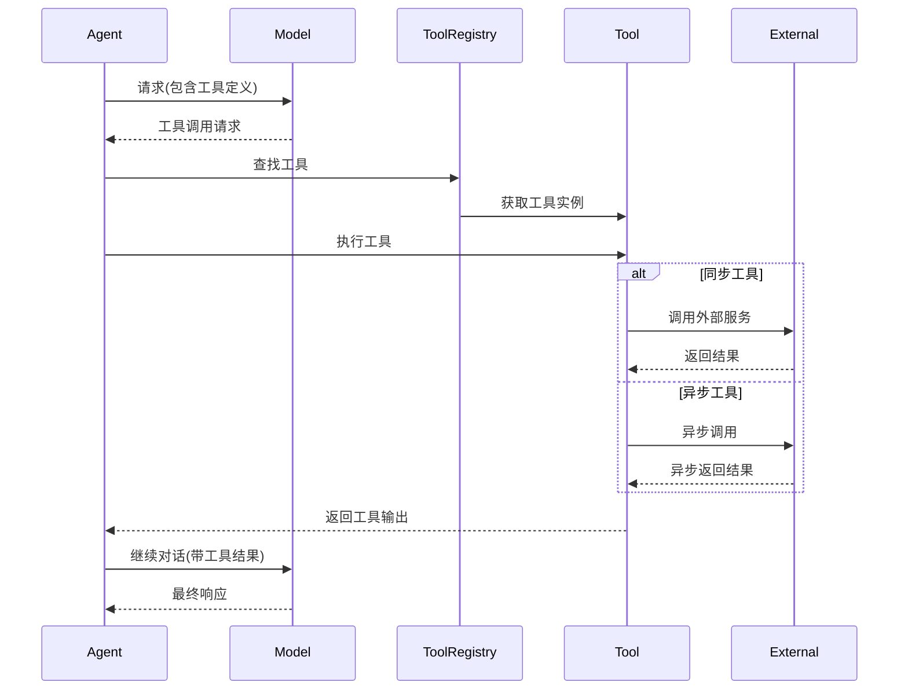
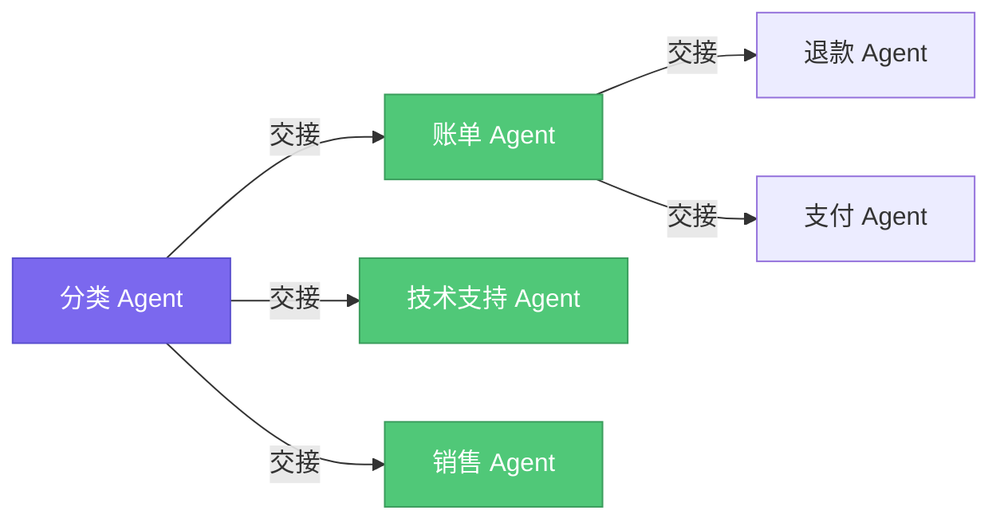
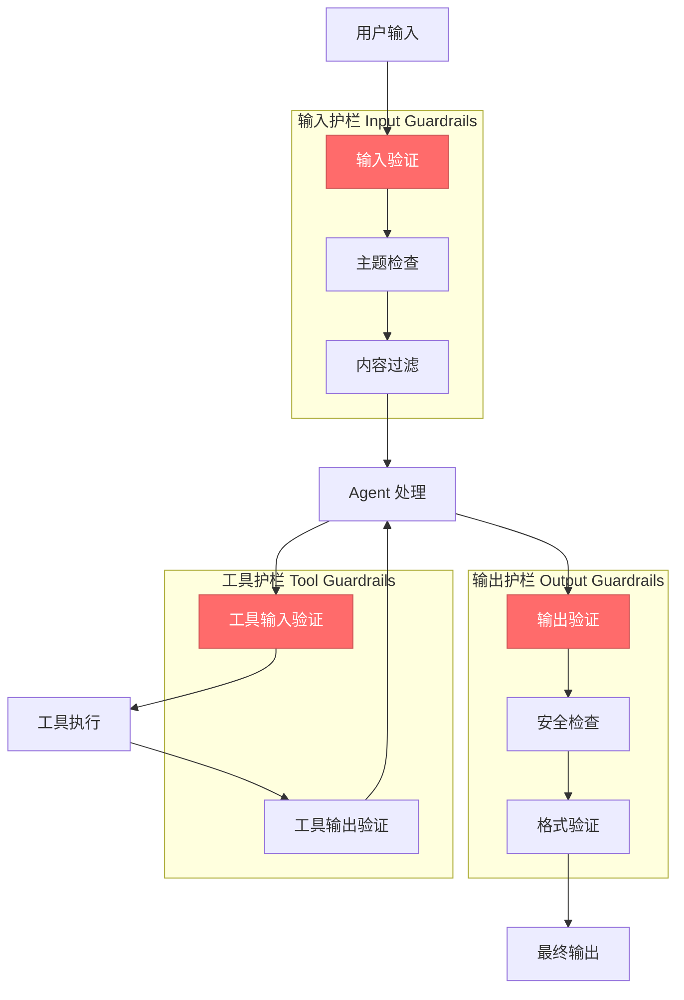
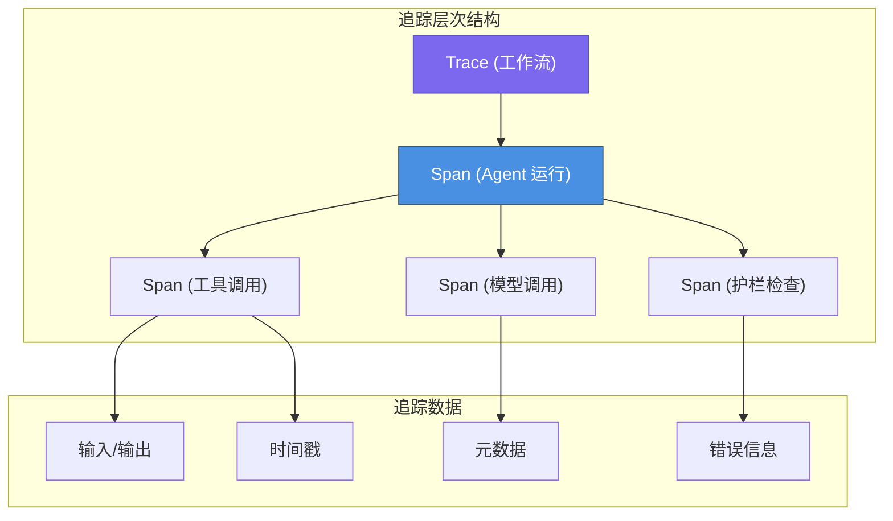
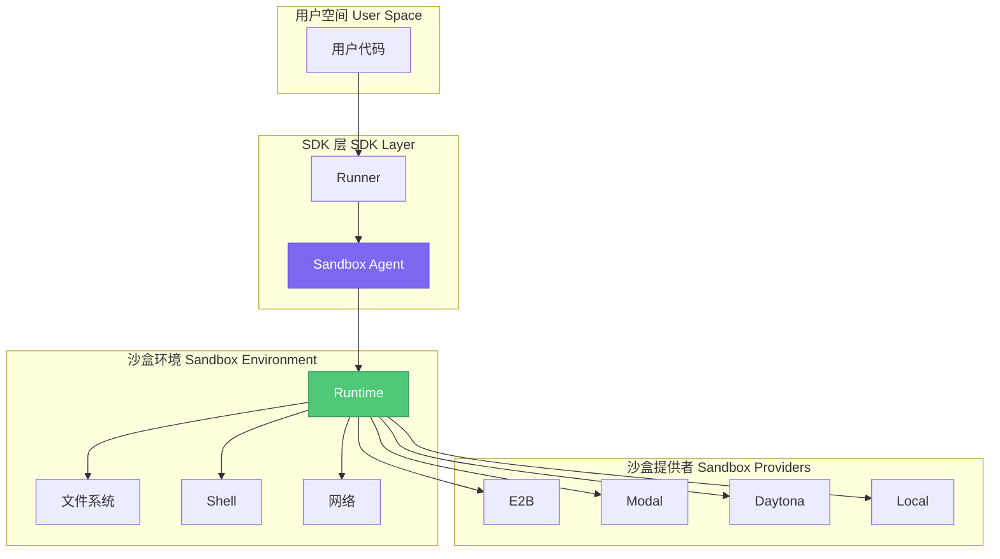

# OpenAI Agents Python SDK 源码深度解析

## 目录

1. [项目概述](OpenAI_Agents_Python_SDK_源码深度解析.md#项目概述)
2. [架构设计](OpenAI_Agents_Python_SDK_源码深度解析.md#架构设计)
3. [核心概念](OpenAI_Agents_Python_SDK_源码深度解析.md#核心概念)
4. [源码解析](OpenAI_Agents_Python_SDK_源码深度解析.md#源码解析)
5. [工作流程](OpenAI_Agents_Python_SDK_源码深度解析.md#工作流程)
6. [高级特性](OpenAI_Agents_Python_SDK_源码深度解析.md#高级特性)
7. [设计模式](OpenAI_Agents_Python_SDK_源码深度解析.md#设计模式)
8. [最佳实践](OpenAI_Agents_Python_SDK_源码深度解析.md#最佳实践)

---

## 项目概述

### 简介

OpenAI Agents Python SDK 是一个轻量级但功能强大的多智能体工作流框架。它支持构建复杂的 AI Agent 系统,具有以下核心特性:

- **Agent 系统**: 配置指令、工具、护栏和交接机制的 LLM 智能体
- **沙盒 Agent**: 预配置的容器化环境,用于长期任务执行
- **工具生态**: 函数工具、MCP 工具、托管工具等多种工具类型
- **护栏系统**: 输入输出验证的可配置安全检查
- **人机协作**: 内置的人类参与机制
- **会话管理**: 自动对话历史管理
- **追踪系统**: 内置的工作流追踪、调试和优化功能
- **实时 Agent**: 支持 GPT-Realtime 的语音 Agent

### 项目结构

```
src/agents/
├── agent.py              # Agent 核心定义
├── run.py                # Runner 执行引擎
├── models/               # 模型接口与实现
├── handoffs/             # Agent 交接机制
├── tool/                 # 工具系统
├── guardrail.py          # 护栏系统
├── tracing/              # 追踪系统
├── memory/               # 会话管理
├── items/                # 数据项定义
├── sandbox/              # 沙盒环境
├── realtime/             # 实时语音 Agent
└── extensions/           # 扩展模块
```

---

## 架构设计

### 整体架构



### 核心设计理念

#### 1. 分层架构

SDK 采用清晰的分层设计:

- **应用层**: 用户直接交互的 API
- **核心层**: Agent、Runner、Tools 等核心组件
- **基础设施层**: 模型接口、追踪、上下文管理
- **扩展层**: 沙盒、实时语音等高级功能

#### 2. 提供者无关设计

```python
class Model(abc.ABC):
    @abc.abstractmethod
    async def get_response(
        self,
        system_instructions: str | None,
        input: str | list[TResponseInputItem],
        model_settings: ModelSettings,
        tools: list[Tool],
        output_schema: AgentOutputSchemaBase | None,
        handoffs: list[Handoff],
        tracing: ModelTracing,
        ...
    ) -> ModelResponse:
        pass
```

通过抽象 `Model` 接口,SDK 支持:
- OpenAI Responses API
- OpenAI Chat Completions API
- 100+ 其他 LLM (通过 any-llm 和 LiteLLM)

#### 3. 异步优先

整个框架基于 `async/await` 设计,支持高并发场景:

```python
class Runner:
    @staticmethod
    async def run(
        agent: Agent[TContext],
        input: str | list[TResponseInputItem],
        ...
    ) -> RunResult:
        # 异步执行流程
        pass
```

---

## 核心概念

### 1. Agent (智能体)

Agent 是 SDK 的核心抽象,代表一个配置了特定能力的 AI 智能体。

#### 核心属性

```python
@dataclass
class Agent(Generic[TContext]):
    name: str                                   # Agent 名称
    instructions: str | None                    # 系统指令
    tools: list[Tool]                           # 可用工具列表
    handoffs: list[Handoff]                     # 可交接的其他 Agent
    model: str | Model | None                   # 使用的模型
    model_settings: ModelSettings | None        # 模型配置
    input_guardrails: list[InputGuardrail]      # 输入护栏
    output_guardrails: list[OutputGuardrail]    # 输出护栏
    output_type: type[Any] | None               # 输出类型
```

#### 工作原理



#### Agent 的生命周期

1. **初始化**: 创建 Agent 实例,配置指令、工具、模型等
2. **执行**: Runner 调用 Agent,传递上下文和输入
3. **推理**: Agent 与模型交互,决定行动
4. **工具调用**: 根据模型响应执行工具
5. **交接**: 可能交接给其他 Agent
6. **完成**: 返回最终结果

### 2. Runner (执行器)

Runner 是 Agent 的执行引擎,负责协调整个运行流程。

#### 核心方法

```python
class Runner:
    @staticmethod
    async def run(
        agent: Agent[TContext],
        input: str | list[TResponseInputItem],
        context: TContext | None = None,
        run_config: RunConfig | None = None,
    ) -> RunResult:
        """异步运行 Agent"""

    @staticmethod
    def run_sync(
        agent: Agent[TContext],
        input: str | list[TResponseInputItem],
        context: TContext | None = None,
        run_config: RunConfig | None = None,
    ) -> RunResult:
        """同步运行 Agent"""

    @staticmethod
    async def stream(
        agent: Agent[TContext],
        input: str | list[TResponseInputItem],
        context: TContext | None = None,
        run_config: RunConfig | None = None,
    ) -> RunResultStreaming:
        """流式运行 Agent"""
```

#### 执行流程



### 3. Tools (工具系统)

工具是 Agent 与外部世界交互的能力扩展。

#### 工具类型

```python
# 1. 函数工具 - 最常用的工具类型
@function_tool
def get_weather(city: str) -> str:
    """获取指定城市的天气"""
    return f"{city}的天气: 晴, 25°C"

# 2. Agent 作为工具
agent_as_tool = Agent(
    name="helper",
    instructions="You are a helpful assistant"
)

# 3. MCP 工具 - Model Context Protocol
from agents.mcp import MCPServer

mcp_tool = HostedMCPTool(
    server=MCPServer(...),
    tool_name="database_query"
)

# 4. 托管工具 - OpenAI 托管的工具
code_interpreter = CodeInterpreterTool()
file_search = FileSearchTool()
web_search = WebSearchTool()
```

#### 工具执行流程



#### 工具护栏

工具护栏允许在工具执行前后进行验证:

```python
@tool_input_guardrail
def validate_tool_input(ctx, agent, tool_name, tool_input):
    """验证工具输入"""
    if contains_sensitive_data(tool_input):
        return ToolInputGuardrailResult(
            output=GuardrailFunctionOutput(
                tripwire_triggered=True,
                output_info="敏感数据检测"
            )
        )
    return ToolInputGuardrailResult(
        output=GuardrailFunctionOutput(tripwire_triggered=False)
    )

@tool_output_guardrail
def validate_tool_output(ctx, agent, tool_name, tool_output):
    """验证工具输出"""
    # 验证逻辑
    pass
```

### 4. Handoffs (交接机制)

交接允许 Agent 将任务委托给其他专门的 Agent。

#### 交接原理



#### 交接实现

```python
# 创建专门的 Agent
billing_agent = Agent(
    name="Billing Agent",
    instructions="处理账单相关问题",
    tools=[check_balance, process_payment]
)

tech_support_agent = Agent(
    name="Tech Support",
    instructions="处理技术支持问题",
    tools=[create_ticket, search_knowledge_base]
)

# 创建分类 Agent 并配置交接
triage_agent = Agent(
    name="Triage Agent",
    instructions="根据用户问题分类并交接给相应的 Agent",
    handoffs=[
        handoff(billing_agent),
        handoff(tech_support_agent)
    ]
)

# 运行
result = Runner.run_sync(
    triage_agent,
    "我无法完成支付"
)
# 交接流程: Triage Agent -> Billing Agent
```

#### 交接数据流

```python
@dataclass
class HandoffInputData:
    input_history: str | tuple[TResponseInputItem, ...]
    # 原始输入历史

    pre_handoff_items: tuple[RunItem, ...]
    # 交接前的运行项

    new_items: tuple[RunItem, ...]
    # 当前轮次生成的新项

    run_context: RunContextWrapper[Any] | None
    # 运行上下文
```

交接时可以过滤输入数据:

```python
def handoff_filter(data: HandoffInputData) -> HandoffInputData:
    """只传递最近的 5 条消息"""
    return data.clone(
        new_items=data.new_items[-5:]
    )

handoff(billing_agent, input_filter=handoff_filter)
```

### 5. Guardrails (护栏系统)

护栏是安全检查机制,用于验证输入输出。

#### 护栏类型



#### 输入护栏示例

```python
@input_guardrail
async def check_relevance(
    ctx: RunContextWrapper,
    agent: Agent,
    input: str | list[TResponseInputItem]
) -> GuardrailFunctionOutput:
    """检查输入是否与主题相关"""

    # 使用另一个 Agent 进行检查
    checker_agent = Agent(
        name="Relevance Checker",
        instructions="判断输入是否与客服主题相关"
    )

    result = await Runner.run(
        checker_agent,
        f"判断这个输入是否相关: {input}"
    )

    is_relevant = "yes" in result.final_output.lower()

    return GuardrailFunctionOutput(
        tripwire_triggered=not is_relevant,
        output_info=f"相关性检查: {'通过' if is_relevant else '未通过'}"
    )

agent = Agent(
    name="Customer Service",
    instructions="你是一个客服助手",
    input_guardrails=[check_relevance]
)
```

#### 输出护栏示例

```python
@output_guardrail
def validate_response(
    ctx: RunContextWrapper,
    agent: Agent,
    output: Any
) -> GuardrailFunctionOutput:
    """验证输出是否符合规范"""

    # 检查输出格式
    if not isinstance(output, dict):
        return GuardrailFunctionOutput(
            tripwire_triggered=True,
            output_info="输出格式错误: 需要字典格式"
        )

    # 检查必需字段
    required_fields = ["answer", "confidence"]
    missing = [f for f in required_fields if f not in output]

    if missing:
        return GuardrailFunctionOutput(
            tripwire_triggered=True,
            output_info=f"缺少必需字段: {missing}"
        )

    return GuardrailFunctionOutput(
        tripwire_triggered=False,
        output_info="输出验证通过"
    )
```

### 6. Sessions (会话管理)

会话管理自动维护对话历史,无需手动管理上下文。

#### 会话接口

```python
class Session(Protocol):
    session_id: str
    session_settings: SessionSettings | None

    async def get_items(self, limit: int | None = None) -> list[TResponseInputItem]:
        """获取会话历史"""

    async def add_items(self, items: list[TResponseInputItem]) -> None:
        """添加新的对话项"""

    async def pop_item(self) -> TResponseInputItem | None:
        """移除最近的项"""

    async def clear_session(self) -> None:
        """清空会话"""
```

#### 会话实现类型

1. **内存会话** - 默认实现,存储在内存中
2. **SQLite 会话** - 持久化到 SQLite 数据库
3. **OpenAI 会话** - 使用 OpenAI 的服务器端会话管理

```python
# 使用 SQLite 会话
from agents import SQLiteSession

session = SQLiteSession(
    session_id="user_123",
    db_path="sessions.db"
)

agent = Agent(
    name="Assistant",
    instructions="你是一个有帮助的助手"
)

# 第一次对话
result1 = Runner.run_sync(
    agent,
    "我的名字是 Alice",
    session=session
)

# 第二次对话 - Agent 记得之前的对话
result2 = Runner.run_sync(
    agent,
    "你还记得我的名字吗?",
    session=session
)
# 输出: "当然记得,你的名字是 Alice"
```

#### 会话压缩

对于长对话,SDK 提供自动压缩机制:

```python
from agents import OpenAIResponsesCompactionSession

session = OpenAIResponsesCompactionSession(
    session_id="long_conversation",
    compaction_threshold=100,  # 超过 100 条消息时压缩
    compaction_keep_last=10    # 保留最近 10 条
)
```

### 7. Tracing (追踪系统)

追踪系统用于调试、监控和优化工作流。

#### 追踪架构



#### 使用追踪

```python
from agents import trace, agent_span, function_span

# 创建追踪
with trace("Customer Service Workflow") as t:
    # Agent 追踪
    with agent_span("Triage Agent") as span:
        result = Runner.run_sync(triage_agent, "我需要帮助")

        # 工具追踪
        with function_span("search_knowledge_base") as tool_span:
            # 工具执行
            pass

    # 访问追踪数据
    print(f"Trace ID: {t.trace_id}")
```

#### 自定义追踪处理器

```python
from agents import TracingProcessor, add_trace_processor

class CustomProcessor(TracingProcessor):
    def process_trace(self, trace):
        """处理完成的追踪"""
        print(f"Trace completed: {trace.trace_id}")

        for span in trace.spans:
            print(f"  Span: {span.span_id}")
            print(f"  Duration: {span.end_time - span.start_time}")

# 注册处理器
add_trace_processor(CustomProcessor())
```

---

## 源码解析

### 1. Runner 核心流程

Runner 是整个 SDK 的执行引擎。让我们深入分析其实现:

#### run() 方法核心逻辑

```python
async def run(
    agent: Agent[TContext],
    input: str | list[TResponseInputItem],
    context: TContext | None = None,
    run_config: RunConfig | None = None,
) -> RunResult:
    # 1. 初始化运行状态
    run_state = RunState(
        agent=agent,
        input=input,
        context=context,
        config=run_config or RunConfig()
    )

    # 2. 创建追踪
    trace = create_trace_for_run(agent, run_config)

    with trace:
        # 3. 加载会话历史
        if session := run_config.session:
            input = await prepare_input_with_session(
                input,
                session
            )

        # 4. 执行输入护栏
        guardrail_results = await run_input_guardrails(
            agent,
            input,
            context
        )

        if guardrail_results.tripwire_triggered:
            raise InputGuardrailTripwireTriggered(...)

        # 5. 主循环
        while True:
            # 5.1 调用模型
            response = await call_model(
                agent,
                input,
                run_state
            )

            # 5.2 处理响应
            step = await process_response(response, run_state)

            # 5.3 根据步骤类型决定下一步
            if isinstance(step, NextStepFinalOutput):
                # 最终输出
                await run_output_guardrails(agent, step.output)
                return build_result(step.output, run_state)

            elif isinstance(step, NextStepHandoff):
                # 交接
                agent = step.new_agent
                input = step.filtered_input

            elif isinstance(step, NextStepRunAgain):
                # 继续运行
                input = step.new_input

            # 检查最大轮次
            if run_state.turn_count > run_config.max_turns:
                raise MaxTurnsExceeded(...)
```

#### process_response() 处理逻辑

```python
async def process_response(
    response: ModelResponse,
    run_state: RunState
) -> NextStep:
    """处理模型响应,决定下一步行动"""

    # 1. 提取响应内容
    content = response.content
    tool_calls = response.tool_calls

    # 2. 如果有工具调用
    if tool_calls:
        # 2.1 执行工具
        tool_results = []
        for tool_call in tool_calls:
            # 查找工具
            tool = find_tool(tool_call.name, run_state.agent.tools)

            # 执行工具护栏
            await run_tool_guardrails(tool, tool_call)

            # 执行工具
            result = await execute_tool(tool, tool_call.arguments)

            # 工具输出护栏
            await run_tool_output_guardrails(tool, result)

            tool_results.append(result)

        # 2.2 检查是否应该停止
        if should_stop_at_tool(tool_results, run_state.config):
            return NextStepFinalOutput(
                output=tool_results[0].output
            )

        # 2.3 继续对话
        return NextStepRunAgain(
            new_input=add_tool_results(input, tool_results)
        )

    # 3. 如果是交接
    if is_handoff(response):
        handoff_tool = extract_handoff(response)

        # 执行交接回调
        new_agent = await handoff_tool.on_invoke_handoff(
            run_state.context,
            response.arguments
        )

        # 过滤输入
        filtered_input = await apply_handoff_filter(
            run_state.input,
            handoff_tool
        )

        return NextStepHandoff(
            new_agent=new_agent,
            filtered_input=filtered_input
        )

    # 4. 最终输出
    return NextStepFinalOutput(
        output=extract_final_output(response)
    )
```

### 2. Agent 配置系统

Agent 使用 dataclass 定义,支持丰富的配置选项:

```python
@dataclass
class Agent(Generic[TContext]):
    # 基本信息
    name: str
    instructions: str | None = None

    # 模型配置
    model: str | Model | None = None
    model_settings: ModelSettings | None = None

    # 工具和交接
    tools: list[Tool] = field(default_factory=list)
    handoffs: list[Handoff] = field(default_factory=list)

    # 护栏
    input_guardrails: list[InputGuardrail] = field(default_factory=list)
    output_guardrails: list[OutputGuardrail] = field(default_factory=list)

    # 输出配置
    output_type: type[Any] | None = None
    output_schema: AgentOutputSchemaBase | None = None

    # 高级配置
    hooks: AgentHooks | None = None
    tool_use_behavior: Literal["run_llm_again", "stop_on_first_tool"] = "run_llm_again"
    stop_at_tools: StopAtTools | None = None
```

#### 动态指令

支持动态生成指令:

```python
from agents import DynamicPromptFunction

def dynamic_instructions(
    ctx: RunContextWrapper,
    agent: Agent
) -> str:
    """根据上下文动态生成指令"""
    user_role = ctx.context.get("role", "user")

    return f"""
    你是一个{user_role}助手。
    当前时间: {datetime.now()}
    用户ID: {ctx.context.get("user_id")}
    """

agent = Agent(
    name="Dynamic Agent",
    instructions=DynamicPromptFunction(dynamic_instructions)
)
```

### 3. Tool 系统实现

#### FunctionTool 实现

```python
@dataclass
class FunctionTool:
    name: str
    description: str
    params_json_schema: dict[str, Any]

    on_invoke_tool: Callable[[ToolContext, str], Awaitable[Any]]
    # 工具执行函数

    strict_json_schema: bool = True
    # 是否使用严格模式

    is_enabled: bool | Callable[[RunContextWrapper, Agent], bool] = True
    # 是否启用

def function_tool(func: Callable) -> FunctionTool:
    """将函数转换为工具的装饰器"""

    # 提取函数签名
    sig = inspect.signature(func)

    # 生成 JSON Schema
    schema = build_json_schema(sig)

    # 包装函数
    async def on_invoke_tool(ctx: ToolContext, args_json: str) -> Any:
        # 解析参数
        args = json.loads(args_json) if args_json else {}

        # 调用原函数
        if inspect.iscoroutinefunction(func):
            return await func(ctx, **args)
        else:
            return func(ctx, **args)

    return FunctionTool(
        name=func.__name__,
        description=func.__doc__ or "",
        params_json_schema=schema,
        on_invoke_tool=on_invoke_tool
    )
```

#### MCP 工具集成

MCP (Model Context Protocol) 工具允许集成外部工具服务器:

```python
from agents.mcp import MCPServer, HostedMCPTool

# 启动 MCP 服务器
mcp_server = MCPServer(
    command="python",
    args=["mcp_server.py"]
)

# 等待服务器启动
await mcp_server.connect()

# 获取可用工具
tools = await mcp_server.list_tools()

# 将 MCP 工具添加到 Agent
agent = Agent(
    name="MCP Agent",
    tools=[
        HostedMCPTool(server=mcp_server, tool_name=tool.name)
        for tool in tools
    ]
)
```

### 4. Model 接口抽象

Model 接口统一了不同 LLM 的调用方式:

```python
class Model(abc.ABC):
    @abc.abstractmethod
    async def get_response(
        self,
        system_instructions: str | None,
        input: str | list[TResponseInputItem],
        model_settings: ModelSettings,
        tools: list[Tool],
        output_schema: AgentOutputSchemaBase | None,
        handoffs: list[Handoff],
        tracing: ModelTracing,
        *,
        previous_response_id: str | None,
        conversation_id: str | None,
        prompt: ResponsePromptParam | None,
    ) -> ModelResponse:
        """获取模型响应"""
        pass

    @abc.abstractmethod
    def stream_response(
        self,
        system_instructions: str | None,
        input: str | list[TResponseInputItem],
        model_settings: ModelSettings,
        tools: list[Tool],
        output_schema: AgentOutputSchemaBase | None,
        handoffs: list[Handoff],
        tracing: ModelTracing,
        **kwargs
    ) -> AsyncIterator[TResponseStreamEvent]:
        """流式获取响应"""
        pass
```

#### OpenAI Responses Model 实现

```python
class OpenAIResponsesModel(Model):
    def __init__(self, model: str, client: AsyncOpenAI):
        self.model = model
        self.client = client

    async def get_response(
        self,
        system_instructions: str | None,
        input: str | list[TResponseInputItem],
        model_settings: ModelSettings,
        tools: list[Tool],
        output_schema: AgentOutputSchemaBase | None,
        handoffs: list[Handoff],
        tracing: ModelTracing,
        **kwargs
    ) -> ModelResponse:
        # 构建请求
        request = {
            "model": self.model,
            "instructions": system_instructions,
            "input": input,
            "tools": self._build_tools(tools, handoffs),
            **model_settings.to_dict(),
            **kwargs
        }

        # 调用 API
        response = await self.client.responses.create(**request)

        # 转换响应
        return ModelResponse(
            id=response.id,
            content=response.content,
            tool_calls=self._extract_tool_calls(response),
            usage=Usage(
                input_tokens=response.usage.input_tokens,
                output_tokens=response.usage.output_tokens
            )
        )
```

### 5. Tracing 实现原理

#### Trace 和 Span 的关系

```python
class Trace:
    """代表完整的工作流"""

    def __init__(self, name: str, **metadata):
        self.trace_id = gen_trace_id()
        self.name = name
        self.metadata = metadata
        self.spans: list[Span] = []
        self._start_time: float | None = None

    def __enter__(self) -> Trace:
        self.start(mark_as_current=True)
        return self

    def __exit__(self, exc_type, exc_val, exc_tb):
        self.finish(reset_current=True)

    def start(self, mark_as_current: bool = False):
        self._start_time = time.time()
        if mark_as_current:
            set_current_trace(self)

    def finish(self, reset_current: bool = False):
        # 完成所有未完成的 Span
        for span in self.spans:
            if not span.is_finished:
                span.finish()

        # 发送到处理器
        for processor in get_trace_processors():
            processor.process_trace(self)

        if reset_current:
            reset_current_trace()

class Span:
    """代表单个操作"""

    def __init__(self, trace: Trace, data: SpanData):
        self.span_id = gen_span_id()
        self.trace = trace
        self.data = data
        self.start_time = time.time()
        self.end_time: float | None = None
        self.errors: list[SpanError] = []

        trace.spans.append(self)

    def finish(self):
        self.end_time = time.time()

    def add_error(self, error: SpanError):
        self.errors.append(error)
```

#### 上下文管理

使用 `contextvars` 管理当前 Trace 和 Span:

```python
import contextvars

_current_trace: contextvars.ContextVar[Trace | None] = \
    contextvars.ContextVar('current_trace', default=None)

_current_span: contextvars.ContextVar[Span | None] = \
    contextvars.ContextVar('current_span', default=None)

def get_current_trace() -> Trace | None:
    return _current_trace.get()

def get_current_span() -> Span | None:
    return _current_span.get()

def set_current_trace(trace: Trace):
    _current_trace.set(trace)

def set_current_span(span: Span):
    _current_span.set(span)
```

---

## 高级特性

### 1. Sandbox Agents (沙盒 Agent)

沙盒 Agent 在隔离的容器环境中执行长期任务。

#### 架构设计



#### 使用示例

```python
from agents import Runner, RunConfig
from agents.sandbox import SandboxAgent, Manifest, SandboxRunConfig
from agents.sandbox.entries import GitRepo
from agents.sandbox.sandboxes import UnixLocalSandboxClient

agent = SandboxAgent(
    name="Code Assistant",
    instructions="""
    你是一个代码助手。
    在回答之前,检查沙盒工作区中的文件。
    可以运行命令、应用补丁等。
    """,
    default_manifest=Manifest(
        entries={
            "repo": GitRepo(repo="openai/openai-agents-python", ref="main"),
            "data": DirectoryMount(path="./data")
        }
    )
)

result = Runner.run_sync(
    agent,
    "分析这个仓库的代码结构",
    run_config=RunConfig(
        sandbox=SandboxRunConfig(
            client=UnixLocalSandboxClient()
        )
    )
)
```

#### Manifest 系统

Manifest 定义沙盒环境的初始状态:

```python
class Manifest:
    entries: dict[str, ManifestEntry]

# 支持的条目类型:
- GitRepo: 克隆 Git 仓库
- DirectoryMount: 挂载本地目录
- FileMount: 挂载单个文件
- SkillReference: 引用预定义技能
```

### 2. Realtime Agents (实时 Agent)

支持语音交互的实时 Agent。

#### 实现

```python
from agents import Agent
from agents.realtime import RealtimeRunner

agent = Agent(
    name="Voice Assistant",
    instructions="你是一个语音助手",
    model="gpt-realtime-1.5"
)

runner = RealtimeRunner(agent)

# 连接音频流
async with runner.connect() as connection:
    # 发送音频
    await connection.send_audio(audio_data)

    # 接收响应
    async for event in connection.receive():
        if event.type == "audio":
            play_audio(event.audio)
        elif event.type == "transcript":
            print(event.text)
```

### 3. 并行 Agent 执行

SDK 支持并行运行多个 Agent:

```python
import asyncio
from agents import Agent, Runner

async def run_parallel():
    agents = [
        Agent(name=f"Agent{i}", instructions="...")
        for i in range(5)
    ]

    # 并行执行
    tasks = [
        Runner.run(agent, "Process this")
        for agent in agents
    ]

    results = await asyncio.gather(*tasks)
    return results
```

### 4. 流式处理

支持实时流式输出:

```python
result = Runner.run_sync(agent, "Tell me a story")

async for event in result.stream_events():
    if event.type == "raw_response_event":
        # 原始模型响应
        print(event.data, end="", flush=True)

    elif event.type == "run_item_stream_event":
        # Agent 生成的项
        if event.item.type == "tool_call":
            print(f"\n调用工具: {event.item.name}")
        elif event.item.type == "message_output":
            print(f"\n输出: {event.item.content}")
```

---

## 设计模式

### 1. 策略模式 (Strategy Pattern)

Model 接口使用策略模式,允许动态切换 LLM:

```python
# 运行时切换模型
agent = Agent(
    name="Flexible Agent",
    model="gpt-4"  # 默认模型
)

# 可以在运行时切换
result1 = Runner.run_sync(agent, "...", model="gpt-4")
result2 = Runner.run_sync(agent, "...", model="claude-3-opus")
```

### 2. 责任链模式 (Chain of Responsibility)

护栏系统使用责任链模式:

```python
agent = Agent(
    name="Protected Agent",
    input_guardrails=[
        relevance_check,      # 第一个检查
        content_filter,       # 第二个检查
        security_check       # 第三个检查
    ]
)
```

### 3. 观察者模式 (Observer Pattern)

追踪系统使用观察者模式:

```python
class TracingProcessor(abc.ABC):
    @abc.abstractmethod
    def process_trace(self, trace: Trace):
        """处理完成的追踪"""
        pass

# 可以添加多个观察者
add_trace_processor(LoggingProcessor())
add_trace_processor(MetricsProcessor())
add_trace_processor(DebugProcessor())
```

### 4. 装饰器模式 (Decorator Pattern)

`@function_tool` 装饰器增强函数:

```python
@function_tool
def my_tool(ctx: ToolContext, arg: str) -> str:
    """原始函数"""
    return "result"

# my_tool 现在是一个 FunctionTool 实例
# 包含了元数据和执行逻辑
```

### 5. 工厂模式 (Factory Pattern)

`handoff()` 函数是工厂方法:

```python
def handoff(
    agent: Agent,
    **kwargs
) -> Handoff:
    """创建 Handoff 实例的工厂方法"""
    return Handoff(
        tool_name=...,
        tool_description=...,
        ...
    )
```

---

## 最佳实践

### 1. Agent 设计原则

#### 单一职责

```python
# 好的设计 - 每个 Agent 有明确的职责
billing_agent = Agent(
    name="Billing Expert",
    instructions="专门处理账单相关问题"
)

tech_agent = Agent(
    name="Tech Support",
    instructions="专门处理技术支持问题"
)

# 避免 - 一个 Agent 做太多事情
bad_agent = Agent(
    name="Do Everything",
    instructions="处理账单、技术支持、销售..."
)
```

#### 清晰的指令

```python
# 好的指令
agent = Agent(
    name="Customer Service",
    instructions="""
    你是一个专业的客服代表。

    职责:
    - 回答产品相关问题
    - 处理客户投诉
    - 必要时交接给专业团队

    行为准则:
    - 保持友好和专业
    - 确认理解客户需求
    - 提供准确信息
    """
)
```

### 2. 工具设计

#### 工具粒度

```python
# 太宽泛 - 不推荐
@function_tool
def do_everything(task: str) -> str:
    """执行任何任务"""
    pass

# 合适的粒度 - 推荐
@function_tool
def search_product(query: str) -> dict:
    """搜索产品"""
    pass

@function_tool
def check_inventory(product_id: str) -> dict:
    """检查库存"""
    pass

@function_tool
def create_order(product_id: str, quantity: int) -> dict:
    """创建订单"""
    pass
```

#### 错误处理

```python
@function_tool
def robust_tool(ctx: ToolContext, data: str) -> str:
    """带有错误处理的工具"""
    try:
        # 处理逻辑
        result = process(data)
        return result
    except ValidationError as e:
        return f"验证错误: {str(e)}"
    except ExternalAPIError as e:
        ctx.add_error(f"API 调用失败: {str(e)}")
        return "服务暂时不可用,请稍后重试"
    except Exception as e:
        ctx.add_error(f"未知错误: {str(e)}")
        raise  # 重新抛出,让 Agent 决定如何处理
```

### 3. 性能优化

#### 使用流式处理

```python
# 对于长时间任务,使用流式处理
result = Runner.run_sync(agent, long_task)

async for event in result.stream_events():
    if event.type == "run_item_stream_event":
        # 实时处理输出
        process_partial_result(event.item)
```

#### 会话管理

```python
# 使用持久化会话,避免重复传递完整历史
session = SQLiteSession(
    session_id="user_123",
    db_path="sessions.db"
)

# SDK 会自动管理历史
result = Runner.run_sync(agent, input, session=session)
```

#### 缓存策略

```python
from agents import PromptCacheKeyResolver

# 使用提示缓存
agent = Agent(
    name="Cached Agent",
    instructions=long_system_prompt,
    model_settings=ModelSettings(
        prompt_cache_key=PromptCacheKeyResolver.generate(long_system_prompt)
    )
)
```

### 4. 安全考虑

#### 输入验证

```python
@input_guardrail
def validate_input(ctx, agent, input):
    """验证用户输入"""
    # 长度检查
    if len(input) > 10000:
        return GuardrailFunctionOutput(
            tripwire_triggered=True,
            output_info="输入过长"
        )

    # 敏感信息检测
    if contains_sensitive_data(input):
        return GuardrailFunctionOutput(
            tripwire_triggered=True,
            output_info="检测到敏感信息"
        )

    return GuardrailFunctionOutput(
        tripwire_triggered=False
    )
```

#### 输出过滤

```python
@output_guardrail
def filter_output(ctx, agent, output):
    """过滤敏感输出"""
    # 检查输出内容
    if contains_pii(output):
        return GuardrailFunctionOutput(
            tripwire_triggered=True,
            output_info="输出包含敏感信息"
        )

    return GuardrailFunctionOutput(
        tripwire_triggered=False
    )
```

### 5. 调试技巧

#### 详细日志

```python
import logging
from agents import enable_verbose_stdout_logging

# 启用详细日志
enable_verbose_stdout_logging()

# 或使用自定义日志配置
logging.basicConfig(
    level=logging.DEBUG,
    format='%(asctime)s - %(name)s - %(levelname)s - %(message)s'
)
```

#### 追踪分析

```python
from agents import trace, add_trace_processor

class DebugProcessor(TracingProcessor):
    def process_trace(self, trace):
        print(f"\n追踪: {trace.name}")
        print(f"ID: {trace.trace_id}")
        print(f"持续时间: {trace.duration}s")

        for span in trace.spans:
            print(f"\n  Span: {span.data.span_type}")
            print(f"  ID: {span.span_id}")

            if span.errors:
                for error in span.errors:
                    print(f"  错误: {error.message}")

add_trace_processor(DebugProcessor())
```

---

## 总结

OpenAI Agents Python SDK 是一个设计精良的多智能体框架,具有以下核心优势:

### 架构优势

1. **模块化设计**: 清晰的模块边界,易于扩展和维护
2. **异步优先**: 全面支持异步操作,适合高并发场景
3. **类型安全**: 使用 Pydantic 和类型注解,提供良好的开发体验
4. **可扩展性**: 通过 Model 接口、Tool 系统等支持丰富的扩展

### 功能优势

1. **完整的工作流**: 从 Agent 定义到执行、监控的完整解决方案
2. **灵活的配置**: 支持多种模型、工具、护栏组合
3. **生产就绪**: 内置追踪、会话管理、错误处理等生产级功能
4. **开发友好**: 丰富的装饰器和 API,降低使用门槛

### 适用场景

- **客服系统**: 多 Agent 交接,智能路由
- **代码助手**: 沙盒环境,安全执行
- **数据分析**: 工具集成,自动推理
- **内容生成**: 流式输出,质量控制
- **语音应用**: 实时 Agent,低延迟

通过深入理解 SDK 的源码和设计理念,开发者可以更好地利用其构建强大的 AI 应用。

---

## 参考资源

- [官方文档](https://openai.github.io/openai-agents-python/)
- [GitHub 仓库](https://github.com/openai/openai-agents-python)
- [示例代码](https://github.com/openai/openai-agents-python/tree/main/examples)
- [API 参考](https://openai.github.io/openai-agents-python/api/)

---

*文档生成时间: 2026-04-26*
*SDK 版本: 基于 main 分支分析*
