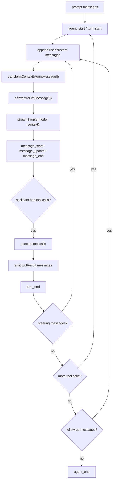
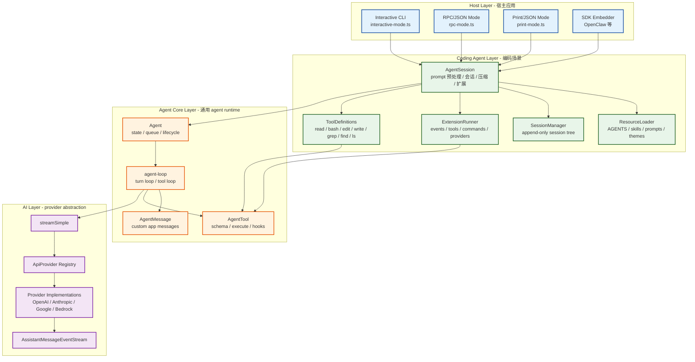
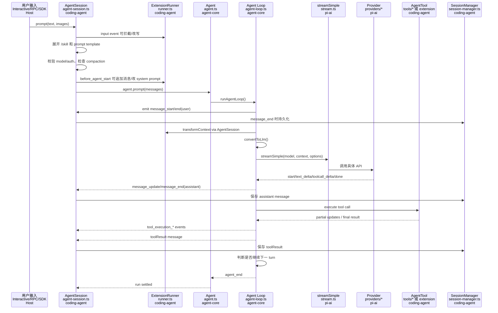
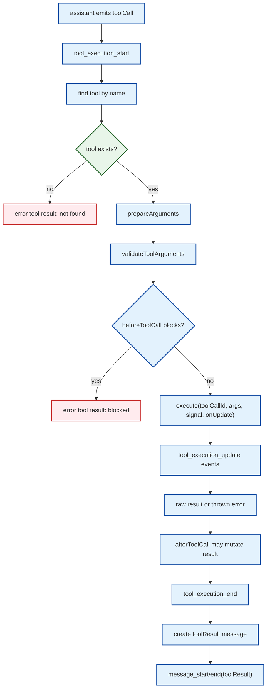
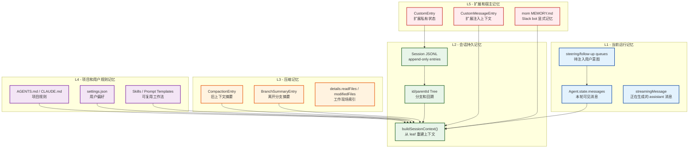
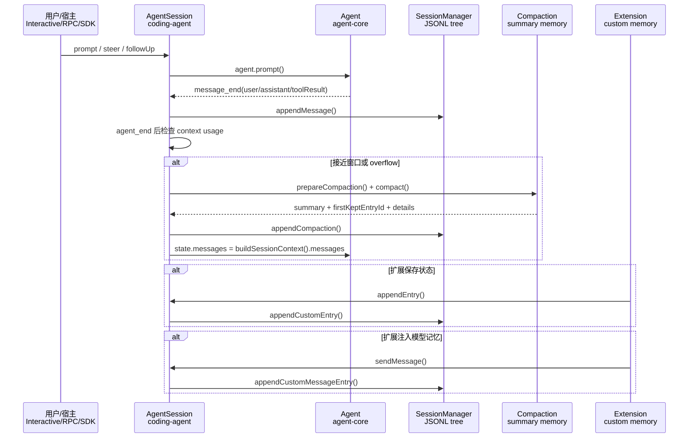
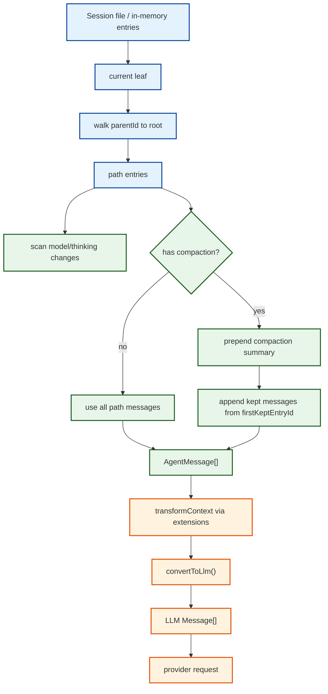

# Pi Agent 设计说明

本文从 agent 设计思想和一次请求的执行流程出发，说明 `pi-mono` 为什么适合作为可嵌入、可扩展的 agent 框架。

## 结论先行

`pi-mono` 的核心不是一个只面向终端的聊天程序，而是一套分层的 agent runtime：

- `packages/ai` 统一不同模型提供商的消息、工具调用、推理等级、OAuth/API key 和流式事件。
- `packages/agent` 提供最小 agent loop：状态、事件、上下文转换、工具执行、排队消息。
- `packages/coding-agent` 把 core agent 组装成编码 agent：系统提示词、文件/shell 工具、会话树、压缩、扩展、技能、提示词模板和多运行模式。
- `packages/tui`、`packages/web-ui`、`packages/mom` 是不同宿主或展示层，不改变 agent loop 的基本语义。

OpenClaw 的关系也不是传闻。`packages/coding-agent/README.md` 明确写到 OpenClaw 是 SDK 集成案例；OpenClaw 自己的公开文档也说明它直接导入 `pi-coding-agent`、`pi-ai`、`pi-agent-core`、`pi-tui`，用 `createAgentSession()` 嵌入 Pi agent，而不是简单启动一个子进程。

## 设计思想

### 1. 核心循环足够薄

`packages/agent/src/agent-loop.ts` 只解决通用 agent 问题：

1. 接收用户消息或继续已有上下文。
2. 在调用模型前转换上下文。
3. 消费模型流式事件。
4. 发现工具调用。
5. 执行工具并把结果写回上下文。
6. 根据是否还有工具调用、steering 消息、follow-up 消息决定是否继续下一轮。

它不关心“读文件怎么读”“终端怎么画”“会话怎么存”“扩展怎么加载”。这些能力都在外层组合。

### 2. 事件流是系统主干

agent loop 对外暴露的是事件：

- `agent_start` / `agent_end`
- `turn_start` / `turn_end`
- `message_start` / `message_update` / `message_end`
- `tool_execution_start` / `tool_execution_update` / `tool_execution_end`

这让 TUI、RPC、日志、扩展、会话持久化都可以订阅同一条事件流。交互式 UI 只是其中一个消费者，OpenClaw 这类宿主也可以把事件转成自己的消息网关事件。

### 3. AgentMessage 和 LLM Message 分离

`pi-agent-core` 的 `AgentMessage` 比 LLM 原生消息更宽，可以包含自定义消息。真正调用模型前才通过 `convertToLlm()` 过滤或转换成 `user`、`assistant`、`toolResult`。

这个边界很关键：

- UI-only 消息可以存在会话里，但不发给模型。
- 扩展可以注入 custom message，再决定是否进入上下文。
- compaction summary、branch summary 可以作为 agent 语义消息存在。
- 宿主可以保留自己的领域消息，同时复用 agent loop。

### 4. 工具是类型化协议，不是特殊分支

工具定义统一使用 TypeBox schema。模型返回工具调用后，agent core 会：

1. 找到工具。
2. 预处理参数 `prepareArguments`。
3. 校验参数 `validateToolArguments`。
4. 调用 `beforeToolCall` hook。
5. 执行工具，允许通过 `onUpdate` 流式更新。
6. 调用 `afterToolCall` hook。
7. 生成标准 `toolResult` 消息。

编码 agent 的 `read`、`bash`、`edit`、`write`、`grep`、`find`、`ls` 和扩展注册的工具都走同一套协议。工具还可以声明 `executionMode`，让某些工具强制串行执行；默认则支持并行工具批次。

### 5. 会话是 append-only tree

`SessionManager` 把会话保存为 JSONL，每条 entry 有 `id` 和 `parentId`。这不是普通线性日志，而是树：

- 正常追加消息会成为当前 leaf 的子节点。
- `/tree` 可以回到任意历史节点。
- `/fork` 可以从历史点派生新分支。
- compaction、branch summary、model change、thinking level change 都是树上的 entry。

这种结构让“历史不可变”和“任意时间点继续工作”可以同时成立。

### 6. 默认能力克制，扩展能力开放

Pi 默认不内置 sub-agent、plan mode 等复杂工作流。README 里明确说这些能力可以通过扩展、技能、提示词模板或第三方 Pi package 实现。

这体现了它的取舍：core 保持稳定、透明、可嵌入；高级工作流放在 extension/package 层，避免把某一种工作法写死进 agent runtime。

## 执行流程

### 1. 启动和运行时装配

CLI 入口是 `packages/coding-agent/src/cli.ts`，它调用 `main()`。`main()` 做参数解析、stdin/file 输入处理、session 选择、模型解析，然后创建 runtime。

核心装配在 `createAgentSession()`：

1. 解析 `cwd` 和 `agentDir`。
2. 创建 `AuthStorage` 和 `ModelRegistry`。
3. 创建 `SettingsManager`。
4. 创建或打开 `SessionManager`。
5. 用 `DefaultResourceLoader` 加载资源：
   - `AGENTS.md` / `CLAUDE.md`
   - extensions
   - skills
   - prompt templates
   - themes
   - system prompt / append system prompt
6. 从已有 session 恢复模型、thinking level 和消息。
7. 创建 `Agent`，注入：
   - `convertToLlm`
   - `streamFn`
   - `transformContext`
   - steering/follow-up queue 模式
   - sessionId、transport、thinking budget、retry 配置
8. 创建 `AgentSession`，让编码 agent 的业务能力包裹 core agent。

这里的亮点是 `streamFn` 和 `transformContext` 都是可替换的。外部宿主可以保留 Pi 的会话、工具、扩展体系，同时改写模型请求路径或上下文注入逻辑。

### 2. 系统提示词和工具注册

`AgentSession` 构造时会调用 `_buildRuntime()`：

1. 创建内置工具定义。
2. 创建 `ExtensionRunner`。
3. 绑定扩展 API。
4. 合并内置工具、扩展工具、SDK custom tools。
5. 把 `ToolDefinition` 包装成 core agent 的 `AgentTool`。
6. 根据当前 active tools 重建系统提示词。

系统提示词由 `buildSystemPrompt()` 生成。它会把当前工作目录、日期、已选工具、工具提示片段、工具使用 guideline、项目上下文文件和 skills 合成到 prompt 中。

重要细节：系统提示词跟 active tools 联动。禁用或启用工具后，prompt 中的工具说明和 guideline 会随之变化，模型不会看到不可用工具的错误暗示。

### 3. 用户输入预处理

用户在交互式 TUI、print mode、RPC 或 SDK 中提交消息后，最终都会进入 `AgentSession.prompt()`。

这个函数按顺序做几件事：

1. 如果输入是 `/xxx`，先尝试执行扩展 command。
2. 触发扩展 `input` 事件，允许扩展拦截或改写输入。
3. 展开 `/skill:name`，把 `SKILL.md` 内容包装进用户消息。
4. 展开 prompt template。
5. 如果 agent 正在工作，把消息放入 steering 或 follow-up 队列。
6. 如果 agent 空闲，先 flush 用户手动执行的 bash 消息。
7. 校验模型和认证。
8. 检查是否需要 compaction。
9. 触发 `before_agent_start`，允许扩展追加 custom message 或替换本轮 system prompt。
10. 调用 core `agent.prompt(messages)`。

这个阶段体现了 Pi 的宿主化设计：用户输入不是直接丢给模型，而是经过可观察、可拦截、可扩展的 pipeline。

### 4. Core agent loop

进入 `packages/agent/src/agent-loop.ts` 后，执行流程变成纯 agent runtime：



`streamAssistantResponse()` 是 AgentMessage 到 LLM Message 的唯一边界。模型 provider 只看到标准化后的 `Context`，而 agent 内部仍保留更丰富的消息结构。

### 5. 模型提供商抽象

`packages/ai` 把所有 provider 统一成 `streamSimple(model, context, options)`。

它的关键设计：

- `ApiProvider` 注册表按 `model.api` 找到实现。
- built-in provider 是 lazy load，首次使用时才加载具体模块。
- provider 把自己的 SSE/WebSocket/SDK 响应转换成统一的 `AssistantMessageEventStream`。
- 统一事件包括 text、thinking、toolcall、done、error。
- `SimpleStreamOptions` 统一 reasoning level、cache retention、sessionId、transport、timeout、retry、headers、payload hook。

这让上层 agent 不需要知道 OpenAI Responses、Anthropic Messages、Gemini、Bedrock 等 API 的细节，也方便 OpenClaw 这类系统做 provider-agnostic model switching。

### 6. 流式响应和 UI/RPC 消费

模型流返回后，core agent 会持续 emit：

- 文本增量更新
- thinking 增量更新
- tool call 参数增量更新
- 最终 assistant message

交互式模式中，`InteractiveMode.handleEvent()` 消费这些事件：

- assistant 文本更新到 `AssistantMessageComponent`
- tool call 一出现就创建 `ToolExecutionComponent`
- tool 参数继续流式变化时更新工具组件
- 工具开始、更新、结束时更新同一个组件

RPC mode 则把同样的事件序列写成 JSONL，供外部程序消费。print mode 只输出最后的文本或完整 JSON 事件流。

### 7. 工具执行

assistant message 结束后，agent loop 检查 `toolCall` 内容块。

工具批次执行有两种模式：

- `parallel`：默认。先按顺序 preflight，再并行执行允许并行的工具；最终 tool result message 仍按 assistant 原始顺序写入上下文。
- `sequential`：逐个执行。任一工具声明 `executionMode: "sequential"` 时，整个批次会串行。

编码工具层的几个亮点：

- `read` 支持文本和图片，文本自动截断，图片可自动缩放。
- `edit` 使用精确文本替换，支持一次调用多个非重叠 edit，并在 TUI 里预览 diff。
- `bash` 支持输出流式更新、超时、abort、进程树清理、完整输出落临时文件。
- 文件修改通过 `withFileMutationQueue()` 串行化同一路径的写操作，降低并行工具调用互相覆盖的风险。
- 工具 operations 可替换，例如把读写和 bash 委托到远端环境。

### 8. Steering 和 follow-up

Pi 把“用户在 agent 工作中继续输入”拆成两个语义：

- steering：当前 assistant turn 的工具调用结束后，下一轮 LLM 前注入，用来改变正在进行的任务方向。
- follow-up：agent 原本要停下来时再注入，用来排队后续任务。

这比简单 interrupt 更稳，因为当前工具批次不会被半途切断；也比普通消息队列更精细，因为用户可以区分“马上转向”和“结束后再做”。

### 9. 会话持久化、分支和压缩

`AgentSession` 订阅 core agent 事件，并在 `message_end` 时把消息写入 `SessionManager`。会话文件是 append-only JSONL，entry 类型包括：

- `message`
- `model_change`
- `thinking_level_change`
- `compaction`
- `branch_summary`
- `custom`
- `custom_message`
- `label`
- `session_info`

构建上下文时，`buildSessionContext()` 从当前 leaf 向根回溯，得到当前分支的消息序列。如果有 compaction entry，会先注入 compaction summary，再保留最近未压缩消息。

压缩逻辑在 `packages/coding-agent/src/core/compaction`：

- 根据最近 assistant usage 估算上下文 token。
- 超过阈值或遇到 context overflow 时触发。
- 生成摘要，保留最近上下文。
- 记录 read/modified files，避免长会话压缩后丢失工作现场。
- 扩展可以通过 `session_before_compact` 接管或取消压缩。

### 10. 扩展系统

扩展是 Pi 的主要可塑性来源。`ExtensionAPI` 支持：

- 订阅 agent/session/tool/model/input/provider 事件。
- 注册 LLM 可调用工具。
- 注册 slash command。
- 注册快捷键和 CLI flag。
- 注册 provider 或 OAuth。
- 注入 custom message。
- 修改上下文、provider payload、system prompt。
- 参与 compaction、fork、tree navigation、session switch。
- 在 interactive mode 中操作 UI：selector、confirm、input、widget、footer、header、custom editor。

这使 Pi 的“框架感”强于普通 CLI agent。核心 agent 不需要知道 plan mode 或 sub-agent 的存在；这些都可以在 extension 层实现。

### 11. 多运行模式

Pi 有四种主要入口：

- interactive：终端 TUI，人机协作主界面。
- print/text：单次请求，只输出最终文本。
- json：单次请求，但输出完整事件流。
- rpc：长期运行的 JSON stdin/stdout 协议，适合外部进程集成。
- SDK：直接在 TypeScript 中调用 `createAgentSession()` 或更底层的 `Agent`。

OpenClaw 采用的是 SDK 嵌入路线：直接创建 `AgentSession`，定制工具、系统提示词、会话生命周期和 provider 处理。这比 subprocess/RPC 更深，也解释了为什么它会依赖 Pi 的 sibling packages。

## OpenClaw 为什么能嵌入 Pi

OpenClaw 的公开文档把 Pi 称为它的 agent harness，并列出了直接依赖的包：`@mariozechner/pi-coding-agent`、`@mariozechner/pi-ai`、`@mariozechner/pi-agent-core`、`@mariozechner/pi-tui`。它的集成方式是 SDK 嵌入：调用 `createAgentSession()` 创建 agent session，再包一层 OpenClaw 自己的消息网关、工具适配、系统提示词和工作目录管理。

这说明 Pi 的设计边界确实足够干净。OpenClaw 不需要 fork Pi，也不需要只把 Pi 当 CLI 子进程调用；它可以复用 Pi 的核心能力，同时把产品层体验做成自己的形态。

从源码看，OpenClaw 能这样用，主要依赖下面几个边界：

1. `createAgentSession()` 是完整装配入口。它把 auth、model registry、settings、resource loader、session manager、tools、extensions 和 core `Agent` 都组装好。
2. `CreateAgentSessionOptions` 提供 `cwd`、`agentDir`、`model`、`thinkingLevel`、`tools`、`customTools`、`resourceLoader`、`sessionManager`、`settingsManager` 等注入点。
3. 工具可以替换。内置工具支持 `operations`，SDK 也可以传入 custom tools 或 base tool override。
4. provider 可以替换。`ModelRegistry.registerProvider()` 和 extension 的 `pi.registerProvider()` 都允许宿主注册私有模型和自定义 stream handler。
5. 事件可以消费。宿主可以订阅 `AgentSessionEvent`，把 Pi 的生命周期事件翻译成自己的 UI 或网络协议。
6. session 可以托管。宿主可以用 `SessionManager.inMemory()`、自定义 session 目录，或者直接管理 session lifecycle。

换句话说，Pi 的 `coding-agent` 不是一个封闭应用，而是“应用默认实现 + SDK”。OpenClaw 复用的是这个 SDK 化的核心。

## 源码对象模型

理解 Pi，先抓住几个核心对象。

### Agent

位置：`packages/agent/src/agent.ts`

`Agent` 是 core runtime 的有状态包装。它持有：

- `state.systemPrompt`
- `state.model`
- `state.thinkingLevel`
- `state.tools`
- `state.messages`
- `state.isStreaming`
- `state.streamingMessage`
- `state.pendingToolCalls`
- `state.errorMessage`

它提供的核心方法很少：

- `prompt()`：加入新用户消息并启动 loop。
- `continue()`：从已有上下文继续。
- `steer()`：排队 steering 消息。
- `followUp()`：排队 follow-up 消息。
- `abort()`：取消当前 run。
- `subscribe()`：订阅事件。
- `waitForIdle()`：等待运行结束。

这层不懂项目文件、扩展、TUI、会话文件，只负责 agent loop 的状态和事件。

### AgentLoopConfig

位置：`packages/agent/src/types.ts`

`AgentLoopConfig` 是 core loop 的依赖注入表。关键字段：

- `model`：当前模型。
- `convertToLlm`：把 `AgentMessage[]` 转成 provider 能理解的 `Message[]`。
- `transformContext`：在模型调用前改写上下文。
- `getApiKey`：每次请求动态取 key，支持 OAuth refresh 后的新 token。
- `getSteeringMessages`：一轮结束后取 steering 消息。
- `getFollowUpMessages`：agent 原本停止前取 follow-up 消息。
- `toolExecution`：工具批次并行或串行。
- `beforeToolCall`：工具执行前 hook。
- `afterToolCall`：工具执行后 hook。

这是一种很典型的“runtime 内核 + 外部策略注入”的设计。

### AgentSession

位置：`packages/coding-agent/src/core/agent-session.ts`

`AgentSession` 是 coding agent 的主业务层。它包住 core `Agent`，补上编码 agent 需要的能力：

- prompt 预处理
- skill/template 展开
- model 和 thinking 管理
- tool registry
- extension runner
- session persistence
- auto retry
- auto/manual compaction
- branch summary
- bash `!` / `!!`
- queue 状态给 UI 展示

如果 `Agent` 是通用执行内核，`AgentSession` 就是 Pi 作为编码 agent 的产品内核。

### SessionManager

位置：`packages/coding-agent/src/core/session-manager.ts`

`SessionManager` 管 JSONL session 文件。它的关键不是“保存聊天记录”，而是保存一个 append-only tree：

- 每条 entry 有 `id` 和 `parentId`。
- 当前会话位置由 leaf 指向。
- fork/tree navigation 只是切换 leaf 或追加新分支。
- build context 时从 leaf 回溯到 root。

这让 Pi 可以做到历史不可变、分支恢复、压缩插入、标签标记，而不是只能线性追加 transcript。

### ResourceLoader

位置：`packages/coding-agent/src/core/resource-loader.ts`

`DefaultResourceLoader` 负责发现和加载：

- global/project `AGENTS.md` 或 `CLAUDE.md`
- packages 里的 extensions、skills、prompts、themes
- CLI 传入的临时资源
- system prompt 和 append prompt

它还会给资源补 `SourceInfo`，这样 UI 可以显示资源来自 user、project、npm、git 或临时 CLI。

### ExtensionRunner

位置：`packages/coding-agent/src/core/extensions/runner.ts`

`ExtensionRunner` 是扩展运行时。它把 extension 注册的事件、工具、命令、快捷键、provider、UI 操作都集中管理。

一个重要细节：`AgentSession` 不把扩展逻辑塞进 core loop，而是在 `beforeToolCall`、`afterToolCall`、`transformContext`、`onPayload`、`onResponse`、`before_agent_start` 等边界处调用 runner。这让扩展可以深度介入，但 core loop 保持通用。

## 分层架构图



这个图的重点是依赖方向：宿主依赖 coding-agent，coding-agent 依赖 agent-core 和 ai，agent-core 不依赖 coding-agent。正因为没有倒置，OpenClaw 才能嵌入 Pi 而不被 CLI 绑死。

## 一次请求的源码级时序



这里有三个值得学习的点：

1. `SessionManager` 不在 core loop 内，而是在 `AgentSession` 订阅事件时持久化。这避免 core loop 被文件系统绑死。
2. 扩展不直接改 loop，而是在明确事件点介入。这降低扩展破坏内核状态机的风险。
3. provider 的差异只存在 `packages/ai`。一旦转成 `AssistantMessageEvent`，上层无需关心原始 API。

## 消息模型详解

Pi 的消息设计分两层。

### LLM Message

位置：`packages/ai/src/types.ts`

模型层只认三类消息：

- `UserMessage`
- `AssistantMessage`
- `ToolResultMessage`

`AssistantMessage.content` 不是字符串，而是结构化 block：

- `text`
- `thinking`
- `toolCall`

这能表达现代模型的流式 reasoning 和工具调用，而不是把所有东西塞进一段文本。

### AgentMessage

位置：`packages/agent/src/types.ts` 和 `packages/coding-agent/src/core/messages.ts`

`AgentMessage` 是 `Message | CustomAgentMessages[...]`。coding-agent 通过 TypeScript declaration merging 增加了：

- `bashExecution`
- `custom`
- `branchSummary`
- `compactionSummary`

然后 `convertToLlm()` 再决定如何发给模型：

- `bashExecution` 转成 user text；但 `!!` 执行的命令会 `excludeFromContext`，不发给模型。
- `custom` 转成 user message。
- `branchSummary` 转成带 `<summary>` 的 user message。
- `compactionSummary` 转成带 `<summary>` 的 user message。
- 标准 `user/assistant/toolResult` 原样通过。

这个设计非常适合 agent 产品：会话里可以保存 UI 和系统语义，但 provider 边界仍然干净。

## 工具系统详解

Pi 工具系统有两层类型：

- `ToolDefinition`：coding-agent 层，包含 UI renderer、prompt snippet、guideline、extension context。
- `AgentTool`：agent-core 层，只包含模型协议需要的 schema、description、execute。

桥接代码在 `tool-definition-wrapper.ts`：

```text
ToolDefinition -> wrapToolDefinition() -> AgentTool
```

这带来一个很好的分离：

- core loop 不知道 TUI renderer。
- TUI 可以基于 `ToolDefinition.renderCall/renderResult` 展示丰富工具状态。
- 扩展工具和内置工具都能进入同一个 registry。
- SDK 传入普通 `AgentTool` 时，也能被合成为最小 `ToolDefinition`。

### read 工具

位置：`packages/coding-agent/src/core/tools/read.ts`

设计要点：

- 路径解析统一走 `resolveReadPath()`。
- 文本按行和字节截断，提示模型用 offset/limit 继续读。
- 图片会识别 MIME，必要时自动缩放。
- 如果当前模型不支持图片，会附带说明。
- `ReadOperations` 可替换，支持远程文件系统。

这不是普通 `cat`，而是对 agent 上下文窗口和多模态能力做过适配的 read protocol。

### edit 工具

位置：`packages/coding-agent/src/core/tools/edit.ts`

设计要点：

- 使用 exact replacement，不使用不稳定的 line patch。
- 一次调用可包含多个 disjoint edits。
- 每个 oldText 必须唯一且非重叠。
- 对原文件统一换行符后匹配，再恢复原换行符。
- 写入前后都检查 abort。
- TUI 可提前计算 diff preview。
- 同一路径写操作通过 file mutation queue 串行化。

这体现了 coding agent 的一个重要工程取舍：让模型做“小而精确”的文本替换，而不是生成大块 patch。

### bash 工具

位置：`packages/coding-agent/src/core/tools/bash.ts`

设计要点：

- 使用 shell 配置和可选 command prefix。
- stdout/stderr 合并流式回传。
- 支持 timeout。
- abort 时杀进程树。
- 输出超限时截断，但完整输出写入临时文件。
- `BashOperations` 可替换，宿主可以把命令转发到远程环境。

### 工具执行状态机



## Provider 抽象详解

`packages/ai` 解决的是“不同模型 API 的不一致”。

### 注册表

`api-registry.ts` 中的 `registerApiProvider()` 用 `api` 字符串注册 provider。`stream.ts` 调用时按 `model.api` 找 provider：

```text
model.api -> getApiProvider(api) -> provider.streamSimple()
```

这意味着 provider 和 model 是解耦的。同一个 provider 可以支持多个 API 类型，一个自定义 model 也可以选择复用已有 API 类型。

### Lazy provider

`providers/register-builtins.ts` 没有静态引入所有 provider 实现，而是注册 lazy stream wrapper。首次请求某个 API 时才加载对应 provider 模块。

这对 CLI 很实际：

- 启动更快。
- 浏览器/Node-only provider 可以隔离。
- Bedrock 这类 Node-only 模块可以延迟加载。

### 统一事件协议

每个 provider 最终都要产出 `AssistantMessageEventStream`，事件类型包括：

- `start`
- `text_start/text_delta/text_end`
- `thinking_start/thinking_delta/thinking_end`
- `toolcall_start/toolcall_delta/toolcall_end`
- `done`
- `error`

Core agent 只消费这套协议。provider 内部如何处理 SSE、WebSocket、SDK stream、tool call delta、usage 统计、thinking signature，都被封装在 `packages/ai/src/providers/*`。

## ModelRegistry 和认证设计

位置：`packages/coding-agent/src/core/model-registry.ts`

`ModelRegistry` 同时管理三类模型来源：

1. `packages/ai/src/models.generated.ts` 的内置模型。
2. `~/.pi/agent/models.json` 或项目配置中的自定义模型/override。
3. extension runtime 动态注册的 provider/model。

它还负责请求认证：

- API key 可以来自 env、auth storage、models.json 配置。
- OAuth provider 由 `@mariozechner/pi-ai/oauth` 注册。
- `getApiKeyAndHeaders(model)` 每次请求前解析，避免长会话中 token 过期。
- provider/model headers 可以合并。

这种集中式 registry 让上层只面对 `Model`，不需要把认证细节散落在 prompt、tool 或 UI 里。

## ResourceLoader 和项目上下文

Pi 对“项目上下文”的处理也值得学。

`loadProjectContextFiles()` 会按顺序加载：

1. 全局 agentDir 下的 `AGENTS.md` 或 `CLAUDE.md`。
2. 从当前工作目录一路向上寻找 `AGENTS.md` 或 `CLAUDE.md`。
3. 父目录 context 先加入，越靠近 cwd 的 context 越后加入。

这形成了类似配置继承的 prompt context：全局规则、仓库规则、子目录规则逐层生效。

`DefaultResourceLoader.reload()` 还会合并 package 资源、CLI 临时资源、extension 发现的资源，并做冲突诊断。这个设计比“只读当前目录一个 AGENTS.md”更像真正的 agent package system。

## 扩展系统设计

扩展系统是 Pi 最值得拆解的部分之一。

### 扩展可介入的层级

扩展 API 横跨多个层：

- 输入层：`input`
- 上下文层：`context`
- prompt 层：`before_agent_start`
- provider 层：`before_provider_request`、`after_provider_response`
- tool 层：`tool_call`、`tool_result`
- agent lifecycle：`agent_start`、`turn_start`、`message_update`、`agent_end`
- session lifecycle：`session_before_compact`、`session_before_tree`、`session_shutdown`
- UI 层：selector、confirm、widget、footer、custom editor
- provider registry：`registerProvider`

这不是“插件只能加命令”，而是把 agent pipeline 的关键节点都暴露出来。

### 扩展的安全边界

扩展确实很强，但 Pi 仍然做了几层边界：

- `ExtensionRunner` 管理 stale context。session 替换或 reload 后，旧 ctx 会失效。
- session switch/fork/compact/tree navigation 有 before event，可以取消。
- extension command 和 queued prompt 分开，避免 streaming 中执行不安全的 session 操作。
- tool call hook 可以 block，但不会绕过 core tool result 协议。
- provider request hook 修改 payload，但最终仍走统一 stream result。

### Extension API 的设计取舍

Pi 没有选择 MCP 作为内部扩展机制，而是使用 TypeScript extension API。这带来几个优势：

- 类型可以覆盖 UI、session、tool、provider 等复杂对象。
- 扩展可以直接注册工具 renderer，而不仅是返回 JSON。
- 同一个扩展可以同时提供 command、tool、skill、theme、provider。
- SDK 嵌入时扩展和宿主共享同一进程对象模型。

代价是扩展运行在本地进程里，信任边界更接近“npm package/plugin”，不是远程沙箱协议。

## 会话树和压缩机制

### Entry 类型

Session JSONL 第一行是 header，后续是 entry。主要 entry：

- `message`：LLM 标准或自定义 agent message。
- `thinking_level_change`：thinking level 变化。
- `model_change`：模型变化。
- `compaction`：压缩摘要。
- `branch_summary`：从另一条分支回来时的摘要。
- `custom`：扩展私有状态，不进入 LLM。
- `custom_message`：扩展注入上下文的消息。
- `label`：用户或扩展给 entry 打标签。
- `session_info`：会话名等信息。

### buildSessionContext

构建上下文时不是读取全文件，而是：

1. 从当前 leaf 沿 `parentId` 回溯到 root。
2. 得到当前分支 path。
3. 扫描 path 上最新 model/thinking/compaction。
4. 如果有 compaction，先放 compaction summary。
5. 从 `firstKeptEntryId` 开始补保留消息。
6. 再追加 compaction 后的新消息。

这个算法保证了分支、压缩和恢复可以组合。

### Compaction

压缩不是简单截断。`compaction/compaction.ts` 做了几件事：

- 使用最近 assistant usage 作为 token 基线。
- 对 usage 后新增消息做估算。
- 根据 context window 和 reserve tokens 判断是否压缩。
- 提取 read/modified files，写入 compaction details。
- 生成 summary。
- 保留最近 token 范围内的消息。

这很符合 coding agent 需求：长期工作时，最怕压缩后丢失“我读过什么、改过什么、当前任务是什么”。Pi 用文件操作追踪减少这种丢失。

## 记忆系统设计

Pi 的记忆系统不是一个单独的 `memory` 服务，也不是向量数据库。它更像一个分层的 context memory architecture：短期记忆在当前 agent state，中期记忆在 session tree，长期规则记忆在项目上下文文件和配置里，可压缩记忆由 compaction summary 维护，扩展可以用 custom entry 建自己的持久记忆。

如果用一句话概括：Pi 把“记忆”设计成可重放、可裁剪、可分支、可注入的上下文构建过程，而不是一个黑盒检索器。

### 记忆层次



### L1：当前运行记忆

位置：`packages/agent/src/agent.ts`

当前运行记忆存在 `Agent.state`：

- `messages`：当前上下文消息。
- `streamingMessage`：正在流式更新的 assistant message。
- `pendingToolCalls`：当前还在执行的工具调用。
- `errorMessage`：最近一次错误。

这一层是内存态，服务于当前 run。`Agent` 在 `processEvents()` 中根据 loop event 更新它：

- `message_start/message_update` 更新 `streamingMessage`。
- `message_end` 把消息追加到 `state.messages`。
- `tool_execution_start/end` 更新 `pendingToolCalls`。
- `turn_end` 记录 assistant 错误。

它的特点是快、直接，但不是最终持久层。真正的长期记录由 `AgentSession` 订阅事件后写入 `SessionManager`。

### L1.5：队列记忆

位置：`packages/agent/src/agent.ts`、`packages/coding-agent/src/core/agent-session.ts`

Pi 把用户在 agent 工作中输入的内容记为两类 pending memory：

- steering queue：当前 turn 工具执行结束后立刻注入。
- follow-up queue：agent 本来要停止时再注入。

`Agent` 内部用 `PendingMessageQueue` 管理实际消息；`AgentSession` 额外维护 `_steeringMessages` 和 `_followUpMessages` 字符串数组给 UI 展示。用户按 Escape 或 dequeue 时，可以把这些队列内容恢复到编辑器。

这也是一种短期意图记忆。它还没进入 LLM 上下文，也还没成为持久 session entry，但会影响下一次上下文构建。

### L2：Session JSONL 持久记忆

位置：`packages/coding-agent/src/core/session-manager.ts`

Pi 的主要长期记忆是 JSONL session 文件。默认路径：

```text
~/.pi/agent/sessions/--<cwd>--/<timestamp>_<session-id>.jsonl
```

这个文件记录的不只是对话文本，还包括模型、thinking level、压缩、分支摘要、扩展状态、标签、会话名等事件。每条 entry 通过 `id` / `parentId` 形成树。

关键方法：

- `appendMessage()`：保存 user/assistant/toolResult/bashExecution/custom message。
- `appendModelChange()`：保存模型切换。
- `appendThinkingLevelChange()`：保存推理等级切换。
- `appendCompaction()`：保存压缩摘要。
- `appendBranchSummary()` 或 `branchWithSummary()`：保存分支切换摘要。
- `appendCustomEntry()`：保存扩展私有状态。
- `appendCustomMessageEntry()`：保存扩展注入的上下文消息。
- `appendLabelChange()`：保存标签。

为什么这是“记忆”而不是“日志”：因为恢复上下文时不是简单读最后 N 行，而是从当前 leaf 沿父节点回溯，重建当前分支的世界线。

### L2 的延迟 flush 策略

`SessionManager._persist()` 里有一个有意思的策略：如果 session 里还没有 assistant message，它不会立刻 flush 所有 entry 到文件；等第一个 assistant 到来时再把 header 和之前 entry 一次性写入。

这样做的效果是：用户启动 Pi 后如果什么有效对话都没发生，不会留下大量空 session；只有真正产生 assistant response 的会话才被落盘成可恢复记忆。

### L3：上下文重建是记忆读取路径

位置：`buildSessionContext()` in `session-manager.ts`

Pi 的“读取记忆”不是检索，而是 deterministic reconstruction：

1. 找到当前 leaf。
2. 沿 `parentId` 一路回溯到 root。
3. 得到当前分支 path。
4. 扫描 path 上的 `model_change`、`thinking_level_change`、assistant message，恢复当前 model/thinking。
5. 如果 path 上有 `compaction`，先插入 compaction summary。
6. 从 `firstKeptEntryId` 开始保留最近消息。
7. 插入 compaction 后的新消息。
8. 把 `branch_summary`、`custom_message` 转成可进入 LLM 的 `AgentMessage`。

这让 Pi 的记忆具有几个性质：

- 可解释：给定 session file 和 leaf，LLM 上下文是确定的。
- 可分支：不同 leaf 对应不同记忆路径。
- 可压缩：旧记忆可以被 summary 替代，但原始 JSONL 仍在。
- 可恢复：`/tree` 可以回到压缩前或其他分支。

### L3.5：AgentMessage 到 LLM Message 的记忆边界

位置：`packages/coding-agent/src/core/messages.ts`

并不是所有 session memory 都原样进入模型。`convertToLlm()` 是记忆进入模型的最后边界：

- `bashExecution` 会转成 user message，描述命令、输出、退出码；但 `!!` 命令设置 `excludeFromContext` 后会被跳过。
- `custom` 会转成 user message。
- `branchSummary` 会转成带 `<summary>` 的 user message。
- `compactionSummary` 会转成带 `<summary>` 的 user message。
- `user/assistant/toolResult` 原样通过。

所以 Pi 的持久记忆比模型上下文更丰富。session file 保存“发生过什么”，`convertToLlm()` 决定“这次该让模型记住什么”。

### L4：Compaction 是有损长期记忆

位置：`packages/coding-agent/src/core/compaction/compaction.ts`

Compaction 是 Pi 的“长期工作记忆压缩器”。它解决的是上下文窗口有限的问题。

触发条件在 `AgentSession._checkCompaction()`：

- threshold：上下文 token 接近 `contextWindow - reserveTokens`。
- overflow：模型返回 context overflow 错误。
- manual：用户执行 `/compact`。

默认配置：

- `reserveTokens: 16384`
- `keepRecentTokens: 20000`
- `enabled: true`

压缩准备流程 `prepareCompaction()`：

1. 找到最近的 compaction 作为边界。
2. 用 `estimateContextTokens()` 估算当前上下文大小。
3. 用 `findCutPoint()` 从后往前累计 token，确定要保留的最近片段。
4. 避免切在 toolResult 上，因为 toolResult 必须跟随 toolCall。
5. 如果切在一个 turn 中间，额外生成 turn prefix summary。
6. 提取 file operations，记录读过/改过哪些文件。

摘要生成 `generateSummary()` 的固定结构：

- Goal
- Constraints & Preferences
- Progress
- Key Decisions
- Next Steps
- Critical Context

如果已经有 previous summary，Pi 不会重新总结所有旧历史，而是用 `UPDATE_SUMMARIZATION_PROMPT` 把新消息合并进旧 summary。这是增量记忆更新。

### L4 的文件操作记忆

位置：`packages/coding-agent/src/core/compaction/utils.ts`

Compaction details 里会保存文件操作信息：

- `readFiles`
- `modifiedFiles`

这些信息来自工具调用和工具结果。它们不会作为普通聊天文本直接出现，但会作为结构化 details 存进 `CompactionEntry`，后续压缩可继续继承。

这是 coding agent 里很实用的设计：长任务里，模型不仅要记得“聊了什么”，还要记得“看过哪些文件、动过哪些文件”。否则压缩后很容易丢失工作现场。

### L5：Branch summary 是分支间记忆

位置：`SessionManager.branchWithSummary()`、`AgentSession.navigateTree()`

`/tree` 允许用户跳到历史节点继续。如果从一个分支切到另一个分支，Pi 可以生成 `branch_summary`：

- 记录从哪个 `fromId` 离开。
- 总结被离开的分支做了什么。
- 插入到新分支 path 上。

这是一种“跨分支记忆搬运”。它不把整条旧分支全部塞进新上下文，而是用摘要把离开的探索结果带回来。

这比普通 fork 更高级：普通 fork 只是从某个点开始新线；branch summary 让新线知道另一条线探索过什么。

### L6：项目规则记忆

位置：`packages/coding-agent/src/core/resource-loader.ts`

Pi 会加载多层 `AGENTS.md` / `CLAUDE.md`：

1. 全局 `~/.pi/agent/AGENTS.md` 或 `CLAUDE.md`。
2. 从 cwd 向上每级目录的 `AGENTS.md` 或 `CLAUDE.md`。
3. 越靠近 cwd 的项目上下文越晚加入。

这些文件不属于 session，但每次构建 system prompt 都会进入模型上下文。它们代表长期稳定记忆：项目约定、用户偏好、工作规则、代码规范。

这类记忆和 session 记忆的区别：

- session memory 记录“这次对话发生了什么”。
- context file memory 记录“这个项目长期应该怎么做”。

### L7：Skills 和 prompt templates 是程序化记忆

位置：`packages/coding-agent/src/core/skills.ts`、`prompt-templates.ts`

Skills 和 prompt templates 也属于广义记忆：

- skill 记录一套可复用流程或工具说明。
- prompt template 记录一段可复用提示词。

当用户输入 `/skill:name` 时，`AgentSession._expandSkillCommand()` 会把 `SKILL.md` 内容包装成 `<skill>` block 注入用户消息。它不是总是进入上下文，而是按需加载。

这是一种“主动召回”的记忆：用户或扩展显式选择后才进入当前任务。

### L8：扩展私有记忆

位置：`appendCustomEntry()`、`appendCustomMessageEntry()`

扩展有两种持久记忆方式：

1. `CustomEntry`
   - 存在 session tree 中。
   - 不进入 LLM context。
   - 用于扩展 reload 后恢复自己的状态。

2. `CustomMessageEntry`
   - 存在 session tree 中。
   - 会在 `buildSessionContext()` 中转成 `CustomMessage`。
   - 会在 `convertToLlm()` 中转成 user message。
   - 可选择 `display: false` 隐藏 UI 展示。

这给扩展提供了两类记忆：给程序看的状态记忆，和给模型看的上下文记忆。

### L9：mom 包的显式 MEMORY.md

位置：`packages/mom/src/agent.ts`

`pi-coding-agent` 本体没有专门的 `MEMORY.md` 机制，但 `packages/mom` Slack bot 有显式记忆文件：

- workspace 级：`<workspace>/MEMORY.md`
- channel 级：`<workspace>/<channelId>/MEMORY.md`

`getMemory(channelDir)` 会读取这两个文件，拼成：

- `Global Workspace Memory`
- `Channel-Specific Memory`

然后 `buildSystemPrompt()` 把 memory 放进 Slack bot 的 system prompt，并明确告诉模型：

- 写入 `MEMORY.md` 可跨会话持久化上下文。
- 学到重要信息或用户要求 remember 时要更新。
- 当前 channel 目录下还有 `log.jsonl`、`context.jsonl`、attachments、skills 等。

这说明 Pi 的框架层支持多种记忆策略：coding-agent 默认走 session/context memory；mom 作为宿主在此之上实现了更传统的显式长期记忆。

### 记忆写入路径



### 记忆读取路径



### 记忆系统的设计取舍

Pi 的记忆系统有几个明确取舍：

1. 可解释优先于智能检索。没有默认向量库，所以不会出现“为什么检索到这段”的黑盒问题。
2. 会话完整性优先于上下文完整性。原始历史保留在 JSONL；发给模型的上下文可以被压缩。
3. 分支是核心能力。记忆不是单线历史，而是 tree path。
4. 压缩是结构化的。摘要固定包含目标、约束、进度、决策、下一步和关键上下文。
5. 扩展可接管。`session_before_compact` 可以取消或提供自定义 compaction result。
6. 程序状态和模型上下文分离。`custom` entry 不进模型，`custom_message` 才进模型。
7. 项目规则和对话历史分离。`AGENTS.md` 是长期规则，session 是任务历史。

### 和“传统 Agent Memory”的区别

很多 agent 框架会把 memory 设计成：

- facts store
- vector retrieval
- episodic memory
- semantic memory
- reflection memory

Pi 的默认设计更工程化：

- episodic memory = session JSONL tree。
- working memory = `Agent.state.messages` + queue。
- summary memory = `CompactionEntry` / `BranchSummaryEntry`。
- procedural memory = skills / prompt templates。
- preference/rule memory = `AGENTS.md` / settings。
- extension memory = `CustomEntry` / `CustomMessageEntry`。
- explicit host memory = mom 的 `MEMORY.md`。

它没有默认 semantic retrieval，但提供了足够 hook 让扩展或宿主实现：扩展可以监听 `message_end` 写外部索引，在 `context` 或 `before_agent_start` 事件里把检索结果注入上下文。

### 可以借鉴的记忆系统原则

1. 先把会话做成可重建的事件树，再考虑检索增强。
2. 原始记忆和模型可见记忆要分离。
3. 压缩摘要要有固定结构，否则后续模型很难稳定续接。
4. 不要切断 tool call 和 tool result 的配对关系。
5. 分支跳转时要允许生成 branch summary，把另一条探索线的成果带回来。
6. 扩展状态不要默认进入模型上下文，避免污染 prompt。
7. 用户规则、项目规则、会话历史要分层加载。
8. 长期记忆最好可人工编辑，例如 `AGENTS.md`、skills、mom 的 `MEMORY.md`。
9. 对 coding agent 来说，文件操作历史是关键记忆，不只是对话摘要。
10. 记忆读取路径必须 deterministic，方便调试模型为什么知道或不知道某件事。

## Auto retry 和错误恢复

`AgentSession` 在 `agent_end` 后检查最后 assistant message：

- 如果是 retryable error，比如 overload、rate limit、server error，则按设置做 exponential backoff。
- 如果是 context overflow，则走 compaction，不走普通 retry。
- retry 状态会通过 `auto_retry_start/end` 事件通知 UI。
- 用户可以 abort retry。

这个设计把 provider SDK 自己的 retry 和应用层 retry 分开。Provider 层可以处理短暂网络问题，AgentSession 层处理需要用户可见的长等待、限流和上下文恢复。

## 运行模式对比

| 模式 | 入口 | 适合场景 | 核心特点 |
| --- | --- | --- | --- |
| interactive | `InteractiveMode` | 人在终端里协作编码 | TUI、快捷键、队列、工具可视化 |
| print | `runPrintMode` | shell pipeline、一次性调用 | 最后只输出 assistant 文本 |
| json | `runPrintMode(mode=json)` | 一次性机器消费 | 输出完整事件 JSONL |
| rpc | `runRpcMode` | 外部程序长期控制 Pi | stdin/stdout JSON protocol，支持 extension UI request |
| SDK | `createAgentSession()` | OpenClaw 等深度嵌入 | 宿主直接持有 session/runtime 对象 |

学习这个项目时，建议优先看 SDK 路径，因为它展示了 Pi 的真实抽象边界；interactive 只是其中一个宿主。

## 设计模式提炼

### 1. Hexagonal Agent Architecture

Pi 的 agent-core 像六边形架构中心：

- 输入端口：prompt、continue、steer、followUp。
- 输出端口：事件流。
- 模型适配器：`streamFn` / `packages/ai`。
- 工具适配器：`AgentTool`。
- 状态适配器：外层 `AgentSession` + `SessionManager`。
- UI 适配器：Interactive/RPC/Print/SDK。

这使 core 可以稳定，外部世界可以替换。

### 2. Event Sourcing Lite

SessionManager 的 JSONL tree 不是完整 event sourcing 框架，但思想类似：

- 状态不是直接覆盖，而是追加 entry。
- 当前上下文由 entry path 派生。
- 分支通过 parentId 表达。
- model/thinking/session name 都是事件。

这比保存一个 mutable `messages.json` 更适合 agent 工作流。

### 3. Boundary Translation

Pi 在多个边界做显式翻译：

- `AgentMessage -> LLM Message`
- `ToolDefinition -> AgentTool`
- `Provider native stream -> AssistantMessageEventStream`
- `AgentEvent -> ExtensionEvent`
- `SessionEntry -> AgentMessage`
- `AgentSessionEvent -> TUI/RPC output`

这些翻译层让每一层都有自己的模型，不需要全项目共享一个臃肿类型。

### 4. Progressive Capability Loading

资源、provider、extensions、skills 都是按需或可重载的：

- provider lazy load
- `/reload` 重载资源
- extension 可 discover resources
- active tools 改变后重建 system prompt
- OAuth token 每次请求动态解析

这让长期运行的 agent 不必重启就能吸收配置变化。

### 5. Product Defaults, Framework Escape Hatches

Pi 给了强默认值：默认工具、默认提示词、默认 session、默认 UI。但几乎每个默认值都有 escape hatch：

- custom tools
- custom providers
- custom resource loader
- custom session manager
- custom settings manager
- extension hooks
- SDK/runtime API

这是它能既作为 CLI 产品又作为 OpenClaw 依赖的原因。

## 推荐阅读顺序

如果想系统学习源码，建议按这个顺序读：

1. `packages/agent/src/types.ts`：先理解 core 类型。
2. `packages/agent/src/agent-loop.ts`：读完整个 loop。
3. `packages/agent/src/agent.ts`：看状态、队列和事件订阅如何包装 loop。
4. `packages/ai/src/types.ts`：理解统一模型消息协议。
5. `packages/ai/src/stream.ts` 和 `api-registry.ts`：理解 provider 查找。
6. `packages/coding-agent/src/core/sdk.ts`：看 SDK 如何装配 AgentSession。
7. `packages/coding-agent/src/core/agent-session.ts`：看 prompt pipeline、工具注册、扩展、压缩、重试。
8. `packages/coding-agent/src/core/messages.ts`：看 custom message 如何进入 LLM。
9. `packages/coding-agent/src/core/tools/read.ts`、`edit.ts`、`bash.ts`：看内置工具设计。
10. `packages/coding-agent/src/core/session-manager.ts`：看 append-only tree。
11. `packages/coding-agent/src/core/extensions/types.ts`：看 extension API 表面积。
12. `packages/coding-agent/src/modes/rpc/rpc-mode.ts`：看 headless 宿主怎么消费 session。
13. `packages/coding-agent/src/modes/interactive/interactive-mode.ts`：最后看复杂 TUI。

## 可以借鉴到自己 Agent 框架的原则

1. 不要把 agent loop 和产品 UI 绑在一起。loop 输出事件，UI 订阅事件。
2. 不要让 provider 原生格式污染上层。统一消息和事件协议。
3. 不要把工具当字符串命令。工具要有 schema、preflight、result、renderer 和 hook。
4. 不要把上下文压缩做成简单截断。压缩要理解任务现场。
5. 不要只保存线性 transcript。agent 工作天然会 fork、回退、恢复。
6. 不要把所有高级能力放进 core。保留 extension/package 层。
7. 不要只提供 CLI。把产品能力包装成 SDK，CLI 只是一个宿主。
8. 不要把 prompt 当常量。prompt 应由 active tools、project context、skills、extensions 动态生成。
9. 不要隐藏长等待和错误恢复。retry、compaction、overflow 都应该有事件和 UI 状态。
10. 不要假设本地环境。工具 operations 可替换，才方便远程 workspace、浏览器宿主或云 IDE。

## 亮点总结

### 1. Provider-neutral

模型抽象和 agent runtime 分离。换 provider 不影响工具执行、会话树、TUI、扩展系统。

### 2. Event-first

所有关键生命周期都事件化，UI、RPC、持久化、扩展和宿主集成共享同一套事实来源。

### 3. Context boundary 清晰

AgentMessage 是应用层消息，LLM Message 是模型边界消息。这个分离让扩展、UI、自定义宿主和 compaction 不需要污染 provider 代码。

### 4. Typed tool protocol

工具参数有 schema，执行有 hook，结果有标准消息，展示有 renderer。工具既是模型能力，也是 UI/扩展/会话可理解的结构化事件。

### 5. Session tree

append-only tree 比线性 transcript 更适合 agent 工作。它天然支持 resume、fork、tree navigation、branch summary 和不可变历史。

### 6. Extension as product surface

扩展不是简单 plugin hook，而是覆盖输入、上下文、工具、provider、UI、session lifecycle 的完整宿主 API。Pi 因此可以保持 core 简洁，同时允许第三方构建复杂工作流。

### 7. Embeddable by design

`createAgentSession()` 把编码 agent 的关键能力打包成 SDK，而不是只暴露 CLI。OpenClaw 能直接嵌入 Pi，正是因为这个边界足够干净。

## 源码索引

- `packages/agent/src/agent-loop.ts`：核心 agent loop。
- `packages/agent/src/agent.ts`：有状态 Agent 包装、队列和事件订阅。
- `packages/agent/src/types.ts`：AgentMessage、AgentTool、AgentEvent 等核心类型。
- `packages/ai/src/types.ts`：统一 LLM 消息、工具、模型和 stream options。
- `packages/ai/src/stream.ts`：provider-neutral stream/complete API。
- `packages/ai/src/api-registry.ts`：API provider 注册表。
- `packages/coding-agent/src/core/sdk.ts`：`createAgentSession()` SDK 装配入口。
- `packages/coding-agent/src/core/agent-session.ts`：编码 agent 的主业务层。
- `packages/coding-agent/src/core/session-manager.ts`：append-only session tree。
- `packages/coding-agent/src/core/resource-loader.ts`：扩展、技能、prompt、theme、AGENTS.md 加载。
- `packages/coding-agent/src/core/extensions/types.ts`：扩展 API。
- `packages/coding-agent/src/core/tools/`：内置编码工具。
- `packages/coding-agent/src/modes/interactive/interactive-mode.ts`：TUI 事件消费。
- `packages/coding-agent/src/modes/rpc/rpc-mode.ts`：JSON RPC 宿主模式。
- OpenClaw Pi 集成说明：https://docs.openclaw.ai/pi
- OpenClaw GitHub 版 Pi 集成文档：https://github.com/openclaw/openclaw/blob/main/docs/pi.md
