# pi-mono 项目完整技术文档

## 目录
- [项目概述](PI-MONO-项目完整技术文档.md#项目概述)
- [架构设计](PI-MONO-项目完整技术文档.md#架构设计)
- [核心包详解](PI-MONO-项目完整技术文档.md#核心包详解)
- [技术栈分析](PI-MONO-项目完整技术文档.md#技术栈分析)
- [核心原理深入](PI-MONO-项目完整技术文档.md#核心原理深入)
- [构建系统](PI-MONO-项目完整技术文档.md#构建系统)
- [配置管理](PI-MONO-项目完整技术文档.md#配置管理)
- [扩展机制](PI-MONO-项目完整技术文档.md#扩展机制)
- [最佳实践](PI-MONO-项目完整技术文档.md#最佳实践)
- [实践指南](PI-MONO-项目完整技术文档.md#实践指南)

---

## 项目概述

### 项目定位

**pi-mono** 是一个基于 TypeScript 的 monorepo 项目，包含了构建 AI 编程助手所需的完整工具链。项目的核心产品是 **pi coding agent** —— 一个极简、可扩展的终端 AI 编程助手。

### 核心理念

项目遵循以下设计哲学：

1. **极致的可扩展性**
   - 其他工具内置的功能都可以通过扩展、技能或包来实现
   - 不使用 MCP（Model Context Protocol），而是使用更简单的 CLI 工具配合 README
   - 核心保持精简，通过扩展机制实现丰富功能

2. **提供商无关性**
   - 支持 25+ LLM 提供商（OpenAI、Anthropic、Google、Azure、AWS Bedrock、Mistral、Groq、xAI 等）
   - 统一的 API 抽象，提供商切换无需修改业务代码
   - 支持多种认证方式（API Key、OAuth）

3. **灵活的使用方式**
   - 交互式 CLI 模式
   - SDK 编程模式
   - RPC 集成模式

### 解决的问题

pi 提供了一个统一的、提供商无关的 AI 编程助手平台：

- **统一接口**：一套 API 对接所有主流 LLM 提供商
- **会话管理**：支持会话分支、压缩、持久化
- **高度定制**：通过扩展、技能、提示词模板、主题进行深度定制
- **协作共享**：支持会话导出、GitHub Gist 分享
- **多模式运行**：交互式、打印式、JSON、RPC 四种运行模式

---

## 架构设计

### Monorepo 结构

项目采用 npm workspaces 组织的 monorepo 架构，包含 7 个核心包：

```
pi-mono/
├── packages/
│   ├── ai/                    # @mariozechner/pi-ai
│   │   └── 核心 LLM 抽象层
│   ├── agent/                 # @mariozechner/pi-agent-core
│   │   └── Agent 运行时
│   ├── coding-agent/          # @mariozechner/pi-coding-agent
│   │   └── 主 CLI 应用
│   ├── tui/                   # @mariozechner/pi-tui
│   │   └── 终端 UI 组件
│   ├── mom/                   # @mariozechner/pi-mom
│   │   └── Slack 机器人集成
│   ├── web-ui/                # @mariozechner/pi-web-ui
│   │   └── Web UI 组件
│   └── pods/                  # @mariozechner/pi
│       └── GPU 部署 CLI
```

### 依赖关系流

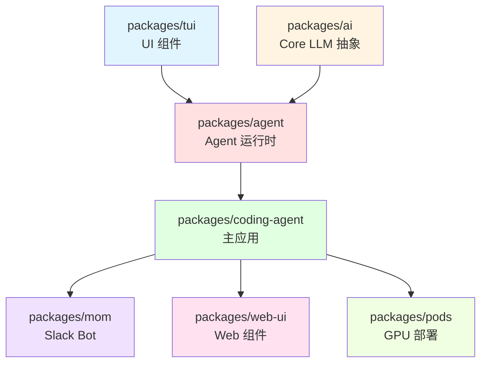

**依赖说明**：
- **TUI** 和 **AI** 是基础层，无相互依赖
- **Agent** 依赖 TUI（UI 渲染）和 AI（LLM 调用）
- **Coding Agent** 是主应用，依赖 Agent 运行时
- **Mom、WebUI、Pods** 是 Coding Agent 的应用层扩展

### 分层架构

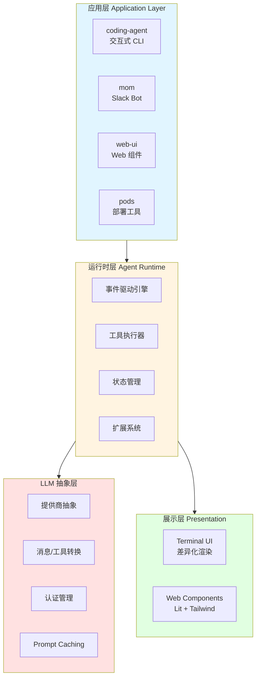

**层级职责**：
- **应用层**：面向用户的具体应用（CLI、Slack、Web、部署）
- **运行时层**：Agent 核心逻辑（事件、工具、状态、扩展）
- **LLM 抽象层**：统一的多提供商接口
- **展示层**：终端和 Web UI 渲染

---

## 核心包详解

### 1. @mariozechner/pi-ai (packages/ai/)

**作用**：统一的多提供商 LLM API 抽象层

#### 核心特性

1. **提供商无关的流式 API**
   - 标准化的消息格式
   - 统一的事件流协议
   - 跨提供商上下文传递

2. **提供商支持**（20+ 提供商文件）
   ```
   ├── anthropic.ts              # Anthropic Claude
   ├── openai-completions.ts     # OpenAI Completions
   ├── openai-responses.ts       # OpenAI Responses API
   ├── openai-codex-responses.ts # OpenAI Codex
   ├── google.ts                 # Google Gemini
   ├── google-gemini-cli.ts      # Gemini CLI
   ├── google-vertex.ts          # Google Vertex AI
   ├── amazon-bedrock.ts         # AWS Bedrock
   ├── mistral.ts                # Mistral AI
   ├── azure-openai-responses.ts # Azure OpenAI
   ├── cloudflare.ts             # Cloudflare Workers AI
   └── faux.ts                   # 测试用模拟提供商
   ```

3. **工具调用（Function Calling）**
   - 基于 TypeBox 的类型验证
   - 自动 JSON Schema 生成
   - 跨提供商工具格式转换

4. **认证机制**
   - API Key 认证
   - OAuth 认证（支持订阅制服务）
   - 自动令牌刷新

5. **性能优化**
   - Prompt caching（提示词缓存）
   - Token/成本追踪
   - 浏览器和 Node.js 双支持

#### 关键文件

**`src/models.generated.ts`** (15,591 行)
- 自动生成的模型注册表
- 包含所有提供商的模型信息
- 定期从提供商 API 抓取更新

**`src/types.ts`**
- 核心类型定义
- 消息格式、工具定义、提供商配置

**`src/providers/`**
- 各提供商的具体实现
- 每个提供商实现标准接口：
  - `stream<Provider>()` - 主流式函数
  - `streamSimple<Provider>()` - 简化接口
  - 消息转换函数
  - 工具转换函数
  - 响应解析函数

#### 设计模式

**提供商插件模式**：
```typescript
// 每个提供商实现统一的接口
interface Provider {
  stream(context: LLMContext): AsyncGenerator<LLMEvent>
  convertMessages(msgs: Message[]): ProviderMessage[]
  convertTools(tools: Tool[]): ProviderTool[]
  parseResponse(response: ProviderResponse): LLMEvent[]
}
```

---

### 2. @mariozechner/pi-agent-core (packages/agent/)

**作用**：Agent 运行时，负责工具执行和状态管理

#### 核心特性

1. **事件驱动架构**
   ```
   agent_start
     → turn_start
       → message_start
         → message_update (多次)
         → message_end
       → tool_execution (多次)
     → turn_end
   → agent_end
   ```

2. **工具执行策略**
   - 并行执行（默认）：多个工具调用同时执行
   - 顺序执行：工具调用逐个执行
   - 可按工具或全局配置

3. **钩子系统**
   - `beforeToolCall`: 工具调用前拦截
   - `afterToolCall`: 工具调用后处理
   - 可修改或阻止工具执行

4. **消息注入**
   - **Steering Messages**: 中断 Agent 执行，注入新指令
   - **Follow-up Messages**: 队列延迟消息，稍后处理

5. **上下文管理**
   - 上下文转换
   - 上下文压缩（用于长会话）
   - 自定义消息类型（通过声明合并）

#### 关键文件

**`src/agent.ts`** - 主 Agent 类
- 提供高级 API
- 管理工具注册
- 协调事件流

**`src/agent-loop.ts`** - 底层循环 API
- 直接控制 Agent 循环
- 适合需要精细控制的场景

#### 执行流程

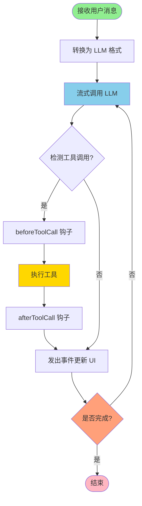

**关键步骤**：
1. **消息转换**：将内部消息格式转换为提供商特定格式
2. **流式调用**：实时接收 LLM 响应
3. **工具检测**：解析响应中的工具调用请求
4. **钩子执行**：在工具执行前后插入自定义逻辑
5. **事件广播**：通知所有监听器（UI、日志、扩展）

---

### 3. @mariozechner/pi-coding-agent (packages/coding-agent/)

**作用**：交互式编程助手 CLI，是主应用包

#### 核心特性

1. **四种运行模式**
   - **Interactive Mode**: 交互式终端 UI
   - **Print Mode**: 打印输出到 stdout
   - **JSON Mode**: JSON 格式输出
   - **RPC Mode**: 远程过程调用接口

2. **会话管理**
   - 树形会话结构（支持分支）
   - 会话持久化（JSONL 格式）
   - 会话压缩（长会话优化）
   - 导出为 HTML 或 GitHub Gist

3. **内置工具**
   - **read**: 读取文件（支持截断）
   - **bash**: 执行 shell 命令
   - **edit**: 搜索替换编辑
   - **write**: 创建或覆写文件
   - **grep**: 搜索文件内容
   - **find**: 按模式查找文件
   - **ls**: 列出目录内容

4. **扩展系统**
   - 注册自定义工具或覆盖内置工具
   - 添加斜杠命令
   - 钩入事件流
   - 自定义 UI 组件

5. **技能系统**
   - Agent Skills 标准
   - 可共享的技能包
   - 包管理器

6. **提示词模板**
   - 可定制的系统提示词
   - 上下文文件（AGENTS.md、CLAUDE.md）
   - 主题系统

#### 关键文件

**`src/core/agent-session.ts`** (103,390 字节)
- 主会话逻辑
- 协调所有组件
- 处理用户输入和 LLM 响应

**`src/core/session-manager.ts`** (43,006 字节)
- 会话持久化
- 会话树管理
- 压缩算法

**`src/core/extensions/`**
- 扩展系统实现
- ExtensionAPI 定义

**`src/modes/interactive/`**
- 交互式 TUI 实现
- 键盘绑定、渲染逻辑

**`src/core/tools/`**
- 内置工具实现
- TypeBox schema 定义

#### 会话树结构

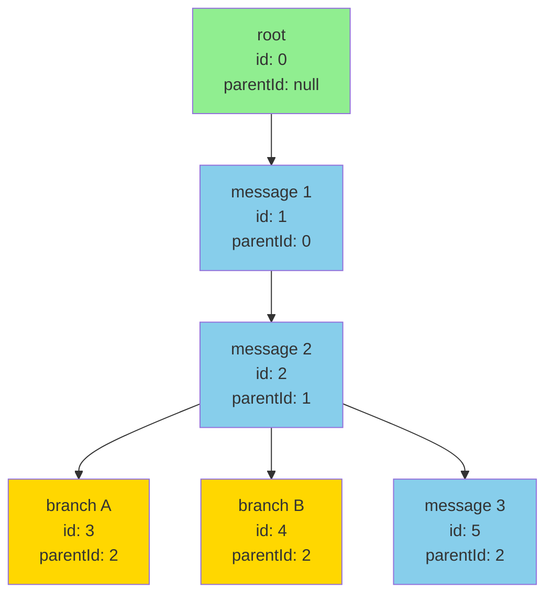

**树形结构的优势**：
- **原地分支**：在任意节点创建新分支，无需复制会话文件
- **高效存储**：所有分支共享相同的 JSONL 文件
- **灵活导航**：可在不同分支间自由切换
- **压缩优化**：可以单独压缩某个分支

---

### 4. @mariozechner/pi-tui (packages/tui/)

**作用**：终端 UI 库，提供高性能渲染

#### 核心特性

1. **差异化渲染**
   - 只更新变化的部分
   - 响应式 UI
   - 最小化重绘

2. **组件**
   - 文本编辑器（多行支持）
   - Markdown 渲染器（语法高亮）
   - 图像显示（终端内）
   - 键绑定管理

#### 技术实现

使用虚拟 DOM 模式实现差异化渲染：

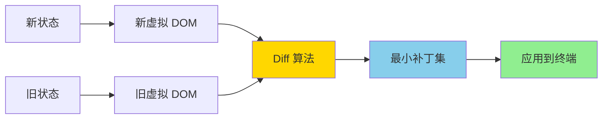

**性能优势**：
- 只重绘变化的部分，减少闪烁
- 响应式更新，即时反馈
- 支持复杂 UI（多窗口、叠加层）

---

### 5. @mariozechner/pi-mom (packages/mom/)

**作用**：Slack 机器人，将消息委派给 pi coding agent

#### 使用场景

- 团队协作 AI 助手
- Slack 集成
- 多用户共享会话

---

### 6. @mariozechner/pi-web-ui (packages/web-ui/)

**作用**：Web UI 组件库

#### 核心特性

- **Lit** 基础的 Web Components
- **Tailwind CSS** 样式
- 文档预览（PDF、DOCX、XLSX）
- 可复用的聊天 UI 组件

---

### 7. @mariozechner/pi (packages/pods/)

**作用**：GPU Pods 上的 vLLM 部署管理 CLI

#### 使用场景

- 自托管模型部署
- GPU 资源管理
- vLLM 配置

---

## 技术栈分析

### 语言与运行时

| 技术 | 版本 | 用途 |
|------|------|------|
| TypeScript | 5.9.2 | 主要开发语言 |
| Node.js | ≥20.6.0 | 运行环境 |
| ES2022 | - | 编译目标 |
| ESM | - | 模块系统 |

**为什么选择 TypeScript？**
- 类型安全，减少运行时错误
- 优秀的 IDE 支持
- 适合大型项目
- 与 LLM 工具调用完美配合（TypeBox）

### 构建工具

| 工具 | 版本 | 用途 | 选择理由 |
|------|------|------|----------|
| **tsgo** | 7.0.0-dev | TypeScript 编译器 | Go 实现，比 tsc 快 10-20 倍 |
| **Vitest** | 3.2.4 | 测试框架 | Vite 基础，快速，TypeScript 原生 |
| **Biome** | 2.3.5 | Linting + 格式化 | Rust 实现，替代 ESLint + Prettier |
| **Husky** | 9.1.7 | Git hooks | 标准 Git hooks 解决方案 |
| **shx** | 0.4.0 | 跨平台 shell 命令 | Windows/macOS/Linux 兼容 |

### 前端技术

| 技术 | 版本 | 用途 |
|------|------|------|
| Lit | 3.3.1 | Web Components |
| Tailwind CSS | 4.0 | 样式框架 |
| @xterm/xterm | 5.5.0 | 终端模拟（测试） |

### LLM Provider SDKs

| SDK | 版本 | 用途 |
|------|------|------|
| @anthropic-ai/sdk | 0.90.0 | Anthropic Claude API |
| openai | 6.26.0 | OpenAI API |
| @google/genai | 1.40.0 | Google Generative AI |
| @mistralai/mistralai | 2.2.0 | Mistral AI |
| @aws-sdk/client-bedrock-runtime | 3.1030.0 | AWS Bedrock |

**为什么使用官方 SDK？**
- 官方维护，兼容性保证
- 自动处理认证
- 正确的错误处理
- 及时更新

### 核心库

| 库 | 版本 | 用途 | 选择理由 |
|------|------|------|----------|
| **TypeBox** | 1.1.24 | 运行时类型验证 | JSON Schema 生成 + 类型安全 |
| chalk | 5.x | 终端颜色 | 行业标准 |
| marked | 15.0.12 | Markdown 解析 | 快速、成熟 |
| diff | 8.0.2 | 差异生成 | 显示代码变更 |
| glob | 13.0.1 | 文件模式匹配 | 强大的 glob 支持 |
| undici | 7.19.1 | HTTP 客户端 | 比原生 fetch 更好 |
| cli-highlight | 2.1.11 | 语法高亮 | 代码美化 |

**为什么选择 TypeBox？**

TypeBox 是项目的关键依赖，用于：

1. **运行时验证**
   ```typescript
   const schema = Type.Object({
     name: Type.String(),
     age: Type.Number()
   })
   // 运行时验证输入
   const value = Value.Parse(schema, input)
   ```

2. **JSON Schema 生成**
   - LLM 工具调用需要 JSON Schema
   - TypeBox 自动生成，无需手写

3. **类型推导**
   ```typescript
   type Person = Static<typeof schema>
   // 等价于 { name: string, age: number }
   ```

4. **分布式系统**
   - Schema 可以序列化
   - 跨服务共享类型定义

---

## 核心原理深入

### 1. Provider 抽象机制

#### 统一接口

所有提供商实现统一的流式接口：

```typescript
interface Provider {
  // 主流式函数
  stream(context: LLMContext): AsyncGenerator<LLMEvent>

  // 简化接口
  streamSimple(messages: Message[], options?: Options): AsyncGenerator<LLMEvent>

  // 消息转换
  convertMessages(messages: Message[]): ProviderMessage[]

  // 工具转换
  convertTools(tools: Tool[]): ProviderTool[]

  // 响应解析
  parseResponse(response: any): LLMEvent[]
}
```

#### 消息格式转换

不同提供商的消息格式不同：

**Anthropic 格式**：
```json
{
  "role": "user",
  "content": [
    { "type": "text", "text": "Hello" },
    { "type": "image", "source": {...} }
  ]
}
```

**OpenAI 格式**：
```json
{
  "role": "user",
  "content": "Hello"
}
```

pi-ai 的转换层统一处理这些差异：

```typescript
// OpenAI 提供商
convertMessages(messages) {
  return messages.map(msg => ({
    role: msg.role,
    content: typeof msg.content === 'string'
      ? msg.content
      : msg.content.map(c => convertContent(c))
  }))
}

// Anthropic 提供商
convertMessages(messages) {
  return messages.map(msg => ({
    role: msg.role,
    content: Array.isArray(msg.content)
      ? msg.content
      : [{ type: 'text', text: msg.content }]
  }))
}
```

#### 工具调用转换

工具调用格式也不统一：

**OpenAI 工具格式**：
```json
{
  "type": "function",
  "function": {
    "name": "get_weather",
    "parameters": {
      "type": "object",
      "properties": {...}
    }
  }
}
```

**Anthropic 工具格式**：
```json
{
  "name": "get_weather",
  "input_schema": {
    "type": "object",
    "properties": {...}
  }
}
```

转换逻辑：

```typescript
// OpenAI
convertTool(tool) {
  return {
    type: "function",
    function: {
      name: tool.name,
      description: tool.description,
      parameters: tool.parameters
    }
  }
}

// Anthropic
convertTool(tool) {
  return {
    name: tool.name,
    description: tool.description,
    input_schema: tool.parameters
  }
}
```

#### 跨提供商上下文传递

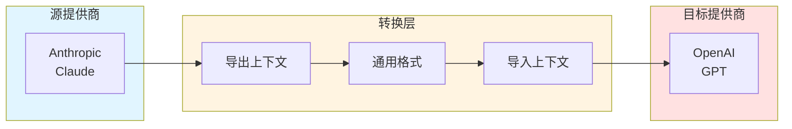

**上下文传递流程**：
```typescript
// 1. 从 Anthropic 会话导出
const context = anthropicProvider.exportContext(session)

// 2. 转换为通用格式
const universalContext = convertToUniversal(context)

// 3. 导入到 OpenAI
const openaiSession = openaiProvider.importContext(universalContext)
```

**支持的转换**：
- 消息格式转换
- 工具调用格式转换
- 图片和文件附件
- 系统提示词
- 会话元数据

---

### 2. Agent 事件循环

#### 事件流

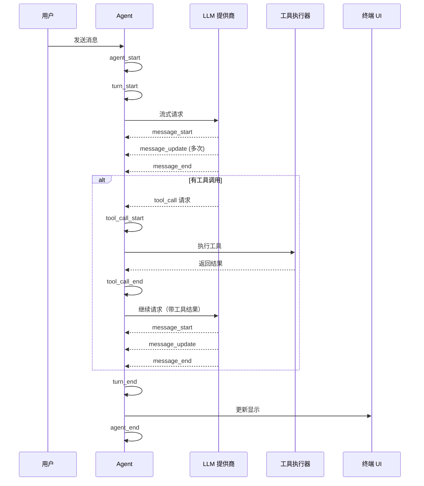

**事件类型**：
- `agent_start/agent_end`: Agent 生命周期
- `turn_start/turn_end`: 一个完整对话轮次
- `message_start/message_update/message_end`: LLM 消息生成
- `tool_call_start/tool_call_update/tool_call_end`: 工具执行过程

#### 并行工具执行

```typescript
async executeTools(tools: ToolCall[]) {
  if (this.config.parallelExecution) {
    // 并行执行
    const results = await Promise.all(
      tools.map(tool => this.executeTool(tool))
    )
    return results
  } else {
    // 顺序执行
    const results = []
    for (const tool of tools) {
      results.push(await this.executeTool(tool))
    }
    return results
  }
}
```

#### 钩子系统

```typescript
// 工具调用前拦截
async beforeToolCall(tool: ToolCall, context: Context) {
  // 可以：
  // 1. 修改工具参数
  tool.parameters = { ...tool.parameters, extra: 'data' }

  // 2. 阻止工具执行
  return { cancel: true, reason: 'Not allowed' }

  // 3. 添加日志
  logger.log(`Executing ${tool.name}`)
}

// 工具调用后处理
async afterToolCall(tool: ToolCall, result: any, context: Context) {
  // 可以：
  // 1. 修改结果
  return { ...result, extra: 'metadata' }

  // 2. 记录指标
  metrics.record(tool.name, result.duration)

  // 3. 触发副作用
  if (tool.name === 'write') {
    await runLinter(result.filePath)
  }
}
```

---

### 3. 扩展系统

#### 扩展 API

```typescript
interface ExtensionAPI {
  // 注册工具
  registerTool(tool: ToolDefinition): void

  // 注册命令
  registerCommand(name: string, handler: CommandHandler): void

  // 注册事件钩子
  on(event: EventType, handler: EventHandler): void

  // 注册 UI 组件
  registerEditor(editor: EditorComponent): void
  registerOverlay(overlay: OverlayComponent): void
  registerStatusLine(status: StatusLineComponent): void
  registerFooter(footer: FooterComponent): void

  // 注册提供商
  registerProvider(provider: Provider): void

  // 访问内部 API
  getAgent(): Agent
  getSession(): Session
  getConfig(): Config
}
```

#### 扩展示例

```typescript
// examples/extensions/git-checkpoint.ts
export default function (pi: ExtensionAPI) {
  // 在每次工具调用后自动 git commit
  pi.on('tool_call', async (event, ctx) => {
    if (event.toolName === 'write' || event.toolName === 'edit') {
      const filePath = event.parameters.file_path

      // 添加到暂存区
      await pi.getAgent().executeTool('bash', {
        command: `git add ${filePath}`
      })

      // 提交
      await pi.getAgent().executeTool('bash', {
        command: `git commit -m "Auto-checkpoint: ${event.toolName} ${filePath}"`
      })
    }
  })
}
```

#### 扩展加载流程

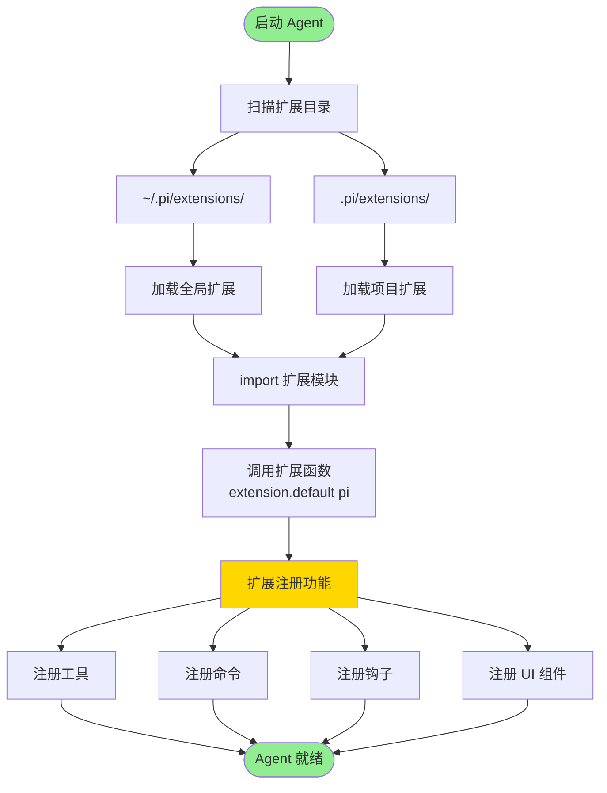

**扩展目录结构**：
```
~/.pi/extensions/           # 全局扩展
├── git-checkpoint/
│   ├── package.json
│   └── index.ts
└── subagent/
    ├── package.json
    └── index.ts

.pi/extensions/             # 项目扩展
└── my-custom-tool.ts
```

---

### 4. 会话管理

#### JSONL 格式

每行一个 JSON 对象：

```jsonl
{"type":"user_message","id":1,"parentId":0,"content":"Hello","timestamp":"2026-04-29T10:00:00Z"}
{"type":"assistant_message","id":2,"parentId":1,"content":"Hi! How can I help?","timestamp":"2026-04-29T10:00:05Z"}
{"type":"tool_call","id":3,"parentId":2,"tool":"read","parameters":{...},"timestamp":"2026-04-29T10:00:10Z"}
```

#### 树形结构

```typescript
interface SessionEntry {
  id: number
  parentId: number | null
  type: 'user_message' | 'assistant_message' | 'tool_call' | ...
  content: any
  timestamp: string
}

// 构建树
function buildTree(entries: SessionEntry[]): TreeNode {
  const nodes = new Map<number, TreeNode>()

  // 创建节点
  for (const entry of entries) {
    nodes.set(entry.id, { ...entry, children: [] })
  }

  // 连接父子关系
  let root: TreeNode | null = null
  for (const entry of entries) {
    const node = nodes.get(entry.id)!
    if (entry.parentId === null) {
      root = node
    } else {
      const parent = nodes.get(entry.parentId)!
      parent.children.push(node)
    }
  }

  return root!
}
```

#### 会话压缩

长会话需要压缩以适应上下文窗口：

```typescript
async compactSession(session: Session): Promise<Session> {
  // 1. 识别老消息
  const oldMessages = session.messages.slice(0, -20)
  const recentMessages = session.messages.slice(-20)

  // 2. 总结老消息
  const summary = await this.llm.summarize(oldMessages)

  // 3. 创建新的压缩会话
  return {
    messages: [
      { role: 'system', content: summary },
      ...recentMessages
    ]
  }
}
```

---

### 5. 工具执行

#### 工具定义

使用 TypeBox 定义 schema：

```typescript
import { Type } from '@sinclair/typebox'

const readTool = {
  name: 'read',
  description: 'Read a file from the filesystem',
  parameters: Type.Object({
    file_path: Type.String({
      description: 'The absolute path to the file to read'
    }),
    offset: Type.Optional(Type.Number({
      description: 'Line number to start reading from'
    })),
    limit: Type.Optional(Type.Number({
      description: 'Number of lines to read'
    }))
  })
}
```

#### 工具实现

```typescript
async function executeRead(params: {
  file_path: string
  offset?: number
  limit?: number
}): Promise<string> {
  // 1. 验证参数
  const validated = Value.Parse(readTool.parameters, params)

  // 2. 读取文件
  const content = await fs.readFile(validated.file_path, 'utf-8')

  // 3. 应用 offset/limit
  const lines = content.split('\n')
  const start = validated.offset || 0
  const end = validated.limit ? start + validated.limit : lines.length
  const selected = lines.slice(start, end)

  // 4. 添加行号
  return selected.map((line, i) => `${start + i + 1}\t${line}`).join('\n')
}
```

#### 工具调用流程

```mermaid
sequenceDiagram
    participant LLM as LLM
    participant Agent as Agent
    participant Validator as 参数验证器
    participant Tool as 工具实现
    participant FS as 文件系统

    LLM->>Agent: 决定调用工具
    Note over LLM,Agent: {<br/>  "name": "read",<br/>  "parameters": {<br/>    "file_path": "/path/to/file"<br/>  }<br/>}

    Agent->>Validator: 验证参数
    Validator->>Validator: TypeBox Schema 验证
    Validator-->>Agent: 验证通过

    Agent->>Tool: executeRead(parameters)
    Tool->>FS: readFile(file_path)
    FS-->>Tool: 文件内容
    Tool-->>Agent: 格式化结果（带行号）

    Agent->>LLM: 返回工具结果
    Note over Agent,LLM: {<br/>  "role": "tool",<br/>  "content": "1\\tHello\\n2\\tWorld"<br/>}

    LLM->>LLM: 继续处理

    style LLM fill:#e1f5ff
    style Agent fill:#fff4e1
    style Validator fill:#ffe1e1
    style Tool fill:#e1ffe1
    style FS fill:#f0e1ff
```

**安全保障**：
- TypeBox 提供运行时类型验证
- 防止无效参数导致错误
- 自动生成 JSON Schema 供 LLM 使用

---

## 构建系统

### 构建流程

```bash
npm run build
```

执行顺序（基于依赖关系）：

```
1. packages/tui
   ↓
2. packages/ai
   ↓
3. packages/agent
   ↓
4. packages/coding-agent
   ↓
5. packages/mom
   ↓
6. packages/web-ui
   ↓
7. packages/pods
```

### 构建产物

每个包输出到 `dist/` 目录：

```
dist/
├── index.js              # ESM 模块
├── index.js.map          # Source map
├── index.d.ts            # 类型声明
├── index.d.ts.map        # 类型声明 map
└── assets/               # 静态资源
    ├── themes/
    └── prompts/
```

### TypeScript 配置

#### 基础配置 (`tsconfig.base.json`)

```json
{
  "compilerOptions": {
    "target": "ES2022",
    "module": "Node16",
    "moduleResolution": "Node16",
    "lib": ["ES2022"],
    "strict": true,
    "esModuleInterop": true,
    "skipLibCheck": true,
    "forceConsistentCasingInFileNames": true,
    "declaration": true,
    "declarationMap": true,
    "sourceMap": true
  }
}
```

#### 路径别名 (`tsconfig.json`)

```json
{
  "compilerOptions": {
    "paths": {
      "@mariozechner/pi-ai": ["./packages/ai/src/index.ts"],
      "@mariozechner/pi-agent-core": ["./packages/agent/src/index.ts"],
      "@mariozechner/pi-coding-agent": ["./packages/coding-agent/src/index.ts"],
      "@mariozechner/pi-tui": ["./packages/tui/src/index.ts"]
    }
  }
}
```

### 开发模式

```bash
npm run dev
```

使用 `tsgo --watch` 监听文件变化，自动重新编译。

### 模型生成

```bash
npm run generate-models
```

从各提供商 API 抓取最新的模型信息，更新 `packages/ai/src/models.generated.ts`。

---

## 配置管理

### 配置层次

```
1. 默认配置（代码内置）
   ↓
2. 全局配置（~/.pi/agent/settings.json）
   ↓
3. 项目配置（.pi/settings.json）
   ↓
4. 环境变量（PI_*）
   ↓
5. 命令行参数
```

### 配置文件结构

#### 全局配置 (`~/.pi/agent/settings.json`)

```json
{
  "model": "claude-sonnet-4-6",
  "provider": "anthropic",
  "apiKey": "${ANTHROPIC_API_KEY}",

  "extensions": [
    "git-checkpoint",
    "subagent"
  ],

  "skills": [
    "tdd",
    "debugging"
  ],

  "theme": "dark",

  "maxTokens": 4096,
  "temperature": 0.7,

  "parallelExecution": true,

  "compaction": {
    "enabled": true,
    "threshold": 100
  }
}
```

#### 项目配置 (`.pi/settings.json`)

```json
{
  "model": "gpt-4-turbo",
  "contextFile": "CLAUDE.md",

  "tools": {
    "bash": {
      "timeout": 120000,
      "allowedCommands": ["npm", "git", "docker"]
    }
  },

  "hooks": {
    "beforeToolCall": "./hooks/before-tool.sh",
    "afterToolCall": "./hooks/after-tool.sh"
  }
}
```

#### 上下文文件 (`CLAUDE.md` 或 `AGENTS.md`)

```markdown
# Project Context

## Architecture
This is a monorepo using npm workspaces...

## Coding Standards
- Use TypeScript strict mode
- Follow Airbnb style guide
- Write tests for all new features

## Preferences
- Prefer functional programming
- Avoid class inheritance
- Use immutable data structures
```

### 环境变量

```bash
# API Keys
PI_ANTHROPIC_API_KEY=sk-ant-...
PI_OPENAI_API_KEY=sk-...
PI_GOOGLE_API_KEY=...

# Provider
PI_PROVIDER=anthropic
PI_MODEL=claude-sonnet-4-6

# Config
PI_CONFIG_PATH=/custom/path/settings.json
PI_SESSIONS_DIR=/custom/path/sessions

# Debug
PI_DEBUG=true
PI_LOG_LEVEL=debug
```

---

## 扩展机制

### 扩展类型

1. **工具扩展**
   - 添加新工具
   - 覆盖内置工具

2. **命令扩展**
   - 添加斜杠命令
   - 自定义交互逻辑

3. **钩子扩展**
   - 事件监听器
   - 生命周期钩子

4. **UI 扩展**
   - 自定义编辑器
   - 覆盖层
   - 状态栏
   - 底部栏

5. **提供商扩展**
   - 添加新的 LLM 提供商

### 扩展示例

#### 1. 自定义工具

```typescript
// my-extension.ts
export default function (pi: ExtensionAPI) {
  pi.registerTool({
    name: 'deploy',
    description: 'Deploy the current project to production',
    parameters: Type.Object({
      environment: Type.Union([
        Type.Literal('staging'),
        Type.Literal('production')
      ]),
      branch: Type.Optional(Type.String())
    }),

    async execute(params, context) {
      const branch = params.branch || 'main'

      // 运行部署脚本
      const result = await pi.getAgent().executeTool('bash', {
        command: `./deploy.sh ${params.environment} ${branch}`
      })

      // 返回结果
      return {
        success: result.exitCode === 0,
        output: result.stdout,
        url: extractUrl(result.stdout)
      }
    }
  })
}
```

#### 2. 斜杠命令

```typescript
export default function (pi: ExtensionAPI) {
  pi.registerCommand('stats', {
    description: 'Show session statistics',

    async handler(args, context) {
      const session = pi.getSession()
      const stats = {
        totalMessages: session.messages.length,
        totalTokens: session.totalTokens,
        totalCost: session.totalCost,
        toolCalls: session.toolCalls.length,
        duration: session.duration
      }

      return JSON.stringify(stats, null, 2)
    }
  })
}
```

#### 3. 事件钩子

```typescript
export default function (pi: ExtensionAPI) {
  // 监听所有工具调用
  pi.on('tool_call', async (event, context) => {
    console.log(`Tool called: ${event.toolName}`)
    console.log(`Parameters:`, event.parameters)
  })

  // 监听消息
  pi.on('message', async (event, context) => {
    if (event.role === 'assistant') {
      console.log(`Assistant: ${event.content}`)
    }
  })

  // 监听 Agent 生命周期
  pi.on('agent_start', async (event, context) => {
    console.log('Agent started')
  })

  pi.on('agent_end', async (event, context) => {
    console.log('Agent finished')
  })
}
```

#### 4. UI 组件

```typescript
export default function (pi: ExtensionAPI) {
  // 状态栏组件
  pi.registerStatusLine({
    position: 'right',

    render(context) {
      const tokens = context.session.totalTokens
      const cost = context.session.totalCost
      return `${tokens} tokens | $${cost.toFixed(4)}`
    }
  })

  // 覆盖层组件
  pi.registerOverlay({
    id: 'progress',

    async show(context) {
      // 显示进度条
      return {
        content: 'Processing...',
        position: 'center'
      }
    },

    async hide() {
      // 隐藏覆盖层
    }
  })
}
```

#### 5. 提供商扩展

```typescript
export default function (pi: ExtensionAPI) {
  pi.registerProvider({
    name: 'custom-provider',

    async stream(context) {
      // 实现流式 API
      const response = await fetch('https://api.custom-llm.com/v1/chat', {
        method: 'POST',
        headers: {
          'Authorization': `Bearer ${context.apiKey}`,
          'Content-Type': 'application/json'
        },
        body: JSON.stringify({
          messages: context.messages,
          model: context.model
        })
      })

      // 返回事件流
      return parseStream(response.body)
    },

    convertMessages(messages) {
      // 转换消息格式
      return messages.map(msg => ({
        role: msg.role,
        text: msg.content
      }))
    },

    convertTools(tools) {
      // 转换工具格式
      return tools.map(tool => ({
        function_name: tool.name,
        function_definition: tool.parameters
      }))
    }
  })
}
```

### 扩展分发

扩展可以通过 npm 包分发：

```bash
# 安装扩展
npm install -g @my-org/pi-deploy-extension

# 或者在项目中
npm install --save-dev @my-org/pi-deploy-extension
```

扩展会在启动时自动加载。

---

## 最佳实践

### 1. 性能优化

#### 减少上下文大小

```typescript
// ❌ 不好：读取整个文件
await read({ file_path: '/large/file.log' })

// ✅ 好：只读取需要的部分
await read({
  file_path: '/large/file.log',
  offset: 100,
  limit: 50
})
```

#### 使用 Prompt Caching

```typescript
// 在系统提示词中使用缓存标记
const systemPrompt = `
<cached>
You are a helpful coding assistant.
Project architecture: monorepo with 7 packages...
</cached>

Current task: ${userTask}
`
```

#### 并行工具执行

```typescript
// 在配置中启用
{
  "parallelExecution": true
}
```

### 2. 成本控制

#### 监控 Token 使用

```typescript
pi.on('message_end', (event, context) => {
  const usage = event.usage
  console.log(`Input: ${usage.input_tokens}`)
  console.log(`Output: ${usage.output_tokens}`)
  console.log(`Cost: $${calculateCost(usage)}`)
})
```

#### 使用合适的模型

```typescript
// 简单任务用快速模型
{
  "model": "claude-haiku-4-5"  // 快速、便宜
}

// 复杂任务用强力模型
{
  "model": "claude-opus-4-6"  // 强力、昂贵
}
```

### 3. 安全性

#### 限制工具权限

```typescript
// 在配置中限制
{
  "tools": {
    "bash": {
      "allowedCommands": ["npm", "git", "ls", "cat"],
      "blockedCommands": ["rm -rf", "sudo"],
      "timeout": 30000
    }
  }
}
```

#### 验证用户输入

```typescript
// 使用 TypeBox 验证
const schema = Type.Object({
  command: Type.String({
    pattern: "^(npm|git) .*"  // 只允许 npm 和 git
  })
})

const validated = Value.Parse(schema, params)
```

### 4. 调试技巧

#### 启用调试模式

```bash
PI_DEBUG=true pi
```

#### 记录事件

```typescript
pi.on('*', (event, context) => {
  logger.debug('Event:', event.type, event)
})
```

#### 导出会话

```bash
# 导出为 HTML
pi export session.jsonl output.html

# 导出为 Gist
pi gist session.jsonl
```

### 5. 测试

#### 单元测试

```typescript
import { describe, it, expect } from 'vitest'
import { Agent } from '@mariozechner/pi-agent-core'

describe('Agent', () => {
  it('should execute tools', async () => {
    const agent = new Agent({
      provider: 'faux',  // 测试提供商
      model: 'test-model'
    })

    const result = await agent.execute({
      messages: [{ role: 'user', content: 'test' }]
    })

    expect(result.messages).toHaveLength(2)
  })
})
```

#### 集成测试

```typescript
describe('Extension Integration', () => {
  it('should load and execute extension', async () => {
    const pi = new PiCodingAgent()
    await pi.loadExtension('./test-extension.ts')

    const result = await pi.executeCommand('test')

    expect(result).toBe('success')
  })
})
```

---

## 总结

### 项目优势

1. **架构清晰**
   - 分层设计，职责明确
   - 模块化，可独立使用各层

2. **极致可扩展**
   - 扩展系统功能强大
   - 几乎可以定制所有行为

3. **提供商无关**
   - 统一 API，无缝切换
   - 支持 25+ 提供商

4. **开发者友好**
   - TypeScript 全栈
   - 优秀的类型支持
   - 丰富的文档和示例

5. **性能优异**
   - 使用现代工具（tsgo、Biome、Vitest）
   - 差异化渲染
   - Prompt caching

### 技术亮点

1. **TypeBox 集成**
   - 运行时验证 + 类型安全
   - 自动 JSON Schema 生成
   - LLM 工具调用完美配合

2. **事件驱动架构**
   - 灵活的事件流
   - 强大的钩子系统
   - 易于扩展和监控

3. **树形会话结构**
   - 原地分支
   - 高效存储
   - 会话压缩

4. **Provider 插件模式**
   - 统一接口
   - 自动转换
   - 跨提供商传递

### 适用场景

1. **个人开发助手**
   - 交互式编程
   - 代码生成和重构
   - 调试和测试

2. **团队协作**
   - Slack 集成（pi-mom）
   - 会话共享
   - 统一工作流

3. **集成开发**
   - SDK 编程模式
   - RPC 接口
   - 自动化脚本

4. **研究和实验**
   - 多模型对比
   - 提示词工程
   - Agent 行为研究

---

## 附录

### 关键文件路径

```
pi-mono/
├── packages/
│   ├── ai/
│   │   ├── src/
│   │   │   ├── models.generated.ts      # 模型注册表
│   │   │   ├── types.ts                 # 核心类型
│   │   │   └── providers/               # 提供商实现
│   │   └── package.json
│   │
│   ├── agent/
│   │   ├── src/
│   │   │   ├── agent.ts                 # 主 Agent 类
│   │   │   └── agent-loop.ts            # 底层循环
│   │   └── package.json
│   │
│   ├── coding-agent/
│   │   ├── src/
│   │   │   ├── core/
│   │   │   │   ├── agent-session.ts     # 会话逻辑
│   │   │   │   ├── session-manager.ts   # 会话管理
│   │   │   │   ├── extensions/          # 扩展系统
│   │   │   │   └── tools/               # 内置工具
│   │   │   └── modes/
│   │   │       └── interactive/         # 交互式 TUI
│   │   ├── examples/
│   │   │   └── extensions/              # 扩展示例
│   │   └── package.json
│   │
│   ├── tui/
│   │   ├── src/
│   │   │   └── (UI 组件)
│   │   └── package.json
│   │
│   ├── mom/
│   │   └── (Slack bot)
│   │
│   ├── web-ui/
│   │   └── (Web components)
│   │
│   └── pods/
│       └── (GPU deployment)
│
├── tsconfig.json                        # TypeScript 配置
├── tsconfig.base.json                   # 基础 TS 配置
├── biome.json                           # Linting/格式化
├── package.json                         # Workspace 定义
└── .github/
    └── workflows/
        ├── ci.yml                       # CI 流程
        ├── build-binaries.yml           # 二进制构建
        └── (其他工作流)
```

### 常用命令

```bash
# 安装依赖
npm install

# 开发模式（监听文件变化）
npm run dev

# 构建
npm run build

# 检查（lint + format + type check）
npm run check

# 测试
npm test

# 生成模型注册表
npm run generate-models

# 从源码运行
./pi-test.sh

# 运行测试（无 API keys）
./test.sh

# 发布
./scripts/release.mjs <version>
```

### 有用的链接

- **GitHub**: (项目仓库地址)
- **文档**: README.md
- **示例**: packages/coding-agent/examples/
- **问题反馈**: (Issue tracker)

---

## 实践指南

本章节将带你通过实际案例学习如何使用 pi-mono 框架构建各种 AI 应用。

### 案例一：构建自定义 AI 代码审查工具

#### 场景描述

构建一个自动代码审查工具，当开发者提交代码时，自动分析代码质量、安全漏洞和性能问题。

#### 实现步骤

**1. 创建扩展目录结构**

```bash
mkdir -p ~/.pi/extensions/code-reviewer
cd ~/.pi/extensions/code-reviewer
npm init -y
```

**2. 实现扩展代码**

创建 `index.ts`：

```typescript
import { Type } from '@sinclair/typebox'

export default function (pi: ExtensionAPI) {
  // 注册代码审查工具
  pi.registerTool({
    name: 'code_review',
    description: 'Review code for quality, security, and performance issues',
    parameters: Type.Object({
      file_path: Type.String({
        description: 'Path to the file to review'
      }),
      review_type: Type.Optional(Type.Union([
        Type.Literal('quality'),
        Type.Literal('security'),
        Type.Literal('performance'),
        Type.Literal('all')
      ], { default: 'all' }))
    }),

    async execute(params, context) {
      // 1. 读取文件
      const fileContent = await pi.getAgent().executeTool('read', {
        file_path: params.file_path
      })

      // 2. 构建审查提示词
      const reviewPrompt = buildReviewPrompt(fileContent, params.review_type)

      // 3. 调用 LLM 进行审查
      const review = await context.llm.chat({
        messages: [
          { role: 'system', content: getSystemPrompt(params.review_type) },
          { role: 'user', content: reviewPrompt }
        ]
      })

      // 4. 返回审查结果
      return {
        file: params.file_path,
        issues: parseIssues(review.content),
        suggestions: parseSuggestions(review.content),
        summary: extractSummary(review.content)
      }
    }
  })

  // 注册 Git 钩子，自动审查提交的代码
  pi.on('tool_call', async (event, context) => {
    if (event.toolName === 'bash' && event.parameters.command.includes('git commit')) {
      // 获取暂存的文件
      const stagedFiles = await getStagedFiles()

      // 审查每个文件
      for (const file of stagedFiles) {
        const review = await pi.getAgent().executeTool('code_review', {
          file_path: file,
          review_type: 'all'
        })

        // 显示审查结果
        if (review.issues.length > 0) {
          console.log(`\n⚠️  Issues found in ${file}:`)
          review.issues.forEach(issue => {
            console.log(`  - ${issue.severity}: ${issue.message}`)
          })
        }
      }
    }
  })
}

function getSystemPrompt(reviewType: string): string {
  const prompts = {
    quality: `You are a code quality expert. Focus on:
- Code organization and structure
- Naming conventions
- Code duplication
- Complexity and readability`,

    security: `You are a security expert. Focus on:
- Injection vulnerabilities (SQL, XSS, etc.)
- Authentication and authorization issues
- Sensitive data exposure
- Security misconfigurations`,

    performance: `You are a performance expert. Focus on:
- Algorithm complexity
- Memory leaks
- Unnecessary computations
- Database query optimization`,

    all: `You are a senior software engineer. Review code for:
- Quality issues
- Security vulnerabilities
- Performance problems
- Best practices violations`
  }

  return prompts[reviewType] || prompts.all
}

function buildReviewPrompt(content: string, reviewType: string): string {
  return `Please review the following code for ${reviewType} issues:

\`\`\`
${content}
\`\`\`

Provide:
1. A summary of the code
2. List of issues found (with severity: critical/high/medium/low)
3. Specific suggestions for improvement
4. Overall code quality score (1-10)`
}

function parseIssues(review: string): any[] {
  // 解析 LLM 返回的审查结果
  // 提取问题列表
  return []
}

function parseSuggestions(review: string): string[] {
  // 提取建议列表
  return []
}

function extractSummary(review: string): string {
  // 提取摘要
  return ''
}

async function getStagedFiles(): Promise<string[]> {
  // 执行 git diff --name-only --cached
  return []
}
```

**3. 配置使用**

在项目根目录创建 `.pi/settings.json`：

```json
{
  "extensions": ["code-reviewer"],
  "hooks": {
    "preCommit": true
  }
}
```

**4. 使用示例**

```bash
# 手动审查文件
pi
> Review the authentication module
> code_review --file_path ./src/auth/login.ts --review_type security

# 自动审查（Git 钩子触发）
git add src/auth/login.ts
git commit -m "Update login logic"
# 自动执行代码审查
```

#### 架构分析

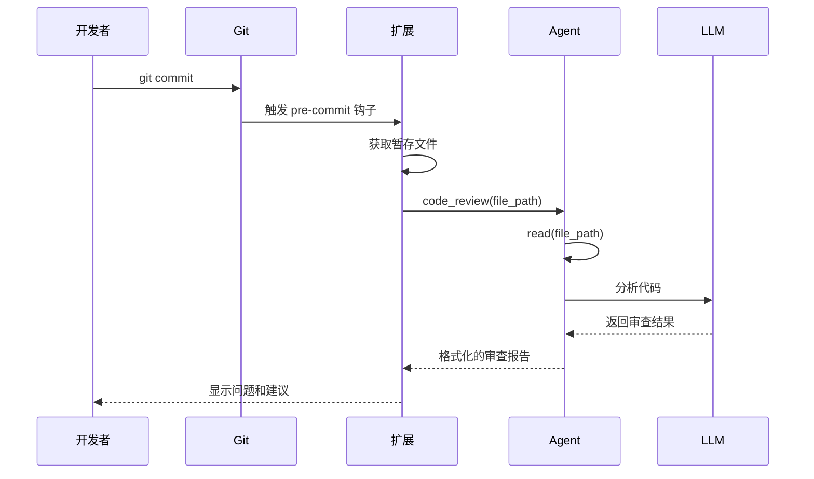

**关键技术点**：
1. **工具注册**：通过 `pi.registerTool()` 添加自定义工具
2. **事件钩子**：监听 `tool_call` 事件实现自动化
3. **工具组合**：调用内置 `read` 工具读取文件
4. **上下文访问**：通过 `context.llm` 调用 LLM

---

### 案例二：构建多模型对比工具

#### 场景描述

同时使用多个 LLM 模型（Claude、GPT-4、Gemini）处理同一任务，对比结果选择最佳答案。

#### 实现步骤

**1. 创建扩展**

```typescript
// ~/.pi/extensions/model-compare/index.ts
import { Type } from '@sinclair/typebox'

interface ModelResult {
  provider: string
  model: string
  response: string
  tokens: number
  cost: number
  duration: number
}

export default function (pi: ExtensionAPI) {
  pi.registerTool({
    name: 'compare_models',
    description: 'Compare responses from multiple LLM providers',
    parameters: Type.Object({
      prompt: Type.String({
        description: 'The prompt to send to all models'
      }),
      models: Type.Optional(Type.Array(Type.Object({
        provider: Type.String(),
        model: Type.String()
      })), {
        default: [
          { provider: 'anthropic', model: 'claude-sonnet-4-6' },
          { provider: 'openai', model: 'gpt-4-turbo' },
          { provider: 'google', model: 'gemini-1.5-pro' }
        ]
      }),
      compare_mode: Type.Optional(Type.Union([
        Type.Literal('parallel'),    // 并行调用
        Type.Literal('sequential')   // 顺序调用
      ], { default: 'parallel' }))
    }),

    async execute(params, context) {
      const results: ModelResult[] = []

      if (params.compare_mode === 'parallel') {
        // 并行调用所有模型
        const promises = params.models.map(async (config) => {
          return await callModel(pi, config, params.prompt)
        })
        results.push(...await Promise.all(promises))
      } else {
        // 顺序调用所有模型
        for (const config of params.models) {
          const result = await callModel(pi, config, params.prompt)
          results.push(result)
        }
      }

      // 分析和对比结果
      const comparison = analyzeResults(results)

      return {
        results,
        comparison,
        recommendation: selectBest(comparison)
      }
    }
  })

  // 注册斜杠命令快速对比
  pi.registerCommand('compare', {
    description: 'Quick model comparison',

    async handler(args, context) {
      const prompt = args.join(' ')
      const result = await pi.getAgent().executeTool('compare_models', {
        prompt,
        models: [
          { provider: 'anthropic', model: 'claude-sonnet-4-6' },
          { provider: 'openai', model: 'gpt-4-turbo' }
        ]
      })

      // 格式化输出
      return formatComparison(result)
    }
  })
}

async function callModel(
  pi: ExtensionAPI,
  config: { provider: string, model: string },
  prompt: string
): Promise<ModelResult> {
  const startTime = Date.now()

  // 创建临时 Agent 实例
  const agent = pi.getAgent().createChild({
    provider: config.provider,
    model: config.model
  })

  // 调用 LLM
  const response = await agent.chat({
    messages: [{ role: 'user', content: prompt }]
  })

  const duration = Date.now() - startTime

  return {
    provider: config.provider,
    model: config.model,
    response: response.content,
    tokens: response.usage.total_tokens,
    cost: calculateCost(config.provider, response.usage),
    duration
  }
}

function analyzeResults(results: ModelResult[]): any {
  return {
    fastest: results.reduce((a, b) => a.duration < b.duration ? a : b),
    cheapest: results.reduce((a, b) => a.cost < b.cost ? a : b),
    mostEfficient: results.reduce((a, b) =>
      a.tokens / a.cost > b.tokens / b.cost ? a : b
    ),
    responseLengths: results.map(r => ({
      model: r.model,
      length: r.response.length
    }))
  }
}

function selectBest(comparison: any): ModelResult {
  // 根据多个因素加权选择最佳结果
  // 可以考虑：速度、成本、质量等
  return comparison.cheapest
}

function calculateCost(provider: string, usage: any): number {
  // 根据提供商的定价计算成本
  const prices = {
    anthropic: { input: 0.003, output: 0.015 },
    openai: { input: 0.01, output: 0.03 },
    google: { input: 0.00125, output: 0.005 }
  }

  const price = prices[provider]
  return (usage.input_tokens * price.input / 1000) +
         (usage.output_tokens * price.output / 1000)
}

function formatComparison(result: any): string {
  let output = '# Model Comparison Results\n\n'

  output += '## Responses\n\n'
  result.results.forEach(r => {
    output += `### ${r.provider} / ${r.model}\n`
    output += `**Tokens**: ${r.tokens} | **Cost**: $${r.cost.toFixed(4)} | **Duration**: ${r.duration}ms\n\n`
    output += `${r.response}\n\n`
  })

  output += '## Analysis\n\n'
  output += `- **Fastest**: ${result.comparison.fastest.model}\n`
  output += `- **Cheapest**: ${result.comparison.cheapest.model}\n`
  output += `- **Most Efficient**: ${result.comparison.mostEfficient.model}\n`

  output += `\n**Recommended**: ${result.recommendation.model}\n`

  return output
}
```

**2. 使用示例**

```bash
# 在交互模式中使用
pi
> Compare how different models explain recursion
> /compare Explain recursion to a beginner

# 或直接调用工具
> compare_models --prompt "Write a function to reverse a string"
```

#### 架构分析

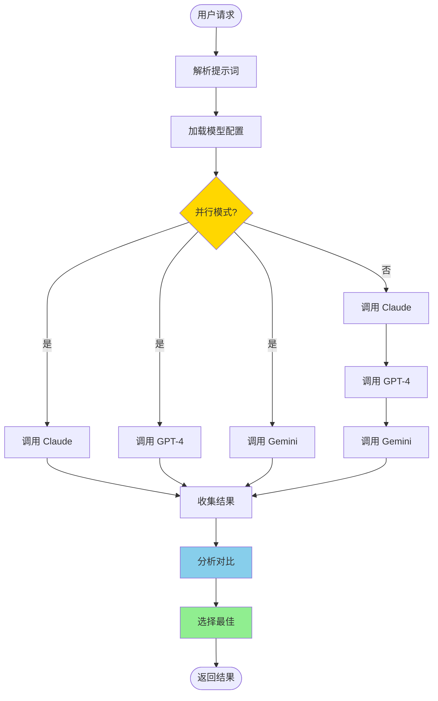

**关键技术点**：
1. **多提供商支持**：利用 pi-ai 的统一接口
2. **并行执行**：使用 Promise.all 同时调用多个模型
3. **成本计算**：根据实际 token 使用量计算成本
4. **结果分析**：多维度对比（速度、成本、效率）

---

### 案例三：构建团队协作知识库

#### 场景描述

为团队构建一个共享的知识库系统，支持：
- 自动从对话中提取知识点
- 按项目/主题分类存储
- 快速检索和复用
- Slack 集成供团队查询

#### 实现步骤

**1. 创建知识库扩展**

```typescript
// ~/.pi/extensions/knowledge-base/index.ts
import { Type } from '@sinclair/typebox'
import * as fs from 'fs/promises'
import * as path from 'path'

interface Knowledge {
  id: string
  title: string
  content: string
  tags: string[]
  project: string
  created_at: string
  author: string
  references: string[]
}

export default function (pi: ExtensionAPI) {
  const KB_DIR = path.join(process.env.HOME, '.pi', 'knowledge-base')

  // 确保知识库目录存在
  await fs.mkdir(KB_DIR, { recursive: true })

  // 注册知识库工具
  pi.registerTool({
    name: 'kb_save',
    description: 'Save knowledge to the knowledge base',
    parameters: Type.Object({
      title: Type.String(),
      content: Type.String(),
      tags: Type.Optional(Type.Array(Type.String())),
      project: Type.Optional(Type.String()),
      references: Type.Optional(Type.Array(Type.String()))
    }),

    async execute(params, context) {
      const knowledge: Knowledge = {
        id: generateId(),
        title: params.title,
        content: params.content,
        tags: params.tags || [],
        project: params.project || 'general',
        created_at: new Date().toISOString(),
        author: context.user?.name || 'anonymous',
        references: params.references || []
      }

      // 保存到文件
      const filePath = path.join(KB_DIR, `${knowledge.id}.json`)
      await fs.writeFile(filePath, JSON.stringify(knowledge, null, 2))

      // 更新索引
      await updateIndex(KB_DIR, knowledge)

      return {
        success: true,
        id: knowledge.id,
        message: `Knowledge saved: ${knowledge.title}`
      }
    }
  })

  pi.registerTool({
    name: 'kb_search',
    description: 'Search the knowledge base',
    parameters: Type.Object({
      query: Type.String(),
      tags: Type.Optional(Type.Array(Type.String())),
      project: Type.Optional(Type.String()),
      limit: Type.Optional(Type.Number({ default: 10 }))
    }),

    async execute(params, context) {
      // 加载索引
      const indexPath = path.join(KB_DIR, 'index.json')
      const index = JSON.parse(await fs.readFile(indexPath, 'utf-8'))

      // 搜索
      let results = index

      if (params.query) {
        results = results.filter(k =>
          k.title.includes(params.query) ||
          k.content.includes(params.query) ||
          k.tags.some(t => t.includes(params.query))
        )
      }

      if (params.tags) {
        results = results.filter(k =>
          params.tags.some(t => k.tags.includes(t))
        )
      }

      if (params.project) {
        results = results.filter(k => k.project === params.project)
      }

      // 限制结果数量
      results = results.slice(0, params.limit)

      return {
        total: results.length,
        results
      }
    }
  })

  pi.registerTool({
    name: 'kb_get',
    description: 'Get a specific knowledge entry',
    parameters: Type.Object({
      id: Type.String()
    }),

    async execute(params, context) {
      const filePath = path.join(KB_DIR, `${params.id}.json`)
      const content = await fs.readFile(filePath, 'utf-8')
      return JSON.parse(content)
    }
  })

  // 自动提取知识点
  pi.on('turn_end', async (event, context) => {
    const session = pi.getSession()

    // 只处理有价值的对话
    if (session.messages.length < 5) return

    // 让 LLM 判断是否值得保存
    const evaluation = await context.llm.chat({
      messages: [
        {
          role: 'system',
          content: `You are a knowledge extraction expert. Analyze the conversation and decide if it contains valuable knowledge worth saving.

Return JSON:
{
  "should_save": true/false,
  "title": "Brief title",
  "content": "Extracted knowledge",
  "tags": ["tag1", "tag2"],
  "reason": "Why this is valuable"
}`
        },
        {
          role: 'user',
          content: `Analyze this conversation:\n\n${formatSession(session)}`
        }
      ]
    })

    const decision = JSON.parse(evaluation.content)

    if (decision.should_save) {
      await pi.getAgent().executeTool('kb_save', {
        title: decision.title,
        content: decision.content,
        tags: decision.tags,
        project: context.project?.name || 'general'
      })

      console.log(`📚 Knowledge saved: ${decision.title}`)
    }
  })

  // 注册命令
  pi.registerCommand('kb', {
    description: 'Knowledge base commands',

    async handler(args, context) {
      const subcommand = args[0]

      switch (subcommand) {
        case 'search':
          const results = await pi.getAgent().executeTool('kb_search', {
            query: args.slice(1).join(' ')
          })
          return formatSearchResults(results)

        case 'stats':
          const stats = await getStats(KB_DIR)
          return formatStats(stats)

        default:
          return `
Knowledge Base Commands:
  /kb search <query>  - Search knowledge base
  /kb stats           - Show statistics
  /kb save            - Save current session
          `
      }
    }
  })
}

function generateId(): string {
  return `kb_${Date.now()}_${Math.random().toString(36).substr(2, 9)}`
}

async function updateIndex(kbDir: string, knowledge: Knowledge): Promise<void> {
  const indexPath = path.join(kbDir, 'index.json')

  let index: any[] = []
  try {
    const content = await fs.readFile(indexPath, 'utf-8')
    index = JSON.parse(content)
  } catch {
    // 索引不存在，创建新的
  }

  // 添加摘要到索引
  index.push({
    id: knowledge.id,
    title: knowledge.title,
    tags: knowledge.tags,
    project: knowledge.project,
    created_at: knowledge.created_at,
    author: knowledge.author
  })

  await fs.writeFile(indexPath, JSON.stringify(index, null, 2))
}

function formatSession(session: any): string {
  return session.messages
    .map(m => `${m.role}: ${m.content}`)
    .join('\n\n')
}

function formatSearchResults(results: any): string {
  let output = `Found ${results.total} results:\n\n`

  results.results.forEach((r, i) => {
    output += `${i + 1}. **${r.title}**\n`
    output += `   Tags: ${r.tags.join(', ')}\n`
    output += `   Project: ${r.project}\n\n`
  })

  return output
}

async function getStats(kbDir: string): Promise<any> {
  const indexPath = path.join(kbDir, 'index.json')
  const index = JSON.parse(await fs.readFile(indexPath, 'utf-8'))

  return {
    total: index.length,
    byProject: groupBy(index, 'project'),
    byTag: groupBy(index.flatMap(i => i.tags.map(t => ({ tag: t }))), 'tag')
  }
}

function groupBy(arr: any[], key: string): Record<string, number> {
  return arr.reduce((acc, item) => {
    const k = item[key]
    acc[k] = (acc[k] || 0) + 1
    return acc
  }, {})
}

function formatStats(stats: any): string {
  let output = '# Knowledge Base Statistics\n\n'
  output += `Total entries: ${stats.total}\n\n`

  output += '## By Project\n'
  Object.entries(stats.byProject).forEach(([project, count]) => {
    output += `- ${project}: ${count}\n`
  })

  output += '\n## Top Tags\n'
  Object.entries(stats.byTag)
    .sort((a, b) => b[1] - a[1])
    .slice(0, 10)
    .forEach(([tag, count]) => {
      output += `- ${tag}: ${count}\n`
    })

  return output
}
```

**2. Slack 集成（pi-mom）**

在 pi-mom 中添加知识库查询支持：

```typescript
// packages/mom/src/handlers/knowledge.ts
export async function handleKnowledgeQuery(
  message: string,
  slackClient: any,
  channel: string
) {
  // 解析查询
  const query = message.replace(/^kb\s+/i, '')

  // 调用知识库
  const result = await agent.executeTool('kb_search', { query })

  // 格式化为 Slack 消息
  const blocks = formatForSlack(result)

  // 发送到 Slack
  await slackClient.chat.postMessage({
    channel,
    blocks
  })
}

function formatForSlack(result: any): any[] {
  const blocks = [
    {
      type: 'header',
      text: {
        type: 'plain_text',
        text: `📚 Found ${result.total} results`
      }
    }
  ]

  result.results.slice(0, 5).forEach(r => {
    blocks.push({
      type: 'section',
      text: {
        type: 'mrkdwn',
        text: `*${r.title}*\nProject: ${r.project} | Tags: ${r.tags.join(', ')}`
      },
      accessory: {
        type: 'button',
        text: { type: 'plain_text', text: 'View' },
        value: r.id
      }
    })
  })

  return blocks
}
```

**3. 使用示例**

```bash
# 在终端中使用
pi
> How do I set up Docker for a Node.js app?
> (Assistant explains...)
> kb_save --title "Docker Node.js Setup" --tags docker,nodejs,devops

# 搜索知识库
> /kb search docker
# 或
> kb_search --query "docker" --tags devops

# 查看统计
> /kb stats

# 在 Slack 中使用
# Team member: @pi-bot kb docker
# Bot: 返回相关知识条目
```

#### 架构分析

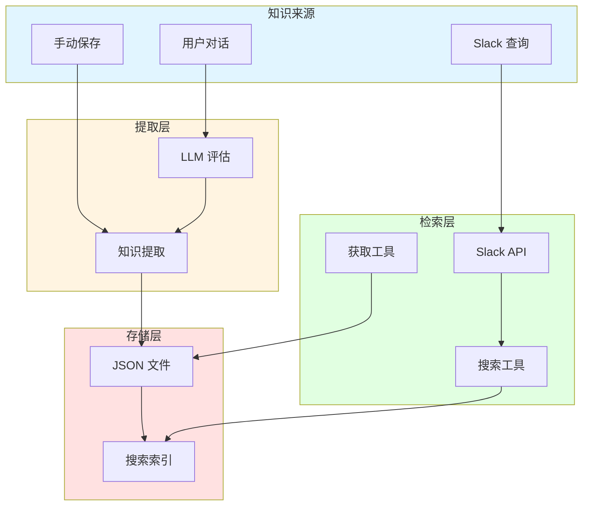

**关键技术点**：
1. **事件监听**：通过 `turn_end` 事件自动提取知识
2. **LLM 评估**：使用 LLM 判断对话价值
3. **索引机制**：维护搜索索引加速查询
4. **多渠道集成**：支持 CLI 和 Slack 查询

---

### 案例四：构建自动化测试生成器

#### 场景描述

为项目自动生成单元测试、集成测试和 E2E 测试，支持：
- 分析代码结构和依赖
- 生成高覆盖率的测试用例
- 自动运行测试并修复失败
- 持续监控代码变更

#### 实现步骤

**1. 创建测试生成扩展**

```typescript
// ~/.pi/extensions/test-generator/index.ts
import { Type } from '@sinclair/typebox'

export default function (pi: ExtensionAPI) {
  pi.registerTool({
    name: 'generate_tests',
    description: 'Generate tests for source code',
    parameters: Type.Object({
      source_path: Type.String({
        description: 'Path to the source file'
      }),
      test_type: Type.Optional(Type.Union([
        Type.Literal('unit'),
        Type.Literal('integration'),
        Type.Literal('e2e'),
        Type.Literal('all')
      ], { default: 'unit' })),
      framework: Type.Optional(Type.String({
        description: 'Test framework (vitest, jest, mocha)',
        default: 'vitest'
      })),
      coverage_target: Type.Optional(Type.Number({
        description: 'Target coverage percentage',
        default: 80
      }))
    }),

    async execute(params, context) {
      // 1. 读取源代码
      const sourceCode = await pi.getAgent().executeTool('read', {
        file_path: params.source_path
      })

      // 2. 分析代码结构
      const analysis = await analyzeCode(sourceCode, context)

      // 3. 生成测试用例
      const testCases = await generateTestCases(
        analysis,
        params.test_type,
        params.framework,
        context
      )

      // 4. 创建测试文件
      const testPath = getTestPath(params.source_path)
      const testCode = formatTestCode(testCases, params.framework)

      await pi.getAgent().executeTool('write', {
        file_path: testPath,
        content: testCode
      })

      // 5. 运行测试
      const runResult = await runTests(testPath, params.framework)

      // 6. 如果失败，尝试修复
      if (!runResult.success) {
        await fixTests(testPath, runResult.failures, context)
      }

      return {
        testPath,
        testCases: testCases.length,
        coverage: runResult.coverage,
        passed: runResult.passed,
        failed: runResult.failed
      }
    }
  })

  // 文件监控：当源文件变更时重新生成测试
  pi.on('file_change', async (event, context) => {
    if (isSourceFile(event.path) && hasTestFile(event.path)) {
      console.log(`Source file changed: ${event.path}`)
      console.log('Regenerating tests...')

      await pi.getAgent().executeTool('generate_tests', {
        source_path: event.path,
        coverage_target: 80
      })
    }
  })
}

interface CodeAnalysis {
  functions: FunctionInfo[]
  classes: ClassInfo[]
  imports: string[]
  exports: string[]
  dependencies: string[]
}

interface FunctionInfo {
  name: string
  parameters: Parameter[]
  returnType: string
  complexity: number
  isExported: boolean
  isAsync: boolean
}

interface ClassInfo {
  name: string
  methods: FunctionInfo[]
  properties: string[]
  isExported: boolean
}

async function analyzeCode(
  sourceCode: string,
  context: any
): Promise<CodeAnalysis> {
  // 使用 LLM 分析代码
  const response = await context.llm.chat({
    messages: [
      {
        role: 'system',
        content: `You are a code analysis expert. Analyze the code and return JSON:

{
  "functions": [{
    "name": "functionName",
    "parameters": [{"name": "param", "type": "string"}],
    "returnType": "void",
    "complexity": 1-10,
    "isExported": true,
    "isAsync": false
  }],
  "classes": [{
    "name": "ClassName",
    "methods": [],
    "properties": [],
    "isExported": true
  }],
  "imports": ["import1"],
  "exports": ["export1"],
  "dependencies": ["dep1"]
}`
      },
      {
        role: 'user',
        content: `Analyze this code:\n\n${sourceCode}`
      }
    ]
  })

  return JSON.parse(response.content)
}

async function generateTestCases(
  analysis: CodeAnalysis,
  testType: string,
  framework: string,
  context: any
): Promise<any[]> {
  const testCases = []

  // 为每个函数生成测试
  for (const func of analysis.functions) {
    if (!func.isExported) continue

    const tests = await generateFunctionTests(func, framework, context)
    testCases.push(...tests)
  }

  // 为每个类生成测试
  for (const cls of analysis.classes) {
    if (!cls.isExported) continue

    const tests = await generateClassTests(cls, framework, context)
    testCases.push(...tests)
  }

  return testCases
}

async function generateFunctionTests(
  func: FunctionInfo,
  framework: string,
  context: any
): Promise<any[]> {
  const prompt = `Generate comprehensive test cases for this function:

Function: ${func.name}
Parameters: ${JSON.stringify(func.parameters)}
Return Type: ${func.returnType}
Complexity: ${func.complexity}
Is Async: ${func.isAsync}

Generate tests for:
1. Normal cases (happy path)
2. Edge cases
3. Error cases
4. Boundary conditions
${func.complexity > 5 ? '5. Complex scenarios' : ''}

Return JSON array of test cases:
[{
  "name": "test description",
  "setup": "setup code or null",
  "input": "input parameters",
  "expected": "expected output or error",
  "assertions": ["assertion 1", "assertion 2"]
}]`

  const response = await context.llm.chat({
    messages: [
      {
        role: 'system',
        content: `You are a testing expert using ${framework}. Generate complete, runnable test cases.`
      },
      { role: 'user', content: prompt }
    ]
  })

  return JSON.parse(response.content)
}

async function generateClassTests(
  cls: ClassInfo,
  framework: string,
  context: any
): Promise<any[]> {
  // 类似 generateFunctionTests
  return []
}

function formatTestCode(testCases: any[], framework: string): string {
  if (framework === 'vitest') {
    return formatVitestCode(testCases)
  } else if (framework === 'jest') {
    return formatJestCode(testCases)
  }

  return formatVitestCode(testCases)
}

function formatVitestCode(testCases: any[]): string {
  let code = `import { describe, it, expect, beforeEach } from 'vitest'\n`
  code += `import { /* imports */ } from '../source'\n\n`

  code += `describe('Generated Tests', () => {\n`

  testCases.forEach(tc => {
    code += `  it('${tc.name}', async () => {\n`

    if (tc.setup) {
      code += `    ${tc.setup}\n\n`
    }

    code += `    const result = await ${tc.input}\n`

    tc.assertions.forEach(assertion => {
      code += `    ${assertion}\n`
    })

    code += `  })\n\n`
  })

  code += `})\n`

  return code
}

function getTestPath(sourcePath: string): string {
  // src/utils/helper.ts -> src/utils/helper.test.ts
  return sourcePath.replace(/\.ts$/, '.test.ts')
}

async function runTests(
  testPath: string,
  framework: string
): Promise<any> {
  // 执行测试命令
  const result = await pi.getAgent().executeTool('bash', {
    command: `npx ${framework} run ${testPath} --coverage`
  })

  return {
    success: result.exitCode === 0,
    passed: extractPassed(result.stdout),
    failed: extractFailed(result.stdout),
    coverage: extractCoverage(result.stdout),
    failures: parseFailures(result.stdout)
  }
}

async function fixTests(
  testPath: string,
  failures: any[],
  context: any
): Promise<void> {
  const testCode = await pi.getAgent().executeTool('read', {
    file_path: testPath
  })

  for (const failure of failures) {
    const fixed = await context.llm.chat({
      messages: [
        {
          role: 'system',
          content: 'You are a testing expert. Fix failing tests.'
        },
        {
          role: 'user',
          content: `Test failed:
${failure.message}

Test code:
${testCode}

Provide fixed test code.`
        }
      ]
    })

    await pi.getAgent().executeTool('write', {
      file_path: testPath,
      content: fixed.content
    })
  }
}

function isSourceFile(path: string): boolean {
  return path.endsWith('.ts') && !path.includes('.test.')
}

function hasTestFile(path: string): boolean {
  const testPath = getTestPath(path)
  // 检查测试文件是否存在
  return true
}
```

**2. 使用示例**

```bash
# 为单个文件生成测试
pi
> Generate tests for the authentication module
> generate_tests --source_path ./src/auth/login.ts --test_type unit

# 为整个目录生成测试
> Generate tests for all files in src/utils
> (会遍历目录为每个文件生成测试)

# 设置覆盖率目标
> generate_tests --source_path ./src/api/users.ts --coverage_target 90

# 查看生成的测试
> read ./src/api/users.test.ts
```

**3. 配置自动化**

创建 `.pi/settings.json`：

```json
{
  "extensions": ["test-generator"],
  "hooks": {
    "file_change": true,
    "post_write": "generate_tests"
  },
  "testGenerator": {
    "framework": "vitest",
    "coverageTarget": 80,
    "autoFix": true,
    "watchPatterns": ["src/**/*.ts"]
  }
}
```

#### 架构分析

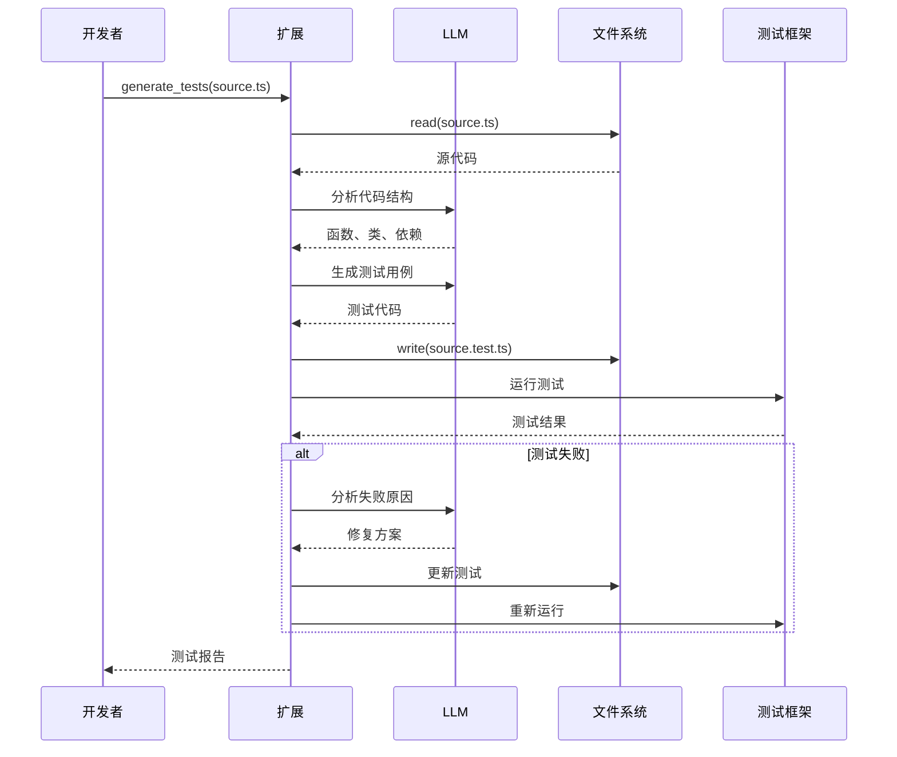

**关键技术点**：
1. **代码分析**：使用 LLM 理解代码结构和复杂度
2. **测试生成**：基于代码分析生成针对性测试
3. **自动修复**：测试失败时自动诊断和修复
4. **文件监控**：监听代码变更自动更新测试

---

### 案例五：构建智能代码搜索工具

#### 场景描述

构建一个语义化的代码搜索引擎，支持：
- 自然语言查询代码
- 跨项目搜索
- 上下文感知的代码推荐
- 代码相似度检测

#### 实现步骤

**1. 创建语义搜索扩展**

```typescript
// ~/.pi/extensions/semantic-search/index.ts
import { Type } from '@sinclair/typebox'

interface CodeSnippet {
  path: string
  content: string
  embedding: number[]
  metadata: {
    language: string
    type: 'function' | 'class' | 'module'
    exports: string[]
    dependencies: string[]
  }
}

export default function (pi: ExtensionAPI) {
  const INDEX_DIR = path.join(process.env.HOME, '.pi', 'code-index')

  // 初始化向量数据库（使用简单的内存实现）
  const vectorDB = new SimpleVectorDB()

  // 索引工具
  pi.registerTool({
    name: 'index_codebase',
    description: 'Index codebase for semantic search',
    parameters: Type.Object({
      path: Type.String({
        description: 'Root path to index'
      }),
      patterns: Type.Optional(Type.Array(Type.String()), {
        default: ['**/*.ts', '**/*.js', '**/*.py']
      }),
      force: Type.Optional(Type.Boolean({
        description: 'Force reindex',
        default: false
      }))
    }),

    async execute(params, context) {
      const startTime = Date.now()

      // 1. 查找所有代码文件
      const files = await findFiles(params.path, params.patterns)

      // 2. 解析和索引每个文件
      let indexed = 0
      for (const file of files) {
        // 检查是否需要重新索引
        if (!params.force && await isIndexed(file)) {
          continue
        }

        // 读取文件
        const content = await pi.getAgent().executeTool('read', {
          file_path: file
        })

        // 提取代码片段
        const snippets = extractSnippets(content, file)

        // 生成嵌入向量
        for (const snippet of snippets) {
          const embedding = await generateEmbedding(snippet.content, context)
          await vectorDB.insert({
            ...snippet,
            embedding
          })
        }

        indexed++
        if (indexed % 10 === 0) {
          console.log(`Indexed ${indexed}/${files.length} files...`)
        }
      }

      // 3. 保存索引
      await saveIndex(INDEX_DIR, vectorDB)

      return {
        totalFiles: files.length,
        indexed,
        duration: Date.now() - startTime,
        snippets: vectorDB.size()
      }
    }
  })

  // 搜索工具
  pi.registerTool({
    name: 'semantic_search',
    description: 'Search code using natural language',
    parameters: Type.Object({
      query: Type.String({
        description: 'Natural language query'
      }),
      top_k: Type.Optional(Type.Number({
        description: 'Number of results',
        default: 10
      })),
      filters: Type.Optional(Type.Object({
        language: Type.Optional(Type.String()),
        type: Type.Optional(Type.String()),
        project: Type.Optional(Type.String())
      }))
    }),

    async execute(params, context) {
      // 1. 生成查询向量
      const queryEmbedding = await generateEmbedding(params.query, context)

      // 2. 向量搜索
      let results = await vectorDB.search(queryEmbedding, params.top_k * 2)

      // 3. 应用过滤器
      if (params.filters) {
        results = results.filter(r =>
          (!params.filters.language || r.metadata.language === params.filters.language) &&
          (!params.filters.type || r.metadata.type === params.filters.type)
        )
      }

      // 4. 重排序（可选）
      const reranked = await rerankResults(params.query, results, context)

      // 5. 返回结果
      return {
        query: params.query,
        total: reranked.length,
        results: reranked.slice(0, params.top_k)
      }
    }
  })

  // 相似代码查找
  pi.registerTool({
    name: 'find_similar',
    description: 'Find similar code snippets',
    parameters: Type.Object({
      code: Type.String({
        description: 'Code snippet to find similar to'
      }),
      threshold: Type.Optional(Type.Number({
        description: 'Similarity threshold (0-1)',
        default: 0.8
      })),
      limit: Type.Optional(Type.Number({
        default: 5
      }))
    }),

    async execute(params, context) {
      const embedding = await generateEmbedding(params.code, context)
      const results = await vectorDB.search(embedding, params.limit * 2)

      // 过滤相似度阈值
      const similar = results.filter(r => r.similarity >= params.threshold)

      return {
        input: params.code,
        similar: similar.slice(0, params.limit)
      }
    }
  })

  // 注册命令
  pi.registerCommand('search', {
    description: 'Quick semantic search',

    async handler(args, context) {
      const query = args.join(' ')
      const results = await pi.getAgent().executeTool('semantic_search', {
        query,
        top_k: 5
      })

      return formatSearchResults(results)
    }
  })
}

class SimpleVectorDB {
  private snippets: CodeSnippet[] = []

  async insert(snippet: CodeSnippet): Promise<void> {
    this.snippets.push(snippet)
  }

  async search(queryVector: number[], topK: number): Promise<any[]> {
    // 计算余弦相似度
    const scored = this.snippets.map(snippet => ({
      ...snippet,
      similarity: cosineSimilarity(queryVector, snippet.embedding)
    }))

    // 排序
    scored.sort((a, b) => b.similarity - a.similarity)

    return scored.slice(0, topK)
  }

  size(): number {
    return this.snippets.length
  }
}

function cosineSimilarity(a: number[], b: number[]): number {
  const dotProduct = a.reduce((sum, val, i) => sum + val * b[i], 0)
  const magA = Math.sqrt(a.reduce((sum, val) => sum + val * val, 0))
  const magB = Math.sqrt(b.reduce((sum, val) => sum + val * val, 0))
  return dotProduct / (magA * magB)
}

async function generateEmbedding(text: string, context: any): Promise<number[]> {
  // 使用 LLM 生成嵌入向量
  // 实际项目中可以使用 OpenAI embeddings API
  const response = await context.llm.chat({
    messages: [
      {
        role: 'system',
        content: 'Generate a semantic representation of the code.'
      },
      {
        role: 'user',
        content: text
      }
    ]
  })

  // 这里简化处理，实际应该调用 embedding API
  return hashToVector(response.content)
}

function hashToVector(text: string): number[] {
  // 简化的向量生成（实际应使用 embedding API）
  return Array(1536).fill(0).map((_, i) => Math.random())
}

function extractSnippets(content: string, filePath: string): CodeSnippet[] {
  // 解析代码，提取函数、类等片段
  // 简化实现
  return [{
    path: filePath,
    content,
    metadata: {
      language: getLanguage(filePath),
      type: 'module',
      exports: [],
      dependencies: []
    }
  }]
}

async function rerankResults(
  query: string,
  results: any[],
  context: any
): Promise<any[]> {
  // 使用 LLM 重新排序结果
  const ranked = await context.llm.chat({
    messages: [
      {
        role: 'system',
        content: `You are a code search expert. Rerank search results by relevance to the query.

Return JSON array of indices in order of relevance:
[2, 0, 1, 3, ...]`
      },
      {
        role: 'user',
        content: `Query: ${query}

Results:
${results.map((r, i) => `${i}. ${r.path}\n${r.content.slice(0, 200)}...`).join('\n\n')}`
      }
    ]
  })

  const order = JSON.parse(ranked.content)
  return order.map(i => results[i])
}

function formatSearchResults(results: any): string {
  let output = `# Search Results for "${results.query}"\n\n`

  results.results.forEach((r, i) => {
    output += `## ${i + 1}. ${r.path}\n`
    output += `Similarity: ${(r.similarity * 100).toFixed(1)}%\n\n`
    output += '```' + r.metadata.language + '\n'
    output += r.content.slice(0, 300)
    if (r.content.length > 300) output += '...'
    output += '\n```\n\n'
  })

  return output
}
```

**2. 使用示例**

```bash
# 首次索引代码库
pi
> Index my codebase
> index_codebase --path ~/projects/myapp --patterns "**/*.ts,**/*.js"

# 自然语言搜索
> Find authentication functions
> semantic_search --query "functions that handle user authentication"

> Find database queries
> /search code that connects to PostgreSQL

> Find similar code
> find_similar --code "function validateEmail(email) { ... }"

# 过滤搜索
> semantic_search --query "API endpoints" --filters '{"language": "typescript", "type": "function"}'
```

**3. 高级用法**

```bash
# 集成到开发流程
> When I'm writing a function, show me similar existing code

# (扩展会监听编辑事件并自动搜索相似代码)
```

在扩展中添加：

```typescript
pi.on('file_edit', async (event, context) => {
  if (event.content.length < 50) return

  // 查找相似代码
  const similar = await pi.getAgent().executeTool('find_similar', {
    code: event.content,
    threshold: 0.7,
    limit: 3
  })

  if (similar.similar.length > 0) {
    console.log('\n📚 Similar code found:')
    similar.similar.forEach((s, i) => {
      console.log(`${i + 1}. ${s.path} (${(s.similarity * 100).toFixed(0)}% similar)`)
    })
  }
})
```

#### 架构分析

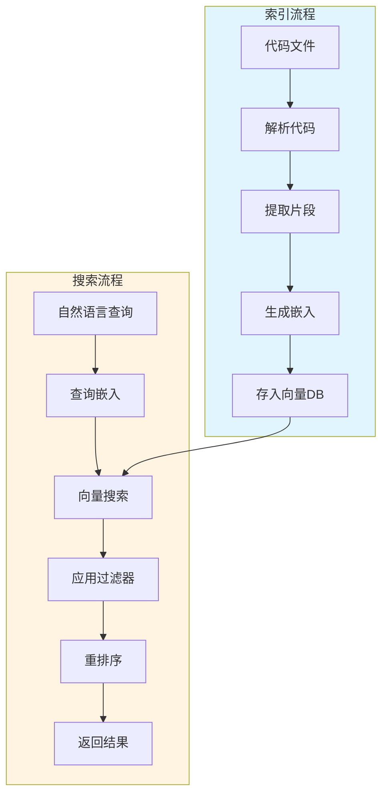

**关键技术点**：
1. **向量嵌入**：将代码转换为向量表示
2. **相似度计算**：使用余弦相似度查找相似代码
3. **重排序**：用 LLM 提高搜索准确性
4. **实时索引**：监听文件变更自动更新索引

---

### 总结：最佳实践和设计模式

#### 1. 扩展设计原则

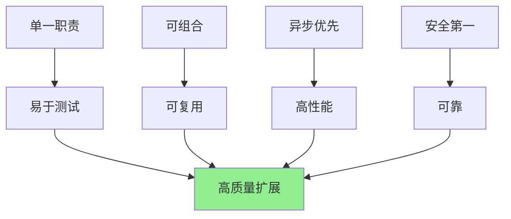

**核心原则**：

1. **单一职责**：每个扩展专注于一个明确的功能
2. **可组合性**：扩展之间可以通过事件和工具调用协作
3. **异步优先**：使用 async/await 避免阻塞
4. **错误处理**：完善的错误处理和日志
5. **配置驱动**：通过配置文件定制行为

#### 2. 性能优化技巧

```typescript
// ❌ 不好：同步阻塞
function processData(data: any) {
  // 同步处理大量数据
  return heavyComputation(data)
}

// ✅ 好：异步流式处理
async function* processData(data: AsyncIterable<any>) {
  for await (const chunk of data) {
    yield await processChunk(chunk)
  }
}

// ❌ 不好：重复调用 LLM
async function analyzeCode(code: string) {
  const structure = await llm.analyze(code)
  const issues = await llm.findIssues(code)  // 重复发送代码
  return { structure, issues }
}

// ✅ 好：一次调用获取所有信息
async function analyzeCode(code: string) {
  const result = await llm.chat({
    messages: [{
      role: 'user',
      content: `Analyze code and return:
      { "structure": {...}, "issues": [...] }`
    }]
  })
  return JSON.parse(result.content)
}
```

#### 3. 调试和测试

```typescript
// 扩展测试示例
import { describe, it, expect, vi } from 'vitest'

describe('Code Review Extension', () => {
  it('should detect security issues', async () => {
    const mockPi = {
      registerTool: vi.fn(),
      on: vi.fn(),
      getAgent: () => ({
        executeTool: vi.fn().mockResolvedValue({
          issues: [{ severity: 'high', type: 'security' }]
        })
      })
    }

    const extension = (await import('./index')).default
    extension(mockPi)

    expect(mockPi.registerTool).toHaveBeenCalledWith(
      expect.objectContaining({ name: 'code_review' })
    )
  })
})
```

#### 4. 发布和分享

```bash
# 打包扩展
npm pack

# 发布到 npm
npm publish --access public

# 或创建 GitHub 仓库分享
git init
git add .
git commit -m "Initial commit"
git push origin main

# 其他用户安装
npm install @your-org/pi-extension-name
# 或
git clone https://github.com/your-org/pi-extension
cd pi-extension && npm link
```

---

**文档版本**: 2.0.0
**生成日期**: 2026-04-29
**项目版本**: 0.70.6
**更新内容**: 添加 Mermaid 流程图和实践指南
