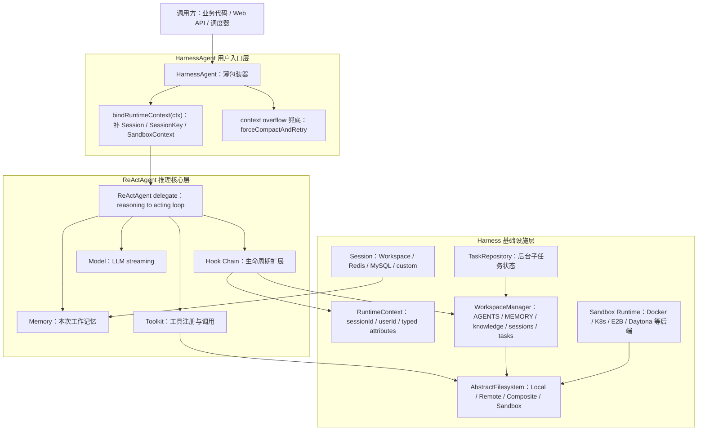
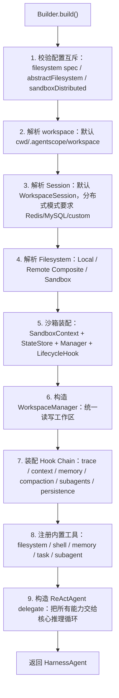
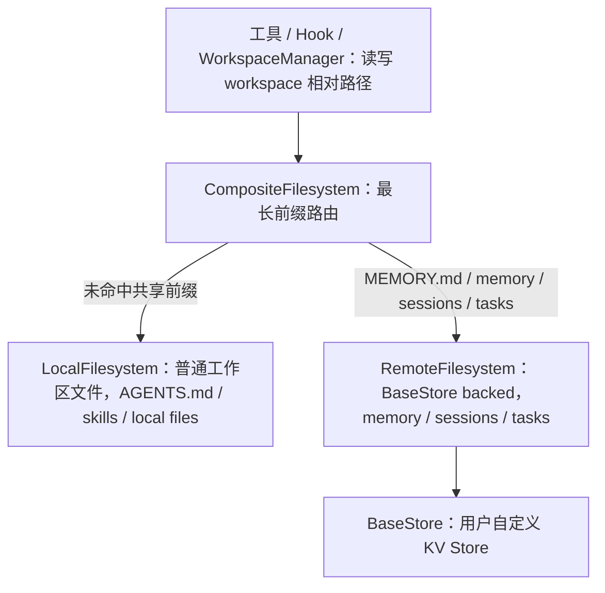
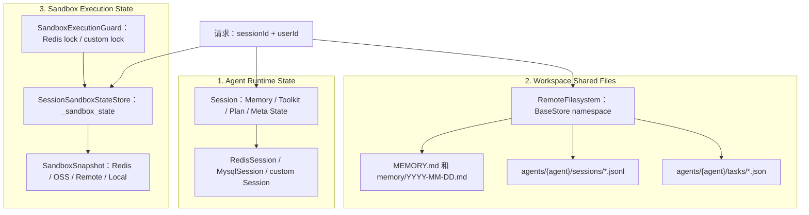
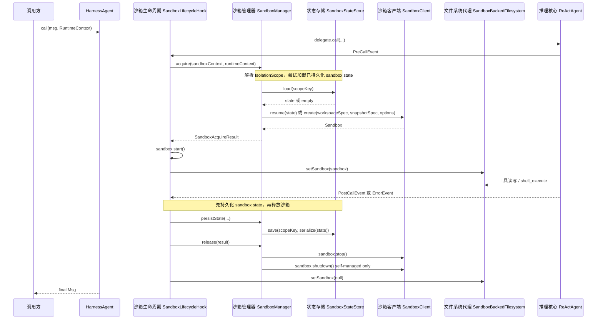
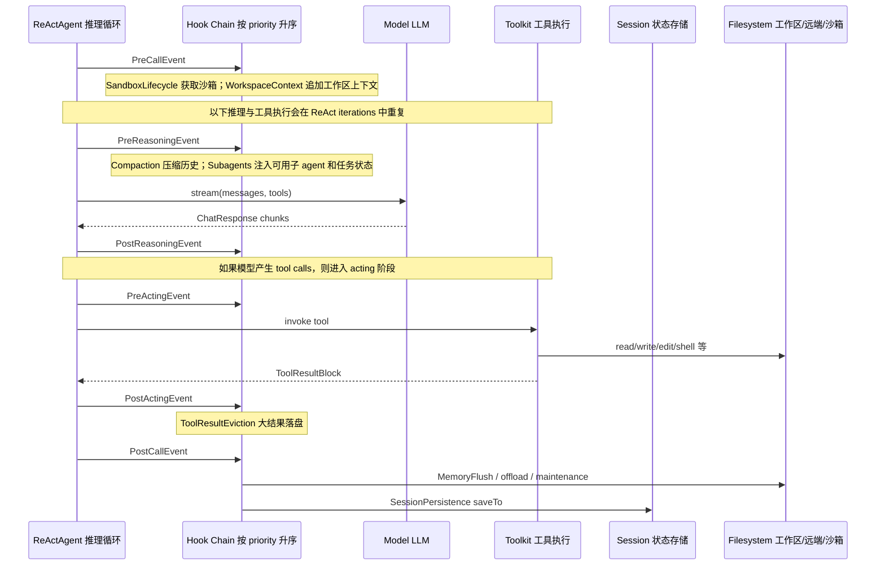
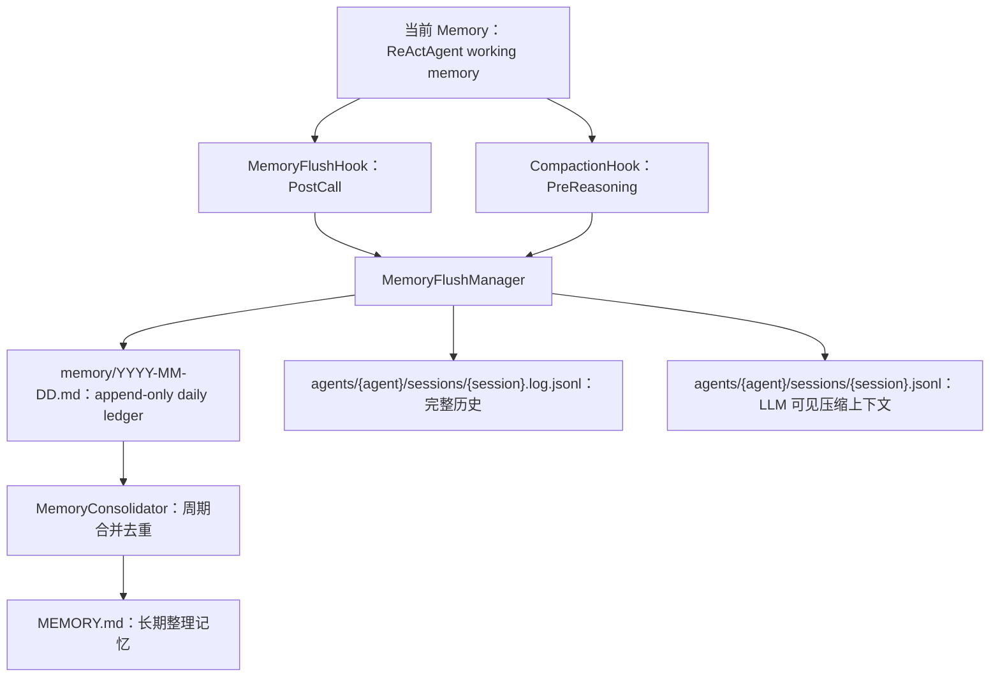
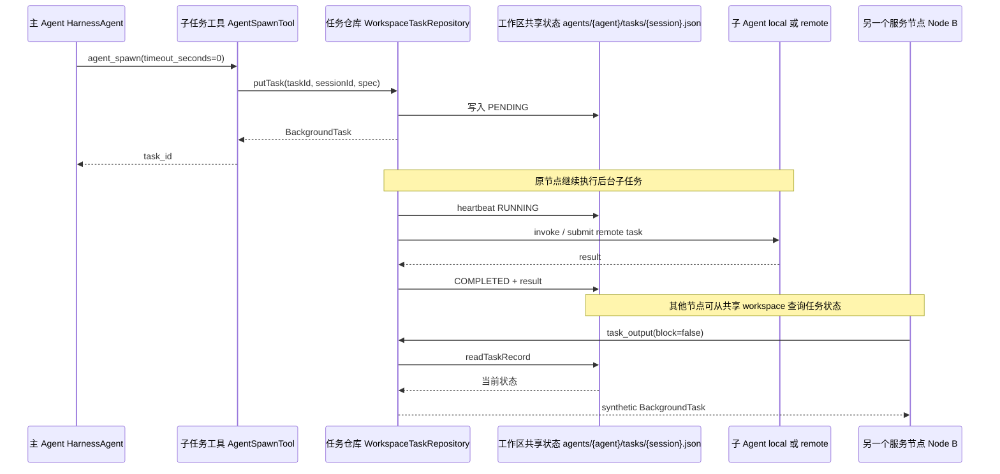

# HarnessAgent 深度说明：从 ReAct 包装器到企业级分布式 Agent Runtime

本文专门讲解 `agentscope-harness` 里的 `HarnessAgent`。我阅读的核心入口是：

- `agentscope-harness/src/main/java/io/agentscope/harness/agent/HarnessAgent.java`
- `agentscope-harness/src/main/java/io/agentscope/harness/agent/hook/*`
- `agentscope-harness/src/main/java/io/agentscope/harness/agent/filesystem/*`
- `agentscope-harness/src/main/java/io/agentscope/harness/agent/sandbox/*`
- `agentscope-harness/src/main/java/io/agentscope/harness/agent/subagent/*`
- `agentscope-harness/src/main/java/io/agentscope/harness/agent/memory/*`
- `agentscope-extensions/agentscope-extensions-session-redis`
- `agentscope-extensions/agentscope-extensions-session-mysql`

你是从阿里云开发者公众号看到它被称作“企业级 Agent 框架”才产生兴趣，所以这篇文档会特别关注两个问题：

1. `HarnessAgent` 到底比裸 `ReActAgent` 多了什么？
2. 如果放到多实例、分布式、可恢复、可隔离的环境里，它做了哪些工程设计？

## 1. 一句话定位

`HarnessAgent` 不是新的推理引擎。它是一个用户入口类，内部包着一个 `ReActAgent delegate`，通过 Hook、Toolkit、Session、Workspace、Filesystem、Sandbox、Subagent 等机制，把裸智能体升级成一个更接近企业生产系统的运行时。

裸 `ReActAgent` 解决的是：

- 如何调用模型？
- 如何执行工具？
- 如何循环 reasoning / acting？
- 如何 stream？
- 如何做 structured output？

`HarnessAgent` 进一步解决的是：

- 多轮之后上下文太长怎么办？
- 重启之后 agent 状态还在不在？
- 多个服务实例之间如何共享记忆、会话和任务状态？
- 工具结果太大如何避免塞爆上下文？
- 文件操作应该落在本机、远端共享存储，还是沙箱？
- 代码执行是否隔离？
- 子 agent 的后台任务如何跨节点查询状态？
- agent 的人格、知识、技能如何跟着工作区走？

这就是它被单独放在 `agentscope-harness` 模块里的原因：它不是“Agent 算法层”，而是“Agent 运行时层”。

## 2. 顶层结构

下面这张图是理解 `HarnessAgent` 的总入口。



最重要的判断是：`HarnessAgent` 没有替代 `ReActAgent`，而是复用它。所有推理、工具调用、stream、structured output 等核心能力仍然落在 `ReActAgent`。Harness 通过配置和 Hook 把生产能力装进去。

## 3. HarnessAgent 自己做了什么

`HarnessAgent` 本体其实很薄，关键字段如下：

```java
private final ReActAgent delegate;
private final WorkspaceManager workspaceManager;
private final CompactionHook compactionHook;
private final AtomicReference<String> userIdRef;
private final AtomicReference<String> sessionIdRef;
private final Session defaultSession;
private final SandboxContext defaultSandboxContext;
private RuntimeContext runtimeContext;
```

这些字段说明它的核心职责：

| 字段                      | 含义                                          |
| ----------------------- | ------------------------------------------- |
| `delegate`              | 真正执行推理循环的 `ReActAgent`。                     |
| `workspaceManager`      | 统一访问工作区、记忆、知识、任务、会话日志。                      |
| `compactionHook`        | 上下文压缩 Hook，用于正常压缩和 overflow 兜底。             |
| `userIdRef`             | 当前调用用户 ID 的动态引用，给文件系统 namespace 使用。         |
| `sessionIdRef`          | 当前调用会话 ID 的动态引用，给远端文件系统 namespace 使用。       |
| `defaultSession`        | 调用方没有提供 Session 时使用的默认 Session。             |
| `defaultSandboxContext` | 沙箱模式下默认注入到 RuntimeContext 的 SandboxContext。 |
| `runtimeContext`        | 当前调用的上下文，提供给 Hook 和工具。                      |

### 3.1 它重载了带 RuntimeContext 的调用

最关键的方法是：

```java
public Mono<Msg> call(List<Msg> msgs, RuntimeContext ctx) {
    bindRuntimeContext(ctx);
    return delegate.call(msgs, coreForDelegate())
            .onErrorResume(e -> {
                if (isContextOverflowError(e)) {
                    return recoverFromOverflow(msgs);
                }
                return Mono.error(e);
            });
}
```

它在调用前做 `bindRuntimeContext(ctx)`，然后把增强后的 context 传给 `ReActAgent`。如果遇到上下文溢出错误，则尝试强制压缩后重试。

同样，stream 模式也是：

```java
public Flux<Event> stream(List<Msg> msgs, StreamOptions options, RuntimeContext ctx) {
    bindRuntimeContext(ctx);
    return delegate.stream(msgs, options, coreForDelegate());
}
```

### 3.2 不带 RuntimeContext 的方法直接代理

`HarnessAgent` 也实现 `Agent` 接口，所以它保留：

- `call(List<Msg>)`
- `call(List<Msg>, Class<?>)`
- `call(List<Msg>, JsonNode)`
- `stream(...)`
- `observe(...)`
- `interrupt(...)`
- `saveTo(...)`
- `loadFrom(...)`
- `loadIfExists(...)`

但这些大多直接委托给 `delegate`。这意味着：如果你不用 `RuntimeContext` 版本，就不会得到 Harness 最关键的 session/user/sandbox 动态绑定能力。

企业使用时应优先使用：

```java
agent.call(msg, RuntimeContext.builder()
    .sessionId("session-001")
    .userId("user-123")
    .build());
```

而不是只调用：

```java
agent.call(List.of(msg));
```

## 4. RuntimeContext 是分布式语义的入口

`RuntimeContext` 是每次调用的身份和临时属性包。它包含：

- `sessionId`
- `userId`
- `Session`
- `SessionKey`
- string-keyed extras
- typed attributes
- `ToolExecutionContext`

它不会被持久化，但每次调用都通过它把身份传给 Hook 和工具。

### 4.1 bindRuntimeContext 的实际工作

`HarnessAgent.bindRuntimeContext(ctx)` 会做几件事：

1. 如果 `ctx == null`，清空当前 runtimeContext。
2. 调用 `ensureSessionDefaults(ctx)` 补齐缺省值。
3. 写入 `userIdRef`，供动态 namespace 使用。
4. 写入 `sessionIdRef`，供远端文件系统 session scope 使用。
5. 如果 `Session` 和 `SessionKey` 都存在，调用 `delegate.loadIfExists(...)` 从 Session 恢复状态。

也就是说，每次请求进来，Harness 都会尝试按当前 session 恢复 agent 状态。这里的恢复不是靠 JVM 内存，而是靠 `Session` 抽象。

### 4.2 ensureSessionDefaults 的补齐逻辑

如果调用方没有提供 `Session`，则用 `defaultSession`。如果没有提供 `SessionKey`：

- 优先用 `sessionId` 构造 `SimpleSessionKey.of(sessionId)`。
- 如果 `sessionId` 也没有，则退化为 `SimpleSessionKey.of(delegate.getName())`。

沙箱模式下，如果 RuntimeContext 里没有 `SandboxContext`，会注入 `defaultSandboxContext`。

这段设计很重要：业务只传 `sessionId` 和 `userId`，Harness 就能自动把它映射成状态恢复、文件命名空间、沙箱隔离槽位。

## 5. Builder 装配期：企业级能力都在 build 里拼装

`HarnessAgent.Builder.build()` 是整个类最关键的部分。它做的事情可以分成 9 步。



### 5.1 配置互斥校验

Builder 支持三种声明式 filesystem mode：

- `filesystem(SandboxFilesystemSpec)`
- `filesystem(RemoteFilesystemSpec)`
- `filesystem(LocalFilesystemSpec)`

同时还有一个逃生口：

- `abstractFilesystem(AbstractFilesystem backend)`

规则是：

- 三种 spec 最多只能配置一种。
- `abstractFilesystem()` 和任何 spec 互斥。
- `sandboxDistributed(...)` 只能和 sandbox filesystem 搭配。

这避免部署配置进入不明确状态。

### 5.2 workspace 解析

如果没有显式设置 workspace，默认是：

```text
${user.dir}/.agentscope/workspace
```

Harness 期望工作区里可以放：

```text
workspace/
├── AGENTS.md
├── MEMORY.md
├── memory/YYYY-MM-DD.md
├── skills/<skill-name>/SKILL.md
├── knowledge/KNOWLEDGE.md
├── knowledge/*
├── subagents/<id>.md
├── agents/<agentId>/workspace/
├── agents/<agentId>/sessions/sessions.json
├── agents/<agentId>/sessions/<sessionId>.jsonl
├── agents/<agentId>/sessions/<sessionId>.log.jsonl
└── agents/<agentId>/tasks/<sessionId>.json
```

工作区不是普通文件夹，它承担 agent 的人格、知识、长期记忆、技能、子 agent 声明、任务状态、会话日志等职责。

### 5.3 Session 解析

如果没有配置 session，默认创建：

```java
new WorkspaceSession(resolvedWorkspace, resolvedAgentId)
```

`WorkspaceSession` 是本地 JSON 文件 Session，路径大致是：

```text
<workspace>/agents/<agentId>/context/<sessionId>/{key}.json
<workspace>/agents/<agentId>/context/<sessionId>/{key}.jsonl
```

这适合单机开发，但多副本部署时不能作为共享状态后端。

项目提供了扩展：

- `RedisSession`
- `JedisSession`
- `RedissonSession`
- `MysqlSession`

它们实现同一个 `Session` 接口。多实例部署时，你应该通过：

```java
HarnessAgent.builder()
    .session(redisSession)
    ...
    .build();
```

把状态放到 Redis / MySQL / 自定义分布式 Session，而不是默认的本地 `WorkspaceSession`。

### 5.4 Filesystem 解析

`resolveFilesystem(...)` 的策略是：

1. 如果显式传了 `abstractFilesystem`，直接使用。
2. 如果是 `RemoteFilesystemSpec`，构造 `CompositeFilesystem`。
3. 如果是 `LocalFilesystemSpec`，构造本地文件系统。
4. 默认使用 `LocalFilesystemWithShell`。

这里的默认值值得注意：默认本地模式有 shell 能力，适合开发和单机；企业生产尤其是用户输入不可信时，更应该使用 sandbox mode 或禁用 shell。

## 6. 三种文件系统模式

`HarnessAgent` 的分布式能力很大一部分来自文件系统抽象。它统一了 agent 工具、记忆写入、会话日志、任务记录、知识读取的存储路径。

### 6.1 Mode 3：LocalFilesystemSpec / 默认本地模式

如果没有配置任何 spec，默认是：

```java
new LocalFilesystemWithShell(workspace, namespaceFactory)
```

特点：

- 文件读写在本机 workspace。
- shell 命令也在本机执行。
- 长期记忆、session log、task record 都落本地。
- 通过 `userIdRef` 可以做本地 namespace，但仍然是本机存储。

适合：

- 本地开发。
- 单进程服务。
- 可信环境里的工具调用。

不适合：

- 多副本共享状态。
- 不可信代码执行。
- 需要跨节点恢复的生产环境。

### 6.2 Mode 1：RemoteFilesystemSpec / CompositeFilesystem 分布式共享模式

`RemoteFilesystemSpec` 会构造一个 `CompositeFilesystem`：

- 默认 backend：`LocalFilesystem`，用于本地工作区文件。
- shared backend：`RemoteFilesystem`，由 `BaseStore` 支持，用于跨节点共享路径。

默认共享路径包括：

```text
MEMORY.md
memory/
agents/<agentId>/sessions/
agents/<agentId>/tasks/
```

也可以通过 `addSharedPrefix(...)` 增加共享前缀，例如 `knowledge/` 或 `prompts/`。

这套模式背后的思想是：不是所有文件都必须远端化，只有“多副本必须一致”的部分走共享存储。



`RemoteFilesystemSpec` 还支持隔离级别：

| Scope | Remote store namespace |
| --- | --- |
| `SESSION` | `agents/<agentId>/sessions/<sessionId>` |
| `USER` | `agents/<agentId>/users/<userId>` |
| `AGENT` | `agents/<agentId>/shared` |
| `GLOBAL` | `global` |

默认是 `USER`，即同一个用户的多个会话共享长期记忆和共享文件。

重要的是：当使用 `RemoteFilesystemSpec` 时，`HarnessAgent` 会检查 effective session。如果 session 仍然是本地 `WorkspaceSession`，直接抛异常：

```text
filesystem(RemoteFilesystemSpec) is designed for distributed / multi-replica deployments,
but the effective Session is a local WorkspaceSession.
Configure a distributed Session backend ...
```

这说明作者明确知道：只共享文件还不够，agent runtime state 也必须共享。企业级设计里，这种 fail-fast 很关键。

### 6.3 Mode 2：SandboxFilesystemSpec / 隔离执行模式

Sandbox 模式把文件系统和 shell 执行都代理到沙箱。

构建期大致做：

1. 创建 `SandboxBackedFilesystem` 代理。
2. 构造 `SandboxContext`。
3. 校验分布式配置。
4. 构造 `SandboxStateStore`。
5. 构造 `SandboxExecutionGuard`。
6. 构造 `SandboxManager`。
7. 注册 `SandboxLifecycleHook`。

沙箱模式下，`FilesystemTool` 和 `ShellExecuteTool` 都会基于沙箱后端工作。也就是说，agent 执行命令不是在业务服务所在机器上执行，而是在隔离的 sandbox workspace 里执行。

## 7. 分布式环境下的核心设计

如果从企业分布式角度看，`HarnessAgent` 做了五件非常关键的事：

1. Session 状态可外置。
2. 共享文件/记忆可外置。
3. 沙箱状态可恢复。
4. 后台子任务状态可持久查询。
5. 共享沙箱槽位可加分布式锁。

下面逐个讲。

## 8. 分布式状态三件套

在多实例部署里，一个用户的请求可能第一次打到节点 A，第二次打到节点 B。如果没有共享状态，agent 就会失忆。Harness 把状态拆成三类：



### 8.1 Runtime state：Session

`Session` 保存的是 `ReActAgent` runtime state。它的接口包括：

- `save(SessionKey, String, State)`
- `save(SessionKey, String, List<? extends State>)`
- `get(...)`
- `getList(...)`
- `exists(...)`
- `delete(...)`
- `listSessionKeys()`

`SessionPersistenceHook` 在 `PostCallEvent` 和 `ErrorEvent` 时保存状态：

```java
if (agent instanceof StateModule sm) {
    sm.saveTo(ctx.getSession(), ctx.getSessionKey());
}
```

保存时机在 priority 900，比较靠后，确保 MemoryFlush 等更早的 Hook 已经执行。

多实例部署时，这里的 Session 应该是 Redis / MySQL / 自定义分布式 Session。

### 8.2 Workspace shared files：RemoteFilesystem

`RemoteFilesystemSpec` 解决的是 workspace 里哪些文件要跨节点一致。默认共享：

- `MEMORY.md`
- `memory/`
- `agents/<agentId>/sessions/`
- `agents/<agentId>/tasks/`

这覆盖了长期记忆、日记忆、会话日志、后台任务状态。

底层 `RemoteFilesystem` 依赖 `BaseStore`：

```java
public interface BaseStore {
    StoreItem get(List<String> namespace, String key);
    void put(List<String> namespace, String key, Map<String, Object> value);
    List<StoreItem> search(List<String> namespace, int limit, int offset);
    void delete(List<String> namespace, String key);
}
```

当前 harness 里有 `InMemoryStore` 作为实现，但生产分布式要接真正共享的 store，例如 Redis、数据库、对象存储元数据服务、自研 KV 等。`RemoteFilesystemSpec` 设计的是扩展点，而不把所有存储实现塞进 harness。

### 8.3 Sandbox state：SessionSandboxStateStore + Snapshot

沙箱分布式恢复需要两个东西：

1. 沙箱元状态：存在哪个 sandbox session、snapshot id、后端状态。
2. workspace 内容快照：沙箱里的文件系统内容。

`SessionSandboxStateStore` 把沙箱元状态写到 `Session`：

```text
_sandbox_state
```

它根据 `IsolationScope` 映射槽位：

| Scope | SessionKey |
| --- | --- |
| `SESSION` | `sandbox/session/<sessionId>` |
| `USER` | `sandbox/user/<agentId>/<userId>` |
| `AGENT` | `sandbox/agent/<agentId>` |
| `GLOBAL` | `sandbox/global` |

workspace 内容则交给 `SandboxSnapshotSpec`：

- `NoopSnapshotSpec`：不保存。
- `LocalSnapshotSpec`：保存到本机 tar。
- `RedisSnapshotSpec`：保存到 Redis binary value。
- `OssSnapshotSpec`：保存到阿里云 OSS。
- `RemoteSnapshotSpec`：接任意 `RemoteSnapshotClient`，例如 S3/GCS/自研对象存储。

分布式沙箱默认会 fail-fast：

- 如果没有分布式 Session，拒绝启动。
- 如果 snapshot 是 noop，拒绝启动。

除非你显式：

```java
sandboxDistributed(SandboxDistributedOptions.builder()
    .requireDistributed(false)
    .build())
```

这代表“我知道这是单机/非分布式沙箱”。

## 9. 沙箱生命周期

沙箱生命周期由 `SandboxLifecycleHook` 管。它监听：

- `PreCallEvent`
- `PostCallEvent`
- `ErrorEvent`



`SandboxManager.acquire(...)` 的优先级是：

1. 使用调用方传入的 external sandbox。
2. 使用调用方传入的 external sandbox state。
3. 从 `SandboxStateStore` 加载持久化 state 并 resume。
4. 创建新 sandbox。

这个设计支持三类场景：

- 用户自己管理 sandbox，只让 Harness 使用它。
- 用户传入某次 sandbox state，让 Harness resume。
- Harness 完全管理 sandbox 生命周期。

## 10. IsolationScope：共享与隔离的核心旋钮

`IsolationScope` 同时作用于 sandbox 和 remote filesystem：

| Scope | 语义 | 适合场景 |
| --- | --- | --- |
| `SESSION` | 每个 session 独立 | 普通聊天会话、每个任务独立环境 |
| `USER` | 同一用户所有 session 共享 | 用户长期工作区、个人记忆 |
| `AGENT` | 同一 agent 所有用户共享 | 公共工具缓存、公共沙箱环境 |
| `GLOBAL` | 全局共享 | 极少数全局状态，慎用 |

注意：沙箱里的共享不是“多个请求同时使用同一个运行中容器”，而是“同一个槽位的调用顺序复用持久化 snapshot”。如果并发请求打到同一个 scope，默认可能出现最后写入覆盖前一次 snapshot 的情况。

因此对于 `AGENT` 或 `GLOBAL` 这种共享范围大的沙箱，建议配置 `SandboxExecutionGuard`。

项目提供了 `RedisSandboxExecutionGuard`，用 Redis `SET NX PX` 做租约锁：

- acquire 时写入唯一 token。
- release 时用 Lua CAS 删除，避免误删别人的锁。
- TTL 防止永久死锁。

这是典型企业级并发控制设计。

## 11. Hook Chain：能力如何插进 ReAct 循环

Harness 的 Hook 大致按优先级组织：

| Hook | 优先级 | 主要事件 | 职责 |
| --- | ---: | --- | --- |
| `AgentTraceHook` | 0 | 多事件 | 记录推理和工具执行过程。 |
| `MemoryFlushHook` | 5 | `PostCallEvent` | 提取长期记忆，offload 会话消息。 |
| `MemoryMaintenanceHook` | 6 | `PostCallEvent` | 周期性合并长期记忆、归档旧 daily memory、清理旧 session。 |
| `CompactionHook` | 10 | `PreReasoningEvent` | 上下文压缩，防止历史太长。 |
| `SandboxLifecycleHook` | 50 | `PreCall` / `PostCall` / `Error` | 获取、启动、持久化、释放 sandbox。 |
| `ToolResultEvictionHook` | 50 | `PostActingEvent` | 大工具结果落盘，替换为预览。 |
| `SubagentsHook` | 80 | `PreReasoningEvent` | 注入子 agent 使用说明和任务状态。 |
| `WorkspaceContextHook` | 900 | `PreCallEvent` | 注入 AGENTS、MEMORY、knowledge、session context。 |
| `SessionPersistenceHook` | 900 | `PostCall` / `Error` | 自动保存 agent state 到 Session。 |

这条链体现出一个理念：ReAct 循环保持不变，运行时能力作为事件处理器插进去。



## 12. WorkspaceContextHook：人格、知识和记忆如何注入

`WorkspaceContextHook` 在 `PreCallEvent` 时把工作区内容追加到 system message。

它读取：

- `AGENTS.md`
- `MEMORY.md`
- `knowledge/KNOWLEDGE.md`
- `knowledge/` 下的文件列表
- additional context files
- session context，比如日期、OS、workspace、sessionId、environmentMemory

重要细节：

- 它只在 `PreCallEvent` 触发一次，而不是每轮 reasoning 都重复追加，避免上下文累积。
- 读取采用 `WorkspaceManager` 的“两层读取”：先 filesystem，再本地 fallback。
- 对 `MEMORY.md` 有 token budget 截断，避免长期记忆过大。
- 它告诉 agent：需要更详细知识时，用 `read_file` / `grep` / `glob` 针对性读取，而不是把知识库全塞进上下文。

这实际上是把“工作区即 agent 配置与记忆载体”的思想落成了代码。

## 13. 记忆体系：daily ledger + curated MEMORY.md + session log

Harness 的记忆不是单文件，而是多层结构。



### 13.1 MemoryFlushHook

`MemoryFlushHook` 在每次调用结束后：

1. 用模型从当前消息中提取值得长期记忆的事实。
2. 追加到当天 `memory/YYYY-MM-DD.md`。
3. 把原始消息 offload 到 session JSONL。
4. 更新 session index。

它不直接写 `MEMORY.md`。`MEMORY.md` 由 `MemoryConsolidator` 维护。

### 13.2 MemoryMaintenanceHook

`MemoryMaintenanceHook` 是节流的，默认 30 分钟最小间隔。它做：

- 归档过旧 daily memory 文件。
- 调用 `MemoryConsolidator.consolidate()` 合并长期记忆。
- 清理过旧 session log。

所有文件 I/O 都通过 `AbstractFilesystem`，因此在 `RemoteFilesystemSpec` 下，这些维护操作也能走共享存储。

### 13.3 SessionTree 的分布式镜像

`SessionTree` 管理：

```text
agents/{agentId}/sessions/{sessionId}.jsonl
agents/{agentId}/sessions/{sessionId}.log.jsonl
```

它的模型是：

- 本地文件是工作副本。
- remote filesystem 是跨副本镜像。
- `load()` 会在冷启动时尝试从 remote restore。
- `syncFromRemote()` 会把远端新增 entry union-merge 到本地。
- `flush()` 先同步写本地，再异步 best-effort mirror 到 remote。

这意味着它偏向“本地优先 + 远端镜像 + 写前同步”的实用设计，而不是强一致数据库事务。对 agent 会话日志来说，这通常是合理的折中。

## 14. 上下文压缩和 overflow 兜底

`CompactionHook` 在 `PreReasoningEvent` 执行，它调用 `ConversationCompactor.compactIfNeeded(...)`。

压缩算法大致是：

1. 对工具参数做轻量截断。
2. 根据消息数或 token 数判断是否触发。
3. 计算 cutoff，保留尾部消息。
4. 避免切断 assistant tool call 和 tool result 的配对。
5. 可选：压缩前 flush memories。
6. 可选：压缩前 offload 完整消息。
7. 用模型总结 prefix。
8. 返回 `[summaryMsg] + preservedTail`。
9. 更新 ReActAgent 的 working memory 和 `PreReasoningEvent` 的 input messages。

`HarnessAgent` 还有一层兜底：如果模型仍然报上下文溢出，`recoverFromOverflow(...)` 会用一个强制阈值为 1 的 `CompactionConfig` 重新压缩，然后重试 `delegate.call(...)`。

这体现了两层防线：

- 正常路径：按阈值提前压缩。
- 异常路径：真实 overflow 后强制压缩重试。

## 15. 大工具结果卸载：解决 context width

上下文爆掉有两种形态：

- 历史太长：context depth。
- 单个工具结果太大：context width。

`CompactionHook` 解决前者，`ToolResultEvictionHook` 解决后者。

当工具结果文本长度超过 `ToolResultEvictionConfig.maxResultChars` 时：

1. 写完整结果到文件系统路径：

   ```text
   {evictionPath}/{agentName}/{toolCallId}
   ```

2. 把上下文中的 `ToolResultBlock` 替换为占位符。
3. 占位符包含文件路径和头尾预览。
4. agent 后续可以用 `read_file` 分段读取完整结果。

这对企业系统很重要，因为工具很容易返回：

- 大日志。
- 大 SQL 查询结果。
- 大文件内容。
- 长 grep 输出。
- Web 抓取结果。

不做卸载，agent 会很快被工具输出压垮。

## 16. 子 agent 编排

`HarnessAgent` 支持两类子 agent：

1. 默认内置 `general-purpose` 子 agent。
2. 用户声明的 `workspace/subagents/*.md` 子 agent。
3. 编程式 `subagent(...)` 或 `subagentFactory(...)`。

`AgentSpecLoader` 读取 Markdown front matter：

```markdown
---
description: Reviews code for security and performance issues.
workspace:
  mode: isolated
  path: ./defs/reviewer
model: openai:gpt-4o-mini
maxIters: 12
tools: [read_file, grep_files]
---

# inline body if no workspace.path
...
```

子 agent 设计细节：

- 主 agent 通过 `SubagentsHook` 获得 `agent_spawn`、`agent_send`、`agent_list` 和 `task_*` 工具。
- leaf subagent 默认不再注册 `SubagentsHook`，避免无限递归。
- shared workspace 模式复用父 agent backend。
- isolated workspace 模式创建独立 workspace。
- 可以给 declared subagent 配工具 allowlist。
- 子 agent 的系统提示会附加一段 `SUBAGENT_CONTEXT_SECTION`，明确它是短生命周期 worker，不要和用户对话，不要再派生子 agent。

### 16.1 子 agent 后台任务

`agent_spawn(..., timeout_seconds=0)` 会变成后台任务，返回 `task_id`。任务状态由 `TaskRepository` 管。

默认 Harness 使用 `WorkspaceTaskRepository`，它的权威状态是：

```text
agents/<parentAgentId>/tasks/<parentSessionId>.json
```

如果配置了 `RemoteFilesystemSpec`，这个路径会自动进入共享 store，所以任何节点都能读到任务状态。



`WorkspaceTaskRepository` 的分布式语义很清楚：

- 任务执行粘在发起节点。
- 任意节点都可以从 workspace record 查询状态。
- 非发起节点不会假装能阻塞等待本地 future，而是读持久状态并优雅降级。
- cancellation 写 `cancelRequested` 到共享任务记录，发起节点在执行前/执行后检查，远程任务还会调用 remote cancel。
- 有 heartbeat 和 orphan sweeper。
- orphan sweeper 会用 `_sweep.marker` 在多节点之间做轻量节流。

这是一个很工程化的后台任务设计，承认“执行不一定能迁移”，但“状态必须能跨节点观察和恢复”。

## 17. Remote subagent 与 Agent Protocol

`SubagentDeclaration` 支持 remote 子 agent。`AgentSpawnTool` 如果发现 declaration 是 remote：

- 同步模式：通过远程调用拿结果。
- 异步模式：创建 `TaskRunSpec.RemoteTaskRunSpec`。
- `WorkspaceTaskRepository` 用 `AgentProtocolTaskClient` submit/poll/cancel。
- `TaskRecord` 会持久化：
  - `transportType = agent-protocol`
  - `remoteBaseUrl`
  - `remoteHeaders`

这样其他节点看到任务记录时，仍然知道这是一个远程 agent-protocol 任务，可以继续查询远程状态，而不是依赖本机 future。

这也是分布式环境下很有价值的点：本地任务不能真正迁移，但远程 protocol 任务可以通过共享 task record 被不同节点继续追踪。

## 18. Skills 自动加载

构建期会调用 `resolveSkillBox(...)`：

- 如果传了 `AgentSkillRepository`，从自定义 repository 加载。
- 否则检查 `workspace/skills/`，使用 `FileSystemSkillRepository`。
- 加载到 `SkillBox`，再交给 `ReActAgent.builder().skillBox(...)`。

这意味着 agent 能力可以随工作区移动。对于企业场景，技能仓库可以替换为 Git、DB、制品库等，只要实现 `AgentSkillRepository`。

## 19. 内置工具

Harness 默认注册几组工具。

### 19.1 Memory 工具

如果没有 `disableMemoryTools()`：

- `MemorySearchTool`
- `MemoryGetTool`
- `SessionSearchTool`

这让 agent 可以主动搜索长期记忆和会话日志。

### 19.2 Filesystem 工具

如果没有 `disableFilesystemTools()`：

- `read_file`
- `write_file`
- `edit_file`
- `grep_files`
- `glob_files`
- `list_files`

这些都基于 `AbstractFilesystem`，所以同一套工具可以落到本地、远端 composite 或 sandbox。

### 19.3 Shell 工具

如果 filesystem 是 `AbstractSandboxFilesystem` 且没有 `disableShellTool()`，注册：

- `shell_execute`

默认本地 `LocalFilesystemWithShell` 也实现了 `AbstractSandboxFilesystem`，所以默认模式下有 shell。生产中要特别注意：

- 若不希望本机执行命令，应显式使用 sandbox 或 `disableShellTool()`。
- 若用户输入不可信，默认本地 shell 风险很高。

### 19.4 Subagent / Task 工具

如果不是 leaf subagent 且没有禁用 subagent：

- `agent_spawn`
- `agent_send`
- `agent_list`
- `task_output`
- `task_cancel`
- `task_list`

这些由 `SubagentsHook.tools()` 注册到 agent-local toolkit。

## 20. HarnessAgent 与裸 ReActAgent 的关系

`HarnessAgent.from(ReActAgent agent)` 可以把已有 `ReActAgent` 的可观察配置迁移到 Harness：

会复制：

- name
- description
- sysPrompt
- model
- maxIters
- generateOptions
- planNotebook
- toolkit defensive copy

不会复制：

- memory
- hooks
- long-term memory
- RAG
- statePersistence
- structuredOutputReminder

不复制 memory 是合理的：Harness 要自己管理新的 in-memory conversation，并通过 workspace/session 做持久化。

## 21. 企业级分布式部署建议

如果你的目标是多实例部署，而不是本机 demo，我建议按下面思路配置。

### 21.1 最低限度的多副本共享状态

需要：

- 分布式 Session：Redis 或 MySQL。
- RemoteFilesystemSpec：共享 memory、sessions、tasks。
- 业务层保证每次调用带 `sessionId` 和 `userId`。

概念示例：

```java
Session session = RedisSession.builder()
    .jedisClient(redisClient)
    .keyPrefix("myapp:agentscope:session:")
    .build();

BaseStore store = ...; // 生产要实现共享 BaseStore

HarnessAgent agent = HarnessAgent.builder()
    .name("enterprise-agent")
    .model(model)
    .workspace("/app/workspace")
    .session(session)
    .filesystem(new RemoteFilesystemSpec(store)
        .isolationScope(IsolationScope.USER)
        .addSharedPrefix("knowledge/"))
    .compaction(CompactionConfig.builder()
        .triggerMessages(40)
        .keepMessages(12)
        .flushBeforeCompact(true)
        .offloadBeforeCompact(true)
        .build())
    .toolResultEviction(ToolResultEvictionConfig.defaults())
    .build();
```

要点：

- `Session` 存 agent runtime state。
- `RemoteFilesystemSpec` 存 workspace 里的共享记忆、任务、session logs。
- `IsolationScope.USER` 让同一用户跨 session 共享长期记忆。
- `addSharedPrefix("knowledge/")` 让知识库也远端共享，适合多副本一致读取。

### 21.2 需要代码执行时的分布式沙箱配置

需要：

- `SandboxFilesystemSpec`
- distributed `Session`
- `SandboxSnapshotSpec`，如 Redis 或 OSS
- 可选 `SandboxExecutionGuard`，如 Redis lock

概念示例：

```java
UnifiedJedis jedis = ...;

Session session = RedisSession.builder()
    .jedisClient(redisClient)
    .build();

SandboxSnapshotSpec snapshotSpec =
    new RedisSnapshotSpec(jedis, "agentscope:sandbox:snapshots:", 86400);

SandboxExecutionGuard guard =
    RedisSandboxExecutionGuard.builder(jedis)
        .leaseTtl(Duration.ofMinutes(30))
        .retryInterval(Duration.ofMillis(500))
        .build();

SandboxFilesystemSpec sandboxSpec = new DockerFilesystemSpec()
    .isolationScope(IsolationScope.SESSION)
    .executionGuard(guard);

HarnessAgent agent = HarnessAgent.builder()
    .name("code-agent")
    .model(model)
    .workspace("/app/workspace")
    .filesystem(sandboxSpec)
    .sandboxDistributed(SandboxDistributedOptions.builder()
        .session(session)
        .snapshotSpec(snapshotSpec)
        .build())
    .build();
```

如果用 `IsolationScope.AGENT` 或 `GLOBAL`，强烈建议配置 execution guard，否则并发调用会竞争同一个持久化槽位。

### 21.3 何时使用 RedisSession，何时使用 MysqlSession

RedisSession 适合：

- 高并发 session 状态。
- 短到中期会话。
- 需要低延迟读写。
- 配合 Redis snapshot / Redis lock 做统一基础设施。

MysqlSession 适合：

- 希望状态长期可审计。
- 已有 MySQL 运维体系。
- 会话规模不极端，读写频率可控。
- 更看重持久化和 SQL 管理。

## 22. 企业级亮点总结

从代码看，`HarnessAgent` 的企业级亮点主要不是“它用了某个模型”，而是这些工程面：

### 22.1 明确区分单机默认与分布式配置

默认开发体验简单：本地 workspace + 本地 shell + 本地 session。

但一旦启用分布式相关模式，它会 fail-fast：

- `RemoteFilesystemSpec` 要求分布式 Session。
- sandbox distributed 默认要求非本地 Session 和非 noop snapshot。

这比“看起来能跑但生产丢状态”更可靠。

### 22.2 状态外置点清晰

它没有把所有状态藏在内存里，而是通过接口外置：

- `Session`
- `BaseStore`
- `SandboxStateStore`
- `SandboxSnapshotSpec`
- `TaskRepository`
- `AgentSkillRepository`

这些都是企业集成点。

### 22.3 多租户隔离是内建概念

`RuntimeContext.userId` 会进入：

- local namespace
- remote filesystem namespace
- sandbox isolation key

`IsolationScope` 明确定义 session/user/agent/global 四种共享边界。多租户系统很需要这种显式边界。

### 22.4 不是只考虑成功路径

它处理了很多长运行系统才会遇到的问题：

- context overflow 后强制压缩重试。
- PostCall 和 ErrorEvent 都保存状态。
- 沙箱 cleanup 失败只记录，不影响主结果返回。
- 后台任务 heartbeat 和 orphan sweeper。
- remote task cancel 和 status polling。
- session tree remote merge。
- 大工具结果 eviction。
- memory maintenance 节流。

这些都不是 demo 框架通常会认真处理的东西。

### 22.5 工具副作用有可替换承载层

所有文件工具都走 `AbstractFilesystem`，shell 工具走 sandbox/local-shell 抽象。业务可以替换存储后端、隔离策略、namespace 策略，而不用改 agent 推理代码。

## 23. 当前设计的边界和注意点

这部分也很重要。企业级不是“什么都自动强一致”，而是知道边界在哪里。

### 23.1 默认配置不是分布式

默认 `WorkspaceSession` + `LocalFilesystemWithShell` 是单机开发配置。多副本部署必须显式配置共享 Session 和共享 filesystem/sandbox snapshot。

### 23.2 BaseStore 是接口，不是完整生产存储方案

`RemoteFilesystemSpec` 依赖 `BaseStore`。harness 里有 `InMemoryStore`，但生产需要你接真正共享 KV store。否则 remote filesystem 只是接口能力，不等于天然分布式存储。

### 23.3 SessionTree remote mirror 是 best-effort

`SessionTree.flush()` 先写本地，再异步 mirror 到 remote。远端失败会记录 warning，不会阻塞主流程。这对体验友好，但不是强事务保证。如果你需要强审计，需要强化 remote mirror 或直接把 session log 写入强一致存储。

### 23.4 WorkspaceTaskRepository 的执行是 sticky 的

本地后台任务实际跑在发起节点。其他节点能查状态，但不能接管本地 Java future。orphan sweeper 会在心跳停止后标记失败。远程 agent-protocol 任务的可恢复性更强，因为其他节点可以继续 poll remote endpoint。

### 23.5 共享沙箱需要锁

`IsolationScope.AGENT` 和 `GLOBAL` 可能多个请求竞争同一状态槽。默认 guard 是 no-op，生产应配置 Redis/ZooKeeper/DB lock。

### 23.6 本地 shell 默认开启要谨慎

默认 filesystem 是 `LocalFilesystemWithShell`。如果业务服务暴露给不可信用户，必须禁用 shell 或改用 sandbox。

## 24. 推荐阅读顺序

如果你要继续深入 HarnessAgent，我建议按这个顺序读源码：

1. `HarnessAgent.java`
   - 先看 `call(...)`、`bindRuntimeContext(...)`、`ensureSessionDefaults(...)`。
   - 再看 `Builder.build()`。
   - 最后看 `buildGeneralPurposeFactory(...)`、`buildDeclaredFactory(...)`。

2. Hook：
   - `WorkspaceContextHook`
   - `SessionPersistenceHook`
   - `MemoryFlushHook`
   - `CompactionHook`
   - `ToolResultEvictionHook`
   - `SubagentsHook`
   - `SandboxLifecycleHook`

3. 文件系统：
   - `AbstractFilesystem`
   - `RemoteFilesystemSpec`
   - `CompositeFilesystem`
   - `RemoteFilesystem`
   - `SandboxBackedFilesystem`

4. 分布式沙箱：
   - `SandboxDistributedOptions`
   - `SessionSandboxStateStore`
   - `SandboxManager`
   - `SandboxIsolationKey`
   - `SandboxExecutionGuard`
   - `RedisSandboxExecutionGuard`
   - `SandboxSnapshotSpec` 及 Redis/OSS snapshot。

5. 子任务：
   - `AgentSpawnTool`
   - `TaskTool`
   - `WorkspaceTaskRepository`
   - `TaskRecord`
   - `AgentProtocolTaskClient`

6. Session 扩展：
   - `RedisSession`
   - `MysqlSession`

## 25. 最后总结

`HarnessAgent` 的本质是：把 `ReActAgent` 变成一个可被企业系统托管的运行单元。

它真正值得关注的地方不是“又包了一层 builder”，而是它把生产 agent 的关键问题都抽象成了可替换组件：

- 身份：`RuntimeContext`
- 状态：`Session`
- 工作区：`WorkspaceManager`
- 文件系统：`AbstractFilesystem`
- 共享存储：`BaseStore`
- 沙箱：`SandboxContext` / `SandboxManager`
- 沙箱恢复：`SandboxStateStore` / `SandboxSnapshotSpec`
- 并发保护：`SandboxExecutionGuard`
- 长期记忆：`MemoryFlushManager` / `MemoryConsolidator`
- 上下文治理：`CompactionHook` / `ToolResultEvictionHook`
- 子任务：`SubagentsHook` / `WorkspaceTaskRepository`

如果把它放到分布式环境下，推荐理解成三层：

1. **Session 层**：保存 agent runtime state，让请求换节点后还能恢复对话状态。
2. **Shared workspace 层**：保存长期记忆、session log、task record，让多副本共享 agent 的外部世界。
3. **Sandbox 层**：保存和恢复执行环境，让有副作用的文件与命令执行可以隔离、持久化、按 session/user/agent 复用。

这三层配齐后，`HarnessAgent` 才真正从“本地智能体对象”变成“企业级 agent runtime”。它的代码已经为这些点留出了清晰接口和默认实现，但生产落地仍然需要你根据部署环境选择正确的 Session、BaseStore、Snapshot、ExecutionGuard 和 isolation scope。
