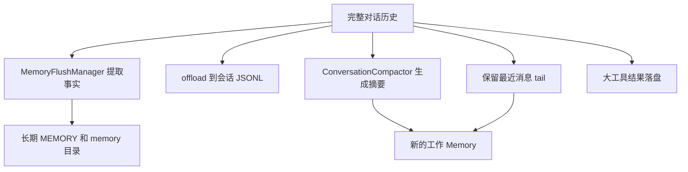

## 一. 设计思想三：Hook 不是旁路监听器，而是生命周期中间件

Agent 的能力不应该只能通过“多包一层 agent”来扩展，而应该在关键生命周期点上进行治理。AgentScope Java 的 Hook 更像中间件。所有事件都走统一的 Hook.onEvent(HookEvent)，并按 priority 升序串行执行。某些事件带 setter，因此 Hook 可以修改运行时行为。

## 二. 设计思想四：System message 与 Memory 分离，是长对话正确性的关键

AgentBase.notifyPreCall() 会先取当前 Memory snapshot，再把 snapshot 和本次 call args 组成 full input 给 Hook 看。

Hook 可以修改 full input，但最终返回给 doCall() 的只有 snapshot 之后的 tail。对 ReActAgent 来说，tail 会被写入 Memory。

第一，Hook 必须能注入系统级上下文。第二，Memory 必须保持干净。

## 三. 设计思想五：Memory 不是聊天记录，而是工具协议账本

很多 Agent 实现遇到工具调用恢复时，会额外维护一个内存变量，例如 currentToolCalls。这种变量一旦遇到进程重启、分布式迁移、人工插入工具结果，就会变得脆弱。

AgentScope Java 把工具调用协议本身写进 Memory。只要 Memory 能保存和恢复，Agent 就能知道：

- 哪些工具已经请求过；
- 哪些工具已经返回结果；
- 哪些工具仍然 pending；
- 外部补回的 tool result 是否匹配；
- 是否允许继续 reasoning。

这就是 Agent 工程里的一个核心思想：

> 可恢复系统不要只保存“结果”，要保存足以重放协议状态的账本。

## 四. 设计思想七：Suspended tool 承认“有些行动不该由框架伪造”

当一个工具抛出 ToolSuspendException，框架不会假装工具成功，也不会无限等待。

ToolExecutor 会把它转成 metadata 里带 agentscope_suspended=true 的 ToolResultBlock。ReActAgent.acting() 发现有 suspended result 后，会返回一个 GenerateReason.TOOL_SUSPENDED 的 assistant message。

这背后的思想很成熟：

> 企业 Agent 不能把所有工具调用都当作本地函数。真正的业务动作常常需要审批、异步执行、跨系统执行和结果回填。

Suspended tool 给 Agent 一个安全停顿点。它不伪造成功，不吞掉意图，也不阻塞线程一直等。它把“未完成的外部行动”变成显式协议状态。

## 五. 设计思想八：call 是执行语义，stream 是观察语义

AgentScope Java 的设计很清楚：call() 是 Agent 的主执行语义，stream() 是对同一执行过程的事件观察语义。

从实现思想看，stream() 并没有另起一套 ReAct 流程。它通过临时挂载 StreamingHook 实现监听，然后把这些生命周期事件转成 `Flux<Event>` 。

AgentScope Java 把 stream 定义为“观察同一条执行流水线”。这就让 UI 实时体验和后端执行正确性共享同一套机制。

因此可以这样理解：

> call() 适合服务端任务、批处理、测试、工作流节点、结构化结果获取；stream() 适合交互界面、实时日志、用户可见进度。它们不是两种 Agent，而是同一个 Agent 的两种消费方式。

## 六. 设计思想九：结构化输出也是工具协议，不是 JSON prompt hack

AgentScope Java 更倾向于把结构化输出纳入工具协议：

1. 根据 Java class 或 JsonNode 生成 JSON Schema。
2. 临时注册一个名为 generate_response 的工具。
3. 挂载 StructuredOutputHook。
4. Hook 在需要时强制或提醒模型调用该工具。
5. 工具执行成功后 PostActingEvent.stopAgent()。
6. PostCallEvent 压缩 Memory，把中间工具调用换成最终结构化消息。

这个设计非常值得学习。它说明结构化输出不是模型之外的特殊旁路，而是

“模型意图 -> 工具协议 -> 校验 -> 结果消息”的一部分。

这样有几个优势：

- schema 是工具参数的一部分，模型更容易按协议输出；
- 结构化结果可以走工具验证逻辑；
- 成功后能用 Hook 停止 Agent，而不是继续多余 reasoning；
- Memory 里可以清理掉中间 generate_response 工具噪音；
- call 和 stream 都能共享同一套结构化输出流程。

原则是：

> Agent 里的特殊能力，如果能表达成协议，就不要做成旁路。

## 七. 设计思想十：RuntimeContext 负责“本次身份”，Session 负责“可恢复状态”

RuntimeContext 是每次调用传进来的临时上下文，它不持久化。它的作用是让本次调用里的 Hook 和工具知道“我是谁、我在哪个 session、我有什么临时资源”。

Session 则是持久化抽象，用来保存 StateModule。ReActAgent.saveTo() 会保存：

- agent metadata；
- Memory messages；
- Toolkit active groups；
- PlanNotebook state。

## 八. 设计思想十四：上下文压缩不是删除历史，而是分层存储

长会话一定会遇到上下文爆炸。AgentScope Harness 的思路不是简单删旧消息，而是做分层：

- 工作 Memory 保留摘要和最近 tail；
- 完整会话日志 offload 到 JSONL；
- 重要事实 flush 到长期记忆；
- 长期记忆再由后台 consolidate 到 MEMORY.md；
- 大工具结果可以 evict 到文件，只保留占位符。

完整对话历史MemoryFlushManager提取事实offload 到会话

这里的核心不是“压缩 prompt”，而是“根据用途分层存储历史”：

所以原则是：

> 上下文工程不是把所有东西塞给模型，而是把不同生命周期的信息放到不同层。

