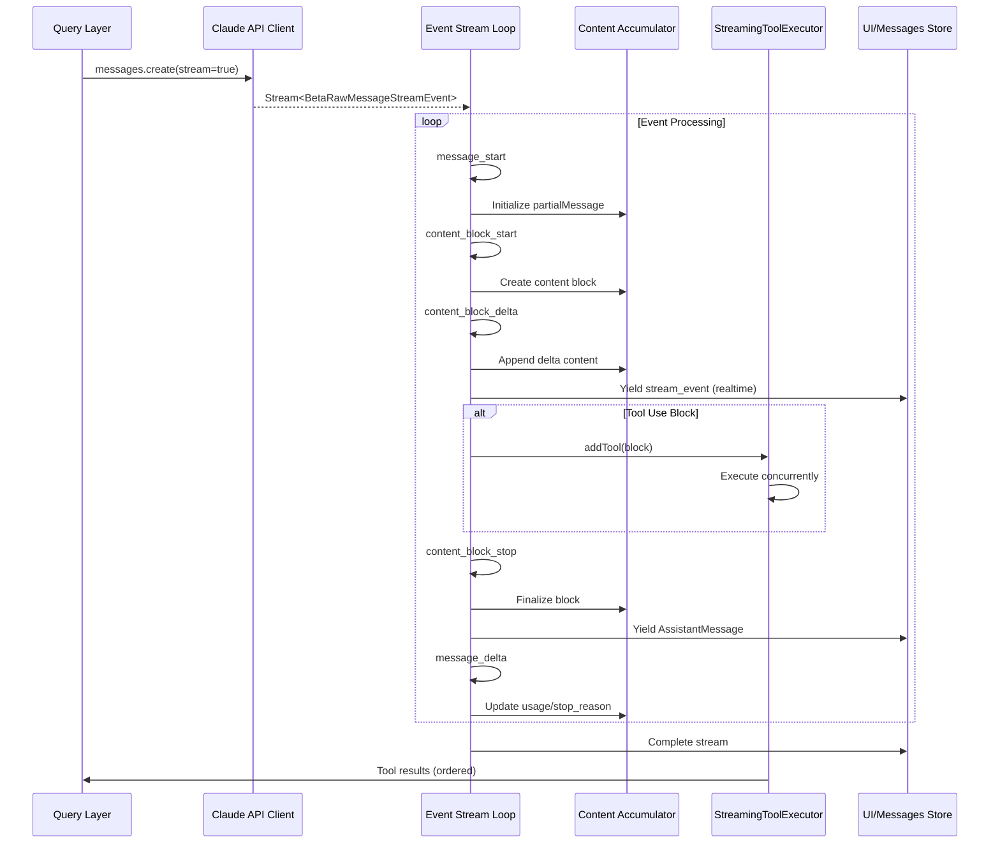
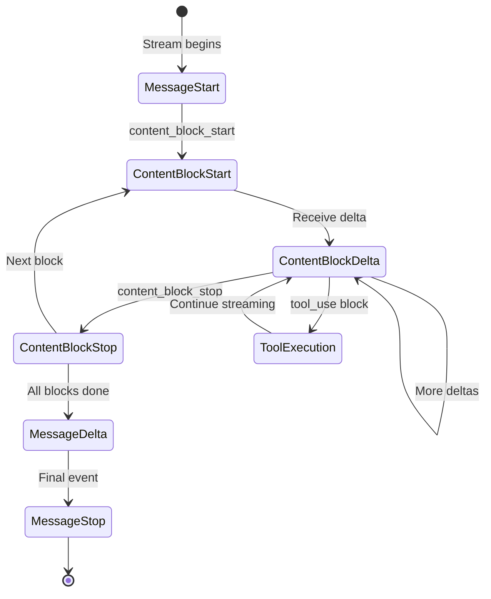
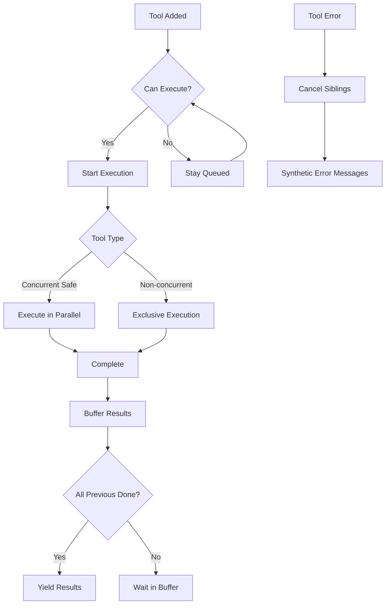

Claude Code 的流式响应机制建立在 Anthropic SDK 的流式 API 之上，通过精心设计的事件处理循环实现了**实时内容累积**、**渐进式工具执行**和**健壮的错误恢复**三大核心能力。该系统不仅负责将模型输出实时传递给用户界面，还负责在流式接收过程中即时启动工具调用，从而实现 Agentic 对话循环的高效并发执行。

Sources: [claude.ts](claude-code/src/services/api/claude.ts#L1-L200)

## 架构概览

流式响应处理的核心在于**事件驱动的内容累积模型**。当 API 返回流式数据时，系统按照事件类型分派到不同的处理器，逐步构建完整的消息对象。这种设计使得 UI 可以在模型仍在生成内容时就实时渲染文本、thinking 块和工具调用，同时工具执行器可以提前启动并发安全的工具调用，从而大幅降低端到端延迟。



Sources: [claude.ts](claude-code/src/services/api/claude.ts#L1800-L2200)

## 事件类型与处理流程

流式 API 返回的事件遵循严格的时序模式：每个响应从 `message_start` 开始，以 `message_stop` 结束，中间包含零个或多个内容块的生命周期事件。理解这些事件的语义和处理逻辑是掌握流式响应机制的关键。

### 核心事件序列

**message_start 事件**标志着流式响应的开始，携带初始 usage 信息（此时 `output_tokens` 为 0）和模型选择等元数据。系统在此阶段初始化 `partialMessage` 状态，为后续内容块累积做准备，同时记录 **TTFT (Time To First Token)** 指标用于性能监控。

Sources: [claude.ts](claude-code/src/services/api/claude.ts#L1926-L1935)

**content_block_start 事件**表示模型开始生成一个新的内容块。Claude Code 处理多种块类型：`text` 块用于常规文本输出，`thinking` 块包含模型的推理过程，`tool_use` 和 `server_tool_use` 块表示工具调用意图。系统为每种块类型初始化特定的数据结构，例如 `tool_use` 块的 `input` 字段初始化为空字符串以接收后续的 `input_json_delta` 事件。

Sources: [claude.ts](claude-code/src/services/api/claude.ts#L1940-L1995)

**content_block_delta 事件**是流式处理的核心，携带内容增量数据。不同类型的 delta 对应不同的累积策略：`text_delta` 直接追加到文本块的 `text` 字段，`thinking_delta` 追加到 thinking 块，`input_json_delta` 累积工具参数的 JSON 片段。这种增量累积模式使得 UI 可以实时渲染不完整的内容，同时系统保持状态的不可变性。

Sources: [claude.ts](claude-code/src/services/api/claude.ts#L2000-L2070)

**content_block_stop 事件**表示一个内容块已完整接收。系统在此阶段执行关键的状态转换：将累积的内容块规范化为 `AssistantMessage` 对象，注入元数据（request ID、timestamp、research 数据等），然后通过 generator `yield` 将消息传递到上层。这种设计确保每条消息都包含完整的块内容，而非部分累积的中间状态。

Sources: [claude.ts](claude-code/src/services/api/claude.ts#L2073-L2105)

**message_delta 事件**提供最终的 usage 统计（真实的 `output_tokens`、`cache_read_input_tokens` 等）和 `stop_reason`。系统将此信息回写到最近生成的消息对象，避免对象替换导致的引用断开问题——这是一个关键的实现细节，因为 transcript 写队列持有消息引用并延迟序列化，直接属性变更能确保最终数据被正确捕获。

Sources: [claude.ts](claude-code/src/services/api/claude.ts#L2200-L2270)

### 事件处理状态机



Sources: [claude.ts](claude-code/src/services/api/claude.ts#L1926-L2200)

## 内容累积与类型安全

流式响应的累积机制面临类型安全的挑战：不同块类型的 delta 必须匹配对应的内容块类型。系统通过运行时类型检查和防御性编程确保类型一致性，任何类型不匹配都会触发错误日志和异常，防止状态污染传播到下游。

### 累积器实现模式

累积器使用数组索引访问（`contentBlocks[part.index]`）而非对象映射，这是基于性能考虑的设计选择。索引访问直接映射到 API 的事件序号，避免了哈希计算开销。但这种模式要求严格验证索引边界——如果 `content_block_delta` 事件引用了不存在的索引，系统会抛出 `RangeError` 并记录遥测事件以追踪异常情况。

Sources: [claude.ts](claude-code/src/services/api/claude.ts#L2000-L2010)

**类型验证策略**采用分层检查：首先验证 content block 存在，然后验证 delta 类型与 block 类型匹配。例如，`input_json_delta` 只能应用于 `tool_use` 或 `server_tool_use` 块，`thinking_delta` 只能应用于 `thinking` 块。任何类型违规都会触发错误事件 `tengu_streaming_error` 并携带详细的类型信息，用于调试和监控。

Sources: [claude.ts](claude-code/src/services/api/claude.ts#L2015-L2070)

**输入累积的特殊性**在于工具参数的 JSON 片段处理。`input_json_delta` 事件携带 `partial_json` 字符串，系统将其追加到块的 `input` 字段，但不进行 JSON 解析。这是性能优化的关键决策：完整的工具参数在 `content_block_stop` 时才解析，避免了流式过程中的重复解析开销。这种模式也符合 Anthropic SDK 的设计理念——原始流式 API 避免了 BetaMessageStream 的 O(n²) 部分 JSON 解析问题。

Sources: [claude.ts](claude-code/src/services/api/claude.ts#L1805-L1844)

### 内容规范化流程

从 API 接收的内容块需要经过规范化才能进入内部消息系统。`normalizeContentFromAPI` 函数处理多种转换：将 API 的枚举值映射到内部类型，处理工具引用字段，注入 agent ID 上下文。规范化确保消息格式在不同 API 版本和模型能力之间保持一致。

Sources: [claude.ts](claude-code/src/services/api/claude.ts#L2100-L2110)

## 工具执行的并发控制

流式响应的真正威力在于**工具调用可以提前执行**。当 `content_block_start` 事件表明模型正在生成 `tool_use` 块时，StreamingToolExecutor 立即将其加入执行队列。这种设计打破了传统的"先接收完整响应再执行工具"的串行模式，实现了响应接收和工具执行的流水线并行。

### StreamingToolExecutor 并发模型

工具执行的并发控制基于**并发安全性分类**。每个工具定义声明 `isConcurrencySafe` 谓词，指示该工具是否可以与其他工具同时执行。例如，只读操作（文件读取、搜索）通常是并发安全的，而文件写入和 Shell 命令通常需要独占执行。这种分类使得系统可以在保证安全性的前提下最大化并行度。

Sources: [StreamingToolExecutor.ts](claude-code/src/services/tools/StreamingToolExecutor.ts#L1-L100)

**队列处理算法**遵循严格规则：当工具被添加到队列时，系统检查当前执行状态；如果允许立即执行（队列为空，或所有执行中的工具都是并发安全的且新工具也是并发安全的），则启动执行；否则保持排队状态。这种检查确保非并发工具永远不会与其他工具同时执行，避免了竞态条件和资源冲突。

Sources: [StreamingToolExecutor.ts](claude-code/src/services/tools/StreamingToolExecutor.ts#L112-L135)

**结果缓冲与顺序保证**是并发控制的关键挑战。虽然工具可以并发执行，但结果必须按照工具在响应中出现的顺序传递。StreamingToolExecutor 维护一个结果缓冲区，工具完成时将结果存入缓冲区而非立即返回。`getRemainingResults` 方法按顺序提取已完成的结果，只有当某个位置的工具尚未完成时才会阻塞等待。

Sources: [StreamingToolExecutor.ts](claude-code/src/services/tools/StreamingToolExecutor.ts#L300-L400)

### 工具生命周期管理

工具执行状态机管理从"queued"到"executing"到"completed"到"yielded"的完整生命周期。状态转换由并发条件驱动，确保任何时候的执行状态都满足安全性约束。如果工具执行失败，系统可以生成合成错误消息，避免流式响应的其他部分被阻塞。

Sources: [StreamingToolExecutor.ts](claude-code/src/services/tools/StreamingToolExecutor.ts#L20-L50)

**兄弟取消机制**提供了优雅的错误隔离。当某个 Bash 工具执行失败时，系统通过专用的 `siblingAbortController` 取消所有正在执行的兄弟工具，生成"Cancelled: parallel tool call errored"错误消息。这种机制防止了失败工具的副作用继续影响系统状态，同时保证了响应的完整性。

Sources: [StreamingToolExecutor.ts](claude-code/src/services/tools/StreamingToolExecutor.ts#L150-L200)



Sources: [StreamingToolExecutor.ts](claude-code/src/services/tools/StreamingToolExecutor.ts#L100-L250)

## 错误处理与恢复机制

流式响应面临独特的错误挑战：网络中断、API 过载、客户端超时等都可能在流式过程中发生。Claude Code 实现了多层防御机制，从主动监控到自动重试，确保流式响应的健壮性。

### 流式空闲超时监控

**Watchdog 机制**解决了静默连接丢失的问题。在某些网络环境下，连接可能在物理层面中断但未触发 TCP 错误，导致流式循环无限等待。系统通过环境变量 `CLAUDE_ENABLE_STREAM_WATCHDOG` 启用主动监控，当超过配置的空闲时间（默认 90 秒）未接收到任何事件时，强制中止流并触发非流式重试。

Sources: [claude.ts](claude-code/src/services/api/claude.ts#L1845-L1920)

**分级警告机制**在流式过程中提供渐进式反馈。当空闲时间达到阈值的一半时，系统记录警告日志；达到完整阈值时，记录错误日志并发射遥测事件。这种分级机制帮助运维团队识别潜在的网络质量问题，而不会立即中断用户操作。

Sources: [claude.ts](claude-code/src/services/api/claude.ts#L1870-L1900)

**资源释放的确定性**通过 finally 块和显式清理函数保证。无论流式循环是正常完成、被错误中断还是被 watchdog 超时中止，系统都会清理 Response 对象的 body 流、取消挂起的定时器、释放 SDK 的 Stream 资源。这种防御性编程防止了原生 TLS 缓冲区和其他非 V8 堆内存的泄漏。

Sources: [claude.ts](claude-code/src/services/api/claude.ts#L1515-L1530)

### 流式停滞检测

**Stall 检测**与 Watchdog 互补，但关注不同的性能问题。Watchdog 检测完全无响应的情况，而 Stall 检测识别事件间隔过长（默认 30 秒）但流仍在继续的情况。系统记录每次 Stall 的持续时间、总 Stall 次数和累计 Stall 时间，这些指标帮助识别 API 网关的拥塞问题或后端推理的延迟尖峰。

Sources: [claude.ts](claude-code/src/services/api/claude.ts#L1921-L1960)

**遥测数据发射**在流式完成后汇总所有 Stall 信息。`tengu_streaming_stall_summary` 事件包含模型、request ID 和完整的 Stall 统计，使得后端分析可以关联延迟问题与特定模型、区域或时间段。这种细粒度的可观测性是生产环境性能优化的基础。

Sources: [claude.ts](claude-code/src/services/api/claude.ts#L2265-L2280)

### 重试与降级策略

**529 过载错误的智能重试**区分前台和后台查询。前台查询（用户正在等待的 REPL 主线程、SDK 调用等）会重试最多 3 次 529 错误，使用指数退避策略；后台查询（标题生成、建议、分类器等）立即失败，避免在容量级联期间放大网关压力。这种差异化策略保护了系统的整体稳定性。

Sources: [withRetry.ts](claude-code/src/services/api/withRetry.ts#L1-L100)

**非流式降级路径**在流式完全失败时提供后备方案。如果流式响应因任何原因（网络错误、Watchdog 超时、解析失败）无法完成，系统捕获异常并切换到非流式 API 调用。非流式调用虽然延迟更高，但具有更强的容错性，能够完成原本会失败的用户请求。

Sources: [claude.ts](claude-code/src/services/api/claude.ts#L2280-L2320)

**持久重试模式**专为无人值守会话设计（通过 `CLAUDE_CODE_UNATTENDED_RETRY` 环境变量启用）。该模式使用更高的最大退避时间（5 分钟）和定期心跳 yield，防止宿主环境因空闲而终止会话。这种模式适用于 CI/CD 管道和自动化工作流，确保长时间运行的任务能够完成。

Sources: [withRetry.ts](claude-code/src/services/api/withRetry.ts#L50-L80)

## 性能监控与可观测性

流式响应系统内置了丰富的性能指标收集，从 TTFT 到总延迟，从 token 速率到缓存命中率。这些指标不仅用于实时监控，还用于后期的性能分析和容量规划。

### 关键性能指标

**TTFT (Time To First Token)** 是用户体验的关键指标，测量从请求发送到接收第一个流式事件的时间。系统在 `message_start` 事件时记录 TTFT，并通过 `queryCheckpoint` 函数发射到性能分析器。TTFT 受多种因素影响：网络延迟、API 网关处理时间、模型推理启动延迟等。

Sources: [claude.ts](claude-code/src/services/api/claude.ts#L1926-L1935)

**流式吞吐量**通过累计 `output_tokens` 和流式持续时间计算。系统在 `message_delta` 事件时获得最终的 token 统计，结合流式开始时间可以计算平均生成速率。这个指标帮助识别模型推理的瓶颈，例如某些复杂任务可能导致 token 生成速率显著下降。

Sources: [claude.ts](claude-code/src/services/api/claude.ts#L2200-L2230)

**缓存效率指标**通过 `cache_read_input_tokens` 和 `cache_creation_input_tokens` 衡量。这些指标反映 prompt caching 的效果：高缓存读取率表示系统有效利用了跨请求的上下文缓存，降低了成本和延迟。系统还实现了 **cache break detection**，当工具 schema 或系统提示变化导致缓存失效时，自动记录并分析原因。

Sources: [claude.ts](claude-code/src/services/api/claude.ts#L2280-L2300)

### 遥测事件体系

**调试日志系统**通过 `logForDebugging` 函数提供细粒度的流式过程追踪。关键事件（流开始、第一个块接收、流完成、错误发生）都记录详细的上下文信息。这些日志在生产环境中通过开关控制，避免性能开销，但在问题诊断时可以动态启用。

Sources: [claude.ts](claude-code/src/services/api/claude.ts#L1950-L1960)

**结构化遥测事件**通过 `logEvent` 函数发射到分析平台。每个事件携带模型标识、request ID、性能指标和错误详情等结构化字段。例如，`tengu_streaming_stall` 事件包含 Stall 持续时间、累计 Stall 次数、事件类型等，使得后端分析可以识别延迟模式和异常情况。

Sources: [claude.ts](claude-code/src/services/api/claude.ts#L1960-L1975)

## 与对话循环的集成

流式响应不是孤立的事件流，而是 Agentic 对话循环的核心环节。从 query 函数发起请求，到 StreamingToolExecutor 执行工具，到结果返回并触发下一轮查询，整个过程形成了一个紧密集成的流水线。

### Generator 模式的应用

**双 yield 策略**是集成的关键设计。流式循环 yield 两种类型的值：完整的 `AssistantMessage` 对象（在 `content_block_stop` 时）和 `StreamEvent` 对象（每个流式事件）。`StreamEvent` 用于实时 UI 更新，而 `AssistantMessage` 用于 transcript 记录和工具结果配对。这种分离使得 UI 可以即时渲染而不影响消息的完整性。

Sources: [claude.ts](claude-code/src/services/api/claude.ts#L2100-L2200)

**查询层的事件消费**通过 `for await (const msg of query(...))` 循环实现。query generator yield 的每个值都触发状态更新和 UI 重渲染。当工具调用完成时，查询层将工具结果追加到消息历史，然后发起新的 API 请求，形成闭环。这种 generator 模式的优势在于自然地表达了异步流式处理，同时保持了代码的可读性。

Sources: [query.ts](claude-code/src/query.ts#L1-L200)

**消息累积与历史管理**在 QueryEngine 层处理。QueryEngine 维护 `mutableMessages` 数组，每次 query generator yield 消息时追加到该数组。这种设计支持会话持久化和跨轮次的上下文管理，同时确保消息顺序的完整性和可追溯性。

Sources: [QueryEngine.ts](claude-code/src/QueryEngine.ts#L1-L200)

### 背压与流控

**客户端取消支持**通过 AbortController 集成到整个流式处理链。当用户按下 Escape 或系统检测到需要中止时，AbortSignal 传播到 API 客户端，SDK 取消底层 HTTP 请求。系统确保所有资源（流、定时器、工具执行）都被正确清理，避免悬空的异步操作。

Sources: [claude.ts](claude-code/src/services/api/claude.ts#L1515-L1530)

**缓冲区管理**避免了内存无限增长。虽然流式响应理论上可以无限长，但实践中受限于模型的 `max_tokens` 限制。系统在流式过程中累积的内容块数量和总大小都在可控范围内，且每轮查询结束后状态重置，防止了内存泄漏。

Sources: [claude.ts](claude-code/src/services/api/claude.ts#L1845-L1860)

## 最佳实践与调试建议

理解流式响应的内部机制后，开发者可以更好地调试相关问题并优化性能。以下是基于实际经验总结的最佳实践。

### 环境变量配置

| 环境变量 | 默认值 | 用途 |
|---------|--------|------|
| `CLAUDE_ENABLE_STREAM_WATCHDOG` | false | 启用流式空闲超时监控，防止静默连接丢失 |
| `CLAUDE_STREAM_IDLE_TIMEOUT_MS` | 90000 | 流式空闲超时阈值（毫秒） |
| `CLAUDE_CODE_UNATTENDED_RETRY` | - | 启用持久重试模式，适用于 CI/CD 环境 |
| `API_TIMEOUT_MS` | 600000 | API 请求总超时（包括流式过程） |
| `CLAUDE_CODE_EXTRA_BODY` | - | 自定义 API 请求体参数 |

Sources: [claude.ts](claude-code/src/services/api/claude.ts#L1845-L1920)

### 调试流式问题

**启用调试日志**通过设置 `CLAUDE_DEBUG=1` 环境变量。这会输出流式过程的详细时间戳、事件类型和状态变化。对于性能问题，关注 TTFT 和流式 Stall 日志；对于错误问题，关注异常堆栈和 API 错误响应。

Sources: [claude.ts](claude-code/src/services/api/claude.ts#L1950-L1960)

**分析遥测数据**通过查看 `tengu_streaming_*` 系列事件。这些事件包含详细的性能指标和错误上下文，可以帮助识别是网络问题、API 问题还是客户端处理问题。对于生产环境，建议配置遥测聚合平台以实现长期趋势分析。

Sources: [claude.ts](claude-code/src/services/api/claude.ts#L1960-L1975)

**工具执行调优**通过工具定义的 `isConcurrencySafe` 谓词。如果工具执行成为瓶颈，考虑将其标记为并发安全（如果实际上不依赖全局状态）。相反，如果工具执行导致资源冲突或竞态条件，移除并发安全标记以强制独占执行。

Sources: [StreamingToolExecutor.ts](claude-code/src/services/tools/StreamingToolExecutor.ts#L100-L135)

## 延伸阅读

流式响应与事件处理是对话系统的核心环节，理解这一机制有助于深入掌握 Claude Code 的整体架构。建议按照以下顺序继续探索：

- **[Agentic 对话循环机制](5-agentic-dui-hua-xun-huan-ji-zhi)**：了解流式响应如何融入完整的 Agentic 循环，包括工具执行、结果反馈和迭代查询
- **[多轮对话与会话管理](7-duo-lun-dui-hua-yu-hui-hua-guan-li)**：探索消息历史的持久化、会话恢复和上下文压缩策略
- **[工具架构与注册机制](8-gong-ju-jia-gou-yu-zhu-ce-ji-zhi)**：深入工具定义、schema 构建和执行流程，理解 StreamingToolExecutor 的工作基础
- **[上下文压缩策略](19-shang-xia-wen-ya-suo-ce-lue)**：学习 prompt caching 和上下文管理如何与流式响应协同工作，优化 token 使用效率

---

## 源码下钻增补：真实实现中的关键细节

> 本节为 2026-05-26 增量补充，基于本地源码阅读。源码路径映射关系：
>
> `claude-code/...` → `/Users/machengqian.1/code/typescriptProject/claude-code-main/...`

### 1. 为什么使用 raw stream，而不是 SDK 高层聚合器

`claude.ts` 中实际调用的是：

```typescript
anthropic.beta.messages
  .create({ ...params, stream: true }, { signal, headers })
  .withResponse()
```

源码注释明确说明：这里使用 raw stream 是为了避开 `BetaMessageStream` 对 `input_json_delta` 的重复 partial JSON parse。高层聚合器会在每个工具参数增量到达时尝试解析部分 JSON，复杂工具参数越长，重复解析成本越高。Claude Code 选择自己累积 `partial_json`，等内容块完成后再规范化进入内部消息系统。

设计思想：

> 流式阶段只做低成本累积，不在每个增量上做昂贵解释。

Sources: [claude.ts](claude-code/src/services/api/claude.ts#L1818-L1836)

### 2. 流式事件循环维护的是一组运行时状态

每次流式请求开始后，`claude.ts` 会重置一组状态：

```text
newMessages
partialMessage
contentBlocks
usage
stopReason
ttftMs
research
isAdvisorInProgress
```

这说明流式处理不是“边收边打印”，而是在维护一个增量构造中的 assistant turn：

- `partialMessage` 来自 `message_start`
- `contentBlocks[index]` 按 API 的 block index 存储
- `usage` 在 `message_start` 和 `message_delta` 中逐步更新
- `stopReason` 在 `message_delta` 才获得最终值

Sources: [claude.ts](claude-code/src/services/api/claude.ts#L1859-L1867)

### 3. content block 初始化有防御性处理

不同内容块在 `content_block_start` 时的初始化策略不同：

| block 类型 | 初始化策略 | 原因 |
|-----------|------------|------|
| `tool_use` | `input: ''` | 后续拼接 `input_json_delta.partial_json` |
| `server_tool_use` | `input: ''` | 同样接收 JSON 增量，advisor 还有额外状态 |
| `text` | `text: ''` | SDK 有时 start 里带 text，后续 delta 又重复，所以 start 阶段忽略文本 |
| `thinking` | `thinking: ''`, `signature: ''` | 即使没有 `signature_delta`，也保证字段存在 |

这里体现了一个工程细节：流式代码必须兼容 SDK/API 的边角行为，不能只按理想事件序列写。

Sources: [claude.ts](claude-code/src/services/api/claude.ts#L1995-L2051)

### 4. delta 不是盲目追加，而是类型守卫

`content_block_delta` 到达时，源码先通过 `part.index` 找到对应 block。找不到时会记录 `tengu_streaming_error` 并抛 `RangeError`。

随后继续检查 delta 类型是否匹配 block 类型：

- `input_json_delta` 只能给 `tool_use` / `server_tool_use`
- `text_delta` 只能给 `text`
- `thinking_delta` / `signature_delta` 只能给 `thinking`
- feature gate 下的 `connector_text_delta` 只能给 `connector_text`

这就是“事件流里的协议不变量”：API 事件必须保持 block index 和 block type 的一致性。Claude Code 把这个不变量显式变成运行时检查，而不是默认相信上游。

Sources: [claude.ts](claude-code/src/services/api/claude.ts#L2053-L2169)

### 5. 双 yield：完整消息和原始事件同时向上传

`claude.ts` 中有两个不同层次的 yield：

```text
content_block_stop:
  yield AssistantMessage

每个 part 处理结束后:
  yield { type: 'stream_event', event: part, ttftMs? }
```

也就是说，上层会收到两类东西：

| yield 类型 | 用途 |
|-----------|------|
| `AssistantMessage` | 进入消息历史、transcript、工具调用配对 |
| `stream_event` | 给 UI/SDK 做实时渲染、usage 累计、stop_reason 捕获 |

这解释了为什么流式响应不是简单“实时显示文本”：它同时服务两个消费者，一个要完整消息，一个要实时事件。

Sources: [claude.ts](claude-code/src/services/api/claude.ts#L2171-L2304)

### 6. `message_delta` 必须回写已 yield 的消息对象

`content_block_stop` 先 yield assistant message，但这时 `usage.output_tokens` 仍可能是 0，`stop_reason` 也可能还是 null。真正的 usage 和 stop_reason 在 `message_delta` 才到。

源码没有替换整个 message 对象，而是直接修改最后一个已 yield message：

```typescript
lastMsg.message.usage = usage
lastMsg.message.stop_reason = stopReason
```

原因是 transcript 写队列持有的是对象引用，并且会延迟序列化。如果这里替换对象，队列里的旧引用拿不到最终 usage / stop_reason。

设计思想：

> 流式系统里，对象引用本身可能就是跨异步边界的协议。

Sources: [claude.ts](claude-code/src/services/api/claude.ts#L2213-L2248), [QueryEngine.ts](claude-code/src/QueryEngine.ts#L717-L731)

### 7. query 层如何边流式边启动工具

`query.ts` 消费 `deps.callModel()` 返回的异步流。每当收到 `AssistantMessage`，它会扫描其中的 `tool_use` block：

```text
assistant message
  -> 提取 tool_use blocks
  -> needsFollowUp = true
  -> streamingToolExecutor.addTool(toolBlock, message)
```

随后在同一个流式循环中持续调用：

```text
streamingToolExecutor.getCompletedResults()
```

这意味着工具不必等整次模型响应完全结束才开始执行。只要一个 `tool_use` 内容块完成，query 层就可以把它交给 `StreamingToolExecutor`。并发安全的工具有机会在后续 token 继续流出时已经开始跑。

传统串行链路是：

```text
模型完整输出 -> 解析工具 -> 执行工具
```

Claude Code 的流水线是：

```text
模型流式输出 tool_use -> 工具开始执行
模型继续输出其他块      -> 工具可能已经完成
```

Sources: [query.ts](claude-code/src/query.ts#L659-L863)

### 8. fallback 时为什么要 tombstone 和 discard

如果流式请求触发 fallback，前一次流式尝试中已经 yield 出来的 assistant message 可能是不完整的，尤其 thinking block signature 可能无效。

`query.ts` 的处理方式是：

1. 对已经 yield 的 assistant message 发 `tombstone`，让 UI/transcript 移除这些孤儿消息。
2. 清空 `assistantMessages`、`toolResults`、`toolUseBlocks`。
3. 调用 `streamingToolExecutor.discard()`，丢弃前一次尝试中已经排队或正在执行的工具结果。
4. 创建新的 `StreamingToolExecutor` 处理 fallback 后的新响应。

这背后的不变量是：

> fallback 后不能让旧响应的 tool_result 混进新响应，否则 tool_use_id 会对不上。

Sources: [query.ts](claude-code/src/query.ts#L709-L740), [query.ts](claude-code/src/query.ts#L893-L920)

### 9. StreamingToolExecutor 不是普通并发池

`StreamingToolExecutor` 为每个工具维护完整状态：

```text
queued -> executing -> completed -> yielded
```

每个 `TrackedTool` 记录：

- `id`
- `tool_use block`
- 对应 assistant message
- 是否并发安全
- 执行 promise
- pending progress
- 执行结果
- context modifiers

这说明它不是简单地 `Promise.all()` 执行工具，而是在维护工具调用协议、顺序、进度、取消和上下文修改。

Sources: [StreamingToolExecutor.ts](claude-code/src/services/tools/StreamingToolExecutor.ts#L19-L40)

### 10. 并发安全判断是保守策略

添加工具时，源码先找到工具定义并用 schema 解析输入：

```typescript
toolDefinition.inputSchema.safeParse(block.input)
```

只有输入解析成功，才调用工具自己的 `isConcurrencySafe(parsedInput)`。如果解析失败或判断函数异常，默认视为不并发安全。

设计思想：

> 只有明确证明安全的工具，才允许并发。

Sources: [StreamingToolExecutor.ts](claude-code/src/services/tools/StreamingToolExecutor.ts#L76-L124)

### 11. 队列规则：只读可并发，写操作保持顺序边界

`canExecuteTool()` 的核心规则是：

```text
当前没有工具在执行
  或者
新工具并发安全 && 所有正在执行的工具都并发安全
```

因此：

- 多个 Read/Grep/Glob 这类只读工具可以并行
- Edit/Write/Bash 这类非并发安全工具必须独占
- 一旦遇到非并发安全 queued 工具，队列会停在那里，保持顺序边界

Sources: [StreamingToolExecutor.ts](claude-code/src/services/tools/StreamingToolExecutor.ts#L126-L151)

### 12. 结果顺序和进度实时性是分开的

`getCompletedResults()` 有一个细节：progress message 会立即 yield，不受最终结果顺序影响；但普通 tool_result 会按工具队列顺序 yield。

这使得系统同时满足两个目标：

- 用户能实时看到长工具进度
- 模型看到的 tool_result 顺序仍然稳定

Sources: [StreamingToolExecutor.ts](claude-code/src/services/tools/StreamingToolExecutor.ts#L407-L440)

### 13. Bash 错误会取消兄弟工具

如果某个 Bash 工具产生错误结果，`StreamingToolExecutor` 会设置 `hasErrored`，记录出错工具描述，并通过 `siblingAbortController.abort('sibling_error')` 取消兄弟工具。

源码注释给出的理由是：Bash 命令之间经常存在隐含依赖，例如 `mkdir` 失败后后续命令也没有意义。相反，Read/WebFetch 这类工具相对独立，一个失败不应该取消全部。

| 错误来源 | 是否取消兄弟工具 | 原因 |
|----------|------------------|------|
| Bash 错误 | 是 | 命令常有隐式依赖和副作用链 |
| Read/WebFetch 等错误 | 否 | 多数是独立读取失败 |

Sources: [StreamingToolExecutor.ts](claude-code/src/services/tools/StreamingToolExecutor.ts#L327-L364)

### 14. QueryEngine 的消费职责

`QueryEngine.ts` 是流式结果进入会话状态和 SDK 输出的地方。它做了几件事：

- assistant/user/compact boundary 会进入 transcript
- assistant message 采用 fire-and-forget transcript 记录，避免阻塞后续 `message_delta`
- `stream_event.message_start` 初始化当前 usage
- `stream_event.message_delta` 更新 usage，并捕获真正的 stop_reason
- `stream_event.message_stop` 把当前 message usage 累加到 total usage
- 如果 `includePartialMessages` 开启，会把原始 stream event 继续输出给 SDK 消费者

因此，流式事件有三条去向：

```text
AssistantMessage -> mutableMessages / transcript / SDK message
stream_event     -> usage 统计 / partial event 输出
progress         -> mutableMessages / transcript / UI
```

Sources: [QueryEngine.ts](claude-code/src/QueryEngine.ts#L675-L828)

### 15. 错误和空流恢复

真实源码中还有几个恢复路径值得单独记：

| 场景 | 处理 |
|------|------|
| 长时间没有 chunk | watchdog 主动释放 stream 资源并触发非流式重试 |
| 事件间隔超过阈值 | 记录 streaming stall telemetry |
| stream 没有 `message_start` | 视为空流，触发 fallback |
| 有 `message_start` 但没有完整 content block 且没有 stop_reason | 视为不完整流，触发 fallback |
| 529/429 容量错误 | 前台 query 重试，后台 query 尽快失败 |

这里体现了一个生产级经验：

> 流式连接最怕“看起来没报错，但其实没有有效消息”。所以系统必须检测空流和半截流。

Sources: [claude.ts](claude-code/src/services/api/claude.ts#L1868-L1929), [claude.ts](claude-code/src/services/api/claude.ts#L2337-L2380), [withRetry.ts](claude-code/src/services/api/withRetry.ts#L57-L89)

### 16. 本节可带走的设计答案

在 Agent 公共问题“如何把模型的生成过程接入执行系统”上，Claude Code 的设计答案是：

> 把模型输出建模成事件流；在事件流中累积完整消息；在完整 tool_use 块出现时立即启动工具；用独立的 stream_event 服务 UI/SDK；用 AssistantMessage 服务账本和工具协议；用 fallback/tombstone/discard 保护协议完整性。

这就是它比普通“stream text to UI”更深的地方。
