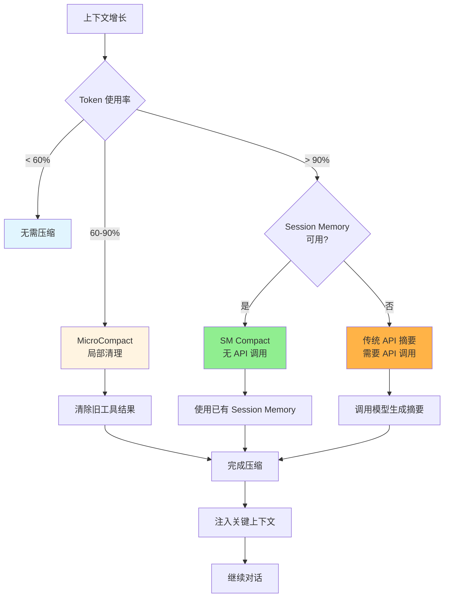
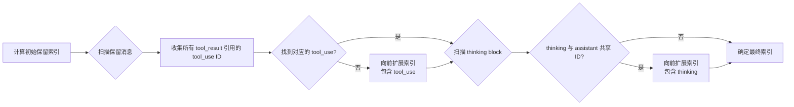
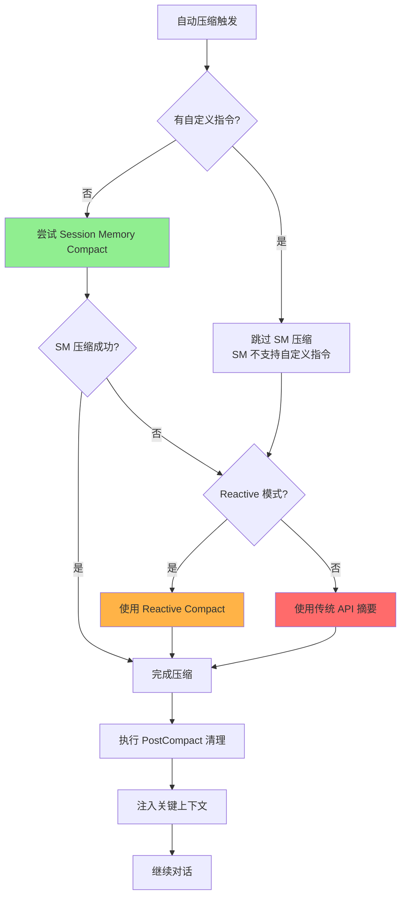
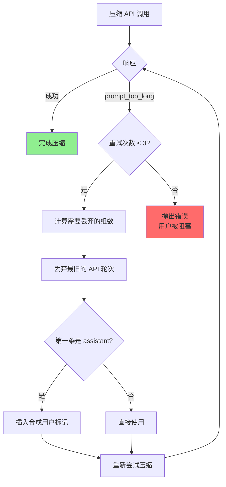
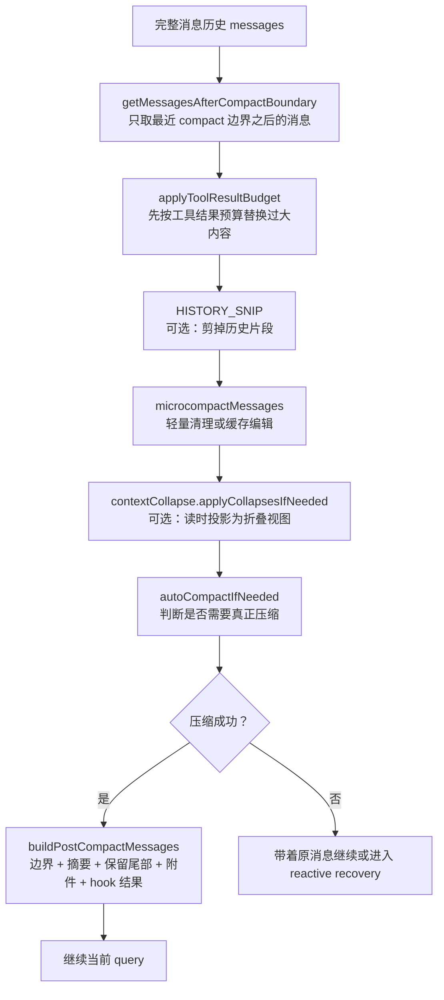

上下文压缩是 Claude Code 维持长对话能力的关键机制。随着会话推进，对话历史不断累积，当接近模型的上下文窗口限制时，系统会智能地压缩历史消息，释放空间同时保留关键信息。Claude Code 采用**三层递进的压缩策略**，在最小化上下文损失的前提下，最大化对话的连续性和连贯性。

## 压缩架构概览

Claude Code 的上下文压缩系统采用分层设计，根据上下文压力的严重程度自动选择最合适的策略：



Sources: [compact.ts](claude-code/src/services/compact/compact.ts#L389-l462), [autoCompact.ts](claude-code/src/services/compact/autoCompact.ts#l160-l199), [microCompact.ts](claude-code/src/services/compact/microCompact.ts#l253-l293)

## 三层压缩策略详解

### 第一层：MicroCompact — 局部清理

**触发条件**：单个工具输出过长或时间衰减触发  
**实现位置**： `src/services/compact/microCompact.ts`  
**是否需要 API 调用**：否  
**压缩范围**：仅清理工具结果，不改变对话结构

MicroCompact 是最轻量级的压缩策略，它不生成摘要，而是**智能清理旧的工具输出内容**。系统维护一个白名单，只清理特定工具的结果：

| 工具类型 | 清理策略 | 原因 |
|---------|---------|------|
| `Read` | 清除旧文件内容 | 文件内容可通过重新读取获取 |
| `Bash` | 清除旧命令输出 | 命令输出通常是一次性的 |
| `Grep` | 清除搜索结果 | 搜索结果可重新执行获取 |
| `Glob` | 清除文件列表 | 文件列表可重新查询 |
| `WebSearch` | 清除搜索结果 | 网络搜索结果时效性强 |
| `WebFetch` | 清除网页内容 | 网页内容可重新获取 |
| `Edit` | 清除编辑输出 | 编辑操作已完成，输出不再需要 |
| `Write` | 清除写入输出 | 写入操作已完成，输出不再需要 |

**时间衰减机制**：MicroCompact 使用时间衰减配置，越旧的工具输出越容易被清除：

```typescript
// timeBasedMCConfig.ts
export function getTimeBasedMCConfig(): TimeBasedMCConfig {
  // 根据距离最后一条 assistant 消息的时间间隔
  // 决定是否清除工具结果
  const gap = Date.now() - lastAssistantTime
  if (gap > CACHE_EXPIRY_THRESHOLD) {
    // 服务器缓存已过期，提前清除旧工具结果
    return { shouldClear: true }
  }
}
```

Sources: [microCompact.ts](claude-code/src/services/compact/microCompact.ts#l41-l50), [microCompact.ts](claude-code/src/services/compact/microCompact.ts#l262-l270), [timeBasedMCConfig.ts](claude-code/src/services/compact/timeBasedMCConfig.ts)

**Cache Editing 优化**：对于 Ant 内部用户，MicroCompact 还支持 **Cache Editing API**，可以在不失效提示缓存的情况下删除工具结果：

```typescript
// cachedMicrocompact.ts
// 使用 cache_edits API 在服务端删除工具结果
// 而不失效已缓存的对话前缀
async function cachedMicrocompactPath(messages: Message[]): Promise<MicrocompactResult> {
  const toolsToDelete = getToolResultsToDelete(state)
  if (toolsToDelete.length > 0) {
    // 创建 cache_edits 块，在 API 层删除工具结果
    const cacheEdits = createCacheEditsBlock(state, toolsToDelete)
    pendingCacheEdits = cacheEdits
  }
  return { messages, compactionInfo: { pendingCacheEdits } }
}
```

**图片和文档的特殊处理**：图片和 PDF 文档也会被 MicroCompact 清理，估算为 2000 token 每个：

```typescript
const IMAGE_MAX_TOKEN_SIZE = 2000

// 图片/document 超过 2000 token 会被替换为 [image]/[document] 标记
if (block.type === 'image' || block.type === 'document') {
  return { type: 'text', text: `[${block.type}]` }
}
```

Sources: [microCompact.ts](claude-code/src/services/compact/microCompact.ts#l38-l39), [microCompact.ts](claude-code/src/services/compact/microCompact.ts#l160-l167), [cachedMicrocompact.ts](claude-code/src/services/compact/cachedMicrocompact.ts#l305-l398)

### 第二层：Session Memory Compact — 无 API 调用的压缩

**触发条件**：自动压缩触发且 SM 可用  
**实现位置**： `src/services/compact/sessionMemoryCompact.ts`  
**是否需要 API 调用**：否  
**压缩范围**：整个对话历史

Session Memory Compact 是最理想的压缩策略。当两个 feature flag 启用时（`tengu_session_memory` + `tengu_sm_compact`），系统使用已经提取好的 Session Memory 作为对话摘要，**完全避免调用摘要模型**。

**保留窗口的智能计算**：

```typescript
// sessionMemoryCompact.ts
export function calculateMessagesToKeepIndex(
  messages: Message[],
  lastSummarizedIndex: number
): number {
  const config = getSessionMemoryCompactConfig()
  // 默认配置:
  // minTokens = 10,000 (保留至少 10K token)
  // minTextBlockMessages = 5 (至少 5 条文本消息)
  // maxTokens = 40,000 (最多 40K token)
  
  let totalTokens = 0
  let textBlockMessageCount = 0
  
  // 从 lastSummarizedIndex 向前扩展
  for (let i = startIndex - 1; i >= floor; i--) {
    totalTokens += estimateMessageTokens([msg])
    if (hasTextBlocks(msg)) textBlockMessageCount++
    startIndex = i
    
    // 满足最小要求或达到上限就停止
    if (totalTokens >= config.maxTokens) break
    if (totalTokens >= config.minTokens && 
        textBlockMessageCount >= config.minTextBlockMessages) break
  }
  
  return adjustIndexToPreserveAPIInvariants(messages, startIndex)
}
```

这个算法确保压缩后保留的窗口：
- **至少 10,000 token**：保证有足够的上下文深度
- **至少 5 条文本消息**：保证对话的连续性和可读性
- **最多 40,000 token**：避免窗口过大又触发下一次压缩

Sources: [sessionMemoryCompact.ts](claude-code/src/services/compact/sessionMemoryCompact.ts#l324-l397)

**工具对完整性保护**：Session Memory Compact 包含一个关键的正确性保证 —— `adjustIndexToPreserveAPIInvariants()`：

API 要求每个 `tool_result` 都有对应的 `tool_use`，反之亦然。如果压缩恰好切在一条 `tool_result` 消息处，会导致 API 报错。系统会：



```typescript
// sessionMemoryCompact.ts
function adjustIndexToPreserveAPIInvariants(
  messages: Message[],
  startIndex: number
): number {
  // Step 1: 向前扫描，找到所有被保留消息中 tool_result 引用的 tool_use
  const toolUseIdsToPreserve = new Set<string>()
  for (const msg of messages.slice(startIndex)) {
    if (msg.type === 'user' && Array.isArray(msg.message.content)) {
      for (const block of msg.message.content) {
        if (block.type === 'tool_result') {
          toolUseIdsToPreserve.add(block.tool_use_id)
        }
      }
    }
  }
  
  // Step 2: 向前扫描，找到引用的 tool_use 所在的 assistant 消息
  for (let i = startIndex - 1; i >= 0; i--) {
    const msg = messages[i]
    if (msg.type === 'assistant' && Array.isArray(msg.message.content)) {
      for (const block of msg.message.content) {
        if (block.type === 'tool_use' && toolUseIdsToPreserve.has(block.id)) {
          startIndex = i // 扩展索引
          break
        }
      }
    }
  }
  
  // Step 3: 处理 thinking block（与 assistant 消息共享 message.id）
  // ...
  
  return startIndex
}
```

Sources: [sessionMemoryCompact.ts](claude-code/src/services/compact/sessionMemoryCompact.ts#l232-l314)

### 第三层：传统 API 摘要压缩

**触发条件**：手动 `/compact` 或 SM 不可用时的自动回退  
**实现位置**： `src/services/compact/compact.ts`  
**是否需要 API 调用**：是  
**压缩范围**：整个对话历史

当 Session Memory Compact 不可用时，系统回退到传统方式：调用 AI 模型生成对话摘要。这是最重量级的压缩策略。

**压缩前的消息预处理**：

发送给摘要模型之前，消息会经过多层预处理，以避免压缩 API 调用本身也触发 `prompt_too_long` 错误：

```typescript
// compact.ts
export function stripImagesFromMessages(messages: Message[]): Message[] {
  return messages.map(message => {
    if (message.type !== 'user') return message
    
    const content = message.message.content
    if (!Array.isArray(content)) return message
    
    // 将图片替换为 [image] 标记
    const newContent = content.flatMap(block => {
      if (block.type === 'image') {
        return [{ type: 'text', text: '[image]' }]
      }
      if (block.type === 'document') {
        return [{ type: 'text', text: '[document]' }]
      }
      // 处理嵌套在 tool_result 中的图片/文档
      if (block.type === 'tool_result' && Array.isArray(block.content)) {
        const newToolContent = block.content.map(item => {
          if (item.type === 'image') return { type: 'text', text: '[image]' }
          if (item.type === 'document') return { type: 'text', text: '[document]' }
          return item
        })
        return [{ ...block, content: newToolContent }]
      }
      return [block]
    })
    
    return { ...message, message: { ...message.message, content: newContent } }
  })
}

// 移除会被重新注入的附件（skill_discovery 等）
export function stripReinjectedAttachments(messages: Message[]): Message[] {
  return messages.filter(m => !(
    m.type === 'attachment' &&
    (m.attachment.type === 'skill_discovery' || m.attachment.type === 'skill_listing')
  ))
}
```

Sources: [compact.ts](claude-code/src/services/compact/compact.ts#l147-l202), [compact.ts](claude-code/src/services/compact/compact.ts#l213-l225)

**摘要提示词的结构化设计**：

压缩提示词包含详细的指导，确保生成的摘要保留关键信息：

```typescript
// prompt.ts
const BASE_COMPACT_PROMPT = `
Your task is to create a detailed summary of the conversation so far...

Your summary should include the following sections:

1. Primary Request and Intent: 用户的所有明确请求和意图
2. Key Technical Concepts: 讨论的技术概念、框架
3. Files and Code Sections: 修改/创建的文件和代码片段
4. Errors and fixes: 遇到的错误和修复方法
5. Problem Solving: 解决的问题和进行中的排查
6. All user messages: 所有的用户消息（非工具结果）
7. Pending Tasks: 待办任务
8. Current Work: 当前正在处理的工作
9. Optional Next Step: 下一步计划

<analysis>
[分析阶段：按时间顺序分析每个消息]
</analysis>

<summary>
[按照结构输出摘要]
</summary>
`
```

Sources: [prompt.ts](claude-code/src/services/compact/prompt.ts#l61-l143)

**压缩后的上下文重新注入**：

压缩完成后，系统会智能地**重新注入关键上下文**，帮助模型快速恢复工作状态：

```typescript
// compact.ts
export const POST_COMPACT_MAX_FILES_TO_RESTORE = 5         // 最多恢复 5 个文件
export const POST_COMPACT_TOKEN_BUDGET = 50_000            // 总预算 50K token
export const POST_COMPACT_MAX_TOKENS_PER_FILE = 5_000      // 每文件 5K token
export const POST_COMPACT_MAX_TOKENS_PER_SKILL = 5_000     // 每技能 5K token
export const POST_COMPACT_SKILLS_TOKEN_BUDGET = 25_000     // 技能总预算 25K

async function createPostCompactFileAttachments(
  readFileState: Map<string, FileCacheEntry>,
  context: ToolUseContext,
  maxFiles: number
): Promise<AttachmentMessage[]> {
  // 1. 恢复最近读取的文件内容
  const recentFiles = [...readFileState.entries()]
    .sort((a, b) => b[1].lastAccessTime - a[1].lastAccessTime)
    .slice(0, maxFiles)
  
  for (const [path, entry] of recentFiles) {
    // 每个文件截断到 5K token
    const truncated = truncateToTokenLimit(entry.content, 5_000)
    attachments.push(createAttachmentMessage({
      type: 'file_content',
      path,
      content: truncated
    }))
  }
  
  // 2. 恢复已激活的技能指令
  const skillAttachment = createSkillAttachmentIfNeeded(context.agentId)
  if (skillAttachment) {
    attachments.push(skillAttachment)
  }
  
  // 3. 重新注入 MCP 工具发现结果
  for (const att of getMcpInstructionsDeltaAttachment(...)) {
    attachments.push(createAttachmentMessage(att))
  }
  
  return attachments
}
```

这 50K token 的重新注入预算确保压缩后模型不会丢失关键上下文：

| 注入类型 | Token 预算 | 用途 |
|---------|-----------|------|
| 文件内容 | 25K (5文件×5K) | 恢复最近读取的文件，每个截断到 5K |
| 技能指令 | 25K (总计) | 恢复已激活的技能，每个截断到 5K |
| 工具发现 | 不限 | 重新注入 MCP 工具和 delta 工具 |

Sources: [compact.ts](claude-code/src/services/compact/compact.ts#l124-l132), [compact.ts](claude-code/src/services/compact/compact.ts#l533-l587)

## 自动压缩的触发机制

Claude Code 的自动压缩系统通过**多级阈值监控**来决定何时触发压缩：

### Token 阈值计算

```typescript
// autoCompact.ts
export function getAutoCompactThreshold(model: string): number {
  const effectiveContextWindow = getEffectiveContextWindowSize(model)
  // 上下文窗口 - 13K 缓冲 = 自动压缩阈值
  // 例如: 200K - 13K = 187K (93.5%)
  return effectiveContextWindow - AUTOCOMPACT_BUFFER_TOKENS
}

export const AUTOCOMPACT_BUFFER_TOKENS = 13_000         // 自动压缩缓冲
export const WARNING_THRESHOLD_BUFFER_TOKENS = 20_000   // 警告阈值缓冲
export const ERROR_THRESHOLD_BUFFER_TOKENS = 20_000     // 错误阈值缓冲
export const MANUAL_COMPACT_BUFFER_TOKENS = 3_000       // 手动压缩缓冲
```

### 状态判断逻辑

```typescript
// autoCompact.ts
export function calculateTokenWarningState(
  tokenUsage: number,
  model: string,
): {
  percentLeft: number
  isAboveWarningThreshold: boolean
  isAboveErrorThreshold: boolean
  isAboveAutoCompactThreshold: boolean
  isAtBlockingLimit: boolean
} {
  const autoCompactThreshold = getAutoCompactThreshold(model)
  const threshold = isAutoCompactEnabled()
    ? autoCompactThreshold
    : getEffectiveContextWindowSize(model)
  
  const warningThreshold = threshold - WARNING_THRESHOLD_BUFFER_TOKENS
  const errorThreshold = threshold - ERROR_THRESHOLD_BUFFER_CHANNELS
  
  return {
    percentLeft: Math.round(((threshold - tokenUsage) / threshold) * 100),
    isAboveWarningThreshold: tokenUsage >= warningThreshold,
    isAboveErrorThreshold: tokenUsage >= errorThreshold,
    isAboveAutoCompactThreshold:
      isAutoCompactEnabled() && tokenUsage >= autoCompactThreshold,
    isAtBlockingLimit: tokenUsage >= blockingLimit,
  }
}
```

Sources: [autoCompact.ts](claude-code/src/services/compact/autoCompact.ts#l72-l91), [autoCompact.ts](claude-code/src/services/compact/autoCompact.ts#l93-l145)

### 压缩优先级链

当自动压缩触发时，系统按以下优先级尝试：



**关键代码路径**：

```typescript
// compact.ts (命令入口)
async function compactCommand() {
  if (!customInstructions) {
    // 优先：Session Memory 压缩（无 API 调用）
    const sessionMemoryResult = await trySessionMemoryCompaction(messages, ...)
    if (sessionMemoryResult) return sessionMemoryResult
  }
  
  if (reactiveCompact?.isReactiveOnlyMode()) {
    // 次选：Reactive 压缩（响应式）
    return await compactViaReactive(messages, ...)
  }
  
  // 兜底：传统 API 摘要
  const microcompactResult = await microcompactMessages(messages, context)
  return await compactConversation(microcompactResult.messages, ...)
}
```

Sources: [compact.ts](claude-code/src/services/compact/compact.ts), [sessionMemoryCompact.ts](claude-code/src/services/compact/sessionMemoryCompact.ts)

### 失败重试机制

自动压缩包含**断路器机制**，避免在上下文不可恢复时无限重试：

```typescript
// autoCompact.ts
const MAX_CONSECUTIVE_AUTOCOMPACT_FAILURES = 3

export type AutoCompactTrackingState = {
  compacted: boolean
  turnCounter: number
  turnId: string
  consecutiveFailures?: number  // 连续失败次数
}

// 当连续失败达到 3 次，停止尝试自动压缩
if ((state.consecutiveFailures ?? 0) >= MAX_CONSECUTIVE_AUTOCOMPACT_FAILURES) {
  return false // 不再触发自动压缩
}
```

Sources: [autoCompact.ts](claude-code/src/services/compact/autoCompact.ts#l51-l70)

## 消息分组与边界机制

### API 轮次分组

Claude Code 使用**API 轮次分组**来识别压缩的安全边界：

```typescript
// grouping.ts
export function groupMessagesByApiRound(messages: Message[]): Message[][] {
  const groups: Message[][] = []
  let current: Message[] = []
  let lastAssistantId: string | undefined
  
  // 边界触发条件：新的 assistant 响应开始（不同的 message.id）
  for (const msg of messages) {
    if (
      msg.type === 'assistant' &&
      msg.message.id !== lastAssistantId &&
      current.length > 0
    ) {
      groups.push(current)
      current = [msg]
    } else {
      current.push(msg)
    }
    if (msg.type === 'assistant') {
      lastAssistantId = msg.message.id
    }
  }
  
  if (current.length > 0) {
    groups.push(current)
  }
  return groups
}
```

**为什么使用 API 轮次作为边界**：API 合约要求每个 `tool_use` 在下一个 assistant turn 之前被解析，因此 assistant-id 边界是 API 安全的分割点。这比按人类轮次分组更细粒度，支持单轮次 agentic 会话。

Sources: [grouping.ts](claude-code/src/services/compact/grouping.ts#l22-l63)

### CompactBoundary 边界标记

每次压缩后，系统在消息流中插入一条 `SystemCompactBoundaryMessage`：

```typescript
type SystemCompactBoundaryMessage = {
  type: 'system'
  message: {
    type: 'compact_boundary'
    compactMetadata: {
      compactType: 'auto' | 'manual' | 'micro'
      preCompactTokenCount: number
      lastUserMessageUuid: string
      preCompactDiscoveredTools?: string[]
      preservedSegment?: {
        headUuid: string
        anchorUuid: string
        tailUuid: string
      }
    }
  }
}
```

**Boundary 的作用**：

```typescript
// messages.ts
export function getMessagesAfterCompactBoundary(messages: Message[]): Message[] {
  const lastBoundary = messages.findLastIndex(m => isCompactBoundaryMessage(m))
  // 只处理最后一条 boundary 之后的消息
  return lastBoundary >= 0 ? messages.slice(lastBoundary + 1) : messages
}
```

**Preserved Segment 注解**：

Boundary 消息记录哪些消息被保留而非压缩：

```typescript
// compact.ts
export function annotateBoundaryWithPreservedSegment(
  boundary: SystemCompactBoundaryMessage,
  anchorUuid: UUID,
  messagesToKeep: readonly Message[] | undefined,
): SystemCompactBoundaryMessage {
  const keep = messagesToKeep ?? []
  if (keep.length === 0) return boundary
  
  return {
    ...boundary,
    compactMetadata: {
      ...boundary.compactMetadata,
      preservedSegment: {
        headUuid: keep[0]!.uuid,
        anchorUuid,  // 锚点：紧接在保留段之前的消息
        tailUuid: keep.at(-1)!.uuid,
      },
    },
  }
}
```

这个注解帮助会话加载器重新链接消息的父子关系。

Sources: [messages.ts](claude-code/src/utils/messages.ts), [compact.ts](claude-code/src/services/compact/compact.ts#l351-l369)

## 高级压缩特性

### Prompt-Too-Long 紧急降级

当压缩 API 调用本身也触发 `prompt_too_long` 错误时，系统使用**紧急降级策略**：

```typescript
// compact.ts
const MAX_PTL_RETRIES = 3
const PTL_RETRY_MARKER = '[earlier conversation truncated for compaction retry]'

export function truncateHeadForPTLRetry(
  messages: Message[],
  ptlResponse: AssistantMessage,
): Message[] | null {
  // 移除之前重试的合成标记
  const input = messages[0]?.type === 'user' &&
    messages[0].isMeta &&
    messages[0].message.content === PTL_RETRY_MARKER
    ? messages.slice(1)
    : messages
  
  const groups = groupMessagesByApiRound(input)
  if (groups.length < 2) return null
  
  // 从 token gap 计算需要丢弃的组数
  const tokenGap = getPromptTooLongTokenGap(ptlResponse)
  let dropCount: number
  if (tokenGap !== undefined) {
    let acc = 0
    dropCount = 0
    for (const g of groups) {
      acc += roughTokenCountEstimationForMessages(g)
      dropCount++
      if (acc >= tokenGap) break
    }
  } else {
    // 无法解析 gap 时，丢弃 20% 的组
    dropCount = Math.max(1, Math.floor(groups.length * 0.2))
  }
  
  // 保留至少一组
  dropCount = Math.min(dropCount, groups.length - 1)
  const sliced = groups.slice(dropCount).flat()
  
  // 如果第一组是 assistant 消息，插入合成用户标记
  if (sliced[0]?.type === 'assistant') {
    return [
      createUserMessage({ content: PTL_RETRY_MARKER, isMeta: true }),
      ...sliced,
    ]
  }
  return sliced
}
```

**降级流程**：



Sources: [compact.ts](claude-code/src/services/compact/compact.ts#l229-l293), [compact.ts](claude-code/src/services/compact/compact.ts#l452-l493)

### 部分压缩

除了完整压缩，系统还支持**部分压缩**，只压缩特定范围内的消息：

```typescript
// compact.ts
export async function partialCompactConversation(
  allMessages: Message[],
  pivotIndex: number,
  context: ToolUseContext,
  cacheSafeParams: CacheSafeParams,
  userFeedback?: string,
  direction: PartialCompactDirection = 'from',
): Promise<CompactionResult> {
  // direction 'from': 压缩 pivotIndex 之后的消息，保留之前的
  // direction 'up_to': 压缩 pivotIndex 之前的消息，保留之后的
  
  const messagesToSummarize =
    direction === 'up_to'
      ? allMessages.slice(0, pivotIndex)
      : allMessages.slice(pivotIndex)
  
  // 'up_to' 需要移除旧的压缩边界/摘要
  const messagesToKeep =
    direction === 'up_to'
      ? allMessages.slice(pivotIndex).filter(
          m => !isCompactBoundaryMessage(m)
        )
      : allMessages.slice(0, pivotIndex)
  
  // ... 调用压缩逻辑
  
  return {
    boundaryMarker,
    summaryMessages,
    messagesToKeep,  // 保留的消息段
    // ...
  }
}
```

**缓存优化**：`direction='from'` 保留早期消息，可以保持提示缓存的连续性。

Sources: [compact.ts](claude-code/src/services/compact/compact.ts#l774-l799)

### Reactive Compact

Reactive Compact 是一种**响应式压缩策略**，只在 API 返回 `prompt_too_long` 错误时触发，而不是主动预测：

```typescript
// reactiveCompact.ts (stub)
export const reactiveCompactOnPromptTooLong: (
  messages: Message[],
  cacheSafeParams: Record<string, unknown>,
  options: { customInstructions?: string; trigger?: string },
) => Promise<{ ok: boolean; reason?: string; result?: CompactionResult }> = 
  async () => ({ ok: false })

export const isReactiveOnlyMode: () => boolean = () => false
```

**Reactive vs Proactive**：

| 特性 | Proactive (主动) | Reactive (响应式) |
|------|----------------|------------------|
| 触发时机 | Token 使用率达到阈值 | API 返回 `prompt_too_long` |
| 预测性 | 高 - 提前压缩 | 低 - 被动响应 |
| 用户体验 | 更流畅 | 可能有延迟 |
| API 调用 | 可能浪费（如果预测错误） | 更精准（只在需要时） |
| 缓存利用 | 更好（主动维护缓存） | 较差（错误后修复） |

Sources: [reactiveCompact.ts](claude-code/src/services/compact/reactiveCompact.ts)

## 压缩后的清理工作

压缩完成后，系统需要清理各种缓存和状态：

```typescript
// postCompactCleanup.ts
export function runPostCompactCleanup(querySource?: QuerySource): void {
  // 判断是否是主线程压缩
  const isMainThreadCompact =
    querySource === undefined ||
    querySource.startsWith('repl_main_thread') ||
    querySource === 'sdk'
  
  // 1. 重置 MicroCompact 状态
  resetMicrocompactState()
  
  // 2. 重置 Context Collapse（仅主线程）
  if (feature('CONTEXT_COLLAPSE') && isMainThreadCompact) {
    resetContextCollapse()
  }
  
  // 3. 清理 Claude.md 缓存（仅主线程）
  if (isMainThreadCompact) {
    getUserContext.cache.clear?.()
    resetGetMemoryFilesCache('compact')
  }
  
  // 4. 清理系统提示段落
  clearSystemPromptSections()
  
  // 5. 清理分类器审批
  clearClassifierApprovals()
  
  // 6. 清理 Bash 权限检查
  clearSpeculativeChecks()
  
  // 7. 清理 Beta 追踪状态
  clearBetaTracingState()
  
  // 8. 清理会话消息缓存
  clearSessionMessagesCache()
  
  // 注意：不重置 sentSkillNames，避免重新注入完整的技能列表
}
```

**为什么不清理某些状态**：

```typescript
// 注意：我们故意不清理已调用的技能内容
// 技能内容必须在多次压缩后仍然保留
// 以便 createSkillAttachmentIfNeeded() 在后续压缩中包含完整的技能文本
```

Sources: [postCompactCleanup.ts](claude-code/src/services/compact/postCompactCleanup.ts#l31-l77)

## Token 预算管理

### 上下文窗口计算

```typescript
// context.ts
export function getContextWindowForModel(
  model: string,
  betas?: string[],
): number {
  // 1. 环境变量覆盖（最高优先级）
  if (process.env.CLAUDE_CODE_MAX_CONTEXT_TOKENS) {
    const override = parseInt(process.env.CLAUDE_CODE_MAX_CONTEXT_TOKENS, 10)
    if (!isNaN(override) && override > 0) return override
  }
  
  // 2. [1m] 后缀显式选择
  if (has1mContext(model)) return 1_000_000
  
  // 3. 模型能力配置
  const cap = getModelCapability(model)
  if (cap?.max_input_tokens && cap.max_input_tokens >= 100_000) {
    if (cap.max_input_tokens > MODEL_CONTEXT_WINDOW_DEFAULT && is1mContextDisabled()) {
      return MODEL_CONTEXT_WINDOW_DEFAULT  // HIPAA 合规限制
    }
    return cap.max_input_tokens
  }
  
  // 4. Beta 头部检测
  if (betas?.includes(CONTEXT_1M_BETA_HEADER) && modelSupports1M(model)) {
    return 1_000_000
  }
  
  // 5. Sonnet 1M 实验处理
  if (getSonnet1mExpTreatmentEnabled(model)) return 1_000_000
  
  // 6. Ant 模型解析
  if (process.env.USER_TYPE === 'ant') {
    const antModel = resolveAntModel(model)
    if (antModel?.contextWindow) return antModel.contextWindow
  }
  
  // 7. 默认值
  return MODEL_CONTEXT_WINDOW_DEFAULT  // 200K
}
```

Sources: [context.ts](claude-code/src/utils/context.ts#l52-l99)

### Token 预算解析

用户可以通过自然语言指定 token 预算：

```typescript
// tokenBudget.ts
const SHORTHAND_START_RE = /^\s*\+(\d+(?:\.\d+)?)\s*(k|m|b)\b/i  // "+500k"
const SHORTHAND_END_RE = /\s\+(\d+(?:\.\d+)?)\s*(k|m|b)\s*[.!?]?\s*$/i  // "use +500k."
const VERBOSE_RE = /\b(?:use|spend)\s+(\d+(?:\.\d+)?)\s*(k|m|b)\s*tokens?\b/i  // "use 500k tokens"

const MULTIPLIERS: Record<string, number> = {
  k: 1_000,
  m: 1_000_000,
  b: 1_000_000_000,
}

export function parseTokenBudget(text: string): number | null {
  const startMatch = text.match(SHORTHAND_START_RE)
  if (startMatch) return parseBudgetMatch(startMatch[1]!, startMatch[2]!)
  
  const endMatch = text.match(SHORTHAND_END_RE)
  if (endMatch) return parseBudgetMatch(endMatch[1]!, endMatch[2]!)
  
  const verboseMatch = text.match(VERBOSE_RE)
  if (verboseMatch) return parseBudgetMatch(verboseMatch[1]!, verboseMatch[2]!)
  
  return null
}
```

**预算检查逻辑**：

```typescript
// query/tokenBudget.ts
export function checkTokenBudget(
  tracker: BudgetTracker,
  agentId: string | undefined,
  budget: number | null,
  globalTurnTokens: number,
): TokenBudgetDecision {
  // Agent 不受预算限制
  if (agentId || budget === null || budget <= 0) {
    return { action: 'stop', completionEvent: null }
  }
  
  const turnTokens = globalTurnTokens
  const pct = Math.round((turnTokens / budget) * 100)
  const deltaSinceLastCheck = globalTurnTokens - tracker.lastGlobalTurnTokens
  
  // 检测收益递减
  const isDiminishing =
    tracker.continuationCount >= 3 &&
    deltaSinceLastCheck < DIMINISHING_THRESHOLD &&  // 500
    tracker.lastDeltaTokens < DIMINISHING_THRESHOLD
  
  // 未达到 90% 且无收益递减，继续工作
  if (!isDiminishing && turnTokens < budget * COMPLETION_THRESHOLD) {  // 0.9
    tracker.continuationCount++
    tracker.lastDeltaTokens = deltaSinceLastCheck
    tracker.lastGlobalTurnTokens = globalTurnTokens
    return {
      action: 'continue',
      nudgeMessage: getBudgetContinuationMessage(pct, turnTokens, budget),
      continuationCount: tracker.continuationCount,
      pct, turnTokens, budget,
    }
  }
  
  // 达到预算或收益递减，停止
  if (isDiminishing || tracker.continuationCount > 0) {
    return {
      action: 'stop',
      completionEvent: {
        continuationCount: tracker.continuationCount,
        pct, turnTokens, budget,
        diminishingReturns: isDiminishing,
        durationMs: Date.now() - tracker.startedAt,
      },
    }
  }
  
  return { action: 'stop', completionEvent: null }
}
```

Sources: [tokenBudget.ts](claude-code/src/utils/tokenBudget.ts#l1-l29), [query/tokenBudget.ts](claude-code/src/query/tokenBudget.ts#l45-l93)

## 最佳实践

### 何时使用手动压缩

**推荐手动压缩的场景**：

1. **完成一个工作阶段后**：完成一个功能模块开发、修复一个 bug 后，手动压缩保留关键决策
2. **Token 使用率 > 85%**：接近自动压缩阈值时，主动压缩避免被动触发
3. **需要自定义摘要重点**：使用 `/compact 聚焦在认证模块的实现细节` 指导摘要方向
4. **长期项目维护**：定期压缩保持上下文清晰

**不推荐手动压缩的场景**：

1. **Token 使用率 < 70%**：压缩会丢失细节，收益不大
2. **正在进行复杂调试**：需要完整的历史上下文
3. **刚执行过压缩**：频繁压缩导致上下文碎片化

### 压缩策略的选择

| 场景 | 推荐策略 | 原因 |
|------|---------|------|
| 常规开发对话 | Session Memory Compact | 无 API 调用，快速且准确 |
| 需要强调重点 | 传统 API 摘要 + 自定义指令 | 可以指导摘要方向 |
| 工具输出过多 | MicroCompact 自动清理 | 轻量级，不影响对话结构 |
| API prompt_too_long | Reactive Compact | 被动修复，精准响应 |

### 故障排除

**问题 1：压缩后上下文丢失关键信息**

可能原因：
- Session Memory 未提取足够信息
- 自定义指令限制了摘要范围

解决方案：
```bash
# 使用更详细的自定义指令
/compact 保留所有 API 调用的详细信息，包括请求参数和响应结构

# 或在压缩前手动注入上下文
/compact 记住我们正在实现 OAuth2.0 认证流程，使用 JWT token
```

**问题 2：频繁触发自动压缩**

可能原因：
- 上下文窗口设置过小
- 工具输出包含大量冗余信息

解决方案：
```bash
# 检查上下文窗口大小
# 模型支持 1M context 时使用
claude --model claude-sonnet-4-6[1m]

# 启用 MicroCompact 自动清理
# 已默认启用，检查配置
```

**问题 3：压缩 API 调用失败（prompt_too_long）**

这是**最严重的问题**，用户可能被阻塞。系统已内置重试机制：

1. **自动降级**：系统会丢弃最旧的 API 轮次并重试（最多 3 次）
2. **手动干预**：如果自动降级失败，需要手动清理对话：
   ```bash
   # 清除所有对话历史
   /clear
   
   # 或使用 rewind 回退到更早的状态
   /rewind 50%  # 丢弃 50% 的消息
   ```

**问题 4：压缩后模型行为不一致**

可能原因：
- Session Memory 摘要与原始对话有偏差
- 工具对不完整导致 API 错误

解决方案：
```bash
# 使用传统 API 摘要确保准确性
DISABLE_SESSION_MEMORY_COMPACT=1 /compact

# 检查是否有 API 错误
# 查看日志中的 compact 相关错误
```

Sources: [compact.ts](claude-code/src/services/compact/compact.ts#l452-l493)

## 总结

Claude Code 的上下文压缩策略是一个**多层防御系统**，通过三层递进的策略在不同严重程度下智能选择最优方案：

1. **MicroCompact**：轻量级清理，保持对话结构
2. **Session Memory Compact**：无 API 调用的理想压缩
3. **传统 API 摘要**：重量级但灵活的兜底方案

关键设计原则：
- **渐进式压缩**：从轻到重，最小化上下文损失
- **工具对完整性**：确保 API 合约不被违反
- **智能重新注入**：压缩后恢复关键上下文
- **紧急降级机制**：处理极端情况的 PTL 错误

通过理解这些机制，开发者可以更好地规划对话策略，在长会话中保持高效的工作流。

## 相关页面

- [Token 预算管理](20-token-yu-suan-guan-li) - 深入了解 token 计数和预算分配
- [系统提示构建](17-xi-tong-ti-shi-gou-jian) - 压缩后如何重新注入系统提示
- [项目内存与知识管理](18-xiang-mu-nei-cun-yu-zhi-shi-guan-li) - Session Memory 的工作原理
- [多轮对话与会话管理](7-duo-lun-dui-hua-yu-hui-hua-guan-li) - 压缩在会话生命周期中的位置

---

## 源码下钻增补：上下文压缩的真实控制流与设计模式

> 本节基于本地 Claude Code 源码增量补充。文档中的 `claude-code/...` 对应源码目录：
> `/Users/machengqian.1/code/typescriptProject/claude-code-main/...`

前文已经把 Claude Code 的压缩能力讲成了三层：MicroCompact、Session Memory Compact、传统摘要 Compact。源码里更值得学习的是：Claude Code 并不是等上下文爆了再“总结一下”，而是把上下文管理设计成一条流水线。每一层只处理自己最擅长的生命周期问题，并且在进入下一层之前尽量保持协议、缓存和运行状态的连续性。

### 1. Query 主循环里的真实顺序：压缩不是一个动作，而是一条流水线

在 `src/query.ts` 中，每次模型请求前，消息会经过一组上下文变换，顺序大致是：



这里有几个细节非常关键：

- `getMessagesAfterCompactBoundary()` 先执行，说明 compact boundary 不是装饰性消息，而是后续上下文重建的真实边界。
- `applyToolResultBudget()` 在 `microcompactMessages()` 之前执行，因为 cached microcompact 只按 `tool_use_id` 做缓存编辑，不需要检查工具结果内容，两者可以组合。
- `HISTORY_SNIP` 在 microcompact 之前执行，并把释放的 token 数传给 autocompact，避免 autocompact 用过期 token 估算误判。
- context collapse 在 autocompact 之前执行。如果 collapse 已经把上下文压到阈值以下，autocompact 就不会把粒度更细的历史压成一个大摘要。
- autocompact 成功后不会等下一轮才生效，而是立刻 `yield` post-compact messages，并用这些消息继续当前 query。

这说明 Claude Code 的上下文管理是“请求前的可组合变换链”，不是单点功能。每一层都要回答一个更小的问题：这一步能不能减少 token、保住协议、保住缓存、保住继续执行所需状态？

Sources:
- `src/query.ts`
- `src/services/compact/compact.ts`
- `src/services/compact/microCompact.ts`
- `src/utils/toolResultStorage.ts`

### 2. MicroCompact 的真实角色：不是摘要，而是“可替换内容”的生命周期管理

`microcompactMessages()` 里有一个很清晰的优先级：

1. 先清除 compact warning suppression。
2. 先尝试 time-based microcompact。
3. 如果 time-based microcompact 触发，直接返回，不再走 cached microcompact。
4. 只有在主线程、模型支持、功能开启时，才走 cached microcompact。
5. 否则直接返回原消息。

这背后的思想是：MicroCompact 管的不是“语义记忆”，而是“工具结果内容是否还值得留在 prompt 里”。

#### time-based microcompact：利用缓存过期这个事实

`timeBasedMCConfig.ts` 的注释说得很直白：当距离上一次主循环 assistant 消息超过阈值时，服务端 prompt cache 基本已经过期。既然下一次请求无论如何都要重写完整 prefix，就应该在请求前清理旧工具结果，减少重写成本。

默认配置是：

- `enabled: false`
- `gapThresholdMinutes: 60`
- `keepRecent: 5`

这里的关键不是默认值，而是触发条件的设计：它不为了省 token 主动破坏一个仍然温热的 cache，而是在 cache 已经大概率失效时才清理。这是一种 cache-aware 的压缩策略。

#### cached microcompact：不改本地消息，只改 API 侧缓存视图

cached microcompact 的注释强调：

- 不修改本地 message content。
- 在 API 层添加 `cache_reference` 和 `cache_edits`。
- 通过 GrowthBook 配置 count-based trigger/keep 阈值。
- 只在主线程执行，避免 forked agent 把自己的工具结果注册进全局 `cachedMCState`，导致主线程删除不存在的工具。

这点很重要：压缩不一定等于修改本地历史。Claude Code 把“本地 transcript 的完整性”和“发送给模型的上下文视图”分开了。前者服务恢复、审计和继续执行，后者服务本次请求的成本和容量。

Sources:
- `src/services/compact/microCompact.ts`
- `src/services/compact/timeBasedMCConfig.ts`
- `src/services/compact/apiMicrocompact.ts`

### 3. API MicroCompact：把一部分上下文管理下放给模型 API

`apiMicrocompact.ts` 中的 `getAPIContextManagement()` 返回的是 API 原生的 context management 配置，而不是本地消息改写。它支持两类策略：

- `clear_thinking_20251015`：清理 thinking block。
- `clear_tool_uses_20250919`：清理工具使用或工具结果相关内容。

这里有三个设计点：

1. thinking 的处理会区分 `hasThinking`、`isRedactThinkingActive`、`clearAllThinking`。如果 thinking 已经被 redact，就没有必要再让 API 清理。
2. 工具清理策略只对 `USER_TYPE=ant` 开放，且通过环境变量分别控制 clear tool results 和 clear tool uses。
3. 默认阈值与客户端 microcompact 保持一致：最大输入 token 约 180k，目标保留约 40k。

所以 Claude Code 的压缩层级里，其实还有一层“API 原生上下文编辑”。它的设计答案是：如果某些内容的清理可以由 API 在缓存和协议语义上更自然地完成，客户端不一定要自己手动改 transcript。

Sources:
- `src/services/compact/apiMicrocompact.ts`

### 4. Session Memory Compact 的核心不是“省一次 API 调用”，而是维护协议不变量

Session Memory Compact 看上去是为了避免传统摘要 API 调用，但源码里最值得学的是 `adjustIndexToPreserveAPIInvariants()` 这类逻辑。

它在决定“保留尾部从哪里开始”时，不只是看 token 数，还会做几类修正：

- 如果保留区间里有 `tool_result`，但对应的 `tool_use` 在更早位置，就把起点往前扩，确保工具调用对完整。
- 如果 assistant 流式输出被拆成多个 message，但共享同一个 `message.id`，就一起保留，避免保留半个 assistant response。
- 起点不能越过最近 compact boundary。因为 compact 后的磁盘 transcript 可能存在 preserved segment 的重连关系，随意跨 boundary 会破坏加载器恢复链路。
- 同时还要满足 `minTokens`、`minTextBlockMessages`、`maxTokens` 这类配置约束。

这就是“把隐含在代码里的不变量显式化”的典型例子。

隐含的不变量是：

- API 要求 `tool_use` 和 `tool_result` 成对出现。
- 流式拆块后，同一个 assistant response 仍然应该作为一个整体。
- compact boundary 之后的 preserved segment 不是普通数组切片，而是带有磁盘重连语义。

显式化之后，它们就变成了可检查、可调整、可测试的函数逻辑：先算 token，再用 `adjustIndexToPreserveAPIInvariants()` 修正切分点。也就是说，系统不是靠开发者记住“别切坏工具对”，而是把这个规则写进了切分算法本身。

Sources:
- `src/services/compact/sessionMemoryCompact.ts`

### 5. AutoCompact：真正的入口是“是否应该压缩”，不是“如何压缩”

`autoCompactIfNeeded()` 先做一组 gate，再决定是否进入压缩：

- `DISABLE_COMPACT` 直接关闭。
- 连续失败次数超过 `MAX_CONSECUTIVE_AUTOCOMPACT_FAILURES` 后熔断。
- `shouldAutoCompact()` 判断当前 querySource、模型、token 阈值、feature flag、context collapse 状态。
- 对 `session_memory`、`compact` 这类 forked agent 会跳过，避免压缩任务自己触发压缩造成死锁。
- reactive-only 模式会关闭主动 autocompact，把恢复交给 reactive compact。
- context collapse 开启时会抑制 autocompact，因为 collapse 已经接管了 headroom 问题。
- token 估算会减去 `snipTokensFreed`，避免前一层 snip 已经释放 token 后仍误触发压缩。

如果确实需要压缩，顺序是：

1. 先尝试 `trySessionMemoryCompaction()`。
2. 成功则清理 last summarized id，执行 post-compact cleanup，重置 prompt-cache-break baseline。
3. 失败再进入 `compactConversation()`，走传统摘要。
4. 如果传统摘要失败，记录 consecutive failures，下一轮可能触发熔断。

这里的设计答案是：压缩系统的难点不是写一个 summary prompt，而是判断什么时候不该压缩。很多 agent 系统的问题不是没有压缩，而是压缩触发太激进，结果丢掉粒度、破坏缓存，甚至在失败状态里无限重试。

Sources:
- `src/services/compact/autoCompact.ts`

### 6. CompactConversation：摘要只是中间产物，真正目标是“压缩后还能继续干活”

`compactConversation()` 做的事比“调用模型总结历史”多得多。传统摘要成功后，它会构造一个 `CompactionResult`，再由 `buildPostCompactMessages()` 组装为：

```ts
[
  boundaryMarker,
  ...summaryMessages,
  ...(messagesToKeep ?? []),
  ...attachments,
  ...hookResults,
]
```

这个顺序很有讲究：

- `boundaryMarker` 告诉后续加载和 query：这里发生过压缩。
- `summaryMessages` 提供语义连续性。
- `messagesToKeep` 保留最近尾部，避免摘要损失最近细节。
- `attachments` 重新注入运行所需状态。
- `hookResults` 把 compact hook 的输出也放回上下文。

源码中 post-compact attachments 包括多类内容：

- pre-compact 时读过的文件状态。
- async agent attachments。
- plan attachment。
- plan mode attachment。
- invoked skills attachment。
- deferred tools delta。
- agent listing delta。
- MCP instructions delta。

这说明 Claude Code 不把摘要当成全部上下文。它知道 summary 只能保存语义，不能保存所有 operational state。压缩之后要能继续工作，必须把“当前任务还需要的操作性材料”再水合回来。

这也是学习 Agent 设计时非常重要的模式：上下文压缩不只是 memory compression，而是 state rehydration。

Sources:
- `src/services/compact/compact.ts`
- `src/services/compact/postCompactCleanup.ts`

### 7. Compact Boundary 与 preservedSegment：压缩是 transcript surgery，不是简单删除

`annotateBoundaryWithPreservedSegment()` 会给 compact boundary 加上：

- `headUuid`
- `anchorUuid`
- `tailUuid`

注释里说明，保留下来的 messages 在磁盘上会保留原来的 `parentUuids`，因为 dedup 会跳过它们。加载器需要用这些 metadata 修补 head、anchor、tail 之间的关系。

这说明 compact boundary 至少有三重作用：

1. 对 query：只取最近边界之后的消息。
2. 对 transcript：记录这里发生过压缩。
3. 对 loader：帮助恢复被保留片段的链式关系。

所以压缩不是“把前面的数组删掉”。更准确地说，它是一次带 metadata 的 transcript surgery：既要改变模型可见上下文，又要让持久化历史还能被恢复和解释。

Sources:
- `src/services/compact/compact.ts`

### 8. API-round grouping：切分单位不是用户轮次，而是 API 往返

`grouping.ts` 把消息按 API round 分组。边界条件不是“下一个用户消息”，而是“新的 assistant response 开始，且 `message.id` 与上一个 assistant 不同”。

**这是一个非常细的设计选择。**

如果按用户轮次切分，在传统聊天里似乎没问题；但 Agent 场景常常是一个用户 prompt 触发多轮工具调用、多个 assistant/tool_result 交错。整个任务可能只有一个 human turn。如果只能按 human turn 切分，很多单 prompt 的 agentic session 就无法做局部丢弃或 reactive compact。

按 API round 分组有两个好处：

- 比 human turn 更细，能处理单 prompt 多工具循环。
- 又比随意按消息切更稳，因为同一个 assistant response 的流式块共享 `message.id`，会被留在同一组里。

源码注释还提到，如果存在 dangling `tool_use` 这类 malformed 输入，不强行把边界关死，而是让 summarizer fork 的 pairing 修复逻辑在 API 调用前处理。这里体现的是一种工程取舍：分组层不承担所有修复责任，它只提供足够好的压缩单位。

Sources:
- `src/services/compact/grouping.ts`

### 9. Prompt-too-long recovery：压缩请求自己也可能过长

一个容易忽略的问题是：当上下文已经太长时，“请求模型来总结上下文”这件事本身也可能 prompt too long。

`compact.ts` 里有专门的降级逻辑：

- `stripImagesFromMessages()` 会把图片、文档块替换为 `[image]`、`[document]`，避免多模态内容把摘要请求撑爆。
- `truncateHeadForPTLRetry()` 会丢弃最旧的 API-round groups 后重试。
- 如果截断后请求会以 assistant 开头，会插入合成 user marker，因为 API 不接受 assistant-first 序列。
- 重试次数有限，不会无限尝试。

这说明压缩系统必须考虑“压缩器自身也会失败”。成熟的 Agent 不是只设计正常路径，还要设计恢复路径里的恢复路径。

Sources:
- `src/services/compact/compact.ts`

### 10. Reactive Compact：主动压缩失败后的最后恢复层

在 `query.ts` 的错误恢复路径里，如果模型调用返回 withheld prompt-too-long / media / max-output 一类问题，query loop 会尝试 reactive compact。

成功时，它同样使用 `buildPostCompactMessages()`，然后把 state transition 设为 `reactive_compact_retry`，直接用 compact 后的消息重试当前请求。

如果 reactive compact 也失败，系统会吐出 withheld error 并结束，而且不会继续执行 stop hooks。源码注释解释了原因：模型没有产生有效 response，stop hooks 没有可评估对象；如果这时 hook 再注入更多 token，可能形成 error -> hook blocking -> retry -> error 的循环。

这给出的设计答案是：错误恢复链路也要限制副作用。不是所有 hook、回调、自动化都应该在失败路径继续运行。

Sources:
- `src/query.ts`

### 11. Post-compact cleanup：清理必须知道自己属于主线程还是子 agent

`runPostCompactCleanup(querySource)` 的注释非常值得读。Claude Code 的 subagent 和主线程运行在同一进程里，会共享一些 module-level state，例如 context-collapse store、memory file cache、user context cache。

因此 cleanup 不是简单的“全部 reset”：

- `resetMicrocompactState()` 总是执行。
- context collapse、memory file cache、user context cache 只在主线程 compact 时清。
- system prompt sections、classifier approvals、speculative checks、beta tracing、session message cache 会清。
- invoked skill content 故意不清，因为后续 compact 还需要把完整 skill text 放进 attachments。
- `resetSentSkillNames()` 也故意不调用，避免 post-compact 后重新注入完整 skill listing，造成额外 cache creation。

这是一种 scope-aware cleanup。它承认“状态不是全局同质的”：有些状态属于当前 query，有些属于主线程，有些属于 subagent，有些必须跨 compact 保留。

Sources:
- `src/services/compact/postCompactCleanup.ts`

---

## 可总结的设计思想与模式

下面用我们现在的学习准则来整理：它在 Agent 公共问题上，给出了什么不同的设计答案？

### 模式一：分层降级，而不是单一摘要

**公共问题**：长会话必然接近上下文上限，但每次都做完整摘要会昂贵、慢、且丢细节。

**Claude Code 的答案**：把上下文压力分给多层处理：

- 工具结果预算先处理单条消息过大。
- snip/collapse 处理历史视图。
- microcompact 清理可替换工具内容。
- session memory 优先尝试无额外摘要 API 的压缩。
- traditional compact 作为通用兜底。
- reactive compact 处理 API 已经报错后的恢复。

**解决的失败模式**：一到阈值就大摘要，导致最近细节丢失、缓存失效、用户等待变长。

**代价**：系统复杂度明显升高，需要维护多层 feature flag、状态清理和 telemetry。

**可复用经验**：Agent 上下文管理最好是一条降级链，而不是一个 `/summarize` 函数。

### 模式二：协议不变量优先于 token 目标

**公共问题**：压缩本质是在切消息。一旦切坏 `tool_use` / `tool_result`、assistant 流式块、compact boundary，轻则 API 报错，重则恢复历史错乱。

**Claude Code 的答案**：先按 token 算候选起点，再用 `adjustIndexToPreserveAPIInvariants()` 修正。也就是 token 目标可以让步，但协议不变量不能让步。

**解决的失败模式**：为了省 token 切掉一半工具调用，导致下一次模型请求不合法。

**代价**：实际保留 token 可能比预期更多，压缩效果不总是最激进。

**可复用经验**：任何 Agent 压缩系统都应该先列出自己的“不变量清单”：工具对、消息顺序、流式块归属、父子链、权限状态、外部资源引用。压缩算法要内置这些规则，而不是靠调用方记忆。

### 模式三：压缩后再水合 operational state

**公共问题**：摘要能保存“发生了什么”，但不能完整保存“接下来继续做事需要什么”。

**Claude Code 的答案**：summary 之后追加 attachments，把文件状态、计划、已调用 skills、agent listing delta、MCP instructions、deferred tools 等重新放回上下文。

**解决的失败模式**：压缩后模型知道大概目标，却丢掉当前文件、计划、工具环境、技能说明，表现像“失忆后猜任务”。

**代价**：post-compact messages 本身会占 token，而且需要维护 attachment 去重和增量注入逻辑。

**可复用经验**：Agent 压缩要区分 semantic memory 和 operational state。前者可以摘要，后者往往需要结构化再注入。

### 模式四：把 transcript 和 model-visible context 分开

**公共问题**：本地历史需要完整可恢复，但模型请求不一定需要看完整历史。

**Claude Code 的答案**：cached microcompact 不改本地 message content，只在 API 层添加缓存编辑；context collapse 也是读时投影，summary 存在 collapse store，而不是直接把 REPL 数组当唯一真相。

**解决的失败模式**：为了省 token 直接改写历史，导致 resume、审计、debug、重放都变困难。

**代价**：需要维护“真实 transcript”和“本次请求视图”之间的一致性。

**可复用经验**：成熟 Agent 应该有 history layer 和 prompt projection layer。不要把“存什么”和“发什么”混成一个数组问题。

### 模式五：用 API round 作为压缩单位

**公共问题**：Agent 任务常常一个用户 prompt 内部跑很多轮工具调用，按 human turn 切分太粗，按 message 切分又容易破坏协议。

**Claude Code 的答案**：按 API round 分组，用 assistant `message.id` 判断新一轮 response。流式块共享同一个 id，因此能保留在同一组。

**解决的失败模式**：单 prompt agentic session 无法局部压缩，或者压缩时切断同一轮工具调用。

**代价**：需要依赖 message id 的稳定语义，并处理 malformed 历史的边界情况。

**可复用经验**：Agent 的上下文单位不应只照搬聊天产品的“用户轮次”。更好的单位通常是执行协议里的一个闭环。

### 模式六：压缩器也要有失败保护

**公共问题**：上下文已经超限时，摘要请求本身也可能超限；如果系统持续重试，会造成成本和延迟失控。

**Claude Code 的答案**：

- summary 前先 strip 图片和文档。
- prompt-too-long 时按 API round 丢弃更早部分再试。
- autocompact 连续失败后熔断。
- reactive failure 后不继续跑 stop hooks，避免错误恢复链路继续注入 token。

**解决的失败模式**：越失败越重试，越重试上下文越大，最终进入死循环。

**代价**：极端情况下会丢掉更早历史，需要接受恢复质量下降。

**可复用经验**：恢复机制必须有上限。尤其是 Agent，一切自动化 hook 都可能在失败路径里扩大问题。

### 模式七：清理要有作用域意识

**公共问题**：主 agent 和 subagent 可能在同一进程共享 module-level state。一个 subagent 的 compact 如果全局 reset，会污染主线程。

**Claude Code 的答案**：`runPostCompactCleanup(querySource)` 根据 querySource 判断主线程还是 agent，只清理属于当前作用域的状态；同时保留 invoked skill content 这类跨 compact 仍有价值的状态。

**解决的失败模式**：子 agent 压缩把主线程 context collapse、memory cache、skill 状态清掉。

**代价**：querySource 必须可靠传递，状态归属也要持续维护。

**可复用经验**：多 agent 系统里，cleanup 不是“reset all”。每个状态都要标注生命周期和所属作用域。

### 模式八：压缩边界要可解释、可恢复

**公共问题**：压缩会改变历史结构。如果没有边界和元数据，后续恢复、重放、debug 都不知道哪里被改过。

**Claude Code 的答案**：创建 compact boundary，并用 preservedSegment metadata 记录保留片段如何重新接回 transcript。

**解决的失败模式**：历史看起来像自然连续，其实中间被摘要替换过，加载器和调试者都无法判断真实结构。

**代价**：消息结构更复杂，loader 需要理解 compact metadata。

**可复用经验**：压缩不要伪装成“什么都没发生”。让边界显式存在，系统才有机会恢复和解释。

### 模式九：缓存感知的压缩策略

**公共问题**：盲目压缩可能省了 token，却破坏 prompt cache，反而增加成本。

**Claude Code 的答案**：

- time-based microcompact 只在 cache 大概率过期时清理旧工具结果。
- cached microcompact 用 cache editing，而不是改本地 transcript。
- compact 成功后重置 prompt-cache-break baseline，避免把正常压缩误报为 cache break。
- post-compact cleanup 避免重新注入完整 skill listing，减少 cache creation。

**解决的失败模式**：为了控制上下文，把 cache 命中率打没，整体成本更高。

**代价**：压缩策略必须理解缓存 TTL、cache edit、cache break telemetry。

**可复用经验**：上下文工程不是只算 token，还要算 cache。token 少但 cache 全失效，不一定更优。

### 模式十：用 telemetry 驱动阈值和熔断

**公共问题**：上下文阈值很难靠拍脑袋决定，不同模型、不同用户、不同任务形态都不同。

**Claude Code 的答案**：大量策略由 feature flag、GrowthBook、环境变量控制，并记录 pre/post compact token、true post compact token、cache read/create token、连续失败次数、recompaction 信息。

**解决的失败模式**：压缩策略无法灰度、无法回滚、无法知道到底省了多少或失败在哪。

**代价**：需要额外的实验平台和观测体系。

**可复用经验**：上下文压缩是运行时策略，不只是静态算法。没有 telemetry，就很难把阈值调到真实业务可用。

---

## 最值得带走的一句话

**Agent 公共问题**：长时间运行的 Agent 如何在不爆上下文的情况下，继续保持任务连续性、工具协议合法性、缓存效率和可恢复历史？

**Claude Code 的不同设计答案**：

> 不把上下文压缩当成“总结旧聊天”，而是设计成一条分层上下文管理流水线：先清理可替换内容，再维护协议不变量，再按需摘要，再把操作状态重新水合回来，同时用 compact boundary、作用域清理、熔断和 telemetry 保证这件事可恢复、可解释、可调优。

这也是为什么 Claude Code 的上下文压缩值得学习。它真正处理的不是“怎么少塞点 token”，而是一个 Agent 在长会话里如何保持生命体征：记得足够多，忘得有边界，失败时能退回来，压缩后还能继续干活。
