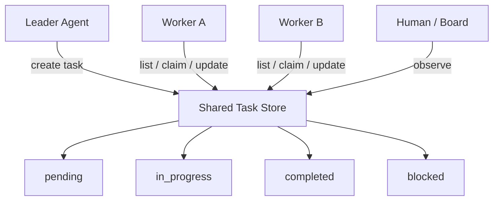
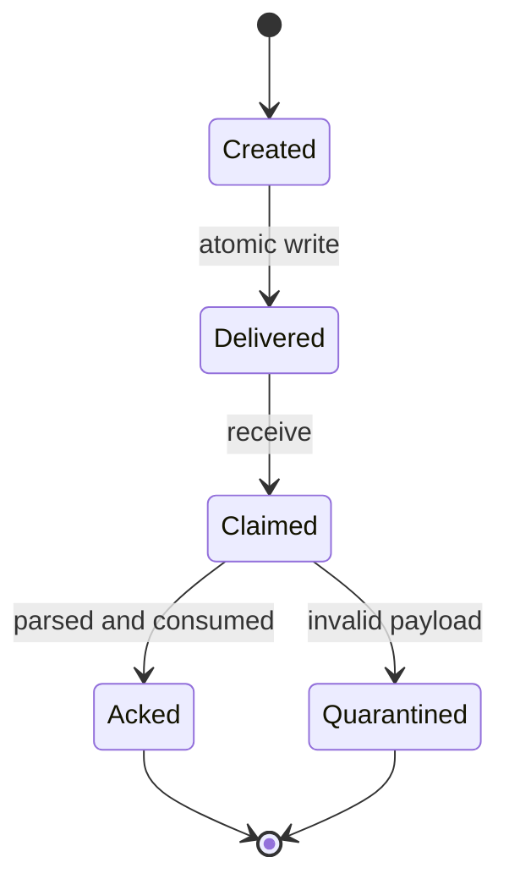
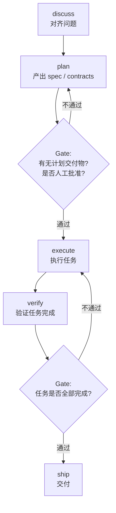
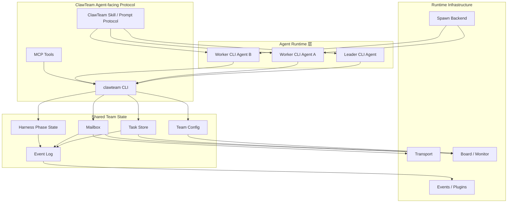

# ClawTeam 通用 Agent 协作设计思想精读

> 项目地址：[HKUDS/ClawTeam](https://github.com/HKUDS/ClawTeam)
>
> 本文关注的是 ClawTeam 作为“通用 Agent 协作层”的设计思想，而不是某些特定工程手段。比如 git worktree、tmux、文件系统、Redis、Web UI 都是实现载体；真正值得学习的是：它如何把多个独立 CLI Agent 组织成一个可协作、可恢复、可观察的团队。

## 一句话判断

ClawTeam 最值得学习的地方，不是它“能启动很多 agent”，而是它给出了一个很不一样的答案：

> 不重写 Agent 大脑，不接管模型推理循环，而是在多个现成 Agent 外面做一层“协作操作系统”：身份、任务、消息、阶段、事件、观察、恢复，都通过 Agent 自己能调用的命令暴露出来。

这和很多多 Agent 框架的区别很大。

很多框架的默认思路是：

```text
人类开发者写 orchestrator 代码
orchestrator 调模型 A
orchestrator 调模型 B
orchestrator 汇总结果
```

ClawTeam 的思路更像：

```text
给 Agent 一个团队协议
Agent 自己通过 CLI 创建队友、分配任务、发消息、看任务板、汇报状态
系统只提供协作原语，不替 Agent 做所有决策
```

这就是它作为“通用 Agent 项目”最值得看的地方。

---

## 设计思想一：把协作能力做成 Agent-facing API，而不是人类-only API

### 公共问题

多 Agent 系统里，一个常见问题是：协作能力只对人类开发者可见，对 Agent 本身不可见。

比如一个框架可能有这样的 Python API：

```python
leader.delegate(worker, task)
team.send_message(...)
workflow.next_step()
```

这些 API 对人类开发者很好用，但对 CLI Agent 来说，它们不可直接使用。Agent 只能生成文本，不能自然地调用这些 Python 对象。于是多 Agent 协作仍然被“人写的 orchestrator”锁住。

这会带来一个结果：

```text
Agent 看起来在协作，
但真正的协作决策仍然是人类或框架代码写死的。
```

### ClawTeam 的答案

ClawTeam 把协作能力暴露成 CLI 命令：

```bash
clawteam spawn ...
clawteam task list ...
clawteam task update ...
clawteam inbox send ...
clawteam inbox receive ...
clawteam board ...
clawteam lifecycle idle ...
```

这意味着这些能力不是只给人类使用，也能被 Agent 直接调用。

它的 README 里强调 “agents spawn swarms, delegate tasks, and deliver results”，源码里的 prompt builder 也会把这些命令直接注入 worker 的任务提示中。

关键源码：

- `clawteam/cli/commands.py`：所有协作能力的 CLI 入口
- `clawteam/spawn/prompt.py`：把任务协议、收件箱协议、工作循环协议注入 agent prompt
- `skills/clawteam/SKILL.md`：作为 skill，把 ClawTeam 的协作命令变成 Agent 可学习、可调用的工具说明

### 这背后的设计模式

这是一种 **Agent-facing API** 模式。

它的核心不是“有没有 API”，而是：

> API 的形态必须适合 Agent 自己使用。

对于 CLI Agent 来说，最自然的接口不是 Python 类，也不是内存对象，而是稳定、可复制、可在 shell 中执行的命令。

所以 ClawTeam 的协作协议天然适合被模型学习：

```text
任务在哪里？    clawteam task list
如何领任务？    clawteam task update ... --status in_progress
如何汇报？      clawteam inbox send ...
如何收消息？    clawteam inbox receive ...
如何进入空闲？  clawteam lifecycle idle ...
```

这很像给 Agent 提供了一组“社会动作”。

单个 Agent 的工具是：

```text
Read / Edit / Bash / Search
```

而团队 Agent 的工具应该是：

```text
Spawn / Assign / Report / Ask / Wait / Shutdown / Observe
```

ClawTeam 的价值就在于它把这些动作命令化了。

### 解决的失败模式

如果没有 Agent-facing API，多 Agent 协作会变成两种不自然的形态：

1. **人类遥控型协作**

   人类不断复制粘贴不同 Agent 的输出，手动转发上下文。

2. **框架脚本型协作**

   orchestrator 写死了谁调用谁，Agent 自己没有真正的组织能力。

ClawTeam 试图让 Agent 自己操作团队基础设施，这样 leader agent 可以真的“组织团队”，而不是只在文本里假装自己是 leader。

### 代价

这个模式也有代价：

- Agent 必须学会命令协议。
- 命令设计必须非常稳定，否则 prompt 中的协议会过期。
- CLI 输出必须足够清晰，Agent 才能正确解析。
- 复杂协作依赖 Agent 自律执行 loop，系统不是完全强制的。

所以 Agent-facing API 的关键不只是“做命令”，还要让命令具备：

```text
可发现性
可读性
幂等性
错误可解释性
状态可查询性
```

### 可复用经验

如果你要设计一个通用 Agent 系统，可以问自己：

> 这个能力是只给人类开发者用，还是 Agent 自己也能用？

如果希望 Agent 能自主协作，就不要只提供内部 SDK。要给它一个稳定的外部行动界面。

---

## 设计思想二：把 Agent 的“意图”和“执行状态”外部化

### 公共问题

单 Agent 可以把任务状态记在上下文里：

```text
我正在做 A
我刚完成 B
接下来要做 C
```

但多 Agent 一旦出现，这种状态放在上下文里就会失效。

原因很简单：

- worker A 的上下文，worker B 看不到。
- leader 的上下文，worker 不一定实时知道。
- 某个 Agent 崩了，它上下文里的任务状态也消失了。
- 人类想观察团队进展，不能去读每个 Agent 的长上下文。

所以多 Agent 系统必须回答一个问题：

> 团队共同认可的状态，到底存在哪里？

如果答案是“存在每个模型的上下文里”，那系统很快会混乱。

### ClawTeam 的答案

ClawTeam 把任务状态外部化成共享 task store。

任务模型里有这些字段：

```text
id
subject
description
status: pending / in_progress / completed / blocked
priority
owner
locked_by
locked_at
blocks
blocked_by
started_at
metadata
```

关键源码：

- `clawteam/team/models.py`：`TaskItem`、`TaskStatus`、`TaskPriority`
- `clawteam/store/file.py`：任务创建、更新、锁、依赖检测、状态持久化
- `clawteam/team/tasks.py`：兼容层，把历史 `TaskStore` 指向 `FileTaskStore`

这意味着任务不再是某个 Agent 的“内心想法”，而是团队共享的外部事实。



### 源码里的关键机制

`FileTaskStore.update()` 不是简单改 JSON。它做了几件很重要的事：

1. **写操作加锁**

   `_write_lock()` 用系统文件锁保护任务更新，避免多个进程同时修改任务文件。

2. **任务领取有 lock**

   当任务进入 `in_progress` 时，会调用 `_acquire_lock()`。如果任务已经被另一个还活着的 agent 锁住，就拒绝重复领取。

3. **完成任务会释放 lock**

   当状态变为 `completed` 或 `pending`，会清空 `locked_by` 和 `locked_at`。

4. **依赖任务会自动 blocked**

   创建任务时如果有 `blocked_by`，状态会变成 `blocked`。

5. **依赖图不能成环**

   `_validate_blocked_by_unlocked()` 会检查 task dependency graph 是否有 cycle。

6. **完成一个任务会尝试解除下游阻塞**

   `task.status == completed` 时会触发 `_resolve_dependents_unlocked(task_id)`。

这说明 ClawTeam 不是把 task board 当展示 UI，而是当作协作协议的中心状态机。

### 这背后的设计模式

这是 **Externalized Agent State** 模式。

核心思想是：

> 凡是需要多个 Agent 共同认可、共同推进、可恢复、可观察的状态，都不应该只存在于模型上下文里。

上下文适合存：

```text
局部推理
临时分析
当前步骤的细节
```

外部状态适合存：

```text
任务归属
任务状态
阻塞关系
执行锁
完成证据
跨 Agent 消息
团队成员列表
```

这和我们之前看 Claude Code 上下文压缩时的思想是相通的：上下文工程不是把所有东西塞给模型，而是把不同生命周期的信息放到不同层。

ClawTeam 的 task store 就是长生命周期团队状态层。

### 解决的失败模式

这个设计主要解决四类失败：

1. **重复劳动**

   两个 worker 同时做同一个任务。

2. **任务丢失**

   leader 分配过任务，但 worker 崩了，任务状态只在上下文里，没人知道还没完成。

3. **依赖错乱**

   B 依赖 A，但 B 先开始做，导致返工。

4. **团队不可观察**

   人类只能问每个 Agent “你做到哪了”，没有统一进度视图。

### 代价

外部化状态会让系统从“对话”变成“应用”。

你需要处理：

- 存储一致性
- 文件锁或数据库事务
- schema 演进
- 并发更新
- 错误恢复
- 状态和模型上下文之间的同步

但这是多 Agent 走向真实工程系统必须付出的代价。

### 可复用经验

做多 Agent 系统时，最先要设计的不是 agent prompt，而是状态边界：

```text
哪些状态只属于单个 Agent？
哪些状态属于整个团队？
哪些状态需要持久化？
哪些状态需要人类观察？
哪些状态需要并发保护？
```

ClawTeam 的答案是：任务板是团队协作的事实源。

---

## 设计思想三：消息不是上下文传递，而是可确认的异步通信

### 公共问题

多 Agent 协作中，最容易被低估的是消息系统。

很多 demo 里的多 Agent 通信是这样的：

```text
Agent A 输出一段话
框架把这段话拼进 Agent B 的 prompt
Agent B 继续生成
```

这在玩具 demo 里可以，但真实协作会遇到问题：

- 如果 B 暂时不在线，消息去哪？
- 如果 B 读消息时崩了，消息算不算已读？
- 如果消息 JSON 坏了，是否会阻塞整个 inbox？
- 如果人类想看历史，已消费消息是否还能追溯？
- 如果多个 worker 同时读同一个 inbox，会不会重复消费？

这些问题不是模型问题，而是通信系统问题。

### ClawTeam 的答案

ClawTeam 把消息做成 mailbox。

每个 agent 有自己的 inbox。发送消息时，消息被序列化成 `TeamMessage`，投递到收件人的 inbox。接收时，系统会 claim message，再 ack 或 quarantine。

关键源码：

- `clawteam/team/mailbox.py`：`MailboxManager.send()`、`receive()`、`peek()`、事件日志
- `clawteam/transport/file.py`：文件传输、claim、ack、quarantine
- `clawteam/team/models.py`：`TeamMessage` 与 `MessageType`

消息类型不是只有普通文本，还包括：

```text
message
join_request
join_approved
join_rejected
plan_approval_request
plan_approved
plan_rejected
shutdown_request
shutdown_approved
shutdown_rejected
idle
broadcast
```

这说明 ClawTeam 把团队沟通看成协议，而不是随意聊天。

### 源码里的关键机制

#### 1. Atomic write

发送消息时不是直接写目标文件，而是：

```text
写 tmp 文件
os.replace(tmp, target)
```

这样接收方不会读到半截 JSON。

#### 2. Claim message

接收消息时，文件会从：

```text
msg-xxx.json
```

改名为：

```text
msg-xxx.consumed
```

然后加文件锁。这样多个进程同时 receive 时，不会都拿到同一条消息。

#### 3. Ack

如果消息成功解析并处理，就调用 `ack()` 删除 consumed 文件。

#### 4. Quarantine

如果消息坏了，不能解析，就放进 dead letter：

```text
dead_letters/{agent}/...
```

并写一份 meta，记录错误原因。

#### 5. Event log

发送消息还会写 event log。inbox 消费是 destructive 的，但 event log 是历史记录，不会被消费掉。

这就是一个很小但完整的消息队列模型。

### 这背后的设计模式

这是 **Durable Agent Messaging** 模式。

它的核心不是“Agent 能不能互相发一句话”，而是消息必须有生命周期：



在多 Agent 系统里，消息一旦有生命周期，就可以处理失败：

```text
没读 -> 还在 inbox
读了但没 ack -> 可以通过 consumed/lock 观察
坏了 -> dead letter
已消费 -> event log 仍可追溯
```

### 解决的失败模式

1. **消息丢失**

   Agent 不在线时，消息仍然在 inbox。

2. **重复消费**

   claim + lock 降低多个进程同时读取同一消息的风险。

3. **坏消息阻塞**

   schema 错误的消息进入 quarantine，不污染正常队列。

4. **历史不可追溯**

   event log 保留通信历史。

### 代价

文件系统 mailbox 的代价是：

- 单机或共享文件系统场景更自然，跨机器要额外 transport。
- 文件锁在不同平台、网络文件系统上的语义可能复杂。
- 消息吞吐不是它的强项。

但作为通用 Agent 协作系统，它的好处也明显：

```text
无需数据库
易调试
可手动查看
可恢复
对 CLI Agent 友好
```

### 可复用经验

多 Agent 通信不能只靠“把 A 的输出拼进 B 的 prompt”。真实系统至少要问：

```text
消息是否持久？
是否有收件人？
是否可确认消费？
是否能处理坏消息？
是否有历史？
是否支持异步？
```

ClawTeam 的 mailbox 设计提供了一个小而完整的答案。

---

## 设计思想四：Prompt 不是一次性指令，而是协议注入层

### 公共问题

很多 Agent 项目把 prompt 当成“告诉模型目标”的地方：

```text
你是一个开发助手，请完成 xxx。
```

但对于多 Agent 来说，目标不够。Agent 还需要知道：

- 我是谁？
- 我属于哪个团队？
- 我的 leader 是谁？
- 我的任务在哪里查？
- 我做完怎么汇报？
- 我空闲时怎么办？
- 我是否要持续等待新任务？
- 我能用什么命令和队友沟通？

如果这些不明确，worker 很容易变成“一次性执行器”：完成启动 prompt 里的任务后就退出，或者做完不知道怎么汇报。

### ClawTeam 的答案

`build_agent_prompt()` 不是只拼任务，而是拼出一个完整的工作协议。

关键源码：

- `clawteam/spawn/prompt.py`

它注入几类信息：

#### 1. Identity

```text
Name
ID
User
Type
Team
Leader
```

#### 2. Workspace

说明当前工作目录、是否隔离、是否直接在 repo 中工作。

这里的重点不是 git，而是让 Agent 明确“我的操作空间在哪里”。

#### 3. Task

用户或 leader 给 worker 的当前任务。

#### 4. Context

通过 `_build_context_block()` 注入跨 Agent 上下文，比如其他人的修改、文件重叠、相关变化。

#### 5. Coordination Protocol

直接告诉 worker：

```text
用什么命令查任务
如何开始任务
如何完成任务
如何给 leader 发消息
如何报告成本
```

#### 6. Worker Loop Protocol

强调不要做完第一个任务就退出，要持续检查：

```text
assigned task
team task list
inbox
idle lifecycle
```

### 这背后的设计模式

这是 **Protocol Prompting** 模式。

普通 prompt 是：

```text
给模型任务
```

Protocol Prompting 是：

```text
给模型角色 + 环境 + 动作集合 + 状态机 + 退出条件
```

它不是希望模型“聪明地猜协作方式”，而是把协作方式明确写成协议。

这和 Claude Code 里的工具协议也有相似性：模型不是自由地“想调用工具”，而是在一个被描述清楚的工具和消息协议中行动。

ClawTeam 把这个原则扩展到了团队层：

```text
单 Agent 工具协议：Read/Edit/Bash 怎么用
多 Agent 协作协议：task/inbox/lifecycle 怎么用
```

### 解决的失败模式

1. **Worker 一次性执行后退出**

   Worker Loop Protocol 明确要求继续检查任务和 inbox。

2. **Worker 完成任务但不汇报**

   Prompt 明确要求 `inbox send` 给 leader。

3. **Worker 不知道任务从哪里来**

   Prompt 明确要求 `task list --owner`。

4. **Worker 忽视团队上下文**

   Prompt 注入 context block，让它知道其他 agent 的相关变化。

### 代价

Protocol Prompting 仍然不是强约束。模型可能忘记、误解或懒得执行。

所以它必须和外部状态配合：

```text
prompt 告诉 Agent 应该怎么做
task store 记录它是否真的做了
mailbox 记录它是否真的发了消息
board 让人类看见它是否卡住
lifecycle 让系统知道它是否 idle
```

也就是说，prompt 是协议分发层，不是唯一控制层。

### 可复用经验

给 worker agent 写 prompt 时，不要只写任务。至少要写清楚：

```text
身份
职责边界
可用协作命令
任务领取方式
状态更新方式
汇报方式
阻塞时怎么办
空闲时怎么办
退出条件
```

这就是从“任务 prompt”升级为“角色运行协议”。

---

## 设计思想五：多 Agent 系统需要阶段门，而不是只靠自由协作

### 公共问题

多 Agent 自由协作很容易变成混乱：

```text
有人还没计划完，别人已经开写
有人实现了，但没人验证
有人说完成了，但没有交付物
有人想进入下一阶段，但依赖任务还没完成
```

这不是模型能力问题，而是流程缺失问题。

单 Agent 可以靠上下文里的 TODO 管自己；多 Agent 团队需要一个外部流程框架。

### ClawTeam 的答案

ClawTeam 有一个 harness phase state machine。

默认阶段：

```text
discuss -> plan -> execute -> verify -> ship
```

关键源码：

- `clawteam/harness/phases.py`
- `clawteam/harness/orchestrator.py`
- `clawteam/harness/contracts.py`
- `clawteam/harness/contract_executor.py`

`PhaseRunner` 负责阶段流转，`PhaseGate` 负责判断能不能进入下一阶段。

内置 gate 包括：

```text
ArtifactRequiredGate
AllTasksCompleteGate
HumanApprovalGate
```

例如：

- plan 阶段要求有 `spec.md`
- verify 阶段要求所有任务完成
- 默认 plan 阶段需要 human approval

### 这背后的设计模式

这是 **Phase-Gated Agent Workflow** 模式。

它的核心是：

> 多 Agent 协作不应该只是“大家一起聊”，而应该有阶段、交付物和进入下一阶段的条件。

可以把它理解为给 Agent 团队加上轻量项目管理：



这个模式的关键不在阶段名字，而在 gate：

```text
不是 leader 觉得可以下一步就下一步
而是系统检查交付物和任务状态
```

### Sprint Contract 的意义

`SprintContract` 是另一个值得注意的设计。

它包含：

```text
title
description
tasks
success_criteria
assigned_to
wave
depends_on
status
```

`ContractExecutor` 会把 contract 转成任务，并按 wave 建立 blocked_by 依赖。

这说明 ClawTeam 想表达的是：

```text
计划不是一段自然语言总结，
计划应该变成可执行任务和可验证标准。
```

这是从“LLM 写计划”到“计划进入执行系统”的关键一步。

### 解决的失败模式

1. **计划没有落地**

   有 spec，但没有 task。

2. **执行没有验证**

   worker 说完成，但没有 success criteria。

3. **阶段混乱**

   plan、execute、verify 混在一起，没有 gate。

4. **并行失控**

   wave 和 dependency 提供了基本的并行约束。

### 代价

阶段门会降低灵活性。

如果任务很小，phase/gate 会显得重。  
如果 gate 设计不好，Agent 可能为了过 gate 生成形式化 artifact，而不是产生真实质量。

所以这个模式适合长任务、多人协作、高成本任务，不适合所有简单请求。

### 可复用经验

当 Agent 任务超过一个人一次性上下文能稳定完成的范围时，就应该考虑阶段门：

```text
计划阶段要产出什么？
谁批准计划？
执行阶段的任务如何拆？
每个任务如何定义完成？
验证阶段检查什么？
什么条件才能 ship？
```

ClawTeam 的 harness 是一个轻量答案。

---

## 设计思想六：可插拔运行时，而不是绑定某个 Agent 框架

### 公共问题

很多多 Agent 框架会把系统绑定到自己的 agent runtime：

```text
必须用这个 Agent 类
必须用这个 memory
必须用这个 tool abstraction
必须用这个 model client
```

这会限制生态复用。现实里，开发者可能已经在用 Claude Code、Codex、Gemini CLI、OpenClaw 或其他命令行 Agent。

问题是：

> 能不能不替换 Agent，只给它们加一层团队协作能力？

### ClawTeam 的答案

ClawTeam 把“启动一个 Agent”的方式抽象成 SpawnBackend。

关键源码：

- `clawteam/spawn/base.py`
- `clawteam/spawn/tmux_backend.py`
- `clawteam/spawn/subprocess_backend.py`
- `clawteam/spawn/adapters.py`
- `clawteam/spawn/profiles.py`

`SpawnBackend.spawn()` 接收的是：

```text
command
agent_name
agent_id
agent_type
team_name
prompt
env
cwd
skip_permissions
system_prompt
is_leader
keepalive
```

这说明 ClawTeam 关心的不是“你内部怎么推理”，而是：

```text
我能不能启动你？
我能不能给你身份？
我能不能给你任务？
我能不能给你环境变量？
我能不能让你接入同一个团队协议？
```

### 这背后的设计模式

这是 **Agent Runtime Adapter** 模式。

它把系统分成两层：

```text
Agent runtime 层：Claude Code / Codex / Gemini / OpenClaw / custom CLI
Coordination layer：team / task / inbox / board / harness
```

ClawTeam 不试图统一所有 Agent 的内部能力，而是统一外部协作协议。

这点非常重要。

很多系统想做“通用 Agent 框架”，结果会陷入一个大坑：

```text
为了统一所有 Agent，必须抽象模型、工具、memory、planner、executor。
抽象越多，越难适配真实 CLI Agent。
```

ClawTeam 走的是另一条路：

```text
不统一大脑，只统一团队行为。
```

### 解决的失败模式

1. **框架锁定**

   用户必须把已有工作流迁移到新框架。

2. **生态割裂**

   Claude Code、Codex、Gemini 等不能在同一团队协议下协作。

3. **抽象过重**

   框架为了统一一切，最终每个 Agent 的原生优势都丢失。

### 代价

这个模式的代价是控制力弱。

因为 ClawTeam 不在 Agent 内部，所以它无法完全保证：

- Agent 一定按协议执行。
- Agent 一定持续检查 inbox。
- Agent 一定正确更新任务。
- Agent 一定不会忽略 leader。

它只能通过 prompt、skill、CLI、board、lifecycle 尽量约束。

所以这是一种偏操作系统式的设计，而不是中央控制式设计。

### 可复用经验

如果你想做跨 Agent 协作，不一定要先重写 Agent runtime。可以先问：

```text
能不能把协作协议放在 Agent 外部？
能不能用 CLI / MCP / 文件 / HTTP 做统一入口？
能不能让不同 Agent 保留自己的内部能力？
```

这就是“统一行为，不统一大脑”。

---

## 设计思想七：事件总线和插件，把协作流程变成可扩展系统

### 公共问题

多 Agent 系统一旦跑起来，会产生很多横切需求：

```text
worker spawn 前做检查
任务完成后发通知
消息发送后记录审计
workspace merge 前做验证
agent idle 时触发再分配
phase transition 时生成报告
```

如果所有逻辑都写死在主流程里，系统会越来越难改。

### ClawTeam 的答案

ClawTeam 定义了一组事件类型：

```text
BeforeWorkerSpawn
AfterWorkerSpawn
WorkerExit
WorkerCrash
BeforeTaskCreate
AfterTaskUpdate
TaskCompleted
BeforeInboxSend
AfterInboxReceive
BeforeWorkspaceMerge
AfterWorkspaceCleanup
AgentIdle
HeartbeatTimeout
PhaseTransition
```

关键源码：

- `clawteam/events/types.py`
- `clawteam/events/bus.py`
- `clawteam/plugins/base.py`
- `clawteam/plugins/manager.py`

插件可以订阅事件，也可以贡献 phase gates 和 prompt text。

这说明 ClawTeam 不是只想做固定流程，而是把团队协作流程做成可扩展事件系统。

### 这背后的设计模式

这是 **Evented Agent Harness** 模式。

多 Agent 系统不是一条线性链路，而是一堆生命周期事件：

```text
创建团队
启动 agent
创建任务
更新任务
发送消息
接收消息
进入 idle
崩溃
恢复
推进阶段
合并成果
关闭团队
```

事件总线的意义是把这些生命周期点暴露出来，让外部扩展可以挂钩。

### 解决的失败模式

1. **主流程膨胀**

   所有特殊逻辑都塞进 orchestrator。

2. **难以插入领域规则**

   比如研究任务、软件工程任务、投资分析任务需要不同 gate。

3. **缺乏审计与监控**

   没有统一事件点，很难做统计、告警、可视化。

### 代价

事件系统也会带来复杂性：

- 异步事件失败怎么处理？
- 插件副作用是否会影响主流程？
- veto 机制是否会让流程难以理解？
- 事件顺序是否稳定？

所以事件系统必须克制。ClawTeam 目前更像轻量扩展点，而不是强事务事件流。

### 可复用经验

只要你的 Agent 系统出现这些需求，就应该考虑事件化：

```text
我想在某个生命周期点插入逻辑
我想不同项目有不同流程规则
我想对任务和消息做审计
我想让看板实时更新
我想让插件扩展系统行为
```

事件不是为了炫技，而是为了让协作系统可演进。

---

## 总体架构图：ClawTeam 更像 Agent Team OS



这个图里最重要的不是组件数量，而是分层：

```text
Agent Runtime 层：具体 Agent 自己思考和执行
协议层：Agent 如何调用团队能力
状态层：团队事实在哪里
运行层：如何启动、传输、观察、扩展
```

ClawTeam 的通用价值就在这四层。

---

## 它和 Claude Code / DeerFlow 的学习位置不同

如果把我们之前看的项目放在一起：

### Claude Code

核心问题是：

> 一个长时程 coding agent 如何可靠地使用工具、管理上下文、处理权限、恢复错误？

它的重点是单 Agent runtime 的深水区。

### DeerFlow

核心问题是：

> 一个研究型 workflow agent 如何组织 plan、research、report 等流程？

它的重点是工作流图和研究任务编排。

### ClawTeam

核心问题是：

> 多个已有 CLI Agent 如何通过外部协议形成一个可协作团队？

它的重点不是单个 Agent 的大脑，而是团队协作基础设施。

所以学习 ClawTeam 时，不要盯着某个后端是不是 tmux、某个 workspace 是不是 git。那些只是替换得掉的执行载体。

真正要学的是：

```text
Agent-facing API
Externalized state
Durable messaging
Protocol prompting
Phase-gated workflow
Runtime adapter
Evented harness
```

---

## 最值得带走的设计答案

**Agent 公共问题**：

当任务复杂到一个 Agent 不稳定、一个上下文不够、一个执行线程太慢时，如何让多个现成 Agent 协作，而不是重新发明一个封闭的多 Agent 框架？

**ClawTeam 的答案**：

> 把“团队协作”做成 Agent 自己能调用的一组外部协议：任务板承载共同意图，邮箱承载异步消息，prompt 注入角色和循环协议，spawn backend 适配不同 CLI Agent，harness 阶段门约束流程，事件系统提供扩展点。系统不统一 Agent 的大脑，只统一 Agent 的团队行为。

这句话是我认为学习 ClawTeam 最重要的地方：

> **通用多 Agent 系统的关键，不一定是更聪明的中心调度器，而是让每个 Agent 都能看见并操作同一套外部协作现实。**

这个“外部协作现实”包括：

```text
我是谁
我属于哪个团队
我负责什么任务
任务是否被锁定
谁在等我
我应该向谁汇报
我收到什么消息
我是否可以进入下一阶段
人类如何观察团队状态
系统如何在失败后恢复
```

只要这些东西还停留在 prompt 或聊天历史里，多 Agent 就很容易变成表演。  
一旦这些东西变成可查询、可更新、可持久化、可观察的外部协议，多 Agent 才开始接近工程系统。

---

## 源码阅读建议

如果后续继续读 ClawTeam，我建议按这个顺序：

1. `clawteam/spawn/prompt.py`  
   先看它如何把 agent 变成 team member。

2. `clawteam/team/models.py`  
   看团队、消息、任务这些“协作事实”的 schema。

3. `clawteam/store/file.py`  
   看任务状态机、锁、依赖、完成流转。

4. `clawteam/team/mailbox.py` 与 `clawteam/transport/file.py`  
   看消息的 send / receive / claim / ack / quarantine。

5. `clawteam/harness/phases.py` 与 `clawteam/harness/orchestrator.py`  
   看阶段门如何约束团队流程。

6. `clawteam/spawn/base.py`、`tmux_backend.py`、`subprocess_backend.py`  
   看它如何适配不同 CLI Agent，但不需要把注意力放在具体后端细节上。

7. `clawteam/events/types.py`、`plugins/base.py`  
   看生命周期事件和插件扩展。

这条路线能避开具体实现细枝末节，直接抓住 ClawTeam 对“通用 Agent 团队”这个问题的设计答案。
