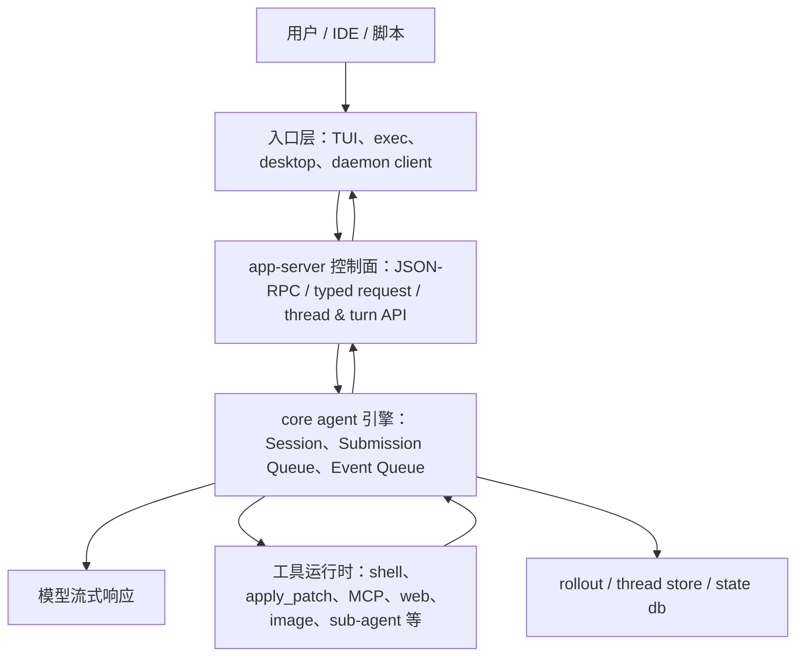
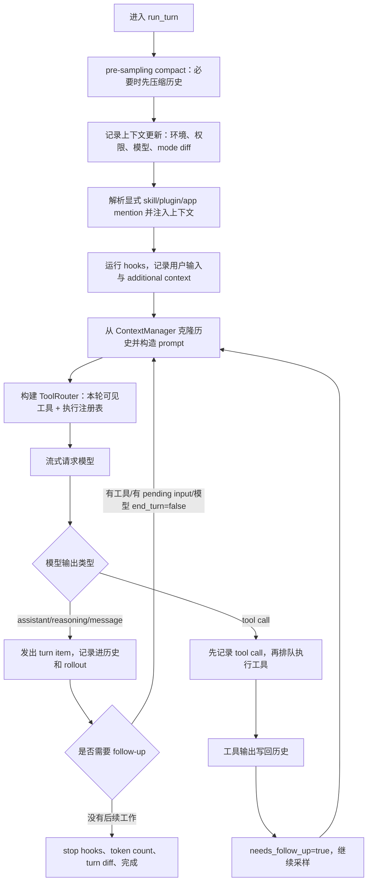
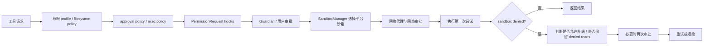
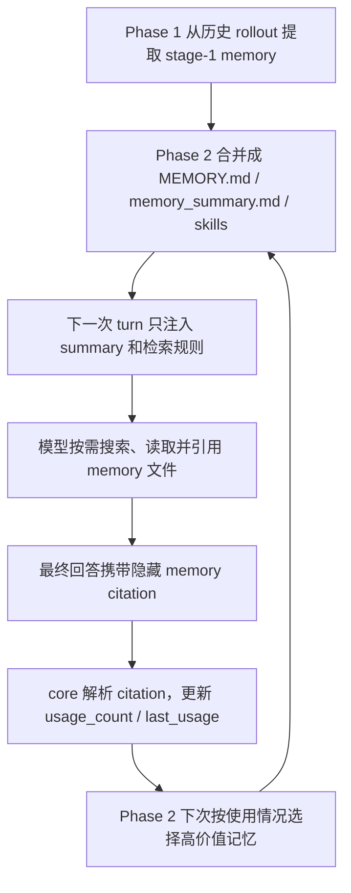

# Codex 项目执行链路与设计思想深度讲解

这篇文档不是包结构说明，也不是“某某 crate 负责什么”的清单。阅读这个项目最有效的方式，是把它当成一个长生命周期的 agent runtime 来看：用户输入不是直接交给模型，而是先进入一个线程控制面，再进入核心 agent 引擎，被转化成一次 turn；模型在 turn 里不断采样、产生工具调用、执行工具、把工具结果写回历史，再继续采样，直到没有后续工作。

一句话概括：Codex 的核心设计是“一个线程/回合协议，承载多个前端入口；一个队列化 agent 引擎，承载模型、工具、安全、上下文和持久化的闭环”。

## 1. 先建立总体心智模型

Codex 看起来像一个命令行工具，但它真正的主体不是 CLI，而是一套 agent 会话系统。CLI、TUI、`exec`、桌面/IDE 入口都不是各自实现 agent loop，而是尽量收敛到同一个 app-server 协议，再由 app-server 驱动 core 里的线程和 turn。

可以把系统理解成三层：



这个图里最重要的不是组件名字，而是边界：

- 入口层负责用户体验：终端 UI、非交互输出、JSONL 输出、远程连接、快捷命令。
- app-server 负责控制面：连接、初始化、能力协商、API 参数校验、线程生命周期、监听 core 事件并翻译成前端通知。
- core 负责 agent 引擎：模型请求、上下文构造、工具暴露与执行、审批/沙箱、历史与持久化。

这三个边界让项目避免了一个常见问题：每个产品形态都复制一份 agent 执行逻辑。Codex 选择的是“执行语义只有一套，入口可以很多个”。

## 2. 从 `codex` 命令到一次回答的完整执行链路

### 2.1 CLI 入口只做分发，不拥有 agent 逻辑

用户运行 `codex` 时，最外层 CLI 会解析参数和子命令。没有子命令时进入交互式 TUI；`codex exec` 进入非交互执行；`codex review` 本质上也会走 `exec` 的非交互路径，只是初始操作换成 review。

这里的设计思想是：CLI 入口只负责“选择产品形态”，而不是“决定 agent 怎么跑”。一旦进入 TUI 或 exec，它们都会继续走 app-server 协议：

- TUI 会启动或连接 app-server，然后通过 `AppServerSession` 发起 typed JSON-RPC 请求。
- `exec` 会启动 in-process app-server client，然后发送 `thread/start`、`turn/start`，之后消费 app-server 通知流直到 turn 完成。

这意味着 `exec` 并不是一套“简化 agent”。它的无交互、stdout 纯净、JSONL 输出等，只是消费事件的方式不同；agent 的核心执行仍然来自同一个 core。

### 2.2 TUI 和 exec 都先进入 app-server 控制面

TUI 有三种 app-server 目标：

- embedded：当前进程内启动 app-server。
- local daemon：连接本机 daemon。
- remote：连接远程 app-server。

`exec` 则主要使用 in-process app-server。in-process 不是绕过协议，而是把 socket/stdio 传输替换为有界内存 channel，同时仍然保留 app-server 的请求/响应语义。这个点很巧妙：本地 CLI 不必承担进程边界成本，但也不会产生第二套行为契约。

in-process 设计里还有一个很工程化的细节：请求提交有背压，事件 fanout 在饱和时可以报告 lagged，但 server request 不能静默丢弃。因为审批、登录刷新、表单 elicitation 这类 server request 如果丢了，turn 会挂住。这里把“可以丢的通知”和“必须回答的控制请求”区分开，是一个成熟 runtime 的表现。

### 2.3 `thread/start`：创建长生命周期执行容器

当 TUI 或 exec 准备开始一次会话时，会先发送 `thread/start`。app-server 收到请求后，大致会做这些事：

1. 检查请求参数，例如 sandbox 和 permissions 不能同时混用。
2. 解析 cwd、workspace roots、模型、审批策略、权限 profile、personality、multi-agent mode、dynamic tools 等配置覆盖。
3. 加载最终线程配置。这里不是简单合并配置，而是通过配置管理器重新解析一遍，让 CLI 覆盖、用户配置、项目配置、云配置和线程级覆盖在一个地方收敛。
4. 创建 core 线程：app-server 调用 `ThreadManager`，`ThreadManager` 再调用 `Codex::spawn`。
5. `Codex::spawn` 创建 core session，建立 Submission Queue 和 Event Queue，启动后台 `submission_loop`。
6. core 初始化完成后，第一条事件必须是 `SessionConfigured`。`ThreadManager` 会显式校验这一点，然后把 `Codex` 包成 `CodexThread` 存入内存线程表。
7. app-server 自动给这个线程挂上 listener，然后返回 `ThreadStartResponse`，并广播 `ThreadStarted` notification。

这条链路里，`thread` 的含义不是“一次用户提问”，而是一个可恢复、可 fork、可持续持有配置和历史的执行容器。它包含：

- 会话配置快照。
- 模型和 provider 信息。
- 当前权限和沙箱策略。
- 历史上下文。
- rollout 持久化 writer。
- event stream。
- 运行中的 turn 状态。

线程被设计成长生命周期对象，是为了支持 Codex 最核心的产品特性：会话恢复、fork、rollback、sub-agent、长上下文压缩、后台监听、跨 UI 复用。

### 2.4 `turn/start`：把用户输入转成 core 的 `Op::UserInput`

线程创建后，用户的每次输入会走 `turn/start`。app-server 在这里不是简单转发，而是做了一层非常重要的控制面校验：

1. 根据 thread id 找到内存里的 `CodexThread`。
2. 检查该线程是否允许直接输入。例如 multi-agent v2 的某些 sub-agent 不允许 app-server 直接塞用户输入。
3. 校验输入大小，防止 v2 input 无上限进入 core。
4. 把 app-server v2 的 `UserInput` 映射成 core 的 input item。
5. 解析 additional context，把不同来源标记成 application 或 untrusted。
6. 构建 turn 级别的线程设置覆盖，例如 cwd、workspace roots、approval policy、permissions、model、effort、summary、collaboration mode 等。
7. 生成 `Op::UserInput`，提交给 `CodexThread`。
8. 立即返回一个状态为 `InProgress` 的 turn 对象。

注意这里有一个关键切分：app-server 负责“请求是否合法、如何转成 core 命令”；core 负责“命令如何被执行”。这让 app-server 可以保持 API 边界稳定，同时 core 可以演化 agent 内部机制。

### 2.5 core 的基本通信模型：Submission Queue / Event Queue

core 里最核心的通信抽象是 SQ/EQ：

- Submission Queue：外部向 agent 提交 `Op`，例如用户输入、审批结果、中断、compact、review、shell command、动态工具响应等。
- Event Queue：agent 向外部发出 `EventMsg`，例如 turn started/completed、assistant message、reasoning、tool call、approval request、exec output、token count、diff、raw response item 等。

这是一种很漂亮的“命令与事件”结构：

```mermaid
sequenceDiagram
    participant Client as TUI / exec
    participant AS as app-server
    participant CT as CodexThread
    participant SQ as Submission Queue
    participant Loop as submission_loop
    participant EQ as Event Queue

    Client->>AS: turn/start
    AS->>CT: submit Op::UserInput
    CT->>SQ: enqueue Submission
    AS-->>Client: TurnStartResponse(InProgress)
    Loop->>SQ: recv Submission
    Loop->>Loop: apply settings / create turn context / spawn RegularTask
    Loop->>EQ: EventMsg::TurnStarted
    Loop->>EQ: streaming items / tool events / token counts
    Loop->>EQ: EventMsg::TurnComplete
    AS->>EQ: listener consumes events
    AS-->>Client: typed notifications
```

这个设计有几个好处：

第一，输入和输出天然解耦。用户可以在模型运行时继续输入；审批、工具响应、中断也都只是新的 `Op`，不会破坏主循环结构。

第二，所有事件都带 submission id 或 turn id，可以被前端关联到正确的 turn。

第三，core 不关心 TUI、exec、IDE 怎么显示事件。它只产出协议事件，app-server listener 再把它们投影成客户端通知。

第四，队列天然形成异步边界。模型采样、工具执行、审批等待、客户端断开，都不会把整个进程变成一条阻塞调用栈。

## 3. 一个 turn 在 core 内部如何真正跑起来

### 3.1 `submission_loop`：把 `Op` 分派到具体处理器

`Codex::spawn` 启动 session 后，会创建一个后台 `submission_loop`。这个 loop 从 Submission Queue 里取出 `Op`，然后按类型分派。

对普通用户输入来说，关键分支是 `Op::UserInput`：

1. 如果 turn-start 带了线程设置覆盖，先转成 `SessionSettingsUpdate` 并应用到 session。
2. 创建新的 turn context。这个 context 固化了本轮执行需要的模型、cwd、权限、沙箱、multi-agent、collaboration mode、token window 等信息。
3. 尝试 `steer_input`。如果当前已有 active turn，输入会进入 pending input 队列，而不是强行启动第二个 turn。
4. 如果没有 active turn，才会把用户输入和 additional context 组装成 `TurnInput`，然后启动 `RegularTask`。

这个逻辑很重要：Codex 并不把“用户发来一段文字”机械等同于“必须新开一个 agent 任务”。如果 agent 正在工作，新的输入可以成为同一 active turn 的 steer/pending input；如果 agent 空闲，它才成为新 turn 的起点。这使得交互式体验更自然，也避免并发 turn 把同一个历史和工作区状态搅乱。

### 3.2 `RegularTask`：一个 turn 可能包含多次模型采样

`RegularTask` 是普通 agent turn 的执行任务。它先发出 `TurnStarted`，再尝试消费启动阶段预热好的 model session，然后进入 `run_turn`。

`RegularTask` 里有一个看起来简单但很关键的 loop：

- 调用一次 `run_turn`。
- 检查 input queue 是否还有 pending input。
- 如果还有，就用空输入再跑一轮 `run_turn`，让同一个 turn 继续处理后续输入。

这解释了 Codex 为什么可以在一次看似连续的交互里既处理模型工具调用，又处理用户插话。它不是靠外部 UI 拼接，而是在 core turn 层面把 pending work 合并进同一个执行生命周期。

### 3.3 `run_turn`：模型、工具、上下文、压缩的核心闭环

`run_turn` 是整个项目最值得细读的函数之一。它的主线如下：



这里最值得注意的是：Codex 的模型循环不是“发一次 prompt，拿一次答案”。它更像 ReAct/Responses API 风格的执行机：

1. 模型看到历史和工具 spec。
2. 模型可以输出 assistant message，也可以输出工具调用。
3. 工具调用被立即持久化进历史，保证即使后续取消，历史仍然可重建。
4. 工具异步执行，输出再作为 response item 追加回历史。
5. 因为有新的工具输出，模型需要 follow-up，于是再次采样。
6. 当没有工具、没有 pending input、模型也没有要求继续时，turn 才完成。

这套循环把“模型推理”和“外部世界动作”绑定成一个事务式链路。它没有把工具当作 UI 层临时副作用，而是把工具调用和工具结果都变成可持久化、可恢复、可重新构造 prompt 的历史项。

### 3.4 为什么 compaction 在执行循环内部

很多项目把上下文压缩做成外部按钮或前置步骤。Codex 的 compaction 更深地嵌入执行循环：

- turn 开始前会做 pre-sampling compact，避免刚进模型就撞上下文限制。
- 模型采样后会计算 token 状态；如果需要 follow-up 但上下文达到限制，会 mid-turn auto compact。
- 新 context window 也可以在 turn 中被请求并启动。

这很关键。因为真正长任务的上下文压力经常出现在“工具输出之后、还需要继续采样之前”。如果只在用户发消息前压缩，模型工具循环中途仍然会爆窗。Codex 把 compaction 放在循环内部，等于承认 agent 执行本身是长链路，不是一次性问答。

## 4. app-server listener：把 core 事件投影成产品可消费的通知

core 只产出 `EventMsg`，不直接服务 TUI 或 exec。app-server 在线程启动、恢复、fork 时会确保 conversation listener 已经挂上。listener 做几件事：

1. 从 `CodexThread.next_event()` 读取 core 事件。
2. 更新 app-server 的 thread state，例如 active turn、turn item、thread status。
3. 根据客户端是否订阅 raw events，决定是否透传 raw response item。
4. 把 core 事件翻译成 app-server v2 notification。
5. 对 resume 中的 running thread 做补齐，让新连接的客户端能拿到当前状态。
6. 当线程长时间没有订阅者且不活跃时，延迟卸载线程，释放内存。

这层 listener 是一个非常好的“投影层”设计。core 事件是执行事实，app-server state 是给产品 API 使用的视图。两者不混在一起，所以 TUI 可以看流式事件，exec 可以等最终事件，远程客户端可以断线重连，app-server 也可以为 resume/read/list 构造不同粒度的视图。

## 5. 工具系统的巧妙处：模型可见 spec 与执行注册表分离

Codex 工具系统最值得称道的设计，是 `ToolRouter` 同时持有两份东西：

- `model_visible_specs`：本轮要暴露给模型看的工具说明。
- `ToolRegistry`：host 侧真正能 dispatch 的工具运行时。

这两者不是一回事。某个工具可以注册在 registry 中但不暴露给模型；也可以通过 code mode 包装后改变对模型的呈现；也可以是 hosted model tool，只作为 spec 暴露，而不走本地 dispatch。

这种分离带来很大弹性：

- **Hidden tool**：模型不可见，但 host 可以保留兼容执行能力。
- **Deferred tool**：不直接塞满模型上下文，通过 tool search 或 namespace 延迟发现。
- **DirectModelOnly**：只给模型直接调用，但不进入普通 code-mode 嵌套工具列表。
- **Hosted spec**：比如 provider 原生支持的 web/image 工具，不一定需要本地 executor。
- **Code mode wrapper**：模型看到的是更适合编码代理的高阶工具，内部仍可调用底层工具。

工具规划的链路大致是：

1. 根据 turn context 判断模型能力、feature flags、tool mode、multi-agent version、MCP、plugins、apps、dynamic tools。
2. 收集一批 planned runtimes 和 hosted specs。
3. 按 exposure 决定哪些 spec 对模型可见。
4. 合并 namespace，排序 namespace 内工具，补默认 namespace 描述。
5. 同时构造 dispatch registry。

这里优秀的地方在于：工具不是“全局开关”。工具集合是 turn-scoped 的，取决于当前模型、当前权限、当前环境、当前 mode、当前插件和 app 可用性。这样既能减少模型上下文噪声，也能避免把不该出现的能力暴露给模型。

## 6. 工具执行链路：从模型 tool call 到再次采样

当模型流里出现 tool call，Codex 不会立刻“黑箱执行”。它的链路是：

1. `ToolRouter::build_tool_call` 从 `ResponseItem` 中解析出统一的 `ToolCall`。
2. 先把模型发出的 tool call 记录到历史和 rollout。
3. 把工具执行封装成 future，放入 in-flight 队列。
4. `ToolCallRuntime` 根据该工具是否支持并行，决定拿读锁还是写锁：
   - 支持并行的工具可以同时跑。
   - 不支持并行的工具独占执行。
5. `ToolRegistry` 找到对应 runtime，运行 pre-tool hooks。
6. 工具 handler 执行，可能涉及审批、沙箱、网络代理、文件系统、MCP、sub-agent 等。
7. 执行完成后运行 post-tool hooks，必要时把 hook feedback 替换成模型可见输出。
8. 工具输出转为 `ResponseInputItem`，写回历史。
9. `needs_follow_up=true`，模型看到工具输出后继续采样。

这条链路的一个细节很漂亮：工具调用先持久化，工具结果后持久化。也就是说，历史里能看到模型“请求了什么”和 host“返回了什么”。这对恢复、调试、审计、UI 展示都非常重要。

另一个细节是 cancellation。工具 runtime 不只是简单 abort future。有些工具支持“等待运行时清理”，例如需要杀进程、收尾 PTY、释放资源。`ToolCallRuntime` 区分了立即 abort 和等待 cleanup 的工具，并在取消时返回模型可见的 aborted response。这说明它把工具当成真实外部资源，而不是纯函数调用。

## 7. 安全不是一个判断，而是一条流水线

Codex 的安全链路不是某个 `if approval == never` 就结束，而是一组叠加的控制点：



这个设计有几个很成熟的点：

### 7.1 审批缓存按 key，而不是按工具粗粒度缓存

审批缓存的 key 由工具自己提供。大多数 shell 请求只有一个 key，但 apply_patch 可能涉及多个文件。Codex 的缓存语义是：如果所有 key 都已批准，本次才跳过审批；如果用户选择本 session 允许，则逐 key 缓存。这样既能减少重复打扰，又不会因为批准一次大 patch 就无意放开所有未来 patch。

### 7.2 沙箱失败后的升级是受控的

工具可以先在沙箱中执行。如果沙箱拒绝，并且 policy 允许，系统才会考虑请求“无沙箱/更高权限”重试。这个重试不是无条件发生：

- `Never` 或某些 policy 下不会升级。
- 如果存在 denied-read 限制，不能简单绕过沙箱，因为绕过会让原本被禁止读取的路径暴露出来。
- 如果是网络策略拒绝，需要构造 network approval context，而不是把它伪装成普通文件系统拒绝。
- strict auto-review 下，即使第一次审批通过，重试也可能需要新的 Guardian review。

这体现了一个很好的安全思路：升级不是“失败就 sudo”，而是围绕权限语义重新评估。

### 7.3 hooks、Guardian、用户审批是分层的

PermissionRequest hooks 可以先根据本地策略直接 allow/deny；如果没有 hook 决策，再走 Guardian 或用户审批。Guardian 的 review id 和 tool call id 分开，避免把“工具调用”与“审批生命周期”混为一个 id。这种 id 分离让后续 denial override、通知和审计都更清楚。

## 8. 上下文系统：不是字符串拼接，而是有边界的增量状态

Codex 的上下文注入不是随手拼 prompt。它把很多上下文都建模成 `ContextualUserFragment`：

- 每个 fragment 有 role。
- 有 start/end marker。
- 能 render 成 message。
- 能被后续识别为“这是系统注入的上下文”，而不是用户自然语言。

这带来一个非常重要的能力：历史可以被识别、过滤、diff、重建。

### 8.1 初始上下文延迟到第一轮真实 turn

新线程启动时，Codex 不急着把所有环境上下文写进历史。它会等到第一轮真实 turn 开始，再根据 turn-start overrides 生成上下文。

这个设计很细：如果用户在 `turn/start` 里覆盖了 cwd、权限、模型、effort、collaboration mode，那么初始上下文应该反映覆盖后的真实状态。如果在线程创建时就写死上下文，后续 turn-start 覆盖会导致模型看到过期环境。

### 8.2 reference context item 让后续只注入 diff

每个真实 turn 会持久化一个 `TurnContextItem` 作为上下文基线。下一轮 turn 开始时，系统会比较当前 turn context 和上一个 reference：

- 如果没有基线，注入完整初始上下文。
- 如果有基线，只注入设置变化，例如权限变化、环境变化、model switch、realtime 状态变化、collaboration mode 变化等。
- 即使没有模型可见 diff，也会持久化新的 `TurnContextItem`，让 resume/replay 能恢复最新基线。

这个设计避免了两个极端：

- 每轮都重复塞完整环境，浪费上下文窗口。
- 完全不塞环境变化，导致模型不知道权限/cwd/model 已变。

它选择的是“结构化基线 + 增量 diff”。

### 8.3 历史是 append/reconstruct，而不是随意重写

Codex 的历史管理有两个层面：

- 内存里的 `ContextManager`：维护 prompt history，可做规范化、图片处理、token 估算、截断。
- 持久化的 rollout/thread store：记录事件、response item、turn context、compaction 等可重放材料。

当 assistant message、tool call、tool output、token count、turn event 出现时，它们会被写入 rollout。恢复或 fork 时，系统从 rollout 重建内存历史，而不是依赖某个不可解释的最终 snapshot。

compaction 也不是偷偷改掉过去，而是记录一个 compacted item，其中包含 replacement history 和窗口信息。这样历史演化仍然可追踪：不是“过去消失了”，而是“在这个点发生了一次压缩，之后使用新的上下文窗口”。

## 9. 记忆系统：把历史经验变成可检索、可引用、可更新的长期上下文

Codex 的记忆系统不要理解成“把聊天记录塞回 prompt”。它实际做了一个更有工程味的分层：

- 短期上下文由 `ContextManager` 和 rollout history 管，目标是让当前 thread 能继续运行、能恢复、能压缩。
- 长期记忆由 memory pipeline 管，目标是从过去很多 thread 里提炼出未来 agent 真会用到的经验。
- 读路径只把最小的导航信息注入模型；写路径异步运行，不阻塞当前回答。

也就是说，Codex 没有把“历史”直接等同于“记忆”。历史是事实日志，记忆是从事实日志里萃取出的、带检索结构和证据引用的长期知识。

### 9.1 读路径：不是自动全量加载，而是“摘要导航 + 按需打开”

当一个新 thread 或新 turn 准备构造 prompt 时，memory extension 会参与上下文贡献。它先检查三层开关：

1. feature flag 里是否启用了 memories。
2. 配置里 `use_memories` 是否允许使用记忆。
3. `~/.codex/memories/memory_summary.md` 是否存在且非空。

只有这些条件成立时，它才会把一段 developer instructions 注入模型。注意这段 instructions 不是把整个记忆库塞进去，而是包含两类东西：

- 一份被 token 上限截断过的 `memory_summary.md`。
- 一套“什么时候查记忆、怎么查、查到以后如何引用”的操作规则。

这是一个很聪明的 prompt 设计。`memory_summary.md` 被定位成导航索引，而不是知识正文。它告诉模型：哪些项目、用户偏好、工作流、失败模式可能值得查；真正的细节在 `MEMORY.md`、`skills/*`、`rollout_summaries/*` 里，需要时再读。

这样做同时解决三个问题：

第一，长期记忆不会无限膨胀到每轮 prompt 里。模型默认只看到一个稠密摘要，避免长期记忆把当前任务上下文挤掉。

第二，模型不会因为“有记忆系统”就机械查询。read-path prompt 明确规定：简单翻译、当前时间、单行命令、纯自包含任务可以跳过；非平凡、相关、模糊、依赖历史选择的任务才默认查。

第三，记忆检索有预算意识。prompt 要求先扫 summary，再搜 `MEMORY.md`，只有命中明确时才打开 1-2 个 rollout summary 或 skill，并把快速检索控制在少量搜索步骤里。这相当于把“记忆使用”做成一个 bounded retrieval protocol，而不是让模型在旧日志里漫游。

### 9.2 dedicated memory tools：把长期记忆做成受限文件系统，而不是普通 shell

Codex 还预留了一组专用 memory tools：list、read、search、add_ad_hoc_note。但这些工具默认还要受 `dedicated_tools` 配置门控，不是任何时候都暴露。

这里的设计重点不是工具名字，而是安全边界：

- 路径解析必须留在 memories root 内，拒绝 `..`、绝对路径、平台 prefix。
- 隐藏文件和隐藏目录不会被列出或搜索。
- symlink 会被拒绝，避免记忆工具被绕到任意文件。
- read 有行号和 token 上限。
- list/search 有分页和结果上限。
- search 支持 any、same-line、window 内全命中，还能带上下文行，但结果仍被硬性截断。
- ad-hoc note 只能写入固定的 `extensions/ad_hoc/notes/`，文件名必须是时间戳加 slug，并且用 create-new 防止覆盖。

这说明 Codex 没有把“记忆库是本地 markdown 文件”当成可以随便 shell 读写的借口。它把记忆访问做成一个窄接口：足够让模型检索、引用、请求新增记忆，但不让模型获得无边界的文件系统能力。

更妙的是，read path 和 storage backend 之间还有 trait 边界。今天的 backend 是本地文件系统，未来也可以换成远程或数据库实现；工具层只依赖“list/read/search/add note”这组语义。长期看，这比把 `~/.codex/memories` 的目录结构写死在每个调用点里稳得多。

### 9.3 写路径：当前 turn 不写记忆，而是在后台从旧 rollout 萃取

记忆生成不是在用户每说一句话后立刻改 `MEMORY.md`。真正的写路径发生在 root session 有真实输入之后，app-server 会启动一个后台 startup task。它会先做资格检查：

- ephemeral session 不生成记忆。
- memory feature 没开不生成。
- sub-agent session 不生成，避免子代理递归污染长期记忆。
- state DB 不可用则跳过。
- 如果配置要求保留 rate limit，且剩余额度不足，也跳过。

然后才进入两阶段 pipeline：Phase 1 做单个 rollout 的提取，Phase 2 做全局合并。

这个触发点很重要。它不是在“当前回答完成”时同步写记忆，所以不会拖慢用户看到结果；也不是完全离线批处理，所以每次新的 root session 都有机会顺手推进记忆更新。Codex 选择的是“启动时后台清账”：把记忆维护从主执行链路旁路出去，但仍然借助用户正常使用频率持续演化。

### 9.4 Phase 1：从 rollout 里提取 raw memory，而不是直接改最终记忆

Phase 1 面向的是单个历史 thread。它先从 state DB 找候选 rollout，条件非常克制：

- 只看允许的交互式 session source。
- 排除当前 thread，避免一边对话一边总结自己。
- 只看 memory_mode 为 enabled 的 thread。
- thread 要足够新，但也要 idle 足够久，避免总结还在活跃变化的会话。
- 每次扫描、每次 claim 都有上限。
- 每个 job 有 lease、ownership token、retry backoff，防止多个后台 worker 重复处理同一条 rollout。

拿到候选后，Phase 1 会加载 rollout，但不会原样塞给模型。它会过滤掉不适合成为记忆输入的内容：

- session meta、event stream、turn context、compaction 这类执行元数据不进入提取 prompt。
- developer message 不进入。
- AGENTS.md instructions 和 skill 注入这类上下文片段会被排除，避免把“本轮给模型的指令”误当成“用户长期偏好”。
- response item 还会过一层 memory persistence 判断，只保留值得进入记忆提取的交互内容。
- 序列化后再做 secret redaction。

随后 Codex 用专门的 memory extraction model 调一次结构化输出，要求返回：

- `raw_memory`：该 rollout 的详细可复用经验。
- `rollout_summary`：用于路由和索引的短摘要。
- `rollout_slug`：用于生成可读的 summary 文件名。

这里很值得学：Phase 1 不直接写最终 `MEMORY.md`，而是写 DB 里的 stage-1 output。它承认“从一个会话里抽出的东西”还只是原材料，不应该马上污染全局长期记忆。先把单条 rollout 归一化，再交给 Phase 2 统一决策，这使得系统能并行处理很多历史会话，也能在后续全局合并时做排序、遗忘、去重和冲突处理。

### 9.5 Phase 2：用 git workspace diff 驱动“增量合并”和“遗忘”

Phase 2 是记忆系统最巧妙的一段。它不是简单把所有 raw memory 拼成一个大文件，而是先抢一个全局 phase-2 lock，确保同一时间只有一个 consolidation worker 能修改 memories root。

接着它从 DB 里选择本次全局合并的输入。选择策略不是纯时间排序，而是带使用反馈：

- 被最近引用过的记忆会根据 `usage_count` 和 `last_usage` 排得更靠前。
- 没被引用过的新记忆也不会立刻被淘汰，会用 `source_updated_at` 兜底。
- 超过 `max_unused_days` 的旧记忆会变得不 eligible。
- 最终输入集有 `max_raw_memories_for_consolidation` 上限。

这让记忆库有一个简单但有效的“生命力”机制：被用到的经验继续参与 consolidation，不再被用到的经验逐渐退出候选。

然后 Phase 2 把选择出来的 stage-1 outputs 同步到 `~/.codex/memories`：

- 生成 `raw_memories.md`，按稳定 thread id 顺序合并，避免因为使用排名变化造成无意义 diff。
- 生成或刷新 `rollout_summaries/*.md`。
- 删除本次不再选择的 rollout summary。

关键点来了：memories root 本身被维护成一个 git-baseline workspace。同步完输入后，系统不是直接让模型“重新整理全部记忆”，而是先计算从上一次成功 consolidation 到现在的 git-style diff，并写成 `phase2_workspace_diff.md`。如果没有 diff，就直接把 phase-2 job 标成成功，不消耗模型。

如果有 diff，Codex 会启动一个内部 consolidation agent，让它先读 workspace diff，再按增量更新规则修改：

- `MEMORY.md`：长期、可 grep 的 handbook。
- `memory_summary.md`：每次 read path 都会注入的稠密导航摘要，第一行必须是 `v1`。
- `skills/*`：当某类流程足够稳定时，沉淀成可复用技能。

这套设计妙在它把“遗忘”也纳入了同一条链路。旧 rollout summary 被 prune 后，git diff 会显示删除；consolidation prompt 明确要求根据删除信号清理只由这些输入支撑的 `MEMORY.md` 和 `memory_summary.md` 内容。如果一个记忆块同时有旧证据和仍然存在的证据，就只删过期引用，不整块抹掉。

很多记忆系统只会追加，最后变成陈旧偏好的坟场。Codex 这里用 DB 选择 + 文件同步 + git diff + consolidation agent，构成了一个可解释的增量更新/遗忘机制。

### 9.6 consolidation agent 被关在“只能整理记忆”的小房间里

Phase 2 不是让当前 agent 自己顺手改记忆，而是 spawn 一个内部 thread，session source 标成 memory_consolidation。这个 agent 的 config 被刻意锁小：

- cwd 设为 memories root。
- ephemeral 设为 true，防止它自己的会话再进入记忆生成。
- `generate_memories` 和 `use_memories` 都关闭，避免记忆整理过程递归读取/写入记忆。
- apps、plugins、collab、memory tool 等能力关闭。
- MCP servers 置空。
- approval policy 是 never。
- sandbox 只允许写 memories root，且无网络。
- 用专门的 consolidation model 和低推理档位。

这说明 Codex 把“长期记忆更新”视为一个高风险写操作：它可以影响未来所有会话，所以必须最小权限运行。consolidation agent 完成后，系统还会确认自己仍持有 phase-2 lock；只有还持锁，才 reset git baseline 并把 job 标记成功。否则不会贸然把 workspace 当前状态确认为新基线。

这里的工程意识很强：不是“模型写了文件就算成功”，而是“模型写完、锁仍有效、baseline reset 成功、DB job 成功标记”才算一次完整 consolidation。

### 9.7 记忆引用：模型用了哪些记忆，要反向喂给选择算法

read-path prompt 要求：如果最终回答使用了 memory 文件，最后追加一个机器可解析的 memory citation block。这个 block 包含：

- citation entries：例如 `MEMORY.md:12-20|note=[...]`，用于 UI/历史展示和可追溯性。
- rollout ids：指向支撑这些记忆的历史 thread。

core 在处理 assistant message 时会把这段隐藏 markup 从用户可见文本里剥离出来，同时解析成结构化 `MemoryCitation` 挂到 agent message event 上。随后它会根据 rollout ids 回写 memories DB：对应 stage-1 output 的 `usage_count` 增加，`last_usage` 更新。

这是一条非常漂亮的反馈闭环：



这里优秀的地方不只是“能引用来源”。引用本身还变成了排序信号，让系统知道哪些旧经验真的帮助了后续任务。记忆的价值不是写入时自称重要，而是在未来被使用时被验证。

### 9.8 memory_mode 和污染控制：长期记忆不能无条件相信所有上下文

Codex 对“哪些 thread 可以生成记忆”也做了线程级控制。新 thread 持久化时，会根据 `generate_memories` 把 `memory_mode` 写成 enabled 或 disabled。用户或 UI 后续也可以通过操作更新这个 metadata，这只是本地持久化更新，不走模型。

还有一个更细的设计：如果开启 `disable_on_external_context`，当某个 thread 中出现 web search、tool search 等外部上下文来源时，系统可以把该 thread 标成 polluted。polluted thread 后续不会作为普通 enabled thread 进入 Phase 1。若它曾经参与过上一轮 Phase 2 selection，还会触发全局 consolidation，让旧的相关记忆有机会被删除或改写。

这背后的判断很成熟：长期记忆最怕把临时、外部、可能过期或不受信任的信息沉淀成用户偏好/项目事实。Codex 没有试图在 prompt 里靠一句“谨慎使用外部信息”解决，而是在持久化 metadata、候选选择、全局遗忘这几层一起处理。

### 9.9 这个记忆系统真正值得学的设计思想

第一，读写解耦。读路径轻量、稳定、低延迟；写路径后台、异步、可失败重试。当前回答不依赖记忆生成成功。

第二，事实日志和长期知识分离。rollout 是证据，stage-1 output 是单会话萃取，`MEMORY.md`/`memory_summary.md`/`skills` 才是合并后的长期知识。每一层职责不同，所以不会把原始聊天记录粗暴当 prompt。

第三，渐进披露。summary 常驻，handbook 可搜索，rollout summary 可补证据，skill 可复用流程。模型只在需要时逐层深入。

第四，有界。summary token 有上限，read/search/list 有上限，startup scan/claim 有上限，Phase 2 输入有上限，workspace diff 有上限。长期记忆系统如果不处处有界，最终一定会拖垮上下文和延迟。

第五，有反馈。memory citation 不只是展示来源，还会更新使用统计，影响后续 consolidation 选择。这让记忆从“写入驱动”变成“使用驱动”。

第六，有遗忘。通过 retention、usage ranking、selected set 同步、git diff 删除信号、consolidation cleanup，Codex 让旧记忆可以自然退出，而不是永远追加。

第七，最小权限整理。consolidation agent 作为内部 thread 复用 agent runtime，但被关掉网络、插件、apps、collab、记忆递归和非 memories root 写权限。它既复用了 Codex 自己的执行能力，又没有把长期记忆维护变成一个不受控的超级任务。

所以，Codex 的记忆系统本质上是一个“本地、证据驱动、增量合并、有反馈、有遗忘”的长期上下文系统。它不是 RAG 的简单变体，也不是聊天记录摘要；它更像是给 agent 配了一套会自我维护的工程日志和操作手册。

## 10. 线程和 turn 的切分为什么优秀

很多 agent 系统会把“会话”“请求”“模型调用”混在一个对象里。Codex 切成 thread 和 turn，很值得学习。

thread 是长期容器：

- 保存配置、权限、环境选择、动态工具、插件状态。
- 保存历史和 rollout。
- 支持 resume/fork/rollback/archive/delete。
- 可以被多个客户端订阅。
- 可以产生 sub-agent thread。

turn 是一次活跃任务：

- 有 turn id。
- 有本轮模型、权限、cwd、context window。
- 有 active task、cancellation token、timing、token usage、turn diff。
- 可以包含多次模型采样和多次工具调用。
- 可以接收 pending input。

这种切分的好处是：

第一，恢复和列表天然以 thread 为单位，而 UI 流式展示以 turn 为单位。

第二，配置可以有 thread-sticky 部分，也可以有 turn-start 覆盖部分。app-server 在 turn/start 里验证覆盖，再交给 core 顺序应用。

第三，中断、审批、工具结果都可以关联到某个 turn；而持久化、fork、sub-agent 关系则关联到 thread。

第四，sub-agent 不必发明新运行时。sub-agent 也是 thread，只是 session source 和 parent/fork metadata 不同。

## 11. “一个协议，多种产品形态”的复用价值

Codex 最强的架构选择之一，是让 TUI、exec、远程 app、daemon 都复用 `thread/*` 和 `turn/*` 语义。

这带来几个直接收益：

- `exec` 可以复用 TUI 的恢复、线程创建、审批请求、turn completion 语义。
- TUI 可以连接本地 embedded，也可以连接 daemon 或 remote，而上层 UI 调用基本保持 typed request。
- app-server 可以成为桌面/IDE 的稳定 API 边界。
- core 的变更不需要每个前端重写一次。
- 测试可以围绕 app-server 协议和 core integration，而不是围绕每个 UI 重复造轮子。

in-process app-server 是这套思想的点睛之笔。它没有为了本地性能牺牲语义统一，而是“同协议、无传输边界”。这比写一个 `exec_direct_core_runner` 更长期健康。

## 12. 这个项目里几个特别巧妙的设计

### 12.1 app-server 是控制面，不是“另一个业务层”

app-server 不自己实现模型 loop。它做 API 边界、初始化、连接状态、请求序列化、线程监听、事件投影。真正的 agent 行为在 core。这个边界让 app-server 既能服务远程产品，又不会把核心逻辑复制出来。

### 12.2 请求序列化和线程监听解决并发一致性

app-server 对某些请求有 serialization scope，避免同一连接或同一资源上的 mutation 乱序。线程 listener 又把 core 事件投影到 thread state。一个处理入口请求顺序，一个处理执行事实投影，组合起来让远程客户端、TUI、exec 都能看到一致状态。

### 12.3 tool exposure 不是布尔开关

工具有 Direct、Deferred、Hidden、DirectModelOnly 等暴露策略。这比“enabled/disabled”精细很多。它允许系统在不破坏执行兼容性的情况下，控制模型可见能力、上下文大小和 code mode 表达。

### 12.4 工具并发用读写锁表达语义

`ToolCallRuntime` 用一个 `RwLock<()>` 表达工具并发：

- 支持 parallel 的工具拿读锁，可以并发。
- 不支持 parallel 的工具拿写锁，独占执行。

这比维护复杂队列简单，但语义非常清楚：并行安全是工具自己的声明，runtime 负责执行约束。

### 12.5 上下文 diff 让 agent 记住环境变化而不刷屏

`TurnContextItem` 作为 reference baseline，使 Codex 能只注入变化的环境/权限/模型上下文。对长会话来说，这节省大量 token，也减少模型被重复系统上下文干扰。

### 12.6 持久化是执行链路的一部分

模型输出、工具调用、工具结果、事件、turn context、compaction 都不是结束后统一 dump，而是在执行过程中即时记录。这样即使 turn 被取消、客户端断开、进程恢复，也能尽量重建到一个可解释的状态。

### 12.7 安全设计尊重“权限语义”

denied reads 不能因为“用户同意升级”就被绕过；网络拒绝和文件拒绝分开处理；Guardian review id 和 tool call id 分离；审批缓存按 key。这里不是形式化安全，而是工程上认真维护了权限语义。

### 12.8 记忆系统把“长期上下文”做成闭环，而不是追加日志

记忆不是把旧聊天摘要塞进 prompt。Codex 用 Phase 1 提取、Phase 2 合并、summary 导航、按需检索、citation 反馈、usage ranking、git diff 遗忘，形成了一条完整闭环。它最巧的地方是：模型每次使用记忆时都会反向影响未来记忆的保留优先级。

## 13. 按执行链路阅读源码的建议

如果要继续读源码，不建议从 crate 目录逐个扫。更好的顺序是沿着一次请求读：

1. CLI 如何把默认命令、`exec`、`review` 分派出去。
2. TUI/exec 如何启动或连接 app-server，并发出 `thread/start`、`turn/start`。
3. app-server 的 `MessageProcessor` 如何做 initialize、experimental gating、request dispatch、serialization。
4. `ThreadRequestProcessor` 如何创建 thread，`TurnRequestProcessor` 如何提交 `Op::UserInput`。
5. `ThreadManager` 如何调用 `Codex::spawn`，并要求第一条事件是 `SessionConfigured`。
6. core 的 `submission_loop` 如何处理 `Op`。
7. `RegularTask` 和 `run_turn` 如何形成“模型 -> 工具 -> 工具结果 -> 模型”的循环。
8. `ToolRouter`、`ToolRegistry`、`ToolCallRuntime`、`ToolOrchestrator` 如何把工具暴露、执行、安全串起来。
9. `ContextManager`、`ContextualUserFragment`、rollout/thread store 如何保证上下文可控、历史可恢复。
10. memory extension 如何把 `memory_summary.md` 注入 read path，memory tools 如何受限读取 `~/.codex/memories`。
11. memory write pipeline 如何从 startup task 进入 Phase 1/Phase 2，再通过 citation usage 形成反馈闭环。

这个顺序读下来，你会看到 Codex 的真实设计：它不是一个 CLI 调 OpenAI API 的项目，而是一个面向多产品形态的本地 agent 操作系统。CLI 只是入口，app-server 是控制面，core 是执行内核，工具系统是外设总线，rollout 是可重放日志，context manager 是窗口管理器，memory pipeline 是长期经验系统。它的优秀之处不在“用了哪些包”，而在这些边界如何互相咬合，让一个复杂 agent 能安全、可恢复、可扩展、可逐步积累经验地运行在真实用户机器上。
