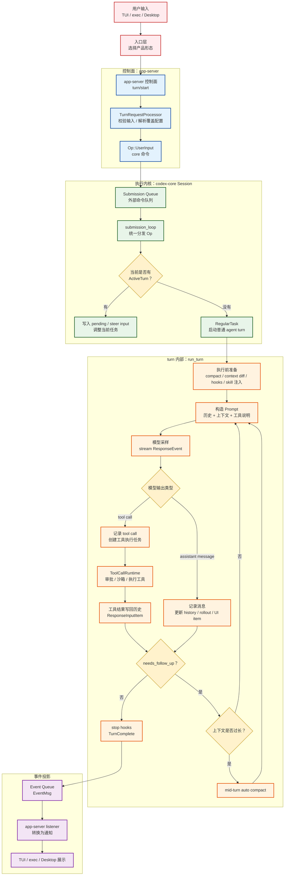
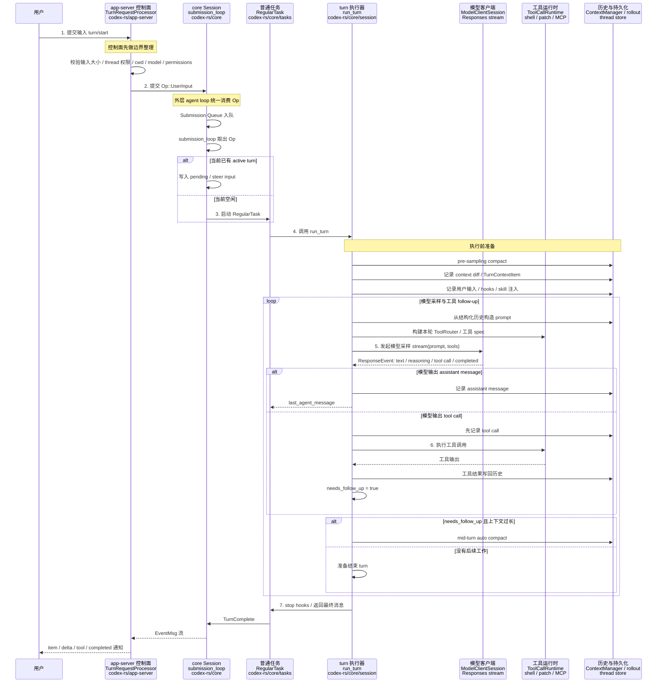
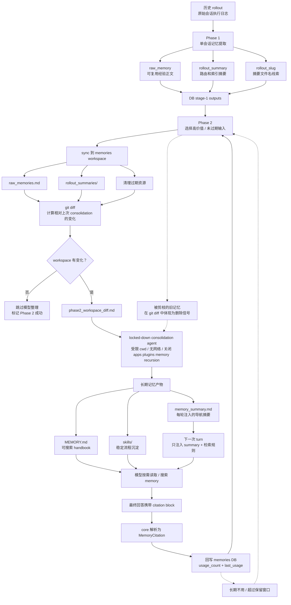
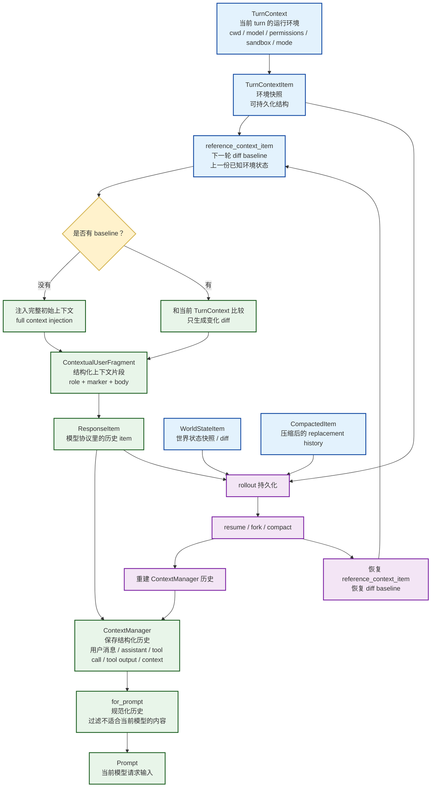
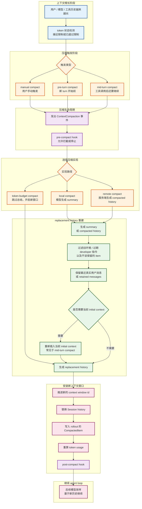

## 1. 给我讲讲 codex 的 agent loop 是怎么实现的？

**整体流程图**



**一次普通 turn 的时序图**




Codex 的 agent loop 不是从“模型”开始的，而是从 **用户输入进入一个长期会话线程** 开始的。你可以先把它想成：

```
用户输入
-> app-server 把它变成一次 turn 请求
-> core 把请求排队
-> session loop 取出请求
-> 如果当前空闲，就启动一个 agent turn
-> turn 里才真正开始模型-工具循环
```

前几步最重要的是：Codex 先建立秩序，再让模型工作。

**1. `turn/start`：用户输入先进入控制面**

当用户在 TUI 或桌面里输入一句话，或者 `codex exec` 提交一个 prompt，前端不是直接调用模型。

它会发一个 app-server 请求，叫：

```
turn/start
```

这个请求大概表达的是：

```
我要在某个 thread 上开始一轮用户输入。
输入内容是这些。
本轮可能还带一些设置覆盖，比如 cwd、模型、权限、沙箱策略等。
```

所以 `turn/start` 的第一层作用不是“回答问题”，而是 **把一次用户动作正规化**。

它会做几类事情：

- 找到对应的 thread。
- 检查这个 thread 是否允许直接输入。
- 检查用户输入大小，避免超大输入直接塞进 core。
- 把 app-server 协议里的 input 转成 core 协议里的 input item。
- 解析本轮额外上下文。
- 处理本轮设置覆盖，比如 cwd、model、approval policy、permissions。
- 最后构造一个 core 命令：`Op::UserInput`。

也就是说，这里 Codex 在做“入境检查”。

用户输入不是一段裸字符串，而是被包装成：

```
这是谁的 thread？
这是哪一轮 turn？
输入是什么？
本轮配置有什么变化？
有没有额外上下文？
权限和环境是什么？
```

这个设计非常关键。因为一个 coding agent 不是聊天机器人，它要读写文件、跑命令、调用工具、处理审批、恢复历史。如果输入不先经过控制面，后面很容易变成一团乱麻。

对应源码位置主要是：

[turn_processor.rs (line 462)](/Users/machengqian.1/code/codex/codex-rs/app-server/src/request_processors/turn_processor.rs:462)

这里你先不用看代码细节，只记住：`TurnRequestProcessor` 是把 app-server 的 `turn/start` 转成 core 的 `Op::UserInput`。

**2. 为什么不是直接调用模型？**

因为 Codex 需要支持很多“模型调用前必须确定”的东西。

比如同一句用户输入：

```
帮我修这个 bug
```

在不同场景下含义完全不同：

- 当前工作目录是什么？
- 允许读哪些文件？
- 允许写哪些文件？
- 能不能联网？
- 执行 shell 要不要审批？
- 使用哪个模型？
- 是普通模式、Plan 模式，还是 Review 模式？
- 当前 thread 之前有哪些历史？
- 是否有 active turn 正在运行？
- 这句话是新任务，还是打断/补充当前任务？

这些都不是模型自己能可靠决定的。app-server 和 core 要先把这些运行时边界固定下来。

所以 Codex 的设计不是：

```
用户输入 -> 模型
```

而是：

```
用户输入 -> 控制面校验/归一化 -> core 命令 -> session loop -> turn context -> 模型
```

这就是“agent runtime”和“普通 chat wrapper”的区别。

**3. `Op::UserInput`：把输入变成 core 能处理的命令**

`Op` 可以理解为 Codex core 的“命令枚举”。

除了用户输入，还有很多东西也会变成 `Op`：

- 中断当前 turn。
- 用户批准 shell 命令。
- 用户拒绝 patch。
- compact 上下文。
- 动态工具返回结果。
- MCP elicitation 回答。
- 多 agent 通信。

所以 core 的入口不是“调用一个 answer 函数”，而是“不断消费操作”。

`Op::UserInput` 只是其中一种操作，表示：

```
有用户输入来了，请 session 处理它。
```

这带来一个好处：用户输入、审批、中断、工具响应，都能进入同一条队列，被同一个 session 顺序处理。

否则你会遇到很麻烦的问题：

```
模型正在请求 shell 审批
用户又输入了一句补充
同时某个 MCP 工具返回了结果
用户又点了 interrupt
```

如果这些都是散落的回调，状态会非常难维护。

Codex 把它们统一成 `Op`，本质上是在说：

```
所有外部刺激，都先排队；session 自己决定怎么消费。
```

**4. Submission Queue：为什么要排队？**

core session 创建时，会建立一个 Submission Queue。

它像一个邮箱，外部不能随便伸手改 agent 状态，只能往邮箱里投递 `Op`。

这个队列的价值有三个。

第一，保证顺序。

比如用户先发输入，再点击中断。这两个动作要有明确顺序。

第二，隔离并发。

TUI、app-server listener、审批弹窗、工具系统，都可能从不同 async task 里提交事件。队列把这些并发入口收束成一个 session loop。

第三，让 agent 可以被控制。

如果没有队列，模型调用期间系统就很难优雅处理审批、interrupt、pending input。现在它们都可以被投递进来，session loop 有机会统一调度。

源码里 session 创建队列的位置在：

[session/mod.rs (line 532)](/Users/machengqian.1/code/codex/codex-rs/core/src/session/mod.rs:532)

你不用看 Rust，只要知道这里建立了两个通道：

```
Submission Queue：外部 -> core
Event Queue：core -> 外部
```

一个收命令，一个发事件。

**5. `submission_loop`：外层 agent loop**

`submission_loop` 是 Codex agent 的外层循环。它一直等队列里出现新的 `Op`。

逻辑上类似：

```
while session 没关闭:
    取出一个 Op
    如果是用户输入：处理用户输入
    如果是审批结果：唤醒等待中的工具
    如果是中断：取消当前任务
    如果是 compact：启动压缩任务
    如果是动态工具响应：交给对应等待者
```

源码位置：

[handlers.rs (line 712)](/Users/machengqian.1/code/codex/codex-rs/core/src/session/handlers.rs:712)

这里最重要的不是 `match` 有多少分支，而是这个设计思想：

```
session 是 agent 的状态拥有者。
外部不能直接推动模型 loop，只能提交 Op。
```

所以 `submission_loop` 更像操作系统里的 event loop。它不是每次都调用模型，它只负责分发“现在发生了什么”。

**6. 收到用户输入后，先判断：新 turn 还是 steer 当前 turn？**

这是 Codex 一个很真实的交互设计。

用户输入来了，不一定意味着要新开一个任务。

假设 agent 正在跑：

```
用户：帮我排查测试失败
Codex：开始读文件、跑测试……
用户：等等，优先看 app-server 那块
```

第二句话不应该强行开一个并发 agent turn。它更像是对当前任务的“方向调整”。

所以 Codex 收到 `Op::UserInput` 后，会尝试 `steer_input`：

- 如果当前有 active turn，就把输入送进当前 turn 的 pending/steer 机制。
- 如果没有 active turn，就启动一个新的 `RegularTask`。

这一步源码在：

[handlers.rs (line 192)](/Users/machengqian.1/code/codex/codex-rs/core/src/session/handlers.rs:192)

你可以把它理解成：

```
用户输入不是立刻等于新任务。
先看 agent 当前是不是忙。
忙：作为补充输入。
不忙：开新任务。
```

这个设计让 Codex 更像一个正在工作的协作者，而不是一个每句话都重启状态机的问答机器人。

**7. 启动 `RegularTask`：真正进入一次普通 agent turn**

如果当前没有 active turn，Codex 会启动一个 `RegularTask`。

`RegularTask` 就是普通“回答/执行用户任务”的 agent 任务。它会：

- 标记 turn 开始。
- 发出 `TurnStarted` 事件。
- 准备模型 session。
- 调用 `run_turn`。

源码位置：

[regular.rs (line 37)](/Users/machengqian.1/code/codex/codex-rs/core/src/tasks/regular.rs:37)

但这里还有个细节：`RegularTask` 不是只跑一次 `run_turn` 就完了。它跑完后会检查有没有 pending input。

也就是说，如果模型工作期间用户又插了一句话，`RegularTask` 可能继续跑下一轮，把补充输入纳入同一个 turn 生命周期。

所以外层结构更像：

```
RegularTask:
    发出 TurnStarted
    run_turn(初始用户输入)
    如果期间有 pending input:
        run_turn(空输入，但历史里已有 pending 内容)
    没有 pending input:
        结束 turn
```

**8. 到这里还没真正进入模型循环**

注意，前面这些步骤都还不是模型推理。

它们是在做 agent runtime 的准备工作：

```
turn/start
-> 校验和归一化
-> Op::UserInput
-> Submission Queue
-> submission_loop
-> 判断 steer 还是新任务
-> RegularTask
```

只有进入 `run_turn` 之后，才开始真正的：

```
上下文构造
工具暴露
模型采样
工具执行
工具结果回写
再次采样
```

这就是 Codex 设计很成熟的地方：模型只是 loop 里的一个参与者，不是系统的唯一中心。

**先用一句话收束**

Codex 的 agent loop 前半段做的是“把用户输入变成一个可控、可排队、可恢复、可中断的执行任务”；后半段 `run_turn` 才做“模型与工具的反复协作”。

### 1.1 继续拆解一下run_turn

好，`run_turn` 是 Codex agent loop 的核心内核。前面那些 `turn/start`、`Op::UserInput`、`submission_loop`、`RegularTask` 都是在把任务送到这里；真正“模型怎么和工具来回协作”，主要就在 `run_turn` 和它下面的 `run_sampling_request / try_run_sampling_request`。

先给一个总图：

```
run_turn
  1. turn 前准备：压缩、上下文 diff、skill/plugin 注入、hooks、记录用户输入
  2. 进入循环：
      2.1 从历史构造 prompt
      2.2 构建本轮工具路由 ToolRouter
      2.3 请求模型，消费流式 ResponseEvent
      2.4 如果模型输出 assistant message：记录消息，可能结束
      2.5 如果模型输出 tool call：记录 tool call，执行工具
      2.6 工具输出写回历史
      2.7 needs_follow_up = true，再次采样
  3. 没有工具、没有 pending input、模型不要求继续时，turn 结束
```

对应入口在 [turn.rs (line 144)](/Users/machengqian.1/code/codex/codex-rs/core/src/session/turn.rs:144)。

**1. `run_turn` 先做“模型调用前准备”**

很多人会以为 agent loop 一进来就是调用模型，但 Codex 不是。它先整理“这一轮模型到底应该看到什么”。

`run_turn` 开头做了几件事：

```
run_pre_sampling_compact
capture_step_context
record_context_updates_and_set_reference_context_item
build_skills_and_plugins
run_pending_session_start_hooks
run_hooks_and_record_inputs
```

翻译成人话：

**第一，必要时先压缩历史。**

如果当前上下文太长，直接调模型会爆 context window。所以 Codex 会在采样前尝试 compact。注意这不是用户手动点一下“总结历史”，而是 agent loop 自己的一部分。

**第二，捕获本轮 step context。**

`TurnContext` 是这一整个 turn 的配置快照，比如模型、cwd、权限、sandbox、mode 等。

`StepContext` 更像是“这次模型请求时刻看到的世界状态”，包括 MCP、工具、插件、环境等。因为一个 turn 内可能多次采样，每次采样前的工具/环境视图都可能需要重新捕获。

**第三，记录上下文变化。**

Codex 不会每轮都把完整环境重复塞给模型，而是会记录 context diff。例如 cwd 变了、权限变了、模型变了、collaboration mode 变了。这个对应你文档里说的 `TurnContextItem` / reference context baseline。

**第四，处理 skill/plugin 注入。**

如果用户显式提到某个 skill、plugin、app，或者当前配置需要注入相关说明，Codex 会在这里把对应上下文塞进历史。

**第五，跑 hooks，并把用户输入记录进历史。**

这一步很重要：用户输入不是只作为临时 prompt 参数传给模型，而是进入 session history / rollout。后面恢复、fork、重放，都依赖这些持久化材料。

所以 `run_turn` 的第一阶段可以总结为：

```
把“当前世界状态 + 用户输入 + 必要系统上下文”变成可恢复、可追踪、可送入模型的历史。
```

**2. `run_turn` 的主循环不是一次模型调用**

`run_turn` 里面真正的循环从 [turn.rs (line 226)](/Users/machengqian.1/code/codex/codex-rs/core/src/session/turn.rs:226) 开始。

每一圈大概做：

```
检查 pending input
记录时间/预算提醒
捕获 step context
从历史构造 prompt input
调用 run_sampling_request
根据结果判断是否继续
```

最关键的变量是：

```
needs_follow_up
```

它表示：模型这次输出之后，是否还要再请求一次模型。

**什么时候需要 follow-up？**

- 模型调用了工具。
- 工具有输出写回历史。
- 用户在 agent 运行期间插入了 pending input。
- 模型返回 `end_turn = false`。
- hook 要求继续。
- 中途 compact 后需要恢复执行。

所以 Codex 的模型循环不是：

```
问一次模型 -> 输出答案 -> 完成
```

而是：

```
问模型
-> 模型说：我要查文件/跑命令/调用工具
-> host 执行工具
-> 工具结果写回历史
-> 再问模型：现在你看到了工具结果，继续
-> 直到模型没有后续动作
```

这就是 coding agent 和普通聊天的本质区别。

**3. 每次采样前，都重新构造 prompt**

在循环里，Codex 会从 session history 克隆出 prompt input：

```
sess.clone_history().await.for_prompt(...)
```

源码位置在 [turn.rs (line 272)](/Users/machengqian.1/code/codex/codex-rs/core/src/session/turn.rs:272)。

这句话的含义很关键：

模型看到的不是某个临时字符串，而是由历史管理器整理过的 response items。

这些历史里包括：

- 用户消息。
- assistant 消息。
- reasoning。
- tool call。
- tool output。
- context diff。
- skill/plugin 注入。
- compaction 结果。

所以 Codex 每次 follow-up 不是“手写一个工具结果追加字符串”，而是从结构化历史重新构造 prompt。

这让它更容易支持：

- 恢复会话。
- fork 会话。
- compaction。
- raw response item 记录。
- 工具调用审计。
- UI 展示每个 item 的生命周期。

**4. 每次采样前，也构建本轮可见工具**

`run_sampling_request` 里先调用 `built_tools`，再创建 `ToolCallRuntime`。位置在 [turn.rs (line 1124)](/Users/machengqian.1/code/codex/codex-rs/core/src/session/turn.rs:1124)。

这里可以理解为：

```
这一次模型请求，模型能看到哪些工具？
这些工具在 host 侧由谁执行？
```

这两个问题在 Codex 里是分开的。

- 模型可见的是 `model_visible_specs`
- host 执行靠 `ToolRegistry / ToolCallRuntime`

所以 prompt 构造时会放：

```
tools = router.model_visible_specs()
```

位置在 [turn.rs (line 1086)](/Users/machengqian.1/code/codex/codex-rs/core/src/session/turn.rs:1086)。

这很重要。因为不是所有 host 能执行的工具都应该暴露给模型，也不是所有模型可见工具都一定由本地 dispatch 执行。有些是 hosted tool，有些是 hidden tool，有些是 deferred tool。

在 agent loop 里，这一步相当于给模型发一张“本轮工具菜单”。

**5. `try_run_sampling_request` 消费模型流**

真正和模型流交互的是 `try_run_sampling_request`，在 [turn.rs (line 1937)](/Users/machengqian.1/code/codex/codex-rs/core/src/session/turn.rs:1937)。

它做的事情可以理解成：

```
打开模型响应流
while 还有事件:
    如果是输出 item 开始：通知 UI 有一个 item started
    如果是文本 delta：转发给 UI
    如果是 reasoning delta：转发给 UI
    如果是输出 item 完成：判断这是消息还是工具调用
    如果 response completed：记录 token usage，返回 needs_follow_up
```

这里处理的是 Responses API 风格的流式事件，不是一次性拿完整文本。

几个关键事件：

- `OutputItemAdded`：模型开始输出某个 item。
- `OutputTextDelta`：assistant 文本增量。
- `ReasoningSummaryDelta`：reasoning 增量。
- `ToolCallInputDelta`：工具参数增量。
- `OutputItemDone`：某个完整 item 完成。
- `Completed`：这次模型响应结束。

这就是为什么 TUI/桌面能看到流式输出、工具开始/结束、reasoning、token count，而不是等所有东西结束后一次性展示。

**6. `OutputItemDone` 是分水岭：消息还是工具？**

模型输出一个完整 item 后，Codex 调 `handle_output_item_done`。位置在 [stream_events_utils.rs (line 319)](/Users/machengqian.1/code/codex/codex-rs/core/src/stream_events_utils.rs:319)。

这一步是 agent loop 的关键判断：

```
这个 item 是普通 assistant/reasoning 消息？
还是 tool call？
```

如果是普通消息：

```
转换成 TurnItem
发 item completed 事件
记录进 conversation history
更新 last_agent_message
```

如果是工具调用：

```
先记录 tool call 到历史
创建 tool future
needs_follow_up = true
把 future 放入 in_flight
```

这一步有个非常重要的设计：**工具调用本身先被记录，再执行工具**。

也就是说，历史里会留下：

```
模型请求调用 shell/apply_patch/MCP...
```

之后工具完成，再留下：

```
工具输出结果...
```

这对恢复、审计、调试都很重要。即使工具执行中断了，也能知道模型当时请求过什么。

**7. 工具是异步执行的，结果再写回历史**

`try_run_sampling_request` 里有一个 `in_flight` 队列。模型可能在一次 response 里产生一个或多个工具调用，Codex 会把工具执行 future 放进去。

模型本次 response 完成后，会 drain 这些 in-flight 工具。位置大概在 [turn.rs (line 2470)](/Users/machengqian.1/code/codex/codex-rs/session/turn.rs:2470) 附近，不过路径实际是 [turn.rs (line 2470)](/Users/machengqian.1/code/codex/codex-rs/core/src/session/turn.rs:2470)。

工具输出会变成 `ResponseInputItem`，再转换/记录回历史。这样下一次模型采样时，模型就能看到工具结果。

所以一次工具调用的生命周期是：

```
模型输出 tool call
-> Codex 记录 tool call
-> ToolCallRuntime 执行工具
-> 工具返回 output
-> Codex 记录 tool output
-> needs_follow_up = true
-> 下一圈模型看到 tool output
```

这就是 ReAct loop 的工程化版本。

**8. `needs_follow_up` 决定是否再采样**

一次模型响应结束时，`try_run_sampling_request` 返回：

```rust
SamplingRequestResult {
    needs_follow_up,
    last_agent_message,
}
```

然后 `run_turn` 再结合 pending input 判断：

```
needs_follow_up = model_needs_follow_up || has_pending_input
```

位置在 [turn.rs (line 320)](/Users/machengqian.1/code/codex/codex-rs/core/src/session/turn.rs:320)。

如果 `needs_follow_up = true`：

- 可能先判断是否需要 mid-turn compact。
- 然后 `continue`，回到循环开头。
- 重新从历史构造 prompt。
- 再请求模型。

如果 `needs_follow_up = false`：

- 运行 stop hooks。
- 运行 legacy after-agent hook。
- 结束 turn。

所以 `run_turn` 的核心状态机可以写成：

```
loop:
    prompt = history + context + tools
    result = sample_model(prompt)

    if result produced tool calls:
        execute tools
        record tool outputs
        continue

    if user added pending input:
        record pending input
        continue

    if context too full and still need continue:
        compact
        continue

    stop hooks
    break
```

**9. 为什么 compaction 在 loop 中间？**

这是 Codex 很聪明的一点。

上下文不一定是在用户刚输入时爆掉。更常见的是：

```
用户：帮我排查
模型：我要读这些文件
工具：返回大量文件内容/测试日志
模型还需要继续分析
```

这时候上下文压力是在工具输出之后出现的。

所以 `run_turn` 在每次采样后都会检查 token 状态。如果还需要 follow-up，同时 token limit 到了，就在 **turn 中间** auto compact，然后继续 loop。见 [turn.rs (line 347)](/Users/machengqian.1/code/codex/codex-rs/core/src/session/turn.rs:347)。

这说明 Codex 把 compaction 当成 agent 执行机的一部分，而不是一个外部按钮。

**10. 最后用一个具体例子串起来**

假设你输入：

```
帮我修复 app-server 里 turn/start 的一个 bug
```

大概会这样跑：

```
run_turn 开始
-> 记录用户输入和上下文
-> 构造 prompt，暴露 shell/read/apply_patch 等工具
-> 请求模型

模型输出：
  “我要先搜索 turn_start”
  tool call: shell rg ...

Codex：
-> 记录这个 tool call
-> 执行 shell
-> shell 输出写回历史
-> needs_follow_up = true

第二次采样：
-> prompt 里已经有 rg 结果
-> 模型决定读取文件
-> tool call: shell sed/nl ...

Codex：
-> 执行读文件
-> 结果写回历史
-> needs_follow_up = true

第三次采样：
-> 模型决定修改文件
-> tool call: apply_patch

Codex：
-> 审批/权限/沙箱检查
-> 执行 patch
-> 结果写回历史
-> needs_follow_up = true

第四次采样：
-> 模型决定跑测试
-> tool call: shell just test -p ...

Codex：
-> 执行测试
-> 结果写回历史
-> needs_follow_up = true

第五次采样：
-> 模型看到测试通过
-> 输出最终总结
-> 没有工具、没有 pending input
-> stop hooks
-> turn complete
```

所以 `run_turn` 不是“生成回答”的函数，而是：

```
一个把模型输出、工具执行、历史持久化、上下文压缩、用户插话、hooks 串成闭环的执行调度器。
```

这也是 Codex 这个 coding agent 的本质：模型负责决策下一步，host runtime 负责把每一步变成受控、可审计、可恢复的真实动作。

### 总结

Codex 的 agent loop 可以从“用户输入如何变成一次受控执行”来理解。用户在 TUI、桌面或 `codex exec` 里发起输入后，系统并不会直接调用模型，而是先进入 app-server 的控制面。`turn/start` 会找到目标 thread，校验输入大小、权限和环境覆盖，把 cwd、模型、审批策略、sandbox、additional context 等运行条件整理清楚，然后把这次输入转换成 core 能处理的 `Op::UserInput`。这一步的设计意味很强：Codex 不把用户输入当成一段裸 prompt，而是把它放进一个明确的 thread/turn 协议里，使它从一开始就具备可追踪、可恢复、可审批、可中断的运行边界。

进入 core 之后，`Op::UserInput` 会进入 Submission Queue，由 `submission_loop` 统一消费。**这个外层 loop 像一个 agent runtime 的事件泵**：用户输入、审批结果、中断、compact、动态工具响应、多 agent 通信，都不是散落的回调，而是统一的 `Op`。session 是状态拥有者，外部只能投递命令，不能直接改 agent 内部状态。收到用户输入后，core 还会判断当前是否已有 active turn：如果 agent 正在工作，新输入可能成为对当前任务的 steer/pending input；如果空闲，才启动新的 `RegularTask`。这让 Codex 的交互更像“正在工作的协作者可以被提醒和调整方向”，而不是“每句话都新开一个并发机器人”。

真正的模型-工具循环发生在 `run_turn`。它不是一进来就问模型，而是先做执行前准备：必要时 compact 历史，捕获本轮 `TurnContext` 和当前采样时刻的 `StepContext`，记录环境和权限变化，注入相关 skill/plugin/app 上下文，运行 hooks，并把用户输入和 additional context 写入结构化历史。然后它进入内层循环：从历史构造 prompt，构建本轮模型可见工具，发起模型流式请求，消费 `ResponseEvent`。如果模型输出普通 assistant message，就记录并展示；如果模型输出 tool call，Codex 会先把 tool call 本身持久化，再通过 `ToolCallRuntime` 执行工具，把工具结果写回历史，并设置 `needs_follow_up = true`，让模型在下一次采样时看到真实工具结果后继续推理。

所以 Codex 的 agent loop 不是简单的“模型回答一次”。它更像一个结构化执行机：模型负责决定下一步，host runtime 负责把下一步变成受权限约束、可审计、可取消、可恢复的真实动作。每一次模型采样都基于结构化历史重新构造 prompt；每一次工具调用和工具输出都会成为历史的一部分；每一次上下文变化都有边界；每一次 token 压力都可能触发 mid-turn compaction。最终，当没有工具输出需要 follow-up、没有 pending input、模型也没有要求继续时，`run_turn` 才运行 stop hooks 并完成 turn。

它背后的设计哲学，是把 coding agent 当成“本地长期执行系统”，而不是聊天窗口里的 prompt 技巧。Codex 非常强调边界：

- app-server 是控制面，不拥有 agent loop；

- core 是执行内核，不关心 UI 怎么展示；

- 工具系统把模型可见 spec 和 host 执行 registry 分离；

- 上下文系统用 `TurnContextItem`、`ContextualUserFragment` 和 rollout 维护可重建历史；

- 安全系统不是一个布尔判断，而是权限 profile、hooks、Guardian、用户审批、sandbox、网络策略共同组成的流水线。

这样的分层让 Codex 能同时支撑 TUI、exec、桌面、远程 app-server、多 agent、memory 和 session resume，而不需要每个入口复制一套 agent 逻辑。

更深一层看，Codex 的哲学是：模型不是系统的主人，模型是执行循环里的智能决策器。真正保证系统可靠的是协议、队列、事件、历史、权限和持久化。模型可以提出“我要读文件”“我要跑测试”“我要修改代码”，但这些动作必须经过 host runtime 的工具路由、安全检查、沙箱执行和结果回写。这样 Codex 既能利用模型的开放式推理能力，又不会把真实机器的控制权完全交给一段不可审计的文本生成。它优秀的地方不在于某个单点算法，而在于把 agent 的自由度关进一套清晰、有界、可恢复的工程结构里。


## 2. codex 的记忆系统是怎么设计的？

Codex 的记忆系统，首先要和“当前对话历史”区分开。当前 thread 里的消息、工具调用、工具输出、上下文压缩，属于短期执行历史，由 `ContextManager`、rollout、thread store 负责；而 memory 系统处理的是 **跨 thread 的长期经验**。它的目标不是把所有旧聊天塞回 prompt，而是从过去的执行日志里提炼出以后可能复用的用户偏好、项目习惯、失败经验、常用流程和知识索引。

它的整体设计可以概括成一句话：**读路径轻量、写路径异步；原始历史不等于记忆，记忆要经过提取、合并、引用反馈和遗忘。**

读路径很克制。Codex 不会每次启动都把整个 `~/.codex/memories` 目录塞给模型，而是只读取 `memory_summary.md`，再生成一段 developer instructions，告诉模型什么时候该查记忆、怎么查、先查哪里、查到之后如何引用。这个逻辑在 [prompts.rs (line 27)](/Users/machengqian.1/code/codex/codex-rs/ext/memories/src/prompts.rs:27)：它读取 `memory_summary.md`，做 token 上限截断，如果为空就不注入。也就是说，`memory_summary.md` 是一个导航层，不是完整知识库。

这点很关键。Codex 的长期记忆不是“自动全量回忆”，而是“摘要导航 + 按需检索”。模型默认只看到一份压缩过的 memory summary，以及一套使用规则：简单任务可以跳过；涉及项目历史、用户偏好、模糊上下文、重复工作流时才查；先搜 `MEMORY.md`，必要时再打开 rollout summaries 或 skills。这种设计避免长期记忆污染当前上下文，也避免 token 被旧信息吃掉。

写路径则完全不在当前回答的主链路里同步执行。**用户发起真实输入后，`turn/start` 会在合适条件下启动后台 memory pipeline**。入口是 [start.rs (line 23)](/Users/machengqian.1/code/codex/codex-rs/memories/write/src/start.rs:23)。

它会跳过 ephemeral session、feature 没开的 session、sub-agent session，也要求 state DB 可用，还会检查 rate limit。符合条件后，它在后台跑 Phase 1 和 Phase 2。注意这里的哲学：**当前 turn 的成功不依赖记忆生成成功**。记忆维护是旁路任务，不阻塞用户看到结果。

Phase 1 做的是“单个历史 thread 的萃取”。它从 state DB 里 claim 符合条件的 rollout job，然后对每个历史会话做结构化提取，输出三样东西：`raw_memory`、`rollout_summary`、`rollout_slug`。源码里这个输出结构在 [phase1.rs (line 50)](/Users/machengqian.1/code/codex/codex-rs/memories/write/src/phase1.rs:50)。这里有个重要边界：Phase 1 不直接改最终的 `MEMORY.md`，它只是把某个历史会话提炼成 stage-1 原材料。这样可以避免“一个会话的一点经验”立刻污染全局长期记忆。

Phase 2 才是全局合并，也就是 consolidation。它先抢一个全局 phase-2 lock，确保同一时间只有一个 consolidation worker 修改 memory workspace。然后从 DB 里选择当前要参与合并的 stage-1 outputs，选择时会考虑上限、保留天数、使用情况等。接着把这些输入同步到 memories root：生成 `raw_memories.md`，更新 `rollout_summaries/`，清理过期资源。这个流程在 [phase2.rs (line 46)](/Users/machengqian.1/code/codex/codex-rs/memories/write/src/phase2.rs:46)。

最巧的是，Phase 2 不会盲目让模型“重写全部记忆”。它会把 memories root 当成一个带 git baseline 的 workspace，先计算这次输入变化相对上次 consolidation 的 diff。如果没有变化，并且必要产物还有效，就直接跳过。如果有变化，就把 diff 写成 `phase2_workspace_diff.md`，**再启动一个内部 consolidation agent**，让它基于 diff 增量更新 `MEMORY.md`、`memory_summary.md`、`skills/` 等产物。这个设计把“遗忘”也纳入系统：如果某些 rollout summary 被 prune，diff 里会出现删除信号，consolidation agent 就有机会清理只由旧证据支撑的记忆。

更进一步，Codex 对 consolidation agent 做了严格权限收缩。它的 cwd 被设到 memories root，session 是 ephemeral，关闭 `generate_memories` 和 `use_memories`，关闭 apps、plugins、MCP、collab、memory tool，approval policy 是 never；在普通 managed 权限下，只给 memories root 写权限，而且无网络。这个配置在 [phase2.rs (line 311)](/Users/machengqian.1/code/codex/codex-rs/memories/write/src/phase2.rs:311)。这说明 Codex 把“更新长期记忆”看成高影响操作：可以复用 agent 能力，但必须把 agent 关在很小的执行边界里。

还有一个非常漂亮的闭环：memory citation。读路径要求模型如果使用了记忆，最终回答末尾要带机器可解析的 citation block。core 在处理 assistant message 时会解析这些引用，记录哪些 memory/rollout 被使用过，并把使用情况回写到 memories DB。相关处理在 [stream_events_utils.rs (line 122)](/Users/machengqian.1/code/codex/codex-rs/core/src/stream_events_utils.rs:122)。这意味着记忆不是“写进去就永远重要”，而是会根据未来是否真的被使用来调整价值。被引用的记忆更可能继续参与后续 consolidation，长期不用的记忆会逐渐退出。

所以 Codex 的 memory 系统可以画成这样：



> 备注：
> 
> 实线 = 正常的数据生产和使用路径
   虚线 = 使用统计、过期、剪枝、删除这些“影响下一轮选择和遗忘”的反馈信号

它的设计哲学和 Codex agent loop 是一致的：模型可以参与判断和整理，但系统必须有边界、有证据、有反馈、有上限。短期历史负责恢复当前 thread；长期记忆负责沉淀跨任务经验；summary 负责导航；rollout summary 负责溯源；citation 负责反馈；Phase 2 负责合并和遗忘。它不是普通 RAG，也不是聊天摘要，而是一套“证据驱动、增量维护、可遗忘、可引用”的长期上下文系统。

### 2.1 解释一下名词：memory citation，citation block

`memory citation` 可以理解成 **模型在回答里声明“我这次用了哪些长期记忆”之后，Codex 解析出来的结构化引用信息**。

`citation block` 则是模型在最终回答末尾写的一段 **机器可解析的隐藏/半隐藏标记文本**，专门给 Codex 读取，不是主要给用户阅读。

两者关系是：

```
citation block 是原始文本格式
memory citation 是 Codex 从这段文本里解析出来的结构化对象
```

举个简化例子。模型如果用了 memory，回答最后可能带类似：

这整段就是 `citation block`。

Codex 会把它解析成类似：

```
MemoryCitation {
  entries: [
    { path: "MEMORY.md", line_start: 120, line_end: 128, note: "..." }
  ],
  thread_ids: ["019f..."]
}
```

这个结构化结果就是 `memory citation`。

它有三个作用。

第一，**可追溯**。

Codex 可以知道这次回答到底依赖了哪些 memory 文件、哪些行、哪些历史 rollout。

第二，**从用户可见文本里剥离**。

模型输出时可能带 citation block，但 Codex 在处理 assistant message 时会解析它，并把主要展示文本里的隐藏标记去掉，避免用户看到一大段内部引用格式。

第三，**反向反馈给记忆系统**。

`rollout_ids` 会告诉 memory DB：这些旧记忆这次真的被用上了。于是对应 stage-1 memory 的 `usage_count`、`last_usage` 可以更新。后续 Phase 2 consolidation 会更倾向保留被真实使用过的记忆；长期不用的记忆则更容易退出。

所以一句话区分：

```
citation block = 模型输出里的引用标记文本。
memory citation = Codex 解析 citation block 后得到的结构化引用数据。
```

它不是普通论文引用，而是 Codex memory 系统的反馈信号：**用过哪些记忆，要留下证据，并影响未来记忆保留。**

### 总结

1. **短期历史和长期记忆分离**  
    Codex 不把当前 thread 的聊天记录直接当长期记忆。短期历史由 `ContextManager`、rollout、thread store 负责恢复和继续执行；长期记忆则从历史 rollout 中异步萃取，经过整理后才进入 `MEMORY.md`、`memory_summary.md`、`skills/`。
    
2. **读路径轻量，不全量塞上下文**  
    每次 turn 不会加载整个记忆库，只注入 `memory_summary.md` 和检索规则。`memory_summary.md` 是导航层，告诉模型什么时候查、怎么查、去哪里查，而不是把全部旧经验塞进 prompt。
    
3. **写路径异步，不阻塞当前回答**  
    用户当前任务完成不依赖 memory pipeline 成功。真实输入触发后台任务后，系统在旁路执行 Phase 1 / Phase 2，避免记忆维护拖慢当前 agent loop。
    
4. **Phase 1 只做单会话萃取，不直接污染全局记忆**  
    Phase 1 从单个 rollout 中提取 `raw_memory`、`rollout_summary`、`rollout_slug`，先写入 DB stage-1 outputs。它只是原材料层，不直接改 `MEMORY.md`。
    
5. **Phase 2 负责全局合并和去重**  
    Phase 2 从 DB 里选择高价值、未过期、数量受限的 stage-1 outputs，再统一合并到 memories workspace。这样长期记忆不是简单追加日志，而是经过全局整理。
    
6. **用 git diff 驱动增量 consolidation（亮点）**  
    Phase 2 会把 memories root 当成带 baseline 的 workspace，先计算 diff。没有变化就跳过，有变化才让 consolidation agent 处理。这让记忆更新更节省，也更可解释。
    
7. **支持遗忘，而不是只会追加**  
    旧 rollout summary 被 prune 或不再 selected 时，会在 git diff 中体现为删除信号。consolidation agent 可以据此清理 `MEMORY.md`、`memory_summary.md`、`skills/` 中失去证据支撑的内容。
    
8. **consolidation agent 权限极小化**  
    整理长期记忆的 agent 被限制在 memories root，关闭网络、apps、plugins、MCP、collab、memory 递归，并使用 ephemeral session。Codex 把“修改长期记忆”当成高影响操作来隔离。
    
9. **citation 形成使用反馈闭环（亮点）**
    模型如果使用 memory，需要输出 citation block。core 解析成 `MemoryCitation` 后，会更新 DB 中对应 stage-1 output 的 `usage_count` 和 `last_usage`。后续 Phase 2 会利用这些统计决定保留和排序。
    
10. **长期记忆有界、有证据、有来源**  
    summary 有 token 上限，read/search 有预算，Phase 1/Phase 2 有 job 上限和 retention 策略。记忆不是无限增长的聊天摘要，而是带 rollout 证据、可检索、可引用、可淘汰的长期上下文系统。

## 3. 上下文怎么管理？怎么设计?

**设计图**




Codex 的上下文管理，核心不是“把一堆字符串拼成 prompt”，而是把上下文拆成几种不同职责的结构：**会话历史、运行时配置快照、模型可见上下文片段、持久化日志、压缩后的新窗口**。这几个层次配合起来，保证模型既能看到必要信息，又不会每轮被重复环境信息刷屏，还能在 resume/fork/compact 后恢复出一致的上下文。

**最中心的对象是 `ContextManager`**，它可以理解成 core session 内存里的“模型历史管理器”。它维护一组按时间顺序排列的 `ResponseItem`，也保存 token usage、`reference_context_item` 和 `world_state_baseline`。源码在 [history.rs (line 38)](/Users/machengqian.1/code/codex/codex-rs/core/src/context_manager/history.rs:38)。

这里的 `items` 不是普通文本，而是结构化的模型协议 item：用户消息、assistant 消息、tool call、tool output、reasoning、context injection 等都会以 `ResponseItem` 形式进入历史。每次真正要请求模型时，Codex 会调用 `clone_history().for_prompt(...)`，把内存历史整理成适合当前模型输入能力的 prompt，比如规范化历史、过滤不适合的 item、在模型不支持图片时移除图片内容。

第二个关键概念是 `TurnContextItem`。它不是“模型聊天内容”，而是每个真实 user turn 的运行环境快照：cwd、workspace roots、当前日期和时区、approval policy、sandbox policy、permission profile、network、model、personality、collaboration mode、multi-agent mode、realtime 状态等。定义在 [protocol.rs (line 3231)](/Users/machengqian.1/code/codex/codex-rs/protocol/src/protocol.rs:3231)。**它的作用是给后续 turn 做 diff baseline：Codex 可以知道“上一轮模型看到的运行环境是什么”，这一轮只需要告诉模型哪些地方变了**。

> 增量的设计思想是一个很优秀的设计点，处处用以 diff

这就是 `reference_context_item` 的意义。第一次真实 turn，或者 compaction 后 baseline 丢失时，Codex 会注入完整初始上下文；如果已经有 baseline，后续 turn 就只注入变化项。核心流程在 [session/mod.rs (line 3548)](/Users/machengqian.1/code/codex/codex-rs/core/src/session/mod.rs:3548)：

`record_context_updates_and_set_reference_context_item` 会先取出旧的 `reference_context_item`，把当前 `TurnContext` 转成新的 `TurnContextItem`，判断是否需要 full context injection。如果没有旧 baseline，就构造完整初始上下文；如果有，就只构造 settings diff 和 world state diff。最后它会把新的 `TurnContextItem` 写入 rollout，并更新内存里的 reference baseline。

这些注入给模型看的上下文，也不是随手拼字符串，而是通过 `ContextualUserFragment` 建模。这个 trait 定义在 [fragment.rs (line 46)](/Users/machengqian.1/code/codex/codex-rs/context-fragments/src/fragment.rs:46)，每个 fragment 自己声明 role、start/end marker、body。

marker 很重要：Codex 后续可以识别“这是系统注入的上下文片段”，而不是用户自然语言。比如权限说明、model switch instructions、collaboration mode instructions、multi-agent instructions、memory instructions、current time reminder，都可以用这种结构化片段进入历史。这样做的好处是：上下文可识别、可过滤、可 diff、可重建，而不是一坨不可解释的 prompt 字符串。

上下文更新分两类：一类是“设置类 diff”，比如模型切换、权限变化、collaboration mode 变化、realtime 状态变化；另一类是“world state diff”，比如环境、工具、workspace、插件、MCP 等当前世界状态变化。设置类 diff 的构造在 [updates.rs (line 242)](/Users/machengqian.1/code/codex/codex-rs/core/src/context_manager/updates.rs:242)，里面会根据前一个 `TurnContextItem` 和当前 `TurnContext` 决定是否生成 developer message。world state 则由 `ContextManager` 维护 baseline，后续只渲染变化部分，避免每轮重复塞完整环境。

当进入 `run_turn` 时，**Codex 会在模型采样前调用这套上下文更新逻辑**。也就是说，模型每次看到的上下文不是静态启动配置，而是“当前 turn 的真实运行状态”。如果用户在 `turn/start` 覆盖了 cwd、模型、权限或 mode，初始上下文会反映覆盖后的结果；如果中途发生变化，后续 turn 会收到增量说明。这解决了一个很常见的问题：长会话里模型以为自己还在旧目录、旧权限、旧模型、旧模式下工作。

持久化层也参与上下文管理。Codex 会把 `ResponseItem`、`TurnContextItem`、`WorldStateItem`、`CompactedItem` 等写入 rollout。这样 resume/fork 时，不是读取某个最终 snapshot，而是从可重放材料重建历史和 baseline。尤其是 `TurnContextItem`，它让恢复后的 session 知道“上一个 durable context baseline 是什么”，从而继续做正确的 diff，而不是每次恢复都重复注入一大段初始上下文。

compaction 是上下文管理的另一条关键路径。当上下文窗口压力过大时，Codex 会生成新的压缩历史窗口。`replace_compacted_history` 会用 replacement history 替换当前 `ContextManager` 的历史，并把 `CompactedItem` 写入 rollout；如果压缩后重新建立了完整上下文，也会持久化新的 `TurnContextItem` 和 `WorldStateItem`。位置在 [session/mod.rs (line 2983)](/Users/machengqian.1/code/codex/codex-rs/core/src/session/mod.rs:2983)。这说明 Codex 没有偷偷删除过去，而是在历史里明确记录“这里发生了一次压缩，之后模型使用这个 replacement history”。

所以，Codex 的上下文设计可以总结成：

```
TurnContext 决定当前运行环境
-> TurnContextItem 持久化环境快照
-> reference_context_item 作为下一轮 diff baseline
-> ContextualUserFragment 结构化注入模型可见上下文
-> ContextManager 保存结构化 ResponseItem 历史
-> for_prompt 生成当前模型请求输入
-> rollout 持久化 ResponseItem / TurnContext / WorldState / Compaction
-> resume/fork/compact 时重建历史和 baseline
```

它的设计哲学和 agent loop、memory 系统一样：**有边界、有结构、有增量、有恢复能力**。Codex 不相信“把所有东西拼进 prompt 就完事”，而是把上下文当成 agent runtime 的状态管理问题：哪些是长期历史，哪些是本轮配置，哪些是模型可见 diff，哪些只是持久化证据，哪些需要压缩，哪些必须恢复后继续生效。这样模型看到的信息更稳定，token 使用更可控，长任务也更容易恢复和审计。

### 3.1 一直看到这个baseline，给我解释一下。

`baseline` 可以先理解成：**用来做对比的上一份基准状态**。

在 Codex 的上下文系统里，它不是一个很玄的概念，就是为了回答这个问题：

```
上一轮模型已经知道了什么？
这一轮只需要告诉模型哪些变化？
```

如果没有 baseline，Codex 就不知道模型之前看到过哪些环境信息，于是只能重新注入完整上下文。

如果有 baseline，Codex 就可以做 diff，只告诉模型变化部分。

举个简单例子。

第一轮 turn 开始时，模型看到完整上下文：

```
当前 cwd = /Users/a/project
模型 = gpt-5
权限 = workspace-write
审批策略 = on-request
当前模式 = default
```

Codex 会把这份状态保存成一个 `TurnContextItem`，并放到 `reference_context_item` 里。这个 `reference_context_item` 就是下一轮的 baseline。

第二轮 turn 来了，如果状态没变：

```
cwd 还是 /Users/a/project
模型还是 gpt-5
权限还是 workspace-write
```

那 Codex 不需要再告诉模型一遍完整环境。

如果第二轮只有权限变了：

```
审批策略从 on-request 变成 never
```

Codex 就可以根据 baseline 生成一条增量上下文：

```
本轮审批策略已变为 never。
```

而不是重复塞整段：

```
当前 cwd = ...
模型 = ...
权限 = ...
审批策略 = ...
...
```

所以 baseline 的作用是：

```
没有 baseline：注入完整上下文
有 baseline：和当前状态比较，只注入变化
```

在 Codex 里有几类 baseline：

1. **`reference_context_item`**  
    这是最常见的上下文 baseline。它保存上一轮 durable 的 `TurnContextItem`，用于比较 cwd、权限、模型、sandbox、collaboration mode 等是否变化。
    
2. **`world_state_baseline`**  
    用来比较世界状态变化，比如环境、工具、插件、MCP、workspace 等。上一轮世界状态是什么，这一轮有什么变化。
    
3. **memory 系统里的 git baseline**  
    Phase 2 里 memories workspace 会有一个 git baseline，用来比较这次 raw memories / rollout summaries 相对上次 consolidation 有什么变化。
    
4. **compaction 后的新 baseline**  
    压缩历史后，旧历史窗口被 replacement history 替代，Codex 需要重新建立上下文基准，否则后续 diff 会不可靠。
    

为什么 Codex 很重视 baseline？

因为 agent 长会话里，重复上下文是很贵也很危险的。

贵，是因为 token 会被浪费。每轮都重复环境说明、权限说明、工具说明，会挤占真正任务上下文。

危险，是因为重复上下文太多会干扰模型，让它分不清哪些是新变化，哪些只是旧信息重放。

有 baseline 后，Codex 可以做到：

```
第一轮：完整告诉模型当前世界
后续轮：只告诉模型世界发生了什么变化
恢复/压缩后：重新建立基准
```

所以一句话：

> baseline 就是 Codex 记住的“上一份已知状态”。它让系统能从“每轮全量注入上下文”变成“只注入变化”，从而节省 token、减少噪声，并保证恢复和压缩后上下文仍然一致。


## 4. codex 的 agent 任务规划如何做的？他是如何保证长程 agent 稳定高效执行的

Codex 的任务规划不是一个独立的“Planner 智能体”在旁边写计划、调度任务。更准确地说，它是三层合在一起：**模型负责提出和更新计划，runtime 负责把计划变成可观察、可中断、可恢复的执行过程，工具/上下文系统负责让长程执行不失控**。

第一层是 **Plan mode**。在 Plan mode 下，模型输出的方案会被解析成专门的 `PlanItem`，而不是普通 assistant 文本。源码里会识别 `<proposed_plan>...</proposed_plan>` 片段，把它拆成 `PlanDelta` 和最终的 `TurnItem::Plan`。这说明 Plan mode 的定位是“先规划、先给用户看”，不是直接执行。它甚至会拒绝一些自动 idle work，避免还在计划阶段就自己开跑，见 [codex-rs/core/src/session/inject.rs (line 38)](/Users/machengqian.1/code/codex/codex-rs/core/src/session/inject.rs:38)。

第二层是 **执行过程中的 checklist**，也就是 `update_plan` 工具。这个工具的 schema 很简单：每个 step 有 `pending / in_progress / completed` 三种状态，见 [codex-rs/protocol/src/plan_tool.rs (line 7)](/Users/machengqian.1/code/codex/codex-rs/protocol/src/plan_tool.rs:7)。但它本身不调度任务、不验证任务真的完成；handler 只是解析参数，然后发出 `EventMsg::PlanUpdate`，见 [codex-rs/core/src/tools/handlers/plan.rs (line 84)](/Users/machengqian.1/code/codex/codex-rs/core/src/tools/handlers/plan.rs:84)。所以 `update_plan` 更像是“模型和用户共享的任务看板”，让长任务的当前意图可见，而不是硬性的 workflow engine。

第三层是更长程的 **Goal 系统**。这个比 checklist 更接近“长程任务契约”：可以记录 objective、token budget、tokens used、elapsed time，并且只能被标记为 `complete` 或 `blocked`。它还规定 blocked 必须是同一阻塞条件连续出现多轮后才可以标记，见 [codex-rs/ext/goal/src/spec.rs (line 60)](/Users/machengqian.1/code/codex/codex-rs/ext/goal/src/spec.rs:60)。Goal extension 会在 turn stop、abort、tool finish、token usage 时记账，避免长任务无限消耗还不显式收敛，见 [codex-rs/ext/goal/src/extension.rs (line 252)](/Users/machengqian.1/code/codex/codex-rs/ext/goal/src/extension.rs:252)。

长程稳定性主要靠 `run_turn` 的循环结构。每次模型采样后，如果模型调用了工具，工具结果会写回 history，然后 `needs_follow_up` 触发下一次采样；如果用户中途追加输入，也会进入 pending input，再被下一轮采样吸收。这个逻辑在 [codex-rs/core/src/session/turn.rs (line 227)](/Users/machengqian.1/code/codex/codex-rs/core/src/session/turn.rs:227) 和 [codex-rs/core/src/session/turn.rs (line 300)](/Users/machengqian.1/code/codex/codex-rs/core/src/session/turn.rs:300)。外层 `RegularTask` 也会反复调用 `run_turn`，直到 pending input 被清空，见 [codex-rs/core/src/tasks/regular.rs (line 73)](/Users/machengqian.1/code/codex/codex-rs/core/src/tasks/regular.rs:73)。

高效性主要来自上下文控制和压缩。`run_turn` 一开始会做 pre-sampling compaction；采样之后如果还需要 follow-up 且 token limit 到了，会 mid-turn compaction，然后继续执行，不是直接失败，见 [codex-rs/core/src/session/turn.rs (line 347)](/Users/machengqian.1/code/codex/codex-rs/core/src/session/turn.rs:347)。切模型或 compaction hash 变化时，也会考虑用旧模型上下文做压缩，见 [codex-rs/core/src/session/turn.rs (line 857)](/Users/machengqian.1/code/codex/codex-rs/core/src/session/turn.rs:857)。

所以可以这样理解：**Codex 不靠一个完美 planner 保证长程任务成功，而是靠“计划可见化 + 小步采样/工具循环 + pending input 可插入 + 上下文压缩 + 持久化/恢复 + goal 预算约束”来提高长程稳定性**。它的设计哲学不是一次性想出完整路线，而是让 agent 在受控 runtime 里持续校准、执行、观察结果，再决定下一步。

### 流程

Codex 的任务规划可以理解成：**它没有一个单独的中央 Planner 在后台替模型决定所有步骤，而是把规划能力拆进了 agent loop、UI 事件、工具调用、上下文压缩和持久化系统里**。所以它的规划不是“先生成一份完美计划，然后机械执行”，而是“边观察、边计划、边执行、边修正”。

**1. Codex 的规划首先是模型行为，不是 runtime 行为**

当你给 Codex 一个复杂任务，比如“读这个项目，解释 Codex 的记忆系统”，runtime 并不会自己把任务拆成：

1. 搜索 memory
2. 打开文件
3. 总结模块
4. 输出回答

这些步骤不是 Rust 代码里的固定流程，而是模型根据 prompt、上下文、工具列表和当前状态自己推理出来的。也就是说，**模型负责决定下一步要做什么**：是先搜文件、读文档、调用工具、修改代码，还是先问用户。

但是 runtime 不是什么都不管。runtime 做的是把模型的“想法”变成受控动作：模型如果想查文件，必须生成工具调用；如果想改文件，必须走工具；如果想更新计划，必须调用 `update_plan`；如果想继续执行，必须通过下一轮采样。这样一来，模型有规划自由，但每一步都被系统结构化、记录、可观察、可中断。

这点很关键：**Codex 的规划权在模型，执行权在 runtime。**

**2. Plan mode 是“先规划、不执行”的模式**

Codex 里有一个 Plan mode。它的核心用途不是执行任务，而是让模型先产出一个 proposed plan，给用户看。

在 Plan mode 下，模型输出的计划会被特殊解析成计划项，而不是普通聊天文本。也就是说，UI 看到的不是“模型随便说了一段话”，而是一个明确的 `PlanItem`。这让客户端可以把计划单独渲染出来，也可以在用户确认后再进入执行。

这背后的设计含义是：Codex 区分了两种状态：

一种是 **planning**：我先理解任务，提出方案，不动手。

另一种是 **execution**：方案确定后，我开始读文件、跑命令、改代码、验证。

所以 Plan mode 不是“agent 的内部 TODO list”，而是更像一个“用户确认前的方案输出通道”。它的稳定性价值在于：对于风险较高或范围不清的任务，先把意图显性化，避免模型直接冲进代码里乱动。

**3. `update_plan` 是执行中的 checklist，不是调度器**

另一个容易混淆的是 `update_plan`。它不是 Plan mode。它是执行过程中的 TODO/checklist 工具。

比如我在做一个较长任务时，可能会维护：

1. 阅读入口文件
2. 找到核心 loop
3. 梳理事件结构
4. 总结设计哲学

每一步有状态：`pending`、`in_progress`、`completed`。

但这里要注意：`update_plan` 本身**不会真的调度任务**。它不会自动执行下一步，也不会检查文件是否真的读了。它只是把模型当前承诺的步骤发成一个计划更新事件，让用户和系统都能看到当前进度。

所以它的作用不是“自动化 workflow engine”，而是：

- 让长任务不变成一团黑箱；  
- 让用户知道 agent 当前在干嘛；  
- 让模型自己有一个外显的工作记忆；  
- 让中途恢复或打断时，更容易知道任务进展。

这也是为什么我之前说 Codex 的任务规划不是一个强 planner，而是一个“模型计划 + runtime 可观察性”的组合。

**4. 真正让任务跑下去的是 `run_turn` 的循环**

规划只是第一步，长程任务真正能跑起来，靠的是 `run_turn` 里的循环。

一个 turn 不是只问模型一次。更准确地说，一个 turn 里可能发生多次：

模型采样 -> 产生工具调用 -> 执行工具 -> 工具结果写回历史 -> 再次模型采样 -> 再决定下一步

举个例子：

用户问：“讲讲 Codex 的 agent loop。”

模型第一次采样可能决定：我要先搜索 `run_turn`。

于是它调用搜索工具。

搜索结果回来后，结果被写进 history。

模型第二次采样看到搜索结果，决定打开某个文件。

打开文件后，文件内容又写回 history。

模型第三次采样基于文件内容继续判断：还需要看 `RegularTask`、`ToolRouter`、`ContextManager`。

这就是 Codex 的实际规划方式：**不是一次性规划完，而是每次根据最新观察结果重新规划下一步**。

这和人类工程师读项目很像：你不会一开始就知道所有文件，只能先抓入口，读到一半发现新概念，再追过去。

**5. `needs_follow_up` 是长任务继续推进的关键开关**

在一次模型采样结束后，Codex 会判断：这轮是不是还没结束？

如果模型调用了工具，那肯定还没结束，因为工具结果还没被模型消化。

如果工具结果回来后模型还需要继续，也还没结束。

如果用户中途又发了新消息，也还没结束。

这些都会让系统进入 follow-up：再来一次模型采样。

所以长程执行不是靠“while true 让模型无限跑”，而是靠一个明确条件：

> 只要还有工具结果、pending input、上下文续接需求，就继续采样；否则结束 turn。

这个机制很重要。它让 agent 可以连续干活，但又不是失控地一直跑。每一次继续都有原因：工具调用、用户插入、上下文压缩后的续接、hook 反馈等。

**6. pending input 让用户可以中途打断或修正方向**

长程 agent 最大的问题之一是：它跑起来之后，用户可能想插一句：“等等，不要改文件，只解释。”

Codex 不是简单忽略这类中途输入。它有 pending input 队列。用户在 agent 正在运行时发来的输入，会被挂到当前 active turn 上。

等当前模型采样或工具阶段到了合适节点，Codex 会把 pending input 记录进 history，再让模型看到。这样模型可以改变方向。

这解决的是长程 agent 的一个核心稳定性问题：**执行过程不是封闭的，用户可以 steer。**

也就是说，Codex 的长任务不是“发射后不可控导弹”，而是一个可以持续被用户修正的过程。

**7. 上下文压缩保证任务不会因为历史太长而崩掉**

长程任务另一个大问题是上下文爆炸。读了很多文件、跑了很多命令、工具返回了很多输出之后，模型上下文可能超限。

Codex 的处理方式不是简单截断历史，而是 compaction，也就是上下文压缩。

它会在几个时机做：

- turn 开始前，如果发现上下文已经接近限制，先压缩；  
- turn 中间，如果模型还需要继续，但上下文已到限制，先压缩再继续；  
- 切换模型或上下文兼容性变化时，也可能触发压缩。

压缩的目标不是“省 token”这么简单，而是把历史执行过程重写成一个更短但保留关键意图和状态的上下文。这样 agent 可以继续知道：

用户最初要什么；  
已经做了哪些事；  
哪些工具结果重要；  
当前卡在哪里；  
下一步应该继续什么。

所以长程稳定性很大一部分来自这里：**任务历史不会无限膨胀，而是被周期性整理成可继续执行的状态。**

**8. rollout 持久化让任务可以恢复**

Codex 的长程执行还有一个关键点：它会把大量过程持久化到 rollout。

这里记录的不只是最终回答，还包括：

用户消息；  
模型消息；  
工具调用；  
工具输出；  
上下文快照；  
压缩结果；  
turn 状态；  
部分 world state。

这意味着如果会话恢复、fork、compact 或重新打开，Codex 不需要完全靠“聊天窗口里看得见的文字”来猜历史。它可以从 rollout 重建历史和上下文 baseline。

这对长程任务非常关键。没有持久化，agent 一旦中断就很容易失忆；有了 rollout，长程任务才有“可恢复性”。

**9. Goal 系统给超长任务加了预算和终止语义**

`update_plan` 只是 checklist，但 Goal 系统更进一步：它能记录一个 thread-level objective，也可以记录 token budget、tokens used、elapsed time。

它的设计很克制：普通任务不会自动创建 goal，通常要用户或系统明确要求。goal 也不是随便能标记结束，尤其是 `blocked` 有严格语义：不是“我有点难”就 blocked，而是同一个阻塞条件重复出现，真的无法继续推进。

这个系统的价值是给长程 agent 加上“任务契约”：

目标是什么；  
用了多少资源；  
什么时候算完成；  
什么时候算真正阻塞；  
预算耗尽时怎么反馈。

这比单纯的 checklist 更适合跨多轮、跨时间的长任务。

**10. 工具系统保证执行不是模型自由发挥**

模型可以规划，但它不能直接改真实世界。它必须通过工具。

工具系统会做几件事：

工具 schema 限定模型能传什么参数；  
ToolRouter 决定哪个工具处理；  
ToolRuntime 控制并发、执行、输出；  
权限和 sandbox 决定能不能做；  
hook 可以在工具前后拦截、修改或阻止；  
工具结果会结构化写回 history。

这让长程任务有一个很重要的性质：**模型负责决策，runtime 负责约束。**

比如模型想运行命令，必须变成 shell 工具调用；模型想改文件，必须走 patch 工具；模型想搜索，必须走 search 工具。这样每个动作都能被审计、显示、取消、记录。

**11. Codex 的长程稳定性不是靠“更聪明的单次思考”，而是靠工程结构**

如果总结成一句话：Codex 不是试图让模型一次想清楚全部路径，而是构造了一个适合模型持续工作的环境。

这个环境里有：

计划可视化，让任务意图不丢；  
工具调用循环，让模型可以观察后再行动；  
pending input，让用户能中途修正；  
上下文压缩，让长历史能继续；  
rollout 持久化，让任务能恢复；  
goal/budget，让长任务有边界；  
权限/hook/sandbox，让执行可控；  
事件系统，让 UI 和用户能看到过程。

所以它的设计哲学更像：

> 不相信模型一次性计划完美，而是相信模型在一个受控、可观察、可恢复的 loop 里可以逐步逼近正确结果。

这也是为什么 Codex 特别适合 coding agent。写代码本来就不是纯规划问题，而是不断读代码、形成假设、验证、修改、测试、再修正的过程。Codex 的 agent loop 正是围绕这个现实设计的。

## 5. codex中上下文压缩具体是怎么做的？

**流程**




可以。Codex 的上下文压缩，核心不是“把历史聊天总结一下”这么简单，而是一次**历史替换操作**：它会把当前很长的 `ResponseItem` 历史，压成一个新的、更短的 `replacement_history`，然后把这份新历史安装回当前 Session，后续模型请求就基于这个新历史继续跑。

可以先抓住一句话：

> Codex 的 compaction 是“生成压缩后的新对话历史，并替换当前历史”，不是只在 prompt 前面塞一段 summary。

它大概分这几步。

**1. 什么时候触发压缩**

Codex 有几类触发时机。

第一类是 **手动压缩**。用户发 `/compact` 或客户端请求压缩时，会启动一个 standalone compact turn。这个 turn 本身不是普通问答，而是专门用于压缩历史。

第二类是 **turn 开始前自动压缩**。在 `run_turn` 刚开始时，Codex 会先检查当前上下文是否已经接近或超过模型可用窗口。如果已经危险，就先 compact，再继续处理新的用户输入。这个叫 pre-turn compaction。

第三类是 **turn 中间自动压缩**。这是比较关键的长程 agent 场景：模型调用工具，工具返回结果，模型还需要继续 follow-up，但此时上下文已经到限制了。Codex 不会直接失败，而是在这一轮中间插入一次 compaction，然后继续下一次模型采样。这个叫 mid-turn compaction。

第四类是 **模型切换导致的压缩**。如果上一轮用的是一个上下文更大的模型，下一轮换成上下文更小的模型，或者 compaction 兼容性 hash 变了，Codex 会提前压缩，避免新模型装不下旧历史。

所以压缩不是一个孤立功能，而是嵌在 agent loop 里的保命机制。

**2. 压缩前会先建立一个 compaction 生命周期**

每次压缩开始，Codex 会先发出一个 `ContextCompaction` 类型的 turn item。这个主要是为了 UI 和事件系统知道：现在不是普通回答，而是在做上下文压缩。

同时它会跑 pre-compact hook。如果 hook 说停止，压缩会中断。压缩成功后还会跑 post-compact hook。也就是说，**压缩本身也被纳入了工具/事件/权限那套可观察生命周期里。**

这点很重要：Codex 没有把 compaction 当成一个隐藏的小动作，而是当成一次正式的 runtime 事件。

**3. Codex 有三条压缩实现路径**

第一条是 **local compaction**。也就是用当前模型发一次特殊请求，让模型根据历史生成 summary。

第二条是 **remote compaction**。如果 provider 支持专门的远端 compact 能力，Codex 会走远端 compact endpoint，让服务端直接返回压缩后的历史或 compaction item。这条路径比普通模型总结更结构化，也更适合托管模型能力。

第三条是 **token-budget compaction**。这个比较特殊：它不调用模型生成 summary，而是直接开启一个新的上下文窗口，并重新注入当前必要环境信息。它仍然走 compaction 生命周期，但本质是“新窗口切换”，不是“总结历史”。

所以不是所有 compact 都是在“总结文字”。有些是模型总结，有些是服务端压缩，有些是窗口重置。

**4. local compaction 具体怎么压**

local compaction 的流程比较直观。

Codex 会拿当前完整 history，然后额外加入一条“请总结当前会话”的压缩提示。这个提示默认来自内置 summarization prompt，也可以被配置覆盖。

然后它向模型发起一次 compaction 请求。注意，这次请求不是为了回答用户，而是为了得到一个 summary。模型输出完成后，Codex 会从这次 compact turn 里取最后的 assistant message，把它作为压缩摘要。

接着 Codex 不会简单地把所有历史都删掉只留摘要。它会重新构造一份新 history：

- 先保留一部分最近的真实用户消息；  

- 再追加一条 summary message；  

- 必要时插入当前环境上下文。

这里有个很有意思的设计：summary 会被包装成一条 user-role message，并带有类似“summary”前缀。这样后续模型看到它时，会把它当成“这是之前会话的压缩说明”，而不是普通 assistant 回答。

**5. 为什么还要保留最近用户消息**

如果只留 summary，很多细节会被模型压丢。尤其是用户最近几句话，往往包含当前任务的真实意图、纠偏、限制条件。

所以 local compaction 会从历史里收集真实用户消息，排除掉已经是 summary 的消息，然后从最近往前选，最多保留一段 token 预算内的用户消息。如果某条用户消息太长，会截断到预算内。

这相当于把压缩后的历史变成：

> 最近的关键用户原话 + 一条总体摘要

这个设计比“只有摘要”稳很多，因为用户最近的约束不容易被总结误伤。

**6. remote compaction 怎么不同**

remote compaction 的思路更偏“服务端返回压缩结果”。它不是本地把最后 assistant message 当 summary，而是调用 provider 的 compact 能力，拿到一组新的 compacted history。

但 Codex 不会无条件相信远端返回的所有东西。它还会做过滤。

例如，它会丢掉可能过期或重复的 developer 消息，因为这些系统/开发者指令应该由当前 session 的 canonical context 重新注入，而不是相信 compact 输出里旧的副本。

它也会过滤 user-role 里的非真实用户内容，只保留真正的用户消息或 hook prompt。assistant 消息、compaction item 等会按规则保留。这样做是为了防止压缩结果把旧环境、旧工具说明、旧开发者指令带回新窗口。

remote v2 还有一个特点：它会从当前 prompt input 中保留一部分 user/developer/system 消息，并按固定 token 预算截断；然后把远端返回的 compaction output 接到后面。它还会统计保留了多少图片输入，因为图片也影响上下文成本。

**7. mid-turn compaction 的特殊点**

pre-turn 或 manual compaction 可以比较干净地压缩历史，然后下一轮普通 turn 再重新注入环境上下文。

但 mid-turn compaction 不一样。它发生在一个 turn 还没结束的时候：模型可能刚调用完工具，工具结果已经写进历史，模型还需要继续。这个时候如果压缩后直接清掉环境上下文 baseline，模型可能在同一个 turn 的 follow-up 里丢掉当前 cwd、sandbox、工具说明、AGENTS 指令等关键状态。

所以 Codex 有一个特殊机制：mid-turn compaction 会把当前 canonical initial context 插入到 replacement history 里，位置通常在最后一个真实用户消息之前，或者在 summary/compaction item 之前。

为什么这么讲究位置？因为模型训练和上下文格式通常期待 compaction summary 靠近末尾；同时真实用户输入又应该保持它在对话中的语义位置。Codex 需要既保留模型期望的 compaction 形状，又让当前环境上下文不丢。

这也是 Codex 上下文压缩设计里很细的地方：它不是简单 append summary，而是在维护“压缩后历史的结构语义”。

**8. 压缩完成后会安装 replacement history**

压缩得到新历史后，Codex 会做一个关键动作：替换当前 Session 的 history。

这个替换不是只改内存里的消息数组，它还会一起更新几类状态：

- 新的 compacted history；  
- 新的上下文窗口 id；  
- 新的 reference context baseline；  
- 新的 world state baseline；  
- rollout 里的 compacted item；  
- token usage 重新计算。

所以 compaction 是一个边界：压缩前是旧窗口，压缩后是新窗口。之后模型请求看到的就是新历史，而不是旧历史。

这就是我前面说的：它是“替换历史”，不是“在旧历史前加摘要”。

**9. rollout 里会保存 replacement history**

压缩后，Codex 会把 `CompactedItem` 写入 rollout。这个 item 不只是记录一句“我压缩过了”，还可以带上 replacement history 和窗口 id。

这对 resume/fork/rollback 特别重要。之后如果线程恢复，Codex 可以从 rollout 里看到：这里发生过一次 compaction，应该用 replacement history 作为恢复后的历史，而不是把 compact 前的所有原始消息重新塞回来。

所以 compaction 也是持久化协议的一部分。它决定了“恢复时模型应该看到哪段历史”。

**10. 压缩后 baseline 怎么处理**

这里和我们前面聊过的 context baseline 连上了。

如果是 pre-turn/manual compaction，Codex 通常会清掉 `reference_context_item`。这样下一次正常 turn 开始时，**系统会认为“没有可靠 baseline”，于是重新注入完整初始上下文。**

如果是 mid-turn compaction，因为当前 turn 还要继续，Codex 会把当前 turn context 作为新的 reference baseline，并把 world state baseline 一起带上。这样后续 diff 才能建立在压缩后的上下文之上。

这解决的是一个很微妙的问题：压缩不能只压聊天历史，还必须维护“环境快照从哪里开始算 diff”。

**11. 压缩失败时怎么处理**

压缩过程也可能失败，比如 compact 请求本身超过上下文、网络流断开、模型返回异常。

Codex 有几类处理：

如果 compact 请求上下文太长，本地压缩会尝试从开头移除最老的 history item，保留最近内容，然后重试。

如果是可重试的 stream 错误，会按 provider 配置做 retry。

如果当前模型压缩失败，但存在 fallback step context，比如切模型导致旧模型压不动，Codex 可能尝试用当前模型 fallback compact。

如果最终失败，会发 error event，当前 turn 可能中止，Goal 系统还可能把长程目标停止或标记为错误相关状态，防止无限循环消耗。

**12. 为什么压缩后准确性仍会下降**

源码里压缩完成后会给用户一个 warning，大意是长线程和多次压缩会降低模型准确性，建议尽量开启新线程。

这说明 Codex 设计上并不神化 compaction。它承认压缩是有损的。无论 summary 多好，旧历史里的细节、工具输出、失败路径、用户语气、隐含约束，都可能丢。

所以 compaction 的目标不是“无损记忆”，而是：

- 让 agent 在上下文窗口限制下还能继续；  
- 尽量保留当前任务关键状态；  
- 让恢复/继续有一个结构化锚点；  
- 减少 token 爆炸导致的硬失败。
