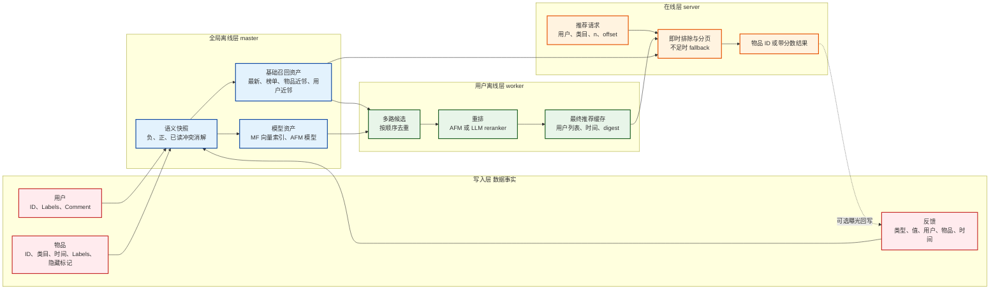
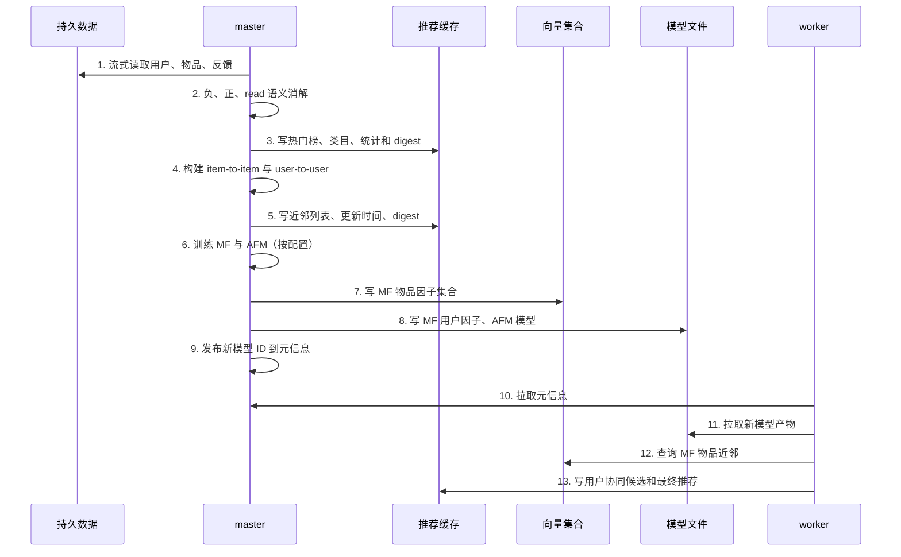
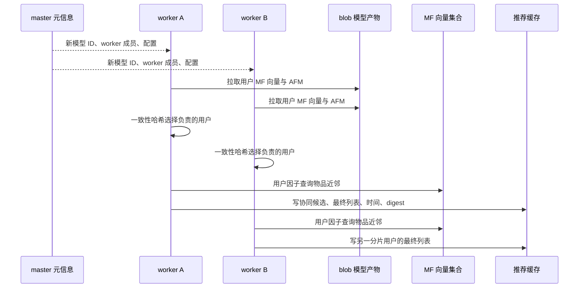
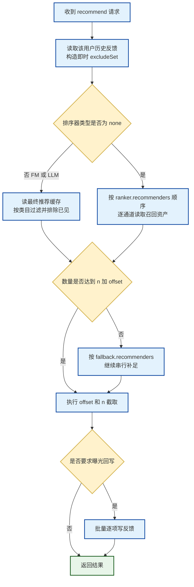

# Gorse 推荐全链路技术解析（实现级）

> 版本基线：v0.5.11（2026-07-14 发布）；实现核对基线：`master` 分支 2026-08-13。本篇只按一条推荐的运行顺序讲解数据、状态、算法、产物和消费关系。文中“缓存”均指推荐链路状态，不把它简化成普通的 HTTP 缓存。

## 阅读方式与结论先行

Gorse 的关键设计不是“收到请求后算一个推荐”，而是把昂贵工作拆为三层：

1. **master 构建全局资产**：从持久数据做行为语义消解，产出榜单、近邻图、训练集、模型和向量索引；
2. **worker 构建用户资产**：按用户分片读取全局资产，召回、合并、重排，写出每个用户的最终列表；
3. **server 做轻量在线决策**：重新应用最新历史排除、类目、分页与 fallback，返回结果并可写回曝光。

因此，理解 Gorse 应始终追问五件事：这个节点的输入是什么？它把什么状态写到哪里？下一节点靠什么键读它？何时判定旧了？失败时在线端还会走哪一条路？

后文每一个主章节都遵循同一套阅读坐标：

- **承接**：上一节点刚刚留下了什么事实或资产；
- **为什么现在做它**：如果不做，这条推荐在哪一步会失效；
- **本节点内部**：数据如何被变换，算法到底作用在哪个对象上；
- **交接**：产物的键、使用者、失效条件以及读者下一章将看到什么。

先不要把 master、worker、server 当成三个抽象名词。可以把它们理解为同一条流水线的三个班次：master 每隔一段时间把全站原始行为加工成公共半成品；worker 把公共半成品加工成每位用户的成品列表；server 在用户请求抵达时对成品做最后一道“不能重复、类目正确、数量足够”的检查。

## 0. 用一个贯穿示例建立运行上下文

从现在起，用同一个小场景解释所有节点。假设资讯产品中有用户 **Alice**，有三篇公开文章：

| 记号 | 业务含义 | 初始属性 | 为什么要准备它 |
|---|---|---|---|
| `U=alice` | 需要推荐的用户 | labels 含 `职业=后端开发`、`兴趣=数据库` | 后续需要把她的 ID、画像和历史行为关联起来。 |
| `A=redis-guide` | Redis 指南 | 技术标签、文本 embedding、类目 `backend`、发布时间 `t1` | Alice 第一次强正反馈的种子物品。 |
| `B=postgres-guide` | PostgreSQL 指南 | 与 A 内容向量相近、同属 `backend` | 理想情况下会因“像 A”而成为候选。 |
| `C=kafka-guide` | Kafka 指南 | 类目也是 `backend`，但内容向量不同 | 可能因热门、相似用户或协同过滤成为候选。 |

业务先写入两条行为：Alice 在 `t2` 阅读 A，值为 1；在 `t3` 收藏 A，值为 1。假设配置规定 `read` 是已读信号，`star` 是正反馈，`dislike` 是负反馈。此刻不要急着问“B 的最终分数是多少”：在刚写入的瞬间，Gorse 还**没有**训练 Alice 的 MF 向量，也还**没有**重算她的最终列表。

刚写完时，系统只有以下事实：

| 状态位置 | 此刻存在什么 | 还不存在什么 |
|---|---|---|
| 持久数据 | Alice、物品 A/B/C、`read(Alice,A)`、`star(Alice,A)` | “Alice 推荐 B/C”的结果。 |
| 用户修改时间 | `last_modify_user_time/alice = t3` | Alice 的新最终推荐更新时间。 |
| 物品修改时间 | `last_modify_item_time/redis-guide = t3` | 因本次反馈改变后的近邻图。 |
| 旧推荐缓存 | 可能有 t2 前的旧列表，也可能为空 | 能反映 t3 收藏的最新成品。 |

这张表是全文最重要的起点：**写反馈只写事实和失效信号；推荐资产由后续班次生成。** 下文的每个术语都可以回到 Alice、A、B、C 这个例子验证它到底在做什么。

## 1. 一张图看完整链路

下图从左到右展示数据如何变成一次 API 返回。实线是主数据流；“更新时间/digest”是控制流，它们不承载候选本身，却决定候选能否继续被使用。

## 2. 数据进入：先落业务事实，尚未开始推荐

**承接。** 上一节只有 Alice、A/B/C 和两条行为事实；现在要解释这些事实为什么必须拆成用户、物品、反馈三种对象。

**为什么现在做它。** 后续所有算法都会问“哪个用户”“哪个物品”“发生了什么行为”。如果一开始就把这些混成一张无语义日志，系统无法区分“物品内容改变”“用户画像改变”和“用户表达偏好”。

### 2.1 先看一次写入到状态变化

以 Alice 收藏 A 为例，`POST /feedback` 的处理顺序是：解析反馈数组 → 校验 `Labels` JSON、Comment 和配额 → 按配置决定是否自动创建缺失用户/物品 → 持久化反馈 → 为所涉用户和物品分别写最后修改时间 → 返回成功数量。

这里最容易误解的一点是“成功”只代表事实已经落库，并不代表推荐已经刷新。若 Alice 在请求刚结束就发起推荐，server 会利用新反馈建立即时排除集；但 B/C 的全局近邻、MF 和最终缓存仍是上一轮离线任务的产物。

### 2.2 用户：特征容器，不是行为事实

| 字段        | 语义            | 被哪些节点使用                                         | 使用时的约束                 |
| --------- | ------------- | ----------------------------------------------- | ---------------------- |
| `UserId`  | 用户的稳定主键       | 反馈聚合、用户 MF 因子、worker 一致性哈希、最终缓存子集键              | 必须长期稳定；换 ID 等于产生一个冷用户。 |
| `Labels`  | 嵌套 JSON 的用户属性 | user-to-user 的 `embedding`/`tags`/`auto`，AFM 特征 | 只放可复用属性；唯一流水号会造成特征稀疏。  |
| `Comment` | 面向文本重排的补充描述   | LLM query 模板可访问                                 | 没有配置模板时不自动影响传统模型。      |

用户 labels 会递归展开。例如对象路径成为以点连接的特征名，字符串是值为 1 的离散特征，数值保留数值，字符串数组展开为多个离散特征。若 Alice 的 labels 同时有职业和兴趣，AFM 看到的不是一段 JSON 字符串，而是“职业相关的离散特征”“兴趣相关的离散特征”等多个可学习输入。训练期间，某标签只有在至少两个用户中出现时才进入用户标签索引：这是一个明确的频率门槛，而非把任意 JSON 全量 one-hot。

### 2.3 物品：同时服务“可见性、过滤、内容相似和排序”

| 字段 | 语义 | 在链路中的精确作用 |
|---|---|---|
| `ItemId` | 物品主键 | 所有召回结果都以它为 `Score.Id`；也是反馈与向量的连接点。 |
| `IsHidden` | 对外隐藏开关 | 不能进入热门榜；在 item-to-item 中可作为查询种子，但不进入供别人命中的公开索引；在线批取物品时会过滤。 |
| `Categories` | 多值类目 | 同一候选可带多个类目；榜单按总榜和每类目维护，在线 `category/categories` 参数过滤缓存记录。 |
| `Timestamp` | 物品业务时间 | `latest` 的排序分数；`item_ttl` 的裁剪基准；不是反馈发生时间。 |
| `Labels` | 结构化内容属性 | 可被表达式取值，生成 tag 特征、embedding 特征，供 item-to-item、AFM 使用。 |
| `Comment` | 自由文本 | 默认搜索列可引用；LLM 的 document 模板通常会使用。 |

一个浮点数组会被识别为 embedding，而不是一串普通数值标签；嵌套路径就是 embedding 名称，例如 `Labels.embedding`。在贯穿示例里，A 和 B 的同名 embedding 维度一致，所以后面 item-to-item 才能问“B 离 A 有多近”。同名 embedding 必须维度一致。数据集构建时每个 embedding 列会选择出现最多的维度，维度不一致的值会被置空，避免 AFM 和近邻索引发生形状错误。

### 2.4 反馈：唯一真正改变用户兴趣的对象

反馈的逻辑键由 `(FeedbackType, UserId, ItemId)` 组成；`Value` 和 `Timestamp` 是其语义的一部分。`POST /feedback` 是追加语义，`PUT /feedback` 是允许覆盖同一逻辑键的写法。无论哪种写入成功，都会更新两类控制键：

| 写入影响对象 | 控制键 | 作用 |
|---|---|---|
| 用户 | `last_modify_user_time/{userId}` | 判断最终用户推荐是否在用户新行为之后生成。 |
| 物品 | `last_modify_item_time/{itemId}` | 支撑资产更新与可观测性；物品更新本身也会更新该键。 |

写入 API 会校验 labels 的 JSON 形态、labels/comment/类目容量以及用户、物品数量配额。`auto_insert_user`、`auto_insert_item` 只决定反馈写入时是否自动创建缺失主对象；它不代表这些新对象立刻有可用的个性化模型因子。

**交接。** 到这里，Gorse 只有原始事实与“谁发生了改变”的时间戳。下一步不是直接执行 BPR、HNSW 或 AFM，而是先给每条反馈定业务语义：对 Alice 的 `read(A)` 和 `star(A)`，到底哪条应当视为喜欢、哪条应当视为负样本、哪条应当把 A 从未来结果中排除。

## 3. 反馈语义分流：把事实翻译成训练和过滤语义

**承接。** Alice 的行为已经落库，但 `read` 与 `star` 只是业务字符串；模型并不知道它们代表“弱接触”还是“强喜欢”。

**为什么现在做它。** 同一条业务事件会同时影响训练样本、召回种子和在线排除。若这一层定义错，后面的 HNSW、MF、AFM 都会在错误数据上正常工作，问题反而更难定位。

### 3.1 三个表达式集合

`recommend.data_source` 中的三个列表是链路的语义根节点。

| 配置 | 含义 | 进入的下游 |
|---|---|---|
| `positive_feedback_types` | 强偏好，例如 `star`、`like`、`read>=3` | CF 的用户—物品正交互、`users` 型 item-to-item、`items` 型 user-to-user、在线 item-to-item 种子、LLM query 历史。 |
| `negative_feedback_types` | 明确拒绝，例如 `dislike` | CTR/AFM 的 -1 样本；所有在线/离线推荐排除；优先级最高。 |
| `read_feedback_types` | 已接触但不足以证明喜欢，例如 `read` | CTR/AFM 的 -1 样本；默认也成为已见物品。 |

表达式可以同时约束类型和值。`read>=3` 的意义不是“名字带 read”，而是只有值达到 3 的 read 事件匹配正例；同样，`read` 还可保留在已读集合中，但会被正例优先级覆盖。

### 3.2 冲突处理的严格顺序

对每个 `(user,item)`，master 在同一轮快照中按下面的顺序处理：

1. 读取命中负反馈表达式的事件，建立负集合和最新时间；
2. 读取命中正反馈表达式的事件；若物品已在负集合，直接跳过；否则在正集合保留最新时间；
3. 读取命中 read 表达式的事件；若已在负集合或正集合，跳过；否则进入 read 集合；
4. 构造训练样本时，负集合标为 -1，正集合标为 +1，剩余 read 集合标为 -1。

所以优先级是 `negative > positive > read`，不是按写入时间覆盖。即使先 like 后 dislike，负反馈仍会阻断该物品出现在候选中；即使先 read 后 like，正反馈仍会从 read 负例集合中移除该物品。回到 Alice：`read(A)` 与 `star(A)` 同时存在时，A 会以正反馈身份进入后续的用户兴趣集合，不会同时作为 AFM 的 read 负样本。

### 3.3 在线排除集合与离线训练集不是同一个东西

每次在线推荐都重新读取用户的全部历史反馈，生成 `excludeSet`：

- 负反馈永远加入；
- 未开启 replacement 时，其他历史反馈也加入；
- 已开启 replacement 时，正/已读历史物品在离线重排前可暂时不加入，但负反馈仍不可返回。

这解释了一个重要现象：用户刚刚点踩后，即使 worker 还没有重算最终缓存，在线层也可在读取缓存结果时排除该物品。它不是实时重排，只是实时纠正“不能展示什么”。

**交接。** 现在 Alice 的全部行为已经变成三份可使用的集合：负集合、正集合、read 集合。它们还在原始数据和内存快照层面，尚未成为“B 与 A 相似”或“Alice 会喜欢 C”的候选。下一章的 master 任务会首次把这些集合加工为全站共享资产。

## 4. master 离线任务：把全站事实加工成公共半成品

**承接。** 输入是已完成语义分流的全站用户、物品和反馈集合；对于 Alice，A 已在正集合中，A/B/C 的内容与类目也都已可读取。

**为什么现在做它。** item-to-item、user-to-user、热门榜和 MF 都需要看到跨用户或跨物品的全局数据，不能在 Alice 的单次 HTTP 请求里临时扫全库。

master 启动后先触发一次任务，随后由定时器反复执行 `runLoadDatasetTask`。同一轮内部的顺序很重要：先做全局资产，再训练模型，最后由 standalone 模式直接生成用户缓存；分布式模式中用户缓存由 worker 接力完成。

### 4.1 快照读取方式：为什么是流式而不是一次性 SQL 结果

master 先估计用户、物品、反馈数量以预分配容器，然后批量流式读取用户和物品。反馈读取会按物品 ID 范围分组并行，避免一个巨大反馈流占用单线程。快照的时间上界是配置当前时间，TTL 则转成物品时间下界或正反馈时间下界。

快照不只服务训练。它同时：

- 为每个非个性化榜单收集“物品 + 该物品反馈列表”；
- 统计有效用户、物品、正负反馈与标签数量；
- 计算类目计数；
- 构建 item-to-item、user-to-user 所需的用户/物品反向反馈列表；
- 生成 CF 和 CTR 两份训练集。

### 4.2 两份训练集的边界

| 数据集 | 记录单位 | 标签 | 特征 | 用途 |
|---|---|---|---|---|
| CF ranking dataset | 用户—物品正交互 | 不存 +1/-1 分类标签，核心是正交互边和时间 | 用户字典、物品字典、每用户/每物品反馈列表 | MF 的 BPR/ALS，以及用户/物品行为相似度。 |
| CTR dataset | 用户—物品样本 | 正为 +1；负和 read 为 -1 | 用户 ID、物品 ID、用户 labels、物品 labels、物品 embeddings | AFM 点击/偏好排序。 |

`positive_feedback_ttl` 会影响正边和训练监督；`item_ttl` 会让过期物品整体离开本轮数据集。二者都不是“物理删除”：原始数据仍留在持久存储，下一轮是否读取由窗口决定。

### 4.3 特征编码的精确规则

AFM 使用统一索引空间，依次放入用户 ID、物品 ID、用户 label、物品 label。一个训练样本的输入不是原始 JSON，而是若干 `(featureIndex, featureValue)`：ID 和离散标签的值为 1，数值 JSON 保留数值。embedding 不与这些标量索引混合，而是以独立 embedding 列送进注意力层和线性投影层。

训练集随机切出 20% 作为 CTR 测试集；CF 的评估会为每个测试用户抽取未交互负样本，与该用户的测试正物品组成候选集，在 Top-K 上计算 NDCG、Precision、Recall。故这两个离线指标回答的问题不同：CF 指标评估“正物品能否排进候选 Top-K”，AUC 评估“已定义的正负样本能否被分类区分”。

## 5. 无模型召回资产（一）：最新与可编程榜单

**承接。** master 已经拿到本轮全站快照。现在先构造不依赖 Alice 专属模型、但任何用户都能复用的候选来源。

**交接。** 本节结束时会得到“最新”和“热门”两类物品列表；它们以后会作为 worker 的候选来源，也会在在线 fallback 中直接使用。

### 5.1 latest 的输入、输出与过滤

`latest` 在请求时从物品数据中按 `Timestamp` 降序读取，不依赖预计算模型。它接收 `cache_size`、类目和 `item_ttl`；输出 `Score`，分数是 Unix 时间戳。随后统一排除集合会过滤已见物品。

它应当作为 fallback 的最后一层：没有正反馈的新用户、模型尚未训练、某类目候选耗尽时仍可返回内容。若业务把 `Timestamp` 错填为导入时间而非内容发布时间，latest 会变成“最近被同步的数据”，这是常见但隐蔽的质量问题。

### 5.2 non-personalized 的计算机制

每个 `non-personalized` 条目有 `name`、`score`、可选 `filter`。master 会先把表达式编译并做返回类型检查：score 必须是数值，filter 必须是布尔值。对每个公开物品执行：

1. 把物品与其反馈数组绑定到表达式环境；
2. filter 为 false 时跳过；
3. 计算 score；
4. 将物品同时推入总榜与每个所属类目的固定大小 Top-K 堆；
5. 合并重复物品的类目元数据，按分数降序写到 `non-personalized/{name}`。

表达式不是 SQL，也不是在请求期间计算。它只在 master 的离线周期计算；所以改变表达式会改变配置 hash，下一轮才产出新榜单。

| 常见目标 | score 思路 | filter 思路 | 需要防止的问题 |
|---|---|---|---|
| 周热榜 | 正反馈计数 | 物品或反馈只保留近 7 天 | 未限制时间会变成总历史榜。 |
| 高质量榜 | 正反馈加权值 | 最少反馈数、物品可见 | 小样本物品被单次高值顶到第一。 |
| 新品榜 | 时效与正反馈组合 | 只保留窗口内物品 | 时间戳单位或时区错误。 |

## 6. 无模型召回资产（二）：item-to-item 的完整链路

**承接。** 只有最新/热门还无法回答“Alice 收藏 A 后，哪篇内容最像 A”。此时输入是 A/B/C 的内容属性或喜欢它们的用户集合。

**交接。** 输出不是 Alice 的推荐，而是一张全局图：每个物品都带有“自己的相似物品列表”。Alice 何时使用这张图，要等到 worker 或 session 请求。

item-to-item 的离线结果键为 `item-to-item/{recommenderName}/{seedItemId}`。它的值是该种子物品的 Top-K 近邻；在线时一个用户的多个正反馈种子会查多个键，将同一候选的分数相加，再重新取 Top-K。

### 6.1 共同骨架：先建索引，再逐物品导出邻居

1. master 为每个 item-to-item 配置创建一个推荐器；
2. 把数据集中的每件物品及其“喜欢此物品的用户索引列表”推入该推荐器；
3. 对每一个物品查询近邻；公开物品查询自身在索引中的近邻，隐藏物品用自身向量查询公开索引；
4. 排除自身，转换距离为 `1/(1+d)`；
5. 条目写入缓存，并同时写入该种子物品的 digest、更新时间；
6. 删除早于本轮快照时间的旧近邻条目。

只有种子物品的缓存为空、digest 不一致、更新时间落后于物品最后修改时间、或者更新周期到期，才需要重建该种子。这样新增少量物品不会强迫所有已有物品每轮都写一遍缓存。

### 6.2 embedding 模式

配置 `type = "embedding"` 时，`column` 是一个在物品环境中执行的表达式。例如它可取某条 embedding 路径。结果必须能转换为同维浮点数组；Gorse 把向量压为 BF16 后加入 HNSW，距离使用欧氏距离。

BF16 不是改变 embedding 的语义，而是在内存索引中减少每维占用。代价是精度降低；收益是能在更大物品量下保留近邻图。维度冲突或表达式执行失败的物品不会进入索引，因而会缺少“作为种子”或“作为邻居”的机会，必须把这当成数据质量告警。

### 6.3 tags、users 与 auto 模式

| 类型 | 索引向量/集合 | IDF 的意义 | 适用信号 |
|---|---|---|---|
| `tags` | `column` 取出的离散标签集合 | 常见标签权重低，罕见标签权重高 | 题材、品牌、主题等稳定内容标签。 |
| `users` | 喜欢该物品的用户集合 | 活跃大户的共现不应压倒小众群体 | 有交互、但内容标签不足。 |
| `auto` | 标签集合与用户集合的组合 | 同时降低常见标签和超级活跃用户的影响 | 内容与行为都可用且质量相近。 |

`users` 和 `auto` 的行为输入来自正反馈集合，所以正负反馈配置改变会使其 hash 改变。把浏览错误设成正反馈会直接改变“喜欢过此物品的人群”，从而污染整个物品近邻图。

### 6.4 HNSW 在这里具体做了什么

Gorse 内置 HNSW 的默认构造参数是：上层最大连接数 48，底层最大连接数 96，构造搜索宽度 `efConstruction=100`；查询宽度未单独设置时取 `max(100, k)`。每个新向量随机采样层级，从顶层入口逐层贪心下降，在每一层用候选队列搜索，再建立双向邻边并裁剪过多连接。

这意味着 item-to-item 的成本不是全量 (O(n^2)) 两两比较，而是“插入索引 + 每物品一次近邻搜索”。近似性会带来召回误差，但也使大规模物品集合可用。输出距离仍会映射为 `1/(1+d)`，因此分数只应在同一 item-to-item 通道内比较；不要把它直接与热门计数或 MF 点积分数相加。

### 6.5 chat 模式：LLM 扩展的是“查询”，不是直接给出物品 ID

chat item-to-item 先将当前物品按 `prompt` 模板渲染，调用兼容 OpenAI 的 chat completion；返回文本可解析为 JSON 数组、CSV 第一列或非空文本行。每条扩展文本再请求 embedding，逐个在已有物品 embedding HNSW 中搜索邻居；结果会按扩展 embedding 与原物品 embedding 的距离加权汇总。

它同时受 chat 和 embedding 的 RPM/TPM 限流。429、504、520 会触发退避重试；其他错误会终止该物品的扩展。这个模式应看作给低描述性的物品补充多个语义查询，而不是取代可靠的结构化 embedding。

## 7. 无模型召回资产（三）：user-to-user 的二跳计算

**承接。** item-to-item 借的是“物品相像”；这一节改为借“用户相像”。输入是全站每位用户的画像或正反馈集合。

**交接。** 先缓存相似用户，不直接缓存物品。后续对于 Alice，系统会再读这些相似用户喜欢过什么，完成第二跳物品聚合。

user-to-user 的缓存键为 `user-to-user/{recommenderName}/{userId}`，值是相似用户及其相似分数。它自身并不直接返回物品；在线/离线合成阶段会读取这些相似用户的正反馈，形成二跳物品候选。

### 7.1 建索引

`embedding` 使用用户 labels 的浮点数组；`tags` 使用用户离散标签的 IDF 集合；`items` 使用用户的正反馈物品集合及物品 IDF；`auto` 合并 tags 与 items。每个用户在 HNSW 中搜索 Top-K 相似用户，距离同样转换为 `1/(1+d)` 并缓存。

### 7.2 二跳聚合

对目标用户 (u)，取相似用户集合 (N(u))。对每位邻居 (v)，读取其正反馈物品 (I_v^+)。未在目标用户排除集内的物品 (i) 累加：

\[
score(i)=\sum_{v\in N(u), i\in I_v^+} sim(u,v)
\]

之后才批量读物品实体，过滤隐藏、过期、类目不匹配的项。这一“先累计 ID，后批量取实体”的顺序避免了对每个邻居做大量单物品读取。

### 7.3 什么时候它会失效

user-to-user 的单用户近邻需要在缓存为空、hash 变化、近邻更新时间早于用户最后修改时间、或者更新间隔触发时重算。对于刚注册但无正反馈的用户，`items` 模式没有有效集合；对于用户画像完整但行为少的用户，`embedding`/`tags` 更有机会提供候选。

## 8. 协同过滤：从正交互到可查询的 MF 候选

**承接。** 此时已有内容相似和人群相似两条无模型路径，但它们仍显式依赖标签、embedding 或共现集合。MF 要从全体正交互中学习更隐含的用户—物品关系。

**交接。** 产物不是一张静态推荐表，而是“用户因子 + 物品因子向量集合”。worker 稍后才会用 Alice 的因子查物品因子近邻。

### 8.1 MF 的目标与可预测性

MF 对 CF 数据集的正交互学习用户因子 (p_u\in\mathbb{R}^k) 和物品因子 (q_i\in\mathbb{R}^k)，预估分数为：

\[
s(u,i)=p_u^Tq_i
\]

训练后，只有训练集中至少有交互的用户/物品被标记为 predictable。新用户没有训练因子，新物品没有训练因子；即使它们存在于数据库，也不会神奇地产生 MF 候选。这是冷启动要保留 latest、榜单、embedding 近邻的根本原因。

### 8.2 BPR：优化“喜欢的排在未喜欢的前面”

BPR 对每个用户采样正物品 (i) 与未观察物品 (j)，希望 (s(u,i)>s(u,j))。可理解为优化：

\[
\log\sigma(s(u,i)-s(u,j))-\lambda\lVert\Theta\rVert^2
\]

Gorse 的 BPR 以随机初始化的用户/物品因子开始，按 epoch 迭代训练，并在验证集上周期性评估 Top-K 指标。它适合隐式正反馈为主的场景，因为它不要求“未交互”真的等于负反馈，只要求正物品在采样的未观察物品前。

### 8.3 ALS：交替优化隐式矩阵

ALS 把用户因子和物品因子交替固定：固定物品因子求每个用户的最优因子，再固定用户因子求每个物品的最优因子。它更偏矩阵分解的最小二乘路线。Gorse 可在超参数搜索时比较 BPR 与 ALS 的验证 NDCG；候选模型的分数超过当前模型时，才会成为下一次训练使用的目标配置。

### 8.4 训练、评估与发布产物

训练不是只存一个二进制模型。完成后有四类产物：

| 产物 | 内容 | 消费者 |
|---|---|---|
| 向量集合 | 所有可预测物品的 MF 因子、类目、隐藏标记、模型版本时间 | worker 对用户因子做近邻搜索。 |
| 用户因子 blob | `userId → MF vector` 的映射 | worker 同步进内存。 |
| 模型元信息 | ID、类型、参数、NDCG/Recall/Precision | master 发布版本，worker 判断是否拉新模型。 |
| 指标时间序列 | CF NDCG、Recall、Precision、最后训练时间 | 仪表盘和质量诊断。 |

物品因子写入向量集合时使用 dot product。worker 查询时不是取全量内积，而是把该用户因子作为查询向量，取 `cache_size + 排除集大小` 个候选，再丢弃排除项，尽量保证过滤后仍有 `cache_size` 个。

## 9. AFM 排序：把不同召回通道的候选放到同一分数尺度

**承接。** 到目前为止，B 可能来自 item-to-item，C 可能来自热门或 MF；这些通道的原始分数含义不同，不能直接比较谁应排第一。

**交接。** AFM 不生成全库候选，它只接收一个有限候选池并输出统一的用户—物品预测分数。真正调用它的是下一章 worker 的用户级任务。

### 9.1 训练样本与特征

AFM 的样本来自 CTR 数据集。正反馈是 +1，显式负和未转正的 read 是 -1。一个样本包含用户 ID、物品 ID、用户 labels、物品 labels、物品 embedding；标签索引共享同一统一特征空间，但 embedding 以独立张量列进入模型。

AFM 同时学习：偏置项、特征线性项、二阶交互 embedding。对物品原始 embedding，模型先做注意力与线性投影，将其对齐到因子维度，再与 FM 交互表示相结合。数值 feature 会自动拟合 scaler；值不全为 1 的特征才被认为是数值特征。

### 9.2 训练过程

1. 初始化特征索引、线性层、交互 embedding 层、每个 embedding 列的注意力与投影层；
2. 在训练集上收集数值特征并拟合 scaler；
3. 将样本补齐为批张量，缺失 embedding 以零向量填充；
4. 每个 batch 计算 logits，使用 BCE-with-logits 损失；
5. 使用 SGD 或 Adam 更新参数并施加权重衰减；
6. 每隔固定 epoch 在测试集计算 AUC、Precision、Recall；
7. loss 或指标为 NaN 时停止；验证 AUC 在 patience 窗口内无提升时早停。

AFM 输出的分数是排序模型对该用户—物品特征组合的值，已不保留原始召回分数。因而启用 FM 后，候选通道的先后顺序主要影响“谁能进入候选池”，而不直接决定最终相对位置。

### 9.3 LLM reranker：不同于 chat item-to-item

`ranker.type="llm"` 的 LLM 使用的是 rerank API，不是 chat item-to-item 的生成 + embedding 流程。worker 取最近 `context_size` 条正反馈，补齐对应物品实体并渲染 `query_template`；候选物品分别渲染 `document_template`；随后向 rerank 服务提交 query、documents、model。响应按候选原始索引返回 relevance score，Gorse 据此重排。

模板设计的核心是区分度：query 应描述用户近期明确的偏好，而 document 应暴露物品的可比较内容。只把 ID 放进模板会使语言重排退化为无意义的格式匹配；把极长全文塞入每个 document 则会把成本和延迟随 `cache_size` 线性放大。

## 10. worker：模型同步、用户分片与最终缓存生成

**承接。** master 已发布公共资产：榜单、近邻缓存、MF 向量集合和可选 AFM/LLM 排序能力。现在才轮到为 Alice 生成她自己的列表。

**交接。** 本章结束时缓存中会出现 `recommend/alice`。它是“截至某个时间、基于某版配置和模型”的成品，但尚未等于 API 最终返回值。

worker 的工作不是训练全局模型，而是把 master 已发布的全局资产转换为每个用户最终列表。每个 worker 周期性从 master 获取元信息和完整配置；发现 MF 或 AFM 模型 ID 变大时，拉取 blob，并在本地安装。

### 10.1 一致性哈希分片

worker 用当前成员构造一致性哈希环，每个 `UserId` 只分配给其中一个 worker。成员变化时会引起部分用户重映射，但不会要求所有用户都重新分配；新负责者根据缓存过期规则决定是否需要计算。分片只影响“哪个 worker 写该用户”，不会改变主数据和召回资产的全局共享语义。

### 10.2 最终缓存的五个失效判断

对用户 (u)，worker 依次检查：

1. `recommend/{u}` 是否为空；为空即重算。
2. `recommend_digest/{u}` 是否存在且等于当前 `RecommendConfig.Hash()`；不一致即重算。
3. `recommend_update_time/{u}` 是否存在；不存在即重算。
4. 更新时间是否已早于 `now - recommend.cache_expire`；是则重算。
5. 用户最后修改时间与推荐更新时间的关系：若用户没有在列表生成后发生更新，只有在 `ranker.cache_expire` 超时后才刷新；若用户在列表生成后发生了更新，则立刻视为旧。

`active_user_ttl` 额外控制是否为长期不活跃用户保留最终缓存：超过期限时会删除该用户最终列表并跳过计算。该机制只节省用户级离线工作，不会删除原始用户或反馈。

### 10.3 候选合并的逐步语义

worker 创建离线 recommender 时，会先按用户历史建立排除集。然后按 `ranker.recommenders` 指定顺序串行执行通道；若为空则使用所有已配置通道。每个通道的返回项一旦被接受就加入排除集，所以：

- 同一物品跨通道只保留第一次出现的位置；
- 先写的通道有候选准入优先权；
- 没有排序器时，这个顺序就是最终排序的重要部分；
- 有 AFM/LLM 时，它主要决定候选池构成，最终顺序由重排器决定。

候选物品会被批量取回实体，缺失物品被丢弃。开启 replacement 时，正/已读历史物品在排序前加入候选，排序后按配置衰减；负反馈不参与 replacement。最后写入 `recommend/{userId}`，并删除同一用户较早时间戳的旧记录。

## 11. 在线普通推荐：读取最终缓存不是“直接返回”

**承接。** worker 可能已经写好 `recommend/alice`，但 Alice 在写入之后可能又看过或点踩了一篇内容，请求也可能限定 `backend` 类目和分页。

**交接。** 本章输出才是 Alice 请求实际收到的物品 ID/分数；可选曝光回写会把这次返回重新送回第 2 节的数据写入入口，形成闭环。

### 11.1 请求参数与输出

`GET /api/recommend/{user-id}` 支持：

| 参数/头 | 作用 | 处理阶段 |
|---|---|---|
| `n` | 请求数量，缺省取 `server.default_n` | 决定最后截取数量。 |
| `offset` | 分页偏移 | 内部先读取 `n+offset`，再截取。 |
| 类目参数 | 指定单个或多个 category | 传给缓存查询，过滤候选所属类目。 |
| `X-API-Version: 2` | 改变响应结构 | 返回含 ID、Score、Categories 的结果；默认仅返回 ID。 |
| `write-back-type` | 本次返回的曝光回写类型 | 返回前为每个结果插入反馈。 |
| `write-back-delay` | 回写时间偏移 | 以本次时间加 delay 作为反馈时间。 |

### 11.2 在线决策树

启用 FM/LLM 时，在线端只把最终缓存看作第一来源；它仍读取最新反馈，因此可覆盖“离线生成与当前请求之间”的新行为。若缓存过滤后不足，fallback 不会调用 AFM/LLM 重新排序，而是按顺序追加指定通道结果。

### 11.3 `ranker.type=none` 时为何仍有在线计算

none 模式没有最终用户缓存作为主来源。在线端会通过 `RecommendSequential` 依次读取指定的召回资产：最新、榜单、协同、item-to-item、user-to-user、external 都可作为名字。每取完一个通道，返回的 ID 立刻进入排除集，达到 `n+offset` 就停止。该模式省去离线重排与用户最终缓存，但把更多合成工作移到请求上，并使“通道顺序”成为强排序策略。

### 11.4 session recommendation：没有持久用户也能走 item-to-item

`POST /api/session/recommend` 接收当前会话的反馈数组而非 userId。流程是：按时间倒序排序请求内反馈；所有已接触 item 进入排除集；仅取匹配正反馈表达式的项作为种子；依次读取第一个 item-to-item 推荐器的近邻，累加同一候选的相似分；实际成功使用到 `context_size` 个种子后停止；取 Top-N。

它不读取用户 MF 因子、不读取最终推荐缓存、不调用 AFM/LLM。它的质量完全依赖事先构建好的 item-to-item 图和客户端上传的会话信号，所以会话中的反馈类型和 `Timestamp` 不能随意伪造。

## 12. external 通道与类目过滤的边界

**承接。** 前面的候选都由 Gorse 的数据与模型生成。本节说明如何把一份外部给出的物品 ID 列表放进同一条候选链，以及它在哪里不能参与。

external recommender 用配置脚本返回一列 item ID。Gorse 在调用时将 userId 传给脚本环境，读取结果后只做排除集过滤；外部返回的 ID 不存在、隐藏或不可见的情况最终会在候选实体核验或在线路径中被消除。external 不支持 category 请求：请求带类目时该通道直接不返回候选。

类目过滤是在 `Score.Categories` 上完成的。榜单、近邻、CF 物品向量、最终缓存都会保存物品类目，因此多数路径无需重新扫描全量物品；但 user-to-user 二跳会在聚合后批量读取实体，确保隐藏、TTL 和类目约束都在最后落地。

## 13. 缓存、digest 与版本：推荐正确性的控制平面

**承接。** 前文反复出现的 `recommend/alice`、近邻列表、模型版本并不是抽象概念；这一节集中列出它们如何命名和如何共同避免旧结果被误用。

### 13.1 关键状态键

| 集合/键前缀 | subset 的含义 | 内容 |
|---|---|---|
| `non-personalized/{name}` | 榜单名 | 总榜及类目榜 `Score`。 |
| `item-to-item/{name}/{item}` | 推荐器名与种子物品 | 该物品的相似物品 Top-K。 |
| `user-to-user/{name}/{user}` | 推荐器名与种子用户 | 相似用户 Top-K。 |
| `collaborative-filtering/{user}` | 用户 | MF 向量检索得到的物品候选。 |
| `recommend/{user}` | 用户 | 多路合并并完成重排后的最终列表。 |
| `*_digest/...` | 与上述资产对应 | 依赖配置的 MD5 摘要。 |
| `*_update_time/...` | 与上述资产对应 | 生成时间。 |
| `last_modify_user_time/{user}` | 用户 | 用户/反馈写入的最新时间。 |
| `last_modify_item_time/{item}` | 物品 | 物品/反馈写入的最新时间。 |

集合的记录都带 `Timestamp`。更新不是直接覆盖一切：先写新时间戳条目，再按 collection、subset、`Before` 条件回收旧条目。这样同一资产在更新过程中有明确的版本时间边界。

### 13.2 digest 覆盖什么，未覆盖什么

热门榜 hash 包含 name、score、filter；item-to-item hash 包含 name、type、column，并在 users 模式纳入正负反馈表达式；user-to-user 的 items 模式同理；CF hash 纳入正负反馈表达式；最终推荐 hash 汇总被选入 ranker 候选的各通道 hash 与 latest 标记。

digest 的职责是发现“算法定义变了”。它不替代数据变更检测：新反馈、用户/物品修改由最后修改时间、训练集大小和定时任务负责。两套机制缺一不可，否则要么配置变了仍用旧资产，要么数据更新却不触发刷新。

## 14. 参数要按链路位置配置，而不是逐项堆砌

**承接。** 参数不会凭空提升质量；每个参数都只改变前文某一个具体节点的输入、候选容量、训练频率或失效时间。

### 14.1 数据语义参数

| 参数 | 直接改变什么 | 调参判断 |
|---|---|---|
| 正/负/read 反馈表达式 | 训练标签、排除集、行为近邻 | 先用业务事件审计验证互斥关系，再开模型。 |
| `positive_feedback_ttl` | 进入正反馈训练的历史长度 | 兴趣变化快则缩短；长周期偏好则加长。 |
| `item_ttl` | 本轮可见物品集合 | 内容过期快时缩短；永久型商品/知识库应谨慎设置。 |
| `context_size` | 在线 item-to-item 和 LLM query 使用的最新正反馈数量 | 太大混合兴趣簇；太小受偶然行为支配。 |

### 14.2 候选容量参数

`recommend.cache_size` 是最常被误解的参数。它同时约束每个榜单、近邻列表、协同过滤候选、最终缓存读取上限和很多在线召回步骤。它不是 API 的 n。若要返回 10 个结果却只给每通道 10 个候选，经过排除、类目过滤和重排后往往不够；若增得太大，LLM reranker 的 documents 数量和缓存体积都会上升。

### 14.3 训练与更新参数

| 参数组 | 控制对象 | 观察信号 |
|---|---|---|
| `collaborative.fit_period/fit_epoch` | MF 重训频率和最大 epoch | NDCG、Recall、Precision 与训练时长。 |
| `collaborative.optimize_period/optimize_trials` | BPR/ALS 与超参数搜索 | 只有长期稳定提升才值得增加 trial。 |
| `ranker.fit_period/fit_epoch` | AFM 重训 | AUC 与线上排序质量，不只看 loss。 |
| 两类 `early_stopping.patience` | 验证指标无提升容忍度 | 太小会早停，太大浪费训练。 |
| `ranker.cache_expire` | 没有新用户行为时的最终列表再刷新周期 | 内容时效性高时缩短。 |

### 14.4 向量和 LLM 参数

MF 向量集合的量化类型可设为空、`sq`、`pq`、`rq`，bits 为 0 时交给向量库默认值。量化降低存储和检索成本，却会损失近邻精度；先以离线 CF 指标确认精度余量再开启。

LLM 相关配置分成两条链：chat item-to-item 需要 chat completion 模型、embedding 模型与各自 RPM/TPM；LLM reranker 需要 `url`、`auth_token`、`model`、query/document 模板。两者不能互相替代，且都应让并发受供应侧配额约束。

## 15. 从一次“喜欢”到下一次返回：完整闭环时序

**承接。** 现在把 Alice 的 `star(A)` 放回整条链路，按时间顺序重新走一遍。这个章节用于把前文按部件讲的内容重新连成一个事件序列。

假设用户 Alice 浏览了物品 X，随后收藏 X：

1. 浏览可以写为 read；收藏写为 positive。若正表达式匹配收藏，下一轮快照中 X 属于正集合而不再是 read 负例。
2. 反馈写入立即更新 `last_modify_user_time/Alice` 与 `last_modify_item_time/X`。
3. 在下一轮 worker 检查中，Alice 的最终列表生成时间早于用户最后修改时间，因此旧；即使没有新模型，也会重算她的候选组合。
4. master 下轮快照将 X 加入 Alice 的 CF 正交互、items 型 user-to-user 集合，也会改变 users 型 item-to-item 的 X 用户集合。
5. 若训练集反馈数变化，MF/AFM 会训练并发布新版本；worker 拉取新 blob，使用新 MF 物品向量集合。
6. Alice 的 item-to-item 候选会从 X 的近邻中得到即时兴趣延续；MF/user-to-user 则可能在更广人群上引入补充候选。
7. worker 合并候选、重排并写最终列表；下一次 API 请求仍会再应用在线排除集和类目。

“实时性”因此分两部分：**不再推荐刚发生的负/已见物品**可由在线排除迅速实现；**让新偏好影响全局近邻和模型**必须等待下一轮离线资产与模型更新。把这两者混为一谈，会错误地期待一次 POST 反馈立即改变所有用户的推荐。

## 16. 逐节点诊断表：结果异常时从哪里开始查

**承接。** 当“为什么没有推荐 B”或“为什么刚点踩还出现”成为线上问题时，不应从模型猜起，而应先定位它本应在哪一个节点产生或被过滤。

| 表现 | 优先检查节点 | 证据/状态 | 最常见根因 |
|---|---|---|---|
| 新用户没有结果 | fallback、latest、榜单 | 是否有公开未过期物品；fallback 是否包含 latest | 把所有通道都配置成依赖正反馈。 |
| 刚点踩仍被返回 | 反馈写入、负表达式、在线 excludeSet | 该事件是否写成功且匹配 `negative_feedback_types` | 类型/值表达式没匹配，或请求走了其他用户 ID。 |
| item-to-item 覆盖低 | column、embedding 维度、种子缓存 | 是否存在 `item-to-item/name/item` 条目 | 路径错、维度不一致、物品隐藏/过期。 |
| user-to-user 候选很少 | 用户正反馈、相似用户缓存 | `user-to-user/name/user` 是否为空 | 用户稀疏、items 模式却没有足够正反馈。 |
| CF 永远为空 | 训练集、MF 模型 ID、向量集合 | 用户/物品是否 predictable；集合是否存在 | 冷启动、正反馈定义错误、模型未训练。 |
| 排序似乎不起作用 | ranker 类型、候选池、特征频次 | 是否有 AFM/LLM 模型版本；候选是否足够 | `none` 模式、cache_size 太小、labels 大量唯一。 |
| 结果旧或与配置不符 | digest、更新时间、TTL | `recommend_digest`、`recommend_update_time` | 配置变更未等到离线周期，或 hash 未覆盖期望字段。 |
| LLM 路径慢/失败 | RPM/TPM、模板、候选数 | chat/embedding/rerank 的请求量 | 候选池过大、模板过长、供应端限流。 |
| 类目请求返回很少 | `Score.Categories`、物品类目 | 候选是否携带目标类目 | 类目字符串不一致或候选池本来不足。 |

## 17. 最终使用原则

1. 先把事件语义定义正确，再增加模型复杂度；错误正例会同时伤害 CF、行为近邻和排序训练。
2. 先确保 latest、榜单、内容近邻能够覆盖冷启动，再依赖 MF 提升个性化。
3. 将 `cache_size` 当作候选池预算而非返回数；它决定召回、排序与 LLM 成本的共同上限。
4. 把“配置变更”交给 digest，把“数据变更”交给最后修改时间与定期任务；两者都要可观测。
5. 在线层应做轻量纠错和降级，不承担全量训练；session recommendation 是即时兴趣的专用捷径，而不是替代持久推荐模型。

沿这条顺序审视 Gorse，任何一条 API 返回都能追溯到：它来自哪种召回资产、经过何种排除与排序、由哪个版本的配置/模型生成，以及下一次反馈会在哪个阶段改变它。
