# Harness Engineering 完整课程

> 来源: [walkinglabs/learn-harness-engineering](https://github.com/walkinglabs/learn-harness-engineering)  
> 整理日期: 2026-05-14  

---

## 目录

1. [第一讲. 模型能力强，不等于执行可靠](Harness_Engineering_完整课程.md#第一讲-模型能力强不等于执行可靠)
2. [第二讲. Harness 到底是什么](Harness_Engineering_完整课程.md#第二讲-harness-到底是什么)
3. [第三讲. 让代码仓库成为唯一的事实来源](Harness_Engineering_完整课程.md#第三讲-让代码仓库成为唯一的事实来源)
4. [第四讲. 把指令拆分到不同文件里](Harness_Engineering_完整课程.md#第四讲-把指令拆分到不同文件里)
5. [第五讲. 让跨会话的任务保持上下文连续](Harness_Engineering_完整课程.md#第五讲-让跨会话的任务保持上下文连续)
6. [第六讲. 让 agent 每次工作前先初始化](Harness_Engineering_完整课程.md#第六讲-让-agent-每次工作前先初始化)
7. [第七讲. 给 agent 划清每次任务的边界](Harness_Engineering_完整课程.md#第七讲-给-agent-划清每次任务的边界)
8. [第八讲. 用功能清单约束 agent 该做什么](Harness_Engineering_完整课程.md#第八讲-用功能清单约束-agent-该做什么)
9. [第九讲. 防止 agent 提前宣告完成](Harness_Engineering_完整课程.md#第九讲-防止-agent-提前宣告完成)
10. [第十讲. 跑通完整流程才算真正验证](Harness_Engineering_完整课程.md#第十讲-跑通完整流程才算真正验证)
11. [第十一讲. 让 agent 的运行过程可观测](Harness_Engineering_完整课程.md#第十一讲-让-agent-的运行过程可观测)
12. [第十二讲. 每次会话结束前都做好交接](Harness_Engineering_完整课程.md#第十二讲-每次会话结束前都做好交接)

---

[English Version →](../../../en/lectures/lecture-01-why-capable-agents-still-fail/)

> 本篇代码示例：[code/](https://github.com/walkinglabs/learn-harness-engineering/blob/main/docs/zh/lectures/lecture-01-why-capable-agents-still-fail/code/)
> 实战练习：[Project 01. 只写提示词让 agent 做，和定好规则再让它做，差多少](./../../projects/project-01-baseline-vs-minimal-harness/index.md)

# 第一讲. 模型能力强，不等于执行可靠

你说你也算见过世面的人了——Claude Pro 订着，GPT-4o 的 API key 也有，SWE-bench 排行榜上的数字你比谁都清楚。有一天你终于想让 AI agent 帮你改一个真实的项目，信心满满地交代下去。结果呢？加了功能但测试挂了，改了 bug 但引入了新 bug，跑了 20 分钟然后自信满满地说"完成了"——你一看代码，根本不是你要的东西。

这时候你的第一反应是什么？"这模型不行，得换一个更贵的。"且慢。先别急着掏钱包。问题可能根本不在模型身上。

让我们先看一组数据。截至 2025 年底，最强的 coding agent 在 SWE-bench Verified 上的通过率大约在 50-60%。这还是精心挑选过的、有明确 issue 描述和测试用例的任务。换到你日常开发的场景——需求模糊、没有现成测试、隐含的业务规则散落在各处——这个数字只会更低。

但这组数据背后藏着一个反直觉的事实。

## 同一匹马，两种命运

Anthropic 做过一个对照实验。同一个 prompt（"做一个 2D 复古游戏编辑器"），同一个模型（Opus 4.5）。第一次让它裸跑——20 分钟，花了 $9，游戏核心功能根本跑不起来。第二次给它配上完整的 harness（planner + generator + evaluator 三 agent 架构）——6 小时，花了 $200，游戏可以正常游玩。

模型没换。Opus 4.5 还是那个 Opus 4.5。换的是马鞍。

OpenAI 在 2025 年发布的 harness engineering 文章里说得更直白：Codex 在一个 harness 搭得好的仓库里，表现能从"不可靠"变成"可靠"。注意他们的用词——不是"好了一点"，是质变。就像一匹千里马，没马鞍你也能骑，但骑不了多远、跑不了多快、摔下来也不稀奇。harness 就是那个马鞍——**模型权重之外的一切工程基础设施**。

## agent 到底卡在哪

那具体是什么在出问题？

最常见的：你根本没把任务说清楚。你说"加个搜索功能"，agent 理解的跟你完全不一样——搜什么？全文本还是结构化？要不要分页？要不要高亮？你没说清楚，agent 就自己猜。猜对了是运气，猜错了你再改，改的成本比一开始说清楚还高。这就像你去饭馆跟师傅说"来个鱼"，端上来是红烧还是清蒸还是酸菜——全看运气。

就算你说清了，项目里隐含的架构约定 agent 也不知道。你们团队统一用 SQLAlchemy 2.0 的新语法，但 agent 默认写了 1.x 的代码。所有 API 端点必须走 OAuth 2.0 认证，但这个规则只存在于你脑子里和一个三个月前的 Slack 消息里。Agent 看不到这些——它不是不想遵守，是压根不知道有这回事。

环境也是个坑。开发环境配置不完整、依赖缺了、工具版本不对。Agent 把宝贵的上下文窗口花在了 `pip install` 失败、Node 版本不对这些事上，而不是解决你的核心任务。就好比你让一个木匠来干活，结果锤子没带、钉子找不到、工作台还是歪的——手艺再好也使不上劲。

更常见的：压根没有验证手段。没有测试、没有 lint、或者验证命令根本没告诉 agent。Agent 写完代码，自己看了看觉得没问题，就说完成了。这就像让学生交作业但不给答案检查——他自己觉得自己做对了，但批改的时候一堆错误。Anthropic 还观察到一个有意思的现象：当 agent 感觉上下文快满了，它们会匆忙结束当前工作，跳过验证步骤，选一个简单的方案而不是最优方案。他们把这叫"上下文焦虑"——跟你考试时发现时间快到了赶紧随便选几个选择题是一回事。

长任务跨会话就更惨了——上次会话的发现全丢了，每个新会话都得重新探索项目结构、理解代码组织。缺乏持久化状态的 agent 在超过 30 分钟的任务中失败率急剧上升。

## 关键名词解释

理解了上面的场景，这些概念就不再是一堆术语了：

- **能力鸿沟（Capability Gap）**：模型在基准测试上的表现和真实任务上的表现之间的巨大落差。SWE-bench Verified 上 50-60% 的通过率意味着近一半的真实 issue 解不了。
- **Harness**：模型之外的一切——指令、工具、环境、状态管理、验证反馈。不是模型权重的部分，全是 harness。也就是我们说的"马鞍"。
- **Harness 诱导失败**：模型本身能力足够，但因为执行环境有结构性缺陷而失败。Anthropic 的对照实验已经证明了这一点。
- **验证缺口**：agent 对自己输出的信心评估和实际正确性之间的偏差。agent 说"我做完了"但实际没做完——这是最常见的失败模式。
- **诊断循环**：执行 → 观察失败 → 定位到 harness 的哪一层出了问题 → 修补那一层 → 重新执行。这是 harness 工程的核心方法论。
- **完成定义（Definition of Done）**：一组可以用命令验证的条件——测试通过、lint 没报错、类型检查通过。没有显式的完成定义，agent 就会自己编一个。

## 遇到失败，先修 harness

核心原则：**遇到失败，先别换模型，先检查 harness。** 如果同一个模型在类似的结构良好的任务中能成功，那优先假设是 harness 的问题。这就像汽车抛锚——你不会第一时间怀疑是发动机坏了，你会先看看是不是没油了。

具体怎么做：

**每次失败都归因到具体层。** 不要笼统地说"模型不行"，而是问：是任务没说清楚？是上下文不够？是没有验证手段？把每次失败归到五层防御（任务规范、上下文供给、执行环境、验证反馈、状态管理）中的某一层。养成这个习惯，你会发现"模型不行"这个结论在你的日志里出现得越来越少。

**给每个任务写显式的完成定义。** 不要说"加个搜索功能"，要说：
```
完成标准：
- 新增 GET /api/search?q=xxx 端点
- 支持分页，默认 20 条
- 返回结果包含高亮片段
- 所有新代码通过 pytest
- 类型检查通过（mypy --strict）
```

**创建 AGENTS.md 文件。** 在仓库根目录放一个文件，告诉 agent 这个项目的技术栈、架构约定、验证命令。这是 harness 工程的第一步，也是投入产出比最高的一步。一个 `AGENTS.md` 文件可能比你换一个更贵的模型更有效——我不是在开玩笑。

**建立诊断循环。** 不要把失败当作"模型又犯傻了"，而是当作"harness 又暴露了一个缺陷"的信号。每次失败 → 定位层 → 修补 → 下次不再犯。几轮下来，你的 harness 会越来越强，agent 的表现会稳定提升。就像修路——每填一个坑，下一段路就更平坦。

**量化改进。** 记个简单的日志：每个任务成功了没有，失败了是哪一层的问题。跑几轮之后你就能看出来哪个层是瓶颈，集中火力修那个层。

## 一百万行代码的实验

OpenAI 在 2025 年做了一个激进的实验：用 Codex 从一个空的 git 仓库起步，构建一个完整的内部产品。五个月后，这个仓库有大约 100 万行代码——应用逻辑、基础设施、工具、文档、内部开发工具——全部由 agent 生成。三个工程师驱动 Codex，开了大约 1,500 个 PR 并合并。平均每人每天 3.5 个 PR。

这个实验的关键约束是：**人类永远不直接写代码。** 这不是噱头，而是为了逼团队搞清楚——当工程师的主要工作不再是写代码，而是设计环境、表达意图、构建反馈回路时，到底什么变了？

早期进展比预期慢。不是 Codex 不行，而是环境不够完整——agent 缺少必要的工具、抽象和内部结构来推进高层次目标。工程师的工作变成了：把大目标拆成小积木（设计、编码、审查、测试），让 agent 去搭建，然后用这些积木解锁更复杂的任务。当某件事失败了，修复几乎从来不是"更努力"，而是"agent 缺什么能力，怎么让它既可理解又可执行"。

这个实验直接证明了本讲的核心论点：**同一个模型，在空白环境里和在有完整 harness 的环境里，产出有本质差异。** 模型没变，变的是环境。

> 来源：[OpenAI: Harness engineering: leveraging Codex in an agent-first world](https://openai.com/index/harness-engineering/)

## 一个更接地气的例子

一个团队用 Claude Sonnet 给一个中等规模的 Python Web 应用（FastAPI + PostgreSQL + Redis，约 15,000 行代码）添加新的 API 端点。

起初他们只给了一句话："在 `/api/v2/users` 下添加用户偏好设置端点"。结果呢？agent 花了 40% 的上下文窗口探索仓库结构，产出了看似合理的代码但没遵循项目的错误处理模式，用了旧版 SQLAlchemy 语法，宣称完成但端点实际有运行时错误。下一个会话还得重新做发现工作。

后来他们加了 `AGENTS.md`（描述项目架构和技术栈版本）、显式的验证命令（`pytest tests/api/v2/ && python -m mypy src/`）、和架构决策记录。同一模型在三次独立运行中全部成功，上下文使用效率提高了约 60%。

模型没变。变的还是 harness。

## 带走什么

- 模型能力和执行可靠性是两回事。千里马也得配上好马鞍。
- 失败的时候先看 harness，再看模型。换模型是成本最高的选择——而且很多时候根本不是模型的问题。
- 每次失败都是一个信号：你的 harness 有结构性缺陷。把它找出来、修掉。
- 五层防御：任务规范、上下文供给、执行环境、验证反馈、状态管理。逐层排查，就像医生看病先检查最常见的病因。
- 一个 `AGENTS.md` 文件可能比你换一个更贵的模型更有效。真的。

## 延伸阅读

- [OpenAI: Harness Engineering — Leveraging Codex in an Agent-First World](https://openai.com/index/harness-engineering/)
- [Anthropic: Effective Harnesses for Long-Running Agents](https://www.anthropic.com/engineering/effective-harnesses-for-long-running-agents)
- [HumanLayer: Skill Issue — Harness Engineering for Coding Agents](https://humanlayer.dev/articles/harness-engineering-for-coding-agents/)
- [SWE-bench Leaderboard](https://www.swebench.com/)
- [Thoughtworks Technology Radar: Harness Engineering](https://www.thoughtworks.com/radar)

## 练习

1. **对比实验**：选一个你熟悉的代码仓库和一项非平凡的修改任务。先不给任何 harness 支持，让 agent 跑一次，记录失败。然后加一个 `AGENTS.md` 和显式的验证命令，让同一个 agent 再跑一次。对比两次的结果，把失败归因到五层防御中的某一层。

2. **验证缺口测量**：选 5 个编码任务，在每个任务完成后记录 agent 是否声称完成，然后用独立测试验证实际正确性。计算 agent 在实际没完成时声称完成的比例——这就是你的验证缺口。然后想想：加什么验证命令能把这个比例降下来？

3. **诊断循环实践**：找一个 agent 在你的项目中反复失败的任务。跑一次，记录失败。归因到五层中的某一层。修那一层。再跑。重复三到五轮，记录每一轮的改善。

---

[English Version →](../../../en/lectures/lecture-02-what-a-harness-actually-is/)

> 本篇代码示例：[code/](https://github.com/walkinglabs/learn-harness-engineering/blob/main/docs/zh/lectures/lecture-02-what-a-harness-actually-is/code/)
> 实战练习：[Project 01. 只写提示词让 agent 做，和定好规则再让它做，差多少](./../../projects/project-01-baseline-vs-minimal-harness/index.md)

# 第二讲. Harness 到底是什么

"harness"这个词在 AI coding agent 的圈子里被用得越来越多了，但说实话，大部分人说的 harness 其实就只是"一个 prompt 文件"。这不是 harness。就像你开了一家餐厅，只有食材——没有灶台、没有刀具、没有菜谱、没有出菜流程——那不叫餐厅，那叫冰箱。

这节课要给你一个精确的、可操作的 harness 定义。不是学术论文里的抽象概念，而是你今天就能拿去用的框架：harness 由五个子系统组成，就像一个完整厨房里的五个功能区——菜谱架、刀具架、灶台、备菜台、和出菜检查口。每个子系统都有明确的职责和评判标准。

## 先讲一个类比

想象你是一个刚入职的工程师，被丢进一个没有任何文档的项目里。没有 README，代码里没有注释，没有人告诉你怎么跑测试，CI 配置文件藏在某个角落里。你能写出好代码吗？也许能——如果你足够聪明又足够有耐心。但你会花大量时间在"搞清楚这个项目是怎么回事"上，而不是在"解决问题"上。

AI agent 面对的困境一模一样。而且更糟——你至少可以问同事，agent 只能看到你放在它面前的文件和它能执行的命令。它不能拍拍同事的肩膀问"哎，这个项目的 ORM 用的是哪个版本？"

OpenAI 在他们的 harness engineering 文章里把 harness 的核心原则表述为"仓库即规范"——所有必要的上下文都应该在仓库里，通过结构化的指令文件、明确的验证命令和清晰的目录组织来呈现。Anthropic 的 long-running agents 文档则更侧重状态持久化、显式恢复路径和结构化的进度跟踪。两家公司的侧重点不同，但都在说同一件事：**模型之外的一切工程基础设施，决定了模型能力能被发挥多少。**

看看几个你熟悉的工具：

**Claude Code** 的设计就体现了 harness 思想。它会读你仓库里的 `CLAUDE.md`（菜谱架），能用 shell 跑命令（刀具架），在你的本地环境里执行（灶台），有会话历史（备菜台），能跑测试看结果（出菜检查口）。但如果你不告诉它怎么跑测试，出菜检查口就是断的——菜做没做熟谁也不知道。

**Cursor** 也是类似的逻辑。它的 `.cursorrules` 文件是菜谱架，终端是刀具架，它能读你的项目结构和 lint 配置是灶台。但 Cursor 的状态管理相对弱——你关掉 IDE 再打开，上次的上下文就没了。

**Codex**（OpenAI 的 coding agent）用 git worktree 隔离每个任务的运行环境，配合本地的可观测性栈（日志、指标、追踪），让每个变更都在独立的环境中验证。它在有 `AGENTS.md` 和清晰验证命令的仓库里，表现远超在"裸"仓库里。

**AutoGPT** 则是反面教材——缺乏结构化的状态管理导致长任务中上下文不断累积，缺乏精确的反馈机制导致 agent 陷入循环。很多人说 AutoGPT "不行"，但其实是它的 harness 不行——你给它一个破灶台，再好的食材也做不出菜来。

## 核心概念

- **什么是 harness**：模型权重之外的一切工程基础设施。OpenAI 把工程师的核心工作概括为三件事：设计环境、表达意图、构建反馈循环。Anthropic 直接把 Claude Agent SDK 称为"通用 agent harness"。
- **仓库是唯一事实来源**：agent 看不到的东西，对它来说就不存在。OpenAI 把仓库当作"记录系统"——所有必要的上下文都必须在仓库里，通过结构化的文件和清晰的目录组织来呈现。
- **给地图，不给说明书**：OpenAI 的经验——`AGENTS.md` 应该是目录页，不是百科全书。100 行左右就够了，放不下就拆分到 `docs/` 目录里，让 agent 按需去读。
- **约束而非微操**：好的 harness 用可执行的规则来约束 agent，而不是在指令里逐条叮嘱。OpenAI 说"执行不变量，不要微管实现"；Anthropic 发现 agent 会自信地夸赞自己的工作，解决方案是把"干活的人"和"检查的人"分开。
- **逐个组件拆除法**：想量化 harness 各组件的价值，就逐个移除，看哪个移除后性能下降最多。Anthropic 用这个方法发现：随着模型变强，某些组件不再关键，但总会有新的关键组件出现。

## Harness 五子系统模型

回到厨房的类比。一个完整的厨房有五个功能区，harness 也有五个子系统：

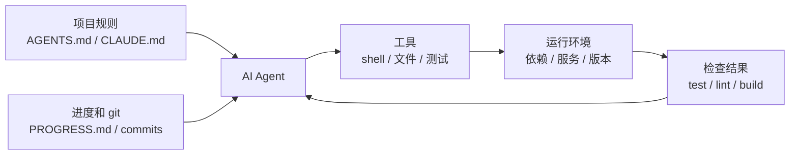

**指令子系统（菜谱架）**：创建 `AGENTS.md`（或 `CLAUDE.md`），内容包括项目概览和目的（一句话说清楚这是什么）、技术栈和版本（Python 3.11、FastAPI 0.100+、PostgreSQL 15）、首次运行命令（`make setup`、`make test`）、不可违反的硬约束（"所有 API 必须走 OAuth 2.0"）、指向更详细文档的链接。

**工具子系统（刀具架）**：确保 agent 有足够的工具访问权限。不要因为"安全考虑"把 shell 给禁了——agent 连 `pip install` 都跑不了，还怎么干活？但也别什么都开放，按最小权限原则来。

**环境子系统（灶台）**：让环境状态自描述。用 `pyproject.toml` 或 `package.json` 锁定依赖，用 `.nvmrc` 或 `.python-version` 指定运行时版本，用 Docker 或 devcontainer 让环境可重现。

**状态子系统（备菜台）**：长任务必须有进度跟踪。用一个简单的 `PROGRESS.md` 文件记录：哪些做完了，哪些在做，哪些被阻塞。每个会话结束前更新，下一个会话开始时读取。

**反馈子系统（出菜检查口）**：这是投入产出比最高的子系统。在 `AGENTS.md` 里显式列出验证命令：
```
验证命令：
- 测试：pytest tests/ -x
- 类型检查：mypy src/ --strict
- Lint：ruff check src/
- 完整验证：make check（包含以上全部）
```

五个子系统缺一个，就像厨房里少了一个功能区——菜还是能做，但总是别扭。

**诊断 harness 质量的方法**：用"等模型对照实验"。保持模型不变，逐个移除五个子系统，看哪个子系统缺失时性能下降最多。那个就是你的瓶颈——集中精力加强它。就像找厨房的瓶颈一样：把菜谱架拿走看看出菜速度降多少，把灶台关掉看看影响多大。

## 一个团队的真实经历

一个团队用 GPT-4o 开发一个 TypeScript + React 前端应用（约 20,000 行代码）。他们经历了四个阶段——其实就是在一件一件地添置厨具：

**阶段 1——空厨房**：只有 README 里的基本项目描述。5 次运行成功 1 次（20%）。主要失败：选错了包管理器（npm vs yarn）、没遵循组件命名约定、跑不了测试。

**阶段 2——装上菜谱架**：添加 `AGENTS.md`，写明技术栈版本、命名约定、关键架构决策。成功率升到 60%。剩余失败主要来自环境问题和验证缺失。

**阶段 3——开起出菜检查口**：在 `AGENTS.md` 里列出验证命令 `yarn test && yarn lint && yarn build`。成功率升到 80%。

**阶段 4——备菜台就位**：引入进度文件模板，agent 在每次运行中记录完成和未完成的工作。成功率稳定在 80-100%。

四次迭代，模型一个字没改，成功率从 20% 到接近 100%。这就是 harness 工程的力量。你没有换更贵的食材，你只是把厨房收拾利索了。

## 关键要点

- Harness = 指令 + 工具 + 环境 + 状态 + 反馈。五个子系统，就像厨房的五个功能区，缺一不可。
- 不是模型权重的部分全是 harness。你的 harness 决定了模型能力能被发挥多少。
- 五个子系统中，反馈子系统通常是投入最少、回报最高的。先把验证命令写清楚——出菜检查口是最值得先装的。
- 用"等模型对照实验"量化各子系统的边际贡献，别凭感觉。
- Harness 和代码一样会腐化。定期审计，像还技术债一样还 harness 债。

## 延伸阅读

- [OpenAI: Harness Engineering](https://openai.com/index/harness-engineering/)
- [Anthropic: Effective Harnesses for Long-Running Agents](https://www.anthropic.com/engineering/effective-harnesses-for-long-running-agents)
- [HumanLayer: Harness Engineering for Coding Agents](https://humanlayer.dev/articles/harness-engineering-for-coding-agents/)
- [SWE-agent: Agent-Computer Interfaces](https://github.com/princeton-nlp/SWE-agent)
- [Thoughtworks: Harness Engineering on Technology Radar](https://www.thoughtworks.com/radar)

## 练习

1. **Harness 五元组审计**：拿你正在用 AI agent 的项目，按五元组框架做一个完整审计。每个子系统打 1-5 分。找出最低分的那个子系统，花 30 分钟改进它，然后观察 agent 的表现变化。

2. **等模型对照实验**：选一个模型和一个有挑战性的任务。依次移除指令（删掉 AGENTS.md）、移除反馈（不给验证命令）、移除状态（不提供进度文件），每次只移除一个，测量性能下降幅度。基于结果，排出各子系统对你项目的重要性排名。

3. **可供性分析**：找一个 agent 在你的项目中"想做但做不了"的场景（比如知道要用参数化查询但不知道你项目的 ORM 怎么写）。分析这是执行鸿沟（不知道怎么操作）还是评估鸿沟（不知道做得对不对），然后设计 harness 改进来弥补。

---

[English Version →](../../../en/lectures/lecture-03-why-the-repository-must-become-the-system-of-record/)

> 本篇代码示例：[code/](https://github.com/walkinglabs/learn-harness-engineering/blob/main/docs/zh/lectures/lecture-03-why-the-repository-must-become-the-system-of-record/code/)
> 实战练习：[Project 02. 让 agent 看懂项目、接住上次的工作](./../../projects/project-02-agent-readable-workspace/index.md)

# 第三讲. 让代码仓库成为唯一的事实来源

你团队的架构决策散落在 Confluence、Slack、Jira、和几个资深工程师的脑子里。对人类来说这勉强够用——你可以问同事、搜聊天记录、翻文档。实在不行还能去茶水间堵人。但对 AI agent 来说，不在仓库里的信息等于不存在。

这不是夸张。想想 agent 的输入都有什么：系统提示和任务描述、仓库里的文件内容、以及工具执行的输出。就这三样。你的 Slack 历史、Jira 工单、Confluence 页面、和周五下午跟同事在茶水间聊的架构决定——agent 全都看不到。它不能"去问一下"，也不能"搜一下聊天记录"。它就是一个被关在仓库里的工程师——仓库外面的事，它一概不知。

所以问题变成了：你给不给这个工程师一张好地图？

## 地图上该画什么

OpenAI 在他们的 harness engineering 文章里把这个问题说得非常直白：**仓库里不存在的信息，对 agent 来说等于不存在。** 他们把这称为"仓库即规范"原则——仓库本身就是最高权威的规范文档。

Anthropic 的 long-running agents 文档也强调了类似的观点：持久化状态是长任务连续性的必要条件。跨会话的知识可恢复性直接决定了任务成功率。而这些状态必须存在于仓库中——因为那是 agent 唯一稳定可访问的存储。

你可能会想："我们团队人少，知识都在大家脑子里，这不也工作得好好的吗？"没错，对人类来说确实可以。但你要用 agent，就得接受一个事实：agent 不能问人。所有它需要知道的东西，都必须写下来，放在它能找到的地方。

这不是"写更多文档"的问题。这是"把决策信息放到正确的位置"的问题。一份在 `src/api/` 目录下、50 行的 `ARCHITECTURE.md`，比一份在 Confluence 里、500 页但没人维护的设计文档有用一万倍。就好比一张贴在你工位上的、手画的办公室走法图，比一份精美的、放在档案室里的建筑蓝图实用得多——因为前者在你需要的时候就在手边。

## 知识可见性

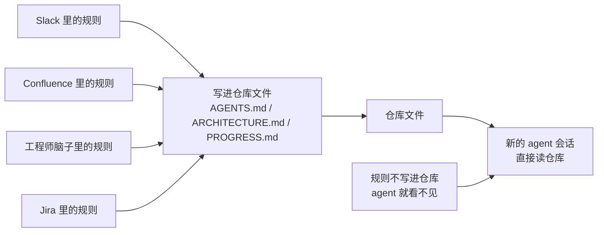

怎么检验你的地图画得够不够好？做一个"冷启动测试"：开一个全新的 agent 会话，只看仓库内容，看它能不能回答五个基本问题：

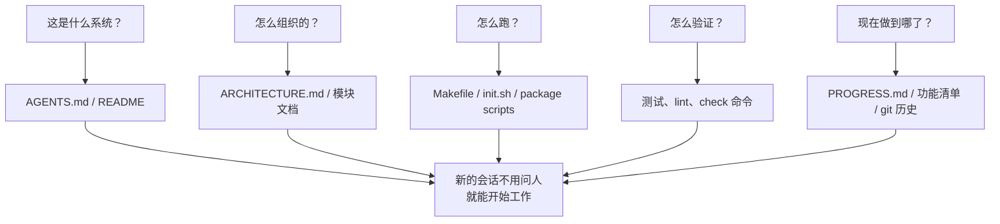

如果它答不上来，说明地图上有空白。空白的地方，agent 就得自己猜——猜错了就是 bug，猜多了就浪费上下文。每个新会话都要猜一遍，猜的成本远高于一开始就把地图画好的成本。

## 核心概念

- **知识可见性缺口**：项目总知识中不在仓库里的比例。缺口越大，agent 失败的概率越高。你脑子里有多少关于这个项目的隐性知识？把它们全算上，再看有多少写进了仓库——两者的差距就是你的可见性缺口。
- **系统记录（System of Record）**：代码仓库作为项目决策、架构约束、执行状态和验证标准的权威信息源。仓库说了算，别的地方说了不算。就像地图上标注了"此路不通"，你就不会再往那条路走——但如果这个信息只在老张的脑子里，你每次都得问老张。
- **冷启动测试**：上一节说的五个问题。能回答几个，你的地图就画了几分。
- **发现成本**：agent 为了在仓库里找到一条关键信息需要消耗多少上下文。信息放得越隐蔽，发现成本越高，留给实际任务的预算越少。把关键信息藏在十层目录深处的 README 里，就像把灭火器锁在地下室的保险柜里——不是没有，是用的时候找不到。
- **知识衰减率**：仓库中单位时间内变得过时的知识条目比例。文档和代码脱节是最大的敌人——比没有文档更危险的是过时的文档。
- **ACID 类比**：把数据库的事务管理原则（原子性、一致性、隔离性、持久性）用到 agent 的状态管理上。后面会展开讲。

## 怎么画好这张地图

**原则 1：知识靠近代码。** 一条关于 API 端点认证的规则，应该放在 API 代码旁边，而不是藏在一个巨大的全局文档里。每个模块目录下放一个简短的文档，说清楚这个模块的职责、接口和特殊约束。就像图书馆的书架标签——你想找历史类书籍，直接去标着"历史"的书架，不用把整个图书馆翻一遍。

**原则 2：用标准化的入口文件。** `AGENTS.md`（或 `CLAUDE.md`）是 agent 的"着陆页"。它不需要包含所有信息，但必须能让 agent 快速回答"这是什么项目"、"怎么跑"、"怎么验证"这三个问题。50-100 行就够了。

**原则 3：最小但完备。** 每条知识都应该有明确的使用场景。如果你删掉某条规则不影响 agent 的决策质量，那这条规则就不应该存在。但冷启动测试中的每个问题都必须有答案。这是一个精妙的平衡——不多不少，刚好够用。

**原则 4：和代码一起更新。** 把知识更新跟代码变更绑定在一起。最简单的方法：把架构文档放在对应的模块目录里。改代码的时候自然会看到文档，改代码之后 CI 提醒你检查文档是否需要更新。

**具体的仓库结构**：

```
project/
├── AGENTS.md              # 入口：项目概览、运行命令、硬约束
├── src/
│   ├── api/
│   │   ├── ARCHITECTURE.md  # API 层的架构决策
│   │   └── ...
│   ├── db/
│   │   ├── CONSTRAINTS.md   # 数据库操作的硬约束
│   │   └── ...
│   └── ...
├── PROGRESS.md             # 当前进度：做了什么、在做什么、被什么阻塞
└── Makefile                # 标准化的操作命令：setup、test、lint、check
```

## 用 ACID 原则管理 agent 状态

这个类比来自数据库的事务管理——你可能觉得这是在把简单的事情搞复杂，但实际上它给了你一个非常实用的框架：

- **原子性**：每次"逻辑操作"（比如"添加新端点并更新测试"）用一个 git commit 原子化。中途挂了就 `git stash` 回滚。要么全做，要么不做，没有"做了一半"。
- **一致性**：定义"一致状态"的验证谓词——所有测试通过、lint 无报错。Agent 每次操作后跑验证，不一致的中间状态不要 commit。就像银行转账——你不能只扣款不入账。
- **隔离性**：多个 agent 并发工作时，状态文件要避免竞争条件。简单方案：每个 agent 用独立的进度文件，或者用 git 分支隔离。两个厨师不能同时往同一口锅里放盐——放重了谁负责？
- **持久性**：关键的项目知识用 git 跟踪的文件持久化。临时状态可以只在会话内存里，但跨会话必须的知识必须写到文件里。脑子里的不算，写在纸上的才算。

## 一个真实的改造故事

一个团队维护一个包含约 30 个微服务的电商平台。架构决策（服务间通信协议、数据一致性策略、API 版本化规则）散落在：Confluence（部分过时）、Slack（难以搜索）、几个资深工程师的脑子里（不可扩展）、以及零星的代码注释（不系统）。

引入 AI agent 后，70% 的任务需要人工干预。几乎每次失败都涉及 agent 违反了某个"所有人都知道但从未写入仓库"的隐性约束。这就像一个新来的员工，没人告诉他"中午点外卖要在群里接龙"——他自己猜，猜错了被骂，但骂完了还是没人告诉他规则。

团队执行了改造：
1. 仓库根目录创建 `AGENTS.md`，写明项目概览、技术栈版本、全局硬约束
2. 每个微服务目录下添加 `ARCHITECTURE.md`，描述该服务的职责、接口和依赖
3. 创建集中的 `CONSTRAINTS.md`，用"禁止/必须"的明确语言记录硬约束
4. 每个服务目录添加 `PROGRESS.md`，记录当前工作状态

改造后：同一 agent 能在冷启动时回答所有关键项目问题，任务完成质量显著提升。

## 关键要点

- 不在仓库里的知识对 agent 来说等于不存在。把关键决策信息放进仓库是最基本的 harness 投资——画好地图，才不会迷路。
- 用"冷启动测试"检验仓库质量：全新会话能不能只看仓库回答五个基本问题。
- 知识要靠近代码、最小但完备、跟代码一起更新。不是写更多文档，是把信息放到正确的位置。
- 用 ACID 原则管理 agent 状态：原子提交、一致性验证、隔离并发、持久化关键知识。
- 知识衰减是最大敌人。过时的文档比没有文档更危险——它会让 agent 走错方向还以为自己是对的。

## 延伸阅读

- [OpenAI: Harness Engineering](https://openai.com/index/harness-engineering/)
- [Anthropic: Effective Harnesses for Long-Running Agents](https://www.anthropic.com/engineering/effective-harnesses-for-long-running-agents)
- [Infrastructure as Code — Martin Fowler](https://martinfowler.com/bliki/InfrastructureAsCode.html)
- [ADR: Architecture Decision Records](https://adr.github.io/)
- [The Twelve-Factor App](https://12factor.net/)

## 练习

1. **冷启动测试**：在你的项目里开一个全新的 agent 会话（不提供任何口头上下文），只让它看仓库内容，然后问它五个问题：这是什么系统？怎么组织的？怎么运行？怎么验证？现在进度如何？记录它答不上来的问题，然后改进仓库让它能答上来。

2. **知识外置化量化**：列出你的项目中所有对开发工作重要的决策和约束。标注每个条目是在仓库内还是仓库外。算一下你的知识可见性缺口有多大（不在仓库里的占总数的比例）。制定计划把缺口降到 10% 以下。

3. **ACID 准则评估**：用本讲的 ACID 类比评估你的项目状态管理。原子性——agent 的操作能不能干净地回滚？一致性——仓库有没有"一致状态"的验证？隔离性——多 agent 并发时会不会互相踩脚？持久性——跨会话的知识是不是都持久化了？

---

[English Version →](../../../en/lectures/lecture-04-why-one-giant-instruction-file-fails/)

> 本篇代码示例：[code/](https://github.com/walkinglabs/learn-harness-engineering/blob/main/docs/zh/lectures/lecture-04-why-one-giant-instruction-file-fails/code/)
> 实战练习：[Project 02. 让 agent 看懂项目、接住上次的工作](./../../projects/project-02-agent-readable-workspace/index.md)

# 第四讲. 把指令拆分到不同文件里

你开始认真对待 harness 了——好事。你建了个 `AGENTS.md`，把你能想到的所有规则、约束、历史教训都塞了进去。一个月后这个文件膨胀到了 300 行，两个月 450 行，三个月 600 行。然后你发现 agent 的表现反而变差了——改一个小 bug，agent 花大量上下文处理无关的部署指令；关键的安全约束埋在第 300 行，被直接忽略了；文件里有三条互相矛盾的代码风格规则，agent 每次随机选一条。

这就是"巨型指令文件"陷阱。就像你往行李箱里塞东西——觉得什么都有用，什么都往里装，结果拉链快崩了，想找换洗内衣得把整个箱子翻一遍。带了一箱子东西，但真正用上的可能只有三分之一。

## 问题的根源：一个恶性循环

最常见的恶性循环是这样的：agent 犯了个错 → 你说"加条规则防止这个" → 加到 AGENTS.md → 暂时管用 → agent 又犯了另一个错 → 再加一条 → 重复 → 文件膨胀到不可控。

这不是你的错。这是一个非常自然的反应——每次出问题就"加条规则"感觉很合理，就像每次出门忘带东西就往包里多塞一样。但累积效应是灾难性的。让我们看看具体出了什么问题。

**上下文预算被吃掉了。** Agent 的上下文窗口是有限的。假设你的 agent 有 200K tokens 的窗口（Claude 的标准），一个膨胀的指令文件可能占掉 10-20K。看起来还有不少余量？但一个复杂的任务可能需要读几十个源文件、工具执行的输出也占上下文、对话历史也在累积。到真正需要理解代码的时候，预算已经不够了——就像你的行李箱塞满了"万一用得着"的东西，结果放不下真正需要带的电脑了。

**中间迷失。** "Lost in the Middle"这篇论文（Liu et al., 2023）清楚地证明了：LLM 对长文本中间部分的信息利用效率显著低于两端。你的 AGENTS.md 有 600 行，第 300 行写的是"所有数据库查询必须用参数化查询"——这是安全硬约束。但它被埋在中间，agent 几乎一定会忽略它。就像你的行李箱里那瓶防晒霜——明明在最底层，但你翻三遍也找不到，最后又去买了一瓶。

**优先级冲突。** 文件里混合了不可违反的硬约束（"不得使用 eval()"）、重要的设计指导（"优先使用函数式风格"）、和某个特定场景的历史教训（"上周修了一个 WebSocket 内存泄漏，注意类似的模式"）。这三条规则的重要性完全不同，但在文件里看起来一模一样。Agent 没有可靠的信号来区分——就像行李箱里护照和充电线混在一起，看不出哪个更紧急。

**维护衰减。** 大文件天生难维护。指令过时了没人删——因为删除的后果不确定（"也许别的地方依赖这条规则？"），但加新指令是无成本的。结果文件只增不减，信噪比持续下降。这和软件里的技术债务积累一模一样。

**矛盾累积。** 不同时期加的指令之间开始出现矛盾——一条说"用 TypeScript 严格模式"，另一条说"某些遗留文件允许用 any"。Agent 每次随机选一条遵循。就像你妈说"穿厚点"，你爸说"别穿太多"，你站在门口不知道听谁的。

## 核心概念

- **指令膨胀**：当指令文件占用了超过上下文窗口 10-15% 的时候，它就开始挤占代码阅读和任务推理的预算。600 行的 `AGENTS.md` 可能占用 10,000-20,000 tokens——对 128K 的窗口来说，这就吃掉了 8-15%。
- **中间迷失效应**：Liu 等人 2023 年的研究证明，LLM 对长文本中间部分的信息利用效率显著低于两端。埋在 600 行文件中间第 300 行的关键约束，被有效忽略的概率非常高。
- **指令信噪比（SNR）**：文件中与当前任务相关的指令占总指令的比例。做 bug 修复时被要求读 50 行部署指令——SNR 很低。
- **路由文件**：短小的入口文件，核心功能是引导 agent 去找更详细的文档，而不是自己包含所有内容。50-200 行就够了。
- **渐进式披露**：先给概要信息，需要的时候再给详细信息。好的 harness 设计和好的 UI 设计一样，不把所有选项一次性砸到用户脸上。
- **优先级模糊度**：当所有指令以相同格式和位置呈现时，agent 分不清哪些是不可违反的硬约束，哪些是建议性的软约束。

## 指令文件架构

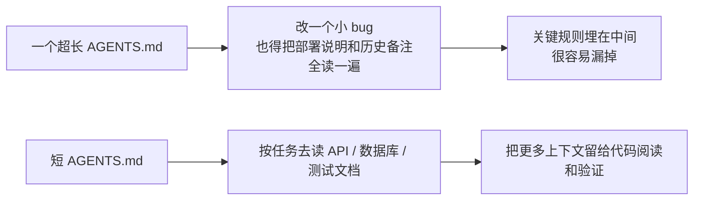

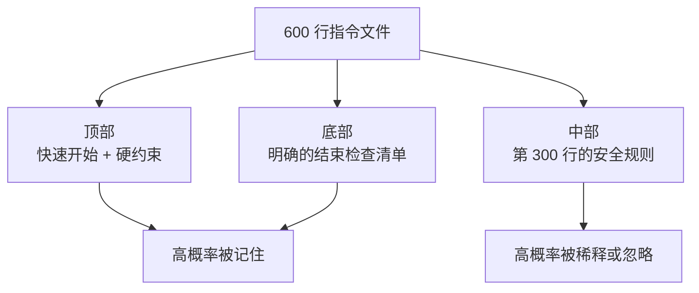

## 拆分思路

核心原则：常用信息放手边，偶尔用的收起来，用不上的别带。

入口文件 `AGENTS.md` 控制在 50-200 行，只放最常用的东西——项目概览（一两句话说清楚这是什么）、首次运行命令（`make setup && make test`）、全局硬约束（不超过 15 条不可违反的规则）、指向专题文档的链接（一行描述 + 适用条件）。

```markdown
# AGENTS.md

## 项目概览
Python 3.11 FastAPI 后端，PostgreSQL 15 数据库。

## 快速开始
- 安装：`make setup`
- 测试：`make test`
- 完整验证：`make check`

## 硬约束
- 所有 API 必须走 OAuth 2.0 认证
- 所有数据库查询必须用 SQLAlchemy 2.0 语法
- 所有 PR 必须通过 pytest + mypy --strict + ruff check

## 专题文档
- [API 设计规范](docs/api-patterns.md) — 添加新端点时必读
- [数据库操作约束](docs/database-rules.md) — 涉及数据库修改时必读
- [测试标准](docs/testing-standards.md) — 编写测试时参考
```

每个专题文档 50-150 行，按主题放在 `docs/` 目录下或对应模块目录旁。Agent 只在需要时才去读。就像行李箱里的收纳袋——内衣一个袋，洗漱一个袋，充电器一个袋。找东西不用翻整个箱子。

还有些信息直接放在代码里更合适——类型定义、接口注释、配置文件里的说明。Agent 读代码的时候自然能看到，不用再在指令里重复一遍。

每条指令都应该标明来源（"为什么加这条规则？"）、适用条件（"这条规则在什么时候需要？"）、过期条件（"什么情况下可以删掉这条规则？"）。定期审计，删掉过时的、冗余的、矛盾的条目。像管理代码依赖一样管理你的指令——用不上的依赖就该删掉，不然它们只会拖慢系统。

如果某条指令必须在入口文件里，放顶部或底部——不要放中间。"中间迷失"效应告诉我们，LLM 对长文本中间部分的信息利用效率显著低于两端。但更好的做法是把指令放到专题文档里，让 agent 按需加载。

OpenAI 和 Anthropic 都隐性支持拆分的做法。OpenAI 说入口文件应"短小且以路由为导向"，Anthropic 说长运行 agent 的控制信息应"简洁且高优先级"。两家都在说同一件事：别把什么都塞进一个文件里。行李箱得整理，不能只靠蛮力塞。

## 实际案例

一个 SaaS 团队的 `AGENTS.md` 从最初的 50 行膨胀到 600 行。内容混合了技术栈版本、编码规范、历史 bug 修复笔记、API 使用说明、部署流程、和团队成员的个人偏好——整个行李箱塞得满满当当，拉链都快崩了。

Agent 表现开始明显下降：简单 bug 修复任务中 agent 花大量上下文处理无关的部署指令；安全约束"所有数据库查询必须用参数化查询"埋在第 300 行，经常被忽略；三条矛盾的代码风格规则导致 agent 随机选择。

团队执行了"行李箱整理"：
1. `AGENTS.md` 裁剪到 80 行：只保留项目概览、运行命令、15 条全局硬约束
2. 创建专题文档：`docs/api-patterns.md`（120 行）、`docs/database-rules.md`（60 行）、`docs/testing-standards.md`（80 行）
3. 路由文件添加指向专题文档的链接
4. 历史笔记要么转成测试用例，要么删除

重构后：同一任务集的成功率从 45% 提升到 72%。安全约束遵循率从 60% 提升到 95%——因为从文件中间移到了路由文件顶部，不再被"中间迷失"了。

## 关键要点

- "加条规则"是短期的止痛药，长期的毒药。每次加规则前想想：这条规则放专题文档是不是更合适？——别什么都往行李箱里塞。
- 入口文件是路由器，不是百科全书。50-200 行，只放概览、硬约束、和链接。
- 利用"中间迷失"效应：重要信息放文件顶部或底部，不重要的移到专题文档。
- 像管理技术债一样管理指令膨胀。定期审计，每条指令要有来源、适用条件、和过期条件。
- 拆分之后信噪比提升，agent 把更多上下文预算花在实际任务上，而不是处理无关指令。

## 延伸阅读

- [OpenAI: Harness Engineering](https://openai.com/index/harness-engineering/)
- [Anthropic: Effective Harnesses for Long-Running Agents](https://www.anthropic.com/engineering/effective-harnesses-for-long-running-agents)
- [Lost in the Middle: How Language Models Use Long Contexts](https://arxiv.org/abs/2307.03172)
- [HumanLayer: Harness Engineering for Coding Agents](https://humanlayer.dev/articles/harness-engineering-for-coding-agents/)
- [Nielsen Norman Group: Progressive Disclosure](https://www.nngroup.com/articles/progressive-disclosure/)

## 练习

1. **信噪比审计**：拿你当前的入口指令文件，列出所有指令条目。选 5 个不同的常见任务类型，标注每条指令是否跟该任务相关。计算每个任务类型的 SNR。那些对大多数任务都是噪声的指令，移到专题文档里。

2. **渐进式披露重构**：如果你有一个超过 300 行的指令文件，把它拆成：(a) 不超过 100 行的路由文件，(b) 3-5 个专题文档。重构前后各跑同一组任务（至少 5 个），对比成功率。

3. **中间迷失验证**：在一个长指令文件里，把一条关键约束分别放在顶部、中间、底部各跑一组任务（每组至少 5 次），看遵循率有没有差别。你可能会惊讶于位置效应有多大。

---

[English Version →](../../../en/lectures/lecture-05-why-long-running-tasks-lose-continuity/)

> 本篇代码示例：[code/](https://github.com/walkinglabs/learn-harness-engineering/blob/main/docs/zh/lectures/lecture-05-why-long-running-tasks-lose-continuity/code/)
> 实战练习：[Project 03. 让 agent 关掉再打开还能接着干](./../../projects/project-03-multi-session-continuity/index.md)

# 第五讲. 让跨会话的任务保持上下文连续

你让 Claude Code 帮你实现一个完整的功能，它跑了 30 分钟，做了大部分工作，但上下文快满了。你开个新会话继续，然后发现：它不记得上次做了什么决策、为什么选了方案 A 而不是方案 B、哪些文件已经改过、测试跑到什么状态了。它得花 15 分钟重新探索一遍项目，而且可能跟上次的做法不一致。

想象一下，如果你是一个工匠，每天早上醒来都不记得昨天干了什么。你得重新认识整个工地——哪面墙砌了一半、为什么用的是红砖而不是青砖、水电管道走到哪了。更糟的是，你可能会把昨天已经装好的窗户拆了重来，因为你不记得它已经装过了。

这就是 AI coding agent 在跨会话任务中面对的困境。本节课讲为什么 agent 会"断片"，以及如何通过结构化的状态持久化让它像一个每天坚持写日记的工匠——虽然还是会失忆，但日记本里记着一切。

## 上下文窗口：不是无限的

上下文窗口是有限的。这不是一个可以通过模型升级解决的问题——即使窗口大小增长到 1M tokens，复杂任务依然会用完。因为 agent 不只是在生成代码，它还要理解代码库、跟踪自己的决策历史、处理工具输出、维护对话上下文。这些信息加起来增长得比窗口扩容快得多。

更深层的问题：agent 产生的信息不是均匀重要的。中间推理步骤包含决策的"为什么"——为什么选了方案 A 而不是方案 B，为什么用了这个库而不是那个库，为什么跳过了某个优化。最终输出只包含"是什么"——代码本身。压缩策略通常保留后者但丢了前者。下一个会话看到代码但不知道为什么这么写，可能会"优化"掉一个有意为之的设计决策。

Anthropic 在他们的长运行 agent 研究中发现了一个很有意思的现象：当 agent 感觉上下文快满了，它们会表现出一种"过早收敛"的行为——匆忙结束当前工作，跳过验证步骤，或者选一个简单的方案而不是最优方案。这就像你考试时发现时间快到了，赶紧随便选几个选择题一样。Anthropic 把这叫"上下文焦虑"。

## 会话连续性流程

没有连续性工件的时候，每个新会话都是一场灾难：

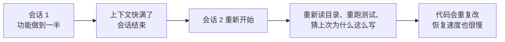

有连续性工件的时候，新会话能快速接上：

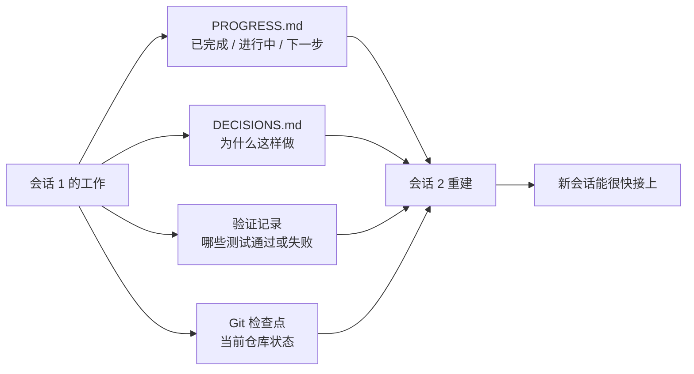

## 核心概念

- **上下文窗口是有限的**：不管模型吹多大的窗口（128K、200K、1M），长任务总会用完。用完之后要么压缩（丢信息），要么重置（开新会话）。两种方式都会丢东西。
- **连续性工件**：持久化的状态文件，让新会话能无歧义地恢复到上次离开的地方。最基本的形式：进度日志 + 验证记录 + 下一步行动。就是那个工匠的日记本。
- **重建成本**：新会话恢复到可执行状态所需的时间。好的 harness 能把重建成本从 15 分钟压到 3 分钟。
- **漂移（Drift）**：agent 的理解跟代码仓库实际状态之间的偏差。每次会话边界都会引入漂移，不加控制会越漂越远。
- **上下文焦虑**：Anthropic 观察到的现象——agent 在接近上下文限制时表现异常，过早结束任务以避免信息丢失。是一种非理性的资源焦虑。
- **压缩 vs 重置**：压缩是在同一个会话里把上下文摘要化（保留"是什么"，可能丢了"为什么"）；重置是开新会话从持久化状态重建（干净但依赖工件完备性）。

## 连续性断了以后会发生什么

上个会话花了很多上下文预算分析了三种方案的优劣，最终选了方案 B。这个会话的 agent 不知道这个分析过程，可能基于不完整的信息重新做了决策——而且可能选了方案 A。就像那个失忆的工匠不记得为什么选了红砖，今天看着觉得青砖更好看，就把昨天的墙拆了重砌。

更要命的是重复劳动。Agent 不确定某项工作是否已完成，重新做了一遍。或者更糟——做了一半发现跟已有的实现冲突，需要返工。工地上不能两拨人同时砌同一面墙——但在没有进度记录的情况下，新来的人完全不知道这面墙已经有人在砌了。

几个会话累积下来，实现方向可能已经悄悄偏离了原始需求。每个新会话对项目目标的理解都略有偏差，就像传话游戏——经过十个人传话，"帮我买杯咖啡"可能变成了"帮我买个咖啡机"。

还有验证缺口。上个会话的验证结果（哪些测试通过、哪些失败、为什么失败）没有记录，新会话得重新跑一遍验证才能了解当前状态。每次都重新诊断，每次都浪费宝贵的上下文。

OpenAI 和 Anthropic 都在他们的文档里强调了结构化状态持久化的重要性。OpenAI 的 harness engineering 文章把仓库当作"操作记录"——每次操作的结果都应该在仓库里留下可追溯的痕迹。Anthropic 的 long-running agents 文档则更具体地建议使用"交接文件"——包含当前状态、已知问题和下一步行动的结构化文档。

## 给失忆工匠的日记本

核心思路：**把 agent 当成一个会失忆的超级工程师来管理。** 每次它要"下班"之前，必须把关键信息写下来，让下一个"接班"的 agent 能快速上手。

**工具 1：进度文件（PROGRESS.md）**。这是最基本的连续性工件——日记本的核心部分：

```markdown
# 项目进度

## 当前状态
- 最新 commit: abc1234 (feat: add user preferences endpoint)
- 测试状态: 42/43 通过 (test_pagination_edge_case 失败)
- Lint: 通过

## 已完成
- [x] 用户模型和数据库迁移
- [x] 基础 CRUD 端点
- [x] 认证中间件集成

## 进行中
- [ ] 分页功能 (90% - 边界条件测试失败)

## 已知问题
- test_pagination_edge_case 在空结果集时返回 500
- 需要确认是否要在列表中包含已删除用户

## 下一步
1. 修复分页边界条件 bug
2. 添加"是否包含已删除用户"的查询参数
3. 更新 API 文档
```

**工具 2：决策日志（DECISIONS.md）**。记录重要的设计决策和原因。不需要详细的设计文档，只需要"什么决策、为什么、什么时候做的"——这是日记本里的备忘：

```markdown
# 设计决策

## 2024-01-15: 使用 Redis 缓存用户偏好
- 原因: 读取频率高（每次 API 调用都需要），数据量小
- 否决方案: 用 PostgreSQL 物化视图（变更频率高，物化视图维护成本不划算）
- 约束: 缓存 TTL 设为 5 分钟，写入时主动失效
```

**工具 3：git 提交作为检查点。** 每完成一个原子工作单元就提交。commit message 要说清楚做了什么和为什么。这是免费的、自动版本化的状态快照。

**工具 4：init.sh 或 harness 的初始化流程。** 在 `AGENTS.md` 里写明每天"上班"和"下班"的流程：

```markdown
## 每次会话开始时（上班打卡）
1. 读 PROGRESS.md 了解当前状态
2. 读 DECISIONS.md 了解重要决策
3. 跑 make check 确认仓库处于一致状态
4. 从 PROGRESS.md 的"下一步"部分继续工作

## 每次会话结束前（下班打卡）
1. 更新 PROGRESS.md
2. 跑 make check 确认一致状态
3. 提交所有已完成的工作
```

**混合策略**：不需要每次都重置上下文。短任务（30 分钟以内）可以在同一个会话里完成。长任务（跨会话）必须用进度文件和决策日志来维持连续性。判断标准：如果任务需要的上下文超过窗口的 60%，就开始准备交接。

### 上下文焦虑的深层分析

Anthropic 在 2026 年 3 月发布的研究进一步揭示了上下文焦虑的具体表现：在 Sonnet 4.5 上，当上下文接近窗口限制时，agent 会表现出强烈的"过早收敛"行为。这就像考试时发现时间快到了，赶紧随便填选择题。

针对这个现象，有两种策略：

**压缩（Compaction）**：在同一个会话里把早期对话摘要化。优点是保留连续性，agent 能看到"是什么"。缺点是"为什么"经常在摘要中丢失——为什么选了方案 B 而非 A，为什么跳过了某个优化。更关键的是，压缩并不能消除上下文焦虑——agent 知道上下文曾经很大，心理上仍然倾向于加速收尾。

**重置（Context Reset）**：完全清空上下文，开一个新会话，从持久化工件重建。优点是干净的心理状态——新会话没有"我快没时间了"的焦虑。缺点是依赖交接工件的完备性。如果日记本里漏了关键信息，新会话可能在错误方向上浪费时间。

Anthropic 的实际数据：对于 Sonnet 4.5，上下文焦虑足够严重，以至于压缩单独不够用，上下文重置成为 harness 设计的关键组件。但对于 Opus 4.5，这种行为大幅减弱，可以不依赖重置而靠压缩管理上下文。这意味着：**harness 设计需要对目标模型有具体的理解，而不是套用通用模板。**

> 来源：[Anthropic: Harness design for long-running application development](https://www.anthropic.com/engineering/harness-design-long-running-apps)

## 实际案例

一个 agent 被要求实现一个带用户认证的博客系统，12 个功能点，预计需要 5 个会话。

**没有日记本的基线**：会话 1 实现了用户模型和基础路由。会话 2 开始时，agent 不记得认证中间件的接口约定，花了约 15 分钟推断上次的设计意图。到会话 3，累积漂移导致 agent 开始重复已实现的功能。到会话 5，仓库有大量冗余代码，但核心认证功能仍未通过端到端测试。12 个功能点只完成了 7 个，其中 3 个有隐含的正确性问题。就像那个没写日记的工匠——到了第五天，工地上一团乱，有些墙砌了两遍，有些该砌的根本没砌。

**有日记本的对照**：使用进度文件、决策日志、验证记录和 git 检查点。每个会话结束时自动更新状态报告。会话 2 的重建成本降到约 3 分钟。到会话 5，所有 12 个功能点完成且通过验证。

定量对比：重建时间减少约 78%，功能完成率从 58% 提升到 100%，隐含缺陷率从 43% 降到 8%。工匠还是那个会失忆的工匠，但有了日记本，他的每一天都从昨天停下的地方开始，而不是从零开始。

## 关键要点

- 上下文窗口是有限的资源。长任务一定会跨会话，跨会话一定会丢信息——这就像工匠每天都会失忆一样，是客观现实。
- 解决方案不是更大的窗口，而是更好的状态持久化。进度文件 + 决策日志 + git 检查点——给失忆的工匠一个靠谱的日记本。
- 把 agent 当成会失忆的工程师来管理：每次"下班"前写清楚做了什么、为什么、下一步做什么。
- 重建成本是关键指标。好的 harness 应该让新会话在 3 分钟内恢复到可执行状态。
- 混合策略：短任务在会话内完成，长任务用结构化工件维持连续性。

## 延伸阅读

- [Anthropic: Effective Harnesses for Long-Running Agents](https://www.anthropic.com/engineering/effective-harnesses-for-long-running-agents)
- [OpenAI: Harness Engineering](https://openai.com/index/harness-engineering/)
- [Lost in the Middle: How Language Models Use Long Contexts](https://arxiv.org/abs/2307.03172)
- [Claude Code Documentation](https://docs.anthropic.com/en/docs/claude-code)
- [HumanLayer: Harness Engineering for Coding Agents](https://humanlayer.dev/articles/harness-engineering-for-coding-agents/)

## 练习

1. **连续性损耗度量**：选一个需要至少 3 个会话的开发任务。不提供任何连续性工件，在每个会话开始时记录 agent 花了多少上下文来"搞清楚上次做了什么"。会话结束后，创建进度文件，让下一个会话从进度文件开始。对比有进度文件和没有时的重建成本。

2. **交接模板设计**：设计一个最小化的交接模板，包含四个字段：仓库状态（commit hash）、运行时状态（测试通过率）、阻塞项、下一步行动。让一个全新的 agent 会话只凭这个模板恢复项目状态，记录恢复过程中出现的歧义点，迭代改进模板。

3. **混合策略实验**：在一个包含 5 个会话的开发任务中，对比三种策略：(a) 每次都开全新会话 + 进度文件，(b) 在同一个会话里尽可能多做（上下文压缩），(c) 混合策略（短任务在会话内，长任务跨会话 + 进度文件）。对比重建时间、功能完成率和决策一致性。

---

[English Version →](../../../en/lectures/lecture-06-why-initialization-needs-its-own-phase/)

> 本篇代码示例：[code/](https://github.com/walkinglabs/learn-harness-engineering/blob/main/docs/zh/lectures/lecture-06-why-initialization-needs-its-own-phase/code/)
> 实战练习：[Project 03. 让 agent 关掉再打开还能接着干](./../../projects/project-03-multi-session-continuity/index.md)

# 第六讲. 让 agent 每次工作前先初始化

你开了一个新的 agent 会话，让它"帮我加个搜索功能"。它上来就开始改代码——精神可嘉。改了 20 分钟发现测试框架没配好，又花 10 分钟搞测试框架，然后发现数据库迁移脚本格式不对，又折腾了一会儿。最后搜索功能倒是加了，但整个会话的效率很低——大部分时间花在了"搞清楚这个项目怎么运作"上，而不是写搜索功能。

更好的做法是：在让 agent 开始干活之前，先用一个独立的阶段把基础环境搭好、验证命令跑通、项目结构搞清楚。就像盖房子——你不能边打地基边砌墙，不然墙砌到一半地基还没干，整栋楼都得推倒重来。先打地基，地基干了，再砌墙，一气呵成。

这节课讲的就是为什么初始化必须是独立的阶段，不能跟实现混在一起。

## 地基和墙：两种完全不同的工作

初始化和实现的优化目标完全不同。实现阶段的目标是：最大化已验证功能的数量和质量。初始化阶段的目标是：最大化后续所有实现的可靠性和效率。

当你把初始化和实现混在一起的时候，agent 面临一个多目标优化问题——它要同时搭基础设施和写功能代码。在没有显式优先级设定的情况下，agent 自然倾向于写代码（因为那是直接可见的产出），而牺牲基础设施（因为它的价值只能在后续会话中体现）。这就像让施工队同时打地基和砌墙——他们大概率会急着砌墙，因为墙看得见、能交差。但地基没打好的房子，后面出的问题是系统性的。

## 初始化生命周期

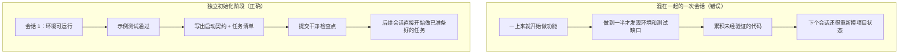

## 混在一起做会怎样

最直接的问题：地基打不牢。Agent 花了 80% 的精力写功能代码，剩下 20% 随便搭了点基础设施。测试框架配了但没验证过，lint 规则设了但太宽松，进度文件没创建。这些缺陷在第一个会话里不明显（因为 agent 还记得它做了什么），但到第二个会话就暴露了——新 agent 不知道项目怎么跑、怎么测、做到哪了。地基不牢，地动山摇。

更隐蔽的代价是"未验证的累积"——在测试框架配好之前写的功能代码，等回头补测试的时候可能发现设计上就有问题，早知道的话应该用不同的方式实现。就像在地基没干的时候就开始贴瓷砖，等发现地面不平时，瓷砖全得撬掉重来。

上下文预算也在被浪费。初始化工作（配环境、配测试、理解项目结构）消耗了大量预算，留给实际功能实现的反而不够了。结果第一个会话只完成了一半的功能，第二个会话还得从头理解项目。预算花在了打地基上，但地基也没打好——两头都没占着。

最容易被忽略的是隐式假设埋下的雷。Agent 在初始化过程中做的决策（用什么测试框架、目录怎么组织、依赖怎么管理）如果不显式记录下来，后续会话就可能做出矛盾的选择。第一个施工队用的是水泥地基，第二个施工队不知道，往上面打了木桩——地基直接裂了。

Anthropic 在他们的长运行应用开发研究中明确建议把初始化和实现分离。他们的实验数据：使用独立初始化阶段的项目，多会话场景中的功能完成率比混合方式高 31%。关键是——初始化阶段投入的时间在后续 3-4 个会话中就能完全收回。地基打得越扎实，上面的楼盖得越快。

OpenAI 的 Codex harness engineering 指南也强调"仓库作为操作记录"的原则——第一次运行就要建立清晰的操作结构，否则每次新会话都得重新推断项目约定。

## 核心概念

- **初始化阶段**：agent 生命周期中的第一个阶段，不做功能实现，只建立后续所有实现阶段的执行前提。输出不是代码，而是基础设施。
- **自举契约**：一个项目能被全新 agent 会话无歧义操作的条件——能启动、能测试、能看进度、能接手下一步。四个条件缺一不可。
- **冷启动 vs 热启动**：冷启动是从空目录开始，agent 要猜项目结构；热启动是从模板或已有项目开始，基础设施已经就位。热启动的效果远好于冷启动——就像在有水电的工地上开工，比在荒郊野岭从头搞起快得多。
- **交接就绪性**：项目在任何时刻都处于"可以被全新 agent 接手"的状态。不需要口头解释，只看仓库内容就能接着干。
- **首次验证时间**：从项目开始到第一个功能点通过验证的时间。这是衡量初始化效率的核心指标。
- **下游可用性**：初始化质量的最佳衡量标准——后续会话不需要依赖隐式知识就能成功执行任务的比例。

## 怎么做好初始化

**把初始化当作一个独立的阶段来执行。** 第一个会话只做初始化，不写任何业务功能代码。初始化的产出是：

**1. 可运行的环境。** 项目能启动、依赖都装好、没有环境问题。地基浇好了，没裂缝。

**2. 可验证的测试框架。** 至少有一个示例测试能通过。这证明测试框架本身是配对的——就像地基上立了一根柱子，证明地基能承重。

**3. 自举契约文档。** 一个明确的文档告诉后续会话：
```markdown
# 初始化契约

## 启动命令
- 安装依赖：`make setup`
- 启动开发服务器：`make dev`
- 运行测试：`make test`
- 完整验证：`make check`

## 当前状态
- 所有依赖已安装并锁定
- 测试框架已配置（Vitest + React Testing Library）
- 示例测试通过（1/1）
- Lint 规则已配置（ESLint + Prettier）

## 项目结构
- src/ — 源代码
- src/components/ — React 组件
- src/api/ — API 客户端
- tests/ — 测试文件
```

**4. 任务分解。** 把整个项目拆成有序的任务列表，每个任务有明确的验收标准：
```markdown
# 任务分解

## Task 1: 用户认证基础
- 实现 JWT 认证中间件
- 添加登录/注册端点
- 验收标准：pytest tests/test_auth.py 全部通过

## Task 2: 用户资料页面
- 实现用户资料 CRUD
- 添加资料编辑表单
- 验收标准：pytest tests/test_profile.py 全部通过

## Task 3: 搜索功能
- ...
```

**5. Git 提交作为检查点。** 初始化完成后提交一个干净的 checkpoint。后续所有工作都从这个 checkpoint 开始。

**热启动策略**：不要从空目录开始。用一个项目模板（create-react-app、fastapi-template 等）预置好标准的目录结构、依赖配置和测试框架。把通用的初始化步骤预置到模板里，只留下项目特有的初始化工作。就像在有通水通电的工地上开工，比从荒郊野岭开始强一万倍。

**初始化的完成条件**：不是"写了多少代码"，而是自举契约的四个条件都满足了——能启动、能测试、能看进度、能接手下一步。用这个检查清单验收初始化：

```markdown
## 初始化验收清单
- [ ] `make setup` 从零开始能成功
- [ ] `make test` 至少有一个测试通过
- [ ] 新的 agent 会话能只看仓库回答"怎么跑"和"怎么测"
- [ ] 任务分解文件存在且有至少 3 个任务
- [ ] 所有内容已提交到 git
```

## 实际案例

一个 React 前端项目的两种初始化方式对比：

**混合方式（边打地基边砌墙）**：agent 在第一个会话中同时做了项目脚手架创建和首个功能实现。会话结束时，仓库有可运行的代码，但：没有显式的启动/测试命令文档、没有进度跟踪文件、没有任务分解。第二个会话花了约 20 分钟推断项目结构、测试框架和构建流程——就像新来的施工队看着一片工地，不知道地基打到什么程度、水电管道走到哪了，只能一个个挖开来看。

**独立初始化（先打地基）**：第一个会话只做初始化——用项目模板创建目录结构、配置测试框架（Vitest + React Testing Library）、写一个示例测试并验证通过、创建自举契约文档和任务分解文件、提交初始检查点。第二个会话的重建时间不到 3 分钟，直接从任务列表开始工作——施工队来了，看了一眼施工图就知道从哪里接着干。

整个项目周期对比：混合方式的总重建时间（跨所有会话）比独立初始化多约 60%。独立初始化多花的那 20 分钟在后续会话中被成倍收回。就像地基打得扎实，上面盖楼的效率反而更高——慢即是快。

## 关键要点

- 初始化和实现的优化目标不同，混在一起只会互相拖后腿。先打地基，再砌墙。
- 初始化的产出不是代码，是基础设施：可运行的环境、可验证的测试、自举契约、任务分解。
- 用"自举契约"的四个条件验收初始化：能启动、能测试、能看进度、能接手下一步。
- 热启动优于冷启动。用项目模板预置标准化的基础设施。
- 初始化投入的时间会在后续 3-4 个会话中完全收回。这不是额外的成本，是前期投资——地基打得越扎实，楼盖得越快。

## 延伸阅读

- [Anthropic: Effective Harnesses for Long-Running Agents](https://www.anthropic.com/engineering/effective-harnesses-for-long-running-agents)
- [OpenAI: Harness Engineering](https://openai.com/index/harness-engineering/)
- [HumanLayer: Harness Engineering for Coding Agents](https://humanlayer.dev/articles/harness-engineering-for-coding-agents/)
- [Infrastructure as Code — Martin Fowler](https://martinfowler.com/bliki/InfrastructureAsCode.html)
- [SWE-agent: Agent-Computer Interfaces](https://github.com/princeton-nlp/SWE-agent)

## 练习

1. **自举契约设计**：为一个你正在开发的项目写一个完整的自举契约。然后开一个全新的 agent 会话，只给它看仓库内容（不给任何口头上下文），让它尝试启动项目、跑测试、了解当前进度。记录它遇到的问题——每个问题都对应自举契约中缺失的一个条款。

2. **对比实验**：选一个中等复杂度的新项目。方式 A：让 agent 初始化和首次实现同时做。方式 B：先花一个会话做独立初始化，第二个会话开始实现。在 4 个会话后对比：首次验证时间、重建成本、功能完成率。

3. **初始化验收清单**：为你的项目设计一个初始化验收清单。让一个全新的 agent 会话执行清单上的每一项，记录哪些项通过了、哪些没通过。没通过的项就是你的 harness 需要补强的地方。

---

[English Version →](../../../en/lectures/lecture-07-why-agents-overreach-and-under-finish/)

> 本篇代码示例：[code/](https://github.com/walkinglabs/learn-harness-engineering/blob/main/docs/zh/lectures/lecture-07-why-agents-overreach-and-under-finish/code/)
> 实战练习：[Project 04. 用运行反馈修正 agent 的行为](./../../projects/project-04-incremental-indexing/index.md)

# 第七讲. 给 agent 划清每次任务的边界

你让 Claude Code "给这个项目加上用户认证功能"，结果它同时开始改数据库 schema、写路由、改前端组件、还顺手重构了错误处理中间件。两个小时后你一看——12 个文件被修改，800 行新代码，但没有一个功能是端到端跑通的。

贪多嚼不烂，这句话放到 AI agent 身上格外贴切。Agent 天生就有"多做一点"的冲动——看到相关的事情就顺手一起做了，和那种在超市本来只打算买瓶酱油、结果推着满满一车出来的人一个德行。问题是，人类买了太多东西最多浪费钱，agent 同时做太多事情则是每一件都做不好。

Anthropic 在 "Effective harnesses for long-running agents" 工程博客中明确指出：当提示太宽泛时，agent 倾向于"同时启动多件事"而非"先做完一件事"。OpenAI 在 Codex 工程实践中也发现，没有显式范围控制的任务，完成率会暴跌。这不是模型的问题——是你没有在 harness 里给它划清边界。

## 注意力是有限的资源

这不是比喻，是数学。假设 agent 的上下文容量为 C，同时激活 k 个任务，每个任务平均获得 C/k 的推理资源。当 C/k 低于完成单个任务所需的最小阈值时，所有任务都做不完。这就像你的胃就那么大——同时塞十个包子进去，不是一个都消化不了，而是十个都消化不良。

Claude Code 的真实行为很说明问题。你让它"添加用户注册功能"，它很可能这样做：

1. 创建 User model
2. 写注册路由
3. 发现需要邮箱验证，于是加邮件服务
4. 看到密码需要加密，于是引入 bcrypt
5. 注意到错误处理不统一，于是重构全局错误中间件
6. 看到测试文件结构不清晰，于是重组目录结构

6 步之后，每一个都是半成品。没有端到端验证，代码之间耦合复杂，下一个会话来接手时会一脸懵。就像一个人同时炒六道菜，每道菜都下了锅但没有一道出锅——全糊了。

Anthropic 的实验数据直接支持这一点：使用"小下一步"策略（等价于 WIP=1）的 agent，任务完成率比使用宽泛提示的 agent 高 37%。更有意思的是，agent 生成的代码行数和实际完成的功能数量呈弱负相关——写得越多，完成得越少。贪多嚼不烂，数据为证。

## WIP=1 工作流

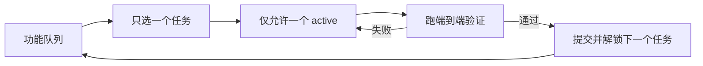

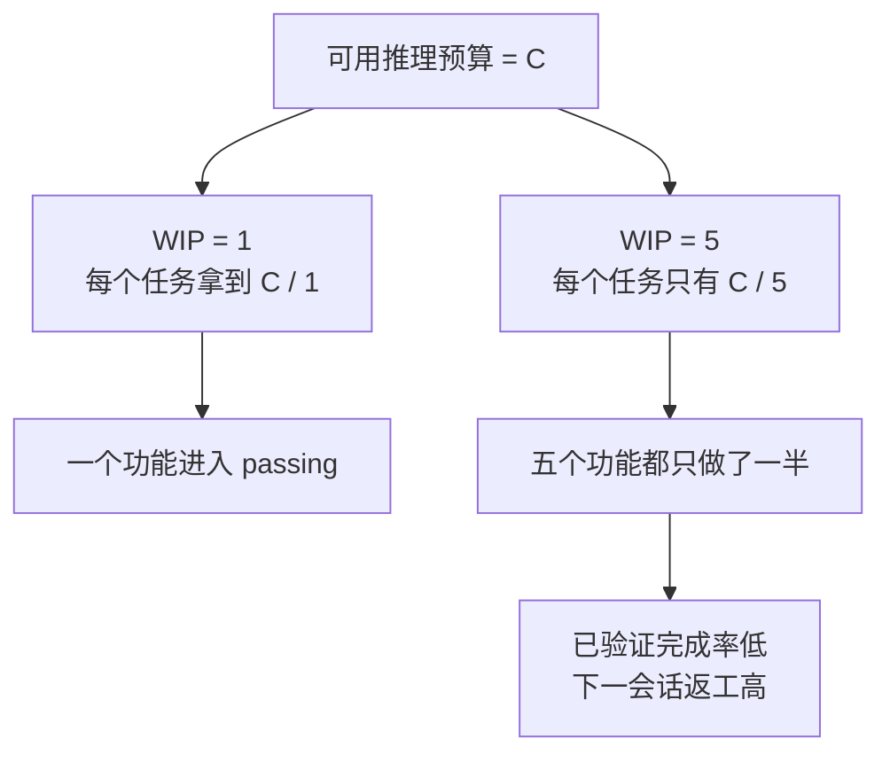

## 核心概念

- **过度延伸（Overreach）**：agent 在一次会话中激活的任务数量超过最优值。它不是主观判断，而是可量化的——同时做 5 个功能但 0 个跑通，就是 overreach。
- **不足完成（Under-finish）**：已启动的任务中，通过端到端验证的比例低于阈值。写了代码但没跑通测试，就是 under-finish。
- **WIP 限制（Work-in-Progress Limit）**：来自 Kanban 方法论。核心思想：限制同时在进行的任务数量。对于 agent，WIP=1 是最安全的默认值——做完一个再做下一个。就像自助餐厅不要一次拿太多盘子，吃完一盘再去拿下一盘。
- **完成证据（Completion Evidence）**：一个任务从"进行中"变成"已完成"必须满足的可验证条件。没有这个，agent 会用"代码看起来没问题"代替"行为通过测试"。
- **范围表面（Scope Surface）**：一个 DAG 结构，每个节点是一个工作单元，边是依赖关系。状态只有四种：未开始、进行中、阻塞、已通过。
- **完成压力（Completion Pressure）**：harness 通过 WIP 限制和完成证据要求共同产生的约束力，迫使 agent 先完成当前任务再开始新任务。

## Overreach 和 Under-finish 是一对难兄难弟

这两个问题不是独立的，而是互相加剧。overreach 导致注意力分散，注意力分散导致 under-finish，under-finish 留下的半成品代码又增加了系统复杂度，进一步导致下一个任务的 overreach。恶性循环。

用 Kanban 的语言说：Little 法则告诉我们 L = lambda * W。如果在制品数量 L 过大（同时做太多事），每个任务的前置时间 W 必然增加。对于 agent 来说，这意味着每个功能从开始到验证通过的时间被拉长，失败概率被放大。

这在人类世界也是老问题了——Steve McConnell 在《Rapid Development》中记录，范围蔓延是项目失败的首要原因。但人类至少有"我已经做得够多了"的直觉，agent 完全没有。生成下一个想法的成本对模型来说太低了——写一行"顺便把这个也改了"几乎不消耗额外 token，但每个额外的修改都会稀释 agent 的注意力。就像在自助餐厅里，每多拿一个盘子的边际成本几乎为零，但你的胃只有那么大。

## 怎么做才对

### 1. 强制 WIP=1

这是最直接有效的方法。在你的 harness 里，明确告诉 agent：**任何时刻只允许一个任务处于"进行中"状态。** 在 Claude Code 的 CLAUDE.md 或 Codex 的 AGENTS.md 里写：

```
## 工作规则
- 每次只做一个功能点
- 当前功能点端到端验证通过后，才能开始下一个
- 不要在实现功能 A 时"顺便"重构功能 B
```

就像吃自助餐——一次只拿一盘，吃完再去拿。

### 2. 给每个任务定义显式的完成证据

完成不是"代码写完了"，而是"行为验证通过了"。在你的功能列表里，每个条目都要有验证命令：

```
F01: 用户注册
  验证: curl -X POST /api/register -d '{"email":"test@example.com","password": "***"}' | jq .status == 201
  状态: passing
```

### 3. 把范围表面外部化

用一个机器可读的文件（JSON 或 Markdown）记录所有任务的状态。任何新会话都能直接读这个文件，知道：哪个任务在做？什么行为算完成？已经通过了什么验证？

### 4. 监控验证完成率

harness 应该持续跟踪 VCR（Verified Completion Rate）= 已通过验证的任务数 / 已启动的任务数。VCR < 1.0 时，阻止新任务启动。

## 实际案例

一个 8 个功能点的 REST API 项目，两种策略对比：

**自助餐模式（无约束）**：agent 在第一个会话同时启动 5 个功能。产出约 800 行代码，涉及 12 个文件。端到端测试通过率只有 20%——只有用户注册跑通了。其余 4 个功能：数据库 schema 建了但缺验证逻辑，路由定义了但返回格式错误。就像一个人同时炒六道菜，只有一道勉强能吃。到第 3 个会话结束，8 个功能只完成 3 个。

**单盘模式（WIP=1）**：agent 在第一个会话只做用户注册。产出约 200 行代码，涉及 4 个文件。端到端测试 100% 通过。提交干净的、已验证的实现。到第 4 个会话结束，8 个功能完成 7 个（第 8 个因外部依赖被阻塞）。

结果：总代码量更少（800 行 vs 1200 行），但有效代码更多。完成率 87.5% vs 37.5%。一口一口吃，反而吃得最多。

## 关键要点

- **WIP=1 是 agent harness 的默认安全设置**——做完一个再做下一个，不要试图并行。一口吃不成胖子。
- **完成证据必须是可执行的**——"代码看起来没问题"不算完成，"curl 返回 201"才算。
- **范围表面必须外部化为文件**——不能只在对话里说，必须在仓库里有机器可读的记录。
- **overreach 和 under-finish 是共生问题**——解决一个就解决了另一个。
- **"少做但做完"永远优于"多做但做半"**——agent 代码行数和功能完成率呈负相关。质量永远比数量重要。

## 延伸阅读

- [Effective harnesses for long-running agents - Anthropic](https://www.anthropic.com/engineering/effective-harnesses-for-long-running-agents) — Anthropic 工程博客，详细论述了"小下一步"策略
- [Harness Engineering - OpenAI](https://openai.com/index/harness-engineering/) — OpenAI 对 harness 工程的完整论述
- [Kanban: Successful Evolutionary Change - David Anderson](https://www.goodreads.com/book/show/1070822.Kanban) — WIP 限制的经典来源
- [Rapid Development - Steve McConnell](https://www.goodreads.com/book/show/125171.Rapid_Development) — 范围蔓延作为项目失败首要原因的实证数据

## 练习

1. **任务原子化练习**：选一个宽泛需求（如"实现用户管理系统"），把它拆成至少 5 个原子工作单元。每个单元写清楚：(a) 单一行为描述，(b) 可执行的验证命令，(c) 依赖关系。检查是否满足 WIP=1 的约束。

2. **对比实验**：在同一个项目上跑两次——一次不给约束，一次强制 WIP=1。比较：验证完成率、总代码行数、有效代码比例。

3. **完成证据审计**：回顾一个最近的 agent 运行结果，把每个代码变更分类为"已完成行为"、"未完成行为"或"脚手架"。给每个未完成行为补充缺失的验证命令。

---

[English Version →](../../../en/lectures/lecture-08-why-feature-lists-are-harness-primitives/)

> 本篇代码示例：[code/](https://github.com/walkinglabs/learn-harness-engineering/blob/main/docs/zh/lectures/lecture-08-why-feature-lists-are-harness-primitives/code/)
> 实战练习：[Project 04. 用运行反馈修正 agent 的行为](./../../projects/project-04-incremental-indexing/index.md)

# 第八讲. 用功能清单约束 agent 该做什么

你让 agent 做一个电商网站，跑完之后它告诉你"做完了"。你打开代码一看——用户认证有了，但购物车的结算按钮点了没反应，支付流程根本没接上。问题是：你从来没告诉它"做完"的标准是什么，所以它用自己的标准——"代码写了不少，看起来挺完整"。

功能清单（feature list）在很多人眼里就是个备忘录——写下来怕忘了，写完扔在一边。但在 harness 的世界里，功能清单不是给人看的备忘录，而是整个 harness 的脊梁骨。调度器靠它选任务，验证器靠它判完成，交接器靠它生成报告。脊梁骨断了，全身都瘫。

Anthropic 和 OpenAI 都强调：**工件必须外部化**。功能状态必须是仓库里机器可读的文件，不能是对话里的非结构化描述。

## Agent 不知道"做完"是什么意思

Claude Code 和 Codex 都不会自动知道你心目中的"做完"是什么意思。你说"加一个购物车功能"，模型的理解可能是"写一个 Cart 组件和 addToCart 方法"。而你的意思是"用户能从浏览商品到下单支付完整走通"。

这个理解鸿沟在没有功能清单的情况下会持续存在。agent 用自己的隐式标准判断完成——通常是"代码没有明显的语法错误"。而你需要的是端到端的行为验证。就像你让朋友帮你买菜，说"买点水果"，他拎了一袋柠檬回来——他要的水果，你要的水果，不是一个水果。

看看这种常见的进度记录：

```
做了用户认证、购物车基本完成了、还需要做支付
```

新的 agent 会话看到这个记录，能回答以下问题吗？"基本完成"意味着什么？购物车通过了哪些测试？支付的阻塞条件是什么？答案都是"不知道"。就像你看病时跟医生说"我肚子疼，最近还行"，医生能开出什么药来？

结果是：新会话花 20 分钟推断项目状态，最终可能重复实现已完成的功能。Anthropic 的工程实践数据表明，好的进度记录可以减少 60-80% 的会话启动诊断时间。

## 功能状态机

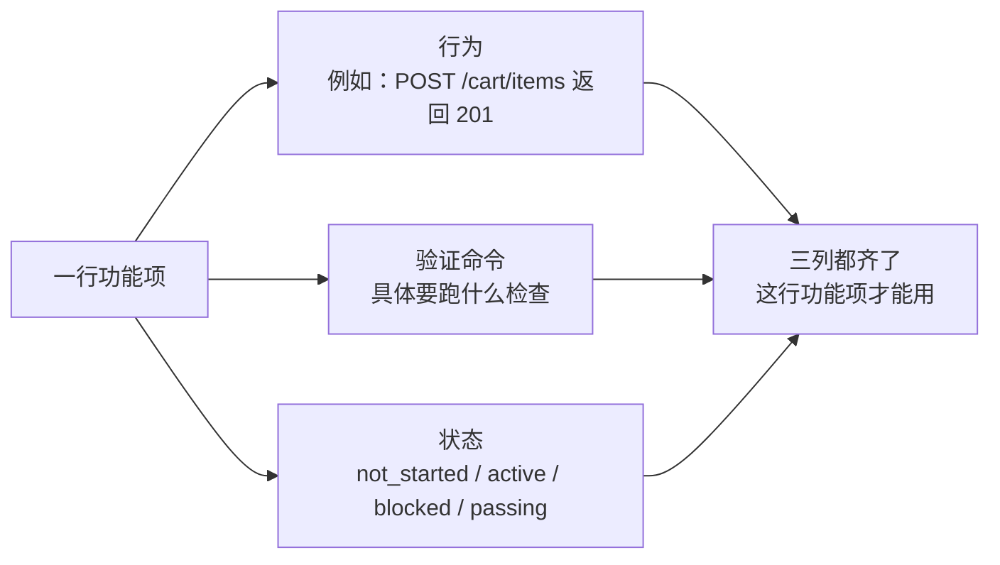

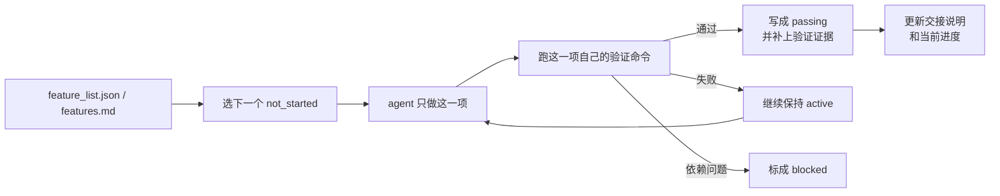

## 核心概念

- **功能清单是 harness 原语**：它不是"可选的规划工具"，而是其他所有 harness 组件依赖的基础数据结构。就像数据库里的表结构——你不能说"要不我们省掉主键吧"，省掉了整个系统就散架了。
- **三元组结构**：每个功能项是 `(行为描述, 验证命令, 当前状态)` 的三元组。缺了任何一项，这个功能项就不完整。行为描述告诉 agent 做什么，验证命令告诉它怎么算做完，状态告诉它现在到哪了。
- **状态机模型**：每个功能项有四种状态——`not_started`、`active`、`blocked`、`passing`。状态转移由 harness 控制，不是 agent 想改就能改。
- **通过状态门控**：功能从 `active` 变成 `passing` 的唯一方式是验证命令执行成功。这是不可逆的——`passing` 了就不能退回去。就像考试及格了就是及格了，不能事后改成分数。
- **单一权威来源**：项目里关于"该做什么"的所有信息，必须从一个功能清单派生。不能出现功能清单和对话记录矛盾的情况。
- **反向压力**：还没通过的功能项数量就是 harness 对 agent 施加的压力。压力归零 = 项目完成。

## 为什么功能清单必须是"原语"

文档是给人看的，原语是给系统用的。文档可以被忽略，原语不能被绕过。

类比数据库的触发器约束和应用层的检查逻辑：前者由数据库引擎强制执行，任何 SQL 都无法跳过；后者依赖于应用代码的正确性，可能被意外绕过。功能清单作为 harness 原语，就是数据库级别的约束——agent 不能绕过它。

具体来说，功能清单服务四个 harness 组件：

1. **调度器**：读状态，选下一个 `not_started` 的功能。就像工厂的排产系统——看完订单才知道下一步做什么。
2. **验证器**：执行验证命令，判断是否允许状态转移。就像质检——不是你说合格就合格，得通过检验。
3. **交接报告器**：从功能清单自动生成会话交接摘要。就像换班时自动生成的交接表——不用手写，系统自己出。
4. **进度追踪器**：统计各状态分布，提供项目健康度指标。就像仪表盘——一眼看出项目走到哪了。

## 怎么做

### 1. 定义一个最小化的功能清单格式

不需要复杂的系统，一个结构化的 Markdown 或 JSON 文件就够了。关键是每个条目必须有三元组：

```json
{
  "id": "F03",
  "behavior": "POST /cart/items with {product_id, quantity} returns 201",
  "verification": "curl -X POST http://localhost:3000/api/cart/items -H 'Content-Type: application/json' -d '{\"product_id\":1,\"quantity\":2}' | jq .status == 201",
  "state": "passing",
  "evidence": "commit abc123, test output log"
}
```

### 2. 让 harness 控制状态转移

agent 不能直接把状态改成 `passing`。它只能提交验证请求，harness 执行验证命令，根据结果决定是否允许状态转移。这就是"通过状态门控"——不是你说考过了就考过了，得看成绩单。

### 3. 在 CLAUDE.md 里写清楚规则

```
## 功能清单规则
- 功能清单文件: /docs/features.md
- 每次只激活一个功能项
- 功能项验证命令必须通过才能标为 passing
- 不要修改功能清单的状态——由验证脚本自动更新
```

### 4. 粒度校准

每个功能项应该是"一次会话能完成"的范围。太粗了做不完，太细了管理开销大。"用户可以添加商品到购物车"是一个好粒度，"实现购物车"太粗了，"创建 Cart 模型的 name 字段"太细了。就像切牛排——不能整块啃，也不能切成肉沫。

## 实际案例

一个电商平台的开发任务，10 个功能项。对比两种追踪方式：

**备忘录模式**：agent 用非结构化笔记记录进度。3 个会话后，笔记变成了"做了用户认证和商品列表、购物车基本完成但还有 bug、支付没开始"。新会话需要 20 分钟推断状态，最终重复实现了已完成的功能。就像你的购物清单上写着"牛奶、面包、还有那个什么来着"——到超市了你还是不知道要买什么。

**脊梁骨模式**：每个功能项有明确的状态和验证命令。新会话读取功能清单，3 分钟内知道：F01-F05 是 `passing`，F06 是 `active`（正在做），F07-F10 是 `not_started`。直接从 F06 继续，零重复。

定量结果：使用结构化功能清单的项目，功能完成率比自由形式高 45%，零重复实现。

## 关键要点

- **功能清单是 harness 的脊梁骨**，不是给人看的备忘录。调度器、验证器、交接器都依赖它。
- **每个功能项必须有三元组**：行为描述 + 验证命令 + 当前状态。缺一项就不完整——就像三条腿的凳子少一条腿。
- **状态转移由 harness 控制**，agent 不能自己改状态。通过验证 = 唯一的升级路径。
- **功能清单是项目的单一权威来源**——任何关于"该做什么"的信息都从这里派生。
- **粒度控制在"一次会话能完成"的范围**。太粗做不完，太细管不过来。

## 延伸阅读

- [Building Effective Agents - Anthropic](https://www.anthropic.com/research/building-effective-agents) — 明确指出功能列表是控制 agent 执行范围的"核心数据结构"
- [Harness Engineering - OpenAI](https://openai.com/index/harness-engineering/) — 强调"将工件外部化"的原则
- [Design by Contract - Bertrand Meyer](https://www.goodreads.com/book/show/130439.Object_Oriented_Software_Construction) — 契约式设计原则，功能列表的理论基础
- [How Google Tests Software](https://www.goodreads.com/book/show/13563030-how-google-tests-software) — 测试金字塔和行为规格的工程实践

## 练习

1. **功能清单设计**：定义一个最小化的功能清单 JSON schema。包含：id、行为描述、验证命令、当前状态、证据引用。用它描述一个包含 5 个功能的真实项目。

2. **验证严格性对比**：选 3 个功能，分别设计"宽松"验证（如"代码无语法错误"）和"严格"验证（如"端到端测试通过"）。对比两种验证下的假阳性率。

3. **单一来源原则审查**：审查一个已有的 agent 项目，检查是否存在与功能清单矛盾的范围信息（对话里的隐式需求、代码里的 TODO 注释等）。设计一个方案，把所有信息统一到功能清单中。

---

[English Version →](../../../en/lectures/lecture-09-why-agents-declare-victory-too-early/)

> 本篇代码示例：[code/](https://github.com/walkinglabs/learn-harness-engineering/blob/main/docs/zh/lectures/lecture-09-why-agents-declare-victory-too-early/code/)
> 实战练习：[Project 05. 让 agent 自己检查自己做的对不对](./../../projects/project-05-grounded-qa-verification/index.md)

# 第九讲. 防止 agent 提前宣告完成

你让 agent 实现"密码重置"功能。它改了数据库 schema、写了 API 端点、加了邮件模板，跑了单元测试（全部通过），然后自信地告诉你"做完了"。你实际一跑——密码重置链接发不出去（邮件服务配置缺失）、数据库迁移半途失败（schema 不一致）、端到端流程根本没走过一遍。

这种感觉你一定不陌生——考试时把卷子写得满满当当，信心满满地第一个交卷，结果成绩出来不及格。卷子写满了，不代表做对了。

这不是偶然事件。Guo 等人 2017 年在 ICML 上的经典论文证明：**现代神经网络系统性地过度自信**——模型自报的置信度显著高于实际准确率。AI 编码 agent 也一样：它"觉得"做完了，但实际上差得远。你的 harness 必须用外部化的、基于执行的验证来替代 agent 的"感觉"。

## 滑坡效应

过早完成声明几乎总是一样的套路：代码看着还行——语法正确、逻辑似乎合理，静态检查没有明显错误。但 harness 没有强制要求全面执行验证，agent 跳过了实际运行或只跑了部分测试。跑了单元测试但跳过集成测试，跑了测试但没检查覆盖率。最后"代码看起来没问题"就被当作了"功能已完成"的证据。交卷了。

每一步都在丢失信息。从任务规范到代码实现到运行时行为，每次转换都可能引入偏差，而每次跳过的验证都加剧了信息不对称。

## 三层终止检查

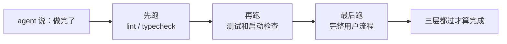

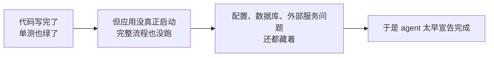

## 核心概念

- **过早完成声明**：agent 断言任务完成，但实际上存在未满足的正确性规范。核心问题：agent 依据代码层面的局部信心做判断，系统级正确性需要全局验证。
- **置信度校准偏差**：agent 自报的完成信心与实际完成质量之间的系统性差距。对复杂多文件任务，这个偏差显著为正——agent 总是比实际做得更自信。就像学生考完试估分总是偏高。
- **终止标准**：一组明确的、可执行的判定条件，定义在 harness 里。agent 必须满足所有条件才能声明完成。"完成"从主观判断变成了客观判定。
- **验证-确认双闸门**：第一层验证检查"代码是否正确实现了指定行为"；第二层确认检查"系统级行为是否满足端到端需求"。两层都通过才算完成。
- **运行时反馈信号**：来自程序执行的日志、进程状态、健康检查。这是 harness 判定完成质量的客观基础。
- **完成优先级约束**：先验证功能正确性，再处理性能，最后管风格。核心功能没验证通过之前，不许做重构。

## 单元测试通过 ≠ 任务完成

这是最常见的陷阱，也是最危险的一个。agent 写了代码，跑了单元测试，全部绿色，然后说"做完了"。但单元测试的设计哲学——隔离被测单元、模拟依赖——恰好使其无法检测跨组件问题：

**接口不匹配**：渲染进程传给预加载脚本的文件路径是相对路径，但预加载脚本期望绝对路径。各自的单元测试都用了 mock，都通过了。只有端到端跑通时才发现问题。就像乐队里每个乐手各自练习都完美，但合在一起才发现定调不一样。

**状态传播错误**：数据库迁移改了表结构，但 ORM 的缓存层还持有旧结构的缓存条目。单元测试每次都是全新的 mock 环境，不会暴露这种跨层状态不一致。

**环境依赖性**：代码在测试环境（一切 mock）行为正确，在真实环境因配置差异、网络延迟、服务不可用而失败。就像在排练室唱得很好，上台演出时音响设备出了问题。

### "顺便重构"是完成判定的毒药

Claude Code 有一个常见行为模式：在核心功能还没验证通过时就开始重构代码、优化性能、改进风格。Knuth 说的"过早优化是万恶之源"在 agent 场景中有了新含义——重构会改变已完成验证和未完成验证之间的边界，可能破坏之前隐式正确的代码路径。就像你数学大题还没做完，就跑去把前面选择题的答案重新抄一遍格式——浪费时间不说，还可能抄错了。

### 自我评价的系统性偏差

Anthropic 在 2026 年的研究中发现了一个更深层的失败模式：**当 agent 被要求评估自己的工作时，它系统性地过度正面评价——即使人类观察者认为质量明显不达标。** 这就像让学生自己给自己判卷——对自己的答案总是特别宽容。

这个问题在主观任务（如设计审美）上尤其严重——"布局是否精致"是一个判断题，agent 可靠地偏向正面。即使在有可验证结果的任务上，agent 也会因为判断失误而影响表现。

解决方案不是让 agent "更客观"——同一个模型既生成又评估，内在地倾向对自己慷慨。**解决方案是把"干活的人"和"检查的人"分开。** 就像考试不能让学生自己批改自己的卷子——得有个独立的阅卷老师。

一个独立的评估 agent，经过专门调校为"挑剔"之后，比让生成 agent 自我评估有效得多。Anthropic 的实验数据：

| 架构 | 运行时长 | 成本 | 核心功能是否可用 |
|------|---------|------|---------------|
| 单 agent 裸跑 | 20 分钟 | $9 | 否（游戏实体无法响应输入） |
| 三 agent（planner + generator + evaluator） | 6 小时 | $200 | 是（游戏可以正常游玩） |

这是同一个模型（Opus 4.5），同一段提示词（"做一个 2D 复古游戏编辑器"）。区别只在 harness——从"裸奔"到"planner 扩展需求 → generator 逐功能实现 → evaluator 用 Playwright 实际点击测试"。

> 来源：[Anthropic: Harness design for long-running application development](https://www.anthropic.com/engineering/harness-design-long-running-apps)

## 怎么防止提前交卷

### 1. 外部化终止判定

完成判定不应该由 agent 自己做。harness 独立执行终止校验，输入是运行时信号，不是 agent 的置信度。在 CLAUDE.md 里写清楚：

```
## 完成定义
- 功能完成 = 端到端验证通过，不是"代码写完了"
- 必须运行的验证层级:
  1. 单元测试通过
  2. 集成测试通过
  3. 端到端流程验证通过
- 在第 1 层没通过时，不许进入第 2 层
- 在第 2 层没通过时，不许进入第 3 层
```

### 2. 构建三层终止校验

- **第一层：语法与静态分析**。成本最低，信息量最小，但必须通过。这是最低限度的检查——字都没写错才能往下看。
- **第二层：运行时行为验证**。测试执行、应用启动检查、关键路径验证。这是核心完成证据。不仅要写了，还要能跑。
- **第三层：系统级确认**。端到端测试、集成验证、用户场景模拟。防止过早声明的最后一道防线。不仅要能跑，还要跑对。

### 3. 为 agent 设计好的"红笔批注"

OpenAI 在 Codex 实践中提出了一个特别有效的模式：**给 agent 写的错误消息要包含修复指导**。不要像阅卷老师只画个大红叉，要像好老师一样在旁边写上"这里应该怎么改"。不要用 `"Test failed"`，而用 `"Test failed: POST /api/reset-password returned 500. Check that the email service config exists in environment variables. The template file should be at templates/reset-email.html."` 这种具体的、可操作的反馈让 agent 能自我修正，而不需要人类介入。

### 4. 捕获运行时信号

有效的运行时信号包括：
- 应用是否成功启动并达到就绪状态？
- 关键功能路径在运行时是否执行成功？
- 数据库写入、文件操作等副作用是否正确？
- 临时资源是否被清理？

## 实际案例

**任务**：实现用户密码重置功能。涉及数据库操作、邮件发送和 API 端点修改。

**提前交卷路径**：agent 修改数据库 schema、编写 API 端点、添加邮件模板、跑单元测试（通过）、声明完成。卷子写得满满当当。

**实际扣分项**：(1) 端到端流程未测试——重置链接的实际发送和验证未确认。(2) 数据库迁移在部分执行后失败，导致 schema 不一致。(3) 邮件服务配置在目标环境中缺失。

**harness 介入**：终止校验强制执行——(1) 启动完整应用验证重置端点可访问；(2) 执行完整重置流程；(3) 验证数据库状态一致性。所有缺陷在会话内被发现，节省了 5-10 倍的后续修复成本。独立阅卷老师批出了真正的问题。

## 关键要点

- **agent 系统性地过度自信**——置信度校准偏差是客观存在的。卷子写满了不代表做对了。
- **完成判定必须外部化**——harness 独立验证，不信任 agent 的"感觉"。不能让学生自己批自己的卷子。
- **三层校验缺一不可**——语法通过、行为通过、系统通过，层层递进。
- **错误消息要像好老师的红笔批注**——包含具体修复步骤，让 agent 能自我修正。
- **核心功能验证通过之前不许重构**——完成优先级约束是防止过早优化的关键。

## 延伸阅读

- [On Calibration of Modern Neural Networks - Guo et al.](https://arxiv.org/abs/1706.04599) — 证明现代深度网络系统性地过度自信
- [Building Effective Agents - Anthropic](https://www.anthropic.com/research/building-effective-agents) — 运行时证据在完成判定中的关键作用
- [Harness Engineering - OpenAI](https://openai.com/index/harness-engineering/) — 过早完成声明是 agent 的主要失败模式之一
- [The Art of Software Testing - Myers](https://www.goodreads.com/book/show/137543.The_Art_of_Software_Testing) — 测试方法层次和有效性的经典参考

## 练习

1. **终止校验函数设计**：为一个涉及数据库迁移和 API 修改的任务设计完整的终止校验。列出需要的运行时信号和每个信号的通过/失败标准。在一个实际任务上运行，记录它发现了哪些隐藏问题。

2. **校准偏差测量**：选 10 个不同类型的编码任务，记录 agent 的自报完成信心和实际完成质量。计算偏差值，分析它和任务复杂度的关系。

3. **多层防御实验**：对同一组任务跑三种配置——(a) 仅静态分析，(b) 加单元测试，(c) 完整三层校验。比较过早完成声明的比例和未捕获缺陷的数量。

---

[English Version →](../../../en/lectures/lecture-10-why-end-to-end-testing-changes-results/)

> 本篇代码示例：[code/](https://github.com/walkinglabs/learn-harness-engineering/blob/main/docs/zh/lectures/lecture-10-why-end-to-end-testing-changes-results/code/)
> 实战练习：[Project 05. 让 agent 自己检查自己做的对不对](./../../projects/project-05-grounded-qa-verification/index.md)

# 第十讲. 跑通完整流程才算真正验证

你让 agent 给 Electron 应用加一个文件导出功能。它写了渲染进程组件、预加载脚本、服务层逻辑，每个组件的单元测试都通过了。agent 说"做完了"。你实际一点击导出按钮——文件路径格式不对、进度条没反应、大文件导出时内存泄漏。5 个组件边界缺陷，单元测试一个都没发现。

这就像一个合唱团排练——每个声部单独唱的时候都完美，但合在一起的时候，女高音比男低音快了半拍，伴奏的调子和主旋律差了半个音。每个部分都"对"了，但整体跑调了。

Google 的测试金字塔告诉我们：大量单元测试是基础，但如果你止步于此，就会系统性地漏掉组件交互问题。对于 AI 编码 agent 来说，这个问题更严重——agent 倾向于只跑最快的测试然后宣告完成。**只有端到端测试能证明系统级缺陷不存在**。

## 单元测试的盲区

单元测试的设计哲学是隔离——模拟依赖，专注被测单元。这个哲学使单元测试快速且精确，但也制造了系统性的盲区。就像合唱排练时每个声部戴着耳机对着伴奏唱——听着都挺好，但真正合在一起才发现问题：

**接口不匹配**：渲染进程传给预加载脚本的文件路径是相对路径，但预加载脚本期望绝对路径。各自的单元测试都用了 mock，都通过了。只有端到端跑通时才发现问题——就像两个声部各自练的时候都觉得节奏没问题，一合才发现一个用 4/4 拍一个用 3/4 拍。

**状态传播错误**：数据库迁移改了表结构，但 ORM 的缓存层还持有旧结构的缓存条目。单元测试每次都是全新的 mock 环境，不会暴露这种跨层状态不一致。就像换了一首歌的歌词，但有人还在唱旧版本。

**资源生命周期问题**：文件句柄、数据库连接、网络套接字的获取和释放跨越多个组件。单元测试为每个测试创建和销毁独立资源，不会暴露资源竞争或泄漏。就像排练时每个声部轮流用麦克风，但演出时所有声部同时上台——话筒不够用了。

**环境依赖性**：代码在测试环境（一切 mock）行为正确，在真实环境因配置差异、网络延迟、服务不可用而失败。就像排练厅里唱得好好的，到了户外音乐节风一吹话筒一啸叫就全乱了。

## 端到端测试不仅改变结果，还改变行为

这是很多人没意识到的一点：当 agent 知道它的工作要过端到端测试时，它的编码行为会改变。

1. **考虑组件交互**：写代码时会想"这个接口和上游怎么对接"，而不是只关注单个函数。就像知道最终要合在一起唱，练习的时候就会注意听其他声部。
2. **尊重架构边界**：有架构约束的系统里，端到端测试迫使 agent 遵守边界规则。就像乐谱上标注了"此处渐强"，你得跟着来。
3. **处理错误路径**：端到端测试通常包含故障场景，迫使 agent 考虑异常处理。就像排练时模拟了"话筒突然没声了"的情况，你知道该怎么做。

## 测试金字塔与审查反馈提升

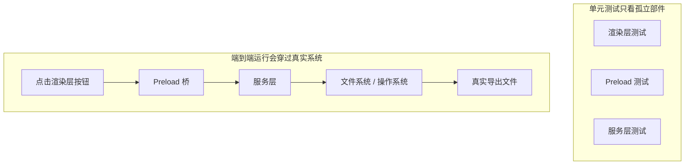

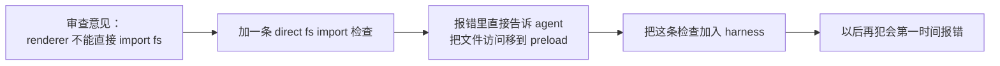

OpenAI 在 Codex 工程实践中强调：**为 agent 写的错误消息必须包含修复指导**。不写 `"Direct filesystem access in renderer"`，而写 `"Direct filesystem access in renderer. All file operations must go through the preload bridge. Move this call to preload/file-ops.ts and invoke it via window.api."` 这把架构规则变成了自动修正的闭环。就像合唱排练时指挥不只说"你唱错了"，而是说"这里你快了半拍，听一下女低音的节奏，在第 32 小节进入"。

## 核心概念

- **组件边界缺陷**：组件 A 和 B 各自单元测试通过，但它们的交互产生了不正确的行为。这是端到端测试最擅长捕获的问题类型——合唱里各声部单独都对但合起来跑调的那种。
- **测试充分性梯度**：单元测试能检测的缺陷 <= 集成测试能检测的缺陷 <= 端到端测试能检测的缺陷。每往上一层，检测能力增强。
- **架构边界执行规则**：把架构文档里的规则（如"渲染进程不能直接访问文件系统"）变成可执行的自动化检查。从"写在纸上"变成"跑在 CI 里"。
- **审查反馈提升**：把重复出现的代码审查意见转化为自动化测试。每次发现重复问题就加一条规则，harness 会自动变强。就像合唱排练时指挥把常见的错误编成练习曲——下次再犯同样的错误，不用指挥说，练习曲自己就暴露了。
- **面向 agent 的错误消息**：失败信息不只是说"出了什么问题"，还要告诉 agent 具体怎么修。这把测试失败变成自我修正的反馈循环。

## 怎么做

### 0. 先定好架构边界，再写端到端测试

端到端测试的前提是系统有清晰的边界。如果架构是一团面条，端到端测试只会证明"这团面条整体能跑"，不会告诉你哪里违反了设计意图。就像合唱团如果连分声部都没分好，排练再多也是乱唱。

OpenAI 的经验：**对 agent 生成的代码库，架构约束必须是第一天就建立的早期前置条件，不是等团队规模大了再考虑的事。** 原因很直接——agent 会复制仓库中已有的模式，即使那些模式是不均匀的或次优的。没有架构约束，agent 会在每次会话中引入更多偏差。

OpenAI 采用了"分层领域架构"——每个业务领域被分成固定的层：Types → Config → Repo → Service → Runtime → UI。依赖方向严格向前，跨领域关注点通过显式的 Providers 接口进入。任何其他依赖都是禁止的，并且通过自定义 lint 机械执行。

关键原则：**执行不变量，不微管实现。** 比如要求"数据在边界解析"，但不规定用哪个库。错误消息要包含修复指导——不只是说"违规了"，而是告诉 agent 具体怎么改。

> 来源：[OpenAI: Harness engineering: leveraging Codex in an agent-first world](https://openai.com/index/harness-engineering/)

### 1. harness 必须包含端到端层

在你的验证流程里明确：对于涉及跨组件修改的任务，端到端测试通过是完成的前置条件：

```
## 验证层级
- 层级 1: 单元测试 (必须通过)
- 层级 2: 集成测试 (必须通过)
- 层级 3: 端到端测试 (涉及跨组件修改时必须通过)
- 跳过任何必须层级的任务 = 未完成
```

### 2. 把架构规则变成可执行检查

每条架构约束都应该有对应的测试或 lint 规则：

```bash
# 检查渲染进程是否直接调用 Node.js API
grep -r "require('fs')" src/renderer/ && exit 1 || echo "OK: no direct fs access in renderer"
```

### 3. 设计面向 agent 的错误消息

失败信息要包含三要素：什么出了问题、为什么、怎么修：

```
ERROR: Found direct import of 'fs' in src/renderer/App.tsx:12
WHY: Renderer process has no access to Node.js APIs for security
FIX: Move file operations to src/preload/file-ops.ts and call via window.api.readFile()
```

### 4. 建立审查反馈提升流程

每次在代码审查中发现新类型的 agent 错误，就把它变成自动化检查。一个月后你的 harness 会比月初强得多。就像合唱团的排练笔记——每次排练发现的问题都记下来，下次排练前先检查这些点。久而久之，常见错误越来越少，音乐越来越和谐。

## 实际案例

**任务**：在 Electron 应用中实现文件导出功能。涉及渲染进程 UI、预加载脚本文件系统代理、服务层数据转换。

**各声部单独唱（单元测试通过）**：渲染组件测试（通过，mock 文件操作）、预加载脚本测试（通过，mock 文件系统）、服务层测试（通过，mock 数据源）。agent 声明完成。

**合唱合在一起（端到端测试揭示的缺陷）**：

| 缺陷 | 描述 | 单元测试 | 端到端 |
|------|------|---------|--------|
| 接口不匹配 | 文件路径格式不一致 | 未检测 | 检测 |
| 状态传播 | 导出进度未通过 IPC 传回 UI | 未检测 | 检测 |
| 资源泄漏 | 大文件导出句柄未释放 | 未检测 | 检测 |
| 权限问题 | 打包环境权限不同 | 未检测 | 检测 |
| 错误传播 | 服务层异常未到 UI 层 | 未检测 | 检测 |

5 个缺陷全部被端到端测试捕获，单元测试一个都没发现。代价是测试时间从 2 秒增加到 15 秒——在 agent 工作流里完全可以接受。每个声部单独唱得再好，也比不上一次完整的合唱排练。

## 关键要点

- **单元测试对组件边界缺陷系统性盲视**——它们的隔离设计恰好使其无法检测交互问题。每个人唱得都对，不代表合唱不跑调。
- **端到端测试不仅检测缺陷，还改变 agent 的编码行为**——让它更关注集成和边界。
- **架构规则必须可执行**——不是写在文档里等人来看，而是每次提交自动检查。
- **错误消息要面向 agent 设计**——包含"怎么修"的具体步骤，形成自我修正闭环。
- **审查反馈提升让 harness 自动变强**——每个被捕获的缺陷类别都变成永久防线。

## 延伸阅读

- [How Google Tests Software - Whittaker et al.](https://www.goodreads.com/book/show/13563030-how-google-tests-software) — 测试金字塔模型的经典来源
- [Harness Engineering - OpenAI](https://openai.com/index/harness-engineering/) — 架构约束自动化执行的工程实践
- [Chaos Engineering - Netflix (Basiri et al.)](https://ieeexplore.ieee.org/document/7466237) — 主动注入故障验证系统弹性
- [QuickCheck - Claessen & Hughes](https://www.cs.tufts.edu/~nr/cs257/archive/john-hughes/quick.pdf) — 属性测试方法，介于示例测试和形式化验证之间

## 练习

1. **跨组件缺陷检测**：选一个涉及至少三个组件的修改任务。先只跑单元测试记录结果，再跑端到端测试。分析每个额外发现的缺陷属于哪种跨层交互问题。

2. **架构规则自动化**：选项目里的一条架构约束，把它变成可执行检查（含面向 agent 的错误消息）。集成到 harness 里，用基准任务验证效果。

3. **审查反馈提升**：从代码审查历史中找一个重复出现的意见类型，按五步流程转化为自动化检查。比较提升前后该类问题的出现频率。

---

[English Version →](../../../en/lectures/lecture-11-why-observability-belongs-inside-the-harness/)

> 本篇代码示例：[code/](https://github.com/walkinglabs/learn-harness-engineering/blob/main/docs/zh/lectures/lecture-11-why-observability-belongs-inside-the-harness/code/)
> 实战练习：[Project 06. 搭建一套完整的 agent 工作环境](./../../projects/project-06-runtime-observability-and-debugging/index.md)

# 第十一讲. 让 agent 的运行过程可观测

你让 agent 做一个功能，它跑了 20 分钟，改了一堆文件，然后告诉你"做完了但有两个测试失败"。你问它为什么失败，它说"不太确定，可能是时序问题"。你问它改了哪些关键路径，它说"让我看看代码……"。

这不是 agent 能力不够，是你的 harness 没有给它装仪表盘。想象你在开一辆没有仪表盘的车——没有速度表、没有油量表、没有发动机故障灯。你能开，但你不知道开多快、还剩多少油、发动机是不是快爆了。技术再好的司机，蒙着眼也得出事。

**没有可观测性，agent 在不确定状态中做决策，评估变成主观判断，重试变成盲目摸索。** OpenAI 和 Anthropic 都将可靠性定义为证据问题——harness 必须以可指导下一步决策的形式暴露运行时行为和评估信号。

## 可观测性缺失的真实代价

当 harness 缺乏可观测性时，四类问题系统性出现：

**无法区分"正确"和"看似正确"**：一个函数在代码审查时看起来完全正确——语法对、逻辑通。但运行时因为边界条件处理错误，在特定输入下产生了不正确结果。只有运行时追踪能揭示实际执行路径偏离了预期。就像一个演员排练时台词全对了，但上台演出时灯光一打，表情和走位全都变了——你不看现场是发现不了的。

**评估变成玄学**：没有评分标准和验收条件时，评估者（人或 agent）依赖隐式假设。同一个输出，不同评估者可能给出截然不同的评价。质量评估不可复现。就像体操比赛没有评分标准——这个裁判觉得你的动作优雅，那个裁判觉得你落地不稳，谁说了算？

**重试变成盲猜**：agent 不知道为什么失败时，重试方向是随机的。它可能在错误的方向上反复尝试——修复了不相关的代码路径而忽略真正的故障根源。就像你开车发现车跑偏了，但你没有仪表盘——你猜是轮胎的问题换了轮胎，实际是方向盘的 alignment 出了问题。每次盲重试都消耗 token 和时间。

**会话交接信息断崖**：当未完成的工作移交给下一个会话时，缺乏可观测性意味着新会话必须从零诊断系统状态。Anthropic 的长期运行 agent 观察表明，这种重复诊断可能占会话总时间的 30-50%。就像换班司机上车发现没有交接记录——他得花半小时检查油量、胎压、发动机状态才能出发。

## Claude Code 的真实场景

想象一个使用"计划者-生成者-评估者"三角色工作流的 harness，执行"为应用添加暗色模式"任务。

**没有仪表盘**：计划者输出模糊描述。生成者根据模糊描述实现暗色模式，但和计划者的隐式预期不一致。评估者基于自己的隐式标准拒绝，但说不出具体哪里不对——"感觉不太对"。生成者基于模糊拒绝理由盲重试。循环 3-4 次，总耗时约 45 分钟，最终勉强产出。

**有完整仪表盘**：计划者输出冲刺合同——列明要改哪些组件、每个组件的验证标准、排除项（不处理打印样式）。生成者按合同实现。运行时可观测性记录每个组件的样式加载和应用过程。评估者用评分标准逐维度评估，附具体证据引用——"按钮颜色对比度不足（WCAG AA 标准 4.5:1，实测 2.1:1）"。一次迭代出高质量结果，总耗时约 15 分钟。

效率差 3 倍。区别只在可观测性——给车装上了仪表盘。

## 双层可观测性

可观测性不是"多打点日志"那么简单。它分两层，缺一不可：

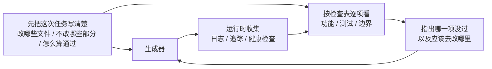

**运行时可观测性**：系统层的信号——日志、追踪、进程事件、健康检查。回答"系统做了什么"。这是你车上的仪表盘——速度、油量、发动机温度。

**过程可观测性**：harness 决策工件的可见性——计划、评分标准、验收条件。回答"为什么这个变更应该被接受"。这是你的导航系统——不光知道现在在哪，还知道为什么走这条路。

## 核心概念

- **运行时可观测性**：系统层的信号——日志、追踪、进程事件、健康检查。回答"系统做了什么"。
- **过程可观测性**：harness 决策工件的可见性——计划、评分标准、验收条件。回答"为什么这个变更应该被接受"。
- **任务轨迹**：一个任务从开始到完成的完整决策路径记录，类似分布式系统中的请求追踪。agent 的每一步操作及其上下文都被记录。就像黑匣子——出了问题可以回放完整过程。
- **冲刺合同**：编码开始前协商的短期协议——明确任务范围、验证标准、排除项。是过程可观测性的核心工具。
- **评估评分标准**：把质量评估从主观判断变成基于证据的结构化评分。使不同评估者对同一输出产生相似结论。就像体操比赛的评分标准——有了它，十个裁判的分才不会差太远。
- **双层可观测性**：系统层和过程层同时设计、相互增强。运行时信号解释行为，过程工件解释意图。

## 为什么 agent 自己解决不了这个问题

你可能在想："agent 不能自己打日志吗？" 问题在于：

1. **agent 不知道它不知道什么**——它不会主动记录自己没意识到需要的信号。就像你不知道油箱快漏了的时候，你不会去看油量表——因为你压根不知道该看。
2. **日志格式不统一**——不同会话用不同的日志格式，无法做系统化分析。就像十个司机各写各的交接记录，格式都不一样，下一个司机看不懂。
3. **过程可观测性不是日志能解决的**——冲刺合同和评分标准是结构化的工件，需要 harness 层面的支持。不是多 print 几行就能搞定的。

## 怎么装仪表盘

### 1. 在 harness 里内置运行时信号采集

不要依赖 agent 自己打日志。harness 应该自动采集以下信号：

- **应用生命周期**：启动、就绪、运行、关闭各阶段状态
- **功能路径执行**：关键路径的执行记录，包括入口、检查点和出口
- **数据流**：数据在组件间的流转记录
- **资源利用**：异常的资源使用模式（如内存持续增长）
- **错误和异常**：完整的错误上下文，不只是错误消息

### 2. 实施冲刺合同

在每个任务开始前，生成者和评估者（可能是同一个 agent 的不同调用）协商一份合同——就像施工队开工前签的施工协议：

```markdown
# 冲刺合同: 暗色模式支持

## 范围
- 修改主题切换组件
- 更新全局 CSS 变量
- 添加暗色模式测试

## 验证标准
- 每个组件的视觉回归测试通过
- 主流程端到端测试通过
- 无样式闪烁 (FOUC)

## 排除项
- 不处理打印样式
- 不处理第三方组件暗色模式
```

### 3. 建立评估评分标准

把"好不好"变成可量化的评分——就像给体操比赛定评分标准：

```markdown
# 评分标准

| 维度 | A | B | C | D |
|------|---|---|---|---|
| 代码正确性 | 所有测试通过 | 主流程通过 | 部分通过 | 编译失败 |
| 架构合规 | 完全合规 | 轻微偏离 | 明显偏离 | 严重违反 |
| 测试覆盖 | 主流程+边缘 | 仅主流程 | 仅有骨架 | 无测试 |
```

### 4. 用 OpenTelemetry 标准化

为每个 harness 会话创建一个 trace，每个任务创建一个 span，每个验证步骤创建子 span。使用标准属性标注关键信息。这样可观测性数据可以和标准工具链（Jaeger、Zipkin）集成。

## Anthropic 的三 agent 架构实验

Anthropic 在 2026 年 3 月发布了一项系统性的 harness 实验。他们用三种架构跑同一个任务（"用 Web Audio API 做一个浏览器端 DAW"），记录了详细的阶段数据：

| Agent 和阶段 | 时长 | 成本 |
|------------|------|------|
| Planner（规划者） | 4.7 分钟 | $0.46 |
| Build 第 1 轮 | 2 小时 7 分钟 | $71.08 |
| QA 第 1 轮 | 8.8 分钟 | $3.24 |
| Build 第 2 轮 | 1 小时 2 分钟 | $36.89 |
| QA 第 2 轮 | 6.8 分钟 | $3.09 |
| Build 第 3 轮 | 10.9 分钟 | $5.88 |
| QA 第 3 轮 | 9.6 分钟 | $4.06 |
| **总计** | **3 小时 50 分钟** | **$124.70** |

三个 agent 各司其职，每个都有明确的可观测性角色：

**Planner（规划者）**：接收一段 1-4 句话的用户需求，扩展成完整产品规格。被要求"大胆设定范围"并且"专注于产品上下文和高层技术设计，而不是详细的技术实现"。原因是：如果 planner 过早指定了粒度技术细节且搞错了，错误会级联到下游实现。更好的做法是约束交付物，让 agent 在执行中自己找到路径。就像建筑设计师只画效果图和结构图，不规定每块砖怎么砌。

**Generator（生成者）**：按 sprint 逐个功能实现。每个 sprint 前和 evaluator 协商一份 sprint 合同——约定这个功能块"做完"的标准。然后按合同实现，自评后交给 QA。按合同施工，不按感觉施工。

**Evaluator（评估者）**：用 Playwright MCP 像用户一样点击运行中的应用，测试 UI 功能、API 端点和数据库状态。对每个 sprint 按四个维度评分——产品深度、功能性、视觉设计和代码质量。每个维度有硬性阈值，任一不达标则 sprint 失败，generator 收到详细反馈后修复。就像验收工程师拿着验收标准逐项检查——不达标就打回去重做。

QA 第 1 轮反馈的示例——"这是一个视觉上令人印象深刻的应用，AI 集成工作良好，但核心 DAW 功能有几个是展示性的，没有交互深度：剪辑不能拖拽/移动，没有乐器 UI 面板（合成器旋钮、鼓垫），没有视觉效果编辑器（EQ 曲线、压缩器仪表）"。这些不是边缘情况——它们是让 DAW 可用的核心交互。具体的、有证据的反馈，不是"感觉不对"。

Evaluator 不是一开始就这么强。早期版本会识别出合理的问题，然后说服自己这些问题不严重，最终批准工作。调校方式是：读 evaluator 的日志，找到它的判断和人类判断分叉的地方，更新 QA 的 prompt 解决那些问题。经过几轮这种开发循环，evaluator 的评分才变得合理。就像训练一个新验收工程师——一开始他太宽容，出了几次事故后学会了严格。

> 来源：[Anthropic: Harness design for long-running application development](https://www.anthropic.com/engineering/harness-design-long-running-apps)

## 关键要点

- **可观测性是 harness 的架构属性**——不是事后添加的功能，而是设计时必须考虑的核心能力。仪表盘不是可选配件，是出厂标配。
- **双层可观测性缺一不可**——运行时信号解释"发生了什么"，过程工件解释"为什么这样做"。速度表和导航系统各有各的用处。
- **冲刺合同前置对齐工作**——防止"生成者做了评估者因可预见原因立即拒绝的东西"。施工协议要在开工前签，不是完工后补。
- **评分标准让评估可复现**——不同评估者对同一输出产生相似评分。有了评分标准，十个裁判的分才不会差太远。
- **可观测性缺失导致 30-50% 的会话时间浪费在重复诊断上**。

## 延伸阅读

- [Observability Engineering - Charity Majors](https://www.honeycomb.io/blog/observability-engineering-book) — 现代可观测性工程的理论和实践框架
- [Dapper - Google (Sigelman et al.)](https://research.google/pubs/pub36356/) — 大规模分布式追踪的开创性实践
- [Harness Design - Anthropic](https://www.anthropic.com/engineering/harness-design-long-running-apps) — 引入冲刺合同和评估评分标准
- [Site Reliability Engineering - Google](https://sre.google/sre-book/table-of-contents/) — 可观测性在生产系统中的系统化应用

## 练习

1. **可观测性差距分析**：审查你当前的 harness，评估系统层和过程层可观测性。找出无法从现有信号区分的系统状态，提出补充方案。

2. **冲刺合同实践**：为一个真实任务写冲刺合同。让 agent 按合同执行，对比没有合同时的效率和质量差异。

3. **任务轨迹构建**：记录一个完整编码任务中 agent 的每一步操作。用 OpenTelemetry 语义约定标注。分析轨迹中的信息瓶颈——哪些步骤的决策缺乏足够的信号支持。

---

[English Version →](../../../en/lectures/lecture-12-why-every-session-must-leave-a-clean-state/)

> 本篇代码示例：[code/](https://github.com/walkinglabs/learn-harness-engineering/blob/main/docs/zh/lectures/lecture-12-why-every-session-must-leave-a-clean-state/code/)
> 实战练习：[Project 06. 搭建一套完整的 agent 工作环境](./../../projects/project-06-runtime-observability-and-debugging/index.md)

# 第十二讲. 每次会话结束前都做好交接

你的 agent 跑了一下午，改了 20 个文件，提交了代码，会话结束。下一个 agent 会话开始，一上来就发现：构建失败了、测试红了、临时调试文件到处都是、功能清单没更新、进度完全不清楚。新会话的前 30 分钟全花在"搞清楚上一个会话到底干了什么"上。

这就像大学宿舍——你不倒垃圾，下一个室友进来就得替你收拾。他本来的计划是复习考试，结果先花半小时收拾你留下的烂摊子。更要命的是，收拾完了他也不想复习了——环境太差，心情也差。

OpenAI 和 Anthropic 都明确指出：**长期可靠性取决于操作纪律，不仅是单次运行的成功。** 每个会话结束时的状态质量，直接决定下一个会话的效率。

## 熵增是默认状态

Lehman 的软件演化定律告诉我们：持续变更的系统，除非主动管理，否则复杂性必然增加。这对 AI 编码 agent 尤其成立——agent 每次会话都会引入变更，如果不在退出时清理，技术债务会指数级累积。宿舍不打扫，脏衣服和外卖盒只会越堆越多，不会自己消失。

OpenAI 在 5 个月的 Codex 实验中观察到：**agent 会复制仓库中已有的模式——即使那些模式是不均匀的或次优的。** 随着时间的推移，这种复制必然导致漂移。就像宿舍里的公共区域——第一个人在桌上放了一个杯子，第二个人觉得"反正已经乱了"又放了一个，一周后桌上堆满了。

OpenAI 团队最初花每周五（20% 的工作时间）手动清理 "AI slop"。不出所料，这种方式不可扩展。就像宿舍每周大扫除一次——其他六天的脏乱差还是得忍。他们的解决方案是：

1. **把"黄金原则"编码进仓库**：比如"优先使用共享工具包而非手写的 ad-hoc 辅助函数"（保持不变量集中）、"不要 YOLO 式地猜数据结构"（验证边界或依赖类型化 SDK）。这些原则是具体的、机械的、可自动检查的。
2. **建立周期性的清理流程**：一组后台 Codex 任务定期扫描偏差，更新质量评分，开针对性的重构 PR。大多数可以在一分钟内审查并自动合并。就像宿舍安装了自动扫地机器人——不用你动手，定期清理。
3. **人类品味捕获一次，持续执行**：审查意见、重构 PR、用户侧 bug 都被转化为文档更新或直接编码到工具中。当文档不够用时，把规则提升为代码。就像把宿舍公约从"口头约定"变成"贴在门上的检查表"。

这个机制就像垃圾回收——技术债是高息贷款，持续小额还清几乎总是比攒到一次性爆发好得多。

> 来源：[OpenAI: Harness engineering: leveraging Codex in an agent-first world](https://openai.com/index/harness-engineering/)

## 清洁状态：不只看地上有没有垃圾

清洁状态不是单一的"代码能编译"。代码能无错构建——这是最基本的，下一个会话不应该先修构建错误。就像你搬出去的时候水电不能是断的。所有测试也得通过，包括会话之前就存在的测试——会话有责任不破坏已有功能。而且要在 CI 环境验证，不是"在我机器上通过"。

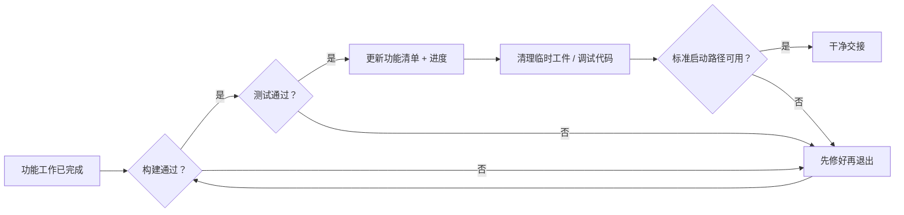

但这还不够。当前进度必须记录在机器可读的工件中——已完成的子任务和通过标准、进行中但未完成的子任务和当前状态、尚未开始的子任务。好的进度记录减少 60-80% 的会话启动诊断时间。调试日志、临时文件、注释掉的代码、TODO 标记这些临时工件得清理干净，它们增加下一个会话的认知负担。标准启动路径也必须可用——下一个会话能不能不人工干预就开始工作？环境初始化、代码库加载、上下文获取、任务选择，这些路径不能被破坏。

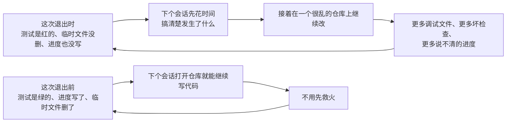

## 核心概念

- **清洁状态**：会话结束时系统满足五个条件——构建通过、测试通过、进度已记录、无过时工件、启动路径可用。缺一个都不算"做完"。
- **会话完整性**：类比数据库事务——要么全部提交并留下清洁状态，要么回滚到上一致状态。没有中间地带。
- **质量文档**：对每个模块的质量等级做持续记录的活跃工件。不是一次性评估，而是跟踪代码库是变强了还是变弱了。
- **清理循环**：定期的维护会话，目标是系统性减少代码库中的熵。不是紧急修复，而是常规运维——就像宿舍的每周值日表。
- **harness 简化**：随着模型能力提升，定期移除不再必要的 harness 组件。今天必要的约束，三个月后可能是多余的开销。
- **幂等清理**：清理操作无论执行多少次都产生相同结果。确保清理在失败重试场景中仍然安全。

## "以后再清理"是永远不清理

最常见的心理陷阱是"这次来不及清理了，下次再弄"。但下次的 agent 不知道你上次留下了什么——它看到的是一堆混乱的代码和不确定的状态。它会花大量时间推断"这堆代码里哪些是有意的，哪些是临时的"。

更糟的是，每个会话都有自己的任务目标。新会话来的时候是要做新功能的，不是来清理上一个会话的烂摊子的。它会忽略混乱直接开始新工作，然后在混乱的基础上引入更多混乱。这是熵增的正反馈循环——就像宿舍越乱你越不想收拾，越不收拾越乱，最后谁都不想回宿舍了。

数据为证。一个使用 agent 持续开发 12 周的项目，没有清洁策略的情况下：

- 第 1 周：构建通过率 100%，测试通过率 100%，新会话启动 5 分钟
- 第 4 周：构建 95%，测试 92%，启动 15 分钟
- 第 8 周：构建 82%，测试 78%，启动 35 分钟
- 第 12 周：构建 68%，测试 61%，启动 60+ 分钟

同样的项目，有清洁策略的情况下：

- 第 1 周：100%，100%，5 分钟
- 第 12 周：97%，95%，9 分钟

12 周后，构建通过率差 29 个百分点，新会话启动时间差 85%。这不是理论推导，是实际可观测到的差异。每周不倒垃圾的宿舍和每周倒垃圾的宿舍，12 周后的差距是惊人的。

## 怎么做

### 1. 清洁状态是完成的必要条件

在 harness 里明确定义：**会话完成 = 任务通过验证 AND 清洁状态检查通过。** 缺任何一个，会话不算完成。在 CLAUDE.md 里写：

```
## 会话退出检查清单
- [ ] 构建通过 (npm run build)
- [ ] 所有测试通过 (npm test)
- [ ] 功能清单已更新
- [ ] 无调试代码残留 (console.log, debugger, TODO)
- [ ] 标准启动路径可用 (npm run dev)
```

### 2. 双模式清理策略

结合两种清理模式：

**即时清理（每个会话结束时）**：清理本次会话创建的临时工件、更新功能清单状态、确保构建和测试通过。这是"引用计数式"清理——用完就清。就像吃完饭马上洗碗，不留到第二天。

**定期清理（每周一次）**：全系统扫描——处理累积的结构性问题、更新质量文档、运行基准测试检测漂移。这是"追踪式"清理——定期做一次大扫除。

### 3. 维护质量文档

质量文档是对每个模块持续评分的活跃工件——就像宿舍的卫生检查评分表：

```markdown
# 质量文档

## 用户认证模块 (质量: A)
- 验证通过: 是
- agent 可理解: 是
- 测试稳定性: 稳定
- 架构边界: 合规
- 代码规范: 遵循

## 支付模块 (质量: C)
- 验证通过: 部分（支付回调未测试）
- agent 可理解: 困难（逻辑分散在 3 个文件）
- 测试稳定性: 不稳定（2 个 flaky 测试）
- 架构边界: 有违规
- 代码规范: 部分遵循
```

新会话读这个文档就知道优先处理哪里。质量评分最低的模块先修。就像卫生检查表上标记了"需要重点打扫的区域"——下一个值日生知道重点在哪里。

### 4. 定期简化 harness

harness 里的每个组件之所以存在，是因为模型无法独立做好某件事。但随着模型改进，这些假设会过时。就像你大一的时候需要学长带着选课，到了大三你自己就知道怎么选了——学长的作用变小了，但有些事情你还是需要问。

Anthropic 的实验直接展示了这一点。他们最初的 harness 包含 sprint 拆分机制——把工作分成小块让 Sonnet 4.5 逐个完成。当 Opus 4.6 发布后，模型的原生能力已经可以自主处理工作分解，sprint 构造变成了不必要的开销。移除后，builder agent 能连续工作超过两小时而不会跑偏，反而更流畅。

但 evaluator 的情况不同。即使 Opus 4.6 能力更强，在任务接近模型能力边界时，evaluator 仍然提供了实际价值——捕获 generator 的遗漏功能和存根实现。这意味着 evaluator 不是一个固定的是/否决策，而是取决于任务难度相对于模型能力的位置。

**推荐做法**：每月挑一个 harness 组件，暂时禁用它，跑基准任务。如果结果没退化，永久移除。如果退化了，恢复或用更轻量的替代。就像定期检查宿舍公约——大四了还在执行"每天 10 点熄灯"就不太合理了。

一个更具体的原则：**随着模型改进，harness 的有趣组合不是变少了，而是移动了。** 以前必须解决的问题被模型能力覆盖了，但新的能力边界打开了以前不可能的 harness 设计。AI 工程师的工作是持续找到下一个有价值的组合。

### 5. 清理操作必须幂等

清理脚本要能安全地重复执行——就像打扫卫生，扫两遍比扫一遍更干净，但不会更脏：

```bash
# 幂等的清理操作
rm -f /tmp/debug-*.log  # -f 确保文件不存在时不报错
git checkout -- .env.local  # 恢复到已知状态
npm run test  # 验证清理未破坏功能
```

### 6. 高吞吐量改变了 merge 哲学

当 agent 的产出远超人类审查能力时，传统的 merge 哲学需要调整。OpenAI 团队的经验：在一个 agent 每天开 3.5 个 PR（且后来增加到更多）的环境里，最小化阻塞式 merge gate 是正确的。PR 应该短命。测试 flake 通常用后续运行解决，而不是无限期阻塞进度。在一个修正成本很低、等待成本很高的系统里，快速前进 + 快速修正是比缓慢确认更好的策略。

**注意**：这在低产出环境里是不负责任的。但在 agent 产出远超人类注意力的环境里，这往往是正确的权衡。关键判断标准：**修正一个 bug 的平均成本 vs 等待人类审查一个 PR 的平均成本。** 前者低于后者时，快速合并是对的。

## 实际案例

一个使用 agent 持续开发的 Electron 应用，12 周演化过程的对比数据：

**无清洁策略（对照组）**——从不倒垃圾的宿舍：第 12 周，构建通过率 68%，测试通过率 61%，新会话启动 60+ 分钟，过时工件 103 个。

**有清洁策略（实验组）**——每天值日的宿舍：每个会话结束时执行完整清洁检查 + 每周清理循环。第 12 周，构建通过率 97%，测试通过率 95%，新会话启动 9 分钟，过时工件 11 个。

到第 12 周，实验组的构建通过率比对照组高 29 个百分点，测试通过率高 34 个百分点，新会话启动时间减少 85%。每天多花 5 分钟打扫卫生，12 周后省下了几十个小时的混乱时间。

## 关键要点

- **清洁状态是会话完成的必要条件**——不是可选的善后工作，是"完成定义"的一部分。你不倒垃圾，下一个室友就得替你倒。
- **五个维度缺一不可**——构建、测试、进度、工件、启动，每个都要显式检查。
- **质量文档让代码库健康可追踪**——知道哪里在退化才能主动修复。卫生检查表不是形式主义，是让你知道哪块地还没拖。
- **定期简化 harness**——随着模型能力提升，移除不再必要的约束。大四了就别执行大一的宿舍公约了。
- **"以后再清理"等于永远不清理**——熵增是默认状态，只有主动的清洁操作才能对抗它。

## 延伸阅读

- [Clean Code - Robert C. Martin](https://www.goodreads.com/book/show/3735293-clean-code) — 代码清洁性的系统化原则
- [Harness Engineering - OpenAI](https://openai.com/index/harness-engineering/) — 可重复性作为 harness 设计的核心要求
- [Effective Harnesses - Anthropic](https://www.anthropic.com/engineering/effective-harnesses-for-long-running-agents) — 清洁会话退出对长期可靠性的关键作用
- [Programs, Life Cycles, and Laws of Software Evolution - Lehman](https://ieeexplore.ieee.org/document/1702314) — 软件演化定律，证明系统复杂性在无主动维护时必然增长

## 练习

1. **清洁状态检查表**：为你的代码库设计一个会话退出检查表，涵盖五个维度。在 5 个连续会话中应用，记录每个维度上的违反次数。

2. **基准对比实验**：固定任务集，两种 harness 变体（有/无清洁状态要求）各跑一遍。比较完成率、重试次数和缺陷逃逸率。

3. **harness 简化实践**：选一个 harness 组件，暂时禁用，跑基准任务。比较有无该组件的结果。决定保留、移除还是替换。

---

## 我的思考与总结

### 课程核心主线

这12讲课程完整揭示了"让AI coding agent真正可信赖"的核心方法论：

**问题根源**：即使模型能力再强（Claude Max、GPT-4o），直接让它做事仍然不可靠——它会过度承诺、上下文遗忘、过早宣告完成、不按规则来。

**解决方案**：需要一个专门的"驾驭层"(Harness)，而非仅仅优化prompt。这个驾驭层本质上是一套**系统化的工程实践**，而非单一工具。

### 12讲的核心要点

| 讲次 | 核心观点 | 关键实践 |
|------|----------|----------|
| L1 | 模型能力 ≠ 执行可靠 | 区分"能答对题"和"能完成任务" |
| L2 | Harness是规则系统，不是prompt | 让规则可执行、可复用 |
| L3 | 仓库即事实来源 | 所有上下文必须沉淀到repo |
| L4 | 单一大文件会失败 | 职责拆分到多个文件 |
| L5 | 上下文会耗尽 | 结构化保存状态，支持多会话 |
| L6 | 初始化是独立阶段 | 开工前先了解环境 |
| L7 | 任务边界要清晰 | 防止agent"多线作战" |
| L8 | Feature List是原语 | 用清单控制行为范围 |
| L9 | 防止"假胜利" | 验收标准必须外部定义 |
| L10 | 端到端测试改变结果 | 真实流程验证 |
| L11 | 可观测性内置 | Harness内部记录日志 |
| L12 | 会话结束要交接 | 状态要能传递给下一个agent |

### 与传统软件工程的类比

- **L7任务边界** ≈ 敏捷Sprint/最小可售功能
- **L8 Feature List** ≈ PRD/需求文档
- **L9 验收标准** ≈ definition of done
- **L10 E2E测试** ≈ 集成测试+用户验收测试
- **L12 交接** ≈ 知识传承/代码审查

### 核心洞见

> "Harness不是给agent的指令，而是约束agent行为的系统。"

真正的问题不是"如何写更好的prompt"，而是"如何建立一套让agent能可靠执行、可追踪、可协作的工程基础设施"。

这与Wiki思想有异曲同工之妙：
- Wiki强调"知识要沉淀、交叉引用、可追溯"
- Harness强调"上下文要沉淀、规则可执行、会话可交接"

**两者都在解决同一个问题**：如何让AI agent的行为从"不可预测"变成"可信赖"。

### 与我的Wiki工作的关联

我在构建研究知识库时践行的原则：
- **Raw Sources只读不修改** ≈ L3 仓库即事实来源
- **Wiki是累加的** ≈ L12 每次会话留下可用的状态
- **双向链接** ≈ L5/L12 状态可追踪、可追溯
- **命名用中文** ≈ L4 职责清晰而非混乱堆砌

