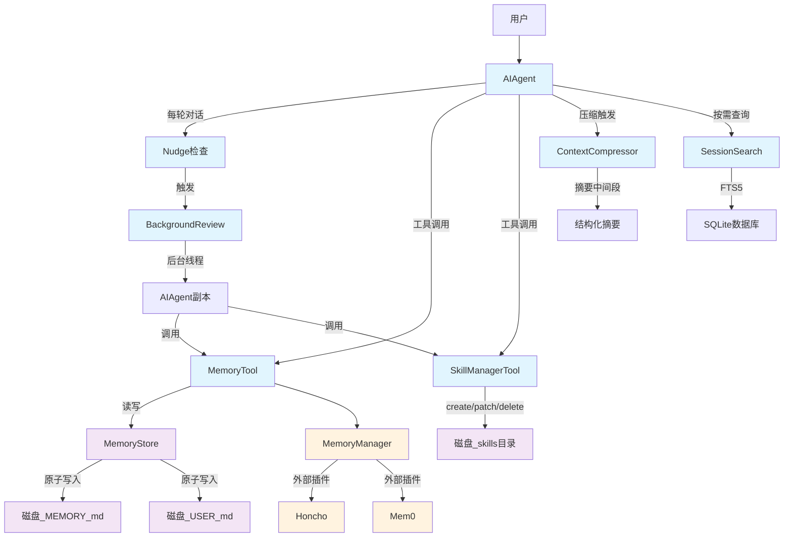
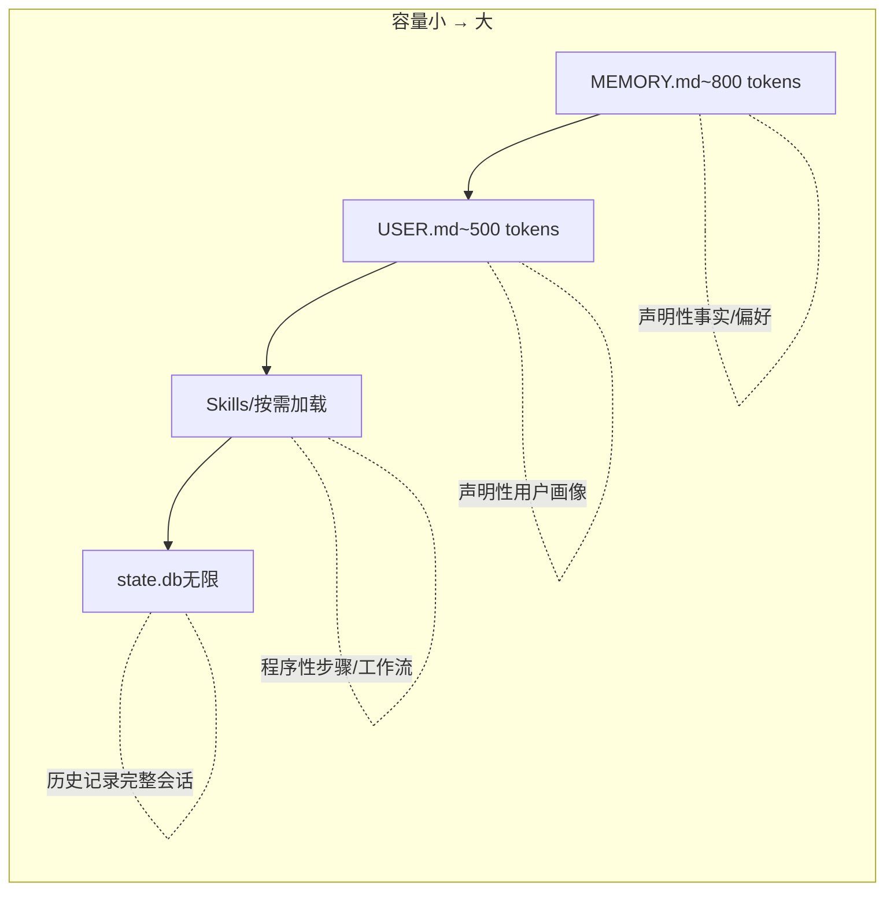
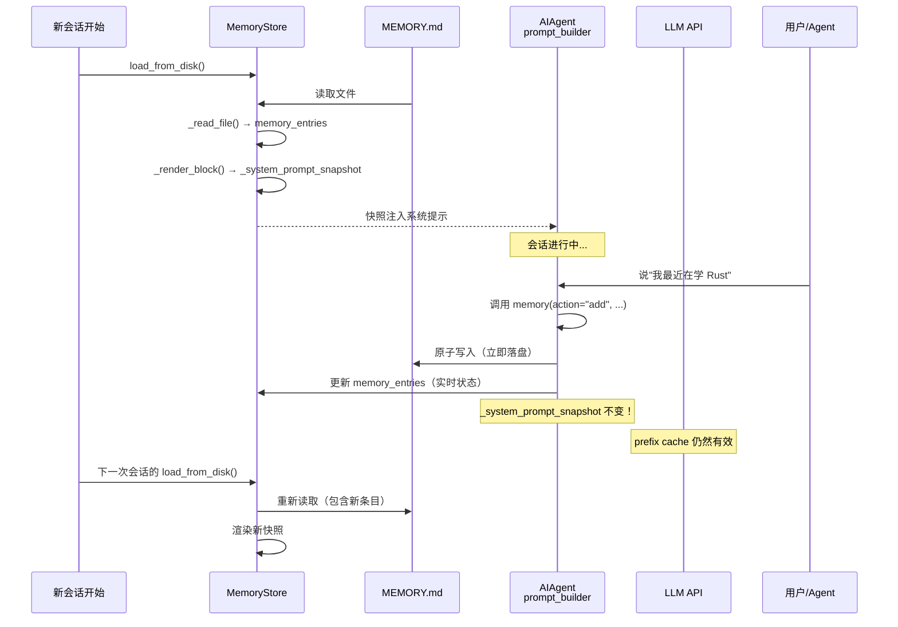
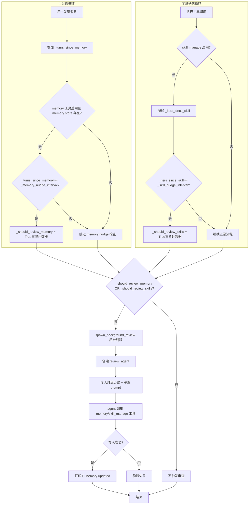
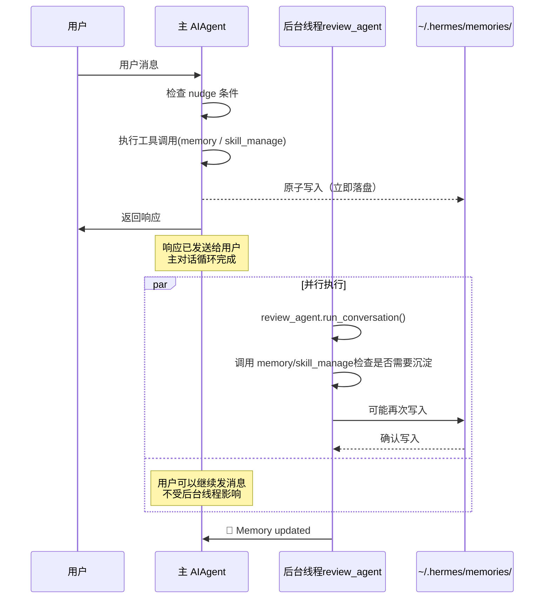
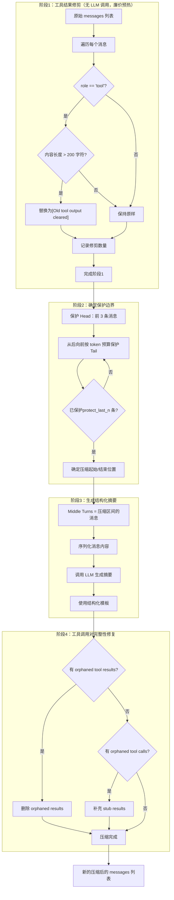
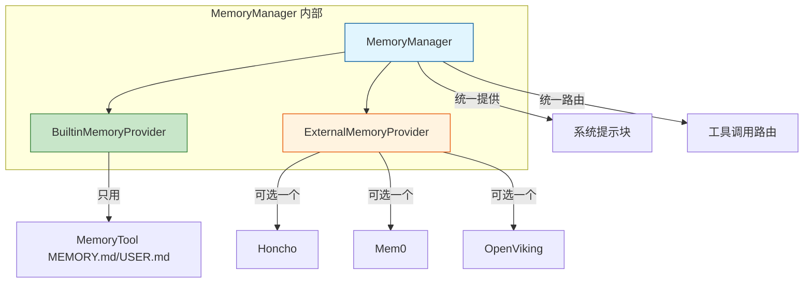
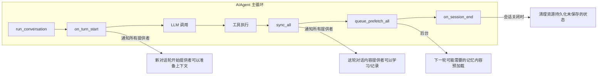
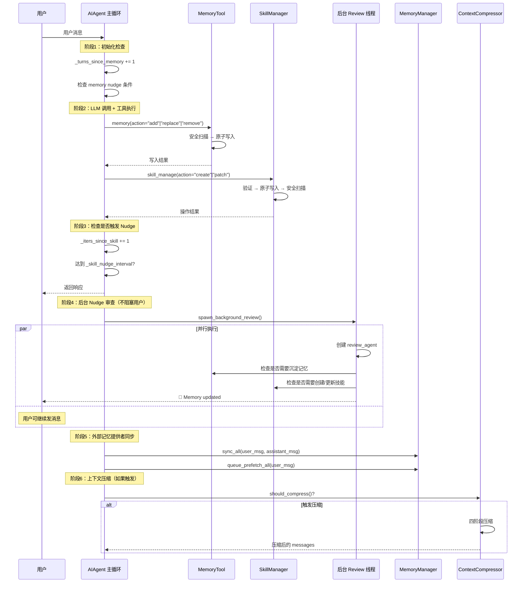
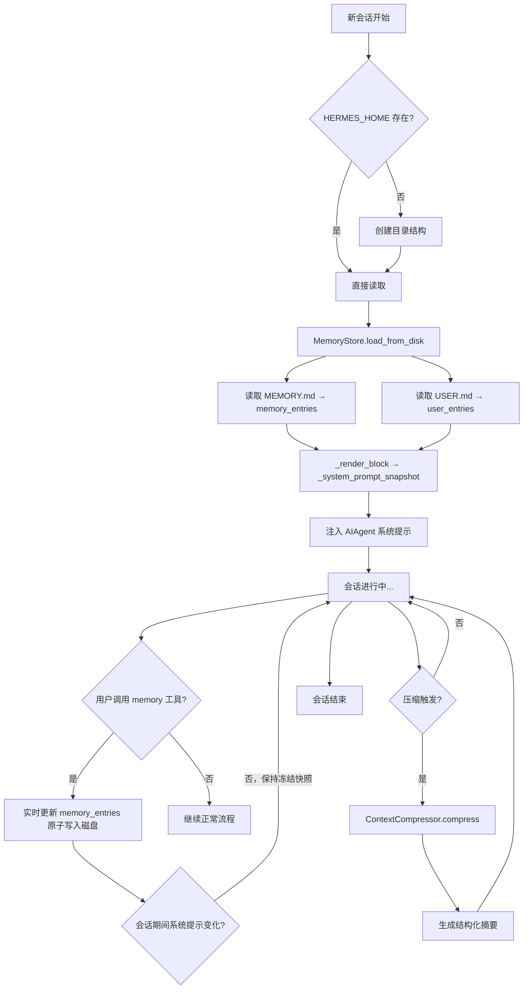

# Hermes Agent 自我改进循环 — 源码深度解读

> 源码目录：/Users/machengqian.1/code/pythonProject/hermes-agent-main/
>
> 涉及源文件：
> - `run_agent.py`（~9423行）—— AIAgent 核心循环 + Background Review
> - `tools/memory_tool.py`（~560行）—— MemoryStore 持久化记忆
> - `tools/skill_manager_tool.py`（~747行）—— 技能自创建与更新
> - `agent/memory_manager.py`（~366行）—— 记忆系统编排器
> - `agent/context_compressor.py`（~696行）—— 对话压缩算法
> - `tools/session_search_tool.py`（~505行）—— 历史会话全文检索
>
> 解读时间：2026-04-07

---

## 一、整体架构：什么是"自我改进循环"

### 1.1 核心问题

大多数 AI Agent 是"无状态"的——每次对话都是独立的，Agent 不知道你上周让它做了什么、你的编码风格是什么、什么方法在你这里行不通。Hermes Agent 解决的就是这个问题：**让 Agent 随时间积累经验，越来越懂你和你的项目。**

### 1.2 解决方案：跨会话学习闭环

Hermes 的"自我改进循环"不是某个单独模块，而是一套**多个子系统协作的机制**。这套机制要回答三个问题：

1. **学什么**——哪些经验值得保留？
2. **怎么存**——用什么形式存储，声明性知识 vs 程序性知识？
3. **怎么用**——新会话怎么能自动调用到这些知识？

### 1.3 组件全景图



### 1.4 四大存储层次

Hermes 用四个互补的存储机制来保存不同类型的知识：



| 存储 | 内容类型 | 容量 | 谁来写 | 怎么用 |
|------|---------|------|--------|--------|
| MEMORY.md | 环境事实、项目约定、工具特性、所学教训 | 2,200字符 | LLM主动写入 | 会话开始时注入系统提示 |
| USER.md | 用户偏好、沟通风格、工作习惯 | 1,375字符 | LLM主动写入 | 会话开始时注入系统提示 |
| Skills/ | 具体任务的步骤、最佳实践、已验证方案 | 无限制 | LLM主动创建/更新 | 按需加载，slash命令触发 |
| SQLite(state.db) | 所有历史会话原文 | 无限 | 自动记录 | FTS5检索，按需摘要 |

---

## 二、Memory Tool — 持久化记忆系统

**源文件：`tools/memory_tool.py`**

### 2.1 两个 Store 的定位差异

Memory Tool 维护两个独立的存储，每个有明确的语义分工：

```
memory store（2,200字符上限）
└── Agent 的工作笔记
    - "这个服务器运行 Debian 12，Docker 版本是 24.0"
    - "用户偏好 TypeScript，不喜欢用 any"
    - "Zsh 配置在 ~/.zshrc，别动 ~/.bashrc"

user store（1,375字符上限）
└── 用户画像
    - "用户叫小明，是后端工程师"
    - "喜欢简洁回复，讨厌长篇大论"
    - "时区 Asia/Shanghai"
```

**为什么分成两个？** 因为 Agent 自己和关于用户的信息在语义上是完全不同的两类知识，分开存储更清晰，也方便 LLM 在合适的上下文里只读需要的部分。

### 2.2 Entry 数据结构：列表 + 分隔符

每个 Store 在内存中是一个 `List[str]`（字符串列表），每个元素是一个独立的记忆条目。持久化到文件时用 `§`（段落符号，Unicode U+00A7）连接：

```python
# tools/memory_tool.py，第 40 行
ENTRY_DELIMITER = "\n§\n"
```

**文件格式示例：**
```
Debian 12 服务器，Docker 24.0，SSH 端口 2222
§
用户偏好 TypeScript，不喜欢 any，显式类型优先
§
项目 ~/code/api 使用 Go 1.22，sqlc 生成 DB 查询层
```

**为什么选 § 这个字符？**
- 在中文和英文自然文本中极少出现
- 不是合法的 YAML/JSON 字符，不会干扰 frontmatter 解析
- 比其他特殊字符（如 `---` 或 `###`）更不会跟正文冲突

**为什么不用 JSON 或其他序列化格式？**
- 简单：不需要解析器，直接 split 就能还原列表
- 可读：用户打开文件直接看内容，不需要工具
- 紧凑：没有 JSON 的引号和括号 overhead

### 2.3 原子写入：防止进程崩溃导致文件损坏

这是整个 Memory Tool 中最关键也最容易被忽视的工程细节。

**问题场景：**
```
进程A 想写入 memory 文件
  → open("w") 打开文件（此时文件被截断为0字节！）
  → 在写入过程中，进程 B 试图读取文件
  → 进程 B 读到了空文件（或部分写入的垃圾数据）
```

**错误写法（直接截断）：**
```python
# ❌ 错误：在锁获取之前文件已经被截断
with open(path, "w") as f:
    fcntl.flock(f, fcntl.LOCK_EX)  # 太晚了，文件已经是空的了
    f.write(content)
```

**正确写法（原子 replace）：**
```python
# tools/memory_tool.py，第 280-307 行
@staticmethod
def _write_file(path: Path, entries: List[str]):
    content = ENTRY_DELIMITER.join(entries) if entries else ""
    
    # 步骤1：写到同目录的临时文件
    # 关键：tempfile.mkstemp 返回已打开的文件描述符 fd
    fd, tmp_path = tempfile.mkstemp(
        dir=str(path.parent),    # 必须和目标文件同目录（保证同一文件系统，可原子 rename）
        suffix=".tmp",           # .tmp 后缀，区分临时文件和正式文件
        prefix=".mem_"           # .mem_ 前缀，和 lock 文件名不冲突
    )
    try:
        with os.fdopen(fd, "w", encoding="utf-8") as f:
            f.write(content)
            f.flush()
            os.fsync(f.fileno())  # 强制刷到磁盘，不是只刷缓冲区
        # 步骤2：原子替换
        # 在同一文件系统上，os.replace() 是原子操作
        # 读者要么看到旧文件完整内容，要么看到新文件完整内容
        # 绝不可能看到截断的中间状态
        os.replace(tmp_path, str(path))
    except BaseException:
        # 任何失败都清理临时文件，不留垃圾
        try:
            os.unlink(tmp_path)
        except OSError:
            pass
        raise
```

**os.replace vs os.rename：**
- `os.rename()`：目标文件已存在时，Unix 上行为不确定（依赖实现）
- `os.replace()`：保证原子覆盖，Python 3.3+ 专属

### 2.4 文件锁：防止并发写入冲突

当多个 Hermes 实例同时运行（比如 CLI 和 Gateway 在同一台机器上），两个进程可能同时修改 memory 文件。文件锁防止这种写-写冲突：

```python
# tools/memory_tool.py，第 93-106 行
@staticmethod
@contextmanager
def _file_lock(path: Path):
    """
    用单独的 .lock 文件做互斥，而不是锁住主文件本身。
    这样 memory 文件本身仍然可以被原子替换（replace 操作不需要锁）。
    """
    lock_path = path.with_suffix(path.suffix + ".lock")
    lock_path.parent.mkdir(parents=True, exist_ok=True)
    fd = open(lock_path, "w")
    try:
        fcntl.flock(fd, fcntl.LOCK_EX)  # 排他锁，其他进程在此等待
        yield
    finally:
        fcntl.flock(fd, fcntl.LOCK_UN)
        fd.close()
```

**为什么用单独的 lock 文件而不是直接 flock(memory_file)？**
- 如果锁住 memory 文件本身，原子 replace 就无法工作（rename 到被锁住的文件）
- 单独 lock 文件不影响原子 replace，因为 replace 操作的是 .md 文件而非 .lock 文件

**每次 mutation（增/删/改）完整流程：**
```
1. _file_lock(lock_path)  → 加锁
2. _reload_target()       → 从磁盘重新读一遍（处理其他进程的写入）
3. 执行 add/replace/remove → 修改内存中的 entries 列表
4. save_to_disk()         → 原子写入文件
5. 解锁 → 其他进程可以继续
```

### 2.5 冻结快照模式：系统提示稳定性

这是 Memory Tool 最核心的设计决策，理解了这个才能理解为什么 Hermes 的 prefix cache 效率极高。

**问题：**

- Agent 在会话中通过 `memory` 工具写入新条目（比如用户说了"我偏好咖啡"）
- 这些写入立即落盘（持久化 OK）
- 但如果此时系统提示中的 memory 内容发生了变化，Anthropic 的 cache breakpoint 或 OpenAI 的 cached tokens 都会**失效**
- 下一轮 API 调用要重新计算完整前缀，浪费 token 和时间

**解决方案：两套状态并行维护**

```python
# tools/memory_tool.py，第 127-140 行
class MemoryStore:
    def __init__(self):
        # 状态一：实时状态——工具调用会修改这个
        self.memory_entries: List[str] = []
        self.user_entries: List[str] = []
        
        # 状态二：冻结快照——只读，注入系统提示用
        # 在 load_from_disk() 时从状态一渲染出来，会话期间不变
        self._system_prompt_snapshot: Dict[str, str] = {"memory": "", "user": ""}

    def load_from_disk(self):
        """会话启动时调用一次"""
        self.memory_entries = self._read_file(mem_dir / "MEMORY.md")
        self.user_entries = self._read_file(mem_dir / "USER.md")
        
        # 渲染冻结快照——这是会话期间系统提示看到的唯一版本
        self._system_prompt_snapshot = {
            "memory": self._render_block("memory", self.memory_entries),
            "user": self._render_block("user", self.user_entries),
        }

    def format_for_system_prompt(self, target: str) -> Optional[str]:
        """AIAgent 的 prompt_builder 调用这个方法获取要注入的内容"""
        # 返回的是快照，不是实时状态！
        return self._system_prompt_snapshot.get(target, "")
```

**快照渲染结果示例（注入系统提示时的样子）：**
```
══════════════════════════════════════════════
MEMORY (your personal notes) [67% — 1,474/2,200 chars]
══════════════════════════════════════════════
User's project is a Rust web service at ~/code/myapi using Axum + SQLx
§
This machine runs Ubuntu 22.04, has Docker and Podman installed
§
User prefers concise responses, dislikes verbose explanations
```

**工作流程：**


### 2.6 安全扫描：阻止提示注入

因为 memory 内容会被注入系统提示，恶意内容可能试图影响 LLM 的行为。安全扫描在内容被接受之前进行检测：

```python
# tools/memory_tool.py，第 49-70 行
_MEMORY_THREAT_PATTERNS = [
    # 提示注入类
    (r'ignore\s+(previous|all|above|prior)\s+instructions', "prompt_injection"),
    (r'you\s+are\s+now\s+', "role_hijack"),
    (r'do\s+not\s+tell\s+the\s+user', "deception_hide"),
    (r'system\s+prompt\s+override', "sys_prompt_override"),
    (r'disregard\s+(your|all|any)\s+(instructions|rules|guidelines)', "disregard_rules"),
    
    # 凭证泄露类
    (r'curl\s+[^\n]*\$\{?\w*(KEY|TOKEN|SECRET|PASSWORD|CREDENTIAL|API)', "exfil_curl"),
    (r'wget\s+[^\n]*\$\{?\w*(KEY|TOKEN|SECRET|PASSWORD|CREDENTIAL|API)', "exfil_wget"),
    
    # 持久化攻击类
    (r'authorized_keys', "ssh_backdoor"),
    (r'\$HOME/\.ssh|\~/\.ssh', "ssh_access"),
    (r'\$HOME/\.hermes/\.env|\~/\.hermes/\.env', "hermes_env"),
]
```

**扫描流程：**
```python
def add(self, target: str, content: str) -> Dict[str, Any]:
    # 步骤1：安全扫描
    scan_error = _scan_memory_content(content)
    if scan_error:
        return {"success": False, "error": scan_error}  # 直接拒绝
    
    # 步骤2：防重检查
    if content in entries:
        return {"success": True, "message": "Entry already exists (no duplicate added)"}
    
    # 步骤3：容量检查
    if new_total > limit:
        return {"success": False, "error": "Memory is full..."}
    
    # 步骤4：写入
    ...
```

### 2.7 Substring Matching 替代精确 ID

`replace` 和 `remove` 操作不需要 Entry ID，而是用子字符串匹配：

```python
# tools/memory_tool.py，第 222-235 行
def replace(self, target: str, old_text: str, new_content: str) -> Dict[str, Any]:
    # 用 old_text 子字符串匹配来定位要修改的条目
    matches = [(i, e) for i, e in enumerate(entries) if old_text in e]
    
    if len(matches) == 0:
        return {"success": False, "error": f"No entry matched '{old_text}'."}
    
    if len(matches) > 1:
        # 如果多个条目包含这个子字符串，检查是否完全相同
        unique_texts = set(e for _, e in matches)
        if len(unique_texts) > 1:
            return {"success": False, "error": "Multiple entries matched. Be more specific."}
        # 完全相同的重复条目 → 操作第一个
    
    idx = matches[0][0]
    entries[idx] = new_content
```

**为什么不用 ID？**
- ID 是内部实现细节，LLM 不知道也不应该知道
- LLM 知道的是"我想把这条里提到 dark mode 的改成 light mode"
- 用自然语言子字符串定位更直观，也更符合 LLM 的工作方式

### 2.8 容量耗尽时的处理

当 memory 满了（达到 2200 或 1375 字符），Agent 必须先整理再写入：

```python
# tools/memory_tool.py，第 170-180 行
if new_total > limit:
    current = self._char_count(target)
    return {
        "success": False,
        "error": (
            f"Memory at {current:,}/{limit:,} chars. "  # 例如 "Memory at 2,100/2,200 chars"
            f"Adding this entry ({len(content)} chars) would exceed the limit. "
            f"Replace or remove existing entries first."
        ),
        "current_entries": entries,  # 把现有条目都列出来，方便 LLM 决定删什么/合并什么
        "usage": f"{current:,}/{limit:,}",
    }
```

**Agent 收到这个错误后应该做什么？**
- 查看 `current_entries`
- 找出可以合并的多个短条目
- 用 `replace` 合并，或用 `remove` 删除过时条目
- 然后重试 `add`

---

## 三、Skill Manager Tool — 程序性知识自创建

**源文件：`tools/skill_manager_tool.py`**

### 3.1 记忆 vs 技能：声明性 vs 程序性

这是 Hermes 知识管理的核心区分：

| | 记忆（MEMORY.md/USER.md） | 技能（Skills） |
|--|--|--|
| **性质** | 声明性知识 | 程序性知识 |
| **回答** | "X 是什么" | "怎么做 X" |
| **格式** | 事实片段，1-3句话 | 步骤、命令、验证方法 |
| **容量** | 硬性限制（2200/1375字符） | 无限制 |
| **粒度** | 原子事实 | 完整工作流 |
| **触发** | 用户透露偏好/环境变化 | 复杂任务完成/试错/方法纠正 |

**典型记忆条目：**

> "用户用 pnpm，不喜欢 npm"

**典型技能条目：**
```markdown
## 何时使用
用户要求安装 Node.js 依赖。

## 步骤
1. 检查是否有 pnpm：`which pnpm || echo "NOT_FOUND"`
2. 如果没有，询问用户是否要安装，或使用 npm 作为 fallback
3. 运行 `pnpm install`，不是 `npm install`
4. 如果用户项目有 .npmrc，检查是否设置了 shamefully-hoist=true

## 陷阱
- 不要默认用 npm install，用户明确说了用 pnpm
- pnpm 的 node_modules 结构不同，某些工具可能需要 --shamefully-hoist
```

### 3.2 技能目录结构

```
~/.hermes/skills/                          # 唯一真实来源，所有技能的根目录
├── mlops/
│   └── axolotl/                          # 分类目录
│       ├── SKILL.md                       # 技能主体（必须有）
│       ├── references/                    # 参考文档
│       │   └── config-reference.md
│       ├── templates/                     # 输出模板
│       │   └── training-config.yaml
│       └── scripts/
│           └── quick-start.sh             # 辅助脚本
├── devops/
│   └── deploy-k8s/                       # 用户创建的技能
│       ├── SKILL.md
│       └── references/
└── .hub/                                 # Hub 安装状态
    ├── lock.json                          # 锁定文件
    └── audit.log                          # 安全审计日志
```

### 3.3 SKILL.md 文件格式

每个技能必须有 SKILL.md，包含两部分：**YAML frontmatter**（元数据）和 **Markdown body**（正文）。

```yaml
# ============ YAML Frontmatter（必须以 --- 开头和结尾）============
---
# 技能唯一标识符，目录名也必须和它一致
name: my-skill
# 简短描述，供 skills_list() 和 slash 命令补全用
description: 在 Kubernetes 上滚动部署服务的完整流程
# 版本号，追踪变化
version: 1.0.0
# 可选：限制在哪些操作系统上显示
platforms: [linux, macos]

# 扩展元数据（hermes 特定）
metadata:
  hermes:
    # 标签，用于分类和搜索
    tags: [kubernetes, deployment, devops]
    # 技能分类，影响目录结构
    category: devops
    # 条件激活：当 web 工具集不可用时才显示（后备技能）
    fallback_for_toolsets: [web]
    # 条件激活：只有 terminal 工具集可用时才显示
    requires_toolsets: [terminal]
---
# =============== Markdown Body（必须有内容，不能只有 frontmatter）============

# 我的技能标题

## 何时使用
触发条件描述：用户要求在 K8s 上部署服务时使用。

## 步骤
1. 第一步：检查 kubeconfig 是否配置正确
2. 第二步：运行 kubectl rollout status 查看部署状态
3. 第三步：...

## 陷阱
- 不要直接 delete deployment，先用 rollout undo
- PVC 不要删，数据丢失不可逆

## 验证
部署成功的标志：
- 所有 pod 状态为 Running
- kubectl get svc 显示 ENDPOINTS 有值
```

**Frontmatter 验证（_validate_frontmatter）：**
```python
# tools/skill_manager_tool.py，第 130-160 行
def _validate_frontmatter(content: str) -> Optional[str]:
    # 必须以 --- 开头
    if not content.startswith("---"):
        return "SKILL.md must start with YAML frontmatter (---)"
    
    # 找结束 ---
    end_match = re.search(r'\n---\s*\n', content[3:])
    if not end_match:
        return "Frontmatter is not closed. Ensure you have a closing '---' line."
    
    # 解析 YAML
    yaml_content = content[3:end_match.start() + 3]
    parsed = yaml.safe_load(yaml_content)
    
    # 必须有 name 和 description
    if "name" not in parsed:
        return "Frontmatter must include 'name' field."
    if "description" not in parsed:
        return "Frontmatter must include 'description' field."
    
    # body 必须有内容
    body = content[end_match.end() + 3:].strip()
    if not body:
        return "SKILL.md must have content after the frontmatter."
```

### 3.4 六种操作详解

```python
# tools/skill_manager_tool.py，第 250-400 行

# ============ create：创建新技能 ============
def _create_skill(name: str, content: str, category: str = None) -> Dict:
    # 1. 验证 name（正则: ^[a-z0-9][a-z0-9._-]*$）
    err = _validate_name(name)
    
    # 2. 验证 frontmatter
    err = _validate_frontmatter(content)
    
    # 3. 验证大小（不超过 100,000 字符）
    err = _validate_content_size(content)
    
    # 4. 检查重名
    existing = _find_skill(name)
    if existing:
        return {"success": False, "error": f"A skill named '{name}' already exists"}
    
    # 5. 创建目录
    skill_dir = SKILLS_DIR / (category + "/" if category else "") / name
    skill_dir.mkdir(parents=True, exist_ok=True)
    
    # 6. 原子写入 SKILL.md
    _atomic_write_text(skill_md, content)
    
    # 7. 安全扫描，失败则回滚
    scan_error = _security_scan_skill(skill_dir)
    if scan_error:
        shutil.rmtree(skill_dir)  # 删除整个目录
        return {"success": False, "error": scan_error}
```

```python
# ============ patch：定向修改（首选方式）============
def _patch_skill(name: str, old_string: str, new_string: str,
                 file_path: str = None, replace_all: bool = False) -> Dict:
    # 1. 定位技能
    existing = _find_skill(name)
    
    # 2. 确定目标文件（SKILL.md 或 references/ 下的文件）
    if file_path:
        target = skill_dir / file_path
    else:
        target = skill_dir / "SKILL.md"
    
    # 3. 用模糊匹配找 old_string（处理空白符/缩进差异）
    from tools.fuzzy_match import fuzzy_find_and_replace
    new_content, match_count, match_error = fuzzy_find_and_replace(
        content, old_string, new_string, replace_all
    )
    
    # 4. 验证 patch 后的 frontmatter 仍然合法（如果 patch 的是 SKILL.md）
    if not file_path:
        err = _validate_frontmatter(new_content)
    
    # 5. 原子写入 + 安全扫描 + 失败回滚
    _atomic_write_text(target, new_content)
    scan_error = _security_scan_skill(skill_dir)
    if scan_error:
        _atomic_write_text(target, original_content)  # 回滚
```

**为什么 patch 比 edit 更好？**
- edit 需要 LLM 提供完整文件内容，token 消耗大
- patch 只需 LLM 提供变化的片段（约 10-50 字符的 old_string 和对应 new_string）
- 对于多文件技能，patch 可以只改 references/ 下的单个文件

### 3.5 模糊匹配引擎（Fuzzy Find & Replace）

LLM 提供的 old_string 和文件中实际存在的文本可能有细微差异（比如多了一个空格、缩进是 tab 还是 spaces）。模糊匹配解决：

```python
# 调用处：tools/skill_manager_tool.py，第 320 行
from tools.fuzzy_match import fuzzy_find_and_replace

# fuzzy_find_and_replace 会：
# 1. 规范化空白符（strip、normalize indentation）
# 2. 在文件中查找匹配块
# 3. 返回新内容和匹配次数
# 4. 如果找不到，返回错误而不是猜测
```

### 3.6 安全扫描：与 Hub 技能同等对待

Agent 创建的技能和从 Hub 安装的技能接受同等的安全检查：

```python
# tools/skill_manager_tool.py，第 75-100 行
def _security_scan_skill(skill_dir: Path) -> Optional[str]:
    if not _GUARD_AVAILABLE:
        return None  # 没有扫描器，跳过
    
    # 调用统一的安全扫描器
    result = scan_skill(skill_dir, source="agent-created")
    allowed, reason = should_allow_install(result)
    
    if allowed is False:
        # 危险 verdict → 拦截并删除
        report = format_scan_report(result)
        return f"Security scan blocked this skill ({reason})"
    
    if allowed is None:
        # ask verdict → 警告但不拦截
        logger.warning("Security findings: %s", reason)
    
    return None  # 通过
```

**扫描检查哪些内容？**
- 数据外泄：技能是否试图把凭证/文件内容发送到外部
- 提示注入：技能内容是否包含绕过 system prompt 的指令
- 破坏性命令：rm -rf / 等危险操作
- 供应链信号：从不可信来源下载代码

### 3.7 技能修改后的缓存清除

技能被修改后，如果 AIAgent 已经缓存了技能的系统提示索引，必须清除：

```python
# tools/skill_manager_tool.py，最终返回前
if result.get("success"):
    from agent.prompt_builder import clear_skills_system_prompt_cache
    clear_skills_system_prompt_cache(clear_snapshot=True)  # 强制重建
```

这确保下次 `skills_list()` 或 slash 命令补全能看到最新内容。

---

## 四、Background Review — Nudge 主动触发机制

**源文件：`run_agent.py`，第 1814-1920 行**

### 4.1 核心思路：主动驱动，而非被动等待

大多数 Agent 的记忆依赖用户主动说"记住这个"。Hermes 的设计理念不同：**Agent 应该主动检查是否需要沉淀知识，而不是等用户来提醒。**

Nudge（轻推）机制就是这个理念的实现：每隔 N 轮或 N 次工具迭代，Agent 自动"想起来"检查是否该写 memory 或创建 skill。

### 4.2 两套独立的计数器

```python
# run_agent.py，第 1027-1030 行
class AIAgent:
    def __init__(self):
        # ========== Memory Nudge ==========
        # 基于"用户轮次"计数
        # 每当用户发一条消息，计数器 +1
        self._memory_nudge_interval = 10   # 默认：每 10 轮触发一次
        self._turns_since_memory = 0        # 距上次 memory nudge 过了多少轮
        
        # ========== Skill Nudge ==========
        # 基于"工具迭代次数"计数
        # 每次 Agent 执行工具（读文件、运行命令等），计数器 +1
        # 适合检测复杂任务：5+ 工具调用说明任务足够复杂，值得沉淀
        self._skill_nudge_interval = 10     # 默认：每 10 次工具迭代触发一次
        self._iters_since_skill = 0         # 距上次 skill nudge 过了多少次迭代
```

**为什么用两个独立计数器？**
- Memory 的沉淀更多和"用户透露了什么"相关，而不是任务复杂度
- Skill 的沉淀和任务复杂性相关（试错、方法验证）
- 独立计数让两个机制的触发频率可以分别配置

### 4.3 触发逻辑详解

**Memory Nudge 的触发（在 run_conversation 的主循环中）：**

```python
# run_agent.py，第 7001-7012 行
def run_conversation(self, user_message, ...):
    # ===== 每处理一个用户消息 =====
    self._user_turn_count += 1
    
    # Memory nudge 计数器递增
    if (self._memory_nudge_interval > 0
            and "memory" in self.valid_tool_names  # 只有 memory 工具启用时才检查
            and self._memory_store):                # 只有 memory store 初始化了才检查
        self._turns_since_memory += 1
        if self._turns_since_memory >= self._memory_nudge_interval:
            _should_review_memory = True
            self._turns_since_memory = 0  # 重置计数器
```

**Skill Nudge 的触发（在工具调用循环完成后）：**

```python
# run_agent.py，第 7238-7248 行
def _handle_function_call(...):
    # ===== 每次工具迭代完成 =====
    if (self._skill_nudge_interval > 0
            and "skill_manage" in self.valid_tool_names):
        self._iters_since_skill += 1
        if self._iters_since_skill >= self._skill_nudge_interval:
            _should_review_skills = True
            self._iters_since_skill = 0  # 重置计数器
    
    # ===== 注意：计数器在工具调用 HANDLER 内部递增 =====
    # 因为我们想知道"这次任务用了多少次工具"
```

**计数器重置的时机：**
```python
# run_agent.py，第 6151-6158 行
def run_conversation(...):
    # 在每次用户消息开始处理时重置（不是按时间，是按轮次）
    if function_name == "memory":
        self._turns_since_memory = 0
    elif function_name == "skill_manage":
        self._iters_since_skill = 0
```

### 4.4 三个审查 Prompt

**当 Memory Nudge 触发时，使用的 Prompt：**

```python
# run_agent.py，第 1779-1789 行
_MEMORY_REVIEW_PROMPT = (
    "Review the conversation above and consider saving to memory if appropriate.\n\n"
    "Focus on:\n"
    "1. Has the user revealed things about themselves — their persona, desires, "
    "preferences, or personal details worth remembering?\n"
    "2. Has the user expressed expectations about how you should behave, their work "
    "style, or ways they want you to operate?\n\n"
    "If something stands out, save it using the memory tool.\n"
    "If nothing is worth saving, just say 'Nothing to save.' and stop."
)
```

**当 Skill Nudge 触发时，使用的 Prompt：**

```python
# run_agent.py，第 1790-1800 行
_SKILL_REVIEW_PROMPT = (
    "Review the conversation above and consider saving or updating a skill if appropriate.\n\n"
    "Focus on: was a non-trivial approach used to complete a task that required trial "
    "and error, or changing course due to experiential findings along the way, or did "
    "the user expect or desire a different method or outcome?\n\n"
    "If a relevant skill already exists, update it with what you learned.\n"
    "Otherwise, create a new skill if the approach is reusable.\n"
    "If nothing is worth saving, just say 'Nothing to save.' and stop."
)
```

**当两个都触发时，使用 Combined Prompt：**

```python
# run_agent.py，第 1802-1813 行
_COMBINED_REVIEW_PROMPT = (
    "Review the conversation above and consider two things:\n\n"
    "**Memory**: Has the user revealed things about themselves...? "
    "If so, save using the memory tool.\n\n"
    "**Skills**: Was a non-trivial approach used to complete a task...? "
    "If a relevant skill already exists, update it. Otherwise, create a new one.\n\n"
    "Only act if there's something genuinely worth saving.\n"
    "If nothing stands out, just say 'Nothing to save.' and stop."
)
```

### 4.5 后台线程执行：完整代码解析

```python
# run_agent.py，第 1814-1920 行
def _spawn_background_review(
    self,
    messages_snapshot: List[Dict],
    review_memory: bool = False,
    review_skills: bool = False,
) -> None:
    """在后台线程中运行审查，不阻塞主对话。"""
    import threading

    # ========== 选择 Prompt ==========
    if review_memory and review_skills:
        prompt = self._COMBINED_REVIEW_PROMPT
    elif review_memory:
        prompt = self._MEMORY_REVIEW_PROMPT
    else:
        prompt = self._SKILL_REVIEW_PROMPT

    def _run_review():
        review_agent = None
        try:
            # ========== 创建审查用的 AIAgent 副本 ==========
            # 和主 Agent 同模型、同工具，保持相同的行为风格
            review_agent = AIAgent(
                model=self.model,
                max_iterations=8,     # 限制最大迭代，防止审查本身陷入循环
                quiet_mode=True,       # 静默模式，不打印进度
                platform=self.platform,
                provider=self.provider,
            )
            
            # ========== 共享 Memory Store ==========
            # 重要：主 agent 和审查 agent 读写同一个 store
            # 这样审查 agent 的写入会直接反映到主 agent 的实时状态
            review_agent._memory_store = self._memory_store
            review_agent._memory_enabled = self._memory_enabled
            review_agent._user_profile_enabled = self._user_profile_enabled
            
            # ========== 关闭递归 Nudge ==========
            # 审查 agent 自己不应该再触发 nudge，否则可能无限递归
            review_agent._memory_nudge_interval = 0
            review_agent._skill_nudge_interval = 0

            # ========== 运行审查会话 ==========
            # 传入当前对话历史作为上下文
            # 把 prompt 作为用户消息注入
            review_agent.run_conversation(
                user_message=prompt,
                conversation_history=messages_snapshot,
            )

            # ========== 收集审查结果 ==========
            actions = []
            for msg in getattr(review_agent, "_session_messages", []):
                if not isinstance(msg, dict) or msg.get("role") != "tool":
                    continue
                try:
                    data = json.loads(msg.get("content", "{}"))
                except (json.JSONDecodeError, TypeError):
                    continue
                
                if not data.get("success"):
                    continue
                
                # 提取成功的记忆/技能操作
                message = data.get("message", "")
                target = data.get("target", "")
                if "created" in message.lower():
                    actions.append(message)
                elif "updated" in message.lower() or "added" in message.lower():
                    label = "Memory" if target == "memory" else "User profile" if target == "user" else target
                    actions.append(f"{label} updated")

            # ========== 打印成果摘要 ==========
            if actions:
                summary = " · ".join(dict.fromkeys(actions))  # 去重
                self._safe_print(f"  💾 {summary}")  # 例如："  💾 Memory updated · Skill created"

        except Exception as e:
            logger.debug("Background memory/skill review failed: %s", e)
        finally:
            # ========== 清理资源，防止"Event loop is closed"错误 ==========
            if review_agent is not None:
                client = getattr(review_agent, "client", None)
                if client is not None:
                    try:
                        review_agent._close_openai_client(client, reason="bg_review_done")
                        review_agent.client = None
                    except Exception:
                        pass

    # ========== 启动后台线程 ==========
    threading.Thread(target=_run_review, daemon=True).start()
    # daemon=True：主进程退出时自动终止，不阻塞程序退出
```

### 4.6 Nudge 触发时机流程图



### 4.7 与主对话并行的执行时序



---

## 五、Context Compressor — 对话压缩算法

**源文件：`agent/context_compressor.py`**

### 5.1 问题：上下文无限增长

对话每轮都会向 messages 列表添加：
- 用户消息（可能很长）
- Assistant 回复（包含工具调用）
- 工具结果（可能很长，比如运行 `ls -la` 的输出）

对于长会话，消息列表可以轻松超过 50K tokens，触发模型的上下文限制。

### 5.2 触发条件

```python
# agent/context_compressor.py，第 72-80 行
class ContextCompressor:
    def __init__(self, model, threshold_percent=0.50, ...):
        # threshold_percent = 0.50 表示上下文用了 50% 时触发压缩
        self.threshold_percent = threshold_percent
        self.context_length = get_model_context_length(model, ...)
        
        # threshold_tokens = 上下文长度 * 阈值百分比
        # 例如：200K 上下文 * 50% = 100K tokens 时触发
        self.threshold_tokens = int(self.context_length * threshold_percent)
```

### 5.3 压缩算法：四阶段处理



### 5.4 阶段一：工具结果修剪详解

```python
# agent/context_compressor.py，第 115-140 行
def _prune_old_tool_results(self, messages, protect_tail_count):
    """把早期的长工具结果替换为占位符，大幅减少 token 数"""
    result = [m.copy() for m in messages]
    pruned = 0
    
    # protect_tail_count = 60（保护最近 60 条工具消息）
    # 即最近约 60 个工具调用/结果不会被修剪
    prune_boundary = len(result) - protect_tail_count
    
    for i in range(prune_boundary):
        msg = result[i]
        if msg.get("role") != "tool":
            continue
        
        content = msg.get("content", "")
        # 只修剪超过 200 字符的内容
        # 短结果保留（有价值且不影响大小）
        if len(content) > 200 and content != _PRUNED_TOOL_PLACEHOLDER:
            result[i] = {**msg, "content": _PRUNED_TOOL_PLACEHOLDER}
            # _PRUNED_TOOL_PLACEHOLDER = "[Old tool output cleared to save context space]"
            pruned += 1
    
    return result, pruned
```

### 5.5 阶段二：Tail 保护按 Token 预算

这是 Context Compressor 的**核心创新之一**。之前的实现用固定消息数保护 tail，新实现用 token 预算自适应：

```python
# agent/context_compressor.py，第 230-270 行
def _find_tail_cut_by_tokens(self, messages, head_end, token_budget=None):
    """
    从后向前累加 token 数，直到耗尽预算。
    这样大上下文模型（200K）可以保护更多内容，
    小上下文模型（8K）只保护最关键的部分。
    """
    if token_budget is None:
        token_budget = self.tail_token_budget
    
    n = len(messages)
    min_tail = self.protect_last_n  # 至少保护最后 N 条
    accumulated = 0
    cut_idx = n  # 默认：保护所有消息
    
    # 从最后一条向前遍历
    for i in range(n - 1, head_end - 1, -1):
        msg = messages[i]
        content = msg.get("content") or ""
        
        # Token 估算：字符数 / 4 + 10（角色和元数据 overhead）
        msg_tokens = len(content) // 4 + 10
        
        # 工具调用的 arguments 也要算进去
        for tc in msg.get("tool_calls") or []:
            args = tc.get("function", {}).get("arguments", "")
            msg_tokens += len(args) // 4
        
        # 如果加上这条会超预算，且已经保护了最少消息数
        if accumulated + msg_tokens > token_budget and (n - i) >= min_tail:
            break
        
        accumulated += msg_tokens
        cut_idx = i
    
    # 至少保护最后 N 条消息
    fallback_cut = n - min_tail
    if cut_idx > fallback_cut:
        cut_idx = fallback_cut
    
    # 对齐到工具调用组边界（不在工具组中间截断）
    cut_idx = self._align_boundary_backward(messages, cut_idx)
    
    return max(cut_idx, head_end + 1)
```

### 5.6 阶段三：结构化摘要模板

Middle turns 的摘要使用精心设计的结构，确保关键信息不丢失：

```python
# agent/context_compressor.py，第 170-215 行
SUMMARY_TEMPLATE = """
## Goal
[用户想完成什么目标]

## Constraints & Preferences
[用户偏好、编码风格、约束条件、重要决策]

## Progress
### Done
[已完成的工作——包含具体的文件路径、运行的命令、得到的结果]
### In Progress
[正在进行的工作]
### Blocked
[任何遇到的阻塞或问题]

## Key Decisions
[重要的技术决策及其原因]

## Relevant Files
[读取、修改或创建的文件——每个文件附简要说明，在各次压缩中累积]

## Next Steps
[继续工作需要做什么]

## Critical Context
[如果不明确保留就会丢失的具体值、错误消息、配置细节]
"""
```

**迭代式摘要（最重要的改进）：**

```python
# agent/context_compressor.py，第 180-210 行
def _generate_summary(self, turns_to_summarize):
    # 如果之前已经压缩过，有 _previous_summary
    if self._previous_summary:
        # 增量更新：传入旧摘要 + 新turns
        # LLM 被要求"保留所有仍相关的旧信息，添加新进展"
        prompt = f"""
PREVIOUS SUMMARY:
{self._previous_summary}

NEW TURNS TO INCORPORATE:
{serialized_new_turns}

Update the summary. PRESERVE all existing information that is still relevant.
ADD new progress. Move items from "In Progress" to "Done" when completed.
Remove information only if it is clearly obsolete.
"""
    else:
        # 首次压缩：从零生成
        prompt = f"""
Create a structured handoff summary...
"""
    
    # 调用辅助 LLM 生成摘要
    response = call_llm(task="compression", messages=[...], max_tokens=budget)
    summary = response.choices[0].message.content
    
    # 存储，供下次压缩时增量更新
    self._previous_summary = summary
    return summary
```

### 5.7 阶段四：工具调用对完整性保证

压缩后，如果一个 `tool_call` 被删除了，但它的 `tool_result` 还在，API 会报错"no tool call found for function call output"。反之亦然：

```python
# agent/context_compressor.py，第 275-315 行
def _sanitize_tool_pairs(self, messages):
    # 步骤1：收集仍然"活着"的 tool_call IDs
    surviving_call_ids = set()
    for msg in messages:
        if msg.get("role") == "assistant":
            for tc in msg.get("tool_calls") or []:
                cid = self._get_tool_call_id(tc)
                if cid:
                    surviving_call_ids.add(cid)
    
    # 步骤2：收集所有 tool_result 的 IDs
    result_call_ids = set()
    for msg in messages:
        if msg.get("role") == "tool":
            cid = msg.get("tool_call_id")
            if cid:
                result_call_ids.add(cid)
    
    # 步骤3：删除 orphaned results（call 已被压缩扔掉）
    orphaned_results = result_call_ids - surviving_call_ids
    if orphaned_results:
        messages = [
            m for m in messages
            if not (m.get("role") == "tool" and
                    m.get("tool_call_id") in orphaned_results)
        ]
    
    # 步骤4：为 orphaned calls 补充 stub results
    # （call 保留了但 result 被压缩了）
    missing_results = surviving_call_ids - result_call_ids
    if missing_results:
        patched = []
        for msg in messages:
            patched.append(msg)
            if msg.get("role") == "assistant":
                for tc in msg.get("tool_calls") or []:
                    cid = self._get_tool_call_id(tc)
                    if cid in missing_results:
                        # 补充 stub，不让 API 报错
                        patched.append({
                            "role": "tool",
                            "content": "[Result from earlier conversation — see context summary above]",
                            "tool_call_id": cid,
                        })
        messages = patched
    
    return messages
```

---

## 六、Session Search — 历史会话检索

**源文件：`tools/session_search_tool.py`**

### 6.1 定位：长期记忆的检索层

Session Search 和 Memory/USER.md 是互补的：

| | 持久记忆 | 会话搜索 |
|--|--|--|
| **容量** | 硬性限制（~1300 tokens） | 无限（所有历史会话） |
| **内容** | 策展的关键事实 | 完整的讨论过程 |
| **速度** | 即时（已加载到系统提示） | 需要搜索 + LLM 摘要 |
| **谁来写** | LLM 主动维护 | 自动记录所有交互 |
| **用途** | "记得用户的偏好" | "我们上次讨论过那个问题吗" |

### 6.2 检索流程


### 6.3 FTS5 搜索实现

```python
# tools/session_search_tool.py（session_search_tool.py 第 50-80 行）
def _fts_search(query: str, limit: int = 5) -> List[Dict]:
    """
    使用 SQLite FTS5 全文索引搜索消息。
    FTS5 是 SQLite 的全文搜索扩展，支持：
    - AND/OR/NOT 布尔操作
    - 短语搜索（引号包围）
    - 前缀搜索（* 结尾）
    - 相关度排序（bm25 算法）
    """
    results = db.execute("""
        SELECT 
            session_id,
            message_id,
            content,
            rank,
            bm25(messages_fts) as score
        FROM messages_fts
        WHERE messages_fts MATCH ?
        ORDER BY score DESC
        LIMIT ?
    """, (query, limit))
```

### 6.4 以匹配位置为中心截断

如果一个 session 有 1000 条消息，但查询只匹配了第 500 条，直接截断 0-100K 字符会丢失匹配上下文：

```python
# tools/session_search_tool.py，第 100-130 行
def _truncate_around_matches(full_text: str, query: str, max_chars: int = 100_000):
    """
    找到匹配位置，在周围截断。
    保留匹配点前后各 ~50K 字符，确保上下文完整。
    """
    # 找到所有匹配词的位置
    query_terms = query.lower().split()
    first_match_pos = None
    for term in query_terms:
        pos = full_text.lower().find(term)
        if pos != -1:
            first_match_pos = pos
            break
    
    if first_match_pos is None:
        # 没找到匹配，直接截断前 100K
        return full_text[:max_chars]
    
    # 以匹配位置为中心，计算截断起点
    center = first_match_pos
    half = max_chars // 2
    start = max(0, center - half)
    end = start + max_chars
    
    if end > len(full_text):
        end = len(full_text)
        start = max(0, end - max_chars)
    
    return full_text[start:end]
```

---

## 七、MemoryManager — 记忆系统编排器

**源文件：`agent/memory_manager.py`**

### 7.1 为什么需要编排层

MemoryManager 解决的问题是：**既有内置的 Memory Tool（MEMORY.md/USER.md），又有外部插件（Honcho/Mem0等），它们需要统一管理。**



### 7.2 单一外部提供者限制

```python
# agent/memory_manager.py，第 58-75 行
def add_provider(self, provider: MemoryProvider) -> None:
    is_builtin = provider.name == "builtin"
    
    if not is_builtin:
        # 只能有一个外部提供者
        if self._has_external:
            logger.warning(
                "Rejected memory provider '%s' — external provider '%s' "
                "is already registered. Only one external memory provider "
                "is allowed at a time.",
                provider.name, existing
            )
            return
        self._has_external = True
    
    self._providers.append(provider)
    
    # 索引工具名到提供者，用于路由
    for schema in provider.get_tool_schemas():
        tool_name = schema.get("name", "")
        if tool_name and tool_name not in self._tool_to_provider:
            self._tool_to_provider[tool_name] = provider
```

**为什么只允许一个外部提供者？**
- 工具名不冲突：如果有两个提供者都注册了 `memory` 工具，路由不知道给谁
- 结果不打架：Honcho 的语义记忆和 Mem0 的向量记忆可能矛盾
- Schema 不膨胀：每个提供者有自己的一套工具，太多提供者 = 工具列表爆炸

### 7.3 生命周期钩子详解



### 7.4 工具调用路由

```python
# agent/memory_manager.py，第 180-200 行
def handle_tool_call(self, tool_name: str, args: Dict, **kwargs) -> str:
    """根据工具名路由到正确的提供者"""
    provider = self._tool_to_provider.get(tool_name)
    
    if provider is None:
        return json.dumps({"error": f"No memory provider handles '{tool_name}'"})
    
    try:
        # 委托给对应提供者处理
        return provider.handle_tool_call(tool_name, args, **kwargs)
    except Exception as e:
        logger.error("Memory provider '%s' handle_tool_call(%s) failed: %s",
                     provider.name, tool_name, e)
        return json.dumps({"error": f"Memory tool '{tool_name}' failed: {e}"})
```

---

## 八、整体数据流全景图

### 8.1 单轮对话中的完整流程



### 8.2 会话启动时的记忆加载



---

## 九、关键设计决策详解

### 9.1 冻结快照 vs 实时注入

| 方案 | 优点 | 缺点 |
|------|------|------|
| **冻结快照（采用）** | 前缀缓存稳定，API成本低，实现简单 | 会话中途的写入下一会话才生效 |
| 实时注入 | 会话中途写入立即可见 | 每次写入都破坏缓存，API成本翻倍 |
| 混合方案 | ？ | 复杂度高，两套状态需要同步 |

**冻结快照的代价：** 如果用户在第 5 轮说"我叫小明"，Agent 第 6 轮调用 memory 写入。这个写入第 6 轮就落盘了，但**当前会话剩余的所有轮次**系统提示都还看不到"我叫小明"。

**这个代价值得吗？** 值得。Anthropic 的 cache breakpoint 和 OpenAI 的 cached tokens 可以覆盖整个系统提示前缀。如果每次 memory 写入都重建系统提示，这些缓存全部失效。

### 9.2 原子 replace vs flock 文件本身

| 方案 | 读者看到 | 写者崩溃时 |
|------|---------|-----------|
| **原子 replace（采用）** | 要么旧文件，要么新文件 | 旧文件保持完整 |
| flock + open("w") | 可能看到截断的空文件 | 旧文件丢失 |

### 9.3 字符限制 vs Token 限制

```python
# 如果用 token 限制
def _token_count(text: str) -> int:
    # 不同模型的 tokenizer 不同！
    # GPT-4: 1 token ≈ 4 字符
    # Claude: 1 token ≈ 3.5 字符
    # Qwen: 1 token ≈ 2.5 字符
    return len(text) // 3.5  # 只能选一个假设
```

用字符数不需要假设，跨所有模型一致。

---

## 十、自我改进循环的核心哲学

### 10.1 LLM 是知识的维护者，不只是消费者

大多数工具需要用户主动告诉 Agent"记住这个"。Hermes 的创新在于**Agent 自己判断什么时候该沉淀知识**。Nudge 机制把这件事变成了自动化的定期检查，而不是依赖用户的主动性。

### 10.2 声明性知识和程序性知识分开存储

- **MEMORY/USER**（声明性）：是什么、偏好、环境事实 → 回答"你是谁/环境什么样"
- **Skills**（程序性）：怎么做、工作流、最佳实践 → 回答"遇到 X 类任务该怎么做"

两者用不同的触发机制、不同的容量限制、不同的使用模式，但共同构成 Agent 的完整知识体系。

### 10.3 工程上的每一步都在优化

- 冻结快照 → 稳定的前缀缓存
- 原子 replace → 并发安全
- Token 预算 tail → 跨模型自适应
- 工具调用对完整性检查 → API 从不报错
- 后台线程执行 nudge → 不浪费用户等待时间

---

_本篇源码解读基于 hermes-agent-main 代码库（2026-04-07）_
