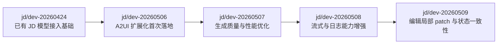

# 20260506-20260509 分支改动复盘总览

这份文档是索引页，用来快速定位每个日期分支的改动复盘。详细内容已经拆到 `分支复盘/` 目录下，避免一个文档过长。

## 对比口径

本文只基于本地 Git 分支引用做对比，不包含当前工作区未提交改动。

| 当前分支 | 对比基线 | 短统计 | 详细文档 |
|---|---|---:|---|
| `jd/dev-20260506` | `jd/dev-20260424` | 43 files, +11492 / -41 | [20260506-A2UI扩展化与部署基础](分支复盘/20260506-A2UI扩展化与部署基础.md) |
| `jd/dev-20260507` | `jd/dev-20260506` | 8 files, +350 / -237 | [20260507-A2UI生成优化](分支复盘/20260507-A2UI生成优化.md) |
| `jd/dev-20260508` | `jd/dev-20260507` | 35 files, +1991 / -70 | [20260508-全量流式与日志能力](分支复盘/20260508-全量流式与日志能力.md) |
| `jd/dev-20260509` | `jd/dev-20260508` | 7 files, +1213 / -12 | [20260509-A2UI编辑局部Patch](分支复盘/20260509-A2UI编辑局部Patch.md) |

## 总体演进



## 快速判断

- 想看 `/api/chat`、`/api/models`、A2UI 状态接口、云端部署脚本从哪里来的，看 `20260506`。
- 想看为什么加了 `get_a2ui_component_metas`、为什么优化生成 skill，看 `20260507`。
- 想看为什么 tools 也改成流式、为什么加 LLM API 日志、为什么 `write_file` 也能实时渲染，看 `20260508`。
- 想看删除/修改组件为什么只发局部 `a2ui` 事件、为什么有 thread cookie，看 `20260509`。

## 复现命令

```bash
git diff --stat jd/dev-20260424..jd/dev-20260506
git diff --stat jd/dev-20260506..jd/dev-20260507
git diff --stat jd/dev-20260507..jd/dev-20260508
git diff --stat jd/dev-20260508..jd/dev-20260509
```

