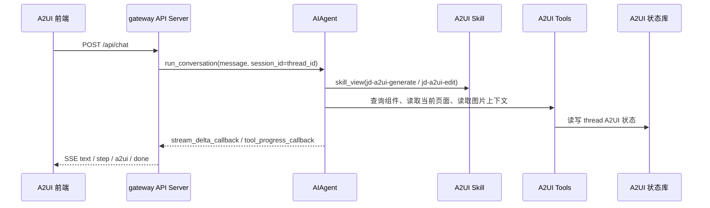

# 20260506 分支复盘：A2UI 扩展化与部署基础

对比口径：`jd/dev-20260506` 相比 `jd/dev-20260424`。

短统计：43 files changed, 11492 insertions, 41 deletions。

## 1. 需求背景

这个分支是 A2UI 能力首次进入当前项目的主分支。

当时的目标是：复用 Hermes Agent 已有的主循环、skill、tool、gateway 和 session 能力，补齐旧项目 `jd-agent-chat-ui` 前端所需的接口，而不是把旧项目的 intent agent、execution kernel、双模型流程整体搬进来。

核心矛盾是：

- 前端仍然需要 `/api/chat`、`/api/models`、`/api/threads/{thread_id}/a2ui`。
- 后端不能复制第二套 Agent 运行时。
- A2UI 生成、编辑、组件知识、图片上下文应该做成扩展点。
- 云端部署要能按公司构建流程打基础镜像和应用镜像。

## 2. 需求内容

| 类型 | 内容 |
|---|---|
| 前端兼容接口 | 新增 `/api/chat`、`/api/models`、`/api/threads/{thread_id}/a2ui`、`/api/threads/a2ui` |
| A2UI Skill | 新增 `jd-a2ui-generate` 和 `jd-a2ui-edit` |
| A2UI 工具 | 新增组件目录、组件检索、组件 meta 查询、当前 A2UI 读取、上传图片上下文读取 |
| 组件知识 | 引入本地完整组件 meta 快照 `jd_a2ui/a2ui_components_meta.json` |
| 部署能力 | 新增 Dockerfile、容器启动脚本、本地端口转发脚本、云端部署文档 |
| JD 模型能力 | 扩展 JD 模型白名单、能力标记、上下文长度和模型别名 |

## 3. 技术设计

设计重点：`/api/chat` 只做协议兼容，不接管 Agent 决策。模型是否加载 A2UI skill，由现有 skill 机制自然触发。

## 4. 核心改动点

| 文件 | 改动说明 |
|---|---|
| `gateway/platforms/api_server.py` | 增加前端兼容接口；把模型文本增量转成 `text/a2ui`，把工具进度转成 `step` |
| `jd_a2ui/catalog.py` | 新增组件 meta loader、结构校验、检索、本地快照读取 |
| `jd_a2ui/a2ui_components_meta.json` | 引入完整 A2UI 组件 meta 本地快照 |
| `jd_a2ui/state.py` | 新增线程维度 A2UI JSON 和上传图片上下文持久化 |
| `jd_a2ui/streaming.py` | 新增 A2UI JSON 流式解析缓冲 |
| `tools/a2ui_tools.py` | 注册 A2UI 工具：目录、检索、meta、当前状态、图片上下文 |
| `skills/jd/a2ui-generate/SKILL.md` | 新增 A2UI 生成 skill |
| `skills/jd/a2ui-edit/SKILL.md` | 新增 A2UI 编辑 skill |
| `toolsets.py` | 注册 A2UI 工具集 |
| `hermes_cli/enterprise.py` | 扩展 JD 模型文本、工具、图片、视频、上下文能力表 |
| `agent/model_metadata.py` | JD 模型上下文长度优先读取企业白名单 |
| `docker/base/Dockerfile`、`docker/app/Dockerfile` | 新增云端镜像构建入口 |
| `server_scripts/start.sh` 等 | 新增容器启动、停止、环境变量加载 |
| `scripts/forward_api_port.py` | 新增本地 80 到 8642 端口转发脚本 |
| `scripts/sync_a2ui_meta.py` | 新增组件 meta 同步脚本 |

## 5. 测试用例

主要新增或扩展：

- `tests/gateway/test_api_server_a2ui_compat.py`
- `tests/tools/test_a2ui_extension.py`
- `tests/tools/test_a2ui_meta_sync.py`
- `tests/hermes_cli/test_enterprise_jd_provider.py`
- `tests/hermes_cli/test_env_loader.py`
- `tests/tools/test_skills_tool.py`

## 6. 维护关注点

- `/api/chat` 不应变成 A2UI 专用接口，A2UI 规则应继续放在 skill 和工具里。
- `jd_a2ui/a2ui_components_meta.json` 是运行时稳定快照，线上不应每次调用读 OSS。
- `read_uploaded_ui_context` 不应默认暴露给普通请求，否则容易多一轮工具调用。
- 云端启动优先检查 `HERMES_HOME`、`JD_API_KEY`、`JD_BASE_URL`、`API_SERVER_*`。

