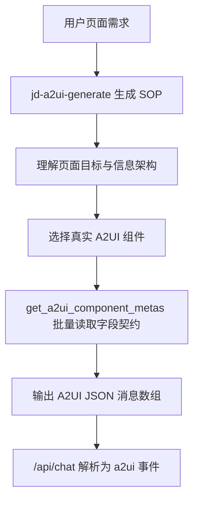

# 20260507 分支复盘：A2UI 生成优化

对比口径：`jd/dev-20260507` 相比 `jd/dev-20260506`。

短统计：8 files changed, 350 insertions, 237 deletions。

## 1. 需求背景

`20260506` 已经跑通了 A2UI 生成，但真实联调时发现生成首页仍然偏慢，且生成 skill 容易被某个案例牵着走。

问题集中在两点：

- 模型逐个调用 `get_a2ui_component_meta`，每个工具结果都会引发下一轮模型调用，耗时变长。
- skill 文本太长、太细、太像“京东金融首页专项提示词”，不利于泛化到其他页面需求。

## 2. 需求内容

这个分支没有通过“限制组件数量”来提速，而是优化模型生成 A2UI 的方法论和工具读取方式：

- 新增批量组件 meta 查询，减少工具回合。
- 重写 `jd-a2ui-generate` 为通用页面生成 SOP。
- 对 A2UI 请求先暂存普通解释文本，优先等待 A2UI JSON 解析成功。
- 图片上下文工具只在请求携带 `images` 时临时启用。

## 3. 技术设计

## 4. 核心改动点

| 文件 | 改动说明 |
|---|---|
| `skills/jd/a2ui-generate/SKILL.md` | 改成“生成 SOP + 组件选型规则 + 协议硬规则 + 视觉规则”，减少单一案例绑定 |
| `jd_a2ui/catalog.py` | 新增 `_component_contract()`、`get_component_metas()`，支持一次返回多个组件精简字段契约 |
| `tools/a2ui_tools.py` | 新增 `get_a2ui_component_metas` 工具 schema 和注册 |
| `toolsets.py` | 把批量 meta 工具加入 A2UI 工具集，并拆出 `a2ui-image` 工具集 |
| `gateway/platforms/api_server.py` | 新增 `_looks_like_a2ui_request()`，支持 `extra_enabled_toolsets` |
| `jd_a2ui/streaming.py` | 增加 `hold_text_until_a2ui`，A2UI 场景优先解析 JSON 再输出普通文本 |

## 5. 测试用例

主要扩展：

- `tests/tools/test_a2ui_extension.py`

重点覆盖：

- 批量组件 meta 查询。
- 生成 skill 是否引用真实组件规则。
- A2UI 场景文本缓冲是否符合预期。

## 6. 维护关注点

- `get_a2ui_component_metas` 返回精简字段契约，不是完整 meta；需要完整 prefab 时再查单组件。
- `hold_text_until_a2ui` 只是 SSE 文本缓冲策略，不是意图识别。
- 后续优化 skill 时，应保留“通用 SOP + 少量示例”的结构，不要写成某个页面的硬编码模板。

