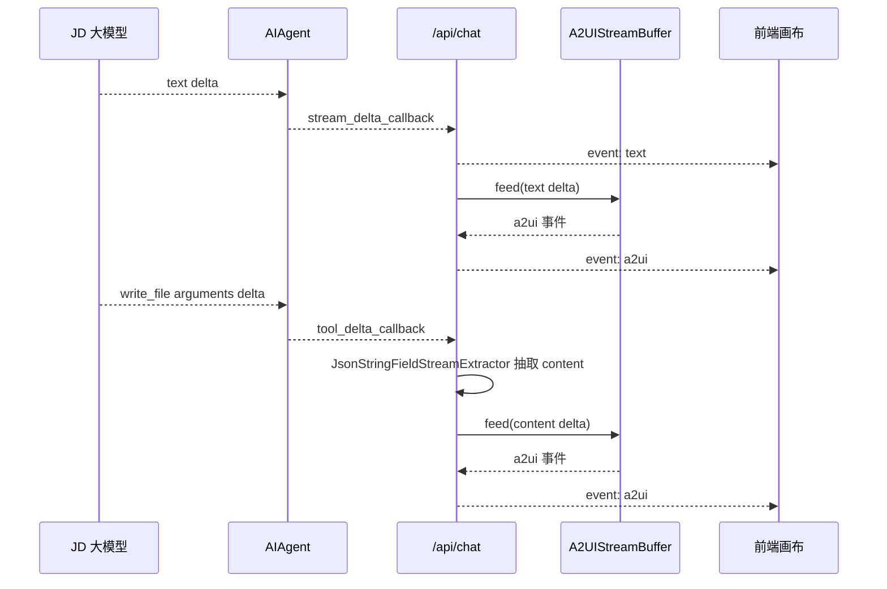
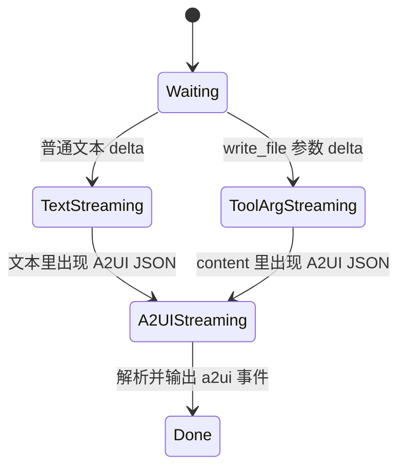

# 20260508 分支复盘：全量流式与日志能力

对比口径：`jd/dev-20260508` 相比 `jd/dev-20260507`。

短统计：35 files changed, 1991 insertions, 70 deletions。

## 1. 需求背景

`20260507` 之后，A2UI 生成还有一个核心体验问题：模型有时会把 A2UI JSON 写入 `write_file(content=...)` 工具参数，而不是直接输出到普通文本流。这样前端只能等工具完成后一次性渲染，达不到真正的流式画布效果。

另外，JD Chat / JD Responses 带 tools 的轮次之前存在非流式策略，导致工具参数分片不能进入前端实时解析链路。

联调过程中还需要完整的大模型 API 日志：入参、出参、URL、首 token 耗时、完整耗时。

## 2. 需求内容

本分支把流式能力扩展到更多路径：

- JD Chat 带 tools 也允许流式。
- JD Responses 带 tools 也允许流式，并合并 function call 参数分片。
- `write_file(content=...)` 参数边生成边解析 A2UI。
- `/api/chat` 的 `text` 事件完整镜像模型 API 的文本流。
- 新增 LLM API 结构化日志。
- 整理 `plans` 文档目录，按中文目录分类。

## 3. 技术设计

## 4. 核心改动点

| 文件 | 改动说明 |
|---|---|
| `run_agent.py` | 新增 LLM API 日志；新增 `tool_delta_callback`；移除 JD tools 轮次强制非流式；记录首 token 和完整耗时 |
| `gateway/platforms/api_server.py` | 接收 `tool_arg_delta`，从 `write_file.content` 中抽取 A2UI JSON 增量 |
| `jd_a2ui/streaming.py` | 新增 `SurfaceUpdateComponentsStreamParser`、`JsonStringFieldStreamExtractor`、旧式组件树兜底、默认 surfaceId 补齐 |
| `agent/transports/jd_responses.py` | 合并 OpenAI Responses SSE 文本与 function_call 参数；合并 Gemini functionCall parts |
| `agent/prompt_builder.py`、`hermes_cli/default_soul.py` | 去掉默认身份中的开源品牌暴露，改成通用智能助手身份 |
| `plans/*` | 文档重命名为中文，并按目录分类 |

## 5. 状态图

## 6. 测试用例

主要新增或扩展：

- `tests/run_agent/test_llm_api_logging.py`
- `tests/run_agent/test_run_agent.py`
- `tests/run_agent/test_streaming.py`
- `tests/agent/transports/test_jd_responses_transport.py`
- `tests/gateway/test_api_server_a2ui_compat.py`
- `tests/tools/test_a2ui_extension.py`

## 7. 维护关注点

- `tool_delta_callback` 是 `write_file` 实时渲染的关键，不要当作普通进度事件删掉。
- LLM API 日志包含完整请求和响应，生产环境要注意日志权限与敏感信息。
- JD Responses 同时有 OpenAI Responses 和 Gemini Responses 两类形态，不能简单合并成一种协议。
- 文档目录中文化后，新增维护文档应放到对应分类。

