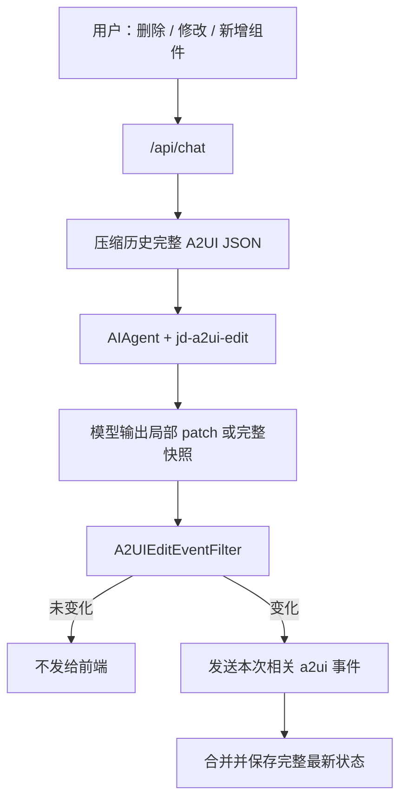
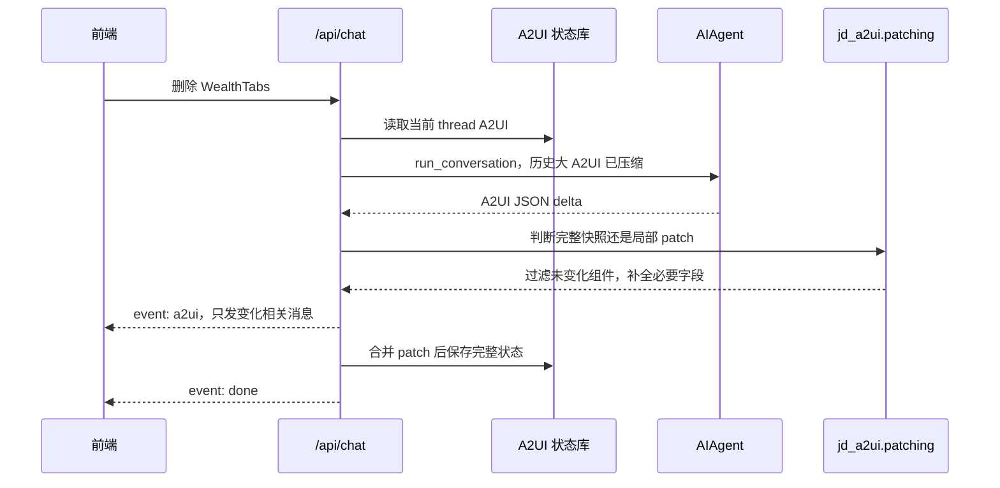

# 20260509 分支复盘：A2UI 编辑局部 Patch

对比口径：`jd/dev-20260509` 相比 `jd/dev-20260508`。

短统计：7 files changed, 1213 insertions, 12 deletions。

## 1. 需求背景

`20260508` 解决了生成页面的流式问题，但编辑场景仍然慢。

典型问题：

- 用户只要求删除一个组件，模型可能输出整个页面的 A2UI JSON。
- `/api/chat` 会把完整页面拆成大量 `a2ui` 事件发给前端，耗时长、重复渲染多。
- 前端有时每轮请求传新的 `thread_id`，但画布状态还在旧 thread，导致编辑工具读不到当前页面。

## 2. 需求内容

本分支围绕编辑场景做收敛：

- 识别 A2UI 编辑请求。
- 压缩历史中的完整 A2UI JSON，避免模型基于旧历史整页重写。
- 如果模型输出完整快照，只把本次变化相关的 `a2ui` 事件发给前端。
- 如果模型输出局部 patch，把 patch 合并回后端完整状态。
- 解析到 A2UI 事件后立即持久化。
- 通过 cookie 复用已有 A2UI 状态的 thread。

## 3. 技术设计

## 4. 核心改动点

| 文件 | 改动说明 |
|---|---|
| `jd_a2ui/patching.py` | 新增 A2UI patch 工具函数：签名比对、完整快照判断、局部 patch 合并、孤儿节点裁剪、局部消息补全 |
| `gateway/platforms/api_server.py` | 新增编辑请求判断、历史压缩、thread cookie 复用、编辑事件过滤、实时持久化 |
| `skills/jd/a2ui-edit/SKILL.md` | 强化编辑规则，要求优先输出本次编辑相关更新，不要整页重写 |
| `tests/gateway/test_api_server_a2ui_compat.py` | 增加编辑持久化、局部 patch、cookie 复用、历史压缩测试 |
| `tests/tools/test_a2ui_extension.py` | 增加 patch 合并、删除子树裁剪、局部消息补全测试 |

## 5. 编辑链路时序图

## 6. 测试用例

重点测试：

- `test_api_chat_compacts_historical_a2ui_json_before_agent_context`
- `test_api_chat_passes_compacted_a2ui_history_to_agent`
- `test_api_chat_persists_a2ui_before_agent_turn_finishes`
- `test_api_chat_edit_result_persists_latest_thread_a2ui_state`
- `test_api_chat_edit_sends_only_changed_a2ui_events_for_full_snapshot`
- `test_api_chat_edit_partial_patch_persists_full_pruned_state`
- `test_api_chat_reuses_cookie_thread_when_frontend_sends_new_empty_thread`
- `test_a2ui_edit_event_filter_suppresses_unchanged_full_snapshot_messages`
- `test_merge_a2ui_patch_messages_prunes_deleted_subtree`
- `test_expand_partial_a2ui_message_fills_existing_component_fields`

## 7. 维护关注点

- 前端需要的是局部变化事件，后端必须保存完整最新页面，这两者不要混淆。
- `_compact_api_chat_history_for_a2ui()` 是为了避免模型基于旧整页 JSON 编辑，不是删除用户意图。
- thread cookie 复用只在 body thread 没有 A2UI 状态、cookie thread 有 A2UI 状态时生效。
- 如果模型仍频繁输出整页，应优先优化 `jd-a2ui-edit` skill，而不是取消 patch 过滤。

