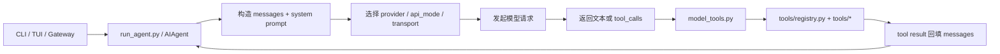

# JDT Hermes Agent 熟悉与二次开发实战指南

## 1. 文档目标

这份文档不是泛泛的项目介绍，而是面向你当前目标的一份实战路线图：

- 先高质量熟悉 `jdt-hermes-agent`
- 再把 Hermes 的大模型调用切到公司内部大模型
- 最后为后续 JD A2UI 扩展层预留稳定切入点

这份指南基于两份输入材料来定制：

- `plans/00-项目规划/改造目标.md`
- `/Users/fenggongye1/Downloads/pythonProject/jd-agent-chat-ui/docs/jd_llm/`

## 2. 先说结论

- 第一阶段最重要的事情，不是立刻写 A2UI 业务代码，而是先吃透 Hermes 底座的主链路、扩展点、状态流。
- 第一刀最稳的改造点，不是修改 `run_agent.py` 的核心对话循环，而是先把公司内部模型作为一个 provider 或 custom endpoint 接进现有链路。
- 你们给的 `JD Chat API` 更接近 Hermes 当前最容易接入的形态；不要一开始就从 `JD Responses API` 下手。
- 你们给的 `JD Responses API` 文档是 Gemini 风格请求体：`contents`、`generation_config`、`system_instruction`。Hermes 现有的 `codex_responses` 传输层期待的是 OpenAI Responses 风格：`instructions`、`input`、`tools`、`parallel_tool_calls`。两者不是一回事。
- 第一阶段推荐优先验证 `JD Chat API + 支持工具调用的模型`。从你给的模型文档看，首选可以先试 `JoyAI-Code`，备选 `Qwen3.5-397B-A17B`、`Kimi-K2.5`。
- 如果公司接口没有标准 `/models` 端点，Hermes 仍然能跑，但模型选择菜单、模型自动探测、模型校验体验会变差。后面最好补“静态模型目录”这一层。
- 如果你们的目标是“全链路都改成公司模型”，不要只改主聊天模型；还要看 `agent/auxiliary_client.py`，因为压缩、总结、视觉等辅助能力也会从这里走。

## 3. 你先要建立的总体脑图



再细化一层，你要重点盯住这 4 条链：

- 对话主链：`cli.py` / `gateway/run.py` -> `run_agent.py`
- 工具链：`model_tools.py` -> `tools/registry.py` -> `tools/*`
- 模型链：`hermes_cli/providers.py` -> `hermes_cli/runtime_provider.py` -> `run_agent.py` -> `agent/transports/*`
- 辅助链：`agent/auxiliary_client.py` -> 压缩、视觉、总结、辅助推理

## 4. 环境准备

### 4.1 先把基础环境跑起来

仓库明确要求先激活虚拟环境：

```bash
source .venv/bin/activate
```

如果本地依赖还没装完整，建议在仓库根目录执行：

```bash
uv pip install -e ".[all,dev]"
```

如果你的本地虚拟环境目录名不是 `.venv`，按你自己的实际目录调整；但当前这个仓库里实际存在的是 `.venv`。

### 4.2 你后面最常用的命令

```bash
source .venv/bin/activate
hermes --help
hermes model
hermes
scripts/run_tests.sh
```

### 4.3 测试规则

- 只能用 `scripts/run_tests.sh`
- 不要直接跑 `pytest`
- 这不是形式要求，而是为了保持和 CI 一致

## 5. 用 8 步熟悉这个项目

下面这 8 步是推荐顺序。不要跳着看，不然很容易“每个文件都认识一点，但整体链路还是不清楚”。

### 第 1 步：先搞清入口、安装和运行方式

先看这些文件：

- `AGENTS.md`
- `README.md`
- `pyproject.toml`
- `hermes_cli/main.py`

这一步你要回答 4 个问题：

- 项目的主入口到底有哪些
- `hermes` 命令是怎么映射到 Python 入口的
- CLI、TUI、Gateway 分别负责什么
- 开发时到底应该怎么跑、怎么测

这一步的产出：

- 你能用自己的话说清楚“这个项目不是单纯 CLI 工具，而是一个带 CLI / TUI / Gateway / API server / Tool system 的通用智能体底座”

### 第 2 步：吃透主循环

配套深度文档：[第 2 步：吃透 Hermes 主循环](./第2步-吃透主循环.md)

重点看：

- `run_agent.py`

至少把这些方法读懂：

- `AIAgent.__init__`
- `AIAgent._build_api_kwargs`
- `AIAgent._interruptible_api_call`
- `AIAgent._execute_tool_calls`
- `AIAgent._execute_tool_calls_sequential`
- `AIAgent._execute_tool_calls_concurrent`
- `AIAgent.run_conversation`

这一步你要回答：

- 用户消息从哪里进来
- system prompt 是什么时候组装的
- 什么时候发模型请求
- 模型返回 `tool_calls` 之后怎么调工具
- 工具结果怎么回填到 messages
- 什么条件下结束一轮对话

这一步的产出：

- 你手里应该有一张“单轮消息时序图”
- 你应该能指出“不要轻易改主循环”的原因

### 第 3 步：吃透工具注册与执行链

配套深度文档：[第 3 步：吃透工具注册与执行链](./第3步-吃透工具注册与执行链.md)

重点看：

- `model_tools.py`
- `tools/registry.py`
- `toolsets.py`
- `tools/file_tools.py`
- `tools/terminal_tool.py`

这一步你要搞清楚：

- 工具是如何自动发现的
- tool schema 是怎么暴露给模型的
- toolset 是如何控制启用/禁用的
- `handle_function_call()` 是怎么把 tool_call 分发到具体 handler 的

这一步的产出：

- 你能独立新增一个小工具
- 你知道以后 A2UI 能力如果做成工具，应该落在哪一层

### 第 4 步：吃透模型、Provider、Transport 这条链

这是和“改成公司内部模型”最相关的一步，必须精读。

配套深度文档：[第 4 步：吃透模型、Provider、Transport 这条链](./第4步-吃透模型提供方与传输链.md)

重点看：

- `hermes_cli/providers.py`
- `hermes_cli/auth.py`
- `hermes_cli/runtime_provider.py`
- `hermes_cli/models.py`
- `run_agent.py`
- `agent/transports/chat_completions.py`
- `agent/transports/codex.py`

这一步要重点回答：

- provider 是怎么定义的
- 运行时凭证是怎么解析的
- `api_mode` 是怎么决定的
- `chat_completions` 和 `codex_responses` 的区别是什么
- 模型列表、模型探测、模型校验是怎么做的
- 为什么同样叫 Responses，Hermes 里的 `codex_responses` 不能直接拿来接 JD 的 Responses API

这一步的产出：

- 你能准确指出“接公司模型”的第一组改造文件
- 你能判断公司接口属于哪种接入方式：配置级接入、内建 provider 接入、还是新增 transport

### 第 5 步：吃透记忆、压缩、辅助模型链

重点看：

- `agent/memory_manager.py`
- `agent/memory_provider.py`
- `agent/context_compressor.py`
- `agent/context_engine.py`
- `agent/auxiliary_client.py`

这一步你要搞清楚：

- 长期记忆和外部 memory provider 如何接
- 上下文压缩是什么时候触发的
- 压缩、总结、视觉等“辅助请求”是不是也在走模型
- 如果主模型切成公司内部模型，辅助模型是不是也要一起切

这一步非常关键，因为很多人只改了主对话模型，结果压缩、视觉、总结还在偷偷走外部 provider。

### 第 6 步：吃透 Skills、MCP、Delegation

重点看：

- `tools/skills_tool.py`
- `hermes_cli/skills_hub.py`
- `tools/mcp_tool.py`
- `tools/delegate_tool.py`

这一步你要回答：

- 什么能力适合做成 skill
- 什么能力适合做成 MCP
- 什么任务适合 delegation
- 以后 A2UI 生成、编辑、约束、设计上下文分别更适合落在哪层

推荐结论：

- A2UI 生成/编辑策略更适合做 skill
- 设计上下文读取更适合做 MCP
- 会话初始化、压缩后校验更适合做 hook

### 第 7 步：吃透 API server、Gateway、TUI

重点看：

- `gateway/platforms/api_server.py`
- `gateway/run.py`
- `cli.py`
- `tui_gateway/server.py`

这一步你要搞清楚：

- Hermes 原生 API 层已经具备了什么
- `/v1/runs` 和 SSE 是怎么组织的
- 以后如果要适配旧系统接口，应该复用哪层，而不是重写哪层

这一步的结论应该是：

- 第一阶段不要急着复刻旧 `/api/chat`
- 先把 Hermes 原生运行链理解透，再决定适配层怎么包

### 第 8 步：回到 JD 目标，划清扩展边界

回头再看：

- `plans/00-项目规划/改造目标.md`
- `plugins/disk-cleanup/`
- `plugins/memory/`
- `plugins/context_engine/`

你要形成自己的边界判断：

- 什么必须复用 Hermes 底座
- 什么应该做 JD 扩展层
- 什么不该侵入 `run_agent.py`

当前更合理的 JD 扩展形态是：

- `plugins/jd_a2ui/`
- `skills/jd-a2ui-*`
- `hooks/jd-*`
- `mcp/jd-design-context/`

## 6. 如果时间有限，先只看这 12 个文件

- `AGENTS.md`
- `run_agent.py`
- `model_tools.py`
- `tools/registry.py`
- `toolsets.py`
- `hermes_cli/providers.py`
- `hermes_cli/runtime_provider.py`
- `hermes_cli/auth.py`
- `hermes_cli/models.py`
- `agent/transports/chat_completions.py`
- `agent/auxiliary_client.py`
- `gateway/platforms/api_server.py`

## 7. 接公司内部大模型的三条路线

### 路线 A：先不改核心代码，直接把 JD Chat API 当作自定义 Provider 接入

这是第一阶段最推荐的路线。

适用条件：

- 公司接口支持 `Bearer API Key`
- base URL 能写成 `http://ai-api.jdcloud.com/v1`
- Chat API 至少兼容 OpenAI 风格的 `messages`
- 最好兼容 `tools` / `tool_calls`

为什么推荐它：

- 侵入最小
- 风险最低
- 可以最快验证 Hermes 和公司模型是否真的兼容

建议先配成 `providers:` 新格式，而不是一上来改源码。

建议配置示例：

```yaml
providers:
  jd-llm:
    name: JD 内部大模型
    base_url: http://ai-api.jdcloud.com/v1
    key_env: JD_LLM_API_KEY
    transport: openai_chat
    default_model: JoyAI-Code
    models:
      JoyAI-Code:
        context_length: 256000
      Qwen3.5-397B-A17B:
        context_length: 256000
      Kimi-K2.5:
        context_length: 256000

model:
  provider: jd-llm
  default: JoyAI-Code
```

建议把密钥放到 `~/.hermes/.env`：

```bash
JD_LLM_API_KEY=你的密钥
```

然后验证：

```bash
source .venv/bin/activate
hermes
```

第一轮只验证普通对话：

- 能不能正常回复
- 流式输出有没有问题
- `max_tokens` 没显式传时会不会报错

第二轮验证工具调用：

- 让 Hermes 去读本地文件
- 让 Hermes 去搜索当前仓库代码
- 看模型是否能返回标准 `tool_calls`

如果这一层能跑通，说明第一刀成功。

### 路线 B：把 JD 模型固化成 Hermes 的内建 Provider

当你完成路线 A 的兼容性验证后，再做这一步。

适用场景：

- 团队内部要长期维护
- 想让 `hermes model` 菜单里直接出现 JD provider
- 不想每台机器都手动配置 custom endpoint
- 想补全模型目录、上下文长度、默认模型、显示名称

这一步最关键的文件：

- `hermes_cli/providers.py`
- `hermes_cli/auth.py`
- `hermes_cli/models.py`
- `hermes_cli/runtime_provider.py`
- `run_agent.py`
- `agent/auxiliary_client.py`

建议改造方式：

- 在 `hermes_cli/providers.py` 增加 `jd-llm` provider 定义
- 在 `hermes_cli/auth.py` 的 `PROVIDER_REGISTRY` 增加 `JD_LLM_API_KEY`、默认 base URL、可选的 base URL env
- 在 `hermes_cli/models.py` 增加 `_PROVIDER_MODELS["jd-llm"]`
- 如果公司接口没有 `/models`，就在 `hermes_cli/models.py` 维护静态模型目录
- 如果需要默认请求头，例如固定 `Trace-Id`，在 `run_agent.py` 的 client 初始化与 `_apply_client_headers_for_base_url()` 里补
- 如果希望压缩、视觉、总结也默认走 JD provider，要同步处理 `agent/auxiliary_client.py`

这一步做完后的效果是：

- Hermes 从“能接公司模型”变成“原生支持公司模型”

### 路线 C：为 JD Responses API 新增一个独立 Transport

只有在下面两种情况下，才建议走这条路：

- 你必须接入只能走 JD Responses API 的模型
- JD Chat API 在工具调用或多模态上不兼容 Hermes 现有链路

为什么不能直接复用 Hermes 现有 `codex_responses`：

- Hermes `codex_responses` 构造的是 OpenAI Responses 风格请求
- JD 文档里的 Responses API 是 Gemini 风格请求
- 两边的输入和输出结构都不一样

如果必须做，建议这样切：

- 新增 `agent/transports/jd_responses.py`
- 在 `agent/transports/__init__.py` 注册新 transport
- 在 `run_agent.py` 增加新 `api_mode`
- 在 `hermes_cli/runtime_provider.py` 增加 `api_mode` 解析逻辑
- 把 JD 的响应归一化到 `agent/transports/types.py` 里的 `NormalizedResponse`

这条路线难度明显更高，所以不应该作为第一刀。

## 8. 第一阶段推荐首刀

我建议你的第一刀按下面顺序做：

1. 用 `JoyAI-Code` 通过 `JD Chat API` 跑通普通对话。
2. 用 `JoyAI-Code` 跑通一次标准工具调用。
3. 让 Hermes 的 `model/provider/runtime_provider` 能稳定识别 JD provider。
4. 把 `agent/auxiliary_client.py` 也切到 JD provider，避免辅助请求继续走外部模型。
5. 只在这之后，才开始搭 `plugins/jd_a2ui/`、`skills/jd-a2ui-*`、`hooks/jd-*`、`mcp/jd-design-context/`。

## 9. 你必须先验证的兼容性清单

在真正改代码前，先用 curl 或最小脚本验证下面这些点。

### 9.1 普通 Chat 能力

- `messages` 是否兼容 `system/user/assistant`
- `stream` 是否稳定
- `max_tokens` 是否可选
- 返回结构是否符合 `choices[0].message.content`

### 9.2 工具调用能力

Hermes 能否好用，最关键不是“能聊天”，而是“能稳定 tool calling”。

至少要确认：

- 请求体是否接受 `tools`
- 是否支持 `tool_choice: "auto"`
- 响应里是否返回 `tool_calls`
- 流式响应时是否也能正确增量返回 `tool_calls`

建议做一个最小试验：

```json
{
  "model": "JoyAI-Code",
  "messages": [
    {
      "role": "user",
      "content": "请调用工具获取北京天气"
    }
  ],
  "tools": [
    {
      "type": "function",
      "function": {
        "name": "get_weather",
        "description": "获取天气",
        "parameters": {
          "type": "object",
          "properties": {
            "city": {
              "type": "string"
            }
          },
          "required": [
            "city"
          ]
        }
      }
    }
  ],
  "tool_choice": "auto",
  "stream": false
}
```

如果这里拿不到 `tool_calls`，Hermes 就不可能稳定发挥长处。此时要么换一个支持工具调用的 JD 模型，要么做更深的协议适配。

### 9.3 模型发现能力

Hermes 很多模型切换体验依赖 `/models`。

你需要确认：

- `http://ai-api.jdcloud.com/v1/models` 是否存在
- 返回是否兼容 OpenAI 风格的 `data: [{id: "..."}]`

如果没有：

- 运行不一定会失败
- 但 `hermes model` 的探测与校验会不完整
- 这时建议在 `hermes_cli/models.py` 维护静态目录

### 9.4 模型名注意事项

你给的模型文档里有些模型名带空格，比如 `GPT 5.2`。

这会带来两个现实问题：

- 手动输入模型名时不如无空格 ID 稳定
- 某些校验逻辑与脚本流程更偏向无空格 model id

所以第一阶段更建议优先试这些名字更稳定的模型：

- `JoyAI-Code`
- `Qwen3.5-397B-A17B`
- `Kimi-K2.5`
- `JoyAI-81B-pro`

## 10. 这次接公司模型时，优先改哪里，不优先改哪里

### 优先改

- `hermes_cli/providers.py`
- `hermes_cli/auth.py`
- `hermes_cli/models.py`
- `hermes_cli/runtime_provider.py`
- `agent/auxiliary_client.py`
- `agent/transports/chat_completions.py`

### 谨慎改

- `run_agent.py`

只有这几种情况才建议动 `run_agent.py`：

- 公司接口要求特殊 header
- 需要新增新的 `api_mode`
- 需要在 client 初始化时区分 JD provider 特殊行为

### 第一阶段尽量不要改

- 核心 conversation loop 的控制结构
- A2UI 主编排逻辑
- 旧系统 `/api/chat` 强耦合流程

## 11. 后续做 JD A2UI 时，建议怎么分层

结合你们的目标文档，推荐这样拆：

- `plugins/jd_a2ui/`
  负责插件入口与统一装配
- `skills/jd-a2ui-generate`
  负责 A2UI 生成
- `skills/jd-a2ui-edit`
  负责 A2UI 编辑
- `skills/jd-a2ui-constraints`
  负责组件约束、schema、validator 规则注入
- `hooks/jd-session-init`
  负责线程初始化、上下文预热
- `hooks/jd-compression-guard`
  负责压缩后目标校验、防漂移
- `mcp/jd-design-context/`
  负责设计上下文读取与适配

这样做的好处是：

- Hermes 底座保持通用
- JD 定制能力可插拔
- 以后不止能做 A2UI，也能承载别的智能体任务

## 12. 建议的测试顺序

每做完一小步就测，不要攒到最后一起测。

建议顺序：

```bash
source .venv/bin/activate
scripts/run_tests.sh tests/hermes_cli/test_runtime_provider_resolution.py
scripts/run_tests.sh tests/hermes_cli/test_user_providers_model_switch.py
scripts/run_tests.sh tests/hermes_cli/test_custom_provider_model_switch.py
scripts/run_tests.sh tests/run_agent/test_agent_loop_tool_calling.py
scripts/run_tests.sh tests/run_agent/test_invalid_context_length_warning.py
scripts/run_tests.sh tests/agent/transports/test_chat_completions.py
```

如果你后面真的新增了 JD 专属 transport，再补针对 transport 的单测。

## 13. 最后给你的执行建议

如果你现在就要开干，我建议你按这个顺序来：

1. 先读完第 2 步、第 3 步、第 4 步涉及的文件。
2. 用配置方式把 `JD Chat API + JoyAI-Code` 跑起来。
3. 只验证两件事：普通对话能不能跑、工具调用能不能跑。
4. 通过后，再决定是否把 JD provider 固化进 Hermes 内建 provider 列表。
5. 等模型接入稳定后，再进入 A2UI 扩展层设计。

## 14. 阶段验收标准

当你做到下面这些，就说明第一阶段已经走稳了：

- 你能画出 Hermes 的一轮消息主链
- 你能说清 `provider`、`api_mode`、`transport` 三者的区别
- 你能指出“接公司模型”最关键的 5 个文件
- 你能让 Hermes 用公司模型完成一次普通对话
- 你能让 Hermes 用公司模型完成一次工具调用
- 你知道后续 JD A2UI 应该主要落在 plugin / skill / hook / MCP 哪些层

如果这些还没做到，不要急着做大规模二开。
