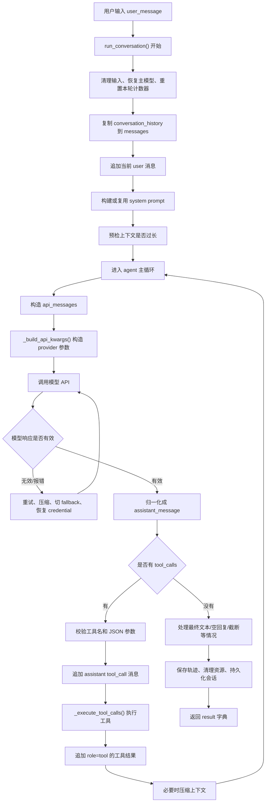
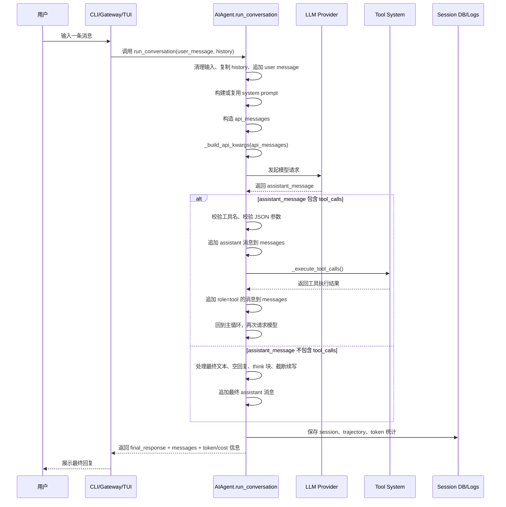
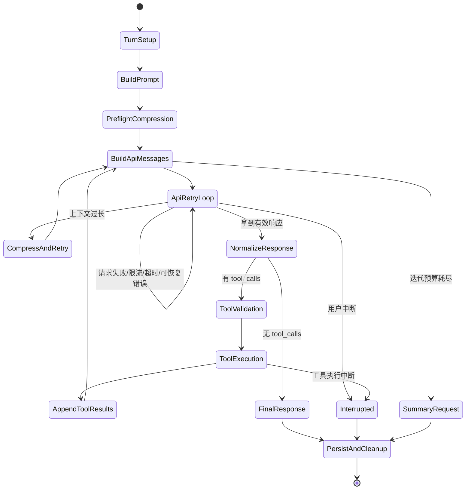
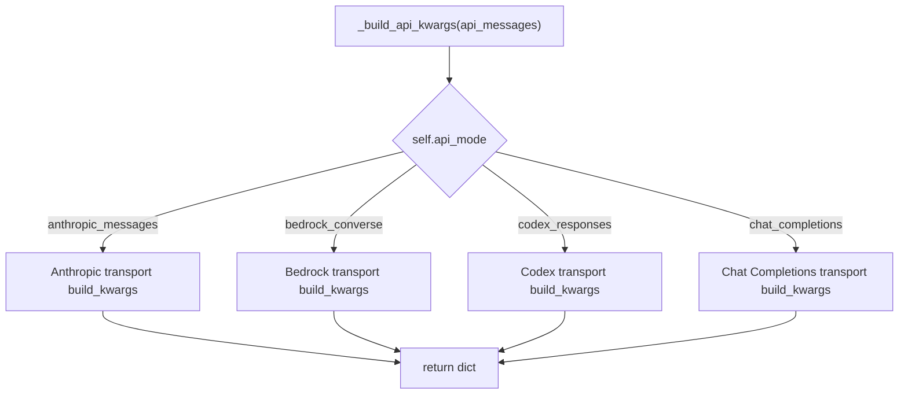
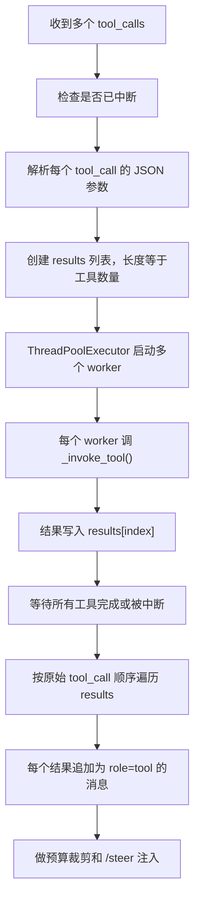
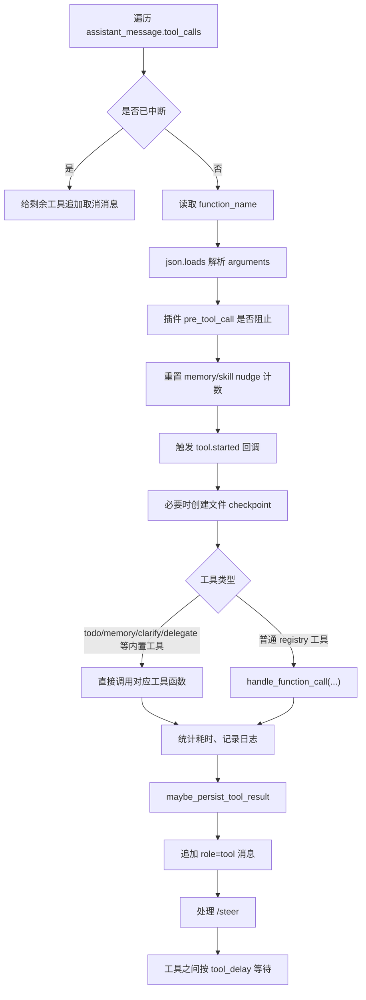

# 第 2 步：吃透 Hermes 主循环

本文目标：通过阅读这份文档，你能真正理解 [run_agent.py](/Users/fenggongye1/Downloads/pythonProject/jdt-hermes-agent/run_agent.py:1) 里 `AIAgent` 主循环相关代码的作用、流程、关键语法和改造风险。

这份文档重点围绕你列出的 7 个方法：

| 方法                                       |                                                                                               入口位置 | 你要掌握什么              |
| ---------------------------------------- | -------------------------------------------------------------------------------------------------: | ------------------- |
| `AIAgent.__init__`                       |   [run_agent.py:708](/Users/fenggongye1/Downloads/pythonProject/jdt-hermes-agent/run_agent.py:708) | Agent 初始化时准备了哪些状态   |
| `AIAgent._build_api_kwargs`              | [run_agent.py:6708](/Users/fenggongye1/Downloads/pythonProject/jdt-hermes-agent/run_agent.py:6708) | 发给不同模型接口的参数怎么组装     |
| `AIAgent._interruptible_api_call`        | [run_agent.py:5151](/Users/fenggongye1/Downloads/pythonProject/jdt-hermes-agent/run_agent.py:5151) | 非流式模型请求为什么要放到后台线程   |
| `AIAgent._execute_tool_calls`            | [run_agent.py:7414](/Users/fenggongye1/Downloads/pythonProject/jdt-hermes-agent/run_agent.py:7414) | 工具调用入口如何选择串行或并行     |
| `AIAgent._execute_tool_calls_concurrent` | [run_agent.py:7560](/Users/fenggongye1/Downloads/pythonProject/jdt-hermes-agent/run_agent.py:7560) | 多个工具如何并行执行并按原顺序回填   |
| `AIAgent._execute_tool_calls_sequential` | [run_agent.py:7863](/Users/fenggongye1/Downloads/pythonProject/jdt-hermes-agent/run_agent.py:7863) | 单个/交互式工具如何逐个执行      |
| `AIAgent.run_conversation`               | [run_agent.py:8417](/Users/fenggongye1/Downloads/pythonProject/jdt-hermes-agent/run_agent.py:8417) | 一轮用户消息从进入到返回的完整生命周期 |

注意：`run_agent.py` 是一个很大的文件。本文不是机械逐行翻译，而是按“先整体、再局部、最后回到问题”的方式，解释主循环相关代码。你读完后应该能自己打开源码，知道每段代码在整条链路里的位置。

---

## 1. 先建立一个总模型

`AIAgent` 可以先理解成一个“模型调用调度器”。

它不只是调用一次大模型，而是在一轮用户请求里反复做这些事：

1. 接收用户消息。
2. 组装 system prompt 和历史 messages。
3. 发起模型请求。
4. 如果模型返回 `tool_calls`，就执行工具。
5. 把工具结果作为 `role="tool"` 的消息塞回 `messages`。
6. 再次发给模型，让模型基于工具结果继续推理。
7. 直到模型返回没有工具调用的最终文本。
8. 保存会话、清理资源、返回结果。

用一句话概括：

> `run_conversation()` 是一个“模型 -> 工具 -> 模型 -> 工具 -> 最终回复”的循环。

---

## 2. 主流程总览图



你读源码时不要从每个 `if` 的细节开始。先抓住这条主线：

> `messages` 是内部会话历史，`api_messages` 是本次发给模型的临时请求体，`assistant_message` 是模型返回后统一出来的结构，`tool_msg` 是工具结果回填。

---

## 3. 单轮消息时序图

这张图回答“用户消息从哪里进来，什么时候发模型请求，工具结果怎么回填”。



关键点：

- 用户消息不是直接发给模型，而是先进入 `run_conversation()`。
- `system prompt` 不是每轮都重新构造，通常第一次构建后缓存。
- 模型返回工具调用后，代码先执行工具，再把工具结果放回 `messages`，然后让模型继续。
- 真正结束一轮对话的标志通常是：模型返回了没有 `tool_calls` 的可见文本。

---

## 4. 主循环状态图

`run_conversation()` 可以看成一个状态机。



你读代码时可以把每个大 `if` 放到这个状态图里定位。只要知道当前代码是在“构造请求”“请求重试”“响应归一化”“工具执行”“最终收尾”中的哪一步，就不容易迷路。

---

## 5. 关键数据结构

### 5.1 `messages`

`messages` 是 Hermes 内部维护的会话历史。

常见结构：

```python
{"role": "user", "content": "帮我看一下这个项目"}
{"role": "assistant", "content": "...", "tool_calls": [...]}
{"role": "tool", "tool_call_id": "...", "content": "...工具结果..."}
{"role": "assistant", "content": "最终回答"}
```

重要理解：

- `messages` 会被保存到会话日志和数据库。
- 工具结果也会进入 `messages`。
- 后续每次模型调用都会看到之前的 `messages`。
- 所以不能随便改历史消息，否则会破坏上下文、缓存和工具调用顺序。

### 5.2 `api_messages`

`api_messages` 是当前这一次请求真正发给 provider 的临时消息列表。

它来自 `messages`，但会额外做一些处理：

- 在开头插入 system prompt。
- 注入临时 memory/plugin 上下文。
- 注入 prefill messages。
- 添加 Anthropic prompt cache 标记。
- 清理 provider 不接受的内部字段。
- 修复工具参数 JSON。

一句话：

> `messages` 是真实历史，`api_messages` 是本次请求临时加工后的版本。

### 5.3 `assistant_message`

`assistant_message` 是模型返回后的统一对象。

不同 provider 的响应格式不一样：

- OpenAI Chat Completions 用 `response.choices[0].message`
- Codex Responses API 需要通过 transport normalize
- Anthropic Messages API 也需要 normalize
- Bedrock Converse 也会被适配成 OpenAI 风格

主循环后面主要关心：

```python
assistant_message.content
assistant_message.tool_calls
finish_reason
```

### 5.4 `tool_call`

模型想调工具时，会返回类似：

```python
tool_call.function.name
tool_call.function.arguments
tool_call.id
```

含义：

- `name`：工具名，比如 `read_file`、`terminal`、`memory`
- `arguments`：JSON 字符串，表示工具参数
- `id`：这次工具调用的唯一 ID，后面 `role="tool"` 的消息要用它对应回去

### 5.5 `tool_msg`

工具执行完后，会追加：

```python
tool_msg = {
    "role": "tool",
    "content": function_result,
    "tool_call_id": tool_call.id,
}
messages.append(tool_msg)
```

这一步非常关键。

模型不是通过函数返回值直接拿到工具结果，而是通过下一轮模型请求里的 `messages` 看到工具结果。

---

## 6. `AIAgent.__init__`：初始化时准备什么

入口：[run_agent.py:708](/Users/fenggongye1/Downloads/pythonProject/jdt-hermes-agent/run_agent.py:708)

`__init__` 是创建 Agent 对象时自动执行的方法。它主要不是处理一条用户消息，而是准备好后续对话需要的所有运行环境。

### 6.1 你先看参数

`__init__` 参数很多，但可以分成几类：

| 参数类型 | 代表参数 | 作用 |
|---|---|---|
| 模型连接 | `base_url`, `api_key`, `provider`, `api_mode`, `model` | 决定调用哪个模型接口 |
| 循环控制 | `max_iterations`, `tool_delay`, `iteration_budget` | 控制最多能调多少轮模型/工具 |
| 工具控制 | `enabled_toolsets`, `disabled_toolsets` | 控制启用哪些工具 |
| 展示控制 | `quiet_mode`, `verbose_logging`, callbacks | 控制 CLI/Gateway/TUI 怎么显示进度 |
| 会话控制 | `session_id`, `session_db`, `parent_session_id` | 控制会话日志和 SQLite 存储 |
| 上下文控制 | `skip_context_files`, `skip_memory`, `prefill_messages` | 控制 prompt、memory、few-shot 注入 |
| 可靠性控制 | `fallback_model`, `credential_pool`, checkpoints | 处理 fallback、凭证轮换、文件快照 |

读参数时别试图一次记住。先问自己：

> 这个参数是控制模型、工具、会话、展示，还是恢复能力？

### 6.2 `api_mode` 是初始化时决定的

`api_mode` 决定后面走哪种 API 协议。

常见值：

| `api_mode` | 含义 |
|---|---|
| `chat_completions` | OpenAI Chat Completions 兼容接口，默认路径 |
| `codex_responses` | OpenAI/Codex Responses API 路径 |
| `anthropic_messages` | Anthropic Messages API 路径 |
| `bedrock_converse` | AWS Bedrock Converse API 路径 |

相关逻辑在初始化里：

- 如果用户显式传了 `api_mode`，优先尊重。
- 如果 provider 是 `openai-codex`、`xai`，会切到 `codex_responses`。
- 如果 provider 是 `anthropic` 或 base URL 是 Anthropic，会切到 `anthropic_messages`。
- 如果 provider 是 `bedrock`，会切到 `bedrock_converse`。
- 否则默认 `chat_completions`。

这一步影响后面的 `_build_api_kwargs()` 和 `_interruptible_api_call()`。

### 6.3 初始化模型 client

初始化阶段会创建不同的 client：

- Anthropic native：创建 Anthropic client。
- Bedrock：不创建 OpenAI client，后面用 boto3。
- OpenAI-compatible：创建 OpenAI client。
- 没传显式 credential 时：通过 `resolve_provider_client()` 从配置里解析 provider、API key、base URL。

你二开内部大模型时，通常要重点关注：

- 公司接口是否 OpenAI-compatible。
- 是否只需要配置 `base_url` + `api_key`。
- 是否需要新增 provider 解析逻辑。
- 是否需要新增特殊 headers。

### 6.4 加载工具列表

初始化里有：

```python
self.tools = get_tool_definitions(...)
self.valid_tool_names = {tool["function"]["name"] for tool in self.tools}
```

含义：

- `self.tools` 是发给模型看的工具 schema。
- `self.valid_tool_names` 是合法工具名集合，用来校验模型有没有幻觉出不存在的工具。

后面 `run_conversation()` 里模型返回工具调用时，会用 `valid_tool_names` 检查：

```python
if tc.function.name not in self.valid_tool_names:
    ...
```

### 6.5 初始化 session、memory、context compressor

`__init__` 还会准备：

- `self.session_id`：会话 ID。
- `self.logs_dir` / `self.session_log_file`：JSON 会话日志。
- `self._session_db`：SQLite 会话数据库。
- `self._todo_store`：内置 todo 状态。
- `self._memory_store`：内置 MEMORY.md / USER.md 记忆。
- `self._memory_manager`：外部 memory provider。
- `self.context_compressor`：上下文压缩器。

这解释了为什么 `run_conversation()` 里看起来什么都能用：因为大部分状态已经在 `__init__` 准备好了。

---

## 7. `_build_api_kwargs`：真正请求模型前怎么组参数

入口：[run_agent.py:6708](/Users/fenggongye1/Downloads/pythonProject/jdt-hermes-agent/run_agent.py:6708)

这个方法输入：

```python
api_messages: list
```

输出：

```python
dict
```

这个 dict 后面会作为关键字参数传给模型请求：

```python
client.chat.completions.create(**api_kwargs)
```

这里的 `**api_kwargs` 是 Python 语法，意思是把字典展开成函数参数。

例如：

```python
api_kwargs = {"model": "xxx", "messages": messages, "tools": tools}
client.chat.completions.create(**api_kwargs)
```

等价于：

```python
client.chat.completions.create(
    model="xxx",
    messages=messages,
    tools=tools,
)
```

### 7.1 四种 API 分支

`_build_api_kwargs()` 的第一层逻辑是按 `self.api_mode` 分支。



### 7.2 Anthropic 分支

当 `api_mode == "anthropic_messages"`：

- 先把 OpenAI 风格 messages 转成 Anthropic 能接受的格式。
- 读取 context length。
- 处理临时 max output tokens。
- 调 `_transport.build_kwargs(...)`。

关键参数：

- `model`
- `messages`
- `tools`
- `max_tokens`
- `reasoning_config`
- `is_oauth`
- `context_length`
- `base_url`

### 7.3 Bedrock 分支

当 `api_mode == "bedrock_converse"`：

- 走 Bedrock transport。
- 传 region。
- 传 guardrail config。
- 默认 `max_tokens` 是 `self.max_tokens or 4096`。

Bedrock 不走 OpenAI client，所以后面 `_interruptible_api_call()` 也会特殊处理。

### 7.4 Codex Responses 分支

当 `api_mode == "codex_responses"`：

- 走 Codex transport。
- 判断是否 GitHub Responses。
- 判断是否 Codex backend。
- 判断是否 xAI Responses。
- 把 `session_id`、`reasoning_config`、`request_overrides` 等传进去。

这一层是为了兼容多个“Responses API 风格”的后端。

### 7.5 Chat Completions 分支

这是默认分支，也最重要。

它会识别：

- OpenRouter
- GitHub Models / Copilot
- Nous
- NVIDIA NIM
- Kimi/Moonshot
- Qwen Portal
- custom provider

然后构造：

- provider routing preferences
- temperature 策略
- max token 参数名
- reasoning extra body
- Qwen session metadata
- OpenRouter provider 参数

对接公司内部大模型时，如果公司接口兼容 OpenAI Chat Completions，通常最可能走这个分支。

---

## 8. `_interruptible_api_call`：为什么模型请求要放后台线程

入口：[run_agent.py:5151](/Users/fenggongye1/Downloads/pythonProject/jdt-hermes-agent/run_agent.py:5151)

这个方法处理“非流式 API 调用”。

它的设计目标是：

> 模型请求可能卡很久，但用户仍然应该能中断；gateway 也要知道 Agent 还活着。

### 8.1 核心结构

简化后大概是：

```python
result = {"response": None, "error": None}
request_client_holder = {"client": None}

def _call():
    try:
        result["response"] = ...真正请求模型...
    except Exception as e:
        result["error"] = e
    finally:
        ...关闭本次请求 client...

t = threading.Thread(target=_call, daemon=True)
t.start()

while t.is_alive():
    t.join(timeout=0.3)
    ...检查是否超时/中断/需要心跳...
```

### 8.2 这里的 Python 语法

`def _call():` 是在方法内部定义函数，叫“嵌套函数”。

`result` 是外层变量，内部 `_call()` 能修改它：

```python
result["response"] = ...
```

为什么不用普通局部变量？

因为 `_call()` 在另一个线程里执行，外层方法需要通过一个共享字典拿到结果。

`threading.Thread(target=_call, daemon=True)` 表示：

- 开一个后台线程。
- 线程执行 `_call()`。
- `daemon=True` 表示主程序退出时不阻塞退出。

### 8.3 不同 api_mode 怎么调用

`_call()` 里面仍然按 `api_mode` 分支：

| `api_mode` | 调用方式 |
|---|---|
| `codex_responses` | `_run_codex_stream(...)` |
| `anthropic_messages` | `_anthropic_messages_create(api_kwargs)` |
| `bedrock_converse` | boto3 `client.converse(...)` |
| 其他 | `client.chat.completions.create(**api_kwargs)` |

所以 `_build_api_kwargs()` 负责“准备参数”，`_interruptible_api_call()` 负责“真正发请求”。

### 8.4 stale-call detector

代码里有 stale timeout 检测。

意思是：

- 如果模型长时间没有返回，不能无限等。
- 超过阈值后，主动关闭连接。
- 抛出错误，让外层 retry/fallback 逻辑接管。

这就是为什么主循环能处理 provider 卡死、网络断开、长时间无响应。

---

## 9. `_execute_tool_calls`：工具执行入口

入口：[run_agent.py:7414](/Users/fenggongye1/Downloads/pythonProject/jdt-hermes-agent/run_agent.py:7414)

这个方法很短，但很关键。

它做两件事：

1. 标记当前正在执行工具：`self._executing_tools = True`
2. 判断工具批次应该串行还是并行执行

简化逻辑：

```python
tool_calls = assistant_message.tool_calls
self._executing_tools = True
try:
    if not _should_parallelize_tool_batch(tool_calls):
        return self._execute_tool_calls_sequential(...)
    return self._execute_tool_calls_concurrent(...)
finally:
    self._executing_tools = False
```

### 9.1 `try/finally` 的意义

`finally` 里的代码无论成功还是报错都会执行。

这里的意思是：

- 工具执行前，把 `_executing_tools` 设为 `True`。
- 不管工具执行成功、失败、被中断，结束后都必须恢复成 `False`。

这类状态标志如果忘了恢复，后续输出和回调可能会表现异常。

### 9.2 为什么有串行和并行

并行执行能加速多个独立工具，比如多个只读文件读取、多个搜索。

但不能所有工具都并行：

- 写同一个文件不能并行。
- 交互式工具不能随便并行。
- 有前后依赖的工具不能并行。

所以入口先判断 `_should_parallelize_tool_batch(tool_calls)`。

---

## 10. `_execute_tool_calls_concurrent`：并行工具执行

入口：[run_agent.py:7560](/Users/fenggongye1/Downloads/pythonProject/jdt-hermes-agent/run_agent.py:7560)

这个方法用于执行多个互相独立的工具调用。

### 10.1 并行执行的核心流程



### 10.2 为什么 results 要按 index 放

并行执行时，工具完成顺序是不确定的。

比如：

- 工具 1 跑 5 秒
- 工具 2 跑 1 秒
- 工具 3 跑 3 秒

完成顺序可能是 2、3、1。

但 OpenAI/Anthropic 工具协议通常要求工具结果和原始 tool call 对应清楚。所以代码用：

```python
results[index] = (...)
```

最后再按原始顺序追加回 `messages`。

### 10.3 worker 做什么

`_run_tool()` 是并行 worker。

它会：

- 注册当前 worker 线程 ID，方便中断。
- 给长时间运行的工具设置 activity callback。
- 调 `_invoke_tool(...)` 真正执行工具。
- 记录耗时。
- 判断是否错误。
- 把结果放进 `results[index]`。
- 清理 worker 线程的 interrupt 状态。

### 10.4 `_invoke_tool` 是并行路径的统一工具调用函数

入口：[run_agent.py:7442](/Users/fenggongye1/Downloads/pythonProject/jdt-hermes-agent/run_agent.py:7442)

它会先处理一些 Agent 内置工具：

- `todo`
- `session_search`
- `memory`
- `clarify`
- `delegate_task`
- memory provider tools

其他普通工具最终走：

```python
handle_function_call(...)
```

`handle_function_call` 来自 `model_tools.py`，再往下会调工具注册表。

---

## 11. `_execute_tool_calls_sequential`：串行工具执行

入口：[run_agent.py:7863](/Users/fenggongye1/Downloads/pythonProject/jdt-hermes-agent/run_agent.py:7863)

串行路径是原始工具执行方式，也更容易读懂。

### 11.1 核心流程



### 11.2 为什么每次工具前都检查中断

用户可能在工具执行期间发了新消息或 `/stop`。

如果已经中断，后续工具不应该继续执行。代码会给剩余工具追加类似“已取消”的 tool 消息，保证消息结构仍然完整。

### 11.3 工具参数为什么要 `json.loads`

模型返回的工具参数通常是 JSON 字符串：

```python
tool_call.function.arguments
```

比如：

```json
{"path": "README.md"}
```

Python 代码要真正使用它，需要转换成 dict：

```python
function_args = json.loads(tool_call.function.arguments)
```

如果解析失败，会降级成 `{}`，但主循环前面已经做过更严格的 JSON 校验，所以这里的异常理论上比较少见。

### 11.4 工具结果怎么回填

串行路径最后会做：

```python
tool_msg = {
    "role": "tool",
    "content": function_result,
    "tool_call_id": tool_call.id
}
messages.append(tool_msg)
```

这就是“工具结果回填到 messages”的位置。

后面外层 `run_conversation()` 会 `continue`，重新发起模型请求。模型下一轮就能看到这个工具结果。

---

## 12. `run_conversation`：主循环完整拆解

入口：[run_agent.py:8417](/Users/fenggongye1/Downloads/pythonProject/jdt-hermes-agent/run_agent.py:8417)

这个方法是你第二步最需要吃透的核心。

它可以分成 10 个阶段。

### 12.1 阶段 1：本轮初始化和输入清理

一开始会做：

- 安装安全 stdio，避免 daemon/headless 环境写 stdout 崩掉。
- 设置日志 session context。
- 如果上一轮切过 fallback，本轮先恢复 primary runtime。
- 清理用户输入里的非法 Unicode surrogate。
- 去掉泄漏进用户消息的 `<memory-context>`。
- 保存 stream callback。
- 生成 `effective_task_id`。
- 重置本轮 retry 计数器。
- 清理死连接。
- 初始化本轮 `IterationBudget`。

这一步回答：

> 为什么每次用户消息进来，Agent 不是立刻发模型请求？

因为它要先保证本轮状态干净，连接可用，输入不会让 SDK 序列化崩掉。

### 12.2 阶段 2：构造 messages

核心逻辑：

```python
messages = list(conversation_history) if conversation_history else []
user_msg = {"role": "user", "content": user_message}
messages.append(user_msg)
current_turn_user_idx = len(messages) - 1
```

含义：

- 如果调用方传了历史会话，就复制一份。
- 当前用户消息追加到最后。
- 记录当前 user message 的位置，后面注入 memory/plugin 上下文时要用。

注意：这里复制 history 是为了避免直接修改调用方传入的 list。

### 12.3 阶段 3：构建或复用 system prompt

关键变量：

```python
self._cached_system_prompt
active_system_prompt
```

逻辑是：

- 如果还没有缓存 system prompt，先尝试从 session DB 取历史 prompt。
- 如果取到了，就复用。
- 如果没有，就调用 `_build_system_prompt(system_message)` 新建。
- 新建后写入 session DB。

为什么要缓存？

因为 Anthropic prompt caching 依赖稳定的前缀。如果每轮 system prompt 都变，缓存就失效，成本会变高。

这一步回答：

> system prompt 是什么时候组装的？

答案：

> 在 `run_conversation()` 开始后、进入主循环前。如果是新会话，会调用 `_build_system_prompt()`；如果是继续会话，会尽量复用之前保存的 system prompt。

### 12.4 阶段 4：预检上下文压缩

如果历史消息太多，模型上下文可能放不下。

代码会先粗略估算：

```python
_preflight_tokens = estimate_request_tokens_rough(...)
```

如果超过压缩阈值，就调用：

```python
messages, active_system_prompt = self._compress_context(...)
```

这一步是在发模型请求前做，避免一上来就请求失败。

### 12.5 阶段 5：插件和外部 memory 预取

进入主循环前，还会：

- 调插件 hook：`pre_llm_call`
- 调 memory manager：`prefetch_all`

这些上下文不会直接改 `messages`，而是在构造 `api_messages` 时临时注入当前用户消息。

这点很重要：

> 临时注入的上下文不会持久化到会话历史里。

这样可以减少记忆上下文污染历史消息，也尽量保护 prompt cache。

### 12.6 阶段 6：进入外层 agent 主循环

主循环条件：

```python
while (api_call_count < self.max_iterations and self.iteration_budget.remaining > 0) or self._budget_grace_call:
```

意思是：

- 模型调用次数还没超过 `max_iterations`
- 共享 iteration budget 还有剩余
- 或者有一次 grace call

外层循环每轮做一件大事：

> 准备一次模型请求，并处理这次模型响应。

如果响应要求调工具，就执行工具并 `continue` 回到下一轮。

### 12.7 阶段 7：构造 api_messages

每一轮循环里都会从 `messages` 构造 `api_messages`。

主要动作：

- 复制每条 msg。
- 给当前用户消息注入 memory/plugin 上下文。
- 给 assistant 消息补 `reasoning_content`。
- 删除 provider 不接受的内部字段，比如 `reasoning`、`finish_reason`。
- 对 strict API 清理 tool_calls。
- 把 system prompt 插到最前面。
- 插入 prefill messages。
- 应用 Anthropic prompt caching。
- 修复孤儿 tool result / 缺失 tool result。
- 清理 surrogate 字符。
- 估算 token 数。

这里再次强调：

> `api_messages` 是本次请求的临时版本，`messages` 才是持久化历史。

### 12.8 阶段 8：内层 retry 循环

每次模型请求外面还有一层：

```python
while retry_count < max_retries:
```

内层循环负责把“这一轮请求”尽量跑成功。

它会处理：

- Nous rate limit guard
- 构造 `api_kwargs`
- 插件 hook：`pre_api_request`
- streaming / non-streaming 调用
- 响应结构校验
- finish_reason 判断
- token usage 统计
- 429/401/413/400 等错误恢复
- credential pool 轮换
- fallback provider 切换
- context overflow 压缩
- payload too large 压缩
- Unicode 编码错误恢复
- 超时重试和 backoff

这一步回答：

> 什么时候发模型请求？

答案：

> 在外层主循环构造完 `api_messages` 后，调用 `_build_api_kwargs(api_messages)` 生成参数，然后在内层 retry 循环中通过 streaming path 或 `_interruptible_api_call(api_kwargs)` 发出请求。

### 12.9 阶段 9：响应归一化

请求成功后，代码会把不同 provider 的响应统一成 `assistant_message`。

分支：

- `codex_responses`：`_get_codex_transport().normalize_response(response)`
- `anthropic_messages`：`_get_anthropic_transport().normalize_response(response)`
- 其他：`response.choices[0].message`

归一化后，后续代码主要看：

```python
assistant_message.content
assistant_message.tool_calls
finish_reason
```

### 12.10 阶段 10：有 tool_calls 的分支

如果：

```python
if assistant_message.tool_calls:
```

代码会先校验：

- 工具名是否存在于 `self.valid_tool_names`
- 工具参数是否是合法 JSON
- 工具调用是否被截断

然后：

```python
assistant_msg = self._build_assistant_message(assistant_message, finish_reason)
messages.append(assistant_msg)
self._execute_tool_calls(assistant_message, messages, effective_task_id, api_call_count)
continue
```

这一步回答：

> 模型返回 tool_calls 之后怎么调工具？

答案：

> 先把 assistant 的 tool call 消息追加进 `messages`，再调用 `_execute_tool_calls()`。这个方法会选择串行或并行路径执行工具。

这一步也回答：

> 工具结果怎么回填到 messages？

答案：

> `_execute_tool_calls_sequential()` 或 `_execute_tool_calls_concurrent()` 会为每个工具追加 `{"role": "tool", "content": ..., "tool_call_id": ...}` 到 `messages`。

### 12.11 阶段 11：没有 tool_calls 的分支

如果没有 tool calls：

```python
final_response = assistant_message.content or ""
```

但这不代表马上结束。代码还要处理：

- 内容只有 think/reasoning，没有可见正文。
- 流式输出中断，但已经有部分可见内容。
- 工具执行后模型返回空。
- thinking-only response 需要 prefill 再试。
- 空回复重试。
- 空回复后切 fallback。
- Codex intermediate ack，需要继续让模型调工具。
- 截断续写拼接。
- 去掉 `<think>` 块。

最终可见文本确认后：

```python
messages.append(final_msg)
break
```

这一步回答：

> 什么条件下结束一轮对话？

常见结束条件：

- 模型返回没有 `tool_calls` 的有效可见文本。
- 用户中断。
- 达到最大迭代次数后生成总结。
- 遇到不可恢复错误并返回失败结果。
- 响应截断、工具参数截断、上下文压缩失败等部分完成状态。

### 12.12 阶段 12：统一收尾

跳出主循环后会：

- 如果预算耗尽，请模型做一次总结。
- 判断 `completed`。
- 保存 trajectory。
- 清理任务资源。
- 持久化 session。
- 打诊断日志。
- 触发 `post_llm_call` hook。
- 提取最后的 reasoning。
- 组装 result dict。
- 处理 leftover steer。
- 清理 interrupt 状态。
- 清理 stream callback。
- 同步 memory provider。
- 启动后台 memory/skill review。
- 触发 `on_session_end` hook。
- 返回 result。

最终返回结构大致包含：

```python
{
    "final_response": final_response,
    "last_reasoning": last_reasoning,
    "messages": messages,
    "api_calls": api_call_count,
    "completed": completed,
    "interrupted": interrupted,
    "model": self.model,
    "provider": self.provider,
    "base_url": self.base_url,
    "input_tokens": ...,
    "output_tokens": ...,
    "estimated_cost_usd": ...,
}
```

---

## 13. 你必须能回答的 6 个问题

### 13.1 用户消息从哪里进来

用户消息由 CLI、Gateway、TUI 等上层入口传进：

```python
run_conversation(user_message=...)
```

进入后会被清理，然后追加到：

```python
messages.append({"role": "user", "content": user_message})
```

### 13.2 system prompt 是什么时候组装的

在 `run_conversation()` 前半段、进入主循环之前。

新会话：

```python
self._cached_system_prompt = self._build_system_prompt(system_message)
```

继续会话：

```python
stored_prompt = session_row.get("system_prompt")
self._cached_system_prompt = stored_prompt
```

### 13.3 什么时候发模型请求

每次外层主循环都会：

1. 从 `messages` 构造 `api_messages`
2. 调 `_build_api_kwargs(api_messages)`
3. 在 retry loop 中调用模型

非流式路径：

```python
response = self._interruptible_api_call(api_kwargs)
```

OpenAI-compatible 底层请求：

```python
client.chat.completions.create(**api_kwargs)
```

### 13.4 模型返回 tool_calls 之后怎么调工具

`run_conversation()` 发现：

```python
if assistant_message.tool_calls:
```

然后：

```python
messages.append(assistant_msg)
self._execute_tool_calls(...)
continue
```

`_execute_tool_calls()` 再决定走串行还是并行。

### 13.5 工具结果怎么回填到 messages

工具执行完后会追加：

```python
{
    "role": "tool",
    "content": function_result,
    "tool_call_id": tool_call.id,
}
```

这条消息会进入 `messages`。下一轮模型请求时，模型通过上下文看到工具结果。

### 13.6 什么条件下结束一轮对话

主要结束条件：

- 模型返回最终文本且没有 tool calls。
- 用户中断。
- 迭代预算耗尽并请求总结。
- API 多次失败且 fallback 不可用。
- 上下文压缩失败。
- 工具调用参数截断或无效到无法恢复。

---

## 14. Python 语法速查

这部分只讲你读这几个方法最常遇到的语法。

### 14.1 `self`

`self` 表示当前这个 `AIAgent` 对象。

```python
self.model = model
self.tools = get_tool_definitions(...)
```

意思是把值存到当前 Agent 实例上，后续其他方法都能访问。

### 14.2 类型标注

```python
conversation_history: List[Dict[str, Any]] = None
```

意思是：

- `conversation_history` 预期是一个列表。
- 列表每项是 dict。
- dict 的 key 是字符串，value 可以是任意类型。
- 默认值是 `None`。

类型标注主要给人和工具看，运行时通常不会自动强校验。

### 14.3 `Optional`

```python
stream_callback: Optional[callable] = None
```

意思是这个参数可以是一个 callback，也可以是 `None`。

### 14.4 `getattr`

```python
ctx_len = getattr(self, "context_compressor", None)
```

意思是：

- 如果 `self` 有 `context_compressor` 属性，就取它。
- 如果没有，就返回 `None`。

这常用于兼容某些属性可能不存在的情况。

### 14.5 `hasattr`

```python
if hasattr(response, "usage") and response.usage:
```

意思是先判断对象有没有 `usage` 属性，再访问它，避免报错。

### 14.6 `try/except/finally`

```python
try:
    ...
except Exception as e:
    ...
finally:
    ...
```

含义：

- `try`：尝试执行。
- `except`：报错时处理。
- `finally`：无论成功还是失败都执行。

工具执行入口里用 `finally` 恢复 `_executing_tools`，这类代码很重要。

### 14.7 `continue`、`break`、`return`

| 语法 | 含义 |
|---|---|
| `continue` | 跳过本次循环剩余代码，进入下一轮循环 |
| `break` | 退出当前循环 |
| `return` | 直接结束当前函数并返回结果 |

在 `run_conversation()` 里：

- 工具执行完通常 `continue`，因为还要让模型看工具结果。
- 最终回复生成后通常 `break`，因为要跳出主循环做收尾。
- 不可恢复错误通常 `return`，因为不需要继续走普通流程。

### 14.8 `**api_kwargs`

```python
client.chat.completions.create(**api_kwargs)
```

把 dict 展开成关键字参数。

这是 `_build_api_kwargs()` 和真正模型请求之间的连接点。

### 14.9 `json.loads` 和 `json.dumps`

```python
function_args = json.loads(tool_call.function.arguments)
```

把 JSON 字符串转成 Python dict。

```python
json.dumps({"error": _block_msg}, ensure_ascii=False)
```

把 Python dict 转成 JSON 字符串。

工具系统里大量使用 JSON，是因为模型函数调用协议要求参数结构化。

### 14.10 `ThreadPoolExecutor`

```python
with concurrent.futures.ThreadPoolExecutor(max_workers=max_workers) as executor:
    f = executor.submit(_run_tool, i, tc, name, args)
```

意思是开一个线程池，把多个工具调用提交进去并行跑。

`with` 表示上下文管理器，代码块结束时会自动清理线程池资源。

### 14.11 `SimpleNamespace`

代码里会把不同 provider 的响应转成：

```python
assistant_message = SimpleNamespace(
    content=...,
    tool_calls=...,
    reasoning=...,
)
```

`SimpleNamespace` 可以让你用点号访问属性：

```python
assistant_message.content
assistant_message.tool_calls
```

这比到处写 dict key 更接近 OpenAI SDK 的对象风格。

### 14.12 callback

很多参数叫 callback：

```python
tool_progress_callback
stream_delta_callback
status_callback
```

callback 就是“发生某件事时回调上层 UI/Gateway 的函数”。

比如工具开始时通知 TUI 显示进度，模型流式输出时通知语音模块或终端显示。

---

## 15. 为什么不要轻易改主循环

主循环看起来只是一个 while，但它同时维护很多隐含契约。

### 15.1 消息角色顺序不能乱

模型 API 对消息顺序很敏感。

常见合法顺序：

```text
user -> assistant(tool_calls) -> tool -> assistant
```

如果工具调用后没有对应 `role="tool"` 结果，很多 provider 会直接报错。

### 15.2 system prompt 不能随便重建

Hermes 依赖稳定 system prompt 来做 prompt caching。

如果每轮都重建 system prompt，可能导致：

- Anthropic cache miss
- 成本变高
- 多轮上下文行为变化
- 记忆重复注入

### 15.3 `messages` 和 `api_messages` 不能混淆

如果把临时注入的 memory/plugin 上下文写回 `messages`，会导致：

- 会话历史膨胀
- memory context 泄漏
- 后续轮次重复看到同一段上下文
- 压缩和持久化行为变复杂

### 15.4 工具调用要保持一一对应

每个 tool call 都有 `tool_call.id`。

回填时必须带：

```python
"tool_call_id": tool_call.id
```

否则模型不知道哪个工具结果对应哪个调用。

### 15.5 retry/fallback/compression 互相缠绕

主循环不只是 happy path。

它要处理：

- 限流
- 超时
- 上下文过长
- payload 太大
- provider 返回空响应
- tool call JSON 坏掉
- 输出被截断
- 用户中断
- fallback provider
- credential pool

改一个分支，很容易影响另一个恢复路径。

### 15.6 session 持久化不能随便提前或延后

如果保存时机错了，可能导致：

- 失败消息污染历史
- 压缩后的新 session 没写完整
- SQLite 里重复写消息
- Gateway 恢复会话时状态不一致

---

## 16. 建议阅读顺序

第一次读，不要从 `run_conversation()` 第一行一路读到最后。建议这样读：

1. 先读本文第 1 到 5 章，建立数据结构和流程。
2. 打开 [run_agent.py:8417](/Users/fenggongye1/Downloads/pythonProject/jdt-hermes-agent/run_agent.py:8417)，只看我加的中文阶段注释。
3. 看 `messages.append(user_msg)` 附近，确认用户消息进入位置。
4. 看 `_cached_system_prompt` 附近，确认 system prompt 组装时机。
5. 搜 `_build_api_kwargs(api_messages)`，确认发模型请求前的参数构造。
6. 搜 `if assistant_message.tool_calls:`，确认工具分支。
7. 跳到 `_execute_tool_calls_sequential()`，看工具结果怎么 append。
8. 回到 `else: # No tool calls` 分支，看最终回复怎么形成。
9. 最后读收尾 result dict，确认调用方能拿到什么。

---

## 17. 读完后的自测题

你能回答下面这些问题，就说明第二步已经基本吃透。

1. `messages` 和 `api_messages` 有什么区别？
2. 为什么 system prompt 要缓存？
3. `_build_api_kwargs()` 为什么要按 `api_mode` 分支？
4. `_interruptible_api_call()` 为什么不用主线程直接等？
5. 模型返回 tool call 后，为什么要先追加 assistant 消息再追加 tool 消息？
6. 工具结果为什么必须带 `tool_call_id`？
7. 什么情况下工具会并行执行？
8. 为什么并行工具完成后还要按原始顺序 append？
9. 空回复为什么不能直接当最终答案？
10. 为什么不要把临时 memory/plugin 注入直接写回 `messages`？

---

## 18. 最小 mental model

最后给你一个最小心智模型。以后看到 `run_conversation()`，先默念这 6 句：

1. `__init__` 准备模型、工具、会话、记忆、压缩器。
2. `run_conversation()` 接收用户消息，并追加到 `messages`。
3. 每轮循环从 `messages` 临时加工出 `api_messages`。
4. `_build_api_kwargs()` 根据 provider/api_mode 构造请求参数。
5. 模型要工具，就执行工具并把结果作为 `role="tool"` 放回 `messages`。
6. 模型不要工具并返回可见文本，就保存会话并返回 `final_response`。

把这 6 句想清楚，再去读细节，整个主循环就不再是一团乱麻。
