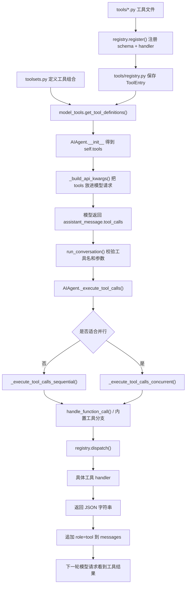
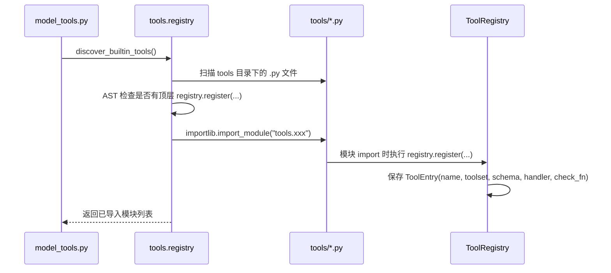
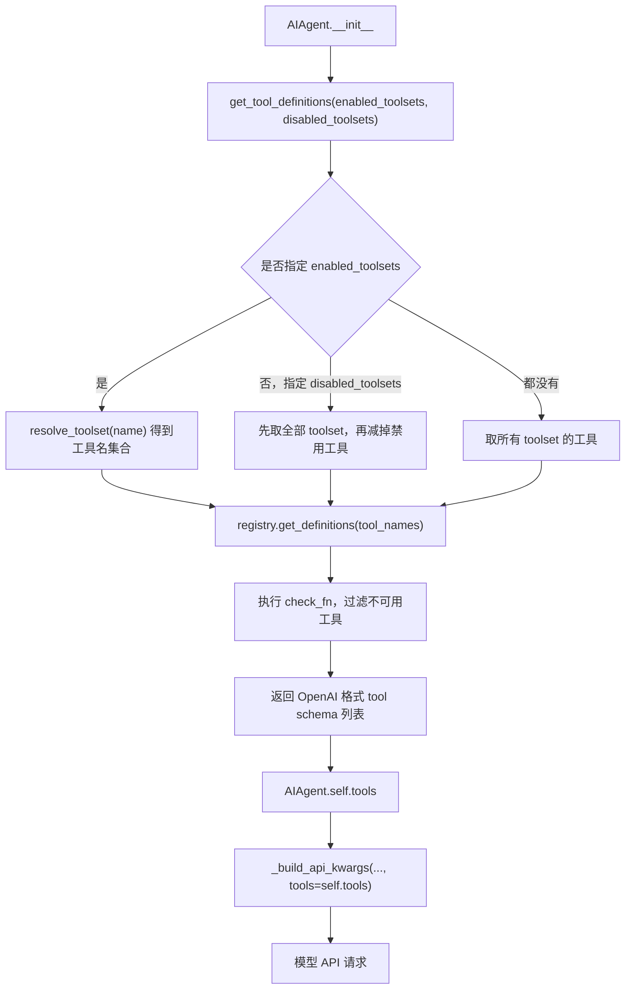
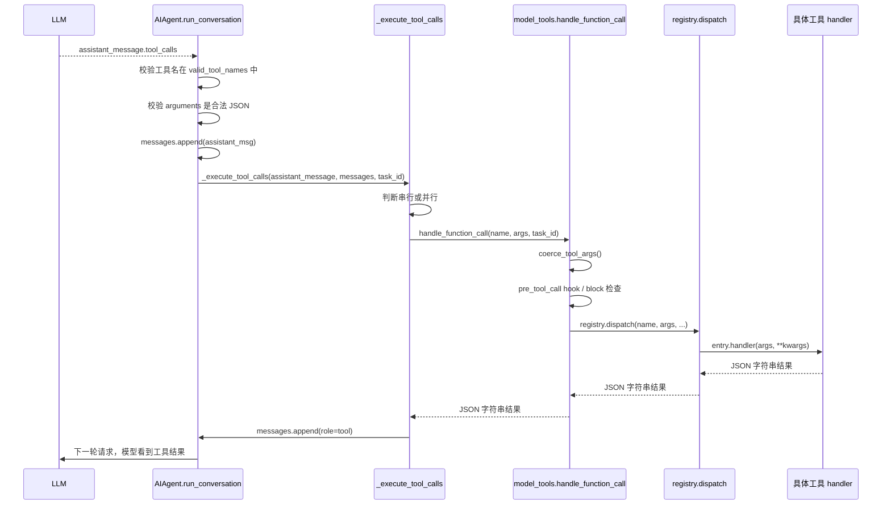
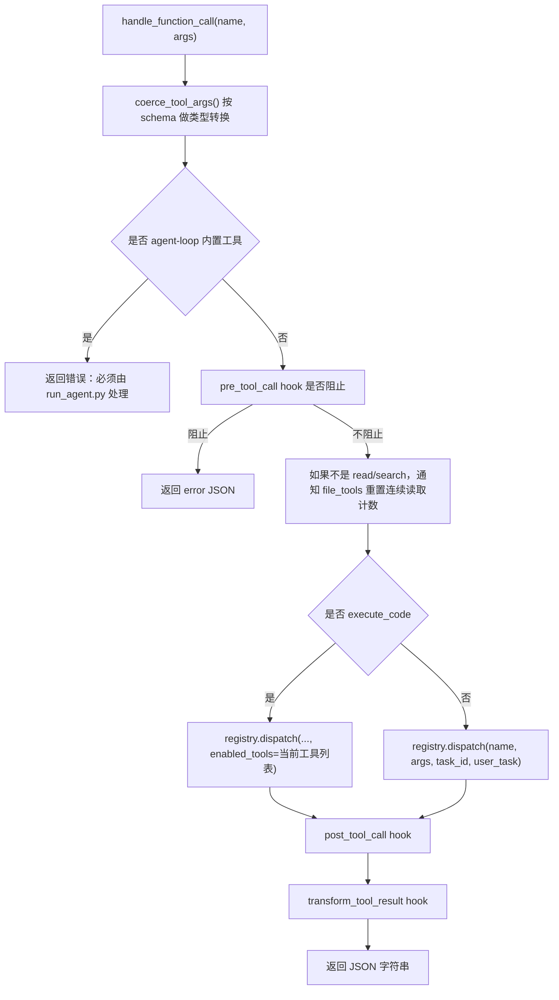
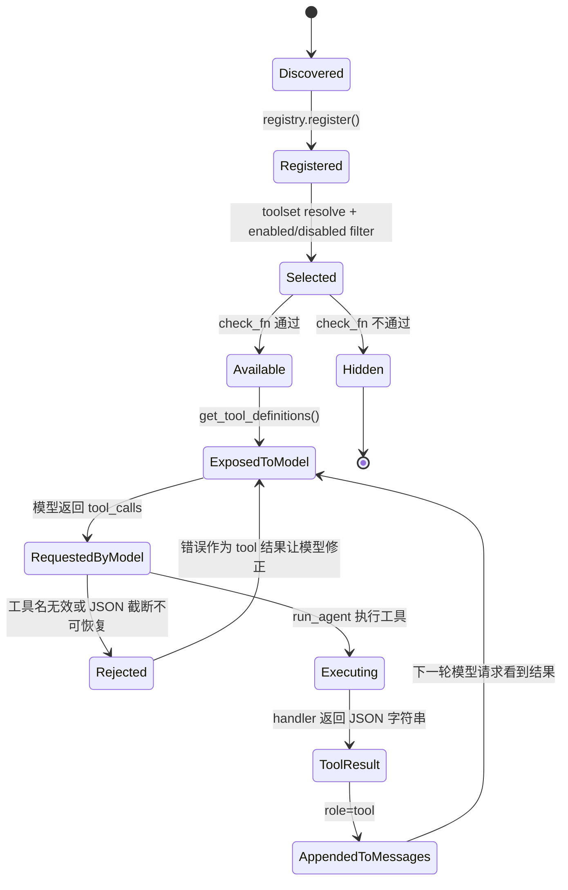

# 第 3 步：吃透工具注册与执行链

本文目标：通过阅读这份文档，你能彻底理解 Hermes 的工具系统：工具怎么注册、怎么被自动发现、tool schema 怎么暴露给模型、toolset 怎么控制启用/禁用、模型返回 `tool_calls` 后怎么分发到具体 handler，以及以后新增工具或做 A2UI 能力时应该落在哪一层。

配套源码：

| 文件 | 作用 |
|---|---|
| [model_tools.py](/Users/fenggongye1/Downloads/pythonProject/jdt-hermes-agent/model_tools.py:1) | 工具编排层：触发发现、筛选 schema、分发工具调用 |
| [tools/registry.py](/Users/fenggongye1/Downloads/pythonProject/jdt-hermes-agent/tools/registry.py:1) | 工具注册中心：保存 schema、handler、toolset、可用性检查 |
| [toolsets.py](/Users/fenggongye1/Downloads/pythonProject/jdt-hermes-agent/toolsets.py:1) | 工具集合定义：控制哪些工具组合在一起启用 |
| [tools/file_tools.py](/Users/fenggongye1/Downloads/pythonProject/jdt-hermes-agent/tools/file_tools.py:1) | 文件工具示例：`read_file`、`write_file`、`patch`、`search_files` |
| [tools/terminal_tool.py](/Users/fenggongye1/Downloads/pythonProject/jdt-hermes-agent/tools/terminal_tool.py:1) | 终端工具示例：`terminal` |
| [run_agent.py](/Users/fenggongye1/Downloads/pythonProject/jdt-hermes-agent/run_agent.py:7414) | 工具执行入口：串行/并行执行，并把结果回填到 `messages` |

---

## 1. 先建立业务理解

工具系统解决的问题是：

> 大模型本身不会真的读文件、跑命令、搜网页。它只能“提出要调用某个工具”。Hermes 负责把这个请求变成真实函数调用，再把结果塞回对话上下文，让模型继续判断下一步。

所以工具链可以先按业务角色理解：

| 角色 | 负责什么 |
|---|---|
| 工具文件 | 定义一个真实能力，比如读文件、执行命令、搜索网页 |
| Registry | 收集所有工具的 schema 和 handler |
| Toolset | 决定某个平台/场景能用哪些工具 |
| Model Tools | 把可用工具变成模型 API 需要的 schema，并把调用分发出去 |
| AIAgent 主循环 | 接收模型返回的 `tool_calls`，执行工具，并把结果回填到 `messages` |
| 模型 | 只看 tool schema，决定调用哪个工具和传什么参数 |

一句话：

> 工具系统是“模型可见的函数说明书”与“本地真实函数执行”之间的桥。

---

## 2. 技术架构总览



这张图是整条链路的骨架。后面所有细节都可以放回这张图里定位。

---

## 3. 四层分工：先总后分

### 3.1 第一层：工具文件

例如 [tools/file_tools.py](/Users/fenggongye1/Downloads/pythonProject/jdt-hermes-agent/tools/file_tools.py:933) 末尾有：

```python
registry.register(name="read_file", toolset="file", schema=READ_FILE_SCHEMA, handler=_handle_read_file, ...)
registry.register(name="write_file", toolset="file", schema=WRITE_FILE_SCHEMA, handler=_handle_write_file, ...)
registry.register(name="patch", toolset="file", schema=PATCH_SCHEMA, handler=_handle_patch, ...)
registry.register(name="search_files", toolset="file", schema=SEARCH_FILES_SCHEMA, handler=_handle_search_files, ...)
```

工具文件通常包含 4 类内容：

| 内容 | 作用 |
|---|---|
| 真正执行逻辑 | 比如 `read_file_tool()`、`terminal_tool()` |
| schema | 告诉模型这个工具叫什么、有什么参数、参数类型是什么 |
| handler | 把模型传来的 `args` 转成真实函数调用 |
| `registry.register()` | 把工具交给全局 registry |

### 3.2 第二层：Registry

[tools/registry.py](/Users/fenggongye1/Downloads/pythonProject/jdt-hermes-agent/tools/registry.py:100) 里有 `ToolRegistry`。

它维护：

- `_tools`：工具名 -> `ToolEntry`
- `_toolset_checks`：toolset -> 可用性检查函数
- `_toolset_aliases`：toolset 别名

它负责：

- 注册工具：`register()`
- 发现工具：`discover_builtin_tools()`
- 返回 schema：`get_definitions()`
- 执行工具：`dispatch()`
- 查询工具所属 toolset：`get_toolset_for_tool()`
- 检查工具是否可用：`check_toolset_requirements()`

### 3.3 第三层：Toolset

[toolsets.py](/Users/fenggongye1/Downloads/pythonProject/jdt-hermes-agent/toolsets.py:31) 里有 `_HERMES_CORE_TOOLS` 和 `TOOLSETS`。

它回答：

> 在 CLI、Telegram、Discord、API Server 等不同场景下，应该给模型哪些工具？

例如：

```python
"file": {
    "description": "File manipulation tools...",
    "tools": ["read_file", "write_file", "patch", "search_files"],
    "includes": []
}
```

还有组合型 toolset：

```python
"debugging": {
    "description": "Debugging and troubleshooting toolkit",
    "tools": ["terminal", "process"],
    "includes": ["web", "file"]
}
```

意思是 `debugging` 包含自己的 `terminal`、`process`，还包含 `web` 和 `file` 两组工具。

### 3.4 第四层：Model Tools

[model_tools.py](/Users/fenggongye1/Downloads/pythonProject/jdt-hermes-agent/model_tools.py:196) 是对外编排层。

它给主循环提供两个最重要的函数：

| 函数 | 作用 |
|---|---|
| `get_tool_definitions()` | 根据 enabled/disabled toolsets 筛出模型可见工具 schema |
| `handle_function_call()` | 根据工具名和参数，把调用分发给 registry |

`run_agent.py` 不直接 import 每个工具文件，它通过 `model_tools.py` 这层拿工具列表、执行工具。

---

## 4. 工具自动发现流程

工具自动发现的入口在 [model_tools.py:129](/Users/fenggongye1/Downloads/pythonProject/jdt-hermes-agent/model_tools.py:129) 附近。

文件 import 时会执行：

```python
discover_builtin_tools()
```

然后还会发现：

- MCP 工具：`discover_mcp_tools()`
- 插件工具：`discover_plugins()`

### 4.1 自动发现时序图



### 4.2 为什么用 AST 检查

[tools/registry.py:28](/Users/fenggongye1/Downloads/pythonProject/jdt-hermes-agent/tools/registry.py:28) 会用 AST 判断某个工具文件是否有顶层 `registry.register(...)`。

这样做的好处：

- 只导入真正注册工具的文件。
- 避免 helper 模块被误当工具模块。
- 避免维护一个手写 import 列表。

注意这里检查的是“顶层调用”。如果你把 `registry.register()` 放到函数里面，自动发现可能不会把它当作工具模块。

---

## 5. `registry.register()` 到底注册了什么

入口：[tools/registry.py:176](/Users/fenggongye1/Downloads/pythonProject/jdt-hermes-agent/tools/registry.py:176)

签名核心参数：

```python
registry.register(
    name: str,
    toolset: str,
    schema: dict,
    handler: Callable,
    check_fn: Callable = None,
    requires_env: list = None,
    is_async: bool = False,
    description: str = "",
    emoji: str = "",
    max_result_size_chars: int | float | None = None,
)
```

每个参数的意义：

| 参数 | 意义 |
|---|---|
| `name` | 工具名，模型返回 `tool_call.function.name` 时要匹配它 |
| `toolset` | 工具属于哪个工具集合，比如 `file`、`terminal`、`web` |
| `schema` | 暴露给模型看的 JSON Schema |
| `handler` | 真正执行工具的 Python 函数 |
| `check_fn` | 判断工具当前是否可用，比如 API key 是否存在 |
| `requires_env` | UI/doctor 展示用，告诉用户需要哪些环境变量 |
| `is_async` | handler 是否是 async 函数 |
| `emoji` | CLI/TUI 展示用 |
| `max_result_size_chars` | 工具结果最大字符预算 |

注册后会生成一个 `ToolEntry`，保存到：

```python
self._tools[name] = ToolEntry(...)
```

### 5.1 防止工具名冲突

`register()` 会检查同名工具是否已经存在。

如果一个插件或 MCP 工具想覆盖内置工具名，通常会被拒绝。这样能防止工具被静默替换，避免安全和行为问题。

只有 MCP-to-MCP 的覆盖比较特殊，允许刷新时覆盖。

---

## 6. Tool Schema 怎么暴露给模型

这个问题的核心函数是 [model_tools.py:196](/Users/fenggongye1/Downloads/pythonProject/jdt-hermes-agent/model_tools.py:196) 的 `get_tool_definitions()`。

### 6.1 schema 暴露流程图



### 6.2 `get_tool_definitions()` 三种模式

#### 模式 1：只启用指定 toolsets

如果传了：

```python
enabled_toolsets=["file", "terminal"]
```

那就只解析这两个 toolset。

#### 模式 2：启用全部，但排除指定 toolsets

如果传了：

```python
disabled_toolsets=["terminal"]
```

那就先拿全部工具，再减掉 terminal 这组。

#### 模式 3：没有指定

如果 `enabled_toolsets` 和 `disabled_toolsets` 都没有传：

```python
for ts_name in get_all_toolsets():
    tools_to_include.update(resolve_toolset(ts_name))
```

也就是默认解析所有可用 toolsets。

### 6.3 `registry.get_definitions()` 做了什么

入口：[tools/registry.py:254](/Users/fenggongye1/Downloads/pythonProject/jdt-hermes-agent/tools/registry.py:254)

它会：

1. 根据工具名找到 `ToolEntry`。
2. 如果有 `check_fn`，先执行可用性检查。
3. 如果检查不通过，就跳过这个工具。
4. 把 schema 包装成 OpenAI tool 格式：

```python
{
    "type": "function",
    "function": schema_with_name,
}
```

这就是模型最终看到的工具说明。

### 6.4 动态 schema 修正

`get_tool_definitions()` 不只是原样返回 schema，它还会做一些动态修正。

典型例子：

- `execute_code` schema 会根据当前实际可用工具重新生成，避免模型以为 sandbox 里有不存在的工具。
- `discord_server` schema 会根据 bot 权限和配置动态调整。
- `browser_navigate` 描述里如果提到了 `web_search`，但 web 工具不可用，就会删除这段交叉引用，避免模型幻觉调用不存在的工具。

这一点很重要：

> schema 不只是“静态说明”，也会根据当前会话真实可用工具动态调整。

---

## 7. Toolset 是怎么控制启用/禁用的

入口：[toolsets.py:419](/Users/fenggongye1/Downloads/pythonProject/jdt-hermes-agent/toolsets.py:419)

### 7.1 toolset 的基本结构

```python
"file": {
    "description": "File manipulation tools...",
    "tools": ["read_file", "write_file", "patch", "search_files"],
    "includes": []
}
```

字段解释：

| 字段 | 意义 |
|---|---|
| `description` | 给 UI/配置展示看的说明 |
| `tools` | 直接包含的工具名 |
| `includes` | 还要包含哪些其他 toolset |

### 7.2 `resolve_toolset()` 怎么展开组合

入口：[toolsets.py:465](/Users/fenggongye1/Downloads/pythonProject/jdt-hermes-agent/toolsets.py:465)

它会递归展开 `includes`。

例如：

```python
"debugging": {
    "tools": ["terminal", "process"],
    "includes": ["web", "file"]
}
```

最终大概会得到：

```text
terminal, process, web_search, web_extract, read_file, write_file, patch, search_files
```

### 7.3 为什么有 `visited`

`resolve_toolset(name, visited)` 会带一个 `visited` 集合。

它用来防止循环引用：

```text
A includes B
B includes A
```

如果没有 `visited`，递归会无限循环。

### 7.4 特殊 toolset：`all` 和 `*`

`resolve_toolset()` 对 `all` 和 `*` 做了特殊处理：

```python
if name in {"all", "*"}:
    ...
```

意思是解析所有 toolsets。

### 7.5 插件和 MCP toolset

`toolsets.py` 不只看静态 `TOOLSETS`，还会从 registry 里读取插件/MCP 注册的 toolset。

所以插件工具不是“绕过 toolset 系统”，而是融入同一套解析路径。

---

## 8. 模型返回 tool_calls 后怎么执行

这一段跨 [run_agent.py](/Users/fenggongye1/Downloads/pythonProject/jdt-hermes-agent/run_agent.py:11058)、[model_tools.py](/Users/fenggongye1/Downloads/pythonProject/jdt-hermes-agent/model_tools.py:446)、[tools/registry.py](/Users/fenggongye1/Downloads/pythonProject/jdt-hermes-agent/tools/registry.py:292)。

### 8.1 执行时序图



### 8.2 主循环先做校验

在 `run_conversation()` 里，模型返回工具调用后先检查工具名：

```python
if tc.function.name not in self.valid_tool_names:
    ...
```

如果工具名不存在，会尝试自动修复相近名称，修不好就把错误作为 tool 结果回给模型，让模型自我纠正。

然后检查 arguments 是否是合法 JSON。

这样做是为了避免执行不存在的工具，或执行被截断/格式错误的参数。

### 8.3 为什么先 append assistant_msg

工具执行前会先追加 assistant 消息：

```python
assistant_msg = self._build_assistant_message(assistant_message, finish_reason)
messages.append(assistant_msg)
```

然后再追加工具结果。

原因是模型 API 需要这样的顺序：

```text
assistant(tool_calls) -> tool(result)
```

如果没有前面的 assistant tool call 消息，后面的 `role="tool"` 就会变成孤儿消息。

---

## 9. `handle_function_call()`：分发器

入口：[model_tools.py:446](/Users/fenggongye1/Downloads/pythonProject/jdt-hermes-agent/model_tools.py:446)

这个函数是普通 registry 工具的主要分发入口。

### 9.1 它做的事情



### 9.2 `coerce_tool_args()` 为什么存在

模型经常把数字/布尔值当字符串返回。

例如 schema 里要求：

```json
{"limit": {"type": "integer"}}
```

但模型可能返回：

```json
{"limit": "50"}
```

`coerce_tool_args()` 会根据 schema 尝试安全转换：

- `"50"` -> `50`
- `"true"` -> `True`
- `"3.14"` -> `3.14`

这能提高工具调用容错率。

### 9.3 为什么 agent-loop 工具不在这里执行

`_AGENT_LOOP_TOOLS` 包含：

```python
{"todo", "memory", "session_search", "delegate_task"}
```

这些工具需要访问 `AIAgent` 自己的状态，例如：

- `TodoStore`
- `MemoryStore`
- 当前 session DB
- parent agent / subagent 状态

所以它们由 [run_agent.py](/Users/fenggongye1/Downloads/pythonProject/jdt-hermes-agent/run_agent.py:7414) 的执行路径特殊处理，不直接由 `registry.dispatch()` 处理。

如果它们误入 `handle_function_call()`，会返回：

```json
{"error": "xxx must be handled by the agent loop"}
```

---

## 10. `registry.dispatch()`：最后一跳

入口：[tools/registry.py:292](/Users/fenggongye1/Downloads/pythonProject/jdt-hermes-agent/tools/registry.py:292)

它是真正根据工具名找 handler 的地方。

简化逻辑：

```python
entry = self.get_entry(name)
if not entry:
    return json.dumps({"error": f"Unknown tool: {name}"})

if entry.is_async:
    from model_tools import _run_async
    return _run_async(entry.handler(args, **kwargs))

return entry.handler(args, **kwargs)
```

理解重点：

- `entry` 是注册时保存的 `ToolEntry`。
- `entry.handler` 是工具文件传进来的 handler。
- async 工具会通过 `_run_async()` 桥接到同步主循环。
- 所有异常都会被捕获并返回 JSON error，不让异常直接炸穿主循环。

---

## 11. 串行执行与并行执行

工具执行入口在 [run_agent.py:7414](/Users/fenggongye1/Downloads/pythonProject/jdt-hermes-agent/run_agent.py:7414)：

```python
if not _should_parallelize_tool_batch(tool_calls):
    return self._execute_tool_calls_sequential(...)

return self._execute_tool_calls_concurrent(...)
```

### 11.1 串行执行

入口：[run_agent.py:7863](/Users/fenggongye1/Downloads/pythonProject/jdt-hermes-agent/run_agent.py:7863)

适合：

- 单个工具调用。
- 交互式工具。
- 有顺序依赖的工具。
- 不适合并行的文件/终端操作。

串行路径会逐个工具执行，执行一个 append 一个 `role="tool"` 结果。

### 11.2 并行执行

入口：[run_agent.py:7560](/Users/fenggongye1/Downloads/pythonProject/jdt-hermes-agent/run_agent.py:7560)

适合：

- 多个相互独立的只读工具。
- 多个不冲突的文件操作。
- 可以并发提高速度的批量工具。

并行执行用 `ThreadPoolExecutor`。每个工具在 worker 线程里执行，结果放到 `results[index]`，最后按原始顺序 append 回 `messages`。

### 11.3 为什么并行完成后还要按原顺序回填

并行时完成顺序不稳定。

但模型返回的 tool calls 有原始顺序和 ID，回填时要保持对应关系清楚。

所以代码设计是：

1. 并行执行。
2. 每个 worker 把结果写到自己的 index。
3. 主线程按原始 `parsed_calls` 顺序 append `role="tool"`。

这样既能并行，又不会打乱上下文结构。

---

## 12. 文件工具示例：`file_tools.py`

文件工具是最适合理解“工具怎么写”的例子。

### 12.1 一个工具的四件套

以 `read_file` 为例。

#### 第一件：真实能力函数

入口：[tools/file_tools.py:351](/Users/fenggongye1/Downloads/pythonProject/jdt-hermes-agent/tools/file_tools.py:351)

```python
def read_file_tool(path: str, offset: int = 1, limit: int = 500, task_id: str = "default") -> str:
    ...
```

它是真正读文件的地方。

#### 第二件：schema

`READ_FILE_SCHEMA` 定义模型能看到的参数说明。

它告诉模型：

- 工具名是什么。
- 工具描述是什么。
- 有哪些参数。
- 哪些参数必填。
- 参数类型是什么。

#### 第三件：handler

入口：[tools/file_tools.py:902](/Users/fenggongye1/Downloads/pythonProject/jdt-hermes-agent/tools/file_tools.py:902)

```python
def _handle_read_file(args, **kw):
    tid = kw.get("task_id") or "default"
    return read_file_tool(
        path=args.get("path", ""),
        offset=args.get("offset", 1),
        limit=args.get("limit", 500),
        task_id=tid,
    )
```

handler 的职责是：

- 从模型参数 `args` 里取值。
- 从 `kw` 里取系统传入的上下文，比如 `task_id`。
- 调真实能力函数。
- 返回 JSON 字符串。

#### 第四件：注册

入口：[tools/file_tools.py:933](/Users/fenggongye1/Downloads/pythonProject/jdt-hermes-agent/tools/file_tools.py:933)

```python
registry.register(
    name="read_file",
    toolset="file",
    schema=READ_FILE_SCHEMA,
    handler=_handle_read_file,
    check_fn=_check_file_reqs,
    emoji="📖",
    max_result_size_chars=float("inf"),
)
```

注册后，工具才会进入 registry，才有机会被 toolset 选中并暴露给模型。

### 12.2 文件工具为什么比较复杂

`read_file_tool()` 里有很多保护逻辑：

- 阻止读取会卡死的 device path。
- 阻止读取二进制文件。
- 阻止读取 Hermes 内部敏感路径。
- 避免重复读取同一段文件造成上下文浪费。
- 对超大文件返回提示，让模型缩小范围。
- 通过 `task_id` 隔离不同任务的环境。

这说明工具不是简单函数。工具必须考虑：

- 安全。
- 上下文成本。
- 错误提示。
- 任务隔离。
- 返回格式稳定。

---

## 13. 终端工具示例：`terminal_tool.py`

入口：[tools/terminal_tool.py](/Users/fenggongye1/Downloads/pythonProject/jdt-hermes-agent/tools/terminal_tool.py:1)

终端工具是高风险工具，所以它比普通工具更复杂。

### 13.1 schema

入口：[tools/terminal_tool.py:1971](/Users/fenggongye1/Downloads/pythonProject/jdt-hermes-agent/tools/terminal_tool.py:1971)

`TERMINAL_SCHEMA` 暴露给模型的参数包括：

| 参数 | 作用 |
|---|---|
| `command` | 要执行的命令，必填 |
| `background` | 是否后台运行 |
| `timeout` | 前台命令最大等待秒数 |
| `workdir` | 工作目录 |
| `pty` | 是否用伪终端模式 |
| `notify_on_complete` | 后台任务完成后是否通知 |
| `watch_patterns` | 后台输出中要监听的中间信号 |

### 13.2 handler

入口：[tools/terminal_tool.py:2016](/Users/fenggongye1/Downloads/pythonProject/jdt-hermes-agent/tools/terminal_tool.py:2016)

```python
def _handle_terminal(args, **kw):
    return terminal_tool(
        command=args.get("command"),
        background=args.get("background", False),
        timeout=args.get("timeout"),
        task_id=kw.get("task_id"),
        workdir=args.get("workdir"),
        pty=args.get("pty", False),
        notify_on_complete=args.get("notify_on_complete", False),
        watch_patterns=args.get("watch_patterns"),
    )
```

handler 把模型参数映射成 `terminal_tool()` 的真实参数。

### 13.3 注册

入口：[tools/terminal_tool.py:2029](/Users/fenggongye1/Downloads/pythonProject/jdt-hermes-agent/tools/terminal_tool.py:2029)

```python
registry.register(
    name="terminal",
    toolset="terminal",
    schema=TERMINAL_SCHEMA,
    handler=_handle_terminal,
    check_fn=check_terminal_requirements,
    emoji="💻",
    max_result_size_chars=100_000,
)
```

`check_fn=check_terminal_requirements` 表示：如果终端环境不可用，这个工具不会暴露给模型。

### 13.4 为什么终端工具必须谨慎

终端工具能执行命令，因此涉及：

- 危险命令审批。
- 本地/Docker/SSH/Modal/Daytona 等不同环境。
- 前台/后台进程。
- 中断。
- 超时。
- 工作目录。
- 长输出裁剪。
- 任务隔离。

新增高风险工具时，要参考 terminal 的设计思路，不要只写一个裸函数就暴露给模型。

---

## 14. Async 工具示例：`web_tools.py`

有些工具是 async 的，比如网页抽取。

[tools/web_tools.py:2090](/Users/fenggongye1/Downloads/pythonProject/jdt-hermes-agent/tools/web_tools.py:2090) 注册 `web_extract` 时：

```python
registry.register(
    name="web_extract",
    toolset="web",
    schema=WEB_EXTRACT_SCHEMA,
    handler=lambda args, **kw: web_extract_tool(...),
    check_fn=check_web_api_key,
    requires_env=_web_requires_env(),
    is_async=True,
    ...
)
```

重点是：

```python
is_async=True
```

这样 `registry.dispatch()` 会用：

```python
_run_async(entry.handler(args, **kwargs))
```

把 async handler 桥接到同步工具链。

这解释了为什么主循环整体是同步的，但仍然能调用 async 工具。

---

## 15. 工具调用状态图



从状态角度看，一个工具不是注册后就一定能被模型用。它必须经过：

1. 被发现。
2. 被注册。
3. 被 toolset 选中。
4. 通过可用性检查。
5. 暴露给模型。
6. 被模型选择调用。
7. 参数校验通过。
8. 执行并回填结果。

---

## 16. 新增一个小工具的标准路径

假设你要新增一个 `echo_text` 工具，把传入文本原样返回。

### 16.1 新建工具文件

位置：

```text
tools/echo_tool.py
```

示例结构：

```python
import json
from tools.registry import registry


ECHO_SCHEMA = {
    "name": "echo_text",
    "description": "Return the provided text unchanged. Useful for testing tool plumbing.",
    "parameters": {
        "type": "object",
        "properties": {
            "text": {
                "type": "string",
                "description": "Text to return.",
            },
        },
        "required": ["text"],
    },
}


def echo_text_tool(text: str) -> str:
    return json.dumps({"success": True, "text": text}, ensure_ascii=False)


def _handle_echo_text(args, **kw):
    return echo_text_tool(text=args.get("text", ""))


registry.register(
    name="echo_text",
    toolset="echo",
    schema=ECHO_SCHEMA,
    handler=_handle_echo_text,
    emoji="🔁",
    max_result_size_chars=10_000,
)
```

关键要求：

- 文件里要有顶层 `registry.register(...)`。
- handler 必须返回 JSON 字符串。
- schema 里参数类型要清楚。
- 工具名不要和已有工具冲突。

### 16.2 加到 toolset

如果希望它被默认 Hermes CLI 使用，需要在 [toolsets.py](/Users/fenggongye1/Downloads/pythonProject/jdt-hermes-agent/toolsets.py:1) 里加入。

可以新增一个 toolset：

```python
"echo": {
    "description": "Echo/testing tools",
    "tools": ["echo_text"],
    "includes": []
}
```

如果希望默认核心工具也有它，还要考虑加入 `_HERMES_CORE_TOOLS`。

### 16.3 验证链路

你要验证 4 件事：

1. `discover_builtin_tools()` 能导入你的文件。
2. `registry.get_all_tool_names()` 里有 `echo_text`。
3. `get_tool_definitions()` 返回的 schema 里有 `echo_text`。
4. 模型返回 `echo_text` tool call 时，能执行 handler 并回填 `role=tool`。

---

## 17. A2UI 能力应该落在哪一层

你提到的 A2UI，如果要二开，要先判断它到底是什么能力。

### 17.1 如果 A2UI 是“模型可主动调用的动作”

例如：

- 打开一个业务页面。
- 查询 UI 元素状态。
- 点击按钮。
- 填表。
- 读取页面数据。
- 生成一个 UI 操作计划。

这种应该做成工具。

建议位置：

```text
tools/a2ui_tool.py
```

然后：

- 在 `tools/a2ui_tool.py` 定义 schema、handler、真实执行函数。
- 用 `registry.register(name="a2ui_xxx", toolset="a2ui", ...)` 注册。
- 在 `toolsets.py` 新增 `"a2ui"` toolset。
- 需要默认启用时，再加到对应平台 toolset 或 `_HERMES_CORE_TOOLS`。

### 17.2 如果 A2UI 是“平台 UI 展示能力”

例如：

- TUI 里显示一个按钮。
- Gateway 里展示卡片。
- Web UI 里展示一个交互组件。

这种不一定应该做成工具。它可能应该落在：

- `ui-tui/`
- `gateway/`
- `hermes_cli/`
- Web/API 层

判断标准：

> 模型需不需要主动决定“调用它”？

如果需要，就是工具；如果只是前端展示或用户交互形态，通常不是工具。

### 17.3 如果 A2UI 需要模型调用，又需要 UI 展示

可以拆成两层：

| 层 | 负责什么 |
|---|---|
| 工具层 `tools/a2ui_tool.py` | 给模型一个可调用能力，返回结构化 JSON |
| UI 层 `gateway` / `ui-tui` / Web | 根据工具结果渲染卡片、按钮、状态 |

不要把 UI 渲染逻辑塞进工具 handler 里。工具 handler 应该返回结构化结果，让上层展示层决定怎么渲染。

---

## 18. 常见坑

### 18.1 只写了函数，忘了 `registry.register()`

这样自动发现不会把它当成工具，模型也看不到。

### 18.2 `registry.register()` 不在顶层

自动发现用 AST 检查顶层 `registry.register(...)`。

如果你把注册放进函数里，可能不会被发现。

### 18.3 handler 返回了 dict，而不是 JSON 字符串

约定是：

```python
return json.dumps({...}, ensure_ascii=False)
```

不要直接：

```python
return {"success": True}
```

### 18.4 schema 参数类型写得不准

schema 写错会导致模型传错参数，也会让 `coerce_tool_args()` 没法帮你做类型转换。

### 18.5 工具名和已有工具冲突

registry 会阻止大多数非 MCP 的 shadowing。

新增工具前可以查：

```bash
rg -n "name=\"your_tool_name\"|name='your_tool_name'" tools
```

### 18.6 新增 toolset 但没有让平台启用

工具注册了，不代表某个平台一定能用。

它还要被 toolset 解析，并通过 `enabled_toolsets` / `disabled_toolsets` 筛选。

### 18.7 高风险工具没有审批/限制

像终端、文件写入、浏览器自动化这类工具，必须考虑：

- 路径限制。
- 危险操作审批。
- 超时。
- 输出长度。
- 中断。
- 日志。
- 错误返回。

### 18.8 在 schema 描述里引用不存在的其他工具

如果 schema 里写“优先使用 web_search”，但当前 toolset 禁用了 web_search，模型会幻觉调用不存在的工具。

本项目已经在 `get_tool_definitions()` 里对部分工具做动态描述修正。新增工具时也要注意这个问题。

---

## 19. 建议阅读顺序

第一次读源码，建议按这个顺序：

1. 读本文第 1 到 5 章，先建立工具系统总图。
2. 打开 [tools/registry.py:176](/Users/fenggongye1/Downloads/pythonProject/jdt-hermes-agent/tools/registry.py:176)，看 `register()`。
3. 打开 [tools/registry.py:254](/Users/fenggongye1/Downloads/pythonProject/jdt-hermes-agent/tools/registry.py:254)，看 `get_definitions()`。
4. 打开 [toolsets.py:31](/Users/fenggongye1/Downloads/pythonProject/jdt-hermes-agent/toolsets.py:31)，看 `_HERMES_CORE_TOOLS`。
5. 打开 [toolsets.py:465](/Users/fenggongye1/Downloads/pythonProject/jdt-hermes-agent/toolsets.py:465)，看 `resolve_toolset()`。
6. 打开 [model_tools.py:196](/Users/fenggongye1/Downloads/pythonProject/jdt-hermes-agent/model_tools.py:196)，看 `get_tool_definitions()`。
7. 打开 [model_tools.py:446](/Users/fenggongye1/Downloads/pythonProject/jdt-hermes-agent/model_tools.py:446)，看 `handle_function_call()`。
8. 打开 [run_agent.py:11058](/Users/fenggongye1/Downloads/pythonProject/jdt-hermes-agent/run_agent.py:11058)，看模型返回 `tool_calls` 后的分支。
9. 打开 [run_agent.py:7414](/Users/fenggongye1/Downloads/pythonProject/jdt-hermes-agent/run_agent.py:7414)，看 `_execute_tool_calls()`。
10. 最后读 [tools/file_tools.py:902](/Users/fenggongye1/Downloads/pythonProject/jdt-hermes-agent/tools/file_tools.py:902) 和 [tools/terminal_tool.py:2016](/Users/fenggongye1/Downloads/pythonProject/jdt-hermes-agent/tools/terminal_tool.py:2016)，用实际工具验证理解。

---

## 20. 你必须能回答的问题

读完后，你应该能回答：

1. 为什么工具文件只要被 import，就能完成注册？
2. `registry.register()` 里 `schema` 和 `handler` 分别给谁用？
3. `toolset` 和 `tool` 是什么关系？
4. `get_tool_definitions()` 为什么要先 resolve toolset，再让 registry 返回 schema？
5. `check_fn` 是在哪一步生效的？
6. 模型最终看到的工具格式是什么？
7. 模型返回的 `tool_call.function.arguments` 为什么要先 `json.loads`？
8. `handle_function_call()` 和 `registry.dispatch()` 的区别是什么？
9. 为什么 `todo`、`memory`、`delegate_task` 这类工具要由 agent loop 特殊处理？
10. 工具执行结果是怎么回填到 `messages` 的？
11. 为什么并行工具要按原始顺序 append 结果？
12. 新增一个 A2UI 工具时，需要改哪两个最基本的位置？

---

## 21. 最小心智模型

以后看到 Hermes 工具系统，先记住这 7 句话：

1. 工具文件通过顶层 `registry.register()` 自注册。
2. registry 保存每个工具的 `name`、`toolset`、`schema`、`handler`、`check_fn`。
3. toolset 决定“哪些工具应该出现在某个场景里”。
4. `get_tool_definitions()` 把 toolset 解析后的工具变成模型 API 的 schema。
5. 模型只看到 schema，真正执行发生在 Hermes 本地。
6. `handle_function_call()` / agent loop 把模型的 tool call 分发给具体 handler。
7. handler 返回 JSON 字符串，Hermes 把它作为 `role="tool"` 放回 `messages`，模型下一轮才能看到结果。

把这 7 句话想明白，工具注册与执行链就基本通了。
