# 第 4 步：吃透模型、Provider、Transport 这条链

本文目标：通过阅读这份文档，你能彻底理解 Hermes 里“大模型调用”这条链：模型名从哪里来、Provider 怎么定义、运行时凭证怎么解析、`api_mode` 怎么决定、Transport 怎么把 Hermes 的统一消息转换成不同厂商接口格式，以及接入公司内部大模型时应该优先改哪些文件。

这一步和你的二开目标直接相关：

> 把 Hermes 默认外部大模型调用，改成公司内部大模型调用。

配套源码：

| 文件 | 作用 |
|---|---|
| [hermes_cli/providers.py](/Users/fenggongye1/Downloads/pythonProject/jdt-hermes-agent/hermes_cli/providers.py:1) | Provider 定义与归一化：provider 是谁、默认走哪种 transport、base_url 怎么覆盖 |
| [hermes_cli/auth.py](/Users/fenggongye1/Downloads/pythonProject/jdt-hermes-agent/hermes_cli/auth.py:1) | 鉴权与凭证解析：API Key、OAuth、外部进程凭证、auth store |
| [hermes_cli/runtime_provider.py](/Users/fenggongye1/Downloads/pythonProject/jdt-hermes-agent/hermes_cli/runtime_provider.py:1) | 运行时 Provider 解析：把配置、环境变量、鉴权结果合成 `api_key/base_url/api_mode/provider` |
| [hermes_cli/models.py](/Users/fenggongye1/Downloads/pythonProject/jdt-hermes-agent/hermes_cli/models.py:1) | 模型列表、模型探测、模型校验、模型名自动纠错 |
| [run_agent.py](/Users/fenggongye1/Downloads/pythonProject/jdt-hermes-agent/run_agent.py:708) | `AIAgent` 主入口：保存 provider 状态、决定 `api_mode`、发起模型请求 |
| [agent/transports/base.py](/Users/fenggongye1/Downloads/pythonProject/jdt-hermes-agent/agent/transports/base.py:1) | Transport 抽象接口：统一规定消息转换、工具转换、参数构造、响应归一化 |
| [agent/transports/chat_completions.py](/Users/fenggongye1/Downloads/pythonProject/jdt-hermes-agent/agent/transports/chat_completions.py:1) | OpenAI Chat Completions 兼容接口适配 |
| [agent/transports/codex.py](/Users/fenggongye1/Downloads/pythonProject/jdt-hermes-agent/agent/transports/codex.py:1) | OpenAI Responses/Codex 风格接口适配 |
| [agent/transports/anthropic.py](/Users/fenggongye1/Downloads/pythonProject/jdt-hermes-agent/agent/transports/anthropic.py:1) | Anthropic Messages 接口适配 |
| [agent/transports/bedrock.py](/Users/fenggongye1/Downloads/pythonProject/jdt-hermes-agent/agent/transports/bedrock.py:1) | AWS Bedrock Converse 接口适配 |

公司内部大模型接口文档：

| 文件 | 本文用到的信息 |
|---|---|
| [/Users/fenggongye1/Downloads/pythonProject/jd-agent-chat-ui/docs/jd_llm/Chat_API_Documentation.md](/Users/fenggongye1/Downloads/pythonProject/jd-agent-chat-ui/docs/jd_llm/Chat_API_Documentation.md:1) | JD Chat API：`/v1/chat/completions`，OpenAI Chat 风格 |
| [/Users/fenggongye1/Downloads/pythonProject/jd-agent-chat-ui/docs/jd_llm/Responses_API_Documentation.md](/Users/fenggongye1/Downloads/pythonProject/jd-agent-chat-ui/docs/jd_llm/Responses_API_Documentation.md:1) | JD Responses API：`/v1/responses`，Gemini `contents/parts` 风格，不等于 Hermes 的 `codex_responses` |
| [/Users/fenggongye1/Downloads/pythonProject/jd-agent-chat-ui/docs/jd_llm/Model_List_Documentation.md](/Users/fenggongye1/Downloads/pythonProject/jd-agent-chat-ui/docs/jd_llm/Model_List_Documentation.md:1) | JD 模型列表：哪些模型走 Chat API，哪些模型走 Responses API |

---

## 1. 先建立业务理解

Hermes 不是简单地写死一个 `curl` 请求去调模型。它要支持很多模型供应商：

- OpenRouter
- Nous
- OpenAI Codex
- Anthropic
- Gemini CLI
- GitHub Copilot
- Bedrock
- OpenAI 兼容的自定义接口
- 其他厂商接口

这些接口看起来都叫“大模型”，但实际差异很大：

| 差异点 | 例子 |
|---|---|
| 鉴权方式不同 | 有的用 `Authorization: Bearer xxx`，有的用 OAuth，有的从外部命令取 token |
| 请求地址不同 | `/v1/chat/completions`、`/v1/responses`、`/v1/messages`、Bedrock SDK |
| 请求体不同 | `messages`、`input`、`contents`、`system_instruction` |
| 工具格式不同 | OpenAI `tools`、Anthropic `input_schema`、Responses function tools |
| 返回体不同 | `choices[0].message`、`output`、`content blocks`、`candidates` |
| 模型列表来源不同 | 静态列表、`/models` 接口、models.dev、auth store、credential pool |

所以 Hermes 把“大模型调用”拆成几层：

| 层 | 解决什么问题 | 你可以怎么理解 |
|---|---|---|
| Model | 具体模型名 | “我要用哪台发动机” |
| Provider | 供应商身份 | “发动机来自哪家厂” |
| Runtime Provider | 本次运行真正使用的凭证和地址 | “这次实际连哪台服务、拿哪把钥匙” |
| API Mode | 具体接口协议 | “走哪条路：Chat、Responses、Messages、Bedrock” |
| Transport | 协议适配器 | “把 Hermes 内部格式翻译成对方能听懂的格式” |
| AIAgent | 调度器 | “什么时候发请求、什么时候执行工具、什么时候结束” |

一句话：

> Provider 决定“找谁”，Runtime Provider 决定“怎么连”，API Mode 决定“说哪种协议”，Transport 负责“翻译请求和响应”。

---

## 2. 总架构图

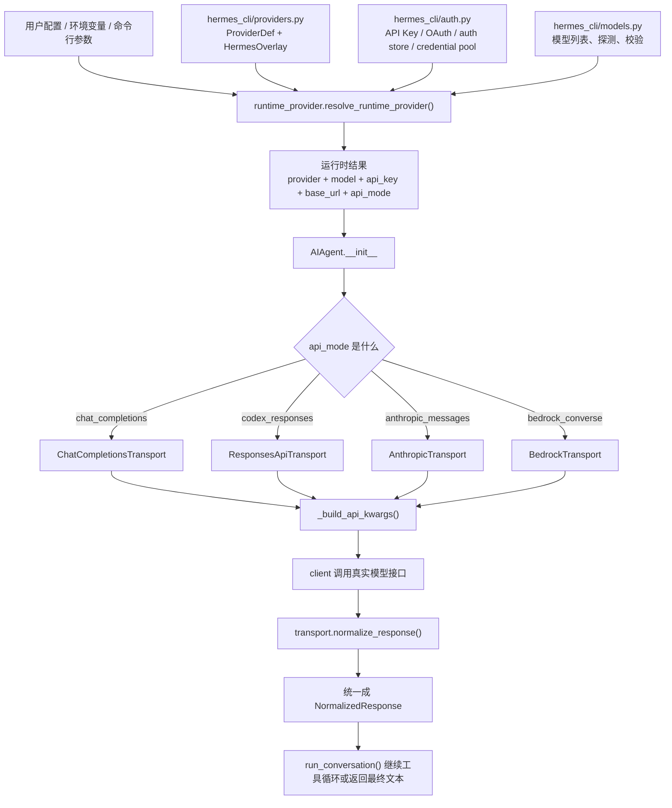

先抓住这张图。后面所有代码都可以放回这条线里。

---

## 3. 必须先分清 6 个概念

### 3.1 Model：模型名

Model 就是请求里的 `model` 字段，例如：

- `anthropic/claude-opus-4.6`
- `openai/gpt-5.3-codex`
- `JoyAI-Code`
- `Qwen3.5-397B-A17B`
- `Gemini 3-Pro-Preview`

模型名本身不一定能说明接口协议。比如名字里带 `GPT` 不代表一定走 OpenAI 的 Responses API；公司内部的 `GPT 5.2` 在 JD 文档里是 Chat API。

### 3.2 Provider：供应商身份

Provider 是 Hermes 对供应商的抽象，例如：

- `openrouter`
- `nous`
- `anthropic`
- `openai-codex`
- `xai`
- `bedrock`
- `custom`

它回答的问题是：

> 这个模型请求属于哪个供应商？

Provider 会影响：

- 默认 base_url
- 默认鉴权环境变量
- 默认 transport
- 是否是聚合商
- 模型列表来源
- 某些 provider 特有参数

### 3.3 Runtime Provider：运行时解析结果

Runtime Provider 不是一个类名，而是一组运行时字段：

```python
{
    "provider": "openrouter",
    "api_key": "...",
    "base_url": "https://openrouter.ai/api/v1",
    "api_mode": "chat_completions",
    "source": "env",
}
```

它回答的问题是：

> 这一轮程序实际用什么 key、什么地址、什么协议去调用模型？

### 3.4 API Mode：接口协议类型

Hermes 目前重点支持这些 `api_mode`：

| api_mode | 对应接口形态 | 典型路径 |
|---|---|---|
| `chat_completions` | OpenAI Chat Completions 兼容接口 | `/v1/chat/completions` |
| `codex_responses` | OpenAI Responses/Codex 风格接口 | `/v1/responses` 或 Codex backend |
| `anthropic_messages` | Anthropic Messages 风格接口 | `/v1/messages` |
| `bedrock_converse` | AWS Bedrock Converse | AWS SDK |

`api_mode` 是本章最关键的开关。它决定 `_build_api_kwargs()` 会调用哪个 Transport。

### 3.5 Transport：协议翻译层

Transport 负责 4 件事：

| 方法 | 作用 |
|---|---|
| `convert_messages()` | 把 Hermes 内部的 OpenAI 风格 `messages` 转成 provider 要的消息格式 |
| `convert_tools()` | 把 Hermes 内部 tool schema 转成 provider 要的工具格式 |
| `build_kwargs()` | 组装最终传给 SDK/client 的请求参数 |
| `normalize_response()` | 把 provider 原始响应转成 Hermes 统一结构 |

抽象接口在 [agent/transports/base.py](/Users/fenggongye1/Downloads/pythonProject/jdt-hermes-agent/agent/transports/base.py:16)。

### 3.6 Client：真实 HTTP/SDK 调用对象

Client 是最后真正发请求的对象。Transport 不负责创建 client，也不负责重试、流式、打断、凭证刷新。

Transport 只做“格式翻译”。这点很重要：

> 不要把鉴权、重试、主循环、工具执行逻辑塞进 Transport。Transport 应该专注请求/响应格式。

---

## 4. 启动阶段：Provider 和凭证如何解析

从用户角度看，你可能只配置了：

```yaml
model:
  provider: openrouter
  default: anthropic/claude-opus-4.6
```

或者：

```yaml
model:
  provider: custom
  default: JoyAI-Code
  base_url: http://ai-api.jdcloud.com/v1
  api_mode: chat_completions
```

但程序启动时要把它解析成能直接调用的运行时信息。

### 4.1 运行时解析时序图

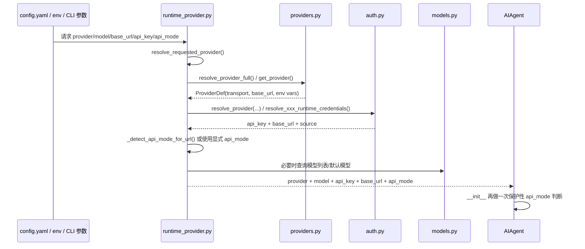

这里有一个容易误解的点：

> `runtime_provider.py` 会决定一次 `api_mode`，`AIAgent.__init__` 里还会再做一次兜底判断。

这不是重复劳动，而是防御式设计。因为 `AIAgent` 可能被 CLI、Gateway、TUI、batch runner、测试或其他代码直接实例化，不一定都经过同一个配置入口。

---

## 5. Provider 是怎么定义的

核心文件：[hermes_cli/providers.py](/Users/fenggongye1/Downloads/pythonProject/jdt-hermes-agent/hermes_cli/providers.py:1)

### 5.1 Provider 的来源

Provider 信息有 3 个来源：

| 来源 | 作用 |
|---|---|
| models.dev | 外部模型/Provider 注册信息 |
| Hermes overlays | Hermes 自己补充或覆盖的信息 |
| 用户配置 | `config.yaml` 中自定义 provider |

可以这样理解：

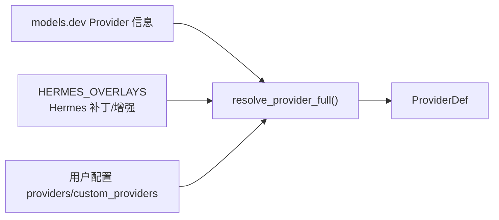

### 5.2 `HermesOverlay` 是什么

`HermesOverlay` 是 Hermes 对 provider 的“补丁层”。它可以补充：

| 字段 | 含义 |
|---|---|
| `transport` | 默认 transport，例如 `chat_completions`、`codex_responses`、`anthropic_messages` |
| `is_aggregator` | 是否是聚合商，例如 OpenRouter、Nous |
| `auth_type` | 鉴权类型，例如 `api_key`、`oauth`、`external_process` |
| `extra_env_vars` | 额外支持的环境变量 |
| `base_url_override` | Hermes 明确覆盖的默认 base_url |
| `base_url_env_var` | 可以覆盖 base_url 的环境变量名 |

例如内建 provider 会在 `HERMES_OVERLAYS` 里声明自己更适合走什么接口。

### 5.3 `ProviderDef` 是最终 Provider 定义

`ProviderDef` 是解析后的 Provider 结构，里面包括：

| 字段 | 含义 |
|---|---|
| `id` | provider ID |
| `name` | 展示名 |
| `transport` | 默认 transport |
| `api_key_env_vars` | 可能的 API key 环境变量 |
| `base_url` | 默认 base_url |
| `base_url_env_var` | base_url 覆盖环境变量 |
| `is_aggregator` | 是否聚合商 |
| `auth_type` | 鉴权类型 |
| `source` | 来源：models.dev、Hermes-only、user config |

### 5.4 `normalize_provider()` 解决别名问题

用户可能写：

- `openai`
- `openai-codex`
- `copilot`
- `github-copilot`
- `kimi`
- `kimi-coding`

Hermes 会通过 `normalize_provider()` 把别名统一成标准 provider ID。这样后续逻辑不用处理一堆别名。

### 5.5 `determine_api_mode()` 是 Provider 层的协议判断

[hermes_cli/providers.py](/Users/fenggongye1/Downloads/pythonProject/jdt-hermes-agent/hermes_cli/providers.py:1) 中的 `determine_api_mode(provider, base_url)` 会根据 provider 和 URL 判断协议：

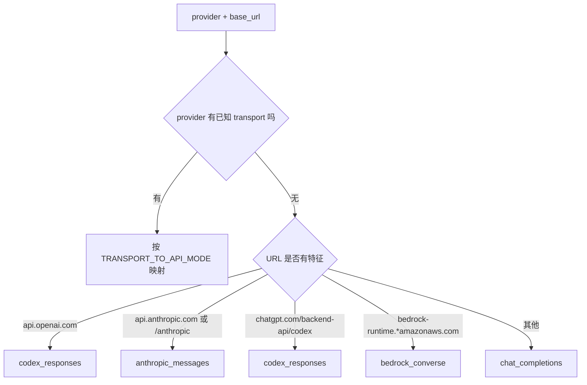

注意：

> 这是“根据 provider/URL 猜接口协议”，不是模型能力判断。模型能力还要看 `models.py`。

---

## 6. 运行时凭证是怎么解析的

核心文件：

- [hermes_cli/runtime_provider.py](/Users/fenggongye1/Downloads/pythonProject/jdt-hermes-agent/hermes_cli/runtime_provider.py:1)
- [hermes_cli/auth.py](/Users/fenggongye1/Downloads/pythonProject/jdt-hermes-agent/hermes_cli/auth.py:1)

### 6.1 `runtime_provider.py` 是总调度

`resolve_runtime_provider()` 的职责是：

> 把“用户想用哪个 provider/model”和“系统里有哪些 key/base_url/token”合并成最终运行时配置。

它会处理这些来源：

| 来源 | 例子 |
|---|---|
| 显式参数 | CLI 或代码直接传入 `provider/base_url/api_key/api_mode` |
| config.yaml | `model.provider`、`model.base_url`、`providers`、`custom_providers` |
| 环境变量 | `HERMES_INFERENCE_PROVIDER`、`OPENAI_API_KEY`、`OPENROUTER_API_KEY` 等 |
| auth store | OAuth 登录后保存的 token |
| credential pool | 多凭证池 |
| provider 默认配置 | 内建 provider 的默认 base_url、env var |

### 6.2 Provider 选择优先级

`resolve_requested_provider()` 的优先级大概是：

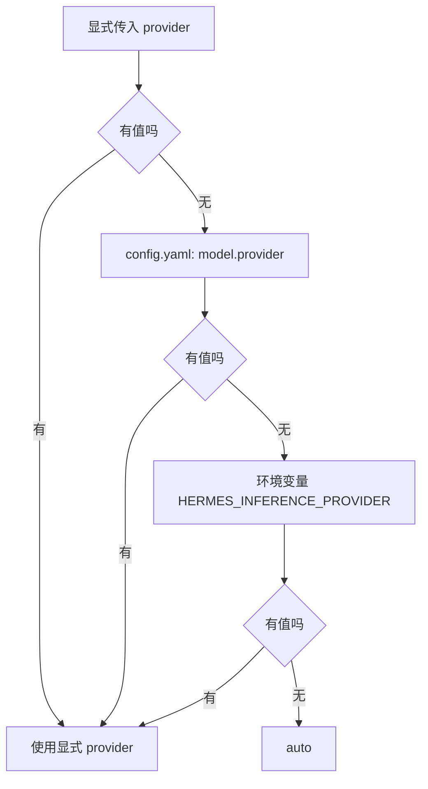

所以如果你二开要固定公司内部 provider，可以优先考虑配置层，而不是先写死代码。

### 6.3 自定义 Provider 解析

`runtime_provider.py` 里支持两类自定义 provider：

| 配置形式 | 适用场景 |
|---|---|
| `providers:` dict | 命名 provider，比如 `jd` |
| `custom_providers:` list | 多个自定义 provider 列表 |

自定义 provider 会解析：

- `name` / `id`
- `base_url`
- `api_key`
- `key_env`
- `model`
- `api_mode`

如果没有显式 `api_mode`，会尝试通过 URL 猜；猜不到默认 `chat_completions`。

### 6.4 `auth.py` 负责各种鉴权方式

`auth.py` 不是只读环境变量。它支持多种 provider 鉴权：

| 鉴权方式 | 例子 |
|---|---|
| API Key | OpenRouter、Anthropic、DeepSeek、JD 这类 Bearer Key |
| OAuth | Nous、Qwen OAuth、Gemini CLI |
| 外部进程 | 某些 provider 通过命令取 token |
| auth store | 登录后保存到 Hermes auth 文件 |
| credential pool | 多账号、多 key 轮换 |

对公司内部 JD 接口来说，文档里的鉴权是：

```text
Authorization: Bearer pk-****
```

这属于标准 API Key 场景，最接近 Hermes 的 API key provider 或 custom provider。

---

## 7. `api_mode` 是怎么决定的

`api_mode` 是整个链路的分叉点。决定错了，后面请求体、工具格式、响应解析都会错。

### 7.1 决策来源

`api_mode` 可能来自：

| 来源 | 优先级 | 说明 |
|---|---:|---|
| 显式传入 `api_mode` | 最高 | 用户明确知道 endpoint 支持什么 |
| config.yaml 中自定义 provider 的 `api_mode` | 高 | 自定义接口推荐写清楚 |
| Provider overlay 的 `transport` | 中 | 内建 provider 默认协议 |
| base_url 特征 | 中 | 通过 URL 判断 OpenAI、Anthropic、Bedrock 等 |
| 模型名规则 | 中低 | GPT-5/Codex 某些模型可能强制走 Responses |
| 默认值 | 最低 | `chat_completions` |

### 7.2 `AIAgent.__init__` 的兜底判断

[run_agent.py](/Users/fenggongye1/Downloads/pythonProject/jdt-hermes-agent/run_agent.py:842) 附近会设置 `self.api_mode`。

简化成决策树：

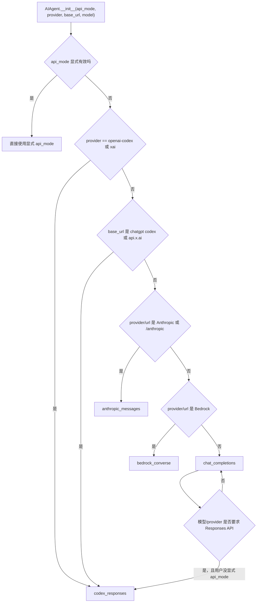

这里最关键的一句话：

> 如果你显式传入了 `api_mode`，Hermes 会尽量尊重它。公司内部接口接入时，建议先显式写清楚，不要让 Hermes 猜。

### 7.3 为什么同一个模型名不能直接决定协议

举例：

| 模型名 | 在不同 provider 下可能的协议 |
|---|---|
| `gpt-5-codex` | OpenAI 可能走 Responses；JD 文档里也叫 Responses，但请求体不一样 |
| `Claude-sonnet-4` | Anthropic 原生走 Messages；JD Chat 文档有透传示例 |
| `Gemini 3-Pro-Preview` | Google 原生可能是 Gemini contents；JD Responses 文档也是 contents/parts |

所以不能只看模型名。

正确判断顺序应该是：

1. 这个 endpoint 的真实接口文档是什么？
2. 请求体字段是什么？
3. 工具调用格式是什么？
4. 返回体字段是什么？
5. 再决定 `api_mode` 或新增 Transport。

---

## 8. Transport 是怎么工作的

Transport 的统一接口在 [agent/transports/base.py](/Users/fenggongye1/Downloads/pythonProject/jdt-hermes-agent/agent/transports/base.py:16)。

### 8.1 Transport 生命周期

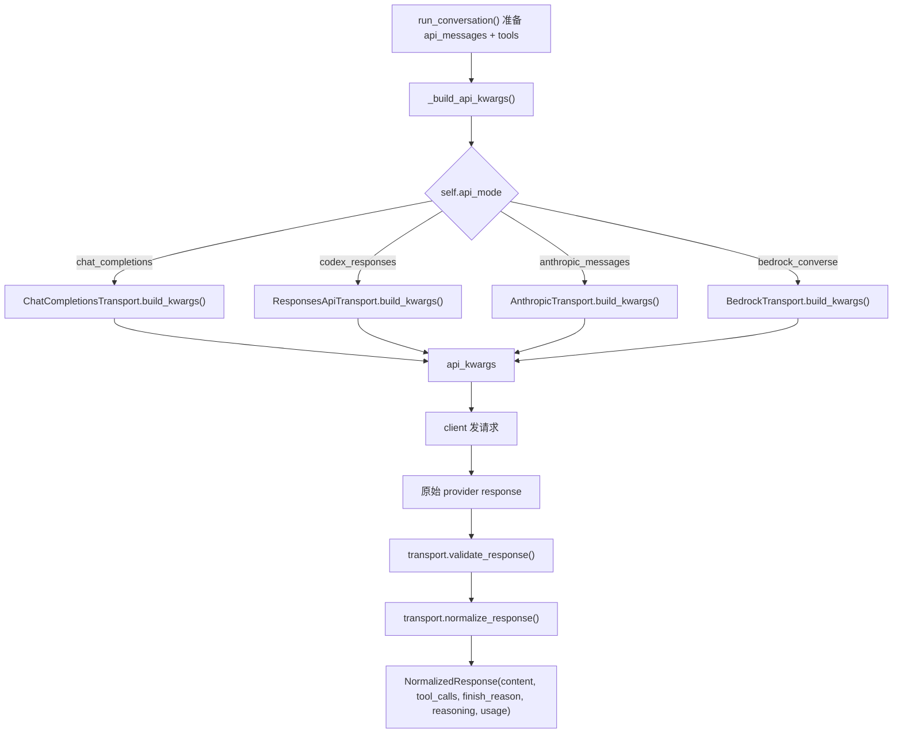

### 8.2 `NormalizedResponse` 的意义

不同 provider 返回体不同，但主循环不想每次都写一堆分支。因此 Transport 最终统一成：

| 字段 | 含义 |
|---|---|
| `content` | 模型文本回复 |
| `tool_calls` | 模型要求调用的工具 |
| `finish_reason` | 结束原因 |
| `reasoning` | 思考内容 |
| `usage` | token 用量 |
| `provider_data` | provider 特有数据，例如 Codex reasoning items |

主循环只关心统一后的字段：

- 有 `tool_calls`：执行工具，再把结果回填。
- 没有 `tool_calls`：把 `content` 当最终回复。
- `finish_reason == length`：可能触发续写或压缩等逻辑。

---

## 9. `chat_completions` 和 `codex_responses` 的区别

这是本章最容易踩坑的地方。

### 9.1 `chat_completions`

文件：[agent/transports/chat_completions.py](/Users/fenggongye1/Downloads/pythonProject/jdt-hermes-agent/agent/transports/chat_completions.py:1)

适合 OpenAI Chat Completions 兼容接口：

```http
POST /v1/chat/completions
```

典型请求体：

```json
{
  "model": "JoyAI-Code",
  "messages": [
    {"role": "system", "content": "..."},
    {"role": "user", "content": "..."}
  ],
  "tools": [
    {
      "type": "function",
      "function": {
        "name": "read_file",
        "description": "...",
        "parameters": {}
      }
    }
  ],
  "stream": false
}
```

典型返回体：

```json
{
  "choices": [
    {
      "message": {
        "role": "assistant",
        "content": "...",
        "tool_calls": []
      },
      "finish_reason": "stop"
    }
  ],
  "usage": {}
}
```

`ChatCompletionsTransport` 的特点：

- `messages` 基本不转换。
- `tools` 基本不转换。
- 复杂点在 provider 特有参数，比如 reasoning、temperature、max_tokens、OpenRouter extra_body。
- 会清理 Codex Responses 遗留字段，避免 strict provider 报 400。

### 9.2 `codex_responses`

文件：[agent/transports/codex.py](/Users/fenggongye1/Downloads/pythonProject/jdt-hermes-agent/agent/transports/codex.py:1)

适合 OpenAI Responses/Codex 风格接口：

```http
POST /v1/responses
```

典型请求体不是 `messages`，而是：

```json
{
  "model": "gpt-5.3-codex",
  "instructions": "...",
  "input": [
    {"role": "user", "content": "..."}
  ],
  "tools": [],
  "tool_choice": "auto",
  "parallel_tool_calls": true,
  "store": false
}
```

`ResponsesApiTransport` 的特点：

- 把 OpenAI Chat 风格 `messages` 转成 Responses API 的 `input`。
- 把工具 schema 转成 Responses API function tools。
- 处理 `instructions`、`reasoning`、`include`、`prompt_cache_key`。
- 响应不是 `choices[0].message`，而是从 `response.output` 里抽取文本、工具调用和 reasoning items。

### 9.3 两者对比表

| 对比项 | `chat_completions` | `codex_responses` |
|---|---|---|
| 典型接口 | `/v1/chat/completions` | `/v1/responses` |
| 请求消息字段 | `messages` | `input` + `instructions` |
| 工具字段 | OpenAI Chat `tools` | Responses function tools |
| 返回文本位置 | `choices[0].message.content` | `response.output` 中提取 |
| 工具调用位置 | `choices[0].message.tool_calls` | `response.output` 中 function_call |
| Hermes 适配文件 | `chat_completions.py` | `codex.py` |
| 适合 JD Chat API 吗 | 大概率适合 | 不适合 |
| 适合 JD Responses API 吗 | 不适合 | 也不能直接适合 |

---

## 10. 为什么 Hermes 的 `codex_responses` 不能直接接 JD Responses API

JD 文档里也有一个叫 Responses API 的接口：

```text
http://ai-api.jdcloud.com/v1/responses
```

但它和 Hermes 的 `codex_responses` 不是一回事。

### 10.1 JD Responses API 的请求体更像 Gemini

JD 文档示例：

```json
{
  "model": "Gemini 3-Pro-Preview",
  "contents": [
    {
      "role": "user",
      "parts": [
        {"text": "What is the weather in Beijing?"}
      ]
    }
  ]
}
```

它的字段是：

- `contents`
- `parts`
- `generation_config`
- `safety_settings`
- `system_instruction`

而 Hermes 的 `codex_responses` 会构造：

- `instructions`
- `input`
- `tools`
- `tool_choice`
- `parallel_tool_calls`
- `store`
- `reasoning`
- `include`

字段名和结构完全不同。

### 10.2 JD Responses API 的响应体也不是 OpenAI Responses

JD 文档返回字段包括：

- `candidates`
- `candidates.content.parts.inlinedata`
- `usageMetadata`
- `modelVersion`
- `createTime`
- `responseId`

OpenAI Responses/Codex 风格则依赖：

- `response.output`
- output item 中的 text/function_call/reasoning
- `response.status`
- `incomplete_details`

所以 `ResponsesApiTransport.validate_response()` 会期待 `response.output` 是非空列表；JD 响应没有这个结构，直接用会解析失败。

### 10.3 名字相同不代表协议相同

这句话非常重要：

> “Responses API” 只是接口名字，不是统一标准。

Hermes 的 `codex_responses` 是 OpenAI Responses/Codex 协议适配器。JD 的 Responses API 从文档看更接近 Gemini `contents/parts` 协议。两者不能直接混用。

### 10.4 JD 接入判断

根据当前 JD 文档，可以先这样判断：

| JD 接口 | 文档路径 | 推荐接入方式 |
|---|---|---|
| JD Chat API `/v1/chat/completions` | Chat API | 优先按 `chat_completions` 接入 |
| JD Responses API `/v1/responses` | Responses API | 不能直接用 `codex_responses`，需要新增 JD/Gemini 风格 Transport |

如果你的首要目标是“先让 Hermes 调通公司内部大模型并支持工具调用”，建议优先接 JD Chat API，因为它最接近 Hermes 现有 `chat_completions`。

---

## 11. 模型列表、模型探测、模型校验怎么做

核心文件：[hermes_cli/models.py](/Users/fenggongye1/Downloads/pythonProject/jdt-hermes-agent/hermes_cli/models.py:1)

这份文件很长，但主线不复杂。

### 11.1 模型列表来源

模型列表可能来自：

| 来源 | 代表函数/变量 | 说明 |
|---|---|---|
| 静态兜底列表 | `_PROVIDER_MODELS` | 网络不可用时还可以展示/校验 |
| OpenRouter 在线目录 | `fetch_openrouter_models()` | 拉 `/models` 并筛选工具支持等 |
| AI Gateway 在线目录 | `fetch_ai_gateway_models()` | 拉 Vercel AI Gateway 模型 |
| Anthropic 在线目录 | `_fetch_anthropic_models()` | 拉 Anthropic `/v1/models` |
| 通用 OpenAI 兼容 `/models` | `fetch_api_models()` | 适合 custom provider |
| GitHub Copilot 目录 | `fetch_github_model_catalog()` | 还会判断 supported endpoints |
| OpenAI Codex 目录 | `get_codex_model_ids()` | 专用目录，不走普通 `/models` |
| Ollama Cloud | `fetch_ollama_cloud_models()` | live API + models.dev + 磁盘缓存 |

### 11.2 模型选择链路

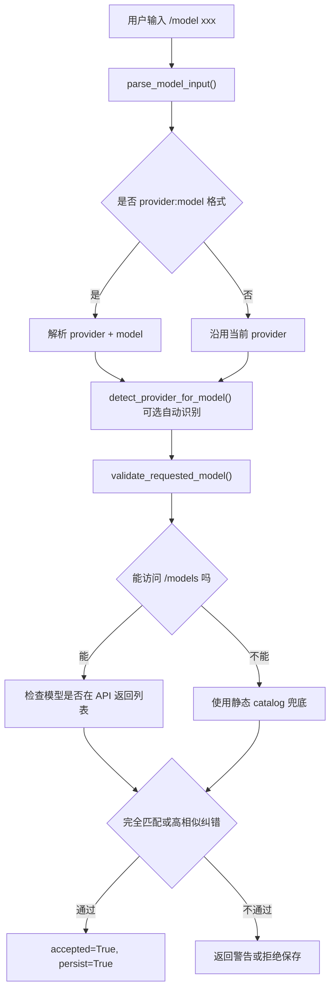

### 11.3 `parse_model_input()` 解决 `provider:model`

用户可以输入：

```text
openrouter:anthropic/claude-sonnet-4.6
nous:moonshotai/kimi-k2.6
custom:local:qwen
gpt-5.4
```

`parse_model_input(raw, current_provider)` 会判断冒号左边是不是已知 provider。是的话切 provider；不是的话把整个字符串当模型名。

### 11.4 `provider_model_ids()` 是模型列表总入口

`provider_model_ids(provider)` 的逻辑是：

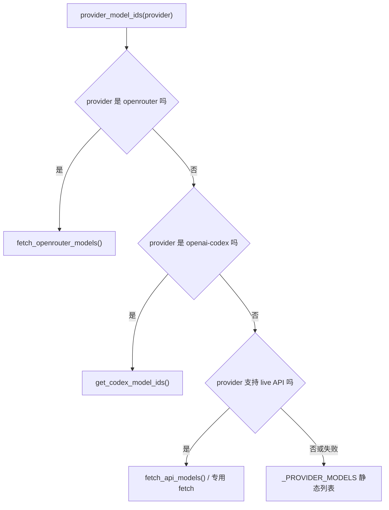

### 11.5 `probe_api_models()` 会自动试 `/models`

对 OpenAI 兼容 provider，`probe_api_models(api_key, base_url)` 会探测：

- 如果 base_url 已经以 `/v1` 结尾，就试 `base_url + /models`。
- 如果 base_url 没有 `/v1`，会尝试补 `/v1`。
- 如果第一次失败，会试候选地址。

这对公司内部 JD Chat API 很有帮助，但前提是 JD endpoint 暴露兼容的 `/models`。如果没有，Hermes 会退回静态列表或警告。

### 11.6 `validate_requested_model()` 的返回值

`validate_requested_model()` 返回一个 dict：

| 字段 | 含义 |
|---|---|
| `accepted` | 当前是否允许切换到这个模型 |
| `persist` | 是否安全保存到配置 |
| `recognized` | 是否在已知目录/API 中识别 |
| `corrected_model` | 如果发现高相似模型名，会自动纠正 |
| `message` | 给用户的提示或警告 |

常见结果：

- 模型存在：`accepted=True, persist=True`
- 模型拼写很接近：自动纠正。
- `/models` 不可达：可能接受但提示“无法验证”。
- API 明确返回列表且模型不在里面：拒绝或提示相似模型。

### 11.7 模型校验和二开有什么关系

如果你新增 `jd` provider，但不加 JD 模型列表，用户执行 `/model JoyAI-Code` 时可能会遇到：

- 模型列表里没有 JD 模型。
- `/models` 不支持导致无法验证。
- 模型名带空格、大小写敏感导致匹配失败。

所以接公司模型时，不只是改请求地址，还要考虑：

- JD 模型是否加入 `_PROVIDER_MODELS`。
- 是否实现 `provider_model_ids("jd")` 的 live fetch。
- 是否允许在 `/models` 不可达时保存模型。
- 是否需要对模型名做大小写或空格规范化。

---

## 12. 单次模型请求完整时序图

这张图把第 2 步主循环和本章的 Provider/Transport 串起来。

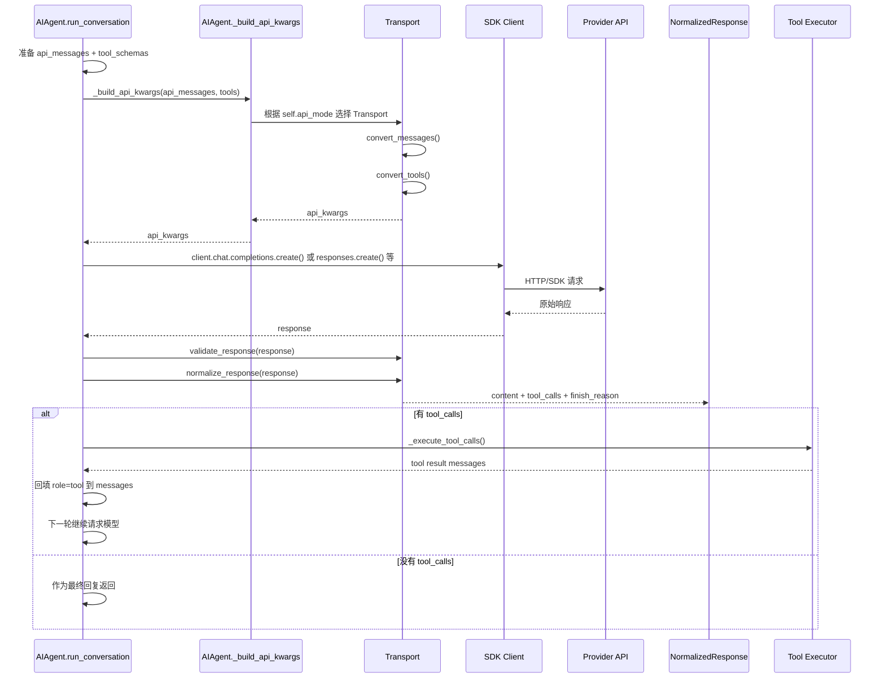

看源码时，你要牢记：

> Transport 只负责一次 API 请求的格式适配；是否继续工具循环由 `run_conversation()` 决定。

---

## 13. 三种公司内部模型接入方式

接公司内部模型时，先不要急着新增代码。先判断属于哪种接入方式。

### 13.1 方式一：配置级接入

适用条件：

- 公司接口兼容 OpenAI Chat Completions。
- 请求体接受 `model/messages/tools/max_tokens/stream`。
- 返回体是 `choices[0].message.content/tool_calls`。
- 鉴权是标准 `Authorization: Bearer xxx`。

这种情况可以先用 `custom` provider：

```yaml
model:
  provider: custom
  default: JoyAI-Code
  base_url: http://ai-api.jdcloud.com/v1
  api_mode: chat_completions
```

再通过环境变量提供 key，例如：

```bash
export CUSTOM_API_KEY="pk-xxxx"
```

注意：Hermes 的 custom key 解析还会尝试 `OPENAI_API_KEY`、`OPENROUTER_API_KEY` 等。为了避免误用外部 key，二开时更推荐给 JD 单独定义 provider 和环境变量。

### 13.2 方式二：内建 Provider 接入

适用条件：

- 公司接口基本兼容现有 Transport。
- 但你希望它有独立 provider 名称、独立模型列表、独立 env var。
- 希望 CLI `/model`、setup、gateway 都能自然识别 `jd`。

建议新增：

| 文件 | 改造内容 |
|---|---|
| `hermes_cli/providers.py` | 增加 `jd` provider overlay，默认 `transport="chat_completions"`，base_url 指向 JD |
| `hermes_cli/auth.py` | 增加 `JD_API_KEY`、`JD_BASE_URL` 等凭证解析 |
| `hermes_cli/runtime_provider.py` | 如果通用 API key provider 不够用，增加 JD runtime 分支 |
| `hermes_cli/models.py` | 增加 JD 模型列表、必要时加 live `/models` 探测 |
| `hermes_cli/config.py` | 把 `JD_API_KEY` 加入 setup 可配置环境变量 |
| `agent/model_metadata.py` | 可选：补 JD 模型上下文长度，避免 token 估算不准 |

这种方式适合 JD Chat API。

### 13.3 方式三：新增 Transport

适用条件：

- 请求体不是 OpenAI Chat 格式。
- 工具格式不同。
- 响应体不是 `choices[0].message`。
- 现有 `chat_completions/codex_responses/anthropic_messages/bedrock_converse` 都不能准确表达。

JD Responses API 就属于这种情况。

建议新增类似：

```text
agent/transports/jd_responses.py
api_mode = "jd_responses"
```

需要实现：

| 方法 | JD Responses 里要做什么 |
|---|---|
| `convert_messages()` | 把 Hermes `messages` 转成 JD `contents/parts` 和 `system_instruction` |
| `convert_tools()` | 如果 JD Responses 支持工具调用，要按 JD 文档转换工具 schema |
| `build_kwargs()` | 构造 `model/contents/generation_config/safety_settings/stream` |
| `normalize_response()` | 从 `candidates.content.parts` 中提取文本、工具调用、图片等 |
| `validate_response()` | 校验 `candidates` 或 JD 响应结构 |

还要在 [agent/transports/__init__.py](/Users/fenggongye1/Downloads/pythonProject/jdt-hermes-agent/agent/transports/__init__.py:1) 的自动发现里 import 它，或者保持同样注册模式。

---

## 14. JD 接入的推荐路线

结合当前 JD 文档，推荐分两阶段。

### 14.1 第一阶段：先接 JD Chat API

目标：让 Hermes 能用公司内部模型完成文本对话和工具调用。

推荐原因：

- JD Chat API 是 `/v1/chat/completions`。
- 请求体是 `model/messages/max_tokens/stream`。
- 返回体是 `choices/message/finish_reason/usage`。
- 这和 Hermes `chat_completions` 最接近。

第一组改造文件：

| 优先级 | 文件 | 原因 |
|---:|---|---|
| 1 | `hermes_cli/providers.py` | 定义 `jd` provider，声明默认 transport |
| 2 | `hermes_cli/auth.py` | 让 `JD_API_KEY`、`JD_BASE_URL` 能被识别 |
| 3 | `hermes_cli/runtime_provider.py` | 确保 `provider=jd` 解析出正确 `api_key/base_url/api_mode` |
| 4 | `hermes_cli/models.py` | 加 JD 模型列表和模型校验逻辑 |
| 5 | `hermes_cli/config.py` | 让 setup/配置知道 JD 环境变量 |
| 6 | `agent/model_metadata.py` | 补上下文长度，减少压缩和 token 估算误判 |

如果第一阶段不想改代码，也可以临时用 custom provider 验证：

```yaml
model:
  provider: custom
  default: JoyAI-Code
  base_url: http://ai-api.jdcloud.com/v1
  api_mode: chat_completions
```

这个配置级验证的意义是：

> 先确认 JD Chat API 是否真能兼容 Hermes 的工具调用格式，再决定是否写内建 provider。

### 14.2 第二阶段：再接 JD Responses API

目标：支持 JD 文档里走 Responses API 的模型，比如 Gemini 系列、部分 Codex/GPT 模型。

这一步不要复用 `codex_responses`。应该新增 JD 专用 Transport，原因前面已经解释：请求体和响应体不同。

第二阶段改造文件：

| 优先级 | 文件 | 原因 |
|---:|---|---|
| 1 | `agent/transports/jd_responses.py` | 新增 JD Responses 协议适配 |
| 2 | `agent/transports/__init__.py` | 注册/发现新的 transport |
| 3 | `hermes_cli/providers.py` | 让 JD provider 或 JD Responses provider 映射到 `jd_responses` |
| 4 | `run_agent.py` | 允许新的 `api_mode`，并在 `_build_api_kwargs()`/响应归一化处接入 |
| 5 | `hermes_cli/runtime_provider.py` | 允许并解析 `api_mode="jd_responses"` |
| 6 | `hermes_cli/models.py` | 按模型决定 Chat API 还是 JD Responses API |

注意这里会碰到一个设计问题：

> 同一个 `jd` provider 下，有些模型走 Chat API，有些模型走 JD Responses API。

这意味着 `api_mode` 不能只由 provider 决定，还可能要由模型决定。可以选择：

- 拆成两个 provider：`jd-chat` 和 `jd-responses`。
- 保留一个 `jd` provider，但在 `models.py` 或 runtime 层按模型名决定 api_mode。

我更建议初期拆成两个 provider，心智负担更低，也更容易排查问题。

---

## 15. 状态图：一次模型调用在哪些状态之间流转

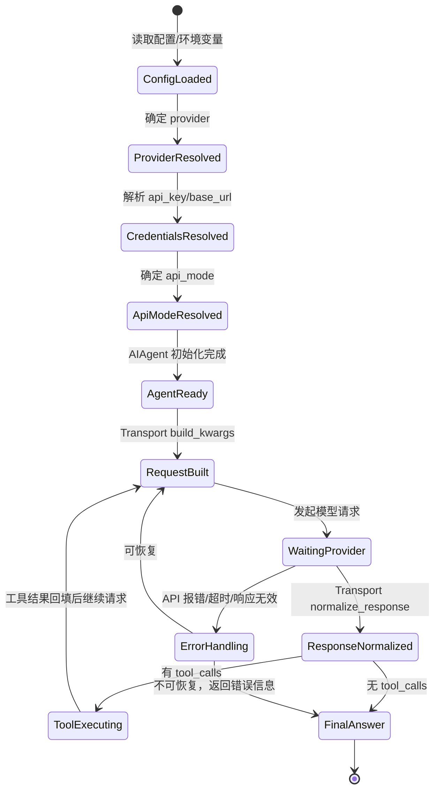

这张状态图告诉你：

- Provider 和凭证只是在前置阶段解析。
- Transport 参与每一次模型请求。
- 工具调用会让状态回到 `RequestBuilt`，重新发模型。
- 错误处理可能会触发 fallback、压缩、重试，但不应该改变历史消息语义。

---

## 16. 阅读源码的推荐顺序

不要按文件名从上到下硬啃。建议这样读：

### 16.1 第一遍：只读概念和入口

1. [hermes_cli/providers.py](/Users/fenggongye1/Downloads/pythonProject/jdt-hermes-agent/hermes_cli/providers.py:1)：看 `HermesOverlay`、`ProviderDef`、`get_provider()`、`determine_api_mode()`。
2. [hermes_cli/runtime_provider.py](/Users/fenggongye1/Downloads/pythonProject/jdt-hermes-agent/hermes_cli/runtime_provider.py:1)：看 `resolve_runtime_provider()` 返回什么。
3. [run_agent.py](/Users/fenggongye1/Downloads/pythonProject/jdt-hermes-agent/run_agent.py:842)：看 `AIAgent.__init__` 怎么设置 `self.api_mode`。

这一遍只回答：

- provider 从哪来？
- base_url/api_key 从哪来？
- api_mode 从哪来？

### 16.2 第二遍：读 Transport

1. [agent/transports/base.py](/Users/fenggongye1/Downloads/pythonProject/jdt-hermes-agent/agent/transports/base.py:16)：看抽象方法。
2. [agent/transports/chat_completions.py](/Users/fenggongye1/Downloads/pythonProject/jdt-hermes-agent/agent/transports/chat_completions.py:20)：看 Chat API 怎么构造请求。
3. [agent/transports/codex.py](/Users/fenggongye1/Downloads/pythonProject/jdt-hermes-agent/agent/transports/codex.py:14)：看 Responses API 怎么构造请求。
4. [run_agent.py](/Users/fenggongye1/Downloads/pythonProject/jdt-hermes-agent/run_agent.py:6708)：看 `_build_api_kwargs()` 如何按 api_mode 分发。

这一遍只回答：

- 同一份 `messages` 怎么变成不同 provider 的请求体？
- 原始响应怎么统一成 `NormalizedResponse`？

### 16.3 第三遍：读模型列表和校验

1. [hermes_cli/models.py](/Users/fenggongye1/Downloads/pythonProject/jdt-hermes-agent/hermes_cli/models.py:108)：看 `_PROVIDER_MODELS`。
2. [hermes_cli/models.py](/Users/fenggongye1/Downloads/pythonProject/jdt-hermes-agent/hermes_cli/models.py:1278)：看 `parse_model_input()`。
3. [hermes_cli/models.py](/Users/fenggongye1/Downloads/pythonProject/jdt-hermes-agent/hermes_cli/models.py:1590)：看 `provider_model_ids()`。
4. [hermes_cli/models.py](/Users/fenggongye1/Downloads/pythonProject/jdt-hermes-agent/hermes_cli/models.py:2065)：看 `probe_api_models()`。
5. [hermes_cli/models.py](/Users/fenggongye1/Downloads/pythonProject/jdt-hermes-agent/hermes_cli/models.py:2292)：看 `validate_requested_model()`。

这一遍只回答：

- `/model xxx` 怎么解析？
- 模型列表从哪里来？
- 模型不存在时是拒绝、纠正，还是警告后接受？

### 16.4 第四遍：带着 JD 文档对照

对照 JD Chat API：

- Hermes `messages` 是否能直接传？
- JD 是否支持 OpenAI `tools` 格式？
- JD `finish_reason` 是否兼容？
- JD 流式响应是否兼容 Hermes 现有流式解析？

对照 JD Responses API：

- `contents/parts` 怎么从 `messages` 转换？
- `system_instruction` 怎么从 system prompt 转换？
- `generation_config` 应该从 Hermes 哪些参数映射？
- `candidates.content.parts` 怎么归一化成 `content/tool_calls`？

---

## 17. 你读完本章后必须能回答的问题

### 17.1 provider 是怎么定义的

答案要点：

- 内建 provider 主要在 `providers.py` 通过 models.dev + `HERMES_OVERLAYS` 合成。
- 用户自定义 provider 可来自 config。
- 最终统一成 `ProviderDef`。
- provider 会影响默认 transport、base_url、env var、auth_type。

### 17.2 运行时凭证是怎么解析的

答案要点：

- `runtime_provider.py` 是运行时解析总入口。
- 它综合显式参数、配置、环境变量、auth store、credential pool。
- `auth.py` 负责 API key、OAuth、外部进程凭证等具体鉴权。
- 最后得到 `api_key/base_url/api_mode/provider/source`。

### 17.3 `api_mode` 是怎么决定的

答案要点：

- 显式 `api_mode` 优先。
- 其次看 provider 默认 transport。
- 再看 base_url 特征。
- 某些模型/provider 会强制 Responses。
- 默认是 `chat_completions`。
- `AIAgent.__init__` 里还有兜底判断。

### 17.4 `chat_completions` 和 `codex_responses` 的区别是什么

答案要点：

- `chat_completions` 使用 `messages` 和 `choices[0].message`。
- `codex_responses` 使用 `instructions/input` 和 `response.output`。
- 两者工具格式和 reasoning 字段也不同。
- 不能因为接口路径都叫 `/responses` 就混用。

### 17.5 模型列表、模型探测、模型校验怎么做

答案要点：

- 静态兜底列表在 `_PROVIDER_MODELS`。
- 在线探测主要走 provider 专用接口或通用 `/models`。
- `provider_model_ids()` 是 provider 模型列表入口。
- `validate_requested_model()` 决定是否接受、保存、纠错、提示。

### 17.6 为什么 Hermes 的 `codex_responses` 不能直接接 JD Responses API

答案要点：

- Hermes `codex_responses` 是 OpenAI Responses/Codex 协议。
- JD Responses 文档是 `contents/parts/system_instruction/generation_config` 风格。
- JD 返回 `candidates/usageMetadata/modelVersion`，不是 `response.output`。
- 因此需要新增 JD/Gemini 风格 Transport。

---

## 18. 最小二开路线图

如果我们按“风险最低、最快验证”的路线推进，可以这样做：

1. 先用 `custom + chat_completions` 配置验证 JD Chat API 能否被 Hermes 调通。
2. 如果能调通，再新增内建 `jd-chat` provider。
3. 给 `jd-chat` 增加独立环境变量：`JD_API_KEY`、`JD_BASE_URL`。
4. 把 JD Chat API 支持工具调用的模型加入 `models.py`。
5. 跑一个最小工具调用测试：让模型调用 `read_file` 或 `search_files`。
6. 确认主对话、工具调用、上下文压缩、辅助模型是否都不再走外部 provider。
7. 之后再设计 `jd-responses` Transport，支持 JD Responses API 模型。

最终你应该能给出这样的判断：

| 公司接口形态 | 应该怎么接 |
|---|---|
| 完全 OpenAI Chat 兼容 | 配置级接入即可，后续可内建 provider |
| OpenAI Chat 基本兼容，但需要独立模型/鉴权/参数 | 内建 provider + 复用 `chat_completions` |
| 请求/响应结构不是现有协议 | 新增 Transport |
| 同一个 provider 下模型分属不同协议 | 拆 provider，或按模型动态选择 api_mode |

---

## 19. 本章一句话总结

Hermes 的模型调用链不是“一个地方改 URL”这么简单，而是：

```text
模型名
  -> Provider 定义
  -> 运行时凭证解析
  -> api_mode 决策
  -> Transport 请求/响应转换
  -> AIAgent 主循环继续工具调用或返回最终答案
```

接公司内部大模型时，先判断接口是否兼容现有 Transport。JD Chat API 优先按 `chat_completions` 接；JD Responses API 不能直接用 Hermes 的 `codex_responses`，需要新增 JD/Gemini 风格 Transport。
