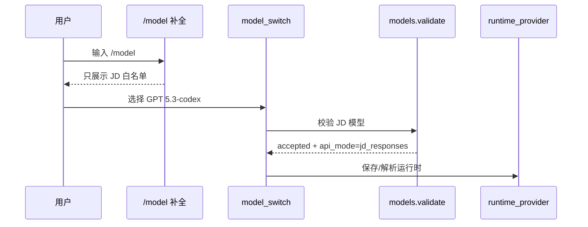

# JD 公司大模型全量改造代码走查手册

本文目标：帮助你一步一步走查这次 JD 公司大模型改造的所有关键代码，确认改动点是否正确、是否有遗漏、是否会绕回外部模型。

读法建议：不要一开始就看完整 diff。先按本文的“主链路”看，再看“支线链路”，最后用测试和人工验收兜底。

## 0. 先建立全局判断

这次改造不是“换一个 API Key”，而是把 Hermes 的模型入口全部收口到 JD：


走查时始终抓住 5 条红线：

| 红线 | 说明 |
|---|---|
| 只允许 JD provider | 默认企业模式下，外部 provider 不能展示、不能切换、不能运行 |
| 不允许静默 fallback 外部模型 | 主模型失败后不能偷偷走 OpenRouter、Anthropic、OpenAI |
| JD 模型按模型名分流 | `GLM-5` 走 Chat API，`GPT 5.3-codex` / Gemini Responses 模型走 Responses API |
| 工具调用必须稳定 | JD Chat 和 JD Responses 带 tools 时优先非流式，避免工具参数分片 |
| Gemini 工具历史不能丢签名 | `thoughtSignature` 必须保存并回放，否则第二轮工具调用会 400 |

## 1. 准备走查环境

先确认当前改动范围：

```bash
cd /Users/fenggongye1/Downloads/pythonProject/jdt-hermes-agent
git status --short
git diff --stat
```

建议先跑一组最小测试，确认你看的代码处于可运行状态：

```bash
source venv/bin/activate
scripts/run_tests.sh tests/hermes_cli/test_enterprise_jd_provider.py tests/agent/transports/test_jd_responses_transport.py -q
```

如果这组都不过，先不要继续走查 UI 和支线，应该先修核心策略或 transport。

## 2. 走查范围分层

这次改动文件很多，建议分三层看。

| 层级 | 文件 | 走查目的 |
|---|---|---|
| 必须逐行看 | `hermes_cli/enterprise.py` | JD 企业模式总策略 |
| 必须逐行看 | `agent/transports/jd_responses.py` | JD Responses 请求/响应转换 |
| 必须重点看 | `run_agent.py` | AIAgent 运行时、主循环、JD 分支 |
| 必须重点看 | `hermes_cli/runtime_provider.py` | provider + api_mode 最终解析 |
| 必须重点看 | `hermes_cli/model_switch.py` | `/model` 切换链路 |
| 必须重点看 | `hermes_cli/models.py`、`hermes_cli/commands.py` | `/model` 展示、补全、模型校验 |
| 支线抽查 | `agent/auxiliary_client.py` | 辅助模型是否也收口到 JD |
| 支线抽查 | `tools/delegate_tool.py` | 子代理是否也收口到 JD |
| 支线抽查 | `agent/transports/chat_completions.py` | JD Chat tools 参数 |
| 支线抽查 | `agent/usage_pricing.py` | JD Responses token 统计 |
| 支线抽查 | `hermes_cli/auth.py`、`hermes_cli/providers.py`、`hermes_cli/config.py` | JD 配置、鉴权、默认值 |
| 测试验证 | `tests/hermes_cli/test_enterprise_jd_provider.py` | 企业锁定和模型切换测试 |
| 测试验证 | `tests/agent/transports/test_jd_responses_transport.py` | JD Responses transport 测试 |
| 测试验证 | `tests/run_agent/test_run_agent.py` | AIAgent JD 分支测试 |

注意：`ui-tui/package-lock.json` 也有改动，但它不是 JD 模型链路核心代码。走查时只需要确认它是否是启动/安装 TUI 依赖导致的预期变更。

## 3. 第一步：看企业策略总入口

先看：

```bash
sed -n '1,320p' hermes_cli/enterprise.py
```

重点看这些内容：

| 代码点 | 你要确认什么 |
|---|---|
| `JD_CHAT_PROVIDER` | 对外唯一 provider 是 `jd-chat` |
| `JD_CHAT_ALIASES` | `jd`、`jd-api` 都归一成 `jd-chat` |
| `JD_CHAT_BASE_URL` | 默认地址是 `http://ai-api.jdcloud.com/v1` |
| `JD_CHAT_API_MODE` | Chat API 内部模式是 `chat_completions` |
| `JD_RESPONSES_API_MODE` | Responses API 内部模式是 `jd_responses` |
| `JD_CHAT_TOOL_MODELS` | 只包含支持工具调用的 JD Chat API 模型 |
| `JD_RESPONSES_MODELS` | 只包含第一版允许的 JD Responses 模型 |
| `enterprise_external_providers_allowed()` | 默认不允许外部 provider，只在开发后门开启时允许 |
| `normalize_jd_base_url()` | 用户不写 `/v1` 时会自动补上 |
| `provider_blocked_message()` | 外部 provider 报中文错误 |
| `jd_model_api_mode()` | Responses 白名单模型走 `jd_responses`，其他 JD 模型走 `chat_completions` |
| `validate_jd_model()` | 主模型允许 Chat + Responses 两类 JD 模型 |
| `validate_jd_chat_model()` | 辅助模型只允许 JD Chat 模型 |

这一段走查完成后，你应该能回答：

1. 用户输入 `jd` 会不会变成 `jd-chat`。
2. 用户输入 `GPT 5.3-codex` 会不会走 `jd_responses`。
3. 用户配置 `openrouter` 会不会被企业模式拦截。
4. 用户配置 `http://ai-api.jdcloud.com` 会不会自动补 `/v1`。

容易出错的信号：

| 信号 | 可能问题 |
|---|---|
| `JD_RESPONSES_MODELS` 里的模型没有被 `JD_ALL_MODELS` 包含 | `/model` 可能看不到 Responses 模型 |
| `enterprise_external_providers_allowed()` 默认返回 True | 企业锁定失效 |
| `jd_model_api_mode()` 优先看配置而不是模型名 | 旧配置可能导致 Responses 模型误走 Chat API |

## 4. 第二步：看默认配置和 provider 元数据

依次看：

```bash
rg -n "jd-chat|JD_API_KEY|JD_BASE_URL|allow_external_providers|api_mode" hermes_cli/config.py hermes_cli/providers.py hermes_cli/auth.py
```

重点文件：

| 文件 | 重点 |
|---|---|
| `hermes_cli/config.py` | 默认 `model.provider=jd-chat`、`model.default=GLM-5`、`enterprise.allow_external_providers=false` |
| `hermes_cli/providers.py` | provider catalog 里有 `jd-chat`，别名 `jd` / `jd-api` 正确 |
| `hermes_cli/auth.py` | JD 读取 `JD_API_KEY`、`JD_BASE_URL`，不回退读外部 key |

你要确认：

| 检查项 | 正确结果 |
|---|---|
| 新用户默认模型 | `GLM-5` |
| 新用户默认 provider | `jd-chat` |
| 企业开关默认值 | `false` |
| JD API Key 环境变量 | `JD_API_KEY` |
| JD Base URL 环境变量 | `JD_BASE_URL` |
| JD base_url 规范化 | 不带 `/v1` 会补 `/v1` |

特别注意：JD provider 不应该读取 `OPENAI_API_KEY`、`OPENROUTER_API_KEY` 作为兜底。否则用户以为走公司模型，实际可能使用了外部凭证。

## 5. 第三步：看 `/model` 展示和切换

这一层决定用户能不能看到外部模型、能不能切到外部模型。

建议顺序：

```bash
rg -n "enterprise|JD_ALL_MODELS|validate_requested_model|curated_models_for_provider|_model_completions|switch_model" hermes_cli/commands.py hermes_cli/models.py hermes_cli/model_switch.py
```

### 5.1 看命令补全

文件：

```bash
sed -n '1150,1195p' hermes_cli/commands.py
```

重点确认：

| 检查项 | 正确结果 |
|---|---|
| 企业模式下 `/model` 补全 | 只遍历 `JD_ALL_MODELS` |
| 外部模型补全 | 企业模式下不会继续往下走旧补全逻辑 |
| Responses 模型提示 | 显示 `JD Responses API · 支持工具调用` |
| Chat 模型提示 | 显示 `JD Chat API · 支持工具调用` |

这就是修复“CLI 输入 `/model` 还显示 claude、deepseek、gemini”的关键点。

### 5.2 看模型目录和校验

文件：

```bash
rg -n "CANONICAL_PROVIDERS|list_providers|curated_models_for_provider|validate_requested_model" hermes_cli/models.py
```

重点确认：

| 检查项 | 正确结果 |
|---|---|
| provider 列表 | 企业模式只返回 `jd-chat` |
| `curated_models_for_provider("jd-chat")` | 返回 JD Chat + JD Responses 白名单 |
| `curated_models_for_provider("openrouter")` | 企业模式返回空 |
| `validate_requested_model("GPT 5.2", "jd-chat")` | 通过 |
| `validate_requested_model("GPT 5.3-codex", "jd-chat")` | 通过，并返回 `api_mode=jd_responses` |
| 外部 provider 模型校验 | 返回中文错误 |

### 5.3 看模型切换主流程

文件：

```bash
sed -n '400,540p' hermes_cli/model_switch.py
```

重点确认：

| 检查项 | 正确结果 |
|---|---|
| 显式 `--provider openrouter` | 企业模式直接失败 |
| 当前 provider 是空或 auto | 自动变成 `jd-chat` |
| 当前 provider 是外部 provider | 企业模式直接失败 |
| `/model glm` | 解析成 `GLM-5` |
| `/model gpt5` | 解析成 `GPT 5.2` |
| `/model GPT 5.3-codex` | target provider 是 `jd-chat`，api_mode 是 `jd_responses` |

这一步完成后，你应该能画出这条链：



## 6. 第四步：看 runtime provider 最终解析

文件：

```bash
rg -n "_VALID_API_MODES|_jd_runtime_api_mode|resolve_runtime_provider|JD_CHAT_PROVIDER|normalize_jd_base_url" hermes_cli/runtime_provider.py
```

重点确认：

| 检查项 | 正确结果 |
|---|---|
| `_VALID_API_MODES` | 包含 `jd_responses` |
| `_jd_runtime_api_mode()` | 优先根据模型名推断，不优先信旧配置 |
| `resolve_runtime_provider()` | 先调用企业 provider 请求校验 |
| JD base_url | 使用 `normalize_jd_base_url()` |
| JD api_mode | `GLM-5` 是 `chat_completions`，`GPT 5.3-codex` 是 `jd_responses` |

这里是修复“旧配置里残留 `api_mode=chat_completions`，导致 Responses 模型误走 Chat API”的关键。

你要特别检查这个逻辑：

```text
模型名存在 -> 按模型名推断 api_mode
模型名不存在 -> 才参考手写 api_mode
```

如果反过来，就会复现之前的 400：

```text
Unsupported parameter: 'messages'. In the Responses API, this parameter has moved to 'input'.
```

## 7. 第五步：看 AIAgent 初始化和主调用分支

文件很大，不建议从头读。用关键词定位：

```bash
rg -n "JD_RESPONSES_API_MODE|JD_CHAT_PROVIDER|_jd_responses_create|_get_jd_responses_transport|provider_blocked_message|base_url_blocked_message|parallel_tool_calls|thoughtSignature|extra_content" run_agent.py
```

重点分 6 块看。

### 7.1 `AIAgent.__init__` 企业最后防线

看点：

| 检查项 | 正确结果 |
|---|---|
| provider 归一化 | `jd` / `jd-api` 变成 `jd-chat` |
| 企业锁定外部 provider | 直接报错 |
| 企业锁定外部 base_url | 直接报错 |
| provider 是 auto | 变成 `jd-chat` |
| JD 模型校验 | 必须在 JD 白名单里 |
| JD api_mode | 根据模型名重新推断 |

这一层很重要，因为上层 CLI、TUI、Gateway 都可能漏校验。`AIAgent.__init__` 是底层运行时兜底。

### 7.2 fallback 拦截

看点：

| 检查项 | 正确结果 |
|---|---|
| `fallback_providers` 是外部 provider | 企业模式直接报错 |
| fallback 是 JD provider | 允许 |
| fallback 模型不在白名单 | 报中文错误 |

这里确保不会出现“主模型 JD，失败后自动切 OpenRouter”的隐蔽风险。

### 7.3 `_build_api_kwargs()` 分流

看点：

| `api_mode` | 正确分支 |
|---|---|
| `chat_completions` | `ChatCompletionsTransport.build_kwargs()` |
| `jd_responses` | `JdResponsesTransport.build_kwargs()` |
| `codex_responses` | 原 Codex Responses 分支 |
| `anthropic_messages` | 原 Anthropic 分支 |

你要确认：`self.api_mode == JD_RESPONSES_API_MODE` 时，不会再走 Chat Completions 的 `messages` 请求体。

### 7.4 `_jd_responses_create()`

看点：

| 检查项 | 正确结果 |
|---|---|
| 请求方式 | `httpx.Client.post()` |
| endpoint | `transport.endpoint_url(self.base_url)`，最终是 `/v1/responses` |
| headers | `Authorization: Bearer JD_API_KEY` |
| 请求体 | 来自 `JdResponsesTransport.build_kwargs()` |
| 400 错误 | 异常里包含 JD 返回体，方便排查 |

### 7.5 `_jd_responses_stream_create()`

看点：

| 检查项 | 正确结果 |
|---|---|
| 普通文本 | 可以尝试流式 |
| 带 tools | 上层应该强制非流式 |
| SSE 解析 | 使用 `extract_json_documents()` |
| 多个 data 粘连 | 能解析 |

第一版不要追求工具调用流式。工具调用最重要的是稳定。

### 7.6 assistant tool_calls 的 `extra_content`

重点搜索：

```bash
rg -n "extra_content|provider_data" run_agent.py agent/transports/jd_responses.py
```

你要确认：

1. `JdResponsesTransport.normalize_response()` 能从 Gemini part 里提取 `thoughtSignature`。
2. `run_agent.py` 把 `ToolCall.provider_data.extra_content` 保存进 assistant message。
3. 下一轮 `JdResponsesTransport.convert_messages()` 能把 `thoughtSignature` 回放到 `functionCall` part。

如果这条链断了，就会复现：

```text
function call ... is missing a thought_signature
```

## 8. 第六步：看 JD Chat transport

文件：

```bash
rg -n "is_jd_chat|parallel_tool_calls" agent/transports/chat_completions.py
```

重点确认：

| 检查项 | 正确结果 |
|---|---|
| JD Chat 带 tools | `parallel_tool_calls=false` |
| 非 JD provider | 不受这个逻辑影响 |
| request_overrides 后 | 仍再次设置 `parallel_tool_calls=false` |

这个改动的目的不是功能增强，而是稳定性：避免 JD Chat 工具调用并行或流式分片导致工具结果配对不稳定。

## 9. 第七步：逐行看 JD Responses transport

文件：

```bash
sed -n '1,620p' agent/transports/jd_responses.py
```

建议按函数顺序看。

| 函数 | 你要看懂什么 |
|---|---|
| `_is_openai_responses_model()` | 哪些模型走 OpenAI Responses 形态 |
| `_text_from_content()` | OpenAI message content 如何转文本 |
| `_parse_args()` | 工具参数字符串如何转 dict |
| `_tool_call_extra_signature()` | 从历史 tool_call 里取 Gemini 签名 |
| `_tool_call_extra_from_part()` | 从 Gemini response part 里提取签名 |
| `_schema_to_gemini()` | OpenAI tools schema 如何转 Gemini schema |
| `extract_json_documents()` | SSE 粘连 JSON 如何解析 |
| `convert_messages()` | OpenAI messages 如何转 Gemini contents |
| `convert_tools()` | OpenAI tools 如何转 Gemini functionDeclarations |
| `build_kwargs()` | 根据模型分流 OpenAI Responses / Gemini Responses |
| `_build_openai_responses_kwargs()` | GPT/Codex Responses 请求体如何构造 |
| `response_from_payload()` | 原始 JSON 如何包装成统一响应对象 |
| `merge_stream_payloads()` | 流式文本如何合并 |
| `normalize_response()` | Gemini 响应如何转成 Hermes 内部格式 |
| `_normalize_openai_responses_payload()` | OpenAI Responses 响应如何复用 Codex transport |
| `validate_response()` | 如何判断响应有效 |

### 9.1 OpenAI Responses 形态检查

对于 `GPT 5.3-codex`，请求体必须类似：

```json
{
  "model": "GPT 5.3-codex",
  "instructions": "...",
  "input": [],
  "tool_choice": "auto",
  "parallel_tool_calls": false,
  "store": false
}
```

不能出现：

```json
{
  "contents": []
}
```

否则会 400。

### 9.2 Gemini Responses 形态检查

对于 `Gemini-3.1-Pro-Preview`，请求体必须类似：

```json
{
  "model": "Gemini-3.1-Pro-Preview",
  "systemInstruction": {
    "parts": [{"text": "..."}]
  },
  "contents": [
    {
      "role": "user",
      "parts": [{"text": "..."}]
    }
  ],
  "generationConfig": {
    "responseModalities": ["TEXT"]
  }
}
```

不能把 Gemini 模型强行塞进 OpenAI Responses 的 `input`。

### 9.3 Gemini 工具调用闭环检查

Gemini 第一轮返回：

```json
{
  "functionCall": {
    "name": "search_files",
    "args": {"pattern": "*.py"}
  },
  "thoughtSignature": "sig-xxx"
}
```

Hermes 下一轮必须回放：

```json
{
  "functionCall": {
    "name": "search_files",
    "args": {"pattern": "*.py"}
  },
  "thoughtSignature": "sig-xxx"
}
```

如果只回放 `functionCall`，不回放 `thoughtSignature`，JD/Gemini 会拒绝请求。

## 10. 第八步：看辅助链路和子代理

这些不是主对话，但很容易漏。

### 10.1 辅助模型

文件：

```bash
rg -n "enterprise|JD_CHAT_PROVIDER|validate_jd_chat_model|parallel_tool_calls|fallback" agent/auxiliary_client.py
```

确认：

| 检查项 | 正确结果 |
|---|---|
| 企业模式 provider | 默认 `jd-chat` |
| 文本辅助模型 | 默认 `GLM-5` |
| 视觉辅助模型 | 默认 `GPT 5.2` |
| 辅助模型是否允许 Responses | 第一版不允许，只走 JD Chat |
| 外部 fallback | 企业模式禁止 |
| 带 tools | `parallel_tool_calls=false` |

### 10.2 delegation 子代理

文件：

```bash
rg -n "enterprise|JD_CHAT_PROVIDER|delegation|base_url|api_mode" tools/delegate_tool.py
```

确认：

| 检查项 | 正确结果 |
|---|---|
| `delegation.base_url` 是外部地址 | 企业模式报错 |
| `delegation.base_url` 是 JD 地址 | 归一成 `jd-chat` |
| 子代理模型是 Responses 模型 | api_mode 能推断为 `jd_responses` |
| `delegation.provider` | 复用 `resolve_runtime_provider()` 的企业校验 |

## 11. 第九步：看 CLI、Gateway、Web/TUI 入口

这些入口不是模型能力本身，但影响用户能不能绕过限制。

建议用：

```bash
rg -n "jd-chat|enterprise|model.provider|api_mode|validate_requested_model|switch_model" cli.py gateway/run.py hermes_cli/main.py hermes_cli/web_server.py
```

重点确认：

| 文件 | 检查内容 |
|---|---|
| `cli.py` | CLI 创建 AIAgent 时 provider/model/api_mode 是否来自 runtime |
| `gateway/run.py` | Gateway 模型切换是否同样使用 JD provider |
| `hermes_cli/main.py` | setup/model 命令保存 JD 模型时是否保存正确 api_mode |
| `hermes_cli/web_server.py` | Web 接口模型列表和配置是否遵守企业模式 |

如果 CLI 正确但 TUI/Gateway 不正确，通常问题在这些入口没有复用统一的 `model_switch` 或 `runtime_provider`。

## 12. 第十步：看 token 统计和模型元数据

文件：

```bash
rg -n "jd_responses|GPT 5.2|GLM-5|promptTokenCount|input_tokens" agent/usage_pricing.py agent/model_metadata.py
```

确认：

| 检查项 | 正确结果 |
|---|---|
| JD Responses OpenAI usage | 支持 `input_tokens` / `output_tokens` |
| JD Responses Gemini usage | 支持 `promptTokenCount` / `candidatesTokenCount` |
| `GPT 5.2` 带空格模型名 | 有 context length 元数据 |

这块不是请求成功的必要条件，但会影响日志、上下文压缩、token 显示和成本统计。

## 13. 第十一步：看测试是否覆盖关键风险

先看新增测试：

```bash
sed -n '1,260p' tests/hermes_cli/test_enterprise_jd_provider.py
sed -n '1,280p' tests/agent/transports/test_jd_responses_transport.py
```

再看原有测试里的补充：

```bash
rg -n "jd-chat|jd_responses|thoughtSignature|parallel_tool_calls|GPT 5.3-codex" tests
```

测试应该覆盖这些风险：

| 风险 | 应有测试 |
|---|---|
| 默认 provider 不是 JD | 配置默认值测试 |
| 外部 provider 没被拦截 | enterprise provider blocked 测试 |
| 开发后门失效 | `allow_external_providers=true` 测试 |
| `/model` 仍显示外部模型 | commands/model completion 测试 |
| Responses 模型误走 Chat API | runtime/api_mode 测试 |
| GPT/Codex Responses 请求体错误 | OpenAI Responses payload 测试 |
| Gemini Responses 请求体错误 | Gemini payload 测试 |
| Gemini thoughtSignature 丢失 | tool result replay 测试 |
| JD Chat tools 并行未关闭 | `parallel_tool_calls=false` 测试 |
| usage 统计不兼容 | jd_responses usage 测试 |
| 辅助模型仍走外部 | auxiliary defaults 测试 |
| delegation 绕过外部 base_url | delegation 相关测试或人工检查 |

推荐回归命令：

```bash
source venv/bin/activate
scripts/run_tests.sh tests/hermes_cli/test_enterprise_jd_provider.py tests/agent/transports/test_jd_responses_transport.py -q
scripts/run_tests.sh tests/run_agent/test_run_agent.py tests/agent/test_usage_pricing.py -q
scripts/run_tests.sh tests/hermes_cli/ tests/agent/ tests/gateway/
```

## 14. 人工验收清单

准备：

```bash
cd /Users/fenggongye1/Downloads/pythonProject/jdt-hermes-agent
source venv/bin/activate
export JD_API_KEY=你的公司大模型 Key
export JD_BASE_URL=http://ai-api.jdcloud.com/v1
```

### 14.1 CLI 验收

```bash
./hermes
```

进入后依次测：

```text
/model
/model GLM-5
你好，用一句话回复我
/model GPT 5.3-codex
你好，用一句话回复我
/model Gemini-3.1-Pro-Preview
请调用工具查看当前目录下有哪些文件，然后用中文总结
```

期望：

| 操作 | 正确现象 |
|---|---|
| `/model` | 只展示 JD 模型 |
| `GLM-5` 普通对话 | 正常返回 |
| `GPT 5.3-codex` 普通对话 | 走 `/v1/responses`，不再报 `messages/input` |
| `Gemini-3.1-Pro-Preview` 工具调用 | 第二轮不再报 `thought_signature` |

### 14.2 TUI 验收

```bash
./hermes --tui
```

测同样的 `/model` 和普通问题。如果 CLI 正常但 TUI 不正常，优先查 TUI 是否复用同一套 slash command 和 model switch。

### 14.3 外部 provider 拦截验收

临时把配置改成外部 provider，例如：

```yaml
model:
  provider: openrouter
  default: anthropic/claude-sonnet-4.5
```

启动应该失败，并给中文提示：

```text
企业模式已启用：当前只允许使用公司内部大模型 provider `jd-chat`
```

只在开发验证时才把下面配置改成 true：

```yaml
enterprise:
  allow_external_providers: true
```

## 15. 容易漏掉的代码点

| 容易漏的点 | 为什么危险 |
|---|---|
| `/model` 补全 | 即使切换时拦截，补全仍展示外部模型会误导用户 |
| Gateway 模型切换 | 消息平台可能绕过 CLI |
| TUI slash 命令 | TUI 可能有自己的 slash 命令路径 |
| auxiliary client | 压缩、标题、搜索等后台模型可能偷偷走外部 |
| delegation 子代理 | 子代理可能重新解析 provider |
| fallback chain | 主模型失败时可能静默切外部 |
| base_url 直连 | 用户可能不写 provider，只写外部 URL |
| thoughtSignature | Gemini 工具调用第二轮会失败 |
| usage 字段 | 不影响首轮请求，但会影响统计和压缩 |
| package-lock | 不是 JD 核心逻辑，要确认是否为预期依赖变更 |

## 16. 最终代码走查结论模板

你可以用下面模板记录走查结果：

```text
JD 公司大模型改造走查结论

1. 企业策略
   结论：通过 / 有问题
   备注：

2. 默认配置和鉴权
   结论：通过 / 有问题
   备注：

3. /model 展示和切换
   结论：通过 / 有问题
   备注：

4. runtime provider 解析
   结论：通过 / 有问题
   备注：

5. AIAgent 主运行链路
   结论：通过 / 有问题
   备注：

6. JD Chat transport
   结论：通过 / 有问题
   备注：

7. JD Responses transport
   结论：通过 / 有问题
   备注：

8. 辅助模型和 delegation
   结论：通过 / 有问题
   备注：

9. 测试覆盖
   结论：通过 / 有问题
   备注：

10. 人工验收
    结论：通过 / 有问题
    备注：
```

## 17. 一句话走查路线

按这个顺序看最稳：

```text
enterprise.py
  -> config/providers/auth
  -> commands/models/model_switch
  -> runtime_provider
  -> run_agent
  -> chat_completions + jd_responses transport
  -> auxiliary_client + delegate_tool
  -> usage/model_metadata
  -> tests
  -> CLI/TUI 人工验收
```

如果这条链上每一环都确认通过，就能比较有把握地判断：这次改造确实把 Hermes 的主模型、后台模型、工具调用和模型切换都收口到了 JD 公司大模型。
