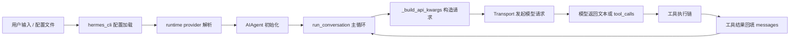
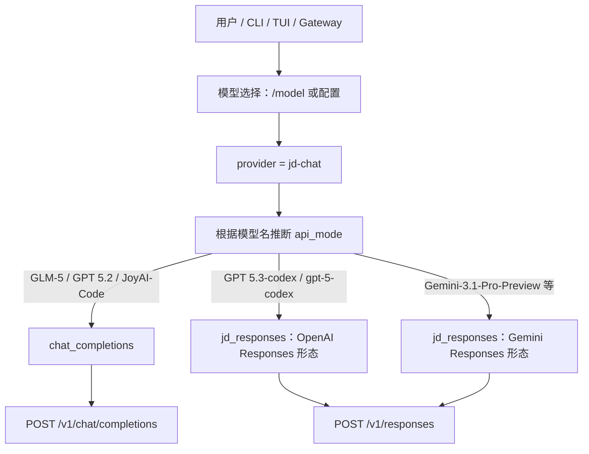
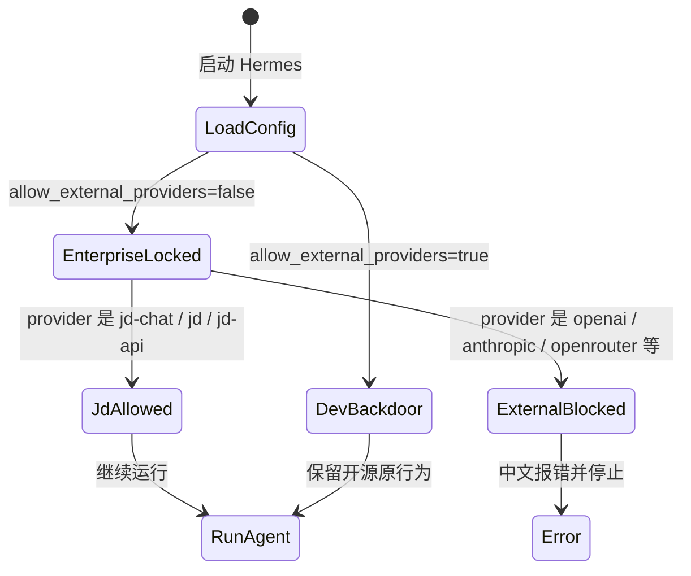
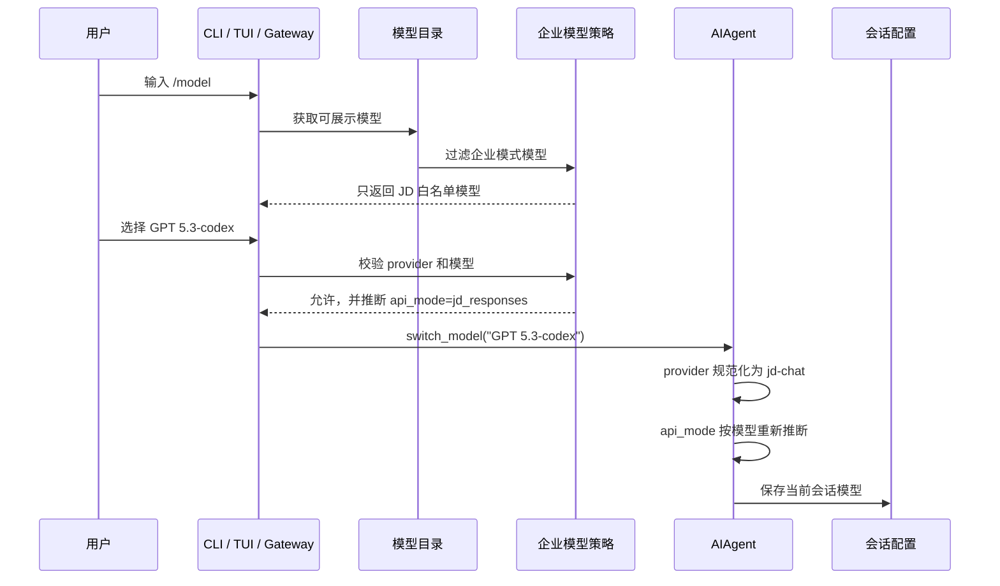
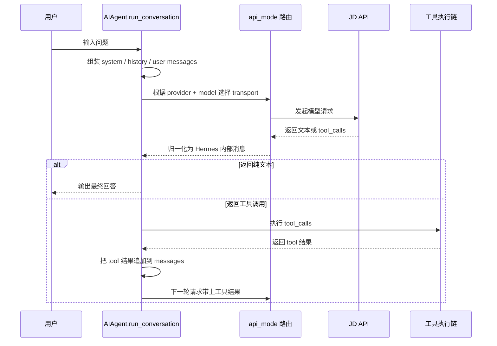
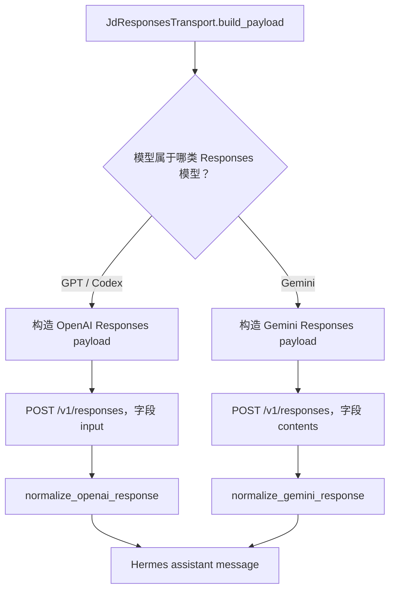

# Hermes 全量切换 JD 公司大模型技术设计与改造复盘

本文目标：把本次“Hermes Agent 全量切换公司内部 JD 大模型”的需求、设计、代码改动、问题复盘和测试用例讲清楚。读完后，后续开发者应该能回答三个问题：

1. 为什么 Hermes 不能再默认使用外部模型。
2. 用户选择不同 JD 模型时，请求到底走 JD Chat API 还是 JD Responses API。
3. 如果再次遇到 400 报错，应该优先检查哪条链路。

## 1. 需求背景

Hermes Agent 原本是一个多 provider 的开源 Agent 项目，默认能力偏向外部模型生态，例如 Anthropic、OpenAI、OpenRouter、Google、DeepSeek 等。这个架构适合开源项目，但不适合公司内部落地，因为用户可能在 CLI、TUI、Gateway、辅助任务、fallback、delegation 子代理等路径里间接使用外部模型。

本次改造的核心背景是：公司内部环境必须统一使用 JD 公司大模型，默认禁止外部 provider，避免数据、凭证、合规和成本不可控。也就是说，不只是主对话模型要换成 JD，所有后台模型路径也要收口到 JD。

同时，JD 公司大模型并不是只有一种接口。当前第一阶段同时涉及两条能力链：

| 接口 | 用途 | 典型模型 | 请求形态 |
|---|---|---|---|
| JD Chat API | 默认主对话、工具调用、辅助任务 | `GLM-5`、`GPT 5.2`、`JoyAI-Code` | OpenAI Chat Completions 兼容形态 |
| JD Responses API | Responses 模型、Codex/Gemini 新模型 | `GPT 5.3-codex`、`Gemini-3.1-Pro-Preview` | OpenAI Responses 或 Gemini Responses 形态 |

## 2. 需求内容

本次需求可以拆成四句话：

1. 默认 provider 改成 `jd-chat`，默认主模型改成 `GLM-5`。
2. 默认企业模式下，用户只能看到、选择、使用 JD 白名单模型。
3. 只有显式设置 `enterprise.allow_external_providers: true`，开发环境才允许恢复外部 provider。
4. JD Responses API 要有专用 transport，不能继续误用 Chat Completions 的 `messages` 参数。

公开配置如下：

```yaml
enterprise:
  allow_external_providers: false

model:
  provider: jd-chat
  default: GLM-5
```

环境变量如下：

```bash
JD_API_KEY=你的公司大模型 Key
JD_BASE_URL=http://ai-api.jdcloud.com/v1
```

provider 对用户侧保持简单：

| 名称 | 说明 |
|---|---|
| `jd-chat` | 正式 provider slug |
| `jd` | 别名 |
| `jd-api` | 别名 |

第一版模型策略如下：

| 类型 | 模型 |
|---|---|
| 默认主模型 | `GLM-5` |
| 默认视觉辅助模型 | `GPT 5.2` |
| JD Chat 工具模型 | 只允许企业白名单内的 Chat API 模型 |
| JD Responses 工具模型 | `GPT 5.3-codex`、`gpt-5-codex`、`Gemini-3.1-Pro-Preview`、`Gemini 3-Pro-Preview`、`Gemini-3-Flash-Preview` |

## 3. 当前架构理解

这次改造不是只改一个 API Key，而是要穿透 Hermes 的模型链路。可以先把它理解成下面这条主链：



每个节点都有可能绕回外部模型，所以企业改造必须覆盖全链路：

| 链路 | 为什么要改 |
|---|---|
| 配置默认值 | 防止新用户启动时默认使用外部 provider |
| provider 解析 | 防止旧配置或别名绕过企业锁定 |
| `/model` 切换 | 防止用户在命令行切到外部模型 |
| 模型补全列表 | 防止 UI 仍展示外部模型 |
| AIAgent 初始化 | 防止底层运行时拿到外部 provider |
| fallback | 防止失败后静默降级到外部模型 |
| auxiliary client | 防止压缩、标题、搜索、视觉等后台任务使用外部模型 |
| delegation 子代理 | 防止子 Agent 继承或选择外部模型 |
| transport | 防止 JD Responses 模型误走 Chat Completions |

## 4. 技术设计

### 4.1 总体架构

企业模式下，`jd-chat` 是唯一公开 provider。它不是只代表 JD Chat API，而是代表“JD 公司大模型入口”。真正走 Chat API 还是 Responses API，由模型名自动推断。



设计重点是：用户不需要理解 `api_mode`，用户只需要选模型。系统内部根据模型自动路由。

### 4.2 企业锁定状态图



这个状态图说明了一个原则：企业模式下不能“悄悄帮用户改回 JD”。如果用户旧配置里写的是外部 provider，启动时应该直接报错，告诉用户如何修复。这样比静默覆盖更安全。

### 4.3 `/model` 模型切换时序图



之前 `/model` 仍显示 `claude`、`codex`、`deepseek`、`gemini` 等外部模型，说明“补全列表”没有走企业过滤。修复后，企业模式下 `/model` 应该只展示 JD 模型。

### 4.4 单轮对话时序图



主循环不要轻易改，因为它同时负责消息上下文、工具调用、token 统计、压缩、fallback、轨迹保存和中断处理。JD 改造应该优先放在 provider 策略和 transport 层，而不是随意重写主循环。

### 4.5 JD Responses 双协议分流

JD `/v1/responses` 下面实际存在两类请求形态：

| 模型类型 | 请求字段 | 工具字段 | 典型模型 |
|---|---|---|---|
| OpenAI Responses 形态 | `input`、`instructions` | `tools: [{type: "function", ...}]` | `GPT 5.3-codex`、`gpt-5-codex` |
| Gemini Responses 形态 | `contents`、`systemInstruction` | `tools[].functionDeclarations` | `Gemini-3.1-Pro-Preview` |



这个分流是本次修复 400 的关键。不能简单认为“只要是 `/responses` 就都用同一种 JSON”。

## 5. 核心改动点

| 改动点 | 说明 |
|---|---|
| 新增企业策略模块 | 集中维护 JD provider、别名、白名单、默认模型、是否允许外部 provider |
| 默认配置切 JD | `model.provider=jd-chat`，`model.default=GLM-5`，`enterprise.allow_external_providers=false` |
| provider 解析改造 | `jd`、`jd-api` 统一规范化为 `jd-chat` |
| 模型校验改造 | 企业模式只允许 JD Chat 白名单和 JD Responses 白名单 |
| `/model` 展示改造 | CLI/TUI/Gateway 只展示 JD 模型，不再展示外部 provider |
| AIAgent 初始化改造 | provider 为 JD 时，根据模型重新推断 `api_mode`，避免旧配置污染 |
| JD Chat 请求改造 | 复用 Chat Completions transport，自动补 `/v1`，带 tools 时设置 `parallel_tool_calls=false` |
| JD Responses transport | 新增专用 transport，支持文本和工具调用 |
| OpenAI Responses 形态 | `GPT 5.3-codex`、`gpt-5-codex` 使用 `input` 请求字段 |
| Gemini Responses 形态 | Gemini 模型使用 `contents`、`systemInstruction`、`functionDeclarations` |
| thoughtSignature 保留 | Gemini 工具调用时保存并回放 `thoughtSignature`，避免下一轮 400 |
| usage 归一化 | 兼容 `usageMetadata` 和 OpenAI Responses token 字段 |
| 后台链路收口 | compression、vision、session search、title generation、fallback、delegation 默认收口到 JD |

## 6. 问题复盘

### 6.1 `/model` 仍显示外部模型

现象：

```text
/model 列表里出现 claude、codex、deepseek、gemini、gpt 等外部模型
```

根因：模型切换本身已经做了企业校验，但命令补全和展示列表仍读取旧的外部 provider catalog，没有经过 JD 企业模型过滤。

修复：让 `/model` 的展示和补全链路统一走企业白名单。企业模式下，只返回 JD Chat 模型和 JD Responses 模型。

验收：CLI 输入 `/model` 时，不应该再看到外部 provider 名称。

### 6.2 GPT 5.3-codex 误走 Chat Completions

现象：

```text
Unsupported parameter: 'messages'. In the Responses API, this parameter has moved to 'input'.
```

根因：用户切到 `GPT 5.3-codex` 后，模型已经是 Responses 模型，但运行时仍保留旧的 `api_mode=chat_completions`。结果请求发到了 Responses endpoint，却还在传 Chat Completions 的 `messages`。

修复：只要 provider 是 JD，就不要信任旧配置里的 `api_mode`。`AIAgent` 初始化和模型切换时，都按模型名重新推断：

```text
GLM-5 -> chat_completions
GPT 5.3-codex -> jd_responses
Gemini-3.1-Pro-Preview -> jd_responses
```

验收：`GPT 5.3-codex` 请求必须走 `/v1/responses`，并且请求体使用 `input`。

### 6.3 GPT 5.3-codex 走 `/responses` 后仍 400

现象：

```text
HTTP 400 Bad Request for /v1/responses
```

进一步排查后发现，请求体仍使用 Gemini 风格的 `contents`，但 `GPT 5.3-codex` 需要 OpenAI Responses 风格的 `input`。

根因：最初的 JD Responses transport 假设所有 Responses 模型都使用 Gemini wire shape。这个假设不成立。

修复：`JdResponsesTransport` 内部分成两条构造路径：

| 模型 | 请求形态 |
|---|---|
| `GPT 5.3-codex`、`gpt-5-codex` | OpenAI Responses `input` |
| Gemini 系列 | Gemini Responses `contents` |

验收：真实 JD API 调用 `GPT 5.3-codex`，带工具 schema 也能返回正常中文回答。

### 6.4 Gemini 工具调用第二轮缺少 thoughtSignature

现象：

```text
Unable to submit request because function call `default_api:search_files`
is missing a `thought_signature`.
```

根因：Gemini Responses 的工具调用有一个特殊要求：模型返回的 `functionCall` part 可能带 `thoughtSignature`。下一轮把这个工具调用历史发回模型时，必须原样带回这个签名。之前归一化时只保留了工具名和参数，没有保留 `thoughtSignature`。

修复：transport 在 normalize Gemini response 时，把原始 part 中的 `thoughtSignature` 存到工具调用的 `extra_content`。`run_agent.py` 构造 assistant message 时继续保存该字段。下一轮 `JdResponsesTransport` 把它回放到 `functionCall` part。

验收：Gemini 模型完成“先调用工具，再根据工具结果回答”的两轮请求，不再因为缺少 `thought_signature` 报 400。

## 7. 测试用例

建议把测试分成五类，而不是只测 happy path。

| 测试类型 | 测试目标 |
|---|---|
| Provider 解析 | `jd-chat`、`jd`、`jd-api` 都能解析到 JD provider |
| 企业锁定 | 默认模式下外部 provider 启动失败，开发后门开启后恢复原行为 |
| 模型校验 | JD Chat 白名单和 JD Responses 白名单通过，非白名单失败 |
| Transport 转换 | Chat、OpenAI Responses、Gemini Responses 三类 payload 都正确 |
| 工具调用闭环 | 模型返回 tool_calls 后，工具结果能正确回填并进入下一轮 |

已经覆盖或建议覆盖的关键用例：

| 用例 | 预期 |
|---|---|
| `jd-chat + GLM-5` | `api_mode=chat_completions` |
| `jd-chat + GPT 5.3-codex` | `api_mode=jd_responses`，请求体使用 `input` |
| `jd-chat + Gemini-3.1-Pro-Preview` | `api_mode=jd_responses`，请求体使用 `contents` |
| `JD_BASE_URL` 不带 `/v1` | 自动补成 `/v1` |
| 带 tools 的 JD Chat 请求 | 包含 `tools` 和 `parallel_tool_calls=false` |
| 带 tools 的 JD Responses 请求 | 强制非流式，避免工具参数分片不稳定 |
| Gemini 工具调用第二轮 | 回放 `thoughtSignature` |
| `/model` 展示 | 企业模式只展示 JD 模型 |
| 旧配置外部 provider | 默认直接报中文错误 |
| 开发后门开启 | 外部 provider 恢复原行为 |

推荐回归命令：

```bash
source venv/bin/activate
scripts/run_tests.sh tests/hermes_cli/test_enterprise_jd_provider.py tests/agent/transports/test_jd_responses_transport.py -q
scripts/run_tests.sh tests/run_agent/test_run_agent.py tests/agent/test_usage_pricing.py -q
scripts/run_tests.sh tests/hermes_cli/ tests/agent/ tests/gateway/
```

人工验收命令：

```bash
source venv/bin/activate
export JD_API_KEY=你的公司大模型 Key
./hermes
```

进入 CLI 后验收：

```text
/model
/model GLM-5
你好，用一句话回复我
/model GPT 5.3-codex
你好，用一句话回复我
/model Gemini-3.1-Pro-Preview
请调用工具查看当前目录下有哪些文件，然后用中文总结
```

## 8. 风险与边界

当前第一版不做这些能力：

| 暂不支持项 | 原因 |
|---|---|
| JD Responses 图片生成 | 需求第一阶段只覆盖文本和工具调用 |
| JD Responses 视频生成 | 与当前 Agent 主循环关系较远，后续单独设计 |
| Responses 图片输出配置 | 需要补充多模态消息和产物保存策略 |
| 工具调用流式分片 | JD 工具分片稳定性不确定，带 tools 时先固定非流式 |
| 任意 JD 模型名 | 只放开白名单，避免用户误选不支持工具调用的模型 |

还需要特别注意两个风险：

1. 不能让 fallback 静默回到外部 provider。企业模式下失败就应该暴露失败，而不是绕出去。
2. 不能把 Gemini 的 `thoughtSignature` 当成无关字段丢掉。它属于工具调用上下文的一部分。

## 9. 启动与验收步骤

本地启动前先确认环境：

```bash
cd /Users/fenggongye1/Downloads/pythonProject/jdt-hermes-agent
source venv/bin/activate
export JD_API_KEY=你的公司大模型 Key
```

检查配置：

```bash
cat ~/.hermes/config.yaml
```

配置里企业模式建议保持：

```yaml
enterprise:
  allow_external_providers: false

model:
  provider: jd-chat
  default: GLM-5
```

启动 CLI：

```bash
./hermes
```

验收顺序建议如下：

1. 先输入 `/model`，确认只展示 JD 模型。
2. 选择 `GLM-5`，问一句普通问题，确认 Chat API 可用。
3. 选择 `GPT 5.3-codex`，问一句普通问题，确认 OpenAI Responses 形态可用。
4. 选择 `Gemini-3.1-Pro-Preview`，让它调用文件搜索工具，确认 Gemini 工具调用闭环可用。
5. 把配置临时改成外部 provider，确认企业模式会报中文错误。
6. 仅在开发验证时设置 `enterprise.allow_external_providers: true`，确认外部 provider 原行为仍可恢复。

## 10. 后续优化

建议后续按优先级继续做这些事：

| 优先级 | 事项 |
|---|---|
| 高 | 把 JD API 400 错误进一步中文化，直接提示“请求形态不匹配”或“缺少 thoughtSignature” |
| 高 | 给 `/model` 增加接口类型标识，例如 `JD Chat`、`JD Responses` |
| 中 | 在 setup wizard 里增加 JD API Key 配置引导 |
| 中 | 给真实 JD API 验收写一个手动 smoke test 脚本 |
| 中 | 补充 Gateway 和 TUI 的 JD 模型切换验收记录 |
| 低 | 后续单独设计 JD Responses 图片、视频、多模态输出 |

## 11. 一句话总结

这次改造的本质不是“把 OpenAI Key 换成 JD Key”，而是把 Hermes 的模型选择权、provider 解析、后台辅助链路、fallback 行为和 transport 请求形态全部收口到 JD 公司大模型体系里。
