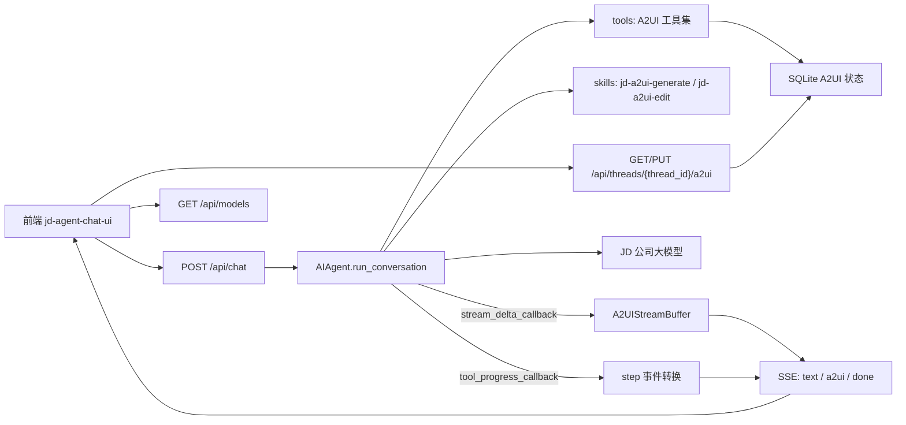
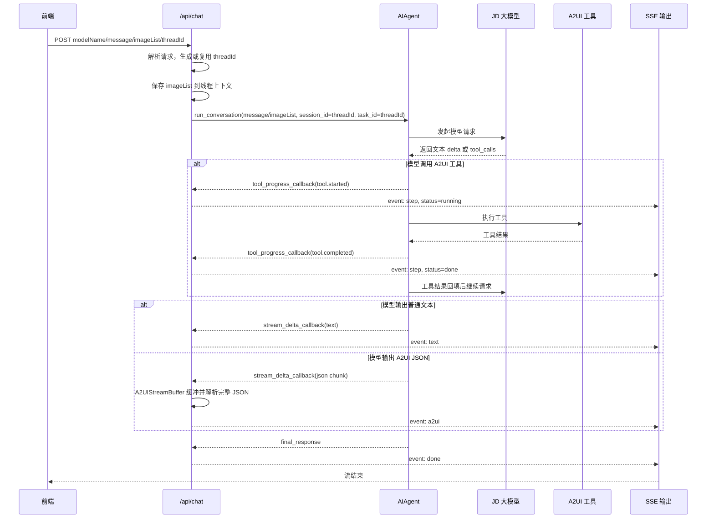
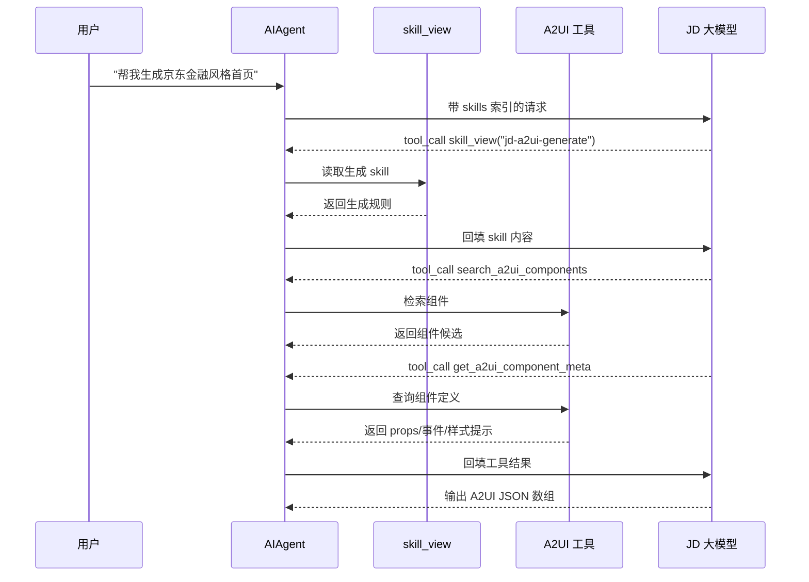
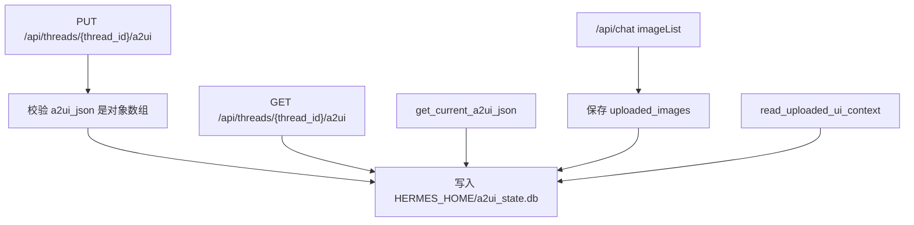
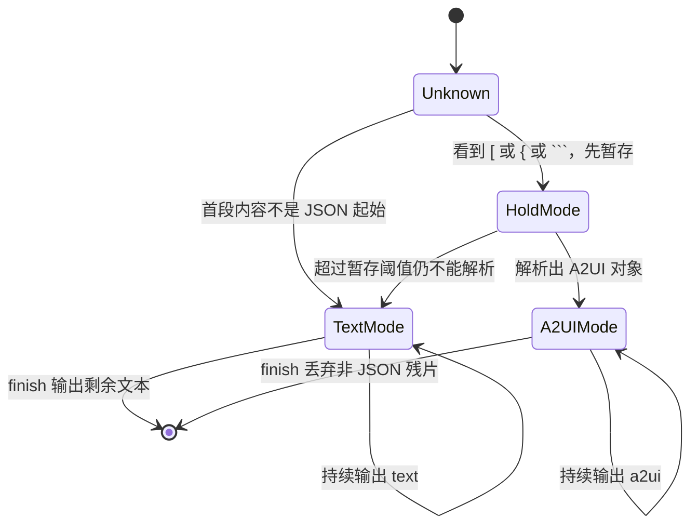

# JD A2UI 能力扩展化接入实现说明

本文档用于说明本分支对 Hermes Agent 的 A2UI 兼容层改造，目标是帮助你从业务目标、技术设计、代码改动、测试用例几个角度完整走查本次实现。

## 1. 需求背景

原项目 `jd-agent-chat-ui` 已经有面向前端的 A2UI 接口能力，主要包括：

- `/api/chat`：前端聊天接口，使用 SSE 流式返回文本、步骤、A2UI JSON。
- `/api/models`：前端模型列表接口。
- `/api/threads/{thread_id}/a2ui`：当前线程页面 A2UI JSON 的读写接口。

但旧项目的实现里包含一套独立的 A2UI Agent 编排层，例如 intent agent、execution kernel、多阶段调度、双模型调用等。直接搬进 Hermes Agent 会带来几个问题：

- 会绕开 Hermes 已有的 `run_agent.py` 主循环，形成第二套 Agent 运行时。
- 性能可能继续受旧流程影响，例如一次用户请求经过多次大模型调用。
- 后续维护成本高，A2UI 能力和 Hermes 工具、skill、session、provider 体系会割裂。
- 本项目已经完成 JD 公司大模型接入，A2UI 能力应该复用现有 provider、transport、tool call、stream callback 能力。

因此本次改造采用“扩展化接入”思路：**不复制旧项目运行时，只把 A2UI 生成、编辑、组件知识、状态读写、流式事件转换接入 Hermes 的扩展点。**

## 2. 需求内容

本次实现的目标可以分成 5 类。

第一类：新增前端兼容接口。

- 新增 `POST /api/chat`。
- 新增 `GET /api/models`。
- 新增 `GET /api/threads/{thread_id}/a2ui`。
- 新增 `PUT /api/threads/{thread_id}/a2ui`。
- 新增 `PUT /api/threads/a2ui`，用于未传 thread_id 时自动生成。

第二类：A2UI 生成和编辑做成 skill。

- 新增 `jd-a2ui-generate`，负责根据用户需求生成 A2UI JSON。
- 新增 `jd-a2ui-edit`，负责基于当前页面编辑 A2UI JSON。
- skill 通过现有 skills 机制自然触发，不由 `/api/chat` 强制注入。

第三类：A2UI 上下文和组件知识做成工具。

- `get_a2ui_catalog`：读取组件目录摘要。
- `search_a2ui_components`：按需求检索组件。
- `get_a2ui_component_meta`：读取单个组件完整定义。
- `get_current_a2ui_json`：读取当前线程 A2UI 快照。
- `read_uploaded_ui_context`：读取当前线程最近一次上传图片引用。

第四类：Hook/Callback 负责流式事件转换。

- 沿用 `stream_delta_callback` 监听模型文本增量。
- 沿用 `tool_progress_callback` 监听工具开始/结束。
- 将工具事件转换成前端 `step` 事件。
- 将模型流式 A2UI JSON 缓冲解析成前端 `a2ui` 事件。
- 普通聊天文本输出为 `text` 事件。

第五类：继续复用 Hermes 主智能体逻辑。

- `/api/chat` 调用 `AIAgent.run_conversation()`。
- 不改写 `run_agent.py` 主循环。
- 不在 `/api/chat` 判断 A2UI 场景。
- 不在 `/api/chat` 注入 A2UI prompt。
- 不在 `/api/chat` 主动读取当前 A2UI 状态。

## 3. 设计原则

本次代码改动遵循下面几个原则。

### 3.1 `/api/chat` 是通用聊天接口

`/api/chat` 的职责只是适配前端协议：

- 接收前端请求。
- 解析 `modelName`、`message`、`imageList`、`threadId`、`enableIntentThinking`、`enableIntentSearch`。
- 调用 `AIAgent.run_conversation()`。
- 把 Hermes 输出转换成前端 SSE 事件。

它不是 A2UI 专用接口，所以它不做这些事情：

- 不判断用户是不是要生成 A2UI。
- 不强制加载 A2UI skill。
- 不拼接 A2UI system prompt。
- 不主动读取当前页面 A2UI JSON。

### 3.2 A2UI 能力由 skill 自然触发

Hermes 原有 skill 机制会在系统提示中列出可用 skills，并要求模型在相关任务中调用 `skill_view`。

因此 A2UI 生成/编辑采用普通 skill 方式接入：

- 用户说“生成京东金融风格首页”，模型应自然加载 `jd-a2ui-generate`。
- 用户说“增加轮播组件”，模型应自然加载 `jd-a2ui-edit`。
- 如果用户只是普通聊天，模型不应加载 A2UI skill。

### 3.3 Tool 只管上下文和组件知识

A2UI 工具不负责生成页面，也不负责编辑页面。

它们只回答这些问题：

- 有哪些组件？
- 某个组件有哪些 props？
- 当前页面 A2UI JSON 是什么？
- 当前线程有没有上传图片？

真正的生成/编辑策略仍然由 skill + 大模型完成。

### 3.4 Callback 只管事件转换

`/api/chat` 里的 callback 不改变 Agent 决策，只观察过程并转换事件：

- 工具开始/完成 → `step`。
- 普通文本 delta → `text`。
- 可解析的 A2UI JSON → `a2ui`。
- 请求结束 → `done`。

### 3.5 不复制旧项目运行时

本次没有迁移旧项目的 intent agent、execution kernel、dialog runtime、repairer、visual reviewer 等复杂模块。

如果后续需要引入其中某个能力，优先做成独立扩展点，例如：

- skill
- tool
- hook
- MCP
- 轻量 adapter

而不是直接把旧项目的一整套运行时搬进来。

## 4. 技术设计

### 4.1 总体架构图



这个图的重点是：`/api/chat` 不接管 Agent，只在 Agent 外围做协议适配。

### 4.2 `/api/chat` 时序图



### 4.3 A2UI skill 与工具调用时序图



编辑场景类似，只是模型应加载 `jd-a2ui-edit`，并先调用 `get_current_a2ui_json()`。

### 4.4 A2UI 状态读写图



状态存储是轻量 SQLite，路径在当前 Hermes profile 的 `HERMES_HOME` 下，不写死 `~/.hermes`。

### 4.5 流式解析状态图



这个状态机避免两个问题：

- 普通聊天不应该被误判成 A2UI。
- A2UI JSON 流式输出时，不应该先把半截 JSON 当文本发给前端。

## 5. 接口设计

### 5.1 `GET /api/models`

用途：给 `jd-agent-chat-ui` 前端提供模型选择列表。

返回结构：

```json
{
  "models": [
    {
      "name": "jd-api:GLM-5",
      "label": "GLM-5 (jd-api)",
      "provider": "jd-api",
      "raw_model_name": "GLM-5",
      "supports_image_input": false,
      "is_default": true
    }
  ]
}
```

设计说明：

- 只展示 JD 企业模型。
- 输出格式兼容旧前端。
- `provider` 使用旧前端熟悉的 `jd-api`，内部运行时仍映射到 Hermes 的 `jd-chat`。
- 支持 JD Chat 模型和 JD Responses 模型。

### 5.2 `POST /api/chat`

请求示例：

```json
{
  "modelName": "jd-api:GLM-5",
  "message": "帮我生成京东金融风格的首页",
  "imageList": [],
  "threadId": "thread-001",
  "enableIntentThinking": false,
  "enableIntentSearch": false
}
```

请求参数：

| 参数名 | 类型 | 必填 | 说明 |
|---|---|---|---|
| `modelName` | String | 否 | AI 模型名称 |
| `message` | String | 否 | 用户消息；如果没有文本但有 `imageList`，也允许只按图片输入调用 |
| `imageList` | List<String> | 否 | 图片数据，支持 data URL |
| `threadId` | String | 否 | 线程 ID，用于会话连续性和 A2UI 工具上下文 |
| `enableIntentThinking` | Boolean | 否 | 意图智能体思考模式开关，当前服务端只做兼容接收 |
| `enableIntentSearch` | Boolean | 否 | 意图智能体联网搜索开关，当前服务端只做兼容接收 |

`pageId` / `pageVersion` 当前不作为 `/api/chat` 入参依赖；即使前端传入也会被忽略。

响应是 SSE：

```text
event: meta
data: {"thread_id":"thread-001"}

event: step
data: {"id":"tool-1","status":"running","title":"检索合适的 A2UI 组件"}

event: a2ui
data: {"beginRendering":{"surfaceId":"main","root":"root"}}

event: done
data: {"thread_id":"thread-001"}
```

事件类型：

| 事件 | 含义 |
|---|---|
| `meta` | 返回实际使用的 `thread_id` |
| `text` | 普通聊天文本 |
| `step` | 工具执行过程 |
| `a2ui` | 单条 A2UI 协议消息 |
| `error` | Agent 执行异常 |
| `done` | 流结束 |

关键约束：

- `/api/chat` 不注入 A2UI skill。
- `/api/chat` 不主动读取当前 A2UI。
- `/api/chat` 会把 `threadId` 作为 `session_id` 和 `task_id`，用于会话连续性和工具上下文；历史字段 `thread_id` 仍保留兼容。
- 如果传了 `modelName`，会强制按 JD provider 解析，并按模型自动选择 Chat API 或 Responses API；历史字段 `model_name` / `model` 仍保留兼容。
- 如果传了 `imageList`，会作为普通多模态输入交给 Agent，同时保存到当前 thread 的图片上下文，供工具读取；历史字段 `images` / `image_list` 仍保留兼容。

### 5.3 `GET /api/threads/{thread_id}/a2ui`

用途：读取当前线程保存的 A2UI JSON。

返回示例：

```json
{
  "thread_id": "thread-001",
  "a2ui_json": []
}
```

### 5.4 `PUT /api/threads/{thread_id}/a2ui`

用途：替换当前线程的 A2UI JSON。

请求示例：

```json
{
  "a2ui_json": [
    {
      "beginRendering": {
        "surfaceId": "main",
        "root": "root"
      }
    }
  ]
}
```

返回示例：

```json
{
  "success": true,
  "thread_id": "thread-001"
}
```

## 6. 改动点

### 6.1 API 兼容层

文件：[gateway/platforms/api_server.py](/Users/fenggongye1/Downloads/pythonProject/jdt-hermes-agent/gateway/platforms/api_server.py)

新增能力：

- `/api/models`
- `/api/chat`
- `/api/threads/{thread_id}/a2ui`
- `/api/threads/a2ui`
- A2UI SSE 事件转换
- 前端 `modelName` 到 JD 模型的解析
- 图片上下文保存

重点方法：

- `_handle_api_models`
- `_handle_api_chat`
- `_write_sse_api_chat`
- `_handle_get_api_thread_a2ui`
- `_handle_put_api_thread_a2ui`
- `_handle_put_api_threads_a2ui`
- `_resolve_api_chat_model`

### 6.2 A2UI skill

文件：

- [skills/jd/a2ui-generate/SKILL.md](/Users/fenggongye1/Downloads/pythonProject/jdt-hermes-agent/skills/jd/a2ui-generate/SKILL.md)
- [skills/jd/a2ui-edit/SKILL.md](/Users/fenggongye1/Downloads/pythonProject/jdt-hermes-agent/skills/jd/a2ui-edit/SKILL.md)

新增能力：

- 生成 A2UI JSON 的规则。
- 编辑已有 A2UI JSON 的规则。
- 京东金融视觉风格建议。
- 轮播组件生成/编辑规则。
- 明确要求模型按需调用 A2UI 工具。

### 6.3 A2UI 工具集

文件：[tools/a2ui_tools.py](/Users/fenggongye1/Downloads/pythonProject/jdt-hermes-agent/tools/a2ui_tools.py)

新增工具：

- `get_a2ui_catalog`
- `search_a2ui_components`
- `get_a2ui_component_meta`
- `get_current_a2ui_json`
- `read_uploaded_ui_context`

工具注册到 `a2ui` toolset，并加入 API server 默认工具集中。

### 6.4 A2UI 扩展包

目录：[jd_a2ui](/Users/fenggongye1/Downloads/pythonProject/jdt-hermes-agent/jd_a2ui)

新增文件：

- `catalog.py`：本地完整 A2UI 组件 meta 加载、缓存、检索逻辑。
- `a2ui_components_meta.json`：本地组件 meta 快照，运行时默认读取它，不直接访问 OSS。
- `state.py`：SQLite 状态存储。
- `streaming.py`：流式 JSON 缓冲解析。
- `__init__.py`：说明扩展包边界。

同步脚本：

- [scripts/sync_a2ui_meta.py](/Users/fenggongye1/Downloads/pythonProject/jdt-hermes-agent/scripts/sync_a2ui_meta.py)：从 OSS 或本地源文件同步组件 meta 快照，支持 `.json` 和旧项目 `.py` 常量格式。

启动预热：

- API server 启动时调用 `preload_components_meta()`，提前把 `jd_a2ui/a2ui_components_meta.json` 读入进程缓存，避免首次 A2UI 工具调用承担读取和解析成本。
- 预热失败只记录 warning，不阻断普通 API server 启动；真正调用 A2UI 工具时会返回中文错误。

### 6.5 工具集配置

文件：

- [toolsets.py](/Users/fenggongye1/Downloads/pythonProject/jdt-hermes-agent/toolsets.py)
- [hermes_cli/tools_config.py](/Users/fenggongye1/Downloads/pythonProject/jdt-hermes-agent/hermes_cli/tools_config.py)

改动内容：

- 新增 `a2ui` toolset。
- 将 A2UI 工具加入 `_HERMES_CORE_TOOLS`。
- 将 A2UI 工具加入 `hermes-api-server` 默认工具集。
- 在 tools 配置界面显示 `JD A2UI` 工具集。

### 6.6 测试

文件：

- [tests/tools/test_a2ui_extension.py](/Users/fenggongye1/Downloads/pythonProject/jdt-hermes-agent/tests/tools/test_a2ui_extension.py)
- [tests/tools/test_a2ui_meta_sync.py](/Users/fenggongye1/Downloads/pythonProject/jdt-hermes-agent/tests/tools/test_a2ui_meta_sync.py)
- [tests/gateway/test_api_server_a2ui_compat.py](/Users/fenggongye1/Downloads/pythonProject/jdt-hermes-agent/tests/gateway/test_api_server_a2ui_compat.py)

覆盖内容：

- A2UI 工具是否暴露。
- 默认能加载本地完整组件 meta 快照。
- `A2UI_COMPONENTS_META_PATH` 能覆盖为本地 JSON 或旧项目 `.py` 常量文件。
- `Swipe` 组件 meta 是否包含 `autoplay`。
- `WealthTrendText`、`WealthSparkline` 等完整业务组件能被查询/检索。
- 同步脚本能校验本地文件、旧 `.py` 格式、mock OSS URL，并拒绝重复组件名。
- A2UI 状态读写。
- A2UI 流式解析。
- `/api/models` 是否只返回 JD 模型。
- `/api/chat` 普通聊天不输出 `a2ui`。
- `/api/chat` A2UI JSON 输出会转成 `a2ui` 事件并持久化。
- 工具进度会转成 `step` 事件。

## 7. 关键代码走查路线

建议按下面顺序走查，比较容易看懂。

### 第 1 步：先看接口入口

文件：[gateway/platforms/api_server.py](/Users/fenggongye1/Downloads/pythonProject/jdt-hermes-agent/gateway/platforms/api_server.py)

先看路由注册：

- `connect()`
- `/api/models`
- `/api/chat`
- `/api/threads/{thread_id}/a2ui`

你要确认：

- 新接口只是挂在 API server 上。
- 原来的 `/v1/chat/completions`、`/v1/responses` 没有被替换。

### 第 2 步：看 `/api/chat` 是否保持通用

重点看：

- `_handle_api_chat`

你要确认：

- 它只读取 `modelName/message/imageList/threadId/enableIntentThinking/enableIntentSearch`，并兼容历史 `model_name/images/thread_id`。
- 它没有拼接 A2UI prompt。
- 它没有调用 `get_current_a2ui_json`。
- 它直接调用 `_run_agent`。
- 它把 `threadId` 传给 `session_id` 和 `task_id`。

### 第 3 步：看模型解析

重点看：

- `_api_compat_model_entries`
- `_resolve_api_chat_model`
- `_create_agent`

你要确认：

- `/api/models` 只展示 JD 模型。
- 前端传 `jd-api:GLM-5` 能解析为 `GLM-5`。
- 前端传外部 provider 会报错。
- 传 JD Responses 模型时，会设置正确的 `api_mode`。

### 第 4 步：看流式事件转换

重点看：

- `_write_sse_api_chat`
- [jd_a2ui/streaming.py](/Users/fenggongye1/Downloads/pythonProject/jdt-hermes-agent/jd_a2ui/streaming.py)

你要确认：

- 普通文本输出 `text`。
- A2UI JSON 输出 `a2ui`。
- 工具过程输出 `step`。
- 最后输出 `done`。
- A2UI JSON 被持久化到状态存储。

### 第 5 步：看 A2UI 工具

重点看：

- [tools/a2ui_tools.py](/Users/fenggongye1/Downloads/pythonProject/jdt-hermes-agent/tools/a2ui_tools.py)
- [jd_a2ui/catalog.py](/Users/fenggongye1/Downloads/pythonProject/jdt-hermes-agent/jd_a2ui/catalog.py)
- [jd_a2ui/state.py](/Users/fenggongye1/Downloads/pythonProject/jdt-hermes-agent/jd_a2ui/state.py)

你要确认：

- 工具只是返回知识和上下文。
- 工具不生成页面。
- 工具不调用大模型。
- `catalog.py` 运行时只读本地 meta 文件，不访问 OSS。
- 默认 meta 文件是 `jd_a2ui/a2ui_components_meta.json`。
- 开发时可用 `A2UI_COMPONENTS_META_PATH` 临时指向外部本地文件。
- API server 启动时会预热组件 meta 缓存。
- 状态路径使用 `HERMES_HOME`，没有写死 `~/.hermes`。

### 第 6 步：看 skill 是否可自然触发

重点看：

- `skills/jd/a2ui-generate/SKILL.md`
- `skills/jd/a2ui-edit/SKILL.md`

你要确认：

- `description` 里明确写了触发场景。
- 生成和编辑是两个 skill。
- skill 要求模型按需调用 A2UI 工具。
- skill 没有绑定 `/api/chat`。

### 第 7 步：看测试

重点看：

- `tests/gateway/test_api_server_a2ui_compat.py`
- `tests/tools/test_a2ui_extension.py`
- `tests/tools/test_a2ui_meta_sync.py`

你要确认：

- 测试覆盖了普通聊天和 A2UI 场景。
- 测试覆盖了前端接口形态。
- 测试覆盖了工具、状态、流式解析。

## 8. 测试用例

### 8.1 已实现自动化测试

本次新增测试：

```bash
source venv/bin/activate
scripts/run_tests.sh tests/tools/test_a2ui_extension.py tests/tools/test_a2ui_meta_sync.py tests/gateway/test_api_server_a2ui_compat.py
```

已通过：

```text
21 passed
```

相关回归：

```bash
source venv/bin/activate
scripts/run_tests.sh tests/tools/test_a2ui_extension.py tests/tools/test_a2ui_meta_sync.py tests/gateway/test_api_server_a2ui_compat.py tests/gateway/test_api_server.py tests/gateway/test_api_server_multimodal.py tests/test_toolsets.py
```

已通过：

```text
185 passed
```

### 8.2 普通聊天测试

请求：

```json
{
  "message": "你好，用一句话回复我",
  "threadId": "plain-thread"
}
```

预期：

- 返回 `meta`。
- 返回 `text`。
- 返回 `done`。
- 不返回 `a2ui`。
- 不强制触发 A2UI skill。

### 8.3 A2UI 生成测试

请求：

```json
{
  "modelName": "jd-api:GLM-5",
  "message": "帮我生成京东金融风格的首页",
  "threadId": "a2ui-thread",
  "imageList": [],
  "enableIntentThinking": false,
  "enableIntentSearch": false
}
```

预期：

- 模型根据自然语言加载 `jd-a2ui-generate`。
- 工具阶段返回 `step`。
- 最终 A2UI JSON 被解析为多条 `a2ui`。
- 最后返回 `done`。

### 8.4 A2UI 编辑测试

前置：

```http
PUT /api/threads/edit-thread/a2ui
```

写入已有页面。

请求：

```json
{
  "message": "在某个楼层上面增加轮播组件，内部增加3个图片组件，2秒自动轮播，支持点击滑动轮播",
  "threadId": "edit-thread"
}
```

预期：

- 模型根据自然语言加载 `jd-a2ui-edit`。
- 先调用 `get_current_a2ui_json`。
- 查询 `Swipe` 和 `Image` 的组件 meta。
- 输出修改后的 A2UI JSON。

### 8.5 图片生成页面测试

请求：

```json
{
  "message": "根据这张图片生成页面",
  "threadId": "image-thread",
  "imageList": ["data:image/png;base64,..."]
}
```

预期：

- 图片作为普通多模态输入进入 Agent。
- 图片引用保存到当前 thread。
- 模型可按需调用 `read_uploaded_ui_context`。
- 最终输出 A2UI JSON 或普通文本说明。

### 8.6 模型列表测试

请求：

```http
GET /api/models
```

预期：

- 只返回 JD 模型。
- 不出现 `openai`、`anthropic`、`openrouter` 等外部 provider。
- 返回字段兼容旧前端：`name/label/provider/raw_model_name/supports_image_input/is_default`。

### 8.7 状态接口测试

请求：

```http
PUT /api/threads/thread-001/a2ui
GET /api/threads/thread-001/a2ui
```

预期：

- PUT 成功返回 `success: true`。
- GET 能拿回同一份 `a2ui_json`。
- 非数组 `a2ui_json` 返回 400。

## 9. 已知限制、发现的问题与后续优化

这一节是写文档和复盘代码时需要及时提醒出来的点。它们不一定都是 bug，但都属于后续走查、联调、上线前要重点确认的风险。

### 9.1 新增 skill 需要同步或重启后才会生效

本次新增的 skill 放在项目目录：

- `skills/jd/a2ui-generate/SKILL.md`
- `skills/jd/a2ui-edit/SKILL.md`

Hermes 运行时真正读取的是当前 `HERMES_HOME` 下同步后的 skill 索引。

因此如果 API server 已经在运行，新增 skill 后通常需要重启 API server，或者确保原有的 skill sync 流程已经执行。否则会出现一个容易误判的问题：代码已经有 skill 文件，但模型运行时看不到 `jd-a2ui-generate` / `jd-a2ui-edit`。

这是本次文档过程中发现的第一个需要提醒的问题。

### 9.2 skill 自然触发依赖模型判断

因为 `/api/chat` 不注入 A2UI skill，所以 A2UI skill 是否触发依赖 Hermes 原有 skill 机制和模型判断。

如果发现模型不稳定，可以优化 skill 的 `description`，但不建议把 A2UI prompt 塞进 `/api/chat`。

这里的设计取舍是：

- 好处：`/api/chat` 继续保持通用聊天接口，不变成 A2UI 专用接口。
- 风险：A2UI 任务是否触发 skill，存在模型判断的不确定性。
- 后续优化：可以加强 skill 描述、增加 A2UI 示例、优化 skill 检索排序，但不要破坏 `/api/chat` 的通用边界。

### 9.3 A2UI 编辑要求模型输出完整 JSON，不支持 patch/action 模式

当前 `A2UIStreamBuffer` 的设计是：识别模型输出里的完整 A2UI JSON，然后把它拆成 `a2ui` 事件并保存为当前页面状态。

这意味着编辑类任务现在默认要求模型输出“完整修改后的 A2UI JSON”，而不是只输出类似下面这样的局部 patch：

```json
{
  "actions": [
    {"type": "insert", "target": "floor-1", "component": "..."}
  ]
}
```

如果后续希望支持 action/patch 模式，就需要新增一层“patch 应用器”，把 action 应用到当前 A2UI JSON，再持久化结果。

这是本次文档过程中发现的第二个需要提醒的问题：当前方案适合第一版闭环，但不是最终编辑引擎。

### 9.4 图片生成页面目前不是完整 UI MCP 能力

本次 `/api/chat` 对图片做了两件事：

- 把图片作为普通多模态输入传给 Agent。
- 把图片引用保存到当前 thread，供 `read_uploaded_ui_context` 工具读取。

但是它还没有实现“真正读取图片 UI 结构”的 MCP 能力。也就是说，工具目前能告诉模型“当前线程有哪些上传图片”，但不能稳定输出完整的页面层级、组件边界、字号、颜色、间距等结构化 UI 信息。

所以“根据图片生成页面”的质量主要仍依赖模型自身视觉理解能力。

后续如果要显著提升这个场景，需要补一个真正的 UI 解析 MCP 或视觉分析工具，把图片转成结构化 UI 信息后再交给 A2UI skill。

### 9.5 组件 meta 已改为本地完整快照，但仍要管理更新流程

当前已不再使用“精选版硬编码组件”，而是默认读取：

```text
jd_a2ui/a2ui_components_meta.json
```

运行时不会直接读取 OSS，避免每次工具调用被网络性能和稳定性拖累。

后续新增组件时，推荐流程是：

```bash
source venv/bin/activate
python scripts/sync_a2ui_meta.py --source <本地文件或 OSS URL>
```

同步脚本会校验组件结构和重复组件名，成功后更新本地快照，再把快照随代码一起提交。

### 9.6 工具调用轮次可能不是 token 级流式

JD 工具调用场景下，为了稳定性，部分轮次可能不是 token 级流式。用户体验主要靠 `step` 事件补齐。

最终生成 A2UI JSON 时，如果模型是普通文本流式输出，`A2UIStreamBuffer` 可以边解析边发 `a2ui`。

### 9.7 当前状态存储是轻量 SQLite

当前只满足本地开发和单实例使用。后续如果部署为多实例，需要考虑共享存储或外部数据库。

### 9.8 请求体上限从 1 MB 调整为 10 MB 是全局变化

为了让 `/api/chat` 能接收截图或图片 data URL，本次把 API server 的请求体上限从 1 MB 调整到了 10 MB。

需要注意：这个改动不是只影响 `/api/chat`，而是影响同一个 API server 上的 POST/PUT/PATCH 请求。

这是一个合理的本地开发取舍，但如果后续要部署到多人环境，建议补充：

- 更细粒度的接口级请求体限制。
- 图片上传大小提示。
- 更明确的超限错误信息。
- 如有必要，改为文件上传或对象存储引用，而不是直接传大段 base64。

### 9.9 暂未实现旧项目完整 intent 事件

本次只保留最小兼容事件：

- `meta`
- `text`
- `step`
- `a2ui`
- `error`
- `done`

旧项目里的 `intent_*` 系列事件没有迁移，因为本次明确不复制旧 intent runtime。

## 10. 本次验证记录

已执行：

```bash
source venv/bin/activate
python -m py_compile gateway/platforms/api_server.py jd_a2ui/catalog.py jd_a2ui/state.py jd_a2ui/streaming.py tools/a2ui_tools.py scripts/sync_a2ui_meta.py
```

结果：通过。

已执行：

```bash
source venv/bin/activate
python scripts/sync_a2ui_meta.py --source jd_a2ui/a2ui_components_meta.json --check
```

结果：通过，当前快照包含 37 个组件。

已执行：

```bash
source venv/bin/activate
python scripts/sync_a2ui_meta.py --source /Users/fenggongye1/PycharmProjects/jd-agent-chat-ui/a2ui_service/agent/schema/a2ui_components_meta.py --check
```

结果：通过，确认同步脚本能读取旧项目 `.py` 常量格式。

已执行：

```bash
source venv/bin/activate
scripts/run_tests.sh tests/tools/test_a2ui_extension.py tests/tools/test_a2ui_meta_sync.py tests/gateway/test_api_server_a2ui_compat.py tests/gateway/test_api_server.py tests/gateway/test_api_server_multimodal.py tests/test_toolsets.py
```

结果：

```text
185 passed
```

额外执行：

```bash
source venv/bin/activate
scripts/run_tests.sh tests/gateway/ tests/tools/test_skills_sync.py
```

结果：

```text
3564 passed, 1 skipped, 7 failed
```

失败项复核结论：

- Matrix 加密上传测试失败：本地缺少 `mautrix` 依赖。
- Blocking approval 测试失败：本地 `tirith` 安全工具初始化/下载导致通知未及时出现。
- WhatsApp 相关失败：本地已有 WhatsApp session lock。

这些失败不在本次 A2UI 兼容层改动路径上。
