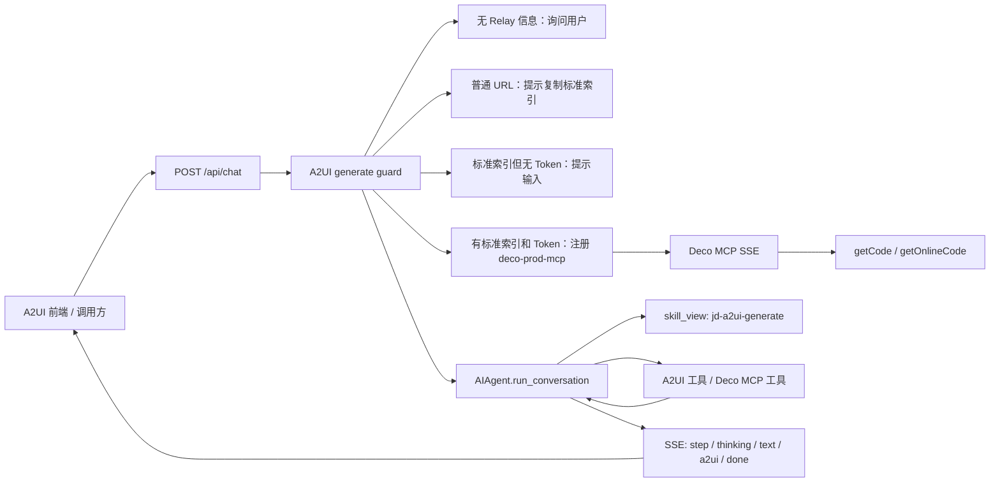
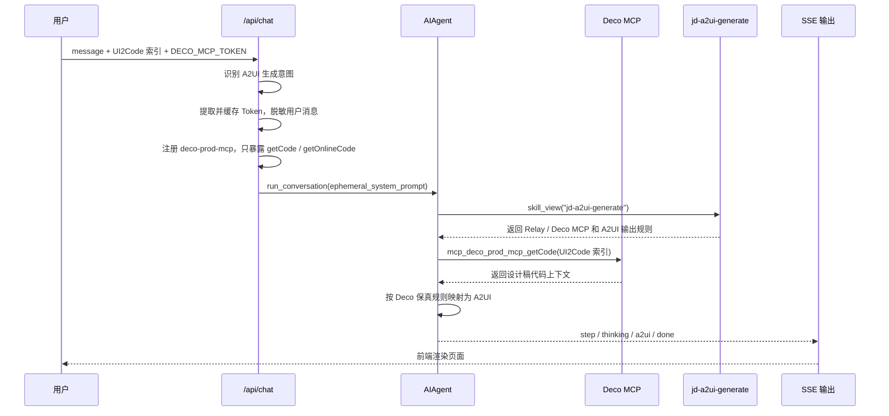
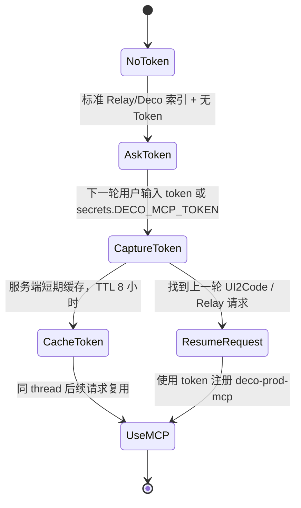

# `/api/chat` 接入 Relay / Deco MCP 实现说明

本文档用于说明 `jd/dev-20260511` 相比 `jd/dev-20260509` 的 `/api/chat` 相关基础改动，以及本次 Codex 对话中围绕“`/api/chat` 触发 A2UI 生成时接入 Relay / Deco MCP”继续形成的实现方案、代码改动、测试用例和后续验证入口。

文档目标不是只列文件清单，而是把这次需求演进中的关键判断也沉淀下来，方便后续维护者理解：为什么只作用在 `jd-a2ui-generate`，为什么不改 `run_agent.py` 主循环，为什么 Token 要在进入 Agent 前拦截，以及为什么普通 Relay URL 不能直接调 MCP。

## 1. 需求背景

已有 A2UI 扩展化接入解决了“根据自然语言生成 / 编辑 A2UI 页面”的基础问题，但真实业务里经常存在已经画好的 Relay 设计稿。Relay 是公司内部类似 Figma 的 UI 设计工具，Deco MCP 是 Relay 官方提供的设计稿转代码能力。

如果用户已经有 Relay 设计稿，A2UI 生成链路应该优先读取设计上下文，而不是只根据一句自然语言重新设计页面。否则容易出现几个问题：

- 页面结构和设计稿不一致。
- 图片 URL、文字层级、间距、颜色、圆角等视觉细节被模型重新发挥。
- 用户需要手动描述大量已经存在于设计稿里的信息。
- A2UI 生成结果只能“像”，不能稳定“还原”。

JoySpace 文档给出的 Deco MCP 服务形态是：

```text
http://mcp-gateway.jd.com/mcp/deco-mcp-server-prod/sse?token=...
```

核心工具是：

| 工具 | 作用 |
| --- | --- |
| `getCode` | 根据 Relay 图层索引获取设计稿代码 |
| `getOnlineCode` | 根据在线会话索引获取代码文件 |

本次目标是在 Hermes `/api/chat` 兼容层里把这条能力接入 A2UI 生成场景，同时继续遵守原来的扩展化原则：**不复制旧项目运行时，不改 Agent 主循环，只在业务兼容层、skill、MCP transport 和测试文档里收口。**

## 2. 分支基础：`jd/dev-20260511` 相比 `jd/dev-20260509`

本次 Relay / Deco MCP 接入不是从零开始，而是建立在 `jd/dev-20260511` 的 `/api/chat` 基础增强之上。

对比命令：

```bash
git diff --stat jd/dev-20260509..jd/dev-20260511
git diff --name-status jd/dev-20260509..jd/dev-20260511
```

实际差异：

```text
agent/prompt_builder.py                      |  16 +-
gateway/platforms/api_server.py              | 261 +++++++++++++++++++++++++--
hermes_cli/config.py                         |   4 +-
hermes_cli/default_soul.py                   |  25 ++-
tests/gateway/test_api_server_a2ui_compat.py | 237 ++++++++++++++++++++++--
5 files changed, 496 insertions(+), 47 deletions(-)
```

这部分主要提供了几个后续接入 Relay / Deco MCP 必须依赖的基础能力：

- `/api/chat` 增加中文语言守卫，要求可见回答和 thinking / reasoning 使用简体中文。
- `/api/chat` 支持 `thinking` SSE 事件，能把模型的 reasoning 或 `<think>` 内容单独转发。
- 新增 `InlineThinkTagStreamExtractor`，兼容模型把 `<think>...</think>` 混在正文流里的情况。
- 新增 A2UI 历史压缩，避免历史里的完整 A2UI JSON 反复进入上下文。
- 新增 A2UI edit guard：有持久化页面状态时，编辑场景强制走 `jd-a2ui-edit` 并读取当前状态。
- 前端模型字段以 `modelName` 为正式入参，继续兼容 `model_name`、`model` 等历史别名。

因此，`jd/dev-20260511` 的重点是 `/api/chat` 的语言、thinking、编辑守卫和历史上下文稳定性；本次 Relay / Deco MCP 接入是在这个基础上继续处理“生成前是否读取设计稿”的问题。

## 3. 本次需求内容

本次实现目标可以拆成 7 类。

第一类：只针对 A2UI 生成场景接入 Relay / Deco MCP。

- 触发点是 `/api/chat` 自动进入 `jd-a2ui-generate` 的生成场景。
- 不放到 `jd-a2ui-edit`。
- 不影响普通聊天。
- 不改 `run_agent.py` 主循环。

第二类：生成前先处理 Relay 设计稿来源。

- 本轮没有 Relay 信息：先询问用户是否有 Relay 链接或 MCP 请求索引。
- 用户明确没有：下一轮按自然语言需求生成。
- 用户给普通 Relay / Zero URL：提示复制标准 MCP 请求索引，不直接拿普通 URL 调 MCP。
- 用户给标准索引：优先走 Deco MCP。

第三类：接入 Deco MCP。

- 支持旧式 SSE transport。
- 按需注册 `deco-prod-mcp`。
- 只暴露 `getCode` / `getOnlineCode`。
- 预计模型侧工具名稳定为：
  - `mcp_deco_prod_mcp_getCode`
  - `mcp_deco_prod_mcp_getOnlineCode`

第四类：降低用户 Token 使用成本。

- 不要求用户手动修改 `.env` 或 `config.yaml`。
- 当前实现不从环境变量兜底读取 `DECO_MCP_TOKEN`。
- Token 唯一来源是用户本轮输入或同一 thread 的短期临时缓存。
- 推荐前端通过请求体 `secrets.DECO_MCP_TOKEN` 传入。

第五类：敏感输入要在进入 Agent 前拦截。

- `DECO_MCP_TOKEN=xxx`
- `DECO_MCP_TOKEN: xxx`
- `DECO_MCP_TOKEN是xxx`
- `我的 token 是 xxx`
- 只输入裸 token

这些都不应该直接进入模型上下文。服务端先识别当前是否正在等待敏感字段，再提取候选 secret，存入 thread 临时缓存或用于本轮 MCP 注册。

第六类：Deco 代码要高保真转 A2UI。

- Deco 返回的 DOM / template / style / structSchema 是权威设计来源。
- 不把设计稿 CSS 当成“artifact”随意简化。
- 图片 URL、固定尺寸、负 margin、overflow、滚动容器、wrapper 等都要尽量保留视觉语义。
- 最终仍输出 A2UI JSON 数组，不输出 Vue / React / Taro 代码。

第七类：继续强化中文输出。

- 模型有时会用英文输出，尤其是 thinking / reasoning。
- 本次后续又抽出了共享 `CHINESE_LANGUAGE_POLICY`，让默认身份、默认 `SOUL.md` 和 `/api/chat` hidden prompt 共用同一套中文规则。

## 4. Codex 对话过程复盘

这次需求不是一次性定稿，而是在真实对话和前端反馈中逐步收敛。下面按时间顺序记录关键节点。

| 阶段 | 用户反馈 / 需求 | Codex 结论 | 落地结果 |
| --- | --- | --- | --- |
| 1 | 最初说触发 `jd-a2ui-edit`，随后更正为 `jd-a2ui-generate` | Relay / Deco MCP 只应进入生成链路，编辑链路继续走当前页面状态 | `/api/chat` 的 generate guard 和 edit guard 分开处理 |
| 2 | 给出计划，要求实现 `/api/chat` 接入 Deco MCP，尽量不动主循环 | 改动收口在 API 兼容层、generate skill、MCP transport 和测试 | 未改 `run_agent.py` 主循环 |
| 3 | 要求打开 JoySpace 文档理解 Deco MCP | Deco MCP 是 SSE 服务，工具是 `getCode`、`getOnlineCode`，普通 Relay URL 不能直接作为 MCP 入参 | 新增 Deco MCP 使用规则和普通 URL 引导 |
| 4 | 提供 3 个可测试的 UI2Code 索引，并要求补充测试用例文档 | 这些索引来自同一个 Relay 设计稿，可作为 P0 真实用例 | 写入 `A2UI能力测试用例.md` 的 TD-006 / TD-007 / TD-008 和 TC-016 / TC-017 / TC-018 |
| 5 | 要求打开 Chrome 核对 3 个索引是否取自 Relay UI | 在 Relay 设计稿中核对图层：订单-待收货、编组 8、换肤 1 | 确认 3 个 `generateId` 和尺寸信息可作为用例 |
| 6 | 没有 `DECO_MCP_TOKEN` 时，不要回复长配置教程，只提醒用户输入 | 缺 Token 是用户交互问题，不应让模型输出 `.env` / `config.yaml` 教程 | guard 改为短句提醒并立刻结束 |
| 7 | 用户输入裸 UUID 后被模型当普通 ID 理解 | Token 不能交给模型理解，应在 `/api/chat` 进入 Agent 前拦截 | 增加 thread 级临时 secret 缓存和 token 回复恢复原请求 |
| 8 | `DECO_MCP_TOKEN是xxx` 没被通用正则吃进去，但用户反对硬编码中文“是” | 正确方案是“等待哪个敏感字段”驱动的通用捕获，而不是某个连接词白名单 | 改为状态驱动的 `_extract_pending_secret_value()` 和通用候选提取 |
| 9 | 获取 Token 成本都交给用户，想减轻工作量 | 推荐前端请求体 `secrets.DECO_MCP_TOKEN`，后端不持久化、不进模型、不进 memory | 新增 body secrets 支持和 `Deco MCP使用手册.md` |
| 10 | 真实 `/api/chat` 例子要求跑通 | 已准备真实调用链路和测试请求，但该轮被中断 | 文档保留真实调用命令，后续需要继续执行端到端验证 |
| 11 | 大模型 API 输出有时是英文，尤其 thinking | 语言约束应在模型入口做，而不是前端翻译 | 新增共享 `agent/language_policy.py`，默认身份、默认 SOUL、`/api/chat` 都复用 |

这段过程里最重要的设计变化有两个：

1. `DECO_MCP_TOKEN` 不再按“配置项”处理，而是按“用户本轮授权的敏感输入”处理。
2. `DECO_MCP_TOKEN是xxx` 这类输入不是靠硬编码中文句式解决，而是靠“上一轮正在等待敏感字段”这个上下文状态解决。

## 5. 设计原则

### 5.1 不改 Hermes Agent 主循环

`run_agent.py` 仍然负责核心 Agent 循环、工具调用、消息回填和模型请求。

本次没有在主循环里加入 Relay / Deco 判断，也没有新增第二套运行时。

新增逻辑集中在：

- `/api/chat` 兼容层：判断是否需要问 Relay、注册 Deco MCP、拦截敏感 Token。
- `jd-a2ui-generate` skill：告诉模型如何使用 Relay / Deco MCP 和如何保真转 A2UI。
- MCP 客户端：补 SSE transport 和工具别名能力。
- 测试：覆盖 guard、MCP 注册、Token 拦截、skill 文案和 SSE transport。

### 5.2 `/api/chat` 只做很窄的生成 guard

原 A2UI 扩展化文档强调 `/api/chat` 是通用接口，不应变成 A2UI 专用 runtime。这个原则仍然成立。

但本次需求有一个业务前置动作：**进入 A2UI 生成前必须先询问或读取 Relay 设计稿。**

因此这里不是把 A2UI 生成逻辑搬进 `/api/chat`，而是增加一个很窄的 hidden guard：

- 只在 A2UI 生成意图命中时生效。
- 强制先加载 `skill_view(name="jd-a2ui-generate")`。
- 决定本轮是询问 Relay、提示复制标准索引、提示输入 Token，还是启用 Deco MCP。
- 最终生成仍由 skill + Agent + 工具调用完成。

### 5.3 普通 Relay URL 不是 MCP 入参

普通网页 URL 示例：

```text
https://relay.jd.com/file/design?id=1994043870924509185&page_id=0%3A2&mode=dev&node_id=1%3A2
```

这个 URL 只能让浏览器打开设计稿页面，不能直接告诉 Deco MCP 读取哪个图层。

标准索引示例：

```text
//UI2Code?generateId=2008188023988027393&inspectRatio=1&rect=0_0_375_812&styleUnit=px&type=vue
```

或：

```text
Relay://Deco?generateId=1971482321706033153&inspectRatio=1&inspectType=react-taro&inspectUnit=px
```

只有标准索引才能进入 `getCode` / `getOnlineCode`。

### 5.4 Token 先进服务端拦截，不能交给模型理解

Token 属于敏感值。即使用户把 Token 写在普通聊天里，也不能让模型自己理解后再决定如何处理。

服务端要先做三件事：

1. 判断上一轮是否正在等待某个敏感字段。
2. 从本轮输入中提取 secret 候选。
3. 在进入 Agent 前把敏感值保存到短期缓存或用于 MCP 注册，并把用户消息中的明文 Token 脱敏。

这样可以避免：

- Token 被写入模型上下文。
- Token 被保存进对话历史。
- Token 被 memory 工具误存。
- 模型把 UUID 当成普通业务 ID 继续问用户。

### 5.5 Token 不做持久化配置

最初计划里考虑过 `DECO_MCP_TOKEN` 环境变量，但后续用户明确反馈：没有 Token 时应该提醒输入，而不是让用户去 `.env` / `config.yaml` 里配置。

当前实现遵守这个方向：

- 不从 `.env` 读取。
- 不从进程环境变量读取。
- 不写入 Hermes memory。
- 不写入配置文件。
- 同一 thread 只做短期内存缓存，默认 TTL 为 8 小时。

推荐前端用隐藏请求字段传：

```json
{
  "message": "使用 Deco getCode 工具获取设计稿代码 //UI2Code?generateId=2008188023988027393&inspectRatio=1&rect=0_0_375_812&styleUnit=px&type=vue 获取到代码后根据代码生成页面",
  "threadId": "deco-demo-thread",
  "imageList": [],
  "enableIntentThinking": false,
  "enableIntentSearch": false,
  "secrets": {
    "DECO_MCP_TOKEN": "用户本轮输入的 token"
  }
}
```

如果只能通过聊天输入，也支持：

```text
DECO_MCP_TOKEN=用户本轮输入的 token
```

或：

```text
我的 token 是 用户本轮输入的 token
```

但不建议把真实 Token 写进文档、测试数据、截图或提交记录。

### 5.6 Thinking / reasoning 也必须中文

真实联调里发现，大模型 API 的可见回答有时会英文，thinking / reasoning 更容易英文。

这类问题不能靠前端翻译解决，因为：

- thinking SSE 是模型流式输出的一部分。
- 翻译会改变用户看到的推理内容。
- A2UI JSON 流式解析不能被后处理文本污染。

因此后续新增了共享语言规则：

文件：[agent/language_policy.py](/Users/fenggongye1/Downloads/pythonProject/jdt-hermes-agent/agent/language_policy.py)

三处复用：

- [agent/prompt_builder.py](/Users/fenggongye1/Downloads/pythonProject/jdt-hermes-agent/agent/prompt_builder.py)
- [hermes_cli/default_soul.py](/Users/fenggongye1/Downloads/pythonProject/jdt-hermes-agent/hermes_cli/default_soul.py)
- [gateway/platforms/api_server.py](/Users/fenggongye1/Downloads/pythonProject/jdt-hermes-agent/gateway/platforms/api_server.py)

## 6. 总体架构



这个架构的重点是：`/api/chat` 做的是“生成前的业务 guard 和工具注册”，真正生成页面仍在 Hermes Agent 体系内完成。

## 7. `/api/chat` 时序图



## 8. Token 状态机



关键点：

- `DECO_MCP_TOKEN是xxx`、`DECO_MCP_TOKEN=xxx`、裸 token、自然语言 token 回复都走同一套捕获逻辑。
- 判断依据不是某个固定中文连接词，而是“上一轮是否在等待敏感字段”。
- 如果下一轮用户重新发的是 URL、UI2Code 索引或 JSON 结构，不会把里面的 `generateId` 误识别为 Token。

## 9. 关键代码改动

### 9.1 API 兼容层

文件：[gateway/platforms/api_server.py](/Users/fenggongye1/Downloads/pythonProject/jdt-hermes-agent/gateway/platforms/api_server.py)

新增或增强能力：

- `DECO_MCP_SERVER_NAME`
- `DECO_MCP_TOKEN_ENV`
- `DECO_MCP_URL`
- `DECO_MCP_TOOL_NAMES`
- `_looks_like_a2ui_generate_request()`
- `_has_deco_mcp_index()`
- `_has_plain_relay_reference()`
- `_declines_relay_context()`
- `_a2ui_generate_guard_system_prompt()`
- `_extract_api_chat_body_secrets()`
- `_extract_api_chat_sensitive_input()`
- `_extract_pending_secret_value()`
- `_redact_sensitive_value_from_message()`
- `_register_deco_mcp_for_api_chat()`
- `_write_simple_api_chat_text()`

主要职责：

- 识别 A2UI 生成请求。
- 识别标准 Relay / Deco MCP 索引。
- 区分普通 Relay URL 和标准 MCP 索引。
- 在缺少 Relay 信息时先询问。
- 在缺少 Token 时短句提醒。
- 从 `secrets` 或用户消息中提取敏感 Token。
- 同一 thread 内短期缓存 Token。
- 在有 Token 时按需注册 `deco-prod-mcp`。
- 将 Deco MCP 工具步骤标题转换为中文前端 `step`。

### 9.2 MCP 客户端

文件：[tools/mcp_tool.py](/Users/fenggongye1/Downloads/pythonProject/jdt-hermes-agent/tools/mcp_tool.py)

新增能力：

- 支持 `transportType: "sse"` / `transport: "sse"` / `transport_type: "sse"`。
- 使用 `mcp.client.sse.sse_client()` 建立 legacy SSE transport。
- 保留原有 stdio 和 StreamableHTTP 行为。
- 支持 MCP 工具 public alias。
- 支持 include / exclude 同时匹配原始工具名和 alias 后工具名。

为什么需要 alias：

Deco MCP 实际暴露的工具名可能因为服务端实现带后缀或内部命名差异。为了让模型侧工具名稳定，本次配置允许把远端 `getCode` 或 `getCode_*` 统一暴露为：

```text
mcp_deco_prod_mcp_getCode
```

把远端 `getOnlineCode` 或 `getOnlineCode_*` 统一暴露为：

```text
mcp_deco_prod_mcp_getOnlineCode
```

### 9.3 A2UI generate skill

文件：[skills/jd/a2ui-generate/SKILL.md](/Users/fenggongye1/Downloads/pythonProject/jdt-hermes-agent/skills/jd/a2ui-generate/SKILL.md)

新增内容：

- Relay / Deco MCP 规则。
- 普通 Relay / Zero URL 处理规则。
- 标准图层索引和在线会话索引识别规则。
- 缺 Token 时只短句提醒。
- Deco MCP 返回代码后的保真转换规则。
- `Scroll`、完整 CSS styles、图片 URL、固定尺寸、overflow、wrapper 等高保真约束。
- 最终输出阶段必须只输出 A2UI JSON 数组。

其中最关键的是：Deco 返回代码后，模型不能“语义重画”页面，而要把代码作为权威设计来源。

### 9.4 中文语言策略

文件：

- [agent/language_policy.py](/Users/fenggongye1/Downloads/pythonProject/jdt-hermes-agent/agent/language_policy.py)
- [agent/prompt_builder.py](/Users/fenggongye1/Downloads/pythonProject/jdt-hermes-agent/agent/prompt_builder.py)
- [hermes_cli/default_soul.py](/Users/fenggongye1/Downloads/pythonProject/jdt-hermes-agent/hermes_cli/default_soul.py)
- [gateway/platforms/api_server.py](/Users/fenggongye1/Downloads/pythonProject/jdt-hermes-agent/gateway/platforms/api_server.py)

新增共享常量：

```text
CHINESE_LANGUAGE_POLICY
```

覆盖范围：

- 可见回答。
- 工具调用前后的自然语言说明。
- 错误说明。
- 计划和总结。
- `<think>` / `<thinking>`。
- `reasoning` / `reasoning_content`。

保留例外：

- 代码。
- JSON 字段名。
- 组件名。
- URL。
- 命令。
- 日志片段。
- API 名称和专有名词。

这些原文可以保留，但周围解释必须中文。

### 9.5 测试

主要测试文件：

- [tests/gateway/test_api_server_a2ui_compat.py](/Users/fenggongye1/Downloads/pythonProject/jdt-hermes-agent/tests/gateway/test_api_server_a2ui_compat.py)
- [tests/tools/test_mcp_tool.py](/Users/fenggongye1/Downloads/pythonProject/jdt-hermes-agent/tests/tools/test_mcp_tool.py)
- [tests/tools/test_a2ui_extension.py](/Users/fenggongye1/Downloads/pythonProject/jdt-hermes-agent/tests/tools/test_a2ui_extension.py)
- [tests/agent/test_prompt_builder.py](/Users/fenggongye1/Downloads/pythonProject/jdt-hermes-agent/tests/agent/test_prompt_builder.py)
- [tests/hermes_cli/test_config.py](/Users/fenggongye1/Downloads/pythonProject/jdt-hermes-agent/tests/hermes_cli/test_config.py)
- [tests/run_agent/test_run_agent.py](/Users/fenggongye1/Downloads/pythonProject/jdt-hermes-agent/tests/run_agent/test_run_agent.py)

覆盖点：

- `/api/chat` 普通聊天 hidden prompt 包含中文语言策略。
- A2UI 生成请求会注入 `jd-a2ui-generate` guard。
- 无 Relay 信息时会先询问。
- 普通 Relay URL 不会直接调 MCP。
- `//UI2Code?...` 被识别为标准 Deco MCP 索引。
- 缺 Token 时只短句提醒，不输出配置教程。
- Token 回复会恢复上一轮 UI2Code 请求。
- `DECO_MCP_TOKEN是xxx`、冒号、等号、裸 token、自然语言 token 回复都能被拦截。
- 等待 Token 时重新输入 UI2Code 索引不会被误识别为 Token。
- 请求体 `secrets.DECO_MCP_TOKEN` 优先使用。
- MCP 注册使用 SSE URL 查询参数 `?token=...`，不使用 Header。
- 不从环境变量 `DECO_MCP_TOKEN` 读取。
- SSE transport 使用 `sse_client()`。
- `tools.include` / aliases 只暴露 `getCode` / `getOnlineCode`。

### 9.6 文档和真实测试用例

相关文档：

- [plans/03-A2UI能力/A2UI能力测试用例.md](/Users/fenggongye1/Downloads/pythonProject/jdt-hermes-agent/plans/03-A2UI能力/A2UI能力测试用例.md)
- [plans/03-A2UI能力/Deco MCP使用手册.md](/Users/fenggongye1/Downloads/pythonProject/jdt-hermes-agent/plans/03-A2UI能力/Deco MCP使用手册.md)

已补充 3 个 P0 Relay / Deco MCP 用例：

| 编号 | 图层 | 索引 |
| --- | --- | --- |
| TD-006 | 订单-待收货 | `//UI2Code?generateId=2005970572374179841&inspectRatio=1&rect=0_0_375_812&styleUnit=px&type=vue` |
| TD-007 | 编组 8 | `//UI2Code?generateId=2005838081986408449&inspectRatio=1&rect=0_0_714_733&styleUnit=px&type=vue` |
| TD-008 | 换肤 1 | `//UI2Code?generateId=2008188023988027393&inspectRatio=1&rect=0_0_375_812&styleUnit=px&type=vue` |

来源设计稿：

```text
https://relay.jd.com/file/design?id=1994043870924509185&page_id=0%3A2&mode=dev&node_id=1%3A2
```

Codex 过程中曾用 Chrome 打开设计稿核对图层和 `generateId`，确认这 3 个索引可以作为真实 getCode 用例。

## 10. 真实 `/api/chat` 调用方式

推荐方式：Token 放在 `secrets`，不要写入 message。

```bash
curl -N -X POST http://127.0.0.1:8642/api/chat \
  -H 'Content-Type: application/json' \
  -d '{
    "threadId": "deco-real-case-001",
    "modelName": "jd-api:GLM-5.1",
    "message": "使用 Deco getCode 工具获取设计稿代码 //UI2Code?generateId=2008188023988027393&inspectRatio=1&rect=0_0_375_812&styleUnit=px&type=vue 获取到代码后根据代码生成页面",
    "imageList": [],
    "enableIntentThinking": false,
    "enableIntentSearch": false,
    "secrets": {
      "DECO_MCP_TOKEN": "用户本轮输入的 token"
    }
  }'
```

兼容方式：Token 写在 message 中。服务端会尽量先拦截并脱敏，但不推荐用于长期使用。

```text
使用 Deco getCode 工具获取设计稿代码 //UI2Code?generateId=2008188023988027393&inspectRatio=1&rect=0_0_375_812&styleUnit=px&type=vue 获取到代码后根据代码生成页面，DECO_MCP_TOKEN=用户本轮输入的 token
```

预期事件：

```text
event: meta
event: step    # skill_view / Deco MCP / A2UI 工具
event: thinking
event: a2ui
event: done
```

预期行为：

1. `/api/chat` 识别 `//UI2Code?...` 为标准 Deco getCode 索引。
2. 服务端从 `secrets.DECO_MCP_TOKEN` 或用户消息中提取 Token。
3. 服务端注册 `deco-prod-mcp`，transport 为 `sse`。
4. 模型先加载 `jd-a2ui-generate`。
5. 模型调用 `mcp_deco_prod_mcp_getCode`。
6. 模型按 Deco 保真规则输出 A2UI JSON 数组。
7. 前端收到 `a2ui` 事件并渲染页面。

注意：Codex 对话中曾开始执行真实本地 `/api/chat` 调用准备，但该轮被用户中断。因此本文档保留真实调用入口，后续仍需要继续按本节命令完成端到端验证。

## 11. 验证记录

Codex 对话中已执行过的自动化验证包括：

```bash
source venv/bin/activate
scripts/run_tests.sh tests/gateway/test_api_server_a2ui_compat.py
```

结果：

```text
47 passed
```

Relay / Deco MCP 目标测试集：

```bash
source venv/bin/activate
scripts/run_tests.sh tests/tools/test_mcp_tool.py tests/gateway/test_api_server_a2ui_compat.py tests/tools/test_a2ui_extension.py tests/hermes_cli/test_config.py
```

结果：

```text
293 passed
```

中文语言策略相关回归：

```bash
source venv/bin/activate
scripts/run_tests.sh tests/agent/test_prompt_builder.py tests/hermes_cli/test_config.py tests/gateway/test_api_server_a2ui_compat.py
```

结果：

```text
215 passed, 1 skipped
```

默认 Agent prompt 相关回归：

```bash
source venv/bin/activate
scripts/run_tests.sh tests/run_agent/test_run_agent.py
```

结果：

```text
284 passed
```

后续提交前建议再跑一次当前最新目标集：

```bash
source venv/bin/activate
scripts/run_tests.sh \
  tests/tools/test_mcp_tool.py \
  tests/gateway/test_api_server_a2ui_compat.py \
  tests/tools/test_a2ui_extension.py \
  tests/agent/test_prompt_builder.py \
  tests/hermes_cli/test_config.py \
  tests/run_agent/test_run_agent.py
```

## 12. 关键代码走查路线

### 第 1 步：先看分支基础改动

对比：

```bash
git diff jd/dev-20260509..jd/dev-20260511 -- gateway/platforms/api_server.py
```

重点看：

- `InlineThinkTagStreamExtractor`
- `_compact_api_chat_history_for_a2ui`
- `API_CHAT_CHINESE_LANGUAGE_GUARD`
- `_a2ui_edit_guard_system_prompt`
- `/api/chat` 的 `reasoning_callback`

你要确认：`jd/dev-20260511` 是后续 Relay / Deco MCP 生成 guard 的基础，不是 Deco MCP 本身。

### 第 2 步：看 A2UI 生成 guard

文件：[gateway/platforms/api_server.py](/Users/fenggongye1/Downloads/pythonProject/jdt-hermes-agent/gateway/platforms/api_server.py)

重点方法：

- `_looks_like_a2ui_generate_request`
- `_a2ui_generate_guard_system_prompt`
- `_has_deco_mcp_index`
- `_has_plain_relay_reference`
- `_declines_relay_context`

你要确认：

- 生成和编辑走不同 guard。
- 普通聊天不会被 A2UI 生成 guard 影响。
- 用户明确没有 Relay 时，不会反复追问。
- 普通 Relay URL 不会被当 MCP 入参。

### 第 3 步：看 Token 拦截

重点方法：

- `_extract_api_chat_body_secrets`
- `_extract_api_chat_sensitive_input`
- `_history_pending_sensitive_env_name`
- `_extract_pending_secret_value`
- `_extract_secret_candidate`
- `_redact_sensitive_value_from_message`
- `_store_api_chat_thread_secret`
- `_get_api_chat_thread_secret`

你要确认：

- Token 不进模型。
- Token 不进 memory。
- Token 不靠 `.env`。
- Token 可以通过 `secrets`、显式字段、自然语言回复、裸 token 输入。
- 等待 Token 时不会把 UI2Code 里的 `generateId` 当 Token。

### 第 4 步：看 Deco MCP 注册

重点方法：

- `_register_deco_mcp_for_api_chat`

你要确认：

- URL 是 `http://mcp-gateway.jd.com/mcp/deco-mcp-server-prod/sse?token=...`。
- `transportType` 是 `sse`。
- 只 include `getCode` / `getOnlineCode`。
- 使用 aliases 暴露稳定工具名。
- 没有 headers / Authorization Bearer 方案。

### 第 5 步：看 MCP transport

文件：[tools/mcp_tool.py](/Users/fenggongye1/Downloads/pythonProject/jdt-hermes-agent/tools/mcp_tool.py)

重点看：

- `_MCP_SSE_AVAILABLE`
- `MCPServerTask._is_sse`
- `MCPServerTask._run_sse`
- `_is_sse_transport_config`
- `_normalize_tool_aliases`
- `_resolve_tool_alias`
- `_convert_mcp_schema(..., tool_name_override=...)`

你要确认：

- SSE 是显式配置才走，不影响普通 HTTP。
- stdio 和 StreamableHTTP 行为不变。
- 工具过滤和工具别名能同时工作。

### 第 6 步：看 generate skill

文件：[skills/jd/a2ui-generate/SKILL.md](/Users/fenggongye1/Downloads/pythonProject/jdt-hermes-agent/skills/jd/a2ui-generate/SKILL.md)

重点看：

- `Relay / Deco MCP 规则`
- `Deco 代码保真转换规则`
- `Scroll` 和完整 CSS styles 约束
- 输出前自查

你要确认：

- Relay 询问阶段允许中文问题。
- 最终生成阶段只能输出 JSON 数组。
- Deco 代码不能被模型当灵感参考后重画。

## 13. 已知限制和后续优化

### 13.1 真实端到端调用还需要继续补跑

自动化测试已覆盖大部分分支，但真实 Deco MCP 调用依赖：

- 本机 API server。
- JD 模型服务。
- 公司网络。
- Relay / Deco MCP 服务。
- 用户本轮有效 Token。

之前真实调用轮次被中断，因此后续仍要用 TD-008 真实请求跑通一次，并检查前端画布是否生成非空页面。

### 13.2 Token 获取仍需要用户登录 Relay

当前只能减少 Token 配置成本，不能完全消除 Token 获取动作。

较低成本方案是：

- 前端提供一个专门输入 Token 的安全输入框。
- 前端把 Token 放到 `secrets.DECO_MCP_TOKEN`。
- 后端只做短期缓存。

不建议：

- 把 Token 固化进 `.env`。
- 把 Token 写进 `config.yaml`。
- 让模型调用浏览器自己去取 Token。
- 把真实 Token 写进文档或测试 fixture。

### 13.3 Token 缓存是进程内短期缓存

当前 `_api_chat_thread_secrets` 是进程内字典。

这适合本地开发和单实例联调，但不适合多实例部署。如果后续需要多实例，可以考虑：

- 前端每次都通过 `secrets` 传 Token。
- 或者引入加密的短期服务端会话存储。

### 13.4 Deco MCP 失败要区分类型

当前主要状态是：

- `missing_token`
- `available`
- `unavailable`

后续真实联调时可以继续细化：

- Token 过期。
- 网络不通。
- MCP 服务返回 `RESOURCE_EXHAUSTED`。
- 标准索引无效。
- 工具名变化。

### 13.5 模型仍可能不稳定调用 MCP

即使 guard 和 skill 都写得很明确，模型仍可能出现：

- 没调用 Deco MCP。
- 调了组件工具但没调 Deco MCP。
- 拿到 Deco 代码后语义重画。
- 输出非 JSON 解释文字。

当前已通过 hidden prompt 和 skill 双层约束降低风险。后续如果真实用例仍不稳定，可以继续强化：

- 增加 few-shot 示例。
- 对 Deco MCP 工具结果做结构化摘要。
- 在工具结果里加入“必须保真转换”的系统级提醒。
- 对最终输出增加服务端校验和重试。

### 13.6 中文策略是强约束，不是模型能力保证

共享 `CHINESE_LANGUAGE_POLICY` 已经覆盖默认身份、默认 SOUL 和 `/api/chat` hidden prompt，但如果底层模型强烈倾向英文，仍可能偶发英文 thinking。

如果还发生，可以考虑：

- 在具体 JD provider / transport 层追加更靠近模型请求的 language hint。
- 对 thinking SSE 做可选检测和告警。
- 对真实联调用例加入“thinking 不应出现大段英文”的人工验收项。

## 14. 后续维护建议

1. 先把真实 TD-008 `/api/chat` 请求跑通，确认能调用 `mcp_deco_prod_mcp_getCode` 并生成非空 A2UI 页面。
2. 再跑 TD-006 / TD-007，覆盖不同尺寸和不同图层结构。
3. 如果真实调用失败，优先看 `/api/chat` SSE 中的 `step` 事件，确认是否注册并调用了 Deco MCP。
4. 如果工具没出现，先检查 Token 来源和标准索引识别。
5. 如果工具调用成功但页面不像设计稿，优先调整 `jd-a2ui-generate` 的 Deco 保真规则，而不是改主循环。
6. 如果模型输出英文 thinking，优先检查系统 prompt 是否包含 `CHINESE_LANGUAGE_POLICY`。
7. 后续新增 MCP 工具时，优先复用 `transportType: "sse"`、`tools.include`、`tools.aliases` 这套通用机制，不要为某个服务硬编码工具名。
