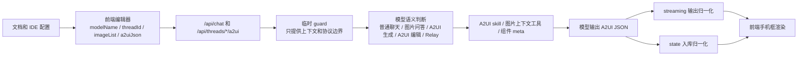

# jd/dev-20260513 A2UI 当前待提交代码走查手册

本文目标：帮助你按 `jd/dev-20260513` 分支上的“当前所有待提交变更”走查代码和配套文档，确认本轮改动没有遗漏关键链路、没有把用户意图识别写死在服务端、没有破坏普通聊天、A2UI 页面生成和前端联调入口。

读法建议：不要只看某个报错点，也不要只看新文件。先用 `git status` 建立待提交清单，再按“接口入口、A2UI 状态、生成约束、测试、文档和本地配置”五层走。凡是 `git status --short` 里出现的文件，都必须被归类说明。

## 0. 先建立全局判断

当前待提交变更可以理解成下面这条链：



走查时始终抓住 6 条红线：

| 红线 | 说明 |
|---|---|
| 待提交清单全覆盖 | `git status --short --untracked-files=all` 里出现的每个文件都要在结果文档里有结论 |
| 不硬编码用户意图 | 服务端不能靠关键词判断用户是否要 A2UI；只能给模型上下文和边界 |
| 普通聊天不能被 A2UI 规则误伤 | 每轮注入的 guard 必须把 JSON-only 约束限定在 A2UI JSON 输出阶段 |
| 前端新字段优先 | `modelName`、`threadId`、`imageList`、`a2uiJson` 是正式字段，历史字段只做兼容 |
| 手机框渲染稳定 | 图片尺寸、长截图高度、窄按钮、装饰字符都不能导致页面错位 |
| 文档必须和代码一致 | 既有 A2UI 文档、Relay 文档、联调文档、目录索引、本地持久化说明都要和代码行为一致 |

## 1. 准备走查环境

先确认当前待提交范围：

```bash
cd /Users/fenggongye1/Downloads/pythonProject/jdt-hermes-agent
git status --short --untracked-files=all
git diff --stat
git diff --name-status
git ls-files --others --exclude-standard
```

建议先跑核心测试，确认走查对象处于可验证状态：

```bash
source venv/bin/activate
scripts/run_tests.sh tests/tools/test_a2ui_extension.py \
  tests/gateway/test_api_server_a2ui_compat.py::TestA2UICompatChat::test_a2ui_generate_guard_asks_for_relay_before_generation \
  tests/gateway/test_api_server_a2ui_compat.py::TestA2UICompatChat::test_a2ui_generate_guard_treats_image_as_context_for_model_to_decide \
  tests/gateway/test_api_server_a2ui_compat.py::TestA2UICompatChat::test_api_chat_image_list_accepts_frontend_camel_case_alias \
  tests/gateway/test_api_server_a2ui_compat.py::TestA2UICompatChat::test_api_chat_generic_image_list_passes_image_context_without_forcing_intent \
  tests/gateway/test_api_server_a2ui_compat.py::TestA2UICompatChat::test_api_chat_relay_decline_after_image_source_reuses_uploaded_context
```

最后跑格式和尾随空白检查：

```bash
git diff --check
```

## 2. 走查范围分层

| 层级 | 文件 | 走查目的 |
|---|---|---|
| 必须逐行看 | `gateway/platforms/api_server.py` | `/api/chat`、`/api/threads/*/a2ui` 字段兼容、guard、图片上下文、A2UI 状态读写 |
| 必须逐行看 | `jd_a2ui/state.py` | A2UI 快照校验、单组件拆分、缺失 `beginRendering` 补全、按钮归一化入库 |
| 必须逐行看 | `jd_a2ui/normalization.py` | `WealthButton` 文案兜底是否通用、窄作用域、非硬编码 |
| 必须重点看 | `jd_a2ui/streaming.py` | SSE `a2ui` 事件发出前是否做归一化 |
| 必须重点看 | `jd_a2ui/catalog.py` | `styleContract` 是否包含手机框、Scroll、按钮、形状节点规则 |
| 必须重点看 | `skills/jd/a2ui-generate/SKILL.md` | 模型生成 SOP 是否和服务端 guard、组件契约一致 |
| 支线抽查 | `tools/a2ui_tools.py` | 图片上下文工具是否强调“图片不一定是设计源” |
| 测试验证 | `tests/tools/test_a2ui_extension.py` | catalog、skill、normalization、streaming、state 测试覆盖 |
| 测试验证 | `tests/gateway/test_api_server_a2ui_compat.py` | API 字段、图片、guard、状态保存兼容测试覆盖 |
| 配置核对 | `.idea/runConfigurations/Hermes_API_Server.xml` | 本地 API Server CORS origin 是否包含新旧前端域名和本地地址 |
| 文档核对 | `plans/03-A2UI能力/*.md`、`plans/04-部署联调/*.md`、`plans/目录索引.md` | 文档参数名、域名、链路说明是否和代码一致 |
| 文档核对 | `plans/01-源码学习/本地持久化存储说明.md` | 本地持久化说明是否符合 `HERMES_HOME`、数据库和缓存真实结构 |

## 3. 第一步：按 git 清单建立走查台账

执行：

```bash
git status --short --untracked-files=all
git diff --stat
git ls-files --others --exclude-standard
```

走查要求：

| 检查点 | 正确结果 | 危险信号 |
|---|---|---|
| 修改文件 | 每个修改文件都能归到运行时代码、测试、配置或文档 | 有文件在结果文档里完全没提 |
| 未跟踪文件 | 新增源码和新增文档都被纳入走查 | 只看 `git diff`，漏掉 untracked |
| 文档范围 | 新增走查手册和结果文档本身也进入待提交清单 | 文档名和内容仍只描述局部问题 |

## 4. 第二步：走查 `/api/chat` 和 A2UI API 入口

执行：

```bash
nl -ba gateway/platforms/api_server.py | sed -n '560,685p'
nl -ba gateway/platforms/api_server.py | sed -n '1620,1656p'
nl -ba gateway/platforms/api_server.py | sed -n '1896,2175p'
nl -ba gateway/platforms/api_server.py | sed -n '2440,2478p'
rg -n "_looks_like_a2ui|关键词硬编码|modelName|threadId|imageList|a2uiJson|hold_text_until_a2ui" gateway/platforms/api_server.py
```

重点确认：

| 检查点 | 正确结果 |
|---|---|
| 用户意图 | 不再有 `_looks_like_a2ui_request`、`_looks_like_a2ui_generate_request`、`_looks_like_a2ui_edit_request` 这种关键词入口判断 |
| guard 边界 | guard 只提供上下文和协议边界，让模型判断普通聊天、图片问答、A2UI、Relay |
| 普通聊天保护 | “不要输出 Markdown/解释文字”这类约束必须限定为“进入 A2UI JSON 输出阶段” |
| 前端字段 | `modelName`、`threadId`、`imageList` 优先，`model_name`、`thread_id`、`images` 只做历史兼容 |
| 图片上下文 | 图片以多模态输入传给 Agent，并保存为可选上下文；不能因为有图片就强制 A2UI |
| A2UI 快照写入 | `a2uiJson`、`a2ui_json` 和裸数组都要能被 `_a2ui_json_body_value()` 读取 |
| 缺 payload | PUT 缺少 `a2uiJson/a2ui_json` 时返回 400，不能静默清空已有状态 |

## 5. 第三步：走查 A2UI 状态和按钮归一化

执行：

```bash
nl -ba jd_a2ui/state.py | sed -n '1,120p'
nl -ba jd_a2ui/normalization.py | sed -n '1,180p'
nl -ba jd_a2ui/streaming.py | sed -n '1,80p'
```

重点确认：

| 检查点 | 正确结果 |
|---|---|
| 状态校验 | `validate_a2ui_messages()` 先确认顶层数组和元素对象 |
| 快照拆分 | 多组件 `surfaceUpdate.components` 拆成多条单组件更新，方便编辑链路找父子关系 |
| root 补全 | 缺少 `beginRendering` 但能推断根组件时，自动补 `beginRendering` |
| 按钮范围 | `normalize_a2ui_component()` 只处理 `WealthButton` |
| 按钮宽度 | 根据 `props.text`、中英文字符宽度和 `fontSize` 计算最小宽度，不写死某个文案 |
| 输出兜底 | streaming 和 state 两条路径都调用归一化 |

## 6. 第四步：走查生成约束和图片工具

执行：

```bash
nl -ba skills/jd/a2ui-generate/SKILL.md | sed -n '35,85p'
nl -ba skills/jd/a2ui-generate/SKILL.md | sed -n '235,245p'
nl -ba jd_a2ui/catalog.py | sed -n '280,355p'
nl -ba tools/a2ui_tools.py | sed -n '42,150p'
```

重点确认：

| 检查点 | 正确结果 |
|---|---|
| 图片来源 | 只有模型判断图片是 UI 设计来源时才调用 `read_uploaded_ui_context()` |
| 手机框 | 禁止把图片原始像素、查看大图弹窗宽度、长截图高度当 CSS 画布尺寸 |
| 长页面 | 使用 `root -> Scroll(vertical) -> content Layout` |
| 按钮 | `WealthButton` 有 `width/minWidth`、`flexShrink: 0`、`whiteSpace: nowrap`、正确 `lineHeight` |
| 装饰形状 | 进度线、圆点、竖向强调条用 `Layout` 节点，不用文本字符硬凑 |
| 工具 schema | `read_uploaded_ui_context` 描述图片只是上下文，不一定是设计源 |

## 7. 第五步：走查测试

执行：

```bash
nl -ba tests/tools/test_a2ui_extension.py | sed -n '70,155p'
nl -ba tests/tools/test_a2ui_extension.py | sed -n '260,280p'
nl -ba tests/tools/test_a2ui_extension.py | sed -n '515,555p'
nl -ba tests/gateway/test_api_server_a2ui_compat.py | sed -n '120,180p'
nl -ba tests/gateway/test_api_server_a2ui_compat.py | sed -n '560,610p'
nl -ba tests/gateway/test_api_server_a2ui_compat.py | sed -n '1100,1260p'
```

测试覆盖要回答：

1. `a2uiJson`、裸数组、`threadId`、`modelName`、`imageList` 是否有前端字段兼容测试。
2. 普通图片上下文是否不会强制 A2UI。
3. A2UI guard 是否强调模型语义判断，并且 JSON-only 约束只在 A2UI JSON 阶段生效。
4. `WealthButton` 在 state 和 streaming 两条路径是否都会归一化。
5. skill 和 styleContract 的移动端规则是否有断言防回退。

## 8. 第六步：走查文档和本地配置

执行：

```bash
git diff -- .idea/runConfigurations/Hermes_API_Server.xml \
  plans/03-A2UI能力/A2UI能力扩展化接入实现说明.md \
  plans/03-A2UI能力/api-chat接入Relay-Deco-MCP实现说明.md \
  plans/04-部署联调/A2UI前端本地联调启动指南.md \
  plans/目录索引.md
sed -n '1,260p' plans/01-源码学习/本地持久化存储说明.md
```

重点确认：

| 文件 | 检查点 |
|---|---|
| `.idea/runConfigurations/Hermes_API_Server.xml` | CORS origin 是否包含 `open-joycoder-jd-a2ui-editor-t.clear.jd.com`、旧域名、`pre-a2ui-manage.jd.com`、本地地址 |
| `A2UI能力扩展化接入实现说明.md` | `/api/chat` 入参是否改为 `modelName/message/imageList/threadId`，并说明历史字段兼容 |
| `api-chat接入Relay-Deco-MCP实现说明.md` | Deco 示例是否使用新字段，敏感 token 说明是否仍成立 |
| `A2UI前端本地联调启动指南.md` | 浏览器入口和 CORS 示例是否使用新前端域名并保留旧域名 |
| `本地持久化存储说明.md` | 是否说明 `HERMES_HOME`、`state.db`、`sessions/`、`response_store.db`、`a2ui_state.db` 和敏感文件 |
| `目录索引.md` | 新增文档是否能被索引找到 |

## 9. 常见问题定位表

| 现象 | 优先检查 |
|---|---|
| 普通聊天被要求输出 JSON | `gateway/platforms/api_server.py` 的 guard 是否把 JSON-only 约束限定到 A2UI JSON 阶段 |
| 图片问答误进入 A2UI | `/api/chat` 是否还有关键词判断；`read_uploaded_ui_context` schema 是否把图片说成必然设计源 |
| 前端传新字段无效 | `_api_chat_body_value()`、`_resolve_api_chat_model_override()`、`_a2ui_json_body_value()` |
| 保存 A2UI 后 GET 结构变了 | `validate_a2ui_messages()` 的 canonicalize 是否按预期拆分多组件快照 |
| 按钮文案折行 | `normalization.py`、`streaming.py`、`state.py` 是否都纳入 |
| 本地前端跨域 | `.idea` run config、联调文档、`API_SERVER_CORS_ORIGINS` |
| 文档和代码字段名不一致 | `plans/03-A2UI能力`、`plans/04-部署联调` 和测试里的 JSON 示例 |
