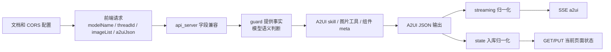

# jd/dev-20260513 A2UI 当前待提交代码走查结果

本文目标：按照《jd/dev-20260513 A2UI 当前待提交代码走查手册》实际走查当前工作区所有待提交变更，记录每个文件的结论、发现的问题、已修复内容、测试结果和剩余风险。

走查日期：2026-05-13。

## 1. 待提交范围

本次走查以如下命令为准：

```bash
git status --short --untracked-files=all
git diff --stat
git ls-files --others --exclude-standard
```

当前待提交文件分组如下：

| 分组 | 文件 |
|---|---|
| API 运行时代码 | `gateway/platforms/api_server.py` |
| A2UI 运行时代码 | `jd_a2ui/catalog.py`、`jd_a2ui/state.py`、`jd_a2ui/streaming.py`、`jd_a2ui/normalization.py`、`tools/a2ui_tools.py` |
| Skill | `skills/jd/a2ui-generate/SKILL.md` |
| 测试 | `tests/gateway/test_api_server_a2ui_compat.py`、`tests/tools/test_a2ui_extension.py` |
| 本地配置 | `.idea/runConfigurations/Hermes_API_Server.xml` |
| 既有文档更新 | `plans/03-A2UI能力/A2UI能力扩展化接入实现说明.md`、`plans/03-A2UI能力/api-chat接入Relay-Deco-MCP实现说明.md`、`plans/04-部署联调/A2UI前端本地联调启动指南.md`、`plans/目录索引.md` |
| 新增文档 | `plans/01-源码学习/本地持久化存储说明.md`、`plans/03-A2UI能力/jd-dev-20260513-A2UI当前待提交代码走查手册.md`、`plans/03-A2UI能力/jd-dev-20260513-A2UI当前待提交代码走查结果.md` |

## 2. 总体结论

本次待提交变更整体通过走查。核心结论：

1. `/api/chat` 已按前端正式字段 `modelName/threadId/imageList` 做兼容，同时保留历史别名。
2. 服务端删除了 A2UI 意图的关键词硬编码，改为每轮提供 guard，让模型按语义判断。
3. 图片上下文不会强制触发 A2UI；`read_uploaded_ui_context` 只作为模型可选工具。
4. A2UI 快照保存路径支持 `a2uiJson/a2ui_json/裸数组`，缺 payload 会 400，不会静默清空状态。
5. `WealthButton` 文案折行通过通用组件归一化兜底，streaming 和 state 两条路径都覆盖。
6. 既有文档、联调域名、IDE CORS 配置和测试用例已同步到新字段和新前端域名。

走查中发现并已修复 1 个问题：A2UI guard 每轮注入后，原本“不要输出 Markdown/解释文字”的句子可能误伤普通聊天。已改为“如果进入 A2UI JSON 输出阶段，不要输出 Markdown 代码块、解释文字或文件保存说明”，并补充测试断言。

## 3. 主链路结果



| 链路节点 | 文件 | 结论 | 风险 |
|---|---|---|---|
| 前端字段兼容 | `gateway/platforms/api_server.py` | 通过。`modelName` 优先，兼容 `model_name/model`；`threadId` 优先，兼容 `thread_id`；`imageList` 优先，兼容 `images/image_list` | 低 |
| 意图判断 | `gateway/platforms/api_server.py` | 通过。旧关键词函数已移除；guard 明确要求模型语义判断 | 低 |
| 普通聊天保护 | `gateway/platforms/api_server.py`、`tests/gateway/test_api_server_a2ui_compat.py` | 已修复。JSON-only 约束限定为 A2UI JSON 输出阶段 | 低 |
| A2UI 快照写入 | `gateway/platforms/api_server.py`、`jd_a2ui/state.py` | 通过。支持 `a2uiJson/a2ui_json/裸数组`，缺 payload 返回 400 | 低 |
| 多组件快照规范化 | `jd_a2ui/state.py` | 通过。拆分多组件 `surfaceUpdate`，可推断 root 时补 `beginRendering` | 中 |
| 按钮归一化 | `jd_a2ui/normalization.py`、`streaming.py`、`state.py` | 通过。只处理 `WealthButton`，按文案和字体计算最小宽度 | 低 |
| 图片生成布局约束 | `skills/jd/a2ui-generate/SKILL.md`、`jd_a2ui/catalog.py` | 通过。移动端视口、Scroll、按钮、形状节点规则同步覆盖 | 低 |
| 图片工具语义 | `tools/a2ui_tools.py` | 通过。工具说明强调图片不一定是设计源 | 低 |
| 本地联调配置 | `.idea/runConfigurations/Hermes_API_Server.xml`、`plans/04-部署联调/A2UI前端本地联调启动指南.md` | 通过。CORS 和浏览器入口已切到新域名并保留旧域名 | 低 |
| 文档一致性 | `plans/**.md` | 通过。A2UI、Relay、持久化、目录索引都已覆盖本轮字段和链路 | 低 |

## 4. 分文件走查记录

### 4.1 `gateway/platforms/api_server.py`

走查命令：

```bash
nl -ba gateway/platforms/api_server.py | sed -n '560,685p'
nl -ba gateway/platforms/api_server.py | sed -n '1620,1656p'
nl -ba gateway/platforms/api_server.py | sed -n '1896,2175p'
nl -ba gateway/platforms/api_server.py | sed -n '2440,2478p'
```

结果：

1. `_a2ui_generate_guard_system_prompt()` 不做关键词意图识别，只提供 A2UI 编辑器上下文、Relay 状态、图片上下文、输出协议。
2. `_a2ui_edit_guard_system_prompt()` 只在已有 A2UI 状态时注入，仍要求模型判断是否编辑。
3. `_resolve_api_chat_model_override()` 以 `modelName` 为正式字段，历史 `model_name/model` 继续兼容。
4. `_api_chat_body_value()` 统一读取新字段和旧别名，降低字段分散判断风险。
5. `_a2ui_json_body_value()` 支持对象包装和裸数组，`PUT /api/threads/*/a2ui` 缺 payload 返回 400。
6. `/api/chat` 保存 `imageList` 到线程图片上下文，但只把 `a2ui-image` 工具暴露给模型，不替模型判断意图。
7. `hold_text_until_a2ui=False`，避免普通聊天被服务端误判后压住文本。

发现并修复：

| 问题 | 修复 |
|---|---|
| guard 每轮注入后，“不要输出 Markdown/解释文字”如果不限定范围，可能影响普通中文对话 | 改为“如果进入 A2UI JSON 输出阶段，不要输出 Markdown 代码块、解释文字或文件保存说明”，并补测试断言 |

### 4.2 `jd_a2ui/state.py`

结果：

1. `validate_a2ui_messages()` 先做顶层类型校验，再进入 `_canonicalize_a2ui_messages()`。
2. 前端整页快照如果把多个组件放进同一个 `surfaceUpdate.components`，会拆成多条单组件更新。
3. 如果 payload 没有 `beginRendering`，但可从组件中推断 root，会补一条 `beginRendering`。
4. 每个拆出的组件都会经过 `normalize_a2ui_component()`。

风险：canonicalize 会改变前端保存形态。当前这是为了编辑链路稳定查父子关系，属于可接受变化，但前端读取端必须按消息数组协议处理。

### 4.3 `jd_a2ui/normalization.py`

结果：

1. 新增 `normalize_a2ui_component()`，只处理 `WealthButton`。
2. 宽度来自 `props.text` 的字符宽度、`fontSize` 和 padding，不硬编码“立即购买”。
3. 当前 `width` 小于最小宽度才提升，不会缩窄已经足够宽的按钮。
4. 补齐 `minWidth`、`flexShrink: 0`、`display:flex`、居中、`boxSizing`、`whiteSpace: nowrap`、`textAlign` 和必要的 `lineHeight`。

结论：按钮修复是通用渲染兜底，不是针对某张截图写死。

### 4.4 `jd_a2ui/streaming.py`

结果：`_build_surface_update()` 在发 SSE `a2ui` 事件前调用按钮归一化。模型直接流式输出窄按钮时，前端收到前已经被兜底。

### 4.5 `jd_a2ui/catalog.py` 和 `skills/jd/a2ui-generate/SKILL.md`

结果：

1. `styleContract` 增加 `maxWidth`、`boxSizing`、`whiteSpace` 等字段提示。
2. skill 增加“图片/截图还原的移动端视口规则”。
3. 两边都强调：不要用图片原始像素、查看大图弹窗宽度、长截图高度当 CSS 画布尺寸。
4. 两边都强调：长页面使用 `root -> Scroll(vertical) -> content Layout`。
5. 两边都强调：`WealthButton` 文案单行完整，装饰形状用 `Layout` 节点，不用 `▣/▌/●` 文本字符。

结论：模型从 skill 和 meta 两条路径都能看到同样规则。

### 4.6 `tools/a2ui_tools.py`

结果：`read_uploaded_ui_context` 的 schema 和返回 note 都强调图片只是上下文，不一定是设计源。这个改动和“不硬编码用户意图”一致。

### 4.7 测试文件

结果：

| 测试文件 | 覆盖点 |
|---|---|
| `tests/tools/test_a2ui_extension.py` | styleContract 移动端规则、skill 文案、`WealthButton` 归一化、state 入库归一化、streaming 归一化 |
| `tests/gateway/test_api_server_a2ui_compat.py` | `a2uiJson`、裸数组、缺 payload 保护、`threadId`、`modelName`、`imageList`、图片不强制 A2UI、guard 文案、历史图片上下文复用 |

新增/调整测试和运行时代码能对应上，没有发现“只改代码没补测试”的缺口。

### 4.8 `.idea/runConfigurations/Hermes_API_Server.xml`

结果：`API_SERVER_CORS_ORIGINS` 已包含：

```text
http://open-joycoder-jd-a2ui-editor-t.clear.jd.com
http://open-joycoder-a2ui-editor-t.clear.jd.com
http://pre-a2ui-manage.jd.com
http://127.0.0.1
http://localhost
```

结论：本地 IDE 启动 API Server 时能覆盖新前端域名、旧前端域名、预发后端域名和本地地址。

### 4.9 既有文档更新

结果：

| 文件 | 结论 |
|---|---|
| `A2UI能力扩展化接入实现说明.md` | 已把 `/api/chat` 示例和说明更新为 `modelName/message/imageList/threadId/enableIntentThinking/enableIntentSearch`，并说明历史字段兼容 |
| `api-chat接入Relay-Deco-MCP实现说明.md` | Deco 示例已改成新字段，`modelName` 作为正式字段 |
| `A2UI前端本地联调启动指南.md` | 浏览器入口和 CORS 示例改为新域名，并保留旧域名 |
| `plans/目录索引.md` | 已补本地持久化说明和本次新增走查文档入口 |

### 4.10 `plans/01-源码学习/本地持久化存储说明.md`

结果：

1. 文档围绕 `HERMES_HOME` 组织，符合当前项目 profile-safe 规则。
2. 覆盖 `state.db`、`sessions/`、`response_store.db`、`a2ui_state.db`、配置凭据、技能、记忆、缓存、日志、cron、WebUI 等本地状态面。
3. 明确提醒敏感文件和工具结果可能包含隐私，不建议直接归档或外发。

结论：这份文档不影响运行时代码，但对后续排查测试污染和本地状态串扰有维护价值。

## 5. 验证记录

本轮走查后实际执行：

```bash
source venv/bin/activate
scripts/run_tests.sh tests/tools/test_a2ui_extension.py \
  tests/gateway/test_api_server_a2ui_compat.py::TestA2UICompatChat::test_a2ui_generate_guard_asks_for_relay_before_generation \
  tests/gateway/test_api_server_a2ui_compat.py::TestA2UICompatChat::test_a2ui_generate_guard_treats_image_as_context_for_model_to_decide \
  tests/gateway/test_api_server_a2ui_compat.py::TestA2UICompatChat::test_api_chat_image_list_accepts_frontend_camel_case_alias \
  tests/gateway/test_api_server_a2ui_compat.py::TestA2UICompatChat::test_api_chat_generic_image_list_passes_image_context_without_forcing_intent \
  tests/gateway/test_api_server_a2ui_compat.py::TestA2UICompatChat::test_api_chat_relay_decline_after_image_source_reuses_uploaded_context

git diff --check
```

结果：

```text
34 passed, 3 warnings in 4.93s
git diff --check 无输出
```

说明：3 个 warning 来自 `tests/gateway/test_api_server_a2ui_compat.py` 里 aiohttp 的 `NotAppKeyWarning`，属于测试 app 写法提醒，不影响本轮 A2UI 字段兼容、guard 和图片上下文行为判断。

## 6. 剩余风险

| 风险 | 说明 | 建议 |
|---|---|---|
| guard 每轮注入 | 当前为了不硬编码意图，每轮都给模型上下文；虽然已收窄 JSON-only 约束，但仍要关注普通聊天是否被 A2UI 规则影响 | 保留普通聊天回归测试，后续可增加一条断言普通问题不调用 A2UI 工具 |
| 复杂按钮宽度 | `normalization.py` 只解析数字和 `px`，不会强改复杂 `calc()` | 先保持保守；真实前端再出现折行时再扩展解析 |
| 装饰形状 | 当前主要靠 prompt 和 styleContract 约束，不会自动把文本字符转换成 `Layout` | 后续可加 A2UI JSON linter |
| 文档里的本机观察 | 本地持久化说明列出了本机常见文件和表结构，可能随后续功能新增而变化 | 以后新增持久化文件时同步补文档 |

## 7. 结论

本次当前所有待提交变更已按清单走查。运行时代码、测试、配置和文档之间的主线是一致的：前端字段以新字段为准，历史字段兼容；A2UI 意图识别交给模型；图片布局、按钮归一化和状态保存都有兜底；本地联调域名和维护文档已同步更新。
