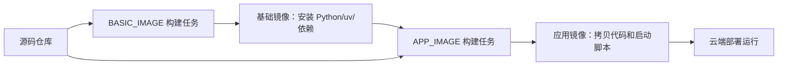

# JDT Hermes Agent 公司云端部署指南

## 1. 先理解公司云端部署方式

你们公司的云端构建方式，本质是两段式镜像：



对照 `jd-agent-chat-ui`：

- `docker/base/Dockerfile`：构建基础镜像，主要安装 Python、uv、Python 依赖。
- `docker/app/Dockerfile`：构建应用镜像，选择上一步的基础镜像，然后拷贝代码和 `server_scripts`。
- `server_scripts/start_container.sh`：公司平台容器初始化脚本。
- `server_scripts/start.sh`：真正启动应用服务。
- `server_scripts/stop.sh`：停止应用服务。

本项目已经按这个方式补齐同名文件。

## 2. 云端持久化路径

本地单机默认路径是：

```bash
/Users/fenggongye1/.hermes
```

云端不能继续用这个路径。云端默认使用：

```bash
/export/Data/hermes
```

这个路径通过环境变量控制：

```bash
HERMES_HOME=/export/Data/hermes
```

里面会保存：

- `config.yaml`：模型、provider、平台配置。
- `.env`：如果你选择文件方式放密钥。
- `sessions/`：会话和上下文。
- `logs/`：运行日志。
- `skills/`：同步后的 skill。
- `memories/`、`plans/`、`workspace/`：Hermes 运行态数据。
- A2UI 状态数据：通过本项目的 session/state 逻辑持久化。

如果公司云端有“持久卷/数据盘”，建议挂载到 `/export/Data`。如果没有持久卷，容器重建后这些运行数据可能丢失。

## 3. BASIC_IMAGE 构建任务怎么填

参考截图里的 BASIC_IMAGE 页面：

- 源码地址：填写本项目的 Git 仓库地址。
- Git 信息：选择你要部署的分支。
- Dockerfile 路径：

```text
docker/base/Dockerfile
```

- 基础镜像：可以继续选择公司默认的 Ubuntu 基础镜像，例如截图里的：

```text
other-jdt-base-os-ubuntu20.04:latest
```

构建结果建议命名类似：

```text
jdt-hermes-agent-base:vYYYYMMDD.HHMMSS-xxxx
```

这个基础镜像会安装：

- Python 3.12
- uv
- Hermes 运行依赖
- aiohttp/gateway/cron/cli/mcp/pty 等云端 API Server 需要的依赖
- 常用系统工具：`git`、`ripgrep`、`ffmpeg`、`jq`、`ssh`、`cron` 等

## 4. APP_IMAGE 构建任务怎么填

参考截图里的 APP_IMAGE 页面：

- 构建方式：选择 `Dockerfile构建`。
- 源码地址：填写本项目的 Git 仓库地址。
- Git 信息：选择同一个部署分支。
- Dockerfile 路径：

```text
docker/app/Dockerfile
```

- 基础镜像：选择刚刚 BASIC_IMAGE 构建出来的镜像，例如：

```text
jdt-hermes-agent-base:vYYYYMMDD.HHMMSS-xxxx
```

APP_IMAGE 只负责：

- 拷贝当前代码到 `/home/export/App`
- 拷贝启动脚本到 `/home/admin`
- 运行时复制到 `/export/App`
- 执行 `/export/App/server_scripts/start.sh`

## 5. 云端环境变量怎么配

最少必须配置：

```bash
JD_API_KEY=你的公司大模型 key
JD_BASE_URL=http://ai-api.jdcloud.com/v1
```

API Server 推荐配置：

```bash
API_SERVER_ENABLED=true
API_SERVER_HOST=0.0.0.0
API_SERVER_PORT=8642
API_SERVER_CORS_ORIGINS=http://open-joycoder-a2ui-editor-t.clear.jd.com,http://jacu.jd.com
HERMES_HOME=/export/Data/hermes
```

特别注意：云端部署时 `API_SERVER_HOST` 必须是 `0.0.0.0`，不能是 `127.0.0.1`。

原因是：

- `127.0.0.1` 只允许容器内部访问。
- 公司云端域名和负载均衡是从容器外访问服务。
- 如果绑定 `127.0.0.1`，容器内 `curl 127.0.0.1:8642/health` 会成功，但外部域名会返回 `503 Service Unavailable`。

当前 `server_scripts/start.sh` 默认会设置：

```bash
API_SERVER_ALLOW_PUBLIC=true
```

含义是：允许 API Server 在公司内网环境里不带 `API_SERVER_KEY` 也能启动。这样可以兼容当前 `jd-agent-chat-ui` 前端直接调用 `/api/chat`、`/api/models` 的方式。

云端配置环境变量后，必须重新发布或重启实例。已经运行中的 Python 进程不会自动拿到新环境变量。

启动日志里应该能看到：

```text
JD_API_KEY 已加载: pk-xxx******
```

如果当前线上镜像还没有包含最新启动脚本，`/home/admin/env.sh` 里必须写成 `export` 形式，否则 Bash 能读到变量，但 Python 子进程读不到：

```bash
export JD_API_KEY=你的公司大模型 key
export JD_BASE_URL=http://ai-api.jdcloud.com/v1
```

如果看到：

```text
WARNING: JD_API_KEY 未配置
```

说明当前服务进程仍然没有读到 key，需要检查三件事：

- 云端环境变量是否保存并重新发布。
- `/home/admin/env.sh` 里是否真的有 `JD_API_KEY`。
- 当前 APP_IMAGE 是否已经包含最新的 `server_scripts/start.sh`。

如果未来这个服务会暴露到公网，必须改成：

```bash
API_SERVER_ALLOW_PUBLIC=false
API_SERVER_KEY=一个强随机密钥
```

并让前端请求带：

```http
Authorization: Bearer <API_SERVER_KEY>
```

## 6. 启动后怎么验证

部署成功后，先看健康检查：

```bash
curl http://jdt-hermes-agent.jd.com/health
```

再看模型列表：

```bash
curl http://jdt-hermes-agent.jd.com/api/models
```

期望：

- 只返回 JD 模型。
- 包含 `GLM-5`、`GLM-5.1`、`MiniMax-M2.7` 等模型。
- 每个模型有 `supports_text_generation`、`supports_tool_calling`、`context_length`、`api_mode`。

再测普通聊天：

```bash
curl -N -X POST http://jdt-hermes-agent.jd.com/api/chat \
  -H 'Content-Type: application/json' \
  -d '{"message":"你好，用一句话回复我","model_name":"jd-api:GLM-5"}'
```

期望 SSE 返回：

```text
event: meta
event: text
event: done
```

再测 A2UI：

```bash
curl -N -X POST http://jdt-hermes-agent.jd.com/api/chat \
  -H 'Content-Type: application/json' \
  -d '{"message":"生成京东金融风格首页","model_name":"jd-api:GLM-5"}'
```

期望：

- 有 `step` 事件。
- 模型会调用 `skill_view` 加载 A2UI skill。
- 最终有 `text`，如果生成完整 A2UI JSON，则会有 `a2ui` 事件。

## 7. 本次实战踩坑记录

这一节记录的是本项目真实部署过程中踩过的坑。后续如果部署异常，优先按这里排查。

### 7.1 外部域名 `/health` 返回 503，但容器内 `/health` 返回 200

现象：

```bash
curl http://jdt-hermes-agent.jd.com/health
```

返回：

```html
<html><body><h1>503 Service Unavailable</h1>
No server is available to handle this request.
</body></html>
```

但云端日志里能看到：

```text
INFO gateway.platforms.api_server: [Api_Server] API server listening on http://127.0.0.1:8642
INFO aiohttp.access: 127.0.0.1 "GET /health HTTP/1.1" 200
```

原因：

服务绑定到了 `127.0.0.1`，只允许容器内部访问。公司云端负载均衡从容器外访问，所以找不到可用后端，返回 503。

正确配置：

```bash
API_SERVER_HOST=0.0.0.0
API_SERVER_PORT=8642
```

正确启动日志应该是：

```text
API_SERVER_HOST=0.0.0.0
API server listening on http://0.0.0.0:8642
```

本项目启动脚本已经加了兜底：如果发现 `API_SERVER_HOST=127.0.0.1` 或 `localhost`，云端启动时会强制改成 `0.0.0.0`。

### 7.2 `/api/chat` 报 `Provider 'jd-chat' ... no API key was found`

现象：

```text
Provider 'jd-chat' is set in config.yaml but no API key was found.
Set the JD_API_KEY environment variable...
```

原因：

Hermes 的 `jd-chat` provider 读取的是运行中 Python 进程里的 `JD_API_KEY`。云端页面里“看起来配置了环境变量”，不等于 Python 进程一定读到了。

常见触发方式：

- 环境变量配置后没有重启或重新发布实例。
- `/home/admin/env.sh` 里只有 `JD_API_KEY=xxx`，旧启动脚本 `source` 后没有 `export` 给 Python 子进程。
- `sudo -u admin` 切用户时环境变量丢失。
- APP_IMAGE 仍是旧镜像，没有包含最新启动脚本。

正确启动日志应该包含：

```text
JD_API_KEY 已加载: pk-xxx******
```

安全验证方式，不要打印完整 key：

```bash
python - <<'PY'
import os
v = os.getenv("JD_API_KEY", "")
print("JD_API_KEY exists:", bool(v))
print("JD_API_KEY prefix:", v[:6] if v else "")
print("JD_BASE_URL:", os.getenv("JD_BASE_URL"))
PY
```

本项目已经做了三层兜底：

- `server_scripts/start.sh` 会读取 `/home/admin/env.sh`。
- `server_scripts/start.sh` 会把 `JD_API_KEY/JD_BASE_URL` 同步写入 `$HERMES_HOME/.env`。
- `hermes_cli/env_loader.py` 会在 Python 启动时兜底读取 `/home/admin/env.sh` 和 `/home/admin/container_env`。

如果临时使用旧镜像，建议把 `/home/admin/env.sh` 写成：

```bash
export JD_API_KEY=你的公司大模型 key
export JD_BASE_URL=http://ai-api.jdcloud.com/v1
```

### 7.3 `container_env: line xx: 23:17:17: command not found`

现象：

```text
/home/admin/container_env: line 40: 23:17:17: command not found
```

原因：

`/home/admin/container_env` 是从 `/proc/1/environ` 导出的环境快照，不一定是合法 shell 脚本。里面可能包含空格、时间戳或其他无法执行的文本。如果直接：

```bash
source /home/admin/container_env
```

就会把普通文本当命令执行，出现 `command not found`，严重时可能中断启动。

正确做法：

- 不要 `source /home/admin/container_env`。
- 按 `KEY=VALUE` 逐行解析并 `export` 合法变量。

本项目的 `server_scripts/start_container.sh` 已经去掉直接 `source /home/admin/container_env` 的逻辑。

### 7.4 云端环境变量改了，但日志里还是旧值

现象：

云端配置页面已经改了，例如：

```bash
API_SERVER_HOST=0.0.0.0
JD_API_KEY=pk-xxx
```

但启动日志仍然显示：

```text
API_SERVER_HOST=127.0.0.1
WARNING: JD_API_KEY 未配置
```

原因：

云端环境变量不是热更新到已运行进程里的。保存配置后，必须重启实例或重新发布。

排查顺序：

- 确认配置页面保存成功。
- 确认实例已经重启或重新发布。
- 确认 APP_IMAGE 是最新构建出来的镜像。
- 查看启动日志里是否出现最新脚本的提示，例如 `API_SERVER_HOST=127.0.0.1 只允许容器内访问，云端部署强制改为 0.0.0.0`。

### 7.5 BASIC_IMAGE 构建失败：Git submodule 访问 GitHub

如果构建日志出现：

```text
fatal: unable to access 'https://github.com/nousresearch/tinker-atropos/'
fatal: clone of 'https://github.com/nousresearch/tinker-atropos' into submodule path ...
```

原因不是 Dockerfile 写错，而是公司构建平台在执行 Dockerfile 前，会先递归拉取 Git submodule。`tinker-atropos` 是可选 RL/训练子模块，当前云端 API 服务不需要它。

本项目已经在 `.gitmodules` 中设置：

```ini
[submodule "tinker-atropos"]
    update = none
```

这样即使平台执行：

```bash
git submodule update --init --recursive
```

也会跳过该子模块，不再访问 GitHub。

如果平台仍然强制 clone submodule，有两个兜底方案：

- 在构建任务里关闭“拉取子模块 / recursive submodule”选项。
- 后续在部署分支彻底删除 `tinker-atropos` submodule。

### 7.6 `scripts/run_tests.sh` 使用了 `.venv` 导致缺 pip

现象：

```text
.venv/bin/python: No module named pip
```

原因：

本项目约定使用：

```bash
source venv/bin/activate
```

但测试脚本之前优先找 `.venv`，如果本地 `.venv` 是残缺环境，就会报缺 `pip`。

本项目已经修正 `scripts/run_tests.sh` 的虚拟环境查找顺序：

```text
venv -> .venv -> ~/.hermes/hermes-agent/venv
```

推荐验证命令：

```bash
scripts/run_tests.sh tests/hermes_cli/test_env_loader.py
```

## 8. 常见问题

### 8.1 启动失败：binding to 0.0.0.0 requires API_SERVER_KEY

原因：Hermes 默认不允许无鉴权暴露到网络地址。

公司内网联调可以配置：

```bash
API_SERVER_ALLOW_PUBLIC=true
```

公网或不可信网络必须配置：

```bash
API_SERVER_KEY=强随机密钥
```

### 8.2 模型调用失败：Connection error

通常是容器网络不能访问：

```text
http://ai-api.jdcloud.com/v1
```

确认部署环境在公司内网，且没有走外部代理。

### 8.3 A2UI skill 不生效

重点检查 Docker 构建上下文里是否包含：

```text
skills/jd/a2ui-generate/SKILL.md
skills/jd/a2ui-edit/SKILL.md
jd_a2ui/a2ui_components_meta.json
```

本次已经修正 `.dockerignore`，避免 `SKILL.md` 被 `*.md` 排除。

### 8.4 容器重启后会话丢了

检查云端是否把持久卷挂载到了：

```bash
/export/Data
```

或者显式配置：

```bash
HERMES_HOME=/你的持久卷路径/hermes
```
