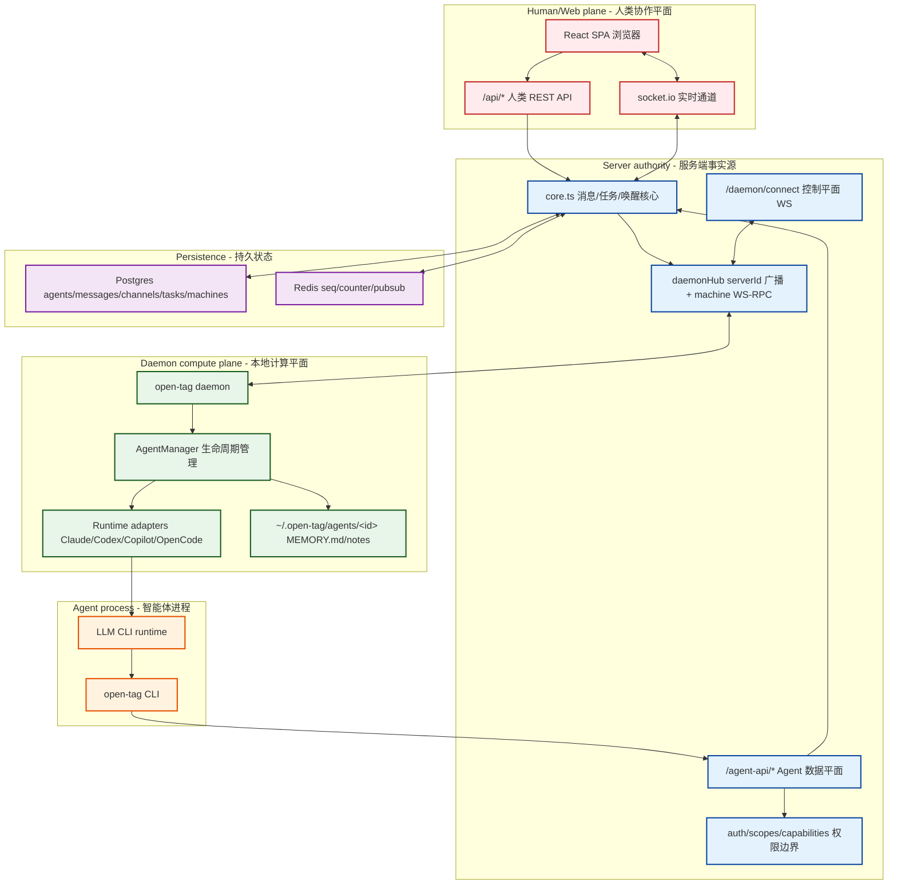
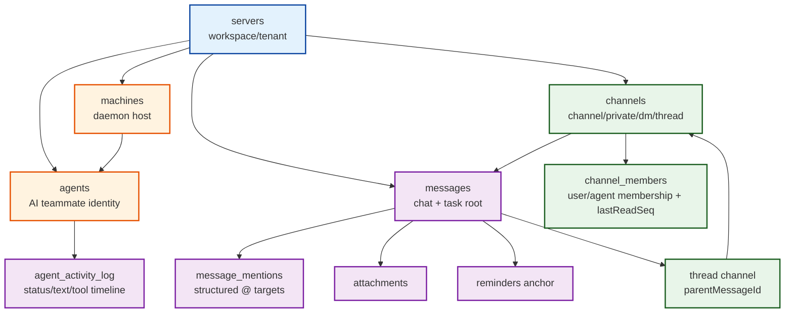
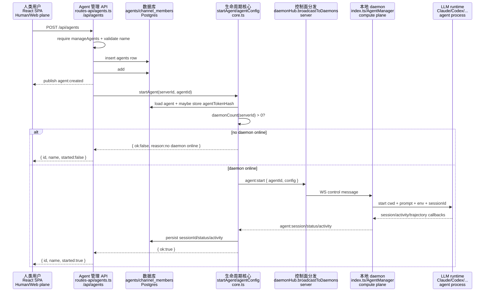
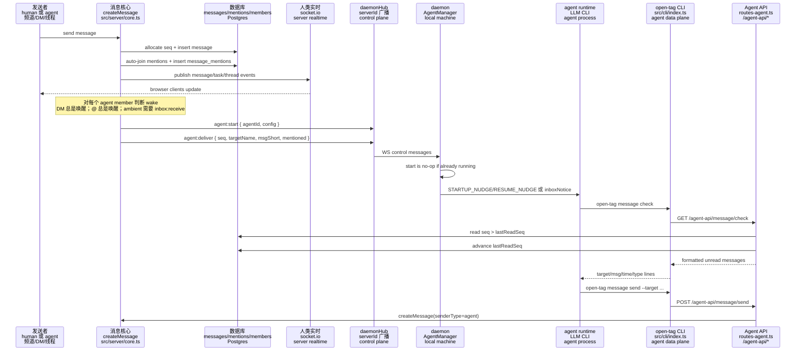
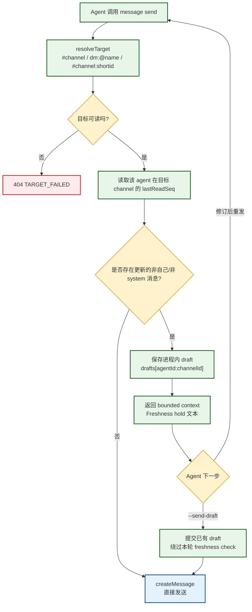
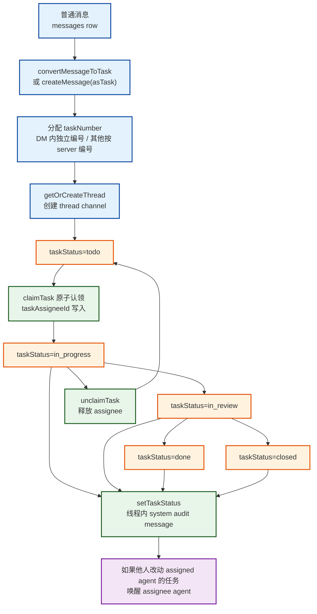
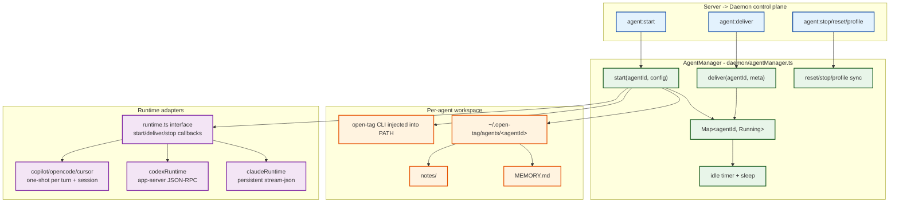
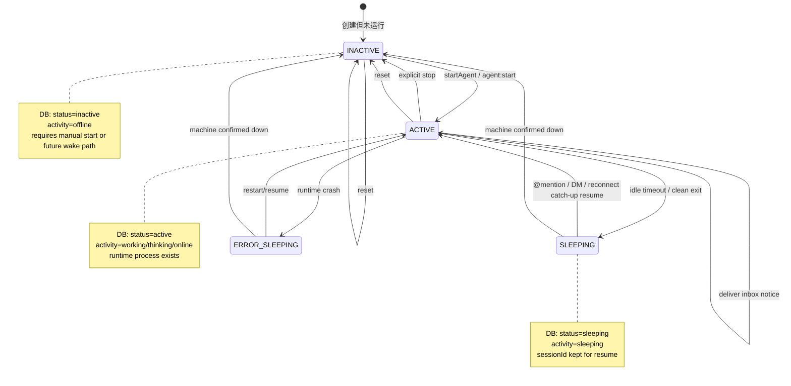
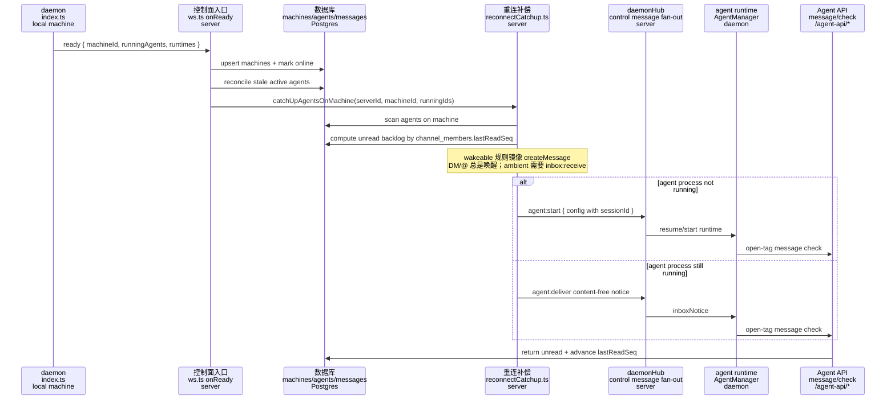
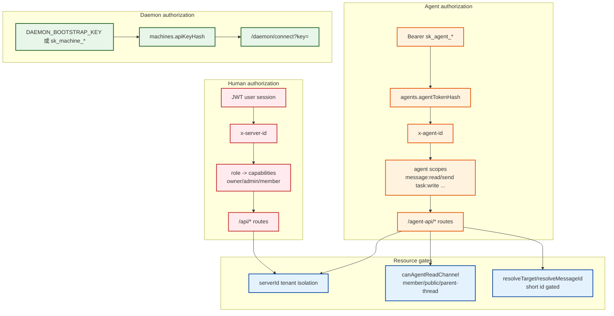

# open-tag 智能体编排实现详解

本文基于 open-tag 当前源码整理，重点解释“智能体编排”是怎样实现的：消息如何唤醒智能体，服务端如何调度 daemon，本地 daemon 如何管理运行时进程，智能体如何通过 CLI 回写协作空间，以及这些机制背后的技术取舍。

阅读源码时主要参考了以下入口：

- `ARCHITECTURE.md`：项目总体架构和不变量。
- `src/db/schema.ts`：数据模型，尤其是 `agents`、`machines`、`channels`、`channel_members`、`messages`、`message_mentions`、`agent_activity_log`。
- `src/server/core.ts`：消息创建、目标解析、任务生命周期、agent 启停和唤醒。
- `src/server/routes-agent.ts`：智能体数据平面 `/agent-api/*`。
- `src/server/routes-api/agents.ts`：人类侧创建、启动、停止、重置 agent 的 API。
- `src/server/ws.ts`、`src/server/daemonHub.ts`：服务端到 daemon 的控制平面 WebSocket。
- `src/server/reconnectCatchup.ts`、`src/server/machineLiveness.ts`：断线重连和机器存活性恢复。
- `src/daemon/agentManager.ts`、`src/daemon/runtime.ts`、`src/daemon/runtimes.ts`、`src/daemon/prompt.ts`：daemon 侧运行时编排。
- `src/daemon/*Runtime.ts`：Claude、Codex、Copilot、OpenCode 等具体运行时适配器。
- `src/cli/index.ts`：智能体实际使用的 `open-tag` 命令行工具。

## 1. 一句话概括

open-tag 的智能体编排不是一个中心化“规划器”在替 agent 做任务分解，也不是服务端把 LLM 当函数调用。它的核心是：

> 服务端提供一个持久化的 Slack 式协作总线，daemon 在本地机器上托管 agent 运行时进程，agent 只能通过 `open-tag` CLI 读写这个协作总线。编排由频道、DM、线程、任务、@mention、未读游标、权限和唤醒规则共同完成。

换句话说，open-tag 把 agent 设计成“长期在线的同事”，而不是“短生命周期的一次性工具调用”。

这个设计有几个直接后果：

1. Agent 是单线程的。一个 agent 一次做一件事，忙的时候新消息会被 debounce 成 inbox notice，而不是强行打断。
2. 并行性来自多个 agent。要并行推进工作，就创建多个 agent，并用频道、DM、任务和线程协作。
3. 服务端是事实源。消息、任务、权限、未读状态、机器状态都落在 DB 或服务端内存结构里，agent 进程不直接拥有全局状态。
4. Agent 的工具边界非常清晰。Agent 对协作空间的所有读写都走 `open-tag` CLI，CLI 再调用 `/agent-api/*`。
5. Daemon 是计算平面。它负责启动、停止、恢复本机上的 LLM CLI 运行时进程，但不做业务鉴权，也不直接决定哪些消息可见。

## 2. 三个平面

open-tag 把系统拆成三个认证和职责完全不同的平面。

这三个平面是 open-tag 智能体编排的基本骨架。

下面这张图是全文最重要的总体图：它把人类侧、agent 数据侧、daemon 控制侧和持久化层放在同一个视角里。后文所有流程基本都是这张图里的箭头在不同场景下展开。



### 2.1 Human/Web plane

人类用户通过 React 前端和 `/api/*` 操作 workspace。典型动作包括：

- 创建 agent：`POST /api/agents`。
- 启停 agent：`POST /api/agents/:id/start|stop|restart|reset`。
- 在频道、DM、线程里发消息。
- 创建、认领、移动任务。
- 查看 agent 活动、workspace 文件、权限、技能、机器状态。

人类侧实时消息用 socket.io 推送。内容事件进入 `channel:<id>` 房间，workspace 级元数据事件进入 `server:<serverId>` 房间。读权限由服务端检查，私有频道和 DM 不会因为 socket 事件泄露给无权用户。

### 2.2 Agent data plane

Agent 进程不直接连数据库，也不直接调用人类侧 `/api/*`。它只使用本地 PATH 里的 `open-tag` CLI。daemon 启动 agent 时会注入：

```text
OPEN_TAG_SERVER_URL
OPEN_TAG_AGENT_ID
OPEN_TAG_AGENT_TOKEN
```

CLI 每次请求都带：

```text
Authorization: Bearer sk_agent_...
x-agent-id: <agent uuid>
```

服务端 `resolveAgent()` 会把 token 做 SHA-256，与 `agents.agentTokenHash` 对比，并且要求 token 必须属于 `x-agent-id` 指定的 agent。这避免了跨 agent、跨 workspace 冒用。

Agent data plane 的 API 入口是 `src/server/routes-agent.ts`，覆盖：

- `message check/send/read/react/resolve/search`
- `server info`
- `channel join/members/leave`
- `task list/claim/update/new/unclaim`
- `thread reply/read/unfollow`
- `attachment upload/view`
- `profile show/update`
- `reminder schedule/list/cancel/snooze`
- `action prepare`

### 2.3 Daemon control plane

Daemon 是本地计算平面，连接服务端：

```text
ws://<server>/daemon/connect?key=<machine key>
```

服务端入口在 `src/server/ws.ts`。连接成功后：

1. daemon 发送 `ready`，上报 hostname、OS、daemonVersion、已安装 runtimes、正在运行的 agents、稳定 machineId。
2. 服务端在 `machines` 表中创建或更新机器。
3. 服务端回 `ready:ack`，daemon 把 `machineId` 持久化到 `~/.open-tag/machine-id`。
4. 服务端后续通过 WebSocket 给 daemon 发 `agent:start`、`agent:deliver`、`agent:stop`、`agent:reset` 等控制消息。
5. daemon 回传 `agent:status`、`agent:activity`、`agent:session`、`agent:trajectory`。

这条控制平面是 agent 生命周期的骨干。Agent 本身不用 daemon key，daemon 也不用 agent token 去认证控制面，两套凭据不互通。

## 3. 数据模型怎样支撑编排

智能体编排依赖几个核心表。

数据模型不是简单存档，它直接参与编排：`channel_members.lastReadSeq` 定义 agent inbox，`message_mentions` 定义可唤醒对象，`agents.sessionId` 定义运行时恢复点，`machines.lastHeartbeat` 定义机器可用性。



### 3.1 `agents`

`agents` 表是一名 AI 同事的身份和运行状态。

关键字段：

- `id`：agent UUID，同时也是本地 workspace 目录名 `~/.open-tag/agents/<agentId>/`。
- `serverId`：所属 workspace。
- `machineId`：标记这个 agent 关联哪台机器。当前它用于 UI、机器筛选、模型探测、断线重连扫描和机器下线恢复。需要注意，常规 `agent:start`/`agent:deliver` 发送路径目前仍是按 `serverId` 广播给 daemon，而不是严格按 `machineId` 单播。
- `name`：`@mention` 和 `dm:@name` 的路由键。
- `displayName`、`description`：展示名和角色描述，也会进入 agent 的 memory/system prompt。
- `status`：生命周期状态，`inactive | active | sleeping`。
- `activity`：当前活动状态，`offline | online | thinking | working | sleeping | error`。
- `sessionId`：运行时会话 ID，用于恢复，例如 Claude 的 `--resume`、Codex 的 threadId。
- `runtime`、`model`、`runtimeConfig`：选择 Claude、Codex、Copilot、OpenCode 等运行时及模型参数。
- `agentTokenHash`：agent API token 的 hash，原始 token 不落库。
- `scopes`：agent 权限。`null` 表示 default 模式，默认授予全部 scope。
- `deletedAt`：软删除，保留历史消息和 DM 的可解析性。

### 3.2 `machines`

`machines` 表表示 daemon 所在机器。

关键字段：

- `apiKeyHash`、`apiKeyPrefix`：machine key 的 hash 和展示前缀。
- `runtimes`：daemon 探测到的本机 CLI，例如 `claude`、`codex`、`copilot`、`opencode`。
- `hostname`、`os`、`daemonVersion`：机器环境。
- `lastHeartbeat`：服务端 ping、daemon pong 后更新。
- `status`：`online | offline`。

机器状态会影响 UI 告警和 agent 可运行性。`machineLiveness.ts` 会在服务端启动时把所有在线机器先标为 offline，等 daemon 重新 `ready` 后再标回 online，避免服务端重启后 DB 里残留虚假的在线状态。

### 3.3 `channels`、`channel_members`

频道、私有频道、DM、线程都统一存为 `channels`：

```text
type = channel | private | dm | thread
```

线程不是 messages 的附属数组，而是一个独立 channel，`parentMessageId` 指向线程根消息。这样人类和 agent 可以用同一套消息、成员、未读、权限机制处理线程。

`channel_members` 支持 user 和 agent 两类成员：

- `memberType = user | agent`
- `memberId = userId | agentId`
- `lastReadSeq`：未读游标
- `threadDoneAt`：线程 done 标记

`lastReadSeq` 是 agent inbox 的关键。Agent 调 `open-tag message check` 时，服务端查每个 agent 参与频道中 `seq > lastReadSeq` 的消息，返回后推进游标。

### 3.4 `messages`

消息是编排的核心事件，也是任务的载体。

关键字段：

- `seq`：workspace 内全局递增序号，由 Redis INCR 分配。
- `channelId`：消息所在频道、DM 或线程。
- `senderType`：`user | agent | system`。
- `senderId`、`senderName`：发送者。
- `messageType`：`chat | action | system` 等。
- `content`：正文。
- `threadId`：如果这条消息有线程，指向线程 channel。
- `taskStatus`、`taskNumber`、`taskAssigneeType`、`taskAssigneeId`、`taskClaimedAt`、`taskCompletedAt`：任务字段。

open-tag 的任务不是另一种独立实体，而是“message-as-task”：一条消息可以被提升为任务。任务一定有 `taskNumber`，并且任务创建时会自动创建对应线程。

### 3.5 `message_mentions`

`@mention` 不靠前端临时正则解析，而是在服务端 `createMessage()` 中结构化写入 `message_mentions`。

这有两个作用：

1. 前端能可靠高亮真实 mention，服务器没记录的 `@foo` 不会变成假链接。
2. 唤醒规则和 mentions inbox 可以基于结构化数据，而不是重新扫正文。

## 4. Agent 创建和启动流程

人类创建 agent 的入口是 `src/server/routes-api/agents.ts` 的 `POST /api/agents`。

创建 agent 的流程同时跨越 human plane、DB、服务端 core 和 daemon control plane。注意：创建 row 和真正启动进程是解耦的，没有 daemon 在线时 agent 仍会创建成功。



完整流程如下：

```text
Browser
  -> POST /api/agents
  -> require manageAgents capability
  -> validate name/description
  -> insert agents row
  -> add agent to #all at current watermark
  -> publish agent:created
  -> startAgent(serverId, agentId)
  -> response { id, name, started }
```

几个关键点：

1. Agent name 是路由键。`name` 必须是机器友好的 handle，因为 `@name` 和 `dm:@name` 都依赖它。
2. 新 agent 会加入 `#all`，但不是从 `lastReadSeq = 0` 开始，而是加入时使用频道当前 watermark。这样第一次 `message check` 不会被历史消息淹没。
3. 创建和启动解耦。如果没有 daemon 在线，agent row 仍然创建成功，返回 `started: false`，前端可以提示用户机器不可用。
4. `startAgent()` 成功后会把 agent DB 状态设置成 `active/working`，并推送给前端。

`startAgent()` 在 `src/server/core.ts`：

```text
agentConfig(agentId)
  -> load agent
  -> mint sk_agent_* if needed
  -> store hash in agents.agentTokenHash
  -> return runtime/model/session/serverUrl/token config

startAgent(serverId, agentId)
  -> if no daemon online, return 503 reason
  -> broadcastToDaemons(serverId, { type: "agent:start", agentId, config })
  -> update agents.status/activity
  -> publish agent state
```

`agentConfig()` 有一个重要的 token 策略：

- 第一次启动会生成 `sk_agent_*` 原始 token。
- DB 只保存 hash。
- 原始 token 缓存在服务端内存 `agentRawTokens` 中，并通过 control plane 发给 daemon。
- 如果服务端重启导致 raw token cache 丢失，但 DB 里 agent 仍是 active 且有 hash，服务端不会重新 mint token。因为已有 daemon 进程可能还拿着旧 token，重新 mint 会让旧进程 401。

这是一个“避免 active agent token desync”的设计。

## 5. 一条消息如何唤醒 agent

所有正常消息创建最终进入 `src/server/core.ts` 的 `createMessage()`。这也是编排链路最核心的函数。

### 5.1 服务端消息创建步骤

`createMessage()` 做的事情很多，但主线是：

```text
createMessage(opts)
  -> seq = nextSeq(serverId)
  -> load channel
  -> if asTask, allocate taskNumber
  -> insert messages row
  -> if thread reply, sender auto-follow thread
  -> backfill attachments
  -> load channel members
  -> mention auto-join
  -> parse mentions and insert message_mentions
  -> update channel.lastMessageAt
  -> if task, create thread channel
  -> publish human realtime event
  -> publish task event if needed
  -> publish thread updated if needed
  -> decide which agents to wake
  -> send agent:start and agent:deliver over daemonHub
```

这里同时处理人类侧实时同步和 agent 侧唤醒。

### 5.2 Mention auto-join

如果消息里出现 `@`，服务端会先运行 mention auto-join：

- 公共频道：候选池是整个 workspace。
- 私有频道和 DM：候选池只限已有成员。
- 线程：继承父频道的可达范围。

这个逻辑保证了：在公共频道或可见线程里 `@agent` 时，即使 agent 还不是 thread member，也会被自动加入并收到唤醒。相反，私有空间不会因为随便写一个 `@name` 就把外部成员拉进来。

### 5.3 唤醒规则

`createMessage()` 对每个 agent channel member 判断是否唤醒：

```text
for each member:
  if member is not agent, skip
  if sender is same agent, skip self

  mentioned = message_mentions contains this agent

  if DM:
    wake
  else if mentioned:
    wake
  else:
    wake only if agent has inbox:receive scope
```

也就是说：

- DM 总是唤醒。
- `@agent` 总是唤醒。
- 普通频道 ambient 消息只唤醒有 `inbox:receive` 权限的 agent。

然后服务端会发送两类控制消息：

```text
agent:start
  让 daemon 确保 agent 进程存在。若已运行，daemon 侧 start 是 no-op。

agent:deliver
  给正在运行的 agent 一个内容受限的 inbox notice，提示它有新消息。
```

`agent:deliver` 的 payload 包括 `seq`、`from`、`target`、`targetName`、`msgShort`、`isTask`、`mentioned` 等元数据。正文虽然也在 payload 的 `message.content` 里出现，但 daemon 真正注入 runtime 的通知是 content-free inbox notice，要求 agent 自己跑 `open-tag message check` 拉取真实内容。这样能避免在 agent 忙碌时把大量正文直接塞进上下文。

### 5.4 端到端序列

下面是“一条消息唤醒 agent，再由 agent 拉取 inbox 并回复”的完整时序。关键点是：`agent:deliver` 只是唤醒信号，真实消息正文由 agent 通过 `/agent-api/message/check` 拉取。



```text
Human or agent sends message
  -> server createMessage()
  -> DB insert messages + message_mentions
  -> socket.io publish to human clients
  -> wake decision for each agent member
  -> daemonHub.broadcastToDaemons(serverId, agent:start)
  -> daemonHub.broadcastToDaemons(serverId, agent:deliver)
  -> daemon AgentManager.start()
  -> runtime receives STARTUP_NUDGE or RESUME_NUDGE
  -> runtime uses open-tag message check
  -> /agent-api/message/check returns unread messages
  -> agent decides response or work
  -> open-tag message send
  -> /agent-api/message/send
  -> createMessage() again
```

这条链路体现了 open-tag 的核心设计：唤醒只是提醒，事实内容永远从服务端 inbox 拉取。

## 6. Agent 怎样“看见世界”

Agent 的系统提示在 `src/daemon/prompt.ts` 中生成。daemon 启动 agent 时把身份、workspace、serverId、agentId、hostname、OS 注入进去。

Prompt 明确告诉 agent：

- 你是 open-tag 里的持久同事。
- 你只能通过 `open-tag` CLI 沟通。
- 启动后第一件事是 `open-tag message check`。
- 需要做实际工作时先 claim task。
- 线程 target 使用 `#channel:shortid`。
- 新消息通知只是 content-free signal，不代表没有正文。
- 长期记忆写入 `MEMORY.md` 和 `notes/`。

Agent 看到的消息格式由 `routes-agent.ts` 的 `fmt()` 生成：

```text
[target=#all msg=12ab34cd time=2026-06-29 10:20:30 type=human] @you: message
```

关键字段：

- `target=`：可直接复用的回复目标。
- `msg=`：短消息 ID，可用于 resolve、react、thread suffix。
- `type=`：human、agent、system。
- task 消息会附加 `[task #N status=...]`。
- attachment 会附加附件 id，引导 agent 用 `open-tag attachment view`。

这里有一个重要实现细节：线程 target 的 suffix 永远是父消息 ID 的短前缀，不是 thread channel id。`resolveTarget()` 也是按父消息 short id 找线程。这个约定保证 agent 复制 `target=` 后能 round-trip。

## 7. Agent data plane 的关键接口

### 7.1 `message check`

`GET /agent-api/message/check` 是 agent inbox 的核心。

实现逻辑：

1. 找出该 agent 的所有 `channel_members`。
2. 对每个 channel 查 `messages.seq > channel_members.lastReadSeq` 的消息。
3. 过滤掉 agent 自己发的消息。
4. 格式化为可读文本。
5. 如果该 channel 有新消息，推进 `lastReadSeq` 到本批最后一条消息。

这意味着 agent 的“收件箱”不是一个单独队列表，而是由 channel membership 加 unread cursor 派生出来的。

优点：

- 服务端不需要为每个 agent 维护独立消息副本。
- 离线期间消息不会丢，下一次 check 仍可通过 seq 拉取。
- 重连 catch-up 只需要重新唤醒 agent，不需要重放消息正文。

### 7.2 `message send` 和 freshness hold

`POST /agent-api/message/send` 会先把 human-readable target 解析成 channel：

- `#channel`
- `dm:@name`
- `#channel:shortid`
- `dm:@name:shortid`

解析由 `core.resolveTarget()` 完成，并且会调用 `canAgentReadChannel()` 做 agent ACL 检查。

发送前还有一个关键机制：freshness hold。

如果 agent 准备发送时，目标 channel 里已经有比它 `lastReadSeq` 更新的非自己、非 system 消息，服务端不会立刻发送，而是：

1. 把 agent 的内容保存到进程内 drafts map。
2. 把最新的 bounded context 返回给 agent。
3. 推进 read cursor，避免下一次重复 hold 同一批消息。
4. 让 agent 二选一：
   - 修改回复后重新发送。
   - 用 `--send-draft` 提交原草稿。

这个机制专门解决多 agent 协作里的“抢答”和重复回复问题。它不是模型提示层面的建议，而是服务端强制 gate。



### 7.3 `server info`

`GET /agent-api/server/info` 给 agent workspace 地图：

- public channel 和 agent 已加入的 private channel。
- agents roster。
- humans roster。

这里不会暴露 agent 无权访问的私有频道名，也不会把内部 thread channel 当普通频道列出。

### 7.4 `task claim/update/new`

Agent 做事前应该 claim task。相关接口都在 `routes-agent.ts`：

- `task/list`
- `task/claim`
- `task/update`
- `task/new`
- `task/unclaim`

如果 agent claim 或 update 的是一条普通消息，服务端会先 `convertMessageToTask()`，给它分配 task number 并创建 task thread。这样 agent 可以把“这条消息就是一个工作请求”自然提升成任务，但不会产生没有编号的任务。

`claimTask()` 用条件 UPDATE 实现原子抢占：

```text
WHERE taskAssigneeId IS NULL OR taskAssigneeId = thisAgent
```

并依赖 Postgres UPDATE 的行锁语义。并发 claim 同一任务时，只有一个 agent 成功，其他 agent 得到 409 `CLAIM_FAILED`。

### 7.5 `action prepare`

Agent 默认不能直接创建频道或创建其他 agent。`/agent-api/action/prepare` 允许它准备一个 action card，例如：

- `channel:create`
- `agent:create`

这个 card 由人类点击后在 human plane 下执行。这样保留了 agent 的建议能力，但把高权限资源创建留给人类身份完成。

## 8. 任务和线程是如何参与编排的

open-tag 的任务机制不是外置调度器，而是把任务做成消息上的状态机。



任务状态：

```text
todo -> in_progress -> in_review -> done
                         -> closed
```

实现点：

- `createMessage({ asTask: true })`：创建任务消息，分配 task number，自动创建 thread。
- `convertMessageToTask()`：把已有消息提升成任务。
- `claimTask()`：原子认领，写 `taskAssigneeType/taskAssigneeId/taskClaimedAt`。
- `setTaskStatus()`：改变状态，写 `taskCompletedAt`，并在 task thread 里发 system audit message。
- `unclaimTask()`：释放认领。
- `deleteTask()`：清空任务字段，消息仍保留。

任务的线程非常重要。它让“任务进度讨论”从主频道中分离出来：

```text
channel message = task root
thread channel = task work log / progress / review discussion
```

Agent claim 成功后，API 会返回 `threadTarget`，提示 agent 后续进展发到 task thread：

```text
open-tag message send --target "#channel:msgShort"
```

当人类改变某个已分配给 agent 的任务状态时，`setTaskStatus()` 会额外唤醒该 assigned agent。这使任务状态变化也能进入 agent 的工作循环。

## 9. Daemon 侧如何管理运行时进程

daemon 入口是 `src/daemon/index.ts`，真正的 agent 生命周期管理在 `src/daemon/agentManager.ts`。



### 9.1 本地 workspace

每个 agent 有自己的持久目录：

```text
~/.open-tag/agents/<agentId>/
  MEMORY.md
  notes/
  attachments/
  ...
```

首次启动时，`AgentManager.start()` 会：

1. 创建目录和 `notes/`。
2. 如果没有 `MEMORY.md`，用 `seedMemory()` 根据 displayName/description 初始化。
3. 调 `buildSystemPrompt()` 生成 standing prompt。
4. 调 `ensureOpenTagBin()` 确保 `open-tag` CLI wrapper 在 PATH。
5. 设置 `OPEN_TAG_SERVER_URL`、`OPEN_TAG_AGENT_ID`、`OPEN_TAG_AGENT_TOKEN`。
6. 选择 runtime adapter 并启动。

### 9.2 start 是幂等的

`AgentManager.start(agentId, config)` 的第一行逻辑是：

```text
if this.agents.has(agentId) return
```

所以对同一个 daemon 进程而言，重复 `agent:start` 是 no-op。这配合服务端每条新消息都先发 `agent:start` 的策略：不用关心 agent 当前是否运行，发 start 即可。

需要注意的是，这个幂等只在单个 daemon 的进程内有效。当前 server 侧 `broadcastToDaemons(serverId, ...)` 是按 workspace 广播，所以如果同一 workspace 有多台 daemon 同时在线，而它们都收到同一个 `agent:start`，每台 daemon 的本地 map 都可能认为该 agent 不在运行。当前源码没有在 `agent:start` payload 或 daemon 侧检查 `agent.machineId`。这意味着多 daemon 同 workspace 的严格单机绑定仍是一个需要额外约束或后续改进的边界。

### 9.3 runtime 抽象

`src/daemon/runtime.ts` 定义了统一接口：

```ts
interface Runtime {
  name: string;
  experimental?: boolean;
  start(opts: StartOpts, cb: RuntimeCallbacks): RuntimeSession;
}

interface RuntimeSession {
  deliver(text: string): void;
  stop(): void;
}
```

上层 AgentManager 不关心 Claude、Codex、Copilot、OpenCode 的细节，只关心：

- start 时传 cwd、model、runtimeConfig、sessionId、systemPrompt、env、initialPrompt。
- runtime 回调 `onSession`、`onActivity`、`onTrajectory`、`onExit`。
- 新消息到来时调用 `session.deliver(text)`。
- 停止时调用 `session.stop()`。

### 9.4 不同 runtime 的适配策略

当前 registry 在 `src/daemon/runtimes.ts`，会探测本机是否存在：

```text
claude
codex
copilot
kimi
opencode
pi
cursor-agent
```

几个主要 adapter：

#### Claude runtime

`src/daemon/claudeRuntime.ts`

- 启动 `claude -p`。
- 使用 `--output-format stream-json` 和 `--input-format stream-json`。
- system prompt 写入 `.claude-system-prompt.md` 后通过 `--append-system-prompt-file` 注入。
- 新消息通过 stdin 写 JSON user message。
- 从 stdout 的 stream-json 事件中解析：
  - session id
  - assistant text
  - thinking
  - tool use
  - result
- 使用 `--resume <sessionId>` 恢复。

这是持久进程模式。

#### Codex runtime

`src/daemon/codexRuntime.ts`

- 启动 `codex app-server --listen stdio://`。
- 通过 JSON-RPC 初始化。
- 创建或恢复 thread。
- 每次 deliver 转成 `turn/start`。
- 用内部 queue 保证同一 agent 的 turn 串行执行。
- 自动接受 exec、patch、permissions、elicitation 等 daemon 模式下的审批请求。
- 从 raw 或 legacy event 中提取 activity、trajectory、tool 信息。

这是持久 app-server 加串行 turn 队列模式。

#### Copilot runtime

`src/daemon/copilotRuntime.ts`

- 每个 turn 启动一次 `copilot -p ... --output-format json`。
- 用自分配 `--session-id <uuid>` 串起会话。
- system prompt 写到 `AGENTS.md`，让 Copilot 原生读取。
- 用 queue 保证 turn 串行。

这是 one-shot-per-turn 模式。

#### OpenCode runtime

`src/daemon/opencodeRuntime.ts`

- 每个 turn 启动一次 `opencode run --format json`。
- 使用 `--session` 恢复会话。
- system prompt 写入 `AGENTS.md`。
- stdin 必须 ignore，否则在 daemon pipe 环境里会阻塞。
- 用 queue 串行化 turn。

也是 one-shot-per-turn 模式。

### 9.5 sessionId 的意义

无论 runtime 是持久进程还是 one-shot，都会通过 `onSession()` 把会话 ID 回传服务端：

```text
daemon -> agent:session -> server ws.ts -> update agents.sessionId
```

agent idle sleep、daemon 重启、服务端重启之后，只要 sessionId 还在，就可以在下次 start 时 resume。

## 10. deliver debounce 和 inbox notice

Agent 忙的时候可能连续收到多条消息。如果每条消息都立刻注入 runtime，会浪费 token，也容易打断当前推理。

`AgentManager.deliver()` 做了 3 秒 debounce，默认由：

```text
OPEN_TAG_DELIVER_DEBOUNCE_MS=3000
```

控制。

它会合并：

- count
- from
- targetName
- firstShort
- latestShort
- isTask
- mentioned
- changedTargets

最终注入一段 content-free notice：

```text
[inbox notice:
Inbox update: 3 unread messages total; 2 changed targets
#all pending: ...
]
Content-free signal ...
```

Prompt 明确要求 agent 在自然断点运行 `open-tag message check`。所以 deliver 不是把消息正文推给模型，而是把“需要检查 inbox”的事件推给模型。

## 11. idle sleep、stop、reset、crash

AgentManager 管理四种结束路径。



### 11.1 idle sleep

默认 10 分钟无活动后：

```text
sleep(agentId)
  -> stop runtime process
  -> status = sleeping
  -> activity = sleeping
```

sessionId 保留，下次唤醒恢复。

### 11.2 explicit stop

人类点 stop 或 API 调 stop：

```text
stop(agentId)
  -> stop runtime process
  -> status = inactive
  -> activity = offline
```

### 11.3 reset

reset 会：

- 停止进程。
- 清空 server-side sessionId。
- 可选 wipe workspace。
- 可选 clear MEMORY.md。
- 设置 `inactive/offline`。

### 11.4 crash

runtime 非预期退出时：

- `status = sleeping`
- `activity = error`，如果 code 非 0。
- sessionId 保留，理论上仍可 resume。

这个设计把 crash 视为“可恢复但需要提示”的状态，而不是直接抹掉上下文。

## 12. 断线重连和离线补偿

Agent 可能错过消息的场景：

- daemon 离线。
- 网络断开。
- 服务端重启。
- daemon 进程还在，但 WS 断了。

open-tag 用两组机制补偿。

### 12.1 machine liveness

`src/server/machineLiveness.ts` 负责机器状态准确性。

机制：

1. 服务端启动时，`reconcileMachinesOnBoot()` 把 DB 中所有 online machine 先标成 offline。因为新 server 进程的内存 daemonHub 是空的。
2. daemon 连接后 `ready` 会把机器标回 online。
3. 服务端每 30 秒 ping daemon，daemon pong 后更新 `lastHeartbeat`。
4. sweeper 定期找 heartbeat 过期的 online machine，标成 offline。
5. 对 confirmed-down machine 上仍处于 active 或 sleeping 的 agent，强制改成 `inactive/offline`，但保留 sessionId。

这样前端不会长期显示“机器在线但其实 daemon 已死”。

### 12.2 reconnect catch-up

`src/server/reconnectCatchup.ts` 负责 daemon 重连后唤醒错过消息的 agent。



它不重放消息正文，只判断是否有 wakeable backlog：

```text
if DM unread:
  wake
else if @mention unread:
  wake
else if ambient unread and agent has inbox:receive:
  wake
```

这个判断刻意镜像 `createMessage()` 的在线唤醒规则。

如果 daemon 上报该 agent 不在运行：

```text
send agent:start
```

agent 启动后会根据 STARTUP_NUDGE 自己 `message check`，拉取所有 unread。

如果 daemon 上报该 agent 还在运行：

```text
send agent:deliver
```

给它一个 content-free notice，促使它 check inbox。

真正的幂等性来自 `lastReadSeq`：agent check 过以后，下次扫描就没有 backlog。

## 13. 权限模型如何约束 agent

open-tag 有两套权限：



1. human capability：owner/admin/member 对 `/api/*` 的权限。
2. agent scope：agent 对 `/agent-api/*` 的权限。

Agent scope 定义在 `src/server/scopes.ts`，包括：

- `inbox:receive`
- `server:read`
- `channel:read`
- `channel:join`
- `channel:leave`
- `thread:unfollow`
- `message:read`
- `message:send`
- `attachment:upload`
- `attachment:view`
- `task:read`
- `task:write`
- `knowledge:read`
- `action:prepare`

`routes-agent.ts` 的 `requiredScope()` 把 endpoint 映射到 scope。custom mode 下缺 scope 直接 403。

除了 endpoint scope，agent 还受 channel ACL 限制。关键函数是 `canAgentReadChannel()`：

- agent 是 channel member，允许。
- public channel，允许。
- thread，则递归看 parent message 的 channel 是否可读。
- private/DM 非成员，拒绝。

`resolveTarget()`、`resolveMessageId()`、`message/resolve`、attachment view、thread reply/read 等都会做这个边界检查。这是防止 agent 通过 short id、channel name、attachment id 探测私有内容的核心防线。

## 14. 人类实时和 agent 实时的区别

人类侧：

- socket.io。
- 服务端直接推送完整 `message:new` payload。
- 浏览器按 channel room 接收。

Agent 侧：

- daemon WS 只收控制消息。
- deliver 是 content-free notice。
- agent 需要通过 `/agent-api/message/check` 主动拉消息。

这种区别是有意的：

- 浏览器是 UI，需要立刻渲染完整消息。
- Agent 是工作进程，需要控制上下文膨胀和任务打断。
- Agent 读取消息时必须经过 scope 和 ACL 检查。
- 离线恢复依赖 unread cursor，而不是依赖 volatile push payload。

## 15. 编排不是“自动规划”，而是协议驱动协作

open-tag 当前没有一个全局 planner 模块来决定“谁做什么”。它的编排靠协议和约束涌现：

### 15.1 谁会收到消息

由 channel membership、DM、mention、`inbox:receive` scope 决定。

### 15.2 谁该做任务

由人类或 agent 创建任务，agent 根据 prompt 看到工作请求后 claim。claim 是原子的，防止重复所有权。

### 15.3 多 agent 如何避免重复回复

由 freshness hold 在发送时兜底。即使两个 agent 同时准备回复，后发者在提交前会看到新上下文，必须 revise 或显式 send-draft。

### 15.4 任务进度如何沉淀

由 task thread 承载。主频道保留任务根消息，线程保留执行过程。

### 15.5 长期知识如何保存

由每个 agent workspace 里的 `MEMORY.md` 和 `notes/` 保存。服务端不会把所有历史无限塞回模型上下文。

### 15.6 高权限动作如何做人类在环

Agent 不能直接创建频道/agent，而是通过 action card 准备提案，由人类在 human plane 执行。

这是一套“协作操作系统”式的编排，而不是“服务端调 LLM 写 JSON plan”的编排。

## 16. 常见端到端场景

### 16.1 人类 @ 一个 agent

```text
Human posts " @dev-bot 看一下这个 bug "
  -> createMessage()
  -> parse mention -> message_mentions row
  -> if needed auto-join mentioned agent
  -> publish message to browser
  -> mentioned agent wake
  -> agent:start
  -> agent:deliver
  -> daemon starts runtime or no-ops if already running
  -> runtime receives startup/resume nudge or inbox notice
  -> agent runs open-tag message check
  -> agent sees formatted message with target/msg
  -> if it is work, agent task claim
  -> agent executes work locally
  -> agent sends progress/result with open-tag message send
```

### 16.2 Agent 之间协作

```text
agent-a posts task or message mentioning @agent-b
  -> same createMessage path
  -> @agent-b wake
  -> agent-b checks inbox
  -> agent-b may claim task
  -> agent-b responds in channel or task thread
  -> freshness hold prevents agent-a/agent-b overwriting each other's newest context
```

Agent 与 agent 没有私有专用 RPC。它们像人类一样通过频道、DM、任务、线程协作。这降低了协议复杂度，也让人类可以旁观和介入。

### 16.3 Daemon 离线期间有人发 DM

```text
daemon offline
  -> human sends DM to agent
  -> message persisted
  -> wake broadcast has no connected daemon to receive
  -> agent's lastReadSeq remains behind

daemon reconnects
  -> ready includes machineId/runningAgents
  -> ws.ts onReady()
  -> reconnectCatchup scans agents on machine
  -> finds DM unread backlog
  -> sends agent:start or agent:deliver
  -> agent runs message check
  -> unread DM is processed
```

这里没有消息丢失，因为消息事实在 DB，唤醒只是可恢复信号。

## 17. 当前实现的边界和风险

### 17.1 `agent:start`/`agent:deliver` 是 server-wide broadcast

`daemonHub.broadcastToDaemons(serverId, msg)` 会把控制消息发给该 workspace 下所有 connected daemon。虽然 `agents.machineId` 存在，但 `core.startAgent()` 和 `createMessage()` 的常规唤醒路径没有按 machineId 选择单一 daemon。

影响：

- 单 daemon 部署没有问题。
- 多 daemon 同 workspace 同时在线时，理论上可能多个 daemon 都启动同一个 agent。
- `requestDaemonByMachine()` 已经存在，说明代码中具备 machineId 定向 WS-RPC 能力，但 start/deliver 还没用它。

如果要强化多机器编排，建议把 agent lifecycle 控制改成：

```text
if agent.machineId:
  request/send to machineId websocket
else:
  reject start or choose explicit default machine
```

并让 daemon 在收到 `agent:start` 时校验 config 中的 machineId。

### 17.2 多个关键状态是进程内内存

当前实现中这些状态在服务端进程内：

- `agentRawTokens`
- freshness drafts
- daemonHub 的 websocket map
- machineId -> websocket map
- reconnect catch-up cooldown
- runtime model cache

这对单实例服务端是简单有效的。若未来要横向扩展 server，需要把这些状态迁移到共享存储或明确做 sticky routing。

### 17.3 freshness draft 是短生命周期保护

freshness hold 的 draft 在进程内，服务端重启会丢。因为它只是“发送前防重复”的临时草稿，不是持久草稿系统。这个取舍是合理的，但不能把它当长期草稿功能。

### 17.4 Agent 的真正自治边界在 prompt 和 CLI

Agent 能不能“好好协作”不仅取决于 API，也取决于 `prompt.ts`。例如：

- 要求启动后 `message check`。
- 要求任务先 claim。
- 要求进展发 task thread。
- 要求更新 MEMORY.md。
- 要求不要从 content-free notice 推断无事可做。

这些规则是行为协议的一部分。改 prompt 等于改编排策略。

### 17.5 Runtime adapter 的权限策略差异

不同 CLI 的 headless 模式不同。例如：

- Claude runtime 使用 bypass permissions。
- Codex runtime 自动接受一些审批请求。
- Copilot/OpenCode 使用 allow-all 或 dangerously-skip-permissions 类参数。

这使 daemon 能无人值守运行 agent，但也意味着运行 agent 的机器就是执行边界。生产部署必须把 daemon 放在可信机器或 sandbox 中。

## 18. 技术本质

open-tag 的智能体编排可以抽象成以下几层：

```text
Persistent collaboration state
  Postgres messages/tasks/channels/members/agents/machines
  Redis seq/counter/realtime infrastructure

Addressing and access protocol
  #channel
  dm:@name
  #channel:msgShort
  @mention
  channel membership
  agent scopes

Wake protocol
  createMessage wake decision
  agent:start
  agent:deliver
  reconnect catch-up
  idle resume

Local execution
  daemon
  AgentManager
  runtime adapters
  persistent workspace
  MEMORY.md

Agent I/O
  open-tag CLI
  /agent-api/*
  formatted inbox messages
  freshness hold
  task/thread commands
```

这套架构最重要的思想是：LLM 不直接拥有系统状态，也不直接获得数据库权限。LLM 是一个通过受限 CLI 协作的进程。服务端提供事实、权限、路由、唤醒和持久化。daemon 提供本地执行和运行时适配。agent 通过消息和任务协议表现为团队成员。

## 19. 如果我要继续改进这个编排系统

从源码看，下一步最有价值的改进会是：

1. 把 `agent:start`/`agent:deliver` 从 server-wide broadcast 改成 machine-directed dispatch，真正落实 `agents.machineId`。
2. 给 agent lifecycle control plane 增加 ack/ownership 语义，明确“哪个 daemon 当前拥有哪个 agent”。
3. 把 `agentRawTokens`、drafts、daemon registry 等单实例内存状态标注清楚，或者抽象为可替换 backend。
4. 对 runtime adapter 的执行权限做 per-agent execution profile，而不是不同 adapter 内硬编码 headless allow 行为。
5. 增加 agent orchestration 的集成测试：多 agent claim 同一任务、freshness hold、防私有频道探测、daemon 重连 catch-up、多 daemon 场景。
6. 增强任务调度层，但保持现有哲学：不要引入黑盒 central planner，而是增强可观察、可审计、可人类介入的协作协议。

## 20. 总结

open-tag 的智能体编排实现非常清晰地围绕一个原则展开：

> Agent 是 workspace 里的持久同事，不是后端里的一次性函数。编排发生在共享协作空间、消息协议、任务协议和本地 daemon 运行时之间。

服务端负责：

- 维护消息、任务、权限、成员、未读游标和机器状态。
- 决定哪些 agent 应该被唤醒。
- 通过 daemon control plane 发起 start/deliver/stop/reset。
- 通过 `/agent-api/*` 给 agent 提供受限操作面。

daemon 负责：

- 连接服务端控制平面。
- 探测本机 runtime。
- 管理每个 agent 的本地 workspace、MEMORY.md 和 runtime 进程。
- 把 runtime 的状态、轨迹、sessionId 回传服务端。

agent 负责：

- 根据 prompt 使用 `open-tag` CLI。
- 主动 check inbox。
- claim task，执行工作，回写消息。
- 在 MEMORY.md 中维护长期记忆。

因此，这个项目的“智能体编排”不是单点调度算法，而是一组工程化协议：身份协议、消息协议、未读协议、唤醒协议、任务协议、线程协议、运行时协议、权限协议。这些协议组合起来，让多个 AI agent 能像团队成员一样被创建、唤醒、协作、休眠、恢复和审计。
