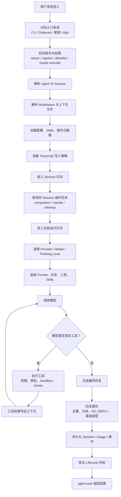
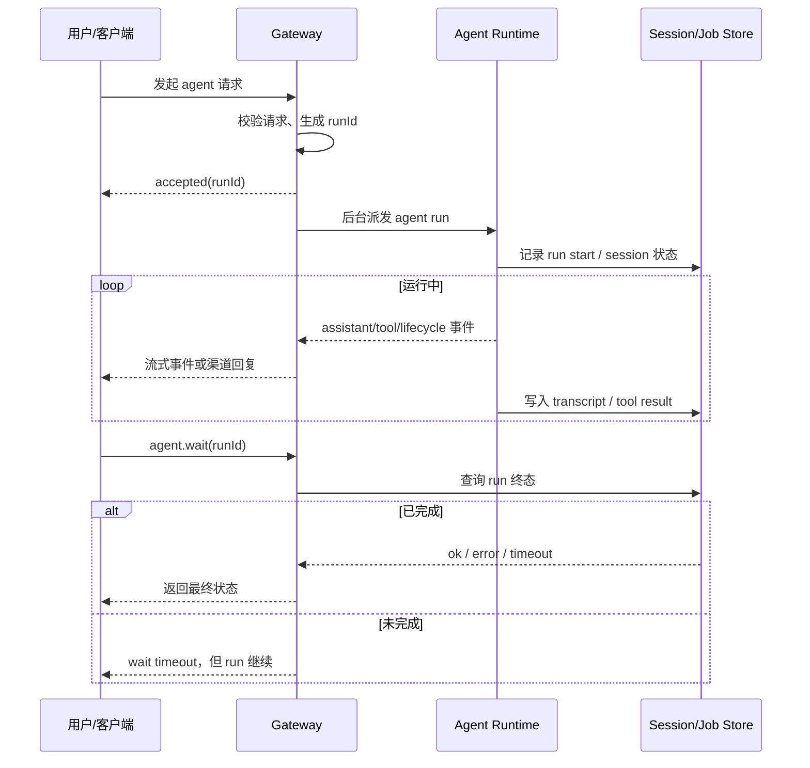
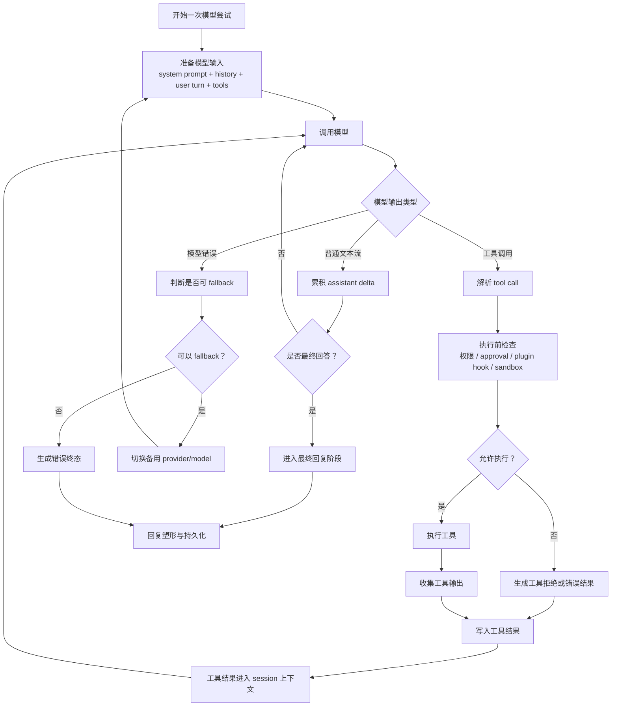
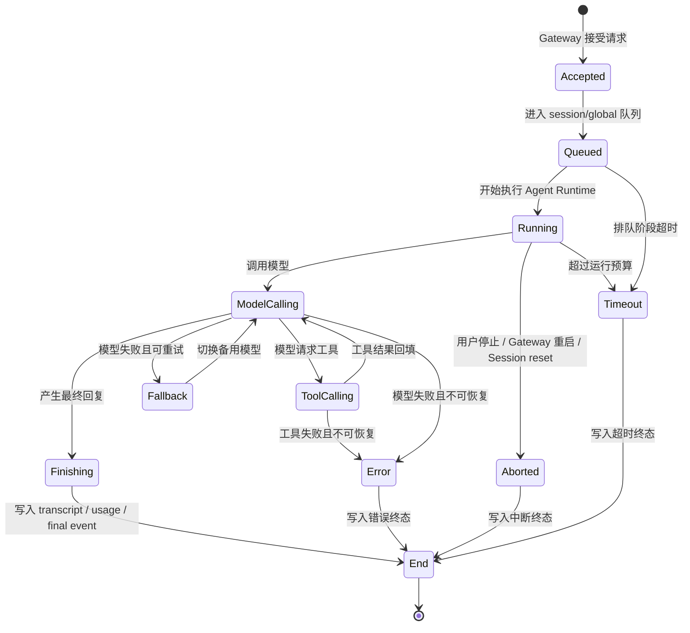

## 1. Agent Loop 是如何做的？

### 整体 Agent Loop 流程图



### Gateway 为什么先 accepted，再 wait




### 模型与工具的内部循环



### 一次 Run 的生命周期状态




你说得对，我前面那版确实像“任何 agent 平台都能套”的描述，没有讲出 OpenClaw 自己的骨架。更准确地讲，OpenClaw 的 agent loop 不是“模型循环”，而是一个围绕**会话所有权、运行准入、生命周期事件、可恢复 transcript、provider 现实差异**构建出来的运行系统。

OpenClaw 这里最有设计味道的一点是：它没有把一次 agent 调用看成一个 Promise。它把一次调用拆成了三种不同的事实来源。

第一种是 Gateway 层的事实：这个 run 是否已经被接受、runId 是什么、它属于哪个 sessionKey、是否可以 abort、是否被 dedupe 命中。第二种是 agent runtime 层的事实：模型是否开始、工具是否执行、attempt 是否失败、是否 fallback、是否 compact、是否终止。第三种是 transcript/session 层的事实：这轮用户消息、assistant 消息、工具结果到底有没有被持久化，是否还在当前 parentId 链上，是否因为 reset/compaction/rotation 被换了身份。

所以 OpenClaw 的核心思想不是“跑完返回结果”，而是：

**一个 agent run 的真相，不存在于单个函数返回值里，而是要从 Gateway admission、lifecycle events、session transcript、dedupe cache、terminal outcome 合并出来。**

这点很 OpenClaw。

Gateway 的设计也不是薄薄地转发 agent.run。它先做 request preflight、routing、content phase、session prepare、delivery phase，然后才进入 run dispatch。这里有一个非常明确的分层：Gateway 负责把“外部请求”变成“一个被系统承认的 run”。它会注册 abort controller，登记 run context，处理 idempotency/dedupe，拿 gateway work admission，然后先返回 `accepted`。真正的 agent 执行是在 accepted 之后异步开始的。

这不是普通异步化，而是为了支持 OpenClaw 的多入口场景：Control UI、chat.send、agent.run、cron continuation、plugin subagent、channel delivery 都可能观察或影响同一个 run。如果 Gateway 一直等模型跑完才返回，系统就没法自然支持 wait、abort、订阅、恢复、去重和 UI 实时状态。所以 accepted/completed 拆开，本质上是在把 agent run 产品化：先承认任务，再异步推进任务，最后由 terminal snapshot 收敛结果。

`agent.wait` 也不是等那个后台 Promise。它看的是 agent job snapshot。这个 snapshot 会从 lifecycle event 和 Gateway dedupe payload 两路合并。OpenClaw 甚至专门设计了 sticky terminal outcome：比如 hard timeout、cancelled 这类终态不能被后续较弱的“清理成功/普通 error”覆盖。这个细节很有意思，因为真实系统里终态事件经常不是干净按顺序来的。模型超时、cleanup error、abort、delivery settle、lifecycle end 可能互相交错。OpenClaw 的做法是承认这种混乱，然后做终态归一，而不是假设“最后一个事件一定最真”。

会话层更能看出它的设计思想。OpenClaw 的 session transcript 不是一个简单 messages 数组，而是带 parentId 的链/DAG。这个选择意味着：会话历史不是随手 append 一行 JSON 就行。append 必须经过 SessionManager，否则可能切断 leaf path，影响 history、compaction、resume。也就是说，在 OpenClaw 里 transcript 是 agent runtime 的权威状态结构，不只是日志。

这解释了为什么它那么强调 session lock、owned transcript write、settle 阶段。模型 stream 期间会产生 assistant delta、tool result、compaction、hook 写入、steering、可能还有 provider replay 修复。如果这些东西都直接写 transcript，很容易互相踩。OpenClaw 的思路是：执行可以是异步和流式的，但 transcript 写入要有所有权，要能在关键阶段 waitForSessionEvents、releaseForPrompt、withOwnedSessionWriteLock。它把 transcript 当成运行时一致性的核心，而不是附属记录。

再看调度。OpenClaw 有 Gateway work admission、session work admission、session lane、global lane。这个不是泛泛“排队”。它有明确分工。

Gateway work admission 解决的是 Gateway 生命周期内，某个 session/run 是否允许开始被接纳。session work admission 解决的是 session 状态是否已经被 reset、archived、rotated，当前 run 是否还拥有继续工作的资格。session lane 解决同一个 session 的顺序性，避免两个 run 同时改同一段上下文。global lane 解决整个 agent runtime 的全局并发压力。更细的是，不同触发源还有优先级：user/manual 是 foreground，cron/heartbeat/memory/overflow 是 background。这体现的是产品判断：用户正在等的 run，要优先于维护型 run。

所以 OpenClaw 的并发设计不是“能并发就并发”，而是：

**并发边界跟状态所有权绑定。共享 session 状态的 run 必须收敛到 session lane；跨 session 的工作再进入全局资源调度。**

这比普通 agent demo 深很多。

内层 embedded runner 也很有 OpenClaw 的味道。它不是一个巨大的 `while model calls tool`。它把一次 attempt 拆成非常细的 phase：setup、skills、tool base、bootstrap、bundle tools、tool catalog、system prompt、session lock、session runtime、stream runtime、prompt phase、settle phase、after-turn、cleanup。这个拆法不是为了好看，而是因为每个 phase 都有独立的不变量。

比如 system prompt 必须在工具 catalog 和 bootstrap 准备之后。session lock 必须在真正开始改 transcript 前拿到。stream guards 必须在 prompt 提交前包好 provider streamFn。settle 必须等 pending events 和 subscription flush 完，才能生成最终 result。after-turn 又要在 stream settled 之后做 context engine、trajectory、prompt cache、diagnostic 等收尾。

这里有一个很重要的思想：OpenClaw 不是把复杂度藏在“agent loop”里，而是把复杂度切成一组可测试的阶段。你看它的 runner 文件名也能感觉到：attempt-prompt、attempt-stream、attempt-session、attempt-tool、attempt-context、attempt-finalize、attempt-recovery。这是把 agent loop 拆成操作系统式的生命周期，而不是应用函数。

provider 适配也很具体。OpenClaw 的 streamFn 外面包了很多修正层：thinking replay 修复、reasoning/thinking block drop、tool call id sanitize、OpenAI Responses replay sanitize、tool name trim、独立文本 tool call 提升、malformed tool call argument repair、xAI html entity 解码、provider text transform、sensitive stop reason recovery、idle timeout、diagnostic model events。

这说明 OpenClaw 对模型 provider 的态度很现实：不要假设 provider 都遵守同一种干净协议。模型会吐 malformed tool call，会复用不合法 tool id，会把 tool name 加空格，会在 thinking replay 上被 Claude 类接口拒绝，会首包卡住，会 stop reason 不统一。OpenClaw 的设计不是让核心 loop 到处写 if provider，而是在 stream 边界安装一层层 protocol repair guard。核心思想是：

**agent loop 面向规范化后的流；provider 的不一致在流边界被修复、观测和归因。**

这比“provider adapter”四个字要具体得多。

OpenClaw 的 retry/fallback 也不是简单“模型失败换下一个”。它的 run loop 会处理很多不同类型的重试：auth profile rotation、runtime auth refresh、model fallback、live session model switch、context overflow recovery、preemptive compaction、empty response retry、reasoning-only retry、idle timeout breaker、post-compaction loop guard、Codex app server recovery。每种重试都不是同一类错误。

这背后的设计是：OpenClaw 把“失败”拆成可解释的类别。上下文太大，不等于模型坏了；auth 失败，不等于 prompt 坏了；模型空回复，不等于工具失败；compaction 后进入工具循环，不等于应该继续烧钱；用户 live switch 模型，也不等于 run 整体失败。它用 run-loop 层来协调这些恢复策略，而不是让单个 provider call 自己决定命运。

steering 也是这样。OpenClaw 不只是“用户中途说话就 append 到 session”。它有 pending steering、lease、ack、release。prompt phase 会租借 steering，在提交时带进 prompt build context；如果被确认就清掉 lease，如果出错要 release。prompt 结束后停止接受 steer。mid-turn precheck 还可以在 prompt 本地做恢复，必要时移除尾部错误 assistant，再重新判断上下文状态。

这个设计体现的是：用户插话在 OpenClaw 里不是普通聊天消息，而是一种对当前 run 的控制输入。它可能要进入当前 attempt，也可能要排队，也可能要被拒绝，也可能触发 session yield。这里面有所有权和时序，不是“消息来了就塞进去”。

还有一个很 OpenClaw 的地方是 restart recovery。外层 agent-command 在 run 开始前会把当前 run 的 delivery context 写进 session entry，记录这次 run 要怎么投递、是否 suppress text、是否 disable message tool、是否强制 restart-safe tools。run 结束后再清理这个 claim，并保留 terminal delivery evidence。这个设计不是通用 agent loop 会有的，它是为“进程可能重启、投递可能已发生、不能重复发消息或丢消息”服务的。

所以 OpenClaw 对 agent run 的理解不是只包含模型输出，还包含“这次输出有没有被正确投递给外部世界”。尤其有 Discord/Telegram/Control UI/channel 这些入口时，模型说完不等于产品完成。delivery 是 run 语义的一部分。

事件系统也是核心。OpenClaw 的 agent events 有 lifecycle、tool、assistant、item、approval、command_output、patch、compaction、thinking 等 stream。事件会带 runId、seq、ts、sessionKey、sessionId、agentId、lifecycleGeneration、controlUiVisible 等上下文。这里 lifecycleGeneration 很关键：它防止 gateway reset/restart 后，旧 run 的迟到事件污染新 session。也就是说，OpenClaw 不只关心事件内容，还关心事件属于哪个生命周期世代。

这也是为什么我说它的 loop 更像运行时系统。模型输出只是事件源之一，工具、approval、patch、compaction、delivery 都是事件源。Control UI、channel、waiter、task tracker 再消费这些事件。agent loop 不直接等于用户看到的回复，它通过事件系统投影成不同客户端能理解的状态。

如果压缩成一句专业一点的话，我会这样讲：

**OpenClaw 的 agent loop 是一个“以 session transcript 为权威状态、以 Gateway admission 为外部承诺、以 lifecycle event 为观测流、以 attempt runner 为可恢复执行器”的系统。**

这句话比“用户输入 -> 模型 -> 工具 -> 回复”更接近它真实的设计。

它最值得学的地方也在这里：它不是在追求一个漂亮的 agent algorithm，而是在处理 agent 产品里的脏现实：多入口、长任务、用户取消、进程重启、模型差异、上下文溢出、工具副作用、投递幂等、历史一致性、终态竞态。OpenClaw 的设计思想就是把这些脏现实变成显式结构，而不是靠一个大 try/catch 和一串 if 硬扛。


**一句话版**

OpenClaw 的 agent loop 是一个“每个 session 串行、可流式、可工具调用、可模型 fallback、可被 Gateway 等待”的内置运行时。它不是简单地把消息转发给某个外部 Agent，而是在本项目里自己管理：会话、工作区、系统提示词、skills、模型选择、工具执行、流式输出、持久化、超时、中断和最终回复。

**1. 入口：先接住一次 agent run**

主要入口有两类：

- 本地/CLI 入口：`agentCommand`，默认认为调用者是可信 operator。
- 渠道/Gateway 入口：`agentCommandFromIngress`，用于 Telegram/Discord/WebSocket/OpenAI-compatible HTTP 等外部入口，权限更保守，比如必须显式决定是否允许模型覆盖。

对应代码在 `src/agents/agent-command.ts`。

Gateway 里的 `agent` RPC 不会一直阻塞等模型跑完。它通常会先返回一个 accepted 响应，里面有 `runId`，然后后台派发真正的 agent run。客户端如果想等结束，可以再调 `agent.wait`。

这个设计很关键：Gateway 是长连接控制面，agent run 可能很久，不能让一次 RPC 把连接和调度都卡死。

**2. 准备阶段：把“用户一句话”变成可执行上下文**

进入 agent 后，第一大步是 `prepareAgentCommandExecution`。

它做的事情很多，但可以理解成六类：

1. 校验消息和目标：必须有 message，也要能解析到 session、agent 或收件目标。
2. 解析配置：读取 OpenClaw config，确定默认 agent、模型、渠道 secret 范围等。
3. 解析 session：把 `sessionKey`、`sessionId`、`agentId` 统一起来，决定这次跑在哪个会话里。
4. 解析 workspace：确定这个 agent 的工作目录，必要时创建 `AGENTS.md`、`SOUL.md`、`TOOLS.md` 等 bootstrap 文件。
5. 解析运行参数：thinking level、verbose、timeout、model/provider override、是否是 subagent lane 等。
6. 准备插件元数据：如果 plugins 启用，会加载 manifest metadata snapshot，但尽量不直接加载完整插件 runtime。

这一步的产物不是回复，而是一份“运行说明书”：用哪个 agent、哪个 session、哪个 workspace、哪个模型、哪些插件元数据、什么 timeout、正文怎么写入 transcript。

**3. 队列阶段：同一个 session 串行执行**

真正进入 embedded runtime 后，会走 `runEmbeddedAgent`。

这里有一个很重要的设计：OpenClaw 不允许同一个 session 里多个 agent turn 随便并发写 transcript、执行工具、改状态。它会先解析：

- session lane：同一 session 的 run 串行。
- global lane：有些全局资源或特殊 lane 也要排队。
- deferred maintenance：如果这个 session 前面有 compaction、rewrite、维护任务，要先等它完成。

所以它不是“收到消息马上模型调用”，而是：

```
进入 session lane
  等 session 维护完成
    进入 global lane
      准备 workspace / runtime plugins / model
      执行一次 embedded run
```

这也是为什么它能支持长会话、工具调用、并发渠道输入、subagent，而不容易把 transcript 写乱。

**4. 一次尝试：模型、fallback、live switch 都在这里处理**

`runEmbeddedAgentAttempt` 在 `src/agents/command/run-embedded-attempt.ts`，负责一次 agent run 的核心策略层。

它会先创建：

- user turn transcript recorder：把用户消息写入会话记录。
- lifecycle：负责 start/end/error 这类生命周期事件。
- trajectory recorder：记录 fallback、模型尝试等轨迹。
- internal session target：某些情况下把内部模型运行和用户可见 session effect 分开。

然后进入模型尝试循环。这里有几个高级能力：

- **Model fallback**：如果当前 provider/model 失败，可以按配置切换备用模型。
- **Thinking level 决策**：根据模型、配置、session 状态决定本轮 thinking。
- **Fast mode**：根据配置决定是否进入更快的运行模式。
- **Live model switch**：运行中如果 session 模型被切换，会有限次重试。
- **媒体任务保护**：如果本轮已经产生了媒体任务等副作用，fallback 会更谨慎，避免重复副作用。

也就是说，它不是一次性 `callModel()`。更像是：

```
选择模型
尝试运行
  如果失败且可 fallback：换模型再试
  如果 session 模型 live switch：重建尝试
  如果已有副作用：停止危险重试
产出最终 result
```

**5. 真正的模型循环：模型输出、工具调用、再模型输出**

更底层的 embedded runner 会创建/加载一个 `AgentSession`，然后执行模型循环。这里的核心思想是传统 tool-calling agent loop：

```
组装 prompt + history + tools
调用模型
如果模型请求工具：
  执行工具
  把工具结果写回会话
  再调用模型
如果模型给出最终回复：
  结束
```

但 OpenClaw 在这个普通循环外面包了很多工程能力：权限、hooks、流式事件、approval、tool result sanitize、replay safety、channel-aware reply、compaction retry 等。

准备流式订阅和工具执行的地方在 `src/agents/embedded-agent-runner/run/attempt-stream-prepare.ts`。

**6. 流式事件：不是等最后才回复**

OpenClaw 有一个专门的订阅层：`subscribeEmbeddedAgentSession`，在 `src/agents/embedded-agent-subscribe.ts`。

它监听 embedded agent session 里发生的事情，并转成 OpenClaw 自己的事件流：

- `assistant`：模型文本流、reasoning、部分回复。
- `tool`：工具开始、工具结果、工具错误。
- `lifecycle`：start、finishing、end、error。
- block reply：把长文本按段落/文本边界切成适合渠道发送的块。
- final shaping：过滤 `NO_REPLY`，去重 message tool 已经发过的内容，处理工具错误 fallback。

这层非常像“回复渲染器 + 事件投影器”。模型内部怎么流是一回事，用户在 Telegram/Discord/Web UI 里看到什么，是这里决定的。

**7. 结束：生命周期事件比普通返回值更重要**

当 run 结束时，OpenClaw 会发 lifecycle terminal event，然后 Gateway 的 `agent.wait` 通过 job/snapshot 机制等这个 terminal 状态。

所以一次 run 的完成，不只是函数 return：

- transcript 已更新。
- 工具结果已写入。
- Gateway dedupe entry 已记录。
- `agent.wait` 可返回 ok/error/timeout。
- chat/web UI 能收到 final。
- 如果中断或超时，会带上 stopReason、timeoutPhase、providerStarted 等诊断字段。

**我对它的理解**

这个项目的 agent loop 有三个明显特点：

第一，它是 **session-first** 的。核心不是“模型调用”，而是“一个 session 的连续、可恢复、可串行的运行”。所以队列、write lock、lifecycle、transcript 都是一等公民。

第二，它是 **channel-aware** 的。模型最终回复不会直接等于用户看到的消息，中间有 block streaming、message tool 去重、渠道 markdown 能力判断、DM/allowlist/requester 身份等处理。

第三，它是 **plugin/runtime 分层** 的。插件可以影响模型、hooks、tools、渠道，但控制平面尽量先看 manifest metadata，不轻易加载重 runtime。这也是为什么代码里经常强调 lazy loading、metadata snapshot、runtime plugins loaded 这些概念。

如果画成一条主线，大概是：

```
Gateway/CLI 收到消息
 -> agentCommandFromIngress / agentCommand
 -> prepareAgentCommandExecution
 -> runEmbeddedAgentAttempt
 -> runEmbeddedAgent
 -> session lane + global lane
 -> 加载 workspace / skills / plugins / model
 -> 模型调用
 -> 工具调用
 -> 模型继续
 -> subscribeEmbeddedAgentSession 投射 assistant/tool/lifecycle 事件
 -> transcript 持久化 + Gateway agent.wait 完成
```

你后面读源码时，建议先盯住这几份文件：`src/agents/command/prepare.ts`、`src/agents/command/run-embedded-attempt.ts`、`src/agents/embedded-agent-runner/run-orchestrator.ts`、`src/agents/embedded-agent-subscribe.ts`。这四个文件基本就是 OpenClaw agent loop 的骨架。


你说得对。前面我讲 agent loop 的时候，确实偏“流程说明”，没有把它作为一个**工程系统**拆开讲。它真正有学习价值的地方，不是那条“模型-工具-回复”的链路，而是链路周围那圈运行时治理。这个我应该一开始就讲深一点。

我重新把这一块按“工程问题”讲清楚。

**一、OpenClaw 的 agent loop 不是一个函数，而是一套 run 系统**

简单 agent demo 里，loop 通常就是：

> 收到消息 -> 拼 prompt -> 调模型 -> 如果模型要工具就调工具 -> 再调模型 -> 输出文本

但 OpenClaw 面对的是产品级问题：

- 同一个 agent 可能同时收到多条消息。
- 用户可能从 CLI、UI、Discord、Telegram 等不同入口发消息。
- 有些任务会跑很久。
- 用户可能中途追加指令。
- 用户可能取消。
- 工具调用可能很多、很慢、失败、流式输出。
- 模型可能 fallback。
- 上下文可能爆。
- run 状态要能被 UI/Gateway 观察。
- 结果要能持久化，而不是进程一死全没了。

所以 OpenClaw 的 agent loop 更准确地说是：

> 一个围绕模型循环建立的 agent run 生命周期管理系统。

模型循环只是核心发动机，外面还有调度、隔离、事件、持久化、控制、恢复、终止判定。

**二、run 的开始不是“立刻执行”，而是“创建一个可管理对象”**

当用户发来消息，OpenClaw 首先不是简单同步跑完。

它会先创建一个 agent run。这个 run 有自己的身份、状态、session 归属、输入、启动时间、目标、通道来源、等待策略等。

这里的关键设计是：**run 是一等对象。**

这意味着它可以被：

- 查询状态
- 等待完成
- 取消
- 订阅事件
- 记录结果
- 和 session 关联
- 被 UI 显示
- 被 Gateway 暴露给外部客户端

这比“函数调用返回字符串”强很多。

所以它的入口形态更像：

> 用户请求进入 Gateway / CLI / Channel 后，先登记一个 run，再由运行时去调度执行。

这就是产品级 agent 和 demo agent 的第一个分水岭。

**三、Gateway 把“接受请求”和“完成任务”拆开**

这是一个很值得学的点。

普通同步设计是：

> 请求进来，一直等 agent 跑完，再返回。

但 agent run 可能很久，甚至会调用工具、等网络、读文件、跑命令。OpenClaw 的 Gateway 会把它拆成两层：

1. **Accepted**  
    请求已经被接受，run 已经创建。客户端拿到 run/session 相关信息，可以开始订阅或等待。
    
2. **Completed**  
    agent 真正跑完，得到最终结果或终止状态。
    

这样设计的好处是：

- HTTP/WebSocket 客户端不会被长时间阻塞。
- UI 可以立刻显示“任务已开始”。
- 多端可以订阅同一个 run 的事件。
- 后续可以支持取消、追加指令、观察进度。
- 运行时可以把长任务当成异步任务管理。

所以 Gateway 在这里不是薄薄的 API 转发层，而是 agent run 的控制面入口。

**四、session 隔离：不是所有消息都进同一个锅**

OpenClaw 有 session 概念。session 决定一串对话、上下文、历史、run 之间的归属关系。

它解决的问题是：

- 用户开了多个任务，历史不能混。
- 一个 session 内的连续指令要继承上下文。
- 不同 channel 进入的消息要能落到正确会话。
- 同一个 agent 可能有多个并行或排队中的 session。
- 长任务和短任务不能互相污染。

所以 session 不是普通 chat id，而是 agent runtime 的上下文隔离单位。

一个 run 通常会绑定到某个 session。这个 session 提供：

- 历史消息
- 上下文状态
- 之前的工具调用记录
- compact 后的摘要
- 用户后续 steering 的目标位置
- 当前是否有活跃 run

这也是为什么 OpenClaw 的 agent loop 不能只看“当前用户消息”。它每次跑之前，都要先知道：

> 我属于哪个 session？这个 session 之前发生了什么？现在是否已有 run 在跑？这条消息是新任务、追加指令，还是控制命令？

**五、排队和并发：session 内要克制，session 间可并行**

agent 系统最容易出错的地方之一，是并发。

假设同一个 session 里用户连续发两条消息：

1. “帮我改这个 bug”
2. “等一下，不要改 A，改 B”

如果两个 run 同时跑，它们可能同时读写上下文、同时调用工具、同时修改文件，最终状态会乱。

OpenClaw 的设计里，session 维度会有排队/串行控制。也就是说，同一个 session 的 run 通常需要按顺序处理，或者后一条作为 steering/interrupt 进入当前 run，而不是无脑并发。

但不同 session 之间，可以相对独立。

这背后的设计原则是：

> 并发边界应该跟上下文边界一致。

同一个 session 共享上下文，所以要谨慎并发。不同 session 上下文隔离，所以可以更自由地并行。

**六、prepare 阶段：真正跑模型前要准备很多东西**

agent run 真正进入模型循环前，有一个很重要的 prepare 阶段。

这个阶段大概会做这些事：

- 确认 agent 配置
- 确认 session
- 确认 workspace
- 确认可用工具
- 确认 provider/model
- 解析权限和 sandbox
- 准备系统提示词
- 准备上下文
- 准备 memory/context engine
- 准备事件订阅
- 准备持久化记录
- 判断是否需要 compact 或上下文裁剪

这个阶段很容易被低估。

demo agent 通常直接调用模型。  
但产品 agent 必须先把运行环境准备好，否则模型循环会在中途不断碰到“不知道工具有哪些”“不知道当前目录”“不知道上下文太大”“不知道用户身份”“不知道 provider 能力”的问题。

OpenClaw 把这些事情前置，是为了让模型 loop 内部尽量专注于：

> 给模型输入、处理模型输出、执行工具、继续下一步。

而不是到处补环境。

**七、模型循环本体：模型不是只回复，它会驱动动作**

进入 loop 后，模型每一轮可能产生几类输出：

- 普通文本
- tool call
- 多个 tool call
- 需要继续思考
- 最终回答
- 错误或无法继续
- 被中断后的收尾

如果模型要调用工具，OpenClaw 会执行工具，把结果再作为上下文喂回模型。这个过程会重复，直到模型给出最终回复，或者达到终止条件。

但关键点是：  
OpenClaw 并不是把工具调用当成黑箱同步结果。它会把工具调用过程事件化。

也就是说，外部可以看到：

- 模型开始输出
- 模型请求调用工具
- 工具开始
- 工具参数是什么
- 工具输出了什么
- 工具失败了什么
- 工具结束
- 模型继续
- run 完成

这就是“流式事件化”。

它的价值是 UI 和 channel 可以实时显示进度，而不是用户等半天只看到一个最终答案。

**八、工具调用是 agent loop 的第二条主线**

很多人理解 agent loop 时，只盯着模型调用。但 OpenClaw 里工具调用几乎同等重要。

工具调用有几个工程难点：

- 工具 schema 要进上下文，会消耗 token。
- 工具权限要受 runtime 控制。
- 工具结果可能非常大，要裁剪或摘要。
- 工具可能失败，要把错误以模型能理解的形式返回。
- 工具可能有副作用，比如写文件、发消息、执行命令。
- 工具调用事件要能被外部观察。
- 工具结果要进入 session 历史或 transcript。
- 工具调用可能影响后续上下文预算。

所以工具不是“一个 JS function map”。它是 agent runtime 的操作层。

OpenClaw 值得学的是：它把工具调用纳入 run 生命周期、事件流、上下文管理和权限模型里，而不是只作为模型 SDK 的一个参数。

**九、provider/model 选择和 fallback：模型不是硬编码的**

另一个工程化点是 provider/model 选择。

普通 demo 会写死一个模型。OpenClaw 需要支持多 provider、多模型、多能力差异。

因此 run 开始时要解决：

- 当前 agent 用哪个 provider
- 当前任务用哪个 model
- provider 是否可用
- 模型是否支持工具
- 模型是否支持需要的上下文长度
- provider 的 prompt 风格是否要调整
- 失败后能不能 fallback
- fallback 到哪里
- fallback 后上下文和工具调用怎么继续

这里最值得学的不是某个 fallback 算法，而是这层抽象的存在。

OpenClaw 的 agent loop 不应该知道“某个 provider 的每个怪癖”。provider 插件/适配层负责把差异包起来，agent loop 面向更通用的能力模型。

这让核心 loop 更稳定，provider 生态可以扩展。

**十、steer / interrupt / resume：用户可以中途改变任务**

这是 demo agent 很少认真处理的地方。

真实用户不会总是等 agent 完美跑完。用户可能说：

- “停一下”
- “不要改这个文件”
- “继续”
- “换个思路”
- “刚才那个方案不对”
- “先回答我一个问题”
- “取消任务”

OpenClaw 的运行时需要区分这些输入：

- 是新开一个 run？
- 是追加到当前活跃 run？
- 是中断？
- 是取消？
- 是 steer 当前模型循环？
- 是等当前工具结束再处理？
- 是写入 session 历史，还是作为控制信号？

这就是 steering/interrupt/resume 的意义。

它本质上是在解决：

> 用户如何控制一个正在运行的 agent，而不是只能等它结束。

这也是 agent 产品体验的关键。没有这个能力，agent 一旦跑偏，用户只能等、杀进程、重开。

**十一、终止状态不是只有“成功/失败”**

OpenClaw 的 run 结束也不是简单 boolean。

一个 run 可能有多种终态：

- 成功完成
- 模型失败
- 工具失败后无法恢复
- 用户取消
- 超时
- 被中断
- fallback 后仍失败
- 上下文溢出
- provider 不可用
- session 状态异常

这些终态需要被规范化。因为 Gateway、UI、channel、日志、测试都要理解它。

如果终止状态不清晰，上层就只能看到“error”，用户体验会很差，排障也困难。

所以 agent run terminal outcome 的设计也很重要。它让系统能回答：

> 这个 run 到底是正常结束、用户主动取消、还是系统失败？

**十二、持久化：agent loop 不是只活在内存里**

OpenClaw 会把 session、run、消息、工具事件、结果等持久化。这样做有几个原因：

- UI 可以回看历史。
- 进程重启后还有记录。
- compaction 可以基于 transcript。
- memory 系统可以从历史中提取信息。
- `/status`、`/context`、debug 工具可以观察。
- 多客户端可以看到同一个状态。
- 长期使用时 agent 有连续性。

这又是 demo 和产品的区别。

demo agent 的状态通常在内存里。  
OpenClaw 的 agent run 是系统状态的一部分。

**十三、context management 是 loop 的内置约束，不是外部附加项**

agent loop 每次调用模型前，都要面对上下文窗口限制。

所以它必须和上下文系统协作：

- 当前 session 历史是否太长？
- 工具结果是否太大？
- 是否需要 compact？
- 是否需要 pruning？
- memory 是否要召回？
- skills 是否只放 metadata？
- system prompt 哪些稳定、哪些动态？
- provider 上下文预算是多少？

也就是说，上下文管理不是 loop 外面的文档功能，而是 loop 能否持续运行的前提。

没有上下文治理，agent loop 在短对话里能跑，在长任务里必炸。

**十四、事件流让 agent run 可观察**

OpenClaw 的 agent loop 会不断产生事件。事件是它和外部世界之间的“可观察接口”。

事件大概覆盖：

- run started
- model started
- assistant message delta
- tool call requested
- tool execution started
- tool output
- tool completed
- error
- compact/prune 相关状态
- run completed

这让不同前端可以用自己的方式展示：

- CLI 可以打印流式输出。
- UI 可以画进度。
- Discord/Telegram 可以发消息或更新状态。
- Gateway 客户端可以订阅。
- 调试工具可以回放。

所以事件流是 OpenClaw agent loop 工程化里非常关键的一环。

**十五、我之前回答浅在哪里**

前面我讲的是：

> OpenClaw 有入口、准备、模型循环、工具调用、结束。

这只是“流程层”。

更应该讲的是：

> 为什么它要把 run 变成对象？为什么 Gateway 要 accepted/completed 分离？为什么 session 要隔离？为什么工具调用要事件化？为什么上下文系统必须嵌进 loop？为什么终态要规范化？为什么 provider 要抽象？为什么中途控制是产品能力？

这些才是这个模块真正值得学的东西。

如果重新给这一章起标题，我不会叫“OpenClaw 的 agent loop 怎么做”，我会叫：

> OpenClaw 如何把一次模型调用工程化成可调度、可观察、可中断、可持久化的 agent run。

这才是它的含金量。


## 2. openclaw 的记忆系统是如何设计的？

**核心结论**

OpenClaw 的记忆系统不是“把聊天记录塞进向量库”这么简单。它分成几层：

```
Markdown 文件是事实源
SQLite/FTS/向量索引是检索层
memory_search / memory_get 是 Agent 使用记忆的工具层
active-memory 是主动召回层
memory flush / dreaming 是长期整理层
memory-wiki 是可选知识库层
```

最重要的一点：**OpenClaw 认为真正的记忆在磁盘上的 Markdown 文件里，而不是隐藏在模型或数据库里。** 数据库主要是索引和加速，不是事实源。

**1. 记忆的事实源：普通 Markdown 文件**

OpenClaw 的基础记忆文件主要有三类：

```
MEMORY.md
memory/YYYY-MM-DD.md
DREAMS.md
```

`MEMORY.md` 是长期记忆。它应该放稳定、精炼、以后经常有用的信息，比如：

```
用户偏好
长期决策
项目背景
常用约定
重要事实
```

它不是用来塞完整聊天记录的。它更像“长期记忆摘要”。

`memory/YYYY-MM-DD.md` 是每日工作记忆。它适合放更细的过程性内容：

```
今天做了什么
某次排查发现了什么
某个任务的背景
临时观察
还没整理进长期记忆的材料
```

这些每日文件一般不会每次都完整塞进 prompt，而是通过 `memory_search` / `memory_get` 按需取。

`DREAMS.md` 是 dreaming 系统用的，人类可读的整理报告和梦境日记。它不是普通长期记忆本身，更像“后台整理过程的可审阅输出”。

所以它的第一层设计很朴素：**文件可读、可编辑、可备份、可迁移。**

**2. Prompt 注入：不是所有记忆都直接进上下文**

OpenClaw 会在 Agent run 时注入 workspace bootstrap 文件，其中包括 `MEMORY.md`。

但它很克制：

- `MEMORY.md` 可以作为长期摘要进入上下文。
- `memory/*.md` 每日细节默认不直接进入普通 turn。
- 如果 `MEMORY.md` 太大，会被截断，但磁盘文件不丢。
- 新会话或 reset 时，今天/昨天的 daily memory 可以作为一次性启动上下文出现。
- 在 Codex native harness 下，如果 memory tools 可用，OpenClaw 更倾向于提示模型用工具查记忆，而不是每轮都粘贴完整 `MEMORY.md`。

也就是说，它区分：

```
长期摘要：可以直接注入
详细历史：按需检索
原始会话：默认不等同于长期记忆
```

这个设计是为了避免 prompt 被旧记忆撑爆，同时保留可追溯性。

**3. 检索层：默认 memory-core 插件**

默认记忆后端叫 `memory-core`。它提供两个主要工具：

```
memory_search
memory_get
```

`memory_search` 用来找相关记忆。它会搜索：

```
MEMORY.md
memory/*.md
可选的 session transcript 索引
可选的 wiki supplement
```

`memory_get` 用来精确读取某个文件的某几行。一般流程是：

```
先 memory_search 找候选
再 memory_get 读取需要的原文片段
最后再回答用户
```

OpenClaw 的 prompt 里也明确引导模型：涉及过往工作、决策、日期、人物、偏好、todo 时，要先查记忆。

这点非常像一个“先检索，后引用”的工作流，而不是让模型凭感觉回忆。

**4. 索引方式：关键词 + 向量混合检索**

`memory-core` 默认使用 SQLite 做索引。它支持：

```
FTS5 全文检索
BM25 关键词排序
embedding 向量检索
hybrid merge 混合排序
CJK trigram 支持
可选 sqlite-vec 加速
```

检索过程可以理解为：

```
用户 query
 -> 一路做关键词搜索
 -> 一路做 embedding 向量搜索
 -> 合并两个结果
 -> 按分数、来源、时间、去重策略排序
 -> 返回 top hits
```

关键词检索适合：

```
错误码
函数名
文件名
配置 key
ID
日期
人名
```

向量检索适合：

```
意思相近但措辞不同的问题
长期偏好
项目背景
抽象主题
```

所以混合检索比单纯向量库更实用。尤其在代码项目里，精确符号很重要。

**5. 文件如何被索引**

OpenClaw 会把记忆文件切成 chunk。默认大概是“小块 + 重叠”的方式，这样搜索结果可以定位到具体片段，而不是整篇文件。

索引会记录：

```
文件路径
起止行号
文本片段
hash
mtime
关键词索引
embedding
来源类型 memory / sessions
```

当记忆文件变化时，文件 watcher 会触发防抖 reindex。也可以手动强制重建索引。

索引存在每个 agent 自己的数据库里。也就是说，记忆是 agent-scoped 的，不是所有 agent 混在一起。

**6. Agent 使用记忆：工具而不是魔法**

Agent 不是天然“知道”所有记忆。它有两个方式获得记忆：

第一，启动上下文里已经注入的 `MEMORY.md` 摘要。

第二，运行中主动调用：

```
memory_search
memory_get
```

这个设计很重要。它让记忆访问变成可观察、可审计的工具调用，而不是模型黑盒里“好像记得”。

当 Agent 查到记忆后，可以根据配置决定是否显示引用。引用模式开启时，会提示来源，比如某个 memory 文件和行号。引用关闭时，Agent 不应该主动暴露路径和行号。

**7. Active Memory：主动召回层**

普通 memory search 是被动的：模型要想起来“我应该查记忆”，才会查。

Active Memory 解决的是另一个问题：**在主回复之前，先让一个小型阻塞子 Agent 主动查一次记忆。**

它的流程是：

```
用户发消息
 -> active-memory 判断这个 session 是否符合条件
 -> 构造 memory query
 -> 启动一个受限 memory recall sub-agent
 -> sub-agent 只能用记忆工具
 -> 如果找到相关内容，生成短 summary
 -> summary 作为隐藏上下文注入主 Agent
 -> 主 Agent 再正式回答
```

它适合：

```
长期陪伴型对话
用户偏好
长期项目背景
重复出现的习惯
需要自然连续性的聊天
```

不适合：

```
一次性 API 调用
后台自动任务
内部 helper run
不希望隐藏个性化影响输出的场景
```

Active Memory 默认也有很多门槛：

```
插件启用
agent 被允许
session 类型被允许
direct/group/channel 策略通过
当前 session 没有关闭 active memory
超时和 circuit breaker 没触发
```

这说明 OpenClaw 很谨慎：主动记忆是增强体验，不是默认到处注入隐藏上下文。

**8. Pre-compaction memory flush：压缩前先保存**

长对话会发生 compaction，也就是把历史压缩成摘要。压缩前最怕什么？怕一些重要事实只存在聊天上下文里，还没写进文件，压缩后丢了。

所以 OpenClaw 有一个 silent memory flush：

```
准备 compaction
 -> 静默提醒 Agent 保存重要长期信息
 -> Agent 写入 MEMORY.md 或 memory/*.md
 -> 然后再压缩上下文
```

它的目标是防止“压缩导致记忆损失”。

这也体现 OpenClaw 的立场：模型上下文不是长期记忆，**写到磁盘文件才算稳定记忆**。

**9. Dreaming：后台记忆整理系统**

Dreaming 是可选功能，默认关闭。它不是实时搜索，而是后台整理。

它分三段：

```
Light
REM
Deep
```

Light 负责整理近期短期信号：

```
最近哪些记忆被搜索过
哪些 daily notes 有候选内容
哪些 session transcript 有可用材料
```

REM 负责抽主题、反思、找重复模式。

Deep 负责真正决定是否把候选内容提升到 `MEMORY.md`。

它不会随便写长期记忆。Deep phase 有评分门槛，比如：

```
相关性
出现频率
查询多样性
新鲜度
跨天重复
概念丰富度
```

只有分数、召回次数、查询多样性等都满足条件，才会写入长期记忆。

这很像人类睡眠整理记忆：白天很多信息只是短期痕迹，晚上筛选后，少数进入长期记忆。

**10. Short-term recall tracking：搜索本身也会形成信号**

当 `memory_search` 返回结果时，OpenClaw 会记录短期 recall 信号。意思是：

```
某条记忆被什么 query 找到过
被找到了几次
来自哪些不同问题
近期是否反复出现
```

这些信号不是马上写进 `MEMORY.md`，但会成为 dreaming 的候选依据。

这点很聪明：长期记忆不只来自“用户显式说 remember this”，也来自“某些内容反复被用到”。

**11. Session memory：会话记录可选进入检索**

默认记忆主要来自 Markdown 文件。Session transcript 是另外一类数据。

OpenClaw 支持把历史 session transcript 也索引进 `memory_search`，但这是实验/可选能力。原因很现实：

```
聊天记录很大
隐私敏感
噪声多
容易把临时话当长期事实
```

所以它默认更偏向：

```
长期事实写 MEMORY.md
日常过程写 memory/*.md
session transcript 只在需要时开启索引
```

同时 session transcript 的可见性还受工具策略影响，比如只能看当前 session tree，或扩大到同 agent 范围。

**12. Memory Wiki：结构化知识库层**

`memory-wiki` 是另一个层次。它不替代 `memory-core`，而是在旁边建立更结构化的知识库。

它适合把长期记忆编译成：

```
页面
claims
evidence
freshness
contradiction tracking
dashboards
digests
```

也就是说：

```
memory-core 负责 recall / promotion / dreaming
memory-wiki 负责把 durable knowledge 变成可维护知识库
```

这更适合项目知识、研究资料、长期事实库，而不是普通聊天偏好。

**13. 插件边界：memory 是一个 slot**

OpenClaw 把 memory 当成插件能力。默认 slot 是 `memory-core`，但可以换成：

```
QMD
Honcho
LanceDB
memory-wiki supplement
```

这个架构让记忆系统不是写死在 core 里。Core 只需要知道：

```
谁是 active memory plugin
它提供哪些 tools
它的 manager 能 search / read / sync / status
```

具体后端可以不同：

```
SQLite builtin
QMD sidecar
LanceDB
外部 AI-native memory
```

**14. 记忆系统和 Agent Loop 的关系**

放回刚才的 Agent Loop，它大概插在这些位置：

```
启动 prompt 组装阶段：
  注入 MEMORY.md 摘要
  注入 Memory Recall 工具使用指导

before_prompt_build hook：
  active-memory 可先跑 recall sub-agent
  把相关记忆 summary 注入主 Agent

模型运行中：
  主 Agent 可调用 memory_search / memory_get

compaction 前：
  silent memory flush 保存重要信息

后台 cron：
  dreaming sweep 整理短期信号
  合格内容提升到 MEMORY.md
```

所以它不是一个单点功能，而是贯穿：

```
prompt
tools
plugins
background jobs
session storage
agent behavior
```

**15. 这个设计的取舍**

我觉得 OpenClaw 的记忆系统有几个明显取舍。

第一，**可解释优先**。长期记忆是 Markdown，人可以打开看、改、删、审阅。

第二，**检索和事实源分离**。SQLite/向量库是索引，不是唯一真相。索引坏了可以重建。

第三，**默认克制**。不是所有历史都塞 prompt，不是所有 session 都自动进长期记忆，不是 active memory 到处跑。

第四，**长期记忆需要沉淀**。Daily notes、recall signals、dreaming promotion 都说明它不鼓励把每句话都当长期事实。

第五，**插件化**。memory-core 是默认实现，但架构允许更强的后端。

**一个完整例子**

假设你对 Agent 说：

```
记住我更喜欢用中文解释源码，并且希望先讲架构再讲代码。
```

可能发生的是：

```
Agent 判断这是长期偏好
 -> 写入 MEMORY.md
 -> memory-core watcher 发现 MEMORY.md 变化
 -> 重建/更新记忆索引
 -> 以后新 session 启动时，MEMORY.md 摘要可能直接进入 prompt
 -> 如果没直接进入，Agent 也能通过 memory_search 找到
 -> active-memory 如果开启，可能在你问学习类问题前主动召回这条偏好
 -> dreaming 以后也可能根据反复使用情况强化/整理类似偏好
```

所以这不是“模型记住了”，而是：

```
文件保存了
索引能搜到
prompt 或工具能取到
后台系统会整理
```

这就是 OpenClaw 记忆系统的核心设计。

## 3. 上下文

OpenClaw 的上下文管理，可以理解成一句话：

**它不是把“所有能找到的信息”都塞给模型，而是在每次 agent run 前，临时组装一个受预算控制、可检查、可压缩、可由插件接管的模型输入包。**

这里的核心设计目标是：让模型知道该知道的东西，同时避免长期对话、工具结果、项目文件、记忆、插件信息把上下文窗口撑爆。

**1. 上下文和记忆是两套东西**

OpenClaw 里要先分清两个概念：

**上下文 context**

指这一次模型调用真正看到的内容。包括系统提示词、最近对话、工具调用结果、文件片段、技能列表、运行环境说明、插件补充内容等。它受模型上下文窗口限制。

**记忆 memory**

是长期存在磁盘或索引里的信息。它不会天然全部进入模型输入。模型通常通过 memory search / memory get 这类工具去查，或者由 active-memory 在合适时机召回一小段放进当前上下文。

所以 OpenClaw 的原则是：

**记忆是仓库，上下文是本轮装车。**

仓库可以很大，但每次只装当前任务需要的货。

**2. 每次 agent run 都会重新组装上下文**

OpenClaw 的上下文不是一个静态 prompt，也不是启动时拼一次就完事。

每次用户发消息、agent 要跑一轮时，系统都会根据当前 session、workspace、工具、模型、插件、频道状态，重新生成一个“本轮上下文”。

大致输入来源有这些：

1. **系统提示词**  
    告诉 agent 它是谁、怎么工作、怎么用工具、如何处理权限、安全、输出格式、heartbeat、工作区规则等。
    
2. **项目上下文**  
    比如仓库里的 agent 指令文件、项目说明、工具说明、身份/用户说明、工作区 bootstrap 文件等。它们有单文件和总量预算，太大会截断。
    
3. **技能 metadata**  
    OpenClaw 不会把每个 skill 的完整说明都塞进 prompt，而是只放技能名、简述、路径等元信息。真正要用某个 skill 时，再按需读取完整说明。
    
4. **工具 schemas**  
    模型能调用哪些工具、每个工具参数是什么。这部分也会消耗上下文，而且 schema 多了成本很明显。
    
5. **会话历史**  
    当前 session 的用户消息、assistant 回复、工具调用与结果。
    
6. **附件和工具结果**  
    文件、图片、命令输出、搜索结果等，通常是上下文膨胀的大头。
    
7. **运行时动态信息**  
    当前时间、时区、sandbox、权限、频道信息、消息目标、是否 silent reply、group chat 状态等。
    
8. **插件或 context engine 补充内容**  
    比如某个上下文引擎可以追加 recall hints、摘要、线程投影、外部上下文片段。
    

所以它的组装方式更像：

> 本轮用户输入 + 当前会话状态 + 项目规则 + 可用工具 + 动态运行环境 + 上下文引擎裁剪/摘要 = 模型真正看到的输入。

**3. 系统提示词是分层设计的**

OpenClaw 没有把系统提示词写成一个巨大的硬编码字符串。它大致分成三层：

**第一层：纯渲染层**

只负责把已经准备好的输入渲染成系统提示词。它不自己读全局配置、不自己探测环境。

**第二层：配置解析层**

把 OpenClaw 配置、默认值、模型能力、prompt mode 等解析成系统提示词需要的结构。

**第三层：运行时适配层**

agent run 真正开始前，收集当前 workspace、频道、工具、插件、memory、技能、权限等实时信息，然后调用渲染层。

这个设计的好处是：

系统提示词不是散落在各处的字符串拼接，而是有明确边界。谁负责拿数据、谁负责解释配置、谁负责生成文本，是拆开的。

**4. Prompt cache 边界很重要**

OpenClaw 很重视 provider 的 prompt cache。

所以它会尽量把稳定内容放在前面，把容易变化的内容放在后面。

比如比较稳定的内容：

- 基础行为规则
- 项目指令
- 工具/技能框架
- 工作区 bootstrap 内容
- provider 固定风格说明

比较动态的内容：

- 当前频道消息状态
- group chat 信息
- heartbeat 状态
- 本轮 runtime 信息
- 当前 target
- 最新上下文引擎补充

这样做的目的不是只为了省钱，也是为了性能和稳定性。稳定前缀越稳定，模型服务端越容易复用缓存。

这也是为什么 OpenClaw 会强调确定性排序：工具、文件、插件、registry、map/set 等内容在进入 prompt 前要尽量稳定排序。否则每轮只是顺序变了，也会破坏缓存。

**5. 项目文件不是无限注入**

OpenClaw 会读取一些约定的 bootstrap 文件，比如 agent 指令、工具说明、身份说明、用户说明、记忆入口等。

但这里有几个限制：

- 单个文件有字符上限。
- 总 bootstrap 内容也有上限。
- 超出后会截断，并给模型一个截断提示。
- 大量 workspace 文件不会默认全塞进上下文。
- 日常 memory 文件也不是每轮全部注入。

也就是说，OpenClaw 不是“启动时把整个仓库喂给模型”。它更偏向：

> 默认给规则和入口，需要细节时让 agent 自己读文件或查工具。

这点和一个大型代码项目特别匹配。仓库太大，不可能靠一次 prompt 装完。上下文系统只给 agent 足够的导航能力，然后让它按需探索。

**6. 会话历史通过 compaction 和 pruning 控制膨胀**

长对话一定会爆上下文，所以 OpenClaw 有两类机制。

**Compaction：压缩**

当历史太长时，OpenClaw 会把较早的对话压成摘要。摘要会进入 transcript，成为后续上下文的一部分。

它的目标是保留：

- 用户目标
- 已经做过的事
- 关键决策
- 文件/命令/验证结果
- 仍需继续的任务
- 重要约束

然后丢掉大量逐字历史。

所以 compaction 是“把旧内容变成摘要继续带着”。

**Pruning：裁剪**

Pruning 更像是从当前 prompt 里拿掉太大的旧内容，尤其是工具结果、命令输出、附件内容等。

它通常不改写原始 transcript，只影响本轮模型输入。

所以两者差别是：

- compaction：把旧对话压缩成可继承摘要。
- pruning：把当前 prompt 里太占地方的旧块移走。

实际运行中，这两者会配合使用。长会话靠 compaction 维持连续性，工具输出爆炸靠 pruning 控制体积。

**7. 上下文引擎是可插拔的**

OpenClaw 有一个 context engine 设计，默认是 legacy 引擎，但插件可以接管。

一个上下文引擎大致负责这些生命周期：

- ingest：看到新消息或事件，把它纳入自己的状态。
- assemble：本轮调用模型前，决定要给模型哪些消息、摘要、补充提示。
- compact：需要压缩时，生成摘要或更新状态。
- afterTurn：一轮结束后，做清理或记录。
- maintain：后台维护。
- subagent 相关 hook：处理子 agent 的上下文继承和回收。

这说明 OpenClaw 把“上下文策略”本身抽象成了插件能力。

默认策略可以是传统聊天历史 + 摘要，但未来也可以换成更高级的：

- 基于语义检索的上下文选择
- 分层摘要
- 持久线程投影
- task graph 上下文
- 多 agent 共享上下文
- 外部知识库上下文

但核心 agent loop 不需要知道这些策略的内部细节。

**8. Context engine 可以追加系统提示，也可以投影线程上下文**

上下文引擎 assemble 时不只是返回 messages。

它还可以返回类似这些东西：

**systemPromptAddition**  
一段动态提示，放进系统提示词里。比如“本轮相关事实”“最近 recall 到的约束”“当前任务摘要”。

**contextProjection**  
用于更复杂的 provider 或持久线程场景。比如某些后端有自己的 thread/session 概念，不想每轮都重新塞完整历史，就可以通过投影机制告诉运行时：某些上下文已经在后端线程里存在，本轮只需要补增量。

这说明 OpenClaw 的上下文系统不是只面向普通 chat completion，也考虑了更长生命周期的模型线程/agent runtime。

**9. 失败时会降级，而不是拖垮 agent**

如果配置了非默认 context engine，但这个引擎加载失败、能力不匹配、运行时报错，OpenClaw 会把它隔离，并降级到 legacy 引擎。

这点很重要：上下文引擎很核心，一旦坏掉可能导致所有 agent 都不能跑。所以 OpenClaw 的策略是：

- 插件上下文引擎可以增强能力。
- 但不能轻易把主运行时拖死。
- 除非是 host requirement 这种明确不满足的硬失败，否则一般会退回内建策略。

这是 plugin-friendly 设计里常见的“增强可失败，核心要能活”。

**10. 子 agent 的上下文更克制**

OpenClaw 的子 agent 不会默认继承主 agent 的全部上下文。

子 agent 通常使用更小的 prompt mode，比如 minimal。它会拿到必要任务描述、工作规则、工具能力，但不会把主会话里的所有身份、memory、输出指令、频道状态都复制过去。

这样设计有两个原因：

1. **省上下文**  
    子 agent 往往只是做一个局部任务，不需要完整会话包袱。
    
2. **降低污染**  
    主 agent 的聊天历史、频道状态、用户偏好，不一定适合子 agent。子 agent 应该拿到明确任务，而不是被整段主对话牵着走。
    

如果 context engine 支持，它还可以参与子 agent spawn 和结束回收，比如给子 agent 准备局部上下文，或者把子 agent 结果合并回主上下文状态。

**11. `/context` 是观测窗口，不是原始 prompt dump**

OpenClaw 提供 `/context list`、`/context detail`、`/context map`、`/usage tokens`、`/compact` 这类命令，是为了让用户能看见上下文预算怎么花掉了。

但它通常不会直接把完整 prompt 原文暴露出来，而是展示：

- 哪些部分占了多少
- 当前系统提示词报告
- 工具 schemas 大概消耗
- 历史消息占比
- 哪些块可能过大
- 是否需要 compact

这更像一个“上下文成本仪表盘”。

因为完整 prompt 里可能有敏感内容、内部控制文本、provider 适配细节，直接 dump 既吵也不安全。

**12. 整体设计思想**

我觉得 OpenClaw 的上下文设计可以概括成四个关键词：

**分层**  
系统提示词、历史、工具、项目文件、记忆、插件补充，各有边界。

**预算**  
所有东西都要竞争上下文窗口。大文件、大工具结果、大 schemas 都不是免费午餐。

**可替换**  
上下文策略通过 context engine 抽象出来，默认可用，插件可增强。

**可观测**  
用户和维护者可以通过 context 命令知道上下文是怎么构成的，而不是把模型表现当黑盒猜。

最终它想解决的问题是：

> Agent 需要足够多的信息来连续工作，但又不能被无限历史、无限工具输出、无限项目文件淹没。

所以 OpenClaw 没有选择“简单拼接所有内容”的路线，而是做了一个运行时上下文编排层：每轮动态组装、稳定内容缓存、长历史压缩、大结果裁剪、长期知识放进记忆系统、复杂策略交给 context engine 插件。