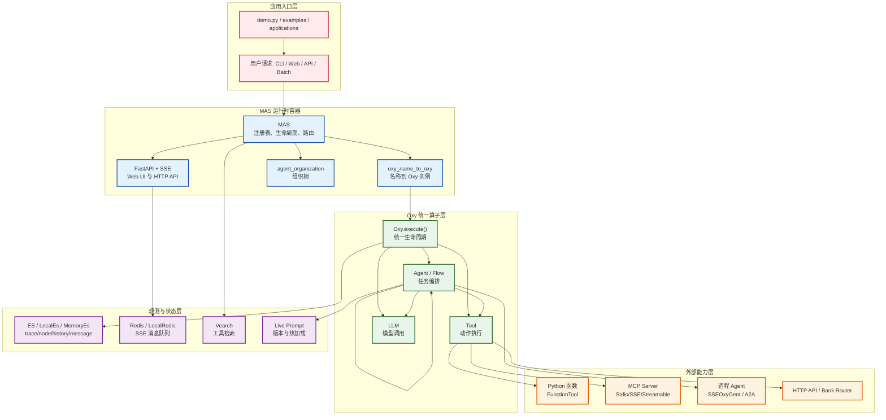
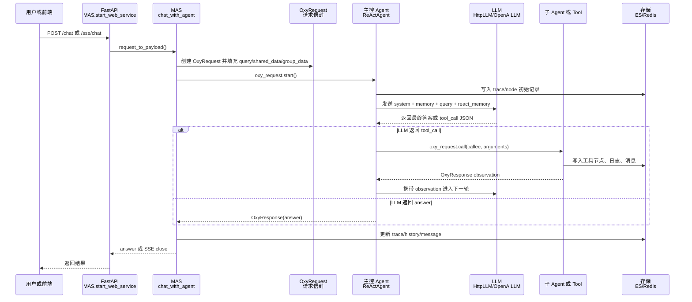
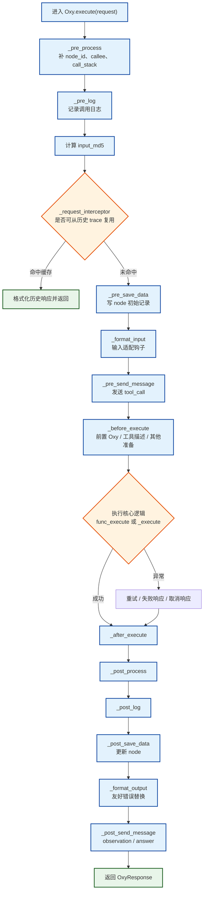
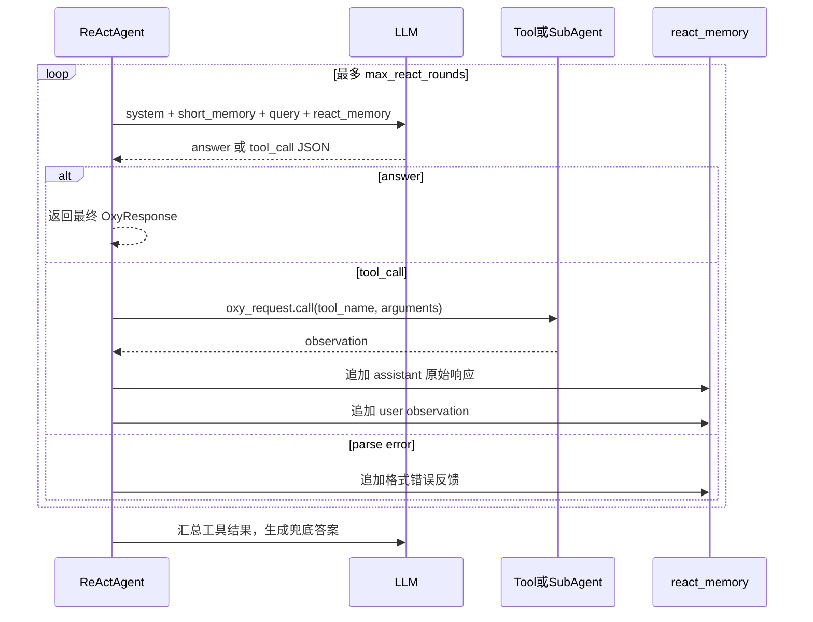
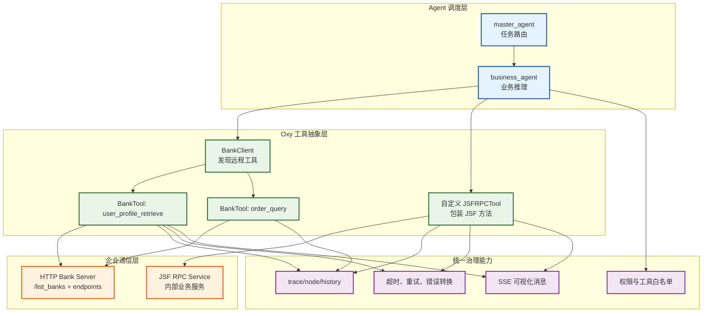

# OxyGent 源码执行流程与设计思想深度导读

> 本文面向已经能跑通 OxyGent 示例、但希望真正读懂源码的人。它不是 API 清单，而是从运行入口、调用链、核心抽象、存储追踪、智能体编排和扩展机制出发，解释 OxyGent 为什么这样组织代码，以及这种组织方式适合解决什么问题。

---

## 0. 阅读导引：先建立整体模型

第一次读 OxyGent 时，不建议从方法名开始记忆。更有效的方式是先理解它的整体模型：OxyGent 不是一个只负责调用大模型的库，而是一个把模型、工具、智能体、工作流和远程服务组织起来的多智能体运行框架。

它要解决的问题可以概括为：当一个任务不再是“让 LLM 回答一句话”，而是需要模型判断、调用工具、调度子 Agent、访问远程 RPC 服务、保存执行记录、向前端流式展示过程时，系统应该如何组织，才能既保留智能体的灵活性，又保留工程系统需要的控制力。

OxyGent 的第一个核心抽象是 `Oxy`。它把不同类型的能力统一成“可调用节点”：LLM 是节点，Agent 是节点，Tool 是节点，Flow 是节点，远程服务经过适配后也是节点。这样做的意义在于，框架可以用同一套执行生命周期管理所有节点，而不是为模型、工具、Agent 分别写一套调用逻辑。

统一成 `Oxy` 之后，框架可以统一处理调用前后的公共问题：谁调用了谁、输入是什么、输出是什么、是否超时、是否失败、是否需要重试、是否需要发送前端消息、是否需要写入 trace 和历史记录。开发者实现新工具或新 Agent 时，只需要关注核心执行逻辑，外围治理能力由 `Oxy.execute()` 承担。

第二个核心抽象是 `MAS`。`MAS` 是运行时容器，负责注册所有 Oxy 节点、初始化数据库和远程工具、确定主控 Agent、构建 Agent 组织树，并提供 CLI、Batch、Web API、SSE 等运行入口。也就是说，`MAS` 不只是一个对象列表，而是把声明出来的组件转化为可运行系统的初始化和调度中心。

第三个核心抽象是 `OxyRequest`。用户请求进入系统后，不会只以字符串形式传递，而是被封装成一个带上下文的请求对象。它包含 query、trace id、调用方、被调用方、父节点、调用栈、共享数据、会话数据、并行关系和历史恢复信息。后续每次 Agent 调用工具或子 Agent，都会基于这个请求对象复制出新的调用上下文。这样，复杂任务会被记录为一棵可追踪的执行树，而不是一串不可观察的函数嵌套。

默认的自主执行模式主要由 `ReActAgent` 承担。它会把系统提示词、历史记忆、用户问题和可用工具描述交给 LLM；如果 LLM 判断可以直接回答，就返回答案；如果需要外部能力，就输出工具调用 JSON；Agent 再通过 `OxyRequest.call()` 调用对应 Oxy 节点，并把工具结果作为 observation 放回下一轮上下文。这个循环使 Agent 既能推理，也能行动。

多 Agent 设计的价值在于能力分层。主控 Agent 负责理解用户意图和调度方向，子 Agent 负责稳定领域内的执行能力。例如 time_agent 管时间工具，file_agent 管文件工具，math_agent 管数学工具。每个 Agent 可以拥有独立的工具集合、Prompt、记忆策略和权限边界。这样既减少单个 Agent 的上下文压力，也降低工具误用概率。

在企业场景中，工具往往不是本地 Python 函数，而是 HTTP 服务、MCP 服务、A2A 远程 Agent，或者内部 JSF RPC 服务。OxyGent 的设计不是让 LLM 直接理解这些协议，而是先把它们适配成普通 Oxy 工具。例如一个 JSF RPC 的“查询订单状态”方法，可以包装成 `query_order_status` 工具：LLM 只看到工具名称、描述和业务参数；真正的 JSF 调用、鉴权、系统参数注入和异常转换都在工具内部完成。

这里体现了 OxyGent 的一个重要设计取舍：它允许 LLM 自主选择工具，但不把系统控制权完全交给 LLM。某些工具可以让模型在 ReAct 循环中自行决定是否调用；某些用户画像、权限、业务上下文则可以通过 `preceding_oxy` 在执行前强制加载；某些写操作或高风险动作可以放入 `WorkflowAgent` 或人工确认流程。`tools`、`banks`、`sub_agents`、`preceding_oxy`、`WorkflowAgent` 这些机制，本质上是在区分“由模型决策”与“由工程规则保证”的边界。

最后，OxyGent 把可观测性作为基础能力。每个节点都会留下 trace，前端可以看到 tool_call、observation、stream、answer，存储层保存 trace、node、history、message。任务失败时，可以定位到具体节点；中间结果错误时，可以从某个节点重新执行；Agent 表现不稳定时，可以用历史数据改 Prompt、改工具描述、做评估或训练。

因此，可以用下面这句话概括全文主线：

> OxyGent 把多 Agent 系统做成一棵可治理的执行树。树上的每个节点都是 Oxy，节点之间通过带上下文和权限的请求信封通信；本地工具、远程 RPC、MCP、A2A、LLM 都被包进同一套节点模型里；框架负责追踪、存储、消息、重试和可视化，Agent 负责推理和协作。

后续章节会不断回到这条主线：先看组件如何注册，再看请求如何流动，再看 Agent 如何调度工具，最后看远程 RPC、存储、Prompt 和协议互操作如何接入同一套执行模型。

---

## 0.1 第一次阅读应先抓住的五个判断

如果目标是尽快熟悉项目，可以先抓住下面五个判断，再进入源码细节：

第一，`MAS` 是运行时容器。所有组件先注册到这里，组件名称就是它们在系统内被引用和调度的身份。

第二，`Oxy` 是统一节点。模型、Agent、工具、流程、远程能力最终都要进入 Oxy 生命周期。

第三，`OxyRequest` 是请求信封。它让一次多 Agent 调用不是散乱的函数嵌套，而是一棵有 trace 的执行树。

第四，`ReActAgent` 是默认的自主执行方式。它让 LLM 在“回答”和“调用工具”之间循环，直到拿到足够信息。

第五，RPC/JSF/MCP/A2A 不是另一套体系。它们会被适配成 Oxy 工具或远程 Agent，然后继续走同一套权限、追踪和消息机制。

这五个判断是阅读整篇文档的基础。后面的类名、方法名和流程图，都可以放回这五个判断中理解。

---

## 1. 一句话总览

OxyGent 的核心思想是：把 LLM、Agent、Tool、Flow、远程 Agent、MCP 工具都统一成一种可注册、可调用、可追踪、可持久化的原子算子 `Oxy`，再用 `MAS` 作为运行时容器把这些算子按名称组织成多智能体系统。

换句话说，OxyGent 不是把“智能体”写成一个特殊大对象，而是把系统拆成很多同构节点：

- `HttpLLM` 是一个 Oxy。
- `ReActAgent` 是一个 Oxy。
- `FunctionTool` 是一个 Oxy。
- `PlanAndSolve` 这种流程也是一个 Oxy。
- 远端 OxyGent 服务、A2A 服务、MCP Server 暴露出来的能力，也会被包装成 Oxy。

这种“同构节点 + 统一运行时”的设计，使得权限、超时、重试、日志、SSE 消息、ES 追踪、历史记忆、并发控制都能复用同一套执行管线。

---

## 2. 项目结构地图

读源码时可以按下面的层次理解：

```text
oxygent/
├── __init__.py                    # 对外导出 MAS、Config、oxy 等入口
├── config.py                      # 全局配置中心，支持 config.json 与环境变量替换
├── mas.py                         # MAS 运行时容器：注册、启动、路由、Web/SSE、存储
├── routes.py                      # 内置 Web API、历史、评分、Prompt 管理等接口
├── oxy/
│   ├── base_oxy.py                # Oxy 统一生命周期模板
│   ├── base_tool.py               # Tool 基类
│   ├── base_flow.py               # Flow/Agent 基类上层
│   ├── agents/                    # Chat/ReAct/Workflow/Parallel/Skill/Remote/A2A Agent
│   ├── flows/                     # PlanAndSolve、Reflexion、ParallelFlow、Workflow
│   ├── llms/                      # BaseLLM、HttpLLM、OpenAILLM、LocalLLM、MockLLM
│   ├── function_tools/            # FunctionHub、FunctionTool
│   ├── mcp_tools/                 # MCP Client 与 MCPTool 代理
│   ├── api_tools/                 # HTTP API 工具
│   └── bank_tools/                # BankTool/BankClient 工具银行
├── schemas/                       # OxyRequest、OxyResponse、Memory、Message、Usage 等数据模型
├── databases/                     # ES/Redis/VectorDB 的真实与本地实现
├── live_prompt/                   # 动态 Prompt 管理与热加载
├── transport/a2a/                 # A2A 协议网关与消息映射
├── preset_tools/                  # 文件、时间、数学、Shell、Python 等预置工具
└── web/                           # 内置可视化前端静态资源
```

外层目录的角色也很清晰：

- `demo.py`：最小可运行的多智能体系统入口。
- `examples/`：按场景展示如何组合框架能力。
- `applications/`：更接近业务应用的示例，如银行场景。
- `function_hubs/`：业务函数工具集合。
- `mcp_servers/`：本地 MCP Server 示例。
- `tests/`：验证生命周期、MAS 初始化、Agent、Tool、MCP、A2A、回归场景。
- `docs/`：使用者文档和 API 文档。

---

## 3. 总体架构图



---

## 4. 从 `demo.py` 开始的一次启动流程

`demo.py` 展示了 OxyGent 最典型的组装方式：

1. `Config.set_agent_llm_model("default_llm")` 设置默认 Agent 使用的模型名。
2. `oxy_space` 声明所有组件，包括一个 `HttpLLM`、若干 `preset_tools`、多个子 `ReActAgent` 和一个 `is_master=True` 的主控 `ReActAgent`。
3. `async with MAS(oxy_space=oxy_space) as mas` 启动运行时。
4. `mas.start_web_service(...)` 启动 FastAPI、SSE 和内置 Web UI。

源码中的关键路径：

```text
demo.py
└── async with MAS(...)
    ├── MAS.__aenter__()
    │   ├── MAS.init()
    │   │   ├── add_oxy_list(oxy_space)
    │   │   ├── init_db()
    │   │   ├── init_all_oxy()
    │   │   ├── init_master_agent_name()
    │   │   ├── create_vearch_table()
    │   │   ├── init_agent_organization()
    │   │   └── setup_dynamic_agents()
    │   └── routes.set_global_mas_instance(self)
    └── MAS.start_web_service()
        ├── 创建 FastAPI app
        ├── 挂载内置 routes 与用户 routers
        ├── 挂载 /web 静态资源
        ├── 注册 /chat、/sse/chat、/async/chat 等端点
        └── uvicorn.Server(...).serve()
```

### 启动阶段的几个关键动作

`MAS` 初始化不是简单地保存一个列表，而是完成运行时编译：

- **注册组件**：`oxy_space` 中每个 Oxy 按 `name` 写入 `oxy_name_to_oxy`，重名直接报错。
- **初始化数据库**：默认不要求外部 ES/Redis，未配置时会降级到 `LocalEs` 或 `LocalRedis`；测试中常用 `MemoryEs`。
- **分批初始化 Oxy**：先初始化 `BaseLLM` 和 `BaseTool`，再初始化 `BaseFlow` 和 `BaseAgent`。这样 Agent 初始化时已经能看见工具和 LLM。
- **解析名称引用**：Agent 的 `tools`、`sub_agents`、`banks` 都会转成 `permitted_tool_name_list`。
- **确定入口 Agent**：优先取 `is_master=True`，否则取第一个 Agent。
- **构建组织树**：`agent_organization` 会递归展示 master、子 Agent、工具和远端组织结构。
- **接入动态 Prompt**：`live_prompt` 会注册可热加载 Prompt 的 Agent。

---

## 5. 一次用户请求的完整执行链路

Web 模式下，用户请求通常进入 `/chat` 或 `/sse/chat`。二者最终都会调用 `MAS.chat_with_agent()`。



从代码上看，`chat_with_agent()` 做了几件非常重要的事：

1. **处理 restart/replay**：如果 payload 带有 `restart_node_id`，会从 ES 中恢复原始 payload，并设置 `reference_trace_id`、`restart_node_order` 等字段。
2. **初始化共享数据**：确保 `shared_data` 存在，并写入 `_metrics._query_start_time` 和用户原始 `query`。
3. **构造 `OxyRequest`**：payload 中属于 `OxyRequest` 字段的直接写入请求对象，其他字段放进 `arguments`。
4. **继承历史会话**：如果传入 `from_trace_id`，会从上一轮 trace 取回 `group_id` 和 `group_data`，形成跨轮上下文。
5. **确定 callee**：没有显式 callee 时，默认调用 `master_agent_name`。
6. **启动执行**：调用 `oxy_request.start()`，由被调用的 Oxy 接管生命周期。
7. **清理交互队列**：请求结束后清理 feedback channel。

这里的设计亮点是：Web、CLI、Batch、编程式调用最后都汇入同一个 `chat_with_agent()`。所以运行模式不同，但核心执行语义一致。

---

## 6. `Oxy` 生命周期：框架最核心的模板方法

`oxygent/oxy/base_oxy.py` 是读懂项目的第一核心文件。所有组件最终都会走 `Oxy.execute()`。



这个生命周期把每个节点的“业务执行”压缩到 `_execute()`，其余都是框架治理能力：

- 并发：每个 Oxy 有独立 `asyncio.Semaphore`。
- 超时：实际跨 Oxy 调用由 `OxyRequest.call()` 用 `asyncio.wait_for` 包裹。
- 重试：`Oxy.execute()` 内部按 `retries` 和 `delay` 重试。
- 追踪：每个节点写入 `{app}_node`，用户入口 Agent 还会写 `{app}_trace`。
- 消息：执行前发送 `tool_call`，执行后发送 `observation`，用户入口返回 `answer`。
- 历史复用：restart 场景下通过 `input_md5` 和 `reference_trace_id` 尝试复用旧节点输出。
- 钩子扩展：`func_process_input`、`func_process_output`、`func_format_input`、`func_format_output`、`func_execute`、`func_interceptor` 可在不改子类的情况下插入逻辑。

### 为什么这是一个好设计

OxyGent 把“生产环境智能体系统必须有的横切能力”放到了基类生命周期里。这样新增一个工具或 Agent 时，只需要实现 `_execute()`，就自动得到日志、追踪、消息、重试、权限、存储、前端可视化能力。

这比在每个 Agent 或 Tool 里手写日志和存储更稳，也让可观测性成为系统默认属性，而不是后期补丁。

---

## 7. `OxyRequest`：调用链真正的载体

`OxyRequest` 位于 `oxygent/schemas/oxy.py`。它不是普通参数字典，而是整个调用树的上下文信封。

它携带的信息可以分成几类：

| 类别 | 字段 | 作用 |
|------|------|------|
| 请求身份 | `request_id`、`group_id`、`current_trace_id`、`from_trace_id` | 区分前端请求、会话组、当前 trace 和父 trace |
| 重启复用 | `reference_trace_id`、`restart_node_id`、`restart_node_output`、`restart_node_order`、`input_md5` | 支持从历史节点重放或从某节点继续执行 |
| 调用树 | `caller`、`callee`、`call_stack`、`node_id_stack`、`father_node_id`、`pre_node_ids` | 记录谁调用谁，形成可视化执行树 |
| 并行关系 | `parallel_id`、`parallel_dict`、`latest_node_ids` | 表示同一批并行节点及依赖顺序 |
| 数据作用域 | `arguments`、`shared_data`、`group_data`、`global_data` | 区分调用参数、trace 共享、会话共享、MAS 全局共享 |
| 消息控制 | `is_save_history`、`is_send_message`、`is_async_storage` | 控制历史、SSE、异步存储 |

### `OxyRequest.call()` 是跨节点调用原语

Agent 或 Tool 调用其他 Oxy 时，不直接拿对象执行，而是调用：

```python
await oxy_request.call(callee="some_tool", arguments={...})
```

这个方法会：

1. 深拷贝当前请求，但保留 `mas`、`shared_data`、`group_data` 的共享引用。
2. 生成新的 `node_id`，设置父子节点、调用方、被调用方、并行批次。
3. 检查目标 Oxy 是否存在。
4. 做权限检查：非用户调用方只能调用自己 `permitted_tool_name_list + permitted_oxy` 内的 Oxy。
5. 为 `retrieve_tools` 和 `system_args` 注入框架参数。
6. 用目标 Oxy 的 `timeout` 包裹 `oxy.execute()`。

这解释了为什么 OxyGent 大量使用“名称引用”：调用时只需要 `callee` 名称，真正的对象解析、权限和治理都在运行时完成。

### 三层数据作用域

OxyGent 对数据作用域做了明确区分：

- `arguments`：本次调用参数，子调用会通过 clone 获得自己的副本。
- `shared_data`：当前 trace 树共享，父 Agent、子 Agent、工具都能看见同一个引用。
- `group_data`：跨多轮 trace 的会话级数据，`from_trace_id` 会触发历史合并。
- `global_data`：MAS 实例级全局数据，所有请求共享。

这种设计避免了所有状态都塞进 prompt 或全局变量，也让“单次任务状态”“多轮会话状态”“进程级状态”边界更清楚。

---

## 8. Agent 体系：从 LocalAgent 到 ReAct

Agent 继承链大致是：

```text
Oxy
└── BaseFlow
    └── BaseAgent
        ├── LocalAgent
        │   ├── ChatAgent
        │   ├── ReActAgent
        │   ├── ParallelAgent
        │   ├── PlanAndSolveAgent
        │   ├── WorkflowAgent
        │   ├── RAGAgent
        │   ├── ShellUseAgent
        │   └── SkillAgent
        └── RemoteAgent
            ├── SSEOxyGent
            └── A2AClientAgent
```

### 8.1 BaseAgent：入口 trace 和历史记忆

`BaseAgent` 扩展了 `Oxy` 的存储逻辑：

- 如果调用方是用户，会写入 `{app}_trace`，记录一次用户请求的入口 trace。
- 执行结束后更新 trace 的输出。
- 如果 `is_save_history=True`，会向 `{app}_history` 写入 query-answer，用于短期记忆。
- 如果有 `from_trace_id`，会加载父 trace 的 `root_trace_ids`，把多轮对话串成一棵 trace 树。

### 8.2 LocalAgent：工具集合、Prompt、记忆、检索

`LocalAgent` 是本地智能体的能力中枢：

- 根据 `tools`、`sub_agents`、`banks` 初始化 `permitted_tool_name_list`。
- 支持 `FunctionHub`、`BaseMCPClient`、`BankClient` 这种“一组工具”的展开。
- 初始化时检查 `llm_model` 是否存在。
- 加载短期历史 `_get_history()`，写入 `short_memory`。
- 支持 `is_retain_master_short_memory`，让子 Agent 也能看到 master 与用户的短期历史。
- 支持 Live Prompt：通过 `prompt_key` 从 PromptManager 解析和热加载 Prompt。
- 支持 Vearch 工具检索：在工具多时通过 `retrieve_tools` 给 LLM 只注入相关工具描述。
- `team_size > 1` 时会复制多个 Agent 实例，并把原 Agent 替换为一个 `ParallelAgent`。

`LocalAgent` 的设计重点不是“怎么回答问题”，而是“给不同类型的 Agent 准备一致的上下文”：工具描述、Prompt、历史、LLM、子 Agent 权限。

### 8.3 ChatAgent：最简单的 LLM 调用

`ChatAgent._execute()` 很薄：

1. 构造 system prompt。
2. 加载 short memory。
3. 追加当前 query。
4. 调用 `llm_model`。

它适合纯对话或作为某些流程里的 planner/evaluator。

### 8.4 ReActAgent：框架最重要的自主循环

`ReActAgent` 实现 Reasoning + Acting：



源码中的关键点：

- `_parse_llm_response()` 会从模型输出中提取 JSON，如果有 `tool_name` 就视为工具调用，否则视为最终回答或格式错误。
- 多个工具调用会用 `asyncio.gather()` 并行执行，并共享同一个 `parallel_id`。
- 工具结果会被包装成 `Observation`，再变成下一轮 user message。
- `trust_mode` 或工具返回中的 `trust_mode=1` 可以让 Agent 直接把工具结果作为最终答案。
- 超过最大轮数后，会把历史 observation 汇总给 LLM 生成兜底答案。

这里的特有设计是：OxyGent 的 ReAct 不只是在 prompt 层约束工具调用格式，还把每次工具调用都落成可追踪的 Oxy 节点。也就是说，ReAct 思考过程不是一串不可见文本，而是一棵可回放的执行树。

### 8.5 WorkflowAgent：把“智能体”降级成可编程工作流

`WorkflowAgent` 不走 LLM 推理循环，而是执行用户提供的 `func_workflow(oxy_request)`。这很重要，因为实际业务里并不是所有步骤都应该交给模型决定。

适合场景：

- 人机协同：等待 `/feedback` 输入。
- 固定业务流程：先查订单，再查库存，再生成回复。
- 混合编排：在工作流里显式调用某些 Agent 或工具。

### 8.6 ParallelAgent 与 ParallelFlow：并行是一等能力

`ParallelAgent` 会把同一任务分发给 `permitted_tool_name_list` 中的多个成员，再用 LLM 汇总结果。`ParallelFlow` 则是更轻的并行流程，直接拼接多路输出。

并行能力不是通过外部调度器实现的，而是在 `OxyRequest` 的 `parallel_id`、`pre_node_ids`、`latest_node_ids` 中记录依赖关系，因此前端可视化和 ES trace 能看到并行结构。

### 8.7 PlanAndSolve 与 Reflexion：把推理模式做成 Flow

`PlanAndSolve` 先调用 planner 产出步骤，再调用 executor 逐步执行，可选 replanner。它用 `PydanticOutputParser` 约束 planner/replanner 输出结构。

`Reflexion` 则是 worker 先答，reflexion agent 评估，不满意就根据反馈重写问题继续迭代。`MathReflexion` 是针对数学检查的特化。

这些流程说明 OxyGent 的设计不是只有 ReAct 一种智能体，而是允许把常见“推理范式”沉淀为可组合的 Oxy。

---

## 9. Tool 体系：把外部动作包装成 Oxy

工具体系的基类是 `BaseTool`。它和 Agent 一样继承 `Oxy`，但默认：

- `category="tool"`
- `is_permission_required=True`
- 使用工具级 `semaphore` 和 `timeout`

### 9.1 FunctionTool 与 FunctionHub

`FunctionTool` 把普通 Python 函数包装成工具：

- 用 `inspect.signature()` 提取函数参数。
- 支持 Pydantic `Field(..., description="...")` 作为参数描述。
- 自动生成 `input_schema` 和 `desc_for_llm`。
- 执行时从 `oxy_request.arguments` 取参。
- 如果函数参数类型名是 `OxyRequest`，会把当前请求对象注入进去。

`FunctionHub` 是装饰器式工具集合：

```python
fh = FunctionHub(name="math_tools")

@fh.tool("Add two numbers")
def add(a: int, b: int) -> int:
    return a + b
```

初始化时，`FunctionHub.init()` 会把每个注册函数变成独立 `FunctionTool` 并加入 MAS 注册表。同步函数会被包装到线程池中执行，避免阻塞事件循环。

### 9.2 MCP 工具

`BaseMCPClient` 把 MCP Server 包装为工具来源：

1. MCP client 初始化连接 server。
2. `list_tools()` 从 server 获取工具清单。
3. 每个远端工具被包装成一个 `MCPTool` 并注册到 MAS。
4. Agent 引用 MCP client 时，`LocalAgent._init_available_tool_name_list()` 会把 client 的 `included_tool_name_list` 展开为可调用工具。
5. `MCPTool._execute()` 再委托给父 `BaseMCPClient._execute()`，最终调用 MCP 的 `call_tool()`。

这是一层典型代理设计：LLM 看到的是普通工具，框架内部知道它来自 MCP。

### 9.3 HttpTool、BankTool 与工具银行

`HttpTool` 适合把 HTTP API 封装成 Oxy 工具。`BankTool`/`BankClient` 则服务于“工具银行”模式：一组 API 可以通过 FastAPI router 对外暴露，也可以被 Agent 作为工具集合调用。

这种工具银行设计有业务工程意义：企业内部已有大量 HTTP/RPC 能力时，不必全部改造成 Python 函数，只要做协议包装即可进入智能体系统。

---

## 10. LLM 层：模型也是 Oxy

`BaseLLM` 同样继承 `Oxy`，所以模型调用也会被记录为 trace/node。它提供了几类通用能力：

- 合并系统 prompt 与用户消息。
- 多模态输入解析：支持 markdown 风格的图片、视频、文件链接。
- 可选将图片/视频 URL 转为 base64。
- 提取 `<think>...</think>` 或 JSON 中的 `think`，发送到前端。
- 聚合 token usage 到 `shared_data._metrics`。
- 统一构建 payload：全局 LLM 配置 < 实例 `llm_params` < 单次请求参数。

`HttpLLM` 支持 OpenAI-compatible、Gemini、Ollama 风格接口，并支持流式输出。每个流式 token 会通过 `oxy_request.send_message()` 发送 `stream` 消息，最后发送 `stream_end`。

`OpenAILLM` 使用官方 `AsyncOpenAI` client，并对 `reasoning_content` 做了特殊处理：流式输出开始时包一层 `<think>`，结束后补 `</think>`，这样前端可以把思考过程和最终内容分开显示。

LLM 被建模为 Oxy 的好处是明显的：模型不是黑箱依赖，而是执行树中的一类节点。它有超时、重试、token 统计、输入输出持久化、SSE 流式事件，也能被 Agent 或 workflow 通过名称直接调用。

---

## 11. 存储、消息和可观测性

OxyGent 的生产化味道主要体现在可观测性上。

### 11.1 ES 索引设计

`MAS.init_db()` 会创建多类索引：

| 索引 | 作用 |
|------|------|
| `{app}_trace` | 一次用户入口请求的总记录，含输入、输出、父 trace、group_data |
| `{app}_node` | 执行树中每个 Oxy 节点的输入、输出、状态、调用关系 |
| `{app}_history` | query-answer 历史，供短期记忆检索 |
| `{app}_message` | SSE 消息存储，支持流式消息合并 |
| `{app}_prompt` | Live Prompt 当前版本 |
| `{app}_prompt_history` | Prompt 历史版本 |
| `{app}_rating` | 用户评分明细 |
| `{app}_rating_stats` | trace 评分聚合 |

未配置真实 ES 时，框架使用：

- `LocalEs`：文件系统 JSON 存储，带原子写、UTF-8 迁移、损坏文件保护。
- `MemoryEs`：纯内存存储，适合单测和短生命周期任务。

### 11.2 Redis 与 SSE 消息

前端流式消息通过 `MAS.send_message()` 进入 Redis/LocalRedis 队列：

- `/sse/chat` 创建后台任务执行 `chat_with_agent()`。
- 同时 `event_stream()` 从 Redis key 中弹出消息。
- `tool_call`、`observation`、`think`、`stream`、`stream_end`、`answer` 都以结构化 SSE 消息发送。
- `stream` 消息可按 batch 合并后写入 ES，避免每个 token 一条文档。

这种设计把“执行任务”和“前端消费消息”解耦了：执行端只负责 push，SSE 端只负责 pop。

### 11.3 Restart / Replay

OxyGent 支持从历史节点重新执行：

- 用户提供 `restart_node_id`。
- `MAS.chat_with_agent()` 找到该节点所属 trace 和节点更新时间。
- 恢复原始 payload。
- `Oxy._request_interceptor()` 在后续执行中根据 `reference_trace_id + input_md5` 查找旧节点。
- 如果旧节点发生在 restart 节点之前，可以直接复用旧输出。
- 如果是 restart 节点本身且用户提供了新输出，则把该输出注入为新执行的结果。

这个机制的意义是：修改某个中间节点后，不需要整棵执行树从头真实重跑；能复用的历史节点会被复制到新 trace 中。

---

## 12. Live Prompt：Prompt 作为运行时资产

`live_prompt` 模块把 Prompt 从“代码里的字符串”提升为可版本化、可热加载的运行时资产：

- `PromptManager` 保存 prompt 当前版本和历史版本。
- 更新 Prompt 时先写 cache，再写 ES；ES 写失败会回滚 cache。
- `LocalAgent` 初始化时，如果 `use_live_prompt=True`，会按 `prompt_key` 解析 Prompt。
- `reload_prompt()` 可在运行时更新 `_resolved_prompt`。
- `DynamicAgentManager` 会扫描 MAS 中带 prompt 属性的 Agent 并建立 agent -> prompt_key 映射。
- `routes.py` 提供 Prompt 的增删改查、历史版本、回滚和优化接口。

这体现了 OxyGent 的一个设计立场：Agent 的能力不只由代码决定，也由 Prompt、工具、数据和运行时反馈共同决定。Prompt 应该能被管理，而不是散落在代码里。

---

## 13. 分布式与协议互操作

### 13.1 SSEOxyGent：把远端 OxyGent 当成本地 Agent

`SSEOxyGent` 继承 `RemoteAgent`：

- 初始化时请求远端 `/get_organization`，拿到远端组织树。
- 如果本地没写 `desc`，还会请求 `/get_description`。
- 执行时把当前 `OxyRequest` 转成远端 `/sse/chat` payload。
- 接收远端 SSE，并把非用户级的 `tool_call`、`observation`、`stream` 等消息转发到本地前端。
- 最终以远端 `answer` 作为本地 `OxyResponse.output`。

这让跨进程多智能体系统仍然保持统一的 Oxy 调用语义。

### 13.2 A2A：协议网关

`transport/a2a` 将 MAS 暴露成 A2A 兼容 Agent：

- `A2AServerGateway.build_router()` 生成 A2A 路由。
- `a2a_mapper.py` 将 A2A payload 转成 `MAS.chat_with_agent()` payload。
- `context_id` 映射为 `group_id`，`task_id` 映射为 `current_trace_id`。
- 引用任务会映射为 `from_trace_id`，从而复用 OxyGent 的会话机制。
- 流式 SSE delta 会被转换成 A2A task/message event。

这个模块的设计重点是“协议适配而非重写执行引擎”：A2A 请求最终仍进入 MAS/Oxy 生命周期。

---

## 14. OxyGent 的特有设计思想

### 14.1 Oxy 不是基类而已，而是系统的代数单位

很多框架把 Agent、Tool、LLM 分成不同调用体系。OxyGent 则把它们统一成 Oxy，所有节点都能被注册、调用、追踪、持久化。

这带来一个结果：系统的组合方式更像“算子图”。Agent 可以调用 Tool，Tool 也可以通过 `OxyRequest` 使用上下文，Flow 可以调用 Agent，远端 Agent 可以被当成本地子 Agent。只要它是 Oxy，就能进入同一套治理体系。

### 14.2 名称引用降低了组装复杂度

组件之间不直接保存 Python 对象引用，而是保存名称：

```python
oxy.ReActAgent(
    name="master_agent",
    sub_agents=["time_agent"],
    tools=["file_tools"],
    llm_model="default_llm",
)
```

名称引用让 `oxy_space` 更像声明式系统配置：

- 定义顺序可以更自由。
- Agent 初始化时统一校验引用是否存在。
- 远程组织树、工具集合展开、动态工具检索都可以基于名称工作。
- 权限控制可以落在“caller name -> allowed callee names”上。

代价是重命名需要谨慎，且运行时错误通常发生在 MAS 初始化或调用阶段，而不是构造对象时。

### 14.3 生命周期模板把工程治理前置

`Oxy.execute()` 把通用工程能力做成模板方法。子类只重写 `_execute()`，但自动获得：

- 日志
- Trace
- Node 存储
- SSE 消息
- 重试
- 超时
- 友好错误
- 前后处理钩子
- 历史复用
- 并发限制

这正是“生产级多智能体框架”和“几个 agent 脚本”的分水岭。

### 14.4 权限是调用图的一部分

OxyGent 默认工具需要权限。非用户调用方如果没有目标工具在 `permitted_tool_name_list + permitted_oxy` 中，请求会被 `OxyRequest.call()` 跳过。

这避免了 LLM 幻觉工具名后越权调用，也让每个 Agent 的能力边界在代码结构上显式可见。

### 14.5 可观测性优先于黑箱自治

ReActAgent 的每次模型调用、工具调用、Observation、最终 Answer 都会成为节点和消息。框架不是只追求“自动做完”，而是把“做了什么、为什么、哪一步失败、能否从中间重来”放在核心路径上。

这对调试复杂多智能体系统尤其重要。真正难的不是让 Agent 调工具，而是当它调错工具、参数错、远端失败、模型格式错时，能快速定位并恢复。

### 14.6 降级存储降低上手门槛

OxyGent 支持 ES、Redis、Vearch，但不强制一开始就部署这些基础设施。默认的 `LocalEs` 和 `LocalRedis` 让开发者可以在本机直接运行完整系统；测试可以用 `MemoryEs` 保持快速和隔离。

这是一种很务实的设计：生产路径存在，但开发路径不被生产依赖绑架。

### 14.7 Prompt、Tool、Agent 都可运行时演进

框架里有三条演进路径：

- Live Prompt：Prompt 可版本化和热加载。
- Vearch 工具检索：工具集大时，按 query 动态选择工具描述。
- Trace/History/Rating：执行数据可以反哺评估和训练。

这说明 OxyGent 不把智能体看作静态程序，而是看作可以持续调试、评估和迭代的运行系统。

---

## 15. 多 Agent 与 RPC 通信的深层设计

OxyGent 的多 Agent 能力不是简单地把多个 prompt 串起来，而是把 Agent、工具、远程服务、企业 RPC 能力都放进同一张可追踪调用图里。理解这一点之后，`sub_agents`、`tools`、`banks`、`preceding_oxy`、`SSEOxyGent`、A2A、MCP、BankClient 这些看似分散的概念会变成同一个主题：如何把不同边界上的能力都纳入 Oxy 调度。

### 15.1 多 Agent 的本质是“能力分层”，不是“模型数量变多”

在 `demo.py` 里，`master_agent` 并不直接拥有文件、时间、数学等全部工具，而是把能力分给 `time_agent`、`file_agent`、`math_agent`：

```python
oxy.ReActAgent(
    name="master_agent",
    is_master=True,
    sub_agents=["time_agent", "file_agent", "math_agent"],
)
```

这背后的思想是：主控 Agent 负责意图路由和任务分解，子 Agent 负责某个稳定领域的执行。每个子 Agent 有自己的工具集合、Prompt、记忆策略和权限边界。

这种拆分的价值不只是“模块化”，还有三个更深的收益：

- **上下文隔离**：文件 Agent 不需要看到数学工具的细节，数学 Agent 也不需要理解文件系统工具。每个 Agent 给 LLM 注入的工具描述更少，误调用概率更低。
- **能力边界清晰**：`permitted_tool_name_list` 明确规定谁能调用谁。主控可以调用子 Agent，子 Agent 只能调用自己被授权的工具。
- **组织树可视化**：`MAS.init_agent_organization()` 会把主从关系构造成 `agent_organization`，前端和 trace 都能看到这棵执行组织树。

所以 OxyGent 的多 Agent 更接近一种分层组织结构：Master 负责调度，Sub-Agent 负责领域执行，Tool/RPC 提供具体动作能力。

### 15.2 Agent 间通信为什么不用对象直连

OxyGent 没有让 Agent 直接保存另一个 Agent 的对象引用，而是统一使用：

```python
await oxy_request.call(callee="target_agent_or_tool", arguments={...})
```

这条调用边会自动完成：

- 克隆请求上下文。
- 设置 `caller`、`callee`、`father_node_id`、`call_stack`。
- 生成新的 `node_id`。
- 检查权限。
- 注入系统参数。
- 执行超时控制。
- 进入目标 Oxy 的完整生命周期。
- 保存 node 和 SSE 消息。

因此，Agent 间通信不是普通函数调用，而是“带治理的消息传递”。这使得一次复杂任务可以被拆成很多节点，但仍然保持统一的 trace、统一的权限模型、统一的错误处理和统一的前端可视化。

### 15.3 四层通信模型：本地、工具银行、远程 Agent、开放协议

OxyGent 实际上支持四个层次的通信边界。

| 通信层次 | 典型实现 | 解决的问题 |
|----------|----------|------------|
| 进程内 Oxy 调用 | `OxyRequest.call()` | 同一个 MAS 内 Agent/Tool/LLM 互调 |
| 远程工具调用 | `BankClient`、`BankTool`、`HttpTool`，也可适配 JSF RPC | 把企业已有服务变成 Agent 可调用工具 |
| 远程 Agent 调用 | `SSEOxyGent` | 把另一个 OxyGent MAS 当成本地子 Agent |
| 标准协议互操作 | MCP、A2A JSON-RPC | 与外部 Agent 框架和工具生态互通 |

这四层的共同点是：无论底层是本地函数、HTTP、SSE、JSON-RPC、MCP，还是企业内部的 JSF RPC，最终都要被包装成一个 Oxy 节点。包装之后，上层 Agent 不需要关心通信细节，只需要按名称调用。

### 15.4 JSF RPC 在这个架构中的位置

当前仓库里没有直接命名为 `JSFRPC` 的类，但它已经预留了非常自然的接入位置。JSF RPC 这类企业内部 RPC，本质上可以被视作“远程工具提供者”：

```text
ReActAgent
└── oxy_request.call("query_order")
    └── BankTool / HttpTool / 自定义 JSFRPCTool
        └── JSF RPC Client
            └── 企业内部服务
```

也就是说，JSF RPC 不应该直接暴露给 LLM。更好的方式是把每个可调用 RPC 方法包装成具有明确 `name`、`desc`、`input_schema` 的 Oxy Tool：

- `name`：稳定的工具名，如 `query_order_status`。
- `desc`：给 LLM 看的能力描述。
- `input_schema`：参数结构，区分业务参数和系统参数。
- `_execute()`：内部完成 JSF RPC 调用、异常转换、结果格式化。

这样做的关键收益是：企业 RPC 能力进入智能体系统后，不会破坏 OxyGent 的治理边界。它仍然有权限、超时、重试、trace、node 存储、SSE observation、前后处理钩子。

### 15.5 BankClient/BankRouter 是“RPC 工具银行”的参考实现

`BankClient` 和 `BankTool` 已经实现了一个远程工具银行模式：

1. Bank 服务通过 `/list_banks` 暴露工具清单。
2. 每个工具清单项包含 `name`、`endpoint`、`description`、`inputSchema`。
3. `BankClient.init()` 拉取工具清单。
4. `BankClient.add_tools()` 为每个远程工具动态创建 `BankTool`。
5. Agent 在 `banks=["remote_user_profile_banks"]` 中引用工具银行。
6. `LocalAgent._init_available_tool_name_list()` 把银行里的工具展开成可调用工具名。
7. LLM 在 ReAct 循环中按普通工具调用它。

这套模式如果迁移到 JSF RPC，只需要把“HTTP endpoint 调用”替换成“JSF RPC 方法调用”。发现协议可以继续保留 `/list_banks` 这种元数据接口，也可以在本地配置中声明工具元数据。核心不变：远程方法先变成工具元数据，再注册为 Oxy。



### 15.6 自主模式与刚性模式：让 LLM 决策，还是让工程规则决策

OxyGent 在 Bank 示例里展示了两种非常重要的多 Agent / RPC 使用模式。

**自主模式**：把远程工具放进 Agent 的 `banks` 或 `tools`。

```python
oxy.ReActAgent(
    name="user_agent",
    banks=["remote_user_profile_banks"],
)
```

这时 LLM 会在 ReAct 循环中根据用户问题自行决定是否调用工具。它灵活，适合开放问题，但稳定性取决于模型判断。

**刚性模式**：把远程工具放进 `preceding_oxy`。

```python
oxy.ReActAgent(
    name="user_agent",
    preceding_oxy=["user_profile_retrieve"],
    prompt="用户画像：${preceding_text}\n请回答：${query}",
)
```

这时工具调用发生在 `_before_execute()` 之前，由框架强制执行，不需要 LLM 判断。它适合“必须查权限、必须取用户画像、必须加载业务上下文”的场景。

这两种模式体现了 OxyGent 很成熟的一点：它没有把所有决策都交给 LLM。哪些步骤由模型自治，哪些步骤由工程规则保证，可以按业务风险选择。

对于 JSF RPC 类服务，这个区分尤其重要：

- 查询天气、查百科、查公开信息：可以自主调用。
- 查用户账户、订单、合同、权限、余额：通常更适合刚性前置或受控 workflow。
- 写操作、扣款、提交审批：应放在 workflow 或带人工确认的工具里，而不是完全自由地暴露给 ReAct。

### 15.7 SystemArg：企业 RPC 中很关键的隐式上下文

`Oxy._set_desc_for_llm()` 会识别参数描述中以 `SystemArg.` 开头的字段，并把它加入 `system_args`，不展示给 LLM。

Bank 示例中的参数：

```python
user_pin: str = Body(description="SystemArg.user_pin")
agent_pin: str = Body(description="SystemArg.agent_pin")
```

这些参数不会出现在 LLM 可见的工具描述里，而是在 `OxyRequest.call()` 中由框架注入：

```text
agent_pin <- 当前调用方 Agent
user_pin  <- group_data["user_pin"]
```

这对 JSF RPC 很有价值。企业 RPC 经常需要租户、用户、权限、渠道、调用方身份、trace id 等上下文字段。如果让 LLM 自己填写这些字段，既不安全也不稳定。更合理的方式是：

- LLM 只填写业务参数。
- 框架从 `group_data`、`shared_data`、headers、登录态中注入系统参数。
- RPC Tool 在 `_execute()` 内部组合完整请求。

这使得“自然语言决策”和“企业调用上下文”分离：模型负责选择动作和业务参数，系统负责身份、安全和治理。

### 15.8 多 Agent + RPC 的真实执行形态

一个企业场景里的 OxyGent 调用可能长这样：

```text
用户问题：帮我查一下这个订单为什么退款失败

master_agent
├── intent_agent
│   └── LLM 判断：这是售后/订单问题
├── order_agent
│   ├── preceding_oxy: user_profile_retrieve
│   │   └── JSF RPC: 查询用户画像/权限
│   ├── ReAct: order_query
│   │   └── JSF RPC: 查询订单详情
│   ├── ReAct: refund_status_query
│   │   └── JSF RPC: 查询退款状态
│   └── LLM 汇总：解释失败原因
└── master_agent
    └── 返回用户可读答案
```

这棵树中，每个 RPC 调用都不是散落的外部副作用，而是 trace 中的节点：

- 可以看到哪个 Agent 发起了调用。
- 可以看到传入参数和输出。
- 可以看到是否超时、失败、重试。
- 可以从某个节点 restart。
- 可以把成功/失败样本用于评估和训练。

这就是 OxyGent 多 Agent + RPC 通信的深层价值：它把企业内部能力纳入 Agent 的认知和行动空间，但又没有放弃工程系统必须有的控制面。

### 15.9 为什么这种设计适合生产环境

生产环境里的多 Agent 系统通常会遇到四类矛盾：

1. **模型需要自由推理，但企业服务需要严格边界。**
   OxyGent 用工具白名单、SystemArg、workflow、preceding_oxy 来划边界。

2. **业务能力分散在很多 RPC/HTTP/MCP 服务里，但 Agent 需要统一调用。**
   OxyGent 用 Oxy 抽象把不同协议包成同一种节点。

3. **复杂任务需要多 Agent 协作，但问题排查需要完整链路。**
   OxyGent 用 `call_stack`、`node_id_stack`、`trace/node/history/message` 保存执行图。

4. **Agent 要持续优化，但线上 Prompt 和工具策略不能靠发版硬改。**
   OxyGent 用 Live Prompt、工具检索、评分和 trace 数据形成迭代闭环。

因此，这个项目真正深刻的地方不是“实现了多 Agent”，而是实现了一套多 Agent 与企业服务通信的运行时协议：Agent 的每次推理和每次 RPC 动作都被纳入同一个可治理、可回放、可演进的系统。

---

## 16. 读源码推荐顺序

如果要继续深入，建议按这个顺序读：

1. `demo.py`：理解最小系统如何声明。
2. `oxygent/__init__.py` 和 `oxygent/oxy/__init__.py`：看对外 API 如何导出。
3. `oxygent/mas.py`：读 `init()`、`chat_with_agent()`、`start_web_service()`。
4. `oxygent/schemas/oxy.py`：读 `OxyRequest.call()`、`start()`、`send_message()`。
5. `oxygent/oxy/base_oxy.py`：逐行读 `Oxy.execute()`。
6. `oxygent/oxy/agents/local_agent.py`：理解工具权限、Prompt、历史、检索。
7. `oxygent/oxy/agents/react_agent.py`：理解 ReAct 主循环。
8. `oxygent/oxy/function_tools/` 与 `oxygent/oxy/mcp_tools/`：理解工具注册。
9. `oxygent/oxy/llms/`：理解模型调用、流式消息、多模态。
10. `oxygent/databases/` 与 `oxygent/routes.py`：理解可观测性和 Web API。
11. `oxygent/live_prompt/` 与 `oxygent/transport/a2a/`：理解生产扩展能力。
12. `tests/integration/test_mas_integration.py`、`tests/unittest/test_react_agent.py`、`tests/integration/test_tool_integration.py`：用测试校验自己的理解。

---

## 17. 关键源码入口速查

| 主题 | 主要文件 |
|------|----------|
| MAS 初始化和 Web 服务 | `oxygent/mas.py` |
| Oxy 生命周期 | `oxygent/oxy/base_oxy.py` |
| 请求、响应、调用信封 | `oxygent/schemas/oxy.py` |
| Agent 公共逻辑 | `oxygent/oxy/agents/base_agent.py`、`local_agent.py` |
| ReAct 循环 | `oxygent/oxy/agents/react_agent.py` |
| ChatAgent | `oxygent/oxy/agents/chat_agent.py` |
| 并行 Agent | `oxygent/oxy/agents/parallel_agent.py` |
| 工作流 Agent | `oxygent/oxy/agents/workflow_agent.py` |
| Plan and Solve | `oxygent/oxy/flows/plan_and_solve.py`、`oxygent/oxy/agents/plan_and_solve_agent.py` |
| Reflexion | `oxygent/oxy/flows/reflexion.py` |
| Python 函数工具 | `oxygent/oxy/function_tools/function_tool.py`、`function_hub.py` |
| MCP 工具 | `oxygent/oxy/mcp_tools/base_mcp_client.py`、`mcp_tool.py` |
| LLM 抽象与实现 | `oxygent/oxy/llms/base_llm.py`、`http_llm.py`、`openai_llm.py` |
| 本地 ES 降级 | `oxygent/databases/db_es/local_es.py`、`memory_es.py` |
| Live Prompt | `oxygent/live_prompt/manager.py`、`wrapper.py` |
| A2A 网关 | `oxygent/transport/a2a/a2a_server_gateway.py`、`a2a_mapper.py` |
| 内置 Web API | `oxygent/routes.py` |

---

## 18. 总结

OxyGent 的源码最值得关注的不是某个单点 Agent 算法，而是它把多智能体系统工程化的方式：

- 用 `Oxy` 把异构能力同构化。
- 用 `MAS` 做注册、生命周期和运行时边界。
- 用 `OxyRequest` 传递调用上下文、状态作用域和 trace 信息。
- 用 `Oxy.execute()` 把执行治理变成统一模板。
- 用 `ReActAgent`、`PlanAndSolve`、`Reflexion` 等把不同智能体范式沉淀成可组合节点。
- 用 ES/Redis/Local fallback/SSE/Live Prompt/A2A/MCP 把可观测、可扩展、可互操作做进框架底座。

因此，OxyGent 的独特设计思想可以概括为：不是把 Agent 当成一次模型调用，而是把 Agent 当成一棵可观测、可组合、可恢复、可演进的执行图。这个执行图里的每个节点都是 Oxy，每条边都是带权限和 trace 的 `OxyRequest.call()`。
