# Pi Agent Harness 源码设计精读

> 本文讨论 Pi 作为 Agent Harness 的技术设计：系统如何把模型、工具、上下文、会话、扩展、终端交互和持久化组织成一条可运行的 Agent 链路。
>
> 重点不是逐文件复述实现，而是解释设计为什么成立、各层分别拥有何种状态、关键不变量如何维持，以及这些设计对构建专业 Agent 系统有什么启发。

## 一句话判断

Pi 最有价值的地方，不是它又实现了一个“模型调用工具”的循环，而是它把 Agent 拆成了一组边界清楚、可以单独替换的运行时层：

```text
模型协议层：统一不同 LLM 的消息、流、工具调用、推理与认证差异
Agent 循环层：只负责一次次请求模型、执行工具、把结果送回模型
状态运行时层：把无状态循环包装成可订阅、可中止、可排队的 Agent
编码会话层：加入系统提示、技能、扩展、压缩、重试、会话树和工程工具
交互层：把同一会话能力投射到 TUI、打印模式、JSON 模式和 RPC 模式
服务层：把会话变成可托管、可监督、可跨进程运行的长期任务
```

这套设计的核心思想可以概括为：

> 模型只负责提出下一步动作；Agent 循环负责推进动作；Harness 负责约束生命周期；Session 负责保存事实；应用层负责赋予场景能力。

这比“写一个 while 循环不断调用 LLM”复杂得多，也专业得多。真正可靠的 Agent，不取决于循环本身有多聪明，而取决于系统是否能回答这些问题：

- 哪些状态属于模型上下文，哪些状态只属于 UI？
- 工具并行完成时，如何保持消息顺序稳定？
- 用户在 Agent 工作中途追加指令，何时插入才不会破坏因果关系？
- 一次模型请求结束、一次工具批次结束、一次完整任务结束，分别是什么边界？
- 会话如何压缩但不切断工具调用与工具结果？
- 模型、工具和系统提示在运行中改变，何时对下一轮生效？
- 进程崩溃后，哪些动作可以重试，哪些动作绝不能自动重放？

Pi 的源码本质上就是围绕这些问题建立边界与不变量。

---

## 一、先建立正确心智模型：Pi 不是一个 Agent 类，而是一套分层运行系统

从产品表面看，Pi 是一个终端编码 Agent；从系统设计看，它更像一个小型 Agent 操作系统。

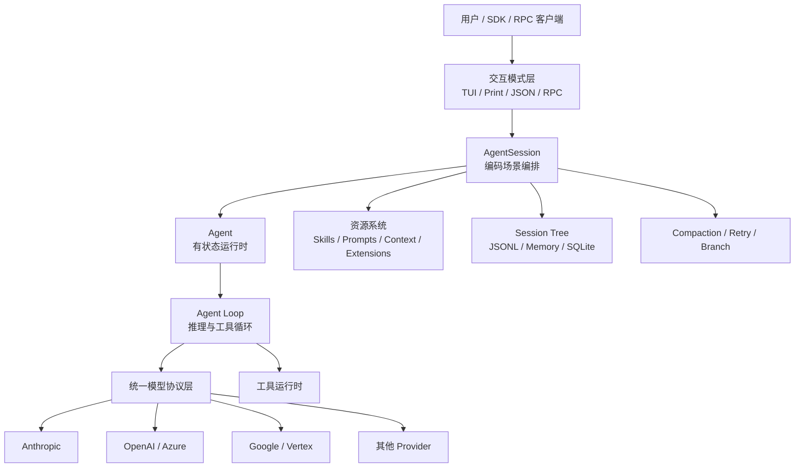
```mermaid
flowchart TB
    U["用户 / SDK / RPC 客户端"] --> MODE["交互模式层<br/>TUI / Print / JSON / RPC"]
    MODE --> SESSION["AgentSession<br/>编码场景编排"]
    SESSION --> AGENT["Agent<br/>有状态运行时"]
    AGENT --> LOOP["Agent Loop<br/>推理与工具循环"]
    LOOP --> AI["统一模型协议层"]
    LOOP --> TOOLS["工具运行时"]

    SESSION --> RES["资源系统<br/>Skills / Prompts / Context / Extensions"]
    SESSION --> STORE["Session Tree<br/>JSONL / Memory / SQLite"]
    SESSION --> COMPACT["Compaction / Retry / Branch"]

    AI --> P1["Anthropic"]
    AI --> P2["OpenAI / Azure"]
    AI --> P3["Google / Vertex"]
    AI --> PN["其他 Provider"]
```

### 1. 模型协议层解决“不同模型看起来像同一种计算资源”

这一层不做 Agent 决策。它统一的是：

- 模型目录与能力描述；
- 不同厂商的消息格式；
- 流式文本、思考内容和工具调用事件；
- 工具参数 Schema 与校验；
- token、缓存命中、费用与停止原因；
- API Key、OAuth、环境凭证和动态刷新；
- Provider 特有的请求头、推理等级与传输方式。

它提供的是一条稳定边界：上层只需要提交标准化上下文，并消费标准化的 AssistantMessage 事件流，不需要把 OpenAI Responses、Anthropic Messages、Google Generative AI 等协议差异带进 Agent 循环。

### 2. Agent Loop 解决“如何从一个输入推进到没有后续动作”

Agent Loop 是最小推理内核。它只做几件事：

1. 把新消息放入当前上下文；
2. 在请求边界转换为模型可理解的消息；
3. 流式接收 assistant message；
4. 找出其中的工具调用；
5. 校验和执行工具；
6. 把工具结果作为新消息放回上下文；
7. 再次调用模型；
8. 直到没有工具调用、没有转向消息、没有后续消息。

它不负责加载配置、不负责画 TUI、不负责选择会话文件，也不负责扫描技能目录。这种克制是 Pi 架构成立的第一步。

### 3. Agent 解决“如何把循环变成一个可使用的运行时对象”

低层循环接收上下文，发出事件，本身不长期拥有业务状态。Agent 在其外层增加：

- 当前消息列表；
- 当前模型、思考等级、工具集合与系统提示；
- 是否运行中、当前流式消息、待执行工具；
- AbortController；
- 转向队列和后续队列；
- 有顺序保证的异步订阅者；
- prompt、continue、abort、waitForIdle 等命令式 API。

因此 Agent 的本质不是“更聪明的循环”，而是一个带生命周期和可观察状态的循环宿主。

### 4. AgentSession 解决“通用 Agent 如何成为编码 Agent”

AgentSession 是编码产品真正的编排中心。它把下列能力组合进 Agent：

- 编码工具与工具启用策略；
- 系统提示构造；
- AGENTS 类上下文文件；
- Skills、Prompt Templates、Themes；
- 扩展的命令、事件、工具与 Provider；
- 会话落盘与恢复；
- 分支、回退、摘要与压缩；
- 自动重试和上下文溢出恢复；
- 用户中途 steer/follow-up；
- TUI、打印和 RPC 共用的事件语义。

这里有一个很重要的工程原则：

> 通用循环不要知道“编码”是什么；编码能力应当由工具、提示、资源和会话策略组合出来。

---

## 二、启动流程：先构造运行环境，再构造会话，最后选择交互投影

Pi 的启动链路不是“解析参数后直接 new Agent”。它先解析运行环境，再创建与当前工作目录绑定的服务，最后才实例化会话。

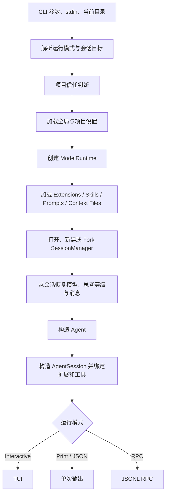
```mermaid
flowchart TD
    A["CLI 参数、stdin、当前目录"] --> B["解析运行模式与会话目标"]
    B --> C["项目信任判断"]
    C --> D["加载全局与项目设置"]
    D --> E["创建 ModelRuntime"]
    E --> F["加载 Extensions / Skills / Prompts / Context Files"]
    F --> G["打开、新建或 Fork SessionManager"]
    G --> H["从会话恢复模型、思考等级与消息"]
    H --> I["构造 Agent"]
    I --> J["构造 AgentSession 并绑定扩展和工具"]
    J --> K{"运行模式"}
    K -->|Interactive| L["TUI"]
    K -->|Print / JSON| M["单次输出"]
    K -->|RPC| N["JSONL RPC"]
```

### 为什么要先创建 cwd-bound services

编码 Agent 的很多资源都依赖当前工作目录：

- 项目级设置；
- 项目上下文文件；
- 本地扩展；
- 本地技能；
- 主题和提示模板；
- 默认会话目录；
- 工具执行的路径语义；
- 项目信任状态。

因此“切换会话工作目录”不是简单修改一个字符串，而是需要重建一组与目录绑定的服务。Pi 将服务构造和 AgentSession 构造分成两个阶段，使调用方可以先得到资源、模型和诊断信息，再根据目标会话决定模型、工具和恢复策略。

### 为什么模式层放在最后

TUI、print、JSON 和 RPC 并不是四套 Agent。它们共享同一个 AgentSession，只是：

- 输入来源不同；
- 事件如何显示不同；
- 是否需要持续交互不同；
- 输出编码方式不同。

这使 UI 不拥有核心业务状态。终端重绘、JSON 序列化或 RPC 连接失败，不应改变“会话里发生了什么”。

---

## 三、Agent 核心循环：它不是一个 while，而是两个嵌套的终止条件

Pi 的循环之所以值得认真看，是因为它区分了三种“为什么还要再调用一次模型”：

1. assistant 请求了工具，工具结果必须送回模型；
2. 用户在运行中发来了 steering 指令，需要改变下一轮方向；
3. Agent 本来已经要结束，但存在 follow-up 任务，需要重新开始一段工作。

对应的控制结构是外层 follow-up 循环和内层 tool/steering 循环。

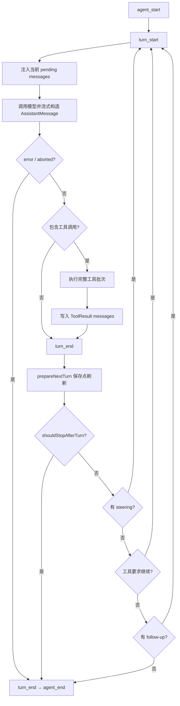
```mermaid
flowchart TD
    START["agent_start"] --> TURN["turn_start"]
    TURN --> INJECT["注入当前 pending messages"]
    INJECT --> CALL["调用模型并流式构造 AssistantMessage"]
    CALL --> ERR{"error / aborted?"}
    ERR -->|是| END["turn_end → agent_end"]
    ERR -->|否| TC{"包含工具调用?"}
    TC -->|是| EXEC["执行完整工具批次"]
    EXEC --> TR["写入 ToolResult messages"]
    TC -->|否| NEXT["turn_end"]
    TR --> NEXT
    NEXT --> SNAP["prepareNextTurn 保存点刷新"]
    SNAP --> STOP{"shouldStopAfterTurn?"}
    STOP -->|是| END
    STOP -->|否| STEER{"有 steering?"}
    STEER -->|是| TURN
    STEER -->|否| MORE{"工具要求继续?"}
    MORE -->|是| TURN
    MORE -->|否| FOLLOW{"有 follow-up?"}
    FOLLOW -->|是| TURN
    FOLLOW -->|否| END
```

### 一个 Turn 的精确定义

在 Pi 中，一个 turn 不是简单的“一问一答”。更准确地说：

> 一个 turn 是一次模型生成，加上该生成要求的整个工具批次。

所以：

```text
用户输入
  → 模型生成并请求 read、grep
  → read、grep 全部完成
  → turn_end
  → 下一次模型生成
```

这种定义非常重要，因为它给系统提供了安全保存点：工具批次未结束前，因果链还没有闭合；只有 assistant message 和它要求的 tool results 都完整出现后，系统才适合刷新上下文、切换模型、考虑压缩或插入新指令。

### 一个 Run 的精确定义

一个 run 从 prompt 被接受开始，覆盖：

- 多个模型 turn；
- 多轮工具调用；
- 中途 steering；
- 本应结束时追加的 follow-up；
- 必要时的自动压缩和错误重试；

直到 Agent 真正没有任何待处理工作，才算 settled。

这解释了为什么 `agent_end` 与“整个编码任务绝对结束”并不总是同一个概念：上层可能在 agent_end 之后发现需要重试、压缩或处理由扩展新加入的消息。AgentSession 因此又提供了更强的 `agent_settled` 边界。

---

## 四、消息双空间：应用消息是超集，LLM 消息只是一次投影

Pi 一个非常成熟的设计，是没有把会话历史限制成模型原生支持的三种消息。

应用内部可以存在：

- user；
- assistant；
- toolResult；
- bashExecution；
- custom；
- branchSummary；
- compactionSummary；
- 其他由应用扩展的消息类型。

而模型通常只理解：

- user；
- assistant；
- toolResult。

Pi 没有让应用世界屈从于模型协议，而是在请求边界做两步转换：

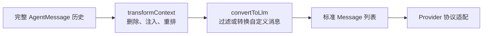
```mermaid
flowchart LR
    A["完整 AgentMessage 历史"] --> B["transformContext<br/>删除、注入、重排"]
    B --> C["convertToLlm<br/>过滤或转换自定义消息"]
    C --> D["标准 Message 列表"]
    D --> E["Provider 协议适配"]
```

### transformContext 与 convertToLlm 为什么必须分开

两者看起来都在“处理消息”，但语义不同：

- `transformContext` 操作的是 Agent 世界。它可以做上下文过滤、扩展注入、策略性裁剪，输出仍然是 AgentMessage。
- `convertToLlm` 是协议边界。它决定某种应用消息如何映射成模型消息，或是否完全不让模型看到。

例如一次 `!!` shell 命令可以记录在 UI 和会话中，但被标记为不进入模型上下文；普通 shell 命令可以转成一条 user message；压缩摘要和分支摘要也可以被包装成明确的上下文块。

这种设计带来三个好处：

1. UI 历史不等于模型上下文，二者可以各自演进；
2. 自定义功能不需要污染底层模型类型；
3. 同一份会话可以针对不同模型做不同投影。

### 重要启示

很多 Agent 项目把数据库里的消息表直接当成模型请求数组。这样做一开始简单，后面会非常痛苦：审计消息、UI 消息、系统事件、摘要和隐藏上下文会混成一团。

更好的抽象是：

> 会话历史是事实模型；模型上下文是从事实模型计算出来的一次视图。

---

## 五、流式响应不是字符串拼接，而是一个可观测状态机

模型流式返回可能包含：

- response start；
- text start / delta / end；
- thinking start / delta / end；
- tool call start / delta / end；
- done；
- error。

Pi 在收到 start 时就把一个 partial assistant message 放入当前上下文，后续每个 delta 都替换这条 partial message，最终再用完整消息原位收敛。

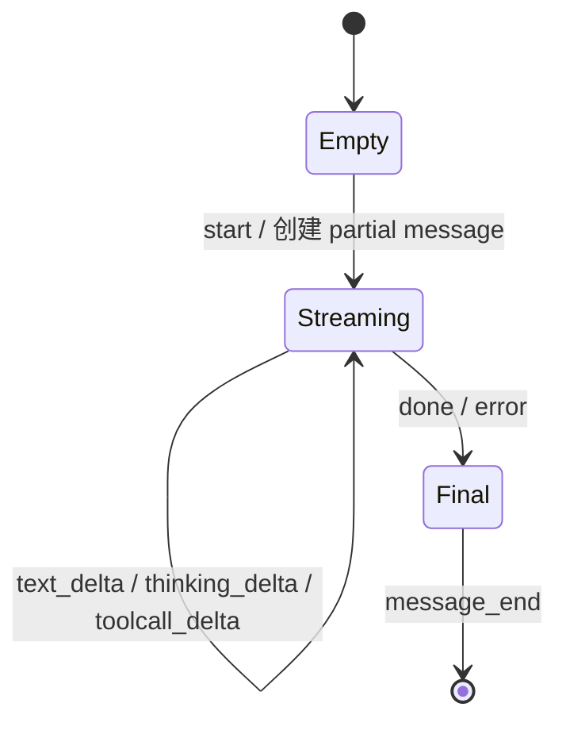
```mermaid
stateDiagram-v2
    [*] --> Empty
    Empty --> Streaming: start / 创建 partial message
    Streaming --> Streaming: text_delta / thinking_delta / toolcall_delta
    Streaming --> Final: done / error
    Final --> [*]: message_end
```

### 为什么上下文中要存在 partial message

这让运行时在流式阶段始终有一个“当前 assistant 状态”，UI、扩展和调试器不必自己重放所有 delta 才知道当前内容。

但 partial message 不能像普通历史消息一样反复追加，否则会产生大量中间版本。因此它在运行时上下文中被原位替换，只有最终 message_end 才进入稳定会话历史。

### 事件顺序就是公共协议

典型事件序列是：

```text
agent_start
turn_start
message_start(user)
message_end(user)
message_start(assistant)
message_update(...)
message_end(assistant)
tool_execution_start(...)
tool_execution_update(...)
tool_execution_end(...)
message_start(toolResult)
message_end(toolResult)
turn_end
agent_end
```

UI、会话落盘、扩展与观测都依赖这条协议。事件不是日志附件，而是系统各层解耦的主干。

---

## 六、事件屏障：先归约内部状态，再通知外部监听者

Agent 接到一个事件时，不是立刻广播。它先把事件归约进自己的状态：

- message_start / update 更新 streamingMessage；
- message_end 把完整消息加入 transcript；
- tool_execution_start 把调用 ID 放进 pendingToolCalls；
- tool_execution_end 移除调用 ID；
- turn_end 更新错误状态；
- agent_end 清理流式引用。

之后才按注册顺序调用监听者，并等待每个异步监听者完成。

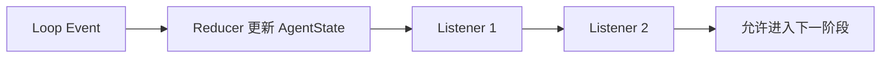
```mermaid
flowchart LR
    E["Loop Event"] --> R["Reducer 更新 AgentState"]
    R --> L1["Listener 1"]
    L1 --> L2["Listener 2"]
    L2 --> N["允许进入下一阶段"]
```

这形成了一个非常有用的 barrier：

> 当工具预检开始时，要求该工具调用的 assistant message 已经经过 message_end，已经进入 Agent 状态，也已经被需要等待的监听者处理。

AgentSession 正是利用这个屏障在 message_end 时完成会话持久化和扩展处理。因此工具真正执行前，系统已经有了发起该工具的因果记录。

### agent_end 和 idle 的区别

`agent_end` 表示低层循环不会再产生新事件，但 Agent 只有在所有 agent_end 监听者完成后才会清理 activeRun 并进入 idle。

这避免了一个常见竞态：

```text
UI 看到 agent_end
→ 立刻认为 Agent 空闲并发起新 prompt
→ 但持久化监听者还没写完上一轮
```

Pi 把“事件流结束”和“运行彻底结算”分成两个时刻，从而让 `waitForIdle()` 成为可信边界。

---

## 七、工具调用：校验、策略、执行、后处理是四个不同阶段

工具调用链可以概括为：

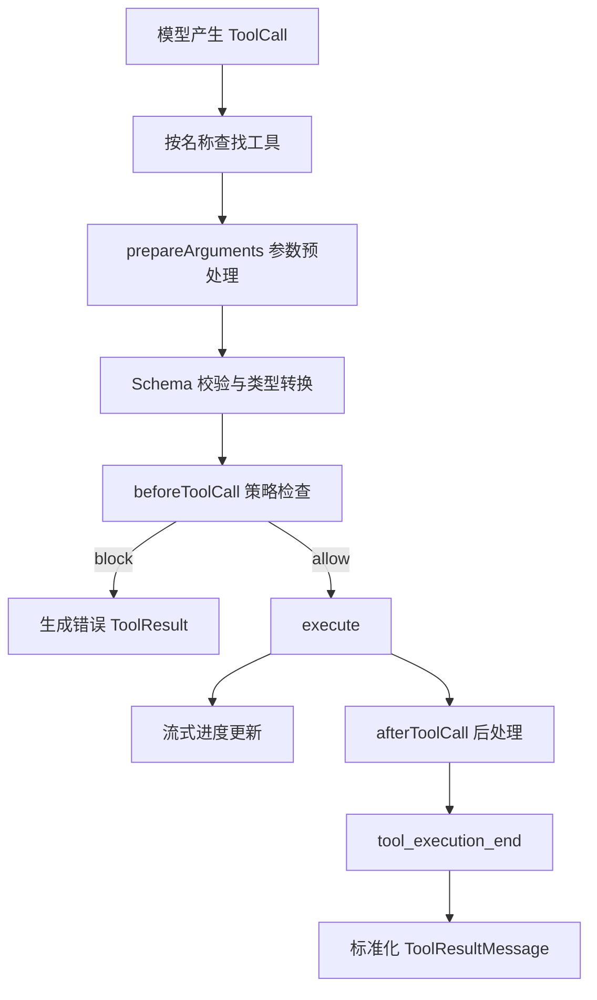
```mermaid
flowchart TD
    C["模型产生 ToolCall"] --> F["按名称查找工具"]
    F --> P["prepareArguments 参数预处理"]
    P --> V["Schema 校验与类型转换"]
    V --> B["beforeToolCall 策略检查"]
    B -->|block| ER["生成错误 ToolResult"]
    B -->|allow| X["execute"]
    X --> U["流式进度更新"]
    X --> A["afterToolCall 后处理"]
    A --> E["tool_execution_end"]
    E --> M["标准化 ToolResultMessage"]
```

### 1. 参数准备与 Schema 校验

模型输出的 JSON 不能直接传给工具。它可能字段缺失、类型错误或只生成了半截。Pi 允许工具先做参数准备，再用 Schema 校验和转换，失败会被转成明确的工具错误消息，返回给模型修正。

### 2. beforeToolCall 是策略层，不是工具实现的一部分

这里可以实现：

- 权限检查；
- 信任策略；
- 命令拦截；
- 参数重审；
- 扩展决定阻止某类操作。

把策略放在工具外面意味着同一个工具实现可以在不同宿主里采用不同权限模型。

### 3. execute 只表达能力

工具执行函数接收：

- 稳定的 toolCallId；
- 已校验参数；
- abort signal；
- 可选的 progress 回调。

工具失败应抛错，由循环统一变成 `isError: true` 的 ToolResult。这样“工具业务结果”和“工具执行失败”不会混用自然语言猜测。

### 4. afterToolCall 是结果治理层

执行结束后仍可以：

- 替换对模型可见的内容；
- 隐藏敏感细节；
- 丰富 details；
- 改写错误标记；
- 附加 usage；
- 给出 terminate 提示。

因此完整结构是“能力”和“治理”分离：工具负责做事，Harness 负责决定是否允许、结果如何暴露、是否继续。

### 输出截断时为什么所有工具都禁止执行

如果模型因为输出 token 上限停止，工具参数可能恰好形成合法 JSON，却在语义上被截断。例如删除列表只生成了前一半，Schema 仍然可以通过。

Pi 不尝试猜测哪个调用完整，而是把该 assistant message 中的所有工具调用都标记失败，让模型重新发出完整参数。

这是非常专业的安全选择：

> 语法合法不等于意图完整。只要生成过程被截断，副作用工具就不应执行。

---

## 八、并行工具执行：完成顺序可以并行，因果顺序必须稳定

当一个 assistant message 同时请求多个工具时，Pi 默认允许并行，但它保留了两种顺序：

1. 实际完成事件按真实完成时间发出；
2. 最终 ToolResult 消息按 assistant 中的原始调用顺序写回上下文。

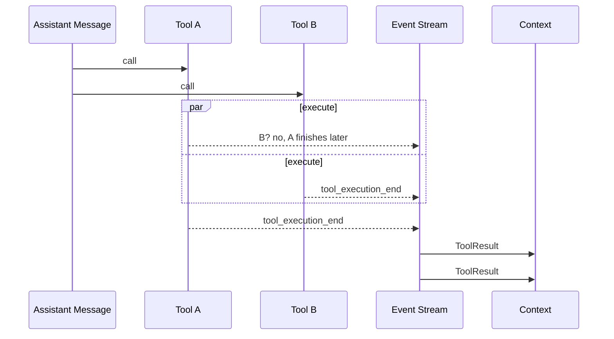
```mermaid
sequenceDiagram
    participant M as Assistant Message
    participant A as Tool A
    participant B as Tool B
    participant E as Event Stream
    participant C as Context

    M->>A: call #1
    M->>B: call #2
    par execute
        A-->>E: B? no, A finishes later
    and execute
        B-->>E: tool_execution_end #2
    end
    A-->>E: tool_execution_end #1
    E->>C: ToolResult #1
    E->>C: ToolResult #2
```

这样同时满足：

- UI 能实时显示谁先完成；
- 持久化和模型上下文具备确定性；
- 重放、测试和审计不会因网络调度而随机变化。

### 为什么预检仍然顺序执行

每个调用的查找、参数校验和 beforeToolCall 依次进行，获准的调用才进入并行阶段。这样策略钩子的调用顺序稳定，也不会在权限判断完成前启动副作用。

### 为什么一个 sequential 工具会让整批顺序执行

某些工具之间可能存在隐含依赖，例如多个文件写入、改变工作目录、修改同一资源。Pi 允许工具声明自己必须 sequential；只要批次里有一个此类工具，整批退化为串行。

这是一个保守但容易推理的批次语义。它避免开发者误以为“只让那个工具串行”就足够，而其他调用仍可能与它交错产生竞态。

### terminate 为什么要求整批一致

工具结果可以给出 `terminate: true`，表示不需要自动再调用一次模型。但只有本批次所有已完成结果都要求 terminate，循环才提前停止。

否则其中一个普通工具结果仍可能需要模型解释。采用“全体同意才终止”避免某个工具意外吞掉其他结果的后续推理。

---

## 九、Steering 与 Follow-up：不是两个队列名字，而是两种时间语义

用户在 Agent 工作时输入新消息，系统不能简单把它插入当前数组尾部。因为模型请求可能还在流式生成，工具批次可能还没有完成。

Pi 定义了两类排队语义。

### Steering：改变正在进行的工作方向

Steering 的语义是：

> 让当前 turn 正常闭合，等工具批次全部完成后，在下一次模型请求前插入这条指令。

它不是硬中断。这样可以避免出现：assistant 已经发出工具调用，但 tool result 被一条 user message 插在中间，导致协议结构非法。

### Follow-up：当前工作结束后再做另一件事

Follow-up 只有在：

- 没有更多工具调用；
- 没有 steering；
- Agent 本来将停止；

时才被取出。

因此两者的差异是优先级和意图：

```text
steer：你现在的方向需要调整
follow-up：你做完以后，再处理这个
```

### one-at-a-time 与 all

队列可以一次取一条，也可以一次全部注入。

- one-at-a-time 让模型逐个处理任务，控制上下文复杂度；
- all 适合把一组短补充一次合并给模型。

队列策略属于运行时配置，而不应写死在 UI 中。

---

## 十、保存点刷新：让运行时配置变化只在安全边界生效

AgentSession 会在每个 turn 结束后重新提供：

- system prompt；
- 当前工具集合；
- 当前模型；
- 当前 thinking level；
- 必要时替换后的上下文。

这相当于一个轻量 checkpoint。

### 为什么不能任意时刻直接影响当前 turn

一次模型请求发出时，应该使用一个稳定快照：

```text
本次请求的模型
本次请求的系统提示
本次请求可见的工具定义
本次请求的思考等级
本次请求的消息上下文
```

如果扩展在流式过程中修改工具集合，而后半段生成突然看到不同 Schema，系统就没有一致语义。Pi 允许配置对象变化，但变化对下一 turn 生效。

这体现了一个通用设计原则：

> 可变配置应当在运行时暴露为“最新期望值”，在操作边界采样成“本轮不可变快照”。

新的 Durable AgentHarness 进一步把这套思想定义成 deferred writes：在 step 进行中接受配置变更，但延迟到 checkpoint 应用，以保护追加式上下文和 Provider KV Cache 的连续性。

---

## 十一、AgentSession：它不是会话容器，而是编码 Agent 的控制平面

AgentSession 负责把底层事件变成编码产品语义。它维护的不是一份简单 messages 数组，而是多组相互独立的控制状态：

```text
运行状态：是否有 Agent run、idle 等待者、最后 assistant 消息
队列状态：steering、follow-up、next-turn asides
压缩状态：手动压缩、自动压缩、溢出恢复
重试状态：重试次数、退避计时器、取消控制器
工具状态：定义注册表、运行工具表、启用集合、提示片段
扩展状态：runner、flags、UI bindings、provider hooks
资源状态：skills、prompts、themes、context files
会话状态：SessionManager、分支、摘要、持久化条目
```

### 为什么 AgentSession 不应下沉进 Agent Core

这些能力高度场景化：

- 编码 Agent 需要 read/edit/bash/write；
- 研究 Agent 可能需要浏览器和知识库；
- 客服 Agent 可能需要 CRM 与工单工具；
- 不同应用的压缩格式、扩展机制和安全策略都不同。

如果把所有能力塞进 Agent Core，核心循环会迅速成为不可复用的巨类。Pi 通过 AgentSession 把“产品复杂度”留在应用层，同时保持循环层短小稳定。

---

## 十二、Prompt 进入 Agent 前的完整加工链

用户输入并不会直接进入模型。AgentSession 会依次处理：

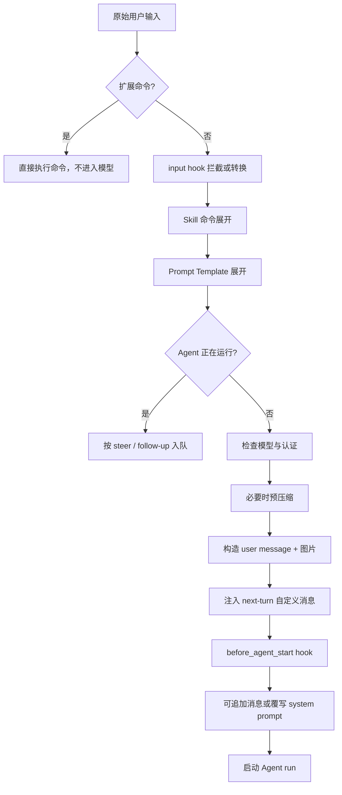
```mermaid
flowchart TD
    A["原始用户输入"] --> B{"扩展命令?"}
    B -->|是| C["直接执行命令，不进入模型"]
    B -->|否| D["input hook 拦截或转换"]
    D --> E["Skill 命令展开"]
    E --> F["Prompt Template 展开"]
    F --> G{"Agent 正在运行?"}
    G -->|是| H["按 steer / follow-up 入队"]
    G -->|否| I["检查模型与认证"]
    I --> J["必要时预压缩"]
    J --> K["构造 user message + 图片"]
    K --> L["注入 next-turn 自定义消息"]
    L --> M["before_agent_start hook"]
    M --> N["可追加消息或覆写 system prompt"]
    N --> O["启动 Agent run"]
```

### Skill 为什么展开为显式上下文块

Skill 不是在模型外神秘执行，而是把技能正文、技能位置和相对引用基准明确放入用户消息。模型因此知道：

- 当前使用哪个技能；
- 指令正文是什么；
- 引用文件应从哪里解析；
- 用户附加参数是什么。

这种显式展开比在 system prompt 中永久塞入所有技能更节省上下文，也更容易审计。

### before_agent_start 为什么很强

这个钩子位于所有基础输入加工完成之后、真正调用 Agent 之前。扩展可以：

- 追加本轮隐藏或可显示的上下文；
- 根据用户请求动态改变系统提示；
- 添加来自外部系统的状态快照；
- 实现项目特定的执行前策略。

而每轮结束后系统提示覆盖会被清理，避免一次临时修改泄漏到后续任务。

---

## 十三、系统提示不是静态字符串，而是由当前能力集合编译出来的产物

AgentSession 构造 system prompt 时会综合：

- 当前工作目录；
- 已加载 Skills 的元信息；
- 项目上下文文件；
- 自定义基础 prompt；
- 追加 prompt；
- 当前启用的工具；
- 工具自己的 prompt snippet；
- 工具自己的使用 guidelines。

因此 system prompt 和工具集合是耦合的：启用一个工具，不只是把 JSON Schema 交给模型，还可能需要向模型解释何时用、如何用、有什么限制；关闭工具时，这些提示也应消失。

### 这解决了“能力描述漂移”

常见错误是：系统提示声称 Agent 可以使用某工具，但实际工具没有注册；或工具已启用，提示里没有使用规则。

Pi 通过“从当前工具注册表重建提示”减少这种漂移。能力和提示由同一个注册事实生成，而不是各自维护。

### 工具定义注册表与运行工具注册表为什么分开

系统既需要完整定义来展示、发现、构建提示，又需要包装后的可执行 AgentTool 参与运行。扩展工具还带来源信息、命令上下文和钩子包装。

将 definition-first registry 与 executable registry 分开，可以做到：

- UI 展示所有可用工具；
- 启用其中一部分；
- 从定义生成系统提示；
- 对实际执行统一套上扩展上下文与治理逻辑。

---

## 十四、扩展系统：真正的扩展点不是“能注册工具”，而是能介入生命周期

Pi 的扩展能力覆盖多个层面：

```text
注册层：工具、命令、快捷键、Provider、Flags、渲染器
输入层：拦截或改写用户输入
上下文层：修改送给模型的消息
请求层：修改 Provider payload 和 headers
模型层：观察 Provider response
运行层：agent / turn / message / tool 生命周期事件
策略层：阻止工具、改写工具结果
会话层：压缩、分支、标签、自定义条目
资源层：动态发现 skills、prompts、themes
界面层：自定义消息和工具结果渲染
```

### Runner 的核心价值：稳定顺序与错误隔离

扩展不是直接散落在 AgentSession 的回调数组中，而是由 runner 统一管理：

- 知道每个处理器来自哪个扩展；
- 按确定顺序调用；
- 区分观察事件和可变换事件；
- 把错误关联到来源；
- 在 reload 时整体替换运行时；
- 对命令和工具解决命名冲突。

### 观察事件与变换钩子必须区分

这是 Pi 新 Harness 设计中进一步强化的思想：

- event 只能观察，不改变执行；
- hook 被等待，可以转换、阻止或追加；
- registry 用于长期存在的能力集合，不应伪装成 hook。

如果所有扩展点都叫 event，调用者无法知道返回值是否生效；如果所有东西都叫 hook，纯观测也可能意外进入关键路径。专业系统必须把二者类型化。

### Provider 请求钩子的特殊性

请求 payload 和 headers 往往包含敏感信息，且多个扩展可能连续修改。Pi 的思路是有序变换：后一个处理器接收前一个的输出，而不是多个处理器并发写同一个对象。

这样合并语义可预测，也能支持显式删除某个 header，而不只是浅合并新增字段。

---

## 十五、会话不是线性聊天记录，而是一棵追加式事件树

Pi 的会话条目带有：

- id；
- parentId；
- timestamp；
- type；
- 该类型的具体数据。

当前会话位置由 leaf 指针表示。新消息作为当前 leaf 的子节点追加；回到旧节点后继续追加，就自然形成新分支。

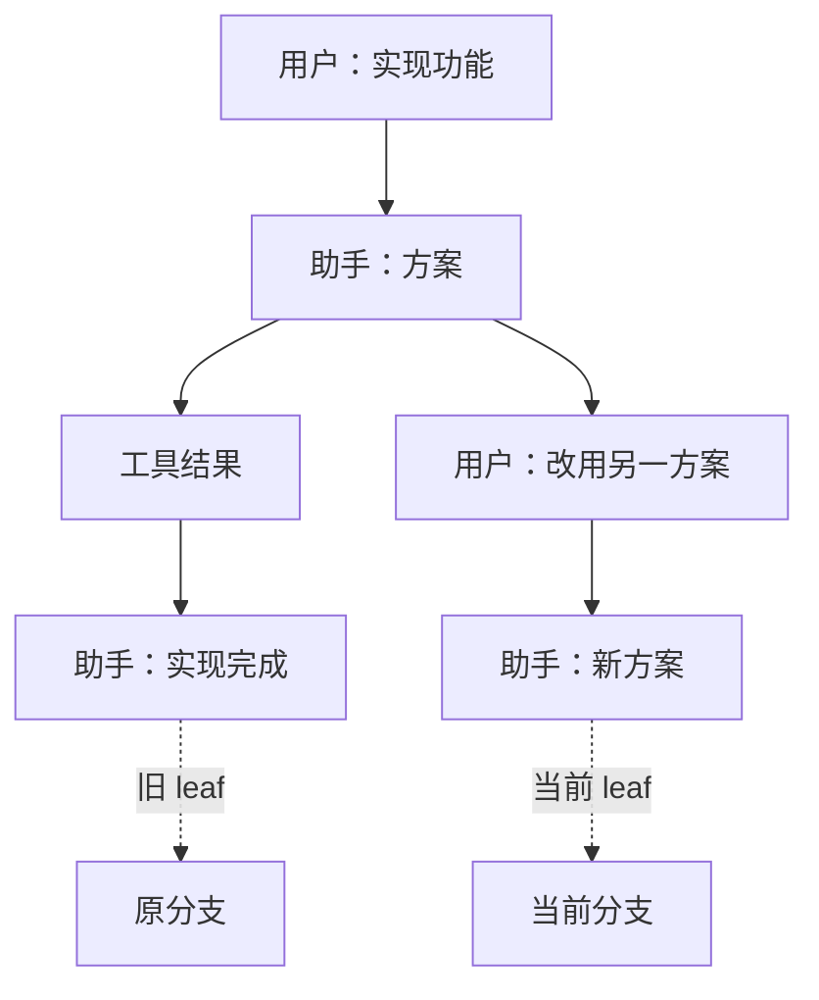
```mermaid
flowchart TD
    U1["用户：实现功能"] --> A1["助手：方案"]
    A1 --> T1["工具结果"]
    T1 --> A2["助手：实现完成"]

    A1 --> U2["用户：改用另一方案"]
    U2 --> A3["助手：新方案"]

    A2 -. "旧 leaf" .-> OLD["原分支"]
    A3 -. "当前 leaf" .-> CUR["当前分支"]
```

### 为什么采用 append-only

追加式会话带来：

- 历史不可被静默改写；
- 分支不需要复制整份会话；
- 审计容易；
- 写入简单，JSONL 天然适配；
- 崩溃时通常只损失最后一个未完成写入；
- 可以从任意 leaf 沿 parentId 重建当前上下文。

### 日志顺序与对话拓扑是两件事

物理文件按时间追加，表示“系统发生事件的顺序”；parentId 表示“某条对话分支的逻辑祖先”。

这两个维度不能混为一谈。后追加的条目可以挂到很早的节点上；读取当前上下文时必须沿 parentId 走树，而不能简单取文件尾部。

### 配置变化也是会话事实

模型切换、思考等级变化、标签、压缩、分支摘要等都作为条目记录。这样恢复会话时，不只恢复文本，还能恢复产生这些文本时的运行配置。

这体现了一个强观点：

> Agent 会话不是聊天 transcript，而是执行历史与配置历史共同构成的状态日志。

---

## 十六、上下文压缩：目标不是“把旧消息变短”，而是建立可继续工作的检查点

Pi 的压缩不是随便总结前 N 条消息。它需要同时保护：

- 最近上下文；
- 工具调用协议完整性；
- 任务目标与约束；
- 已完成工作；
- 关键决策；
- 文件读写轨迹；
- 下一步动作；
- 上一次压缩摘要中的重要信息。

### 触发判断

系统优先使用最近一次有效 assistant usage 作为已知上下文 token 数，再估算其后的消息；没有可靠 usage 时才对全部消息做字符近似。

压缩阈值大致是：

```text
contextTokens > contextWindow - reserveTokens
```

预留空间不是浪费，而是为了确保下一次模型输出、工具结果和摘要操作仍有缓冲。

### 切点算法保护工具调用原子性

系统从最新消息向前累计，尽量保留约定数量的近期 token，但合法切点只允许落在 user-like 或 assistant 消息上，绝不从 toolResult 开始。

原因是 toolResult 必须跟随发出相应 toolCall 的 assistant message。若压缩后只保留 toolResult，模型上下文会违反供应商协议。

如果切在一个带工具调用的 assistant message 上，它后面的工具结果会一起保留。

### 支持从 turn 中部切开

长时间编码 turn 可能包含一个很早的用户请求、多个 assistant 工具循环。若只能从用户消息切，可能被迫保留巨大 turn。

Pi 允许从某个 assistant 消息开始保留，但会额外生成一份 turn-prefix summary，解释该用户 turn 在切点之前做了什么。最终摘要由两部分组成：

```text
历史摘要
---
当前被切开 turn 的前缀摘要
```

这是兼顾上下文预算和局部连续性的精细设计。

### 摘要是结构化工作状态

摘要模板要求保留：

- Goal；
- Constraints & Preferences；
- Progress：Done / In Progress / Blocked；
- Key Decisions；
- Next Steps；
- Critical Context。

对编码 Agent 来说，这比普通叙事摘要更有价值，因为下一模型需要恢复的是“工作现场”，不是复述聊天内容。

### 文件操作单独建账

系统从工具调用中提取 read、write、edit，区分只读文件与已修改文件，并把它们写进压缩详情。上一次压缩的文件账本还会被继承。

这解决了摘要模型容易漏掉精确文件集合的问题，也让后续恢复更像工程交接。

### 增量摘要而不是每次从头总结

存在前一份摘要时，新压缩会要求保留旧信息并融合新增进展。这降低了长期会话中早期关键决策被逐次遗忘的概率。

---

## 十七、错误恢复：Provider 重试与上下文溢出必须走两条不同路径

并非所有模型错误都应该重试。

### 可重试错误

例如：

- 限流；
- 临时过载；
- 服务端错误；
- 短暂网络断开。

Pi 使用指数退避，并允许用户取消。重试前会从 Agent 当前上下文移除失败的 assistant error message，但会话仍可保留该错误用于历史观察。

这实现了“运行上下文清洁”和“审计历史完整”之间的分离。

### 上下文溢出不是普通重试

相同上下文重新请求多少次都会溢出。因此它进入：

```text
检测 overflow
→ 触发 compaction
→ 重建 Agent messages
→ continue
```

将 overflow 排除在普通重试之外，体现了错误分类意识：恢复动作必须改变失败条件。

### 成功后立即清空重试计数

一个 run 内可能有多次模型调用。只要某次 assistant 成功，之前瞬时失败的累计应被清零，不能把分散在不同 turn 的偶发错误错误地累积成“重试耗尽”。

---

## 十八、模型层：统一接口不意味着抹平 Provider 差异

Pi 的模型抽象保留了：

- provider；
- model id；
- api 类型；
- context window；
- max tokens；
- 是否支持 reasoning；
- 输入模态；
- token 成本；
- Provider 或模型级 headers。

上层因此可以统一调用，又可以基于能力做正确决策，例如：

- 不支持图片时过滤图片；
- 不支持 reasoning 时把 thinking level 钳制为 off；
- 根据 context window 决定压缩；
- 根据模型能力选择请求选项。

### Provider 是运行单元，API 是传输协议

多个 Provider 可以共享同一种 wire protocol。例如很多厂商都兼容 OpenAI completions，但认证、模型目录、base URL 和 headers 不同。

把 Provider 与 API 类型分开，可复用协议实现，又不丢失供应商运行差异。

### 认证为什么必须在每次请求时解析

OAuth token 可能过期，临时凭证可能轮换。如果 Agent 构造时只读取一次 API Key，长会话会在中途失效。

Pi 支持请求时动态解析认证，并让显式请求参数覆盖 Provider 默认认证。Credential Store 用串行 read-modify-write 保护刷新，避免并发请求重复刷新并覆盖旋转后的 token。

### 请求头合并顺序必须确定

合理顺序是：

```text
Provider auth headers
→ model headers
→ 显式 request headers
→ transformHeaders 最终变换
```

后层拥有更高优先级，并支持显式删除字段。这对代理、企业网关、追踪 ID、产品归因和扩展认证都很重要。

---

## 十九、工具系统的工程细节：副作用串行化、输出截断与可取消执行

编码 Agent 的工具不是简单 fs.readFile 包装。真正的工程风险集中在副作用、输出规模与并发。

### 文件写操作需要 mutation queue

即使模型并行请求多个工具，针对文件系统的 write/edit 也可能冲突。Pi 提供文件变更队列，把需要互斥的变更串行化，而不必禁止所有只读工具并行。

这比全局工具串行更细粒度：

```text
read A + grep B：可以并行
edit A + write A：必须协调
bash 长任务 + read C：视工具策略决定
```

### 工具输出必须有双通道

大输出不能全部塞进模型上下文，否则一次 grep 或构建日志就能耗尽窗口。合理策略是：

- 上下文里放截断后的头尾或摘要；
- 完整输出写到临时文件；
- ToolResult 明确告诉模型完整路径；
- UI 仍能展示进度与截断信息。

### AbortSignal 要贯穿到底

取消不能只停止 UI。信号需要贯穿：

```text
Agent.abort
→ 模型请求
→ 工具执行
→ shell 子进程
→ 扩展钩子
→ 压缩与重试等待
```

否则系统表面显示“已取消”，后台副作用仍在发生。

---

## 二十、项目信任与安全边界：Pi 选择显式承认自己不是沙箱

Pi 默认以启动它的用户权限运行，不内置完整文件、进程、网络和凭证隔离。

这不是说它没有安全设计，而是它把两类问题分开：

### 应用内治理

- 项目资源是否可信；
- 是否加载项目扩展；
- 工具 allowlist / denylist；
- beforeToolCall 阻止危险动作；
- 图片是否进入模型；
- Provider 请求头和内容治理。

### 操作系统级隔离

- 容器；
- 微型虚拟机；
- 策略沙箱；
- 独立用户与凭证边界。

Pi 的立场是：应用内 permission hook 不能冒充真正的系统隔离。需要强安全边界时，应把整个进程或工具执行环境放入容器/沙箱。

这是一个值得学习的诚实边界：

> Agent 框架可以治理能力，但只有操作系统或虚拟化层能真正限制能力。

---

## 二十一、TUI、RPC 与 Server：核心会话通过事件被投射，而不是被 UI 驱动

### TUI 是事件消费者

终端界面订阅 AgentSession 事件，维护可视组件：

- assistant 流式文本；
- thinking；
- 工具执行状态；
- 队列；
- retry 倒计时；
- compaction 指示；
- footer 的模型、token、费用与上下文占用。

差分渲染只影响性能，不拥有会话真相。

### RPC 是另一种输入输出适配

RPC 模式把同样的命令和事件编码成 JSONL，使外部进程能够：

- 发 prompt；
- steer / follow-up；
- abort；
- 切换模型和思考等级；
- 订阅流式事件；
- 操作会话。

### Server 负责进程监督而不是替代 AgentSession

服务层可以把每个会话托管在独立 RPC 子进程中，由 supervisor 负责：

- 启动与停止；
- 跟踪进程状态；
- 转发命令与事件；
- 处理异常退出；
- 持有会话元数据；
- 将本地交互 Agent 提升为长期服务。

这是一种合理的隔离：单个会话崩溃不会必然拖垮整个服务，Agent 运行时也无需为了服务端部署而重写。

---

## 二十二、当前稳定运行时与下一代 AgentHarness：必须明确区分

仓库里同时存在两套相关但成熟度不同的设计：

### 当前稳定链路

```text
Agent Loop
→ Agent
→ coding-agent AgentSession
→ SessionManager
→ TUI / Print / RPC
```

这条链路已经承担真实编码 Agent 的运行。

### 正在演进的通用 AgentHarness

新的 AgentHarness 试图把当前散落在 coding-agent 中的通用编排能力下沉到 agent package，包括：

- 明确 phase 状态机；
- 每 turn 快照；
- 保存点刷新；
- Session 抽象与多存储后端；
- 主动工具注册表；
- 通用资源加载；
- Provider 请求钩子；
- 结构化 Result 与运行环境能力；
- 更严格的持久化与恢复模型。

但完整 hooks、自动压缩决策、通用重试和半持久化恢复仍在演进中。理解项目时应把“设计目标”与“已经迁移完成的生产路径”分开。

---

## 二十三、Durable AgentHarness 的深层目标：从可保存聊天升级为可恢复执行

普通 Session 解决的是“重启后还能看到历史”。Durable Harness 要解决的是：

> 进程在模型请求中、工具调用中、压缩中或队列消费中崩溃后，新进程能判断任务进行到哪里，并从安全边界恢复。

这是完全不同的难度等级。

### 一份日志，两种视图

新设计将同一追加日志分成：

1. Session entries：构成对话树，进入 transcript 和模型上下文；
2. Harness entries：记录 operation、step、request、tool、queue 等编排事实，不进入对话树和模型上下文。

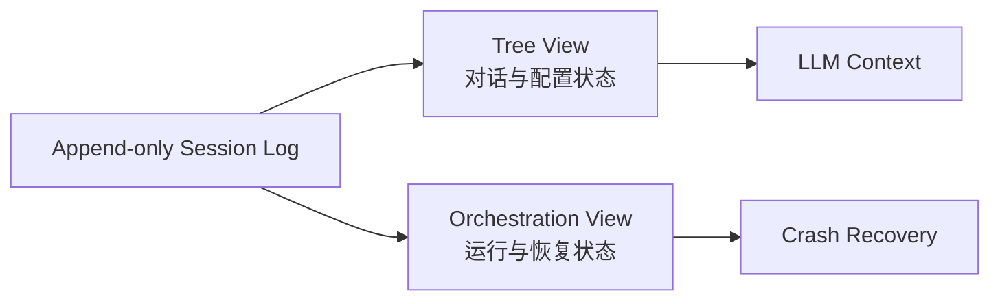
```mermaid
flowchart LR
    LOG["Append-only Session Log"] --> TREE["Tree View<br/>对话与配置状态"]
    LOG --> OPS["Orchestration View<br/>运行与恢复状态"]
    TREE --> CTX["LLM Context"]
    OPS --> REC["Crash Recovery"]
```

中央不变量是：

```text
Session entry 定义“对话是什么”
Harness entry 定义“运行时做过什么”
日志顺序定义编排历史
parentId 与 ref leaf 定义对话拓扑
Harness entry 永不改变对话树
```

### Operation、Run、Step、Generation、Checkpoint

新的设计进一步细化生命周期：

- Operation：一次 run、手动压缩或树导航；
- Run：一个 prompt 到真正 idle 的完整工作；
- Step：一次模型生成及其完整工具批次；
- Generation：一次产生结果的逻辑生成，可能包含多个 Provider 重试；
- Checkpoint：step 之间的安全保存点。

这种术语不是形式主义。没有精确边界，就无法描述“崩溃发生在工具已经产生外部副作用、但 tool result 尚未落盘”的恢复策略。

### 状态机

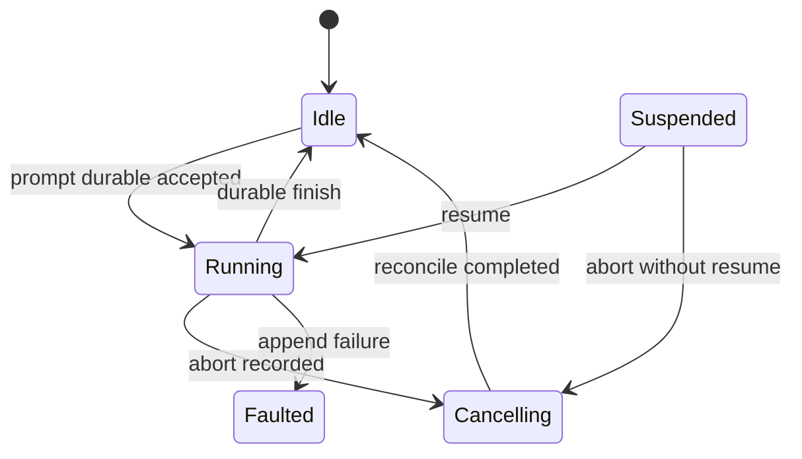
```mermaid
stateDiagram-v2
    [*] --> Idle
    Idle --> Running: prompt durable accepted
    Running --> Idle: durable finish
    Running --> Cancelling: abort recorded
    Cancelling --> Idle: reconcile completed
    Running --> Faulted: append failure
    Suspended --> Running: resume
    Suspended --> Cancelling: abort without resume
```

`Suspended` 代表恢复时发现未完成 run，但不会自动执行外部副作用；必须显式 resume 或 abort。

`Faulted` 代表日志写入失败。此时 Harness 必须停止产生新副作用，因为它已经无法记录自己做了什么。修复存储后重新打开，可从最后一个有效日志前缀恢复。

---

## 二十四、为什么“Exactly Once 工具执行”几乎不可能凭空获得

考虑一个转账工具：

```text
1. Harness 记录 tool_started
2. 调用外部银行 API，转账成功
3. 进程崩溃
4. tool_finished 尚未写入日志
```

恢复时只知道工具开始了，不知道外部副作用是否完成。自动重试可能重复转账，不重试又可能留下未完成任务。

因此 Durable Harness 的保守策略应是：

- Provider stream 不做断点续传；
- 未完成请求标记 interrupted，必要时从安全边界重试；
- 未完成工具默认不自动重放；
- 只有工具声明 retry-safe / idempotent，且使用稳定幂等键时才允许自动恢复；
- hooks 自己产生的外部副作用也必须自行保证幂等。

这揭示了 Agent 持久化的本质：

> 保存消息很容易；恢复一个可能产生现实副作用的分布式工作流，必须面对经典的幂等与事务边界问题。

---

## 二十五、Checkpoint 和 Deferred Write：保护追加式上下文与 KV Cache

如果一次模型请求正在生成，应用要求修改 system prompt、模型、工具或插入自定义消息，立即写入当前分支可能把新条目插到 assistant toolCall 和 toolResult 之间。

新的 Harness 设计把这类变更变成 deferred write：

```text
调用 API 时：持久接受变更请求
step 进行中：不修改当前快照和对话尾部
checkpoint：按顺序应用写入，再构造下一 step 快照
```

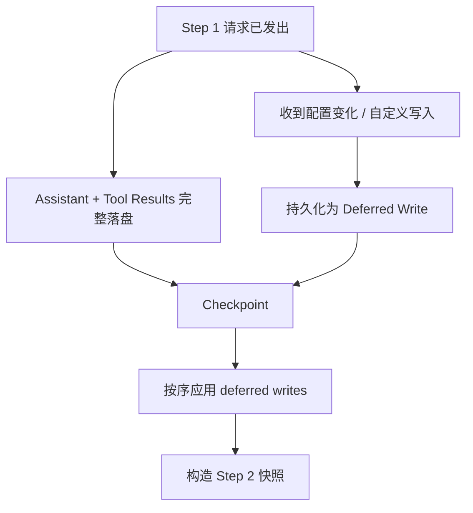
```mermaid
flowchart TD
    S1["Step 1 请求已发出"] --> D["收到配置变化 / 自定义写入"]
    D --> Q["持久化为 Deferred Write"]
    S1 --> R["Assistant + Tool Results 完整落盘"]
    R --> CP["Checkpoint"]
    Q --> CP
    CP --> APPLY["按序应用 deferred writes"]
    APPLY --> S2["构造 Step 2 快照"]
```

这个设计同时保护：

- 工具协议完整性；
- 对话 append-only；
- 状态恢复确定性；
- Provider prompt prefix 稳定；
- KV Cache 可复用性。

这也是 Pi 新设计中最深刻的地方之一：它把“上下文缓存命中”从性能技巧提升为状态模型不变量。

---

## 二十六、设计亮点总结

### 亮点一：核心循环足够小，复杂度由上层组合

模型循环没有直接依赖文件系统、TUI、扩展目录或具体 Provider。它因此可测试、可嵌入、可替换。

### 亮点二：事件既是 UI 协议，也是持久化屏障

事件不是“顺手打点”，而是驱动状态归约、会话落盘、扩展生命周期和用户界面的统一接口。

### 亮点三：应用消息与 LLM 消息分离

完整历史可以服务 UI、审计和扩展，模型只看到按策略投影出的上下文。

### 亮点四：并行执行不牺牲确定性

实际完成按时间，持久消息按源顺序，兼顾实时性和可重放性。

### 亮点五：保存点快照让动态配置可推理

模型、工具、提示和思考等级都在 turn 边界刷新，不污染进行中的请求。

### 亮点六：会话树天然支持分支而不重写历史

追加日志和 parentId 让回退、重试、替代方案与摘要都成为结构化操作。

### 亮点七：压缩关注“继续工作”而非“缩短文本”

它保护工具调用边界、任务状态、关键决策和文件轨迹，是面向长时程 Agent 的 checkpoint。

### 亮点八：错误按恢复条件分类

临时 Provider 错误走退避重试，上下文溢出走压缩，取消走 abort，存储失败进入 faulted；不同错误不共享一个粗糙的 retry。

### 亮点九：扩展可以介入全生命周期，但由统一 Runner 治理

扩展不仅能加工具，还能参与输入、上下文、请求、工具策略、会话和渲染，同时保留来源和顺序。

### 亮点十：明确承认进程持久化和副作用恢复的边界

Durable Harness 不承诺虚假的 exactly-once，而是把 idempotency、checkpoint 和 interrupted reconciliation 明确建模。

---

## 二十七、值得警惕的复杂度与边界

### 1. 当前 AgentSession 仍然承担过多职责

它同时管理提示、扩展、工具、持久化、压缩、重试、bash、模型切换和事件桥接。虽然职责在逻辑上清楚，但代码层面已经形成大型控制平面。

新的 AgentHarness 正是在尝试把通用生命周期能力下沉，减少 coding-agent 的专用编排负担。

### 2. 旧 SessionManager 与新 Session 抽象处于迁移期

当前编码 Agent 的会话管理成熟可用，新 agent package 又在建立通用 Session、Repository 和 Storage 接口。阅读时容易把两套实现混在一起。

合理演进方向是：

```text
通用 append-only session、tree、storage、recovery 下沉到 agent package
coding-agent 只保留编码特有条目、展示和产品策略
```

### 3. 扩展能力强意味着错误语义必须极其严格

某个 hook 失败时应：

- 阻止工具？
- 忽略观察事件？
- 中止整个 run？
- 回滚队列消费？
- 是否写入失败记录？

不同钩子不能默认共享相同策略。新的 hooks 设计已经意识到这点，但完整迁移仍需要大量生命周期测试。

### 4. 内存状态与 durable state 必须逐步收敛

只存在内存里的 steering queue、pending writes 或运行阶段，进程崩溃后都会丢失。真正 durable 的目标要求“公共 API 返回成功之前，接受事实已经落盘”。

### 5. 多 ref 并行会显著提高恢复复杂度

下一代设计允许一个 session 有多个命名 ref，各自在自己的 leaf 上串行 operation、彼此并行。这能支持更高级的多分支执行，但要求单写者、ref 级 operation 约束、日志一致性与更严格的恢复验证。

---

## 二十八、如果借鉴 Pi 设计自己的 Agent，建议按这个顺序实现

### 第一阶段：建立纯循环

只实现：

```text
标准消息
→ 模型流
→ ToolCall 校验
→ 工具执行
→ ToolResult
→ 继续模型
```

确保 error、abort、length stop 和未知工具都有结构化结果。

### 第二阶段：建立事件协议与有状态 Agent

增加：

- 生命周期事件；
- state reducer；
- awaited listeners；
- prompt / continue；
- waitForIdle；
- steering / follow-up。

不要先做 UI，先把事件顺序测试清楚。

### 第三阶段：建立应用会话层

增加：

- system prompt compiler；
- 工具注册表与启用集合；
- 资源加载；
- 应用消息到 LLM 消息的投影；
- 扩展 Runner；
- Provider 认证与请求钩子。

### 第四阶段：建立 append-only session tree

至少支持：

- message entry；
- model / thinking / tools config entry；
- leaf；
- branch；
- compaction；
- JSONL 与 memory backend。

先保证任意有效日志前缀都能读取，再考虑 SQLite。

### 第五阶段：建立长时程能力

增加：

- token 估算；
- 安全切点；
- 增量摘要；
- 文件或任务账本；
- overflow recovery；
- retry 分类。

### 第六阶段：再做 durable execution

最后才引入：

- operation / step / generation / checkpoint；
- durable queue；
- deferred writes；
- interrupted reconciliation；
- idempotent tool metadata；
- suspended / faulted 状态。

如果一开始就追求“崩溃后恢复任意工具”，系统会过早陷入分布式事务复杂度。

---

## 二十九、一条完整编码请求的运行示例

假设用户输入：“找到配置加载失败的原因并修复”。

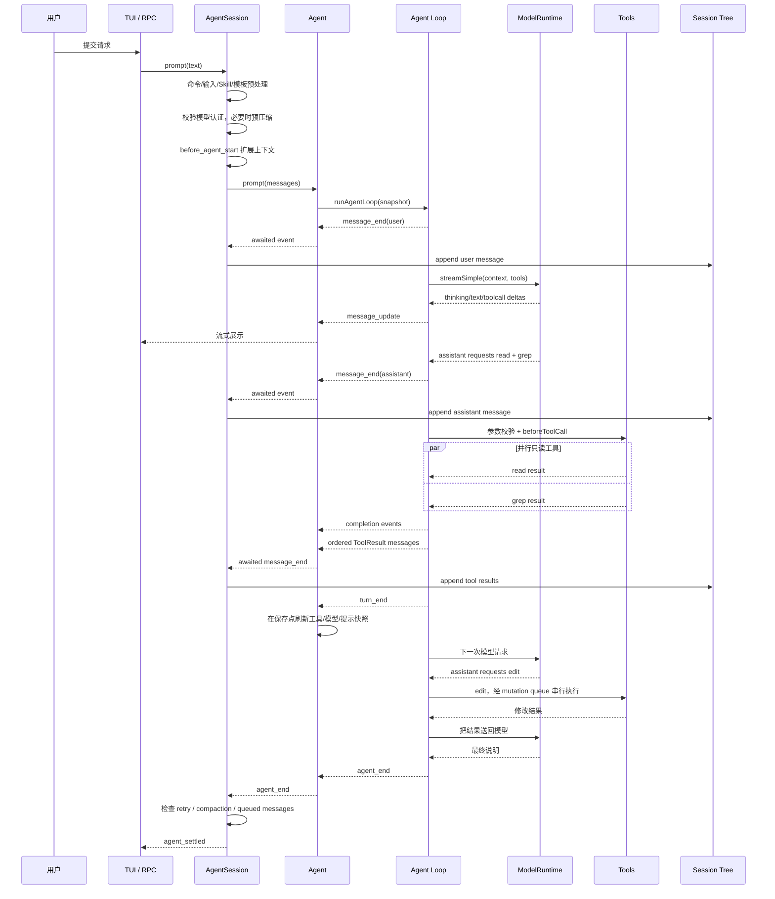
```mermaid
sequenceDiagram
    participant U as 用户
    participant UI as TUI / RPC
    participant S as AgentSession
    participant A as Agent
    participant L as Agent Loop
    participant M as ModelRuntime
    participant T as Tools
    participant DB as Session Tree

    U->>UI: 提交请求
    UI->>S: prompt(text)
    S->>S: 命令/输入/Skill/模板预处理
    S->>S: 校验模型认证，必要时预压缩
    S->>S: before_agent_start 扩展上下文
    S->>A: prompt(messages)
    A->>L: runAgentLoop(snapshot)
    L-->>A: message_end(user)
    A-->>S: awaited event
    S->>DB: append user message

    L->>M: streamSimple(context, tools)
    M-->>L: thinking/text/toolcall deltas
    L-->>A: message_update
    A-->>UI: 流式展示
    M-->>L: assistant requests read + grep
    L-->>A: message_end(assistant)
    A-->>S: awaited event
    S->>DB: append assistant message

    L->>T: 参数校验 + beforeToolCall
    par 并行只读工具
        T-->>L: read result
    and
        T-->>L: grep result
    end
    L-->>A: completion events
    L-->>A: ordered ToolResult messages
    A-->>S: awaited message_end
    S->>DB: append tool results
    L-->>A: turn_end

    A->>A: 在保存点刷新工具/模型/提示快照
    L->>M: 下一次模型请求
    M-->>L: assistant requests edit
    L->>T: edit，经 mutation queue 串行执行
    T-->>L: 修改结果
    L->>M: 把结果送回模型
    M-->>L: 最终说明
    L-->>A: agent_end
    A-->>S: agent_end
    S->>S: 检查 retry / compaction / queued messages
    S-->>UI: agent_settled
```

这里最关键的不是调用次数，而是每一步都有清楚的事实归属：

```text
模型输出属于 AssistantMessage
工具副作用属于 Tool execution
工具观察结果属于 ToolResultMessage
持久事实属于 Session entries
运行瞬态属于 AgentState
产品策略属于 AgentSession
显示状态属于 UI
```

---

## 三十、最终结论

Pi 展示了一条从“LLM API 封装”到“专业 Agent Harness”的清晰演进路线。

最初级的 Agent 只需要：

```text
while model asks for tools:
    execute tools
```

而可靠 Agent 真正需要的是：

```text
标准化模型协议
+ 明确的消息投影边界
+ 可观察且有屏障的事件流
+ 可校验、可治理、可取消的工具执行
+ steering 与 follow-up 的时间语义
+ 保存点和轮次快照
+ 追加式会话树
+ 安全压缩与错误分类
+ 生命周期级扩展系统
+ 对持久化、副作用和恢复边界的诚实建模
```

Pi 最深刻的设计思想不是“让模型更自主”，而是：

> 把模型的不确定决策包裹在一个确定、可观察、可持久化、可恢复的执行系统里。

模型可以自由决定下一步调用什么工具，但系统必须确保：参数经过校验、策略可以阻止、工具结果有稳定顺序、上下文不会被破坏、会话事实可以恢复、失败有明确分类、副作用不会被无脑重放。

这就是 Harness 的真正价值。它不是替模型思考，而是让模型的思考能够安全、连续、可解释地作用于真实世界。

---

# 补充专题：Pi 的 Agent Loop 到底是如何运转的

前文已经把 Agent Loop 放进整个 Pi 架构中说明过，但如果要真正理解 Pi，仍然需要把这一层单独拆开。因为 Agent Loop 看起来只有“调用模型、执行工具、继续调用模型”三步，实际却承担了 Agent 最重要的控制语义：什么时候开始一个 turn，什么时候允许插入用户的新指令，工具结果以什么顺序回到上下文，配置变化在什么时候生效，什么情况应该继续，什么情况必须立即停止。

Pi 的 Agent Loop 不是一个拥有数据库、UI、配置文件和扩展目录的完整应用。它更接近一个小型的、事件驱动的执行内核。调用方把当前上下文、模型配置、工具集合、队列读取函数、上下文转换函数和事件接收器交给它；它负责从当前状态出发不断推进，直到没有必须执行的后续动作。至于事件如何显示、消息如何落盘、错误是否要重试、会话是否要压缩，则由 Agent 或 AgentSession 等更外层的运行时决定。

这种边界非常重要。Agent Loop 的专业性并不来自“知道很多业务”，而来自它只处理一件事：**在保持消息因果关系和事件顺序正确的前提下，把一次 Agent 运行推进到一个合法终点。**

## 一、先把 Agent Loop 看成一个状态转换器

从抽象上看，Agent Loop 接收四类输入。

第一类是对话状态，包括系统提示、历史 AgentMessage 和本轮可用工具。这里的历史不是简单的字符串列表，而是应用层完整消息空间，可能包含 user、assistant、toolResult，也可能包含经过应用扩展的自定义消息。

第二类是运行配置，包括当前模型、思考等级、工具执行模式、认证解析方式、上下文转换函数、消息转换函数，以及执行前后钩子。

第三类是外部控制信号，包括 AbortSignal、steering 队列、follow-up 队列、保存点刷新函数和 turn 后停止判断。

第四类是输出通道，也就是事件接收器。循环不直接操作 UI 或数据库，而是依次发出 agent、turn、message 和 tool execution 事件。

它最终产生两种结果：一条完整的事件序列，以及“本次运行新产生的消息”。注意，返回值不是整个会话，而只是从这次启动循环以来新出现的消息；完整上下文在循环内部用于继续推理，但调用方通常已经拥有旧历史，不需要重复返回。

可以把它写成如下关系：

```text
旧上下文 + 新输入 + 运行配置 + 外部队列
    ↓
Agent Loop 持续执行状态转换
    ↓
事件流 + 本次新增消息 + 对外部世界产生的工具副作用
```

这里最值得注意的是，工具副作用并不包含在消息返回值里。ToolResult 只能描述工具观察到或声称完成的结果，真正的文件修改、进程执行和网络请求发生在外部世界。因此 Agent Loop 能保证消息协议顺序，却不能凭自身保证外部副作用可回滚。这也是后续 Durable Harness 必须引入幂等性和恢复策略的原因。

## 二、两种入口：开始新运行与从既有上下文继续

Pi 将“带新 prompt 开始”和“从当前上下文继续”分成两个入口。这不是 API 风格差异，而是两种不同的消息语义。

开始新运行时，调用方显式传入一条或多条 prompt message。循环会复制现有消息数组，把 prompts 追加到内部工作上下文，同时把它们放入 `newMessages`。之后依次发出：

```text
agent_start
turn_start
message_start(prompt 1)
message_end(prompt 1)
message_start(prompt 2)
message_end(prompt 2)
```

也就是说，新 prompt 不只是悄悄进入数组，它也完整经过消息生命周期事件。这样 Agent 包装层、Session 持久化和 UI 都能以统一方式观察用户消息。

继续运行时，不会新增 prompt，也不会重新发出已有尾消息的 start/end 事件。循环直接以当前上下文作为模型调用起点，只发出 `agent_start` 和 `turn_start`，然后请求下一条 assistant message。这种入口适合两类场景：工具结果已经存在，需要模型继续解释；或者上层刚完成错误恢复、压缩或上下文调整，需要从新的合法尾部重新请求模型。

继续运行存在一个重要前提：模型上下文的最后一条消息经过转换后必须允许 assistant 接着回答，通常应当是 user 或 toolResult。Pi 能在入口处直接拒绝明显的 assistant 尾部，却无法完全验证自定义消息，因为自定义 AgentMessage 可能在 `convertToLlm` 时变成 user，也可能被过滤掉。这是调用方责任与低层内核责任的清晰分界：循环只检查它能静态知道的错误，最终协议合法性由转换函数保证。

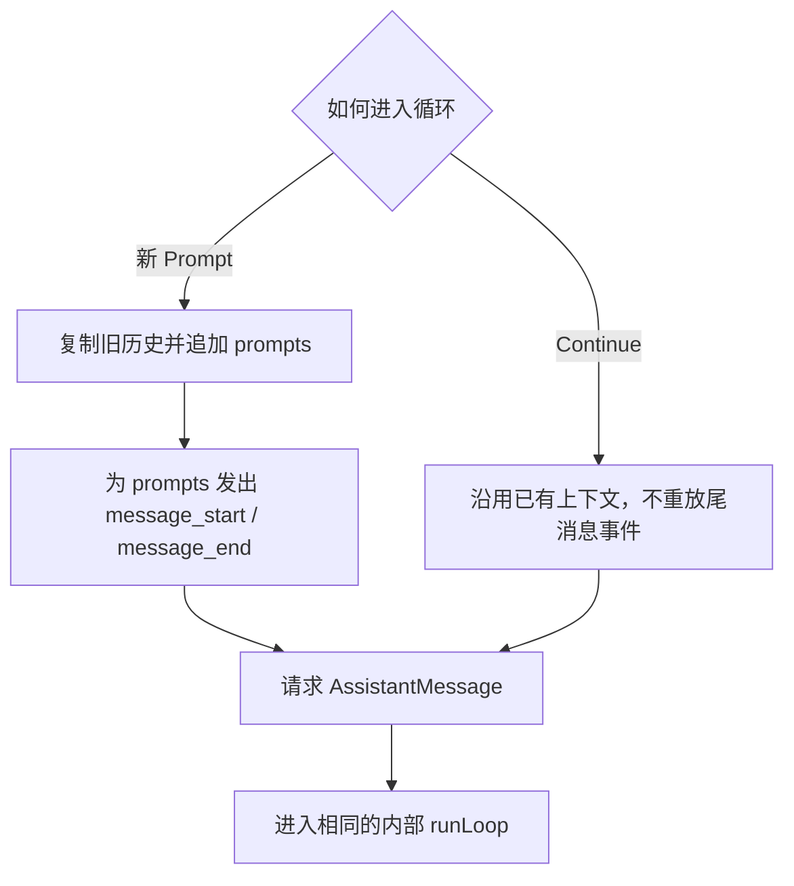
```mermaid
flowchart TD
    A{"如何进入循环"}
    A -->|新 Prompt| B["复制旧历史并追加 prompts"]
    B --> C["为 prompts 发出 message_start / message_end"]
    C --> E["请求 AssistantMessage"]

    A -->|Continue| D["沿用已有上下文，不重放尾消息事件"]
    D --> E

    E --> F["进入相同的内部 runLoop"]
```

## 三、两个消息账本：工作上下文与本次新增消息

Agent Loop 内部同时维护 `currentContext.messages` 和 `newMessages`。它们经常包含相同的消息，但职责不同。

`currentContext.messages` 是本次推理的工作内存。每收到 assistant partial、最终 assistant message、toolResult 或待注入用户消息，它都会更新。下一次模型请求会从这里取消息，再经过 transform 和 convert。它回答的问题是：**模型下一步应该看到什么历史？**

`newMessages` 是本次运行的增量账本。它不包含运行开始前的旧历史，只记录本次 prompt、assistant 输出、toolResult、steering 和 follow-up 注入。最终 `agent_end` 携带的也是这组消息。它回答的问题是：**这次运行新产生了什么？**

为什么不只维护一个数组？因为完整上下文可能非常大，而且上层已经拥有它；如果 agent_end 每次都返回整个历史，调用者难以区分新旧消息，也容易重复持久化。相反，如果只维护增量消息，循环又无法进行下一轮模型调用。所以工作上下文和增量结果必须分开。

这里还有一个细节：循环对传入消息数组做顶层复制。它不会直接把新的 assistant 和 toolResult 追加进调用方原始数组。这降低了低层函数对外部状态的隐式修改，让事件消费者或 Agent 包装层决定何时把最终消息归约进自己的权威状态。但消息对象本身不是深拷贝，因此系统仍依赖“消息一旦成为稳定历史就不随意原地修改”的约定。

## 四、为什么是双层循环，而不是一个 while

Pi 内部有一个外层循环和一个内层循环。两层分别表达两种不同的继续原因。

内层循环处理“当前工作链还没有闭合”的情况，包括：

- 第一次必须调用模型；
- assistant 产生了需要反馈结果的工具调用；
- turn 结束后出现 steering 消息，需要在下一次模型调用前注入。

外层循环处理“当前工作链已经闭合，但用户还排了后续任务”的情况，也就是 follow-up。

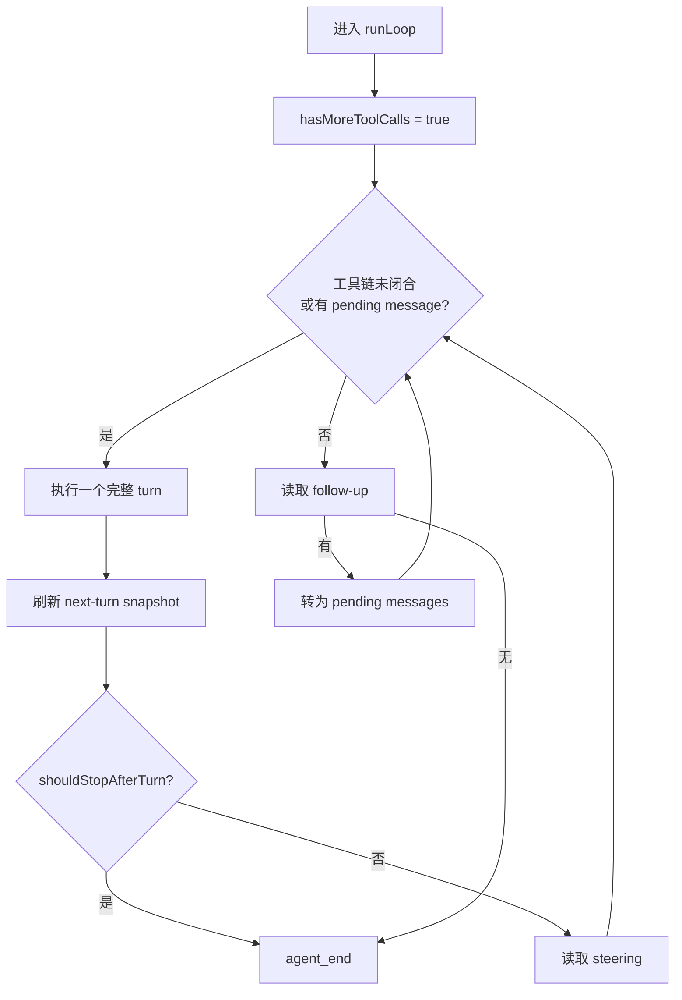
```mermaid
flowchart TD
    START["进入 runLoop"] --> INIT["hasMoreToolCalls = true"]
    INIT --> INNER{"工具链未闭合<br/>或有 pending message?"}
    INNER -->|是| TURN["执行一个完整 turn"]
    TURN --> SAVE["刷新 next-turn snapshot"]
    SAVE --> FORCE{"shouldStopAfterTurn?"}
    FORCE -->|是| END["agent_end"]
    FORCE -->|否| POLL["读取 steering"]
    POLL --> INNER
    INNER -->|否| FOLLOW["读取 follow-up"]
    FOLLOW -->|有| SET["转为 pending messages"]
    SET --> INNER
    FOLLOW -->|无| END
```

`hasMoreToolCalls` 初始值被设为 true，并不表示已经存在工具调用，而是用它保证第一次一定进入内层循环、发起一次模型请求。第一次 assistant 返回后，它才根据实际工具批次决定是否保持为 true。

如果 assistant 没有工具调用，`hasMoreToolCalls` 会变为 false；但只要 turn 后取到了 steering，内层循环仍会继续。如果既没有工具续轮，也没有 steering，内层退出，系统才有资格检查 follow-up。

这种结构把优先级直接编码进控制流：

```text
必须完成的工具续轮
    优先于 steering 后的方向调整
steering
    优先于 Agent 本来结束后的 follow-up
follow-up
    优先于最终 agent_end
```

严格说，工具续轮与 steering 会在同一个下一 turn 合并：当前工具批次先完整结束，随后 steering 被注入，再由模型同时看到工具结果和用户的新方向。这样既不破坏工具协议，又能尽快响应用户修正。

## 五、一个 Turn 是一个小事务，而不是一句 Assistant 回复

Pi 对 turn 的隐含定义是：一次 assistant 生成，加上这次生成要求的完整工具批次。只有两部分都结束，才发出 `turn_end`。

这可以被理解为一个小型因果事务：assistant message 提出一组动作，toolResult messages 对这些动作逐一作答。只持久化前半部分或只保留后半部分，都会留下不完整的对话结构。

一个正常工具 turn 的顺序如下：

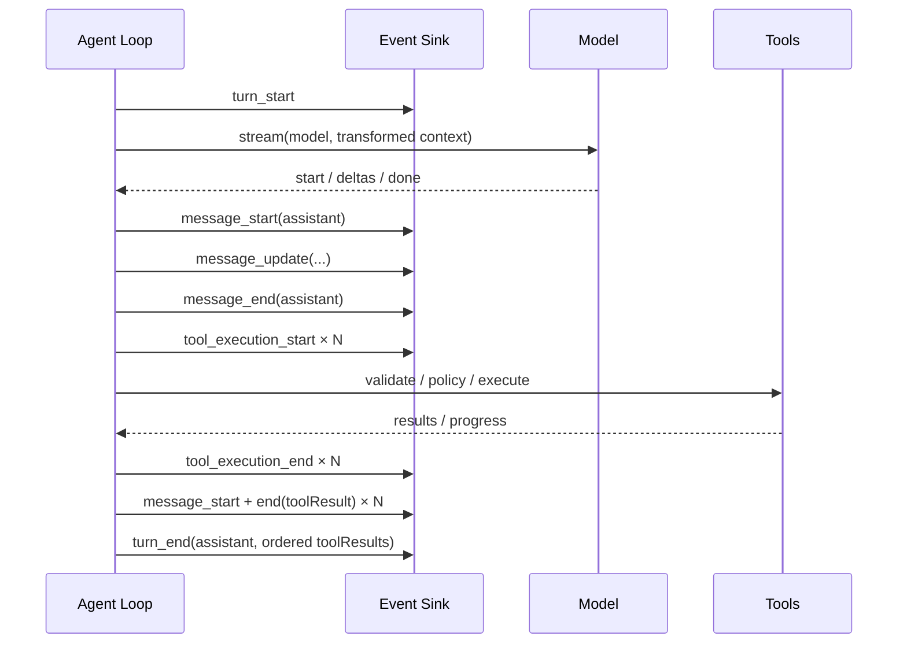
```mermaid
sequenceDiagram
    participant L as Agent Loop
    participant E as Event Sink
    participant M as Model
    participant T as Tools

    L->>E: turn_start
    L->>M: stream(model, transformed context)
    M-->>L: start / deltas / done
    L->>E: message_start(assistant)
    L->>E: message_update(...)
    L->>E: message_end(assistant)
    L->>E: tool_execution_start × N
    L->>T: validate / policy / execute
    T-->>L: results / progress
    L->>E: tool_execution_end × N
    L->>E: message_start + end(toolResult) × N
    L->>E: turn_end(assistant, ordered toolResults)
```

这条顺序带来一个重要保证：当 `turn_end` 出现时，assistant 和其工具批次已经全部完成，ToolResult 已经构造成标准消息，并已通过 message 生命周期事件。上层可以在这个边界安全地考虑压缩、停止或切换下一 turn 的配置。

如果 assistant 没有请求工具，turn 仍然合法，只是 toolResults 为空。如果 assistant 以 error 或 aborted 停止，循环也会发出 turn_end，但不会继续走工具、保存点刷新或消息队列轮询，而是紧接着 agent_end。换句话说，失败 turn 仍然被“关账”，只是不会被当作普通成功保存点继续推进。

## 六、请求模型前的上下文不是直接拿历史数组发送

每次模型请求前，Pi 都经过明确的边界流水线。

第一步是读取当前 AgentMessage 历史。第二步可选地执行 `transformContext`。它可以裁剪旧消息、注入临时上下文、由扩展改写消息，输出仍属于应用消息空间。第三步执行必需的 `convertToLlm`，把自定义消息过滤或映射为 Provider 能理解的 user、assistant 和 toolResult。第四步才把转换后的消息与当前 system prompt、工具定义组装成标准 LLM Context。

认证也在这一刻解析，而不是只在 Agent 创建时读取一次。原因是 OAuth 或临时凭证可能在长运行中轮换。动态获取的 key 优先使用；如果没有动态结果，才回退到静态配置。

最后，循环调用注入的 stream function，而不是直接依赖某个 Provider。这使 Agent Loop 不知道 OpenAI、Anthropic 或 Google 的具体协议。它只依赖一个强契约：stream function 不应把普通请求失败以 rejected promise 的方式抛出，而应返回一个 AssistantMessage 事件流，并在最终消息中用 error 或 aborted stop reason 表达失败。

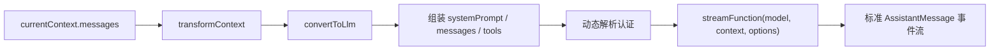
```mermaid
flowchart LR
    A["currentContext.messages"] --> B["transformContext"]
    B --> C["convertToLlm"]
    C --> D["组装 systemPrompt / messages / tools"]
    D --> E["动态解析认证"]
    E --> F["streamFunction(model, context, options)"]
    F --> G["标准 AssistantMessage 事件流"]
```

这个设计避免了两个常见错误。第一，不会把 UI 专用消息、隐藏 Bash 消息或摘要对象未经处理直接发给模型。第二，模型供应商的请求失败不会跳过 Agent 的 message_end、turn_end 和 agent_end 语义，使上层仍能用统一事件处理失败。

## 七、流式 AssistantMessage 如何从 partial 收敛为 final

Pi 没有把模型流简单理解成文本 delta。流里可能同时出现文本、思考内容和工具调用参数，它们都共同组成一条 AssistantMessage。

当收到 start 事件时，循环取得 Provider 给出的 partial message，把它追加到内部工作上下文，并发出 assistant 的 message_start。后续的 text、thinking 和 toolcall 相关事件都带有更新后的 partial。循环用最新 partial 替换工作上下文的最后一条消息，并发出 message_update。

这里采用“替换最后一条 partial”，而不是“每个 delta 追加一条消息”，是因为模型只生成一条 assistant message。delta 是同一对象的构建过程，不是新的对话轮次。工作上下文始终保持“历史 + 当前 assistant 最新快照”的结构，UI 也能直接渲染当前完整状态。

收到 done 或 error 后，循环等待流的最终 result，用 final message 替换 partial，并发出 message_end。如果某个 Provider 没有先发 start，而是直接结束，循环会补发 message_start，保证每条最终消息仍然拥有配对的 start/end 生命周期。

即使异步迭代意外自然结束、没有显式 done/error 分支，循环仍会读取 final result 并做同样的收尾。这是对不同流实现差异的一层防御。

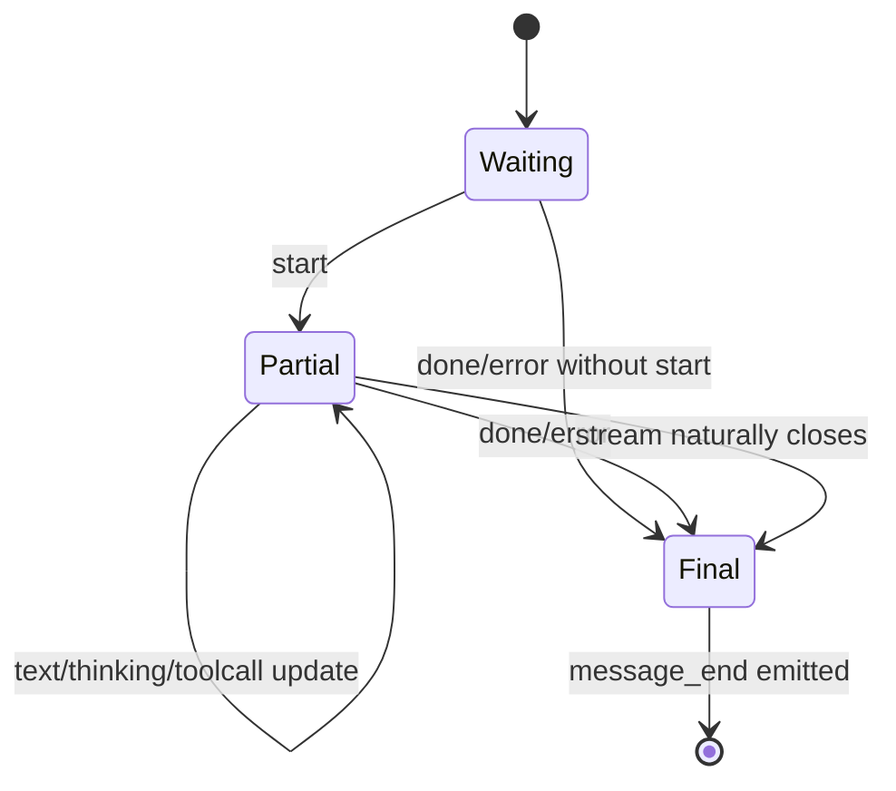
```mermaid
stateDiagram-v2
    [*] --> Waiting
    Waiting --> Partial: start
    Waiting --> Final: done/error without start
    Partial --> Partial: text/thinking/toolcall update
    Partial --> Final: done/error
    Partial --> Final: stream naturally closes
    Final --> [*]: message_end emitted
```

这里还有一个容易忽略的边界：事件中发送的是 partial 的浅拷贝，而内部工作上下文保存的是当前 partial 对象。这样监听者不会直接拿到内部数组槽位，但嵌套内容仍要求被视为只读。低层协议依赖事件消费者不去篡改消息。

## 八、Assistant 停止原因如何决定后续控制流

AssistantMessage 的 stop reason 不是展示字段，而是循环分支条件。

普通 stop 表示模型已经给出最终回答。如果没有工具调用、没有 steering 和 follow-up，运行结束。

toolUse 通常意味着消息中存在工具调用。循环执行工具批次，把结果送入上下文，并再次请求模型。

length 表示模型输出达到上限。若消息只包含文本，循环可以把这条截断回复视为当前 turn 的结果；但若其中包含工具调用，任何调用参数都被视为不安全，全部拒绝执行。

error 表示请求或 Provider 失败。循环发出空工具结果的 turn_end 和 agent_end，不再读取 steering、follow-up，也不执行 prepareNextTurn。是否重试由 AgentSession 等上层判断。

aborted 与 error 类似，表示当前运行已被取消。循环正常闭合事件序列，但不把取消当成可继续的普通 turn。

可以总结为：

| 停止原因 | 工具调用处理 | 是否走保存点刷新 | 是否轮询队列 | 低层是否继续 |
| --- | --- | --- | --- | --- |
| stop | 有则执行 | 是 | 是 | 由工具和队列决定 |
| toolUse | 执行 | 是 | 是 | 通常继续 |
| length | 所有工具调用均失败化 | 是 | 是 | 让模型有机会重发完整调用 |
| error | 不执行 | 否 | 否 | 立即 agent_end |
| aborted | 不执行 | 否 | 否 | 立即 agent_end |

这种区分体现了 Pi 的分层恢复观：低层循环负责把失败变成完整、可观察的运行结果；上层根据产品策略决定重试、压缩、提示用户还是保持失败状态。

## 九、为什么 length 截断后的工具调用一个都不能执行

工具调用参数在流式传输过程中可能使用“尽力恢复”的 JSON 解析。一个被截断的参数有时仍然是合法 JSON。例如模型原本打算生成十个待删除文件，但在第三个文件后恰好闭合了数组或被解析器补全。从 Schema 看参数没有问题，从用户意图看却是不完整的。

因此只要 assistant 的停止原因是 length，Pi 不会逐个猜测哪个 ToolCall 可能完整。它会为消息中的每个 ToolCall 发出正常的 tool_execution_start，然后立即产生带明确原因的错误结果，再发出 tool_execution_end 和 ToolResult message。工具实现本身完全不会被调用。

这有两个作用。第一，副作用没有发生。第二，模型下一轮能看到结构化错误，知道必须重新发出完整调用，而不是看到一个神秘的系统异常。

更深层的原则是：

> 工具参数不仅需要语法正确和 Schema 正确，还需要生成过程完整。停止原因属于参数可信度的一部分。

这是一条很适合迁移到其他 Agent 框架的安全规则，尤其适用于 Bash、删除、部署、转账等不可轻易回滚的工具。

## 十、工具批次不是直接 Promise.all，而是准备、执行、收尾三阶段

Pi 把每个 ToolCall 分成三个阶段。

准备阶段负责按名称寻找工具、执行可选的参数预处理、进行 Schema 校验、运行 beforeToolCall，并在每一步后检查 AbortSignal。工具不存在、参数非法、策略阻止、准备钩子抛错或操作已经取消，都会直接得到一个 immediate error outcome，不进入工具实现。

执行阶段只处理已经准备好的工具。它调用工具的 execute，并接收可选的 progress 回调。工具正常返回成为成功 outcome；工具抛出的异常被捕获并转换成标准错误结果。

收尾阶段运行 afterToolCall。这个钩子可以替换 content、details、usage、isError 和 terminate。字段采用显式替换，不做深层合并，避免看似方便的 merge 隐藏旧敏感字段或产生不可预测结构。如果 afterToolCall 自身抛错，原工具结果会被替换成钩子错误，并标记为失败。

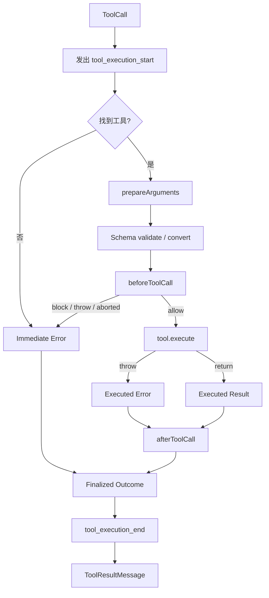
```mermaid
flowchart TD
    A["ToolCall"] --> B["发出 tool_execution_start"]
    B --> C{"找到工具?"}
    C -->|否| I["Immediate Error"]
    C -->|是| D["prepareArguments"]
    D --> E["Schema validate / convert"]
    E --> F["beforeToolCall"]
    F -->|block / throw / aborted| I
    F -->|allow| G["tool.execute"]
    G -->|throw| H["Executed Error"]
    G -->|return| J["Executed Result"]
    H --> K["afterToolCall"]
    J --> K
    K --> L["Finalized Outcome"]
    I --> L
    L --> M["tool_execution_end"]
    M --> N["ToolResultMessage"]
```

注意 immediate outcome 不经过 afterToolCall。因为工具根本没有成功完成准备，系统此时报告的是“未执行”的协议错误或策略结果，而不是一个可后处理的工具执行结果。

## 十一、工具进度事件也有结算屏障

工具可以通过回调连续上报 partial result，例如长命令的输出片段、下载进度或搜索阶段结果。Pi 不会让这些回调在工具结束后无限污染事件流。

执行期间，系统处于 acceptingUpdates 状态。每次 update 都会触发 tool_execution_update，并把事件发送产生的 Promise 收集起来。工具 execute 一旦返回或抛错，系统立即停止接受新 update，然后等待所有已经接收的 update 事件处理完毕，最后才进入 tool_execution_end。

因此事件顺序具有如下保证：

```text
所有被接受的 tool_execution_update
    一定先于
tool_execution_end
```

工具结束后异步冒出的迟到 update 会被丢弃。这避免了 UI 已经显示“工具完成”，过一会儿又收到旧进度的时间倒流现象，也避免扩展监听者在结果已经持久化后继续修改同一工具的显示状态。

## 十二、顺序执行模式：最容易理解的强因果语义

顺序模式按 assistant message 中 ToolCall 的出现顺序逐个处理。每个调用都会完整经历 start、prepare、execute、after、end 和 ToolResult message，然后才开始下一个调用。

如果 AbortSignal 在某个调用后变为 aborted，循环停止准备后续调用。已完成调用仍保留完整结果，当前批次只包含真正处理过的那一部分。

顺序模式的优点不是性能，而是因果关系最清楚。如果第二个工具依赖第一个工具写入的文件，或多个工具会修改同一个外部资源，顺序模式避免竞态。

Pi 支持全局选择 sequential，也支持单个工具声明自己必须 sequential。只要一个批次中存在这种工具，整个批次都切换为顺序模式。它没有尝试构造复杂的依赖图，把“可并行工具”和“必须串行工具”交错调度，因为那会让批次行为难以预测。

## 十三、并行执行模式：预检有序、执行并行、写回重新有序

Pi 的并行不是把所有 ToolCall 直接丢进 Promise.all。它先按 assistant 原始顺序完成每个调用的 start 事件和准备阶段。准备成功的调用被保存为尚未启动的执行任务；立即失败的调用当场完成 tool_execution_end。

全部预检结束后，准备成功的任务才一起启动。这一点非常重要：任何副作用都不会在后续调用尚未完成权限检查时提前发生，beforeToolCall 的观察顺序也是稳定的。

真正执行后，哪个工具先完成，就先发出哪个 tool_execution_end。所以 UI 能看到真实完成时序。但 Promise.all 最终会按输入任务顺序返回结果，Pi 随后按 assistant 原始调用顺序创建并发出 ToolResult messages。因此，实时事件顺序与持久对话顺序被有意分开。

```mermaid
sequenceDiagram
    participant L as Loop
    participant P as Preflight
    participant A as Tool A
    participant B as Tool B
    participant E as Events
    participant C as Context

    L->>P: prepare A
    L->>P: prepare B
    par execute after all preflight
        P->>A: execute A
    and
        P->>B: execute B
    end
    B-->>E: tool_execution_end(B)
    A-->>E: tool_execution_end(A)
    L->>C: ToolResult(A)
    L->>C: ToolResult(B)
```

为什么需要重新有序？因为 assistant message 里的 ToolCall 顺序是模型生成的稳定源顺序。如果上下文按随机完成顺序写回，同一个输入在不同机器或不同网络条件下可能形成不同 transcript，测试、重放、缓存和审计都会变得不确定。Pi 允许观测真实并发，却不允许并发调度随机改写会话事实。

## 十四、ToolResult 是工具世界回到模型世界的协议边界

无论工具成功、失败、被阻止还是不存在，最终都会被标准化成 ToolResultMessage。它至少包含原始 toolCallId、toolName、面向模型的 content、details、usage、isError 和时间戳。

toolCallId 使模型和 Provider 能把结果对应回原始调用。toolName 方便应用层显示和审计。content 是模型可消费部分，details 可保留应用层结构化信息，但是否发送给模型由后续转换决定。isError 明确表示失败，不要求模型通过文本内容猜测。

Pi 还防御未类型化扩展工具返回缺失 content 的情况，把它规范化为空数组，避免 null 进入会话历史或 Provider payload。这个细节体现了 Agent Harness 的边界职责：扩展世界可以相对宽松，但进入权威消息协议前必须规范化。

ToolResult 创建后仍会经过 message_start 和 message_end。它不是工具事件的附属字段，而是一条正式对话消息。工具事件面向运行观察，ToolResult 面向后续模型推理，二者不可互相替代。

## 十五、批次终止提示：只有全体同意才能跳过下一次模型调用

工具结果可以返回 `terminate: true`，afterToolCall 也可以添加这个标志。它表达的是：从这个工具自身角度看，本批次结束后不需要自动再调用模型。

但一个 assistant message 可能同时调用多个工具。假设一个通知工具已经把最终结果发送给用户，希望 terminate；另一个读取工具返回了模型必须继续解释的数据。如果任一 terminate 就停止，读取结果永远不会被模型消费。

因此 Pi 使用全体一致规则：只有批次非空，并且每个 finalized result 都是 terminate=true，`hasMoreToolCalls` 才变为 false。只要有一个结果没有要求终止，循环就继续下一次模型调用。

terminate 也不会删除 ToolResult 或伪造 stop reason。所有结果仍然进入 transcript，turn_end 仍然正常发出。它只是一个运行时调度提示，决定是否自动进行工具后的 assistant follow-through。

即便整个批次 terminate，steering 和 follow-up 仍可能让循环继续。terminate 的准确含义不是“杀死 Agent”，而是“这个工具批次本身不强制产生下一次模型调用”。

## 十六、Steering 为什么必须等完整工具批次结束

Steering 常被误解为立即中断。Pi 的实际语义更保守：用户可以在 Agent 工作时排入 steering，但低层循环只会在当前 turn 完整结束后读取它。

假设 assistant 同时调用两个工具。第一个工具完成后用户说“不要继续修改，先解释”。Pi 不会把这条 user message 插到两个 ToolResult 中间，也不会跳过第二个已经被同一 assistant message 发出的调用。它会完成整个工具批次，发出所有 ToolResult 和 turn_end，然后读取 steering，在下个 turn 开始时注入。

这保护了一个关键协议不变量：

```text
一条 assistant message 发出的工具调用
必须先得到完整、有序的结果集合
用户的新方向才能成为下一段对话输入
```

下一次模型请求会同时看到刚完成的工具结果和 steering。模型可以基于真实已发生状态调整方向，而不是误以为某些已启动动作没有发生。

循环在进入 runLoop 时也会先读取一次 steering。这样用户在外层准备模型请求的短暂窗口中排入的新指令，可以和初始 prompt 一起进入第一次 assistant 调用，而不必白白等一轮。

## 十七、Follow-up 为什么放在外层循环

Follow-up 的含义是“当前工作本来结束后，再做这件事”。因此它不能和普通 steering 一样在每个 turn 后读取。

内层循环只有在两个条件同时为假时退出：没有工具强制续轮，也没有 pending steering。此时 Agent 已经完成当前因果链，理论上可以结束。系统这时才读取 follow-up；如果有，就把它变成 pending message，重新进入内层循环。

这种结构确保 follow-up 不会抢在模型解释工具结果之前。例如当前 assistant 调用了测试工具，用户同时排入“完成后再写总结”。模型必须先看到测试结果并完成当前任务，之后才处理总结，而不是把两种目标混在工具续轮里。

队列的取出策略由上层决定。one-at-a-time 可以每次只注入最老的一条，使任务逐个完成；all 可以一次注入全部。低层循环不维护队列数据结构，只调用 getSteeringMessages 和 getFollowUpMessages，因此持久队列、内存队列或远程队列都可以接入相同控制流。

## 十八、prepareNextTurn 是保存点刷新，不是普通事件回调

每个成功 turn 的 assistant 和工具批次全部结束、turn_end 已发出后，循环调用 `prepareNextTurn`。它接收：

- 本 turn 的 assistant message；
- 有序 toolResults；
- 当前完整工作上下文；
- 本次运行至今的 newMessages。

它可以返回替换后的 context、model 或 thinking level。循环随后把这些值采样进下一轮配置。没有返回的字段保留当前值；thinking level 明确为 off 时会被转换成不传 reasoning。

为什么这个位置被称为保存点？因为当前 turn 的因果结构已经闭合，而下一次 Provider 请求尚未开始。此时刷新 system prompt、工具列表、模型或压缩后的消息，不会改变已经发出的请求，也不会把新配置插进 assistant/toolResult 中间。

AgentSession 利用这一点让动态工具、模型和 system prompt 在下一 turn 生效。更高级的 Harness 也可以在这里应用 deferred writes、执行压缩或从持久 Session 重建上下文。

```mermaid
flowchart LR
    A["Assistant final"] --> B["完整 Tool Batch"]
    B --> C["turn_end"]
    C --> D["prepareNextTurn"]
    D --> E["替换 context / model / thinking"]
    E --> F["下一次 steering poll 或下一 turn"]
```

需要注意的是，error 和 aborted turn 不经过这个保存点。失败恢复通常需要上层看到 agent_end 后执行专门策略，而不是把普通 next-turn 刷新误当成恢复事务。

## 十九、shouldStopAfterTurn 是比工具续轮和队列更高优先级的闸门

保存点刷新后，循环会调用 `shouldStopAfterTurn`。它同样能看到 assistant、toolResults、当前上下文和 newMessages。如果返回 true，循环立即发出 agent_end。

这个停止发生在读取下一批 steering 和 follow-up 之前。因此它不仅能阻止工具后的自动模型续轮，也能阻止本轮结束后消费队列。队列读取函数不会被调用，消息仍留在上层队列中，等待未来运行处理。

这一语义适合实现“当前 turn 安全完成后暂停”，例如：

- 判断下一次请求前必须压缩；
- 达到单次运行的 step 限额；
- 需要把控制权交回外部调度器；
- 某个持久化保存点要求进程在此停止。

它与 Abort 不同。Abort 可能影响正在进行的 Provider 或工具；shouldStopAfterTurn 不取消任何正在运行的工作，也不修改 assistant stop reason。它只在完整 turn 边界决定不再启动下一 turn。

优先级顺序准确地说是：

```text
完成 Assistant 与整个工具批次
→ turn_end
→ prepareNextTurn 刷新快照
→ shouldStopAfterTurn 强制停止判断
→ steering poll
→ 内层循环判断
→ follow-up poll
→ agent_end
```

## 二十、正常结束、工具终止、强制停轮、错误与取消的区别

Pi 有多种“停止”，它们不能混为一谈。

正常结束是 assistant 没有工具调用、没有 steering、没有 follow-up。循环自然走到 agent_end。

工具终止是工具批次全体 terminate，使工具本身不再强制下一次模型调用；但队列仍可继续运行。

强制停轮是 shouldStopAfterTurn 返回 true。它在安全边界立即 agent_end，不读取后续队列。

错误结束是 AssistantMessage stopReason=error。它保留失败消息和完整生命周期事件，但跳过普通保存点和队列。

取消结束是 stopReason=aborted，通常由 AbortSignal 传到 Provider 后产生。其低层收尾与 error 相似，但上层可以区分用户取消和系统失败。

流函数或事件接收器如果违反契约并直接抛异常，低层 `runAgentLoop` 本身不会伪造一组错误事件。Agent 类在更外层捕获这类异常，构造失败 AssistantMessage，并补发 message_start、message_end、turn_end 和 agent_end。这说明“失败事件规范化”有两层：Provider 常规失败由 stream contract 处理，意外运行时异常由 Agent 生命周期包装处理。

## 二十一、Abort 是合作式取消，不是时间倒流

AbortSignal 被传给上下文转换、认证相关逻辑、Provider stream、beforeToolCall、工具 execute 和 afterToolCall。各组件应主动观察信号并尽快结束。

工具准备阶段会在 beforeToolCall 后再次检查 signal，防止策略钩子运行期间用户已经取消却仍启动副作用。工具执行阶段收到相同 signal，由工具决定如何终止子进程、网络请求或其他工作。

但 Abort 不会回滚已经完成的工具，也不会删除已经发出的事件。如果第一个工具已经修改文件，然后用户取消第二个工具，历史必须如实记录第一个工具的结果。Agent Loop 的责任是停止未来工作并闭合可闭合的事件，而不是假装外部世界回到了运行前。

这也说明为什么副作用工具需要自己的事务或幂等设计。合作式取消只能减少后续动作，不能提供通用 rollback。

## 二十二、低层 EventStream 与 Agent 包装层存在一个关键差别

Pi 暴露的低层 `agentLoop()` 返回一个可异步迭代的 EventStream。它适合观察事件和收集最终新增消息。但事件被推入 stream 后，生产循环不会等待消费者处理完每个事件才进入下一阶段。事件顺序会保留，消费者处理却不是执行屏障。

相反，Agent 类直接调用可等待的 `runAgentLoop()`，把自己的 `processEvents` 作为 async event sink。每个事件先归约 AgentState，再按注册顺序等待所有监听者。只有监听者完成，循环才继续。

这个差别在工具执行前极其重要。使用 Agent 包装层时，assistant 的 message_end 监听者可以先完成持久化，工具预检随后才开始；使用原始 EventStream 时，单纯在外部 for-await 中做异步持久化，不能假设它阻止生产者继续执行工具。

```mermaid
flowchart TD
    A["低层 agentLoop EventStream"] --> B["push event"]
    B --> C["生产者继续"]
    B --> D["消费者异步观察"]

    E["Agent + runAgentLoop"] --> F["reduce internal state"]
    F --> G["await listener 1"]
    G --> H["await listener 2"]
    H --> I["生产者进入下一阶段"]
```

因此，低层 API 适合自主管理状态和屏障的高级调用方；普通应用更应该使用 Agent。事件“按顺序到达”和事件“形成执行屏障”是两种完全不同的保证。

## 二十三、事件序列本身就是 Agent Loop 的公共协议

Pi 没有让 UI、持久化和扩展通过读取内部变量猜测状态，而是定义了一套层次化事件。

agent_start / agent_end 描述一次低层运行。turn_start / turn_end 描述一次模型生成及其工具批次。message_start / update / end 描述消息构建。tool_execution_start / update / end 描述外部动作。

这四层事件允许不同消费者只关心自己需要的粒度：

- UI 可以消费 message_update 和 tool update；
- 会话持久化只需在 message_end 写稳定消息；
- 统计系统可以在 turn_end 聚合 usage；
- 调度器可以在 agent_end 判断低层运行结束；
- AgentSession 可以在更外层继续重试、压缩，最后发出 agent_settled。

事件携带的 message 通常是当时状态的快照；turn_end 又携带本 turn 的 assistant 和有序 toolResults，使调用方无需回扫所有细粒度事件就能得到 turn 结果。

一个包含工具的正常 run 至少形成以下嵌套：

```text
agent
└── turn 1
    ├── user message
    ├── assistant message
    ├── tool execution A
    ├── tool result A
    ├── tool execution B
    └── tool result B
└── turn 2
    └── assistant message
```

当前事件结构不是显式树对象，而是靠严格顺序表达嵌套。新的 Durable Harness 设计进一步为 operation、step、generation 和 request 建立更明确的层级，是对同一思想的扩展。

## 二十四、一次带 Steering 和并行工具的完整运行

假设用户要求：“同时读取配置和日志，找出故障原因。”模型第一次生成两个工具调用。日志工具先完成，配置工具后完成。两者执行期间，用户又输入：“先不要修复，只解释原因。”

真实控制流如下：

```mermaid
sequenceDiagram
    participant U as 用户
    participant L as Agent Loop
    participant M as 模型
    participant C as 配置读取工具
    participant G as 日志读取工具
    participant Q as Steering Queue

    U->>L: 初始 Prompt
    L->>M: 第一次请求
    M-->>L: ToolCall(config), ToolCall(log)
    L->>L: message_end(assistant)
    L->>L: 顺序完成两个 preflight
    par 并行执行
        L->>C: read config
    and
        L->>G: read log
    end
    U->>Q: 只解释，不要修复
    G-->>L: log finished
    L-->>L: tool_execution_end(log)
    C-->>L: config finished
    L-->>L: tool_execution_end(config)
    L->>L: 按源顺序写 ToolResult(config), ToolResult(log)
    L->>L: turn_end
    L->>L: prepareNextTurn
    L->>Q: poll steering
    Q-->>L: 只解释，不要修复
    L->>L: message_start/end(steering)
    L->>M: 第二次请求，包含两个结果和新约束
    M-->>L: 只解释原因的最终回答
    L->>L: turn_end → no follow-up → agent_end
```

这里有四个容易误判的地方。

第一，用户的 steering 不会取消已经由同一 assistant message 发出的第二个工具。当前工具批次先完整闭合。

第二，日志工具先完成，所以它的 tool_execution_end 先出现；但如果 config 是模型生成的第一个 ToolCall，ToolResult 仍先写 config。

第三，第二次模型请求不仅看到 steering，还看到完整工具结果。模型知道外部世界已经做过哪些只读动作。

第四，如果 `shouldStopAfterTurn` 在第一次 turn 后要求暂停，steering 队列根本不会被读取。这条消息会留给下一个 run，而不是丢失。

## 二十五、Agent Loop 维持的核心不变量

理解源码最好的方式不是记函数，而是记住它试图维持哪些不变量。

第一个不变量是消息闭合。每条稳定消息都有 start 和 end；流式 assistant 可以有任意多个 update，但最终只收敛成一条历史消息。

第二个不变量是工具因果完整。assistant 的工具调用先成为稳定消息，整个工具批次随后完成，ToolResult 再按原调用顺序进入上下文。

第三个不变量是配置快照稳定。一次 Provider 请求和其工具批次使用同一 turn 所采样的上下文与工具；动态变化在 prepareNextTurn 保存点刷新。

第四个不变量是并发不污染 transcript。真实完成顺序可以变化，权威 ToolResult 顺序保持确定。

第五个不变量是队列不会切开工具批次。steering 只在 turn 边界注入，follow-up 只在当前工作链本应停止时注入。

第六个不变量是失败也要有终点。error 和 aborted 仍产生 turn_end 与 agent_end，使上层不必通过超时猜测循环是否死亡。

第七个不变量是安全优先于猜测。length 截断的工具参数一律不执行，未知工具、参数错误和策略阻止都变成结构化 ToolResult。

第八个不变量是循环不冒充持久化系统。它提供事件和安全边界，但不声称已经把运行事实写入 durable storage；是否形成真正屏障取决于 Agent/Harness 层。

## 二十六、这套设计为什么比经典 ReAct while 循环更成熟

经典 ReAct 示例通常是：模型生成 Thought 和 Action，程序执行 Action，把 Observation 拼回 prompt，再循环。这种形式适合教学，却没有回答生产系统中的关键问题。

它没有定义流式过程中消息是什么状态，没有定义多个工具调用是否可以并行，没有定义并行完成后结果如何排序，没有定义用户中途输入何时插入，没有定义错误和取消如何闭合事件，没有定义配置更新何时生效，也没有区分完整上下文和本次增量消息。

Pi 保留了 ReAct 的核心——模型根据观察决定下一步——但把它变成了一个有协议边界的运行时：

```text
ReAct 关心：模型如何“想一步、做一步”
Pi Agent Loop 进一步关心：
这一步何时算开始与结束
多个动作如何调度
观察如何稳定写回
外部输入如何排队
失败如何成为结构化事实
下一步使用哪份配置快照
```

因此 Pi 的 Agent Loop 更像一个小型工作流内核，只是流程图不是预先写死的，而是由模型在每个 assistant message 中动态产生下一组 ToolCall。

## 二十七、它刻意没有解决什么

Agent Loop 不负责自动压缩。它只提供 transformContext、prepareNextTurn 和 shouldStopAfterTurn 等插槽，具体何时压缩、如何摘要由上层决定。

它不负责自动重试。error 会结束低层运行，AgentSession 可以检查错误类型、退避后调用 continue。

它不负责会话持久化。事件允许外层落盘，但原始 EventStream 不提供 awaited persistence barrier。

它不负责权限 UI。beforeToolCall 可以阻止工具，但是否弹出确认框、如何保存授权策略属于宿主应用。

它不负责崩溃恢复。内存中的 currentContext、pending 工具和队列不会自动变成 durable operation log。

它也不负责 exactly-once 副作用。工具是否幂等、是否支持重试、如何处理执行成功但结果未记录的崩溃窗口，需要更高层 Harness 和工具协议共同解决。

这些“不负责”不是缺陷清单，而是架构边界。一个可复用 Agent Loop 应当提供必要控制点，却不把某个产品的持久化、UI 和恢复政策写死。

## 二十八、对设计 Agent 系统的可复用启示

第一，不要把完整 Agent 产品压进一个 while 循环。循环只负责推进推理，状态、持久化、UI 和资源加载应有独立层。

第二，把 turn 定义为 assistant 生成加完整工具批次。只有这样，保存点、队列注入和上下文压缩才有安全边界。

第三，并行系统必须同时定义观测顺序和事实顺序。工具可以按完成时间通知 UI，但持久消息应按稳定源顺序写回。

第四，用户中途输入需要时间语义。至少区分改变当前方向的 steering 和当前任务结束后的 follow-up。

第五，流式消息应被建模为一条消息的状态机，而不是若干独立文本块。partial 与 final 的替换关系必须清楚。

第六，工具调用要有准备、执行和收尾阶段。参数校验、权限策略和结果治理不能全部混在 execute 里。

第七，把 stop reason 纳入安全判断。输出被截断时，即使参数能解析，也不要执行潜在副作用。

第八，明确区分事件顺序和事件屏障。如果持久化必须先于工具副作用，就要使用 awaited sink 或显式事务，不能只依赖异步事件消费者“通常很快”。

第九，让动态配置在 turn 边界采样。进行中的请求使用不可变快照，下一轮再看到最新模型、工具和提示。

第十，低层失败应结构化闭合，高层再选择恢复策略。不要在 Agent Loop 内部把所有错误都无条件重试，也不要让异常直接撕裂生命周期事件。

## 二十九、对 Pi Agent Loop 的最终评价

Pi 的 Agent Loop 代码规模并不夸张，但它的价值集中在控制顺序。它没有发明新的推理算法，而是把模型生成、工具副作用、用户实时输入和应用运行时之间最容易产生竞态的边界变得明确。

它真正做对的事情可以浓缩为一句话：

> 让每一次不确定的模型决策，都在一个确定的 turn 事务中完成；让每一次继续、停止、插队和配置变化，都只能发生在定义清楚的边界上。

模型可以生成任意数量的工具调用，工具可以并行、失败或被策略阻止，用户可以在运行中改变方向，Provider 可以流式返回或中途出错。但只要 Agent Loop 维持消息闭合、工具因果、稳定写回、队列边界和失败终点，上层就能在它之上建立持久化、压缩、重试、UI 和分布式监督。

这也是为什么 Pi 的 Agent Loop 值得单独研究：它展示的不是“怎样让 LLM 调函数”，而是“怎样把 LLM 的函数调用变成一种可以被系统可靠承载的执行语义”。
