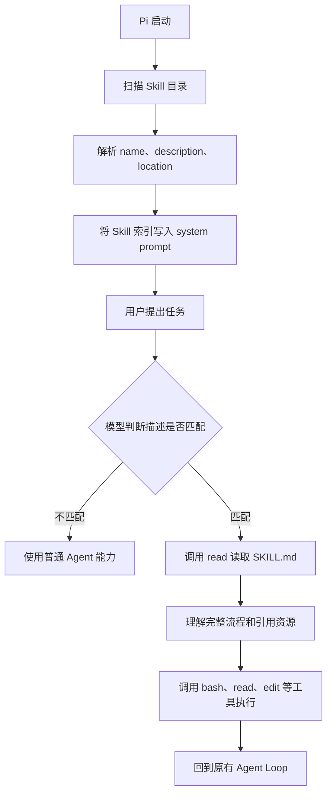
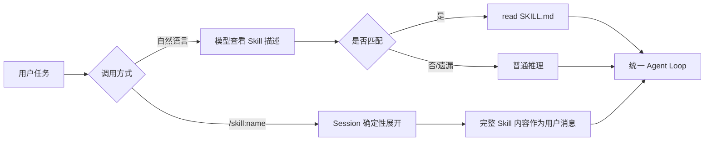

Pi 的 Skill 体系，本质上不是“插件系统”，而是一套面向 Agent 的、可按需加载的操作知识协议。

如果用一句话概括：

> Pi 把 Skill 设计成“带触发描述的 Markdown 指令包”，启动时只让模型看到目录，真正需要时才把完整说明加载进对话，然后继续复用原来的 Agent Loop 和工具执行链。

这套设计非常符合 Pi 的整体哲学：核心 Harness 尽量薄，把特定领域的工作流、经验、脚本和参考资料放到 Skill 中。

## 一、Skill 在 Pi 里到底是什么

一个典型 Skill 是一个包含 `SKILL.md` 的目录：

```
pdf-processing/
├── SKILL.md
├── scripts/
│   └── extract.ts
├── references/
│   └── pdf-format.md
└── assets/
    └── template.json
```

`SKILL.md` 由两部分组成：

```
---
name: pdf-processing
description: 处理 PDF 的提取、合并和表单填写。遇到 PDF 任务时使用。
---

# PDF 处理流程

先检查文件类型……

需要提取时运行：

scripts/extract.ts
```

其中 frontmatter 是机器索引层，正文是模型执行层。

Pi 真正关心的核心字段只有：

- `name`：Skill 的稳定标识，也是 `/skill:name` 的名字。
- `description`：告诉模型“这个 Skill 解决什么问题、什么时候应该使用”。
- `disable-model-invocation`：是否禁止模型自主发现，只允许用户显式调用。

其他内容都可以自由组织。Skill 目录里可以放脚本、示例、模板、规范、API 文档和资源文件。Pi 不强制这些文件的结构，只规定相对路径必须以 `SKILL.md` 所在目录为基准解析。

所以 Skill 不是一个函数，也不是一个 TypeScript 类。它更接近：

> 一个附带语义路由信息、文件作用域和辅助资源的可执行操作手册。

这里的“可执行”不是指 Pi 直接执行 Skill，而是模型阅读 Skill 后，通过现有的 `read`、`bash`、`edit` 等工具完成里面规定的流程。

---

## 二、Pi 为什么不在启动时加载全部 Skill

Skill 系统最核心的设计是渐进式披露。

假设用户安装了 100 个 Skill，如果 Pi 把 100 份完整 `SKILL.md` 全部塞进 system prompt，会产生几个问题：

- 大量消耗上下文窗口。
- 无关指令会干扰模型。
- 不同 Skill 的规范可能发生冲突。
- Prompt cache 的稳定性变差。
- Agent 每一轮都要重新理解大量无关知识。

Pi 的解决办法是把 Skill 分为两个加载阶段。

### 第一阶段：只加载索引

Pi 启动时扫描所有 Skill，只提取：

- 名称
- 描述
- 文件位置
- 是否允许模型自主调用
- 来源信息

然后在 system prompt 中插入类似下面的目录：

```
<available_skills>
  <skill>
    <name>pdf-processing</name>
    <description>处理 PDF 的提取、合并和表单填写……</description>
    <location>/path/to/pdf-processing/SKILL.md</location>
  </skill>
</available_skills>
```

模型知道“有什么能力”，但完整 Skill 正文尚未进入上下文。

### 第二阶段：任务匹配时加载正文

当用户提出 PDF 任务时，模型根据 `description` 判断 `pdf-processing` 可能适用，然后使用 `read` 工具读取完整的 `SKILL.md`。

这时完整操作流程才进入 Agent Loop。

````

````

这个设计的精髓在于：

> Pi 没有为 Skill 创建第二套执行引擎。Skill 只负责把正确的知识注入当前任务，真正的执行仍然由统一的 Agent Loop 完成。

---

## 三、Skill 的自动选择不是硬编码路由

Pi 没有实现一个传统意义上的 Skill Router。

它没有用以下机制：

- 没有关键词匹配器。
- 没有向量检索。
- 没有分类模型。
- 没有根据任务类型硬编码 `if/else`。
- 没有自动执行 Skill 的程序化调度器。

路由完全依赖大模型阅读 `description` 后的语义判断。

因此，`description` 实际上承担了非常重要的“语义路由接口”作用。一个好的描述必须同时说清楚：

- 这个 Skill 能做什么。
- 什么情况下应该用。
- 什么情况下不应该用。
- 它覆盖哪些输入和任务类型。

例如：

```
description: 帮助处理文件。
```

几乎没有路由价值。

而下面这种描述就比较有效：

```
description: 从 PDF 中提取文字和表格，合并或拆分 PDF，并填写 PDF 表单。用户处理 PDF 文件或要求生成 PDF 时使用。
```

这里有一个很重要的架构取舍：

> Pi 用模型的语义理解能力替代了复杂的路由基础设施，但也把调用可靠性转移到了 description 的质量和模型的指令遵循能力上。

Pi 的文档也明确承认：模型并不总会主动读取匹配的 Skill。因此它另外提供了确定性的显式调用路径。

---

## 四、显式调用 `/skill:name` 是怎样执行的

用户可以直接输入：

```
/skill:pdf-processing 提取 report.pdf 中的表格
```

这条命令不是一个普通工具调用，也不会绕过 Agent Loop。

它会在进入模型之前被 `AgentSession` 展开。

处理顺序大致是：

1. 先检查是不是 Extension 注册的命令。
2. 触发 Extension 的输入拦截事件。
3. 判断是不是 `/skill:name`。
4. 根据名称找到已加载的 Skill 元数据。
5. 从磁盘读取完整 `SKILL.md`。
6. 去掉 YAML frontmatter。
7. 包装成 `<skill>` 指令块。
8. 将用户附加参数放到 Skill 指令块之后。
9. 把展开后的整体作为普通用户消息发送给 Agent Loop。

展开后的消息类似：

```
<skill
  name="pdf-processing"
  location="/path/to/pdf-processing/SKILL.md">

References are relative to /path/to/pdf-processing.

这里是完整的 Skill 正文……
</skill>

提取 report.pdf 中的表格
```

这样做有几个明显好处。

第一，模型不再需要自主决定是否加载 Skill，调用具有确定性。

第二，Skill 的文件位置和相对路径基准被明确告诉模型。Skill 中写：

```
运行 scripts/extract.ts
```

模型能够将它解析为：

```
/path/to/pdf-processing/scripts/extract.ts
```

第三，Skill 展开后仍然是一条普通用户消息，所以不用单独修改 Provider 协议，也不用让不同模型厂商支持某种专用的 Skill API。

第四，这条机制位于 `AgentSession` 层，而不是 TUI 层。因此同样的 Skill 调用可以用于：

- 交互式终端
- Print 模式
- JSON 模式
- RPC 模式
- SDK 调用
- Steering 和 Follow-up 消息

这是一个很漂亮的设计：UI 只是展现方式，Skill 的语义展开属于会话运行时。

---

## 五、自动调用和显式调用是两条不同路径

Pi 的 Skill 有两种调用模式。

### 模型自主调用

模型在 system prompt 中看到 Skill 的：

- 名称
- 描述
- 路径

然后通过普通 `read` 工具加载 `SKILL.md`。

这条路径的优点是自然，用户不需要知道 Skill 名字。缺点是模型可能：

- 没发现应该使用 Skill。
- 发现了但没有读取。
- 读了之后没有完全遵循。
- 同时选择多个相近 Skill。

### 用户显式调用

用户输入：

```
/skill:code-review 检查当前修改
```

Pi 直接把完整 Skill 内容展开为用户消息。

这条路径更确定，适合：

- 必须严格使用某项流程。
- Skill 被设置为禁止模型自主调用。
- 模型多次没有主动加载。
- 用户明确知道自己需要哪个能力。

因此 Pi 没有在“全自动”和“全手动”之间二选一，而是提供了双通道：

````

````

这其实是对 LLM 不确定性的一种工程补偿：保留模型自主选择能力，同时给用户一个强制执行入口。

---

## 六、Skill 和 Tool、Extension、Prompt Template 的边界

理解 Pi 的 Skill，最重要的是不要把它和其他扩展机制混在一起。

|机制|本质|能否直接执行代码|是否改变 Agent 能力边界|
|---|---|---|---|
|Skill|操作知识和工作流|否|否|
|Tool|模型可调用的结构化函数|是|是|
|Extension|运行时插件、事件钩子和命令|是|是|
|Prompt Template|文本宏和提示词模板|否|否|

Skill 告诉模型“应该怎么做”。

Tool 给模型提供“可以调用什么函数”。

Extension 改变 Pi 自身的运行行为，例如注册工具、监听事件、拦截输入或者动态修改 system prompt。

Prompt Template 只是把一段预定义文本展开出来，一般不具备完整的目录、资源和触发描述体系。

例如，一个数据库迁移 Skill 可以规定：

1. 先检查 schema。
2. 再生成 migration。
3. 禁止直接删除生产字段。
4. 运行 dry-run。
5. 执行测试。
6. 输出回滚方案。

但它不会自动获得数据库访问权限。它仍然只能使用当前 Agent 已经拥有的工具。

这是 Pi 非常清晰的一条边界：

> Skill 扩展的是 Agent 的“程序性知识”，不是 Agent 的“权限和执行能力”。

---

## 七、`allowed-tools` 目前不是可靠的权限机制

Pi 的 Skill 文档提到了实验性的 `allowed-tools` 字段，但在当前实现中，没有看到它被用于真正的工具权限收缩或预授权执行。

换句话说，即使 Skill 写了：

```
allowed-tools: read grep
```

也不能把它理解成安全沙箱或强制访问控制。

当前真正进入运行逻辑的特殊字段主要是：

```
disable-model-invocation: true
```

它的作用只是：

- 不把该 Skill 放入模型可见的 system prompt 列表。
- 仍然允许用户通过 `/skill:name` 显式调用。

它控制的是“可发现性”，不是执行权限。

这一点非常重要：Pi 的 Skill 是提示词层能力，不是安全策略层能力。

---

## 八、Skill 是如何被发现和组织的

Pi 支持多个 Skill 来源：

- 用户全局目录 `~/.pi/agent/skills/`
- 用户共享目录 `~/.agents/skills/`
- 项目目录 `.pi/skills/`
- 当前目录及祖先目录中的 `.agents/skills/`
- Pi Package 中声明的 `skills`
- `settings.json` 中配置的额外路径
- CLI 的 `--skill`
- Extension 通过 `resources_discover` 动态提供的路径

项目级 `.agents/skills` 会沿当前工作目录向上搜索：

- 如果处于 Git 仓库中，搜索到 Git 仓库根目录为止。
- 如果不在 Git 仓库中，可以一直搜索到文件系统根目录。

这个设计允许大型仓库形成分层 Skill：

```
repository/
├── .agents/skills/             # 全仓库 Skill
├── frontend/
│   └── .agents/skills/         # 前端专属 Skill
└── backend/
    └── .agents/skills/         # 后端专属 Skill
```

Pi 还设置了一条重要的递归规则：

> 一旦某个目录中出现 `SKILL.md`，这个目录就被视为完整 Skill 根目录，不再继续向下发现嵌套 Skill。

这是为了避免 Skill 自己的 `references/`、示例项目或依赖目录被误识别成其他 Skill。

扫描时还会：

- 跳过隐藏目录。
- 跳过 `node_modules`。
- 遵守 `.gitignore`、`.ignore` 和 `.fdignore`。
- 支持符号链接。
- 通过 canonical path 避免同一文件被重复加载。

---

## 九、冲突处理是确定性的

多个位置可能存在同名 Skill，例如：

```
package: web-search
~/.pi/agent/skills/web-search
project/.pi/skills/web-search
```

Pi 不会合并这些 Skill，也不会把多个同名项都交给模型。它采取“优先级排序，然后第一个获胜”的策略。

大致优先级为：

1. CLI 显式指定的临时 Skill
2. 项目 settings 中显式配置的 Skill
3. 项目自动发现的 Skill
4. 用户 settings 中显式配置的 Skill
5. 用户自动发现的 Skill
6. Package 提供的 Skill

核心原则是：

> 越接近当前任务、越显式的配置，优先级越高。

发生同名冲突时：

- 高优先级 Skill 被保留。
- 低优先级 Skill 被丢弃。
- 产生 collision diagnostic，记录 winner 和 loser 的路径。

这允许项目覆盖组织级 Skill，用户覆盖第三方 Package 默认行为，同时又不会把冲突悄悄隐藏掉。

---

## 十、项目 Skill 为什么需要 Trust

项目中的 `.pi/skills` 和 `.agents/skills` 只有在项目被信任之后才会加载。

原因是 Skill 虽然本身是 Markdown，但它可以指示模型：

- 执行仓库里的脚本。
- 修改配置文件。
- 访问网络。
- 读取凭证。
- 运行任意 shell 命令。

所以 Skill 本质上可能构成 prompt injection 或供应链风险。

Pi 的 Project Trust 只解决“是否允许项目自动向 Agent 注入资源”这个问题，它不是沙箱。项目一旦被信任，Skill 后续指示模型执行的命令仍然以当前 Pi 进程的操作系统权限运行。

因此 Pi 的安全模型是：

```
Project Trust
    ↓
控制项目 Skill 能否被加载
    ↓
不是运行时权限控制
    ↓
真正隔离要依赖容器、VM 或外部 Sandbox
```

---

## 十一、Skill 与 Agent Loop 的结合非常轻

Skill 并没有进入 Agent Loop 的核心状态机。

Agent Loop 仍然只理解：

- 用户消息
- Assistant 消息
- 工具调用
- 工具结果
- Steering 消息
- Follow-up 消息
- 停止条件

Skill 在进入 Loop 前就已经被转换成普通消息，或者通过 `read` 产生普通工具结果。

因此，从 Agent Loop 看：

```
显式 Skill：
<skill>完整说明</skill> + 用户要求
                ↓
             UserMessage
                ↓
            Agent Loop

自主 Skill：
模型调用 read(SKILL.md)
                ↓
           ToolResultMessage
                ↓
            Agent Loop
```

这带来几个架构优势：

- 不需要修改模型 Provider 协议。
- 不需要为不同模型实现 Skill 适配器。
- Skill 可以自然进入会话历史。
- 会话恢复、导出和压缩可以复用现有机制。
- RPC、TUI 和 SDK 不需要各自实现 Skill 执行器。
- Skill 内执行的工具调用仍然经过原有工具生命周期和事件系统。

TUI 会识别 `<skill>` 消息，把完整 Skill 折叠显示成：

```
[skill] pdf-processing
```

用户可以展开查看，但底层保存的仍然是完整消息。这使显式 Skill 调用具备一定的可回放性：以后恢复会话时，当时使用的指令内容仍然存在，而不是只剩一个 Skill 名称。

---

## 十二、Pi 现在实际上有两层 Skill 实现

当前项目里可以看到两层设计。

第一层是通用 `AgentHarness` 中的 Skill 抽象。这里的 Skill 对象直接包含：

- `name`
- `description`
- `content`
- `filePath`
- `disableModelInvocation`

它不规定 Skill 必须来自哪里。应用可以从本地文件、远程存储、数据库或者虚拟文件系统加载 Skill。

通用 Harness 提供了类似：

```
harness.skill(name, additionalInstructions)
```

这样的显式调用能力。调用时把 Skill 内容格式化成 `<skill>` 消息，然后进入统一 Agent Loop。

第二层是 `pi-coding-agent` 的资源管理体系。它负责：

- 扫描 `.pi` 和 `.agents` 目录。
- 读取 settings。
- 解析 Package。
- 处理项目 Trust。
- 决定来源优先级。
- 生成诊断信息。
- 注册 `/skill:name`。
- 将 Skill 索引加入 coding agent 的 system prompt。
- 为 TUI、RPC 和 `/reload` 提供集成。

这种分层非常合理：

> `agent-core` 只定义 Skill 是什么、怎么进入 Agent；`coding-agent` 决定 Skill 从哪里来、谁覆盖谁、用户如何调用。

所以通用 Agent Harness 可以用于服务器或其他产品，而不必携带 `~/.pi/agent`、Obsidian 式目录扫描或者终端命令这些桌面编码 Agent 的具体约定。

---

## 十三、这套设计最突出的亮点

我认为 Pi Skill 体系有四个特别值得借鉴的设计。

第一是“索引常驻，正文按需加载”。这不是简单的节省 Token，而是在控制上下文中的指令密度。模型每一轮只看到能力地图，不会被所有能力实现细节淹没。

第二是“Skill 调用等价于上下文变换”。Pi 没有建立庞大的 Skill Runtime，而是在 Agent Loop 前把 Skill 转换为标准消息。架构成本非常低，兼容性却很好。

第三是“知识和权限严格分离”。Skill 负责告诉模型怎么工作；Tool 和 Extension 才负责提供执行能力。虽然这不等于安全隔离，但概念边界非常清晰。

第四是“应用层管理来源，核心层只管理语义”。路径发现、Package、Trust 和冲突优先级都留在 coding-agent；通用 AgentHarness 不绑定这些策略。这让核心保持可嵌入、可替换。

## 最后给一个整体判断

Pi 的 Skill 体系不是复杂的任务编排框架，而是一种轻量的 Agent 知识模块化方案：

> `description` 是语义路由器，`SKILL.md` 是程序性知识，目录是资源作用域，`read` 是渐进加载机制，`/skill:name` 是确定性兜底入口，Agent Loop 是统一执行器。

它最强的地方是简单、透明、容易共享，而且几乎不侵入 Agent Loop。

它的弱点也来自这种简单性：自动选择依赖模型，Skill 之间没有依赖解析和组合规划，`allowed-tools` 尚不是强制权限边界，复杂工作流的可靠性仍然要靠 Skill 写作质量、现有工具和外部安全环境保证。