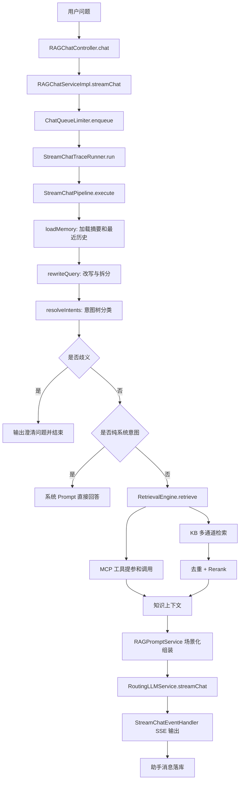
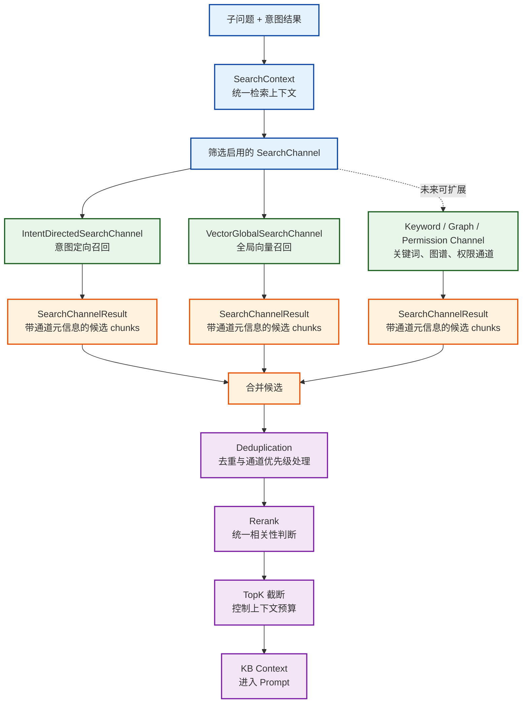
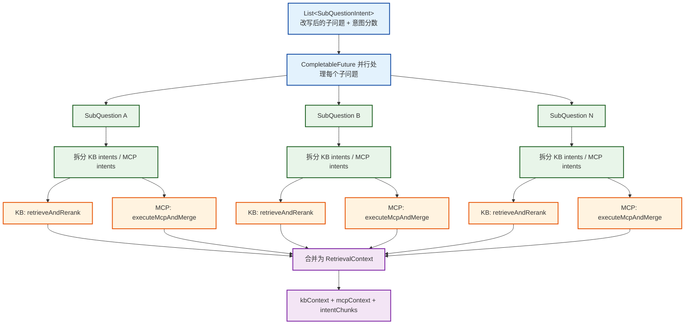
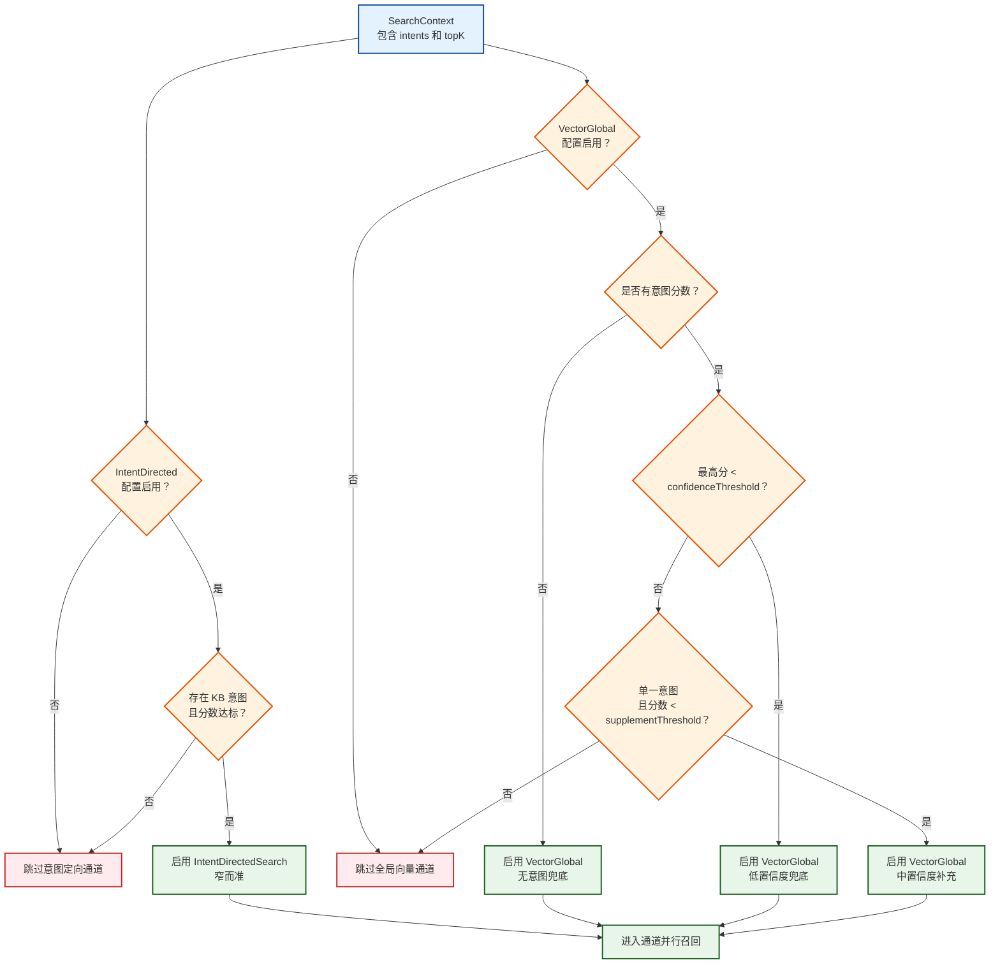
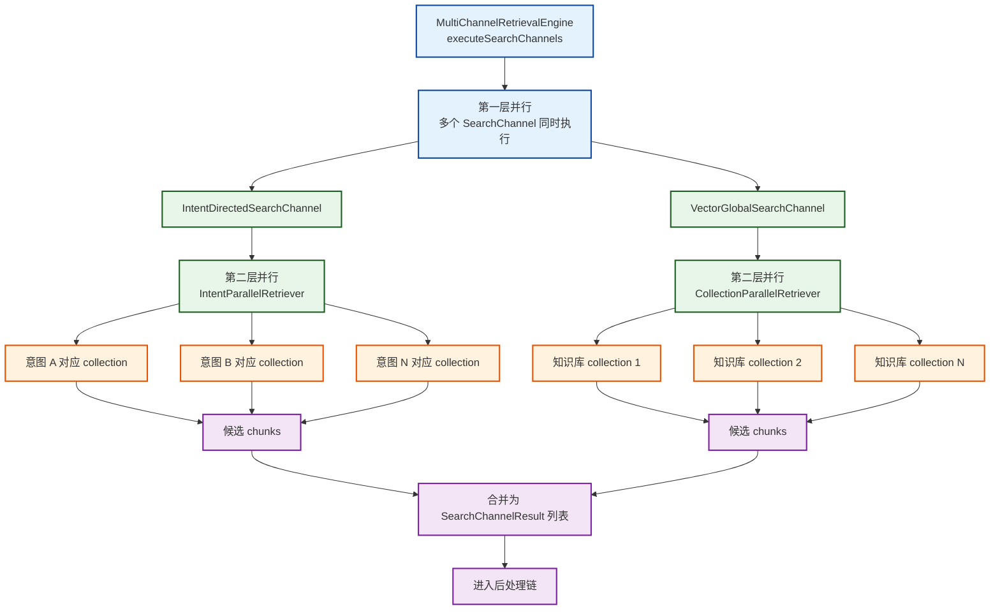
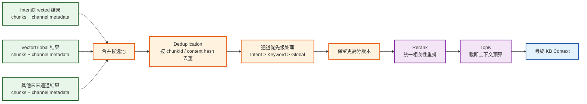
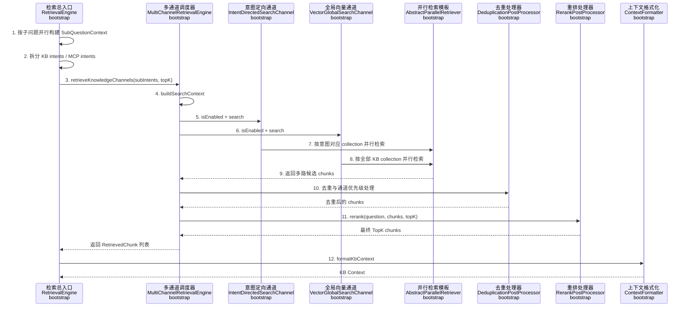

# Ragent 企业级 Agentic RAG 源码精读

> 源码项目：[nageoffer/ragent](https://github.com/nageoffer/ragent)  
> 本次阅读版本：`6a8d027`，`2026-05-24 optimize(knowledge): 优化文档管理页面及相关功能`  
> 本地源码位置：`/tmp/ragent-inspect-5yu4Bz`

## 一句话先说透

Ragent 最值得学习的不是“Java 怎么写 RAG”，而是它把企业 RAG 拆成了一条完整的决策链：

**离线把知识加工成可检索资产，在线把用户问题加工成可路由任务，再把知识库、工具、模型、流式协议、记忆、限流和追踪组织成一个可运行系统。**

普通 RAG 常被理解成：

```text
用户问题 -> 向量检索 -> 拼 Prompt -> LLM 回答
```

Ragent 的回答更接近：

```text
用户问题
  -> 会话记忆加载
  -> 查询归一化、改写、拆分
  -> 意图树分类
  -> 歧义澄清或系统意图短路
  -> KB / MCP / Mixed 路由
  -> 多通道检索与工具调用
  -> 去重、重排、上下文格式化
  -> Prompt 场景选择
  -> 模型路由、首包探测、故障转移
  -> SSE 流式输出、取消、落库、追踪
```

这就是它的核心学习价值：**RAG 的质量不是在最后一刻靠模型生成出来的，而是在生成之前的每一层工程决策中被塑造出来的。**

## 源码入口与分层

Ragent 后端主要分成四个模块：

| 模块 | 角色 | 值得学习的点 |
| --- | --- | --- |
| `bootstrap` | 业务应用层 | RAG 对话、意图树、检索编排、入库流水线、MCP 工具编排、会话记忆 |
| `infra-ai` | 模型基础设施层 | LLM、Embedding、Rerank 的路由、健康检查、故障转移、首包探测 |
| `framework` | 通用工程层 | SSE 封装、幂等、异常、上下文、Trace 基础能力 |
| `mcp-server` | 示例工具服务 | 用 MCP 暴露业务工具，配合主 RAG 系统调用 |

这一层分法非常关键。它不是为了“项目看起来高级”，而是在回答一个企业 Agent/RAG 的公共问题：

> 业务逻辑、模型供应商、协议基础设施、外部工具这几类变化速度不同，不能混在一起。

因此 Ragent 的分层原则可以总结为：

```text
业务编排层关心“这次问题该怎么回答”
模型基础设施层关心“该调用哪个模型，失败怎么办”
通用框架层关心“请求、流、异常、幂等、追踪怎么统一”
工具服务层关心“外部业务能力如何以协议形式暴露”
```

对应源码：

- `README.md`
- `pom.xml`
- `bootstrap/pom.xml`
- `infra-ai/pom.xml`
- `framework/pom.xml`
- `mcp-server/pom.xml`

## 整体链路图



主链路对应源码：

- `bootstrap/src/main/java/com/nageoffer/ai/ragent/rag/controller/RAGChatController.java`
- `bootstrap/src/main/java/com/nageoffer/ai/ragent/rag/service/impl/RAGChatServiceImpl.java`
- `bootstrap/src/main/java/com/nageoffer/ai/ragent/rag/service/pipeline/StreamChatPipeline.java`
- `bootstrap/src/main/java/com/nageoffer/ai/ragent/rag/service/pipeline/StreamChatContext.java`

## 设计思想一：RAG 不是先检索，而是先理解问题

很多 RAG Demo 的第一个动作是 embedding 检索。Ragent 的第一个动作不是检索，而是：

1. 加载会话记忆
2. 对用户问题做术语归一化
3. 结合最近历史做指代消解
4. 判断是否需要拆成多个子问题
5. 产出一个 `RewriteResult`

对应源码：

- `bootstrap/src/main/java/com/nageoffer/ai/ragent/rag/core/memory/DefaultConversationMemoryService.java`
- `bootstrap/src/main/java/com/nageoffer/ai/ragent/rag/core/rewrite/MultiQuestionRewriteService.java`
- `bootstrap/src/main/java/com/nageoffer/ai/ragent/rag/core/rewrite/RewriteResult.java`
- `bootstrap/src/main/resources/prompt/user-question-rewrite.st`

`MultiQuestionRewriteService` 做了几个非常重要的工程取舍：

| 机制 | 作用 | 设计含义 |
| --- | --- | --- |
| `queryTermMappingService.normalize` | 术语归一化 | 不把用户口语直接送去检索 |
| 最近历史只取 1-2 轮 | 指代消解 | 让“它”“这个流程”有上下文，但不无限膨胀 |
| LLM 输出 JSON | 改写和拆分结构化 | 下游拿稳定字段，不解析自然语言 |
| `ruleBasedSplit` 兜底 | LLM 失败时仍可运行 | RAG 主链路不能被一个改写模型拖死 |
| `temperature=0.1`、`topP=0.3` | 降低创造性 | 查询理解阶段要稳定，不要“灵感” |

这里可以学到一个非常重要的 RAG 模式：

> 检索前的查询理解，是把“用户表达”转换成“系统可执行任务”的过程。

用户问的是自然语言，但系统真正需要的是：

```text
重写后的主问题
子问题列表
每个子问题的意图候选
每个意图该走 KB 还是工具
```

所以，Ragent 没有直接问“这个问题 embedding 后最像哪些文档”，而是先问：

> 这个问题到底是什么任务？

这就是从普通 RAG 走向 Agentic RAG 的第一步。

## 设计思想二：意图树是 RAG 系统的路由平面

Ragent 的意图识别不是简单分类标签，而是一棵带业务含义的树。节点包含：

- `id`
- `kbId`
- `collectionName`
- `name`
- `description`
- `examples`
- `level`
- `kind`
- `mcpToolId`
- `topK`
- `promptTemplate`
- `paramPromptTemplate`

对应源码：

- `bootstrap/src/main/java/com/nageoffer/ai/ragent/rag/core/intent/IntentNode.java`
- `bootstrap/src/main/java/com/nageoffer/ai/ragent/rag/core/intent/IntentTreeFactory.java`
- `bootstrap/src/main/java/com/nageoffer/ai/ragent/rag/core/intent/DefaultIntentClassifier.java`
- `bootstrap/src/main/java/com/nageoffer/ai/ragent/rag/core/intent/IntentResolver.java`
- `bootstrap/src/main/java/com/nageoffer/ai/ragent/rag/enums/IntentKind.java`
- `bootstrap/src/main/resources/prompt/intent-classifier.st`

`IntentKind` 将意图分成三类：

| 类型 | 含义 | 后续行为 |
| --- | --- | --- |
| `KB` | 查知识库 | 进入多通道检索 |
| `MCP` | 调业务工具 | 提取参数并调用 MCP 工具 |
| `SYSTEM` | 系统交互 | 不检索，直接系统回答 |

这非常关键。普通 RAG 经常只有一个“知识库检索器”，无论用户问什么都去检索。Ragent 的意图树承担了更大的职责：

```text
它不只是分类器，而是一个路由平面。
```

所谓“路由平面”，意思是它决定：

- 问题属于哪个业务域
- 应该查哪个知识集合
- 是否应该调用工具
- 是否根本不需要检索
- 某个节点是否有专属 Prompt
- 某个节点是否有专属 TopK
- 某个工具是否有专属参数提取 Prompt

这比“分类标签”深一层。分类标签通常只是下游特征，意图树则把系统的行动空间显式挂在节点上。

### 为什么这很像 Agent

Agentic RAG 的关键不是让模型随意循环，而是让系统具备“选择行动”的能力。Ragent 的行动不是开放式的 ReAct 循环，而是受控的树形路由：

```text
用户问题 -> 意图节点 -> 行动类型
                      -> KB 检索
                      -> MCP 工具调用
                      -> 系统回复
```

所以 Ragent 的 Agentic 特征可以定义为：

> 它不是自主规划型 Agent，而是“意图路由型 Agentic RAG”。

这类架构非常适合企业内部助手，因为企业场景通常不希望模型自由决定所有步骤，而是希望它在被治理的能力集合中选择正确路径。

## 设计思想三：歧义不是错误，而是需要进入澄清协议

Ragent 在意图识别后，不是永远选最高分。如果多个候选属于不同系统，且分数接近，它会触发澄清。

对应源码：

- `bootstrap/src/main/java/com/nageoffer/ai/ragent/rag/core/guidance/IntentGuidanceService.java`
- `bootstrap/src/main/java/com/nageoffer/ai/ragent/rag/core/guidance/AmbiguityLLMChecker.java`
- `bootstrap/src/main/java/com/nageoffer/ai/ragent/rag/core/guidance/GuidanceDecision.java`
- `bootstrap/src/main/resources/prompt/guidance-prompt.st`
- `bootstrap/src/main/resources/prompt/guidance-ambiguity-check.st`

`IntentGuidanceService` 的判断很值得学：

1. 只处理单个子问题，多子问题暂不澄清，避免交互复杂度爆炸
2. 只看 KB 候选，MCP 和 SYSTEM 不参与这个歧义逻辑
3. 将叶子节点归并到系统级分类，避免同一系统内部多个节点互相制造假歧义
4. 若用户问题里显式提到系统名，直接跳过澄清
5. 若第一名和第二名分数很接近，直接澄清
6. 若处在边界区间，再调用 LLM 判断是否真的歧义

这背后的设计思想是：

> RAG 系统不要把所有不确定都伪装成确定。

举个典型场景：

```text
用户问：数据安全怎么做？
```

如果知识库里有：

- OA 系统 > 数据安全
- 保险系统 > 数据安全

最高分也许是 OA，但这不代表用户真在问 OA。Ragent 会在分数接近时返回澄清问题，让用户选择。

这比“永远 top1”更企业级。因为企业知识库中的错误回答通常不是模型不会说，而是系统一开始就检索错了知识域。

可迁移模式：

```text
当多个业务域共享同名主题时，不要靠 top1 硬猜。
应该把歧义显式化，让用户完成最后的路由选择。
```

## 设计思想四：多通道检索是召回架构，不是多写几个 search 方法

Ragent 的检索不是一个检索器，而是一个多通道系统：

- 意图定向检索：根据识别出的 KB 意图，在对应 collection 中检索
- 全局向量检索：在意图不明确或置信度不足时，跨知识库补充召回
- 后处理器链：去重、重排、截断

对应源码：

- `bootstrap/src/main/java/com/nageoffer/ai/ragent/rag/core/retrieve/RetrievalEngine.java`
- `bootstrap/src/main/java/com/nageoffer/ai/ragent/rag/core/retrieve/MultiChannelRetrievalEngine.java`
- `bootstrap/src/main/java/com/nageoffer/ai/ragent/rag/core/retrieve/channel/SearchChannel.java`
- `bootstrap/src/main/java/com/nageoffer/ai/ragent/rag/core/retrieve/channel/IntentDirectedSearchChannel.java`
- `bootstrap/src/main/java/com/nageoffer/ai/ragent/rag/core/retrieve/channel/VectorGlobalSearchChannel.java`
- `bootstrap/src/main/java/com/nageoffer/ai/ragent/rag/core/retrieve/channel/AbstractParallelRetriever.java`
- `bootstrap/src/main/java/com/nageoffer/ai/ragent/rag/core/retrieve/channel/strategy/IntentParallelRetriever.java`
- `bootstrap/src/main/java/com/nageoffer/ai/ragent/rag/core/retrieve/channel/strategy/CollectionParallelRetriever.java`
- `bootstrap/src/main/java/com/nageoffer/ai/ragent/rag/core/retrieve/postprocessor/DeduplicationPostProcessor.java`
- `bootstrap/src/main/java/com/nageoffer/ai/ragent/rag/core/retrieve/postprocessor/RerankPostProcessor.java`

### 先抓住这句话：召回和排序是两件事

“多通道检索是召回架构”这句话要这样理解：

```text
召回阶段：宁愿多找一些候选，也不要过早漏掉正确答案。
排序阶段：再把多路候选统一去重、重排、压到 TopK。
```

所以多通道不是为了显得复杂，而是在解决 RAG 的核心矛盾：

| 矛盾 | 单一路径的问题 | 多通道架构的回答 |
| --- | --- | --- |
| 精准 vs 召回 | 只按意图查，意图错了就漏；只全局查，噪声又太多 | 高置信度走窄检索，低置信度补全局检索 |
| 速度 vs 覆盖 | 串行查多个库太慢 | 通道之间并行，通道内部也并行 |
| 通道分数不可比 | 不同检索策略的原始分数不能直接混用 | 先合并去重，再统一 rerank |
| 工程扩展 | 新增关键词、图谱、权限过滤会污染主逻辑 | `SearchChannel` 和 `SearchResultPostProcessor` 插拔 |

换句话说，Ragent 不是在写：

```text
searchByIntent()
searchByVector()
searchByKeyword()
```

而是在定义一个召回框架：

```text
SearchContext
  -> enabled SearchChannel 并行召回
  -> SearchChannelResult 列表
  -> SearchResultPostProcessor 链式收敛
  -> 最终 RetrievedChunk
```

对应成图，就是下面这条“候选先扩张、再收敛”的链路：



### 源码链路一：RetrievalEngine 先把“子问题”变成检索任务

`RetrievalEngine.retrieve` 是 KB/MCP 总入口。这里先看 KB 相关部分：

```java
List<CompletableFuture<SubQuestionContext>> tasks = subIntents.stream()
        .map(si -> CompletableFuture.supplyAsync(
                () -> buildSubQuestionContext(si, resolveSubQuestionTopK(si, finalTopK)),
                ragContextExecutor
        ))
        .toList();
```

位置：

- `RetrievalEngine.java:77-103`
- `RetrievalEngine.java:148-158`
- `RetrievalEngine.java:199-222`

这里第一层重要设计是：**多个子问题并行构建上下文**。

如果用户问：

```text
OA 系统的数据安全怎么做？保险系统的数据安全怎么做？
```

前面的 query rewrite 可能拆成两个子问题。`RetrievalEngine` 不是把它们混成一个大查询，而是每个子问题分别构建 `SubQuestionContext`：

```text
子问题 A -> KB 检索 + MCP 调用 -> SubQuestionContext A
子问题 B -> KB 检索 + MCP 调用 -> SubQuestionContext B
```

然后再合并成：

```text
kbContext
mcpContext
intentChunks
```

这就是为什么 Ragent 的多通道不是局部技巧，而是嵌在整体检索编排里的。

`resolveSubQuestionTopK` 也很值得注意：

```java
return NodeScoreFilters.kb(intent.nodeScores()).stream()
        .map(NodeScore::getNode)
        .map(IntentNode::getTopK)
        .max(Integer::compareTo)
        .orElse(fallbackTopK);
```

位置：

- `RetrievalEngine.java:161-173`

它允许意图节点自己携带 `topK`。这代表一个设计思想：

> TopK 不应该永远是全局常量。不同业务域的知识密度不同，召回预算也应该可以不同。

比如“发票抬头”这种问题可能需要多召回几个公司条目；“系统介绍”可能少量 chunk 就够。把 `topK` 放到意图节点上，相当于让业务分类树参与检索策略。

这个入口层可以画成这样：



### 源码链路二：MultiChannelRetrievalEngine 是真正的召回调度器

`RetrievalEngine.retrieveAndRerank` 最关键的一行是：

```java
List<RetrievedChunk> chunks = multiChannelRetrievalEngine.retrieveKnowledgeChannels(subIntents, topK);
```

位置：

- `RetrievalEngine.java:199-203`

进入 `MultiChannelRetrievalEngine` 后，链路被明确拆成两阶段：

```java
SearchContext context = buildSearchContext(subIntents, topK);
List<SearchChannelResult> channelResults = executeSearchChannels(context);
return executePostProcessors(channelResults, context);
```

位置：

- `MultiChannelRetrievalEngine.java:64-76`

这段代码的价值在于，它把“召回”和“收敛”分开了：

```text
阶段 1：executeSearchChannels
目标：尽可能从多个来源拿到候选 chunk。

阶段 2：executePostProcessors
目标：把候选 chunk 变成最终可喂给 prompt 的证据。
```

这是 RAG 系统一个很重要的工程分层。因为如果你在每个通道里都自行排序、截断、去重，那么新加一个通道时，整体效果会非常不可控。Ragent 的做法是：

```text
通道只负责“我能召回什么”
后处理器负责“最终应该留下什么”
```

### 源码链路三：SearchContext 是多通道之间的共享协议

`SearchContext` 很小，但它是多通道检索的协议对象：

```java
private String originalQuestion;
private String rewrittenQuestion;
private List<String> subQuestions;
private List<SubQuestionIntent> intents;
private int topK;
private Map<String, Object> metadata;

public String getMainQuestion() {
    return rewrittenQuestion != null ? rewrittenQuestion : originalQuestion;
}
```

位置：

- `SearchContext.java:35-73`

它表达了一件事：每个通道不应该自己到处拿数据，而应该只依赖统一的检索上下文。

这有两个好处：

1. 新增通道时，通道只需要实现 `SearchChannel.search(SearchContext context)`
2. 通道之间不会互相知道对方存在，避免耦合

也就是说，`SearchContext` 是横向扩展检索能力的公共输入协议。

### 源码链路四：SearchChannel 是“召回策略接口”

`SearchChannel` 定义了五件事：

```java
String getName();
int getPriority();
boolean isEnabled(SearchContext context);
SearchChannelResult search(SearchContext context);
SearchChannelType getType();
```

位置：

- `SearchChannel.java:30-63`

这五个方法分别对应一个通道在召回系统中的五个问题：

| 方法 | 回答的问题 |
| --- | --- |
| `getName` | 这个通道叫什么，日志和监控怎么识别 |
| `getPriority` | 多通道结果合并时，谁更可信 |
| `isEnabled` | 当前问题是否应该启用这个通道 |
| `search` | 这个通道如何召回候选 |
| `getType` | 通道属于哪一类，后处理器如何识别 |

这里最值得学的是 `isEnabled`。很多人写多路召回时，会让所有通道永远执行。Ragent 不是这样，它让每个通道根据当前 `SearchContext` 自己决定是否启用。

这就是“动态召回计划”的雏形：

```text
不是每次都跑所有通道，
而是根据意图识别结果、置信度、配置动态选择召回路径。
```

动态启用决策可以用这张图记住：



### 两类通道的不同职责

| 通道 | 什么时候启用 | 解决的问题 |
| --- | --- | --- |
| `IntentDirectedSearchChannel` | 有 KB 意图时 | 精准查目标知识库，减少无关召回 |
| `VectorGlobalSearchChannel` | 没有意图、低置信度、单意图中等置信度 | 给系统一个跨库兜底机会，避免意图识别错杀 |

这体现了一个非常好的 RAG 检索思想：

> 高置信度时走窄检索，低置信度时走宽召回。

意图定向检索的优势是精确，但风险是意图识别错了就会漏掉正确知识。全局检索的优势是召回广，但风险是噪声多。Ragent 通过置信度阈值在两者之间切换或补充。

这比“永远全库搜”或“永远按分类搜”更稳。

### 源码链路五：意图定向检索负责“窄而准”

`IntentDirectedSearchChannel.isEnabled` 的条件很克制：

```java
if (!properties.getChannels().getIntentDirected().isEnabled()) {
    return false;
}
if (CollUtil.isEmpty(context.getIntents())) {
    return false;
}
List<NodeScore> kbIntents = extractKbIntents(context);
return CollUtil.isNotEmpty(kbIntents);
```

位置：

- `IntentDirectedSearchChannel.java:65-80`

它不是“有任意意图就启用”，而是必须有 **KB 意图**。这里会通过 `NodeScoreFilters.kb` 过滤掉 MCP 和 SYSTEM 意图。

真正执行时：

```java
List<NodeScore> kbIntents = extractKbIntents(context);
int topKMultiplier = properties.getChannels().getIntentDirected().getTopKMultiplier();
List<RetrievedChunk> allChunks = retrieveByIntents(
        context.getMainQuestion(),
        kbIntents,
        context.getTopK(),
        topKMultiplier
);
```

位置：

- `IntentDirectedSearchChannel.java:83-122`
- `IntentDirectedSearchChannel.java:143-159`

`extractKbIntents` 会使用 `minIntentScore`：

```java
double minScore = properties.getChannels().getIntentDirected().getMinIntentScore();
return NodeScoreFilters.kb(allScores, minScore);
```

位置：

- `IntentDirectedSearchChannel.java:143-149`
- `SearchChannelProperties.java:83-100`

默认配置中 `minIntentScore = 0.4`，`topKMultiplier = 2`。这说明 Ragent 并没有直接拿最终 TopK 去检索，而是先多召回一些，再交给后面的 rerank。

这个细节很关键：

> 即使是“窄检索”，它也不是直接取最终答案，而是取比最终 TopK 更多的候选。

这就是召回架构的思路。召回阶段不要太早做最终裁剪。

### 源码链路六：全局向量检索负责“宽而兜底”

`VectorGlobalSearchChannel.isEnabled` 是整节最有设计感的代码之一：

```java
if (CollUtil.isEmpty(allScores)) {
    return true;
}

double maxScore = ...
if (maxScore < confidenceThreshold) {
    return true;
}

if (allScores.size() == 1 && maxScore < supplementThreshold) {
    return true;
}

return false;
```

位置：

- `VectorGlobalSearchChannel.java:68-100`
- `SearchChannelProperties.java:56-80`

默认配置：

```text
confidenceThreshold = 0.6
singleIntentSupplementThreshold = 0.8
topKMultiplier = 3
```

这段逻辑可以翻译成人话：

```text
如果完全没识别出意图：
    用户问题可能没有被分类器覆盖，启用全局检索兜底。

如果最高意图分低于 0.6：
    分类器自己都没把握，启用全局检索兜底。

如果只有一个意图，但分数低于 0.8：
    虽然有方向，但还不够稳，启用全局检索作为补充。

否则：
    意图足够明确，不跑全局检索，避免引入噪声和成本。
```

这正是“宽窄结合”的代码化表达。

全局检索执行时，会从知识库表中取所有未删除的 collection：

```java
knowledgeBaseMapper.selectList(
    Wrappers.lambdaQuery(KnowledgeBaseDO.class)
        .select(KnowledgeBaseDO::getCollectionName)
        .eq(KnowledgeBaseDO::getDeleted, 0)
)
```

位置：

- `VectorGlobalSearchChannel.java:153-172`

然后并行在所有 collection 中检索：

```java
return parallelRetriever.executeParallelRetrieval(question, collections, topK);
```

位置：

- `VectorGlobalSearchChannel.java:175-182`

这说明全局向量检索不是“默认主路径”，而是“安全网”。它的价值不是每次都用，而是在意图不可靠时把系统从“错过正确知识库”里救回来。

### 源码链路七：并行检索模板把“查多个目标”抽成公共模式

`AbstractParallelRetriever<T>` 是一个很朴素但很实用的模板：

```java
List<RetrievalFuture<T>> futures = targets.stream()
        .map(target -> CompletableFuture.supplyAsync(
                () -> createRetrievalTask(question, target, topK),
                executor
        ))
        .toList();

for (RetrievalFuture<T> future : futures) {
    List<RetrievedChunk> chunks = future.future.join();
    allChunks.addAll(chunks);
}
```

位置：

- `AbstractParallelRetriever.java:61-99`

它的泛型 `T` 很妙：

| 子类 | `T` 是什么 | 意味着什么 |
| --- | --- | --- |
| `IntentParallelRetriever` | `IntentTask` | 对多个意图对应的 collection 并行查 |
| `CollectionParallelRetriever` | `String collectionName` | 对所有知识库 collection 并行查 |

这就是第二层并行：

```text
第一层：多个 SearchChannel 并行
第二层：一个 SearchChannel 内部多个目标并行
```

因此一次问题的 KB 检索可能长这样：

```text
MultiChannelRetrievalEngine
  ├─ IntentDirectedSearchChannel
  │    ├─ collection: OA 数据安全
  │    └─ collection: 保险数据安全
  └─ VectorGlobalSearchChannel
       ├─ collection: 集团信息化
       ├─ collection: 业务系统
       └─ collection: 其他知识库
```

这不是简单的“多查几个库”。它是在用并行结构控制延迟，用召回结构控制漏召回风险。

画成 Mermaid 会更清楚：Ragent 这里其实有“通道间并行”和“通道内并行”两层。



### 源码链路八：SearchChannelResult 保留通道元信息，给后处理使用

每个通道返回的不是裸 `List<RetrievedChunk>`，而是：

```java
private SearchChannelType channelType;
private String channelName;
private List<RetrievedChunk> chunks;
private long latencyMs;
private Map<String, Object> metadata;
```

位置：

- `SearchChannelResult.java:35-62`

为什么要包一层？

因为后处理阶段需要知道：

- 这些 chunk 来自哪个通道
- 通道耗时是多少
- 通道类型是什么
- 通道有没有额外信息，比如 `intentCount`

如果只返回 chunk 列表，后处理器就丢失了召回来源。Ragent 保留通道元信息，是为了让“召回结果”不仅有内容，还有来源解释。

这一点以后可以继续扩展出很多能力：

- 不同通道分数归一化
- 按通道做权重融合
- 记录每个通道召回命中率
- 对低质量通道降权
- 做线上检索效果分析

虽然当前源码只用了部分元信息，但接口已经把扩展点留出来了。

### 后处理器链的意义

多通道召回后一定会产生重复和排序冲突。Ragent 没有让每个通道自己决定最终结果，而是统一交给后处理链：

```text
多通道结果 -> Deduplication -> Rerank -> TopK
```

`DeduplicationPostProcessor` 按通道优先级处理重复 chunk：

```text
Intent Directed > Keyword ES > Vector Global
```

如果同一个 chunk 在多个通道出现，保留更高分版本。之后 `RerankPostProcessor` 再用 Rerank 模型做最终排序。

可迁移模式：

```text
召回阶段追求“不要漏”，后处理阶段追求“少而准”。
不要把召回和最终排序耦合到一个检索函数里。
```

### 源码链路九：后处理链是“收敛器”，不是附属工具

`MultiChannelRetrievalEngine.executePostProcessors` 的代码是串行的：

```java
List<SearchResultPostProcessor> enabledProcessors = postProcessors.stream()
        .filter(processor -> processor.isEnabled(context))
        .sorted(Comparator.comparingInt(SearchResultPostProcessor::getOrder))
        .toList();

for (SearchResultPostProcessor processor : enabledProcessors) {
    chunks = processor.process(chunks, results, context);
}
```

位置：

- `MultiChannelRetrievalEngine.java:151-195`

注意这里不是并行，而是按 `order` 串行。原因很简单：后处理器之间是有依赖关系的。

Ragent 当前核心顺序是：

```text
Deduplication(order=1) -> Rerank(order=10)
```

先去重，再重排。反过来就不合理：如果先 rerank 再去重，重复 chunk 会浪费 rerank 模型的输入容量，也可能让相同内容霸占排序位置。

`DeduplicationPostProcessor` 的去重逻辑：

```java
Map<String, RetrievedChunk> chunkMap = new LinkedHashMap<>();
String key = chunk.getId() != null ? chunk.getId() : String.valueOf(chunk.getText().hashCode());
```

位置：

- `DeduplicationPostProcessor.java:57-98`

它用 `LinkedHashMap`，既去重又保持插入顺序。并且先按通道优先级排序：

```java
case INTENT_DIRECTED -> 1;
case KEYWORD_ES -> 2;
case VECTOR_GLOBAL -> 3;
```

位置：

- `DeduplicationPostProcessor.java:100-110`

这代表一个判断：

```text
如果同一个 chunk 同时被意图定向和全局检索召回，
优先认为它是意图定向结果，因为这个通道更贴近当前业务域。
```

但如果后来的重复 chunk 分数更高，它也会替换：

```java
if (chunk.getScore() > existing.getScore()) {
    chunkMap.put(key, chunk);
}
```

这里同时考虑了“通道可信度”和“检索分数”。

`RerankPostProcessor` 最后调用：

```java
return rerankService.rerank(
        context.getMainQuestion(),
        chunks,
        context.getTopK()
);
```

位置：

- `RerankPostProcessor.java:58-71`

这一步把多通道分数差异重新交给统一 rerank 模型处理。也就是说：

```text
通道负责召回候选；
Dedup 负责去掉重复；
Rerank 负责统一价值判断；
TopK 负责控制最终上下文预算。
```

后处理链的关键不是“多一步处理”，而是把候选证据从“多而杂”收敛成“少而准”：



### 一次完整 KB 检索在源码中的真实运行过程

把上面的类串起来，一次 KB 检索大概是：

```text
1. RetrievalEngine.retrieve(subIntents, topK)
   - 多个子问题并行构建 SubQuestionContext

2. buildSubQuestionContext
   - 拆出 KB intents 和 MCP intents
   - KB 进入 retrieveAndRerank

3. retrieveAndRerank
   - 调 MultiChannelRetrievalEngine.retrieveKnowledgeChannels

4. MultiChannelRetrievalEngine.buildSearchContext
   - 把子问题、意图、topK 包成 SearchContext

5. executeSearchChannels
   - 遍历 SearchChannel
   - 每个通道自己 isEnabled
   - 按 priority 排序
   - CompletableFuture 并行执行 channel.search

6. IntentDirectedSearchChannel
   - 过滤 KB 意图
   - 过滤低分意图
   - 按意图对应 collection 并行检索

7. VectorGlobalSearchChannel
   - 根据意图置信度判断是否启用
   - 查询全部 KB collection
   - 跨 collection 并行检索

8. executePostProcessors
   - Deduplication 去重
   - Rerank 统一重排并截断 TopK

9. RetrievalEngine.formatKbContext
   - 将最终 chunk 组织成 Prompt 可用的 KB context
```

这条链路中最核心的思想是：

```text
不要让一个检索器同时承担“路由、召回、融合、排序、截断、解释”的所有职责。
每个阶段只做一件事，阶段之间用明确的数据对象衔接。
```

如果把这 9 步合成一张源码调用顺序图，就是：



### 这个设计比普通 RAG 强在哪里

普通 RAG 常见写法：

```text
embedding(question)
vectorDB.search(topK=5)
prompt += chunks
```

Ragent 的写法：

```text
subQuestion + intents + topK
  -> 动态决定检索通道
  -> 每个通道并行召回更多候选
  -> 结果携带通道元信息
  -> 后处理链统一去重、重排、截断
  -> 再格式化成上下文
```

二者差异不在代码量，而在检索观念：

| 普通 RAG | Ragent |
| --- | --- |
| 检索是一个函数 | 检索是一条召回流水线 |
| topK 是输入参数 | topK 是最终预算，召回阶段可放大 |
| 检索结果直接进 Prompt | 检索结果先去重、重排、格式化 |
| 意图识别和检索弱耦合或没有 | 意图置信度直接影响召回路径 |
| 单一路径失败就是失败 | 低置信度可走全局兜底 |
| 通道来源不重要 | 通道来源用于合并、日志和后续分析 |

### 这个设计的一个小遗憾

源码里有一个值得注意的小边界：`RetrievalEngine.retrieveAndRerank` 里有注释说：

```java
// 注意：多通道检索返回的 chunks 无法精确对应到某个意图节点
// 所以我们将所有 chunks 分配给每个意图节点
```

位置：

- `RetrievalEngine.java:211-218`

这说明当前 `MultiChannelRetrievalEngine` 返回的是最终混合后的 chunk 列表，而不是：

```text
intentId -> chunks
channelType -> chunks
collectionName -> chunks
```

因此在格式化 KB context 时，如果一个子问题命中了多个 KB 意图，Ragent 会把同一批最终 chunks 分配给每个意图节点。这在工程上简单，但语义归因不够精细。

如果后续要增强，可以考虑让 `SearchChannelResult` 或最终结果保留：

```text
chunk -> source channel
chunk -> intent id
chunk -> collection name
chunk -> retrieval score
chunk -> rerank score
```

这样多意图、多通道、多知识库场景下，Prompt 可以更精确地按意图组织证据。

这个小遗憾反而帮助我们理解一个更深的设计点：

> 多通道检索的下一步，不只是召回更多，而是保留更好的证据归因。

## 设计思想五：Agentic RAG 的核心是把 KB 和工具统一成上下文来源

Ragent 的 `RetrievalEngine` 同时处理 KB 和 MCP：

```text
SubQuestionIntent
  -> KB intents -> 多通道知识检索 -> kbContext
  -> MCP intents -> 参数提取 + 工具调用 -> mcpContext
  -> RetrievalContext
```

对应源码：

- `bootstrap/src/main/java/com/nageoffer/ai/ragent/rag/core/retrieve/RetrievalEngine.java`
- `bootstrap/src/main/java/com/nageoffer/ai/ragent/rag/dto/RetrievalContext.java`
- `bootstrap/src/main/java/com/nageoffer/ai/ragent/rag/core/mcp/McpToolRegistry.java`
- `bootstrap/src/main/java/com/nageoffer/ai/ragent/rag/core/mcp/DefaultMcpToolRegistry.java`
- `bootstrap/src/main/java/com/nageoffer/ai/ragent/rag/core/mcp/McpToolExecutor.java`
- `bootstrap/src/main/java/com/nageoffer/ai/ragent/rag/core/mcp/McpClientToolExecutor.java`
- `bootstrap/src/main/java/com/nageoffer/ai/ragent/rag/core/mcp/LLMMcpParameterExtractor.java`
- `bootstrap/src/main/resources/prompt/mcp-parameter-extract.st`
- `bootstrap/src/main/resources/prompt/mcp-parameter-extract-user.st`

普通 RAG 只会查“静态知识”。Ragent 增加了一个重要分支：当意图节点是 `MCP` 时，不去知识库里搜答案，而是：

1. 根据意图节点找到 `mcpToolId`
2. 从 `McpToolRegistry` 找到工具执行器
3. 读取工具定义 `Tool`
4. 调用 LLM 从用户问题中提取参数
5. 填充默认值，只保留工具 schema 中声明的参数
6. 调用 MCP 工具
7. 将工具返回转成 `mcpContext`
8. 让最终 LLM 基于工具数据生成自然语言答案

这一点非常值得学。它说明 Agentic RAG 不一定要长成“模型自己调用工具再观察再循环”的样子。企业场景中更可控的做法是：

```text
意图树决定能调用什么工具
工具 schema 决定能传什么参数
参数提取器负责把自然语言转成结构化参数
最终生成模型只负责把工具结果解释成人话
```

这是一种更稳的工具使用方式。模型没有被赋予任意调用能力，而是在系统治理过的工具集合中被动完成参数提取。

### KB 与 MCP 混合场景

Ragent 的 `RetrievalContext` 同时保存：

- `kbContext`
- `mcpContext`
- `intentChunks`

之后 `RAGPromptService` 会根据上下文情况选择不同模板：

| 场景 | 模板 |
| --- | --- |
| 只有 KB | `answer-chat-kb.st` |
| 只有 MCP | `answer-chat-mcp.st` |
| KB + MCP | `answer-chat-mcp-kb-mixed.st` |

对应源码：

- `bootstrap/src/main/java/com/nageoffer/ai/ragent/rag/core/prompt/RAGPromptService.java`
- `bootstrap/src/main/java/com/nageoffer/ai/ragent/rag/core/prompt/PromptContext.java`
- `bootstrap/src/main/java/com/nageoffer/ai/ragent/rag/core/prompt/PromptBuildPlan.java`
- `bootstrap/src/main/java/com/nageoffer/ai/ragent/rag/core/prompt/PromptPlan.java`
- `bootstrap/src/main/resources/prompt/answer-chat-kb.st`
- `bootstrap/src/main/resources/prompt/answer-chat-mcp.st`
- `bootstrap/src/main/resources/prompt/answer-chat-mcp-kb-mixed.st`
- `bootstrap/src/main/resources/prompt/context-format.st`

这背后的抽象是：

> 知识库和工具都不是答案，它们都是证据来源。

最终答案由 LLM 生成，但它的可用事实来自两个通道：

```text
静态文档事实：KB
实时业务事实：MCP
```

这就是 Agentic RAG 与普通 RAG 的一个本质区别：普通 RAG 只能“查已有文档”，Agentic RAG 可以“查文档 + 访问业务能力”。

## 设计思想六：Prompt 不是一段字符串，而是场景化构建计划

Ragent 的 Prompt 设计很值得细读。它没有在业务代码里手写一个巨大 prompt，而是由 `RAGPromptService` 根据场景构建：

```text
PromptContext -> PromptBuildPlan -> system prompt + history + evidence + user question
```

它有几个好设计：

### 1. 先判断场景，再选模板

`RAGPromptService.plan` 根据是否有 MCP、是否有 KB 分为：

- `KB_ONLY`
- `MCP_ONLY`
- `MIXED`

不同证据源的回答规则不一样，所以不能用一个万能模板糊住。

例如：

- KB 模板强调“只基于 documents，不跨块引用”
- MCP 模板强调“只基于 tool-data，不输出原始 JSON，不暴露内部字段”
- Mixed 模板强调“动态数据与文档冲突时，优先动态数据”

这说明 Ragent 把 Prompt 当成协议，而不是当成文案。

### 2. 单意图可以使用节点级专属模板

如果某个意图节点有 `promptTemplate`，且该意图有检索结果，Ragent 会优先使用这个节点的专属模板。

这解决了一个企业 RAG 中很常见的问题：

> 不同业务场景需要不同回答格式，不能所有问题都套一个通用助手模板。

例如发票信息节点可以要求固定字段：

```text
开票抬头
纳税资质
纳税人识别号
地址、电话
开户银行、账号
```

销售数据工具节点可以要求表格、指标加粗、隐藏内部 ID。

### 3. 证据和问题合成一个 user message

`buildStructuredMessages` 的顺序是：

```text
system prompt
history
evidence + question
```

证据和问题被合成一条 user message，这样模型在回答时能把“当前证据”和“当前问题”绑定在一起。

可迁移模式：

```text
Prompt 构建不要只问“模板内容是什么”，还要问：
证据放在哪？
历史放在哪？
多个子问题怎么表达？
KB 和工具证据如何分区？
不同证据冲突时规则是什么？
```

## 设计思想七：离线入库流水线是 RAG 质量的另一半

很多人学习 RAG 时只看在线问答链路，忽略了离线入库。但 RAG 的上线效果往往很大程度取决于入库质量。

Ragent 的入库链路是节点式 Pipeline：

```text
Fetcher -> Parser -> Enhancer -> Chunker -> Enricher -> Indexer
```

对应源码：

- `bootstrap/src/main/java/com/nageoffer/ai/ragent/ingestion/engine/IngestionEngine.java`
- `bootstrap/src/main/java/com/nageoffer/ai/ragent/ingestion/node/IngestionNode.java`
- `bootstrap/src/main/java/com/nageoffer/ai/ragent/ingestion/domain/context/IngestionContext.java`
- `bootstrap/src/main/java/com/nageoffer/ai/ragent/ingestion/node/FetcherNode.java`
- `bootstrap/src/main/java/com/nageoffer/ai/ragent/ingestion/node/ParserNode.java`
- `bootstrap/src/main/java/com/nageoffer/ai/ragent/ingestion/node/EnhancerNode.java`
- `bootstrap/src/main/java/com/nageoffer/ai/ragent/ingestion/node/ChunkerNode.java`
- `bootstrap/src/main/java/com/nageoffer/ai/ragent/ingestion/node/EnricherNode.java`
- `bootstrap/src/main/java/com/nageoffer/ai/ragent/ingestion/node/IndexerNode.java`
- `bootstrap/src/main/java/com/nageoffer/ai/ragent/core/parser/TikaDocumentParser.java`
- `bootstrap/src/main/java/com/nageoffer/ai/ragent/core/parser/MarkdownDocumentParser.java`
- `bootstrap/src/main/java/com/nageoffer/ai/ragent/core/chunk/ChunkingStrategyFactory.java`
- `bootstrap/src/main/java/com/nageoffer/ai/ragent/core/chunk/strategy/FixedSizeTextChunker.java`
- `bootstrap/src/main/java/com/nageoffer/ai/ragent/core/chunk/strategy/StructureAwareTextChunker.java`

### 入库节点职责

| 节点 | 输入 | 输出 | 解决的问题 |
| --- | --- | --- | --- |
| `FetcherNode` | 文档来源 | 原始字节和 MIME | 支持本地、HTTP、OSS 等不同来源 |
| `ParserNode` | 原始字节 | 原始文本和结构化文档 | PDF、Word、Markdown 等格式解析 |
| `EnhancerNode` | 文档文本 | 增强文本、关键词、问题、元数据 | 在文档级别补充语义信息 |
| `ChunkerNode` | 原始或增强文本 | chunk + embedding | 控制检索粒度 |
| `EnricherNode` | chunk | chunk 级摘要、关键词、元数据 | 在分片级别补充检索辅助信息 |
| `IndexerNode` | chunk + embedding | 向量库记录 | 确保集合存在并写入向量空间 |

### 为什么要做成 Pipeline

`IngestionEngine` 并不是固定写死这几个步骤，而是根据 `PipelineDefinition` 和 `NodeConfig` 链式执行。它还做了：

- 找起始节点
- 校验是否有环
- 校验 nextNode 是否存在
- 支持条件执行
- 每个节点记录耗时、输出、成功失败
- 失败时终止并记录错误

这背后的设计思想是：

> 入库不是一次性脚本，而是可配置、可追踪、可失败恢复的生产流程。

RAG 的召回质量常常不是检索算法一个环节决定的，而是由以下因素共同决定：

- 原文解析是否干净
- 表格、标题、列表是否保留结构
- chunk 是否太碎或太大
- embedding 文本是否包含足够上下文
- metadata 是否能支持过滤和解释
- 向量维度是否一致
- 写入是否可追踪

可迁移模式：

```text
在线问答链路解决“如何回答”
离线入库链路解决“系统有什么可回答”
两个链路同等重要。
```

## 设计思想八：模型供应商是可失败资源，必须被路由和熔断

Ragent 的 `infra-ai` 层把模型调用当成基础设施问题，而不是业务代码里随手调一个 API。

对应源码：

- `infra-ai/src/main/java/com/nageoffer/ai/ragent/infra/chat/RoutingLLMService.java`
- `infra-ai/src/main/java/com/nageoffer/ai/ragent/infra/model/ModelSelector.java`
- `infra-ai/src/main/java/com/nageoffer/ai/ragent/infra/model/ModelRoutingExecutor.java`
- `infra-ai/src/main/java/com/nageoffer/ai/ragent/infra/model/ModelHealthStore.java`
- `infra-ai/src/main/java/com/nageoffer/ai/ragent/infra/chat/ProbeStreamBridge.java`
- `infra-ai/src/main/java/com/nageoffer/ai/ragent/infra/chat/LlmFirstPacketProbe.java`
- `infra-ai/src/main/java/com/nageoffer/ai/ragent/infra/embedding/RoutingEmbeddingService.java`
- `infra-ai/src/main/java/com/nageoffer/ai/ragent/infra/rerank/RoutingRerankService.java`

### 普通调用的 fallback

`ModelRoutingExecutor.executeWithFallback` 的逻辑很直接：

```text
候选模型列表
  -> 跳过无客户端模型
  -> 跳过健康状态不可调用模型
  -> 调用
  -> 成功则 markSuccess 并返回
  -> 失败则 markFailure 并尝试下一个
```

这解决的是：

> 模型供应商不稳定时，业务层不要感知一堆 try-catch。

### 流式调用的首包探测

流式调用比普通调用更难。因为流一旦把失败内容发给前端，就很难“假装没发生然后换模型”。

Ragent 用 `ProbeStreamBridge` 做首包探测：

1. 调用候选模型的 stream
2. 先不立刻把事件发给下游 callback，而是 buffer 起来
3. 等待首个内容、思考内容、完成、错误或超时
4. 如果首包成功，commit buffer，正式把流交给前端
5. 如果错误、超时、无内容完成，则取消当前模型，切下一个模型

这是一种非常实用的流式容错模式：

```text
首包之前，模型调用还可以切换。
首包之后，用户已经看到输出，就进入当前模型的生命周期。
```

### 三态熔断器

`ModelHealthStore` 有三种状态：

- `CLOSED`：正常调用
- `OPEN`：故障打开，短时间内跳过
- `HALF_OPEN`：恢复探测，只允许一个请求试探

这说明 Ragent 没有把模型失败当成偶发异常，而是当成会影响全局可用性的资源状态。

可迁移模式：

```text
模型不是函数，它是远程、不稳定、限流、超时、会半失败的外部资源。
企业 Agent/RAG 必须对模型做路由、健康状态和故障转移。
```

## 设计思想九：流式输出是生命周期协议，不是边生成边 print

Ragent 的 SSE 流式响应非常值得学习。它定义了一套事件生命周期：

```text
meta -> message(thinking/response) -> finish -> done
cancel / reject / error 是旁路终态
```

对应源码：

- `bootstrap/src/main/java/com/nageoffer/ai/ragent/rag/service/handler/StreamChatEventHandler.java`
- `bootstrap/src/main/java/com/nageoffer/ai/ragent/rag/service/handler/StreamCallbackFactory.java`
- `bootstrap/src/main/java/com/nageoffer/ai/ragent/rag/enums/SSEEventType.java`
- `bootstrap/src/main/java/com/nageoffer/ai/ragent/rag/service/handler/StreamTaskManager.java`
- `framework/src/main/java/com/nageoffer/ai/ragent/framework/web/SseEmitterSender.java`

它做了几个容易被忽略但很重要的细节：

| 机制 | 价值 |
| --- | --- |
| 一开始发送 `meta` | 前端立刻拿到 conversationId 和 taskId |
| 区分 `thinking` 和 `response` | 支持深度思考内容单独展示和存储 |
| 按 code point 切分 | 避免中文或 emoji 等字符被截断 |
| 完成时落库 assistant message | 流式输出和会话记忆闭环 |
| cancel 时如果已有内容也落库 | 用户中断不等于丢失已生成内容 |
| `finish` 携带 messageId/title | 前端更新会话列表和消息状态 |
| `done` 明确终止 | 前端有稳定终态 |
| `SseEmitterSender` 用 CAS 关闭 | 避免重复 complete / error |

这背后的设计思想是：

> 流式响应不是传输优化，而是一个前后端共享的状态机协议。

如果没有这个协议，前端会遇到很多麻烦：

- 不知道当前流属于哪个 task
- 不知道什么时候结束
- 不知道取消后消息是否落库
- 不知道 thinking 和最终回答如何区分
- 不知道异常和正常结束如何统一处理

可迁移模式：

```text
凡是需要流式输出的 Agent，都应该先设计事件协议，再接模型流。
不要直接把模型 token 原样吐给前端。
```

## 设计思想十：会话记忆不是全量历史，而是“摘要 + 最近窗口”

Ragent 的会话记忆分两层：

```text
长期摘要 + 最近若干轮原始消息
```

对应源码：

- `bootstrap/src/main/java/com/nageoffer/ai/ragent/rag/core/memory/DefaultConversationMemoryService.java`
- `bootstrap/src/main/java/com/nageoffer/ai/ragent/rag/core/memory/JdbcConversationMemoryStore.java`
- `bootstrap/src/main/java/com/nageoffer/ai/ragent/rag/core/memory/JdbcConversationMemorySummaryService.java`
- `bootstrap/src/main/resources/prompt/conversation-summary.st`

`DefaultConversationMemoryService.load` 会并行加载：

- 最新摘要
- 最近历史

然后将摘要装饰成 system message 放在历史前面。`append` 时，如果新增的是 assistant message，会异步触发压缩检查。

摘要服务做了几个关键工程保护：

- 只有超过触发轮数才摘要
- 只摘要最近窗口之外的旧消息
- 使用分布式锁避免同一会话重复摘要
- 新摘要会合并旧摘要，但提示模型“不得作为事实新增来源”
- 摘要失败不影响主对话

这个设计思想和你之前学 Claude Code 上下文压缩时看到的原则是同一个方向：

> 上下文工程不是把所有东西塞给模型，而是把不同生命周期的信息放到不同层。

在 Ragent 里：

| 信息 | 生命周期 | 放置方式 |
| --- | --- | --- |
| 当前问题 | 当前请求 | user message |
| 最近对话 | 短期上下文 | 原始 history |
| 更早对话 | 长期背景 | summary system message |
| 检索证据 | 当前回答依据 | evidence block |
| 工具结果 | 当前实时事实 | tool-data block |

这比“保存所有聊天记录然后每次全塞进去”成熟很多。

## 设计思想十一：限流、幂等、追踪不是外围功能，而是 RAG 主链路的一部分

RAG/Agent 系统非常容易变成昂贵且难排查的系统：每次请求可能调用多次 LLM、多次 embedding、多个检索通道、多个工具。Ragent 把限流、幂等和追踪放进主链路。

对应源码：

- `bootstrap/src/main/java/com/nageoffer/ai/ragent/rag/service/ratelimit/ChatQueueLimiter.java`
- `bootstrap/src/main/java/com/nageoffer/ai/ragent/rag/service/ratelimit/FairDistributedRateLimiter.java`
- `bootstrap/src/main/java/com/nageoffer/ai/ragent/rag/trace/StreamChatTraceRunner.java`
- `bootstrap/src/main/java/com/nageoffer/ai/ragent/rag/aop/RagTraceAspect.java`
- `framework/src/main/java/com/nageoffer/ai/ragent/framework/trace/RagTraceNode.java`
- `framework/src/main/java/com/nageoffer/ai/ragent/framework/idempotent/IdempotentSubmit.java`

### 限流不只是拒绝请求

`ChatQueueLimiter` 有一个很好的细节：如果请求被拒绝，它仍然会：

1. 记录用户消息
2. 记录助手的“系统繁忙，请稍后再试”
3. 发送 `meta`
4. 发送 `reject`
5. 发送 `finish`
6. 发送 `done`

也就是说，拒绝请求也遵守流式协议。

这很重要。因为前端和会话系统不应该因为“系统繁忙”进入一种奇怪的不完整状态。

### Trace 不是打日志

Ragent 用 `@RagTraceNode` 标注关键节点：

- query rewrite
- intent resolve
- guidance detect
- retrieval engine
- multi-channel retrieval
- LLM routing
- LLM first packet

`StreamChatTraceRunner` 还专门记录了 `user-first-packet`，也就是用户感知首包时间。这个指标比单纯的 LLM TTFT 更接近真实体验，因为它包括：

```text
限流等待 + 改写 + 意图 + 检索 + 工具 + Prompt + 模型首包
```

可迁移模式：

```text
Agent/RAG 的可观测性应该按语义阶段记录，而不是只记录 HTTP 耗时。
你要知道慢在哪里：改写慢、意图慢、检索慢、工具慢，还是模型首包慢。
```

## Ragent 的 Agentic RAG 到底“Agentic”在哪里

它不是 Claude Code 那种拥有工具循环、文件系统、计划执行、多轮行动的自主 Agent。Ragent 的 Agentic 体现在以下几个能力：

| 能力 | 普通 RAG | Ragent |
| --- | --- | --- |
| 查询理解 | 通常直接检索 | 改写、指代消解、拆分 |
| 意图识别 | 通常没有或简单分类 | 树形意图路由 |
| 行动选择 | 只查知识库 | KB、MCP、SYSTEM 三分流 |
| 工具使用 | 没有或手写调用 | MCP 工具注册、参数提取、执行 |
| 多问题处理 | 容易混在一起 | 子问题并行构建上下文 |
| 不确定性处理 | top1 硬选 | 歧义澄清 |
| 检索策略 | 单一路径 | 意图定向 + 全局兜底 + 后处理 |
| 证据融合 | 文档拼接 | KB 与工具上下文分区 |
| 生产稳定性 | 简单 API 调用 | 模型路由、熔断、限流、追踪、取消 |

所以更准确地说：

> Ragent 是一个“企业知识助手型 Agentic RAG”：它不追求开放式自主规划，而是追求在企业可治理边界内完成问题理解、路由、检索、工具调用和生成。

这是一个很现实的方向。因为很多企业内部助手并不需要一个自由探索世界的 Agent，它们需要的是：

- 问得清楚
- 路由准确
- 能查文档
- 能调业务数据
- 不乱编
- 可追踪
- 可取消
- 模型挂了还能降级

## 最值得迁移的 12 个设计模式

### 1. 查询理解层

模式：

```text
raw question -> normalized question -> rewritten question -> sub questions
```

适用场景：

- 多轮对话有指代
- 用户口语化严重
- 一个问题包含多个独立子问题

关键原则：

> 不要把用户原话直接当作检索查询。

### 2. 意图树路由层

模式：

```text
intent node = 分类 + 行动 + 参数
```

适用场景：

- 多知识库
- 多业务域
- 部分问题要查文档，部分问题要调工具

关键原则：

> 意图节点不要只是 label，要能承载下游行动配置。

### 3. 歧义澄清层

模式：

```text
top candidates close enough -> ask user to choose
```

适用场景：

- 多系统有同名主题
- 用户没有明确指定业务对象

关键原则：

> 不确定时不要装确定，澄清本身就是一种正确回答。

### 4. 宽窄结合检索层

模式：

```text
high confidence -> narrow search
low confidence -> global fallback
```

适用场景：

- 分类准确时想减少噪声
- 分类失败时不想直接无结果

关键原则：

> 检索策略应该根据意图置信度动态切换。

### 5. 多通道后处理链

模式：

```text
parallel recall -> dedup -> rerank -> topK
```

适用场景：

- 向量、关键词、分类、图谱等多路召回并存

关键原则：

> 召回可以多样，最终排序必须统一。

### 6. KB 和工具统一上下文

模式：

```text
KB result -> kbContext
Tool result -> mcpContext
Prompt scene -> answer
```

适用场景：

- 既要回答制度文档，又要查询实时业务数据

关键原则：

> 工具返回不是最终回答，它和文档一样是证据。

### 7. 工具参数提取器

模式：

```text
tool schema + user question -> strict JSON params
```

适用场景：

- 工具参数多
- 用户表达口语化
- 参数需要默认值、枚举映射、时间解析

关键原则：

> LLM 适合做语义提参，但必须被工具 schema 约束。

### 8. 场景化 Prompt 构建

模式：

```text
PromptContext -> scene -> template -> structured messages
```

适用场景：

- 回答来源多样
- 不同业务域需要不同输出格式

关键原则：

> Prompt 是回答协议，不是字符串拼接。

### 9. 入库 Pipeline

模式：

```text
fetch -> parse -> enhance -> chunk -> enrich -> index
```

适用场景：

- 企业文档格式复杂
- 入库过程需要可配置、可观察、可失败恢复

关键原则：

> RAG 的效果从文档入库时就开始决定了。

### 10. 模型路由和熔断

模式：

```text
candidates -> health check -> call -> mark success/failure -> fallback
```

适用场景：

- 多模型供应商
- 模型超时、限流、不稳定

关键原则：

> 模型是外部资源，不是本地函数。

### 11. 流式首包探测

模式：

```text
buffer stream until first valid packet -> commit or fallback
```

适用场景：

- 流式输出需要故障转移
- 首包前还有机会换模型

关键原则：

> 首包是流式生命周期的分界线。

### 12. 语义 Trace

模式：

```text
rewrite / intent / retrieval / llm / first packet
```

适用场景：

- RAG 效果差或响应慢，需要定位原因

关键原则：

> 不要只记录接口耗时，要记录每个语义阶段。

## 它的局限与学习时要注意的边界

Ragent 很适合学习企业 Agentic RAG，但也要看清它的边界：

### 1. 它不是开放式规划 Agent

Ragent 没有明显的：

- 多步自主计划
- 观察、行动、反思循环
- 长任务拆解
- 子 Agent 协作
- 文件系统级工具操作

它的 Agentic 更偏“路由与工具增强”。这不是缺点，而是定位不同。

### 2. 意图树维护成本会变高

意图树越强，越依赖业务建模质量。节点描述、示例、collectionName、toolId、promptTemplate 如果维护不好，路由就会变差。

所以学习时不要只看代码，要思考：

```text
谁维护意图树？
业务域变化时怎么更新？
新工具如何接入？
节点描述怎么写才不混淆？
```

### 3. 多通道检索目前主要体现向量和意图定向

接口上预留了 `KEYWORD_ES` 等通道空间，但源码中最核心的是意图定向和全局向量。学习时应该把它看成一个可扩展框架，而不是已经覆盖所有检索形态。

### 4. 工具调用还不是完整 Agent loop

MCP 工具调用由意图树触发，不是模型在生成过程中自由 function calling。它更可控，但也意味着复杂多步工具任务需要额外编排。

## 用一句话总结每个核心模块

| 模块 | 一句话理解 |
| --- | --- |
| `StreamChatPipeline` | 在线问答的总编排器，把用户问题推进各个阶段 |
| `MultiQuestionRewriteService` | 把自然语言问题变成可检索、可拆分的任务 |
| `IntentResolver` | 把每个子问题映射到行动候选 |
| `IntentGuidanceService` | 当系统不确定时，把不确定显式交还给用户 |
| `RetrievalEngine` | 同时编排 KB 检索和 MCP 工具调用 |
| `MultiChannelRetrievalEngine` | 多路召回和后处理的统一执行器 |
| `RAGPromptService` | 根据证据来源选择回答协议 |
| `IngestionEngine` | 把文档从原始来源加工成可检索资产 |
| `RoutingLLMService` | 把模型调用变成可路由、可降级的基础设施 |
| `StreamChatEventHandler` | 把模型流转换成前后端共享的生命周期事件 |
| `DefaultConversationMemoryService` | 用摘要和最近窗口管理会话上下文 |
| `RagTraceAspect` | 把 RAG 语义阶段变成可观测数据 |

## 学完 Ragent 应该形成的认知

如果你只记住一个结论，我建议记这个：

> 企业级 RAG 不是“检索 + 生成”，而是“知识资产工程 + 查询理解工程 + 路由决策工程 + 证据组织工程 + 模型可靠性工程 + 流式交互工程”的组合。

Ragent 的设计价值正在于，它把这些工程层都展示出来了。

你以后再看一个 RAG 项目，可以直接用这组问题去判断它有没有深度：

1. 它如何把用户原话变成检索查询？
2. 它如何处理多轮指代？
3. 它如何拆分多个子问题？
4. 它如何决定查哪个知识库？
5. 它如何处理意图歧义？
6. 它是单路检索还是多路召回？
7. 它如何去重、重排、截断？
8. 它能不能调实时业务工具？
9. 工具参数如何从自然语言中来？
10. KB 和工具结果如何一起进入 Prompt？
11. 文档入库是否可配置、可追踪？
12. 模型失败时是否能降级？
13. 流式输出是否有完整生命周期协议？
14. 会话记忆是否分层？
15. 系统慢了能否定位到具体阶段？

这 15 个问题，比“它用了什么框架”更接近 RAG 和 Agentic RAG 的本质。
