# SmolAgents 深度讲解文档

> **版本**: v1.0  
> **最后更新**: 2026-05-22  
> **作者**: Claude Sonnet 4.6

---

## 📋 目录

- [概述](SMOLAGENTS_深度讲解文档.md#概述)
- [核心设计理念](SMOLAGENTS_深度讲解文档.md#核心设计理念)
- [架构总览](SMOLAGENTS_深度讲解文档.md#架构总览)
- [核心组件详解](SMOLAGENTS_深度讲解文档.md#核心组件详解)
  - [Agent (智能体)](SMOLAGENTS_深度讲解文档.md#1-agent-智能体)
  - [Model (模型层)](SMOLAGENTS_深度讲解文档.md#2-model-模型层)
  - [Tool (工具系统)](SMOLAGENTS_深度讲解文档.md#3-tool-工具系统)
  - [Memory (记忆系统)](SMOLAGENTS_深度讲解文档.md#4-memory-记忆系统)
  - [Executor (代码执行器)](SMOLAGENTS_深度讲解文档.md#5-executor-代码执行器)
- [执行流程详解](SMOLAGENTS_深度讲解文档.md#执行流程详解)
- [设计模式与思想](SMOLAGENTS_深度讲解文档.md#设计模式与思想)
- [高级特性](SMOLAGENTS_深度讲解文档.md#高级特性)
- [最佳实践](SMOLAGENTS_深度讲解文档.md#最佳实践)

---

## 概述

**SmolAgents** 是 HuggingFace 推出的一个极简但功能强大的 AI Agent 框架。它的核心理念是：**"让 Agent 用代码思考"**。

### 为什么叫 "Smol"?

- 核心代码只有 ~1,000 行（agents.py）
- 极简抽象，避免过度封装
- 易于理解和扩展

### 核心特性

| 特性 | 描述 |
|------|------|
| **Code-First Agent** | Agent 通过编写和执行 Python 代码来完成任务 |
| **模型无关** | 支持任何 LLM（OpenAI、Anthropic、本地模型等） |
| **模态无关** | 支持文本、图像、音频、视频输入 |
| **工具无关** | 支持 LangChain、MCP Server、HuggingFace Hub 工具 |
| **安全执行** | 支持多种沙箱环境（E2B、Docker、WebAssembly） |

---

## 核心设计理念

### 1. 代码即行动 (Code as Action)

传统 Agent 框架使用 JSON 格式调用工具：

```json
{
  "tool": "web_search",
  "arguments": {"query": "What is Python?"}
}
```

SmolAgents 的 CodeAgent 直接写代码：

```python
result = web_search(query="What is Python?")
print(result)
final_answer(result)
```

**优势**：

- ✅ 减少 30% 的步骤（更少的 LLM 调用）
- ✅ 更强的表达能力（可以使用循环、条件判断）
- ✅ 更自然的问题解决方式

### 2. ReAct 框架实现

所有 Agent 遵循 **ReAct (Reasoning + Acting)** 模式：

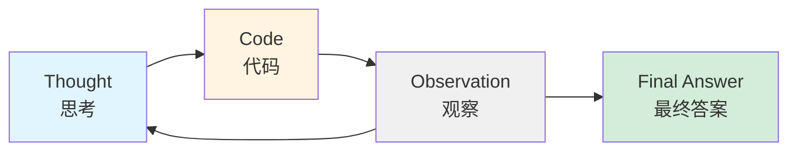

### 3. 渐进式复杂性

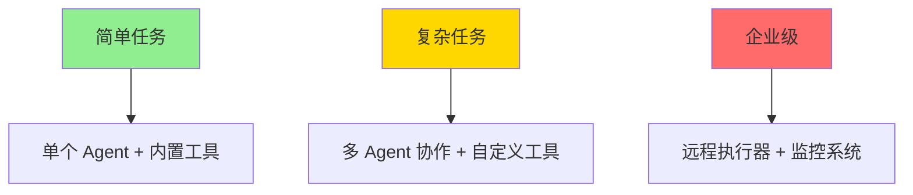

---

## 架构总览

### 系统架构图

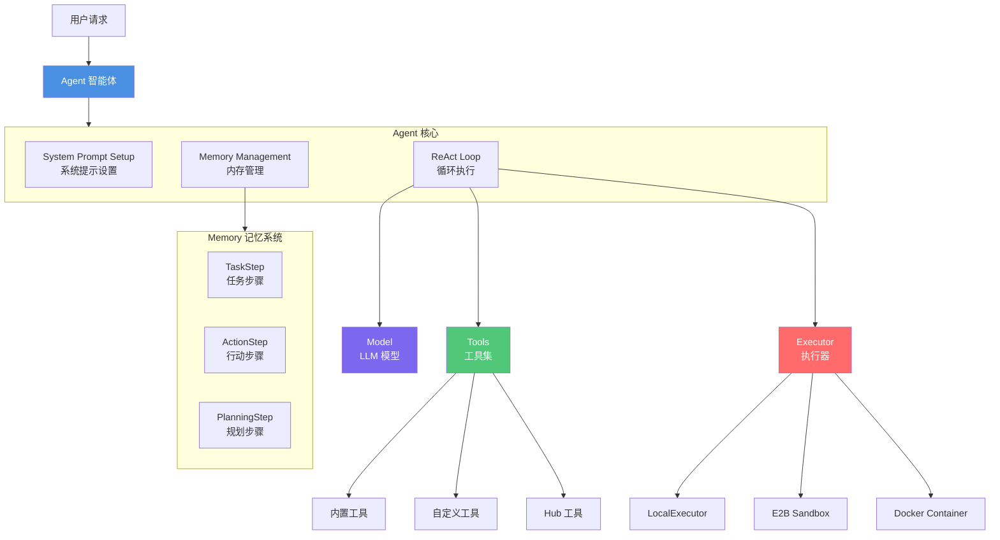

### 类继承关系

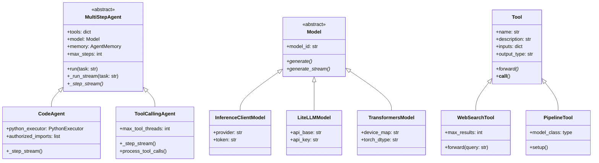

---

## 核心组件详解

### 1. Agent (智能体)

#### 1.1 MultiStepAgent 基类

所有 Agent 的抽象基类，实现了 ReAct 循环的核心逻辑：

```python
class MultiStepAgent(ABC):
    def __init__(
        self,
        tools: list[Tool],
        model: Model,
        max_steps: int = 20,
        planning_interval: int | None = None,
        verbosity_level: LogLevel = LogLevel.INFO,
    ):
        self.tools = {tool.name: tool for tool in tools}
        self.model = model
        self.memory = AgentMemory(self.system_prompt)
        self.max_steps = max_steps
        self.planning_interval = planning_interval
        self.monitor = Monitor(self.model, self.logger)
```

#### 1.2 核心执行流程

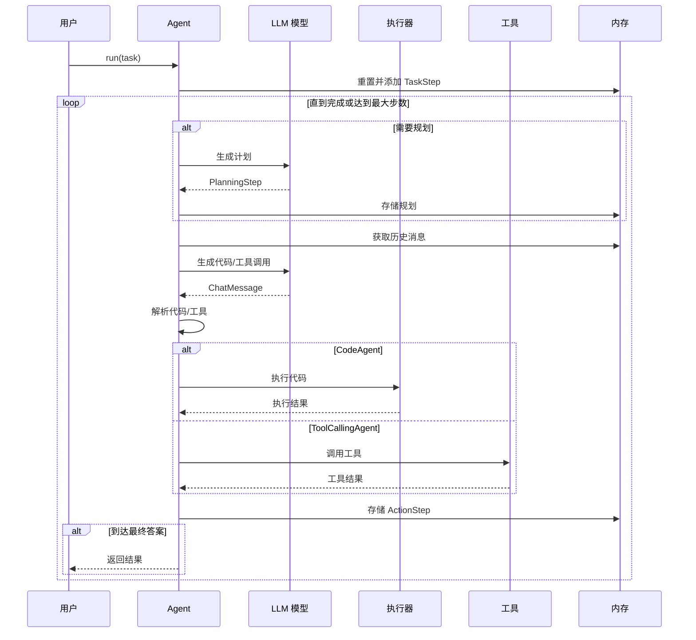

#### 1.3 CodeAgent 实现细节

**核心方法：_step_stream**

```python
def _step_stream(self, memory_step: ActionStep):
    # 1. 准备输入消息
    memory_messages = self.write_memory_to_messages()
    
    # 2. 调用 LLM 生成
    chat_message = self.model.generate(
        memory_messages,
        stop_sequences=["Observation:", "```"],
    )
    output_text = chat_message.content
    
    # 3. 解析代码块
    code_action = parse_code_blobs(output_text, self.code_block_tags)
    
    # 4. 在沙箱中执行代码
    code_output = self.python_executor(code_action)
    
    # 5. 记录观察结果
    observation = code_output.logs + str(code_output.output)
    memory_step.observations = observation
    
    # 6. 返回执行结果
    yield ActionOutput(
        output=code_output.output,
        is_final_answer=code_output.is_final_answer
    )
```

**执行示例**：

```python
# 用户任务
agent.run("搜索 Python 最新版本并计算平方根")

# Step 1
"""
Thought: 我需要搜索 Python 最新版本
```python
result = web_search("latest Python version")
print(result)
```
#### 1.4 ToolCallingAgent 实现

传统工具调用方式的实现：

```python
def _step_stream(self, memory_step: ActionStep):
    # 1. 调用模型并传入工具定义
    chat_message = self.model.generate(
        memory_messages,
        tools_to_call_from=self.tools_and_managed_agents,
    )
    
    # 2. 解析工具调用
    tool_calls = chat_message.tool_calls
    # 例如：
    # ToolCall(name="web_search", arguments={"query": "Python"})
    
    # 3. 并行执行工具（可选）
    for tool_call in tool_calls:
        result = self.execute_tool_call(
            tool_name=tool_call.name,
            arguments=tool_call.arguments
        )
    
    # 4. 汇总观察结果
    observation = "\n".join([output.observation for output in outputs])
```

---

### 2. Model (模型层)

#### 2.1 模型抽象设计

```python
class Model:
    def generate(
        self,
        messages: list[ChatMessage],
        stop_sequences: list[str] = None,
        response_format: dict = None,
        tools_to_call_from: list[Tool] = None,
        **kwargs
    ) -> ChatMessage:
        """生成回复（同步）"""
        raise NotImplementedError
    
    def generate_stream(
        self,
        messages: list[ChatMessage],
        ...
    ) -> Generator[ChatMessageStreamDelta]:
        """生成回复（流式）"""
        raise NotImplementedError
```

#### 2.2 支持的模型类型

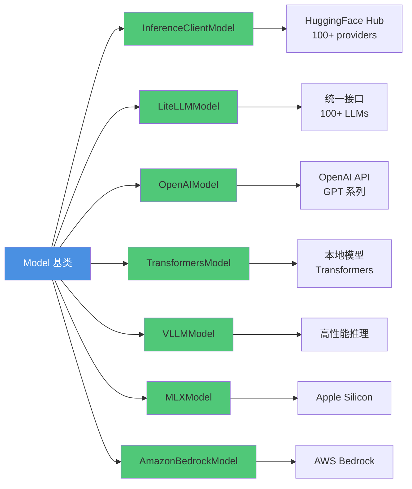

#### 2.3 使用示例

**InferenceClientModel** - HuggingFace Inference API

```python
from smolagents import InferenceClientModel

model = InferenceClientModel(
    model_id="Qwen/Qwen3-Next-80B-A3B-Thinking",
    provider="together",  # 可选: together, fireworks, cerebras
    token="your_hf_token",
)
```

**LiteLLMModel** - 统一访问 100+ LLM

```python
from smolagents import LiteLLMModel

model = LiteLLMModel(
    model_id="anthropic/claude-4-sonnet-latest",
    api_key="your_api_key",
    temperature=0.2,
)
```

**TransformersModel** - 本地模型

```python
from smolagents import TransformersModel

model = TransformersModel(
    model_id="Qwen/Qwen2.5-Coder-32B-Instruct",
    device_map="auto",
    torch_dtype="float16",
    max_new_tokens=4096,
)
```

#### 2.4 消息格式

统一的 `ChatMessage` 格式：

```python
@dataclass
class ChatMessage:
    role: MessageRole  # USER, ASSISTANT, SYSTEM, TOOL_CALL, TOOL_RESPONSE
    content: str | list[dict] | None
    tool_calls: list[ChatMessageToolCall] | None = None
    token_usage: TokenUsage | None = None
```

**多模态消息示例**：

```python
message = ChatMessage(
    role=MessageRole.USER,
    content=[
        {"type": "text", "text": "这张图片里有什么?"},
        {"type": "image", "image": pil_image_object},
    ]
)
```

---

### 3. Tool (工具系统)

#### 3.1 Tool 基类设计

```python
class Tool(BaseTool):
    name: str                    # 工具名称
    description: str             # 工具描述
    inputs: dict                 # 输入参数定义
    output_type: str             # 输出类型: string, image, audio, any
    output_schema: dict | None   # 输出 JSON Schema（可选）

    def forward(self, *args, **kwargs) -> Any:
        """实际执行逻辑"""
        raise NotImplementedError

    def __call__(self, *args, sanitize_inputs_outputs=False, **kwargs):
        """包装调用：处理输入输出类型"""
        if not self.is_initialized:
            self.setup()
        
        # 处理输入（如将 PIL Image 转换为路径）
        if sanitize_inputs_outputs:
            args, kwargs = handle_agent_input_types(*args, **kwargs)
        
        outputs = self.forward(*args, **kwargs)
        
        # 处理输出（如将路径转换为 AgentImage）
        if sanitize_inputs_outputs:
            outputs = handle_agent_output_types(outputs, self.output_type)
        
        return outputs
```

#### 3.2 自定义工具示例

**方式 1：继承 Tool 类**

```python
class WeatherTool(Tool):
    name = "get_weather"
    description = "获取指定地点的当前天气"
    inputs = {
        "location": {
            "type": "string",
            "description": "城市和国家，例如 'Paris, France'"
        }
    }
    output_type = "string"

    def forward(self, location: str) -> str:
        response = requests.get(f"https://api.weather.com/{location}")
        return response.json()["weather"]
```

**方式 2：使用 @tool 装饰器**

```python
from smolagents import tool

@tool
def get_weather(location: str) -> str:
    """
    获取指定地点的当前天气。

    Args:
        location: 城市和国家，例如 'Paris, France'

    Returns:
        str: 当前天气描述
    """
    response = requests.get(f"https://api.weather.com/{location}")
    return response.json()["weather"]
```

#### 3.3 内置工具

| 工具名称 | 功能描述 | 输出类型 |
|---------|---------|---------|
| `WebSearchTool` | 网络搜索（DuckDuckGo/Bing） | string |
| `VisitWebpageTool` | 访问网页并提取内容 | string |
| `WikipediaSearchTool` | 维基百科搜索 | string |
| `DuckDuckGoSearchTool` | DuckDuckGo 搜索 | string |
| `GoogleSearchTool` | Google 搜索（需 API key） | string |
| `SpeechToTextTool` | 语音转文字 | string |
| `PythonInterpreterTool` | Python 代码执行 | string |
| `FinalAnswerTool` | 返回最终答案 | any |
| `UserInputTool` | 获取用户输入 | string |

#### 3.4 工具集成来源

```mermaid
graph TB
    A[Tool Sources] --> B[HuggingFace Hub]
    A --> C[Gradio Space]
    A --> D[LangChain]
    A --> E[MCP Server]
    A --> F[Custom Tool]
    
    B --> B1[Tool.from_hub]
    C --> C1[Tool.from_space]
    D --> D1[Tool.from_langchain]
    E --> E1[ToolCollection.from_mcp]
    F --> F1[继承 Tool 类]
    F --> F2[@tool 装饰器]
    
    style A fill:#4A90E2,color:#fff
    style B fill:#50C878
    style C fill:#50C878
    style D fill:#50C878
    style E fill:#50C878
    style F fill:#50C878
```

**从 HuggingFace Hub 加载**

```python
tool = Tool.from_hub(
    repo_id="username/weather-tool",
    trust_remote_code=True
)
```

**从 Gradio Space 加载**

```python
tool = Tool.from_space(
    space_id="black-forest-labs/FLUX.1-schnell",
    name="image_generator",
    description="Generate images from text prompts"
)
```

**从 MCP Server 加载**

```python
from mcp import StdioServerParameters

with ToolCollection.from_mcp(
    StdioServerParameters(
        command="uvx",
        args=["pubmedmcp@0.1.3"],
    ),
    trust_remote_code=True
) as tool_collection:
    agent = CodeAgent(tools=[*tool_collection.tools])
```

---

### 4. Memory (记忆系统)

#### 4.1 内存结构

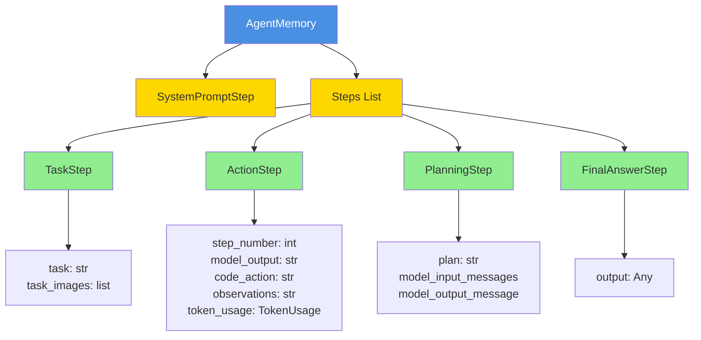

#### 4.2 步骤类型详解

**ActionStep - 行动步骤**（最核心）

```python
@dataclass
class ActionStep(MemoryStep):
    step_number: int
    timing: Timing                  # 执行时间
    
    # 输入
    model_input_messages: list[ChatMessage]
    
    # 输出
    model_output: str              # LLM 生成的文本
    code_action: str               # 提取的代码
    tool_calls: list[ToolCall]     # 工具调用
    
    # 执行结果
    observations: str              # 观察结果
    observations_images: list      # 结果图片
    
    # 元数据
    token_usage: TokenUsage        # Token 使用量
    error: AgentError | None       # 错误信息
    is_final_answer: bool          # 是否最终答案
```

#### 4.3 消息转换流程

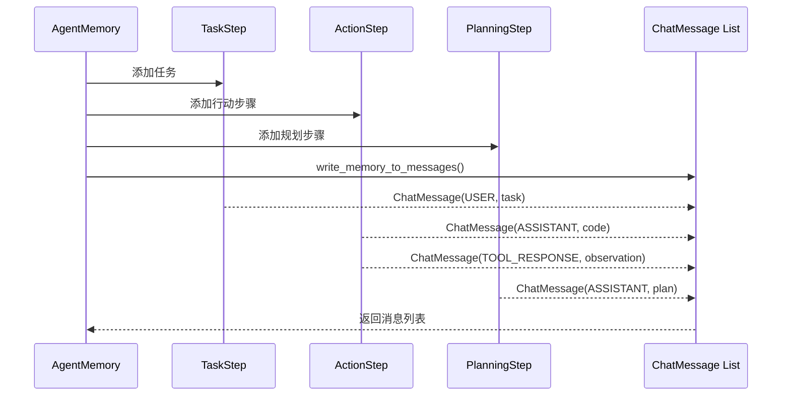

**转换示例**：

```python
memory = AgentMemory(system_prompt)
memory.steps.append(TaskStep(task="Search for Python"))
memory.steps.append(ActionStep(...))

# 转换为消息列表
messages = memory.write_memory_to_messages()

# 结果：
# [
#   ChatMessage(role=SYSTEM, content="You are an agent..."),
#   ChatMessage(role=USER, content="Search for Python"),
#   ChatMessage(role=ASSISTANT, content="```python\nweb_search('Python')\n```"),
#   ChatMessage(role=TOOL_RESPONSE, content="Observation: ..."),
# ]
```

---

### 5. Executor (代码执行器)

#### 5.1 执行器类型对比

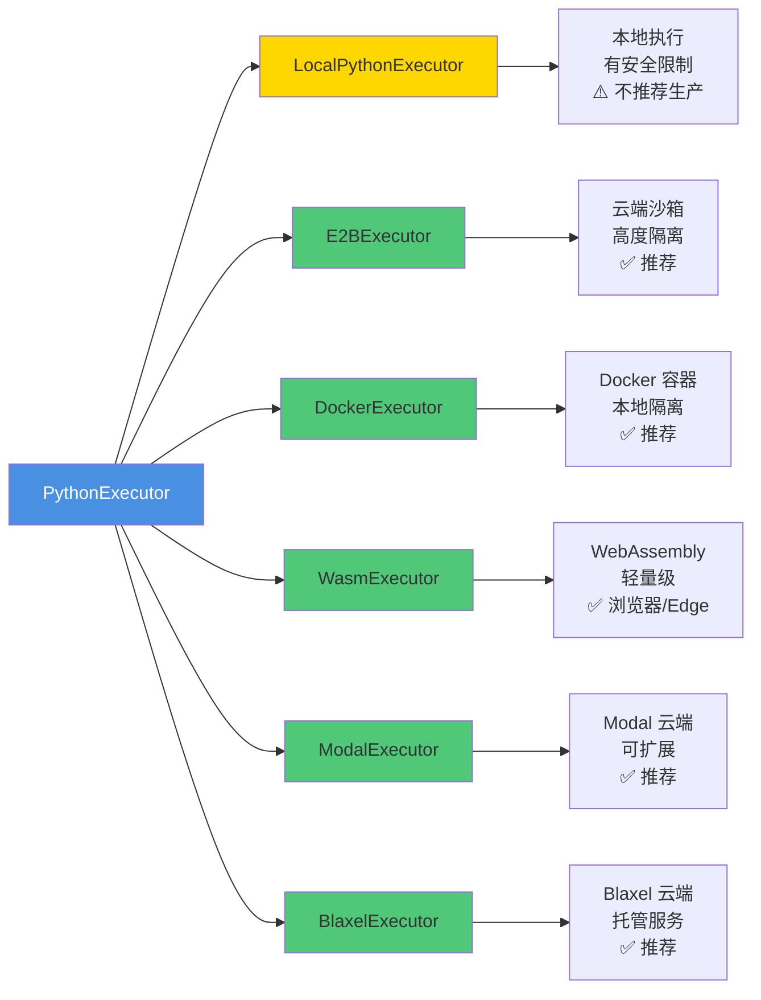

#### 5.2 LocalPythonExecutor 安全机制

```python
executor = LocalPythonExecutor(
    additional_authorized_imports=["pandas", "numpy"],
    max_print_outputs_length=10000,
)

# 执行代码
output = executor("""
import pandas as pd
df = pd.DataFrame({'a': [1, 2, 3]})
print(df)
final_answer(df['a'].sum())
""")

# output.output = 6
# output.logs = "   a\n0  1\n1  2\n2  3\n"
# output.is_final_answer = True
```

**安全限制**：

| 限制类型 | 描述 | 示例 |
|---------|------|------|
| 模块导入限制 | 仅允许授权模块 | `authorized_imports=["pandas"]` |
| 危险函数禁止 | 禁止 eval, exec, os.system | `DANGEROUS_FUNCTIONS` |
| Dunder 方法禁止 | 禁止访问 `__import__` 等 | `ALLOWED_DUNDER_METHODS` |
| 超时限制 | 默认 30 秒 | `MAX_EXECUTION_TIME_SECONDS` |
| 操作次数限制 | 防止无限循环 | `MAX_OPERATIONS` |

#### 5.3 远程执行器使用

**E2B 云端沙箱**

```python
from smolagents import CodeAgent, E2BExecutor

agent = CodeAgent(
    tools=[WebSearchTool()],
    model=model,
    executor_type="e2b",
    executor_kwargs={"api_key": "your_e2b_key"}
)
```

**Docker 容器**

```python
agent = CodeAgent(
    tools=[WebSearchTool()],
    model=model,
    executor_type="docker",
    executor_kwargs={"image": "python:3.11-slim"}
)
```

#### 5.4 执行流程

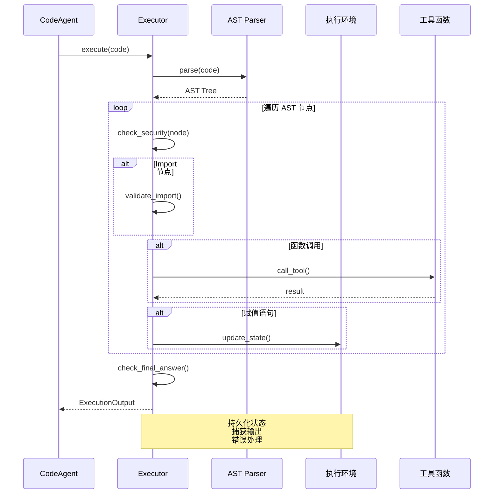

---

## 执行流程详解

### 完整执行流程示例

**任务**：搜索 Python 最新版本并计算其平方根

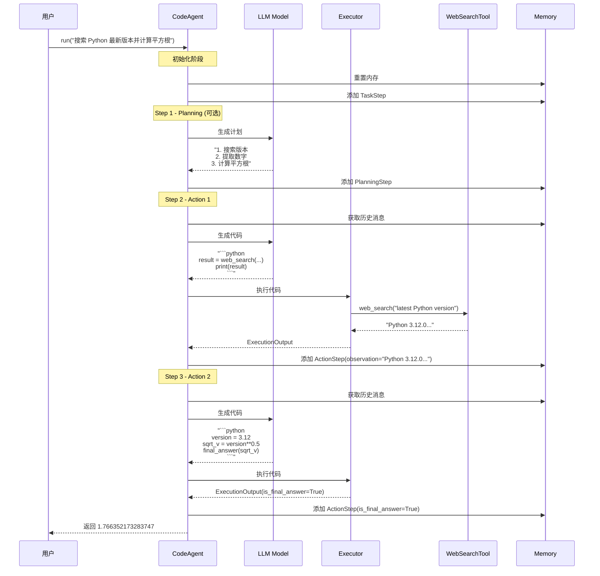

### 关键流程节点

#### 1. System Prompt 构建

```python
def initialize_system_prompt(self) -> str:
    template = """
You are an expert assistant who can solve any task using code blobs.

Available tools:

{{ tool.to_code_prompt() }}


Rules:
1. Always provide 'Thought:' and code sequences
2. Use only defined variables
3. Call tools with correct arguments
4. Return final answer using final_answer()

Authorized imports: {{authorized_imports}}
    """
    
    return populate_template(template, {
        "tools": self.tools,
        "authorized_imports": self.authorized_imports,
    })
```

#### 2. 代码解析

```python
def parse_code_blobs(text: str, code_block_tags: tuple[str, str]) -> str:
    """
    从文本中提取代码块
    
    Input:
        "Thought: I need to search\n```python\nprint('hello')\n```"
    
    Output:
        "print('hello')"
    """
    opening_tag, closing_tag = code_block_tags
    pattern = rf"{opening_tag}(.*?){closing_tag}"
    matches = re.findall(pattern, text, re.DOTALL)
    
    if matches:
        return matches[-1].strip()  # 返回最后一个代码块
    return ""
```

#### 3. 工具调用执行

```python
def execute_tool_call(self, tool_name: str, arguments: dict) -> Any:
    # 1. 查找工具
    tool = self.tools[tool_name]
    
    # 2. 验证参数
    validate_tool_arguments(tool, arguments)
    
    # 3. 执行工具
    result = tool(**arguments, sanitize_inputs_outputs=True)
    
    # 4. 处理特殊类型
    if isinstance(result, AgentImage):
        self.state["image.png"] = result
        return "Stored 'image.png' in memory."
    
    return result
```

---

## 设计模式与思想

### 1. 策略模式 (Strategy Pattern)

**应用场景**：不同的 Agent 执行策略

```python
# 策略接口
class MultiStepAgent(ABC):
    @abstractmethod
    def _step_stream(self, memory_step: ActionStep):
        pass

# 具体策略 1: 代码执行
class CodeAgent(MultiStepAgent):
    def _step_stream(self, memory_step):
        # 生成代码并执行

# 具体策略 2: 工具调用
class ToolCallingAgent(MultiStepAgent):
    def _step_stream(self, memory_step):
        # 调用工具
```

### 2. 模板方法模式 (Template Method)

**应用场景**：Agent 执行流程

```python
class MultiStepAgent:
    def run(self, task: str):
        # 模板方法：定义骨架
        self._setup()
        self._add_task_to_memory(task)
        
        while not finished:
            # 钩子方法：子类可扩展
            if self.planning_interval:
                self._planning_step()
            
            # 抽象方法：子类实现
            self._step_stream(action_step)
            
            self._finalize_step()
        
        return self._get_final_answer()
```

### 3. 观察者模式 (Observer Pattern)

**应用场景**：步骤回调

```python
class CallbackRegistry:
    def __init__(self):
        self._callbacks: dict[Type[MemoryStep], list[Callable]] = {}
    
    def register(self, step_cls: Type[MemoryStep], callback: Callable):
        if step_cls not in self._callbacks:
            self._callbacks[step_cls] = []
        self._callbacks[step_cls].append(callback)
    
    def callback(self, memory_step: MemoryStep, **kwargs):
        for cls in memory_step.__class__.__mro__:
            for cb in self._callbacks.get(cls, []):
                cb(memory_step, **kwargs)

# 使用
def log_step(step: ActionStep, agent: MultiStepAgent):
    print(f"Step {step.step_number}: {step.observations}")

agent.step_callbacks.register(ActionStep, log_step)
```

### 4. 装饰器模式 (Decorator Pattern)

**应用场景**：工具增强

```python
def tool(tool_function: Callable) -> Tool:
    """将函数装饰为工具"""
    schema = get_json_schema(tool_function)
    
    class SimpleTool(Tool):
        name = schema["name"]
        description = schema["description"]
        inputs = schema["parameters"]["properties"]
        output_type = schema["return"]["type"]
        
        def forward(self, *args, **kwargs):
            return tool_function(*args, **kwargs)
    
    return SimpleTool()

# 使用
@tool
def get_weather(location: str) -> str:
    """Get weather for a location"""
    return requests.get(f"api.weather.com/{location}").json()
```

### 5. 工厂模式 (Factory Pattern)

**应用场景**：模型和执行器创建

```python
# 模型工厂
MODEL_REGISTRY = {
    "InferenceClientModel": InferenceClientModel,
    "LiteLLMModel": LiteLLMModel,
    "TransformersModel": TransformersModel,
}

@classmethod
def from_dict(cls, model_dict: dict) -> Model:
    model_class = MODEL_REGISTRY[model_dict["class"]]
    return model_class.from_dict(model_dict["data"])

# 执行器工厂
def create_python_executor(self) -> PythonExecutor:
    executors = {
        "local": LocalPythonExecutor,
        "e2b": E2BExecutor,
        "docker": DockerExecutor,
        "wasm": WasmExecutor,
    }
    return executors[self.executor_type](**self.executor_kwargs)
```

### 6. 建造者模式 (Builder Pattern)

**应用场景**：Agent 配置（未来可能支持）

```python
# 流式 API 风格（概念示例）
agent = (CodeAgent
    .builder()
    .with_model(model)
    .with_tools([WebSearchTool()])
    .with_max_steps(20)
    .with_planning_interval(5)
    .with_executor_type("e2b")
    .build())
```

---

## 高级特性

### 1. 多 Agent 协作

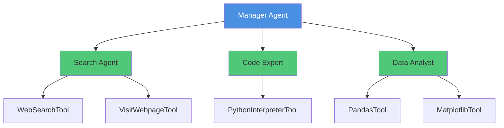

**实现示例**：

```python
from smolagents import CodeAgent, ToolCallingAgent

# 创建专家 Agent
search_agent = ToolCallingAgent(
    tools=[WebSearchTool(), VisitWebpageTool()],
    model=model,
    name="search_agent",
    description="Expert in web search and browsing"
)

code_expert = CodeAgent(
    tools=[PythonInterpreterTool()],
    model=model,
    name="code_expert",
    description="Expert in Python programming"
)

# 创建管理者 Agent
manager = CodeAgent(
    tools=[],
    model=model,
    managed_agents=[search_agent, code_expert],
)

# 执行
result = manager.run("""
Search for the population of Tokyo and calculate its square root.
""")
```

**执行流程**：

```
Manager Agent
├─ Thought: I need to search for Tokyo population
├─ Code:
│   population_info = search_agent(task="Find Tokyo population")
│   print(population_info)
└─ Observation: "Tokyo has 14 million people..."

├─ Thought: Calculate square root
├─ Code:
│   population = 14_000_000
│   sqrt_pop = population ** 0.5
│   final_answer(sqrt_pop)
└─ Final Answer: 3741.65...
```

### 2. 规划机制

```python
agent = CodeAgent(
    tools=[WebSearchTool()],
    model=model,
    planning_interval=3,  # 每 3 步规划一次
)
```

**规划流程**：

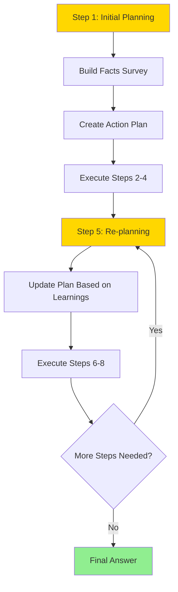

### 3. 流式输出

```python
agent = CodeAgent(
    tools=[WebSearchTool()],
    model=model,
    stream_outputs=True,
)

# 方式 1: 迭代器
for step in agent.run(task, stream=True):
    if isinstance(step, ActionStep):
        print(f"Step {step.step_number}: {step.observations}")
    elif isinstance(step, PlanningStep):
        print(f"Plan: {step.plan}")

# 方式 2: 回调
def on_step(step: ActionStep, agent: CodeAgent):
    if step.model_output:
        print(f"Thinking: {step.model_output}")

agent.step_callbacks.register(ActionStep, on_step)
agent.run(task)
```

### 4. 自定义验证

```python
def validate_answer(answer: Any, memory: AgentMemory, agent: CodeAgent) -> bool:
    """验证最终答案"""
    if isinstance(answer, str) and len(answer) < 10:
        raise ValueError("Answer too short!")
    return True

agent = CodeAgent(
    tools=[WebSearchTool()],
    model=model,
    final_answer_checks=[validate_answer],
)
```

### 5. 状态持久化

```python
# 保存 Agent
agent.save("my_agent/")

# 目录结构
my_agent/
├── agent.json          # Agent 配置
├── prompts.yaml        # Prompt 模板
├── requirements.txt    # 依赖
├── tools/              # 工具代码
│   ├── web_search.py
│   └── final_answer.py
├── managed_agents/     # 子 Agent
│   └── search_agent/
└── app.py             # Gradio UI

# 加载 Agent
agent = CodeAgent.from_folder("my_agent/")
```

### 6. Hub 集成

```python
# 推送到 Hub
agent.push_to_hub(
    repo_id="username/my-agent",
    private=False,
)

# 从 Hub 加载
agent = CodeAgent.from_hub(
    repo_id="username/my-agent",
    trust_remote_code=True,
)

# 推送工具
tool.push_to_hub("username/my-tool")

# 从 Hub 加载工具
tool = Tool.from_hub(
    repo_id="username/my-tool",
    trust_remote_code=True,
)
```

---

## 最佳实践

### 1. 工具设计原则

**✅ 好的工具设计**：

```python
class GoodTool(Tool):
    name = "search_document"
    description = """
    Search for information in a document.
    Returns relevant passages matching the query.
    """
    inputs = {
        "document_path": {
            "type": "string",
            "description": "Path to the document file"
        },
        "query": {
            "type": "string",
            "description": "Search query string"
        }
    }
    output_type = "string"

    def forward(self, document_path: str, query: str) -> str:
        # 清晰的错误处理
        if not os.path.exists(document_path):
            return f"Error: Document not found: {document_path}"
        
        # 返回有用的信息
        results = self._search(document_path, query)
        return f"Found {len(results)} matches:\n" + "\n".join(results)
```

**❌ 不好的工具设计**：

```python
class BadTool(Tool):
    name = "tool1"  # ❌ 不描述性的名称
    description = "Does stuff"  # ❌ 模糊的描述
    inputs = {
        "x": {"type": "any"}  # ❌ 不明确的类型
    }
    output_type = "any"

    def forward(self, x):
        # ❌ 没有错误处理
        return some_function(x)
```

### 2. Prompt 工程

```python
# 添加自定义指令
agent = CodeAgent(
    tools=[...],
    model=model,
    instructions="""
Additional guidelines:
- Always verify information from multiple sources
- Prefer concise code over verbose explanations
- When in doubt, ask for clarification
    """,
)
```

### 3. 性能优化

```python
# 1. 使用本地模型
model = TransformersModel(
    model_id="Qwen/Qwen2.5-Coder-32B-Instruct",
    device_map="auto",
    torch_dtype="float16",
)

# 2. 启用流式输出
agent = CodeAgent(
    tools=[...],
    model=model,
    stream_outputs=True,
)

# 3. 限制最大步骤
agent = CodeAgent(
    tools=[...],
    model=model,
    max_steps=10,  # 避免无限循环
)

# 4. 使用规划间隔
agent = CodeAgent(
    tools=[...],
    model=model,
    planning_interval=5,  # 定期重新规划
)
```

### 4. 错误处理

```python
# 捕获特定错误
try:
    result = agent.run(task)
except AgentMaxStepsError:
    print("Agent exceeded maximum steps")
except AgentExecutionError as e:
    print(f"Execution failed: {e}")
except AgentError as e:
    print(f"Agent error: {e}")

# 自定义错误处理回调
def handle_error(step: ActionStep, agent: CodeAgent):
    if step.error:
        logger.error(f"Step {step.step_number} failed: {step.error}")

agent.step_callbacks.register(ActionStep, handle_error)
```

### 5. 监控和调试

```python
# 1. 使用回调监控
def monitor_step(step: ActionStep, agent: CodeAgent):
    print(f"Step {step.step_number}")
    print(f"  Tokens: {step.token_usage}")
    print(f"  Time: {step.timing.duration:.2f}s")
    if step.error:
        print(f"  Error: {step.error}")

agent.step_callbacks.register(ActionStep, monitor_step)

# 2. 重放执行历史
agent.run(task)
agent.replay(detailed=True)  # 打印详细步骤

# 3. 导出完整日志
result = agent.run(task, return_full_result=True)
print(result.dict())  # 包含所有步骤、token 使用、时间等
```

### 6. 安全最佳实践

```python
# ❌ 危险：本地执行器 + 不可信代码
agent = CodeAgent(
    tools=[...],
    model=model,
    executor_type="local",  # 不安全！
)

# ✅ 安全：使用沙箱
agent = CodeAgent(
    tools=[...],
    model=model,
    executor_type="e2b",  # 云端沙箱
    # 或
    executor_type="docker",  # 容器隔离
)

# ✅ 限制导入
agent = CodeAgent(
    tools=[...],
    model=model,
    additional_authorized_imports=["pandas", "numpy"],  # 仅授权模块
    # 不要使用 ["*"] 除非完全信任
)
```

---

## 总结

### 核心优势

| 优势 | 描述 |
|------|------|
| **简洁性** | ~1000 行核心代码，易于理解和扩展 |
| **代码优先** | 用代码思考，更自然、更高效 |
| **高度灵活** | 支持多种模型、工具、执行器 |
| **安全可控** | 多种沙箱选项，细粒度权限控制 |
| **生产就绪** | 完善的监控、日志、错误处理 |

### 适用场景

- ✅ 研究原型开发
- ✅ 数据分析和可视化
- ✅ Web 自动化
- ✅ 代码生成和执行
- ✅ 多模态任务
- ✅ 复杂推理任务

### 学习路径

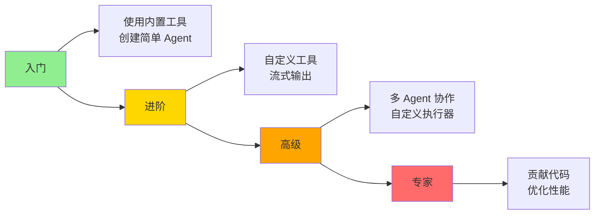

### 相关资源

- 📖 官方文档：https://huggingface.co/docs/smolagents
- 💻 GitHub：https://github.com/huggingface/smolagents
- 📂 示例代码：examples/ 目录
- 📝 博客文章：https://huggingface.co/blog/smolagents

---

**感谢阅读！希望这份文档能帮助你深入理解 SmolAgents。** 🚀
