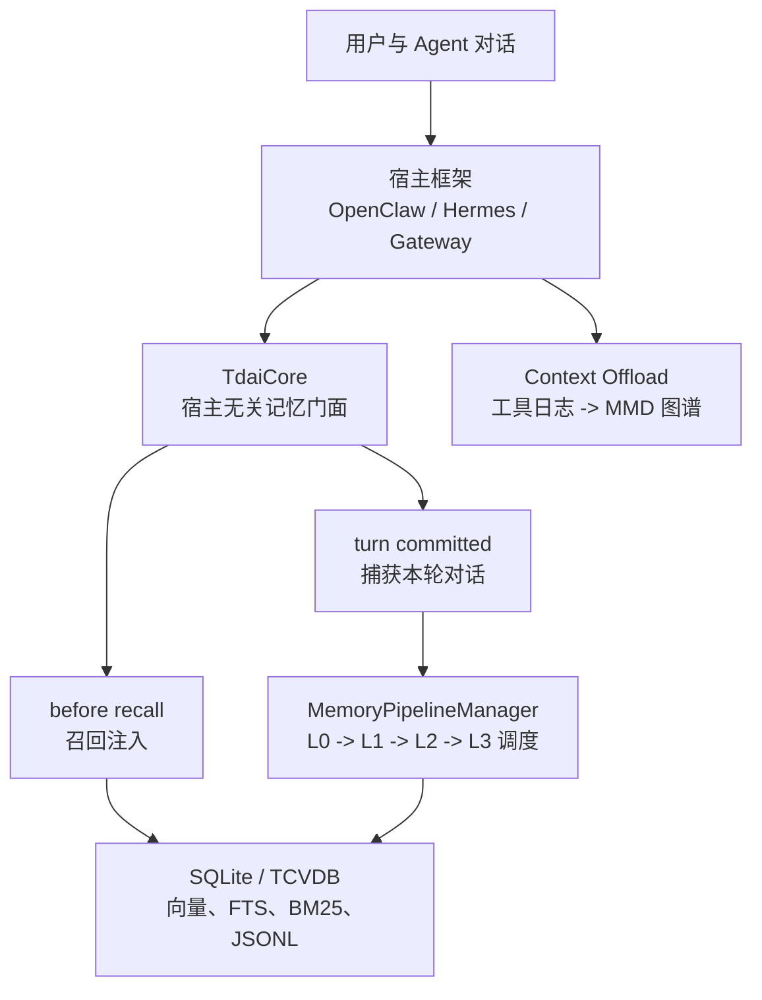
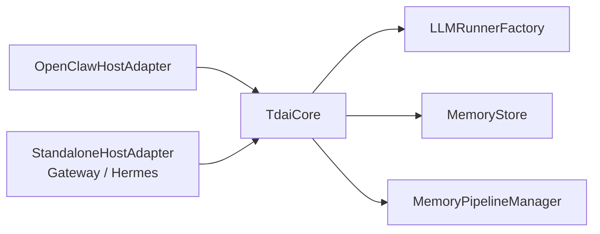
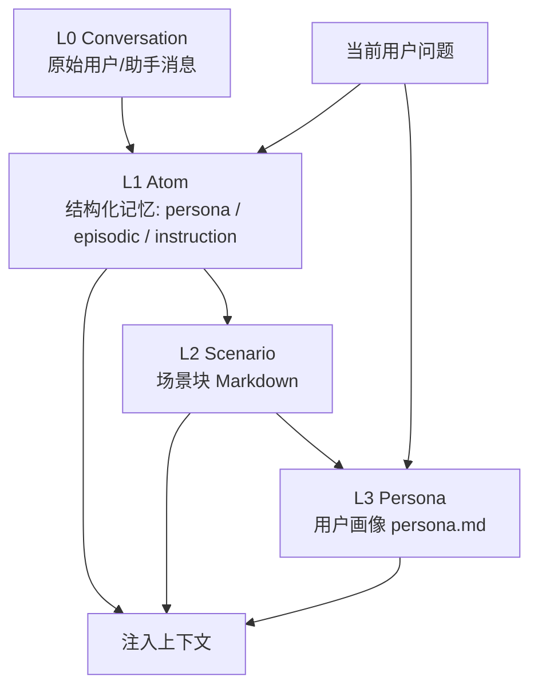
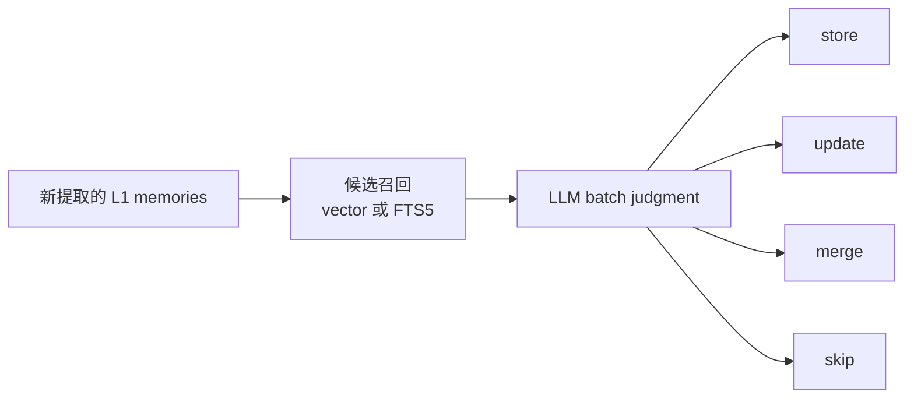
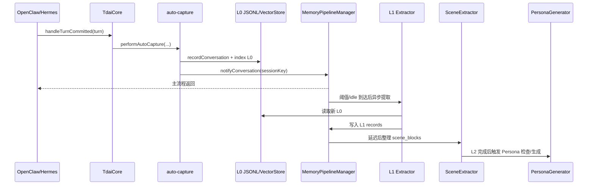
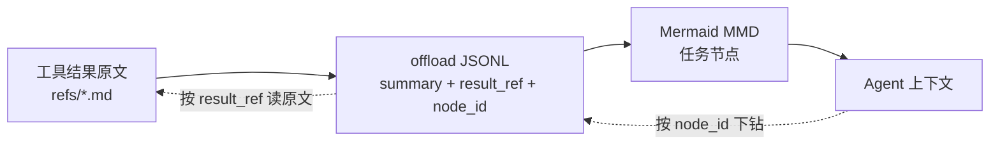
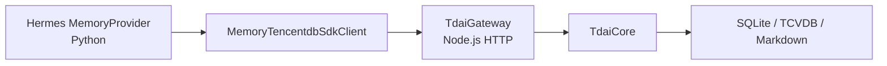
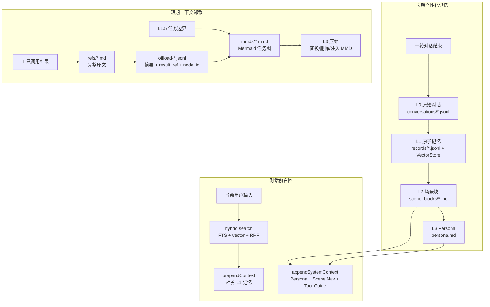

# TencentDB-Agent-Memory 项目深度讲解

> 阅读对象：[TencentCloud/TencentDB-Agent-Memory](https://github.com/TencentCloud/TencentDB-Agent-Memory)  
> 本地源码：`raw/sources/tencentdb-agent-memory/`  
> 阅读日期：2026-06-05  
> 当前源码快照：`f92b102 feat(embedding): support ZeroEntropy native embed API (#137)`  
> NPM 包名：`@tencentdb-agent-memory/memory-tencentdb`，当前 `package.json` 版本为 `0.3.6`

本文把 TencentDB-Agent-Memory 当作一个真实 Agent 记忆工程来读，而不是把它看成一个“向量库 + prompt 注入”的简单插件。它真正值得学习的地方有两个：

1. 它把记忆拆成两套互补系统：长期个性化记忆和短期任务上下文卸载。
2. 它把记忆系统做成可接入 OpenClaw、Hermes、Gateway 的宿主无关核心，而不是绑死在某一个 Agent 框架里。

一句话概括：TencentDB-Agent-Memory 不是为了让 Agent 存下所有历史，而是把不同粒度的信息放在不同层级里，让 Agent 平时看到结构，在需要时能下钻回证据。

如果你现在刚开始读这个项目，最容易困惑的地方是：它里面反复出现 L0、L1、L2、L3，但这些 L 不是同一个系统里的同一种含义。长期记忆里的 L0/L1/L2/L3，是从“原始对话”逐步提炼到“用户画像”；短期 offload 里的 L1/L1.5/L2/L3，是从“工具日志”逐步折叠到“任务图谱和上下文压缩”。它们共享同一个设计哲学：低层保留证据，高层保留结构，但处理对象不同。

可以先记住这张对照表：

| 维度 | 长期记忆 Long-term Memory | 短期卸载 Context Offload |
| --- | --- | --- |
| 解决的问题 | 跨会话记住用户、事实、偏好、指令 | 当前长任务里工具日志太多，上下文爆掉 |
| 输入 | user/assistant 对话内容 | tool call 和 tool result |
| 低层证据 | `conversations/*.jsonl` 原始对话 | `refs/*.md` 完整工具结果 |
| 中层结构 | `records/*.jsonl` 原子记忆、`scene_blocks/*.md` 场景 | `offload-*.jsonl` 工具摘要、任务边界 |
| 高层结构 | `persona.md` 用户画像 | `mmds/*.mmd` Mermaid 任务图 |
| 对上下文的影响 | 增加必要背景 | 删除/替换冗余过程日志，并注入任务图 |
| 典型触发 | 一轮对话结束后后台提取；下一轮对话前召回 | 工具调用后收集；上下文接近阈值时压缩 |

因此读源码时不要把“长期记忆 L3 Persona”和“offload L3 compression”混在一起。前者是画像生成，后者是上下文压缩。名字相似，职责完全不同。

---

## 1. 项目整体定位

README 里给出的核心定位是：

- 符号化短期记忆：把长任务里的工具日志卸载到外部文件，只把轻量 Mermaid 任务图注入上下文。
- 分层式长期记忆：把原始对话逐层提炼成 L0 Conversation、L1 Atom、L2 Scenario、L3 Persona。

从源码看，这不是一句宣传语。仓库确实分成三大部分：

| 模块 | 目录 | 作用 |
| --- | --- | --- |
| 长期记忆核心 | `src/core/` | L0 对话捕获、L1 结构化记忆、L2 场景块、L3 Persona、搜索工具、存储后端 |
| 短期上下文卸载 | `src/offload/` | 工具结果卸载、任务边界判断、Mermaid 任务画布、token 压缩、Skill 生成雏形 |
| 宿主适配 | `index.ts`、`src/adapters/`、`src/gateway/`、`hermes-plugin/` | 接入 OpenClaw 插件、Hermes Python provider、HTTP Gateway |

这个项目的架构不是“记忆功能插在 Agent 后面”，而是一个可独立运行的记忆引擎：



注意这里有一个关键设计：长期记忆和短期卸载不是同一条流水线。长期记忆服务于跨会话偏好、事实、指令和用户画像；短期卸载服务于当前长任务的上下文压力、工具日志膨胀和任务连续性。

更具体地说，一个真实的 Agent 会同时遇到两种“忘记”：

1. 跨会话忘记：昨天用户说过“这个项目所有文档都用中文写”，今天 Agent 不知道了。
2. 单会话迷路：当前任务已经搜索、读文件、跑测试几十次，工具结果把上下文堆满，Agent 忘了自己走到哪一步。

第一种问题不能靠“把所有历史对话塞回 prompt”解决，因为上下文会爆；也不能只靠“压成一段 summary”解决，因为摘要丢证据后会产生幻觉。TencentDB-Agent-Memory 的长期记忆方案是：原始对话保留在 L0，结构化事实提取到 L1，相关事实组织成 L2 场景，再把稳定偏好沉淀到 L3 Persona。

第二种问题也不能靠普通长期记忆解决。长任务里的工具日志不是用户画像，它是当前任务的执行轨迹。对它的正确处理不是“永久记住”，而是“把当前过程折叠成一张任务图，必要时能找回原始工具结果”。这就是 context offload。

所以这个项目有一个很重要的边界：长期记忆回答“这个用户和历史是什么”，短期卸载回答“当前任务进行到哪里”。

---

## 2. 源码导航

学习这个仓库可以按下面顺序读：

| 阅读顺序 | 文件 | 为什么先读它 |
| --- | --- | --- |
| 1 | `README_CN.md` | 了解设计主张、benchmark 和安装方式 |
| 2 | `src/core/tdai-core.ts` | 项目的核心门面，能看清 recall/capture/search/session_end 四个能力 |
| 3 | `index.ts` | OpenClaw 插件外壳，能看清 hooks 和 tools 如何接入 |
| 4 | `src/core/hooks/auto-recall.ts` | 每轮对话前如何召回 L1/L2/L3 |
| 5 | `src/core/hooks/auto-capture.ts` | 每轮对话后如何捕获 L0 并触发后台 pipeline |
| 6 | `src/utils/pipeline-manager.ts` | L0 -> L1 -> L2 -> L3 的调度、定时器、恢复、队列 |
| 7 | `src/core/record/l1-extractor.ts`、`l1-dedup.ts`、`l1-writer.ts` | L1 原子记忆怎么提取、去重、写入 |
| 8 | `src/core/scene/scene-extractor.ts`、`src/core/persona/persona-generator.ts` | L2 场景和 L3 Persona 的生成方式 |
| 9 | `src/core/store/` | SQLite、FTS5、sqlite-vec、TCVDB、embedding 的存储抽象 |
| 10 | `src/offload/` | 短期上下文卸载，包含任务边界、Mermaid 画布、压缩策略 |
| 11 | `src/gateway/server.ts`、`hermes-plugin/memory/memory_tencentdb/` | Hermes/Gateway 接入方式 |

### 2.1 先不要从 `src/offload/` 开始

`src/offload/` 很有意思，但它不是理解项目的最佳入口。它里面同时处理 OpenClaw hooks、context engine、tool call 采集、token 估算、L1/L1.5/L2/L3、MMD 注入、backend/local 模式，复杂度很高。新读者一上来读 offload，很容易误以为整个项目就是“上下文压缩插件”。

更好的顺序是：

1. 先读 `src/core/tdai-core.ts`，明白项目对外暴露哪些能力。
2. 再读 `auto-recall.ts` 和 `auto-capture.ts`，明白一轮对话前后发生什么。
3. 再读 `pipeline-manager.ts`，明白为什么 L1/L2/L3 是后台异步跑。
4. 最后读 `offload/`，把它当作另一套“当前任务记忆”系统。

### 2.2 目录结构按“边界”理解

这个仓库的目录不是按技术类型随便分的，而是按责任边界分：

| 边界 | 目录/文件 | 解释 |
| --- | --- | --- |
| OpenClaw 插件入口 | `index.ts` | 只负责注册 hooks/tools，尽量不承载记忆算法 |
| 宿主无关核心 | `src/core/tdai-core.ts` | OpenClaw/Hermes/Gateway 都调用它 |
| 宿主适配 | `src/adapters/` | 把不同宿主的 logger、LLM、runtime context 转成统一接口 |
| 长期记忆算法 | `src/core/record/`、`scene/`、`persona/` | L1/L2/L3 的具体提取与生成 |
| 存储抽象 | `src/core/store/` | SQLite/TCVDB、FTS、向量、embedding |
| 后台调度 | `src/utils/pipeline-manager.ts` | 触发、排队、恢复、失败处理 |
| 短期上下文卸载 | `src/offload/` | 当前任务日志折叠和上下文压缩 |
| Hermes sidecar | `src/gateway/`、`hermes-plugin/` | 把 TypeScript 核心暴露给 Python Hermes |

理解这个边界后，再看源码会顺很多：`index.ts` 不是核心，`TdaiCore` 才是核心；`VectorStore` 不是唯一事实来源，JSONL/Markdown 文件也很重要；offload 不是长期记忆的一部分，而是并列能力。

---

## 3. 架构的第一层：TdaiCore 是宿主无关门面

`src/core/tdai-core.ts` 是整个项目最重要的文件之一。它的职责不是实现所有细节，而是把记忆系统对外暴露成几个稳定能力：

- `handleBeforeRecall(userText, sessionKey)`：在 LLM 生成前召回相关记忆。
- `handleTurnCommitted(turn)`：在一轮对话结束后捕获用户和助手消息。
- `searchMemories(params)`：搜索 L1 结构化记忆。
- `searchConversations(params)`：搜索 L0 原始对话。
- `handleSessionEnd(sessionKey)`：结束某个会话时只 flush 这个 session 的积压任务。

源码依据：

- `TdaiCore` 类定义在 `src/core/tdai-core.ts:75`。
- `handleBeforeRecall` 在 `src/core/tdai-core.ts:244`。
- `handleTurnCommitted` 在 `src/core/tdai-core.ts:265`。
- `searchMemories` 和 `searchConversations` 在 `src/core/tdai-core.ts:290`、`src/core/tdai-core.ts:312`。
- `handleSessionEnd` 在 `src/core/tdai-core.ts:359`。

这个类最有工程价值的地方是“宿主隔离”：



`TdaiCore` 不直接依赖 OpenClaw API，也不直接依赖 Hermes Python 环境。它依赖的是 `HostAdapter` 和 `LLMRunnerFactory` 这些抽象接口。这样做有几个好处：

1. OpenClaw 内嵌插件模式和 Hermes Gateway sidecar 模式可以复用同一套核心逻辑。
2. L1/L2/L3 的 LLM 调用可以使用宿主默认模型，也可以通过 standalone LLM override 改成独立模型。
3. 记忆核心可以在 HTTP Gateway 里跑，宿主只需要通过 `/recall`、`/capture` 等接口调用。

这里还有两个细节很值得学习。

第一，scheduler 启动用了 `schedulerStartPromise` 作为并发门闩。原因是 Gateway 下多个 HTTP 请求可能同时进入 `handleTurnCommitted`。如果只用一个 boolean，很容易出现“第一个请求正在 restore checkpoint，第二个请求以为已经启动完成”的竞态。源码在 `src/core/tdai-core.ts:89-106` 直接解释了这个风险。

第二，`destroy()` 会等待后台任务，特别是 SQLite 后端的 deferred embedding。否则数据库连接关闭后，后台 embedding 写回可能撞到已关闭连接。这个防御在 `src/core/tdai-core.ts:181-215`。

这说明作者把它当作真实常驻服务来做，而不是 demo。

### 3.1 `TdaiCore` 的四个方向

如果把 `TdaiCore` 看成一个 API，它其实只有四个方向：

| 方向 | 方法 | 发生时机 | 做什么 |
| --- | --- | --- | --- |
| 对话前 | `handleBeforeRecall` | 用户输入到达，LLM prompt 构建前 | 根据当前输入查记忆，返回要注入的上下文 |
| 对话后 | `handleTurnCommitted` | LLM 回复完成，本轮消息落定后 | 捕获本轮 user/assistant 消息，通知后台 pipeline |
| 主动搜索 | `searchMemories`、`searchConversations` | Agent 调工具时 | 让模型主动查 L1 或 L0 |
| 会话收尾 | `handleSessionEnd` | 某个 session 结束 | 只 flush 这个 session 的后台任务 |

这四个方向刚好对应 Agent 记忆的四种使用方式：

1. 自动召回：系统觉得相关，自动塞给模型。
2. 自动沉淀：用户不用命令保存，系统在后台提取。
3. 主动查证：模型觉得不够，可以调用工具下钻。
4. 生命周期管理：结束会话时别丢掉积压的提取任务。

这比“在 prompt 前面拼一段历史摘要”成熟很多，因为它把记忆系统从一个字符串拼接器，变成了一个有生命周期的服务。

### 3.2 为什么要抽象 `HostAdapter` 和 `LLMRunner`

在 OpenClaw 里，LLM 调用可能通过 OpenClaw 自己的 embedded agent runner；在 Gateway/Hermes 里，LLM 调用需要走独立 OpenAI-compatible API。假如核心代码直接 import OpenClaw API，那么 Hermes sidecar 就很难复用。

所以项目定义了：

- `HostAdapter`：告诉核心当前 user/session/dataDir/logger/LLM runner 从哪里来。
- `LLMRunnerFactory`：告诉核心如何创建一个纯文本 LLM runner，或一个带文件工具的 LLM runner。
- `RuntimeContext`：把 OpenClaw session、Hermes session、Gateway request 统一成相同字段。

这个抽象很重要，因为长期记忆里的 L1 和 L2/L3 对 LLM 的要求不同：

- L1 extraction 和 dedup 只需要纯文本输出，不应该允许文件工具。
- L2 scene extraction 和 L3 persona generation 需要读写 Markdown，因此 runner 要开启工具，并且要设置 workspace。

`TdaiCore.wirePipelineRunners()` 会根据宿主类型和配置决定用宿主 LLM 还是 standalone LLM，再把不同 runner 接到 L1/L2/L3。这样，记忆核心不需要知道自己到底跑在 OpenClaw 还是 Gateway 里。

---

## 4. 长期记忆：L0 -> L1 -> L2 -> L3

长期记忆是项目的主干。它不是把所有对话都直接 embedding 进向量库，而是先保存原始证据，再逐层抽象。



先用一个具体例子理解这条链：

用户在某次对话里说：

```text
以后这个研究知识库里的 Agent 学习文档都写中文，最好放在 raw/sources 下，讲解要详细，不要只写浅层 README 摘要。
```

这句话进入系统后，理想情况下会被逐层处理成：

| 层级 | 可能形成的内容 |
| --- | --- |
| L0 | 原始用户消息和助手回复，逐行写入 `conversations/YYYY-MM-DD.jsonl` |
| L1 | `instruction`: 用户要求研究知识库里的 Agent 学习文档使用中文；`instruction`: 文档优先放在 raw/sources；`persona`: 用户偏好详细、深入的源码讲解 |
| L2 | 归入某个场景块，如“研究知识库维护习惯”或“Agent 项目学习流程” |
| L3 | Persona 中长期总结：用户偏好中文、结构化、深度源码讲解，并希望文档与原始 source 并排存放 |

下一次用户说“帮我看一个 Agent 项目并写文档”时，系统不需要把所有历史对话塞给模型。它可以先用当前问题召回 L1 指令，再用 L3 Persona 给模型整体偏好。模型如果不确定“raw/sources 下”这句话的原始语境，可以再调用 conversation search 查 L0 原文。

### 4.1 L0：原始对话记录是证据层

L0 的实现文件是 `src/core/conversation/l0-recorder.ts`。它做的事情很基础，但这些基础决定了后续记忆是否可信：

- 从 hook 里的 raw messages 中提取 user/assistant 消息。
- 使用 `originalUserMessageCount` 做位置切片，避免重复捕获历史消息。
- 使用 timestamp cursor 作为第二层增量过滤。
- 用 `originalUserText` 替换被 `<relevant-memories>` 污染过的用户消息。
- 清理 base64 图片、注入标签、代码块等噪声。
- 写入 `conversations/YYYY-MM-DD.jsonl`，每行一条消息。

这一层的核心哲学是：L0 尽量保留原始证据，但不让召回注入的内容污染下一轮记忆。否则记忆系统会进入自我引用循环：系统把自己注入的记忆又当成用户说过的话存起来，长期看会越来越假。

L0 里最容易被忽略的是“污染处理”。召回时系统可能会把相关记忆包在 `<relevant-memories>` 里插入当前用户 prompt。如果本轮结束后直接把 raw messages 存下来，那么 L0 会记录到这样的假消息：

```text
<relevant-memories>
用户喜欢中文文档...
</relevant-memories>

请你继续写文档
```

这会让下一轮 L1 提取误以为用户本人又说了一遍“喜欢中文文档”。长期运行后，记忆会不断自我强化，变成污染池。因此 `recordConversation` 使用 `before_prompt_build` 时缓存的 clean prompt，把被注入污染的用户消息替换回来。这个细节说明作者知道记忆系统最危险的不是“没记住”，而是“记住了自己编进去的东西”。

L0 还同时使用位置切片和 timestamp cursor。位置切片解决“当前轮新增消息是哪几条”；timestamp cursor 解决“进程重启或缓存失效后如何继续增量”。双保险是必要的，因为不同宿主框架对 message timestamp 的提供不一定可靠。

### 4.2 L1：结构化原子记忆

L1 的核心在 `src/core/record/l1-extractor.ts`。它会从 L0 对话中抽取结构化记忆。每条记忆主要有三种类型：

| 类型 | 含义 |
| --- | --- |
| `persona` | 用户身份、偏好、长期习惯 |
| `episodic` | 事件、经历、项目上下文、一次性事实 |
| `instruction` | 用户明确要求、规则、输出约束 |

L1 提取不是简单摘要，而是“场景切分 + 记忆抽取”一次完成。它先过滤掉不值得提取的消息，然后把最近消息和少量背景消息交给 LLM，要求输出带 `scene_name`、`source_message_ids`、`priority`、`metadata` 的结构化 JSON。

源码依据：

- `extractL1Memories` 在 `src/core/record/l1-extractor.ts:75`。
- L1 会先经过质量过滤，见 `src/core/record/l1-extractor.ts:106-121`。
- LLM 调用和 JSON 解析在 `src/core/record/l1-extractor.ts:300` 之后。

可以把 L1 看成“可检索、可合并、可追溯的事实卡片”。它不是普通 summary。普通 summary 会写：

```text
用户希望文档写得更详细，并放在 raw/sources 下。
```

但 L1 更像结构化记录：

```json
{
  "content": "用户要求 Agent 学习文档放在 raw/sources 下，而不是 wiki 下。",
  "type": "instruction",
  "priority": 80,
  "scene_name": "研究知识库文档维护",
  "source_message_ids": ["msg_xxx"],
  "metadata": {}
}
```

这种结构带来几个能力：

- 可以按 type 过滤，比如只召回 instruction。
- 可以按 scene_name 聚合，比如把同一项目学习流程放到一个场景里。
- 可以通过 source_message_ids 追溯到 L0。
- 可以用 priority 影响后续合并和注入策略。

这也是它比“摘要记忆”更像工程系统的地方。

### 4.3 L1 去重：不是简单相似度阈值

L1 去重在 `src/core/record/l1-dedup.ts`。它采用两阶段：

1. 用向量搜索或 FTS5 找候选冲突记录。
2. 把新记忆和候选记录交给 LLM 做 batch 判断。

判断结果不是只有“存/不存”，而是：

- `store`：新增。
- `update`：替换已有记录。
- `merge`：多条合并。
- `skip`：跳过。

这比单纯相似度阈值好，因为记忆冲突常常不是“相似”那么简单。例如：

- “用户喜欢简洁回答”和“用户要求这次详细分析”不一定冲突，可能一个是长期偏好，一个是当前任务约束。
- “用户在上海工作”和“用户换到了深圳团队”可能是时间上的更新。
- “回答用中文”和“代码注释用英文”是不同作用域的 instruction。

向量只能找候选，真正的语义合并需要模型判断。这个模式值得迁移到其他 Agent 记忆系统里。

更细一点看，L1 去重的流程是：



这里不要误解：向量检索不是最终裁判，它只是减少 LLM 要看的候选范围。如果没有候选，系统直接 store；如果有候选，再让 LLM 判断是同义重复、过时更新、互补合并，还是不同作用域。

这个两阶段模式背后有一个普适原则：便宜算法负责“找可能相关”，贵模型负责“做语义决策”。这在 Agent 工程里很常见，比如文件搜索先用 `rg`，真正判断再读代码。

### 4.4 L1 写入：JSONL 是备份，向量库是检索引擎

`src/core/record/l1-writer.ts` 把 L1 记忆写入两处：

- JSONL：append-only，作为恢复和审计的底层存档。
- VectorStore：作为实时检索引擎，支持向量、FTS、混合召回。

源码注释明确说：JSONL 是 append-only persistent store，VectorStore 是 primary retrieval engine。update/merge 时，旧记录会从 VectorStore 删除，但 JSONL 旧行保留，后续由 cleaner 清理或作为审计证据。

这是一个实用的工程取舍：

- 检索要干净，所以 VectorStore 要实时删除旧记录。
- 审计要可追溯，所以 JSONL 不轻易覆盖。

这也解释了为什么项目里既有数据库，又有文件。数据库不是事实的唯一载体，文件也不是性能主力。它们各自承担不同角色：

- JSONL 适合 append、备份、迁移、人工查看。
- SQLite/TCVDB 适合 FTS、向量召回、快速去重。
- Markdown 适合 LLM 和人类共同维护结构化语义。

一个成熟 Agent 记忆系统通常不能只选一种存储，因为“快”“准”“可审计”“可读”很难由单一介质同时满足。

### 4.5 L2：场景块是中层结构

L2 的实现是 `src/core/scene/scene-extractor.ts`。它会把 L1 原子记忆整理进 `scene_blocks/` 下的 Markdown 文件。

这个设计比“直接从 L1 生成 Persona”更稳，因为 Persona 是高度抽象的，如果直接从碎片化事实生成，很容易变成泛泛的用户画像。L2 场景块承担了中间层职责：

- 把相关事实组织成一个场景。
- 合并重复场景，控制场景数量。
- 保留场景文件，给人类和 Agent 都能读。
- 为 L3 Persona 提供更稳定的输入。

`SceneExtractor` 还有两个安全细节：

1. LLM 运行时 workspace 被限制在 `scene_blocks/`，它只能读写场景文件。
2. LLM 不能真正删除文件，只能写 `[DELETED]` 标记，后处理再清理。

这体现出 Agent 文件工具使用中的一个原则：可以让 LLM 操作文件，但要缩小工作目录，并把危险操作变成可审计的软操作。

L2 场景块解决的是“L1 太碎”的问题。假设 L1 有几十条：

- 用户正在学习 Claude Code。
- 用户正在学习 OpenClaw。
- 用户希望建立 Agent 知识库。
- 用户偏好中文源码精读。
- 用户把原始资料放在 raw/sources。
- 用户希望优质答案沉淀成 wiki。

如果每次都直接从这几十条里召回，模型会看到一堆便利贴，但不知道它们属于同一个“研究知识库建设”场景。L2 会把这些便利贴组织成一个场景块，类似：

```markdown
# 研究知识库与 Agent 学习流程

## 场景摘要
用户维护一个以 raw/sources 和 wiki 为双层结构的研究知识库...

## 稳定偏好
- 文档使用中文。
- 源码学习文档应深入清晰。
- 原始资料和讲解文档优先并排放置。

## 相关事实
- 已研究 Hermes、OpenClaw、DeerFlow、Claude Code...
```

这样 L3 Persona 可以从场景里抽取稳定画像，而不是从孤立事实里硬归纳。

### 4.6 L3：Persona 是高层画像，不是全部事实

L3 的实现是 `src/core/persona/persona-generator.ts`。它读取 L2 场景块，生成或更新 `persona.md`。

Persona 的角色不是替代 L1/L2，而是给 Agent 一个高层方向感：

- 用户长期偏好。
- 用户表达风格。
- 用户持续目标。
- 用户常用工作方式。

如果具体事实重要，系统仍然要下钻 L1 或 L0。README 里说“上层负责结构，下层负责证据”，源码结构也确实支持这个原则。

Persona 最容易被误用成“超级摘要”。但在这个项目里，Persona 更像一个稳定偏好和长期上下文的导航页。它应该回答：

- 用户通常希望我怎么工作？
- 用户长期关注哪些主题？
- 用户有哪些稳定约束？
- 哪些场景值得我优先查？

它不应该承担：

- 保存每一句原话。
- 记录所有临时任务状态。
- 替代 L1 事实检索。
- 替代 L0 原文查证。

这个边界很重要。Persona 越写越长、越像历史流水账，越会失去高层结构的意义。好的 L3 应该短而有判断，L2/L1/L0 负责细节。

---

## 5. Pipeline 调度：长期记忆不是同步生成的

`src/utils/pipeline-manager.ts` 是长期记忆流水线的调度器。它的难点不是“调用 LLM”，而是：什么时候调用、如何避免阻塞、如何失败恢复、如何处理多 session。

### 5.1 每轮结束只通知，不直接重活

`auto-capture.ts` 每轮结束后调用 `scheduler.notifyConversation(sessionKey, [])`。注意这里传的是空数组，因为 L1 runner 会从 VectorStore DB 或 L0 JSONL 读取数据，而不是依赖内存 buffer。

`notifyConversation` 做三件事：

1. session 的 `conversation_count += 1`。
2. 如果达到阈值，立即触发 L1。
3. 如果没达到阈值，重置 idle timer，用户停止一段时间后再触发 L1。

源码依据：`src/utils/pipeline-manager.ts:383-433`。

### 5.2 Warm-up：新 session 前几轮更积极

Pipeline 有 warm-up 模式。新会话不是等固定 5 轮才提取，而是按 `1 -> 2 -> 4 -> ... -> everyNConversations` 的阈值逐步放宽。

这个设计很聪明：新 session 前几轮最容易包含“我是谁、这个项目是什么、你该怎么答”这些高价值信息，所以应该快速进入记忆系统；会话成熟后，再降低提取频率，减少成本。

### 5.3 L1 是 resettable idle timer，L2 是 downward-only timer

Pipeline 的两个定时器语义不同：

- L1 idle timer：用户每说一轮就重置，等用户停下来再提取。
- L2 timer：只允许把执行时间提前，不允许推迟，保证“新 L1 出现后尽快整理场景”，同时受 `minInterval` 限制。

源码依据：

- L1 idle 触发在 `src/utils/pipeline-manager.ts:596-610`。
- L1 入队和执行在 `src/utils/pipeline-manager.ts:617-743`。
- L2 downward-only 触发在 `src/utils/pipeline-manager.ts:750-787`。
- L2 执行后触发 L3，在 `src/utils/pipeline-manager.ts:871-936`。

这个定时器区分很有价值。很多 Agent 后台任务失败，不是因为模型不好，而是因为调度语义混乱：有的任务应该 debounce，有的任务应该 throttle，有的任务应该保证最终运行。这个项目把这些语义写得很清楚。

### 5.4 L3 全局串行，并发时只留 pending 标志

Persona 生成是全局任务，不适合多个 L3 同时跑。Pipeline 用 `l3Running` 和 `l3Pending` 做去重：

- 如果 L3 正在跑，又有新的 L2 完成，就标记 pending。
- 当前 L3 跑完后，如果 pending 为 true，再跑一次。

这个模式适合所有“全局聚合类 Agent 后台任务”，比如全局项目总结、用户画像、长期规划。

### 5.5 一轮对话后的真实执行顺序

把长期记忆 pipeline 串起来，一轮对话结束后大致是：



最关键的一点：Host 不等 L1/L2/L3 全跑完才继续对话。对用户来说，记忆捕获应该是轻量的；重活留给后台。否则每轮对话结束都可能卡住几分钟。

### 5.6 失败恢复不是附属功能

Pipeline 里有 checkpoint、queue、retry、destroy flush、session flush。这些不是“锦上添花”，而是长期记忆系统的核心。

因为 L1/L2/L3 都可能失败：

- LLM API 超时。
- embedding 服务不可用。
- SQLite/TCVDB 初始化失败。
- LLM 写场景文件失败。
- Gateway 进程退出。
- 用户结束 session 时仍有 pending 任务。

如果没有 checkpoint，失败就意味着这一段对话永远不会被处理；如果没有 per-session flush，一个 session 结束可能影响其他 session；如果没有队列，多个后台提取可能同时改同一份 scene/persona 文件。

这个项目在 `handleSessionEnd` 里特别强调：session end 和 gateway stop 不能混用。前者只 flush 一个会话，后者才销毁整个 scheduler。这个细节非常生产化。

---

## 6. 召回注入：稳定上下文和动态上下文分离

`src/core/hooks/auto-recall.ts` 是每轮 prompt 构建前的召回逻辑。它会：

1. 搜索 L1 相关记忆。
2. 读取 L3 persona。
3. 读取 L2 scene navigation。
4. 把 L1 放进 `prependContext`。
5. 把 L3 persona、L2 navigation、工具指南放进 `appendSystemContext`。

源码依据：

- `performAutoRecall` 有超时保护，见 `src/core/hooks/auto-recall.ts:72-100`。
- L1 搜索、Persona、Scene 读取见 `src/core/hooks/auto-recall.ts:115-170`。
- stable/dynamic 分离见 `src/core/hooks/auto-recall.ts:186-218`。

这里有一个非常重要的 prompt-cache 思路：

- L3 Persona 和 L2 Scene Navigation 变化不频繁，适合放在 system prompt 尾部，方便模型服务商做 prompt caching。
- L1 相关记忆每轮都不同，适合放在用户 prompt 前面，避免破坏 system prompt cache。

这说明作者不仅考虑“召回什么”，也考虑“召回内容放在哪里”。

### 6.1 检索策略

召回支持三种策略：

| 策略 | 实现 | 适用 |
| --- | --- | --- |
| `keyword` | FTS5 BM25 | 关键词明确、embedding 不可用 |
| `embedding` | 向量相似度 | 语义相近但词面不同 |
| `hybrid` | BM25 + embedding + RRF，或 TCVDB 原生 hybrid | 默认推荐 |

源码依据：

- 检索分发在 `src/core/hooks/auto-recall.ts:308-392`。
- FTS5 搜索在 `src/core/hooks/auto-recall.ts:398-444`。
- 向量搜索在 `src/core/hooks/auto-recall.ts:450-495`。
- hybrid RRF 在 `src/core/hooks/auto-recall.ts:511-646`。

它没有保留 O(N) 的 JSONL 全量扫描 fallback。这个取舍很现实：记忆系统一旦长期运行，O(N) fallback 会把“召回增强”变成主对话延迟。项目宁愿降级为空结果，也不在主路径里做不可控全量扫描。

### 6.2 召回必须非阻塞

`performAutoRecall` 里有超时 `Promise.race`。超时后直接跳过记忆注入，避免阻塞用户对话。这个原则非常重要：

> 记忆增强是锦上添花，不应该让 Agent 的主对话能力被记忆系统拖死。

这条原则也体现在 capture：SQLite 后端支持先写元数据和 FTS，再后台补 embedding，避免在 `agent_end` 阶段卡住几秒。

### 6.3 自动召回和工具召回的关系

项目不是只靠自动召回。它还注册了两个工具：

- `tdai_memory_search`：查 L1 结构化记忆。
- `tdai_conversation_search`：查 L0 原始对话。

自动召回适合“系统判断相关”的少量背景；工具召回适合“模型发现还不够，需要主动查证”。这两个能力应该配合使用：

| 场景 | 优先方式 |
| --- | --- |
| 用户问“继续按我之前的习惯写” | 自动召回 L3/L1 通常够用 |
| 用户问“我上次具体说那个路径叫什么” | 工具查 L0 更可靠 |
| 用户问“我对文档格式有什么要求” | 先看 L1 instruction，不够再查 L0 |
| 用户问“这个项目我们之前研究到哪了” | L2 scene navigation + memory search |

这里体现出一个关键思想：自动注入不要贪多。自动注入太多会污染当前任务，工具召回则把“是否需要更多细节”的判断交给 Agent。

---

## 7. 存储后端：异构存储而不是单一向量库

`src/core/store/factory.ts` 支持两类后端：

- `sqlite`：本地 SQLite + sqlite-vec + FTS5，默认开箱即用。
- `tcvdb`：腾讯云向量数据库，支持服务端 embedding 和原生 hybrid search。

源码依据：`src/core/store/factory.ts:41`。

它的存储不是“全部塞向量库”，而是混合结构：

| 数据 | 位置 | 目的 |
| --- | --- | --- |
| L0 原始对话 | `conversations/*.jsonl` + L0 index | 证据、原文检索 |
| L1 原子记忆 | `records/*.jsonl` + VectorStore | 结构化召回、去重 |
| L2 场景块 | `scene_blocks/*.md` | 人类可读中层结构 |
| L3 用户画像 | `persona.md` | 高层注入 |
| checkpoint | `.metadata/` | pipeline 恢复 |
| backup | `.backup/` | L2/L3 生成前备份 |

这套布局背后的原则是：

- 低层保留证据。
- 中层组织结构。
- 高层提供方向。
- 检索引擎服务性能。
- Markdown 文件服务可读性和可调试性。

很多 Agent 记忆系统失败，是因为把所有层级都塞进一个向量表。这样召回时没有宏观结构，调试时也只能看分数。TencentDB-Agent-Memory 的可读文件层解决了这个问题。

### 7.1 数据目录应该怎么观察

如果你真的运行这个插件，最值得打开看的不是数据库，而是这些文件：

| 想确认什么 | 看哪里 |
| --- | --- |
| L0 是否记录了原始对话 | `conversations/YYYY-MM-DD.jsonl` |
| L1 是否抽取出有用记忆 | `records/YYYY-MM-DD.jsonl` |
| 召回为什么命中/不命中 | `vectors.db`、工具返回、日志里的 FTS/vec timing |
| L2 是否形成稳定场景 | `scene_blocks/*.md` |
| L3 是否过度泛化 | `persona.md` |
| pipeline 是否卡住 | `.metadata/recall_checkpoint.json` |
| L2/L3 生成前的旧版本 | `.backup/` |

调试建议是从高层往低层查：

1. Persona 写错了吗？
2. 场景块是否把事实归错类？
3. L1 原子记忆是否本来就抽错？
4. L0 原文是否被污染或没捕获？

这个顺序比直接怀疑 embedding 模型更有效。很多“召回错了”的根因不是向量相似度，而是上游提取、归类或污染问题。

---

## 8. 短期记忆：Context Offload 与 Mermaid 任务画布

长期记忆解决的是“跨会话记住用户和经验”。短期记忆解决的是“当前长任务里工具日志太多，模型上下文爆掉”。

offload 模块在 `src/offload/`。它的核心产物是：

| 产物 | 位置 | 作用 |
| --- | --- | --- |
| `refs/*.md` | 完整工具结果原文 | 证据层，可通过 ref 下钻 |
| `offload-*.jsonl` | 工具调用摘要条目 | 中间层，记录 tool_call、summary、result_ref、node_id |
| `mmds/*.mmd` | Mermaid 任务图 | 高层结构，注入上下文 |
| `state.json` | 活跃 MMD、计数器、边界 | 任务状态 |

先用一个长任务例子理解 offload：

```text
用户：帮我修一个测试失败。
Agent：搜索测试、读源码、跑测试、看到错误、改文件、再跑测试、又看到新错误、继续读文件...
```

如果每一次 `rg`、`sed`、`npm test` 的完整结果都留在上下文里，模型很快会被过程日志淹没。很多日志对当前推理已经不需要完整保留，但又不能彻底丢，因为以后可能要查“刚才那个错误原文是什么”。

offload 的处理方式是：

1. 完整工具结果写入 `refs/*.md`。
2. LLM 生成简短摘要，写入 `offload-*.jsonl`。
3. L1.5 判断这些摘要属于哪个长任务。
4. L2 把摘要组织成 Mermaid 任务图。
5. L3 根据 token 压力，把上下文里的旧工具结果替换成摘要，或删除并注入 MMD。

也就是说，offload 不是为了“记住用户”，而是为了“让 Agent 继续知道自己在做什么，同时不被工具原文塞爆”。

### 8.1 L1：工具调用结果摘要

offload 的 L1 不同于长期记忆的 L1。这里 L1 是对工具调用结果做摘要。

`flushL1` 会：

1. 从 pending tool pairs 中取出待处理工具调用。
2. 过滤 heartbeat。
3. 先把完整工具结果写成 `refs/*.md`，保留原文证据。
4. 把工具调用按批次发给后端或本地 LLM 做摘要。
5. 写入 `offload-*.jsonl`。
6. 失败超过重试次数后，生成 degraded fallback summary。

源码依据：`src/offload/index.ts:405-530`。

这个设计符合“先保真，后压缩”。即使 LLM 摘要失败，原始工具结果也已经落盘，不会丢。

一个 offload entry 大致可以理解成：

```json
{
  "timestamp": "2026-06-05T...",
  "node_id": null,
  "tool_call": "rg(\"handleBeforeRecall\")",
  "summary": "定位到 TdaiCore.handleBeforeRecall 调用 performAutoRecall",
  "result_ref": "refs/2026-06-05T...-rg.md",
  "tool_call_id": "call_xxx",
  "score": 8
}
```

这里几个字段的意义：

- `summary`：可以替换原始工具结果的短文本。
- `result_ref`：原文路径，保证摘要可追溯。
- `node_id`：后续 L2 会填，连接 Mermaid 节点。
- `score`：可替换性分数，L3 mild 压缩时优先替换高分项。

这个结构比“直接把工具结果删掉”安全得多。

### 8.2 L1.5：任务边界判断

offload 里有一个很有意思的 L1.5。它不是记忆内容层，而是任务归属层。

它判断当前用户消息属于：

- 继续当前长任务。
- 恢复历史某个 MMD。
- 开始一个新长任务。
- 只是短对话，不需要任务画布。

源码依据：

- `judgeL15` 在 `src/offload/index.ts:655-687`。
- 具体 attempt 逻辑在 `src/offload/index.ts:550-653`。

L1.5 会把 offload entries 按边界归属到某个 MMD 文件。这样 L2 生成 Mermaid 时，不会把不同任务的工具日志混进同一张图。

这个设计非常值得学习：长程 Agent 的上下文管理，不只是“什么时候压缩”，还要知道“压缩后的信息属于哪个任务”。

为什么需要 L1.5？因为真实使用里用户可能这样切换：

```text
用户：先帮我分析 A 项目的测试失败。
...一堆工具调用...
用户：等等，先看一下 B 项目的架构。
...一堆工具调用...
用户：回到刚才 A 项目的测试问题。
```

如果没有任务边界，A 和 B 的工具日志会被塞进同一个 Mermaid 图，Agent 之后看到的任务状态就是混乱的。L1.5 负责判断“这是新任务、旧任务延续、还是短对话”，并把后续 offload entries 归到正确的 MMD。

从设计上看，L1.5 是“上下文压缩之前的归属判定”。这一步比摘要本身还重要，因为归错任务的摘要会误导后续执行。

### 8.3 L2：摘要条目变成 Mermaid 图

offload L2 会把 `offload-*.jsonl` 里 node_id 为空或 wait 的条目，聚合进某个 MMD。它根据 L1.5 边界分组，然后调用后端生成或 patch Mermaid 文件。

源码依据：

- `runL2WithBackend` 在 `src/offload/index.ts:690-791`。
- L2 trigger 条件在 `src/offload/pipelines/l2-mermaid.ts`。

触发条件主要是：

- node_id 为空的条目达到阈值。
- 距离上次 L2 超时。
- wait 条目到达重试时间。

这里的关键字段是 `node_id`。它把中层 JSONL 条目和高层 Mermaid 节点连接起来。Agent 在上下文里看到 Mermaid 图，如果需要细节，可以通过 node_id 回查相关 offload entry，再沿 `result_ref` 找到原文。

这就是“可逆压缩”的核心链路：



MMD 的作用不是把所有步骤写成自然语言长总结，而是把任务状态压成结构图。理想的 MMD 应该让 Agent 一眼知道：

- 已经做过哪些探索。
- 哪些节点已经完成。
- 当前 doing 节点是什么。
- 后续 todo 是什么。
- 哪些节点可以下钻到工具原文。

这比普通 summary 更适合长任务，因为 Mermaid 有拓扑结构。模型不仅能读到“发生了什么”，还能读到“这些步骤之间是什么关系”。

### 8.4 L3：真正改写上下文

offload L3 是 token 压缩层。它会在 `llm_input` 或 `after_tool_call` 阶段统计上下文 token，并根据阈值执行压缩：

- mild：优先替换可替换性分数高的工具结果，把原文替换成 summary。
- aggressive：上下文接近高水位时，删除更旧的工具消息，并注入历史 MMD。
- emergency：即将溢出时，执行更强的保护性压缩。

源码依据：

- `src/offload/hooks/llm-input-l3.ts`。
- `src/offload/hooks/after-tool-call.ts`。

这部分和长期记忆完全不同。长期记忆是后台沉淀，L3 召回是“增加上下文”；offload L3 是“减少上下文”。两者都叫 memory，但方向相反：

| 系统 | 目标 | 上下文操作 |
| --- | --- | --- |
| 长期记忆 | 让 Agent 记住用户/事实/偏好 | 注入必要信息 |
| 短期 offload | 让 Agent 不被过程日志淹没 | 替换、删除、注入结构图 |

### 8.5 mild / aggressive / emergency 三档压缩

offload L3 的压缩不是一步到位，而是分档：

| 档位 | 触发条件 | 做法 | 风险 |
| --- | --- | --- | --- |
| mild | 上下文超过温和阈值 | 把部分工具结果替换成 L1 summary | 风险较低，原消息还保留结构 |
| aggressive | 上下文超过更高阈值 | 删除更旧的工具消息，并注入历史 MMD | 风险中等，需要 MMD 足够准确 |
| emergency | 即将溢出或 aggressive 卡住 | 更强制地截断/删除，保护请求能发出去 | 风险最高，但避免整个任务失败 |

这个分档很好理解：上下文管理像清理桌面，先把厚材料换成便签；桌面还不够，就把旧材料归档到文件夹，只留目录；再不够，就必须扔掉最不重要的东西，至少保证当前工作能继续。

工程上，这种渐进式压缩比“一到阈值就整段总结历史”更安全，因为它尽量晚地做不可逆程度更高的操作。

---

## 9. OpenClaw 接入方式

OpenClaw 插件入口是根目录 `index.ts`。

它主要做几件事：

1. 解析 plugin config。
2. 初始化 `TdaiCore`。
3. 注册 `tdai_memory_search` 和 `tdai_conversation_search` 两个工具。
4. 注册 `before_prompt_build` 做 auto-recall。
5. 注册 `before_message_write` 清理 `<relevant-memories>`。
6. 注册 `agent_end` 做 auto-capture。
7. 如配置启用，则调用 `registerOffload(api, cfg.offload)`。

源码依据：

- OpenClaw 插件外壳说明在 `index.ts:1-20`。
- 工具注册在 `index.ts` 中部。
- offload 注册入口在 `index.ts:833`。

一个关键点：OpenClaw 里长期记忆和 offload 可以同时启用，但它们接入的 hooks 不一样。长期记忆主要围绕对话轮次，offload 主要围绕工具调用和上下文引擎 slot。

### 9.1 OpenClaw 中一轮对话的 hook 视角

把 OpenClaw 接入拆开看，大概是：

| Hook/阶段 | 长期记忆做什么 | offload 做什么 |
| --- | --- | --- |
| `before_prompt_build` | 自动召回 L1/L2/L3，注入 prompt | 可能触发 L1 flush、L1.5 判断、MMD 注入和压缩 |
| `before_message_write` | 清理 `<relevant-memories>`，避免污染会话记录 | 无主要职责 |
| `before_tool_call` | 无主要职责 | 缓存工具参数 |
| `after_tool_call` | 无主要职责 | 收集工具结果、写 pending pair、可能压缩上下文 |
| `agent_end` | 捕获本轮 user/assistant，通知 L0->L3 pipeline | 可能 flush 剩余 offload pair |
| `gateway_stop` | destroy core，flush pipeline，关闭 store | 清理 offload 状态和定时器 |

这张表能帮你避免混淆：长期记忆关心的是“对话轮次”，offload 关心的是“工具调用过程”。两者都会影响 prompt，但入口不同。

---

## 10. Hermes / Gateway 接入方式

Hermes 不是 TypeScript 运行时，所以项目提供了 Node.js Gateway 和 Python provider。

`src/gateway/server.ts` 暴露 HTTP 接口：

| 接口 | 作用 |
| --- | --- |
| `GET /health` | 健康检查 |
| `POST /recall` | 对应 Hermes `prefetch()` |
| `POST /capture` | 对应 Hermes `sync_turn()` |
| `POST /search/memories` | 搜索 L1 |
| `POST /search/conversations` | 搜索 L0 |
| `POST /session/end` | flush 某个 session |
| `POST /seed` | 批量灌入历史对话 |

源码依据：`src/gateway/server.ts:1-16`、`src/gateway/server.ts:114`。

Hermes Python provider 位于 `hermes-plugin/memory/memory_tencentdb/`。它本身不做记忆计算，只负责：

- 启动或发现 Node Gateway。
- 调 Gateway HTTP API。
- 将 `prefetch`、`sync_turn`、`shutdown` 映射到 Gateway。
- 提供两个 LLM 工具：`memory_tencentdb_memory_search` 和 `memory_tencentdb_conversation_search`。

这是一种典型 sidecar 设计。好处是 TypeScript 记忆核心不用移植到 Python，Hermes 也不用知道内部 L0/L1/L2/L3 怎么跑。

Gateway 还有安全配置：

- 默认 `/health` 无需鉴权。
- 其他接口如果设置 `TDAI_GATEWAY_API_KEY`，则要求 Bearer token。
- 非 loopback host 且无 apiKey 时会打印警告。
- CORS 默认不发跨域响应头。

这个默认“兼容旧部署，但显式告警”的策略比较务实。

### 10.1 为什么 Hermes 要用 Gateway sidecar

Hermes 是 Python Agent，TencentDB-Agent-Memory 核心是 TypeScript。如果强行把整套记忆逻辑移植到 Python，会产生两个问题：

1. OpenClaw 插件和 Hermes provider 会分叉成两套实现，长期维护困难。
2. L0/L1/L2/L3、存储、配置、去重、pipeline 这些复杂逻辑难以保持一致。

Gateway sidecar 的好处是：核心只实现一次，Hermes 通过 HTTP 调用。Python provider 只做薄适配：



这是一种很常见的跨语言工程取舍：复杂核心留在一个语言里，其他生态通过 sidecar/API 接入。

---

## 11. 这个项目真正值得学习的 Agent 设计思想

### 11.1 记忆不是一个表，而是一条可下钻链路

传统 RAG/Memory 经常把所有信息切片后平铺进向量库。TencentDB-Agent-Memory 的核心反对点就是“平铺”。它把信息分成：

- 原文证据。
- 原子事实。
- 场景结构。
- 用户画像。
- 任务图谱。

每一层都不是终点，而是导航到下一层的入口。

### 11.2 高层摘要必须可逆

摘要最大的问题不是不够短，而是不可恢复。这个项目在两个地方都做了可逆链路：

- 长期记忆：Persona -> Scenario -> Atom -> Conversation。
- 短期 offload：MMD node -> offload entry -> result_ref -> raw tool result。

这对 Agent 很重要，因为 Agent 经常需要“先快速判断，再查证细节”。如果摘要不能下钻，模型会把摘要当事实，幻觉风险上升。

### 11.3 主对话优先，记忆系统必须可降级

项目里多处体现“记忆不能阻塞主流程”：

- recall 超时就跳过注入。
- capture 的 embedding 可后台补写。
- store 初始化失败时 pipeline 仍以 JSONL fallback 运行。
- L1 去重失败就直接 store。
- offload L1 失败多次后写 degraded summary。
- pipeline destroy 超时则保存 checkpoint，下次恢复。

这是生产级 Agent 系统必须有的心态：记忆是增强层，不是单点故障。

### 11.4 后台任务要有明确调度语义

这个项目把后台任务分得很细：

- L1：阈值触发 + idle timeout + warm-up。
- L2：downward-only timer + min/max interval。
- L3：全局串行 + pending dedup。
- offload L2：null count threshold + timeout。

这比“每轮都 summarize 一次”成熟得多。Agent 记忆的成本和延迟，大多不是模型本身，而是调度策略。

### 11.5 记忆系统应该白盒可调试

这个项目把关键中间产物落成文件：

- `persona.md`
- `scene_blocks/*.md`
- `conversations/*.jsonl`
- `records/*.jsonl`
- `mmds/*.mmd`
- `refs/*.md`

这让开发者能打开文件看系统到底记了什么、错在哪里。相比只看向量分数，这种白盒性更适合调试 Agent。

### 11.6 记忆系统要避免三类污染

读这个项目时，可以特别关注它在防污染方面的努力：

| 污染类型 | 例子 | 项目里的应对 |
| --- | --- | --- |
| 召回污染 | `<relevant-memories>` 被当成用户新消息存入 L0 | 捕获时用 cached original prompt 替换 |
| 工具日志污染 | 大量代码块、base64 图片、无意义命令进入 embedding | sanitize、strip code blocks、过滤 heartbeat |
| 任务归属污染 | A 任务工具日志混入 B 任务 MMD | L1.5 任务边界、boundary-based grouping |

记忆系统越自动，污染越危险。因为用户不会每次检查系统到底记了什么。一旦错记，后续召回会把错记当证据，模型再基于错证据生成更多内容。这个项目的很多复杂度，其实都在防止这种“记忆反馈回路”。

### 11.7 它把 Agent Memory 从“知识库”推进到“运行时系统”

很多记忆项目本质是知识库：写入、embedding、搜索、注入。TencentDB-Agent-Memory 更接近运行时系统，因为它要处理：

- hook 生命周期。
- 并发请求。
- session 级 flush。
- gateway stop。
- 后台队列。
- checkpoint 恢复。
- token 水位。
- 工具结果替换。
- LLM 写文件的 sandbox。

这也是它读起来复杂的原因。它不是一个算法 demo，而是在处理 Agent 运行时的脏活累活。

---

## 12. 局限与需要继续观察的点

### 12.1 L2/L3 依赖 LLM 写文件，质量受 prompt 和模型稳定性影响

SceneExtractor 和 PersonaGenerator 都允许 LLM 用工具读写 Markdown 文件。虽然有 sandbox 和 backup，但输出质量仍依赖模型遵循格式、正确合并场景、不乱改文件。

这类系统最好配合定期 lint：

- 场景数量是否失控。
- Persona 是否过度泛化。
- 场景文件是否重复。
- 高层画像是否能追溯到底层事实。

### 12.2 记忆隐私和权限边界需要按部署场景强化

项目提供 Gateway API key 和 CORS 配置，但长期记忆天然包含用户偏好、项目背景、对话事实。用于团队或多租户环境时，还需要关注：

- userId/sessionKey 是否隔离充分。
- 本地文件权限。
- TCVDB 数据库命名和账号权限。
- 导出/迁移时的敏感信息处理。

### 12.3 offload 的 Context Engine 依赖宿主 hook 和 patch 有效性

offload 的 L3 压缩需要宿主在 hook 事件里提供消息历史。代码里有 patch effectiveness detection，说明这个能力对宿主版本和 patch 状态较敏感。

这不是设计缺陷，而是所有“上下文压缩插件”都会遇到的问题：如果宿主不给你完整上下文，你就无法安全地替换和删除消息。

### 12.4 Skill 生成还是 Roadmap/雏形味道更重

offload 里已有 L4 skill 生成入口：从 MMD 和 offload entries 生成 `SKILL.md`。但从 README Roadmap 看，Skill 自动生成仍是后续方向。学习时可以把它看作“动作记忆”的探索，不要当成当前最稳定主线。

### 12.5 L0/L1/L2/L3 的命名会造成理解成本

项目同时在长期记忆和 offload 里使用 L1/L2/L3 术语。虽然内部语境不同，但学习者第一次读会混。建议自己做笔记时写成：

- Long-L0 / Long-L1 / Long-L2 / Long-L3。
- Offload-L1 / Offload-L1.5 / Offload-L2 / Offload-L3。

这样能减少大量误解。

### 12.6 Benchmark 结果需要结合场景理解

README 提到 token 节省和成功率提升，这些结果很有参考价值，但学习时不要只记数字。更应该关注它在哪些条件下有价值：

- 长 session。
- 工具调用多。
- 任务连续执行。
- 用户有稳定偏好或项目上下文。
- Agent 容易因为历史过程日志而迷路。

如果只是短问答，复杂记忆系统可能收益不明显；如果是长程 coding/research agent，它的设计才真正发挥作用。

---

## 13. 如果我们要从这个项目学习 Agent Memory，应该学什么

我建议把这个项目当作三门课来学。

### 第一门课：分层记忆

重点看：

- `src/core/conversation/l0-recorder.ts`
- `src/core/record/l1-extractor.ts`
- `src/core/scene/scene-extractor.ts`
- `src/core/persona/persona-generator.ts`

要学的不是具体 prompt，而是“为什么要有 L0/L1/L2/L3”。分层的本质是让 Agent 在不同任务里使用不同粒度的信息：

- 日常偏好：用 L3。
- 具体历史事实：查 L1。
- 场景背景：读 L2。
- 精确原话：回 L0。

### 第二门课：记忆调度

重点看：

- `src/utils/pipeline-manager.ts`
- `src/utils/checkpoint.ts`
- `src/utils/serial-queue.ts`
- `src/utils/managed-timer.ts`

要学的是后台任务如何不打扰主流程。Agent 记忆不是每轮同步完成，而是“先记录，再调度，再异步抽象，再可恢复”。

### 第三门课：上下文卸载

重点看：

- `src/offload/index.ts`
- `src/offload/hooks/llm-input-l3.ts`
- `src/offload/hooks/after-tool-call.ts`
- `src/offload/pipelines/l2-mermaid.ts`
- `src/offload/storage.ts`

要学的是长任务上下文治理。真正长程 Agent 最大的问题往往不是“忘记用户偏好”，而是“工具日志把上下文撑爆”。offload 模块用 MMD 图谱保留任务方向，用 refs 保留证据，用 token 阈值控制上下文。

### 第四门课：宿主适配与插件化

重点看：

- `index.ts`
- `src/adapters/openclaw/host-adapter.ts`
- `src/adapters/standalone/host-adapter.ts`
- `src/gateway/server.ts`
- `hermes-plugin/memory/memory_tencentdb/client.py`

要学的是“复杂能力如何跨 Agent 框架复用”。这个项目没有把全部逻辑写在 OpenClaw hook 里，而是把 hook 当成入口，把核心能力放在 `TdaiCore`。这对我们以后研究或设计 Agent 框架很有启发：插件层应该薄，核心系统应该宿主无关。

### 第五门课：可观测和可调试

重点看：

- `src/core/report/reporter.ts`
- `src/offload/state-reporter.ts`
- 日志里大量 timing 和 debug 输出
- 各种 `.jsonl`、`.md`、`.mmd` 中间产物

要学的是：Agent 记忆不是“跑起来就行”，而是要能回答这些问题：

- 这条记忆从哪句话来的？
- 为什么这轮召回了它？
- 为什么没召回另一条？
- L2 场景是不是错归类？
- Persona 是什么时候更新的？
- offload 替换了哪些工具结果？
- 如果摘要不够，原文在哪里？

没有这些可观测点，记忆系统很快会变成黑盒。

---

## 14. 一张总图



---

## 15. 结论

TencentDB-Agent-Memory 的价值不在于“用了腾讯云向量数据库”，也不在于“有一个 OpenClaw 插件”。它真正有学习价值的是一套成熟的 Agent 记忆观：

1. 记忆要分层，不要平铺。
2. 高层摘要必须能下钻回证据。
3. 召回和捕获都不能阻塞主对话。
4. 后台记忆流水线必须有恢复、去重、定时器和降级策略。
5. 长期个性化记忆和短期上下文卸载是两种不同问题，不能混为一谈。
6. 中间产物应尽量白盒可读，这样人才调得动 Agent。

如果我们把当前目录作为学习 Agent 的原仓库，这个项目最适合用来研究“记忆系统如何从 demo 走向工程”。它不是一个完美答案，但它把很多真实问题摆到了台面上：token 爆炸、记忆污染、召回延迟、后台任务竞态、多宿主适配、摘要可追溯、任务边界判断。读懂这些，比只读一个向量检索 demo 有价值得多。
