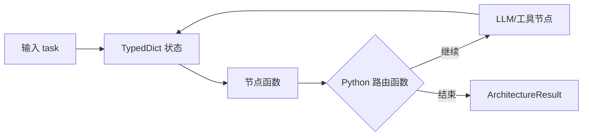
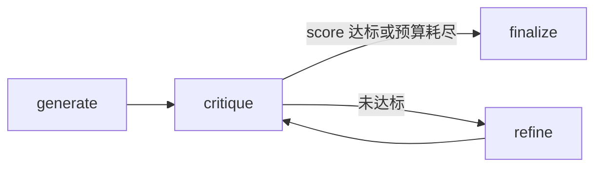
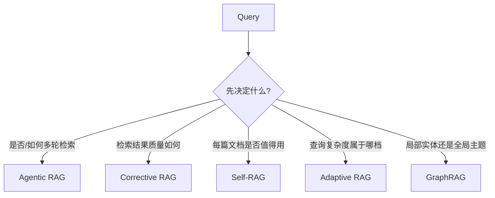
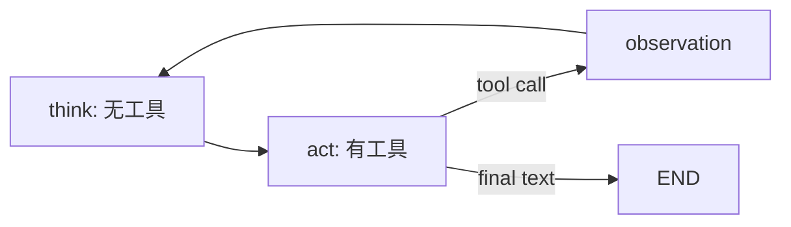
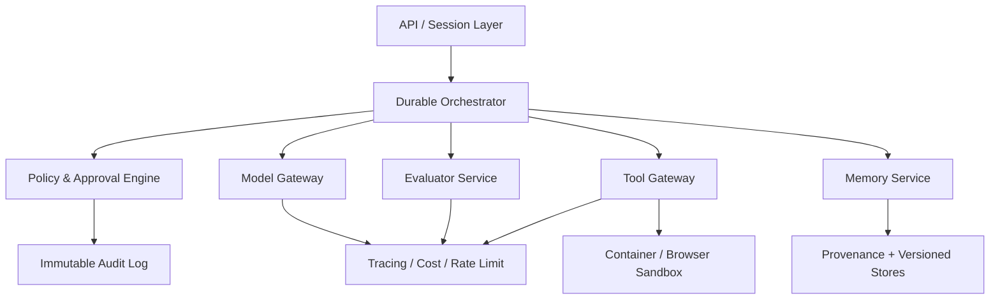
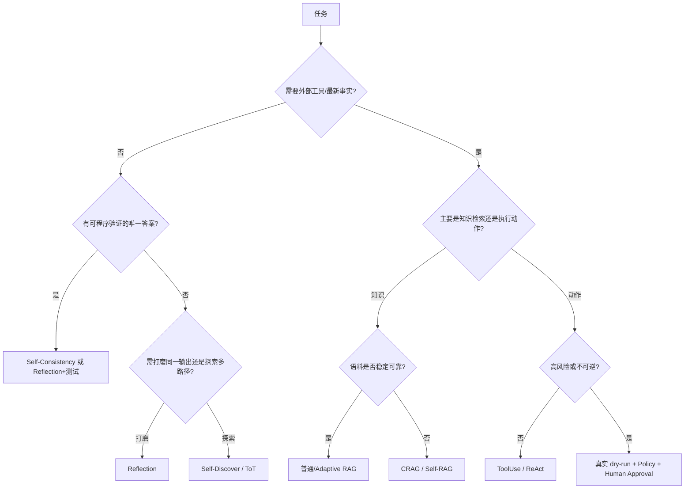

# 全智能体架构仓库深度技术说明

> 分析对象：[FareedKhan-dev/all-agentic-architectures](https://github.com/FareedKhan-dev/all-agentic-architectures)  
> 固定提交：[`cf9d620`](https://github.com/FareedKhan-dev/all-agentic-architectures/commit/cf9d620a8cc55d59589399c30f305e6dfaa428ec)  
> 对应版本：[v0.3.0](https://github.com/FareedKhan-dev/all-agentic-architectures/releases/tag/v0.3.0)  
> 分析日期：2026-09-09（Asia/Shanghai）

## 0. 阅读结论

这个仓库最准确的定位不是“35 个生产级 Agent 的集合”，而是：

> **一个基于 LangGraph、以统一 `run(task)` 接口封装经典 Agent 模式的可执行教学图谱，同时配有已执行 Notebook、最小公共基础设施和一套示范性 Benchmark。**

它的真正价值有三点：

1. **把不同论文里的控制流落成了可比较的状态机。** Reflection、ReAct、Tree of Thoughts、LATS、Self-RAG、GraphRAG、MemGPT 等不再只是论文图，而是具有状态、节点、条件边和运行结果的 Python 类。
2. **接口统一，便于横向比较与组合。** 所有架构都继承 `Architecture`，返回 `ArchitectureResult`，因此 `MetaController` 可以把其他架构当作黑盒路由目标，Notebook 也能使用统一的构建、运行、画图方式。
3. **主动讨论了 LLM 评分器失真问题。** 仓库提出所谓 deterministic-picker：让 LLM 输出布尔值、枚举和受约束字段，再由 Python 做最终路由、投票或加权。这一方向正确，而且比直接相信“8/10”更可审计。

但“production-grade”需要谨慎理解。当前版本更接近**高质量教学实现与研究原型**，还不是可以直接承载高风险生产流量的 Agent Runtime。主要原因包括：

- README 宣称 35 种架构，但公开 API 实际导出了 **36 个 `Architecture` 子类**；`ComputerUse` 与 `BrowserAgent` 都存在，只是共用编号 34 的 Notebook。
- 多数“多智能体”“多样本”过程是 Python `for` 循环顺序执行，并未真正并发。
- 大部分长期记忆只存在于当前 Python 实例内，默认没有可靠持久化、隔离、租户边界、淘汰策略和版本控制。
- 安全门多为演示性质的字符串规则；真实浏览器和代码执行都缺少生产级隔离。
- 单元测试的主要目标是“可导入、可实例化、可构图”和少量纯 Python 规则，真实 LLM 集成测试默认不进 CI。
- Benchmark 只有 17 个任务、42 次架构—任务尝试，多数架构只有 1 个样本；已提交原始结果又清空了绝大多数输出摘录与命中证据，因此不能据此宣称普遍优越性。

因此，正确的使用方式是：**把它当作 Agent 架构模式目录、LangGraph 教材、原型起点和架构选型实验台，而不是开箱即用的生产平台。**

---

## 1. 仓库快照与规模

截至分析日，GitHub 页面显示：

| 项目 | 状态 |
|---|---|
| 仓库 | `FareedKhan-dev/all-agentic-architectures` |
| 默认分支 | `main` |
| 固定提交 | `cf9d620a8cc55d59589399c30f305e6dfaa428ec` |
| 最新 Release | `v0.3.0`，发布于 2026-05-28 |
| License | MIT |
| Stars / Forks | 4,368 / 751（2026-09-09 查询值，会继续变化） |
| 主要语言 | Jupyter Notebook、Python |
| Python 要求 | `>=3.10` |
| 源码规模 | `architectures/*.py` 约 9,359 行；整个包约 4,003 个可执行语句（coverage 口径） |
| 教学 Notebook | 35 个，均保存了执行计数与输出 |
| 公开架构类 | 实际 36 个 |
| 本地测试 | 283 passed，37 skipped |
| 本地测试覆盖率 | 49%（语句+分支综合报告中的总覆盖率） |

目录可以抽象为六层：

```text
all-agentic-architectures/
├── src/agentic_architectures/
│   ├── architectures/     # 36 个架构类与统一基类
│   ├── llm/               # Provider / Embedding 工厂
│   ├── memory/            # 向量、图、情景、语义记忆
│   ├── tools/             # 搜索、文件、代码执行、模拟器
│   ├── evaluators/        # LLMJudge 与通用 benchmark 类型
│   ├── tracing/           # LangSmith 开关
│   └── ui/                # Rich 输出与 Mermaid 渲染
├── notebooks/             # 35 个已经执行的教学 Notebook
├── docs/                  # MkDocs 站点；含 Notebook 副本与横向教程
├── scripts/               # Notebook 构建与定制脚本
├── benchmarks/            # 17 个任务及榜单生成器
└── tests/                 # unit / integration / notebook integrity
```

### 1.1 一个容易忽略的计数差异

`notebooks/` 有 35 个编号文件，但 `architectures/__init__.py` 导出了 36 个具体架构类。差异来自编号 34：

- `ComputerUse`：在内存字典表示的模拟屏幕上执行 `screenshot/click/type/navigate/submit/answer`。
- `BrowserAgent`：通过 Playwright 控制真实 Chromium，执行 `navigate/extract_text/click/answer`。

文档站的“35 architectures”是按 Notebook 主题计数，Benchmark 页面则明确写了“36 architectures”。这不是致命问题，但说明项目的营销计数、教学单元和公共 API 并非同一统计口径。

---

## 2. 统一架构：把 Agent 模式变成状态图

### 2.1 `Architecture` 与 `ArchitectureResult`

所有模式继承同一个抽象基类：

```python
class Architecture(ABC):
    name: str
    description: str
    reference: str

    @abstractmethod
    def build(self) -> CompiledStateGraph: ...

    @abstractmethod
    def run(self, task: str, **kwargs) -> ArchitectureResult: ...
```

统一返回值为：

```python
@dataclass
class ArchitectureResult:
    output: str
    state: dict[str, Any]
    trace: list[dict[str, Any]]
    metadata: dict[str, Any]
```

这四个字段分别承担：

- `output`：给最终调用者的结果；
- `state`：压缩后的最终业务状态；
- `trace`：按阶段组织的可读轨迹；
- `metadata`：用于 Notebook 展示或 Benchmark 打分的统计信息。

这一抽象让仓库获得了真正的组合能力。例如 `MetaController` 只关心某个子架构是否支持 `run(task)`，不需要理解它内部究竟是树搜索、RAG 还是反思循环。

但接口也有明显限制：

- `task` 被固定为字符串，难以表达多模态输入、消息序列、附件和结构化上下文。
- `output` 固定为字符串，不适合流式输出、工具审批、事件订阅和 typed artifact。
- 没有标准化 `async run`、取消、超时、重试、检查点、会话 ID、租户 ID、token/cost 预算。
- `trace` 是各架构自行拼接的字典列表，字段并不统一，无法直接形成稳定的可观测性协议。

### 2.2 LangGraph 的核心角色

大多数架构都被实现为：



LangGraph 在这里主要提供四种能力：

1. **显式状态**：用 `TypedDict` 描述当前任务、草稿、检索结果、迭代次数、历史等。
2. **状态归并**：`Annotated[list, operator.add]` 或 `add_messages` 让节点返回的增量追加到历史，而不是覆盖。
3. **条件边**：路由函数把结构化判断映射到下一个节点。
4. **递归上限**：循环型架构用 `recursion_limit` 兜底，防止无限调用。

这个仓库最值得学习的地方，是它把“Prompt 技巧”提升为“控制流结构”。例如 ReAct 不只是要求模型输出 Thought，而是把 `think` 与 `act` 拆成两个节点；前者不给工具，因而在结构上保证每次动作前必有一次思考调用。

### 2.3 但并非所有类都真正由图驱动

`EpisodicSemanticAgent` 和 `GraphMemoryAgent` 的 `build()` 只返回一个 passthrough 单节点图，真实业务流程直接写在 `run()` 里。这维持了接口一致性，却削弱了图的可观察、可恢复和可检查点价值。

换句话说，仓库存在两种实现风格：

- **图是真正执行器**：Reflection、ReAct、Planning、LATS、Self-RAG 等。
- **图只是兼容外壳**：EpisodicSemanticAgent、GraphMemoryAgent。

若要生产化，应要求关键步骤都进入图，或者坦率地区分 `GraphArchitecture` 与普通 `Architecture`。

---

## 3. LLM、结构化输出与 Provider 抽象

### 3.1 Provider 工厂

`get_llm()` 是所有架构的统一模型入口。配置优先级是：显式参数 → `.env`/`Settings` → 默认值。默认 Provider 为 Nebius，默认模型为 `meta-llama/Llama-3.3-70B-Instruct`。

支持的 Provider 包括：Nebius、OpenAI、Anthropic、Groq、Ollama、Together、Fireworks、Mistral、Google、Hugging Face。仓库声明前九个支持工具调用，除 Ollama 外前八个支持可靠的 structured output；Hugging Face 两项均标为不支持。

这个抽象的优点是替换模型几乎不影响架构代码。问题在于能力矩阵是**静态 Provider 级布尔值**，而真实能力通常取决于：

- 具体模型版本；
- Provider 对 tool/JSON schema 的兼容层；
- schema 复杂度；
- 并发、上下文、速率限制；
- SDK 版本和模型端行为变化。

因此，生产系统更适合做“模型实例级 capability negotiation + 启动时探测”，而不是只按 Provider 名称判断。

### 3.2 结构化输出是控制面的类型系统

仓库大量使用 Pydantic `BaseModel` 与 `Literal`：

- `action: Literal["retrieve", "answer"]`
- `scope: Literal["local", "global"]`
- `verdict: Literal["pass", "fail"]`
- `requires_credentials: bool`
- `steps: list[str]`

这比解析自由文本可靠得多。LLM 在这里不是返回任意自然语言，而是在给定协议上填充字段；Python 再将字段转换成条件边。

不过 structured output 只保证**格式有效**，不保证**语义正确**。模型完全可能稳定地产生一个类型合法但事实错误的 `irreversibility=2` 或 `scope="local"`。因此它解决的是解析失败，不是判断可靠性。

### 3.3 `LLMJudge`

`LLMJudge` 封装了 schema + rubric + candidate + context，再调用 `with_structured_output`。它消除了 17 处左右重复的 judge 模板，适合教学与快速实验。

其局限是没有：

- 多评审模型或交叉评审；
- 盲化候选来源；
- 位置偏差控制；
- 评分校准集；
- 置信区间；
- judge 与 generator 模型隔离要求；
- prompt injection 防护。

因此，`LLMJudge` 应被理解为统一接口，不应被理解为可靠的质量裁判。

---

## 4. deterministic-picker：仓库的中心思想及其边界

仓库反复指出，指令微调模型直接给 1–5 或 1–10 分时容易出现“flat-band”：大量候选都集中在 4/5、8/10，导致搜索、剪枝和门控缺少区分度。

它提出的改法可以形式化为：

$$
z = f_{LLM}(x) = (z_1,z_2,\ldots,z_k), \qquad y = g_{Python}(z)
$$

其中：

- $f_{LLM}$ 不直接输出最终决策，而是输出若干布尔、枚举或受约束数值；
- $g_{Python}$ 是确定的路由、投票、阈值或加权函数；
- 最终决定 $y$ 不再由单个自由评分字段直接控制。

典型实现包括：

| 架构 | LLM 输出 | Python 最终组合 |
|---|---|---|
| Self-Consistency | 多个 `answer` | `Counter` 众数 |
| Debate | 每个 Agent 的最终答案 | 最后一轮众数 |
| Constitutional AI | 每条规则 `pass/fail` | `all(pass)` |
| Self-RAG | relevance/support/usefulness | keep/drop 布尔门 |
| CRAG | relevant/ambiguous/irrelevant | 按标签占比路由 |
| LATS | complete/progress/no-loop/confidence | 固定权重合成 0–10 奖励 |
| RLHF-style | 5 个质量特征 | 固定权重合成 0–10 分 |
| Reflexive Metacognitive | credentials/能力分/route | 凭证与低能力硬覆盖 |
| BrowserAgent | action/target/value | Python 规则准入 |

### 4.1 它真正解决了什么

- 最终组合规则可读、可测试、可审计。
- 将一个模糊总体判断拆成多个局部承诺，通常能增加输出方差。
- 业务规则可以硬编码，如“需要专业资质时一律升级”。
- 同一个 LLM 输出可以被不同策略重放，不必重新调用模型。

### 4.2 它没有解决什么

“Python 做决定”不等于“决定是客观的”。如果 Python 输入仍全部来自同一个 LLM，那么误差只是从一个总分迁移到了多个特征。

例如 DryRun 的硬规则是：

```python
approved = predicted_irreversibility < threshold
```

比较动作由 Python 执行，但 `predicted_irreversibility` 仍是 LLM 给出的 1–5 数字。若模型把危险删除误判为 2，所谓硬门不会触发。因此它更准确的名字应是：

> **deterministic composition over model-produced features**，即“对模型特征做确定性组合”。

要升级为真正可靠的决策门，应优先让特征来自可验证信号：AST/SQL parser、权限系统、allowlist、静态分析、真实 dry-run 输出、策略引擎、第二模型或人工审批。

---

## 5. 全部架构总览

下表按技术机制而非 Notebook 编号归类。成本是相对 LLM 调用量，默认参数下仅作数量级判断。

| 架构 | 核心控制流 | 决策信号 | 状态是否跨 `run()` | 相对成本 | 最适合的问题 |
|---|---|---|---|---|---|
| Reflection | 生成→批评→改写 | LLM 1–10 分 | 否 | 中 | 单份输出打磨 |
| Reflexion | 尝试→判定→反思→重试 | 可插拔 pass/fail | 是 | 中 | 从失败中迁移经验 |
| Chain of Verification | 基线→问题→独立核验→修订 | 逐项核验 | 否 | 中高 | 事实性回答降幻觉 |
| Self-Discover | 选择→适配→计划→求解 | 模块索引与结构 | 否 | 中 | 任务特定推理结构 |
| Constitutional AI | 生成→逐规则批评→修订 | 每条规则 pass/fail | 否 | 中 | 书面政策一致性 |
| Self-Consistency | N 次采样→多数投票 | 答案众数 | 否 | N 倍 | 有唯一短答案的推理题 |
| Tree of Thoughts | 分支→评分→束搜索 | LLM 1–5 分 | 否 | 高 | 需要保留多条路径 |
| LATS | UCB 选择→扩展→评估→回传 | 合成奖励+UCB1 | 否 | 很高 | 可搜索的规划/推理空间 |
| Mental Loop | 候选→模拟→选择→解释 | 分数或外部 scoring_fn | 否 | 中高 | 行动前结果模拟 |
| Ensemble | 多视角独立回答→聚合 | 合成/投票/自信度 | 否 | 中高 | 多角度判断 |
| Agentic RAG | 决定→检索→再决定 | retrieve/answer | 否 | 可变 | 不确定检索次数 |
| Corrective RAG | 检索→文档评级→纠偏 | 相关性标签比例 | 否 | 中 | 语料质量不稳定 |
| Self-RAG | 按需检索→逐文档反思→回答 | 三类 reflection token | 否 | 中高 | 强调证据筛选 |
| Adaptive RAG | 先分类→选择 RAG 深度 | 三档复杂度 | 否 | 低到中 | 混合查询流量 |
| GraphRAG | 建图/社区摘要→local/global | 问题范围 | 构造后保留 | 摄入高、查询中 | 全局主题与实体关系 |
| Episodic+Semantic | 回忆→回答→抽事实→记录 | 相似度+实体匹配 | 是 | 中 | 个人助理连续性 |
| Graph Memory | 文本抽三元组→图遍历问答 | 实体字符串匹配 | 是 | 中 | 关系型事实问答 |
| MemGPT | 写归档/搜归档/回答循环 | 三类动作 | 是 | 可变 | 上下文分层管理 |
| Voyager | 检索技能→复用或新建→执行 | reuse/write_new | 是 | 中 | 可复用计算技能 |
| Agent Workflow Memory | 检索流程→作答→提炼流程 | 向量近邻 | 是 | 中 | 迁移解题策略 |
| Tool Use | 模型→工具→模型循环 | tool_calls 是否存在 | 否 | 可变 | 简单工具增强 |
| ReAct | 思考→动作→工具循环 | tool_calls 是否存在 | 否 | ToolUse 约 2 倍模型调用 | 显式行动推理 |
| Planning | 规划→逐步执行→重规划 | 剩余 plan/is_done | 否 | 高 | 可预先分解的长任务 |
| PEV | 规划→执行→逐步验证→重试 | is_satisfactory | 否 | 很高 | 每步必须可核验的任务 |
| SWEAgent | 决策→文件/检查动作循环 | 动作枚举 | 工作目录保留 | 可变 | 小型代码修复演示 |
| ComputerUse | 决策→安全门→模拟执行 | Python 字符串规则 | 单次 screen | 可变 | 无 OS 风险的交互教学 |
| BrowserAgent | 决策→真实浏览器动作 | Python 字符串规则 | 浏览器实例保留 | 可变 | 简单网页导航演示 |
| DryRun | 提议→模拟→审批→模拟执行 | 阈值+LLM 审批 | 否 | 中 | 事前风险说明 |
| MultiAgent | 监督者→专家→写作者 | 动态 Literal 路由 | 否 | 高 | 固定分工的综合报告 |
| Blackboard | 全员竞标→赢家贡献→循环 | 自报意愿与置信度 | 否 | 很高 | 开放式多视角协作 |
| Debate | 多轮互看答案→最终投票 | 答案众数 | 否 | N×K | 可从反驳受益的推理 |
| STORM | 视角→问题→检索→提纲→文章 | 固定流水线 | 否 | 很高 | 研究型长文生成 |
| MetaController | 路由→执行子架构 | 架构枚举 | 子架构可保留 | 子架构成本+1 | 混合任务入口 |
| RLHF Self-Improvement | 生成→编辑→改写→归档 | Python 合成质量分 | 是 | 中 | 保存正例的写作改进 |
| Cellular Automata | 每格局部更新→同步迭代 | allowed-state clamp | 单次 grid | H×W×T | LLM 驱动的群体仿真 |
| Reflexive Metacognitive | 能力分类→回答/工具/部分/升级 | Python 规则覆盖 | 否 | 低 | 高风险答复路由 |

为便于从文档名称直接跳回代码，名称不完全同形的实现类对应关系如下：Adaptive RAG → `AdaptiveRAG`，Agent Workflow Memory → `AgentWorkflowMemory`，Cellular Automata → `CellularAutomata`，Chain of Verification → `ChainOfVerification`，Corrective RAG → `CorrectiveRAG`，RLHF Self-Improvement → `RLHFSelfImprovement`，Reflexive Metacognitive → `ReflexiveMetacognitive`，Self-Consistency → `SelfConsistency`，Self-Discover → `SelfDiscover`，Self-RAG → `SelfRAG`，Tree of Thoughts → `TreeOfThoughts`。其余名称与类名仅有空格差异或完全一致。以 `Architecture` 为直接父类自动扫描源码，共得到 **36 个具体实现类**。

---

## 6. 推理、反思与搜索架构

### 6.1 Reflection：单轨迭代优化

状态流：



实现维护 `draft`、`critique`、`score`、`iteration` 与 `history`。每次 `refine` 使用上一轮草稿和批评重新生成，而不是局部 patch。

优点是简单、透明，适合文章、代码解释、格式化输出等“同一候选不断变好”的任务。其根本限制是搜索空间始终围绕第一份草稿展开；若初始问题分解、事实基础或解题方向错误，批评者与生成者又是同一模型，循环很容易形成自我确认。

此外，它仍直接用 LLM 的 1–10 `score` 控制停止，因此恰好保留了仓库自己批评的 flat-band 风险。对严格任务，应改用可执行测试或特征门控。

### 6.2 Reflexion：把失败经验变成可检索记忆

Reflexion 与 Reflection 的区别不是多一个“反思 Prompt”，而是引入跨任务记忆：失败后生成 `root_cause`、`correction`、`reflection`，将反思文本存入 `EpisodicMemory`；新任务开始时按语义相似度召回过去教训。

默认 evaluator 是俳句的纯 Python 检查器，检查三行、5-7-5 音节与必需词。这个默认值非常适合 Notebook 展示，却意味着类在一般任务上并不具备通用成功判定器。调用者必须注入领域 evaluator，否则“成功”语义和任务不匹配。

更深层的问题是经验记忆会产生三类污染：

1. 失败原因由 LLM 归因，可能归错；
2. 相似度召回不等于因果可迁移；
3. 反思没有版本、过期与质量权重。

生产实现应保存 `task fingerprint + evaluator evidence + environment version + reflection`，而不只是自然语言教训。

### 6.3 Chain of Verification：分解核验以降低一致性偏差

CoVe 将流程拆为 baseline、plan verification questions、独立回答问题、revise。关键思想是：不要让模型直接在原答案旁边说“看起来对”，而要针对可疑声明生成独立问题，再用核验答案重写。

它适合含多个事实声明的回答，但仓库实现没有真正外部检索；核验仍使用相同模型的参数知识。因此它主要降低“顺着初稿继续编”的一致性偏差，不能解决模型根本不知道事实的问题。Benchmark 中它在算术题和 Ursula K. Le Guin 事实陷阱上均失败，正说明自问自答不是事实源。

### 6.4 Self-Discover：先组合推理程序，再执行

四阶段为 SELECT → ADAPT → IMPLEMENT → SOLVE：

1. 从 16 个通用推理模块中选择 3–6 个；
2. 将通用模块改写为任务特定指令；
3. 组织成 2–8 步执行计划；
4. 按计划生成 step outputs 与 final answer。

这可以理解为让模型在推理前先合成一个轻量“认知程序”。其强项是异构任务适配；弱项是四个阶段全由同一模型生成，没有外部验证，且成本至少四次结构化调用。模块选择错误会被后续阶段放大。

### 6.5 Constitutional AI：逐条规则判定

默认 constitution 包含观点克制、事实引用/hedging、200 词限制与有害指令禁止。模型对每条规则输出 `pass/fail`，Python 用 `all()` 合成 `all_passed`，失败则改写。

设计上的严重问题是异常处理：批评节点若 structured output 失败，会设置 `all_passed=True`，即 **fail-open**。这对于普通文风规范或许能接受，对于安全政策不可接受。安全用途必须 fail-closed、回退到第二检查器或进入人工审批。

同时，默认规则把风格、事实性与安全混成同一 constitution，实际部署应支持规则优先级、不可覆盖规则、地域/租户策略、审计版本和冲突解析。

### 6.6 Self-Consistency：答案空间上的 Monte Carlo 投票

它以非零温度采样 N 个 `(reasoning, answer)`，然后把答案小写、去空白与句末句点，再用 `Counter` 取众数。若单次正确概率为 $p>0.5$ 且样本近似独立，增加 N 能降低多数错误概率。

现实中样本并不独立：同一模型、同一 Prompt、同一训练偏差会产生强相关错误。仓库使用顺序调用，也没有 seed、模型多样性或语义归一化，因此：

- `1`、`1.0`、`one` 会被视为不同答案；
- 自由文本任务几乎无法形成字面众数；
- 模型系统性误解时，多数投票会放大错误。

它最适合数学、选择题和短实体答案，不适合长文本。

### 6.7 Tree of Thoughts：束搜索，不是真正通用树搜索

ToT 为每个 frontier 节点生成 `branching` 个候选，用 LLM 给 1–5 分，保留当前深度 top `beam_width`，到 `max_depth` 后沿最佳叶子路径合成答案。

近似调用量为：

$$
C \approx d \times b \times w + 1
$$

其中 $d$ 为深度，$b$ 为分支数，$w$ 为束宽，最后 `+1` 是答案合成；首层宽度略有不同。

它能避免单条 CoT 的早期承诺，但仓库实现依赖同一 LLM 的数值评分，且没有去重、状态等价判断、可执行环境反馈或回溯恢复。README 对 flat-band 的批评同样适用于本实现。

### 6.8 LATS：MCTS 风格，而非完整 MCTS

LATS 增加 `_Node` 的 parent、children、value、visits，采用：

$$
UCB1_i = \bar{v}_i + c\sqrt{\frac{\ln N}{n_i}}
$$

每轮从根沿 UCB1 选择叶子，扩展候选，评估每个新子节点，再把**本轮最佳子节点奖励**沿祖先回传。

奖励为：

$$
r = 5I_{complete} + 2I_{progress} + I_{no\_loop} + w(confidence)
$$

其中置信度高/中/低分别加 2/1/0。

它是很好的 MCTS 教学近似，但不等同于论文中的完整 Language Agent Tree Search：

- 没有真实环境动作与 observation；
- simulation/rollout 被简化为一次 LLM 叶子评价；
- backup 使用 sibling 中最大值，容易乐观偏置；
- `avoids_loops` 仍由 LLM 判断，没有状态哈希；
- 找到 `is_complete=True` 且 value≥8 即提前停止，可能接受“自信但错误”的伪完成。

### 6.9 Mental Loop：单层世界模型

它生成 K 个行动，逐一模拟后选择最高分，再让 LLM解释。与 ToT/LATS 的主要区别是平坦、行动导向、没有递归搜索。

若调用者提供 `scoring_fn(predicted_metric)`，Python 会覆盖 LLM 的 `overall_score`，这是仓库中更合理的扩展点：业务方可以把成本、延迟、风险等可测量指标变成确定性效用函数。没有 `scoring_fn` 时，它仍退化为 LLM 自评。

### 6.10 Ensemble 与 Debate：独立性和信息传播的权衡

Ensemble 的默认三个 voter 是务实、批判和创新视角，支持：

- `llm_synth`：让聚合模型合成长答案；
- `majority_vote`：对分类答案做 Python 投票；
- `highest_confidence`：取自报置信度最高者，代码明确标注该模式不可靠。

Debate 则让 N 个 Agent 在 K 轮中看到上一轮答案与批评，最后投票。

两者的关键权衡是：

- Ensemble 保留错误独立性，但缺少互相纠错；
- Debate 允许证据传播，也会产生从众和错误级联。

仓库的 Sally 姐妹逻辑题中，Debate 与 Ensemble 都失败，提示“更多角色”并不自动带来 epistemic diversity。要提高可靠性，需要异构模型、不同证据源、匿名/盲投、先独立后讨论、反共识角色及平局处理。

---

## 7. RAG 家族：五种不同的“何时检索、如何相信”

### 7.1 五类 RAG 的本质差异



### 7.2 Agentic RAG

模型每轮输出 `retrieve` 或 `answer`。选择检索时必须提供 query，检索完成后回到 decide，直到回答或达到 `max_iterations`。

优势是检索次数与 query 可动态变化。问题是没有查询去重、证据充分度的外部判断、检索失败重试和答案引用约束；最后一轮仅通过 Prompt 强制回答。structured output 出错时直接返回包含错误文本的 answer，是可用性优先而非真实性优先。

### 7.3 Corrective RAG（CRAG）

先向量检索 top-k，再逐文档标记 relevant/ambiguous/irrelevant。Python 根据相关文档比例决定：

- `use_retrieved`
- `use_web`
- `use_mixed`

这是“检索后纠偏”。若 web_search_fn 未注入，所谓 web fallback 会得到空上下文，最终只能回答“不足”。实现还把每个文档截断到 500 字符做相关性判断，可能丢失关键段落。

### 7.4 Self-RAG

先判断是否需要检索；对每个文档产生 `is_relevant`、`is_supported`、`is_useful` 三类 reflection tokens；Python 只保留 relevant 且 supported 的文档。

值得注意的是 `is_useful` 被记录在 metadata，却**不参与 keep/drop**。因此当前实现的真实门控是两维而非三维。若所有文档失败，系统选择承认无足够上下文，这比强行回答更安全。

论文 Self-RAG 的核心还包括模型训练出的特殊 reflection tokens 与生成过程内控制；本仓库是 Prompt + structured output 的推理时近似，不应视为论文模型的等价复现。

### 7.5 Adaptive RAG

分类器将问题分成 `no_retrieval`、`single_step`、`multi_step`。单步路径做一次向量检索；多步路径固定做两次检索，第二个 query 由第一次上下文生成。

构造参数中存在 `multi_step_max_iterations`，但当前 `_multi_step_rag` 并未使用它，实际始终是两跳。这是接口与实现不一致。该模式适合流量路由，但应增加分类器评估集和错路由回退机制。

### 7.6 GraphRAG

构造对象时，LLM 从每篇文档抽取三元组，写入 `SemanticMemory`；随后 NetworkX 对无向化图执行 greedy modularity community detection，并让 LLM 为每个社区生成摘要。查询时先判定：

- local：围绕目标实体做两跳遍历；
- global：拼接社区摘要回答。

这是对 Microsoft GraphRAG 的教学化简：只有一层社区，没有 claim/covariate、实体消歧、层级社区、map-reduce global search、增量索引和证据引用。并且代码直接尝试读取底层 NetworkX 图；Neo4j wrapper 的内部对象并不一定具有 NetworkX 的 `nodes/is_directed` 接口，所以“后端无感”在 community build 处并不完整。

### 7.7 向量与图存储层

`VectorMemory` 支持 FAISS、Chroma、Qdrant；默认 FAISS。空 FAISS 通过先加 sentinel 再删除来初始化。`SemanticMemory` 支持 NetworkX 和 Neo4j；NetworkX 后端只实现了仓库需要的极小 Cypher 子集。

这些抽象适合示例，但生产上必须补齐：

- 持久化与恢复；
- namespace/tenant 隔离；
- embedding 版本与重建；
- 文档 ID、来源、chunk locator；
- 删除与 GDPR/合规；
- 检索分数、hybrid search、reranker；
- 图实体归一化、别名、冲突和时间属性。

---

## 8. 记忆架构：到底在记什么

仓库最好的横向洞察之一，是“Agent memory”不是单一组件，而是至少三个正交选择：

1. 原子单元：对话、事实、反思、正例、代码技能、工作流；
2. 检索键：向量相似度、实体邻域、FIFO、任务类型；
3. 生命周期：单次任务、对象实例、磁盘持久化。

### 8.1 Episodic + Semantic

每次调用依次：召回相似 episode 与实体事实 → 生成回答 → 从用户和回答抽取新三元组 → 保存整轮对话。

问题在于它会从**模型自己的回答**中抽取事实并写回记忆，若回答产生幻觉，就可能形成自我污染与后续强化。应只从用户明确声明、可信工具证据或经过验证的回答中写入，并记录 provenance。

### 8.2 Graph Memory

它先显式 `ingest(text)` 抽取图，再在 `run(query)` 中通过查询字符串包含哪些图实体来选择起点，做 N-hop 遍历并回答。

实体匹配只是小写字符串包含，缺少 NER、别名、拼写纠错和向量实体链接。短问题若匹配不到，会退回图中前 20 个实体；这在小样本 Notebook 可用，在大图上会产生任意上下文。

### 8.3 MemGPT

对象维护两个层级：

- `context_tier`：固定长度列表，FIFO 淘汰；
- `archival`：向量存储，被淘汰内容自动写入。

每次任务让模型选择写归档、搜归档或回答。它演示了“上下文像 RAM、归档像磁盘”的核心比喻，但与真实 MemGPT/Letta 相比缺少系统消息区、工作记忆编辑、token 精确预算、分页协议、持久服务和多会话一致性。

此外，“write_to_archival”同时写 archival 与 context；以后 context 淘汰时同一事实可能再次进入 archival，存在重复。

### 8.4 Voyager

每个技能是 `{name, description, code, example_invocation}`。新任务按 description 向量检索 top-1，LLM 决定 reuse 或 write_new，然后在 `python -I -c` 子进程执行代码，5 秒超时。

`-I` 和独立进程只隔离 Python import/path 环境与主进程崩溃，不是安全沙箱。生成代码仍可访问文件、网络、CPU、内存和子进程。仓库 docstring 说“bad skill can't corrupt the host process”只在进程内状态层面成立，不代表主机安全。

另外，新技能在执行成功前就加入 library；失败代码会污染技能库。更可靠的流程应是：生成 → 静态检查 → 容器沙箱测试 → 属性测试/验收 → 版本化入库。

### 8.5 Agent Workflow Memory（AWM）

它保存的不是答案或代码，而是高层 workflow recipe。新任务先 top-1 检索流程，照流程作答，再从本次 task+answer 提炼一个新流程。

当前实现无论答案是否正确都会写入流程库，而且同类流程不做去重、合并或质量排序。这解释了 Benchmark 中它对简单事实记忆测试失败：AWM 本来就不是 factual memory，却被放到了 recall 测试中。

### 8.6 RLHF-style Self-Improvement

这个名称容易误导。代码自己也承认它不是 Reinforcement Learning from Human Feedback；没有人类偏好数据、奖励模型、策略优化或 RL。它实际上是：Self-Refine + LLM 编辑特征 + Python 加权 + 正例归档。

权重为：on brief 4 分、字数范围 2 分、具体意象 2 分、避免陈词 1 分、吸引力 1 分。评分达到阈值就把输出放入内存 archive，后续取最近三条作为 few-shot 正例。

这是有用的“自举式 exemplar memory”，但固定写作特征并不适用于代码、事实问答等任务；archive 也没有多样性与污染控制。

---

## 9. 工具、规划与行动架构

### 9.1 Tool Use

最小工具循环：LLM 绑定工具 → 若产生 tool_calls 则进入 `ToolNode` → 观察结果 → 再次调用 LLM；无 tool_calls 时结束。它通过统计历史 tool call 数限制预算，超预算后使用不绑定工具的模型强制作答。

这是一种实用的 runaway 保护，但 `max_rounds` 实际统计的是 tool call 数，而不是 Agent 轮数；一次消息调用多个工具会快速耗尽预算。工具异常、幂等性、审批与 side-effect 分类交给 ToolNode/工具本身，并未形成统一策略。

### 9.2 ReAct

仓库拒绝把“Thought + Action”放在同一 AIMessage，原因是许多模型会只发 tool call、content 为空，从而退化为普通 Tool Use。它强制每轮：



优点是轨迹清晰；代价是每轮多一次 LLM 调用。它也没有真正按 `max_rounds` 检查轮数，主要依赖 LangGraph `recursion_limit`，不像 ToolUse 那样在模型层解绑工具。因此 max_rounds 更像递归预算换算参数。

### 9.3 Planning

规划器生成 1–7 个步骤，每步交给一个内部 `ToolUse` 执行；计划耗尽后 replanner 判断结束或追加步骤。过去步骤的结果会被压缩到 300–400 字符后加入上下文。

其强点是子架构组合：Planning 并未重新实现工具循环。问题包括：

- 初始错误计划会约束后续执行；
- 每步 ToolUse 有独立上下文，靠字符串传递历史；
- 没有 DAG 依赖、并行步骤与 artifact store；
- `n_max=12` 是注释中的估算，实际 plan schema 没有严格 max_length，重规划也可能追加任意数量步骤；
- 源码中存在 `self.llm.bind_tools(tools) if False else self.llm` 这种遗留表达式，虽不影响运行，却反映清理不足。

### 9.4 PEV：Plan-Execute-Verify

每一步执行后由 verifier 判定 `is_satisfactory`。失败时把具体批评附到同一步再执行；超过重试预算则记为 `fail-accepted` 并继续，最终答案必须披露低置信步骤。

它比 Planning 多了一条反馈闭环，但 verifier 仍是 LLM，且最终会强制接受失败步骤。这适合“尽量完成”的任务，不适合原子步骤失败就必须停止的部署、支付、迁移场景。生产版本应让每个 step 声明 failure policy：abort、retry、fallback、compensate 或 human review。

### 9.5 SWEAgent

动作包括 list/read/write/run_check/answer，路径经 `Path.resolve()` 与 `relative_to(working_dir)` 阻止 `../` 逃逸，`run_check` 使用 Python 子进程执行目标文件。

它是“仓库内小文件修复”的最小循环，不是完整 SWE-Agent：没有 shell、搜索、patch diff、git、测试选择、lint、依赖安装、容器快照、回滚和长轨迹压缩。`working_dir.mkdir()` 会主动创建目录，write 直接覆盖文件；真实使用必须加版本控制与审批。

### 9.6 ComputerUse 与 BrowserAgent

`ComputerUse` 是模拟器：屏幕是一个 dict，click 只改变 `focused`，type 写入 `fields`，submit 设置布尔值。它适合展示安全节点插入位置，不与真实 UI 交互。

`BrowserAgent` 才会启动 Playwright Chromium。它只读取 body 文本，click 通过可见文字模糊匹配第一个元素，没有 DOM/ARIA 结构、截图、iframe、多标签页、下载、弹窗或登录状态管理。

BrowserAgent 的安全检查只包括：

- navigate 必须是 HTTP(S)；
- target 字符串不能包含 blocked domain；
- answer 文本不能包含敏感关键词。

这不足以防止子域欺骗、URL 重定向、DNS rebinding、内网 SSRF、恶意页面 prompt injection、点击副作用和敏感信息读取。它也只在 `answer` 检查敏感词，不对提取到的页面文本做数据分类。真实部署必须由浏览器隔离层、网络策略、Origin allowlist、DOM 操作审批和凭证代理共同保护。

### 9.7 DryRun

流程是提议具体 action → LLM 预测影响 → Python 阈值或 LLM 审批 → mock execute/skip。仓库故意不执行真实副作用，因此它是安全模式演示，不是事务执行器。

真正的 dry-run 应调用目标系统的原生预演能力，例如 Terraform plan、SQL EXPLAIN/事务回滚、Kubernetes server-side dry-run、Git diff，而不是主要依靠模型想象结果。

---

## 10. 多智能体、路由与研究流水线

### 10.1 MultiAgent：中心化监督者

默认角色为 news、technical、financial。Supervisor 使用动态 Pydantic `Literal` 选择尚未执行的 specialist、writer 或 FINISH；每个 specialist 内部是带独立 system prompt 的 ToolUse；writer 最终合成。

值得注意的是：

- specialist 顺序执行，不是并发；
- 全部角色默认共享同一个 LLM 与同一组工具；
- supervisor 规则要求每个 specialist 都运行一次，因此它并没有真正做“按需选择专家”，更多是在决定顺序；
- 角色差异主要来自 Prompt，而非模型、权限、记忆或工具隔离。

这种结构适合固定栏目式报告，不适合依赖动态图、任务抢占或大规模团队。

### 10.2 Blackboard：分布式竞标的表象与中心化选择

每轮所有 knowledge source 读取共享 blackboard，自报 `will_contribute`、confidence 与预览；Python 选置信度最高且超过阈值者写入，再进入下一轮。

它没有 supervisor LLM，但仍有中心化的 Python winner selection。每轮成本约为 Agent 数量个 bid 调用 + 1 个贡献调用，最终再合成，因此 Benchmark 中一次写作任务耗时 302.3 秒并不意外。

风险是置信度由模型自报且同模型同尺度，容易出现“过度自信角色垄断”。代码用 Prompt 鼓励未发言者优先，但没有真正的公平调度或去重检测。

### 10.3 Debate

Debate 的价值不在于简单多数，而在于让 Agent 看见他人的上一轮理由后更新。但当前 trace 只保存答案列表，虽然完整 rounds 在 metadata 中，错误传播分析仍需额外工具。

更稳健的协议可采用：独立首轮 → 隐藏身份的论证交换 → 明确列出证据 → 最终私密投票 → 第三方裁判，并保留少数意见。

### 10.4 STORM

STORM 固定五阶段：产生视角、每视角提问、回答问题、生成提纲、逐节写文。若传入 web_search_fn，问题答案可以基于 web snippets；否则直接使用模型参数知识。

与论文级 STORM 相比，本实现没有模拟专家访谈、多轮问答、引用图谱与可靠 citation mapping。最终文章段落不会系统地把来源 URL 映射到具体声明。因此它更接近“多视角研究写作流水线”。

### 10.5 MetaController

默认 roster 只有 ToolUse、ReAct、Planning、Reflection。路由器输出受动态 Literal 约束，再直接执行选中的子架构。

它展示了统一接口的最大收益，但路由描述来自全局静态 `ARCHITECTURE_DESCRIPTIONS`。若用户传入自定义 roster 而未同步描述，新架构会显示 `(no description)`。此外没有路由置信度、fallback、并行 shadow evaluation 或基于历史效果的学习。

---

## 11. 专项架构

### 11.1 Cellular Automata

H×W 网格每一步对每个 cell 调一次 LLM，读取自身与 von Neumann 四邻域，输出 next_state；若输出不在 allowed_states，Python 保持原状态。所有 cell 都从旧 grid 读取、写入 new_grid，因此更新是同步的。

调用复杂度为：

$$
N_{calls}=H\times W\times T
$$

4×4、3 步就是 48 次模型调用。当前实现顺序执行，不批量、不并发、不缓存相同局部邻域。对于确定规则，LLM 远不如普通转移函数可靠和便宜；其价值只在规则含自然语言语义、角色心理或模糊局部决策时。

Benchmark 给它的 prompt 是自然语言描述的 3×3 grid，而 `run()` 实际要求 `|` 分隔、换行分行，导致 `ValueError: Initial grid has 5 rows, expected 3`。同时 Benchmark 检查 `steps_completed`，实现 metadata 提供的是 `steps_run`。这是测试契约未对齐的明确例子。

### 11.2 Reflexive Metacognitive

模型根据 self-model 判断能力匹配、是否需实时数据、是否需专业资质，再路由 answer/use_tool/partial/escalate。Python 规定 `requires_credentials=True` 或 capability≤2 必须 escalate。

优点是把“我是否应该答”变成显式控制面。局限是 `use_tool` 只返回建议文本，并没有实际调用 ToolUse；self-model 还硬编码“训练截止至多两年前”，会随时间和模型失真。高风险系统应以产品政策和真实工具能力注册表代替自述 Prompt。

---

## 12. 测试、Benchmark 与证据强度

### 12.1 本次复现结果

在临时 clone 上使用 `uv` 创建隔离环境，安装 test、Nebius、FAISS、Tavily、NetworkX extras，并设置 CI 同类 dummy key 后运行：

```bash
uv run pytest -q --cov=src/agentic_architectures --cov-report=term-missing
```

结果：

```text
283 passed, 37 skipped, 1 warning in 3.48s
TOTAL coverage: 49%
```

37 个跳过项全部是真实 LLM/API integration tests，需要 `RUN_INTEGRATION=1`。因此“283 passing tests”主要说明本地结构、构图与纯 Python helper 在当前依赖环境可运行，不代表 36 个架构已在 CI 中端到端访问真实模型并验证质量。

### 12.2 单元测试实际覆盖什么

主要包括：

- `ArchitectureResult` 默认值与 ABC 约束；
- 36 个公共架构类可导入、可用 mock LLM 实例化、可 `build()`；
- Notebook 结构与执行状态；
- deterministic helper，如俳句检查、RLHF 合成分、LATS reward；
- BrowserAgent blocked-domain 与敏感文本规则；
- SWEAgent 路径逃逸；
- Voyager 子进程执行与超时。

覆盖率报告显示不少关键运行路径只有 33%–59% 左右，工具、图后端、真实浏览器、异常回退与整体 benchmark harness 覆盖更低或为零。

### 12.3 17-task Benchmark 应如何解读

已提交榜单是 36 个架构、17 个任务、42 次尝试，33/42 通过。这里不能直接计算“架构总体准确率”，原因是：

1. 不是完整 36×17 矩阵，而是人为指定适用架构；
2. 绝大多数架构只有 1 个任务；
3. scoring 多为 substring contains/excludes；
4. 安全和工具任务主要检查 metadata 计数；
5. 没有多 seed、多模型、置信区间与统计显著性；
6. 不同任务的延迟与成本不可直接横比；
7. 已提交 `benchmarks_raw.json` 中 42 条记录有 41 条 `output_excerpt` 为空，33 条标为 correct 的记录 `contains_hits` 也为空；其中有些任务原本就不要求关键词，但原始文件仍不足以独立复核大量关键字型判定；
8. 运行脚本中存在无效参数：Ensemble 使用 `aggregation`，但构造函数读取 `aggregator_mode`；MentalLoop 传 `branching/max_steps`，但类读取 `n_candidates`，多余参数被基类 `**kwargs` 静默保存而没有效果。

Benchmark 最有价值的不是 78% 这个总数，而是暴露 pattern-fit：

- Reflection 在三个不同任务上 3/3，说明简单迭代可能比复杂搜索更稳；
- Debate/Ensemble 在 trick logic 上共同失败，说明群体会共享偏差；
- Graph Memory 在 multi-hop RAG 失败，说明字符串实体匹配不足；
- Reflexion/AWM 在事实 recall 上失败，说明“记忆类型”与任务不匹配；
- Cellular Automata 失败来自输入契约，而不是模型推理。

### 12.4 一个更可信的评测设计

建议把 Benchmark 升级为：

- 每个架构族至少 30–100 个任务；
- 每个 task×architecture 多个 seed；
- 记录模型、Provider、temperature、Prompt hash、依赖锁文件与运行时间；
- 区分 correctness、cost、latency、tool calls、tokens、safety violations；
- 对可确定任务使用程序化 evaluator；
- 对开放任务使用盲化多评审与人工抽检；
- 输出 bootstrap confidence interval；
- 保存不可变 run artifact，而不是只保存榜单；
- 评估“架构相对单次模型调用的增益”，避免把强模型能力错归因于复杂控制流。

---

## 13. 工程质量与生产化审查

### 13.1 做得好的部分

- 统一 ABC 与返回类型，架构可替换、可组合。
- Pydantic structured output 广泛使用，避免脆弱文本解析。
- 循环大多有显式 iteration 或 recursion limit。
- 可选依赖按 Provider、向量库、图库拆分。
- Notebook 已保存真实输出，理论、源码和观察并置。
- 关键纯 Python 规则有测试。
- SWEAgent 做了路径归一化，BrowserAgent 有最小 URL/sensitive gate。
- 文档承认部分模式的失败，而不是只展示成功案例。

### 13.2 主要缺口

#### 并发与异步

Self-Consistency、Ensemble、Debate、Blackboard、STORM、Cellular Automata 都存在天然并行阶段，但目前大多顺序调用。生产版本需要 async graph、并发上限、速率限制、取消与部分失败收敛。

#### 状态持久化

没有 LangGraph checkpointer；长任务中断不能恢复。多数 memory 是对象字段，进程退出即丢失。需要 durable store、schema migration、任务 ID 与幂等执行。

#### 安全

`python_repl_tool` fallback 直接 `exec` 且带完整 builtins；Voyager 子进程可访问主机；SWEAgent `run_check` 执行仓库代码；BrowserAgent 网络边界薄弱。这些都不能直接暴露给不可信输入。

#### Prompt injection 与数据污染

网页、检索文档、历史记忆和技能代码都被直接拼入 Prompt，没有 trust label、指令/数据分离、内容清洗与 provenance enforcement。

#### 错误语义不统一

有些路径 fail-open（ConstitutionalAI），有些把异常写成 answer（AgenticRAG），有些静默跳过（GraphRAG ingest），有些返回错误文本继续合成（STORM）。生产系统必须定义统一错误分类与策略。

#### 成本与可观测性

metadata 有调用阶段统计，但没有 token、美元成本、cache hit、provider latency、重试次数和 trace ID。LangSmith 只是环境开关，并未形成统一 span schema。

#### 依赖治理

依赖仅设下界，复现会随时间漂移。本次 `uv sync` 实际解析到 LangChain 1.4、LangGraph 1.2 等远高于声明下界的版本，并出现 `langchain-community` FAISS deprecation warning。应提交 lockfile、设兼容上界并做升级矩阵。

### 13.3 建议的生产级分层



迁移优先级建议：

1. 加 lockfile、真实集成 CI 与任务级超时；
2. 将所有副作用工具放入强隔离 gateway；
3. 增加 checkpoint、幂等键、任务取消与恢复；
4. 为 memory 与 RAG 增加 provenance、tenant 与生命周期；
5. 把 deterministic picker 的输入尽量替换为真实可验证信号；
6. 建立覆盖正确性、成本和风险的统计评测集；
7. 最后才考虑并行扩展与复杂架构自动路由。

---

## 14. 架构选型指南

### 14.1 不要默认使用最复杂的架构

可按以下顺序选择：



### 14.2 各模式适用边界

- **Reflection**：默认首选的质量增强器；先验证是否真有增益。
- **Self-Consistency**：短答案、可归一化、采样错误相对独立。
- **ToT/LATS**：只有任务存在真实分支、评价信号能区分候选时才值得。
- **Planning/PEV**：任务能明确分解，且步骤结果可传递/验证。
- **ReAct**：需要工具与中间观察；简单一次调用优先 ToolUse。
- **Adaptive RAG**：混合流量入口；需监控错路由。
- **CRAG/Self-RAG**：检索质量波动大，但每文档评估会显著增加成本。
- **GraphRAG**：真正需要跨文档主题或关系推理，且能承担高摄入成本。
- **MultiAgent/Blackboard/Debate**：角色必须有真实不同的信息、工具或目标；只换 system prompt 往往不够。
- **Memory 类**：先定义要记忆的原子单元、写入门、检索键和遗忘策略。
- **Safety 类**：只能作为 defense-in-depth 的一层，不能替代权限和隔离。

---

## 15. 从源码继续学习的推荐顺序

### 路线 A：理解最小 Agent 控制环

1. `architectures/base.py`
2. `tool_use.py`
3. `react.py`
4. `planning.py`
5. `pev.py`

重点观察：消息 reducer、ToolNode、条件边、预算与子架构组合。

### 路线 B：理解推理搜索

1. `reflection.py`
2. `self_consistency.py`
3. `tree_of_thoughts.py`
4. `lats.py`
5. `self_discover.py`

重点观察：串行改写、采样投票、beam search、UCB1/backup、动态推理程序。

### 路线 C：理解 RAG 决策点

1. `memory/vector.py`
2. `agentic_rag.py`
3. `corrective_rag.py`
4. `self_rag.py`
5. `adaptive_rag.py`
6. `graph_rag.py`

重点观察：每种架构到底在检索之前、之后还是每文档层面做决策。

### 路线 D：理解长期记忆

1. `memory/episodic.py`
2. `memory/semantic.py`
3. `episodic_semantic.py`
4. `reflexion.py`
5. `memgpt.py`
6. `voyager.py`
7. `agent_workflow_memory.py`

重点观察：存储单元不同会决定能迁移什么，也决定会污染什么。

---

## 16. 最终评价

这个仓库的最佳贡献不是提出了 35/36 个全新算法，而是把分散在论文、博客和框架示例里的 Agent 模式统一成一种可运行语言：

> **状态 + 节点 + 条件边 + 类型化模型输出 + Python 控制规则。**

如果读者想理解“Agentic architecture 到底是什么”，它比只读论文摘要更有效，因为可以直接比较：

- 哪个模式在循环；
- 哪个模式在搜索；
- 哪个模式在检索；
- 哪个模式在保存跨任务状态；
- 哪个模式把最终决策交给了 LLM；
- 哪个模式尝试用 Python 规则把控制权收回来。

它也无意中展示了 Agent 工程最重要的一条规律：**复杂控制流不会自动带来更高智能。** 如果评估信号不可靠、记忆写入不受控、多个 Agent 共享同一偏差、安全边界只是字符串匹配，那么更多节点只会放大成本和故障面。

因此，对这个仓库最成熟的吸收方式是：

1. 复用它的架构词汇和最小状态图；
2. 保留统一接口与结构化输出；
3. 用自己的真实工具、验证器、评测集和安全边界替换演示组件；
4. 通过消融实验确认每增加一个节点确实提高了任务级指标；
5. 对“生产级”做独立工程验收，而不是依据 README 标签。

---

## 17. 主要证据与参考链接

### 仓库内证据

- [README（固定提交）](https://github.com/FareedKhan-dev/all-agentic-architectures/blob/cf9d620a8cc55d59589399c30f305e6dfaa428ec/README.md)
- [项目依赖与工具配置](https://github.com/FareedKhan-dev/all-agentic-architectures/blob/cf9d620a8cc55d59589399c30f305e6dfaa428ec/pyproject.toml)
- [统一基类](https://github.com/FareedKhan-dev/all-agentic-architectures/blob/cf9d620a8cc55d59589399c30f305e6dfaa428ec/src/agentic_architectures/architectures/base.py)
- [公开架构导出列表](https://github.com/FareedKhan-dev/all-agentic-architectures/blob/cf9d620a8cc55d59589399c30f305e6dfaa428ec/src/agentic_architectures/architectures/__init__.py)
- [deterministic-picker 教程](https://github.com/FareedKhan-dev/all-agentic-architectures/blob/cf9d620a8cc55d59589399c30f305e6dfaa428ec/docs/tutorials/deterministic-picker.md)
- [Memory 横向教程](https://github.com/FareedKhan-dev/all-agentic-architectures/blob/cf9d620a8cc55d59589399c30f305e6dfaa428ec/docs/tutorials/memory.md)
- [Benchmark 运行器](https://github.com/FareedKhan-dev/all-agentic-architectures/blob/cf9d620a8cc55d59589399c30f305e6dfaa428ec/benchmarks/run_benchmark.py)
- [Benchmark 任务集](https://github.com/FareedKhan-dev/all-agentic-architectures/blob/cf9d620a8cc55d59589399c30f305e6dfaa428ec/benchmarks/tasks.yaml)
- [Benchmark 榜单](https://github.com/FareedKhan-dev/all-agentic-architectures/blob/cf9d620a8cc55d59589399c30f305e6dfaa428ec/docs/benchmarks.md)
- [CI 配置](https://github.com/FareedKhan-dev/all-agentic-architectures/blob/cf9d620a8cc55d59589399c30f305e6dfaa428ec/.github/workflows/ci.yml)

### 关键论文

- [Self-Refine / Reflection](https://arxiv.org/abs/2303.17651)
- [ReAct](https://arxiv.org/abs/2210.03629)
- [Reflexion](https://arxiv.org/abs/2303.11366)
- [Tree of Thoughts](https://arxiv.org/abs/2305.10601)
- [Self-Consistency](https://arxiv.org/abs/2203.11171)
- [LATS](https://arxiv.org/abs/2310.04406)
- [Chain-of-Verification](https://arxiv.org/abs/2309.11495)
- [Self-Discover](https://arxiv.org/abs/2402.03620)
- [Corrective RAG](https://arxiv.org/abs/2401.15884)
- [Self-RAG](https://arxiv.org/abs/2310.11511)
- [Adaptive RAG](https://arxiv.org/abs/2403.14403)
- [GraphRAG](https://arxiv.org/abs/2404.16130)
- [Multi-Agent Debate](https://arxiv.org/abs/2305.14325)
- [Voyager](https://arxiv.org/abs/2305.16291)
- [STORM](https://arxiv.org/abs/2402.14207)
- [MemGPT](https://arxiv.org/abs/2310.08560)
- [Constitutional AI](https://arxiv.org/abs/2212.08073)
- [SWE-Agent](https://arxiv.org/abs/2405.15793)
- [Agent Workflow Memory](https://arxiv.org/abs/2409.07429)

---

## 18. 复现说明

本说明以固定提交源码、README、docs、35 个 Notebook、测试代码、Benchmark 配置与已提交结果为主要证据。GitHub 热度数据取自 2026-09-09 的 GitHub API。未使用仓库中的 API Key，也没有重新运行需要真实 LLM、Tavily 或浏览器服务的集成任务；这些任务的结论仅来自仓库保存的 Notebook/Benchmark 记录，并已在正文中标明证据限制。
