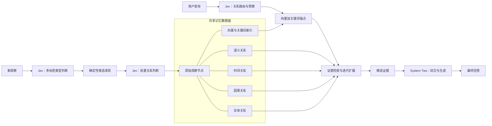
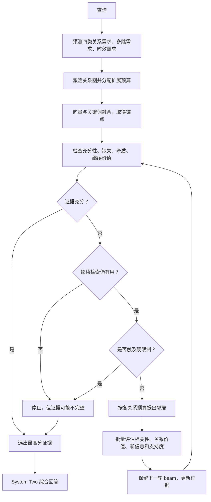

# Jev-Mem：把记忆管理从“大模型反复生成”改成“轻量控制”

这篇论文讨论的不是“Agent 应不应该有长期记忆”，而是一个更靠近系统实现的问题：**Agent 有了长期记忆以后，究竟应该由谁来不断做写入分类、关系判断、查询路由、候选打分和停止检索这些决定？**

许多智能体记忆系统把这些步骤也交给通用大模型。每来一条新记忆，就让 LLM 判断它是什么类型、与旧记忆有什么关系；每来一个问题，又让 LLM 判断去哪里找、哪些候选有用、是否还应继续搜索。这样做语义能力强，但每一个小判断都要经历逐 token 生成、格式约束和结果解析，LLM 由此被放到了记忆读写的高频关键路径上。

Jev-Mem 的核心主张可以概括为：

> 大多数记忆控制动作需要的是几个标签、分数或有限选项，而不是一段开放式文字。应让一个快速、非自回归、输出类型固定的 System-One 控制器处理这些高频判断，只把最终的证据综合和回答生成交给 System-Two 大模型。

论文用 Jev 作为这个轻量控制器的具体实现，并配合共享的多关系记忆图和闭环检索流程。它在 LoCoMo 长期对话记忆基准上，同时报告了更高的回答质量、更短的建库时间和更低的单次查询延迟。

先给出三个阅读边界：

1. **System One / System Two 是算力分工的类比，不是认知科学声明。** System One 指快速的结构化预测器，System Two 指擅长开放式推理与生成的 LLM。
2. **Jev-Mem 不是让记忆自己思考。** Jev 只控制记忆怎样组织和搜索，最终答案仍由普通大模型生成。
3. **论文最强的证据来自长期对话问答。** 它没有直接证明同样的收益已经出现在编程 Agent、研究 Agent、浏览器 Agent 或长期技能学习中。

## 1. 它发现的瓶颈：记忆成本不只在“最后回答”

一个有长期记忆的 Agent，大致要反复做三类工作：

- 把新交互写入记忆，并判断它的类型和与旧信息的关系；
- 收到问题时，从大量记忆中找到真正有用的证据；
- 根据证据完成推理，生成回答或行动。

过去容易把第三步视为主要成本，因为它明显需要大模型推理。但记忆越来越复杂后，前两步也充满语义判断。例如，新观察“我昨天因为旧自行车坏了，买了一辆新车”可能同时是一次事件、一个关于用户的事实，并和更早的“旧自行车坏了”构成时间与因果关系。查询“她什么时候买车，为什么”又同时需要时间和因果证据，不能只做一次向量相似度 Top-K。

如果每个判断都调用自回归 LLM，系统会出现两个问题：

- **建库慢。** 每条观察都可能触发多次自然语言生成，历史越长，累计开销越大。
- **查询链路重。** 路由、扩图、判断证据是否足够等循环步骤都要等待 LLM，一次检索可能含多轮串行生成。

固定规则虽然便宜，却很难理解“这个问题真正需要哪种关系”“当前证据缺的是什么”。因此论文不是在“规则或 LLM”之间二选一，而是提出第三种实现：把记忆管理改写成一组**输出空间已知的结构化预测任务**，交给专门的轻量模型。

## 2. System One 到底是什么：不是小号聊天模型，而是结构化决策器

Jev-Mem 把控制器抽象为 `J(S, Q)`：`S` 是当前结构化状态，`Q` 是一批需要判断的问题。它输出两类结果：

- 对相互独立的命题给出 0 到 1 的分数，例如“这条观察是否具有情景记忆特征”“这个候选是否能补充新证据”；
- 在互斥选项中选择一个，例如两条记忆的时间关系是 before、after、during 还是 unknown。

这与让 LLM 输出一段 JSON 看似相似，底层计算路径却不同。普通 LLM 仍要逐 token 生成字段名、数值和解释，再由程序解析；Jev 直接产生类型固定的预测结果，不生成中间自然语言推理。共享同一状态的多个问题还能在一次调用中批量判断。

例如，对一条新观察，系统不是连续调用四次模型，而是一次提交四个独立问题：它是否是 episodic、semantic、procedural、preference。四个分数并不互斥，一条记忆可以同时是某次具体事件和长期偏好的证据。

需要特别注意：论文附录明确说，Jev 返回的数值**不被假定为经过校准的真实概率**。因此 0.8 不应解释成“现实中有 80% 的正确率”，它更像是控制器内部可用于排序和阈值决策的置信分数。论文中 0.60、0.85、0.95 等阈值是系统策略的一部分，迁移到新领域时需要重新验证，不能机械照抄。

## 3. 整体架构：控制面、数据面和推理面

Jev-Mem 分成三个平面：

- **System-One 控制面**：执行类型判断、关系判断、查询路由、预算分配、候选评分和停止判断。
- **多关系记忆数据面**：保存原始观察，以及语义、时间、因果、实体四类关系，并共享向量和关键词索引。
- **System-Two 推理面**：读取最终选出的证据，做开放式推理和答案生成；必要时也可生成更高层记忆摘要。

关键不只是“有一个快模型和一个慢模型”，而是**同一套 System-One 决策接口贯穿记忆的整个生命周期**。写入阶段和读取阶段不再分别由一堆规则、Prompt 和解析器拼起来，而是共享统一的控制层。

## 4. 记忆数据模型：一份原始证据，多种关系视图

每条观察至少包含内容、可选时间戳和来源信息。写入后形成一个标准记忆节点，节点还保存 embedding、实体和四类记忆属性分数。

所有关系图共享同一批节点。一对记忆可以同时存在多条边，例如两段话既谈论同一个实体，又语义相关，并且一件事导致了另一件事。这和“分别建四个独立记忆库、复制四份内容”不同：内容只有一份，图只是从不同角度组织相同证据。

四类关系各解决不同问题：

| 关系视图 | 回答的问题 | 仅靠向量相似度为什么不够 |
| --- | --- | --- |
| 语义 | 哪些记忆谈论同一具体主题或事实 | 相似度能找到相关主题，却不表示先后或原因 |
| 时间 | 事件何时发生、谁先谁后、是否重叠 | 两段时间关联很强的文本，措辞可能并不相似 |
| 因果 | 什么导致、解释或促成了什么 | “同时发生”和“因果关系”不能靠邻近度等同 |
| 实体 | 不同表述是否指向同一个人或对象 | 别名、代词和跨会话称呼会破坏字面匹配 |

这一结构本身与多图记忆工作 MAGMA 很接近。Jev-Mem 更核心的变化是：**用 System One 决定这些图怎样构建、查询时怎样组合和何时停止**，而不是把“多关系图”本身作为唯一创新。

## 5. 写入流程：先保留原始观察，再有选择地建立结构

### 5.1 不在入口做不可逆删除

当前实验配置关闭了 admission filtering。只要观察有效且非空，就会成为标准节点。类型分数不决定“存或不存”。

这样设计的原因是：一条信息在写入时看似无关，未来某个问题出现后才可能变得重要。如果入口处由一个较弱控制器直接删除，错误无法恢复。Jev-Mem 把选择性放到两个更可逆的位置：

- 建图时，只给有意义的候选建立关系；
- 查询时，只把与当前问题有关的节点送给大模型。

代价也很明确：**原始节点数量会持续增长**。论文解决的是单次关系判断和检索成本的上界，不是无限历史的存储容量问题。

### 5.2 类型判断是注释，不是文件夹归类

Jev 一次性预测 episodic、semantic、procedural、preference 四个分数。它们可以重叠。例如“每次发布前我都先跑回归测试”既可能表达一种程序性经验，也可能是用户的稳定习惯。分数作为节点元数据，后续策略可以使用，但不会把节点锁死在唯一类型中。

### 5.3 候选发现与关系判断被刻意拆开

如果新节点与所有旧节点逐对交给 Jev 比较，写入成本仍会随记忆总量线性增长。论文因此先用便宜、确定性的信号召回至多 10 条候选：

- 向量相似度；
- 关键词重叠；
- 共享实体；
- 时间邻近性。

Jev 只判断这至多 10 对记忆是否有语义关系、方向性因果关系、同一情景关系，以及必要时的实体等价关系。关系分数达到 0.60 才建立对应边。

这是一种典型的“粗召回 + 精判断”设计。它把昂贵语义判断限制在固定大小的集合中，写入延迟不再直接取决于全部节点数量；但也形成了新的召回瓶颈：**若真正相关的旧记忆没进入前 10，Jev 再聪明也没有机会发现这条关系。**

### 5.4 能由可靠事实确定的关系，不浪费模型判断

论文并没有把所有事情都模型化。精确相同的实体标识直接建立实体关系；有明确时间戳时直接形成时间顺序。只有时间关系隐含在自然语言中，控制器才从 before、after、during、contains、overlaps、same_time、unknown 中选择。

这体现了很重要的工程原则：**结构化事实优先走确定性逻辑，模糊语义才交给学习模型。** 学习控制不是为了替换所有规则，而是填补规则无法可靠覆盖的部分。

### 5.5 定期巩固不是删除原文

系统每成功完成 20 次 Jev 写入，会在有限邻域内检查冗余、矛盾、过时性和补链价值，并从四种表示决策中选择：

- `keep_separate`：两条信息应继续分开；
- `merge`：它们是同一事实或事件，合并不会丢失独有细节；
- `promote`：多个不同事件共同支持一个稳定的一般规律；
- `uncertain`：证据不足，不能安全处理。

普通巩固路径只记录决策和关系，不替换原始观察。只有选择 `merge` 或 `promote` 的分数至少为 0.85、矛盾分数低于 0.85，并且调用方提供了 System-Two 摘要器时，系统才生成新的高层表示。也就是说，**轻量控制器决定“是否值得生成”，大模型只在获批后负责“生成什么”**。

这既降低了频繁摘要的成本，也保留了原始证据以便追溯。但论文没有展示长期运行中高层表示如何老化、冲突如何传播或记忆库如何做真正的垃圾回收。

## 6. 读取流程：检索不是一次 Top-K，而是带反馈的控制循环

### 6.1 先判断问题需要哪些关系

查询到来后，Jev 独立预测语义、时间、因果和实体关系的需要程度，同时判断是否需要多跳检索、是否重视最近信息。因为这些问题不是互斥标签，“她何时买车，为什么”可以同时激活时间图和因果图。

分数至少为 0.10 的关系图被激活。系统共有 80 个图扩展预算，先给每个激活图至少一个名额，再按需要分数比例分配剩余预算。多跳需求分数还会映射为最大遍历深度，最高不超过 8 层。

这里的预算不是“调用模型 80 次”，而是图扩展资源。关系越可能帮助当前查询，得到的扩展份额越多。它避免给四张图平均撒网，也避免只能选一张图而丢失复合证据。

### 6.2 用混合检索找到图上的起点

系统同时做向量检索和关键词检索，再用 Reciprocal Rank Fusion 合并两个排名。它不要求两种检索分数处在同一尺度，而是根据候选在各排名中的位置累计得分。排名融合常数设为 60。

这些高排名节点只是搜索锚点，不一定已经足够回答问题。之后才沿被激活的关系图扩展。

### 6.3 每轮都重新判断“证据够不够”

每一轮扩展后，Jev 评估四件事：

- 当前证据是否足以支持问题的每个事实部分；
- 再检索一轮是否仍有预期价值；
- 是否缺少明确需要的事实或推理链；
- 当前证据之间是否有未解决的矛盾。

当充分性至少为 0.95，并且缺失与矛盾都低于 0.15 时，检索成功结束。另一种停止条件是“继续检索的价值”低于 0.15；此时即使证据并不完整，系统也可能判断再找下去没有意义。

第二种停止非常重要：**停止不等于已经得到完整答案。** 它有时只是“预算内继续搜索预计无益”。如果下游不区分这两种结束原因，就可能把“不完整但停止”的证据误当成“已充分”。

### 6.4 扩展候选不是只看相似度

若仍需检索，系统从已选证据的图邻居中提出候选。Jev 批量判断四个维度：

- 与查询是否直接相关；
- 当前这类关系对查询是否有用；
- 是否增加了现有证据没有的新信息；
- 是否支持当前证据链。

最终排序还会结合查询与候选的向量相似度、当前图的需求分数、已有边权，以及在查询重视新近信息时加入的时间衰减调整。前 10 个候选形成下一轮 beam。

因此，一条候选即使语义很像问题，也不会无条件进入证据；若它只是在重复已有内容、关系方向无用或无法补齐推理链，综合分数仍可能较低。

### 6.5 闭环也必须有硬上限

主动检索若只依赖模型说“停”，控制器错误时可能无限扩展。实现还设置了独立上限：深度 8、访问节点 60、检查边 2400、Jev 尝试 16 次、检索时间预算 15 秒。时间在操作之间检查，不是能强行中断本地计算的严格实时截止。

这些上限保证系统成本不会失控，也意味着复杂问题可能在证据仍不充分时被截断。Jev-Mem 的承诺是“有界的自适应检索”，不是“必然搜到所有必要证据”。

## 7. 用论文的自行车例子走一遍完整链路

假设系统先后收到两条观察：

- 5 月 14 日观察到：Mira 的旧自行车坏了。
- 5 月 16 日观察到：Mira 说自己昨天因为旧车坏了，买了一辆新自行车。

第二条写入时，确定性召回通过 Mira、自行车等实体把第一条选为候选。相同实体 ID 可直接建立实体关系，Jev 再判断两条内容是否语义相关，以及“旧车损坏”是否解释“购买新车”。若因果分数超过阈值，就建立从第一条到第二条的因果边。

这里最容易出错的是时间。5 月 16 日是这句话被系统观察到的时间，不一定是买车发生的时间。“昨天”实际指向 5 月 15 日。论文的对象中因此还带有 `timestamp_role` 和经过解析的 `temporal_references`，明确区分观察时间和事件时间。

当用户问“她什么时候买了新自行车，为什么”时：

1. 路由器应同时提高时间图和因果图的需求；
2. 混合检索先找到与 Mira、自行车和购买有关的锚点；
3. 若证据只包含“旧车坏了”，充分性检查会发现缺少购买日期；
4. 系统沿因果或时间关系扩展到第二条记忆；
5. 停止器确认“何时”和“为什么”都有依据；
6. System Two 最终回答：她在 5 月 15 日买了新车，因为旧车坏了。

论文说明这个扩展过程是示意，不表示如此小的例子在真实运行中一定需要多轮遍历。但它很好地展示了三件事：多类关系可以同时激活；观察时间不能冒充事件时间；停止判断必须检查问题的每个组成部分，而不只是“找到了一段相关文字”。

## 8. 为什么它能更快：省掉的不是最后一次 LLM，而是中间的反复生成

正常写入最多包含一次批量类型请求，以及候选存在时一次覆盖至多 10 对记忆的批量关系请求。查询包含一次路由请求；每轮检索至多一次证据评估和一次批量候选评分。除此以外还有图、节点、调用次数和时间上限。

因此成本差异来自三个层面：

1. **计算形态改变。** 标签和分数由非自回归结构化预测直接产生，不再生成自然语言中间结果。
2. **批处理。** 同一状态下的多种判断、多个候选在一次请求中完成，而不是逐项串行询问。
3. **搜索范围有界。** 写入先把候选压到 10 条，读取按图分配预算，并在证据足够后提前停止。

System Two 并没有消失。它仍负责最需要语言和推理能力的最终综合，也可在严格条件触发时生成合并或提升后的记忆表示。论文真正做的是把 LLM 从每个细小控制动作中移开，让它只处理“必须生成”的工作。

## 9. 实验结果：它证明了什么

论文使用 LoCoMo 长期多会话对话基准，最终回答模型统一为 gpt-4o-mini，比较 Full Context、A-MEM、MemoryOS、Nemori 和 MAGMA。主要结果如下：

| 方法 | 多跳 | 时间 | 开放域 | 单跳 | 对抗 | 总分 |
| --- | ---: | ---: | ---: | ---: | ---: | ---: |
| Full Context | 0.468 | 0.562 | 0.486 | 0.630 | 0.205 | 0.481 |
| A-MEM | 0.495 | 0.474 | 0.385 | 0.653 | 0.616 | 0.580 |
| MemoryOS | 0.552 | 0.422 | 0.504 | 0.674 | 0.428 | 0.553 |
| Nemori | 0.569 | 0.649 | 0.485 | 0.764 | 0.325 | 0.590 |
| MAGMA | 0.528 | **0.650** | 0.517 | 0.776 | 0.742 | 0.700 |
| Jev-Mem | **0.623** | 0.637 | **0.618** | **0.802** | **0.962** | **0.777** |

Jev-Mem 总分 0.777，相比最强基线 MAGMA 的 0.700 是 11.0% 的相对提升。优势尤其集中在多跳、开放域和对抗问题，符合论文的机制解释：按问题选择关系、补齐证据链、抑制重复和误导候选，有助于复杂检索和干扰信息较多的情形。

但 Jev-Mem 并非所有类别都最好。时间问题是 0.637，低于 MAGMA 的 0.650。这提醒我们，动态控制的总体优势不代表每一种关系推理都单调改善。

效率结果为：

| 方法 | 建库时间（秒） | 平均查询延迟（秒） |
| --- | ---: | ---: |
| Full Context | 不适用 | 1.74 |
| A-MEM | 3636 | 2.26 |
| MemoryOS | 3276 | 32.68 |
| Nemori | 1044 | 2.59 |
| MAGMA | 1404 | 1.47 |
| Jev-Mem | **158** | **0.93** |

相对最快的其他记忆系统 Nemori，建库由 1044 秒降到 158 秒，即 6.6 倍加速、时间减少 84.9%。查询相对最快的记忆基线 MAGMA 从 1.47 秒降到 0.93 秒，减少 36.7%。它也低于直接塞完整上下文的 1.74 秒。

这些结果支持的最稳妥结论是：**在论文的 LoCoMo 设置与实现中，把频繁记忆控制从自回归 LLM 转给轻量结构化控制器，可以同时减少运行开销，并让最终 LLM 获得更聚焦的证据。**

## 10. 实验部分有几处必须指出的报告问题

论文正文和表格并不完全一致，应以表格为准：

- 正文称多跳分数为 0.625，表格是 0.623；
- 正文称单跳分数为 0.797，表格是 0.802；
- 正文称时间推理“追平最佳 0.650”，但表格中 Jev-Mem 是 0.637，真正的 0.650 属于 MAGMA；
- 实验设置写“在两个广泛使用的基准上评估”，随后只介绍并报告了 LoCoMo，没有给出第二个数据集及结果。

这些差异不推翻 Jev-Mem 的总体领先和效率数据，但说明实验叙述经过的校对不够严谨。技术选型时应把“一个基准上的强结果”与“跨基准普遍有效”严格区分。

论文也没有给出足够消融来拆开以下因素各自贡献了多少：Jev 控制器本身、多关系图、动态预算、证据停止、混合锚点和具体阈值。因此总结果证明的是这套组合系统有效，不能据此断言其中任意单一机制都贡献了全部增益。

## 11. 它没有证明什么，以及可能失效在哪里

### 11.1 控制器错误会变成检索错误

System One 较快，也比通用大模型弱。若它没激活因果图、错误判断证据充分，或低估了某个候选，System Two 根本看不到缺失信息。最终 LLM 再强也无法根据未取回的证据回答。

尤其需要关注“过早停止”：充分性判断是模型分数，而不是可验证证明。在高风险业务中，应让答案层看到证据状态，区分“证据充分停止”“继续无益停止”和“触及资源上限停止”。必要时对后两者降级到更强控制器或更宽检索。

### 11.2 粗召回决定了关系图的上限

写入时只判断最多 10 个候选。成本因此稳定，但长距离、低字面相似度、没有共享实体的关系可能永远不建边。可通过离线补图、周期性更宽召回或领域专用检索器缓解，但论文没有系统验证这些策略。

### 11.3 保留全部观察会把压力推迟到长期存储

关闭入口过滤避免误删，却不解决无限增长、重复数据、隐私删除、租户隔离和过期策略。定期巩固也主要记录关系，原始证据仍保留。生产落地仍需独立的保留策略、删除协议、冷热分层和索引维护。

### 11.4 基准是长期对话 QA，不是完整 Agent 行为

LoCoMo 测的是从多轮对话历史中回答问题。编程 Agent 的记忆还包括文件状态、工具结果、失败尝试和可复用技能；研究 Agent 还涉及来源可靠性与不断变化的外部事实。Jev-Mem 的控制面思想可以迁移，但四种关系、停止标准和评价方式必须重新设计。

### 11.5 系统复现信息仍不完整

论文说明了 Prompt 模板、关键阈值和搜索上限，这是优点；但没有在论文中充分交代 Jev 的内部模型、训练过程、运行硬件以及各基线的完整资源配置。绝对延迟高度依赖部署条件。选型时应在自己的模型服务、数据规模和并发条件下重测，不能把 0.93 秒当作环境无关指标。

## 12. 如果把它落到真实 Agent，应该怎样拆组件

可以把实现分成六个明确模块，而不是把论文流程写成一个巨大 Prompt：

1. **Canonical Store**：保存不可变的原始观察、来源、观察时间和事件时间；支持删除与权限控制。
2. **Candidate Retriever**：在写入时用向量、关键词、实体和时间信号召回固定数量旧节点。
3. **Typed Controller**：提供批量二元判断与互斥选择接口，记录模型版本、分数和阈值。
4. **Multi-Relation Graph**：对语义、时间、因果和实体边分别存储方向、权重与来源。
5. **Retrieval Orchestrator**：执行路由、预算分配、beam 扩展、证据状态检查和硬限制。
6. **System-Two Answerer**：接收查询、证据、证据是否充分及停止原因，生成回答或声明信息不足。

最值得直接借鉴的不是论文中的具体数值，而是三个接口原则：

- **决策显式化**：把“相关吗”“还要继续吗”定义为可记录、可评测的结构化输出，而不是藏在长 Prompt 里。
- **检索状态显式化**：记录已访问节点、证据缺口、冲突、停止原因和各图预算，使问题可以诊断。
- **升级路径显式化**：低风险判断走 System One；低置信度、高冲突、高风险或需要生成时升级到 System Two。

生产实现还应增加论文没有完整覆盖的监控：候选召回率、建边准确率、各路由的命中率、不同停止原因占比、触顶率、证据遗漏率，以及 System One 和 System Two 各自的耗时与成本。

## 13. 技术选型：什么时候值得采用这套思路

Jev-Mem 最适合以下情况：

- Agent 的长期历史不断增长，读写记忆属于高频操作；
- 当前实现用 LLM 反复做分类、相关性和停止判断，成本或延迟已明显；
- 查询经常包含时间、因果、实体和多跳关系，单纯向量 Top-K 不够；
- 业务可以接受维护图索引、控制器阈值和检索状态；
- 有足够的真实查询或标注集来校准路由、候选和停止策略。

如果记忆规模很小、查询简单、请求频率低，向量检索加重排可能更便宜，也更容易运维。若信息错误的代价很高，又没有能力评测轻量控制器，直接让强模型做关键判断或加入确定性验证更安全。若核心问题是摘要压缩、隐私删除或技能学习，Jev-Mem 只解决了其中的控制与检索部分，不是完整答案。

对已有 RAG 或 Agent 记忆系统，较稳妥的迁移顺序是：

1. 先把现有 LLM 中间调用改造成明确的标签、分数和停止状态，并建立离线评测；
2. 优先替换最频繁、输出最受限的步骤，如类型判断和候选相关性；
3. 保留强模型回退，对低置信度、冲突和高风险请求升级；
4. 再引入多关系图、按查询分配预算和自适应停止；
5. 最后根据长期数据决定是否做自动巩固与高层记忆生成。

这样能分别测出“换轻量控制器”和“改变记忆结构”的收益，避免一次重写后无法判断效果来自哪里。

## 14. 最终理解：这篇论文最值得带走的技术思想

Jev-Mem 最重要的贡献不是某个新检索公式，而是一种系统分层观念：**记忆管理中的语义判断，不等于都要由生成式大模型完成。**

它先区分了两种计算：

- 高频、输出受限、适合批量执行的控制判断；
- 低频、需要开放式语言和深度综合的推理生成。

然后让前者贯穿写入和读取：保存原始证据、有限候选召回、关系判断、查询路由、预算分配、候选评分、证据检查和停止；后者只在最终回答或获批的记忆抽象中出现。多关系图为控制器提供可选择的搜索空间，闭环检索则让搜索深度随问题和当前证据变化。

从工程视角看，这相当于把原来散落在多个 Prompt 里的“记忆管理意图”，提升为一个独立、可批处理、可设预算、可观测的控制平面。论文在 LoCoMo 上给出了很强的效果与效率信号，但验证范围仍窄、消融不足、报告有少量不一致。因此最合理的结论不是“Jev-Mem 已经证明了通用 Agent 记忆的最终架构”，而是：

> 当 Agent 的长期记忆开始被大量 LLM 中间调用拖慢时，把这些调用重新表述为结构化的快速决策，并为不确定情形保留 System-Two 升级路径，是一个非常值得验证的架构方向。
