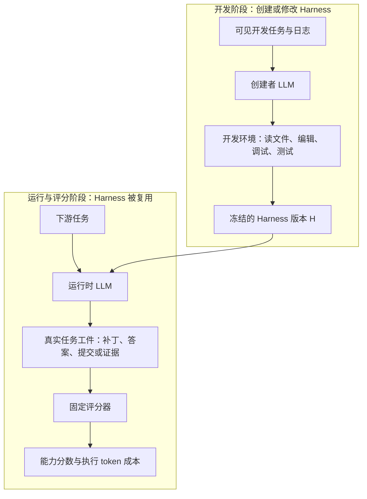
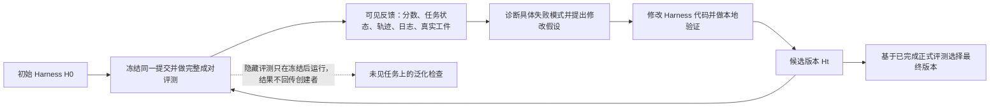

# HarnessDev：LLM 能否把 Agent Harness 当成长期维护的软件系统？

## 先用一句话理解

HarnessDev 不是教模型“自动改几段提示词”的方法论文，而是一套严格评测：让 LLM 从一个几乎没有 agent 行为的可运行骨架出发，写出完整的 Agent Harness；再让它根据下游任务反馈持续改自己的 Harness，并检验这些改动是否真的能迁移到未见任务、其他运行模型和长期版本中。

论文最重要的结论不是“Agent 已能稳定自进化”，恰好相反：当前模型已经能造出可运行的 Harness，也能做出一些局部修复，但反馈集上的提升经常不稳定、会回归、难迁移到隐藏任务，且强烈依赖最终运行 Harness 的模型。所谓自进化，目前更接近带噪声反馈的局部软件搜索，而不是可靠的能力积累。

---

## 1. 这篇论文想解决什么真实问题

很多 Agent 评测默认把 Harness 固定：选定工具、上下文拼接方式、循环、记忆、停止条件和验证器，然后只比较不同 LLM 在同一套外壳内完成任务的结果。

但真实部署中，模型权重只是能力的一部分。以同一个模型为例，换掉执行循环、工具协议、代码修改后的验证门、上下文压缩或失败恢复策略，最终任务成功率可能显著不同。生产团队实际花大量时间做的，正是这层“让模型输出变成可靠行动”的基础设施。

这层基础设施被论文称为 **Harness**。它不是一段 system prompt，而是运行在模型外部的一套程序：

- 让模型反复观察、计划、调用工具和停止的执行循环；
- 将文件、日志、历史和约束组织进上下文的规则；
- 工具的输入输出、错误处理和选择策略；
- 当前目标、尝试过的假设、进度、失败和工件的状态；
- 超时、重试、恢复、收尾与最终验证；
- 供评分器读取的补丁、答案、证据或提交文件。

因此论文的问题不是“LLM 能不能做一道题”，而是：**LLM 能否像 Agent 平台工程师一样，造出并持续维护一套能让未来很多任务运行得更好的系统？**

---

## 2. 最核心的技术思想：把评测对象从“答案”换成“可执行系统”

HarnessDev 把提交物从某一次任务的答案，改成一个可运行、可冻结、可审计、可复用的 Harness 代码库。它将一个完整 Agent 拆成四个不同角色，避免把“谁写了 Harness”“谁在执行任务”“谁打分”混在一起。



这张图说明一个关键边界：**创建者 LLM 不直接靠自己的任务答案得分。** 它先交付 Harness；Harness 冻结后，运行时 LLM 在这个 Harness 中做一批下游任务；评分器只看真实产物。若代码任务没有留下正确的仓库改动，Harness 自报“成功”也不计分。

这样设计解决了三个常见混淆：

1. 模型本身很强，还是 Harness 设计得好？
2. 这套 Harness 只适合写它的模型，还是换一个执行模型也有用？
3. 某个版本在开发题上变高分，是真的变强，还是只记住了这批反馈？

---

## 3. Harness 到底由哪些部分组成

论文把 Harness 的能力面概括成六类。它们不是要求建六个文件，而是六类行为必须真正处在任务主路径上；写了但永远不会被调用的模块，不算有效机制。

| 模块 | 在运行时收到什么 | 它实际做什么 | 交给下一步什么 | 缺失时的典型后果 |
| --- | --- | --- | --- | --- |
| 执行（E） | 任务、环境观察、上轮结果 | 决定下一轮是思考、调用工具、编辑、验证还是结束 | 下一步行动与停止条件 | 变成一次性问答，或无限循环、过早结束。 |
| 工具（T） | 模型提出的命令、读写和搜索请求 | 约束工具接口、参数、输出和错误处理 | 可读的观察或可恢复的错误 | 模型无法落地操作，或工具调用格式一错就中断。 |
| 上下文（C） | 任务描述、文件、日志、历史、约束 | 选择什么进入当前提示，何时压缩或保留关键证据 | 当前轮可用上下文 | 重要约束被挤掉，长任务中模型遗忘已经做过什么。 |
| 状态（S） | 目标、假设、尝试、工件和失败记录 | 保存可跨轮、跨恢复使用的任务事实 | 进度快照、待办或恢复位置 | 重启后重做、重复试错，无法知道当前补丁来自哪里。 |
| 生命周期（L） | 超时、API 失败、工具失败、结束信号 | 决定重试、降级、清理、恢复与最终化 | 一个可继续的任务或诚实的失败状态 | 出错后直接丢失工件，或把未完成任务包装成成功。 |
| 验证（V） | 补丁、文件、命令结果、测试结果 | 判断最终工件是否真的满足任务约束 | 继续修复或允许结束的证据 | 只靠模型自信结束，留下错误补丁或无效提交。 |

可以把这六层理解为：运行时 LLM 负责任务中的语义判断，例如“哪个文件可能相关”“这条报错意味着什么”；Harness 负责让这些判断**能执行、可观察、可恢复、可验证并最终被评分**。论文刻意不规定架构形式，因为模块名字本身不加分，真正任务表现才加分。

---

## 4. 从弱种子到可交付 Harness：Creation 阶段如何运行

### 4.1 为什么不从空仓库开始，也不直接给一个成熟 Agent

Creation 阶段的起点是一个 **弱但可运行的 Seed Harness**。它解决的是工程接线，而不是任务求解：已有稳定 CLI、模型配置读取、文件/进程/搜索等被动工具、审计日志和输出目录约定。

它启动后只会读输入、解析任务、可选地做一次连接探测、写出 `partial` 状态和审计文件，然后结束。它没有循环、规划、工具策略、上下文管理、持久状态、验证器、重试或停止规则，因此在正式任务上得分为零。

这看似“很弱”，却是一个重要的实验设计：

- 若从空仓库开始，结果会混入命令行、文件格式、依赖安装等无关工作；
- 若给成熟 Agent，又等于把要测的控制逻辑送给模型；
- 这个种子保留可运行性和审计能力，但不包含解决任务的策略，因此任何非零能力都必须由创建者新增。

### 4.2 创建者实际要做的事

创建者 LLM 获得任务类别说明、工具和权限边界、一个简短设计教程以及 1–3 个公开开发案例。它在开发环境中改 Harness、运行公开案例、阅读日志和结果，再继续修改。隐藏评测题、答案和正式分数不会给它。

一个创建出来的代码 Agent 大致要补齐以下链条：

```text
任务与工作目录
  → 组织当前上下文
  → 运行时 LLM 形成下一步行动
  → 工具执行并返回观察
  → 更新任务状态与已改动工件
  → 测试 / 审查 / 失败恢复
  → 产生真实补丁或最终工件
  → 写入可审计结果
```

注意其中“运行时 LLM 形成行动”和“Harness 执行、记录、验证行动”是分工，而非二选一。把 Harness 写成一个固定补丁生成器、只调用一次 LLM 的脚本，或者只输出一份报告，都不符合实验目标；它必须支持模型检查环境、调用工具、修改、验证、读取失败并迭代。

### 4.3 从一次任务看创建后的输出

以代码任务为例，输入包含任务、仓库路径和模型配置。Harness 将这些组织给运行时 LLM；模型决定搜索哪些文件、执行哪些命令和做哪些编辑；Harness 记录每一个动作、输出、错误与工件状态。结束时，它不仅写一段“完成了”的文字，还必须留下真实仓库状态、补丁以及机器可读的结果和轨迹。

评分器读取的核心是实际仓库 diff 或最终环境状态，而不是 Harness 自己的 `success` 字段。这个细节很关键：它把“模型说自己完成了”与“任务真的被完成”切断，也迫使 Harness 的验证层有真实价值。

---

## 5. 自进化不是自动变强：Evolution 阶段的完整闭环

Evolution 从同一个创建者在 RQ1 中写出的代码 Harness `H0` 开始，而不是从一个人类成熟框架开始。创建者收到两类下游基准的运行反馈：一组 SWE-Pro 代码任务和全部 Terminal-Bench 任务；它可以阅读每个已完成任务的分数、状态和原始运行工件，然后决定改什么。



图中的每条箭头都对应一个不可省略的中间产物：

1. **冻结版本。** 每次正式评测的是一个提交快照，而不是不断变动的工作目录；这样才知道分数属于哪份代码。
2. **拿到可诊断的反馈。** 反馈不仅有总分，还包含每个任务的运行状态、日志、轨迹、补丁和最终工件。总分只能告诉你“坏了”，这些工件才可能告诉你“为什么坏”。
3. **把观察收敛为假设。** 例如“很多任务报告成功却没有通过评分”，可能指向过早结束，而不是工具本身不可用。
4. **做局部代码改动。** 修改应改变主执行路径；增加一个未调用的 State 类或 verifier 文件，不会提高实际能力。
5. **本地检查与有限探针。** 本地运行可无限使用；但远程完整评测有预算，论文允许每轮少量固定子集 probe，只能当诊断信号，不能当正式成绩。
6. **完整成对评测。** 一个官方版本必须在两套完整基准上都跑完，避免只针对某一种任务优化。论文最多给 `H0` 之后十次完整评测对。
7. **隐藏泛化评估。** 所有版本冻结后，研究者再在创建者没有见过的 SWE-Pro 任务上测试；该结果不能反向影响其修改或选最终版本。

这不是强化学习式的权重更新。模型权重保持不变，积累的是外部代码、Git 历史、评测账本、日志和 Harness 行为；论文将其称为 **model-external learning**。它的本质是“用版本化软件修改来改变未来 Agent 的运行条件”。

---

## 6. 用论文中的一次正向案例，把反馈如何变成能力讲清楚

Opus 的演化轨迹是论文中最清晰的正向案例之一。它不是先发明复杂记忆系统，而是发现了一个非常具体的运行缺陷：在一批代码任务里，几乎所有运行都报告成功，但真实评分通过的任务只有一部分。

### 第一步：区分“运行报告成功”和“任务真的成功”

输入是每个任务的分数、运行状态、日志、轨迹和最终工件。创建者读取这些反馈后，发现 Harness 的 adapter 没有崩溃，问题也不只是模型没调用工具；更像是模型完成了一个自写检查后就被允许结束，而该检查不足以证明补丁、路径、权限、输出格式和实际验证都正确。

这里的关键中间状态是“**低证据成功**”：Harness 里已有成功信号，但缺少足够外部证据。若系统把它直接传给最终化逻辑，运行就结束；评分器随后用真实仓库状态打分，暴露出这种成功只是表面成功。

### 第二步：将诊断变成执行路径上的 final review gate

该轨迹新增了一个结束前审查门。它不是让模型多写一段总结，而是改变控制流：当证据不足或验证失败时，Harness 不允许立即标记成功；它会重新检查路径、权限、输出格式和真实验证结果，再决定继续修复还是结束。

从系统角度看，输入是候选完成状态和已有工件；内部动作是“检查是否满足结束证据”；输出要么是允许最终化，要么是一个需要继续处理的验证缺口。这一输出直接改变执行循环的下一步，因此它是 Harness 机制而非装饰性 helper。

这一修改使该轨迹的一次完整评测对出现明显改善，说明反馈真正暴露出明确失效机制时，模型能够将其转为有用的结构改动。

### 第三步：为什么后续扩展又会回归

论文记录的其他后续演化轨迹，曾把审查范围扩大到更多成功任务、加入更多验证缺口提示、尝试追踪 shell 命令创建的文件和处理大文件读取。部分改动导致一个基准升、另一个降；有的 probe 表现很好，却没有迁移到完整评测。

这说明“更严格的验证”不是总会更好：

- 审查太频繁会消耗步骤和上下文，也可能打扰已经正确的任务；
- 小样本 probe 的高分可能只是恰好适合那五个任务；
- 一项机制若只覆盖 Git diff，却遗漏 shell 创建的工件，会在非 Git 任务上失效；
- 局部修改的效果受运行时模型、工具协议和任务类型共同影响。

最终它选择了一个较早、已完成正式评测、整体更平衡的版本，而不是盲目选择最新版本。这个案例最值得借鉴的不是“加 final review gate”本身，而是完整链条：**读真实失败工件 → 给出可反驳的原因假设 → 改主路径 → 用完整评测核验 → 允许回滚和停止搜索。**

---

## 7. HarnessDev 怎样判断“改好了”，而不是被表面分数骗过

### 两个视角：Self-Eval 与 Unified-Eval

同一份 Harness 可以在两种方式下运行：

- **Self-Eval**：创建它的模型自己做执行模型。这衡量模型- Harness 共同设计后的真实部署组合。
- **Unified-Eval**：所有创建者生成的 Harness 都换成同一个固定执行模型。这样尽量剥离“运行模型本身更强”带来的差异，观察 Harness 是否是可迁移的软件资产。

如果一个 Harness 在 Self-Eval 很强、换运行模型后显著变差，往往意味着它把原模型的习惯写死到了提示、步骤预算、工具消息格式或停止规则中。它不是“坏代码”，但可移植性较低；工程上需要把它视为模型特定的系统配置，而不是通用框架。

### 两个指标：能力与效率

论文对每个冻结 Harness 同时报下游成功和执行模型 token 消耗。创建者为了开发 Harness 花的 token 不计入部署成本，原因是要隔离“这个交付出去的系统每次执行任务有多贵”。

结果显示，消耗更多执行 token 并不稳定地带来更高成功率。在数据分析任务上，不同 Harness 的 token 成本可相差近二十倍。这提醒我们：多轮反思、更多工具调用和更长上下文都是成本，不是质量保证；Harness 需要在成功率、稳定性和在线成本之间同时优化。

### 为什么必须有隐藏任务和版本级评测

Evolution 的可见反馈集本质上是模型正在反复搜索的目标。若只看它，模型可能逐渐适配这些固定任务，或者选中一次偶然噪声较高的版本。论文因此把另一批 630 个 SWE-Pro 任务留到所有编辑结束后才跑，并且从不反馈给创建者。

这给出一个很实用的判断原则：**每一个“看起来提升”的 Harness 版本，都应至少问三件事：它在完整任务集而非几个 probe 上是否成立？是否保住了其他任务类型？是否在未参与决策的数据上仍成立？**

---

## 8. 实际效果用文字怎么理解

### Creation：能造出 Agent，但不同领域难度差很大

六个前沿模型都能从弱种子做出可运行 Harness；在短写作和机器学习实验这类任务上，某些生成 Harness 已经接近或超过论文选取的成熟系统参考。但代码和搜索/研究任务差距更大，因为它们需要长程信息获取、跨文件编辑、工具协调、验证和恢复。

这并不表示“模型不会写 Agent”。更准确的解释是：模型已经能够补齐基础循环和工具层，但在需要长期状态、可靠收尾、真实验证与跨轮上下文管理的领域，生成的控制系统仍不成熟。

论文还发现一个容易被忽略的问题：许多 Harness 声称有 State 或 Memory 类，但很少真正提供可保存状态或周期性 checkpoint；在记录的大量任务轨迹中，没有观察到 checkpoint 事件。还有不少组件完全不在执行路径上。对工程团队而言，这意味着不要只看目录结构、类名或 README；应看真实轨迹中机制是否触发、是否改变了任务行为。

### Evolution：可见反馈会涨，但泛化收益更小、更不稳

所有自运行模型的演化轨迹都能在可见反馈对上得到提升，但隐藏任务上的提升明显缩小。自运行设置中，最终版本在隐藏集上仍有小幅正向变化；换成固定 Gemini 执行后，只有 Opus 的演化版本仍提升，其余若干轨迹反而退化。

更关键的是，论文的版本分析显示：反馈分和隐藏分同向变化的相邻版本只略高于一半，声明为最终版本的候选中只有少数恰好是隐藏集最优。很多看似上涨的分数还落在重复运行的噪声范围内。

因此可将结果理解成：

- **已被证明可行的部分**：模型能阅读部分失败反馈，定位具体控制缺陷，并写出可运行修复；
- **尚未可靠的部分**：用有限反馈稳定选择真正更好的版本，避免跨基准回归，并让改进换模型后仍有效；
- **不能从论文推出的结论**：Harness 会自然、单调地越改越强，或 Harness 的代码演化已经替代模型参数训练。

---

## 9. 相比已有 Agent 评测和“自动 Agent 设计”新在哪里

| 常见做法 | 主要评估对象 | HarnessDev 的改变 |
| --- | --- | --- |
| 固定 Harness 的 Agent Benchmark | 模型在既定工具、循环和提示中的单任务表现 | 把 Harness 本身变成提交物，评分其在未来任务上的复用效果。 |
| Prompt / Workflow 搜索 | 提示、步骤顺序或有限工作流参数 | 允许改完整可执行 Harness：工具、状态、恢复、验证和最终工件都在范围内。 |
| 单轮 Agent 构建挑战 | 从种子造出一个 Agent 的最终分数 | 同时测 Creation 和 Evolution，记录每个冻结版本而非只看最后一版。 |
| 只看可见反馈的演化实验 | 当前反馈集分数是否上涨 | 额外检查隐藏泛化、跨执行模型迁移、回归和执行 token 成本。 |

它最有价值的贡献是提供了一套“自进化 Harness 到底有没有进步”的测试语言：版本必须冻结、成功必须由真实工件判定、反馈和隐藏集要分离、创建者与执行者要区分、成本和迁移性都要报告。

---

## 10. 局限与不适用场景

1. **它是评测，不是现成的自进化产品。** 论文定义了严格实验合同和反馈环境，却没有给出一条可直接上线的通用演化算法。
2. **覆盖领域有限。** Creation 覆盖代码、数据、写作和研究搜索；Evolution 的主实验聚焦代码 Harness，隐藏集也只在 SWE-Pro 上评估。
3. **人类参考不是统一控制实验。** 论文用已验证的成熟系统结果作参照，但这些系统并非都在同一运行模型下重跑，不能将其视为绝对能力上限。
4. **演化轨迹样本仍少。** 每个创建者-运行模型组合只有有限轨迹，难以得出稳健的人群级统计结论。
5. **开发环境固定。** 创建者在 Claude Code 或 Codex 等外层开发环境中工作；论文没有测试“已经演化出的 Harness 能否再成为下一代 Harness 的开发环境”。
6. **安全问题没有被自动解决。** Harness 会操作文件、进程和工具。论文在容器中执行并审计违规路径，但明确提醒复用生成 Harness 时应将其当作不可信代码，采用更严格隔离。

---

## 11. 对 Agent / Harness 技术选型的启发

### 11.1 应把 Harness 当成产品代码，而不是模型配置

如果你的 Agent 需要长期服务，Harness 应有独立仓库、版本、测试、变更日志、行为轨迹和回归集。模型升级不是唯一变量；同一模型换 Harness 的差异足以改变任务能力与成本。

最先该沉淀的不是“更长 prompt”，而是可验证的控制面：

- 任务执行循环和明确的停止条件；
- 可观测的工具调用、输入输出与错误分类；
- 可恢复状态和工件追踪；
- 最终化前的证据门与真实验证；
- 输出工件、状态和轨迹的统一审计接口。

### 11.2 建立“反馈到改动”的工程闭环，而不是让 Agent 盲改

可借鉴 HarnessDev 的最小闭环：

```text
收集真实运行轨迹
  → 按失败类型定位具体控制缺陷
  → 写明本次改动假设
  → 修改 Harness 主路径
  → 本地回归 + 有限诊断探针
  → 冻结版本并做完整评测
  → 对照隐藏回归集和成本，决定保留、回滚或停止
```

这里最关键的不是“让 LLM 自动提交更多版本”，而是保存失败证据和版本账本。没有轨迹、原始工件与可回溯的评测，模型只能根据模糊总分猜测；这很容易变成高成本的随机搜索。

### 11.3 运行模型与 Harness 必须联合测试

一个针对某模型写的 Tool schema、上下文长度、步骤预算、停止规则和提示，很可能隐含该模型的行为偏好。部署新模型前，不能只做模型能力基准；还需要跑 Harness 兼容性矩阵：

- 相同 Harness + 不同运行模型；
- 相同运行模型 + 不同 Harness 版本；
- 成功率、token 成本、工具格式错误、超时、过早停止和回归。

若目标是通用平台，应该把模型特定策略放到显式适配层，而不是散落在核心循环中；若目标是单模型最优，则应承认这是共同设计结果，并为换模型预留再调优成本。

### 11.4 先做可靠性机制，再做花哨的自治结构

论文里最有证据的正向改动来自完成检查、真实工件追踪、输出保留和失败恢复，而不是复杂记忆或多 Agent 编排。对多数工程团队，更现实的优先级是：

1. 确保成功状态有外部证据，不让模型自报成功即结束；
2. 确保 shell、编辑工具和生成文件都进入工件追踪；
3. 为超时、空响应、协议错误和未完成验证设计可诊断的恢复；
4. 再考虑长程记忆、子 Agent、自动规划或自演化。

这不是否定 Memory 或多 Agent，而是指出它们若不在主路径上、不可恢复、不可验证，就只会增加代码复杂度而不增加可靠能力。

### 11.5 暂时不要照搬的部分

- 不要把论文的十轮远程评测预算、特定基准或六模块命名机械搬进产品；它们服务于研究可比性，生产系统要按风险、成本和 SLO 重构。
- 不要只凭小样本 probe 成绩自动推广 Harness 改动；把它当作 crash / 方向检查，而不是发布决策。
- 不要让系统无限自我编辑并直接上线。至少需要不可篡改版本、可回滚、权限隔离、独立回归集和人工或策略门。
- 不要把“更多代码”“更多 self-test”当作演化质量的代理指标；论文中它们和真实下游分数没有稳定正相关。

---

## 12. 一页式结论

| 你真正应该带走什么 | 结论 |
| --- | --- |
| 对 Harness 的重新定义 | Harness 是模型外、可版本化的执行系统；它决定模型如何观察、行动、恢复、验证和交付。 |
| 对“自进化”的正确期待 | 目前可做局部软件修复，不等于可靠、单调、跨模型的自动能力积累。 |
| 最强的工程启发 | 用真实工件评分；把反馈、假设、改动、版本和回归结果连成可审计闭环。 |
| 最应优先补齐的能力 | 结束前验证、失败恢复、工件追踪、上下文与状态的真实主路径接入。 |
| 采用前先验证什么 | 你的 Harness 是否对某个模型过拟合；每次改动是否在隐藏回归集、其他任务和成本上仍成立。 |
| 一句话总结 | **不要把 Agent 的能力只归因于模型；Harness 本身是会积累、也会退化的软件资产，必须像产品代码一样开发与评估。** |
