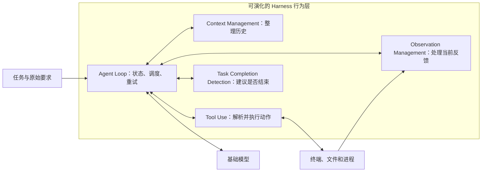
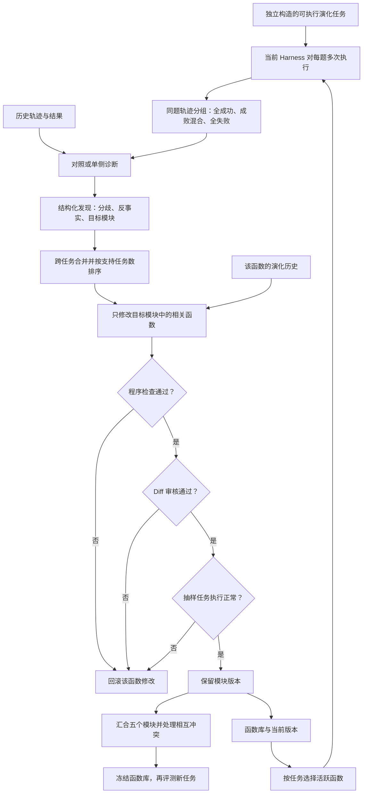

# ModularRSI：让 Harness 从执行经验中改进自身

这篇论文研究的对象是 **Harness**：包在基础模型外面、负责组织多轮执行的程序。对一个终端或编程 Agent 来说，Harness 决定何时把什么上下文发给模型、怎样解析模型发出的工具动作、如何呈现终端反馈、出错后如何继续，以及何时允许任务结束。模型能力相同，Harness 的这些细节也可能让结果明显不同。

**一句话概括 ModularRSI：用同一任务的成功与失败执行做对照，找出可复用的 Harness 缺陷；把修改限定在负责该行为的模块；经过检查后保留代码改动，再将各模块的改动集成为新的 Harness。** 系统反复用当前 Harness 产生轨迹、分析轨迹、修改当前 Harness，因此称为递归自改进。

阅读本文时尤其要记住两个边界。第一，论文改的是 **Harness 的函数代码与函数库**，不是模型权重。第二，论文展示了较强的跨任务和跨模型迁移证据，但它的验证门主要检查程序可运行、接口兼容和是否过拟合；不能把它理解成“每次修改都通过大规模独立性能测试”。

## 1. 它要解决的真实工程问题

假设一个编程 Agent 收到任务：“把一段 Scala 数据处理逻辑改写为 PySpark，同时排除产品类别为空的记录。”它有终端、文件编辑工具和足够强的模型，但某次执行中仍可能把旧 Scala 代码当成最高依据，忘掉用户明确提出的空值过滤要求；另一次执行则能正确保留该要求。

看到这样的失败，直接改整个 Harness 很容易做错两件事：

1. 把这道题写成特例，例如发现某个文件名就插入 `isNotNull()`。这一题可能变好，换题就无效。
2. 无法判断应改哪一层。问题可能是原始任务在长上下文中消失，也可能是终端反馈被压缩错了、工具解析失败、Agent Loop 过早结束，或者模型本身推理错了。

论文把困难拆成三个层面：

- **数据层**：自改进需要大量可执行任务、可靠环境和可判定的结果。若直接用最终考试题来学习，改进可能只是记住了考试特征。
- **轨迹层**：一次失败只给出结果，不告诉我们是系统性执行机制坏了，还是该次任务的偶然推理失误。
- **模块层**：即使知道行为有问题，也要定位到负责的 Harness 部件。整套重写会同时改变许多机制，难以确认是谁产生了收益或副作用。

ModularRSI 的设计基本就是逐一回应这三个困难：独立构造演化任务、对照成功和失败轨迹、限制修改到具体模块。

## 2. 核心思想：把“失败了一题”翻译为“哪个机制应该怎样变”

任务评测通常只返回成功或失败。这个信号足以知道结果，却不足以指导代码修改。ModularRSI 在结果与代码之间加了一条诊断链：

> 同一题多次执行 → 找到成功与失败的行为分歧 → 问“修改某个 Harness 模块是否可能改变结果” → 汇总多个任务支持的同类问题 → 修改对应函数。

其中最有技术含量的是“**同题对照 + 反事实归因**”。同一任务的输入、环境和 Harness 相同，多次 rollout 仍可能因模型采样而走出不同路径。如果一条成功轨迹持续保留任务约束，而失败轨迹在某一步把约束丢了，差异就比跨两道不同题比较更有诊断价值。分析 Agent 随后还要追问：若只改当前目标模块，失败轨迹是否有可能变得更好？如果没有明确可行的改法，就标记为“不归因于此模块”，而不是强行产生代码补丁。

不过对照只能提高诊断质量，不能自动证明因果。两条轨迹可能还在别处不同；同一任务的成功也可能是偶然。因此论文又用跨任务的相似发现投票、功能范围约束、diff 审核和后续运行来降低误判。

## 3. Harness 被拆成哪五个模块，运行时怎样协作

论文以 Harbor 的 Terminus-2 为起点，将影响求解行为的机制拆成五个可演化模块。沙箱初始化、并行执行、模型通信等基础设施不在主要演化范围内。

| 模块                        | 它接收什么             | 它实际负责什么                          | 典型缺陷                |
| ------------------------- | ----------------- | -------------------------------- | ------------------- |
| Agent Loop                | 原始任务、会话、其他模块、执行状态 | 调度“思考—行动—观察”循环，维护状态、重试和继续执行的控制逻辑 | 尚未验证结果就允许结束；错误后陷入循环 |
| Context Management        | 累积对话历史、原始任务       | 决定保留、压缩或重新组织哪些历史，必要时生成交接提示       | 压缩时丢失用户约束或中间结论      |
| Tool Use                  | 模型输出的动作文本、工具调用    | 把模型响应解析为命令与完成信号，执行命令并处理解析错误      | 将多行文件写入错误地交给 shell  |
| Observation Management    | 当前环境及上一次观察状态      | 读取终端输出，筛选或压缩为 Agent 能理解的即时反馈     | 把关键报错淹没在冗长输出中       |
| Task Completion Detection | 最近反馈、完成声明和循环状态    | 建议是否可以停止，并给出原因                   | 只听到“完成了”就同意结束       |

下图表示论文附录中运行时的主要关系。Agent Loop 是协调者；模型和终端环境是外部资源。图中的箭头说明数据和控制归属，实际执行中可以出现重试或提前终止。

一次正常迭代可以这样理解：Agent Loop 先让 Context Management 更新历史，再向模型发 prompt；Tool Use 解析模型的响应，执行工具命令；Observation Management 从环境中读取本轮反馈；Agent Loop 把这些结果写回状态，询问完成检测模块是否可以停止。如果解析错误，可能重试；如果继续执行，则用新反馈准备下一轮 prompt。

这里有两个容易混淆的细节。

- **Observation 和 Context 处理的时间尺度不同。** 前者把“这一轮终端刚输出了什么”变成可读反馈；后者管理“到目前为止整段对话应该记住什么”。如果一条报错从终端输出中被错误过滤，是 Observation 问题；如果原始约束在几十轮后丢失，更可能是 Context 或 Loop 的问题。
- **完成检测给出建议，Loop 掌握最终控制。** 论文示例中，完成检测要求连续两次完成声明，Loop 维护计数并在第一次声明后发确认提示；演化后的 Loop 还可能覆盖该建议。于是“结束得太早”不能不经诊断就一律归到完成检测模块。

模块采用接口协议，候选实现以名称、描述和配置注册；共享的 `ModuleCtx` 提供任务配置、环境访问与记录服务。这让代码修改有明确边界，也让不同版本的函数能放在同一函数库里供后续组合。

## 4. 从任务样本到新版 Harness：完整自改进链路

这张图展示一次演化轮次中，证据如何逐层变成代码。五个模块从同一初始 Harness 分别演化，先不共享中途的改动；各自通过检查后才进行跨模块集成。

需要把“自改进”理解为一条**受限的软件修改流水线**：模型提出分析与代码修改，静态程序检查、LLM diff 审核和真实执行检查决定这次改动能否保留。它不是模型在每次服务用户时即兴改自己的代码；论文在完成演化和集成后会冻结函数库，再去做下游评测。

## 5. 诊断环节：三类轨迹各提供什么信号

对每个演化任务，系统让同一 Harness 运行多次，用任务专属 evaluator 为每次轨迹标记成功或失败。随后按“全成功、混合、全失败”分流。

### 5.1 成败混合：先找分歧，再问模块能否改变结果

一题既有成功也有失败时，系统把同题成功轨迹与失败轨迹配对，找出从哪里开始行为分叉。分析 prompt 要求给出可观察的步骤差异，然后对当前指定模块做反事实判断：假设只改这个模块，失败轨迹是否可能转向成功？

如果答案是“可能且在模块范围内可修”，才输出修改建议；如果需要架构级改动，记录为当前不可直接修；如果发现失败主要来自评测噪声或其他模块，则应弃权。论文附录的结构化发现包含 `divergence`、`would_change_outcome`、`is_culprit`、`fixable_now` 和 `suggested_change` 等字段。它们的意义是强迫修改者先说清楚“证据—可能的原因—具体可改机制”，再写代码。

### 5.2 全失败：历史里有成功就对照，没有则谨慎单侧诊断

当前几次执行全部失败时，系统先查 Trajectory Memory：同一任务在以前轮次是否曾成功。如果有，就用历史成功轨迹与当前失败轨迹配对。若仍没有成功，才进行单侧诊断，寻找明显的重复循环、工具误用、无效恢复或过早结束。全失败并不自动意味着一定能找到 Harness 缺陷；任务本身过难、环境问题或评测错误也可能造成这个结果。实现中还把纯基础设施故障排除在 Harness 诊断之外。

### 5.3 全成功：还有没有可避免的浪费

如果每次都成功，系统不会只把它当作“无需优化”。它会看多余工具调用、重复探索、解析失败后重试等效率问题。成功轨迹能够揭示的不是“怎么从失败变成功”，而是“完成同一任务时哪些无效步骤可以被 Harness 消除”。

这三路信号的组合很有用：混合组偏重可靠性，全失败组能抓明显缺陷，全成功组补足效率。但最有信息量的成败对照需要“同题既有成功又有失败”；太简单的任务很少失败，太难的任务很少成功，所以演化数据的难度分布会直接影响可用诊断样本。

## 6. 从一堆发现到一个函数改动：模块化如何避免越改越乱

诊断结束后，系统不会每看到一条失败就立刻打补丁。它先把指向同一函数、语义相近的发现合并为候选修改，再按**支持它的不同任务数**排序。这个投票不保证修改正确，但能降低单题偶然现象压倒全局机制的风险。

> 系统先把每个任务的执行轨迹分析成结构化诊断，然后找出那些准备修改同一 Harness 函数、并且要求相同底层行为变化的诊断，将它们合并为一个候选修改。候选修改获得多少票，取决于有多少个不同任务独立暴露了这个问题。得到更多跨任务支持的候选会被优先交给 Code-Modify Agent，从而降低系统根据单个任务偶然现象或具体解法修改 Harness 的风险。

Code-Modify Agent 收到选中的方向及所有支持它的发现，被要求实现共同的行为变化，而不是迎合最醒目的一道题。目标范围被锁定在当前模块。每个函数还有 Evolution History，记录之前改了什么、增加了什么能力，让下一轮知道哪些行为已存在，减少重复改动或来回振荡。

五个模块各自从相同的起始 Harness 出发独立演化，演化途中不相互读取对方的新改动。这样能把“上下文管理改动带来的效果”和“工具解析改动带来的效果”分开观察，也减少一个模块的最新实验污染另一个模块的诊断。

代价是独立改好的版本可能相互冲突，因此还必须做**跨模块集成**：把五条分支组合，跑演化任务，检查重复机制、冲突行为和不一致的接口，再做有限修复。论文给集成阶段的指令偏向删除冗余、合并重复版本和小范围协调，不把它当作新功能开发轮次。

函数库会随着演化不断增长。论文用两种办法控制它：

- **Function Merge**：让 LLM 对照同一模块里描述与行为相近的函数，合并重叠实现，减少长期冗余。
- **Task-Aware Function Composer**：依据任务描述和候选函数的自然语言说明，选择当前任务需要激活的实现。也就是说，库里保留多种能力，运行时不必把所有版本同时装进一个活跃 Harness。

这相当于把自改进分为“长期存什么能力”和“这道题启用什么能力”两个问题。能力库扩张能增加覆盖率；选择器如果选错，则新能力即使存在也不会在任务里生效。论文检查 diff 时也会问新变体能否被 Composer 在类似任务中选中。

## 7. 三道验证门实际检查了什么

论文的保留规则是按**每次函数更新**依次过三道门，失败就依据记录的 diff 回滚受影响函数。

| 门 | 实际检查 | 能挡住什么 | 仍挡不住什么 |
| --- | --- | --- | --- |
| Program Check | AST、导入、协议接口、函数发现契约、静态属性使用等 | 语法错误、明显接口不兼容、加载失败 | 逻辑正确但行为变差 |
| Diff Review | Code-Modify Agent 审阅改动与相关轨迹，检查因果关联和题目特化 | 按题目名、文件名、输出、常量写死的补丁 | LLM 审核判断错，或隐蔽的过拟合 |
| Execution Validation | 从当前 batch 随机抽两题，用更新后的 Harness 实际执行 | 运行时错误、执行协议被破坏 | 小样本外的性能下降或长尾行为 |

Diff Review 的 prompt 不看奖励结果，重点是：代码变化是否真的对应轨迹显示的故障？是否写入了只对这几题有效的条件？如果新变体需要 Composer 选择，它是否有机会被类似任务启用？

这套门禁非常务实，但**不包含逐次修改都必须让独立验证集平均成功率提升的硬条件**。最终的 benchmark 隔离评测是在演化完成并冻结 Harness 后进行。对生产系统来说，若改动会影响大批真实任务，最好在论文这三道门以外，再加回归任务集、性能阈值、成本约束与灰度发布。否则“能运行”与“总体更好”之间仍有空隙。

## 8. 一个完整案例：从“忘记用户要求”到改 Agent Loop

论文的 Scala 转 PySpark 例子能把整套机制串起来。

**输入任务。** 用户要求移植销售数据流水线，并排除产品类别为 NULL 的记录。旧 Scala 实现恰好没有这个过滤，因此任务文字与参考代码之间有冲突。

**同题两条轨迹。** 在同一任务、同一 Harness 版本下，一次成功执行明确遵从用户要求，加入空值过滤并检查输出；失败执行把旧代码当作权威，漏掉过滤，输出多出 5 条 NULL 类别记录。

**诊断。** 对照发现分歧不是“不会写 PySpark”，而是长程执行中没有稳定保留书面任务要求。分析提出持续展示任务约束清单；这个发现与其他任务的类似问题一起支持修改 Agent Loop，让后续 prompt 重现要求，并在未做命令验证却宣称完成时提醒检查待办项。

**代码变化与后续表现。** 对应 Loop 变体通过审核和运行检查后被保留。在后续轮次，同一任务的轨迹里，Loop 在完成前再次触发核验，Agent 明确说应按书面要求保留过滤，并运行输出检查。论文展示该轮中三次执行有两次成功，而先前选出的执行中只有一次成功。

这个案例的可复用机制是“保留任务要求并在结束前核验”，不是“遇到 Scala 就加某个过滤条件”。这也说明为什么同题对照后还要跨任务汇总：只有跨任务反复出现的行为，才更值得写进 Harness。论文也谨慎说明，后续轨迹中还包含其他改动，因此单个案例不能独立证明这一处 Loop 修改贡献了全部提升。

另外两个案例补足了边界：一个 FFmpeg 构建任务反复宣称完成，却没有跑用户要求的动态链接检查，促成完成前核验机制；另一个 Go 文件写入任务本来每次都能成功，但多行内容被工具分发器误送给 shell，产生额外重试，促成 Tool Use 的解析修复。它们分别对应“全失败时的明确验收缺口”和“全成功时仍值得修复的效率浪费”。

## 9. 实验结果应该怎样理解

论文独立构造了 2,000 个可执行演化任务：一半偏终端，一半偏软件工程。构造时只借用主流 benchmark 的**高层任务类别**作搜集指引，素材来自外部公共资源；再经环境完整性、任务实用性、评测器有效性检查，要求参考脚本通过测试、空操作不能拿到正奖励，并做人工复核及语义相似度去重。这里“与 benchmark 不重合”的含义是没有把下游 benchmark 的实例、轨迹和奖励拿来演化，**并不是连任务领域信息也完全不知道**。

由于计算成本，主要演化实验实际上只从两类数据中各取 **120 题**，每个模块演化 **3 个 epoch**，并非在全部 2,000 题上完整运行。之后将 Harness 冻结，在 TerminalBench 2.0 的 89 题和 SWE-Bench Verified 的 500 题上评测。

核心观察可概括为四点。

1. **同领域新题有效，跨领域也有效。** 终端相关任务演化的 Harness，在 TerminalBench 2.0 上成功率由 47.57% 到 52.43%；它迁移到 SWE-Bench Verified 后，成功率由 73.40% 到 75.80%。软件工程相关任务演化的 Harness，在 SWE-Bench Verified 上到 76.45%，迁移到 TerminalBench 2.0 后到 49.40%。跨领域收益通常较小，但方向仍为正。
2. **换基础模型后，效果仍可迁移。** 用一种 DeepSeek 模型演化、冻结的 Harness，换到论文测试的 GLM、MiniMax 和另一 DeepSeek 配置，TerminalBench 2.0 上的成功率与多次运行可靠性都比对应原始 Harness 高。说明部分改动针对的是执行机制，不完全依赖某个模型的特定输出习惯；这不是“对任何模型都必然有效”的保证。
3. **模块化是关键实验差异。** 在同一组 TerminalBench 2.0 测试中，独立演化再集成取得 52.43% 成功率；整套非模块化演化和五模块联合演化分别低于原始 47.57% 的基线。单模块演化也都能提高成功率，但贡献方式不同：Agent Loop 的单模块成功率改善最大，Observation Management 的平均执行步骤明显下降。
4. **信息量比任务量更值得重视。** 论文把演化题按难度做两种分布。中等难度较集中的数据，最终在 SWE-Bench Verified 上优于“简单题和极难题很多”的数据。合理解释是：中等难度更容易同时出现成功与失败轨迹，让系统看见有用的行为分歧；论文实验支持这个方向，但数据难度之外的因素不能完全排除。

一个重要的反直觉结果：最终整合 Harness 在 TerminalBench 2.0 上成功率提高了，平均步数却从 34.70 略增至 35.57；Observation 单模块虽然把平均步数降到 22.50，却不是最终最优成功率版本。因此不能把“自改进”简化成“一定更省步骤”。有些可靠性提升需要增加检查，最终应按任务成功、稳定性、步骤与成本一起评估。

论文还在统一 Harbor 环境下复现 Meta-Harness 和 AHE，使用相同起始 Harness 与演化任务，给对方较多演化轮次，最终 ModularRSI 的成功率更高。这支持该方案在论文设定中的优势；但模块化、轨迹对照、函数库选择和数据质量是组合出现的，不能从总结果单独推断每个环节的纯贡献。作者也明确承认缺少专门隔离“成败轨迹对照”作用的消融实验。

## 10. 和你前面读过的 PG、传统 Workflow 是什么关系

结合你前面关于“PG 是否就是可演化 workflow”的问题，这篇论文提供了另一种自演化位置。两者都在 Agent 外部改变行为，但**被改动的对象不同**。

| 方案 | 主要被改动的东西 | 运行时怎样发挥作用 | 最适合修什么 |
| --- | --- | --- | --- |
| 传统 Agent Workflow | 人定义的节点、边、条件与路由规则 | 由工作流或 Agent 决定下一节点 | 已知过程的编排与分支 |
| Procedural Graph（PG） | 可演化的过程节点、边及自然语言属性 | 检索当前局部图，转成给 ReAct 的当步建议 | 顺序、前置条件、停止边界等过程知识 |
| ModularRSI | Harness 的模块函数代码与函数库 | 被选中的函数直接参与循环、工具解析、上下文和反馈处理 | 执行机制缺陷，例如解析错误、上下文丢失、完成检测失准 |

因此，“Agent 经常忘记先核验再提交”可以在几层处理：Workflow 里写分支条件，PG 里保存过程指导，或者在 Harness 的 Loop/完成检测代码里实施任务清单与核验逻辑。该选哪层取决于缺陷性质。如果只是某类业务任务的步骤偏好，PG/Workflow 通常更轻；如果跨大量任务反复发生在工具解析、上下文维护或停止控制的底层机制，改 Harness 更直接，也更需要严格验证。三者可以组合，但不要让多个层次同时重复执行同一个守卫，否则可能产生多余检查或互相矛盾的终止条件。

## 11. 局限、风险和论文没有证明的事

- **同题对照不是严格因果实验。** 同题同 Harness 减少了干扰，但不同采样轨迹仍会在多个决策上分叉。分析 Agent 的反事实判断是合理的工程诊断，不是数学上的因果识别。
- **真正起作用的组件没有被完全消融。** 论文展示成败对照比例变化和案例，却没有单独移除对照分析、其他设置不变的专门实验。因此不能把全部增益都归给“对照”本身。
- **验证门不保证性能单调。** 两道检查偏静态和语义审核，运行检查只抽当前 batch 中两题。它们能拦不少坏代码，仍可能留下可运行却在新任务上退化的修改。
- **任务隔离依赖数据治理。** 高层类别来自目标 benchmark 家族，论文排除了实例级复用并做相似度筛查，这比直接拿 benchmark 演化严谨；但跨领域测试仍在终端和软件工程邻近生态内，不能外推到浏览器、办公或多模态 Agent。
- **模块边界不是自然定律。** 任务完成行为可以同时受 Loop、Context 和 Completion Detection 影响。锁定模块能缩小修改范围，也可能因划分不合适而错过真正的跨模块问题；集成轮次正是补这个缺口。
- **成本较高。** 每题要多次 rollout，五个模块各自演化，模型还负责诊断、修改、审核、合并和按任务选函数。论文没有给出可直接用于通用部署的完整成本收益模型。
- **案例只是机制证据。** 附录展示后续任务结果改善，但同时存在其他改动，不能把单个案例当作孤立的 A/B 测试。

## 12. 如果要借鉴到自己的 Agent，先做哪些最小实现

最值得移植的是**诊断和修改的约束方式**，不必一开始就实现完整的自演化平台。

1. **先把 Harness 行为与基础设施分开。** 定义稳定接口，让工具解析、观察整理、上下文管理、循环控制、完成判断都能独立替换和回退。基础设施和权限边界先保持稳定。
2. **把执行轨迹记成可比较的数据。** 至少记录任务、Harness 版本、模型、动作、工具结果、终止原因、奖励/验收结果及错误类型。同一任务必须能在固定环境下重复跑，否则轨迹对照会被环境差异淹没。
3. **要求诊断者先说明“改什么会改变结果”。** 对每个候选问题记录行为分歧、目标模块、反事实解释、支持任务数量和弃权原因。保留“没有证据，不修改”的出口。
4. **每次只提交小范围、可回滚的代码 diff。** 程序检查、接口测试、与任务无关的 diff 审核、实际执行回归都应独立运行。高风险场景还应增加独立性能门和灰度。
5. **最后再做函数库与任务感知组合。** 只有当确实存在多个可复用版本时，函数合并和 Composer 才有价值；否则它们会增加选择错误、调试与延迟成本。

选择采用 ModularRSI 的前提是：你有可重复执行的任务环境、可信的结果判定、足够多样的轨迹，以及愿意维护版本/回滚链路。若缺少这些条件，先做可观测性和回归测试通常比直接让 Agent 改 Harness 更有效。

## 13. 一页式结论

**值得学：** 把成败轨迹转成带反事实解释的模块级修改信号；跨任务聚合同类缺陷；让代码改动只落在负责该行为的函数；把 diff、验证与回滚纳入同一演化循环；在最终评测前冻结 Harness，以观察真实迁移。

**暂时不用照搬：** 为每个小 Agent 都搭五条独立演化分支、庞大函数库和任务感知 Composer。只有在任务量、失败类型和候选函数复杂度足够高时，这套基础设施才可能收回成本。

**采用前先验证：** 自己的失败是否真的由 Harness 导致；同题重复运行是否能产生有信息量的对照；演化任务与目标用户任务是否足够接近又没有泄漏；新增门禁能否发现性能下降；模块独立更新后是否会互相干扰。

这篇论文最有价值的工程观念是：**Harness 自改进不是让模型读到失败日志就随意改代码，而是把“哪种重复的执行行为需要改变”定位到小范围函数，再用可回查的证据、有限的修改权限和运行验证管理每次更新。**
