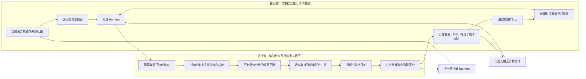
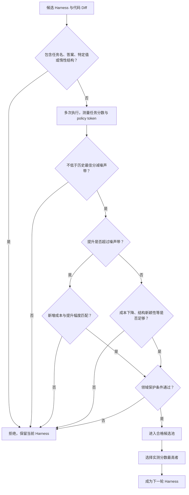

# RRSI：如何防止 Harness 在自我改进中越学越偏

Harness 是包在基础模型外面的整套运行机制：系统提示词、控制循环、工具接口、上下文压缩、记忆、Skill、子 Agent，以及决定何时计划、执行、反思和结束的代码。近年来的 Harness 自改进方法会反复运行任务、观察失败、让 LLM 修改 Harness，再保留分数更高的版本。

这套循环看起来像持续进步，但存在一个很现实的问题：**系统会反复看到同一批演化任务和评分结果，逐渐学会迎合这批题，而不是学到可迁移的 Agent 机制。** 最后在演化集上分数越来越高，换成另一套任务、工具接口或评测器，提升可能缩小、消失，甚至低于最初版本。

RRSI（Regularized Recursive Self-Improvement）解决的就是这个问题。它没有规定 Harness 只能改某几个模块，也不把 Harness 固定成某种工作流；它在“提出候选改动”和“决定改动能否永久留下”这两端增加约束，控制自改进如何使用有限且有噪声的反馈。

一句话概括：

> **RRSI 允许 Harness 继续自由修改，但要求每轮少改、记住过去的成败、避免重复搜索，并让新增复杂度、推理成本和任务特化都付出足够的效果证据。**

## 1. 论文真正解决的不是“怎么改 Harness”，而是“怎么避免改过头”

普通 Harness 演化通常采用以下循环：

1. 当前 Harness 在一批任务上运行；
2. 根据轨迹和失败生成反馈；
3. LLM 提出若干 Harness 修改；
4. 修改后的候选仍在这批任务上评测；
5. 选择分数最高的候选，进入下一轮。

问题出在第 4、5 步反复发生。每轮提出什么候选，已经利用了前几轮在同一批任务上得到的信息；后面的选择仍继续查看这批任务的结果。这不再是“一次训练、一次独立测试”，而是对一个有限题集进行适应性搜索。搜索轮次越多、可修改的代码越自由，系统越有机会碰到只对当前题集有效的改法。

论文把过拟合来源归纳为三类。

### 1.1 针对题目特征写规则

候选修改可能记住任务名、实体名、固定数值、答案形式，或者某个 benchmark 特有的提示结构。这类修改能直接提高当前分数，换任务便失效。

### 1.2 追逐评测噪声

Agent 的执行具有随机性，同一个 Harness 重跑也会产生不同结果。若每轮都挑当前最高分的候选，就可能把一次偶然胜出当成真实提升。一次小误判似乎无害，但连续多轮将这种“幸运版本”变成下一轮起点，会让 Harness 沿着随机波动逐渐偏离。

### 1.3 不断堆积复杂机制

新增检查、反思、记忆、子 Agent、工具和长提示通常可能帮助几道题，但也增加 token、步骤、延迟和新的失败点。只按成功率选版本时，没有动力删除曾经加入、后来不再有用的机制，Harness 会越来越重。

所以 RRSI 关注的不是发现某种特定的优秀 Harness 组件，而是给整个演化过程加上“搜索纪律”：控制一轮能试多少变化、过去失败的假设是否被记住、什么程度的提升可信、增长的成本是否值得，以及无用组件何时应该退出。

## 2. “正则化”在这篇论文里具体是什么意思

在机器学习中，正则化通常用于防止模型用过高复杂度拟合训练数据。RRSI 把这个思想借到代码级 Harness 搜索中，但它并没有真的对 Harness 代码计算传统的 L0、L1、L2 参数范数。

这里的正则化对象是 **Harness 从一个版本走到下一个版本的演化路径**：

- 可编辑空间仍然开放：prompt、控制流、配置、输出处理、上下文管理、工具、Skill、记忆、子 Agent 都可以增删改；
- 每轮怎样使用修改额度受到限制；
- 哪些候选有资格成为长期状态受到限制；
- 已经加入的组件如果长期没有贡献，可以被删除。

论文用 L0、L1/Lasso、L2/Ridge 作直觉类比。面向工程理解，可以直接记成：

| 论文中的类比 | 实际规则 | 它控制什么 |
| --- | --- | --- |
| L0 风格的更新稀疏 | 限制一个候选能打包多少个彼此独立的改动 | 一轮不要同时改太多东西 |
| L2/Ridge 风格的复杂度收缩 | 性能提升越小，允许增加的推理成本越少 | 不让总体资源消耗无理由膨胀 |
| L1/Lasso 风格的结构剪枝 | 最近没有正向贡献的离散组件成为删除目标 | 让长期 Harness 去掉无用结构 |

这些只是功能上的类比，不能把 RRSI 理解成在求解传统正则化公式。论文附录也明确说明：Harness 组件不是共享连续参数向量，这些规则没有优化标准的范数惩罚目标。

## 3. 整体架构：提案侧控制怎么找，选择侧控制什么能留下

RRSI 将一轮演化分成两个阶段。提案侧决定“本轮在哪些方向、以多大改动幅度搜索”；选择侧决定“测得的收益是否足够可信，能不能变成永久 Harness 状态”。

这张图有两个关键点。

第一，RRSI 没有用单一总分把所有要求混在一起。题目泄漏、性能下限、成本规则和领域保护是**不可互相补偿的门槛**。例如一个候选即使省了很多 token，只要性能跌破下限，也不能靠成本优势被救回来。

第二，历史不是只给人看的日志，而是下一轮的搜索输入。它告诉提案者哪些组件试过、测试了什么假设、产生多少分数和成本变化、最后是否被采用；也据此决定是否转向未探索组件或删掉无贡献结构。

## 4. 提案侧的三个约束：每轮怎样产生候选

### 4.1 退火式修改预算：早期可以大胆，后期必须收敛

无约束提案者很容易在一个候选里同时：重写 system prompt、增加验证工具、改变上下文压缩、插入反思步骤。即使总分提高，也不知道是哪项改动有效；候选包含的自由度越多，也越容易刚好适配当前题集。

RRSI 将每个候选拆成可以独立归因的原子修改，并限制一个候选最多打包多少项。预算随轮次逐渐下降：实验中不同领域一开始允许 3 或 4 项，最后都下降到 1 项。

- 早期允许较宽的改动，是因为系统需要发现新的机制；某些能力也确实需要几个协调变化才能启动。
- 后期接近单项修改，使得分数变化更容易归因，降低在已经反复使用的演化集上继续雕琢细节的能力。

“退火”意味着修改能力逐步收紧，而不是每轮都使用同样大的搜索步长。它限制的是每次更新的规模，不是某类组件永远不能改。

### 4.2 证据感知归因：记录失败假设，而不只记录成功版本

每个经过有效评测的原子修改都会记录：

- 修改了哪个组件；
- 想验证什么行为假设；
- 实际源代码 diff；
- 分数怎样变化；
- policy token 成本怎样变化；
- 候选最终是否成为该轮胜者。

候选若包含多项修改，每项暂时共享候选级别的分数与成本变化，所以早期归因仍较粗；随着修改预算下降到 1，单项改动与结果之间的关系变得更清晰。

下一轮提案者会读取全部历史。已被拒绝的机制构成负面证据，已经成功的机制保留明确归因。这样能够减少“换一种说法再次测试同一个失败想法”，也防止后续修改无意覆盖先前真正有效的能力。

需要注意，这种归因仍是经验归因：如果一个候选捆绑三个修改并提高分数，系统并不知道三者各贡献多少。RRSI 通过后期稀疏更新改善这个问题，却不能完全消除组合效应。

### 4.3 结构化探索：搜索停滞时，给未尝试组件留位置

LLM 提案者可能不断重写 prompt，因为 prompt 最容易修改，而工具、记忆或子 Agent 等结构机制长期没被探索。RRSI 查看最近若干轮的进展；如果改进幅度一直落在经验噪声范围内，就认为搜索停滞。

停滞发生时，系统从候选名额中预留少量位置，优先测试尚未出现有效测量记录的组件。论文使用的可编辑组件词表包括：

- prompt；
- control flow；
- config；
- output plumbing；
- context management；
- client tool；
- skill；
- memory；
- subagent。

它不会永久要求“多样性优先”，也不会改变最终可编辑空间。它只是当熟悉方向已经没有可信进展时，阻止搜索把所有预算继续浪费在同一类微调上。

## 5. 选择侧的四个约束：候选如何成为长期状态

候选产生后，并不是简单挑最高分。选择过程按顺序设置了多个门。

### 5.1 泄漏筛查：在评测前拦截题目特化

一个 critic 在完整评测前阅读候选 diff，拒绝显式编码任务名、实体名、任务专用数值、答案或 benchmark 特有逻辑的改动，也拒绝只增加结构却不起作用的惰性机器。

放在评测前很重要。假如先让泄漏候选获得很高分，再在后面拒绝，它的“成功经验”仍可能影响提案者或后续搜索；前置筛查让这种分数根本不进入演化历史。通用的 prompt 改善或工具说明更新仍可接受，筛查针对的是内容的特化程度，不针对某种组件类型。

局限也很明确：critic 本身是 LLM，能发现显式任务名和硬编码规则，不保证识别所有隐蔽的 benchmark 偏好。

### 5.2 噪声校准的性能下限：不能靠连续小退步走下坡

演化开始前，系统对**完全不变的初始 Harness** 重复评测，观察仅由 Agent 随机性和评测过程产生的正常分数波动，据此设定经验噪声带。

系统同时维护整个演化过程中见过的历史最佳分。候选的分数不能低于“历史最佳分减去噪声带”。这个规则允许正常随机波动，却阻止搜索连续接受许多看似只退步一点的版本。

为什么不是只和当前 Harness 比？因为如果每轮允许下降一点点，十轮后可能离曾经的最佳版本很远。锚定历史最佳值可以避免这种渐进退化。

### 5.3 复杂度感知接受：新增推理成本必须有对应收益

RRSI 用每条执行轨迹消耗的 policy token 作为 Harness 总体资源负担的代理。候选相对当前版本有两个变化：任务分数变化和 token 成本比例变化。

如果性能提升明显超过噪声带，系统允许一定基础成本增长，并允许随着提升变大而增加更多成本。直觉上：提升很小的候选只能增加很少开销，提升很大的候选可以“购买”更多推理预算。

如果分数变化还处于噪声区间，就不能把这点小幅上升直接当作证据。系统改用组合条件，看候选是否显著降低成本，或者是否第一次引入此前从未进入成功路径的结构组件。编码任务的实验中，这个区间里的小分数增长本身权重为零，必须靠成本下降或结构新颖性才能获得资格。

这里的新颖性只奖励 client tool、skill、memory、subagent 这类结构组件，而且只奖励“该类型从未出现在此前获胜改动中”。prompt、控制流、配置、输出处理和上下文管理没有这项新颖性奖励。这避免了把所有换一种写法的 prompt 都称为新机制。

### 5.4 结构剪枝：已经加入的机制要持续证明价值

RRSI 会统计每种被实际测试过的组件在最近若干轮中是否产生过严格正向的测量收益。如果一个组件在剪枝窗口内没有正贡献，就把它及此前相关的已接受修改交给提案者，作为后续删除目标。

这不是立即强制删除，而是把删除写入下一轮候选生成方向。它补上了普通演化缺少的逆向动作：很多系统擅长加 prompt、加工具、加记忆，却没有机制主动问“这个东西现在还值得存在吗”。

### 5.5 领域保护：主指标不能掩盖基本执行退化

编码和 Agent 工作区实验没有额外 guard；工程设计实验增加两个硬条件：有效输出率不能明显下降，无提交率不能明显上升。这样即使主要通过率改善，也不能用“更多任务直接崩溃或没提交结果”来换取。

最终只有同时通过性能下限、复杂度规则和领域 guard 的候选进入合格池；在合格池内才选择实测分数最高的版本。如果没有候选合格，就原样保留当前 Harness。

## 6. 一轮 RRSI 实际怎样运行

把前面的机制串起来，一轮演化可以理解为：

1. 用当前 Harness 在演化集上运行，分析轨迹并形成反馈；
2. 根据当前轮次计算修改预算，越到后期允许捆绑的独立修改越少；
3. 读取历史，判断最近是否停滞、哪些组件未探索、哪些组件最近没有正贡献；
4. LLM proposer 在开放代码空间中产生若干候选，每个原子修改标记目标组件和行为假设；
5. critic 先看 diff，删除泄漏、任务特化或惰性候选；
6. 对剩余候选并行运行演化任务，测量得分与 token 成本；
7. 依次应用历史最佳性能下限、复杂度条件和领域 guard；
8. 从合格候选中选择得分最高的版本，否则维持原版本；
9. 将每项修改及测量结果写入历史，更新历史最佳分，进入下一轮。

论文实验中，编码和 Agent 工作区演化 20 轮，工程设计演化 40 轮；每个任务每次评测分别运行 2、2、4 次。噪声阈值、修改预算、停滞窗口、剪枝窗口和成本容忍度只使用演化环境和运行考虑设定，没有用 held-out 或 OOD benchmark 调参。

## 7. 论文案例：为什么“分数提高”仍可能被拒绝

论文给出的候选决策非常能说明 RRSI 的行为。

### 7.1 可复用的完成前验证机制被保留

编码演化第一轮的一个候选加入有上限的完成前核验，并对长任务的非阻塞轮询增加指导。它在演化集上提升约 3.93 个百分点，收益超过噪声阈值，因此较宽的早期改动及其成本获得了足够证据，被保留。

关键并不是“第一轮可以随便改”，而是第一轮预算更宽，仍需通过后面的泄漏、稳定性和成本门。

### 7.2 看起来相似的候选，因为成本不划算被拒绝

另一个第一轮候选也加入验证提醒和长任务指导，分数约提高 1.69 点，却增加 26.1% 推理成本。由于这点提升仍落在噪声带内，不能单靠分数上涨证明真实有效，而成本明显变大，因此被拒绝。

这个例子说明，RRSI 不是看到正增益就接受；“增益是否超出正常波动”决定系统使用哪套成本规则。

### 7.3 更便宜的候选，也不能牺牲历史性能底线

编码第八轮有一个候选把原始任务说明固定到完成 gate 中，帮助模型提交前重新核对字面要求。它降低约 13.6% 成本，看起来很经济，但演化分数下降约 2.81 点，跌破历史最佳分允许的噪声范围，所以被拒绝。

成本下降只是候选的一个优点，不能补偿明显的任务性能倒退。这体现了多个门槛“不可互相补偿”。

### 7.4 小而通用的错误恢复改动可以留下

工程设计任务中，Agent 反复遭遇“工作目录必须已存在”的工具错误。候选加入有上限的恢复提示，属于通用控制流修复，而不是针对某道题的答案。它带来少量通过数提升，token 只增加约 1.6%，因此被接受。

这几个案例共同说明：RRSI 追求的不是最小改动或最低成本本身，而是**收益可信、行为通用、复杂度有依据**的改动。

## 8. 实验结果如何服务技术判断

论文在三个差异较大的领域进行演化和迁移测试：

- 编码：在 Terminal-Bench 2.1 演化，去 SWE-bench Verified 测试；
- Agent 工作区：在 Harvey LAB 的固定任务上演化，去 Harvey 同分布留出集，以及 JobBench、GDPval、APEX-Agents 测试；
- 工程设计：在 EngDesign 演化，去 Frontier-Eng 测试。

每个领域只在指定演化集上提供反馈，Harness 冻结后才进入 held-out/OOD 评测。主实验将基础模型保持冻结，三类任务主要使用 Claude Opus 4.8；论文还单独用 Gemini 做编码演化并检验跨模型迁移。

### 8.1 RRSI 的演化集提升往往更小，迁移反而更好

在 Agent 工作区实验中，几种基线在演化集上都能提高分数，有的方法涨得比 RRSI 更多；到了分布外任务，部分方法几乎回到原始 Harness，甚至低于初始版本。RRSI 在演化集上的提升最小，却把三个 OOD benchmark 的平均分从 39.7 提升到 43.6。

这个结果符合 RRSI 的目标：它主动放弃一部分“只在当前演化集上很好看”的收益，换取更可能跨任务保留的机制。

### 8.2 提案约束和接受约束缺一不可

消融实验显示：拿掉提案侧约束或接受侧约束，演化集分数可能更高，但 OOD 平均分下降，token 成本上升。两侧全部拿掉的普通演化在演化集上达到最高分 92.8，OOD 平均仅 40.3，接近没有演化的 39.7；每次执行却从初始 Harness 的 1.56 百万 policy token 增长到 3.80 百万。完整 RRSI 的 OOD 平均为 43.6，成本为 2.42 百万。

这给工程选型的信号非常明确：候选生成更谨慎并不能代替保守选择，严格选择也不能修复搜索长期只盯着错误方向的问题。

### 8.3 RRSI 变轻了，但仍比原始 Harness 贵

RRSI 比其他演化方法最终产生的 Harness 更省 token，平均步骤也更少；与**没有演化的初始 Harness**相比，它仍更重。也就是说，自改进带来的部分性能提升依然由更高测试时计算购买，只是 RRSI 控制了增长幅度。

### 8.4 有跨模型证据，但不是与模型无关

论文分别用 Claude 和 Gemini 作为冻结 policy 在 Terminal-Bench 上演化，都能迁移到 SWE-bench。还把使用 Gemini 3.5 Flash 演化出的 Harness 原样交给更弱、未参与搜索的 Gemini 3.1 Flash Lite，Terminal-Bench 成功率也有提升。

这说明一部分改动确实是可复用执行机制，而不是只适应某个模型的措辞习惯。但绝对增益受基础模型能力上限影响，论文也没有证明对任意模型家族和任意 Harness 架构都能迁移。

## 9. RRSI 与 ModularRSI、HarnessDev、PG 的关系

这几篇论文都研究 Agent 外部系统如何改进，但处理的是不同问题。

| 方法 | 主要问题 | 改什么 | 控制自改进的核心手段 |
| --- | --- | --- | --- |
| PG | Agent 缺少可复用的过程顺序和下一步指导 | 过程节点、边及边属性 | 局部图指导，基于执行反馈更新图并验证 |
| HarnessDev | 模型能否创建和演化完整 Harness | Harness 工程产物 | 开发、执行、评测和迭代 Harness |
| ModularRSI | 任务结果难以归因到具体机制，整套修改互相干扰 | 五类模块函数及函数库 | 同题成败轨迹对照、跨任务证据、独立模块演化与集成 |
| RRSI | 反复复用有限演化集导致任务特化、噪声追逐和复杂度膨胀 | 开放范围内的任意 Harness 组件 | 修改预算、历史证据、探索、泄漏筛查、噪声/成本门和剪枝 |

ModularRSI 与 RRSI 尤其互补：前者回答“缺陷应归到哪个模块、怎样得到可泛化修改证据”，后者回答“搜索过程怎样避免过度适应同一批反馈、什么修改值得长期保留”。可以用 ModularRSI 的模块化轨迹诊断产生候选，再用 RRSI 的预算、历史、噪声和成本规则管理候选搜索与选择。

但论文没有实际实现或验证这套组合，因此它属于合理的架构推演，不是论文结论。

## 10. 最关键的工程实现细节

### 10.1 原子修改必须能被标记

每项改动至少要有组件类型、行为假设、代码 diff、轮次、得分变化、成本变化和是否进入主线。否则无法执行退火预算、历史归因、未探索组件识别和剪枝。

### 10.2 得分与成本必须来自可重复执行

RRSI 的核心门槛依赖经验噪声带。若环境不稳定、评测器漂移或任务不可复现，测得的波动会把真实退化当作噪声，或者把偶然提升当作机制。部署前应先建立稳定的沙箱、版本锁定和任务级 evaluator。

### 10.3 “历史最佳”与“当前版本”承担不同角色

- 当前版本用于计算本次改动带来的增量收益和增量成本；
- 历史最佳分用于设定不可持续下滑的底线。

只保存当前版本分数会失去防止连续小退步的能力，只保存历史最佳又无法判断某次改动相对当前成本增加多少。

### 10.4 policy token 只是复杂度代理

token 易测、跨 Harness 通用，所以论文选择它衡量资源足迹。真实系统还可能更关心工具费用、外部 API 次数、运行时长、并行资源、失败重试、人工接管或高风险操作。落地时应把复杂度门扩展为业务真正承担的成本，不能只盯 token。

### 10.5 泄漏 critic 与 proposer 不应拥有无限解释权

论文中 proposer、跨轮失败分析者和泄漏 critic 都使用 Claude Opus 4.8。LLM 可以阅读开放代码和语义，却也可能漏检或判断不一致。生产系统应把可确定的规则做成静态检查，例如禁止出现任务 ID、演化集路径和已知答案；LLM 负责难以规则化的语义特化判断。

## 11. 局限与不适用场景

1. **仍然依赖有限演化集。** 正则化降低适应风险，不能创造缺失的任务多样性。演化数据覆盖不足时，系统仍可能学到局部机制。
2. **超参数影响搜索行为。** 噪声带、初始/最终修改预算、停滞窗口、剪枝窗口和成本容忍度都需要设定；过严会错过有用机制，过松会回到普通过拟合搜索。
3. **长期自改进尚未被充分证明。** 实验为 20 或 40 轮，不能直接外推到几百轮持续运行。历史记录也会持续增长，需要压缩、去重和版本治理。
4. **性能下限仍来自同一演化集。** 它能对付随机波动和连续退化，但不能证明一个候选在未知分布上更好。真正的泛化证据来自事后冻结的 held-out/OOD 测试。
5. **开放代码修改带来安全风险。** 论文关心泛化与成本，没有完整覆盖权限扩大、数据外泄、供应链和沙箱逃逸。高风险工具必须由 Harness 演化范围之外的硬边界控制。
6. **适用于可评测、可重跑的 Agent。** 如果任务结果几周后才知道、成功标准强主观、环境不可重现，就很难校准噪声和比较候选。
7. **L0/L1/L2 是类比。** 将这些词当成精确数学保证，会误判论文方法的理论性质；它本质上是一组有明确顺序的工程启发式门禁。

## 12. 对 Agent / Harness 技术选型的启发

如果你已经有 Harness 演化系统，最值得优先加入的不是七套机制全部照搬，而是以下四层治理。

第一层是**演化与评测隔离**。固定一组从不反馈给 proposer 的 held-out/OOD 任务，只用来判断最终迁移。否则无法知道提升来自通用机制还是题集适配。

第二层是**小步修改和完整历史**。每个候选限制独立改动数，记录假设、diff、效果、成本和接受结果。这个基础同时服务归因、避免重复和回滚。

第三层是**不可补偿的接受门**。题目泄漏、严重性能退化、成本失控和基本有效性下降应分别检查，不能用一个加权总分让某项优势遮住另一项风险。

第四层是**让组件有退出机制**。任何新 Skill、Memory、Tool、子 Agent 或长提示都应有贡献窗口；没有持续价值时进入删除评估，而不是永久累积。

适合采用 RRSI 思路的场景：任务能够重复运行并自动评分；Harness 已有较大可编辑空间；演化需要多轮进行；目标是跨任务复用而不只是给固定 benchmark 冲分；测试时成本也是产品指标。

暂时不适合直接做全自动 RRSI 的场景：任务数量很少；评测器不稳定；Harness 还没有版本、回滚和可观测性；一次坏修改会触发不可逆外部操作；团队当前连手工故障分类都没有建立。在这些情况下，应先建设沙箱、轨迹记录、回归集和发布门。

## 13. 一页式结论

**最值得记住的思想：** Harness 自我改进本质上是一场对有限任务反馈的适应性程序搜索。搜索空间越开放、轮次越多，越需要约束“怎样改”和“什么能留下”，而不是只比较下一版分数。

**值得直接借鉴：** 逐轮缩小修改规模；为每个原子改动记录假设与结果；先校准未修改 Harness 的自然波动；用历史最佳值防止连续小退步；让新增 token 和步骤由可信收益买单；在正式评测前检查任务特化；定期审查并删除无贡献组件。

**不要误解：** RRSI 没有限制 Harness 只能改固定模块，也没有通过传统 L0/L1/L2 优化训练一个模型；它把这些正则化思想翻译成代码搜索预算、接受门和剪枝规则。

**采用前必须验证：** 评分是否稳定到足以估计噪声；成本指标是否代表真实部署负担；泄漏 critic 能否识别你的任务特化模式；小步改动是否可以独立回滚；最终收益能否在未参与演化的任务、环境和模型上保留。

这篇论文最深层的观点是：**自改进系统不能只学习怎样获得更高反馈，还必须约束自己怎样使用反馈。** 否则递归循环放大的可能不是能力，而是题目记忆、评测噪声和系统复杂度。
