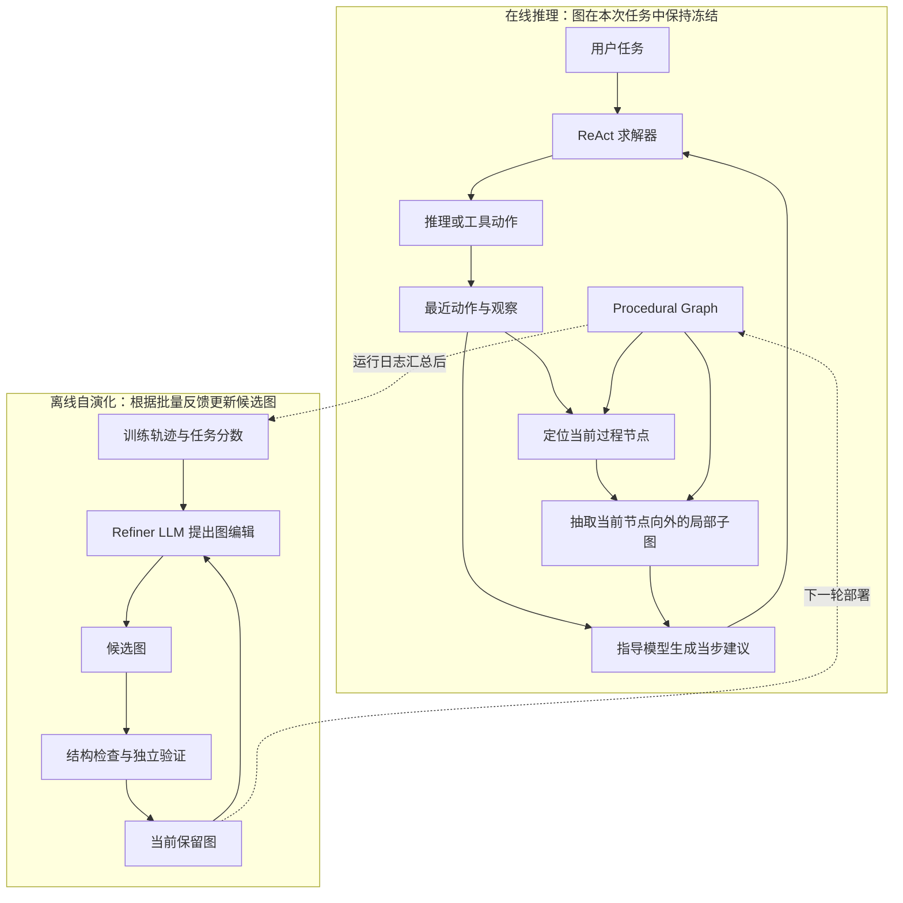
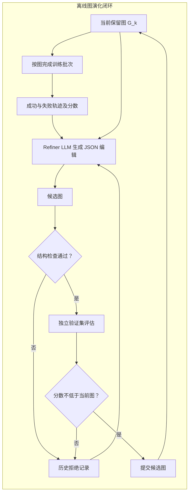

# Procedural Graph：让 Agent 把“下一步该做什么”变成可演化的执行图

> 这篇论文的核心不是训练一个更强的 Agent，也不是让模型自动改权重；它提出了一层放在模型外部的 **Procedural Graph（过程执行图，PG）**。这张图把任务中的可行动作、允许的先后关系、触发条件和常见坑显式保存下来；Agent 每一步从图中读到与当前情境有关的提示，离线再根据成败轨迹修正这张图。

如果把 ReAct Agent 想成一位会临场思考、会用工具的员工，PG 就像一份可以持续迭代的“作业手册”：它不替员工把每一个按钮都按掉，而是告诉他此刻优先检查什么、还缺什么前置条件、哪些动作现在不该做。它的价值在于把经验从长长的对话历史、隐式 prompt 或模型权重中抽出来，变成能检查、能局部检索、能版本化演进的运行结构。

本文面向希望做 Agent 技术选型与工程实现的读者，不展开公式、引用或原始表格；实验数字只保留能解释技术边界的部分。

## 1. 论文究竟要解决什么问题

多数工具型 Agent 的基本循环很简单：接收任务，思考，调用工具，读取结果，再决定下一步。问题是，任务一长、工具一多，这种完全自由的循环会逐渐暴露出四个工程问题。

1. **目标会漂移。** 模型能看见先前历史，却不一定能从大量观察、错误和工具输出里持续抓住真正要完成的用户目标。
2. **顺序很难稳定。** “先查余额，再做现金流预测，最后决定融资”这种依赖关系，如果只藏在 prompt 或几条示例里，模型仍可能跳过检查、提前执行，或在不该结束时继续操作。
3. **失败经验留不住。** 一条成功/失败轨迹可以被塞进 memory，但下一次求解时仍需模型自己从文字中重新归纳规则；经验没有成为一个可以直接约束或引导后续执行的结构。
4. **规则难以维护。** 人工 workflow 虽然清楚，但每加一个工具、发现一个新分支、修一个环境交互细节，都要人工改流程。纯粹自由的 Agent 则缺少可审查的控制面。

论文的判断是：这里缺的不是更多“事实知识”，而是 **过程知识（procedural knowledge）**。事实知识回答“蒙娜丽莎在哪里”；过程知识回答“面对当前状态，下一步应该做什么，为什么，以及先别做什么”。

## 2. 核心对象：一张描述行动关系的图，而不是知识图谱

PG 是一个带属性的有向图。它借用了知识图谱的外形，但把三元组从“实体—关系—实体”换成了“过程—关系—过程”。

| 图中元素 | 在 Agent 中代表什么 | 为什么不能只用一段 prompt |
| --- | --- | --- |
| 节点 | 抽象的工具动作、推理步骤或状态，例如 `check_cash_in_bank`、`cash_flow_forecast`、`End` | 节点把可执行的过程单元命名化，后续能被定位、添加、删除与统计 |
| 有向边 | 从一个过程走到下一个过程的许可关系 | 边明确了“下一步候选”和前后依赖，而不是让模型在全部工具中盲选 |
| 边属性 | `condition`（何时可走）、`guidance`（为什么/怎样走）、`pitfalls`（提前防什么错） | 同一条边的价值不只是连通性，而是可转成当下可用的操作建议 |
| 起点与终点 | 过程开始标记、完成或停止标记 | 让“何时结束”也是图的一部分，减少无意义的继续调用 |

这意味着 PG 不是硬编码的工具调用脚本。节点 `Search → Extract → Check Answer → Output` 只说明这些动作之间的可行过程关系；真正的 Agent 仍由 ReAct 求解器执行，它可以根据任务、观察和提示选择动作。论文称这种方式为 **生成式过程图指导（Generative PG Guidance）**：图提供局部、带上下文的软引导，而不是把下一次工具调用强行锁死。

这个区分很重要：

- 把图当成硬 workflow，优点是可控，代价是分支一多就脆；
- 把图当成自由 Agent 的一段静态长提示，优点是简单，代价是相关规则会被无关规则淹没；
- PG 的目标是保留图的可审查结构，同时让模型在局部过程空间中继续推理。

## 3. 整体系统：在线“读图”与离线“改图”是两条链路

PG 框架把职责分成两部分。在线阶段只读一份已冻结的图，用它辅助当前任务；离线阶段才汇总成败轨迹并提出图修改。这样不会让正在服务用户的 Agent 一边执行一边任意改写控制结构。

这里有一个容易误解的点：论文中的“自演化”主要演化的是外部图结构及边属性，而不是改 Agent 的模型参数，也不是直接重写整套工具 runtime。它是一种 **模型外、可回滚的程序性记忆学习**。

## 4. 在线阶段如何把静态图变成“此刻该做什么”

在线执行由三个连续操作组成：定位（locate）、抽取（extract）、生成（generate）。论文实现里使用最近 3 步的轨迹窗口，并向外取最多 2 跳的有向邻域。

### 4.1 定位：Agent 现在走到图中的哪里

系统会把 Agent 最近一次过程动作与图节点做**精确匹配**。如果刚执行了 `check_cash_in_bank`，就把这个节点视为当前位置；任务刚开始时使用 `Start`；若没有任何节点匹配，则退回使用整张图。

为什么要用当前位置，而不是直接对“任务文本”和所有规则做语义搜索？论文的关键观点是，过程规则的意义来自拓扑上下文。单独搜到“提交申请”这条提示，可能遗漏它必须先经过“核验结果”的前置关系。当前节点把检索锚在已执行的过程上，保留了“从哪里来、接下来能去哪”的关系。

这也是一个明确的工程取舍：精确匹配能让定位简单、稳定、便宜，但要求工具动作/过程节点的命名有稳定映射。当工具接口频繁改名、动作是自由文本，或执行器的粒度与图节点不一致时，匹配会失败，系统就只能回退到全图，成本和噪声都会上升。

### 4.2 抽取：只取局部而不是把整张图塞进上下文

定位到节点后，系统取该节点及其**向外两跳**可达的有向邻域。例如当前刚完成“查余额”，一跳可能是“现金流预测”，两跳可能是“保存备注”和“查看市场”；远处无关的“开户/结算”分支则不会出现。

局部图同时给出三类东西：

- 可走的后继动作；
- 这些动作之间的先后和分支关系；
- 每条转移边上携带的条件、原因与风险提示。

这不是为了让上下文越短越好，而是为了让模型在有限上下文里看到**完成当前决策所需的最小过程闭包**。论文比较了完整图、纯检索式提示和局部图指导：完整图可能带来更高 token 开销，甚至因无关分支干扰使长流程任务明显退化；局部图通常同时改善性能与图提示的规模。需要注意，它仍会额外调用指导模型，所以“总 token 一定低于普通 ReAct”并不成立；在部分任务中，虽然求解器少走了步骤，总 token 仍高于基线。

### 4.3 生成：把边属性翻译成情境化建议

图的属性是静态的，例如一条从“现金流预测”到“融资申请”的边可以记录：

- 条件：预测的资金续航低于安全线；
- 指导：尽早申请，给资金到账预留延迟；
- 坑点：已有申请待处理时不要叠加第二笔申请。

指导 LLM 读取局部图、用户任务和最近轨迹，把这些静态文字转成当前一步的自然语言建议，再附加到 ReAct 求解器的 prompt 中。它输出的不是“必须调用 X”的结构化命令，而更像“下一步先验证结果；避免重复搜索/不要在当前状态提交”的即时工作提示。

因此，职责边界是清晰的：

| 组件 | 它知道什么 | 它做什么 |
| --- | --- | --- |
| PG | 跨任务沉淀的过程关系与风险 | 提供局部的可走路径和程序性经验 |
| 指导 LLM | 局部图 + 当前任务 + 最近轨迹 | 将通用规则解释成此刻能执行的建议 |
| ReAct 求解器 | 完整任务上下文、工具观察、即时建议 | 保持自主推理并真正选工具、执行、结束 |

这种“建议而非强制”的设计解释了 PG 为什么既能限制明显错误，又不会退化成死板流程。代价是：求解器仍可能无视建议，图也不能提供硬安全保证；如果你要的是权限隔离、金额上限、不可逆操作拦截，仍应由工具层/策略层做真正的硬约束，不能交给 PG 提示词。

### 4.4 一个小例子：系统何时应该停止

论文的 BFCL 场景中，用户只是询问某航班报价。无图基线在得到价格后仍继续走认证、卡信息、订票等步骤，最终由于状态不匹配而失败。PG 的局部指导让 Agent 在“获得报价”后认识到任务已满足，正确地输出价格并停止。

这个例子看似简单，却说明 PG 学到的不只是“怎样多调用一个工具”，还包括**动作边界**：哪些步骤是为完成当前目标所必需，哪些是另一个目标（真正订票）才需要的后续流程。对真实业务 Agent 来说，防止“多做一步”往往和防止“漏做一步”同样重要。

## 5. 离线阶段如何让图根据经验演化

图的初始版本可以来自专家先验，也可以极简到只有 `Start → End`。之后系统按轮次演化：用当前保留图完成一批训练任务，收集轨迹和分数，让 Refiner LLM 比较成功与失败的行为，产生 JSON 格式的编辑操作。

可编辑的基本操作是：新增/删除节点，新增/删除边；修改某条边的属性在实现上等同于先删除再新增。Refiner 既可能补一条漏掉的验证路径，也可能删掉造成循环、过早结束或冗余操作的分支。

### 5.1 Refiner 不是随意总结，而是在做受限图编辑

Refiner 的输入不是只看一段失败日志。它会参考当前图、训练轨迹及评分，并被要求输出明确的增删节点/边操作。论文的提示还要求：动作节点要与可用动作列表一致，边的条件写成自然语言前置条件，指导要给出具体动作及理由，坑点要提前说明禁忌；同时要避免把某条单独轨迹的细节硬编码进图。

这一层本质上是把“从经验归纳规则”变成“从经验归纳可审查的图 diff”。相比让模型直接覆盖整份 workflow，diff 有三个实际好处：审阅者能看清本轮到底学了什么；系统能做结构校验；失败候选能记录为反例而不污染主图。

### 5.2 结构检查：先防图坏掉，再谈效果

候选图先经过结构检查。论文明确检查编辑格式和类型、边端点是否存在、是否违反无环要求（需要无环时移除闭环边），以及每个节点是否都能抵达某个终止节点。这一关在模拟之前运行，因此能拦截图根本无法正确执行的修改。

它并不是万能静态验证。尤其要注意：论文的结构验证并没有独立地强制检查动作名一定存在于工具目录；这一点主要由 Refiner prompt 约束。工程上若工具具有高风险或经常变化，最好在结构检查外再加一层由系统代码执行的 action schema / tool registry 校验，不能只信任 LLM 输出。

### 5.3 验证门：候选图必须不比当前图差

通过结构检查的候选图不会立即替换现有图，而是放到独立验证集评估。只有验证表现**持平或提升**，才提交为下一轮的保留图；验证下降则回滚到原图。论文把拒绝候选的编辑、轨迹、验证失败或结构诊断都放进“拒绝记忆”，作为下一轮 Refiner 的反面上下文。

这相当于给自修改系统加入了最基本的版本门禁：

- 主图始终是上一次被接受的版本，不会因一条看似有道理的修改直接被污染；
- 训练集上偶然有效、验证集上变差的规则会被拒绝；
- 下一轮不仅知道“成功该学什么”，也知道“类似改法此前为什么没有通过”。

但不要把这个门误认为严格的统计保证。论文的 EnterpriseArena 每个 split 只使用 20 个 episode，接受/拒绝可能由一两个 episode 的差别决定，作者也说明所展示的演化轨迹应看作过程证据而不是强显著性证明。真实落地时，验证集大小、置信区间、成本指标、风险约束和灰度发布策略都应随业务风险加强。

## 6. 论文展示的“图真的学到了什么”

最直观的案例来自 EnterpriseArena：Agent 在连续月份的经济危机场景中扮演 CFO，需要维护流动性，且融资到账有 1 到 6 个月延迟。这里最有价值的不是单次工具调用成功，而是跨月保留信息、预测风险、提前融资。

演化过程大致出现了四类结构知识。

1. **先建立决策骨架。** 第一轮从几乎空白的图中长出：月初 → 查银行余额 → 现金流预测 → 保存备注 → 查市场信息 → 决定资本动作。它把“先获取哪些证据，后作什么决策”固定为一条可复用主线。
2. **把外部工作记忆接入过程。** 后续轮次在月初后插入 `recall_notes`，使 Agent 能读回上月保存的关键指标。这不是把全部历史塞回 prompt，而是建立“保存—下月取回”的显式过程关系；论文中该变化伴随每月工具调用数从 17.23 降到 3.08，同时验证生存期提升。
3. **删除看似安全却无价值的分支。** 图后来裁掉了 `pass_action`（什么也不做）分支，保留融资和关闭账目的决策路径。过程图的演化因此不只是添加步骤，也包括 pruning。
4. **学会顺应环境的隐式状态转移。** 环境在提交融资后会自动推进月份。图先前仍把“融资申请 → 关闭账目”连在一起，后来改成“融资申请 → End”，让 Agent 在新月份重新评估，而不是立刻执行一个已经不适合当前状态的动作。

这四种变化一起说明：PG 适合沉淀的不是“工具 A 的说明书”，而是**有状态任务的时序、记忆读写、决策前提和终止边界**。

## 7. 实验结果应怎样用于工程判断

论文在问答、约束编辑、Web/工具任务、家庭环境和企业经营等七类 benchmark 上评估，使用多种底座 LLM。总体上，PG 在 24 组“模型 × benchmark”比较中有 21 组第一或并列第一；它的提升不集中在单一模型上。

真正值得用于选型的信号有四个。

### 7.1 对长时序、状态依赖任务更有吸引力

EnterpriseArena 中，基线在若干模型配置下的有效生存月数明显低于 PG；例如某一配置从 6 个月提高到 34 个月。其含义不是“PG 天然会做财务”，而是过程图能够把“提前融资、保存状态、下月回忆、避免重复无效查询”这些跨步策略保留下来。

如果你的 Agent 是一次性查询/摘要，结构化过程层可能收益有限；如果它会经历多步工具交互、状态会变化、错误通常来自顺序或结束条件，PG 的适配度更高。

### 7.2 专家先验不是越多越好，演化与门禁才是关键

在 HotpotQA 上，从极简图开始再在线演化得到的答案 F1 是 78.79，优于无 PG 的 71.21；在 MultiChallenge 上，专家图加在线演化达到 92.86。更重要的是，论文故意展示了一个反例：一张有缺陷的人工专家图能把 MultiChallenge 从基线 87.50 拉低到 58.93，一次静态更新甚至更低；持续在线演化并经验证门筛选后才恢复到 92.86。

工程含义是：不要把“画出一张流程图”误当作方案完成。初始图只是假设，质量要靠执行反馈、独立验证和可回滚的迭代来证明。错误流程图比没有流程图更危险，因为它会系统性放大错误偏好。

### 7.3 更少步骤不必然等于更低成本，更多步骤也未必是浪费

在部分任务中，PG 使求解器少走工具步骤；在另一些任务中，工具调用数量反而增加但结果更好。论文据此强调，关键是**调用的质量和时机**，不是单纯压低工具调用次数。

同时，指导 LLM 本身有 token 成本。局部图比全图更省，但总成本可能仍高于无图 ReAct。实际评估应同时记录：成功率、失败类型、步骤数、工具费用、LLM token、延迟和不可逆操作次数，而不是只看一个成功率指标。

### 7.4 图的局部性是效果与成本共同的来源

论文显示，把完整图交给指导模型会令某些任务受到无关路径干扰；反而以活动节点为锚点的局部图取得更好的结果，并显著降低相对全图提示的图 token。可把这理解成过程版的“上下文选择”：不是存得越多越好，而是要让当前决策只看真正相关、且保持依赖关系的规则。

## 8. 与常见 Agent 方案相比，它增加了哪一层能力

| 方案 | 主要承载物 | 擅长什么 | 关键短板 | PG 如何补位 |
| --- | --- | --- | --- |
| 纯 ReAct | 当前 prompt 与轨迹 | 灵活处理新任务 | 长轨迹中顺序、目标和停止条件易漂移 | 在每步补上局部过程提示 |
| 长期 Memory / 轨迹库 | 自由文本经验 | 保存发生过什么 | 每次仍要模型从文本重新提炼规则；难显式校验顺序 | 将可复用“应该怎样做”抽成节点、边和属性 |
| RAG 检索 SOP | 相似文本片段 | 快速复用文档 | 片段可能失去前后依赖；相似不等于当前可执行 | 沿当前节点取有向邻域，保留过程关系 |
| 人工 workflow / 状态机 | 固定规则图 | 可控、可审计 | 覆盖率不足时需要人工频繁维护，过严会僵化 | 将图作为软引导，并由反馈提出受限 diff |
| 直接微调 | 模型权重 | 把模式内化 | 成本高、难解释、难即时回滚 | 不动权重，图的版本可读、可改、可回退 |

因此，PG 更像 Agent 架构里的“过程控制知识层”。它不能取代工具路由、权限系统、任务规划器或记忆系统：它依赖稳定的动作接口，也可以利用记忆节点完成跨轮保存/读取。最自然的组合是：底层工具层负责硬权限与真实执行；ReAct/Planner 负责解题；PG 负责把经过验证的过程偏好以局部、可演化的方式递送给求解器。

## 9. 落地时最应该复用的实现原则

若要把论文思路变为工程方案，建议先复用以下原则，而不是照搬 benchmark 的图节点名称。

### 9.1 先定义稳定的“过程动作”词表

PG 的定位依赖动作与节点匹配。因此要先决定图节点的粒度：是原始工具名、封装后的业务动作，还是高层 reasoning state。实践中更推荐用**稳定的业务动作层**，例如 `核验订单状态` 而非某个 SDK 的具体函数名；底层工具换版本时，只更新适配器映射，而不是让全部历史图失效。

每个动作最好有唯一 ID、输入/输出 schema、可否重复、幂等性、权限等级和失败类型。论文只把“存在合法终点、端点有效、是否有环”等作为结构保障；生产系统应把 action schema 校验提升为硬规则。

### 9.2 给边写“可执行的条件与反例”，不要只写空标签

一条只标注 `next` 的边无法提供足够决策价值。应优先记录三种会改变行为的信息：

- 到底满足什么状态才能走这条边；
- 此时做它如何服务任务目标；
- 常见误用是什么，例如“尚未核验不得提交”“已有异步请求时不要重复发起”。

它们要写成能被指导模型转述为当步建议的语言，而不是需求文档式的大段背景。

### 9.3 将在线引导与硬防线分开

PG 适合指导检查、排序、分支和结束；权限校验、PII 外泄、资金转移、删除数据、跨租户访问等风险必须由确定性的 policy/tool gateway 拦截。原因很简单：论文的 guidance 最终仍以语言注入 ReAct prompt，不能保证每次都被遵从。

### 9.4 对版本做真正的评估与回滚

至少保留 `图版本 → 编辑 diff → 训练轨迹摘要 → 验证指标 → 接受/拒绝原因` 的链路。验证门不应只比较平均成功率，还应按业务加入：严重失败率、预算、延迟、人工接管率、合规违例率。高风险图修改可先 shadow 运行或小流量灰度，再正式提交。

### 9.5 控制上下文预算并监控回退率

为每个节点设定有限跳数、轨迹窗口和图 token 预算；记录精确匹配成功率、全图回退率、指导采纳后的效果和额外延迟。若大量回退到全图，通常不是简单“增大上下文”能解决，而是动作映射、节点粒度或图覆盖范围出了问题。

## 10. 这篇论文没有解决什么：技术边界与风险

1. **匹配脆弱性。** 在线定位用最近过程动作精确匹配节点。开放式动作、动态工具名或多 Agent 互相插入步骤时，图锚点可能不稳定。
2. **图质量仍受 LLM 归纳能力限制。** Refiner 能提出合理 diff，不代表它理解真实因果。小训练批次或偏置轨迹可能生成局部最优规则。
3. **验证门可能有统计噪声。** “不低于当前分数就接受”很适合构成基本回滚线，但小验证集上的持平/提升未必是可靠改善；论文自身的长时序案例也提醒了这一点。
4. **过程图会产生维护成本。** 新工具、工具语义变化、业务状态变化，都需要更新节点映射、schema 和初始结构。PG 将隐性维护显性化，并没有让维护消失。
5. **指导成本不可忽略。** 每一步都生成 guidance 可能增加 token 与延迟。论文也把跨步骤复用指导、只在必要时生成指导列为后续方向。
6. **不是完整的自修改 Agent Harness。** 它只演化过程知识图，不自动修改沙箱、工具权限、记忆后端、执行调度器或求解器代码。若目标是“整个 agent harness 自进化”，PG 可以是其中的流程知识模块，但不是完整答案。

## 11. 什么时候应该选它，什么时候不必引入它

**适合优先试验 PG 的场景：**

- 任务有明确但会逐步扩展的操作链，例如客服工单、排障、合规审核、企业运营、研究/检索工作流；
- 失败常来自漏前置检查、重复动作、错误分支或不恰当的结束；
- 希望把专家经验和线上反馈转成可审查资产，而不是只积累聊天记录；
- 可以建立稳定的业务动作层，并拥有训练/验证样本或可靠仿真环境。

**暂不值得优先引入的场景：**

- 任务绝大多数是一两步的单工具问答；
- 工具接口与动作语义变化极快，尚没有可稳定映射的中间动作层；
- 没有可衡量的成功标准或独立验证环境，此时“自演化”容易变成无依据地改图；
- 真正问题是权限、数据隔离或事务一致性，应先建设硬执行与安全基础设施。

## 12. 用一句话记住这篇论文

**Procedural Graph 把 Agent 从执行轨迹中学到的“下一步怎么做、何时不该做、何时应该结束”，沉淀为一张可局部读取、可验证提交、可回滚演化的过程图；它用软引导增强自由 Agent，而不是用死流程取代 Agent。**

从工程视角看，最值得带走的并不是“必须用图”，而是这条设计链：把高价值过程经验变成显式结构 → 在当前状态只取相关局部 → 由模型解释为即时建议 → 用独立验证和拒绝记忆管理修改。只要你的 Agent 有多步状态、会反复犯过程性错误，这条链就比单纯加长 prompt 或堆更多历史轨迹更值得尝试。
