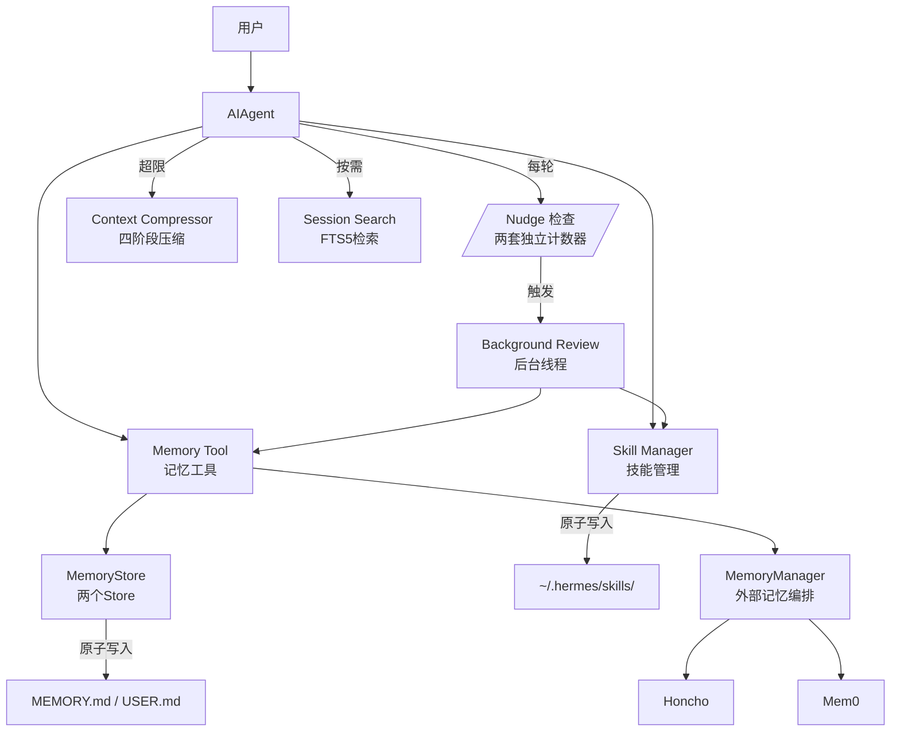
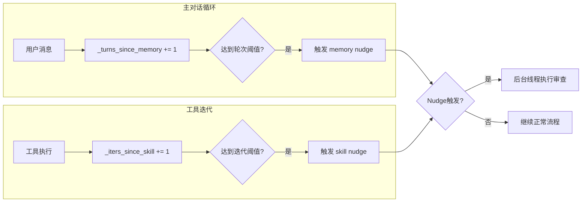
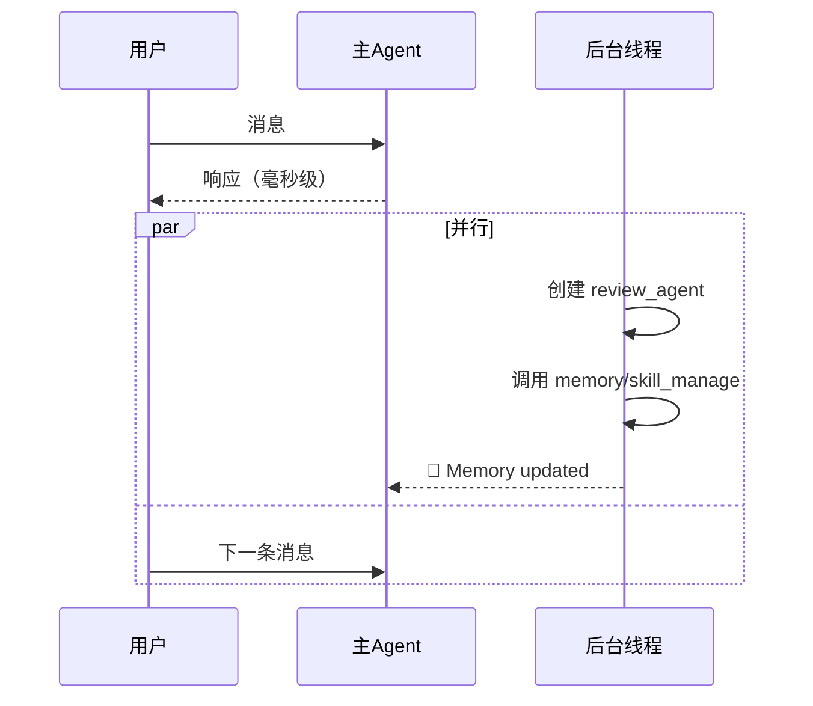
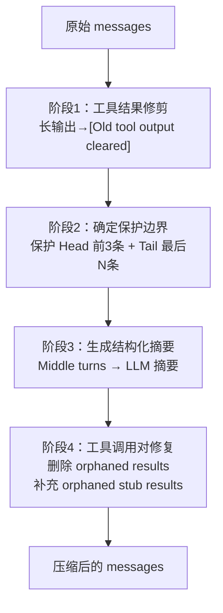

# 自我改进循环

> Hermes Agent 区别于其他 Agent 的核心能力：**内置学习闭环，越用越聪明**

## 一、解决什么问题

大多数 AI Agent 是"无状态"的——每次对话独立，Agent 不知道你上周做了什么、偏好什么。Hermes 通过一套多子系统协作的机制，让 Agent 随时间积累经验。

## 二、四大存储层次

```
容量：小 → 大
──────────────────────────────────────
MEMORY.md（2,200字符）  → USER.md（1,375字符）  →  Skills/（无限制）  →  state.db（无限）
     │                        │                      │                      │
 声明性知识               声明性知识             程序性知识            历史记录
 环境事实/所学教训        用户画像/偏好          步骤/工作流           完整会话
 会话开始时注入           会话开始时注入         slash命令触发         FTS5检索
──────────────────────────────────────
热：始终可用            温：按需加载            冷：可检索
```

| 存储 | 内容 | 容量 | 谁写 | 怎么用 |
|------|------|------|------|--------|
| MEMORY.md | 环境事实、项目约定、所学教训 | 2,200字符 | LLM主动写入 | 会话开始时注入系统提示 |
| USER.md | 用户偏好、沟通风格 | 1,375字符 | LLM主动写入 | 会话开始时注入系统提示 |
| Skills/ | 任务步骤、最佳实践 | 无限制 | LLM主动创建/更新 | slash命令触发 |
| state.db | 所有历史会话原文 | 无限 | 自动记录 | FTS5全文检索 |

## 三、组件全景



## 四、Memory Tool — 持久化记忆

### 两个 Store 的分工

```
memory store（2,200字符）
└── Agent的工作笔记：环境事实、项目约定、所学教训

user store（1,375字符）
└── 用户画像：姓名、偏好、沟通风格、时区
```

### 原子写入：防止崩溃损坏

**问题：** `open("w")` 会先截断文件为0字节，写入中途读文件会读到空内容。

**解决：** 临时文件 + `os.replace()` 原子替换。
```
1. 写临时文件（.mem_xxx.tmp）
2. fsync 强制刷盘
3. os.replace() 原子替换目标文件
```
读者要么看到旧文件完整内容，要么看到新文件完整内容，绝不可能看到截断状态。

### 文件锁：防止并发冲突

```python
# 单独的 .lock 文件，不锁主文件（否则原子replace失效）
with _file_lock(lock_path):
    entries = _reload_target()   # 重新读（处理并发写入）
    entries.append(content)       # 修改
    _write_file(path, entries)   # 原子写入
```

### 冻结快照：保护前缀缓存

会话期间，系统提示中的 memory 内容**固定不变**，即使工具调用写入了新条目。只有下一会话重新 `load_from_disk()` 时才更新。

**为什么这样做：** 防止 prefix cache 失效。如果实时更新，每次 memory 写入都会让 Anthropic cache breakpoint / OpenAI cached tokens 全部重新计算。

### 安全扫描

memory 内容注入系统提示前，检测提示注入、凭证泄露、持久化攻击等恶意模式，直接拒绝写入。

## 五、Skill Manager — 程序性知识自创建

### 记忆 vs 技能

| | 记忆（MEMORY/USER） | 技能（Skills） |
|--|--|--|
| 性质 | 声明性（X是什么） | 程序性（怎么做X） |
| 格式 | 事实片段，1-3句 | 步骤+命令+验证方法 |
| 容量 | 硬性上限 | 无限制 |
| 粒度 | 原子事实 | 完整工作流 |

### 六种操作

| 操作 | 用途 | 说明 |
|------|------|------|
| create | 从零创建 | 需要完整 SKILL.md |
| patch | 定向修改 | **首选**，只传变化片段，最省 token |
| edit | 整体重写 | 需要完整内容 |
| delete | 删除 | — |
| write_file | 添加参考文件 | references/ 下的文件 |
| remove_file | 删除参考文件 | — |

### Fuzzy Match

LLM 提供的 `old_string` 和文件中实际文本可能有细微差异（空格、缩进）。模糊匹配引擎自动处理这些差异。

### 技能修改后缓存清除

技能被修改时，自动清除 AIAgent 的技能系统提示缓存，强制重建。

## 六、Background Review — Nudge 主动触发

### 两套独立计数器

```python
_memory_nudge_interval = 10   # 每10个用户轮次触发memory审查
_turns_since_memory = 0

_skill_nudge_interval = 10    # 每10次工具迭代触发skill审查
_iters_since_skill = 0
```

**分开的原因：** Memory 的沉淀和"用户透露了什么"相关（按轮次），Skill 的沉淀和"任务多复杂"相关（按工具调用次数）。

### 触发时机



### 后台线程执行



- 用户无需等待，审查在后台静默执行
- review_agent 和主 agent 共享同一个 MemoryStore
- 审查 agent 关闭递归 Nudge，防止无限循环

## 七、Context Compressor — 对话压缩

### 触发条件

上下文超过模型限制的 50% 时自动触发。

### 四阶段压缩



### Token 预算 Tail 保护

大上下文模型（200K）可以保护更多内容，小上下文（8K）只保护最关键的。从后向前按 token 预算累加，自适应保护。

### 迭代式摘要

压缩会保留 `_previous_summary`，新摘要被要求**增量更新**：保留仍相关的信息，添加新进展，移除过时内容。

## 八、关键设计哲学

1. **两套状态**：实时写入（持久化）和冻结快照（注入系统提示）分离，各司其职
2. **原子写入优先**：不用锁住主文件，用临时文件+replace 保证并发安全
3. **容量硬限制**：2,200/1,375 字符上限强制精选，防止记忆堆积失效
4. **patch 优于 edit**：工具调用的 token 预算有限，变化片段远小于完整内容
5. **后台不阻塞**：审查线程静默执行，不浪费用户等待时间
6. **FTS5 而非向量检索**：精确关键词匹配 + 无需额外服务

## 九、与 RAG 的本质区别

| | 传统 RAG | Hermes 自我改进循环 |
|--|--|--|
| 知识形态 | 原始文档碎片 | 提炼后的 wiki + 技能 |
| 积累方式 | 每次查询重新检索 | 持久沉淀，会话间累加 |
| 维护者 | 人类 | **LLM 主动维护** |
| 响应速度 | 检索 + 生成，有延迟 | 就在系统提示里，即时 |
| 维护成本 | 需要人类整理文档 | **完全自动化** |

> **核心：让 LLM 既是大模型的使用者，也是它自己知识库的维护者。**
